# 美术风格与 Shader 对比

[历史全部流水](HISTORY.md) · [唯一流程图](ROADMAP.md) · [项目介绍](README.md)

<a id="demo-town"></a>
## 第一个 Demo 小镇 · 修正后实渲，退出问题待修

16栋房屋、10位居民、39类／145处独立道具；市场、工坊院落、旅店桌椅、货运区与灯具已经摆放。ProtonScatter负责116树、66,000草、28组岩石、8倒木，Terrain3D和Road Generator沿用连续坡地及道路。只按用户确认的第一层市场街/托尔巴纳参考设计，不宣称复刻原著精确地图；道具呈现不等于新增居民能力。

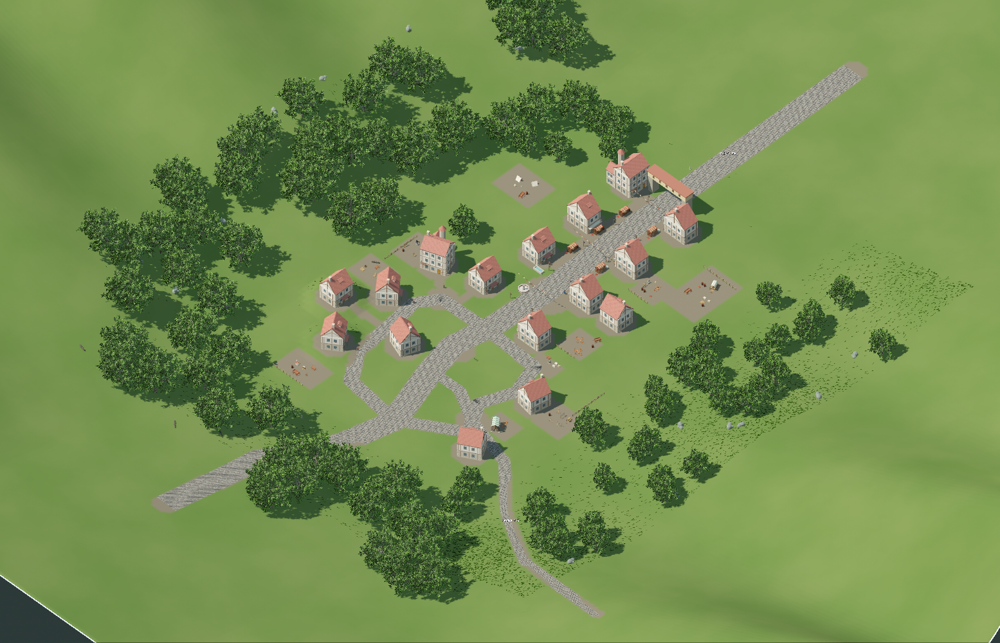

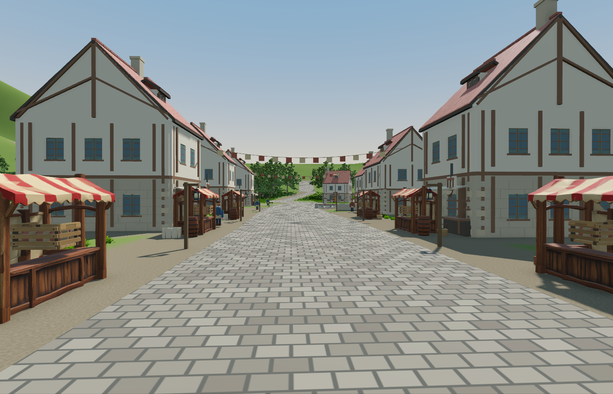

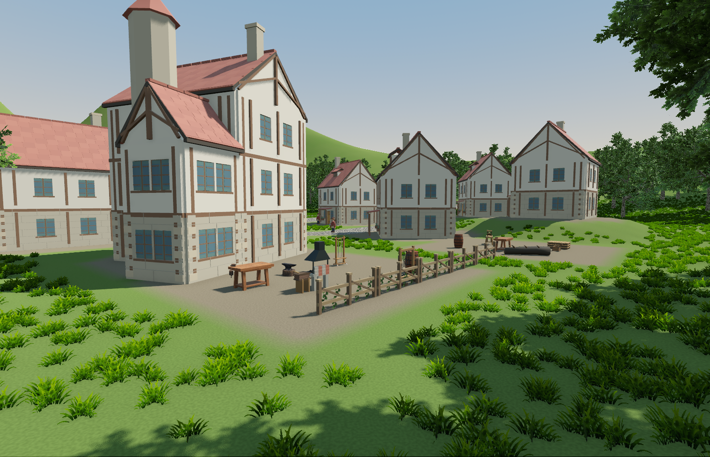

v2已修正旧LOD顶点色、摊位朝向、手推车源轴向、烘焙院落位置与铺地。复查40/40路线、30/30实走、64/64门窗通过，实例中心没有进入道路/住宅排除区。新增4个Meshy首轮模型实际120积分，按12元/1100积分约1.31元，无重抽；原始模型已归档 `Art/SourceModels/20260916/floor1-demo-props-20260916-v1`。

**已知问题随成果交接：** 检查完成后Godot退出仍报RendererScene资源释放错误；提前清理子节点也未修复。v1市场均值181.85ms，v2为15.94ms、P95 19.78ms；后台UE4显卡负载未控制，不能把任一短采样当作整图性能承诺。用户要求此状态先上传，回家继续诊断。完整日志、13张最新截图、通行及放置报告在 `Art/Generated/PCG20260916/demo-v2`，原v1保留。

运行 `StartDemo.cmd`；回家先 `git lfs pull`，需要Godot 4.7.2 .NET、Python和.NET 8 SDK。缺少本机原档会创建新离线预览，原世界历史仍只在私有存档；可用 `--save` 指定自行带回的原档。V总览、WASD移动、E门、F窗；居民暂停，无API费用。完整接续说明见HISTORY的H99。近景材质、草簇重复、地面细节和整体美术密度仍可继续打磨。

<a id="native-pcg"></a>
## SimpleGrassTextured + EZ-Tree · PCG 首版 2026-09-16

按用户最新方向增加PBR表现：恢复EZ-Tree原树皮贴图／法线／粗糙度与叶片自然受光，不采用上一节之前的平面色块版本。使用 [SimpleGrassTextured 2.1.0](https://github.com/IcterusGames/SimpleGrassTextured) 原交叉面、CC0草贴图、风动材质及风场单例；由ProtonScatter的原生修改器在既有坡地布点并分块MultiMesh渲染。Terrain3D和Road Generator继续负责地形显示与道路网格。此处是原生活街区的独立PCG试验入口，正式存档未改。

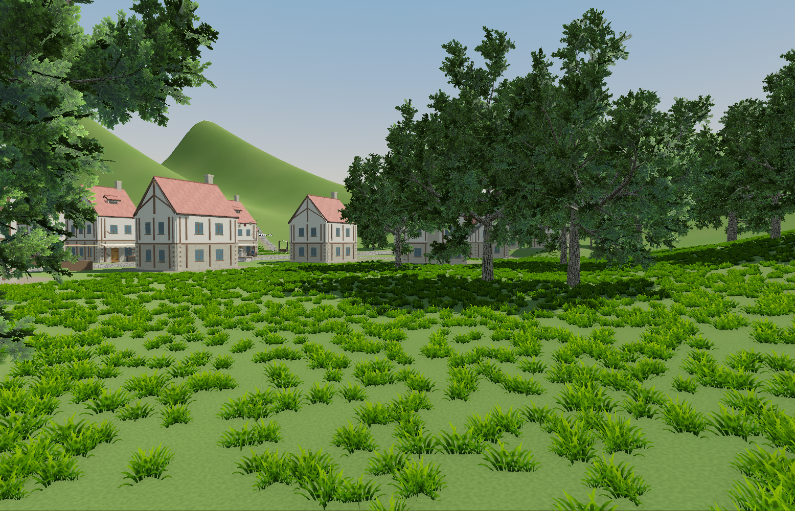

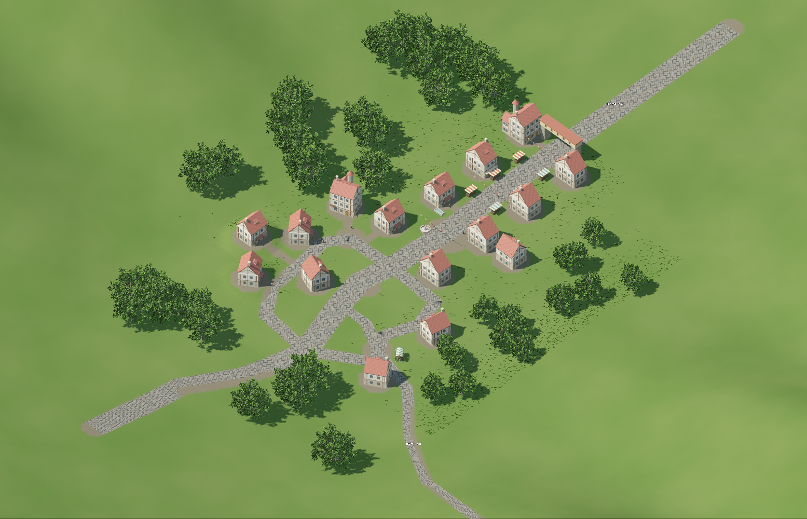

首版50棵树、24,100丛草、180段道路，随机种子及逐实例坐标写入同目录 `pcg.json`；地形投影高度0—5.02米。40条公共地点路线和64项门窗检查通过，草不加碰撞，树干有碰撞。市场固定镜头短采样均值15.84ms／P95 18.23ms；未证明大规模森林性能，也未重做居民30段实走。原导航边缘合并警告仍有2处，不能把本次路线检查等同全图无问题。

我的判断：现成插件组合可行，这版已能看布点、坡面与光影关系；草色偏亮、草簇重复、裸地与远景还单薄，尚不是最终美术。只有草和树，花卉／灌木和踩踏交互尚未加入；轻微草木风动保留。另有6丛草在东侧弯道进入70cm预留空带，已向用户询问是否严格清空，暂不继续修饰首版。

交互查看：在仓库目录运行 `python tools/play_pcg_trial.py`；每次复制试验档，保持居民暂停，V切换高空视角。代码入口 `game/experiments/pcg/native_trial.tscn`，生成模板 `prepare_native_assets.gd`，规则 `native_quarter.gd`；完整来源与许可证记录在 `experiments/pcg-trial/plugins.json`。本轮新增付费API为0。

<a id="ez-tree-stylized"></a>
## EZ-Tree 二次元方向 · 2026-09-16

用户要求进一步二次元化。保留同一宽冠树的全部枝干顶点／索引以及相同灯光、机位，接入现成 [FaRu85/Godot-Foliage](https://github.com/FaRu85/Godot-Foliage)（代码MIT，附带叶簇贴图在原LICENSE明确为CC0）。原EZ-Tree插件不改；单独增加材质与叶片布局适配。

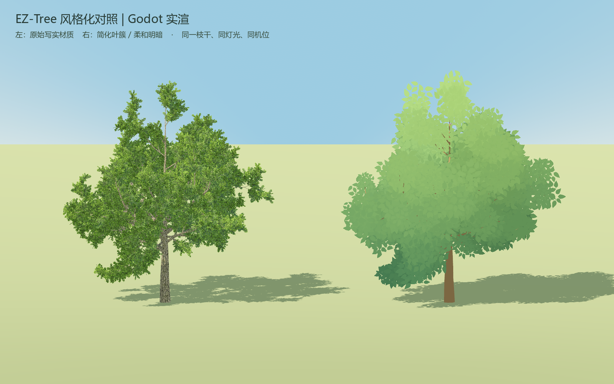

左侧原版24,352三角面，右侧候选6,964三角面。树皮改为哑光色块；叶簇保留每四个原始叶中心中的一个，转换为匹配现成着色器的朝向相机面片，保持叶形轮廓并扩大叶簇，颜色统一为冷绿阴面／浅绿亮面，降低高频细节。没有再次调用Meshy、没有修改整张截图或生成概念效果图。三角面变少不等于已经证明森林性能改善，透明覆盖与阴影成本仍待实测。

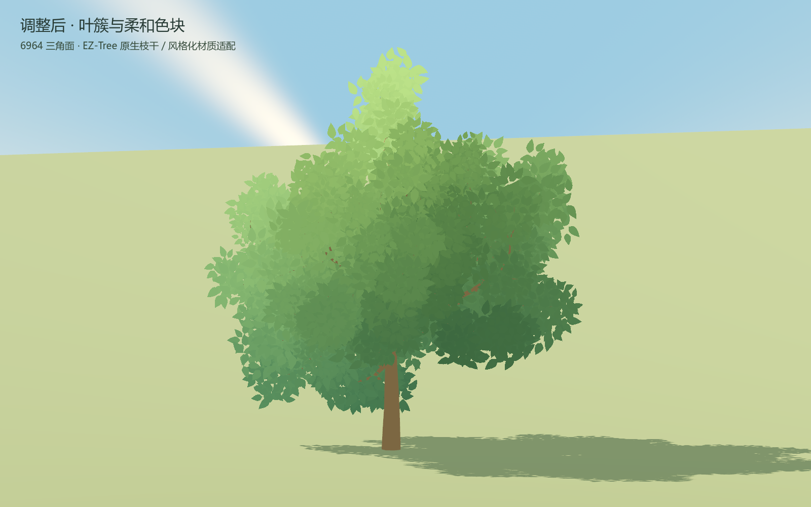

目前更接近简洁插画／动画背景色块，近景仍有重复面片感。该候选关闭了叶片接收阴影以避免弯曲法线和叶片自阴影条纹，仍投射地面阴影；融入小镇灯光及邻近物体阴影尚未完成。对照截图暂停风动以避免干扰，交互演示保留风动参数。Vulkan实渲、侧视角、枝干几何一致断言及进程清理通过，原版图片保留；早期v1/v2仅为调试过程，当前评判看v3。

打开 `experiments/ez-tree-trial/project.godot` 默认进入本对照。1看两树、2看原版、3看新候选，左键拖动单棵旋转；原始三树试验仍可单独运行 `trial.tscn`。代码／许可／参数见 `stylized/provenance.json`，截图与快照场景见 `Art/Generated/EZTree20260916/stylized-v3`。当前未投放正式小镇。

<a id="ez-tree-trial"></a>
## EZ-Tree For Godot · 2026-09-16 试用

独立试验项目：`experiments/ez-tree-trial/project.godot`。使用 [EZ-Tree For Godot 0.2.0](https://store.godotengine.org/asset/leomclaughlin4/ez-tree-godot-port/)，原插件生成器／贴图／风动材质保持；代码MIT，作者标记实验版。按1看总览，2／3／4看单棵，按住鼠标左键旋转。

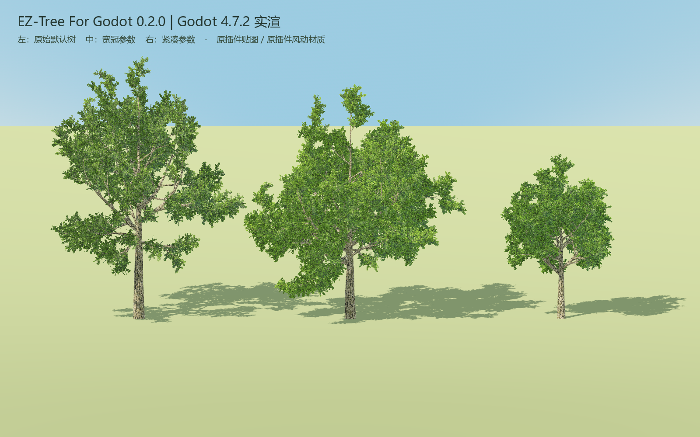

左为原始默认（13,806三角面），中为宽冠参数（24,352），右为紧凑参数（20,140）。Godot 4.7.2 Vulkan实际运行，未修改树叶拓扑或使用AI合成效果图。

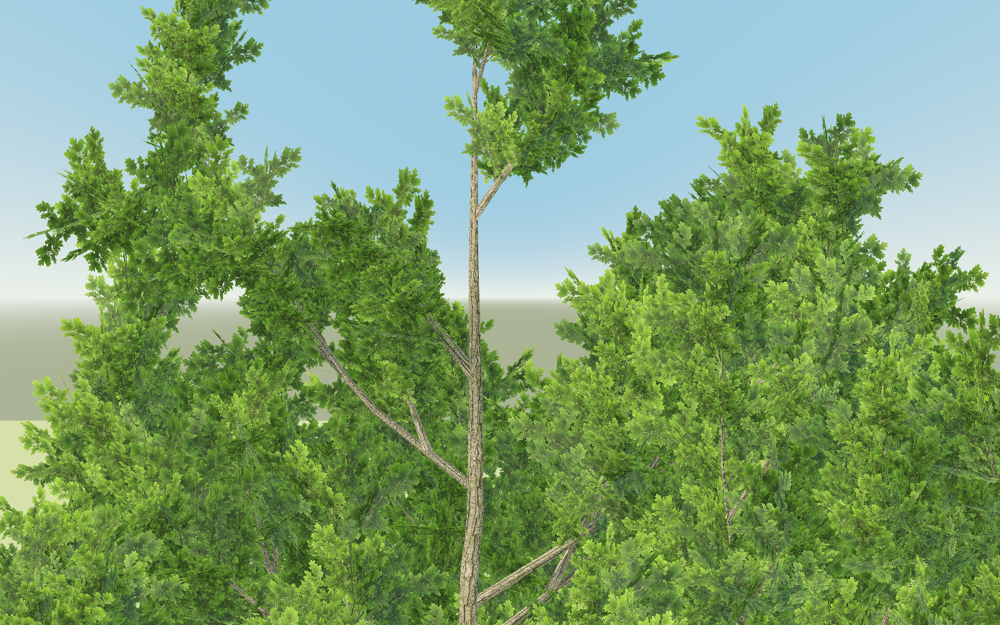

判断：结构和参数控制值得继续试用，默认贴图偏写实、叶片细节密集，尚不符合最终二次元美术。后续应先比较叶簇贴图与柔和明暗，再按第一层参考决定是否采用。当前仅三个独立树形样本，没有接入原居民地图或证明大范围PCG性能；本轮付费生成0。其他截图、参数场景与统计见 `Art/Generated/EZTree20260916`。

## 已有参考方向

**2026-09-16本轮范围：仅第一层，已接入原十居民世界。** 用户确认托尔巴纳高视角、起始之城市场街参考，并允许重排坐标与住所。其他楼层全部排除。本次完成一个生活街区及周边，整城与野外道路预留；相机为45°俯视，图片显示整个住宅街区，周边地形延伸在画面外。

<a id="living-quarter"></a>
## 原世界生活街区 · 实机与参考

正式存档仍为 `shared:mvp-test-20260914`、生活事件seq129，原十人和全部非空间历史／财物保留。16栋新模块房替换旧市场整块模型，10栋是一人一处真实室内住所，6栋作为街区建筑补充。8种首轮Meshy独立组件已实际替换方块家具，本次没有付费生成；家具仍是美术与碰撞模块，没有凭空授予烹饪、生产或行医能力。


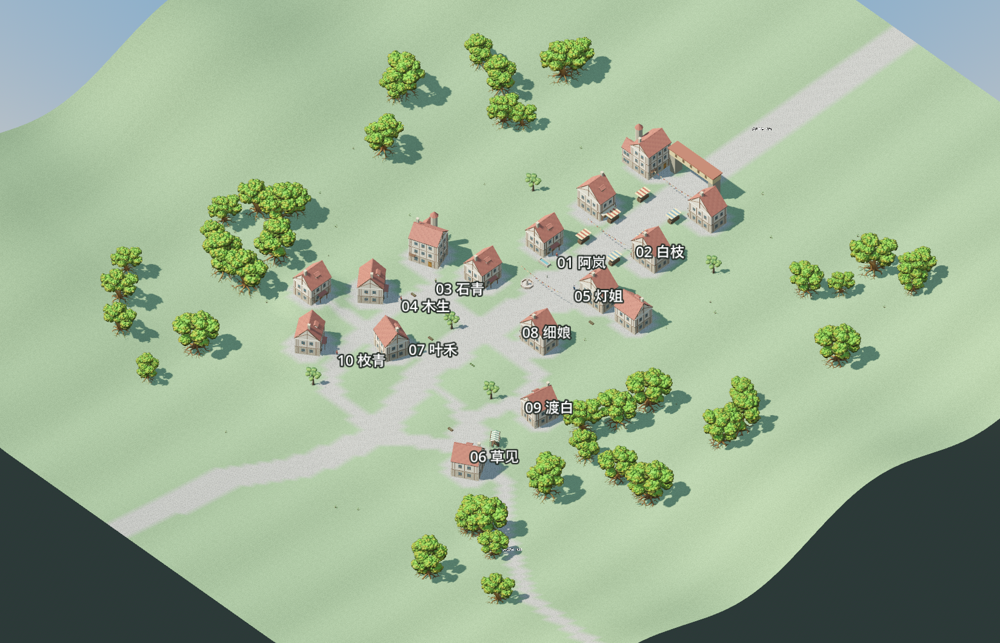

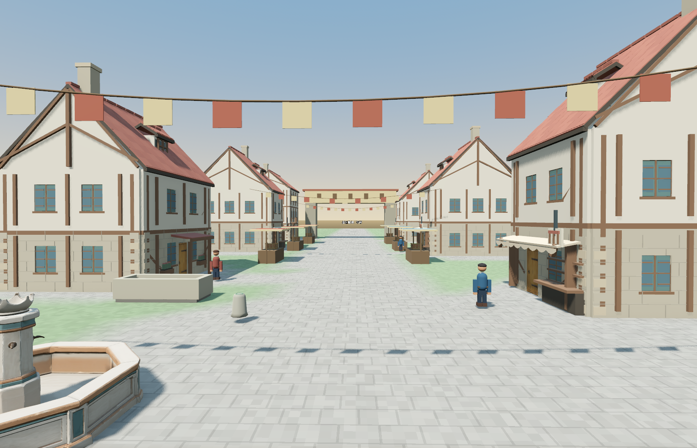

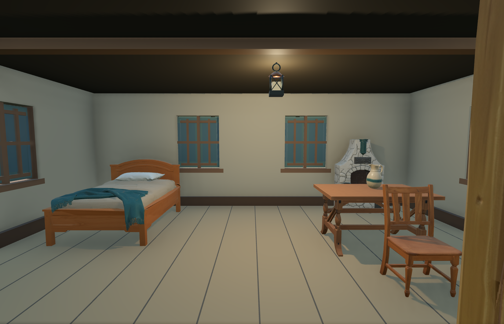

对照使用用户确认的两张第一层图。起始之城参考用于市场两侧房屋、摊位、横跨街面的连接及街道纵深；托尔巴纳用于高视角观察地形和城镇聚落，属于另一座城。这些是局部场景参考，不能拼成原著的精确整城或整层测绘图。当前街区与宅地布局由项目设计；还没有构建整城城墙、黑铁宫或整层迷宫体系。[起始之城剧情／场景索引](https://swordartonline.fandom.com/wiki/Town_of_Beginnings)列出小说第1卷第3章与动画第1集；[托尔巴纳索引](https://swordartonline.fandom.com/wiki/Tolbana)对应Progressive第1卷《无星夜的咏叹调》和动画第2集。


### 十人身份、实际能力与原著依据

这十个人由项目创建，未绑定原著、动画或游戏中的具体同名角色。下表把“第一层存在相近生活元素”与“当前居民已经具备某种职业”分开说明。原著章节位置来自带参考文献的剧情索引，本轮没有逐页核对小说原文；查不到明确第一层职业依据的项目保留为原创设定。

| 图号／居民 | 当前实际角色 | 第一层依据与边界 | 当前位置 x,z |
|---|---|---|---|
| 01 阿岚 | 关注取水；无取水职业技能 | 托尔巴纳有公共喷泉，见《无星夜的咏叹调》Part 4的[索引](https://swordartonline.fandom.com/wiki/Tolbana)；不能据此把阿岚认作原著井务员。 | -7, 4 |
| 02 白枝 | 想学烘焙；还不会生产面包 | [《The Next Day》Part 4](https://swordartonline.fandom.com/wiki/The_Next_Day)有第一层任务奖励黑面包／奶油；白枝及其烘焙兴趣为原创。 | 6, -15 |
| 03 石青 | 已实现修理金属刃部 `metal_repair` | [第8卷《The First Day》的霍伦卡索引](https://swordartonline.fandom.com/wiki/Horunka)有武器商店；未核实第一层存在与石青完全对应的具名铁匠。 | -24, 36 |
| 04 木生 | 已实现修理木柄 `wood_repair` | 未核实第一层具体木匠NPC；能力是项目已实现的原创规则。 | -26, 48 |
| 05 灯姐 | 喜欢招待客人；未实现旅馆经营 | [托尔巴纳索引](https://swordartonline.fandom.com/wiki/Tolbana)引用《无星夜的咏叹调》Part 6的旅馆与NPC住宅；不能据此认定灯姐是原著老板娘。 | 6, 10 |
| 06 草见 | 对牲畜感兴趣；没有牲畜或放牧技能 | [《The Next Day》](https://swordartonline.fandom.com/wiki/The_Next_Day)有第一层农场主NPC与母牛／小牛任务，是相近生活主题。 | 31, 77 |
| 07 叶禾 | 观察植物；未实现园艺生产 | 第一层存在植物与采集任务，但未核实对应的专业园丁NPC；本居民是原创。 | -12, 59 |
| 08 细娘 | 对布料、编织感兴趣；不会织布 | 未核实第一层具名织工或本居民对应角色；保留原创兴趣。 | 6, 31 |
| 09 渡白 | 对捕鱼感兴趣；没有网、船和捕鱼能力 | 未核实第一层对应的渔夫NPC；本轮不借其他楼层钓鱼人物充当第一层依据。 | 28, 52 |
| 10 枚青 | 留意药草；没有行医能力 | [第8卷《The First Day》“森林秘药”任务](https://swordartonline.fandom.com/wiki/Secret_Medicine_of_the_Forest)涉及第一层NPC家庭求药；任务NPC是求药的母亲，不能直接当作医生职业证明。 | -23, 77 |

[十人完整前后坐标、身份与原有技能](Art/Generated/LivingQuarter20260916/residents-after.json)中保留三维位置和室内住所位置；图上标记的是拍摄时角色位置，不是用职业名称猜的位置。

### 实际通行与使用入口

门窗有物理碰撞，NPC靠近通行中的门会开门；人群短距离绕行和窄门对中通行保持原目标、真实碰撞和原到达判定。最终[30段真实行走](Art/Generated/LivingQuarter20260916/release/walking-proof.json)全部到达；[当前场景检查](Art/Generated/LivingQuarter20260916/release/report.json)覆盖40条家到公共地点路径、64项门窗开关碰撞和10个采集点。[保存重启检查](Art/Generated/LivingQuarter20260916/release/state-proof.json)34项通过，迁移与并发写保护6项Python回归通过。Godot仍报告少量导航边合并警告；上述具体路线通过，不表示未来任意人数／目标都无阻。

双击 [Start.cmd](experiments/living-quarter/Start.cmd)进入正式存档游览：WASD移动，鼠标观察，E开关附近房门，F开关该房窗户，V切换45°总览，ESC释放鼠标。该入口保持居民生活暂停、无需模型API；运行真实Kimi生活仍使用原网关启动流程。本轮为真实场景与物理通行检查，没有让模型编造活动来证明验收，也没有产生新NPC思想／对话或新增模型费用。上层楼面、完整城镇、职业生产与家具交互逻辑尚未在本轮实现。

下面保留以往美术批次与Shader实验，属于历史资料，其他楼层参考不适用于本轮。


<a id="meshy-account-pool"></a>

## Meshy账号池：批量生成与成本 · 2026-09-16

H93新增[Python流水线](tools/meshy_pool.py)、[浏览器接入器](tools/meshy_pool_browser.mjs)和[Windows入口](experiments/meshy-pool/Start.cmd)。本机首个账号已通过官方网页登录并创建Key，API余额实测1100；没有提交付费生成。21项离线测试通过，付费端到端生成仍待实际批次验证。示例按Meshy7普通几何＋4K贴图生成独立锅和椅子，不自动拼装、不因外观重抽。

按用户购入价12元／1100积分，结合[官方API积分表](https://help.meshy.ai/en/articles/16815622-how-many-credits-does-each-meshy-api-task-cost)：

| Meshy7配置 | 每件积分 | 按积分分摊成本 | 每账号完整模型数 | 余量不用时每件成本 |
| --- | ---: | ---: | ---: | ---: |
| 普通网格，不带贴图 | 20 | ¥0.2182 | 55 | ¥0.2182 |
| 普通网格＋2K／4K贴图 | 30 | ¥0.3273 | 36，余20积分 | ¥0.3333 |
| Ultra＋2K／4K，或普通＋8K | 35 | ¥0.3818 | 31，余15积分 | ¥0.3871 |
| Ultra＋8K | 40 | ¥0.4364 | 27，余20积分 | ¥0.4444 |

余额分属不同账号，流水线不会把剩余20积分与另一个账号拼接一件模型。因此10个账号120元对应360件普通带贴图模型；这是成功生成数量，不保证每件都符合最终美术要求。商品标称30天Pro，本次仅验证当前API余额及访问，不推定积分永久有效。以上不是Meshy官方人民币售价，也不追溯套用于此前购买价未知的540积分对照批次。

**添加账号：** 打开本机私密`secrets/meshy-pool/accounts-to-import.json`，在`accounts`数组中追加对象，使用不同的`id`（如`meshy-002`），填写`email`、`password`、`price_cny: 12`、`purchased_credits: 1100`。在仓库目录执行：

```powershell
# 最多接入10个新账号；已接入的跳过。此步骤不提交模型。
python -X utf8 tools/meshy_pool.py onboard --limit 10
python -X utf8 tools/meshy_pool.py doctor
```

接入器使用本机Node、Playwright与Edge，通过[官方Key设置页面](https://www.meshy.ai/settings/api)创建Key，独立临时浏览器会话，完成后关闭所属进程。验证码、邮箱验证或双重验证会立即提示，在可见窗口等待最多180秒；不会绕过验证。Key只显示一次，若创建结果不确定会停止，避免重复创建。生成阶段使用已保存Key，不再需要浏览器登录。Windows入口双击仅展示估算，带参数使用例如`Start.cmd doctor`、`Start.cmd onboard --limit 10`。

**生成批次：** 复制[任务样例](experiments/meshy-pool/jobs.example.json)，给新批次换唯一`id`；每个`jobs`条目对应独立模型，填写唯一条目ID、提示词和目标面数。`mode: "image"`可改用相对于任务文件的`image_file`本地PNG／JPEG；默认文字模式。先估算，再用`run`提交：

```powershell
python -X utf8 tools/meshy_pool.py estimate --plan experiments/meshy-pool/jobs.example.json
# 下一条会提交样例中两件模型，预估共60积分。
python -X utf8 tools/meshy_pool.py run --plan experiments/meshy-pool/jobs.example.json --concurrency 2 --minutes 30
python -X utf8 tools/meshy_pool.py status --plan experiments/meshy-pool/jobs.example.json
```

结果位于`exports/meshy-pool/<批次ID>/`：每件一个GLB、`report.json`记录账号别名、任务ID、哈希、预估费用与API实际返回费用。缺少真实扣费字段时明确记录未知。中断或到达时限后，已提交远端任务可能继续；再次执行原命令读取原任务，已下载项目跳过。恢复时保持批次内容和已绑定账号Key不变；新提示词应使用新批次ID。

提交前预留整件模型预算，默认最多2个账号并发、每账号1件在途；同一模型建模／贴图归同账号。请求结果不确定、429、生成失败或实际费用高于估算时停止并报告。网络中断不自动重发付费POST；若确认后台已有任务，可用`attach --plan ... --id 条目ID --stage preview|refine|image --task-id 原任务ID`绑定取回。下载失败仅重新下载原任务，不重新生成。原始响应和状态在本机忽略目录`private/meshy-pool/`，账号及Key在`secrets/meshy-pool/`，不随Git上传。

## 房屋与小组件表现反转的原因核对 · 2026-09-16

H92用户明确评价本批小组件Meshy整体胜出，并询问整栋房屋落后是否偶现。这是总体偏好，未替用户填写任何逐件分数。核对H89清单和原图：两家相同文字输入、标准几何档，目标8万面，实际Tripo72,970／Meshy77,478面；均有4K颜色贴图，采用相同渲染灯光。当前Meshy房屋主要弱在侧墙突兀石纹、细木梁与偏硬的整体造型；Tripo粗梁、圆润屋瓦与附属体块更符合本项目期望。结合组件中的过度装饰现象，推测不同输出风格在整屋与基础道具上带来了不同收益；不能把这一批的倾向泛化成厂商固定能力。

本机还有反例：[更早三栋Meshy房屋实渲](docs/validation/meshy_houses_2026-09-16/contact-sheet.png)，尤其暖炉宅比H89文字样本更完整。该轮使用参考图转3D且关闭自动重拓扑，原件超过百万面；输入、设计、拓扑与渲染条件同时不同，不能据此单独证明图生流程带来多少提升。官方[文本生成指南](https://help.meshy.ai/en/articles/9996858-how-to-use-meshy-text-to-3d)说明生成有随机性，并建议使用图片控制具体风格；[API文档](https://docs.meshy.ai/en/api/text-to-3d)建议追求最高原始质量时关闭should_remesh。H89开启该选项，说明测试的是约8万面交付配置，不是各家最高质量上限；重拓扑对本样本的实际影响尚未隔离。

检索到的[Meshy 7官方评测](https://www.meshy.ai/blog/meshy-7-image-to-3d-geometry-alignment)测图生3D几何对齐，属于厂商自测，不测本项目文字建筑的审美与材质统一，不能拿来定胜负。目前每家仅一栋同题样本，无法估计坏结果概率。若后续验证，应先保持原请求每家重复若干次并公布全部结果，分别看稳定性；再用同一参考图、固定各家设置比较图生表现；重拓扑单独对同一原始网格比较。本次只读调查，未新增API生成或修改模型。

<a id="interior-first-pass"></a>

## 逐项人工评判 · 2026-09-16

H91将H89／H90两轮列为20组对照：18种组件、整栋生成房屋、装配住宅；共40个评判对象，94张已有正背面／四面／实机图。用户评分保持空白，与Codex主观判断分别记录；没有新增API调用或修改模型。[完整逐项理由与评分](Art/Generated/InteriorFirstPass20260916/review-scores.json) · [交互评判页本机位置及图像来源](Art/Generated/InteriorFirstPass20260916/review-delivery.json)。

分数均为0—10，顺序为**外观／符合用途／模块可用性**。8—10为可保留候选，5—7有明确待改处，0—4当前不宜按预定用途采用。模块分评独立拆分与装配基础，不代表已实现战斗、烹饪、库存功能；分数不包含商用授权判断。以下仅是Codex意见，不是用户选择。

<details>
<summary>展开Codex全部逐项评分</summary>

| 编号／对象 | Tripo | Meshy | 主要判断 |
| --- | --- | --- | --- |
| 01 橡木门板 | 7／4／3 | 8／8／7 | Tripo夹带石框；Meshy更适合作门板候选 |
| 02 木窗扇 | 8／8／8 | 7／4／3 | Tripo更干净；Meshy夹带石框 |
| 03 初级单手剑 | 6／7／7 | 5／2／2 | Tripo结构成立但粗糙；Meshy双柄不可直接作剑 |
| 04 木圆盾 | 8／7／7 | 7／8／8 | Tripo色彩更贴风格；Meshy结构更朴素 |
| 05 空武器架 | 6／3／2 | 7／3／2 | 两家都夹带武器，未形成独立库存 |
| 06 修理工作台 | 6／6／7 | 8／8／8 | Meshy的台面与铁钳更克制 |
| 07 铁砧 | 6／6／7 | 8／9／8 | Meshy砧面和木墩更清楚 |
| 08 石砌炉灶 | 6／6／6 | 7／7／5 | Meshy较清晰，但附带小锅需拆分 |
| 09 木床 | 7／7／8 | 8／9／8 | Meshy更适合普通住宅 |
| 10 储物箱 | 6／6／4 | 8／4／3 | 两家箱盖未独立；Meshy还生成了打开状态 |
| 11 餐桌 | 6／7／8 | 8／9／8 | Meshy台面干净，Tripo装饰较多 |
| 12 木椅 | 6／6／8 | 8／9／8 | Meshy更适合基础家具反复使用 |
| 13 空置物架 | 6／6／7 | 8／8／8 | Meshy层板清楚，层数有偏差；Tripo顶面额外突起 |
| 14 补给药瓶 | 8／8／8 | 7／6／8 | Tripo矮胖轮廓更符合补给瓶要求 |
| 15 铁提灯 | 7／8／8 | 8／7／8 | 两家均可保留；明亮贴图不等于真实发光逻辑 |
| 16 炖锅 | 5／3／6 | 8／9／8 | Meshy是普通铁锅；Tripo变成装饰器皿 |
| 17 面包餐盘 | 7／8／8 | 8／7／8 | Tripo较贴组合要求；Meshy细节更清楚但多食物 |
| 18 陶水壶 | 6／3／7 | 8／9／8 | Meshy朴素实用；Tripo更像装饰壶 |
| 19 整栋生成房屋 | 8／7／2 | 7／7／2 | 外观倾向Tripo；两者均未提供可直接使用的室内与独立门窗 |
| 20 装配后可进入住宅 | 6／6／6 | 7／7／6 | Meshy家具更统一；两屋仍有语义与拆分缺陷，摆放与壳体属样板水平 |

</details>

## 室内小组件首轮实测与两间可进入住宅 · 2026-09-16

每家18类、各只生成一次；完整参数预先冻结。没有为了效果重抽、修网格或重贴图，只做尺寸／朝向／摆放与交互装配。以下组件图来自真实原始GLB，室内图来自Godot实机，两家使用同一房屋结构和照明。

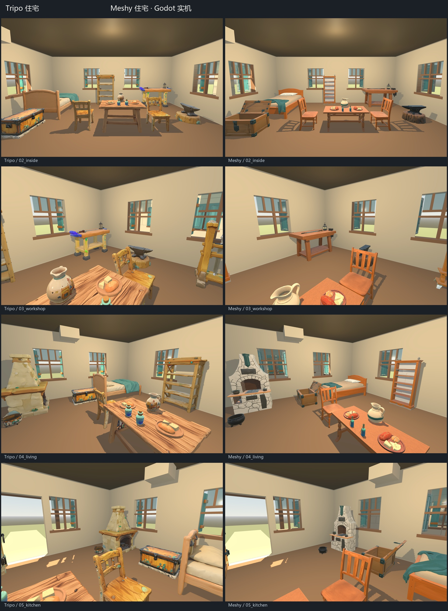

[门窗开闭实机图](Art/Generated/InteriorFirstPass20260916/doors-windows.jpg) · [门窗／武器／工作台组件](Art/Generated/InteriorFirstPass20260916/components-1.jpg) · [床／桌椅／炉灶组件](Art/Generated/InteriorFirstPass20260916/components-2.jpg) · [储物／补给／生活小物](Art/Generated/InteriorFirstPass20260916/components-3.jpg)

本轮基础家具更倾向Meshy：体块规整，桌椅、床、锅和水壶较干净。Tripo更卡通，但多件带额外石基座或建筑图案。首轮都存在不能忽略的失败：Tripo门板夹带石框；Meshy窗扇夹带石框、剑有上下双柄、闭箱请求得到开箱；两家空武器架都夹带武器。缺陷原样保留，不把它们写成成功分离的物品。详见[逐项记录](Art/Generated/InteriorFirstPass20260916/visual-review.json)。

两间8×7米单层房采用我们已有模块结构，各放置20个独立家具／道具实例，具备开关门、8组开关窗及碰撞；108项工程检查通过，门窗、桌上物品、墙地和屋顶有实际物理证据。门板／窗扇按洞口尺寸适配，家具统一比例与刚体朝向适配，原GLB哈希不变。**这证明能装配可进入样板，不代表36个首轮模型已经全部达到商业美术与拆分标准。**

每家实际540积分。原始总面数Tripo183,644、Meshy176,008；原GLB总量43.36／352.97MB，不作为帧率结论。代码已按用户要求采用MIT；API模型商用条款与MIT再分发边界见[NOTICE](experiments/interior-first-pass/NOTICE.txt)。[清单与费用](Art/Generated/InteriorFirstPass20260916/manifest.json) · [本机可运行工程交付](Art/Generated/InteriorFirstPass20260916/delivery.json)。

<a id="tripo-meshy-comparison"></a>

## Tripo／Meshy同题住宅对照 · 2026-09-16

官方Tripo CLI 0.4.0已配置并通过doctor。下图为相同描述、约80K目标面数、各一次生成的原始GLB四面实渲；展示归一化大小，使用同一灯光和相机参数，没有手工改网格或贴图。两栋原生朝向不同，四个方位角均公开。

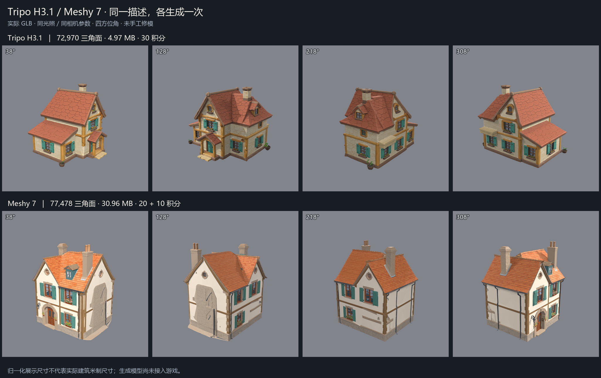

| 项目 | Tripo H3.1 | Meshy 7 |
| --- | --- | --- |
| 本次观感 | 圆润、粗木梁、大色块，偏卡通手绘 | 规整欧式住宅，门窗更细，但侧墙石纹突兀 |
| 原始三角面／GLB | 72,970／4.97MB | 77,478／30.96MB |
| 实际消费 | 30积分，API定价等值$0.30 | 20＋10积分；美元成本依用户套餐 |
| 本次用途 | 优先保留为卡通风格候选 | 保留为较规整立面风格对照 |

本样本更倾向Tripo，尚未更换已有住宅。两者都是一个网格、一个材质，生成成功不代表具有室内、可动门窗或可用碰撞；接入时仍需已有LOD／模块化处理。Tripo文件更小主要来自贴图编码字节数，不能推断显存更低或游戏更快。仅各一栋，不代表厂商普遍胜负。下一步可用同一参考图减少自由造型差异，再比较风格与可拆分性。

完整参数、扣费、尺寸和哈希见[实测清单](Art/Generated/TripoMeshyComparison20260916/manifest.json)，安装与价格依据见[H89流水](HISTORY.md)。本机原件及`.blend`在`exports/tripo-meshy-comparison-20260916/`，未纳入Git。

## 我们的 Shader 对照

本轮第一层场景迭代的实际图片、门窗组件和减面结果另见[2026-09-16持续记录](docs/validation/floor1_art_iteration_2026-09-16.md)。当前采用米制场景、象牙灰泥/红瓦/暖木/少量蓝绿窗扇，城镇接草地、农地和林缘；是项目原创布局，不是原著精确地图。跨楼层参考只用于色彩和构图。

资产处理按实际结果选择：三种Meshy住宅采用重拓扑后三档LOD与默认2K贴图；单株庭院橡树采用原拓扑Blender减面，保留大叶团。可交互住宅单独建立真实墙洞和完整DoorUnit/WindowUnit，生成式单体网格不等于自动得到可动门窗。原始高精度资产保留；面数、纹理体积、实际画面和通路分别验证，低面数或生成成功本身不代表可采用。

本轮对照进一步表明：新UV重烘能够修复部分窗板和花箱纹理，却可能从相邻烟囱拾取错误颜色；目前60K住宅仍是未采用候选。给平墙增加细微灰泥纹理，保持原色后也没有明显改善街景层次，因此没有采用。后续近景住宅应先解决结构、立面节奏和局部烘焙错误，再决定是否增加纹理分辨率。林缘则已采用同一14,783面橡树的十株共享实例形成局部疏密，而非复制高精度庭院树铺满森林。

以下五张图来自 2026-09-13 同一实验场景的已有验证；此次整理没有重新渲染。

| 表面卡通光照＋后处理 | 表面卡通光照，关闭后处理 |
| --- | --- |
|  | 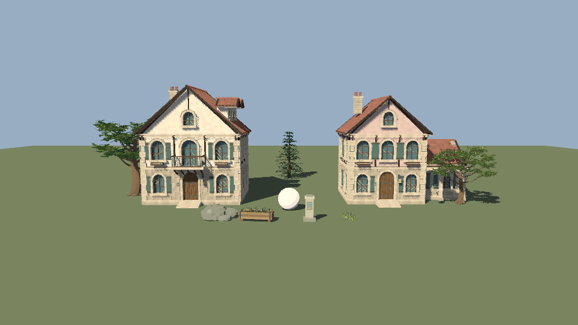 |

| 修改共享风格常量 | 保存后从磁盘重新加载 |
| --- | --- |
|  |  |

恢复默认参数后的原图：


原验证记录中，修改常量后的图与重新加载图哈希一致，恢复默认图与初始图哈希一致。[原验证数据](docs/validation/local_work_2026-09-13/shader-lab/validation.json)。

## Shader 分工与调整位置

| 部分 | 当前作用 | 文件 |
| --- | --- | --- |
| 逐表面 Shader | 按表面法线和光照方向分层明暗 | [anime_surface.gdshader](experiments/godot-anime-lab/shaders/anime_surface.gdshader) |
| 共享风格参数 | 阈值、过渡、明暗偏色、贴图强度和风；所有预览材质共用 | [anime_style.gdshaderinc](experiments/godot-anime-lab/shaders/anime_style.gdshaderinc) |
| 可选后处理 | 屏幕空间深度轮廓线与轻微饱和度调整 | [anime_post.gdshader](experiments/godot-anime-lab/shaders/anime_post.gdshader) |

本模板使用逐表面分层光照加可选深度描边。后处理看不到其采样阶段之后绘制的半透明物体；全屏硬色阶和植被法线描边不属于这个已验证模板。正式人物、脸部、手绘贴图和完整动画仍是后续工作。

## 打开已有实验室

仓库中的[实验室 project.godot](experiments/godot-anime-lab/project.godot)是独立项目。用 Godot 项目管理器导入它，打开 `scenes/material_lab.tscn`，选中 `PreviewCamera` 并勾选 3D 视口的 Preview。打开共享 include、调整常量并保存后观察画面。当前电脑另有 `C:/GodotAnimeLab`；保留其中正在使用的项目和编辑器。

不要直接照搬原电脑启动器的绝对路径。完整旧教程与快照说明已收入历史：[实验室教程](HISTORY.md#history-experiments-godot-anime-lab-readme-md)、[快照与打开方式](HISTORY.md#history-experiments-godot-anime-lab-snapshot-md)、[旧模型目录](HISTORY.md#history-experiments-godot-anime-lab-model-catalog-md)。

## 我们的五张场景参考图

保存本次讨论的五张参考图的来源与外部预览，供场景构图、树木、建筑和三渲二调色对照。图片文件仍由来源网站提供，没有复制进此公开仓库，也不属于项目可再分发的游戏资产。外部预览可能受来源站防盗链或链接变化影响，可点击对应来源页面查看。

以下不构成“全网最高人气”排名。可核实的人气依据仅是 [SAO 官方 2014 年投票](https://www.swordart-online.net/SAOA/en/) 的 Best Environment 类别，浮游城 Aincrad 排在首位。

### 1. 艾恩葛朗特全景

类型：官方投票获奖壁纸，适合参考整体轮廓、远景空气透视和天空色彩；不是地图平面图。

[官方来源](https://www.swordart-online.net/SAOA/en/) · [查看原图](https://www.swordart-online.net/SAOA/img/wp/pc1/BestofEnvironment.jpg)


### 2. 托尔巴纳 Tolbana

类型：动画场景截图。参考石砌街区、红瓦屋顶的色彩关系和建筑层次。

[来源与场景说明](https://swordartonline.fandom.com/wiki/Tolbana)


### 3. 第二十二层森林小屋

类型：动画场景截图。参考树冠的大色块、林间光影、木屋与草地的明度关系。

[来源与场景说明](https://swordartonline.fandom.com/wiki/Forest_House_K4)


### 4. 森林小屋外观设计线稿

类型：来源 Wiki 标注的 exterior design art，可用于观察建筑比例和体块。尚未核实它对应的原始出版物、页码及具体制作批次，不把它当作已经确认出处的第一季原画扫描。

[来源图库](https://swordartonline.fandom.com/wiki/Forest_House_K4#Gallery)


### 5. 第四十七层回忆之丘

类型：动画场景截图。参考花海、远景和树木之间的颜色分组与景深层次。

[来源与场景说明](https://swordartonline.fandom.com/wiki/47th_Floor_%28Aincrad%29)


### 制作方资料入口

- [Bamboo 官方第一季背景美术图库](https://www.bamboo-inc.com/gallery/view/34)：优先从制作方页面查看背景作品，本仓库不复制其图库文件。
- [Aniplex《Sword Art Online Design Works》](https://online.aniplex.co.jp/itemlvjsCYfj.html)：官方设定资料书入口，核对设计原稿来源时使用。
- [Bamboo 画集出版社页面](https://bnn.co.jp/products/9784802512060)：画集资料入口。

参考图的著作权属于各自权利方。Wiki 页面文字的许可不自动赋予其收录的动画截图或设定图相同的许可。项目规则要求公开迁入资产前核实再分发权限；本次未取得这些第三方图片的相应授权，故只保存来源链接及外部预览。
