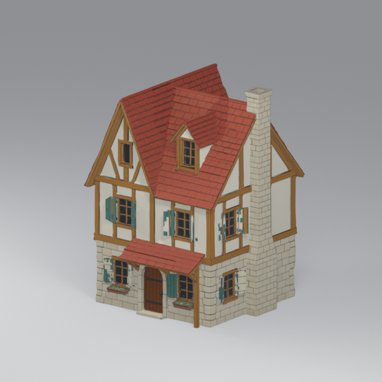

# Meshy quad-remesh house LODs — 2026-09-16

The reviewed Meshy quad remesh is retained intact as near `LOD0`. Blender 5.2.1 reduced separate copies to `LOD1` at 12,000 and `LOD2` at 3,000 triangles. Each house GLB has named `LOD0`, `LOD1`, and `LOD2` nodes sharing one PBR material and one set of three embedded images. The quad remesh has rebaked textures and UVs; it is a distinct source from the immutable high-poly Meshy 7 output.

| House | Original high-poly | Quad-remesh/LOD0 | LOD1 | LOD2 | Output bytes |
| --- | ---: | ---: | ---: | ---: | ---: |
| Hearth cottage | 1,630,308 | 38,021 | 12,000 | 3,000 | 40,040,092 |
| Market house | 1,263,506 | 39,717 | 12,000 | 3,000 | 41,523,636 |
| Corner turret | 1,792,188 | 42,902 | 12,000 | 3,000 | 38,036,016 |

The [previous 40k collapse-decimate comparison](baseline/README.md) is preserved. Its near view had visible roof-tile and window-edge breakup; the quad remesh near source is materially cleaner. These images show the actual remesh source and exported near LOD from the same Blender camera:

| Quad remesh source | Exported LOD0 |
| --- | --- |
|  |  |

[Manifest](manifest.json) records actual Blender and GLB triangle/vertex counts, UV bounds, surfaces, materials, images, bounds, file sizes and hashes. It retains the original high-poly source hashes plus the distinct remesh source hashes and receipt task IDs. The Blender builder rehashes remesh files after export. Godot 4.7 imported all three GLBs and the dedicated loader test passed 106 checks, including exclusive near/mid/far visibility and material sharing. Godot may extract one JPEG set per house as importer sidecars; there are no per-LOD texture copies within the GLB.

The GLBs are exterior appearance assets. Authorial presentation heights are 10 m/11.5 m/12 m, and the turret is turned 90 degrees to align its front. Playable interiors and doors use the separately authored modular houses.

Rebuild from the repository root:

```powershell
& 'D:/SteamLibrary/steamapps/common/Blender/blender.exe' --background --factory-startup --python tools/build_meshy_house_lods.py -- --source-dir exports/floor1-art-20260916/remesh --source-kind meshy-quad-remesh --preview-size 640
```
