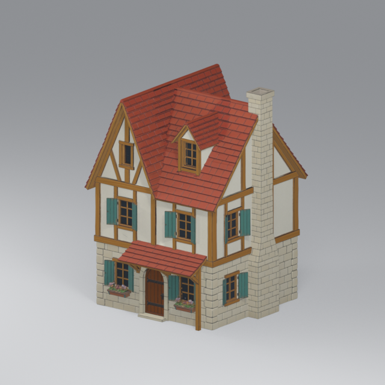
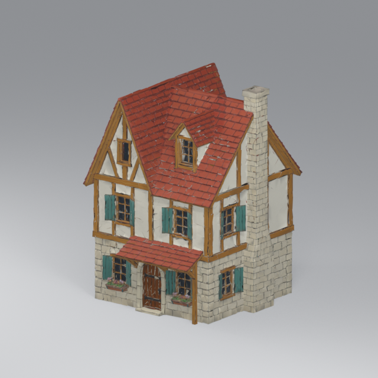

# Meshy house LOD baseline — 2026-09-16

The three immutable Meshy 7 textured source GLBs were imported into Blender 5.2.1 and reduced with its collapse Decimate modifier. Each output GLB contains named `LOD0`, `LOD1`, and `LOD2` mesh nodes. They use one imported PBR material and the same three embedded images per house. This is exterior appearance work only. The display heights are artistic placement choices (10 m cottage, 11.5 m merchant, 12 m turret); the turret is turned 90 degrees to show its intended front.

| House | Source triangles | LOD0 | LOD1 | LOD2 | Source bytes | Output bytes |
| --- | ---: | ---: | ---: | ---: | ---: | ---: |
| Hearth cottage | 1,630,308 | 40,000 | 12,000 | 3,000 | 78,366,592 | 32,620,932 |
| Market house | 1,263,506 | 40,000 | 12,000 | 3,000 | 65,346,804 | 30,230,280 |
| Corner turret | 1,792,188 | 40,000 | 12,000 | 3,000 | 86,631,376 | 35,635,584 |

The two cottage images below are actual Blender renders from the same camera, with the same source texture set. The 40k reduction retains the general silhouette and colors, but roof tiles and window edges visibly break up. This is a comparison baseline, not a final near-camera art decision.

| Unmodified source | 40k-triangle LOD0 |
| --- | --- |
|  |  |

[`manifest.json`](manifest.json) records measured triangles, vertices, UV bounds, surfaces, materials, images, normalized bounds, file sizes, source/output SHA-256 and reduction. The Blender builder rehashes each source after output. Godot 4.7 imported the three outputs and a dedicated test verified measured imported triangle counts, material sharing, UVs, authored heights, exclusive distance switching and no default collision. Godot may extract one JPEG image set per house as importer sidecars; the GLB itself embeds one image set shared by all LOD nodes.

Run from the repository root to rebuild:

```powershell
& 'D:/SteamLibrary/steamapps/common/Blender/blender.exe' --background --factory-startup --python tools/build_meshy_house_lods.py -- --preview-size 640
```
