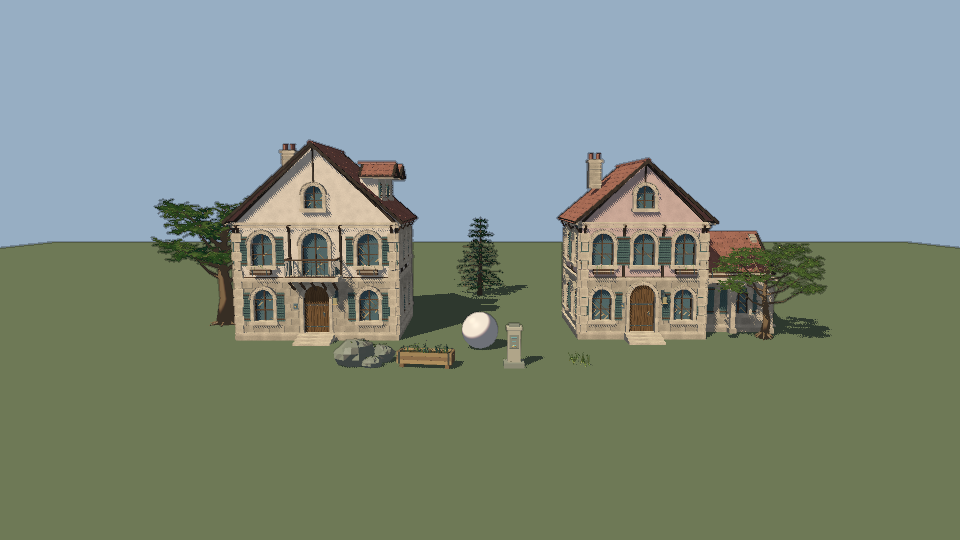

# 历史全部流水

## 2026-09-23 · Offline NPC dialogue, authority and axe lifecycle

The overnight fixture added a bounded dialogue receipt, 30-case/ten-resident
offline corpus, declared-intent review, fresh alias authorization, and an
isolated axe-day scene. Five local `qwen3:8b` proposals were recorded across
three bounded trials: three earlier lines passed structure but mismatched the
selected action's intent; a later Smith response first failed by using a
canonical action ID instead of an alias. After the isolated prompt was revised,
one further Smith response chose the valid `a16` acceptance alias. It actually
reserved 2 Col in a disposable formal-resident world and retained acceptance
feedback after restart. The saved raw reply was then replayed with zero new
model calls into another disposable world; scripted host continuation reached
delivery, 60-second repair, one iron consumed, collection and one-time payment.
The active seq266 world and its histories were not advanced. Speech delivery,
unscripted movement/work and sustained resident autonomy remain open. The
09:00 China iteration cutoff passed; its heartbeat was paused. [Handoff](docs/design/npc-overnight-20260923.md)
and [full-lifecycle evidence](docs/validation/smith-saved-reply-full-lifecycle-20260923.md).

## 2026-09-22 · Starting City art pass and DND dialogue measurement plan

The first-floor art preview now composes 46 imported asset instances and 53 procedural instances:
modular houses, a procedural Black Iron Palace, central fountain, market stalls, smithy props, gate,
lantern posts, plaza trees and four original primitive residents. The residents expose explicit left
and right hand sockets for sword, dagger, spear, axe, hammer, shield, bow, lantern, potion, book and
bag loadouts. The isolated acceptance suite passed with five preview collision bodies, zero model
calls, zero world mutations and no production-world load. The art commit is local at `04f494ac`; the
unrelated user worktree changes remain uncommitted.

The DND-style dialogue plan defines a bounded speech envelope with intent, stance, evidence claim
ids, stakes, next action and confidence. It separates deterministic grounding and world legality
from language evaluation, and proposes a golden conversation set plus measurements for voice,
agency, consequence, readability, repetition, cost and fallback rate. The next implementation step
is the receipt/schema and 30–50 offline conversations across all ten resident voice cards.

The layout study follows broad published motifs—southern Town of Beginnings, central plaza and
Black Iron Palace, western forest, northeastern lake/wetland, eastern ruins and a northern labyrinth
approach—but remains an authored proportional preview, not an exact canon map. A 30-minute heartbeat
automation is active for bounded overnight art batches and stops on quota, provenance, renderer or
verification blockers. [Art validation](docs/validation/starting-city-art-pass-2026-09-22.md) ·
[Dialogue plan](docs/design/dnd-dialogue-and-measurement-plan.md) ·
[Conversation archive](docs/history/conversations/2026-09-22-01a0c41a/CONTINUE.md)

## 2026-09-21 · Git attribution and main publication

GitHub's API resolves both current author emails (`qdotafs@gmail.com` and `148285081+dotafs2@users.noreply.github.com`) to `dotafs2`. The latest continuation branch at `e3511b28` has 132 commits beyond default branch `main` at `13fd766e`; all 132 use those associated emails. Their absence from the default branch explains the missing recent profile contributions. The local global fallback was still `dotafs <dotafs@work>`; global and repository defaults are now the verified `dotafs2` noreply identity, and the repository instructions pin this identity for subsequent authorized commits.

The user authorized integrating the complete continuation history into `main`. This delivery preserves existing commit hashes and uses fast-forward integration. Fresh Godot 4.7.2 resident graph checks passed 33/33, and full-map checks passed 15,217/15,217 across 762 routes; both owned processes exited cleanly. These are bounded navigation regressions, not a full-project certification. The September 13 legacy commit `02110668` uses the unassociated `dotafs@work` address and remains unchanged; correcting that original object's identity would require a separate historical rewrite. The current visible conversation is refreshed in its existing archive before publication; final remote SHA, GitHub attribution and downloaded archive hashes are verified after pushing.

## 2026-09-20 · H134 Offline contract lifecycle is complete

With no resident or provider call, the existing `town_trade` fixture ran the full authoritative edge-repair lifecycle in a disposable save: proposal, acceptance and Col escrow, physical delivery, 60 seconds at the worksite consuming one iron, edge restoration to 100, and one-time collection payment. All 63 checks passed and the canonical seq266 save remained byte-identical. This confirms the code path needed after Flint accepts Rowan's live proposal; it is not live acceptance or unattended execution. [Evidence](docs/validation/material-contract-lifecycle-2026-09-20.json)

## 2026-09-20 · H133 Rowan makes a real edge-repair offer

After a full-scene parse preflight exposed a duplicate `ARRIVAL_RADIUS` declaration in `town_material_steering.gd`, the duplicate legacy declaration was removed. The material regression passed 60/0 and a read-only full-scene restore exited 0, with only the known navigation and Forward+ warnings.

A fresh one-request Kimi window then continued canonical seq265. Rowan independently selected `contract:offer:seed:axe:edge:shared:smith:2` and spoke the concrete terms: repair the axe edge for 2 Col, paid on collection. The authoritative result is `contract_proposed` at seq266. No Col was escrowed, Flint's one iron was preserved, and no delivery, 60-second work or collection payment occurred. The call settled for CNY 0.0275755 with no unknown request; exact ten-resident cold restore passed. [Evidence](docs/validation/material-contract-live-2026-09-20.json)

## 2026-09-20 · H132 Current save exposes a lawful edge-contract path

A read-only Godot probe loaded a disposable copy of canonical seq265. Rowan has 8 Col, a damaged axe edge20 and Flint is near enough for three lawful edge-repair offers at 2, 5 or 8 Col. The copy's authoritative trade path accepted the 2 Col offer, reserved exactly 2 Col and preserved Flint's one iron. The canonical save stayed byte-identical; no provider or GM call occurred.

This proves contract affordance and escrow on the current save, not resident adoption or physical completion. Delivery, 60-second work and collection remain the next live conditions. [Evidence](docs/validation/material-contract-affordance-2026-09-20.json)

## 2026-09-20 · H131 Live Smith response opens the repair conversation

A fresh one-request Kimi window continued the verified seq264 world. The gateway settled one measured call for CNY 0.0253665, drained cleanly and produced no unknown request. Flint (Smith) had one iron and Rowan (Carpenter) was within 0.53 m; the live menu exposed the material-share option. Smith's real model decision selected `reply:godot_help:turn:shared:carpenter:0:5:willing`, saying he wanted clear terms before committing. The response is real social progress, but no iron transfer, fresh repair contract or edge repair occurred.

The canonical world is now seq265 with ten residents and the complete prior history. Exact checkpoint and usage hashes are recorded in [handoff evidence](docs/validation/material-handoff-live-2026-09-20.json). The finite source remains exhausted and the known navigation warning remains open.

## 2026-09-20 · H130 Formalize the verified zero-material continuation

The already accepted Carpenter command `turn:shared:carpenter:0:31` was promoted from the verified physics-only seq263 copy to the canonical world as seq264. The finite iron source was already exhausted, so the authoritative terminal receipt is `material_depleted` with quantity zero; the job closed without an inventory change, transfer or edge repair. This was a single-writer continuation of an existing model-selected command: zero new NPC/GM calls, zero new cost and no retry of an unknown request.

The public seq264 checkpoint and observation record preserve all ten residents and 264 life events. Production cold restore passed with exact nested fields. The exhausted-source limitation and existing navigation warnings remain open. [Evidence](docs/validation/material-formal-continuation-2026-09-20.json)

## 2026-09-20 · H129 Zero-request gateway preflight is clean

The production town entry point was launched against a byte-identical disposable copy of the seq263 checkpoint with `--town-gateway --town-max-decisions=0 --town-stop-on-decision-limit`. It exited 0, closed admission immediately, resolved shutdown, started zero provider work and left the copy at seq263 with the existing Carpenter material command unchanged. The canonical save hash stayed `e6bfd0c3…b16541`; no model call, ledger write or canonical-world write occurred. The one existing navigation edge warning remains. This validates the no-new-request engine path, not a new resident observation. [Evidence](docs/validation/material-zero-request-engine-2026-09-20.json)

## 2026-09-20 · H128 Keep arrived material workers at the worksite

The actual seq263 checkpoint copy disproved the assumption that H127's road fallback resolved Carpenter's stall. A* marked the target reachable, bypassing that fallback. During 15 seconds of unchanged production physics, the body entered the 0.45 m work gate (0.3724 m at the first sample), then crowd avoidance moved it outside again (0.6055 m at the last sample). Only 1.55 work seconds accrued. This was a navigation/work timer interaction, not proven source geometry blockage.

Material work now stops horizontal steering while the body is inside the same three-dimensional 0.45 m gate used by the world. Gravity, collisions, source destination and the 60-second timer remain authoritative. The H127 material road-route cache is also retained instead of being cleared immediately every frame. From the identical seq263 copy, the existing command finished after 54.7833 physics seconds with `material_depleted`, quantity zero. Seven assertions passed, including unchanged finite sources/accounts, preserved history and no new material command. Exact cold restore passed for all ten residents at copy seq264. Canonical seq263 and all provider records stayed unchanged; no model call occurred. The four existing navigation edge warnings remain. [Evidence](docs/validation/material-arrival-hold-2026-09-20.json)


## 2026-09-20 · H127 Live route gets a measured street-graph fallback

The real H126 Carpenter trip remained physically short of the exhausted source, so the next change stayed non-paid and preserved the existing command. `town_street.gd` now routes `recover_material` through the measured public-road graph used by place travel, clearing the old bounded material route first; the source center remains authoritative and the world still owns the 0.45 m work gate, collision checks, 60-second timer and finite accounting. This addresses the observed street/terrain route failure without inventing a material unit or retrying a provider request.

Godot 4.7.2 checks pass for material accounting (60), blocked-state persistence (278), baking route compatibility (63), and public-place route/restart behavior (18). The historical standalone material fixture replay could not be rerun from the current fixture because its submit precondition no longer matches the present code state; H125 remains the accepted physical material replay. No paid calls or canonical-world writes were made in H127. [Code](game/spatial/town_street.gd)


## 2026-09-20 · H126 Live route remains blocked after bounded capture

A bounded twelve-call window advanced `shared:restart-20260918-01` from seq250 to seq263. All 12 calls settled for CNY 0.250603 with no unknown charge. The internal scene capture ran for 600 seconds, resolved its shutdown and drained the gateway; the outer validation wrapper then timed out while closing and was terminated with exit 124, so this is not reported as a clean end-to-end validation pass.

The canonical save is now seq263. Carpenter is still 0.715 m from the exhausted iron source with only 5.6833/60 work seconds on the existing `turn:shared:carpenter:0:31` command. No material depletion receipt, transfer, edge-repair contract or repair completion occurred. The H125 fixture route remains proven, but the real scene path still needs a non-paid diagnosis. The eight known Forward+ `particles is null` errors and navigation edge warning remain separate evidence. [Evidence](docs/validation/material-live-2026-09-20.md)

## 2026-09-20 · H125 Material trip approach-point fix

The H124 checkpoint left Carpenter 0.86 m from the finite source with only 3.6167/60 work seconds recorded. Code inspection narrowed the stall to a mismatch between the physical capsule sweep and the world's accepted 0.45 m work radius: the steering helper asked the body to occupy the exact source center, so a final terrain or display collision could leave a reachable trip stationary.

Material steering now keeps the exact source as the authoritative destination but, when that center is not sweep-clear, walks to a collision-cleared point 0.40 m away. An owned Godot 4.7.2 fixture replay reached 0.29 m, accumulated all 60 seconds and completed `material_recovered` (stock3→2, worker iron1→2). The world still decides arrival, elapsed work, depletion, inventory and history; no source retry or paid call was used. The replay also caught and fixed a compatibility regression by retaining the inherited `ARRIVAL_RADIUS` constant required by the other steering subclasses.

[Code](game/spatial/town_material_steering.gd) · [H124 evidence](docs/validation/material-pending-2026-09-20.md)

## 2026-09-20 · H124 Pending material job at the episode boundary

A bounded twelve-call resident window advanced `shared:restart-20260918-01` from seq238 to seq250. All calls settled for CNY 0.2570856; the gateway drained, the checkpoint contains ten residents and 217 archived attempts, and no new provider result or charge is unknown.

Carpenter's existing iron collection job remained pending at the saved boundary. The body was near the finite source, but only 3.6167 of the required 60 work seconds had elapsed, so no authoritative `material_depleted` receipt or response to Smith's earlier work inquiry existed yet. The source remains initial3/recovered3/stock0, with Weaver holding two iron and Smith one; Carpenter's axe remains edge20/handle100. No material transfer, fresh edge-repair contract or completion occurred. Sage independently gave Heath one ordinary ration as a non-contractual gift.

The next step is physical continuation or diagnosis of this pending job, without retrying the exhausted source. One known Forward+ `particles is null` renderer error and the existing navigation merge warning remain separate evidence. [Evidence](docs/validation/material-pending-2026-09-20.md).

## 2026-09-20 · H123 Depletion feedback becomes live work dialogue

A bounded nine-call resident window advanced `shared:restart-20260918-01` from seq229 to seq238. All calls settled for CNY 0.1833087; the gateway drained, the checkpoint contains ten residents and 205 archived attempts, and no new provider result or charge is unknown.

Smith's next real decision after his authoritative `material_depleted` receipt was a direct conversation with Carpenter at the artisans' forecourt. He explained that he repairs metal edges and asked whether Carpenter had tools needing an edge or knew someone who did. This is a delivered, non-contractual resident statement: no material transfer, fresh edge-repair contract or repair completion followed. The finite iron source remains initial3/recovered3/stock0, with Weaver holding two iron and Smith one; Carpenter's axe remains edge20/handle100.

The run produced one known Forward+ `particles is null` renderer error and the existing four-edge navigation merge warning. Those diagnostics remain separate from the successful life event. The next question is whether Carpenter voluntarily responds and forms a new contract; the exhausted source must not be retried. [Evidence](docs/validation/material-handoff-2026-09-20.md).

## 2026-09-19 · H122 Finite iron depletion and handoff pivot

A bounded twelve-call resident window advanced the active lineage `shared:restart-20260918-01` from seq209 to seq229. Every call settled for CNY 0.2425896; the gateway drained, the checkpoint contains all ten residents and 196 archived attempts, and no new provider result or charge is unknown.

Carpenter received a real due turn, read the public material notice, travelled to the installed source and observed stock zero. Smith then revisited the source with one iron already held; the authoritative job returned `material_depleted` and awarded nothing. The finite source now satisfies initial3 = recovered3 + stock0. Weaver holds two iron and Smith holds one; Carpenter's axe remains edge20 / handle100 and the old rejected edge-repair contract remains rejected. No live edge-repair offer or completion occurred.

The next implementation target is a bounded depletion-feedback wake or voluntary handoff between residents. Empty-source retries must not be reopened. The renderer produced no `ERROR:` lines in this window; the known four-edge navigation merge warning remains. [Evidence](docs/validation/material-depletion-2026-09-19.md).

## 2026-09-19 · H121 Edge-repair follow-up and second natural iron recovery

A bounded twelve-call resident window advanced the active world seq194→209. All calls settled for CNY 0.2612845 and the gateway drained cleanly; lifetime history now contains 184 archived attempts and 198 usage records. Smith kept his recovered iron, revisited the finite source and moved between the market and artisans' forecourt, but no new edge-repair contract was formed because Rowan received no new model turn in this window. Rowan's axe remains edge 20 / handle 100 and the earlier rejected contract remains rejected.

Iris naturally used her earlier personal source knowledge to recover one more iron. The public source now has stock1 and recovered2, preserving the finite total of three. A disposable TownTrade probe passed 30/30 edge-repair assertions across approach, fresh offer, escrow, delivery, 60-second work and collection; this is implementation evidence only, not autonomous adoption. No code change was necessary. The next live condition is a fresh Rowan decision after his due boundary. The known navigation merge warning remains; this run produced no `ERROR:` renderer lines. [Evidence](docs/validation/material-repair-2026-09-19.md).

[唯一流程图](ROADMAP.md) · [项目介绍](README.md) · [美术风格与 Shader 对比](ART_STYLE.md)

## 2026-09-19 · H120 Natural iron discovery and recovery

A six-hundred-second bounded resident window advanced the active world seq174→194. Twelve Kimi calls settled for CNY 0.2481223 with no new unknown charge. Smith voluntarily read the public material notice, reached the public finite source, observed three iron units and chose recovery. The real job completed at seq193, moving one iron into his account and reducing the source to two. This is the first natural information-to-physical-recovery example in this continuation; no contract, payment or forced choice was used. Innkeeper’s separate material trip blocked physically and was then cancelled, retaining honest failure evidence.

The home-eating route fix is covered by a disposable seq151 replay with 40 assertions: two accepted meals reach their unchanged homes, work for 30 seconds and consume exactly one ration each. H120 preserves ten residents, 172 archived attempts, 186 usage calls and every earlier revision. The finite production chain, edge repair, negotiated production, sustained resource balance and unattended ten-GM loop remain open.

Live05 emitted 30 null-particle and four null-MultiMesh errors. Isolated unchanged house source/cache loads still pass in headless and Forward+; no cache deletion, asset modification or renderer suppression was attempted. [Evidence](docs/validation/material-discovery-2026-09-19.md).

## 2026-09-19 · H119 Actual terminal feedback, GM effect review and food accounting

Two bounded serial resident windows advanced the same world seq162→174 with sixteen settled Kimi calls costing CNY 0.3289711 and no new unknown charge. Nine residents made new decisions. Iris explicitly recognized her prior resource refusal, harvested one ration, then encountered scarcity again; speech, a meal, movement and rest also completed. Every previous archive entry and usage revision remains intact: 160 lifetime attempts, 174 world usage calls and ten residents. Exact cold restore passed.

GM04 consumed a frozen host effect receipt in one genuinely new epoch2 native conversation, retained its durable memory and acknowledged the observed effects. The run measured 47,012 input and 4,064 output tokens; currency cost remains unavailable. It requested concrete stock/allocation and iron-ownership evidence. This was host-directed feedback, not autonomous invention or a restored original native session. Old GM06/GM05 unknowns and no-repeat safeguards remain untouched.

Integrated separately typed audited self-repair, handoff and terminal-failure evidence, prioritizing current failures over bounded newest historical outcomes. Root runtime verification corrected fixture errors and the real start-event versus terminal-sequence binding; 37 final assertions and the actual seq174 projection passed. A focused accounting regression distinguishes proven local not-sent GM startup failure from unknown usage. Five food-report tests pass; exact resource conservation is reported without treating sparse endpoint matches as continuous durations or inferred satiety residuals as proved clipping.

Live04 also exposed six house-loading errors and eight null-particle errors. Isolated headless and Forward+ loads subsequently instantiated the unchanged house/cache successfully; no source/cache edits or stability claim followed. Natural full material/production uptake, sustained resources and an unattended ten-GM loop remain open. All code is local, no push. [Evidence](docs/validation/life-feedback-2026-09-19.md) · [Resident report](worlds/restart-20260918-01/observations/feedback-20260919/report.zh-CN.md).

## 2026-09-19 · H118 Timely failure feedback and audited GM session epochs

Iris had reached the harvest point but received `resources_unavailable`; the missing life event left her waiting nearly 30 minutes before another model observation. A narrowly bound latest-terminal-failure predicate now delivers that result once through existing feedback, retaining all admission/review/provider gates and free choice. The root passed 59 new assertions plus 42 first-offer regressions; the actual seq162 save is now eligible with the exact receipt and no byte changes. No new resident reply is claimed yet.

Added explicit missing-native-session epoch migration and exact unknown-task no-repeat records. GM01–05 were migrated offline to epoch 2, with their original UUIDs/history retained; no new native session was created. GM06's old timeout remains unknown and its two issue/content pairs remain unsettled and forbidden to redispatch. Root review also fixed investigation-only and mixed unknown-task handling. All original GM memories, attempts, outcomes, coding state, world and usage book remain intact. Six focused runner tests and four prompt-limit checks passed. Complete design pins required a bounded default increase to 32,768 bytes; current full GM history dry-runs need an explicit 65,536-byte cap (largest measured prompt 53,675 bytes), with no provider calls.

A hash-bound host receipt is prepared for new physical-effect review because the current default GM projection still contains only public dialogue. One short read-only renderer inventory found no particle/MultiMesh nodes and did not reproduce the previous errors; root cause remains open. Seq162 and H117's CNY 0.2373084 charge total are unchanged. The existing heartbeat will continue bounded observation and integration. [Evidence and next work](docs/validation/feedback-and-gm-continuity-2026-09-19.md).

## 2026-09-19 · H117 Physical material exchange and real self-repair adoption

Three user-requested Sol agents implemented bounded material exchange, honest Life events, navigation fixes and GM accounting recovery in isolated trees. The root reviewed and integrated them and remained the only canonical writer. The 36th capability transfers one uncommitted wood or iron unit in person with an atomic receipt. A controlled seq148 copy physically completed discovery, sharing, finite collection, material gifts, own-handle repair, contracted edge repair, payment and productive tool use across cold restarts. This full chain is fixture evidence, not autonomous adoption.

Actual failed replays exposed final-contact navigation loops; a four-metre capsule-swept refinement now covers approach, tool work and home meals while preserving normal speed, collision and work/resource gates. The root passed 2,324 Godot assertions, 27 Python checks, two compiled wire cases and a clean .NET build. A one-time first-offer check lets an eligible idle resident reconsider newly available self-repair without choosing for them.

The user authorized API spending without repeated questions. Two bounded same-world runs advanced seq148→162 with 11 settled Kimi calls costing CNY 0.2373084. The first failed on two local pre-HTTP null-stock rejections; the narrow projection fix, proven not-sent accounting and existing controller recovery preserve both failures. The second passed: Rowan autonomously repaired his axe handle, Ari and Fern spoke, and previously blocked meals completed. Seven residents made new measured decisions; all ten identities and every prior record survive. Final cold restore matches every nested field. There are 144 lifetime archive records and 157 world usage calls; no new unknown provider charge. Older unknown liabilities and GM histories remain untouched.

The GM usage pointer was rebound after exact history verification; native GM conversations still require explicit new epochs and the old GM06 unknown task must never be reissued. The active heartbeat continues small batches. Visible Forward+ rendering still reports five null-particle and one null-MultiMesh errors plus four overlapping navigation edges, despite normal completion; renderer stability is not claimed. Long-term resources, natural full production-chain adoption and an unattended ten-GM loop remain open. [Evidence](docs/validation/resource-chain-2026-09-19.md) · [Actual resident report](worlds/restart-20260918-01/observations/iteration-20260919/report.zh-CN.md).

## 2026-09-18 · H116 Explicit material-route sharing and local world recovery

Added an optional attributed route-sharing capability, bringing the registry to 35. A resident can tell a nearby listener a personally known material location; the listener receives unknown-stock knowledge and may choose to collect or relay it. Sharing neither grants goods nor forces action. The menu and result do not disclose the listener's private prior knowledge, and redundant reports preserve observed depletion. Actual words, source chains and command receipts survive restart; GM evidence contains only the public statement.

414 final focused checks passed with zero paid calls. A controlled copy of seq148 proved Ari could tell Wren, who stood outside notice-reading range, and Wren could physically walk 44.73 metres, resume mid-trip and recover one of the three iron units. Actual-controller fixtures preserved attribution and optional choices within the unchanged input cap. These are scripted test choices, not voluntary model adoption. Four existing overlapping navigation edges remain.

Restored the unchanged active world, complete developer-usage history (20 actors, 144 calls) and GM checkpoint locally. The separate cumulative provider ledger used for this world was not found in the relevant local project directories; the available older ledger has unsettled requests and was not reused. No paid requests, billing reset, native GM recovery or heartbeat restart occurred. Original seq450, local seq452 and active seq148 remain separate. See [evidence, recovery and next work](docs/validation/material-sharing-2026-09-18.md).

## 2026-09-18 · H115 Physical discovery of the installed iron source

Continued from the latest received delivery and H114. The installed finite iron was still unknown to every resident, so added a real public route notice beside the berry commons. Actual visibility and range grant only personal location knowledge with unknown stock. Existing collection remains optional; direct arrival sight, physical work and finite conservation decide the outcome. The notice reveals no private need or remote stock and cannot erase an observed depletion. Old saves and complete histories restore unchanged.

571 focused checks passed with no paid calls. A controlled seq148 copy proved real obstruction, a 44.36-metre walk at normal speed, exact mid-walk scene restart and recovery of one iron from the original three-unit heap. A separate real-controller input fixture retained the rich profile and honest source information in 12,164 UTF-16 units and chose wait without collecting. Forward+ rendering was inspected and the notice lettering enlarged. Active seq148, original seq450 and existing local seq452 remain separate and untouched. Four existing navigation-edge warnings remain. This is coordinator-authored maintenance; model adoption, information sharing and sustainable resources remain unproven. See [evidence and reproduction](docs/validation/material-notice-2026-09-18.md).

## 2026-09-18 · H114 Latest-code intake and own-tool repair

Pulled ten upstream commits through `d2c0227` into the existing delivery worktree, then continued on `codex/continuation-20260918-self-repair`. The original main checkout and unrelated work remain intact. Both the received active seq148 lineage and local historical seq450 remain byte-identical and separate.

Addressed Rowan's actual missing action: he owns a damaged axe, has wood-repair skill and a wood unit, but previously could only ask others to repair it. Added a versioned own-property repair capability with physical travel, 60 seconds of on-site labor, material/skill/ownership/contract checks, body exclusion, durable outcomes and bounded failed travel. Existing native action composition and restoration remain authoritative. This is coordinator-authored implementation, not autonomous GM invention or resident adoption.

In a controlled seq148 copy, Rowan walked 18.45 metres at the original speed, resumed the exact job in a new scene, consumed one wood and repaired only the handle. All 1,916 focused Godot checks, three complete cold restores, nine design-contract Python tests and the zero-warning/error .NET build passed. Initial fixture-test corrections, editor-import diagnostics and the pre-existing navigation-edge warning are documented. No paid calls, live simulation, cost reset or monitoring restart. Natural self-repair adoption and finite-iron discovery remain next. See [evidence and handoff](docs/validation/self-repair-2026-09-18.md).

## 2026-09-18 · H113 Bounded GM recovery, reviewed content and preserved live decisions

The previous GM observation over-read source without a final answer. Complete pinned evidence packets and disabled shell/wait tools produced real observations, same-session resume and exact delta accounting. A small-JSON artifact path reduced one real coding continuation from 839,976 tokens / 108.4 seconds to 54,102 / 9.4 seconds. GM05 authored finite iron after a host-directed follow-up; the reviewed configuration passed 38 controlled physical checks and 58 material rules, was installed at seq62, and received the original GM's receipt acknowledgement. Controlled copy actions do not establish voluntary adoption.

The user requested a two-hour wall window, then explicitly stopped it early for publication. Final seq148 preserves all 131 lifetime NPC replies, including 99 new decisions / 319,735 tokens / CNY 2.0172514, with all NPC calls settled. The interval was 111.10 minutes; life processes ran 76.94 minutes, world time advanced 75.35 minutes, and the rest included diagnosis, GM work and maintenance. Five supervisor GM observations succeeded; GM06 timed out without output or measured usage and was not retried. Its unknown receipt and the older GM05 tail remain intact. Native currency is not inferred from tokens.

Actual errors included two stale options, Iris selecting Reed while naming Wren, Rowan exceeding the 512-character reason limit, and confusion between willingness to talk and repair ability. Added current-menu target and brief-reason reminders, each verified by 1,547 offline checks and actual prompt uptake. Rowan resumed through the existing one-time cold recovery and made valid new decisions. The final early-stop episode correctly remains a non-passing duration test; its gateway drained with zero pending operations and exported every reply. Exact production cold restore passed for all nested fields and ten residents. All owned processes exited and the heartbeat is paused. An empty local writer-lock remains after automatic approval rejected its removal; read-only export used independent process and hash checks.

The iron remains undiscovered with all three units intact; no productive adoption occurred. Self-repair, profession learning, sustainable resources, dependable dialogue understanding and perpetual autonomy remain open. Earlier 124 focused Python tests, five follow-up artifact tests, physical/rule checks and their initial failures remain documented. The English roadmap/flowchart, complete safe GM/usage snapshots, immutable world checkpoints, all 99 Chinese decision summaries and this task's visible conversation archive are included. See [evidence and limits](docs/validation/gm-recovery-2026-09-18.md) and [resident report](worlds/restart-20260918-01/observations/two-hour-20260918/report.zh-CN.md).

Final archive compatibility fix: empty assistant heartbeat replies are counted as excluded empty text without dropping any nonempty message. Five archive tests passed, including append-only refresh and attachment/credential rejection; 196 visible messages are retained through 13:03:28 UTC.

## 2026-09-18 · H112 World-scoped permanent developer usage

The user corrected the mistaken requirement to recover another world's GM accounting before starting this fresh world. Developer usage now belongs to each stable NPC/GM identity from this world's genesis; provider billing history remains separate and unchanged. Added persistent per-call receipts, append-only revisions, exact Kimi backfill, idempotent replay, native session delta attribution, confirmed partial usage, safe full-history export and validated restore. Continued worlds refuse a missing usage book instead of silently resetting to zero. Usage stays outside NPC observations and model input.

All 32 existing resident calls total 83,274 tokens. One real GM05 observation read source but reached a 90-second host deadline without a final answer. Twenty native response receipts confirm 792,826 tokens (721,664 cached input); the final tail and currency charge remain unknown. These tokens are retained as a lower bound, not zero and not a completed observation. No paid retry, new resident call, candidate installation or active-world mutation occurred. Seq43 remains byte-identical. The separate access_programs error reported by the user appeared in this Codex conversation, not the GM run log; its exact client feature remains unconfirmed.

Final verification: 115 focused offline tests passed, complete usage-history restore and wrong-world/tampering rejection passed, and the updated 43-node English diagram rendered without script errors. Earlier fixture failures were fixed; an expanded native runner suite timed out at 55 seconds and is not counted as passed. All owned processes exited. The full safe usage and latest GM checkpoints, corrected roadmap, conversation archive and handoff are included. See [validation and real limits](docs/validation/actor-usage-2026-09-18.md) and [per-actor developer table](worlds/restart-20260918-01/usage/latest.md).

## 2026-09-18 · H111 Aincrad design governance and cached physical navigation

The user authorized continuing GM/NPC integration under SAO Aincrad rules and requested established fixed navigation. Added a sourced world charter that distinguishes original setting references, our original resident-life extensions and unimplemented systems. Production autonomy pins both design documents; proposals retain a compatibility rationale and six invariants. Main-AI review must explicitly assess setting compatibility. Host validation and the actual publication path reject changed pins; GM candidates cannot edit protected design/host files. Observation, coding, feedback and NPC instructions reflect these rules. Semantic correctness still requires concrete review; text declarations are not proof of canon compliance.

The project already used Godot navigation. Replaced per-frame full route queries with the existing NavigationAgent3D A* cache while preserving RVO speeds, portal approach, world targets, real collision and arrival authority. Invalidation covers a changed command/target, navigation-map revision and a repositioned/restored body. A real wall journey used one path update across 136 physics frames and walked 12.16 metres at at most 1.35 m/s. Two residents walked 72.61/77.38 metres through a cold scene restart with exactly one arrival each.

Verification: 169 focused Python checks plus 62 production-bridge checks, 12 navigation checks, 24 joint-journey checks, four local HTTP adapter cases, zero-warning/error .NET build, full seq43 cold restore, and a scripted ten-GM/ten-resident offline chain with 118 normal-stage Godot checks plus expected rejection of an unreviewed installation. No real model calls or live-world mutation. Two broader suites hit resource/time limits while checking out large candidate worktrees; their owned processes and three test worktrees were cleaned. Initial fixture-argument, map-synchronization and test-edit failures remain recorded rather than counted as passed.

Ten empty persistent GM records are bound to the fresh world and copied as a complete bootstrap checkpoint. Local no-dispatch route preflight plans all ten. An older September 14 accounting reference was found after the default path was absent; it explicitly preserves unknown attempts and missing other-machine history. It is not current September 18 reconciliation. Paid continuation and the reviewed H110 deployment/runtime contract remain open. See [validation](docs/validation/aincrad-gm-navigation-2026-09-18.md). The English workflow, visible conversation archive and handoff are refreshed with this delivery.

## 2026-09-18 · H110 Reusable resident action capabilities

The user requested batch expansion of foundational abilities through one reusable, extensible action layer. Added `town_actions.gd` with a versioned registry, adapters for 27 established capabilities and six new entry points: free conversation, private observation, and invitation/acceptance/decline/withdrawal for a shared visit. New modules own their options, execution, persistence validation and protocol reconciliation. Existing reducers retain physical, ownership, finite-resource and contract authority; one writer serializes commits while independent body jobs progress together.

Atomic composition rolls all children back when a later child fails, including inside a resident-turn transaction that retains the rejected model reply. Native commands persist exact payloads and lifecycle receipts; validation binds consent and terminal states to actual events and child outcomes. Old saves load without an implicit capability migration. Production scene, ordinary offline life, resident turns, maintenance writers, personal feedback and observation reporting use the common boundary.

The first ten-resident crowd test exposed an actual blocker: 74–105 offered choices per person overflowed the unchanged input cap. Lossless shared-template descriptions preserve every alias, expanded label and speech gate. Final rich requests use 12,471–14,274 UTF-16 units; the C# provider also forwards grouped choices and personal active plans. No budget guard was relaxed.

Verification: 2,013 Godot checks, 19 Python tests and six local HTTP adapter cases passed; .NET build has zero warnings/errors. Two actual bodies walked 74.68 and 78.38 metres at 1.35 m/s, resumed the same mid-walk save in a new scene, and each arrived once. The complete seq43 checkpoint cold-restored and the active live save is byte-identical. Paid calls, ledger changes and subagents: zero. The English workflow now has 41 nodes. All owned test/build/server/renderer processes exited.

Live voluntary adoption remains unobserved. General shared production, running-plan cancellation, renewable profession resources and relationship growth remain future work. Initial parse, fixture, input-overflow, compatibility and invocation failures are retained. See the [capability standard](docs/design/action-capability-standard.md), [validation](docs/validation/action-capabilities-2026-09-18.md) and its machine-readable checks.

## 2026-09-18 · H109 Fresh world, real resident decisions and complete sequence transfer

The user explicitly restarted all ten villagers at seq0, chose ten minutes of observation, required every decision summarized in Chinese, and permitted transfer of non-secret records while keeping the API key local. The active world is now `shared:restart-20260918-01`; original seq450 and GM history remain a separate lineage on another machine. The local Kimi configuration and existing 186-row cumulative ledger were recovered from the old UE project, verified and backed up without reset.

A bounded real Kimi run produced 32 decisions by all ten residents, seq42 and CNY 0.5280753 in new ledger charges (218 settled rows total; no uncertainty). It stopped after 282.664 wall seconds, because the live pause path reused the three-second restore timeout; the old tool's passed result was insufficient. Fixed that branch, active/paused duration evidence and success classification. Continued the same saved world for a separate uninterrupted ten-minute headless interval with zero new model admission, retaining the 32-request cap. Iris's remaining rest completed at seq43. This is not ten minutes of uninterrupted new model conversation.

Added exact full-history checkpoint migration and per-resident evidence reporting, separate proposed/delivered speech and accepted/completed actions, cumulative-ledger episode caps, a Chinese report of all 32 choices, an active-world pointer and 39-node English roadmap. Verification includes 50 Python checks, 50 Godot shutdown checks, genesis and final production cold restore, complete profile/event/reply continuity and unchanged original fee rows. The full sequence lineage and safe receipts may be published; secrets and raw ledgers remain local.

Observed gaps are iron supply and repair contracting, real weaving/cultivation/animal/fishing opportunities, executable shared plans, independent conversation and stale-choice recovery. No GM agent developed anything in this run. Existing four navigation overlap warnings persist. Details, the first interruption and evidence boundaries are preserved in [H109 validation](docs/validation/resident-observation-2026-09-18.md) and the [Chinese resident report](worlds/restart-20260918-01/report.zh-CN.md).

## 2026-09-18 · H108 Rich original NPC dossiers and bounded decision integration

The user asked for a review of very rich SAO-inspired NPCs, borrowing D&D-like character depth even when many traits are not yet used, and authorized continuing if reasonable. Review approved extensible complete dossiers with a clear distinction between original characterization, authoritative mechanics, recorded knowledge and latent future systems. Official SAO and D&D sources and the reasoning are linked in the [design review](docs/design/character-depth-review-2026-09-18.md).

All ten new-seed residents now have distinct six-field cores and eight situational facets, plus 21 detailed sections and twelve descriptive personality dimensions. Rich background, contradiction, values, fears, preferences, social boundaries, voice, work/learning and possible growth are authored in English. Unimplemented Aincrad progression/ability slots remain null; relationships and evidence claims start empty. Full profiles persist; only the deciding resident's core and selected facets enter the actual model request within 2,600 UTF-8 bytes. Stored private/author/extension material is excluded. A profile never grants skills, resources or a shared past, and legacy saves are not automatically enriched by ID lookup.

Validation: zero-warning .NET build, 27 Python tests, 149 focused Godot checks, six loopback cases (history phases rechecked after selector review), and the complete eight-stage offline physical workflow with 179 checks passed. All ten complete profiles remain exactly equal from genesis through interrupted travel/work, restart and final read-only cold restore. Normal engine stages reported zero errors/warnings, and owned processes exited. Paid model calls and subagents were zero. First-test parser/encoder numeric-type failures were retained and corrected using the production codec on both sides, without tolerance; action-ID substring misclassification was corrected to use machine action types. The current flowchart has 38 nodes.

Original seq450/GM memory/ledgers remain on the other computer. No original-world profile migration, independent free-conversation action, relationship reducer, visual realization or demonstrated long-term personality behavior is claimed. These are distinct follow-up stages. See [all ten dossiers](docs/design/resident-dossiers.md) and [verification and remaining boundaries](docs/validation/character-depth-2026-09-18.md). The visible conversation archive is refreshed and remotely verified with this authorized upload; its manifest gives the actual cutoff.

## 2026-09-18 · H107 English game, model instructions and current flowchart

The user requested English for game names, dialogue, Kimi/GM interaction and the flowchart, retaining Chinese only for our conversation. Authored runtime text, the ten seed names/backgrounds, UI, launch messages, all three GM instruction phases and older model/interface experiment prompts now use English. Known legacy names/text receive presentation aliases; canonical IDs and saved historical records remain unchanged. The layout changes only two connection labels, with both reviewed language-revision hashes accepted under existing provenance rules. The previous full roadmap was archived byte-for-byte, and the current English chart has 36 nodes.

Validation: 43 Python tests, 512 focused Godot checks, 40 actual-quarter UI checks, 6 actual-wire loopback cases and 179 checks across the complete eight-stage offline workflow passed. The graphical continuation used real bodies, interrupted labor, a new process and exact final cold restore; paid game-model calls and subagents were zero. Longer English activates existing context compaction sooner: the historical fixture retains the latest 4 informed personal events with sourced knowledge and current commitments unchanged. Its test now verifies the exact newest event suffix instead of assuming exactly 16 events always fit. No request/context/cost cap was raised.

Initial invocation/test-assumption failures remain in local evidence, including the logical-versus-physical viewport mismatch; corrected reruns passed. Four pre-existing navigation edge overlaps remain visible in the sixteen-house scene. Original seq450, GM memory and ledgers are still on the other computer; unknown historical free dialogue has not been translated, and sustained autonomy, sustainable resources and earlier renderer/particle faults remain open. The visible conversation archive is refreshed before the authorized upload; its manifest gives the actual cutoff. See [English rollout, screenshots and evidence](docs/validation/english-rollout-2026-09-18.md).

## 2026-09-18 · H106 对话原文上传与导航离线修复

用户要求继续工作、确保上传对话历史、卡点及时报告。本任务可见用户／助手消息从精确本机日志单独导出，保留时间、角色、逐条原文和文件校验；首份42条快照提交a269842并已从GitHub下载核验。后续增量刷新不允许缩短或替换旧消息，根目录AGENTS.md与固定接续说明记录上传时刷新／远程核验要求。范围仅当前任务，不上传内部推理、系统指令、原始会话工具日志和私有资料，不假称其他电脑对话已齐全。原文、最新覆盖时间与接续入口见[对话历史](docs/history/conversations/README.md)。

导航替换废弃烘焙接口，显式写出原有体素取整后的避障半径，身体与网格精度不变；两档真实碰撞烘焙顶点／多边形逐值一致，10项通过并复查同步稳定性。原街区4段身体实走14项通过。同一离线世界完整8阶段179项复跑通过，错误／警告均0；额外16栋街区40条公共路线与64项门窗检查通过。Python恢复保护也移除遗留小数容差，精确核对完整世界与最终恢复快照；对话4项、流程17项回归通过。

新对比测试曾因异步地图未同步出现第二档空路径，保留失败，以显式同步修正测试并复查，没有放宽几何／可达断言。16栋街区仍报4处边缘合并警告；用9fcd05c原导航和同一公共预览档复现相同警告，修改前后40条路径与门窗回执完全一致。该几何问题和历史GPU退出／粒子问题均未结案，下一步定位具体重合边。原seq450、GM记忆与账本仍在另一台机器；无模型调用、无子代理，未冒充长期自主运行。本轮证据、边界及失败记录见[H106报告](docs/validation/navigation-and-history-2026-09-18.md)。

## 2026-09-18 · H105 完整流程图与本机流程演练

用户要求自行处理卡点，给出完整工作流程、当前待办、本机跑一遍，以及实际结果与期望的差距。沿用其已确认的离线范围，本轮无子代理委派、无模型调用。整理当前唯一流程图为世界循环、当前进度、近期差距和N5—N10终局路线；沿用原节点编号，旧H1—H104图原样归档，修正seq129/seq166/seq450混写。生成同源可缩放HTML、SVG与PNG。

实际运行现有十居民/十GM离线集成入口，并在同一测试世界完成需求、持久GM上下文、候选自测/审阅、安装现有有限铁源配置、材料获取、物理行走、劳动中退出、新图形进程续做、最终新进程只读冷恢复。最终8个正常阶段179项检查通过；未审阅安装的负例按预期拒绝且世界不变。最终seq59、铁源3→1、铁匠获得2；10个身体、1倍时间、历史前缀/财物/未完任务连续。真实模型调用0，不能写成自主10+10或GM创造了新能力。

首轮发现缺少GLB导入但旧工具仍报告成功：入口补增量构建/导入，并将stdout/stderr引擎错误纳入结论。第二轮发现冷恢复探针使用的JSON解析器与正式TownJsonCodec相差最末二进制位；证据读写改用正式编解码器，逐值严格比较，不加容差；14项Python与9项Godot专项通过。两轮失败及随后最终冷检阶段接线时的拒绝记录均保留，最终只读复查不重放已完成动作。

图形阶段仍有废弃导航烘焙API与agent_radius体素取整两类警告，无引擎错误；没有因此关闭历史GPU退出/粒子问题。演练用旧测试街几何；最新16栋街区长测、自然口粮互助、可再生生产、长期无人维护、楼层与冒险仍是差距。原seq450及真实GM记忆/账本仍在另一台机器。完整结果、复现命令和截图见[本轮报告](docs/validation/local-flow-2026-09-18.md)。

## 2026-09-18 · H104 本机离线续接与预览旧缓存修复

用户确认最新私有存档、GM 状态和账本仍在另一台电脑，指定先继续离线修复。本机 `C:\InfiniteAincrad` 保持交付分支；本轮无代理委派、无付费模型调用。修复 `tools/play_pcg_trial.py` 仅凭 DLL/导入目录存在就跳过准备的问题，改为依次执行增量构建和 Godot 导入，构建禁用驻留服务器，任何一步失败均不复制或打开世界。四个回归用例在交付基线全部失败、修后全部通过；实际 `StartDemo.cmd --prepare-only` 构建/导入通过，自有进程全部退出。

合计 50 项 Python、306 项 Godot 离线检查通过，涵盖预算入口、口粮赠予、烘焙守恒、零精力规则、停机写回、旧回复恢复、只读回看和控制器恢复。H102 曾记录的控制器恢复失败在本次最新分支运行中未复现，20 项全部通过，不抹去历史失败。本轮独立 `shared:offline-preview-20260918`、seq0 的十居民预览冷恢复通过；不是另一台机器的 seq450 恢复。详见[本机证据](docs/validation/offline-continuation-2026-09-18.md)。

## 2026-09-18 · H103 夜间交付分支接收

远程 main 仍为 `13fd766`；今天早上的交付位于 `codex/overnight-20260918-delivery`，最新 `9fcd05c` 为北京时间09:52:13。已拉取并切到该分支，原本地停机实验四文件保存在 `stash@{0}`，已有私有目录保留。

上游[最终交付](09_DELIVERY.md)与[公开证据](docs/validation/overnight-20260918-evidence.md)记录：最终 seq450；十居民都有真实模型决定与身体移动，铁匠完成发现烤炉、烘焙、食用和再烤；life20 的16次请求全部结算，完整冷恢复通过。最近十GM回访为九位返回、GM01发送后超时未知，未重试。普通口粮转交已实现且离线守恒通过，自然采用尚未观测。长期供需、面粉再生、导航/粒子错误和长期无人维护仍未完成；这些是上游证据，本机没有重新执行付费生活。

## 2026-09-17 · H102 DeepSeek 并行工程与本地接续

用户重新开始本地迭代，并指定子工作使用 DeepSeek／可用的 Codex 5.3，GPT-6 只作方向判断与审查。当前没有 5.3 路由，已停止先前的 GPT-5.6 编码委派，用三个隔离 DeepSeek Flash 工程会话处理停机、旧回复恢复调查、炉体碰撞；后续修正复用原会话。工程委派不计为实际世界 GM 活动。

停止新决策、等待在途决策写回、保存退出的补丁已合入本地文件，真实场景子类加真实回合模块的 44 项离线验收通过；回合 29、上限 11、Python 启动器 24 项回归通过。原型中字段/方法错误、截止帧额外派发和按线程生命周期臆断结算，均由主 GPT-6 审查指出、DeepSeek 修正。测试退出清理也经 DeepSeek 修复，最终主仓日志无资源泄漏。

烤炉补实体碰撞后，66 项主仓物理验收通过：旧无碰撞反例、实体阻挡、炉前到达、视线遮挡、个人知识和有限原料守恒。该结果属于原语物理场景，实际 16 栋街区炉位、导航、安装、原居民采用和原 GM 复查仍未完成。

织工原回复的世界、居民、回合、代次、operation、请求/响应摘要及计费用量核对一致；DeepSeek 离线恢复工具已合入本地，主仓 15 个 Python 测试、110 项 Godot 检查通过。真实副本补写原求助决定，重复执行拒绝且字节不变，完整冷恢复通过；随后原研究存档执行同一恢复，结果与副本一致，完整冷恢复再次通过。原失败档案保留并新增一次应用记录，其他九人的回合与面包师取料 pending 不变。新增供应商调用 0，账本仍 163 条 settled。旧控制器恢复套件的 2 项失败由 DeepSeek 在基线复现，尚待契约对齐，不声称全仓测试全绿。

用户要求的无历史上下文 GPT-6 独立审查，内置子 agent 与独立原生入口均因模型容量不足失败；没有标作已通过。研究源档现为 seq166／SHA-256 `5d4d848dc4048ec588c872b72a3511bfe23c796b31c3eca22aa315bc1cb719b6`，9 settled／1 provider_error。工程 DeepSeek 续接按同会话高水位计量，两条已测会话输入缓存占 98.39%；三次超时派发的结束时计量缺失保留，不相加续接累计值，不臆造供应商费用。渔夫失败原因、修复后真实生活回合、烘焙实际采用和持续无人接力 10+10 尚未完成。本轮没有沿用旧 09:00 定时任务，没有推送 GitHub。详见[本地接续证据](docs/validation/gm_npc_continuation_2026-09-17.md)。

## 2026-09-17 · H101 新地图 GM/NPC 闭环研究（进行中）

08:55 收口：真实场景复现面包师的本地 OpenGameAgent 上下文预算拒绝，GPT-5.6 修正分发副本的旧个人历史预算并补安全错误映射，主仓 `97fffd2`／`b77cfaa` 8 项验收通过。只部署该修复后，life-12 中面包师新 epoch 的请求实际 Kimi 结算，并自主开始公共铁源取料；保存时尚未完成取料。全轮 300 秒、8 次决策、7 次付费，累计 163 次 settled、无预留或未知，账本估算 3.911931 元。渔夫及织工出现 `brain_run_failed`，整轮失败保留：渔夫对应请求未到 durable gateway；织工已结算响应比引擎退出晚约 10 秒，结果未应用，下一步先修停机等待与已付费结果接续，不重放请求。

最终世界 seq165／6087.88333333319 秒，SHA-256 `73bc417d22f79437de2a208d650e2c940748f7fa834faf6515e3d61a19dff08a`，十身份保持，8 settled／2 provider_error。前两次冷验暴露私有验证器漏掉材料 pending 和观察浮点序列化差异；原失败保留，修正后第三次 provider 0、全状态严格相同、源档不变、进程完整退出并整体通过。真实运行与冷恢复结论分开记录。

DeepSeek GM07 烘焙初稿由 GPT-5.6 接续完成并经主 AI 审查，`94b8051`／`50e32ab` 合入本地 main；53 项烘焙验收及合并后的 98 项材料承诺验收通过。审查修正了远程库存泄露、未绑定视线仍认识烤炉和反向命令冲突。尚未安装：真实炉位探针因子代理容量／连接失败未交付，烤炉当前缺实体碰撞，维护／恢复工具兼容也需补齐；没有声称居民实际烘焙。流程图保留材料维护绿色，烘焙与持续运行黄色。按用户要求在 09:00 保存收尾，美术未扩展；完整结果与下一步见[本轮验收](docs/validation/gm_npc_closure_2026-09-17.md)。

08:20 续记：life-09 正常结束且全状态冷恢复通过；life-10 引擎正常退出但面包师出现本地 `brain_provider_failed`，8 次新增 Kimi 进入网关并结算，累计 155 条、无未知或预留。错误发生在第九次决策进入付费网关前，具体异常未持久化，不猜测。首次冷恢复对故障隔离状态的 `next_due` 要求过严，GPT-5.6 修正私有验证器后 6 项测试通过、同一 seq162 存档完整冷恢复通过；真实运行失败保留。精确请求恢复已在克隆档验证，正在恢复正式研究档并续跑 life-11。

材料过度承诺修复已合入 main（d365a03、88a90df），同一份材料不会接受多份未完修理，工具使用也不能消耗承诺木料；主仓 98 项聚焦验收通过。它尚未部署到研究档，不冒称解决当前单笔合同的自由选择。DeepSeek GM07 烘焙编码 1200 秒超时，原生输入高水位 20,033,850／缓存 19,745,152／输出 114,448，最终用量未知保留；GPT-5.6 离线恢复补丁 352b81e 合入，主仓 153 项测试通过，精确会话恢复不重放请求。再次进入原 cycle 因阶段时限已到返回 limit_reached，没有第二次编码调用。隔离候选的制作／食用／重启草稿 25 项及材料／地点／回合回归通过，主代理临时测试与修正归属如实保留，GPT-5.6 接续完整审查；未发布烘焙或声称居民采用。详见[更新验收](docs/validation/gm_npc_closure_2026-09-17.md)。

05:43 续记：GM10 的有限公共铁源已在实际西侧工匠前庭完成物理检查和一次事务安装，没有直接发放个人物品或技能。life-07 中铁匠首次亲眼观察在 seq112、自主取铁在 seq115、自主接受原合同在 seq118；木匠也自主取了一份铁，来源剩余 2／初始 4。全状态冷恢复相同，原 GM10 随后的真实回访 accept，并要求继续观察交付、施工、付款与取回。这些后续阶段尚未完成；木匠有无阻碍的 deliver 选项却选择求教，不因此视作 bug。流程图将有界材料维护子链单独标绿。

life-08 约 746 秒时 Godot 以 -1 异常退出且无最终 capture，不记作 900 秒成功。最后原子存档为 seq122／3976.27 秒；唯一新增 Kimi 等待决策已结算并应用，累计 115 次、账本估算 2.3837813 元，reserved／unknown 为 0。原档完整冷恢复通过，异常原因仍未知，后续先清理经验证的失效运行锁再继续，不重放已付费请求。GM07 的烘焙编码尚未开始：已发现居民终态反馈、食物被吃后的守恒及正式观察提示长度参数需要接通。GPT-5.6 已补 GM 侧 baking journal 查询，15 项定向测试通过；完整套件 141 项中 136 通过、5 跳过。另一个离线双合同探针复现了 1 铁接受两份修理后第二份卡住，正在独立修正；不是当前单笔合同的卡点。

04:43 续记：最后三位 GM08／09／10 的新观察全部成功、计量完整，受保护文件无变化、无凭证泄漏，自有进程均退出。十位 GM 现在均有真实成功参与，原 GM08 失败及未知计量仍保留。GM10 提出有限公共铁源，但不认领无须新增的代码；本轮协调器因此按无人认领编码结束 no_action，不能把这个状态等同于没有维护方案。该提案尚未安装，主AI将细化并审核位置和有限库存后使用既有工具。life-06 自然续跑新增 32 次 Kimi 已结算请求，累计 105 次、账本估算 2.0809855 元，reserved／unknown 均为 0；世界 seq81→110、1407.92→2339.47 秒，网关完整退出。原铁匠与木匠分别在公开 seq82／83 自主表达缺铁及寻找来源的需要；不把对话中的履约承诺当作权威合同已接受。seq81 的全状态、十人身份、回合历史纯冷恢复已通过。当前图中的实际参与节点转绿，资源维护及居民采用仍为进行中。

04:10 续记：居民在 GM 观察期间又真实运行约 15 分钟，累计 73 次 Kimi 全结清，seq81／1407.92 秒。GM01—07 已成功参与，GM08 连接断开且最终计量未知，09／10 未派发；按用户既有例外保留失败及原生部分计量，不重放请求，以新事实继续。主AI将下一步聚焦“世界无材料来源 → 真实发现与采集 → 当前现金修斧”，并把互惠结算、转告材料地点和烘焙保留为新设计候选。GPT-5.6 同时修正未采用回访永久关闭的问题，主仓定向 15 项通过。详见[当前完整验收](docs/validation/gm_npc_closure_2026-09-17.md)。

用户明确允许随时建立新世界，并确认先跑“真实需要／故障 → GM 开发 → 原居民采用 → 保存重启”再扩大到 10+10；工作至北京时间 09:00，美术留到白天。GPT-6 负责方向与审查，GPT-5.6／DeepSeek 负责工程，Kimi 负责居民。新世界不冒充旧电脑 seq129 的历史；H100 的旧档等待和图形退出问题不再挡住本轮逻辑研究。

已建立新地图十居民独立存档与十个 GM 初始状态；真实 Godot 离线动作和冷恢复通过，居民实验记忆按个人隔离。首次正式 Kimi 生活启动却在首个决策前暂停，模型请求 0、世界时间／life_seq 均为 0。物理诊断的 120 个采集候选全部 clear，实际失败来自新世界 `spatial_layout` 被迁移专用验证要求 `foraging_before/after`，安装事务以 `invalid_spatial_foraging_record` 回滚。旧验证器的 passed 因此只能证明退出／账本条件，不能作为生活成功证据。

DeepSeek GM05 已从上述真实宿主故障独立诊断并认领，观察调度完整返回。后续编码到达 900 秒时限，没有完整交付回执；候选保留，GPT-5.6 接手修订并验收。观察原生输入 1,830,787、缓存输入 1,669,120、输出 15,416；编码原生记录可见输入 9,238,861、缓存输入 9,063,424、输出 70,455，但末尾仍可能未记全。保留 unknown 与部分记录，依据用户先前明确允许的例外继续，没有归零、伪称最终账单或重发同一请求。该故障由宿主实测发现，不写成居民自发需要。

接线工程已补新世界十 GM bootstrap 和发布效果回传，17 项定向测试及 6 项 worktree 回归通过。采用只认可原居民／原命令的持久化最终结果，受理或 pending 不算成功；无新证据不重复唤醒原 GM。正式生活验证现分为 passed／not_exercised／failed，零调用不再算通过，同世界宿主故障可自动导出；世界进度与本轮启动前存档比较，历史时间和已有事件不冒充新进展，22 项离线测试通过。生活／GM 桥接已补可持久化的 waiting_review 暂停和同候选恢复，恢复不重跑已结算的 Kimi 阶段，零未知账本不再被误拦截；实际隔离部署循环仍待演练。

截至北京时间 02:52，首个真实启动故障闭环已通过。修订的采集校验在旧代码上复现 9 项失败，新代码真实 genesis 验证 163/163；实际场景 120 个采集点检查通过，暂停解除。life-02 有 4 次真实 Kimi 请求，井边居民接近牧人被拒绝（approach_blocked）、面包师吃口粮完成、铁匠与木匠到访西前庭完成，世界推进到 seq16。纯冷恢复的源档、快照、恢复档 SHA-256 完全相同（47d9c6e3…6b800），完整状态比较无忽略路径，10 个身份及既有历史保留，零 provider 调用。原 DeepSeek GM05 根据安全效果回执独立给出 accept；这证明故障修复后的生活恢复，不冒充居民自发提出新功能，也不隐去 GPT-5.6 的修订。

life-03 继续原存档又完成 24 次真实 Kimi 请求，累计 28 次、十位居民均有真实个人决策记录，世界推进到 seq42／301.22 秒，模型错误与未结请求为 0。逐人权威命令终态共 26 成功、1 拒绝、1 等待，无悬挂；全状态纯冷恢复再次相同，SHA-256 为 fa0169db…a5a1c8。治疗者与面包师实际完成采集，治疗者距本人采集点 0.05854 米；没有连续轨迹证据，不宣称全路线覆盖。已补终态拒绝的持久化 GM 投影：原临时 stall 关闭后仍可通过相同居民／命令／事件识别 approach_blocked，保持只读并不推断碰撞或 bug。两组 Godot 测试共 103 checks 通过，实际 seq42 存档副本冷加载新代码导出同一拒绝证据，原档不变。

截至 03:07，GM01—03 已基于三条真实公开求助／答复独立观察并完整结算，会话彼此独立，世界与证据保护哈希无变化。共识是现有现金修斧机制已具备，不重复开发；与水有关的工作和互惠修理分别被提出为未验证的新设计候选，没有写成已安装能力或居民实际缺钱。十 GM 中本轮已实际参与 4 位，余下六位接后续阶段。Python 五组集成回归共 271 项通过。**尚未通过 10 GM 实际参与，也未验证 20 个模型持续同时运行或生产自主发布新功能。** 详见[本轮验收](docs/validation/gm_npc_closure_2026-09-17.md)。私有证据保存在本机 private/gm-npc-research-20260917，密钥、居民私有理由和原始观察不进入公开流水。

03:46 续记：life-04 新增 32 次 Kimi 已结算请求，累计 60 次，当前 seq70／508.4 秒；本轮 26 成功、1 拒绝、5 等待、无悬挂，8/10 获得新决策。修斧合同仍 proposed，实际接单条件为 material_unavailable；铁匠已经看到报价，等待冷却到 1993.23 秒才再次到期。冻结档调度探针确认按时到期和新本人收件都可唤醒，没有证据证明吞消息；不强迫接单、不凭空赠送铁料。新的 GM 能力提议已补齐原居民与公开来源绑定，并保护既有绑定不被降级或改绑。当前逻辑世界使用 16 栋生活街区，44 栋美术样板不冒充已整合。尚待真实自主发布和原居民采用。

## 2026-09-17 · H100 本机接收代码与工作交接

按用户要求，在 `D:\lucidgloves\InfiniteAincrad` 将 main 从 `aa026a3` 快进至 `4b958f3`，接收 H89—H99；现有 stash 保留。404 个 LFS 路径的文件齐全，对象校验通过。C# 构建 0 警告、0 错误；Meshy 工具 21 项离线测试通过，迁移 6 项因缺少上机私有原档全部跳过，未记作通过。

首次导入实测失败于 Terrain3D 原生 DLL 缺失：根目录 `bin/` 忽略规则排除了插件运行依赖。已按 `plugins.json` 的版本及 SHA-256 恢复本机 Windows x64 两个 DLL，并按官方发行清单校验后准备独立 .NET Runtime 8.0.31。强制仅用该 .NET 8 目录时出现编辑器 `System.Runtime 9.0.0.0` 缺失；最终使用系统 .NET 9.0.2 加命令级 `LatestMajor`，导入和公共十居民 seq0 预览的加载、保存、冷恢复均无错误通过，自有进程全部退出。没有修改系统 .NET，也不代表仓库自动换机启动或正式图形退出错误已修复。日志和启动命令见[完整交接](docs/validation/work_handoff_2026-09-17.md)。

上一台电脑的正式 seq129 世界及对应 GM 状态、账本不在 Git；本机限定存档搜索也未找到该世界 ID。可用公共 seq0 预览继续场景开发，不能替代原十人历史。接续顺序为：可重复的依赖准备 → Godot 退出资源生命周期诊断 → 原档资料接续后的短生活/维护闭环。保留上游所有错误与性能限制，本次未新增模型调用或开启自动化。README 继续为空。

## 2026-09-16 · H99 当日成果归档与回家接续

用户要求上传今天所有改动，并在退出错误未解决后明确要求“这个错误也放到线上交接，我回家继续干”。本次按此指示保留可预览结果和已知问题，不继续图形调试，不把未解决项写成完成。

上传范围覆盖H89—H98：Tripo/Meshy房屋和36件首轮组件对比、可运行双住宅示例、账号池脚本、16栋/10居民生活街区、EZ-Tree三种树形与风格候选、Meshy植物原始试验、原生PCG插件和首个装配Demo。此前H88美术扩建已在 `aa026a3`；新增原始素材64个文件、543,707,621字节已按白名单归档，清单与SHA在 `Art/SourceModels/20260916/manifest.json`。`python tools/archive_art_20260916.py --restore` 可恢复旧工具的exports输入路径，不重新调用API。双住宅可直接打开 `experiments/interior-first-pass/project.godot`；组件比较页 `Art/Generated/InteriorFirstPass20260916/first-result-review.html`、植物比较页 `Art/Generated/PCG20260916/model-review/pcg-model-review.html` 可离线打开。旧Transfer私有压缩包、重复deliveries、账号与运行存档未进入上传。

**回家入口：** 拉取代码后运行 `git lfs pull`，安装Python和Godot 4.7.2 .NET及.NET 8 SDK，运行 `StartDemo.cmd`；可传 `--godot "完整exe路径"`。首次会准备C#桥接与资源导入；原街区私有档存在则复制，缺失时使用公共十居民初始设定创建独立离线预览，明确不包含原世界历史。`--save` 可选择自行复制的原档，源文件不会被覆盖。V高空总览、WASD移动、E门、F窗；居民默认暂停，不发NPC/GM/API请求。全新预览的加载、完整保存和冷恢复检查通过；首次干净克隆后的完整渲染尚未在另一台电脑验证。账号池21项、迁移6项离线测试通过。

**下一步仍是退出资源错误。** 完整实渲日志 `Art/Generated/PCG20260916/demo-v2/engine-exit.log.txt`、进程退出记录和delivery-status.json一起交接。可复制的继续提示词与全部改动文件绝对路径在 `Art/Generated/PCG20260916/handoff/continue-prompt.txt` 和 `changed-files.json`。唯一流程图和美术记录同步；README继续保持空白。

## 2026-09-16 · H98 首个 Demo 小镇批量装配（复测完成，退出待修）

用户接受H97初步草树效果，要求批量使用已有模型，按第一层方向补缺，搭建第一个Demo小镇。本轮保留原16栋住宅和10位居民，以已确认的第一层市场街/托尔巴纳图片约束风格；院落功能分组是项目设计，未宣称为原著精确地图。新增 `game/scenes/demo_town.tscn` 与 `StartDemo.cmd`，启动器每次复制私有试验存档；正式世界SHA不变。NPC/GM模型调用0。

整理42类模型目录，实放39类／145处独立道具，包含市场货摊、铁匠/木工/烘焙/染织/渔具/陶艺院落、旅店桌椅、货运停靠和路灯。7种已有Meshy室内小件重新打包为1K贴图，保留原几何；其余复用现有家具、工坊和货运资产。仅补4个Meshy首轮模型：摊位、木桶、果蔬箱、手推车，全部完成、未重抽；服务商回执120积分，按12元/1100积分约1.31元，无未知扣费，旧植物队列仍暂停。原始GLB在 `exports/meshy-pool/floor1-demo-props-20260916-v1`，生成计划与预算在 `experiments/pcg-trial/demo-assets.json`。

ProtonScatter原生修改器投放116棵EZ-Tree、66,000丛SimpleGrassTextured草、28组岩石、8根倒木；沿用Terrain3D和180段Road Generator道路。增加道路节点圆形排除区、院落和门前进路排除区，修复H97弯道草侵入空带的问题。首次批量运行的所有实例中心道路/住宅排除检查通过；40/40导航路线、30/30真实居民行走、64/64门窗检查通过。截图及报告在 `Art/Generated/PCG20260916/demo-v1`，此轮道具只增加场景呈现和碰撞，不自动授予居民新职业、物品或动作规则。

首轮实渲发现旧环境LOD顶点色未启用、摊位背朝街道和手推车源轴向问题。已重建42个预制体、启用真实源顶点色、修正摊位/车朝向、将烘焙区移至面包师住宅侧、增加院落铺地。修正后的13张实渲位于 `Art/Generated/PCG20260916/demo-v2`；复查40/40路线、30/30实际行走、64/64门窗及所有散布中心道路/住宅排除均通过，原正式世界SHA保持不变。首轮demo-v1保留供比较。

**退出错误仍未解决，用户要求连同问题上传交接。** v1短采样181.85ms/帧、P95 218.48ms；无Godot时GPU仍5573/8188MiB、63%负载，存在两台非本任务UE4编辑器。v2同类市场视角90帧为15.94ms、P95 19.78ms，约62.7FPS，5896 draw calls/7,552,160 primitives。这证明此前5.5FPS不能当作场景稳定性能；后台负载未受控，仍不能宣称整图稳定60FPS。未关闭非自有编辑器。

两轮均在检查完成、报告写出后出现 `Pages in use exist at exit in PagedAllocator`（GeometryInstanceSurfaceDataCache/GeometryInstanceForwardClustered）、5个SceneForwardClusteredShaderRD未释放及依赖泄漏警告。v2尝试先释放场景子节点、等待4帧再quit，同样报错；代码保留此清理步骤，但不声称已修复。监管脚本见错误终止自有进程，完整日志可能止于强制结束处；正常程序退出码不能从它推断。自有进程最终0，4个远程模型均已完成，无未决生成和自动定时续跑。尚未确定责任在插件、渲染资源引用或引擎；下一轮应先做组件隔离和资源生命周期诊断，不要重复无目的整图试跑。

## 2026-09-16 · H97 SimpleGrassTextured + EZ-Tree 首版 PCG 投放

用户明确选用 IcterusGames/SimpleGrassTextured，要求用现成插件简单刷一版；同时纠正上一版树的方向为“减少三渲二、多一些PBR”。安装 SimpleGrassTextured 2.1.0（MIT，FabinhoSC草贴图CC0），将已有 EZ-Tree 0.2.0复制进主Godot工程，保留插件原始源码。下载包SHA与使用方式记入 `experiments/pcg-trial/plugins.json`。GitHub版本API限流后使用官方codeload包并固定SHA，未调用付费服务。

新增 `native_trial.tscn`，复用原十居民生活街区与试验存档：Terrain3D显示既有坡地，Road Generator生成180段道路；ProtonScatter的随机布点、缩放旋转、地面投影与排除形状负责50棵树／24,100丛草。草使用SimpleGrassTextured原交叉面、贴图、风动着色器与风场单例，由ProtonScatter分块MultiMesh绘制；没有重写草生成器或散布算法。树恢复EZ-Tree原树皮颜色／法线／粗糙度贴图及接收阴影的叶片风动材质，两种17,440三角面的树形预先生成保存，树干有独立碰撞。当前只有树和草，花卉、独立灌木与踩草交互未实现。

原先启用编辑器插件时的headless导入退出错误，通过只在导入期间关闭编辑器插件、finally恢复项目设置避开；本轮导入／资产准备／Vulkan实渲错误数均0，自有进程均退出。40/40公共地点导航路径、16栋×4项门窗检查通过；本轮未重做30段真实居民行走。市场固定视角90帧均值15.84ms、P95 18.23ms，仅为RTX4060本机短采样，不是整图性能结论。既有导航合并警告仍在，第一次烘焙4处、含树干重新烘焙后2处；未视为全世界导航已无瑕疵。正式世界SHA仍 `3ed26a1024e59cad84960022c09bbb0f0bc18062bdc15f79903a9268014e526a`，没有推进时间或调用NPC/GM。

7张Godot实渲与报告在 `Art/Generated/PCG20260916/native-v1`。视觉判断：PCG组合已跑通，草能贴坡；树比上一版更PBR，但草色偏亮、重复草簇及街区地面单薄仍明显。额外坐标检查发现东侧弯道(23,41)连接处6丛草进入预留70cm空带，草中心尚在道路宽度外，房屋排除区违规0；已立即告知用户并询问严格留空还是允许探边，暂停进一步摆放修改。首版保留供评判。`python tools/play_pcg_trial.py` 可从私有试验档再复制一份打开本版，默认暂停居民；没有覆盖主场景入口。

## 2026-09-16 · H96 EZ-Tree 二次元材质候选

用户认为默认树偏写实，要求更二次元。下载现成 FaRu85/Godot-Foliage，保留原MIT代码、CC0叶簇贴图和许可证，单独增加适配版着色器；EZ-Tree原插件源文件未改。沿用同一宽冠树的全部枝干，简化树皮、叶簇数量和轮廓、统一色彩，适配朝向相机的叶片布局与树冠法线。两树对照保持同灯光／同机位，枝干顶点与索引一致断言通过；原24,352三角面，候选6,964，尚无森林性能结论。

v1发现现成着色器的距离补叶会使叶簇粘连、自阴影出现条纹；v2禁用试验距离范围内的补叶并关闭叶片接收阴影；v3将原旋转叶面正确适配为着色器所需的面片中心，减少侧视角薄边和斜切。最终六张Godot 4.7.2 Vulkan实渲、原版／候选快照场景及报告在 `Art/Generated/EZTree20260916/stylized-v3`，之前图片全部保留。近景重复面片感与场景阴影融合仍有限制；这轮只交付风格候选，没有宣布符合原著最终美术或投放正式小镇。

独立项目默认入口改为 `stylized_trial.tscn`，原 `trial.tscn` 仍可运行。四份文档范围保持，README未写内容，唯一流程图同步H96与待评判阶段。此次新增付费API／NPC／GM调用均为0；导入、三次有明确视觉问题驱动的实渲日志无错误，所有自有进程退出。

## 2026-09-16 · H95 EZ-Tree For Godot 实机试用

用户查看本批 Meshy 植物后质疑碎片状叶片，随后要求试用现成 EZ-Tree For Godot。只读核对确认此前 Meshy 参数开启重拓扑，榆树／白桦／灌木分别为4,082／1,327／1,107三角面；其白模与带材质模型的顶点、索引一致，材质双面且无透明通道。重拓扑仍是嫌疑，尚未用同一高模完成受控归因；原始文件保留，未为诊断再次付费生成。

从 Godot Asset Store 下载 EZ-Tree For Godot 0.2.0（MIT，作者标记实验版），安装在独立项目 `experiments/ez-tree-trial`。插件源代码与材质未改动；仅将目录名规范为其自身引用的小写路径，排除打包的导入缓存。下载地址及SHA256见 `experiments/ez-tree-trial/provenance.json`。由插件原生生成默认、宽冠、紧凑三棵树，13,806／24,352／20,140三角面，保留自带树皮、叶簇贴图、圆润法线和风动着色器。

Godot 4.7.2 / Vulkan / RTX4060完成导入与真实截图，日志无错误。五张实渲、三份参数场景及报告位于 `Art/Generated/EZTree20260916`；最后一次单棵生成约68—125毫秒，仅是本机小样记录。试验进程全部退出。叶片轮廓与枝干结构比此前候选完整，默认画风仍偏写实、细节密集，未称二次元成品；未在正式小镇投放，未验证大规模森林性能、碰撞或寻路。本次API生成0、NPC/GM调用0。用户先看效果，再决定风格化与PCG接入方向。

## 2026-09-16 · H94 原十居民世界接入第一层生活街区

用户要求把新增美术替换进原小镇，按第一层参考建设一个生活街区及周边、保留整城和野外道路；只采用第一层，排除22层／47层等其他楼层。已确认托尔巴纳高视角与起始之城市场街两张参考、允许重排十人坐标和住所，保留身份、历史和财物。两图属于不同城镇；当前市场街区为项目原创组合，没有把两城虚构成原著相邻街区，也没有宣称获得整层精确地图。用户要求重启时立即暂停、保存初稿；收到“继续吧”后恢复实现。

原 `town_street.tscn` 入口现按存档中的 `spatial_layout` 加载新街区，未迁移的旧测试存档继续使用原场景。正式测试存档 `tmp/mvp-autonomy-20260914/prepared/real/canonical-world.json` 已启用16栋模块房，其中10栋分配给原居民且有可进入的一层室内；复用8种首次生成的Meshy组件（床、桌、椅、箱、壁炉、壶、架、工作台），几何保持、贴图打包至2K。门、窗保持独立与真实碰撞，状态可保存；弯曲支路、连续地形和两处抬高宅地连接原四个公共地点，整城／野外道路预留。家具是独立美术物件，本次没有新增居民生产能力、食物、金钱或技能。

迁移保留全部非空间字段：原生活流水、全局居民档案、对话、居民身份、财物、修理合同、已知地点记录逐项保持。旧采集布局安装事件原样保留，以独立的迁移前后空间记录连接新采集点，拒绝不匹配的记录。使用世界已有writer-lock并核对源哈希后原子替换。迁移前SHA256 `da4f47b07518a42717b960d7c23471fa0e86d3425eb1180bc77501e4d145e2b4`，启用后 `7b5ee17b83c5fdbc623dcee992cf2eeef82665992503c70c1c1a97e68ed46493`。双份本机备份在 `private/living-quarter-20260916/original-seq129.json` 与 `candidate-final.pre-activation.json`，可回退。

发现并修复两个真实卡点：多人占据市场到达点时RVO停滞，增加保持原目的地的局部绕人路线；家具替换后窄门转弯贴框，增加门洞中心的进入／退出短路径。最终真实碰撞体30段行走全部到达（十人进屋→市场→回家），其中使用30次门洞通行、1次人群绕行；不是LLM决定的生活成果。40条家到公共地点的导航路径、64项门窗开关碰撞、10个采集工作点通过；6项Python迁移／锁／防覆盖回归和34项Godot保存／冷恢复／历史保护检查通过。记录和截图在 [H94发布证据](Art/Generated/LivingQuarter20260916/release/report.json)、[实走证据](Art/Generated/LivingQuarter20260916/release/walking-proof.json)、[存档证据](Art/Generated/LivingQuarter20260916/release/state-proof.json)。Godot仍给出导航边合并警告，当前测试覆盖范围已通过，不据此声称所有未来路线永远无阻。

正式世界仍seq129暂停。本轮居民／GM模型调用0，付费模型生成0；没有定时任务。所有本轮Godot检查均由Windows Job封装、结束后所属进程为0。提供 [游览启动入口](experiments/living-quarter/Start.cmd)：WASD移动，鼠标观察，E开关附近房门，F开关该房窗户，V切换45°总览；居民时间保持暂停，继续真实AI生活仍走原网关启动流程。[总览、确认参考与十居民原著依据](ART_STYLE.md#living-quarter) 已整理。[迁移后身份与坐标](Art/Generated/LivingQuarter20260916/residents-after.json) 可与原状态逐项对照。十人为项目原创，只有石青／木生现有两种实际修理技能，其余是兴趣，不冒称原著职业或原著人物。

代码入口：`game/spatial/living_town.gd`、`living_quarter.gd`、`living_quarter_interior.gd`、`living_quarter_layout.json`，原导航与存档校验的相应扩展，`tools/migrate_living_quarter.py`、`prepare_living_props.py`、`check_living_quarter.py`、`play_living_quarter.py` 及针对性回归。README仍为空；本轮没有新增第五份说明文档，代码尚未提交或上传。

## 2026-09-16 · H93 Meshy 多账号流水线与首个账号接入

用户希望将每个12元／1100积分的Meshy账号接成批量生成流水线，并提供一个商品标称“30天Pro＋1100积分”的账号用于配置。新增[流水线](tools/meshy_pool.py)、[官方网页账号接入](tools/meshy_pool_browser.mjs)、[任务样例](experiments/meshy-pool/jobs.example.json)与[启动入口](experiments/meshy-pool/Start.cmd)。经官方可见网页登录、创建一次性API Key并保存，首个账号`meshy-001`的API余额实测1100。凭据仅存本机Git忽略目录，文档不记录邮箱、密码或Key。本次没有创建付费模型；示例锅和椅子仍未提交。

流水线支持文字／本地图片生成、按整件模型余额分配账号、跨账号并发、同账号建模接续贴图、GLB下载与哈希、费用记录和断点续跑。提交前先写状态；网络超时或崩溃后不自动重发付费请求；429、未知结果、任务失败和价格超过估算会停止新任务。恢复不确定提交时，可明确绑定原任务ID；下载失败只取回原模型。默认同时最多2个账号、每账号1件模型，单次运行30分钟，远端已提交任务可继续完成，下一次沿用同批次状态取回结果。没有新增定时任务。

实测网页登录、Key创建、余额查询成功；重复接入跳过已配置账号。21项[离线测试](tools/test_meshy_pool.py)通过，覆盖账号绑定、余额预留、并发、提交超时／崩溃、限流停止、下载恢复、预算、异常费用、任务归属和图片变更；该结果不等同于新流水线已完成付费端到端生成。首次浏览器运行的19个所属进程全部正常退出，重复接入也已退出。发现Windows无窗口子进程未转发输出后，补了结构化事件转发并实测重复接入事件可见。

按[官方API积分表](https://help.meshy.ai/en/articles/16815622-how-many-credits-does-each-meshy-api-task-cost)和用户购入价，Meshy7普通网格20积分约0.2182元，普通2K／4K贴图完整模型30积分约0.3273元；每账号可完成36件，余20积分不跨账号合并，若余量不用则每件实际分摊0.3333元。代码、费用表与[使用方法](ART_STYLE.md#meshy-account-pool)已保存，唯一流程图同步H93。正式世界仍保持暂停。

## 2026-09-16 · H92 房屋与小组件表现反转原因调查

用户认为本批小组件Meshy胜出，询问整屋不如Tripo是否偶现。核对H89参数、四面实渲及H88更早三栋Meshy图生房屋，并查阅Meshy官方文本生成指南、API参数和2026-08-12图生几何评测。当前证据支持本批整屋的风格／整体设计偏差；图生旧样本说明Meshy并非不能做出更完整房屋。文字／图片、自动重拓扑和随机样本相互混杂，各家仅一栋同题，无法判断稳定优势或估计偶现概率。没有发现用了旧Meshy版本、低分辨率颜色贴图或单独低几何档的证据。最高原始质量与本次约8万面交付质量是不同问题。

结论与引用已写入[美术记录](ART_STYLE.md)。只保存用户总体偏好，未生成个人逐项分数；没有新增付费任务、改变原模型、开启定时任务或替换世界资产。

## 2026-09-16 · H91 首轮组件与房屋逐项人工评判

用户要求把组件和房屋列齐，自己评判，同时要Codex独立判断。本次覆盖H89／H90的18组组件、整栋生成房屋、装配住宅，共20组／40个对象；收集94张已有图像供正背面、整屋四面及实机视角切换。用户评分初始留空；Codex评分按外观、符合用途、模块可用性三个0—10维度记录，意见默认折叠。交互页支持本机暂存、查看可复制文本和用户主动发送意见；未把Codex意见当作用户选择或自动采用结果。

全部评分及具体理由见[review-scores.json](Art/Generated/InteriorFirstPass20260916/review-scores.json)和[美术记录](ART_STYLE.md)。页面来源为[review.template.html](Art/Generated/InteriorFirstPass20260916/review.template.html)，由[构建工具](tools/build_first_pass_review.py)嵌入已有图像缩略图；本机输出位置见[review-delivery.json](Art/Generated/InteriorFirstPass20260916/review-delivery.json)。没有重新调用模型API、修模型、重生成图片或启动后台任务。主观结论：整栋外观倾向Tripo，基础家具倾向Meshy；两家都保留明显结构／拆分缺陷，不以评分代替商用授权或最终质量确认。

## 2026-09-16 · H90 两套首轮室内组件与可进入住宅

用户要求Tripo、Meshy分别测试第一层生活／武器小组件，只看每项第一次生成，不重抽、不修美术，不把失败归因于提示词；追加完整可进入房屋、可开关门窗和碰撞，并希望MIT许可。用户确认两家均仅购买API积分。按同一份预先冻结的[18项请求](Art/Generated/InteriorFirstPass20260916/request.json)，每家生成门板、窗扇、剑、盾、武器架、工作台、铁砧、炉灶、床、箱、桌、椅、架、药瓶、提灯、锅、餐盘和水壶。全部36个GLB成功，本轮54个付费生成阶段（Tripo18；Meshy preview18＋refine18），没有质量重试、重贴图或再次减面。

| 本轮实际 | Tripo H3.1 | Meshy 7 |
| --- | --- | --- |
| 组件种类／首轮模型 | 18／18 | 18／18 |
| 消费与余额 | 540积分；570→30 | 540积分；1384→844 |
| 原始三角面合计 | 183,644 | 176,008 |
| 原始GLB总量（十进制） | 43.36MB | 352.97MB |

Tripo按API标价等值$5.40；Meshy用户为API积分购买，未取得充值单价，不套用Pro订阅摊销价。不同文件编码体积不能直接等同于显存与帧率。完整来源、任务ID、费用、原件哈希、参数及边界见[清单](Art/Generated/InteriorFirstPass20260916/manifest.json)。密钥、原始响应和签名URL只在被忽略的本机目录。

住宅不是让模型一次生成的整栋房：复用H88自建模块房算法生成一层8×7米外壳，使用同一布局放置两家组件，各20个家具／道具实例、1扇门、8组窗。门窗有独立节点、转轴和随动碰撞；家具保留独立GLB、稳定asset_id／instance_id与碰撞，桌面小物按实际承托面放置。门板／窗扇为匹配既有洞口做三轴尺寸适配，家具做统一比例、位置和刚体朝向适配；36份原始GLB和项目拷贝字节哈希均保持。Godot正常生成自己的导入与纹理缓存，不回写生成原件。

工程入口[main.gd](experiments/interior-first-pass/main.gd)、[house.gd](experiments/interior-first-pass/house.gd)。两屋108项引擎检查通过，包括0.5米直径、1.72米高角色关门受阻、开门进入／退出、墙地与顶碰撞、16组窗开闭后窗格通断和固定中柱阻挡、40个道具实例的碰撞、14处承托面落位及独立ID。最初窗测试射线落在固定中柱，改为同时检查窗格和中柱，未删除真实窗框碰撞；实机发现剑／灯悬空后修正了旋转模型的精确包围和台面定位。未修补或重抽AI美术。

初版外观结论与整栋H89不同：本轮基础家具倾向Meshy，桌椅、床、置物架、锅、水壶较干净规整；Tripo更卡通但多件过度装饰，锅／壶出现房屋图案。两家都有模块化失败：Tripo门板带石框，Meshy窗扇带石框；两家空武器架都带武器；Meshy剑有上下双柄，箱子要求关闭却生成打开且箱盖未独立。**可进入、可开关的工程样板已实现；首轮模型整套尚不够直接作商业成品。** 不因为角色能走通就把视觉、语义或拆分缺陷判成合格。[逐项目视记录](Art/Generated/InteriorFirstPass20260916/visual-review.json)。

用户要求的MIT已用于本轮演示软件，见[LICENSE](experiments/interior-first-pass/LICENSE)；API模型不自动继承代码许可。Tripo条款5.2.2及官方API说明支持付费输出的商业／分发许可，但受服务条款约束；Meshy帮助页区分付费订阅与免费CC BY 4.0，单买积分的具体权利和无条件MIT再许可未确认。详见[NOTICE](experiments/interior-first-pass/NOTICE.txt)。项目为早期Aincrad低幻想生活需求下的原创布局，不宣称原著某栋住宅的精确复刻或取得SAO商标／IP授权。

本机交付：`exports/interior-first-pass-20260916/project/Start.cmd`启动，需Godot4.7；WASD行走、点击后鼠标转向、门口E开关门、Q开关窗、1／2切换住宅、空格跳跃、Esc释放鼠标、F5／F9保存读取门窗状态。保存接口本轮验证内存状态往返，未将它写成居民世界的冷恢复证据。完整Godot工程包、原模型和截图见[交付清单](Art/Generated/InteriorFirstPass20260916/delivery.json)。正式居民世界仍seq129暂停，没有居民／GM调用、新定时任务或后台自动生成循环。

## 2026-09-16 · H89 Tripo CLI安装与Tripo／Meshy同题住宅实测

用户提供官方CLI文档并填写两家密钥，明确要求Meshy也重新生成。已用`npm install -g tripo-cli`安装官方0.4.0，配置本机`infiniteaincrad`国际区profile；`tripo.cmd doctor --json --no-open`的运行时、认证、网络、余额检查全部通过。密钥保存在被忽略的`secrets/`及本机CLI配置，未写入公开证据。此前国际API网络异常已恢复，无需代理或修改系统DNS。

用相同英文住宅描述，各生成一栋带PBR贴图的两层小屋，目标约80K三角面：Tripo `v3.1-20260211`标准几何＋HD贴图；Meshy 7 preview＋4K refine，Ultra关闭。新工具[compare_house_providers.mjs](tools/compare_house_providers.mjs)提交前落盘保留调用状态，禁用Tripo客户端创建重试；本轮只有Tripo一次、Meshy两阶段共两次付费创建，没有重抽样。原始响应、签名下载地址和任务状态留在被忽略的`tmp/tripo-meshy-comparison-20260916/`。

| 实测 | Tripo H3.1 | Meshy 7 |
| --- | --- | --- |
| 实际积分 | 30；600→570 | preview 20＋refine 10；1414→1384 |
| 原始三角面 | 72,970 | 77,478 |
| 原始GLB体积（十进制） | 4.97MB | 30.96MB |
| 材质／贴图 | 单材质，3张4K | 单材质，2张4K＋1张2K |

按[Tripo官方API定价](https://developers.tripo3d.ai/en/pricing)，30积分等值$0.30。Meshy按[官方API定价](https://docs.meshy.ai/en/api/pricing)实际30积分；若按[Pro月付$20／1000积分](https://help.meshy.ai/en/articles/12062933-which-meshy-plan-is-right-for-you-free-vs-pro-vs-premium-vs-ultra)全部用完摊销，则约$0.60，但用户实际套餐和积分来源未知，不能当作本次美元账单。

使用本机Blender 5.2.1 LTS渲染两模型的38°／128°／218°／308°四方位。修复既有渲染工具固定相机距离裁切屋顶／墙脚的问题，统一按视角包住模型；新增四面输出和贴图尺寸记录。原GLB渲染前后SHA256完全一致，所有自建渲染进程已退出。Meshy服务器两阶段实际处理合计约216秒；Tripo提交至首次观察成功约213秒，但无服务端完成时间且存在人工轮询间隔，因此不据此排名速度。

本样本目视倾向Tripo：圆润体块、粗木梁和红瓦色块更接近卡通手绘方向，侧背面细节丰富。Meshy更规整，但一侧有突兀的大块石墙纹理。两者均只有单体网格，未验证室内、可动门窗、碰撞或NPC通行。GLB大小差异主要来自嵌入贴图字节数，不能等同于显存或帧率差异；单样本也不是厂商总体排名。下一步宜用同一参考图比较，并把候选接入已有LOD／模块门窗流程，而不是直接替换现有住宅。

公开证据：[四面实渲对照](Art/Generated/TripoMeshyComparison20260916/contact-sheet.png)、[参数／扣费／面数／原件哈希](Art/Generated/TripoMeshyComparison20260916/manifest.json)。本机原件及可打开的Blender文件在`exports/tripo-meshy-comparison-20260916/`，该目录未纳入Git。唯一流程图和美术文档同步更新；正式世界仍seq129暂停，本轮没有居民／GM模型调用或新定时任务。

## 2026-09-16 · H88 第一层轻量建筑与连续场景迭代（本轮已收尾）

用户授权以GPT-6负责方向/建模审查、GPT-5.6和DeepSeek负责工程，持续推进至约定早上9点；允许在已有余额内自主调用Meshy生成、修整场景模型。因凌晨“明天”有歧义，已询问日期，当前按本次睡醒的2026-09-16 09:00北京时间继续，收到更正后调整。

首先实测原模型的百万级三角面。GPT-5.6完成Blender三档减面基线；GPT-6目视发现瓦片/窗框断裂，继而调用Meshy完成三个四边形重拓扑（15积分）。实际导出38,021/39,717/42,902三角面，已作为近景LOD0，配合1.2万/3000面中远景通过106项Godot检查，原始源文件和基线证据保留。

DeepSeek建立三套独立门窗住宅原型；第二轮超时后，GPT-5.6根据实际几何缺陷修复墙洞、屋顶、立面坐标和旋转实例。v4增加门廊、石缝、木构、店铺雨棚与独立Meshy橡木门板，75项Godot检查通过：真实胶囊闭门阻挡、开门进入、窗扇移动复位和实例独立。包含门板的运行时三角面为15,752/16,224/25,164。

根代理在实际Godot画面发现相邻窗板伸入门洞，尽管原胶囊测试通过。工程侧修正窗板局部方向，并把开启角从100度限制到75度；新增实际渲染网格肩部/头部净空检查、四侧窗洞检查，最终99项通过，前后失败证据保留。根代理复查真实开闭门画面，确认门洞清晰、门板与铰链合理。

连续美术样板包含420×460米地面、44栋住宅（12栋可开门）、广场、市场街、城门、农地、97棵树和林缘道路。最终144项街区检查通过，使用实际玩家0.32米半径/1.80米高的胶囊验证12栋房屋的开闭门与路径；F可从侧窗/后窗定位最近房屋，目前统一开合该屋全部窗户。八张1680×1080实机图片与901帧、约30.03秒、1400×900的真实连续镜头已保存。新喷泉与门板各41积分，加三栋重拓扑15积分及一个中景重拓扑对照5积分，本轮Meshy共102积分、余额1485；原始三栋108积分另计。随后继续材质绘制合并、2K纹理对照、三类室内陈设与院落林地。正式seq129、NPC/GM存档及运行状态保持；没有把预览完成写成正式世界采用。进展与边界见[H88持续记录](docs/validation/floor1_art_iteration_2026-09-16.md)。

04:10接续检查：v5将窗板的多材质面整理为共享小图集，三类房屋绘制面数由170/197/368降至106/121/212。每个完整WindowUnit仍可从场景拆下再装回，射线验证真实窗洞及碰撞恢复；组件114项、全场景144项通过。真实同镜头市场含阴影绘制调用由3524降至2472，约少29.9%；P95渲染间隔4.289→4.317毫秒，没有据此宣称帧率提升。两版开闭门画面几乎一致，原v4视频与资产快照保留。随后院落/林缘按群落扩展至133棵树、334株植被，153项场景检查通过；三种室内陈设仍在建。额外5积分的中景重拓扑对照已经目视评估：屋顶改善，但侧墙与窗板更扭曲，暂不采用。

04:24根代理发现地面着色器将sRGB数值直接当线性ALBEDO使用。GPT-5.6仅改颜色输入，保持同一光照/调色/几何；实际八视角A/B确认草地与土路不再发白，天空、导入树冠和房屋对照像素未改变，153项场景检查保持通过。实际对照图和数据已附入H88持续记录。室内原型完成了基本摆设，但仍在补地板区分、灯光与接触阴影，尚未标成精修完成。

04:36房屋2K纹理派生包与可选档位通过202项引擎检查，三档几何/UV保持，模型包总字节约120MB→38MB；根代理查看真实近景对照后原则接受为默认候选，先保留室内4K基线。三类室内有独立地板、暖灯、家具与接触阴影，组件35项检查，接入世界后的真实胶囊路线使场景检查增至166项；世界环境下的目视复查继续。新增庭院橡树概念/模型/重拓扑实际41积分，累计本轮143、查询余额1444。橡树实际31,743三角面且出现薄片叶团与少量浮碎片，尚未采用，正在与原始模型同角度比较。

05:03接续：32栋外观房屋已切2K默认，保留4K选择；根代理复查实际世界近景，同一LOD0形状与纹理清晰度保持。三间室内开窗能看到真实街道，玩家F动作复验通过；工坊侧翼石板地面已补齐，外侧山脊碰撞也加入，当前180项场景检查通过。城外主视角仍显平坦，继续细化。新橡树的Meshy重拓扑损伤叶团，改为从原477万面拓扑派生10万/6万面；真实四角度渲染后，根代理批准10万面作为一株近景候选，约11MB，待世界落地验证。此轮无新增Meshy付费调用，累计143积分不变。

05:40接续：完整DoorUnit v6包含门框、铰链、门板及运动碰撞，三类房屋真实拆装、跨实例换装与转向测试共146项通过；18张同角度离线图逐像素保持。装回城镇后，190项真实场景检查通过，门口同角度对照区域像素差为零，根代理复查开门和室内图。一株10万面庭院橡树已真正落地，高8.5米、根部y=0，树干碰撞和住宅巷通路通过；根代理接受真实近景及俯视图。

同一暖炉住宅概念另外生成Meshy T2 smart-topology候选，实际13,188三角面、9,240,096字节，但仍是单网格/单节点，没有生成可拆门窗；四角度实图有屋顶缺片、相交屋脊及墙面黑色破损，拒绝采用。该任务实际15积分，本轮累计158、查询余额1429，无待完成付费任务。根代理另做原住宅10万/20万面Blender建模对照，窗框保留更完整，但屋顶白色伪影在20万面仍存在，均未替换现有场景。后续优先低坡、地面贴图和灯具，避免把增加面数等同于修复质量。

06:15接续：林缘新增168三角面的真实可走低坡，最高约1.18米，修掉实机中像亮色贴片的土楔后采用。根代理复查新手绘草地的玩家视高、俯视与道路对照，接受0.22混合设为默认，保留0回退；原位图边缘不完全匹配，未称完全无缝。三室圆筒灯换用现有968面铁笼灯，修掉自身放射阴影与宽大白色顶盘后，经实际世界近景复查采用，原单盏光源与家具接触阴影保持。最终默认场景212项、草纹关闭回退209项检查通过。新增T2林缘树候选实际14,783面、15积分，本轮累计173、查询余额1414；四角度离线外观可继续评估，尚未入场。北侧连续地形与一处面包铺招牌继续，不因局部低坡完成就把矩形地面尽头标成已解决。

06:35接续：西北新增295×100米连续坡地，340三角面及相符碰撞，最高约13.13米，24棵复用树组成林缘群落，主路延至z=-269。原地面保持，实际非矩形地面总面积222,700平方米。首版新旧边界有5厘米高差，实机出现亮缝；通过把真实边界顶点接到旧视觉地面y=-0.05修正，保留失败图，同机位复查通过，230项物理检查通过。唯一面包店另采用已有3,768面双结木牌，只调整木材颜色，独立铁架与门洞净空保持；组件36项、实际陈设50项、完整世界233项通过，根代理查看街道与近景两张实机图后接受。无新增付费Meshy任务，仍累计173积分、余额1414。合并glTF接缝顶点改善了低面树根，却仍不能解决房屋减面的屋顶/墙面纹理污染；GPT-5.6继续限时隔离研究，尚未替换主房屋。

随后巡游关键帧暴露一项旧物理检查未覆盖的问题：面包铺ShopBay雨棚柱位于门外0.25米且对准门中心线，无柱碰撞，画面会穿柱。根代理指出后，GPT-5.6用真实导入网格射线复现，246项中1项失败；再将两柱移到两侧实体墩、添加同尺寸箱形碰撞，150项组件检查及完整世界246项通过，同机位确认入口清晰。旧失败图与回执保留，不能把早先物理通行通过解释成所有视觉通路都已检查。原生14,783面橡树也完成真实世界开/关对照，根代理批准仅一株7.2米林缘实例，不替换10万面庭院树。60秒v2巡游进入录制。

住宅减面完成两种有界离线试验：接缝低权重减面至60K，及新UV从原高模重烘颜色。后者明显改善当前38,021面版的窗板、花箱与背墙，但烟囱旁仍有少量白色拾色；4K候选约25.31MB，2K派生约9.40MB，几何与UV保持，批准单屋实机对照、尚未主采用。另用内置imagegen生成1254×1254像素灰泥纹理候选，来源和提示已保存，尚未改世界材质；imagegen费用/Token未由工具返回，记未知。本轮Meshy仍173积分、余额1414。

v2随后完成：同一真实Godot场景连续约60秒、1801个固定30fps帧，导出1400×900 MP4共34,478,848字节。包括招牌、17秒真开门、进入面包铺、30秒离开后关门、庭院橡树、城门、农田与新林坡。根代理检查抽取的街道/关门/开门/室内/庭院/林坡七帧，接受阶段成果；14张1680×1080静帧、十张视频抽帧、源脚本快照和文件哈希已冻结公开。它是场景相机巡游，不是NPC生活或玩家操作录像，固定输出帧率也不是实时性能证明。此后继续单屋灰泥和小林团对照。

08:10根代理复查：批准西北35×40米口袋林增加九株共享14,783面橡树，与原一株组成十株群落；开始默认采用及v3最终漫游保存。单屋60K重烘在实际正面明显改善窗板与花箱，但背面烟囱旁白色拾色斑块与瓦片凹凸较旧版更明显，因此保留候选，未替换原38K。灰泥第二版在保持平均颜色后只增加细微纹理，街景收益不足，决定不采用。两个试验的失败、改进和局限均保留，不能把未采用候选记为完成的材质精修。Meshy余额再次查询为1414，本轮实际173积分保持。

随后十株林团默认采用完成，完整场景254项、显式关闭新增林团回退249项通过。v3沿原19关键点路线录制60秒，MP4为34,688,264字节，SHA256为`2b3fad72c3dcc2677aaf9846e55d675de8c909be7ccebf20d0fdbefc66e63b6b`；11张实际抽帧与源码/资源清单已冻结，v1/v2原文件哈希保持。根代理复查九张视频帧并接受；北门斜侧疑点由正面可见门外道路的抽帧和已有通路数据排除，无新增遮挡修饰。模块交付审计还修正了旧私有contract中100度窗板说明，真实采用值是75度；精确组件操作及未支持的任意窗型替换等边界写入最终清单。

本轮主要成果于08:32完成验收保存：v3视频、实际坐标SVG/PNG导览图和模块交付清单均已核对，49个报告本地链接有效，公开文本扫描未发现所检查的密钥/签名URL模式。两个工程代理和本轮渲染进程均已结束。09:00截止后的收尾检查已暂停`infiniteaincrad-8`自动任务，09:04保存关闭状态，期间没有再启动生成或渲染。成果仍在本地工作区，未自动提交或推送GitHub；正式seq129与NPC/GM运行保持暂停。近景住宅纹理、模块房立面、东北边界、远处迷宫和正式居民迁入仍属后续工作。

用户随后要求上传代码。本次提交归档H87/H88的生成工具、轻量资产、可交互门窗、独立场景、导览图、验证图片与流程记录；最终v3视频另存至报告目录，文件哈希与本地验收版一致。模型、Blender源文件、视频沿用Git LFS，新运行时大贴图按路径纳入LFS；密钥、tmp、exports及正式运行存档保持忽略，原始高模和私有账本未纳入提交。此次归档不重启NPC/GM或夜间自动任务。

## 2026-09-16 · H87 Meshy 三栋住宅外观试做

用户先提出 Tripo 五栋住宅，Key 验证通过但 API 余额为零；经用户确认，200 积分属于 Studio 网页版。本地准备了 Tripo 提示词及工具，未提交 Tripo 生成请求。随后用户改为要求 Meshy 试做三栋 SAO 城镇画风住宅，并确认 108 积分方案。

三张 Nano Banana 2 概念图与三个 Meshy 7 带纹理模型均真实生成成功，实际扣除 18+90=108 积分。GPT-6 负责造型方向、目视检查和展示建模调整，DeepSeek Flash 编写及修复离线渲染工具。保留原始 GLB、纹理、任务 ID、参数和哈希；最终十二个方向视图、三个打包纹理 `.blend` 与一张正反面对照图完成，原 GLB 渲染前后哈希一致。最终两轮任务所属渲染进程正常退出，无存活成员。

目视发现集市住宅背面木梁生成瑕疵；三栋分别约 163万、126万、179万三角面。它们是外观候选，尚未完成减面/LOD、碰撞、室内、导航或居民居住接入。原正式世界未启动或修改，本次没有 GitHub 推送。原模型在被忽略的本机 exports 目录，私有回执在 tmp；公开文件只保留轻量清单与预览。完整[报告和对照图](docs/validation/meshy_houses_2026-09-16.md)、[提示词及资产清单](Art/Generated/MeshyHouses20260916/manifest.json)。

## 2026-09-15 · H86 R5续验：缺少世界能力 → 独立GM开发 → 原居民重启后实际使用

用户要求继续验证R5。本轮补H85没有做的“缺能力与开发成本”部分：Codex订阅`gpt-5.6-luna`与`gpt-6-astra`各做两次前后配对实验，共8分支。独立执行GM采用官方DeepSeek API的`deepseek-flash`，新建隔离实验身份`h86-gm-02`及原生持久会话；没有调用Kuro，没有新增GPT-6评审子agent、定时任务，也没有接续或替换正式十GM的会话。

**结果：补能力前4/4提出开发请求；同一份GM实现装入隔离分支后4/4实际加工、重启后继续食用同一物品。** 本例支持“先辨别世界缺能力，再按需要提供能力”；不支持仅凭模型升级解决不存在的世界机制，也没有给两档模型做整体能力排名。H85与H86合起来提供了格式/入口、物理执行和能力缺失三类具体证据，仍不能据此确定终局框架。

### 实验条件与居民实际选择

仍取seq129原世界，原居民阿岚`shared:well-keeper`，其余九个居民保留身体并暂停模型决策。前半轮四份初始世界及提供的个人输入相同，按Luna1、Astra1、Astra2、Luna2冻结顺序运行；模型原生系统上下文仍有差异。给出的愿望是“把现有口粮加工成温热食物，留到回家后再吃”，明确口粮不是已经存在的鱼或热汤。这是**外部提供的目标，不能证明居民自主产生需要**。共同接口每轮可以执行一个完整option ID、求助GM、停止或修改目标，不使用H85的a1别名。

四次前半轮均只调用一次模型、没有执行动作。第一条真实请求为：“请增加一种加工能力：我能在自己的工作点把1份口粮加工成1份温热食物，并可带回家后食用。”按冻结顺序把这一请求交给GM，其他三条请求作为背景；宿主没有代写配方、时长或效果。后半轮各自从对应前半轮存档继续，保留该居民原请求和目标，因此这是配对前后观察，不是所有后半轮文本都完全相同的独立随机实验。

| 模型 | 补能力前 | 补能力后 | 后半轮实际决策次数 |
| --- | --- | --- | --- |
| Luna | 2/2明确求助；0次实际加工 | 2/2加工并食用同一物品 | 2次、3次 |
| GPT-6 Astra | 2/2明确求助；0次实际加工 | 2/2加工并食用同一物品 | 3次、3次 |

Luna第一组直接选`warm:prepare`，由真实场景执行移动；另外三组先选`life:rest`回家，再选加工和食用。没有固定居民行动脚本或传送。四组最终位置距自家点约0.067—0.080米，起点与终点相隔约44米；这些位置证据不等于已验证新规则在所有路线中的到达判定。

### GM交付、主AI评审与原GM复查

GM在独立候选工作树只新增三个文件：`game/experiments/r5_gm_runtime.gd`、`game/experiments/r5_gm_capability.json`、`game/tests/r5_gm_capability_test.gd`。新runtime继承现有`town_places.gd`，通过独立R5探针显式加载，正式小镇入口没有装入它。GM定义的规则：本人在自家/工作点2.5米内加工60世界秒，完成时扣1份口粮，生成一个有身份的持有物；另选食用动作耗时20秒，才消耗该物品，热食饱腹+50、放凉后+25，上限100。3600世界秒后变凉，最多携带两份；没有新增口粮、金钱或材料。GM明确将加工点与家简化为同一点，未实现灶台、燃料、独立厨房或异地携带。

初次编码在720秒到达预设上限，未完成最终交付，所有所属子进程被停止；保留`failed_or_uncertain`原回执，立即向用户报告。GM的155项初版自测通过，但场景测试因候选目录缺少导入缓存明确跳过；不能把退出0且检查数0写成真实移动通过。原有`town_life_acceptance`在超时前没有完成，也未计为通过。

主AI读代码发现实质缺陷：寻路失败事件没有meal_id，新增验证器却要求失败事件也必须有物品身份，会拒绝合法失败后的存档。这是本轮唯一重大阻断。原GM同一会话完成一次定向修复，新增失败后保存/冷载且不扣粮、不造物、不重复事件的回归；最终自测165项、0失败。主AI核对修复后给出advisory评审，将实际代码与契约SHA-256绑定，再复制这三个交付文件进入隔离实验。没有新增游戏自动质量门禁；世界数据校验与GM自测仍不替代主AI意见。

四次采用都观察到：口粮1→0；生成`warm_meal_1`后仍持有而未食用；在模型再次决策前停止引擎，重新载入完整相等的世界与目标；随后模型选择食用该物品，最终持有物0、恰好一条加工和一条食用事件、饱腹54→100（实际+46，被上限截断）。8分支最终冷恢复及4次中途重启均保持完整JSON；原十个稳定身份、原事件和档案、配对前半轮求助以及全部15条本轮模型返回均保留。

采用后，原实验GM在同一会话只读复查4组汇总，并抽查Luna第一组原始冷存档的物资、命令和事件，返回`accept`；承认异地携带、自主需要及真实放凉后使用尚未验证。其原文将采用称为“forced-choice”不准确：代码允许拒绝/停止，准确说法是“目标由实验提供，行动由模型选择”；其第一条证据也缩写了行动序列，实际次数以上表及逐组原始回执为准。原文和主AI勘误一并保留，不为修正文案再调用模型。

### 用量、边界与下一步

| 渠道 | 实验调度 | 原生报告输入 / 输出token | 缓存输入token |
| --- | --- | --- | --- |
| Codex Luna订阅 | 7次居民调用 | 108,212 / 852 | 12,544 |
| Codex GPT-6 Astra订阅 | 8次居民调用 | 156,433 / 799 | 17,664 |
| DeepSeek Flash实验GM | 编码、一次修复、后续复查共3轮 | 同一会话最终累计12,189,731 / 130,095 | 11,834,112 |

GM一轮内会多次推理并调用工具，**3轮不是3次API请求**；续接会话返回累计量，只取最后一次累计，不能相加三份回执。最初超时前从该会话日志观测到输入10,310,614、输出121,290的累计下界；该观察不能把原超时回执改写为成功。上述为原生报告用量，不是已核对的美元账单；未返回的超时尾部费用仍不能假定为零。居民订阅合计264,645输入、1,651输出，不含本对话主AI的规划、评审和整理用量。

本次证明范围是一个被提供目标中的“求助→GM提供新机制→居民实际使用→重启后接续”。没有证明全部居民自主扩张、长期十居民/十GM并行、自发需求、异地运输或持续成本可承受。真实采用只走新鲜食物路径，放凉、重复命令、失败存档属于离线自测证据。新runtime目前仅在实验中显式加载，没有改正式发布状态或把这个孤立功能冒充完整模块化生活系统。

下一项建议保持单居民、小范围：压短重复观察和GM工具上下文，补足失败后改计划的真实反馈，然后观察居民在没有指定建设目标时是否主动提出并采用改进。继续保留开放表达、明确可用工具、持久后果和GM按需开发；不提前写完所有生活模块，也不以这一例要求所有执行改用GPT-6。

证据在本机`tmp/r5-capability-20260915/`：冻结清单与7份实际运行源码、8组逐次返回/存档、评审与交付摘要、GM任务/同会话记忆/三个阶段日志、原GM复查、用量观察、汇总和勘误。38份所属引擎/原生模型进程记录均确认存活成员0。已有8项模型接口单测通过；第一次以包路径调用因测试导入目录失败，直接运行测试脚本后通过；H86 Python源码语法检查及上述实际引擎运行通过。原世界SHA-256仍为`da4f47b07518a42717b960d7c23471fa0e86d3425eb1180bc77501e4d145e2b4`，仍seq129暂停。唯一流程图同步H86；README继续空白，ART_STYLE未变。原始私有存档、API密钥和调用日志留在本机，不上传Git。

## 2026-09-15 · H85 四模型与两种行动入口的真实小镇对照

用户批准H84提出的小范围对照，并澄清quchenxi指Codex订阅。实际采用Kimi API的`kimi-k2.6`、DeepSeek API的`deepseek-flash`，以及原生Codex订阅的`gpt-5.6-luna`、`gpt-6-astra`。没有新增评审子agent、GM轮次或定时任务。此前误查Kuro一次`GET /v1/models`、零生成请求；用户纠正后未再访问Kuro，也未将其用作回退。Codex以ChatGPT登录、官方provider和忽略用户provider配置的原生CLI运行，额外工具调用为零。

**结论：保留共享世界和历史基础，先改善执行与反馈，再逐步扩大模型可用的工具。** 本轮支持短目标的多步委托，未支持“换更强模型就能解决世界执行问题”，也不足以选择终局世界架构。当前委托接口只存在于隔离实验，没有替换正式居民入口；原十居民＋十GM角色、主AI意见评审和发布权限保持。

实验从同一seq129快照复制48个分支：四模型×菜单/委托×三个情境×两次重复，按固定种子915排序。每次由同一原居民阿岚（`shared:well-keeper`）行动，初始个人见闻、状态和可执行能力一致；其余九个居民保留身体但暂停模型决策。采用原Godot场景、移动、碰撞和生活规则，未传送或凭叙述改物资；模型思考时世界暂停，执行时4倍时间、固定60 FPS。菜单每次选一项，委托输出1—5步并逐步重新检查条件；最多4次推理、8次动作，自由选择片段最多2次推理。菜单因单次一动作，实际最多4动作，自由片段最多2动作，不能拿活动总数当等时长产量比较。

三个情境是人为给出的“吃饭后回家休息”“吃饱并留一份粮”和“可拒绝鱼汤/建设建议，自选已有活动”。前两个各需两种基本动作；第三个没有预设建设或产量合格线。没有给居民编程、烹饪、造设施或任意规则改写权限，也未启动GM替它完成缺失能力。

以下每格分母为2次预定测试，只计真实生活事件及最终物资/位置；进食在休息之前的顺序另行核对全部一致。`action_started`不算完成。

| 模型 | 吃饭后回家休息：菜单 → 委托 | 吃饱并留一份粮：菜单 → 委托 |
| --- | --- | --- |
| Kimi K2.6 | 1/2 → 1/2 | 0/2 → 1/2 |
| DeepSeek Flash | 0/2 → 2/2 | 0/2 → 0/2 |
| Codex Luna | 1/2* → 2/2 | 0/2 → 2/2 |
| Codex GPT-6 Astra | 2/2 → 2/2 | 0/2 → 0/2 |

*Luna菜单的休息测试：1次完整执行成功，另1次在第二次调用遭遇服务容量拒绝，不能据此判为模型能力失败。总体48分支已关闭，46完成观察流程、2因服务异常中断；流程结束不等于任务成功。自由选择16组另计，不混入上述功能目标成功率。

主要观察：

- **委托可以减少调用，但不是对所有模型都更省。** GPT-6两次菜单休息目标各需2次调用，委托各需1次；Luna、DeepSeek也各有两次单调用完成该目标。DeepSeek菜单两次均未完成，过程中出现已经进食却继续安排补粮的情况。Kimi委托出现动作简称与完整id混淆，六组共14次调用、约¥0.3234，高于菜单六组11次、约¥0.2548；不能宣称当前接口普遍胜出。
- **有些计划被接口格式挡住。** Kimi在`meal_rest-kimi-delegate-2-c1`输出`option_id=a1`，正式解释器要求完整id，导致当组四次推理仍零动作。独立离线重放仅将该引用绑定为其原始`life:eat_ration`，不增加步骤、不再次调用模型，实际完成原计划的进食、两次公共地点行走、回家休息。此结果不回填正式分数；原计划仍有绕行。应先统一工具表达和错误反馈，不能把这类损失全部归因于模型不会规划。
- **采集是路线相关的阻塞，不是整体不可用。** 多组从种植公共地直接采集，停在约`[2.0,0.221,7.514]`，尚未到自己的采集点`[2.4,0.225,1]`；正常速度的独立离线检查也复现，工作计时仍为0。附近存在其他居民身体，具体拥堵/导航根因尚未定论。Luna两次委托和Kimi一次委托选择先吃再采集，实际吃饱并补回一份；代表终态为食物1、饱腹94。这说明顺序改变了真实路线，不能按本轮分数声称Luna总体比GPT-6更强。
- **生活片段包含不同选择。** 实际发生休息、走近熟人、采集、公共地点行走和回应既有求助；例如Kimi菜单回应了园丁原有的求助。自由片段的“建议可拒绝”由实验提示明确提供，不能说已经证明居民独立形成长期愿望。没有完成鱼汤、设施建设或自主写代码。

本轮21个分支在观察结束时仍有待完成动作；180模拟秒上限到达后停止该轮，没有再给模型取消任务、改道或继续推理的回合。原始`budget_exhausted`标签同时包含这种物理等待上限和推理次数耗尽，汇总另列`pending_action_trials`区分。因此下一项优先建议是：统一动作参数，清楚返回已完成/失败/受阻结果，使持续目标能够中断当前执行并换方案；同时让现有维护GM处理复现的行走问题。先做一个居民的闭环，再扩大工具和受托开发能力，不先预造完整生活模板。此建议尚未接入正式运行，也不是新的自动发布验收。

共82个请求记录：80返回用量，其中4次连接检查、76次正式居民回复；另2次未返回用量。费用只统计这些实验调用，**不含本对话主AI的规划、工具编排与评审消耗，也不代表整个账号额度变化**。Kimi和DeepSeek按返回usage乘公开价格估算，未拿到账户实际扣费账单；两种货币不混加。Codex输出token按原生usage原样记账，Luna另返回837个reasoning_output_tokens，不重复加到输出列。

| 通道 | 已返回用量的调用（含连接检查） | 输入 / 输出 token | 已知费用估算 |
| --- | ---: | --- | --- |
| Kimi K2.6 | 26 | 86,676 / 2,847 | 0.580819800 CNY |
| DeepSeek Flash | 21 | 74,530 / 1,950 | 0.016382328 USD |
| Codex Luna | 14 | 105,453 / 1,838 | Codex订阅，不折算API账单 |
| Codex GPT-6 Astra | 19 | 181,720 / 1,423 | Codex订阅，不折算API账单 |

价格依据：[Kimi K2.6](https://www.kimi.com/resources/kimi-k2-6-pricing)、[DeepSeek](https://api-docs.deepseek.com/quick_start/pricing/)。本次Kimi使用独立实验账本，授权封顶¥10、可分配¥9，实际已知约¥0.581；没有清零或覆盖原世界旧账本/未知费用。DeepSeek已知约$0.0164，另有一笔500请求费用未知。Codex订阅共已返回287,173输入和3,261输出token；还有一次Luna容量拒绝未返回usage。

中断与修复均保留：`free_choice-deepseek-menu-1-c2`返回HTTP 500；`meal_rest-luna-menu-2-c2`返回“Selected model is at capacity”。各自保留原异常和调用记录，冷载已保存分支后标记为异常结束，继续其余独立组；没有重新调用该请求或更换模型。首次恢复批次还暴露清单比较的tuple/list序列化差异：核对冻结源码及世界摘要后，按原清单顺序调用未修改的执行函数完成余下组；全部实验结束后才修复通用恢复比较并补测试，运行期间的原源码已按摘要保留。早期离线探针还修正过释放写锁漏传参数，原超时记录保留；离线动作的来源标签在正式实验前修正为`local_rule_policy`。

48个分支的初始观察摘要在每情境内一致；48次冷重启前后完整世界JSON相等，原十个稳定身份及全部76条正式返回内容均保留在各自世界档案，同时留有独立调用原文。冷载相等证明存储连续，**本轮没有证明重启后模型会自主接着执行未完成计划**。已结束的正式引擎/原生模型进程共130条进程记录全部为零存活成员，离线探针也已退出。原世界仍为seq129、84次既有Kimi计量和53条档案，SHA-256仍为`da4f47b07518a42717b960d7c23471fa0e86d3425eb1180bc77501e4d145e2b4`。

证据集中在本机`tmp/model-interface-experiment-20260915/`：`manifest.json`、`summary.json`、逐组`trials/*/result.json`及live/cold存档、`calls/*/receipt.json`和原始模型返回、`frozen-sources/`、两项独立离线反证及`interpretation-notes.json`。原始私有存档、账本和回复未发布到Git；上面的结果与限制随历史同步。代码为`tools/model_interface_experiment.py`、汇总/异常收尾/离线重放工具与`game/experiments/`探针；8项针对性单测、Python语法检查和真实引擎运行通过。唯一流程图同步H85，README保持空白，ART_STYLE未变。

## 2026-09-15 · H84 模型持续增强前提下重审框架（五位GPT-6，一轮互评，未运行实验）

用户认为近期关于模块化、鱼汤生活链、缺能力时GM介入的整条讨论可能偏离方向，提出新的思考前提：“假设大模型会一直发展并且能力越来越强……我们的框架还应该如此吗”，要求五个agent互相评审。此前主AI提出的统一能力目录、物品属性、持续目标/计划和技能库只是待重审建议，不是用户已批准实施的终局。

主AI派出五位`gpt-6-astra`、`high`推理的独立评审，分别审查认知脚手架、世界因果、参与者自主、成本迁移及反证方法。受并发限制最多同时运行三位；每位仅获短摘要、不继承完整会话，先独立写初稿，再共同读取五份冻结初稿与相同补充证据完成唯一一轮互评。共五位、十个评审回合，主AI汇总但不增加第六票；无额外执行agent、游戏、居民/GM模型调用、定时任务或代码重构。五位完成后结束工作。

本轮按用户前提讨论能力增长，并分开考虑“更强但贵”和“更强且便宜”，不宣称增长时间表已被证明。源码核对：`OgaResidentNode.cs:51–53`禁改规则/装能力、`NoOptionalCapabilities`及单次回合；`town_turns.gd:234–253`要求从已有动作别名恰选一项；`gm_autonomy.py:1515`起依赖明确的主AI意见文件。这证明接口约束存在，但不单独证明其为生活质量的主要瓶颈。

评分冻结为初稿，五维0—10，权重依次为吸收模型进步30%、参与者自主25%、共享世界连续20%、近期成本及迁移15%、下一步可证伪10%。换算为百分制；互评中的改进未混入初稿分数。以下都是同模型设计判断，不是成功概率或已运行实验。

| 初稿 | R1 | R2 | R3 | R4 | R5 | 五人均分 |
| --- | ---: | ---: | ---: | ---: | ---: | ---: |
| R1 可协商意图，明确世界承诺 | 78.0 | 83.0 | 82.0 | 83.0 | 80.5 | 81.3 |
| R2 可追溯的世界裁决 | 74.5 | 73.5 | 72.5 | 74.5 | 73.5 | 73.7 |
| R3 生活先行，受托改变 | 86.0 | 84.5 | 76.0 | 82.5 | 83.0 | 82.4 |
| R4 按能力兑现的渐进委托 | 83.5 | 80.5 | 78.0 | 77.0 | 80.5 | 79.9 |
| R5 可替换行动解释层 | 82.5 | 86.0 | 80.0 | 84.0 | 76.5 | 81.8 |

最高均分是R3“生活先行，受托改变”82.4，但没有唯一一致获选的终局架构。互评后的方向偏好：R1选R4；R2/R4选R5；R3选R1；R5选R3。多位将R3的自主生活要求与R5的对照方法结合，不能伪装为全体支持某一套实现。

汇总建议与修正：

1. 不把固定动作菜单、十GM职位、需要分类或强制目标树设成未来能力边界；更强模型应该能承担更多表达、组织、工具使用和创造。工程代码可以模块化，但不应先穷举全部生活模块才允许居民尝试。
2. 保留身份、个人见闻、共同历史、真实后果及持续成果；具体规则实现可以演化。这些世界目标与为弱模型预写的解题流程不同。规则变更仍需明确授权、生效点及对旧成果的影响。
3. 不把抱怨自动变工单，不以建设量评价所有生活；允许拒绝、闲暇、关系发展和改变目标。模型自述“我自愿”本身不是独立意愿证明，应看行动与拒绝是否实际得到尊重。
4. 暂不建设完整能力目录/通用技能平台，也不直接删掉菜单或十GM。先用同快照、个人信息及费用约束做模型档位×接口的小对照；首步仅原菜单和一个可撤回委托入口，两边保留同样GM求助与发布规则，第三类规则裁决入口后置。缺底层机制任务单列开发/等待成本，不能凭权限不对等判胜。
5. 观察实际自选活动、人工拆题、费用、状态连续与恢复；如果开放只增加空想、维护费和错误，撤回其优先级。此实验用于决定路线，不是新的GM发布自动质量门禁。本轮没有准备或运行实验。

保留的实质分歧：R2认为模型未来可以承担规则解释器，不必所有规律先编译成传统代码。其他评审指出事件原子提交不等于因果合理，措辞套利与矛盾判例维护可能更昂贵。R2在互评中明确修订：陌生情境裁决只能在已授权规则内工作，新增效果或转化规律仍属规则发布；不能借“判例”绕过现行主AI意见和重大问题阻断。该路线仍待单独比较，未在世界启用。

主AI对前述建议的修正：此前过快从愿景转向生活模块清单与需要分类，没有先证实应由框架承担这些认知安排。现将下一项推荐顺序由H82建设链实验调整为H84接口/模型瓶颈判别；H82参与者自主共建愿景保留，不借本轮讨论改变现行角色、权限或世界规则。

来源核对：[Sutton 2019原文的大学存档](https://www.cs.utexas.edu/~eunsol/courses/data/bitter_lesson.pdf)讨论随计算增长的通用搜索和学习；作者站点HTTP/HTTPS读取失败，改用原文镜像并核对日期和内容。[Anthropic工程文章](https://www.anthropic.com/engineering/building-effective-agents)区分预定流程与模型动态工具使用。[SwarmWorld](https://arxiv.org/html/2608.26081v1)与[Voyager](https://voyager.minedojo.org/)支持既定接口中的创造、执行和复用，不构成任意规则自演化或长期世界自治的证明。本轮方案是推论，不能让论文替我们选择游戏目标。

文档落点：ROADMAP顶部增加H84建议与分歧，原唯一流程图新增H84节点及证据行，H83源码架构保持。README仍为空，ART_STYLE未改。原seq129档案摘要保持`da4f47b07518a42717b960d7c23471fa0e86d3425eb1180bc77501e4d145e2b4`，没有改动运行状态。原始brief、补充证据、冻结摘要、汇总脚本及JSON位于`tmp/model-growth-review-20260915/`；以下直接保存全部十份评审正文和逐维评分，Git同步后也可继续查阅。

<a id="h84-r1-round1"></a>

<details>
<summary>R1 · 独立初稿</summary>

```json
{
  "reviewer": "R1",
  "lens": "模型增强时，人工认知脚手架何时成为能力上限。",
  "diagnosis": "问题不只是层数多，而是世界允许表达什么。单选动作别名、固定职责、统一缺口分类，可能把模型已能提出的协作和新用途压回设计者的词表。持续计划与技能库同样可能把暂时的提示方法固化成居民必须遵守的思考程序；但碰撞、资源守恒、身份与事件记录不是这种脚手架。",
  "keep": "保留权威状态、个人知识边界、可追溯事件、版本协调和居民自愿采用。现有主AI重大问题阻断继续有效；评审制度是否改变另行决策。",
  "remove_or_make_optional": "动作菜单保留为快捷入口，取消其唯一入口地位；目标树、需要分类、技能检索和GM职责编排改为可选服务。不要先建设覆盖所有物品用途的统一能力目录。",
  "proposal_name": "可协商意图，明确世界承诺",
  "proposal": "居民可以提交包含目标、条件、步骤与预期影响的提案。系统先用现有能力执行能执行的部分，对其余部分返回具体不可满足的条件，允许居民修改、求助或委托扩展。世界只承诺已实现且有明确状态含义的效果，模型叙述不能直接成为事实。常用组合由参与者选择保存为可检查的工具；保持多个可替换解释器，复杂实现可以很厚，居民表达不必服从同一认知模板。",
  "stronger_model_change": "更强但昂贵时，增加单次委托的持续长度，用事件变化唤醒并复用程序；更强且便宜时，允许更频繁重议和多人协商。两者都须衡量实际完成效果，不能以推理长度代替能力。",
  "counterargument": "反例是成熟采集生产：固定菜单可靠便宜，自由提案可能只增加翻译错误。共享世界也不能保证接受一切创新；明确拒绝尚无物理语义的想法，比制造虚假成功更好。",
  "small_experiment": "另行授权后，用同一暂停快照设计六个现有能力可组合的任务，交叉比较菜单与意图入口、当前与更强模型，各三次。盲评真实完成率、人工介入、费用及状态违规。若意图入口未放大更强模型的完成率优势，或提高违规，便否定它是当前主要瓶颈，保留菜单。"
}
```

</details>

<a id="h84-r1-round2"></a>

<details>
<summary>R1 · 唯一一轮互评及逐维评分</summary>

```json
{
  "reviewer": "R1",
  "responses": [
    {
      "to": "R2",
      "comment": "你指出代码能力目录也会成为世界边界，这是对我方案最强的反对。但事件原子提交只解决争用，不能识别措辞套利和物理谬误。判例一旦改变共享规律，仍应走现行评审；必须区分同一规则下的结果推断与创造新规则，不能用裁决名义绕过发布。"
    },
    {
      "to": "R3",
      "comment": "接受你对建设指标的批评。我的初稿仍以目标完成率衡量居民，容易把闲暇、拒绝和关系发展判成低效。委托必须能取消，也不能把能力受阻自动升级成工单；试验应加入居民拒绝建设后能否继续自选活动。"
    },
    {
      "to": "R4",
      "comment": "赞成先在单个居民兑现委托。我的多个可替换解释器没有足够证据支持立即建设，会增加适配负担。不过新增能力始终只能等待开发者，也可能限制模型进步；该限制应公开记录，不能被更长计划掩盖。"
    },
    {
      "to": "R5",
      "comment": "两档模型交叉入口比单看新入口胜率更能分离贡献。三种入口同时实现仍偏重，且新增规则路径包含开发权限差异；第一步只比较菜单和现有动作委托，再把缺机制任务单列。"
    }
  ],
  "revised_position": "源码已证实一步与禁扩展限制真实存在，尚未证实它们是主要绩效瓶颈。收缩我的初稿：先取消菜单的唯一性，不先造解释器平台。身份延续、知识边界、碰撞与共享后果是用户要生活于其中的世界；固定拆题方法和固定GM职责是可替换脚手架。薄接口若只能翻译成旧动作，仍有能力天花板，应诚实暴露缺口。Sutton的论点支持保留增长空间，不能替代本项目证据。",
  "remaining_disagreement": "不接受R2立即让模型为陌生交互设定有效规律；维护判例的一致性和成本尚无证据优于修改代码。也不认定所有规律必须永远写死，可在独立实验检验。",
  "preferred_proposal": "当前下一步选R4，并以R3的参与者自主要求约束评价。此选择是设计判断，不是长期架构结论。",
  "next_step": "仅提议：单居民、两档模型、菜单与委托两入口，各三次，含已有动作组合及拒绝建设两情境；同信息、预算与快照。记录真实后果、人工拆题、费用和拒绝是否被尊重。若强模型在委托入口无额外收益或出现状态违规，撤回新增入口，不扩平台。",
  "scores": [
    {
      "proposal": "R1",
      "dimensions": {
        "absorbs_model_improvement": 8,
        "participant_agency": 7,
        "shared_world_continuity": 9,
        "near_term_cost_and_migration": 7,
        "falsifiable_next_step": 8
      },
      "reason": "表达空间明确，但多解释器成本与目标导向偏差未充分处理。"
    },
    {
      "proposal": "R2",
      "dimensions": {
        "absorbs_model_improvement": 9,
        "participant_agency": 8,
        "shared_world_continuity": 6,
        "near_term_cost_and_migration": 5,
        "falsifiable_next_step": 8
      },
      "reason": "增长空间最大，规则语义与判例维护风险仍高；实验有明确止损。"
    },
    {
      "proposal": "R3",
      "dimensions": {
        "absorbs_model_improvement": 8,
        "participant_agency": 10,
        "shared_world_continuity": 9,
        "near_term_cost_and_migration": 8,
        "falsifiable_next_step": 7
      },
      "reason": "最贴近生活目标，但实验未交叉模型档位，难分离升级收益。"
    },
    {
      "proposal": "R4",
      "dimensions": {
        "absorbs_model_improvement": 8,
        "participant_agency": 8,
        "shared_world_continuity": 9,
        "near_term_cost_and_migration": 9,
        "falsifiable_next_step": 8
      },
      "reason": "迁移最可控，保留现有能力边界；实验规模小但缺模型交叉对照。"
    },
    {
      "proposal": "R5",
      "dimensions": {
        "absorbs_model_improvement": 9,
        "participant_agency": 8,
        "shared_world_continuity": 8,
        "near_term_cost_and_migration": 7,
        "falsifiable_next_step": 9
      },
      "reason": "对照设计最清楚，三入口含规则生成使首轮建设成本偏高。"
    }
  ]
}
```

</details>

<a id="h84-r2-round1"></a>

<details>
<summary>R2 · 独立初稿</summary>

```json
{
  "reviewer": "R2",
  "lens": "持久共享世界的因果与一致性；模型能否成为规则与裁决的实际承担者。",
  "diagnosis": "现方案把缺底层能力交给开发者，隐含世界只能通过新增代码理解新行为。若模型持续增强，这可能将创造力锁进能力目录。但另一极端也不成立：聪明裁判仍可能对相同前因作不同判决，或替参与者补写尚未发生的劳动。持久性需要共同事实，不必要求所有规律预先编码。",
  "keep": "保留身份、个人见闻、事件档案、持续任务和冷恢复；保留现有碰撞与成熟生活规则作为已知可用实现，保留现行重大问题阻断制度，改变该制度须另决策。",
  "remove_or_make_optional": "不把统一能力目录、固定GM职责或缺能力必经代码发布设为必经路径。配方和技能库可以是经验沉淀，不能自动成为世界可行性的边界。",
  "proposal_name": "可追溯的世界裁决",
  "proposal": "参与者提交包含真实操作的意图。既有稳定规则直接执行；陌生交互由模型读取相关事实、既往判例及知识边界，提出结果、耗时、资源变化和适用条件。提交层只保证事件顺序、对象版本及交易原子性；事实变化后重判，禁止悄然改写历史。模型可以制定新规律，须显式形成可见适用范围的判例；规律变更记录生效点，旧成果如何受影响必须明说。重复且昂贵的判例再选择编译成代码。",
  "stronger_model_change": "能力强但昂贵时，只让模型处理陌生争议，复用判例。能力强且便宜时，可扩大到日常规则裁决甚至局部模拟；仍按同一事件协议提交，避免用更换模型重写既往世界。",
  "counterargument": "顺序一致不能保证因果合理：模型可能认可凭空造粮，判例可能自相矛盾；参与者也可能以措辞套利。冻结判例又可能固化错误。该方案把维护代码的成本部分变成维护世界判例的成本，并未消除治理。",
  "small_experiment": "在离线分支准备十二个陌生交互、六组等义改写和两组争用同一资源；比较目录拒绝、模型裁决两路。检查完成新行为数、等义结果冲突、资源重复消费及冷恢复一致性。若新行为无增加，或出现一次无显式规则依据的资源复制，则暂不扩大模型裁决范围；计量调用成本另报。"
}
```

</details>

<a id="h84-r2-round2"></a>

<details>
<summary>R2 · 唯一一轮互评及逐维评分</summary>

```json
{
  "reviewer": "R2",
  "responses": [
    {"to":"R1","comment":"赞同表达入口不应被动作词表垄断；但只承诺已有实现效果，仍可能把代码库存误当世界边界。身份、历史和空间体验属于世界承诺，具体解释算法可以替换。模型给出结果并不天然比代码虚假，关键是有无公开授权的规则依据与真实状态落实。"},
    {"to":"R3","comment":"接受生活不应以建设量证明价值。我的新行为计数会奖励裁判凭空满足请求，修订为参与者自选活动的真实后果，并容许拒绝、闲暇和无人采用。受托改变比永久GM权限更合意，但善意协商不能代替规则发布。"},
    {"to":"R5","comment":"三入口与两档模型交叉最能区分能力和接口贡献。我的目录拒绝对照有结构性偏置：给陌生机制判成功，等于奖励裁判改变题目。应冻结目标、既有世界承诺和成功含义，并单列新增机制及完整开发成本。"}
  ],
  "revised_position": "现有单动作和禁止装能力接口说明换模型不足以开放表达，却不证明开放一定有效。撤回初稿中陌生交互可直接生成生效判例的含混许可：裁决只能在当前授权规则的适用范围内，将已发生操作映射成结果；叙述本身不是操作证据。新增效果种类、资源转化关系或改变旧承诺属于新规则发布，继续接受现行主AI意见与重大问题阻断。以后可另议授权模型裁决的有限领域，不能借判例绕过制度。并发用版本检查拒绝陈旧提交；等义输入对照检验措辞套利，判例检索与修复费用计入成本。",
  "remaining_disagreement": "仍不接受世界规则最终必须编译成传统引擎代码。强模型可以成为受约束规则解释器，昂贵时只处理少数新情境，便宜时扩大范围。但语义一致性不是事务一致性，当前没有证据证明模型足以长期维护判例；我的方案在这点风险最大。",
  "preferred_proposal": "优先R5的有界比较路线，采用R3的自主生活尺度；R2保留为待证候选，不先建设判例平台。以下只评价冻结初稿，分数不代表成功概率。",
  "next_step": "仅提案：选一项已有规则但表述陌生的互动和一项确需新机制的互动，两档模型交叉既有入口与裁决入口，各两次，并附等义改写及一次资源争用。新机制只产待评审补丁。若同模型开放无收益，或裁决出现无依据效果、改写敏感及恢复分歧，即否定立即迁移；同时记录费用和自愿拒绝。",
  "scores": [
    {"proposal":"R1","dimensions":{"absorbs_model_improvement":8,"participant_agency":8,"shared_world_continuity":9,"near_term_cost_and_migration":8,"falsifiable_next_step":9},"reason":"表达与事实分离清楚、实验有交叉；新机制仍依赖已有实现边界。"},
    {"proposal":"R2","dimensions":{"absorbs_model_improvement":9,"participant_agency":8,"shared_world_continuity":6,"near_term_cost_and_migration":5,"falsifiable_next_step":7},"reason":"容纳模型承担规则本身，但裁决与发布边界含混，判例维护昂贵，初稿对照偏置。"},
    {"proposal":"R3","dimensions":{"absorbs_model_improvement":8,"participant_agency":10,"shared_world_continuity":9,"near_term_cost_and_migration":7,"falsifiable_next_step":7},"reason":"最贴合生活自主权且保留发布协调；受托流程成本与模型升级贡献未隔离。"},
    {"proposal":"R4","dimensions":{"absorbs_model_improvement":7,"participant_agency":8,"shared_world_continuity":9,"near_term_cost_and_migration":9,"falsifiable_next_step":8},"reason":"迁移具体、失败可撤；主要改善现有动作编排，吸收新规则能力有限。"},
    {"proposal":"R5","dimensions":{"absorbs_model_improvement":9,"participant_agency":9,"shared_world_continuity":8,"near_term_cost_and_migration":7,"falsifiable_next_step":10},"reason":"候选路线可输，交叉对照充分；开放程序与规则补丁存在额外实现成本及一致性风险。"}
  ]
}
```

</details>

<a id="h84-r3-round1"></a>

<details>
<summary>R3 · 独立初稿</summary>

```json
{
  "reviewer": "R3",
  "lens": "参与者自主权与体验",
  "diagnosis": "问题不只在框架厚薄，而在谁定义值得发生的事。把生活统一解释成需求、缺口、开发、采用，会使居民成为产品经理、GM成为外包队。九次自愿使用证明一次修复有用，不能证明生活愿望由参与者形成。强模型可能更擅长配合这种剧本。",
  "keep": "保留权威物理与持久身份、个人见闻、真实使用反馈和版本协调。保留主AI现行重大问题阻断规则，本案不取消。",
  "remove_or_make_optional": "固定GM身份、人人拥有建设目标、能力目录作为唯一表达入口均应可选。不要把居民的抱怨自动变成工单，也不要以建设产出评价所有生活。",
  "proposal_name": "生活先行，受托改变",
  "proposal": "参与者可表达意图，也可不行动、拒绝建议、改变关系和目标；动作菜单只是辅助。世界返回实际可行的尝试及后果，不把缺能力强制交GM。只有当事人愿意继续时，才协商请谁帮助；建设者可以是临时受托的居民、GM或人类，权限按具体改动授予，不随身份永久附赠。共享规则改动仍走现有发布协调；物理允许的组合直接尝试。成果允许无人采用，生活允许长期无建设。",
  "stronger_model_change": "能力增强但昂贵时，让模型在意图变化、争议和失败处介入，重复行动沿用可撤回计划；变强且便宜时增加个人互动和现场协商，不增加必须完成的建设指标。模型进步扩展表达与尝试范围，不自动扩大修改他人世界的权限。",
  "counterargument": "纯自由生成容易把想象写成既成事实，破坏他人位置、财产和知识边界；但受托流程也可能行政化，善于说服的强模型会制造同意。无菜单自由表达还可能反复撞到未实现能力。因此必须允许跳过协商，并诚实呈现失败。",
  "small_experiment": "从同一暂停快照做两个隔离分支，各给等额调用：一支沿用需求到开发流程，一支允许自由意图及拒绝，不新增底层能力。预先记录独立目标、拒绝后是否继续被派工、闲暇互动、真实采用与无效尝试成本；若自主分支只增加空想和协商而未增加可实现的自选活动，本案优势不成立。"
}
```

</details>

<a id="h84-r3-round2"></a>

<details>
<summary>R3 · 唯一一轮互评及逐维评分</summary>

```json
{
  "reviewer": "R3",
  "responses": [
    {"to":"R1","comment":"赞成把菜单变快捷入口、把事实兑现留给世界；但结构化提案若必须填写目标、步骤、影响，仍会让闲聊和漫游先经过项目申报。允许朴素表达和无目标行动，再由可替换解释器承担翻译，才算降低参与门槛。"},
    {"to":"R2","comment":"你最有力地反驳了代码目录就是世界边界；但提交原子性只防双花，不能证明凭空获得的鱼汤合理。最强反对是：一条有版本的错误判例仍会扩散为事实。新规律需明确授权、适用范围与可观察后果；若改变共享规则，现行主AI评审同样适用，不能以裁决名称绕开。"},
    {"to":"R4","comment":"单居民渐进委托降低迁移风险，也承认缺机制无法靠规划补齐。但目标、预算、停止条件应是执行委托的契约，不能成为所有生活的格式。先改善一个居民不等于默认其他居民继续接受建设派工。"},
    {"to":"R5","comment":"接受两档模型与入口交叉的归因方法，修正我原稿把接口、提示与社会流程一起改变的问题。但固定任务完成率只能测试工具能力，还需有允许不建设的片段，否则高分仍可能奖励服从。"}
  ],
  "revised_position":"身份、记忆、公共后果和他人行动不可被随意覆写，是用户想要的世界；单选提示、固定GM岗位和统一需要分类是可替换脚手架。源码说明升级模型不会自动解除接口限制。我改为优先验证自由意图入口，并明确区分表达自由、执行能力和规则修改权；自由意图也可被诚实拒绝。现行主AI意见文件仍是发布依赖，不能声称受托后已实现无人干预。",
  "remaining_disagreement":"不认为模型变强就应让模型接管日常物理裁决，也不认为拒绝未实现效果足以长久满足开放世界。R2值得有限试验，但判例维护与措辞套利尚无收益证据。我原案对拒绝是否来自角色自身仍缺可靠测量。",
  "preferred_proposal":"优先R1作为接口方向，加入R3的拒绝与闲暇条件；这是设计偏好，不是实验结论。",
  "next_step":"仅提案：两个模型乘菜单或意图入口四格，同一快照各运行两个短片段：一次已有能力组合，一次可拒绝建设邀请。等预算与信息，记录实际行为、拒绝后追派、费用及状态违规。若自由入口只增加空想，或升级收益不变且成本增加，撤回其优先级。",
  "scores": [
    {"proposal":"R1","dimensions":{"absorbs_model_improvement":8,"participant_agency":8,"shared_world_continuity":9,"near_term_cost_and_migration":8,"falsifiable_next_step":8},"reason":"表达开放且兑现明确；社会自主性仍偏任务化。"},
    {"proposal":"R2","dimensions":{"absorbs_model_improvement":9,"participant_agency":8,"shared_world_continuity":5,"near_term_cost_and_migration":5,"falsifiable_next_step":8},"reason":"最直接突破能力目录；因果有效性和判例治理成本未解决。"},
    {"proposal":"R3","dimensions":{"absorbs_model_improvement":7,"participant_agency":9,"shared_world_continuity":8,"near_term_cost_and_migration":7,"falsifiable_next_step":6},"reason":"自主权最明确；初稿实验混合变量，实际执行入口偏含糊。"},
    {"proposal":"R4","dimensions":{"absorbs_model_improvement":7,"participant_agency":7,"shared_world_continuity":9,"near_term_cost_and_migration":9,"falsifiable_next_step":8},"reason":"迁移具体且可撤回；收益首先局限于已有动作组合。"},
    {"proposal":"R5","dimensions":{"absorbs_model_improvement":9,"participant_agency":7,"shared_world_continuity":8,"near_term_cost_and_migration":7,"falsifiable_next_step":9},"reason":"归因与否证最清楚；程序和规则入口代价较高，任务指标未涵盖生活自主。"}
  ]
}
```

</details>

<a id="h84-r4-round1"></a>

<details>
<summary>R4 · 独立初稿</summary>

```json
{
  "reviewer": "R4",
  "lens": "模型升级、推理成本与渐进迁移",
  "diagnosis": "问题不是框架厚薄，而是把当前模型的一步动作边界固化为居民的能力边界。六层继承有维护成本，却未证明它是自治瓶颈；统一目录和技能库也可能只是增加需要维护的世界解释层。现有两次成功证明局部改进可发生，不能判定哪种长期架构成立。",
  "keep": "保留权威世界、身份与个人见闻、事件及冷恢复；保留已授权的重大问题阻断与版本协调。行动结果必须来自世界反馈。",
  "remove_or_make_optional": "不先统一能力目录，不强制所有居民维护计划或技能；十GM和固定生活开发交替可逐项替换，不能因模型升级一次拆除。",
  "proposal_name": "按能力兑现的渐进委托",
  "proposal": "先在一个居民处增加委托入口：模型提交有目标、预算和停止条件的多步行动，仍调用现有动作；居民可拒绝复用他人成果。成功后才把重复委托沉淀为可查看、可修改的本地工具。世界缺能力时提出具体建设委托，由受托者修改对应实现；不预建通用规则平台。新旧执行路径并存，每次只迁移一种已证实受限制的活动，以实际反馈决定扩大或退回。",
  "stronger_model_change": "更强但贵：把调用集中于新问题和失败恢复，让已有持续任务执行，不增加居民思考频率。更强且便宜：允许更多居民尝试更长委托并直接编写工具，但个人知识边界、共享状态冲突和发布成本仍须约束。升级收益应体现为更少人工拆题，而非目录数量。",
  "counterargument": "最强反例是目标根本没有可组合动作：再强的规划也做不出不存在的保鲜机制。此时新增委托只是浪费推理，直接补具体玩法可能更好；若每项活动都需专用适配，渐进路径也会形成双份维护。",
  "small_experiment": "仅提出、不执行：选择两个已有动作足够的生活目标及一个明确缺底层能力的目标，旧路径和委托路径各做三次同条件试验，记录达成、总费用、人工提示、错误状态与冷恢复。若委托不能减少人工拆题或反复越过权限，撤回入口；若只在已有能力任务获益，停止通用平台扩张，转向具体能力建设。"
}
```

</details>

<a id="h84-r4-round2"></a>

<details>
<summary>R4 · 唯一一轮互评及逐维评分</summary>

```json
{
  "reviewer": "R4",
  "responses": [
    {
      "to": "R1",
      "comment": "赞同动作菜单失去唯一入口地位，但多种解释器本身仍可能成为空平台。我原稿只允许组合现有动作，确实不能吸收新机制；应允许表达尚不能执行的想法，并返回可定位的障碍，而非把复杂意图翻译失败说成世界不可能。"
    },
    {
      "to": "R2",
      "comment": "你最有力地挑战了缺能力必经开发。但原子提交只解决谁先写，不能决定裁判有没有权让木头变粮。把新规律叫判例不能绕过当前主AI发布意见规则；若涉及共同规则，应明确这是尚未授权的制度变更。等义改写和争用实验必要，但还需计入矛盾判例的人工维护，否则会低估昂贵模型路线。"
    },
    {
      "to": "R3",
      "comment": "接受你的根本纠偏：减少人工拆题仍可能只是更高效派工。修订后把拒绝、闲暇与目标改变作为有效生活结果，建设数和复用数不作为每个居民的成功条件；工具沉淀也应由当事人选择。"
    },
    {
      "to": "R5",
      "comment": "接受模型档位与接口交叉比较；原稿固定模型无法分离两项贡献。但三个入口同时实现仍可能过量，应先比较菜单与委托，把规则补丁作为后续独立试验，且给菜单侧保留现有GM求助渠道。"
    }
  ],
  "revised_position": "新证据确认当前接口存在硬限制，却未证明放宽就有效。一步选择、固定职责和强制缺口分类属于可淘汰的解题安排；身份经历、共同事实和已承诺的因果关系属于世界。先给一个居民增加可撤回委托，缺能力时允许放弃或求助。更强但贵时延长一次委托的有效行动；更强且便宜时扩大自选尝试，仍按实际费用与维护投入决策。",
  "remaining_disagreement": "不接受把现有代码规则永久封为世界边界，也不接受只因模型更强就允许裁决直接造事实。规则可演化，但其授权、生效点与已有成果兼容性需要明确，不能靠自由叙述解决。",
  "preferred_proposal": "优先R5的对照决策方法，实施范围缩至R4的单居民迁移，并采纳R3的自主权目标。评分仅评冻结初稿。",
  "next_step": "仅提案：两个已有能力生活目标，以两档模型交叉菜单和委托各重复三次，同私人信息、费用上限及发布规则；记录自主选择是否兑现、人工提示、费用、违规及恢复。若更强模型在菜单追平，或委托未减少干预却增费，撤回入口，不扩建平台。",
  "scores": [
    {
      "proposal": "R1",
      "dimensions": {
        "absorbs_model_improvement": 8,
        "participant_agency": 8,
        "shared_world_continuity": 9,
        "near_term_cost_and_migration": 8,
        "falsifiable_next_step": 9
      },
      "reason": "世界承诺明确且有交叉对照，但多解释器收益未证实。"
    },
    {
      "proposal": "R2",
      "dimensions": {
        "absorbs_model_improvement": 9,
        "participant_agency": 8,
        "shared_world_continuity": 6,
        "near_term_cost_and_migration": 5,
        "falsifiable_next_step": 8
      },
      "reason": "最能探索新机制，因果治理与判例维护成本也最大。"
    },
    {
      "proposal": "R3",
      "dimensions": {
        "absorbs_model_improvement": 8,
        "participant_agency": 10,
        "shared_world_continuity": 8,
        "near_term_cost_and_migration": 7,
        "falsifiable_next_step": 7
      },
      "reason": "生活目标最准确，但自选活动的验证及能力新增路径较弱。"
    },
    {
      "proposal": "R4",
      "dimensions": {
        "absorbs_model_improvement": 7,
        "participant_agency": 7,
        "shared_world_continuity": 9,
        "near_term_cost_and_migration": 9,
        "falsifiable_next_step": 7
      },
      "reason": "迁移成本可控，但限于已有动作且没分离模型效应。"
    },
    {
      "proposal": "R5",
      "dimensions": {
        "absorbs_model_improvement": 9,
        "participant_agency": 8,
        "shared_world_continuity": 8,
        "near_term_cost_and_migration": 8,
        "falsifiable_next_step": 9
      },
      "reason": "能否定自身路线并公平比较菜单，但三个入口略超近期必要范围。"
    }
  ]
}
```

</details>

<a id="h84-r5-round1"></a>

<details>
<summary>R5 · 独立初稿</summary>

```json
{
  "reviewer": "R5",
  "lens": "反证与对照实验",
  "diagnosis": "目前只证明小改进能被采用，没证明动作菜单压住了模型，也没证明开放生成能形成持久世界。把不自主直接归因于框架过厚，与把技能库当作成长必需条件，都缺少对照。",
  "keep": "保留权威状态、身份与私人见闻、成果归属和恢复。保留当前菜单与GM作为可胜出的基线；主AI现行发布规则照旧，改变须另决策。",
  "remove_or_make_optional": "暂不建设统一能力目录和通用技能库；十GM身份可保留，固定分工与生活开发交替不应成为世界定义。",
  "proposal_name": "可替换行动解释层",
  "proposal": "同一持久状态前设可替换入口：菜单、模型提交有界程序、模型提出新规则补丁。三者都接受相同可见信息，读取同一权威反馈。先只实现一个实验任务的入口，不迁移全城；据实测选择允许的表达范围，失败方案退出。",
  "stronger_model_change": "能力强但昂贵时，菜单压缩输出、GM摊销开发可能最划算。能力强且便宜时，可让居民直接生成并维护行为和世界规则，GM成为可选协作者。便宜只能放宽尝试频率，不能消除多人规则冲突。",
  "counterargument": "若乐趣主要来自已有动作内的社会选择，菜单反而减少工具噪声，开放代码徒增恢复成本。反之，若需要的新机制总被预制概念拒绝，连有界程序也是假开放：应允许模型共同演化规则，只保留持久身份、提交与冲突裁决；代价是世界物理和玩法不稳定。",
  "small_experiment": "在隔离快照用两档模型交叉三种入口，同预算重复三个固定任务：已知动作重排、已有能力新组合、确需新增机制。提供一致私人信息，禁用全局答案。记录无人工介入的完成率、总费用、破坏既有状态次数、冷恢复后另一居民实际复用。菜单随模型升级追平，则优先保留；同模型仅开放接口才成功，则接口受限；仅更强模型在开放入口成功，则两者互补。第三任务菜单必受限，单列其GM开发总成本与时延，不能以此直接判开放路线胜出。"
}
```

</details>

<a id="h84-r5-round2"></a>

<details>
<summary>R5 · 唯一一轮互评及逐维评分</summary>

```json
{
  "reviewer": "R5",
  "responses": [
    {
      "to": "R1",
      "comment": "同意区分表达入口与世界承诺。但六个已有能力任务最多证明组合接口收益，无法验证陌生机制是否仍被实现清单封死。最强反对是：意图可说、结果只能拒绝，仍可能只是更昂贵的菜单。"
    },
    {
      "to": "R2",
      "comment": "你的裁决路线真正挑战代码先行，值得独立比较。但事务原子性无法判断叙述是否有因果依据；一份首次判例即可合法化复制资源。需让同状态等义输入复判，争用时校验前置状态，并公开规则变更；判例维护费用必须计入。"
    },
    {
      "to": "R3",
      "comment": "你最准确地指出建设产量会替换生活目标。我采纳拒绝、闲暇与改变主意的观察；但独立目标不能只看模型宣称，须观察取消委托后是否仍被推进。受托机制也不能被默认升级成全城行政制度。"
    },
    {
      "to": "R4",
      "comment": "渐进委托迁移成本低，但不同模型未经交叉比较，就不能把减少人工拆题归因于吸收模型进步。缺机制任务不应只记失败，应比较现有GM补机制的完整费用。"
    }
  ],
  "revised_position": "源码已经证明原接口存在硬上限，我撤回初稿中可能被理解为接口无约束的表述；未证明的是此上限对生活目标的实际损害。固定单选、强制分类与职责是可替换脚手架；个人经历、共同后果及可持续生活是目标，具体物理规律仍可讨论。增加表达权限与取消发布评审不是同一动作，现行评审保留。",
  "remaining_disagreement": "不接受以开放程度排名架构。菜单若在真实活动与费用上胜出就应保留；裁决若稳定实现代码难以承载的活动，也不能因其缺少预写规则就否决。",
  "preferred_proposal": "R3优先定义成功，R5用于选择实现；不是预先合并建设两套系统。",
  "next_step": "缩小为一个组合任务和一个缺机制任务，两档模型交叉菜单与开放提案，各两次隔离试验；第三种入口暂缓。两边保留同一GM及发布规则，计入开发和等待成本，再放一个无建设要求的观察窗口。若开放侧未改善真实自选活动却增加费用或破坏，撤回它；禁止仅凭新颖叙述计成功。",
  "scores": [
    {
      "proposal": "R1",
      "dimensions": {
        "absorbs_model_improvement": 8,
        "participant_agency": 8,
        "shared_world_continuity": 9,
        "near_term_cost_and_migration": 7,
        "falsifiable_next_step": 8
      },
      "reason": "明确承诺与模型表达分离，实验可交叉归因；对缺机制和多解释器成本覆盖不足。"
    },
    {
      "proposal": "R2",
      "dimensions": {
        "absorbs_model_improvement": 9,
        "participant_agency": 8,
        "shared_world_continuity": 6,
        "near_term_cost_and_migration": 5,
        "falsifiable_next_step": 7
      },
      "reason": "吸收模型增强范围最广；判例因果可靠性与治理成本尚未落实，实验缺少模型档位对照。"
    },
    {
      "proposal": "R3",
      "dimensions": {
        "absorbs_model_improvement": 8,
        "participant_agency": 10,
        "shared_world_continuity": 8,
        "near_term_cost_and_migration": 8,
        "falsifiable_next_step": 6
      },
      "reason": "最贴合生活与拒绝权；自主性测量偏解释性，双分支未拆开模型与流程效应。"
    },
    {
      "proposal": "R4",
      "dimensions": {
        "absorbs_model_improvement": 7,
        "participant_agency": 8,
        "shared_world_continuity": 9,
        "near_term_cost_and_migration": 9,
        "falsifiable_next_step": 8
      },
      "reason": "迁移边界具体、回退清楚；受已有动作限制，模型升级贡献不易单独识别。"
    },
    {
      "proposal": "R5",
      "dimensions": {
        "absorbs_model_improvement": 9,
        "participant_agency": 7,
        "shared_world_continuity": 7,
        "near_term_cost_and_migration": 6,
        "falsifiable_next_step": 9
      },
      "reason": "对照保留路线被否定的可能；三入口实现偏重，自主生活指标与开放规则治理不足。"
    }
  ]
}
```

</details>

## 2026-09-15 · H83 当前代码架构整理（源码核对，仅文档变更）

用户要求整理当前代码设计架构。本轮针对启动脚本、Godot场景、核心继承、居民模型适配、导航、Python编排和GM档案权限做有界源码检查；没有启动世界、GM或其他子agent，没有新增定时任务或居民/GM模型调用。

架构说明集中放入[ROADMAP.md当前代码架构与修改入口](ROADMAP.md#current-architecture)，包含文件职责表、核心继承表、两条AI工作链、存储归属及按行为查找修改位置。在原有唯一Mermaid图中加入H83运行架构子图及对应证据行；不增加第五份项目文档，README继续为空，ART_STYLE未改。

本次确认的关键事实：

- 默认入口是`street_trial`预览，真正持久小镇由`town_street.tscn` / `town_street.gd`进入；`Run-Street.ps1 -Town`需要明确存档，真实模型还需本轮网关配置。
- 世界规则为`world_kernel → town_life → town_trade → town_materials → town_runtime → town_places`六层继承，最后一层实例共享一个`_state`。`core/town_places.gd`管理场所规则，`spatial/town_places.gd`提供地点/道路目录。
- NPC个人回合通过`town_turns → resident_brain → OgaResidentNode → BudgetGatewayProvider → 本地Kimi网关`，每次选择已有动作；实际移动由Godot导航、避让、道路回退和碰撞执行，不能把模型选择当作已经抵达或完工。
- `run_production_gm_autonomy.py`衔接生活/开发阶段，`gm_autonomy.py`管理候选和发布，`gm_runner.py`维护具名GM与实际模型会话。现行`review`读取主AI意见，`verify`留待原GM后续观察；旧宿主质量验收方法保留在源码中，但不在当前发布路径执行。
- 世界JSON保存居民连续性及完整实际回包；GM状态保存独立职责、会话和记忆；Kimi SQLite账本与GM计量各有归属。GM02/GM06拥有完整全局对话及实际模型文字读取权限，普通NPC仍只接收个人见闻。Git上传不等于私有运行状态一起同步。
- 当前生活与开发仍分阶段，十居民/十GM身份不等于二十路模型同时运行。H82参与者自主选题、共建和接续仍待实验，SwarmWorld没有下载或接入。

架构判断：可复用现有权威世界、个人知识、GM记忆和发布闭环；后续按需求逐步分离现场调度、世界存储和工程交付接口。六层共享状态与几个职责集中的大文件会增加修改关联面，旧fixture和过时注释也易误导入口选择；本轮没有借整理文档改动行为或重写引擎。

核对范围：文档本地链接、单一Mermaid图、旧流水保留、差异空白、README空白及世界存档摘要。仅文档变更不运行构建或游戏回归；原H79/H81证据边界不变，当前同档seq129继续暂停。

## 2026-09-15 · H82 五位GPT-6评审参与者自主共建终局路线（设计评审，未实施转型）

用户提出让世界参与者自己发现问题、共同建设、持续扩张的愿景，要求五个agent各自提案并互评打分。主AI派出五个GPT-6子agent，按居民自主权、工程连续性、公共协作、计算成本、游玩体验分工，分批运行。每位只读取同一份当前证据摘要，先独立提案，再读取全部五案完成唯一一轮交叉评审；没有增加执行agent、游戏模型调用或定时任务。本轮仅评审和文档记录，世界仍停在seq129。

评分对象冻结为初轮七案，后续补强意见没有偷偷计入原案分数。六维权重为：参与者自主权25%、亲身体验与知识一致20%、持续产生有用改进15%、工程实现与恢复15%、长期计算及维护成本15%、人类参与及游玩价值10%；各维0—10，总分换算为100。主AI未添加一票。五个同模型评审的设计评分不能当作五套世界的实验结果或成功概率。

| 方案 | R1 自主权 | R2 工程 | R3 公共协作 | R4 成本 | R5 游玩 | 五人均分 | 去作者自评均分 |
| --- | ---: | ---: | ---: | ---: | ---: | ---: | ---: |
| A 参与者直接共建（原设想） | 69.0 | 73.5 | 71.5 | 73.5 | 74.5 | 72.4 | 72.4 |
| B 现有十居民＋十后台GM | 64.0 | 58.5 | 66.5 | 64.0 | 62.5 | 63.1 | 63.1 |
| P1 居民工坊自治 | 72.5 | 75.0 | 76.5 | 76.5 | 75.5 | 75.2 | 75.88 |
| P2 参与者掌权的自治建设工坊 | 77.0 | 75.5 | 78.5 | 78.0 | 78.5 | 77.5 | 78.0 |
| P3 居民公共工坊 | 73.0 | 77.0 | 73.0 | 76.0 | 74.5 | 74.7 | 75.12 |
| P4 定额算力下的居民自治工坊 | 80.0 | 81.5 | 80.0 | 77.5 | 81.5 | 80.1 | 80.75 |
| P5 边境生计共建 | 79.5 | 81.0 | 79.5 | 81.0 | 79.5 | 80.1 | 80.25 |

A/B无提案作者，最后一列仍为五人均分；P1—P5最后一列排除对应作者，只取另四人评分。P4/P5五人均分并列；排除自评后差0.5分，不据此宣称前者有确定性能优势。R1/R2/R3/R5最终推荐P4，P4作者R4反而推荐P5。所有评审都下调了自己方案的部分评分，具体原文保留在下方。

五个独立方案：P1让居民拥有提案、直接建设、委托、撤回和拒绝建设的权利；P2把项目认领、施工、自测、评审和回访自动衔接，复用存档恢复能力；P3通过自愿公共工坊组织共同设施，公共资助成果按事前约定共同使用；P4以事件唤醒、轮转探索、配方复用、有限编码工位和维修预算控制成本；P5让采集、旅行、经营中的实际需要驱动设施与地域扩展，允许停工、放弃和不扩张。

交叉评审保留的分歧：居民议程权不能只体现在提愿望，须能选择设计、建设者、投入和拒用；公开需要排序也可能压制少数探索；预留维修预算不保证有人维护；已有GM能主动发现居民无法描述的底层错误，不能直接撤掉这种能力；P2初稿低影响自发布遗漏用户要求的主AI意见评审，作者承认并扣分，自动送审/收到意见后续办是补强建议，不是原案已实现。所有代码交付仍保留主AI建议评审，仅具体重大问题block。无人认领或拒绝使用是需要观察的世界结果，不等于居民个人失败，也不变成自动质量审批。

主AI综合建议：终局由参与者掌握发展方向，参与者可有建设者角色并亲手使用建造工具，也可把缺少的技术能力委托给具名工程agent；十GM是当前验证配置，逐步转成受委托的建设能力与公开授权的底层维护力量，保留原身份/履历，不能仅靠改名宣称完成转型。同一身份可调用不同模型/工具，但生活见闻与后台诊断权限分开；维护者可主动修复导航实现、存档等技术故障，不据此代替居民决定城镇该发展什么。公共资助设施及配方按预先约定共享，贡献留名，私人思想与既有钱物合同不因本次讨论改变。共同建设可作为文明的初始价值观，具体项目仍来自生活经历，允许异议、休息和不参与。P4提供可持续执行方式，P5提供建设目的，P1/P3约束参与权和公共成果；该综合建议未另行打分，也未实施。

下一项推荐实验H82→H47→N5：沿用同一十人世界、当前十GM身份及现有发布/恢复能力，给居民一个最小的提出、认领、委托、建造入口。居民自己选第一项需要（网框只是已有候选，不预设必须选它），实际建设/采用或拒用后，再给一次自主提出后续需要、维修或放弃的机会。生活→提案/认领→GM实现自测→主AI意见评审→发布→本人体验→后续选择由程序续接；主AI不逐阶段重写需求和派单。限制总预算与同时施工数，保留每个居民的探索机会及底层维修额度；记录人工接力次数、全部费用与等待、资源后果、私人知识边界及暂停恢复。先观察参与者是否真掌握实施选择，不把增加地图数、代码量或新agent数当成功。这里只记录推荐实验，没有启动运行、转制或新计划任务。

主AI查阅的外部原始研究：[Generative Agents](https://arxiv.org/abs/2304.03442)支持记忆、反思和规划下的模拟社会行为；[Voyager](https://arxiv.org/abs/2305.16291)展示基于环境反馈和可执行技能库的探索积累；[Project Sid](https://arxiv.org/abs/2411.00114)报告Minecraft多agent角色分工和集体规则的初步实验。这些研究不等于已经验证居民自主重写整个引擎、长期无监督共同治理或无限扩张。论文只供主AI综合判断，未冒充五位评审的本地实验依据。

原始材料路径：`tmp/world-route-review-20260915/brief.json`、`round2-instructions.json`、`R1-round1.json`至`R5-round2.json`、`sources.json`、`scores.json`；算分脚本`score-reviews.ps1`核对5个评审身份、35组/210项维度分、范围与加权结果。唯一流程图增加H82待验证节点，同时纠正M20D/M20E/H79的旧“待接入/待复查”文字。项目介绍继续为空，美术文档不改。

<details>
<summary>H82 五位评审完整提案与交叉评审原文</summary>

<a id="h82-r1-round1"></a>

**R1-round1.json**

```json
{
  "reviewer": "R1",
  "perspective": "居民自主权：避免将生活者安排成需求机器，区分主动建设与替后台生产理由。",
  "baseline_scores": {
    "A": [9, 8, 6, 4, 5, 8],
    "B": [4, 5, 8, 8, 5, 6]
  },
  "proposal": {
    "id": "P1",
    "title": "居民工坊自治",
    "mechanism": "选A。建设权属于参与者：可以生活、拒绝建设，也可自行发现问题、招募伙伴、认领项目。工坊提供受限代码工具与可试用场地；有能力者直接实现，无能力者自愿委托具有真实身份的工匠。项目范围、报酬及维护责任由当事人约定，后台不分配需求指标。开发者自测，实际使用者可接受、弃用或另建；不以多数票代替体验。底层维护者仅维护存档完整性、工具及共同约束，不安排发展议程。",
    "authority_and_memory": "居民知道什么取决于见闻及自愿公开资料；工具权限不附赠全局记忆。后台读到私人动机不能替居民公开或提交项目。公共地改动须取得既有使用权与维护约定所要求的授权，不要求全员同意。主AI只建议评审，具体重大问题可阻止发布。",
    "commons_and_conflict": "成果可按作者选择成为共有工具或保留私有；钱物合同继续有效。共享不等于免费材料、共享私人思想或剥夺收益。冲突通过明确产权、协商补偿、并存替代物处理；允许失败、退出和无人愿意承接的项目存在。",
    "transition_and_next_experiment": "十GM交付已证明观察与工程价值，原身份历史保留；转为底层维护者或可被委托工匠须透明说明，不能声称已经自治。下一实验只开放一个可回退建设工具，由居民决定是否及如何使用；同等计算预算观察自然发起、独立选择范围、真实劳动、采用或拒绝及暂停后责任连续。无人参与也是结果，不能派居民补足闭环。",
    "largest_risk": "没有可信的编码学习与委托机制，自主权会停留在口头；少数工匠也可能垄断工具，使居民仍只能提需求。"
  },
  "own_scores": [9, 9, 6, 5, 5, 9],
  "strongest_case_against_own": "后台GM能跨居民见闻发现导航等基础故障，并已实现自愿使用和原角色验收；取消其主动工程议程可能让居民长期困在不会描述的问题里。若工坊只是把后台方案包装成居民认领，自主性比分层坦诚的B更差。"
}
```

<a id="h82-r1-round2"></a>

**R1-round2.json**

```json
{
  "reviewer": "R1",
  "scores": {
    "A": [9, 8, 6, 4, 5, 8],
    "B": [5, 7, 8, 8, 5, 6],
    "P1": [9, 9, 6, 5, 5, 8],
    "P2": [9, 9, 8, 5, 6, 8],
    "P3": [8, 9, 7, 6, 5, 8],
    "P4": [9, 9, 7, 6, 8, 8],
    "P5": [9, 9, 8, 6, 6, 9]
  },
  "other_proposal_comments": {
    "P2": "自动续办与可撤回委托使自主权更具体；但低影响自测后发布明确遗漏主AI建议评审，冻结原案须扣工程分，凭证体系也有维护成本。",
    "P3": "允许拒绝劳动、保持基本公共服务，尊重居民生活；公开需要排序的执行者却可能控制资源入口，使少数探索被长期延后。",
    "P4": "人人保留不随生产贡献取消的探索份额，比只给建设者权限更接近实质自主；维修预算不保证有人承担维护。",
    "P5": "从采集、旅行的具体阻碍起步，最能避免将居民变成项目经理；按需技术服务仍可能漏掉居民察觉不到的底层故障。"
  },
  "best_other": "P4：对稀缺算力下谁仍有机会表达和探索给出了最具体的保护。",
  "strongest_disagreement": "不能把宏大共建议愿、自愿认领措辞或GM改名视为权力已经转移；必须看居民能否修改设计、选择执行者、拒绝交付并承受实际后果。P2的自发布表述也不能以低影响豁免现有评审要求。",
  "response_to_challenge": "P1未明确主动巡检与反垄断保障，冻结评分承认这一缺口。补强建议：公开维修职责主动检查导航实现等工具故障；真实缺路而无人愿建则保留，不能伪造居民意愿。建设工具及维护资料应可转交，委托可撤销，同一居民可换工具或模型而不新造人格、注入全知记忆。所有GM补丁仍交主AI建议评审，阶段自动衔接；这些建议未计入P1得分。",
  "final_recommendation": "最终路线优先P4，P5紧随；P1坚持的居民议程权与不参与权应作为判断标准。现有B有工程实证，下一步适合有限实验，不应凭本轮设计评分直接转制。",
  "changes_of_mind": "提高B自主权与知识一致分：分层本身不等于伪自主，真实表达、拒用及私有见闻值得承认。P1对编码垄断和可玩性落实不足，不再首推自身；分数是设计判断。"
}
```

<a id="h82-r2-round1"></a>

**R2-round1.json**

```json
{
  "reviewer": "R2",
  "perspective": "工程连续性与自治执行",
  "baseline_scores": {
    "A": [
      9,
      9,
      6,
      4,
      6,
      9
    ],
    "B": [
      4,
      7,
      7,
      8,
      4,
      6
    ]
  },
  "proposal": {
    "id": "P2",
    "title": "参与者掌权的自治建设工坊",
    "mechanism": "路线由参与者产生：生活中发现问题，公开提出需求或自行建设，由愿意承担的人认领。建设者通过世界内工坊获得受限编辑接口，复杂编码可委托按单收费的执行agent；执行者没有独立决定发展方向的权力。委托附预算、影响范围和维护责任，到期可无人认领而失败。事件队列自动衔接认领、施工、自测、发布与回访；主AI不负责催办和派单。平台故障由事先公开授权的维修职责持续处理。",
    "authority_and_memory": "能力凭证限定土地、模块、数据及资源额度；委托只传必要证据，私有记忆默认不传。低影响可恢复变更由获权建设者自测后发布，真实受影响者亲自使用或拒用；主AI仅对具体重大问题提出阻止。稳定身份及物件ID、追加事件日志、带版本的迁移、事务化发布和故障回滚维持连续；机械故障恢复不充当质量审批。",
    "commons_and_conflict": "公共成果按作者明确授权开放使用与接续维护，费用来自自愿出资或有预算的公共委托。私人物品、合同及私人思想仍有边界。直接改变他人资产须取得相应权利；争议允许分支方案、补偿协商和退出，不能由全员投票抹平。",
    "transition_and_next_experiment": "先保留存档和身份，公开将当前GM职能转成可被委托的建设服务，并收回其自行指定发展议程的默认权。选一个居民已提出但未完成的真实需求，关闭主AI阶段派单，只给有限预算和能力；观察参与者能否自行认领、交付、采用、发现后续缺陷并修复，期间冷恢复一次。无人认领、反复无人采用或恢复损坏均如实记失败。",
    "largest_risk": "编码与底层恢复知识集中在少数建设者手中，可能形成事实统治；需公开变更记录、可转交维护资料和撤销委托的能力，但这些机制本身也有成本。"
  },
  "own_scores": [
    9,
    9,
    8,
    7,
    7,
    9
  ],
  "strongest_case_against_own": "现有证据只证明GM能完成局部闭环，没有证明居民愿意持续承担维护；取消后台主动建设可能使世界停滞，工坊与权限机制也可能比十GM分层更昂贵。若预算内两轮自然需求始终无人接续，不能把停滞解释成自治成功，应重新评估建设供给。"
}
```

<a id="h82-r2-round2"></a>

**R2-round2.json**

```json
{
  "reviewer": "R2",
  "scores": {
    "A": [
      9,
      9,
      6,
      4,
      6,
      9
    ],
    "B": [
      4,
      7,
      7,
      8,
      4,
      6
    ],
    "P1": [
      9,
      9,
      6,
      5,
      6,
      9
    ],
    "P2": [
      9,
      9,
      7,
      6,
      5,
      8
    ],
    "P3": [
      9,
      9,
      7,
      6,
      6,
      8
    ],
    "P4": [
      9,
      9,
      7,
      7,
      8,
      8
    ],
    "P5": [
      9,
      9,
      8,
      6,
      7,
      9
    ]
  },
  "other_proposal_comments": {
    "P1": "建设与拒绝建设权清楚；底层维护边界明确，但没有交代任务如何跨暂停自动续办。",
    "P3": "共享成果、贡献和退出权最具体；公共预算的组织者与排序执行成本仍悬空。",
    "P4": "把总预算、施工并发、等待和失败纳入同一账，轮转探索避免只奖励产出；前期工位成本尚未计量。",
    "P5": "建设直接改善旅行、储藏和加工，最能保持游玩价值；按需技术服务如何在无参与者知情的底层损坏时启动不清楚。"
  },
  "best_other": "P4：定额算力下的居民自治工坊。",
  "strongest_disagreement": "P4预留维修预算却依赖公开认领：若无人愿修存档接口，预算并不能自动提供维护能力。它仍需证明既有职责能在没有主AI催办时兑现；同类缺口也约束我的P2。",
  "response_to_challenge": "会更重。凭证、迁移和事务不能只算收益；P2的成本分从7降至5。补强建议是复用现有权限与存档机制，只记录项目范围、额度、责任和续办状态，故障恢复逐项实现。初稿低影响自测后发布漏写了必经主AI意见评审，不能据此绕过用户要求；应自测后自动提交评审，获评后由事件队列续办，主AI不重写需求或逐步派单。评审不可用时保留待评状态。这是修订建议，冻结评分已下调工程分，不把修订当成原案优点。",
  "final_recommendation": "推荐P4作为长期方向的首个有限实验；P5的生活目标也有优势。B保有近期交付与恢复实证。实验须看到居民自行选择第二项需求及后续维护，不能凭宏大口头意愿或GM更名判定自治。",
  "changes_of_mind": "撤回P2默认更省成本、容易持续交付的判断；工程制度本身是待验证工作。比较后P4优于自己的冻结方案。所有分数是设计判断，不是成功概率。"
}
```

<a id="h82-r3-round1"></a>

**R3-round1.json**

```json
{
  "reviewer": "R3",
  "perspective": "共同建设、共享成果与分歧治理",
  "baseline_scores": {
    "A": [9, 8, 6, 5, 5, 9],
    "B": [5, 7, 8, 8, 6, 7]
  },
  "proposal": {
    "id": "P3",
    "title": "居民公共工坊：按需提案、自愿建设、共同使用",
    "mechanism": "把发展权交给参与者组成的公共工坊。居民从生活中提交具体需要，附受影响者、材料与使用场景；有兴趣者自愿认领，拆成有限预算的建设任务。参与者可申请隔离的编码工作台，或委托具名工程成员；后者只能执行可撤回的公开委托，不能凭后台全局观察自行替居民定发展议程。建设者自测后先做可撤销的小范围交付，由愿意使用的居民亲身验证，失败仍计入材料、时间和算力账。",
    "authority_and_memory": "公共工坊掌握项目与预算；受托底层维护者只负责存档连续、接口与恢复，重大具体问题可由主AI指出并阻断。保留个人身份和私有记忆，只公开本人提交的提案、承诺与结果。工程成员身份、权限和每次越界维护均留记录；任何共享档案都不使居民自动知情。",
    "commons_and_conflict": "公共预算支持的成果按事前约定供共同使用和修改；贡献记名，基本公共服务不以劳动时数换取。动机来自解决自身需要、作品声誉和自由协作，允许有偿委托、保留财产与既有契约，也允许拒绝建设而继续生活。稀缺预算按公开需要排序、轮转限额；争议先缩小试点，受影响者可提出具体损害要求修复。共同土地和不可逆改动另行协商，未达成则保持现状；不同工坊可在实际资源限额内分开试验。投票不证明工程质量或使用价值。",
    "transition_and_next_experiment": "先让居民自愿围绕现有网框需要组成首个工坊，自己决定是否承接、委托谁、耗费多少；现有GM仅按公开委托提供编码，保留原身份与历史。试验设三次自主衔接机会，预算不高于同期现有路线；记录认领、真实使用、异议、返修、无人认领和主AI干预。居民若不愿参与就如实失败；不预先转制十GM。",
    "largest_risk": "组织劳动可能无人承担，少数会编码者也可能控制预算与底层。必须检验居民能否撤换受托人并保住存档，否则只是把后台GM换了名称。"
  },
  "own_scores": [9, 9, 8, 6, 6, 9],
  "strongest_case_against_own": "当前已有GM交付并获自愿使用的实证，尚无居民愿意承担组织成本的证据。公共工坊可能把游玩变成开会，让自治收益被协调开销抵消；若连续机会都无人组织，保留现有分层会更符合实际生活需要。"
}
```

<a id="h82-r3-round2"></a>

**R3-round2.json**

```json
{
  "reviewer": "R3",
  "scores": {
    "A": [9, 8, 6, 5, 5, 9],
    "B": [5, 7, 8, 8, 6, 7],
    "P1": [9, 9, 7, 5, 6, 9],
    "P2": [9, 9, 8, 6, 6, 8],
    "P3": [8, 9, 7, 6, 5, 8],
    "P4": [9, 9, 7, 6, 8, 8],
    "P5": [9, 9, 8, 6, 6, 9]
  },
  "other_proposal_comments": {
    "P1": "拒绝建设和自主选择共享方式清楚；但维护主动性与底层故障发现薄弱，工匠可能垄断真正的选择。",
    "P2": "持续维修授权、恢复日志和自动阶段衔接最具体；凭证与事务有维护成本，低影响自发布还存在评审缺口。",
    "P4": "基础探索份额不出售，最具体地保护少数人的表达与不参与权；轮转和限额仍未证明能产生新需要。",
    "P5": "从旅行、经营和受阻活动产生建设，最有游玩价值；共同设施如何筹资维修仍可能落到少数人身上。"
  },
  "best_other": "P4：同时给参与者发展权与有限预算下的探索机会，比公共需要排序更少依赖持续议事。",
  "strongest_disagreement": "P2明确允许低影响自发布，与所有GM代码交付仍须主AI意见评审的约束不合。自动送审能消除逐阶段派单，但自测和可回退不能替代该环节。其他案只强调重大问题阻断，也不应被解释为免评审。",
  "response_to_challenge": "P3只能由愿意发起或认领的人组织；无人愿意便不成立，不能指定居民演出共同理想。原案允许不参与且不以工时换公共服务，但没有充分解决排序权被少数组织者控制的问题，轮转限额也不足以保障探索，故下调评分。补强建议是默认异步提案，仅争用同一资源时协商，给少数探索预留额度并限制单案协调成本；这些新增建议未计入冻结方案得分。拒绝参与不扣生活资格，也不应被记录为居民个人失败。",
  "final_recommendation": "优先试验P4，P5次之。当前B仍是已有交付证据的比较基线；只有同预算下居民真实决定目标、选择承接者、使用或拒绝成果并自主接续，才能认定发展权已转移。",
  "changes_of_mind": "下调P3的自主权、改进、成本及游玩评分：公共成果共享值得争取，但原案的组织劳动和需要排序可能压迫少数探索。共同建设不能靠制度名称或居民口头愿景证明；各分数仅为冻结设计判断。"
}
```

<a id="h82-r4-round1"></a>

**R4-round1.json**

```json
{
  "reviewer": "R4",
  "perspective": "计算成本、可持续增长与有限资源",
  "baseline_scores": {
    "A": [
      9,
      9,
      6,
      5,
      5,
      9
    ],
    "B": [
      5,
      7,
      8,
      8,
      4,
      6
    ]
  },
  "proposal": {
    "id": "P4",
    "title": "定额算力下的居民自治工坊",
    "mechanism": "世界依靠轻量规则持续运行，居民靠事件唤醒和轮转自省发现需要；固定总算力内人人有探索机会，不按生产贡献取消。居民掌握自己的待办、认领、撤回与实施顺序；无须全员会议。多数扩张复用经体验的建造配方，仍须支付材料、劳动、时间并接受真实碰撞；新能力才由居民调用限额编码工位，居民提出目标并可亲自编写或委托具名建设者。工位分步续办、限制同时施工数，预算耗尽公开排队，不冒称完成。",
    "authority_and_memory": "居民决定做什么；工位只接收其主动提交的见闻，不读取全体私密记忆。预算调度不裁判价值。建设者自测、保存可恢复版本，主AI仅对具体重大问题阻断；实际使用与撤回记录决定后续投入。底层维护由公开认领的维护者承担，从总额预留维修份额。",
    "commons_and_conflict": "配方与成果按作者选定许可共享，贡献不强制归公；钱物合同继续有效。争抢材料、位置和算力须协商，不能用投票覆盖个人拒绝；基础探索份额不出售，防止富者独占表达。未解决的冲突保留为世界事实。",
    "transition_and_next_experiment": "先记录原十GM身份历史，将一次网框需求交给原居民自主推进：有限工位、明确材料与总调用上限，GM仅在被委托时参与。取消主AI阶段派发，观察发现、选择、建设、自测、他人自愿采用及冷恢复；再观察第二项居民自选改进。比较每项真实采用的总调用、返工与等待，并检查未获施工的居民仍能表达和探索。这里只是待授权实验提案。",
    "largest_risk": "稀缺算力可能让排队变相压制少数居民，配方也可能固化世界；须保障轮转探索并记录等待，不能以节省费用掩盖自治停滞。"
  },
  "own_scores": [
    9,
    9,
    7,
    7,
    8,
    8
  ],
  "strongest_case_against_own": "预算制度和可恢复工位本身尚未建立；若工位必须由外部工程师解释所有愿望，就只是十GM换了调度器。当前B已完成真实修复，近期交付确定性更强；本案须证明居民能够自主完成第二次改进，且总成本包含维护和失败调用。"
}
```

<a id="h82-r4-round2"></a>

**R4-round2.json**

```json
{
  "reviewer": "R4",
  "scores": {
    "A": [
      9,
      9,
      6,
      5,
      5,
      9
    ],
    "B": [
      5,
      7,
      8,
      8,
      5,
      6
    ],
    "P1": [
      9,
      9,
      6,
      6,
      6,
      9
    ],
    "P2": [
      9,
      9,
      8,
      5,
      6,
      9
    ],
    "P3": [
      8,
      9,
      8,
      6,
      6,
      8
    ],
    "P4": [
      8,
      9,
      7,
      6,
      8,
      8
    ],
    "P5": [
      9,
      9,
      8,
      6,
      7,
      9
    ]
  },
  "other_proposal_comments": {
    "P1": "拒绝建设和保留私产的权利明确；工匠供给与长期维护的算力来源仍未解决。",
    "P2": "事件续办与恢复责任最具体；凭证、事务及按单服务也需维护，且低影响自发布漏掉必需评审。",
    "P3": "共享许可和失败成本明确；公共需要排序把协调成本及少数探索权压在工坊组织者身上。",
    "P5": "用活动受阻、实际投入与再使用约束扩张，最能避免开会和代码产量替代生活；维修服务供给仍未证明。"
  },
  "best_other": "P5：边境生计共建：由生活行动驱动世界扩张。它更直接解释居民为何行动、谁受益，也允许不扩张。",
  "strongest_disagreement": "P2允许低影响自发布，与每次GM代码交付仍须主AI意见评审冲突；这不是质量自动审批问题。P4也应明确保留该环节，自动衔接不能省略评审。本轮不把补充说明当作原案已有能力。",
  "response_to_challenge": "P4原案保留轮转自省，居民可以回想困惑、自定探索并调用新机制工位；配方只复用已有能力。新动机须由主动尝试、投入或放弃支持，不能凭模型宏愿认定。轮转防止无声遗漏，却不能保证人口持续增长时响应速度不下降；排队和算力短缺必须如实呈现。维修有预留额度但仍可能无人承接，此时是维护缺口，不能强迫居民接单。原案对等待上限和维护者接续尚不充分，故下调自主权与工程分。",
  "final_recommendation": "按冻结方案推荐P5作为终局路线候选，B保留为已有交付证据的对照；分数是设计判断。P4的低成本优势尚未验证，不足以取代亲身生活和连续自主行动的证明；当前只讨论，不能据此启动转制。",
  "changes_of_mind": "P4初轮低估了排队失语与维护缺员，撤回自身最高评分。B的成本分由4升5：十个身份不必对应十路持续调用，尚无实际成本比较。也不将预先交给居民的网框项目自动算作自主发起。"
}
```

<a id="h82-r5-round1"></a>

**R5-round1.json**

```json
{
  "reviewer": "R5",
  "perspective": "可玩世界、探索扩张与人类真实参与；防止生活退化为开会和程序员模拟。",
  "baseline_scores": {
    "A": [
      9,
      8,
      7,
      5,
      6,
      9
    ],
    "B": [
      5,
      7,
      7,
      8,
      5,
      6
    ]
  },
  "proposal": {
    "id": "P5",
    "title": "边境生计共建：由生活行动驱动世界扩张",
    "mechanism": "发展权属于世界参与者。居民或玩家在采集、经营、旅行中遇到阻碍，自行勘察、试做、招募和投入；不要求全民议事。普通参与者描述用途并委托具补丁权限的建设代理，也可自愿编码。建设代理按项目接单、自测交付，不主动替世界选择发展方向。新地域必须提供可争取的资源、交通或居住用途，并承担距离、危险和维护成本；建筑改变实际储藏、加工、通行能力，机制解决亲历障碍。失败项目允许停工，扩张不是持续新增地图的任务。",
    "authority_and_memory": "参与者决定自己投入及拥有权限内的改动。底层恢复和引擎维护由按需调用的技术服务承担，权限限于公开维护职责；主AI只因具体重大问题阻断。代理只能获取项目必要信息，不把后台动机灌入居民记忆。十GM可透明转任技术服务，保留身份与履历。",
    "commons_and_conflict": "共享道路、设施和工具通过明确使用权及自愿投入形成，保留钱物、合同和私人资产。资源冲突由受影响者协商、补偿或另择地点，不要求全员同意。人类可只探索、交易或使用成果，完全不参加建设会议。",
    "transition_and_next_experiment": "提议先用同一有限预算试一个项目：等待参与者自己选择真实受阻活动，如尚未完成的网框需求，自行征集帮助、委托建设并投入材料。交付后观察原活动是否改善、是否自愿再用、是否有人承担维修；随后看他们能否独立决定续建、改用或放弃。记录人工派发次数、模型成本及恢复连续性，与现有闭环比较。指标用于判断方案，不作自动审批。",
    "largest_risk": "有意义的需求可能太少，建设者也可能垄断工具，把参与者变成提需求的顾客；有限预算可能让自治长期停滞。"
  },
  "own_scores": [
    9,
    9,
    8,
    6,
    7,
    9
  ],
  "strongest_case_against_own": "若参与者实际只发愿望、代理决定设计与优先级，这只是把GM改名。现有B已经有真实自愿采用和冷恢复证据，而本案尚未证明无需主AI催办；因此应先以完整自主项目及后续维护证明发展权确实转移。"
}
```

<a id="h82-r5-round2"></a>

**R5-round2.json**

```json
{
  "reviewer": "R5",
  "scores": {
    "A": [
      9,
      8,
      7,
      5,
      6,
      9
    ],
    "B": [
      5,
      7,
      7,
      8,
      5,
      6
    ],
    "P1": [
      9,
      9,
      7,
      5,
      6,
      8
    ],
    "P2": [
      9,
      9,
      8,
      6,
      6,
      8
    ],
    "P3": [
      8,
      9,
      8,
      6,
      5,
      8
    ],
    "P4": [
      9,
      9,
      7,
      7,
      8,
      8
    ],
    "P5": [
      9,
      9,
      8,
      6,
      6,
      9
    ]
  },
  "other_proposal_comments": {
    "P1": "拒绝建设和私人委托的边界清楚；但直接编码仍是高门槛，缺少稳定供给与接续维护的安排。",
    "P2": "自动事件衔接和恢复机制最具体；凭证、事务、迁移的建造成本不能预先按成熟平台折算。",
    "P3": "共同成果的使用与维修责任较清楚；公共需要排序可能让组织者控制议程，把生活变成争取预算。",
    "P4": "可复用配方、限额新机制与预留维修支持有限资源下持续运行；仍需证明轮转自省不会制造建设指标。"
  },
  "best_other": "P4：为日常建设提供可复用工具，又为新机制保留入口，最能减少每座建筑都依赖重新编码的成本。",
  "strongest_disagreement": "P2将低影响变更写成自测后发布，存在绕过用户要求的主AI意见评审的问题；不能以自动衔接之名省略评审。公共预算的排序也不能成为私人探索的统一入口。",
  "response_to_challenge": "P5不以扩图为任务，原案已从现有受阻活动开始：网框等小镇需要完全可以先于任何新地域。人类可寻找材料、带回局部见闻、交易和亲自试用；居民按自身目标选择制造、维修或拒绝，成果再支持人的探索。谁先发现都不赋予谁支配另一方的权力。不能把口头宏愿计作需求，应观察自发尝试、投入及再用；主AI无须预排剧情。每次GM代码交付仍须主AI意见评审，“仅重大问题阻断”不等于免评审。",
  "final_recommendation": "按冻结原案推荐先试P4，P5的游玩价值更明确但维护供给较弱。近期B仍有交付实证，最终发展权则更符合A。比较应包含无人参与、返工、等待和真实使用；分数是设计判断，不能据此宣称自治已成立。",
  "changes_of_mind": "把P5成本分从7降至6：按需代理并不自动便宜，原案没有明确维修预留及施工调度。P4因此领先；不能把它的细节补进P5后再给自己的方案加分。"
}
```

</details>

## 2026-09-14 · H81 原GM01修复本轮寻路受阻，原守井人实际抵达并获原GM复查接受

用户要求主AI监看GM迭代修复H80受阻。仅原GM01使用DeepSeek执行，未增加GPT6子agent或定时任务。主AI从seq128原坐标做只读场景复现：园丁/守井人的导航路径都止于街道z≈19.8，离各自目标仍差34.40/32.00m；从(0,0.22,30)则完整可达。旧14项行走测试的起点在断点另一侧，未覆盖这两个真实起点；不能由参数值直接断言网格断裂的具体成因。证据tmp/gm01-navigation-20260914/probe.stdout.log。任务摘要首次超过旧800字符限制，派发前缩短并把详情保留task-brief.json，零费用。

原GM01观察run-20260914T103904Z-5ffe68自行认领issue-e83de6e84b38，提出仅修改town_street.gd：完整导航路径不可用时，使用现有道路/局部绕行，保持真实碰撞、原目标和0.45m到达判断。编码会话01a09f82-c2a6-7103-8982-c97b5b1901fb写出22增/5删补丁，作者副本自测显示园丁36秒、守井人37秒到达，产生place_visited；园丁的测试任务是显式local_rule_policy提交，不能称其真实自主采用。作者又追加长测，code-20260914T104221Z-c56882在600秒超时，原timeout_unknown和全部记录保留，owned进程退出。主AI已即时报告，不重写补丁；同一编码会话仅交接续接code-20260914T105520Z-7210cd，实际交回implemented及原测试说明。执行器因missing_resume_baseline标usage_incomplete；利用先前已保存的原生token_count和交接完整累计恢复两次调度计量，累计只计一次并固定新highwater。usage-reconciliation.json保留来源及差额，原两次状态不改写，不由token猜货币费用；旧GM04未知仍保留。

主AI独立在原存档副本上仅续接守井人原任务turn:shared:well-keeper:0:13，2047物理帧实际走到(-2.39638,0.100935,51.64025)，距原目标约0.16m。第一次监看脚本误触发未连接模型入口，2047条Nil错误如实留存；关闭监看脚本中不需要的模型调度后，独立重跑无脚本错误、零新决策，同一原任务产生place_visited。证据physical-review-clean.json及日志。主AI给advisory评审，明确底层导航图断点仍在、本版沿既有道路补足行走；发布到主源码和原gm-trial，备份及review/release在publication，候选SHA256 0ee6dec000e4a8d9ca4fa7817dec7942e4f4fd77b3e84e6b22025cda2fc328c9。

正式续跑首次被H80录像超时遗留的空writer-lock拒绝，零provider调用、seq未变；确认所有Godot及owned进程退出、锁为空后记录并删除该精确旧锁，失败回执另存original-jobs-writer-lock-failure。随后同一canonical仅推进已接受物理任务90秒，新增Kimi调用0、账本186笔/3.7226209元不变、无挂起、无引擎错误；守井人的原operation生成life_event_129 place_visited，身份/旧事件前缀、GM状态和运行源码均保持，正常释放写锁，全部owned退出。当前seq129，本世界累计84次Kimi。seq129独立冷加载居民、历史、档案、位置、任务和回合记录均保持，canonical字节不变，见cold-continuity.json。

原GM01观察会话01a09e04-02cf-7b92-95f4-7d43ee93fc82在feedback-20260914T110249Z-1296c4独立核对已发布源码及canonical原任务，给出accept，明确不声称园丁真实采用，也不声称所有导航图连通。issue按该有限范围resolved，完整意见写回本人记忆。十GM原观察会话均保持。本轮共4次GM调度（2次自动计量、2次原生累计恢复计量），0次新增居民模型调用；汇总result.json。本轮保存暂停，无新定时任务；网格断裂本体、所有路线覆盖及超时后写锁的自动恢复均未在此修复中宣称完成。

## 2026-09-14 · H80 用户要求的最新村民实录

H79及此前六个本地提交已按用户要求push至origin/main，远端HEAD核对为11c58e944471235f96006d55888362c9439a2029。随后按用户“最小视频、无文字讲解”请求，从同一seq124存档启动可见Godot场景及真实Kimi；未派发GM、未增加定时任务。录像启动器首次缺tools导入路径，provider前失败，修复并保留preflight-failure日志。引擎内置Movie Maker最终触发125秒墙钟超时，engine_exit124、validation_passed=false、无结束capture回执；不将录像当成功完成的生活批次。4次Kimi已结算，新增0.1294048元，gateway已排空，无挂起或新未知，全部owned进程退出；canonical保存到seq128，原身份与旧事件前缀保持，GM state未改。当前累计84次Kimi、50次已计量GM及1次历史GM未知。

从已录AVI导出46.57秒、2倍速的实际MP4，无新增字幕或配音。画面中居民主要等待，园丁、守井人报告前往种植公共地没有前进/路线不可达；不将镜头当作共同出行或寻路全覆盖成功，不编排虚假行动。视频tmp/mvp-video-20260914/latest-villagers.mp4；启动失败、超时、用量、存档、录像及转码进程回执均保留在同目录，汇总video-receipt.json。此次为记录现状，未修改玩法；上述寻路现象留待后续GM定位。

## 2026-09-14 · H79 原GM06改进被居民使用并由原GM复查接受，最小闭环完成

seq102的十GM观察run-20260914T092618Z-18f648已结束：10次已计量、9份原协议有效、GM06原426字符提案因旧长度规则拒收，无新未知，owned全退出。观察期间主AI/Luna做了已记录修复并提交7123433、e5a8b98，故原guard显示git_head/git_worktree变化；保留incomplete及host-change-audit.json，不宣称无修改、不归咎观察GM。修掉长度硬门禁后，主AI按原prompt/来源SHA重新验证GM06原回包，零调用登记其原认领issue-3a61170c7bcd，原invalid_output及用量仍在acknowledged历史。GM09独立提出相同方向issue-727b46421ada，保留两人来源，仅GM06执行。GM04网框issue-20e83bce9799及未调用的source-only候选继续保留。

GM06编码code-20260914T094610Z-0aeb2c使用DeepSeek，原GM身份/记忆连续，独立编码session 01a09f4f-5200-75f2-84e1-3f98e33b6fd4。首次稀疏worktree未取出文件的preflight失败发生在provider之前，补执行read-tree后才真实派发；失败回执另存preflight-source-missing。最终已计量ok、guard无变化、仅town_trade.gd变更、无越界、owned全退出。作者自行验证双求助对象55项、旧标签负对照仅6项姓名检查失败，另报告life31/trade63/specific_help33项通过；不是主AI预建自动验收契约。

主AI实际评审单文件diff：新增Reply to <真实请求者姓名>: <原回复文本>，请求ID、别名、收件人和提交数据不变，无重大问题，advisory放行并返还原GM记忆。安装前后用原seq102存档副本实际加载菜单：36个回复选项均显示正确对象，别名/decision完全一致，副本未写，无引擎错误。备份、作者回包、review.json、release.json及runtime-label-review.json均在tmp/mvp-userflow-20260914/reply-label-next；候选SHA 9c6dc844ea7f3599b764f14feb01916d8a5b79fdf1652c9371def0ba2063b9f5。

随后同一十居民真实运行20次Kimi，seq102→124，新增费用0.6187632元；本世界累计80次Kimi、49次已计量GM及1次历史GM未知。9条新reply_help由居民自行选择，来自园丁、医师、守井人、木匠四名原居民，actual ask/request/recipient绑定可核对，见live-reply-adoption/reply-use-evidence.json。没有强制回复、赠送资源或将网框对话改写合同。身份与旧事件前缀、运行代码、GM state保持，档案49条，engine_error_counts为空、gateway排空、无新未知，owned全退出。不能从9次使用推出所有跑题已消除，仍见居民反复商量同行、未变成共同出行。

独立新Godot进程冷加载seq124副本，全部居民字段、事件、49条档案、pending和居民回合记录均与源一致，canonical字节不变、无引擎错误。见reply-label-next/cold-continuity.json。总账settled为3.5932161元，含此前其他历史；本次从原seq79续跑40次Kimi新增1.1757548元，不把总账182笔当本世界调用数。原GM06的下轮独立效果复查待执行，MVP暂不标完成；无新定时任务。

最终复查feedback-20260914T100306Z-bbb808恢复原GM06观察session，实际读取已发布源码和seq124全局档案，抽查园丁、医师、木匠的原请求及真实回复，独立给出accept。确认四名原居民9次使用，无需修复此项；未宣称标签必然防止跑题，保留下一步关注园丁/守井人反复商量同行的问题。执行器仅因next_work为403字符而超过旧400字符硬限制拒收；立即报告后，一名Luna将长度改为建议、保留非空类型校验，主AI按原回包离线重处理，零额外调用、原invalid_output和已计量费用保留。证据gm06-effect-review/reviewed-original-ack.json及原feedback.result.md，原文SHA256 80082e47ff4a4b9d8ffeb11de4c3029bba03f97aa689b46df2f155cea1f30f88。GM06记忆记录独立复查和原失败，issue-3a61170c7bcd按有限证据resolved；GM09同题提案仅关联解决，不重复归属作者。

本轮最小MVP闭环至此完成：同一十Kimi居民及十个独立DeepSeek GM发现真实需求，原GM开发/自测，主AI意见评审发布，原居民自愿实际使用，原GM下一轮独立检查；同档更新与冷恢复连续。当前seq124，累计80次已结算Kimi、50次已计量GM，另1次历史GM未知保持；没有新增未知、挂起或未解决调用，全部自有运行进程退出。本轮保存并暂停，无新定时任务。回复对象标签是此次实际成果，网框制作、共同出行及长期持续自治仍待后续，不冒称已完成。

## 2026-09-14 · 同档真实续跑至seq102，停止导航分支报错（进行中）

工程检查点7c2b633已在本地提交并安装到原gm-trial，未push。先以canonical副本冷启动真实场景，正常退出且副本字节不变；随后原canonical连续运行2次及18次真实Kimi决策，seq79→84→102。新增20次已结算Kimi，合计本世界60次；这20次费用0.5569916元，既有总账settled为2.9744529元，无新挂起或未知。当前全局resident_archive有29条，包含历史缺失标记，不能把条目数当付费调用数。十名稳定身份字段、原事件前缀、各阶段冻结运行脚本和GM state均保持；两个批次所有自有进程退出。证据tmp/mvp-userflow-20260914/live-canary及live-round-next。第一次launcher将饥饿值也纳入identity全量比较导致false；保留原结果，另存identity-review.json纠正，第二批按稳定字段与旧事件前缀检查均通过。

真实生活再次显示需求：铁匠缺铁料、渔夫与木匠继续谈网框，其他居民主动找手艺和客人信息。life_event90渔夫文本称呼木匠，但实际发给旅店主，已交原GM核对，不据此虚构双方合同。observe_work仍没有真实采用；net_frame仍未完成。原十DeepSeek GM在同一会话/记忆上开始读取seq102新快照及授权档案；新增policy+当前证据下24KB预检不足，本次限制每GM两条issue并显式使用32KB，预检30926—31885字节，无真实失败调用或费用重置；这不改变此前无policy的24KB样本通过结论。

H77实际发现漏检：NavigationAgent3D是Node，clear_route却访问global_position。两批虽然引擎exit0且模型结算成功，原stderr分别存在7968和64702次同一SCRIPT ERROR；不能将模型validation_passed当作无脚本错误。第二批发现后立即告知用户、不追加居民调用，正常排空保存，再交一名短上下文Luna修停止分支并验证。原日志和runtime-errors.json均保留。随后修为读取有效父CharacterBody3D位置，保留缓存/速度清零。作者短检查6项通过，但root项目日志有332条缺资产缓存错误；主AI没有将其当运行副本无错证明。安装后在原gm-trial加canonical副本独立执行stop-check，6项通过、exit0、无ERROR/SCRIPT ERROR，仅两个既有导航警告，进程已退出；备份/回执位于nav-stop-install。该检查证明停止和路线重建，不冒称新的实走或居民采用。

原GM01/02在真实seq102轮次成功使用按职责档案CLI，辨别渔夫发言意图与实际收件人，确认不是宿主改写收件人。它们同时将“不能假称已有技能”误解成“不许开发烘焙等新内容”；主AI立即报告该方向卡点，并交另一名短上下文Luna修改GM常驻提示，明确真实需求可以支持NEW玩法/内容，GM自行开发自测、主AI意见评审及下轮复查。原观察进程使用已加载的旧提示正常完成，不中断付费调用；新说明在下一次派发应用。仅py_compile和定向提示检查，未增加测试平台。原GM04本轮自行认领新issue-20e83bce9799（网框委托及捕鱼），提出独立委托选择、实际用料制作和持有工具后使用；仍待实现及实际采用。旧未完候选/费用未知均保留。

本地检查点7123433提交上述停止修复及GM创作权限说明，未push。GM06随后提出单文件小改进：reply_help选项明确显示被回复的居民姓名，以帮助居民选择正确对话。原回包因new_issues.summary为426字符而被旧400字符上限拒收，费用已计量、非新未知；立即向用户报告。另一名Luna仅将400改为简洁建议，保留完整原文、类型/来源/身份等校验；原回包离线校验通过、错误类型仍拒绝，py_compile通过。待当前观察正常结束后主AI重处理原始回包并保留原invalid_output记录，不重新付费生成缩短版。优先交原GM06完成该小改进，网框提案与source-only候选准备保留，尚未派发编码。

<a id="mvp-goal-20260914"></a>

## 2026-09-14 · 继续落实全局档案、独立GM与意见评审（进行中）

按用户再次明确的四项要求继续工程；同一时间仅一名Luna执行，主GPT6负责范围与源码复核，没有新增GPT6子评审或定时任务。当前canonical仍为shared:mvp-test-20260914、seq79、十居民，SHA256 756835a0b56db91526949609ffe82f09210f7beeedb9572b6792fe00672d4765；十GM原session均在，GM04此前timeout_unknown如实保留。没有新增居民/GM运行调用，不把工程修改冒充MVP闭环完成。

H75新增完整磁盘记忆和有限prompt投影，观察/编码/反馈均接入，反馈在派发前落盘。主评审实际复现同一outcome/task双记后要求合并保留原决定；分页函数已有，实际可执行的历史读取入口仍需收尾。H74已写Assistant原文保留、世界内resident_archive、失败/过期/冲突记录、GM02/06完整读取与其他GM仅送达对话的查询代码，以及显式archive-save/world绑定。主评审纠正“最新JSON错误时执行更早合法文本”的行为变化；仅保存原文，保留原决定选择语义。新增Python档案/记忆定向7项与原文解析probe通过，尚非完整归档验收。

实际环境卡点为本机缺少game的Mono编译产物，CSharpScript.new无法加载。主AI执行单并行、禁编译服务器的锁文件构建后成功（0警告/0错误），owned进程退出；town_turns_acceptance随后29项通过、0付费调用。记录在tmp/mvp-userflow-20260914/verification。另对seq79只读检查发现life.events有73条带文本和接收者的事件，而新查询对gm01返回0条、gm02仅40条决定历史；旧完整对话未接入查询，已即时报告用户。Luna补入实际对话事件后，主AI同档查询确认gm01可读15条已送达对话、gm02可读55条对话与决定，原档SHA不变；分页增加source_sha256以识别跨页存档变化。完整运行时归档probe首跑有测试脚本类型错误，修复与冷恢复验证进行中，不冒称H74已完成。

H76实现交回：新增record-review/review CLI，GM自测交主AI意见评审、重大问题才block，多文件发布和原GM下一轮效果复查pending；作者报告175项及24项定向检查通过。主AI已实际核对CLI和关键路径，并指出意见须返还原GM记忆、重大block修复上下文及中断后多文件恢复的边界问题。

H74/H75收尾：档案与CLI定向10项通过（tmp/h74-closeout-python.log）。完整TownRuntime在真实测试档副本上的probe第5次成功：正常原文和失败回包均可重新载入，下一轮增加新原文但legacy条数保持2，冷读取不改字节；此前类型错误、参数错误与失败结果全部保留，不把早期失败改写成功。证据为tmp/mvp-userflow-20260914/verification/h74-closeout.runtime5.wrapper.log，owned引擎退出0。原canonical未改，私有probe脚本需留存以便复跑。

H76最终收尾：主AI评审完整内容经稳定review ID写入原GM task_history；重大block后的新候选从记忆读取意见；删除不可达旧verify代码。发布失败仅回滚本次实际替换的文件，新增partial resume后再次失败检查，原已安装文件保持不变。Luna报告最终22项定向通过及py_compile通过，记录tmp/h76-autonomy-20260914-verification.log；主AI复核上述实现。H77由同一名Luna开始统一NavigationMesh/NavigationAgent3D接线与真实碰撞路径验证。尚未启动新的真实居民或GM调用。

为用户明确授权的后续续跑，主AI核对GM04旧PID647644已不存在、未发布候选ZIP仍在，执行recover --usage unknown及acknowledge。原GM04 session未变，旧timeout的usage仍null、cost仍unknown，失败候选未发布也未重试；canonical SHA不变。恢复前备份及两步回执保存在tmp/mvp-userflow-20260914/gm04-continuation。本步骤零provider调用，不把未知费用结清或清零。

真实续跑前的只读dry-run发现默认24000字节提示上限仍会拒绝派发；临时扩大纯离线测量上限后，十GM提示为26851—39371字节。进一步定位gm01新memory投影约1.3KB，主要膨胀是某旧issue provenance达17846字节；common_evidence_block还按字符而非UTF8字节裁剪。已即时报告用户，排队由一名Luna修复prompt投影与实际字节预算，保留完整磁盘来源，不能仅抬高上限。证据在verification/gm-memory-dry-run.json和gm-memory-size-probe.json；没有真实调用。

H77已由原Luna交回，主AI复核真实场景14项通过：market/field双向行走、西侧(-22,0.1,39)回市场、水槽附近0.45m内抵达、地图外目标明确不可达。西侧返回1227帧，水槽533帧；均为存档副本上的真实CharacterBody碰撞移动，非居民自主采用。导航使用实际静态碰撞体烘焙、RVO安全速度、部分路径终点检查，未就绪时停止，不暗退旧steering。日志verification/h77/town-navigation-final4.stdout.log及process.json；owned引擎退出。已保留可复跑H74私有脚本verification/h74_archive_runtime_smoke.gd。

H75提示预算收尾由一名短上下文Luna执行：issue只投影摘要和准确state.json/JSONpointer，完整provenance保留磁盘；common按UTF8字节和GM/policy实际余量生成。默认24KB下十GM均dry-run通过，实际23036—23836字节；长中文/来源样本23145字节，原来源引用和GM04续跑说明均保留。PublicEventLinkageTests四项通过；误写不存在的MemoryPersistenceTests及旧fake集成挂起被如实保留，不冒称整套通过。自有挂起Python已终止。记录verification/prompt-budget。所有工程worker已关闭。

交付清理：主AI补回两个与既有部署原GLB及.import哈希一致的缺失.scn缓存，仅约65KB和202KB；未全仓导入。262个.import被Git标记变化但规范化内容差异为0、无暂存变化；备份原字节后恢复仓库格式。13个本轮自动生成的旧脚本UID sidecar也备份清理，仅保留本轮新导航脚本对应UID。用户原Transfer/deliveries/plugin_probe/patch-h60b均保留。

主AI已将五份档案/寻路运行脚本安装到原gm-trial运行副本，各旧目标与本轮修改前源码逐个核对一致，备份及SHA回执位于tmp/mvp-userflow-20260914/framework-install。canonical保持seq79及原SHA。原GM04另收到main-ai-context.json持久反馈，明确observe_work已发布但未证实采用、net_frame未完成、旧费用未知。Kimi只读账本当前142笔settled、无挂起、无停止标记；这包含其他历史调用，本轮本世界计数仍40 Kimi/38已计量GM+1未知。尚未启动新真实生活轮次，MVP仍未完成。

## 2026-09-14 · 目标模式、三方讨论与测试范围纠正（进行中）

用户再次明确：三个GPT6可互相评审前进方案，工程执行应使用其他模型以节省token，并要求上网找有公开依据的节省方法安装本机。本次仅复用一名Luna完成安装，没有启动额外GPT6评审。用户另提供的新AGENTS已替换此前全部AGENTS指令，仅保留资源安全与明确授权才委派的规则；不得重新将旧AGENTS历史条款当当前约束。

节省方案已安装并核对：采用上游rtk-ai/rtk正式v0.49.0（Windows），zip SHA256 cb971046598f0e8bd51f6c27780fcdd2c39a4c459a811bd95b0d77ba8c0d7c9f匹配官方checksums，二进制位于C:/Users/quchenxi/.local/bin/rtk.exe，实际--version正确，PATH原已包含此目录。正式版Codex集成是AGENTS/RTK指令方式，不是开发分支的透明hook。root将上游“所有命令都压缩、视为完整输出”模板改为选择性只读摘要；关键证据可随时读取原文，写操作保持原样。遥测保存为不授权，并设置用户RTK_TELEMETRY_DISABLED=1；没有创建守护/定时任务或自动更新。

同时备份并调整本机Codex配置：GPT6型号保持不变，默认推理xhigh→模型目录默认medium，tool_output_token_limit=4000；新增token-review.config.toml（GPT6 medium）和token-worker.config.toml（Luna low）。两个profile已通过本机CLI实际加载；此前试图在features/mcp附加不支持的strict-config得到拒绝，保留为失败检查，不冒称它们通过。原身份/费用/世界存档没有参与本次安装。新任务或重启应用读取新默认，现有任务显式选择可覆盖；不承诺热切换当前任务。

本机三组命令输出字符数对照（统一换行并去除末尾换行）：git diff --stat 872→325，git log -5 970→464，git status --short 190→190；预期失败命令原版和RTK均退出129。只是输出字符减少，不是GPT6实测token或账户账单节省，也不保证上游宣传的60—90%适用于本项目总消耗。原输出、安装摘要、备份和恢复路径在tmp/token-efficiency-20260914/installation-report.json及同目录。主要依据：[RTK正式发布](https://github.com/rtk-ai/rtk/releases/tag/v0.49.0)、[Codex官方配置](https://learn.chatgpt.com/docs/config-file/config-reference)、[GPT6官方指南](https://developers.openai.com/api/docs/guides/latest-model)。原GM功能补丁仍为中断未发布；本次仅完成省量工具和配置交付。

用户最新纠正：普通非定时任务出现阻塞立即报告；所有居民对话和模型实际输出的思想/动机全局保存，GM按职责分配读取权限；每GM独立agent并保留记忆，可用GPT5.3/Luna/DeepSeek；取消固定自动验收，GM自己开发/自测后交主AI意见评审，只有具体重大问题才block，原GM下一轮核对实际效果；NPC改为合理的统一寻路。root与两名GPT6只读复核一致，原自动测试/identity门禁不再是交付前置；普通NPC仍按个人见闻行动，原文归档不等于全知输入。新H74—H77已加入原图，统一3D导航选用NavigationMesh/NavigationAgent3D，尚未实施。参考Godot官方3D导航文档。

随后用户要求核实子agent模型并指出额度压力。已立即中断两个工程子agent，读取本机session_meta/turn_context确认：gm_memory_update（Harvey）和gm_review_flow（Socrates）均为gpt-5.6-luna/high；autonomy_design（Boyle）和continuity_review（Boole）为gpt-6-astra/medium，复核已结束。此前“已指定Luna”现有实际运行记录支持，并非全是GPT6；但本次再次调用两个GPT6复核的消耗如实承担，不隐藏。成本控制后默认单名工程执行、窄任务上下文，不再主动追加GPT6评审子agent。

中断时tools/gm_runner.py及其测试已有记忆投影候选，tools/gm_autonomy.py只有部分流程改动；均未发布，不能宣称新流程已经实现。GM memory完整测试运行已中断，不作通过结论，现存补丁保留。真实Kimi/GM未恢复，原费用未知和seq79存档不变。模型审计记录：tmp/mvp-autonomy-20260914/cost-control-model-audit.json。

约14:29，同一H73新生产GM用量/费用未知已跨连续三轮保持阻塞。首次保存失败与候选；第二轮完成零模型实际身体绕行验证、静态审查和恢复材料；本轮再次读取权威GM状态，coding_attempt=null、coding_unresolved仍为原run的timeout_unknown/reconciled=null，未发布。原GM job与离线引擎均active_processes=0，canonical摘要未变，没有活跃任务可继续等待。用户尚未回答承接该笔未知的问题；系统目标续行提示不视为该授权。已将目标状态标记blocked，MVP未完成，停止自动重复检查。后续需可信费用核对或用户明确承接后，才沿原会话和已准备的限定范围恢复；不重建测试世界、不清零费用、不伪造采用。

约14:27，目标自动续行仅推进零模型离线验收，没有将系统续行提示当作用户承接新费用未知的回答。H73状态仍为timeout_unknown、未恢复/未ack、新付费继续暂停；原GM候选9个变更文件的摘要与上轮归档逐项一致。

H72补充独立物理实证：root复核旧v2发现“经中点”都共线，不构成绕行；七个净空点里(10.5,48.4)位于水槽顶部约1.005米，另有失败撞到铺路，先前“都被House07挡住”的概括不准确。新私有probe排除该高点，对其余六个地面点各测四条明确绕行（共24，12条水平胶囊sweep/沿途地面预检通过），只选择一条执行真实身体行走：(0,53)→(0,46)→(6,46)→(10.5,47.8)。复用场景实际0.25米半径/1.5米高的居民胶囊，以及运行时1.35m/s、重力18、move_and_slide规则；784帧到达(10.401843,0.060838,47.761665)，on_floor=true，0墙壁碰撞。body仅在一次离线fixture初始化时放置于起点，之后没有传送或world host_move，没有模型选择/模型实例/世界安装；不能冒称居民实际到达或采用。

本次证据在tmp/mvp-autonomy-20260914/net-frame-host/out/supervisor-detour-1789367029910547700，真实引擎PID663452正常退出0，job active_processes=0/all_members_exited=true，stderr空，原副本和canonical SHA均未变。说明附近确实有一条物理路线，不是整体无路。当前GM部分候选另在(5.6,50.6)提议新水点，town_street尚未实施它，因此此次旧水槽附近路线不能替代新水点安装后的净空、交互范围和实际移动验证。

候选静态审查：实际保留两文件+786/-3行，town_trade.gd第740行已有trade_options，第2392行又以同名空函数头结尾；源码仍未完成，不宣称解析/行为通过。spatial目录的“ten measured standing positions”文字并无对应新场景测量，间隔1.4米的注释也与部分点横向1米不符，后续必须据实际几何修正或验证。主代理仅记录，不接手核心实现。恢复时应将固定原GM会话、已归档候选和这些精确失败/几何证据交回作者；不重跑十GM观察、不重建世界、不凭借工具支持recover --usage unknown就推定已有用户承接授权。

约14:20，新增H71—H73并暂停新付费运行，MVP未完成。GM04的code-20260914T055705Z-ee75fc从13:57:05开始，于14:12:05被主代理设置的900秒宿主时限终止；0个completed turn，usage=null、cost=unknown、timeout_unknown，原会话01a09e7d-948f-7703-b37c-78f239cd5f20保留。此为新的生产GM编码未知，不能套用此前开发DeepSeek中断例外，也不能当H60已结算局部失败继续。累计40次已结算Kimi、38次已计量GM，另1次GM编码未知；原失败和历史未知均不清零。后续付费需要可信核对或明确承接此未知的范围，当前未自行修改账本或解除guard。

该候选仅修改town_trade.gd和spatial/town_places.gd，尚未写完town_life.gd和town_street.gd；七个.verify临时文件也未清理，全部作为原失败留存。监督独立重跑零模型宿主门禁，out/run-1789366573175105100-529484在Git范围阶段拒绝，owned_pids=[]，没有引擎/行为验收/发布/采用。主代理不接手核心实现、不删除残留来改写失败。15分钟限制不足以容纳这次广度的调查与四文件修改，是编排失误；不能仅加时继续堆功能，应先提供最小物理前提，再把作者回执限制为可完成的增量。

独立物理证据：私有net-frame-host/fullscene使用旧部署的真实TownStreet，确认水槽(10.5,0,50)，32个有限候选中7点有实际居民胶囊净空，但从现有planted_commons道路点的直线与单中点sweep均被ExpansionHouse07外墙阻挡，0条通过；未执行身体行走阶段。此结果不能推断所有绕行路径都不存在。两个GPT6复核同意先证明一条完整可行路线，失败则原位置保持未安装并重审有限试验点；不把净空当可达、不传送、不扩通用导航。执行器早期“作者仍运行”报告为历史状态，已被最新超时回执覆盖。

13:45—13:57真实GM工作：run-20260914T054506Z-121845先建议委托造斧，已计量但未认领；主代理反驳其未满足渔夫明确网框用途，保留原提案。随后原GM04在run-20260914T054909Z-8a2ada提出并认领issue-c96d58e256f6，两个观察均有效、guard无变化，GM累计36→38。第二份原提案是三文件、缓慢再生库存和制作后直接交给委托者；监督审核明确改为必要四文件、全木格栅捞框、新增基础组装规则、有限库存3且不再生、所有权归委托者但实物留制作人直到近距离取回。不是从13Col/1wood自动成交，不授旧职业技能。首次提示体超过24000的预检未调用，随后以有界48000上限容纳25310字节；两者分别保留。

当前安全收尾：GM外层Windows job报告active_processes=0/all_members_exited=true，tracked_frozen=true、guards.changed=[]；进程成员清单不完整和部分后代退出码未知仍保留，不能说每个子进程都成功。私有物理执行器已退出；其实际引擎PIDs657404/658152均退出，原解析失败658416保留。canonical仍为同一seq79、SHA756835a0b56db91526949609ffe82f09210f7beeedb9572b6792fe00672d4765，未安装网框功能；HEAD仍6b2b08fc98b8c4ebe87eee79bc2880135d9bfd2b，暂停窗口再更新本流水和原图。开发计量高水位本次增量4,472,887 raw，累计172,149,986（input170,803,117，cached167,426,560包含于input，output1,346,869）；该开发账不包含本次GM未知，不是费用结算。

约13:40，真实生活第二阶段已暂停：原十居民40累计Kimi请求，本轮20均settled、新增0.4470938元，累计本试验0.7652717元（账本总2.4174613元），0模型错误/新增未知；40 Kimi /36 GM。seq57→79、elapsed233.533333，十身份与全部旧事件逐字段保留，world SHA756835a0b56db91526949609ffe82f09210f7beeedb9572b6792fe00672d4765。二十个真实请求均无Watch选项，0work_observed；当前没有符合条件的生产机会，不能称已采用，也不安排假工作来凑验收。

H70：runner报告validation_passed=true，但stderr多次报physical_facts缺键，不能将整轮运行记为干净通过。H63新增普通发言没有该字段，而签名函数get默认{}令类型检查通过后直接访问不存在key。DeepSeek三行修复并扩原检查到51项，root独立实际Godot51/0、无脚本错误，全部owned退出；仅已审runtime源码发布到部署，247文件摘要一致，canonical未变。原错误日志及40次已付费调用保留，不重跑。新运行仍需验证该修复实际接线。

新真实需求：fisher在life_event73/79明确将要求缩为木柄渔网框架并询问用料/报价，13Col+1wood是其陈述持有量，不是合同或成交价。当前委托只支持已有斧子损坏部位维修，不支持新制框架。GPT6只读方向复核认为下一步应让实际GM调查这个有限制作规则缺口，允许提出合法获取/实际使用路径或具体不可行原因；不从carpenter名称/wood_repair偷送新能力，不扩完整捕鱼经济，不盲跑观察机会。GM04观察工作功能继续保留已交付未采用状态。

约13:35：原GM04真实候选已经监督发布，单文件town_trade.gd SHA6708f606c12859b71c719f2df32eb725ccd075232cedb336857dff3a62e1d54f。主代理独立执行原版负对照、语法、34项行为与5项冷恢复均通过，两名GPT6对实际源码审查；发布后实际部署再打开/冷恢复同一seq57世界，15项身份/来源/历史检查和功能fixture均通过，canonical字节不变，247项部署清单一致，owned全部退出。release摘要041ebeda39c3951bc6816f83b13516f8dd8deafcbda25b27805f80ee7a9b75f8，尚无真实居民采用。

本轮auto-4bf4113ceca8ce52并未通过：原GM04重新确认时以真实自主提案协议登记新issue-194d1db6d25f，引用原life_event45/47；其两次code均已计量，首轮scope_tests_failed、次轮明确worker_blocked，原因是宿主只支持旧public_life_event身份。最后反馈本体status ok但运输树非零，自动协调器不接受。总4次调用，累计20 Kimi /36 GM，0新未知、tracked/HEAD冻结成立。保留整个失败及原issue，不为身份再付费观察。新独立验收policy只对齐真实新提案identity，真实来源逐字段核对；监督发布回执同时登记提案ID和原公开需求ID，不伪装旧周期自动通过。H69保留该自动对接缺口。

语义审查纠正：选项只写Watch X work，不承诺生成选项时的job。因此接受提交时重新验证并记录当前有效工作，工作A换成真实工作B时可以观察B；不能宣称旧选项锁定原job。结束无有效工作、走路/休息/缺材料/超距离均不可伪报；未验证视线遮挡/FOV，也不授予技能。宿主identity_bound_to_current_job测试仅证明成功事件绑定当时工作，不证明生成时job不变。

真实采用审计helper初稿被拒绝：混同work_observed事件和observe_work动作、错把别的operation别名/后续已结算当同一调用、历史过滤跳过整棵life/godot。DeepSeek已修为实际schema并通过14个有标签因果负例；但历史只保留最新provider UUID，旧turn与HTTP请求的精确对应可能缺失，必须如实报告，不能编造。实际采用另由世界事件、真实settled决定和同居民后续实际输入确认，不以测试脚本通过冒称。

约13:20：H68显式cycle --gm选择由DeepSeek完成，主代理独立111项gm_autonomy离线检查通过；真实名单、重复和超范围在派发前拒绝，显式选择按人数保留调用额度，默认路线与当前owner_run_id认领约束保留。此前GM01 no_action交接失败不改写。新policy明确只续接原GM04，累计20 Kimi /32 GM之上最多8 GM，candidate阶段暂停供实际源码审查；五份已接受宿主脚本固定，完整源码/文档/HEAD在真实运行期间冻结。

约13:10：auto-b5351dc7f58337aa / run-20260914T050938Z-8c62f7只进行了1次已计量、有效GM01评议，guard未变，no_action结束，未进入candidate。主代理错误地推断新观察可选中旧run里的gm04认领；实际select_claim绑定当前owner_run_id，因此正确地未选。原GM04认领仍完整保留，不将其重新归属GM01。累计20 Kimi /32 GM，当前40/64范围余20/32。续派DeepSeek微小--gm选择透传，使原GM04能在已准备好的宿主契约下明确续接；不扩成旧回执接管/通用恢复，不重放其他九人。原no_action周期和额外已计量调用不抹去。


约13:09，H67具体宿主准备终于达到可交给作者的状态，仍非功能通过。主代理独立运行真实完整postpublish CLI：15项源文件/世界/十身份/生活历史/引擎打开检查全部为真，原世界未变；明确missing observe_work，ok=false、resident_adoption=false，符合旧版负对照。历史结构/字符串/整数精确比较，Godot往返浮点以9位小数归一（已见误差<1e-9），不声称字节级内存同一。另以三个真实小Git候选验证：仅注释候选到positive阶段因缺功能失败、语法损坏到parse失败、额外文件到candidate失败；原版已先合法启动采集且工作阶段/邻近条件成立。主代理初次验收脚本读控制台精简结果时KeyError，不是宿主功能错误，修为读本次新建的持久check-result后独立通过。

五份宿主脚本SHA已固定。正向测试要求实际工作/阻塞/距离/job重验、本人视图、无资源技能合同副作用、同command幂等；精确保存一次观察的副本及独立meta，再用另一个真实引擎进程冷恢复并重交原payload。预发布checker必须看到真实exit0及非空全真结果，冷恢复过后才可成功；真实采用仍要后续Kimi自选及下一输入。原GM04候选将由既有gm_autonomy推进；先在candidate阶段自动暂停供GPT6看实际源码，再以同policy/同deadline续接验证与发布，不重放已完成阶段。该轮最多8个GM调用，沿用累计20 Kimi /31 GM；未开启永久档迁移或新功能平台。


约12:52：原gm04通过既有gm_runner.observe --gm gm-04单独续接，run-20260914T044958Z-bd1b3d为ok、1次已计量、guard.changed=[]、owned全部退出。它自行纠正JSON并明确claim_coding=true，issue-9f327abc7d45 owner_gm=gm-04，proposed_scope仅game/core/town_trade.gd，源事件仍life_event47；没有重放其他九GM，也没有改写原incomplete批次。累计20 Kimi /31 GM，40/64范围余20/33。认领不是实现、发布或采用。

H67宿主初稿被主代理拒绝：使用自造scope schema而非真实scope.files、扫描整个candidate对比不同deployment、正例只扫描没有工作者的seq57、生产接口把out当目录且把交易digest当targetSHA；均不能用于接受GM。第二稿虽修部分CLI，仍有证据identity只要非空就过、continuation仅看事件数、要求发布之前世界已有采用事件的循环错误，尚未接受。现将两个互不重叠的private任务分别交DeepSeek原两会话：一名仅修derived工作fixture/候选checker，另一名仅修postpublish绑定与同档打开检查；原GM04只拥有未来居民实现。原世界仍未推进，严禁以测试脚本存在冒称验收已准备好。


约12:44第三轮收尾：run-20260914T043454Z-1afbb7 / auto-19336b7b8dfcc0ce，十GM均有已测调用，9有效no_action + gm04一份格式失败，无新未知，guard.changed=[]、全部owned子进程退出、源码文档HEAD冻结成立。20 Kimi /30 GM，本次40/64范围余20/34，不能将第三轮incomplete记为通过。gm04给出town_trade.gd单文件观察附近真实工作的假设，但JSON acceptance数组缺少]，无有效scope/claim写入。原文本/费用/失败全部保留；仅通过既有acknowledge记录已计量格式失败，为原作者后续续接释放阻塞，不重放其他九份回复、不伪造结构化输出。

H66正式纠偏：多份GM回复虽能准确定位life_event47，却把“新增未来玩法”与“从角色名凭空推定已有技能”混同，并把H63约束只读export的测试误用为禁止GM提出新玩法。两者不同；现有wood/metal教学不能自行证明所有学习诉求已满足。有具体范围/前提/收益理由仍可no_action，不能强制提案。该批回复保留，不改写成GM已认同纠正。

H67具体提议审查：gm04建议自愿观察附近确实正在执行的工作，增加有来源的本人见闻，不授予技能或财物。GPT6复核认为有有限居民价值，最强反例是观察了排队/行走/阻塞任务却称正在制作，或只写GM日志而本人不可见。宿主验收要验证真实阶段、同job身份和距离重验、事件进入本人视图、自由speech不能替代宿主事实、command幂等和副作用边界；真实采用另须Kimi自选→成功事件→后续本人模型输入收到。DeepSeek仅在新的private work-observation-host目录准备该具体契约，不实现居民功能；原GM04须先纠正格式，再自行认领。生产世界仍seq57、原SHA4b134eaa…，未推进或送技能。


约12:34：H64两文件由DeepSeek完成（交付标题误称H63，此处归于H64）。主代理独立新增4项测试通过，并在纠正后的实际快照以真实import→plan→build_prompt核对十GM调查引用覆盖7条证据+counts；五个公开来源event/speaker/request/operation与当前指针相符。旧已settled no_action不重置。执行器全38项中6项coding/worktree创建在其权限边界失败；主代理全套运行180秒到预设时限，15项输出无失败但整套未完成，owned job全部退出；未宣称38项通过。当前验收仅本轮唯一身份的七条输入：超过七条的全局优先策略与重复身份冲突不在已验范围，后续有实际需求再修，不扩大此轮平台。完整prompt的公开入口不额外过滤任意错误生产者私有字段，新增映射本身采用白名单。

H65独立核验：使用实际TownPlaces的新快照SHA bcc03a7eced4351dcc2e28ec8376479118e9c02bc6f37cdf8dcc995481fa18cc，两条非公开发言类行动记录与原真实导出全部相同（数值容差1e-6），五条实际公开事件逐字段对应。canonical仍SHA4b134eaa…，旧错误快照仍SHAe869df95…；证据independent-h65-projection.json。没有推进世界或再次调用NPC。

100M正式三方方向复核：五个开发会话已测高水位raw102,989,081（input102,175,082，cached100,179,584包含于input，output813,999）；本次原生resume累计数以高水位差计入，不能反复累加turn.completed。该已知下界不结清之前中断尾，币值未推断。主代理与两个GPT6独立意见及一轮互驳一致：已增益是真实10+10观察和精确需求入口；最大偏差是大量协调器修复仍未形成居民改善。最小下一步按已准备round3观察，允许真实愿望+源码缺口支持新功能假设，不要求先证明bug；有合适提议才补具体宿主验收再发布/生活。合理no_action则回到生活，不原样刷观察、不强制制造贡献，不建永久恢复平台。100M为方向复核点，不是停工或额度重置。


第二次真实GM观察（约12:16—12:22）：run-20260914T041614Z-d29260 / auto-108dec019abdebeb，10/10有效且已计量、0新未知、guard无变化，程序正常no_action/exit0，未认领/未发布。H62真实交接通过；本轮累计20 Kimi /20 GM，当前40/64范围尚余20/44。此轮五条新增送达文本准确，但不能将完整输入称为准确的实际场景快照，见H65。

H64：主代理读取真实GM01/02/03回复发现匿名内部issue无法对应原发言；两名GPT6在源码复核确认issue_projection遗漏公开身份映射、autonomy_investigation只取前4条evidence引用。另一个方向偏差是把“不伪造缺陷”写成实际的“没先证明bug就不提改善”，使当前journey-only宿主契约在只观察阶段也压制了新功能提议。纠正为可根据真实愿望和已读源码提出有价值的改善假设，说明未知/验收；不把愿望自动等同缺陷或既得能力，也不强迫新贡献。具体任务提出后才配对应发布验收。

H65：主代理核对GM01引用的pending距离发现私有probe用了TownRuntime，而实际场景用TownPlaces；原两条remaining_distance约0.29米被改算为6.0208/48.5318米。此前独立检查只逐条核对新公开发言，未核对原有运动条目，接受范围不足。源canonical仍seq57且SHA未变；旧完整snapshot及十份已付费回复原样保留，私有工程任务改用真实类输出另一新文件并核对全部旧条目。该准备错误不影响部署中实际TownPlaces继承的新发言投影源码，但不能冒称旧整份派生证据正确。

约12:12 Asia/Shanghai：H62主代理独立105项通过；实际执行recover-observe，将已完成原观察加法接为auto-afad9ec90dc0f63f/no_action，新增模型调用0，原outer/GM run/世界SHA均未变。第二次代码审查补上现有owner锁与重复恢复幂等、超时/当前未知/每份真实result.exit_code拒绝条件，恢复原POSIX诊断。只接受明确无认领的旧观察续接；没有宣布任意崩溃中途恢复安全。

H63主代理独立引擎39项通过，实际五条life_event37/45/47/48/53与世界送达事件逐条匹配，完整派生snapshot通过gm_runner schema；原seq57世界SHA4b134eaa…未变。移除对所有对话无条件aspiration_stated=true的错误语义，保持中性observed及来源字段，不替居民编造愿望、能力或任务。准备发布这一个已审源码文件到隔离部署，随后在只观察阶段让原十GM读取实际生活交流；新的候选仍须具体宿主验收，当前journey契约不冒称覆盖烘焙/畜牧等新任务。

开发连接事故：private/deepseek-runs/mvp-public-life-evidence-20260914在SSE idle timeout后exit1，wrapper未主动超时，所属进程全部退出。最后已完成高水位15,775,086，最后确认rollout高水位20,026,931；其后中断用量尾与币值未知。按既有监督开发续接规则保留事故，在同UUID以low推理完成具体修正和离线验证；未重放原居民或原GM调用，没有把未知计为0。该例外仅关开发会话，不放开Kimi/生产GM的新未知停止条件。

开发计量纠正：主代理逐份匹配原生 rollout 的 total_token_usage，确认 DeepSeek 恢复会话的 turn.completed 也是会话累计高水位，不能把每次运行摘要直接相加。前六份完成摘要逐项匹配成功；H60 三次增量为5,662,735 / 5,592,885 / 12,511,689，准备会话三次增量为4,832,607 / 7,414,738 / 3,527,741，合计39,542,395 raw。原始摘要均保留，忽略目录新增 native-usage-reconciliation.json；此前将这六份摘要机械相加会得到73,540,702，该数不是实际增量。缓存已包含在输入内，币值未提供。真实 GM runner 自身已有原生会话高水位计量，不受此次开发汇总纠正影响。当前两项后续开发在完成后另按高水位求增量。

首轮真实运行结果（11:42—11:46 Asia/Shanghai）：新测试世界从 genesis 到 seq57 / 111.6秒，十名 Kimi 居民各两次真实决策，20请求全部结算，新增0.3181779元，无错误/新增未知。十个独立 DeepSeek GM 各读一次真实快照、全部 valid/measured，20条 no_action 对应两条正常 rest pending；不将休息当故障。GM run-20260914T034417Z-427db9 为 ok、guard.changed=[]，但内层 auto-9ee570c24ad9c598 observe_failed：通用 run_process 将任意后代的非零退出提升成主命令失败。外层停于 autonomy_blocked_unresolved，tracked_frozen=true，无交付/采用；owned Windows job 全部退出。新增 H62 记录此真实阻塞，续派 DeepSeek 窄修与不重放观察的恢复方案。不能将十份有效回复误写成整个自动闭环通过。

H63 方向核对：真实面包师表达未学会烤面包、希望寻师，但这不证明职业应有技能或教学机制故障。GPT-6 只读审查确认现有结构化 need→proposal 路径存在，而 GM 导出不含普通已送达生活交流；accepted_reply.speech 还可能未真正送达。续派另一名 DeepSeek，仅补有界权威公开事件投影与隐私/非伪造验证，居民私有 reason 不进入 GM，不替居民编造 need。两名工程师 ownership 分离，实际运行已暂停，源码/文档可在此发布窗口修改。

约 11:41 Asia/Shanghai：DeepSeek 在同一准备会话完成私有宿主检查，候选原文解析成功、故意破坏语法失败、非 journey_stall 问题在启动引擎前拒绝；真实 sparse candidate 配置能产出指定文件。247 个部署文件再次核验无差异。其开发 Windows job 全部退出；本机 dotnet 查询已无此前残留节点。预检 ready/0 模型调用。开始首轮受控真实测试，范围为新测试世界 shared:mvp-test-20260914，最多两轮、40 Kimi 请求和64 GM 调用额度，沿用既有授权账本，不重置费用。该上限是本次编排额度，不是任务完成条件。主目录 tracked 文件与 HEAD 从启动起冻结，暂停后登记真实结果；上述离线证据不能替代实际采用。

补充进展（约 11:30 Asia/Shanghai）：H60 已经三轮修正，主代理标准 Python 3.12 独立运行 56 项外层检查通过；执行器另运行 86 项内层测试通过。文件内容摘要使用部署清单的具体目标路径，不再把目录前缀或 Git 状态当字节证据；作者回执、每次调用记录及宿主测试进程直接核对，其他 GM 合法待办不被清除；未知请求占用额度但不冒称实际完成或实际费用。接受范围仅首次明确未发布的普通测试失败，空清单及旧修复历史的模糊续接仍停，真实 10+10 尚未验收。对应源码仅 tools/run_production_gm_autonomy.py 与其测试。

新增原图 H61：新十人测试 genesis 与十个空 GM 状态已经建好。原准备命令错误地令下一生活仍用开发目录，已改为部署目录中的运行器。隔离部署通过 Godot 安装目录自带 4.7.2 SDK 的离线构建；真实引擎打开/恢复测试均退出 0，保留十身份。247 项部署清单经主代理逐文件摘要核验无差异。候选检查曾被写成不存在的 check-spatial-candidate 命令，尚不能执行，已续派为真实私有宿主检查；不能将这种模板或空 GM 会话标为真实模型运行完成。

准备期间资源事故如实保留：首次 importer 通过 assets junction 改写约 290 个 tracked import sidecar；执行器用 Git 原文与原换行形式恢复，目前这些路径无新增 Git 差异。Junction 本身并不强制只读，原“源资产未碰过”的表述不成立。此前一份导入前失败日志被同 out 后续成功输出覆盖，不能再宣称全部原日志完整。后续不得在真实运行冻结窗口导入共享资产。首次未包含在 Windows job 内的构建还留下复用 MSBuild 节点，身份核对与收尾保留待处理，不能按进程名批量关闭；之后开发调用均已使用 task-owned job。

用户要求分出两名 GPT-6，与主代理互相讨论，使用 GPT-5.3 Spark 或 DeepSeek 执行，开启目标模式达成真实十 Kimi 居民与十 DeepSeek 后台 GM 自主闭环。随后明确：“我们现在全都是测试GM和npc 先不考虑永久保留 我们还在验证跑通阶段。”因此不再要求找回旧 seq291 或旧十个 GM 会话才能开始，允许明确标记的新测试世界；本轮只验证测试期间的生活、交付、采用与暂停/重启续接。永久保留旧测试身份暂不作为前置；旧失败、费用与未知记录仍保留。

主代理与 autonomy_design、continuity_review 两名 GPT-6 完成独立审查和一轮交叉讨论。共识：复用完整城镇与既有循环；先区分未发布、已计量且作者已结束处理的局部候选失败和全局故障，再保留本试验累计消耗/阶段记录，并把下一生活阶段的实际证据交回原 GM。不先建设多文件发布、通用恢复平台或全场景采用判断器。最强反例：已发布但验证失败时，主存档未变仍不代表可继续；未知数量相同也不证明未知集合未变。

两名评审按用户新纠正补审，确认 local_trial 准备器只有 GM 使用真实 DeepSeek，居民仍可能是脚本 fixture；真实十 NPC 必须接 run_town_model_validation.py 并取得各自真实 Kimi 调用与事件。内部 production 模式可服务本次明确测试，并不要求使用旧永久世界。单文件任务须在宿主可验证范围内；拒绝、冷却、无合适任务不应伪造为失败或强制成功。

执行路由：本机 scripts/deepseek.py 已无推理验证 deepseek-flash 可用。Spark native 启动被账户额度拒绝，无代码交付、无完成用量记录；其 Windows job 全部成员已退出。转由已获授权的 DeepSeek 执行。H60 首轮 native 会话 01a09ddd-45f0-7542-9946-d4a45f5ea97d 返回两文件候选，报告 33 项 mock 测试。主代理发现部署文件内容校验、精确反馈归属、已知调用与未知尾并存时记账不足，未接受该补丁，已在同一 UUID 续派修正。另一项互不重叠的 DeepSeek 任务仅在 tmp/mvp-autonomy-20260914/prepared 准备新试验，暂不调用生产模型。

已测首轮 DeepSeek 开发增量：input 5,598,386（cached 5,533,568 包含在 input 中），output 64,349，raw 5,662,735；币值未提供，不作费用估计。两个 GPT-6 评审与主代理计数按 rollout 高水位累计，存于忽略目录；不替代此前各账本。H60 测试尚未独立通过标准运行，且出现任务自建 .tmp-tests 清理残留，均保持待处理。

本机发现旧项目 C:/vibeGamingDemo1/ThreeHearthsVillage/Saved/ThreeHearths 下 Kimi 配置及既有城市验证账本 bde6d9e9-65c9-4183-b35c-abfc166084ba：100 元授权、95 元可分配、102 次结算 1.6521896 元、无在途/未知，现有授权文件保留。它不是新建默认预算，也未被冒充为另一机器的最新账本。只读查询 Kimi 钱包为 134.20033 元，不据此结算旧未知或重建历史。真实新试验尚未启动，旧六笔未知及 H58 新 1.717760 元预留仍保留为历史未解决项。

<a id="roadmap-review-20260914"></a>

## 2026-09-14 · MVP 与路线复核

用户询问原ROADMAP是否应更新、当前MVP和目标是否仍沿原计划，以及有无走错。此次沿已经明确的目标复核；项目介绍继续空白，等待用户另写。没有新增截止、付费运行或游戏验收。

结论：长期Godot持久世界与N5—N10方向保留，首轮真实10+10闭环已经有界通过；当前重点是可重复、可恢复的自主闭环，整体M20仍部分。旧井边/三人样本、原13人镇S1恢复义务与现有十人世界分别表述，真实第二模型替换作为N3后续验收，不重新挡住M20。

已证实的进展依据09-14检查点：原十Kimi多轮真实生活，原十GM均读取证据，H48/H49/H54/H55等有同档采用或真实消费。H56/H57/H59的真实采用仍待验证，H53仍无skill_lesson，H58崩溃及新预留仍开放。H34与H58同为访问违例不证明同一根因。H43旧2733.6167阈值已被最新9086.10世界时间跨过，但当事人新请求/反馈尚须原档核对，不据此标绿。

本次静态读取 tools/run_production_gm_autonomy.py 与 tools/gm_autonomy.py：程序已有生活/GM交替接线，不能再写成完全没有自动流程；自动发布只支持一个变更文件，不能与监督组合的多文件交付混写。协调器414—418行对GM非零退出或非成功状态统一停止，新增原图H60：已结算局部候选失败可能连带挡住居民。此为待隔离复现的源码风险，没有声称新运行事故，也没有声称它导致life10。

原图更新：保留85个原节点，新增H60；刷新M20A—M20H和N2/H25/H30/H36/H43/H47表述与证据，恢复N5—N10/XR/R的验收边界；不新画路线图。H36按已有真实消费记部分，未标为普遍覆盖完成。上一轮文档收敛主要保留原图，这次补齐当时未充分刷新的父节点与旧状态。

当前次序：核对原世界/账本/GM状态与H58/H59恢复条件 → 同档验证已发布修复 → 隔离复现H60 → 在已支持范围内验一次由程序推进的真实GM交付和下一生活阶段 → 按真实需要完善生活与玩家体验。H60的离线核对可独立开展，不必等待付费恢复；不强制教学成功、十GM同时编码或24小时运行，也不把所有潜在错误都变成MVP前置。

最强异议：把可靠性与自动化扩成无限平台工作会继续偏离世界目标。反例：居民自愿拒绝、正常冷却、一个已结算候选失败都可以被保留，而不要求世界永远无错。最小验证只处理当前真实阻塞和明确局部失败，再回到一次原居民的实际生活结果。实际修路、错误边界和保存修复已有价值；继续只数测试/资产/调用、一直不回到居民采用才会构成进一步偏离。

本机只检查了文档指定的 tmp/autonomy-live-20260914/status.json 和旧 tmp/chain-20260912/dispatch_native.py，两者均不存在；未扩大扫描其他私有目录，不能据此断言完整主档丢失。此次未调用生产模型、未运行引擎或改代码，旧流水及原始备份保持。

## 2026-09-14 · 文档收敛

用户要求只维护四项：历史全部流水、每次同步更新的唯一流程图、清空后由用户重写的项目介绍、美术风格与 Shader 对比及参考图。

本次将 96 份原已入库文档和 16 份本地历史/交付文档共 112 份全文合并到本页。旧文件的原始字节、路径和 SHA-256 保存在[原文件备份](docs/history/documents-before-consolidation-20260914.zip)与[清单](docs/history/documents-before-consolidation-20260914.json)；本页仅调整标题层级、相对链接和历史图的展示方式。原始源码、图片、视频、模型、存档与费用数据库不属于本次合并对象。

旧 README 的内容也已完整保留在下方；现在根 README.md 为零字节。原 AGENTS、STATUS、目标、架构、执行工作流、研究和验收报告不再分别维护。运行包的第三方声明改以同目录 TXT 保留，上游自身文档和许可文件保持原样。

原图保留全部节点与连线，证据表全文保留，仅将 M20/M20D 的阶段说明和 H58 的颜色与已有检查点一致化；没有声称新的代码或运行成果。之后每次实际更新均同时追加本页流水、更新原图及证据行。

下方所有内容均是有来源的历史原文。里面的“当前”“最新”“继续运行”、过期截止和历史许可只在原来的时间、机器和任务范围内成立，不作为新任务的自动执行指令。已失败、未通过、未结算和未知记录照原样保留。标为“本地未入库”的条目原先仅存在于本机，不因文档合并就成为已发布或已集成成果。

## 历史索引

| 原文档 | 来源 |
| --- | --- |
| [docs/validation/checkpoint_2026-09-14_0900.md](#history-docs-validation-checkpoint-2026-09-14-0900-md) | 原已入库 |
| [docs/validation/work_log_2026-09-13_14.md](#history-docs-validation-work-log-2026-09-13-14-md) | 原已入库 |
| [docs/STATUS.md](#history-docs-status-md) | 原已入库 |
| [AGENTS.md](#history-agents-md) | 原已入库 |
| [README.md](#history-readme-md) | 原已入库 |
| [ROADMAP.md](#history-roadmap-md) | 原已入库 |
| [docs/validation/gm_approach_error_class_2026-09-14.md](#history-docs-validation-gm-approach-error-class-2026-09-14-md) | 原已入库 |
| [docs/validation/gm_home_return_2026-09-14.md](#history-docs-validation-gm-home-return-2026-09-14-md) | 原已入库 |
| [docs/validation/gm_local_limit_2026-09-14.md](#history-docs-validation-gm-local-limit-2026-09-14-md) | 原已入库 |
| [docs/validation/gm_skill_help_2026-09-14.md](#history-docs-validation-gm-skill-help-2026-09-14-md) | 原已入库 |
| [docs/validation/gm_teaching_2026-09-14.md](#history-docs-validation-gm-teaching-2026-09-14-md) | 原已入库 |
| [docs/MODEL_WORKFLOW.md](#history-docs-model-workflow-md) | 原已入库 |
| [docs/PROGRESS.md](#history-docs-progress-md) | 原已入库 |
| [docs/validation/gm_autonomy_2026-09-13.md](#history-docs-validation-gm-autonomy-2026-09-13-md) | 原已入库 |
| [docs/validation/local_work_2026-09-13/README.md](#history-docs-validation-local-work-2026-09-13-readme-md) | 原已入库 |
| [docs/validation/local_work_2026-09-13/shader-lab/SUPERVISOR_ACCEPTANCE.md](#history-docs-validation-local-work-2026-09-13-shader-lab-supervisor-acceptance-md) | 原已入库 |
| [docs/validation/town_places_2026-09-13.md](#history-docs-validation-town-places-2026-09-13-md) | 原已入库 |
| [experiments/godot-anime-lab/MODEL_CATALOG.md](#history-experiments-godot-anime-lab-model-catalog-md) | 原已入库 |
| [experiments/godot-anime-lab/SNAPSHOT.md](#history-experiments-godot-anime-lab-snapshot-md) | 原已入库 |
| [Art/Generated/ArtisanWorkshops20260912/README.md](#history-art-generated-artisanworkshops20260912-readme-md) | 原已入库 |
| [Art/Generated/ShopfrontDetails20260912/README.md](#history-art-generated-shopfrontdetails20260912-readme-md) | 原已入库 |
| [Art/Generated/TravelCargo20260912/README.md](#history-art-generated-travelcargo20260912-readme-md) | 原已入库 |
| [docs/ARCHITECTURE.md](#history-docs-architecture-md) | 原已入库 |
| [docs/validation/art_parallel_20260912/README.md](#history-docs-validation-art-parallel-20260912-readme-md) | 原已入库 |
| [docs/validation/art_parallel_20260912/shopfront/REPORT.md](#history-docs-validation-art-parallel-20260912-shopfront-report-md) | 原已入库 |
| [docs/validation/art_parallel_20260912/workshops/REVIEW.md](#history-docs-validation-art-parallel-20260912-workshops-review-md) | 原已入库 |
| [docs/validation/cross_machine_2026-09-12.md](#history-docs-validation-cross-machine-2026-09-12-md) | 原已入库 |
| [docs/validation/deepseek_residence_06/REPAIR_2026-09-12.md](#history-docs-validation-deepseek-residence-06-repair-2026-09-12-md) | 原已入库 |
| [docs/validation/deepseek_residence_06/REVIEW.md](#history-docs-validation-deepseek-residence-06-review-md) | 原已入库 |
| [docs/validation/gpt6_sprint_2026-09-12.md](#history-docs-validation-gpt6-sprint-2026-09-12-md) | 原已入库 |
| [docs/validation/h34_deepseek_diagnosis_2026-09-12.md](#history-docs-validation-h34-deepseek-diagnosis-2026-09-12-md) | 原已入库 |
| [docs/validation/real_ten_2026-09-12/report.md](#history-docs-validation-real-ten-2026-09-12-report-md) | 原已入库 |
| [docs/validation/route_review_2026-09-12.md](#history-docs-validation-route-review-2026-09-12-md) | 原已入库 |
| [docs/validation/town_expansion_2026-09-12/report.md](#history-docs-validation-town-expansion-2026-09-12-report-md) | 原已入库 |
| [docs/validation/town_gm_evidence_2026-09-12.md](#history-docs-validation-town-gm-evidence-2026-09-12-md) | 原已入库 |
| [docs/validation/town_gm_observers_2026-09-12.md](#history-docs-validation-town-gm-observers-2026-09-12-md) | 原已入库 |
| [docs/validation/town_material_blocked_2026-09-12.md](#history-docs-validation-town-material-blocked-2026-09-12-md) | 原已入库 |
| [docs/validation/town_material_travel_2026-09-12.md](#history-docs-validation-town-material-travel-2026-09-12-md) | 原已入库 |
| [docs/validation/town_material_visibility_2026-09-12.md](#history-docs-validation-town-material-visibility-2026-09-12-md) | 原已入库 |
| [docs/validation/town_skill_notice_2026-09-12.md](#history-docs-validation-town-skill-notice-2026-09-12-md) | 原已入库 |
| [docs/validation/town_skill_referral_2026-09-12.md](#history-docs-validation-town-skill-referral-2026-09-12-md) | 原已入库 |
| [docs/validation/town_visual_readability_2026-09-12.md](#history-docs-validation-town-visual-readability-2026-09-12-md) | 原已入库 |
| [docs/CONTINUE_ON_ANOTHER_PC.md](#history-docs-continue-on-another-pc-md) | 原已入库 |
| [docs/GOALS.md](#history-docs-goals-md) | 原已入库 |
| [docs/validation/floor1_art_2026-09-11.md](#history-docs-validation-floor1-art-2026-09-11-md) | 原已入库 |
| [docs/validation/floor1_environment_kit_20_2026-09-11.md](#history-docs-validation-floor1-environment-kit-20-2026-09-11-md) | 原已入库 |
| [docs/validation/floor1_environment_v2_2026-09-11.md](#history-docs-validation-floor1-environment-v2-2026-09-11-md) | 原已入库 |
| [docs/validation/floor1_residences_2026-09-11.md](#history-docs-validation-floor1-residences-2026-09-11-md) | 原已入库 |
| [docs/validation/repair_work_2026-09-11.md](#history-docs-validation-repair-work-2026-09-11-md) | 原已入库 |
| [docs/validation/town_continuation_2026-09-11.md](#history-docs-validation-town-continuation-2026-09-11-md) | 原已入库 |
| [docs/validation/town_continuous_life_2026-09-11.md](#history-docs-validation-town-continuous-life-2026-09-11-md) | 原已入库 |
| [docs/validation/town_feedback_2026-09-11.md](#history-docs-validation-town-feedback-2026-09-11-md) | 原已入库 |
| [docs/validation/town_life_2026-09-10.md](#history-docs-validation-town-life-2026-09-10-md) | 原已入库 |
| [docs/validation/town_materials_2026-09-11.md](#history-docs-validation-town-materials-2026-09-11-md) | 原已入库 |
| [docs/validation/town_model_continuity_2026-09-11.md](#history-docs-validation-town-model-continuity-2026-09-11-md) | 原已入库 |
| [docs/validation/town_online_2026-09-11.md](#history-docs-validation-town-online-2026-09-11-md) | 原已入库 |
| [docs/validation/town_replan_2026-09-11.md](#history-docs-validation-town-replan-2026-09-11-md) | 原已入库 |
| [docs/validation/town_specific_help_2026-09-11.md](#history-docs-validation-town-specific-help-2026-09-11-md) | 原已入库 |
| [docs/validation/town_trade_2026-09-11.md](#history-docs-validation-town-trade-2026-09-11-md) | 原已入库 |
| [docs/MIT_PLUGIN_BASE.md](#history-docs-mit-plugin-base-md) | 原已入库 |
| [docs/release/RIGHTS_REVIEW.md](#history-docs-release-rights-review-md) | 原已入库 |
| [docs/release/WINDOWS_PREVIEW.md](#history-docs-release-windows-preview-md) | 原已入库 |
| [docs/research/2026-09-open-source/ballot-proposal.md](#history-docs-research-2026-09-open-source-ballot-proposal-md) | 原已入库 |
| [docs/research/2026-09-open-source/reuse-ai.md](#history-docs-research-2026-09-open-source-reuse-ai-md) | 原已入库 |
| [docs/research/2026-09-open-source/reuse-art.md](#history-docs-research-2026-09-open-source-reuse-art-md) | 原已入库 |
| [docs/research/2026-09-open-source/reuse-godot.md](#history-docs-research-2026-09-open-source-reuse-godot-md) | 原已入库 |
| [docs/research/2026-09-open-source/review-method.md](#history-docs-research-2026-09-open-source-review-method-md) | 原已入库 |
| [docs/research/2026-09-open-source/source-audit.md](#history-docs-research-2026-09-open-source-source-audit-md) | 原已入库 |
| [docs/research/2026-09-open-source/strategy-community.md](#history-docs-research-2026-09-open-source-strategy-community-md) | 原已入库 |
| [docs/research/2026-09-open-source/strategy-product.md](#history-docs-research-2026-09-open-source-strategy-product-md) | 原已入库 |
| [docs/research/2026-09-open-source/strategy-skeptic.md](#history-docs-research-2026-09-open-source-strategy-skeptic-md) | 原已入库 |
| [docs/research/2026-09-open-source/vote-results.md](#history-docs-research-2026-09-open-source-vote-results-md) | 原已入库 |
| [docs/validation/budget_gateway_2026-09-10.md](#history-docs-validation-budget-gateway-2026-09-10-md) | 原已入库 |
| [docs/validation/capability_trial_2026-09-10.md](#history-docs-validation-capability-trial-2026-09-10-md) | 原已入库 |
| [docs/validation/oga_integration_2026-09-10.md](#history-docs-validation-oga-integration-2026-09-10-md) | 原已入库 |
| [docs/validation/real_kimi_choice_2026-09-10.md](#history-docs-validation-real-kimi-choice-2026-09-10-md) | 原已入库 |
| [docs/validation/real_kimi_use_2026-09-10.md](#history-docs-validation-real-kimi-use-2026-09-10-md) | 原已入库 |
| [docs/validation/resident_agency_2026-09-10.md](#history-docs-validation-resident-agency-2026-09-10-md) | 原已入库 |
| [docs/validation/resident_knowledge_2026-09-10.md](#history-docs-validation-resident-knowledge-2026-09-10-md) | 原已入库 |
| [docs/validation/street_rebuild_2026-09-10.md](#history-docs-validation-street-rebuild-2026-09-10-md) | 原已入库 |
| [docs/validation/windows_preview_2026-09-10.md](#history-docs-validation-windows-preview-2026-09-10-md) | 原已入库 |
| [docs/MIGRATION.md](#history-docs-migration-md) | 原已入库 |
| [ASSET_POLICY.md](#history-asset-policy-md) | 原已入库 |
| [Art/README.md](#history-art-readme-md) | 原已入库 |
| [CONTRIBUTING.md](#history-contributing-md) | 原已入库 |
| [distribution/THIRD_PARTY_NOTICES.md](#history-distribution-third-party-notices-md) | 原已入库 |
| [docs/references/sao-season1/README.md](#history-docs-references-sao-season1-readme-md) | 原已入库 |
| [docs/research/2026-09-open-source/REPORT.md](#history-docs-research-2026-09-open-source-report-md) | 原已入库 |
| [experiments/godot-anime-lab/README.md](#history-experiments-godot-anime-lab-readme-md) | 原已入库 |
| [game/assets/floor1/PROVENANCE.md](#history-game-assets-floor1-provenance-md) | 原已入库 |
| [game/assets/floor1/deepseek_residences/PROVENANCE.md](#history-game-assets-floor1-deepseek-residences-provenance-md) | 原已入库 |
| [game/assets/floor1/environment_kit_20/PROVENANCE.md](#history-game-assets-floor1-environment-kit-20-provenance-md) | 原已入库 |
| [game/assets/floor1/environment_kit_v2/PROVENANCE.md](#history-game-assets-floor1-environment-kit-v2-provenance-md) | 原已入库 |
| [game/assets/floor1/residences/PROVENANCE.md](#history-game-assets-floor1-residences-provenance-md) | 原已入库 |
| [game/assets/market/PROVENANCE.md](#history-game-assets-market-provenance-md) | 原已入库 |
| [tools/kimi/README.md](#history-tools-kimi-readme-md) | 原已入库 |
| [deliveries/20260912-art/Art/Generated/ArtisanWorkshops20260912/README.md](#history-deliveries-20260912-art-art-generated-artisanworkshops20260912-readme-md) | 本地未入库 |
| [deliveries/20260912-art/Art/Generated/MarketLife20260912/README.md](#history-deliveries-20260912-art-art-generated-marketlife20260912-readme-md) | 本地未入库 |
| [deliveries/20260912-art/Art/Generated/ShopfrontDetails20260912/README.md](#history-deliveries-20260912-art-art-generated-shopfrontdetails20260912-readme-md) | 本地未入库 |
| [deliveries/20260912-art/Art/Generated/StreetStructures20260912/README.md](#history-deliveries-20260912-art-art-generated-streetstructures20260912-readme-md) | 本地未入库 |
| [deliveries/20260912-art/Art/Generated/TravelCargo20260912/README.md](#history-deliveries-20260912-art-art-generated-travelcargo20260912-readme-md) | 本地未入库 |
| [deliveries/20260912-art/README.md](#history-deliveries-20260912-art-readme-md) | 本地未入库 |
| [deliveries/20260912-art/docs/validation/art_batch_20260912/market/REPORT.md](#history-deliveries-20260912-art-docs-validation-art-batch-20260912-market-report-md) | 本地未入库 |
| [deliveries/20260912-art/docs/validation/art_batch_20260912/parallel_coordination.md](#history-deliveries-20260912-art-docs-validation-art-batch-20260912-parallel-coordination-md) | 本地未入库 |
| [deliveries/20260912-art/docs/validation/art_batch_20260912/street/README.md](#history-deliveries-20260912-art-docs-validation-art-batch-20260912-street-readme-md) | 本地未入库 |
| [deliveries/20260912-art/docs/validation/art_parallel_20260912/README.md](#history-deliveries-20260912-art-docs-validation-art-parallel-20260912-readme-md) | 本地未入库 |
| [deliveries/20260912-art/docs/validation/art_parallel_20260912/shopfront/REPORT.md](#history-deliveries-20260912-art-docs-validation-art-parallel-20260912-shopfront-report-md) | 本地未入库 |
| [deliveries/20260912-art/docs/validation/art_parallel_20260912/workshops/REVIEW.md](#history-deliveries-20260912-art-docs-validation-art-parallel-20260912-workshops-review-md) | 本地未入库 |
| [deliveries/20260912-art/game/assets/generated/street_structures_20260912/PROVENANCE.md](#history-deliveries-20260912-art-game-assets-generated-street-structures-20260912-provenance-md) | 本地未入库 |
| [Transfer/publication-20260911/MANIFEST.md](#history-transfer-publication-20260911-manifest-md) | 本地未入库 |
| [Transfer/publication-20260911/publish-report.md](#history-transfer-publication-20260911-publish-report-md) | 本地未入库 |
| [docs/validation/plugin_probe_2026-09-10/README.md](#history-docs-validation-plugin-probe-2026-09-10-readme-md) | 本地未入库 |

<a id="history-docs-validation-checkpoint-2026-09-14-0900-md"></a>

## docs/validation/checkpoint_2026-09-14_0900.md

原路径：`docs/validation/checkpoint_2026-09-14_0900.md` · 原已入库 · 原始 SHA-256：`ab210e7ffdeb9e07f1bf958af7089dce027900270e71ee58a701a210ebd93fa3`。

<details>
<summary>展开完整历史原文</summary>

<a id="history-docs-validation-checkpoint-2026-09-14-0900-md--2026-09-14-0900-前的真实检查点"></a>
### 2026-09-14 09:00 前的真实检查点

本轮原10名Kimi居民已多轮自主移动、进食、休息、采集、到访和求助。原10个DeepSeek GM已全部实际读取世界证据，多个原GM的代码进入同一世界并被居民使用。GPT-6负责方向、派发与验收，DeepSeek负责实现及测试；Spark本周额度已用尽，没有冒充调用。

life01至life10合计发出138次Kimi请求，其中137次完成结算，新增结算4.5460299元。最后一次没有完成结算，独立保留为1笔新预留；此前6笔未知记录也保留。这些数字仅覆盖上述10个命名阶段，不冒充全部历史费用。

最新成功推进的life09从seq264到291，31次Kimi、1.0236535元，无新增未知。面包师与铁匠自主采集后进食，医生在自己选择的公共地点完成休息。GM10投影记录了真实工作进度；上一完整10-GM观察为10/10有效，7个no_action、3个observe。

<a id="history-docs-validation-checkpoint-2026-09-14-0900-md--最后两个生活修复"></a>
#### 最后两个生活修复

原GM01扩展既有道路寻路至采集动作，保留原目标、碰撞、0.45米到达与20秒工作。私有完整场景中，织工原turn0:23在54.41秒后完成一次，距离0.2845米。宿主16项检查有1项错误断言：任务达到20秒即被删除，采样最多19.633秒，不能要求删除后仍读到20秒。保留engine1与该失败；通过实际完成事件和未改动的20秒完成门槛接受修复，没有谎报16/16。

原GM09为实际收到但理由超过512字的拒绝增加一次冷恢复。155项既有测试和39项独立检查通过；缺少收到回执的错误不会获准，第二次连续超长继续阻塞，原调用上限通道独立。两个修复已安装，仍未宣称真实生活采用完成，H56/H57保持部分。

<a id="history-docs-validation-checkpoint-2026-09-14-0900-md--当前阻塞"></a>
#### 当前阻塞

life10在启动约10秒后发生Godot原生0xC0000005访问违例，尚未推进世界时间。面包师新的turn0:34已发出，但没有留下可核对的响应或用量；账本新增1笔1.717760元预留上界，不能当作实际费用或记为零。未重发请求、未修改预算或放行新未知。Kimi续跑因此暂停。

原世界保留seq291、时间9086.10秒及10个身份。面包师旧turn0:33失败已归档，新turn0:34仍pending；织工原采集turn0:23仍pending。两名居民原冷却保留，教学仍无skill_lesson。当前存档暂停冷恢复通过，副本和原档字节一致，0模型调用；这不能证明原生崩溃已修复。

原GM07已完成一文件有界关闭等待，独立离线假上游与私有账本验证通过，接受进本地main；尚无真实Kimi采用，也不能恢复已丢失的响应。

网关风险与原生崩溃分开记录：原关闭流程只等待服务循环，daemon请求线程可能尚未完成结算；该源码风险不是原生崩溃原因的证据。图形对照任务还遇到宿主脚本Dictionary/Object类型错误和超时，结果不完整，不据此声称图形故障已定位。DeepSeek中断的未知用量仍按既有授权结转，代码验收不等于费用已核清。

<a id="history-docs-validation-checkpoint-2026-09-14-0900-md--下一步"></a>
#### 下一步

先定位实际原生崩溃并核对新未解决请求；在不伪造结算、不重放原请求的前提下恢复授权运行，再验证原面包师新请求落定、织工原采集完成与两名居民自然冷却期满。然后继续居民需求到GM交付的闭环。稳定、无人介入的持续10+10仍未验收；不增加美术或通用平台作为当前前置。

</details>

<a id="history-docs-validation-work-log-2026-09-13-14-md"></a>

## docs/validation/work_log_2026-09-13_14.md

原路径：`docs/validation/work_log_2026-09-13_14.md` · 原已入库 · 原始 SHA-256：`0e6ba187b0b923d61cc63d8549e7b8e8976d4db7b38a0cfcaf6f6408a80bb1f2`。

<details>
<summary>展开完整历史原文</summary>

<a id="history-docs-validation-work-log-2026-09-13-14-md--2026-09-13--2026-09-14-两天合并活动报告"></a>
### 2026-09-13 / 2026-09-14 两天合并活动报告

本报告汇总本次发布前尚未推送的 17 个提交（截至 `4ccb0a4`），以及本次补充的文档入口和可移植测试。事实来自既有验收记录与 [09:00 真实检查点](HISTORY.md#history-docs-validation-checkpoint-2026-09-14-0900-md)，唯一全景路线图仍是 [ROADMAP.md](HISTORY.md#history-roadmap-md)。

**9 月 13 日：**归档 Godot Shader 实验室、共享 Shader include、材质与场景、9 个示例模型及关联贴图/网格，保留原实机截图；同步远端工作并保留本地验证成果；接通维护中城镇的居民生活与 GM 循环。实验室和离线 GM 验收的范围见 [当日本地成果](HISTORY.md#history-docs-validation-local-work-2026-09-13-readme-md)，不将美术快照称为真实居民采用。

**9 月 14 日凌晨至早上：**迭代居民局部错误到 GM 的交接、技能求助、自愿教学、返家与采集寻路、基础动作观察、超长回答恢复和网关退出结算；继续原十人世界，保存 09:00 检查点。今天这次上传同时补齐结算修复的公共测试和两天工作入口，实际结果与剩余问题如下。

<a id="history-docs-validation-work-log-2026-09-13-14-md--一真实运行与真实采用有实际事件或费用证据"></a>
#### 一、真实运行与真实采用（有实际事件或费用证据）

- **原10名Kimi居民**：`life01`–`life10` 十个命名阶段合计发出 138 次请求，其中 137 次完成结算，新增结算 **4.5460299 元**；最后一次未结算，作为 **1 笔新预留** 单独保留，另有此前 **6 笔未知**，两者都没有被抹成零、没有被重放。
- **原10个DeepSeek后台GM**：十个后台 GM 全部实际读取过同一世界的公开证据；最近一次完整十 GM 观察为 10/10 结构化有效（7 个 `no_action`、3 个 `observe`）。事实记录见 [gm_autonomy_2026-09-13.md](HISTORY.md#history-docs-validation-gm-autonomy-2026-09-13-md) 与 [STATUS](HISTORY.md#history-docs-status-md)。
- **同一世界真实采用**：原 GM02 的结构化技能求助被居民实际使用（渔夫→木工事件 180）；原 GM07 的本地调用上限恢复后，牧羊人自主向医生求助（事件 170），见 [同档采用记录](HISTORY.md#history-docs-validation-gm-skill-help-2026-09-14-md)。原 GM09 的返家寻路使 `life07` 中四条原进食／休息任务真实各完成一次，见 [返家与观察记录](HISTORY.md#history-docs-validation-gm-home-return-2026-09-14-md)。
- **原GM10 基础动作待办投影**：`life08` 的引擎实际导出了行进、休息计时与完成后的任务消失；随后原十个 GM 全部实际读取，原 GM10 确认采用回执。H55 已按这次真实导出和消费的范围标绿，见 [完整证据](HISTORY.md#history-docs-validation-gm-home-return-2026-09-14-md)。
- 原图 `H48`/`H49` 已按“首次同档、真实采用”的范围标绿；整体 M20 仍是部分。

<a id="history-docs-validation-work-log-2026-09-13-14-md--二仅离线验收尚未获得真实采用不得称已完成"></a>
#### 二、仅离线验收（尚未获得真实采用，不得称已完成）

- **原GM07 有界关闭等待**（`tools/run_town_model_validation.py`）：本机在 `4ccb0a4` 上实跑新增公共回归 `tools/test_town_gateway_drain.py`（5 项，`Ran 5 tests ... OK`，exit 0）与既有 `tools/test_town_model_validation_budget.py`（19 项，`OK`，exit 0）。延迟响应在客户端断开后仍恰好结算一次、挂起上游在有限宽限内保持未解决且拒绝新进流、快路径与空转路径不变。**尚无真实Kimi采用，也不能恢复已丢失的响应。**
- **原GM01 采集寻路 / 原GM09 理由恢复**：候选已在离线完整场景与独立检查中验收（采集 15/16，其中 1 项是宿主断言本身写错，已如实保留 engine 1 与该失败，未谎报 16/16）；原GM09 一方为 155 项既有 + 39 项独立检查。两者都还没有真实生活采用，`H56`/`H57` 保持部分。
- **原GM05 同意教学**：离线夹具覆盖同意、拒绝、分离、材料不足与冷恢复；世界事件中仍**没有 `skill_lesson`**，不能声称发生过教学。

<a id="history-docs-validation-work-log-2026-09-13-14-md--三当前真实阻塞未解决"></a>
#### 三、当前真实阻塞（未解决）

- `life10` 启动约 10 秒后发生 Godot 原生 **0xC0000005 访问违例**，世界时间未推进。崩溃根因尚未确定；图形对照还遇到宿主脚本错误和超时，不能据此认定故障模块或声称问题已定位。
- 面包师新的 `turn0:34` 请求没有留下可核对的响应或用量，账本新增 1 笔 1.717760 元**预留上界**；不记为零、不重放、不伪装结算。
- 原世界保留 **seq291 / 9086.10 秒 / 10 个身份**、历史与原待办；暂停冷恢复字节一致、0 模型调用，但**这不能证明原生崩溃已修复**。
- `H56`/`H57`/`H59` 保持部分；没有绿色声明。稳定、无人介入的持续 10+10 仍未验收。

<a id="history-docs-validation-work-log-2026-09-13-14-md--四两天关键改动文件"></a>
#### 四、两天关键改动文件

- 运行时/居民：`game/spatial/town_street.gd`、`game/agents/town_turns.gd`、`game/agents/resident_brain.gd`、`game/core/town_places.gd`、`game/core/town_trade.gd`、`game/core/town_runtime.gd`、`game/spatial/town_place_steering.gd`。
- 工具链：`tools/gm_runner.py`、`tools/gm_autonomy.py`、`tools/run_production_gm_autonomy.py`、`tools/run_town_model_validation.py`、`tools/prepare_gm_autonomy_local.py`、`tools/test_town_gateway_drain.py`。
- 离线验收脚本（现有）：`game/tests/gm_autonomy_acceptance.gd`、`game/tests/town_social_approach_acceptance.gd`、`game/tests/town_material_blocked_probe.gd`。

<a id="history-docs-validation-work-log-2026-09-13-14-md--五可移植离线测试命令本机本次实跑"></a>
#### 五、可移植离线测试命令（本机本次实跑）

```bash
python -X utf8 tools/test_town_gateway_drain.py            # 5 tests, OK (exit 0)
python -X utf8 tools/test_town_model_validation_budget.py  # 19 tests, OK (exit 0)
```

同目录下 `tools/test_gm_runner.py`、`tools/test_gm_autonomy.py`、`tools/test_run_production_gm_autonomy.py`、`tools/test_prepare_gm_autonomy_local.py` 是本轮已存在的离线套件；本报告未在本机重新运行它们，因此不为其结果作新声明。以上全部为离线/夹具验证，**零真实模型调用**。

<a id="history-docs-validation-work-log-2026-09-13-14-md--六本次发布说明"></a>
#### 六、本次发布说明

2026-09-14 用户明确授权把仓库代码（含昨夜与今日工作）公开发布到 GitHub，因此本次不再重复询问；这**不重启**已过期的夜间世界/自动化/付费运行，不改变原 10 名居民身份、原存档或原费用账本，也不新增未知或把历史未知记零。原生崩溃原因、费用未解决项与教学缺口保持原样，等待独立定位。

详细事实与限制仍以这些既有报告为准：[09:00 检查点](HISTORY.md#history-docs-validation-checkpoint-2026-09-14-0900-md)、[公共地点交付](HISTORY.md#history-docs-validation-town-places-2026-09-13-md)、[2026-09-13 本地工程与实机截图](HISTORY.md#history-docs-validation-local-work-2026-09-13-readme-md)、[首条真实闭环](HISTORY.md#history-docs-validation-real-ten-2026-09-12-report-md)。

</details>

<a id="history-docs-status-md"></a>

## docs/STATUS.md

原路径：`docs/STATUS.md` · 原已入库 · 原始 SHA-256：`72488e8bcceb7e09a48ae6bede1adc11626a241d1761712af89ed553e1ec85f4`。

<details>
<summary>展开完整历史原文</summary>

2026-09-14 09:00前检查点：原10名Kimi已多轮真实生活、原10个DeepSeek GM已实际观察，多项GM改动进入同档并被使用。本轮10个阶段共138次请求、137次已结算、新增结算4.5460299元。最新life10原生崩溃后留下1笔新未解决预留，Kimi续跑暂停；不能宣称稳定持续10+10已完成。[完整事实与限制](HISTORY.md#history-docs-validation-checkpoint-2026-09-14-0900-md)。

存档seq291/9086.10秒与十身份、历史、原待办保住，暂停冷恢复字节一致。原GM01采集寻路、GM09一次超长理由恢复已离线验收并安装，尚未完成真实采用；H56/H57保持部分。原GM07已完成一文件有界关闭等待，独立离线假上游与私有账本验证通过，接受进本地main；尚无真实Kimi采用，也不能恢复已丢失的响应。 原生崩溃原因仍未知，旧6笔未知和新预留不抹去，教学尚无skill_lesson。

实际进展（2026-09-14）：原GM02与GM07的两项改动已组合进入同一十人世界并被Kimi自主使用：渔夫木工求助/事件180、牧羊人恢复后向医生求助/事件170。life02为11请求、＋0.3447409元、无新增未知；十身份/历史保留，seq180冷恢复通过。原图H48/H49按首次同档范围标绿；整体M20仍部分。木匠新局部错误、铁匠停滞、两名居民冷却及六个GM本轮后续观察仍在推进。原GM01候选已完成指定宿主测试，慢速连续移动反例及实际场景验收尚待确认。

最新可运行版本（2026-09-14）：GM02修正后的完整城镇场景冷恢复通过，10名原居民及seq169/时间3076.75恢复一致、原档与副本均未变，0模型调用。原GM07也已完成按请求限定的本地错误冷恢复，48＋19＋29项独立宿主检查通过，正在接回原档；H48/H49仍等待Kimi真实采用。

入口集成纠正（2026-09-14）：首段life-01在场景编译时失败，0次Kimi、原档/费用不变；原GM02已修正公共方法签名，宿主完整TownRuntime解析＋25＋63项检查通过，准备重新运行。该失败与此前有效离线证据均保留，H48尚未标绿。

最新交付（2026-09-14）：原GM02从原Kimi渔夫需求认领并实现具体技能求助，已通过25＋63＋55项独立离线检查，进入同档发布。原图新增H48保持部分，真实居民采用尚待运行；原GM07负责本地调用上限错误恢复，原GM01负责长期靠近停滞。GPT-6只做编排与验收，代码由原DeepSeek GM编写，既有未知费用保留。[本次事实](HISTORY.md#history-docs-validation-gm-skill-help-2026-09-14-md)。

最新方向（2026-09-14）：用户已授权立即修复并持续工作到北京时间09:00，取代此前只读巡检和24小时试运行期限。GPT-6负责方向与验收，工程优先GPT-5.3 Spark及DeepSeek，原居民使用Kimi。最小交付是原10名居民自主生活、原10个GM实际观察并交付至少一项新功能、同档居民实际使用；不以预检或fixture代替。原图H47保持部分，当前真实状态读取私有 `tmp/autonomy-live-20260914/status.json` 及其运行记录。

上一轮实际运行于09-13 22:36结束：原世界seq142→169，28次Kimi请求，新增结算0.8127589元，无新增未知；协调程序因一个居民模型错误和一个选择失效而在GM接手前终止，GM调用0次。还发现最终GM投影仍是启动时的seq142。当前修复聚焦局部故障隔离、将净化错误送给GM、结束时写出最新世界证据；之后立即进行真实十GM观察，按GM自己的提案接通新功能交付。身份、历史、原账本、去重及冷却保持，实际模型运行期冻结主仓库，不能把失败记录改成成功。

此前验收（2026-09-13 16:16 Asia/Shanghai）：**H47本地有界循环与启动准备已接受；真实模型自主运行仍待验，因此原图H47保持部分。** 脚本GM在真实Godot内核fixture中完成候选自测、错误代码导致实际失败、同一GM修正后同档用水与冷恢复；一次watch接着消费另一GM的排队提议，完成第二份不同代码交付，存档未重置。实际证据：100项单元测试、因果修复21项和两GM续接26项检查通过；上一回合隔离仓库51项兼容回归通过。证据边界是脚本GM、一个测试居民和内核fixture，不是十名真实居民自主生活。

本机入口已准备：`tmp/gm-autonomy-20260913/local-trial/local-trial-h47r2-20260913/`；10个GM身份的只读预检通过、0派发，历史费用引用与未知尾部保留，重复准备不改save/marker/policy。旧错误入口保留并拒绝复用；具体命令与失败历史见[唯一验收报告](HISTORY.md#history-docs-validation-gm-autonomy-2026-09-13-md)。每小时GPT监督已启用、无变化静默；当前没有后台付费运行。下一项真实验收是此有界入口在真实DeepSeek决策下的交付及同档效果，尚未执行。没有重置或冒充其他机器的canonical世界。

最新（2026-09-13）：维护中的独立十人世界在精确恢复与边界强化后，从seq140/世界时间1577.9续接至seq142/2177.2333。两段实际运行共2次已落定Kimi调用、+0.078932 CNY，不确定行6→6；Fisher新epoch的`turn:shared:fisher:2:16`得到`ask_help`权威结果，Smith的`turn:shared:smith:1:17`得到`trade_started`并保留1项交易任务，身份、住宅、财物与历史前缀连续，暂停冷副本逐字节一致。第二段0请求、0新决定；协调器写作`completed_cap`，实际原因是`no_new_decisions`，并未触发32次上限。旅店主旧turn18及冷却原样保留，距阈值尚差556.3833世界秒；截止前最后一次600秒尝试因时间不足而0调用拒绝。M20E、H36/M20H、H34/H38继续开放。

| 范围 | 已核事实 | 限制/状态 |
|---|---|---|
| H47 | 本地有界循环已接受：100单测、因果修复21项、两GM连续交付26项；此前51项隔离兼容回归通过。10-GM真实路由已准备并零派发预检。 | 整体部分：脚本GM与单居民内核fixture；真实模型自主交付、完整城镇采用及持续10+10未验。失败记录、原存档与未知费用保留。[报告](HISTORY.md#history-docs-validation-gm-autonomy-2026-09-13-md)。 |
| task33世界 | seq115→131；20请求；+0.6228154元；不确定行6→6；5次到达、4次approach完成；四处待办均0 | engine0、validator=false；最终世界时间978.5667，旅店主`not_before=2733.6167`，真实重规划未验 |
| task33投影 | 2份不同的有效空投影；9条新增诊断均reported=false/closed；首个有效快照在引擎启动后6.47秒 | 没有自然open issue或生产GM消费；不能据此判定导出缺陷 |
| task31十GM复核 | 10/10结构化回复，55 no_action＋18 observe，0新issue、0 coding claim | root在运行期提交2份文档，整批guard判incomplete/exit1；付费调用不重放、guard不放宽 |
| H42 | 已按**离线有界范围接受**：`--stop-on-decision-limit`；作者与独立评审各19+99=118项断言0失败、5棵自有进程树全退出 | task65实际带开关运行，但仅2/32请求后下一段0请求；`completed_cap`实为`no_new_decisions`，真实到上限退出仍未验。启动时最小1620秒门槛还晚了16秒，已保留为编排限制 |
| H43 | 旅店主`turn:shared:innkeeper:0:18`仍为`option_unavailable`/`stale_option_v1`；最新世界时间2177.2333低于`not_before=2733.6167`，尚差556.3833秒 | 待验、不标绿：截止前600秒续接因余时不足而0调用拒绝；仍需同身份在冷却期满后自然产生新请求/选项、看到既有拒绝反馈并得到权威结果 |
| H44 | task41触发缺铁仍可接受的缺口；离线修复发布后，task58 Smith新epoch的23个选项不含不可能接受，自主拒绝并产生`contract_rejected`/事件140 | **实际采用已验**：不提供免费铁料、不强制成交、不删除缺料或拒绝事实；原GM编码回合超时、费用未知且含范围外元数据，仍不计完整第二GM交付 |
| H45 | 精确恢复副本经审核采用；Fisher/Smith旧失败各归档一次、epoch提升且未重放旧turn。task65 Fisher `turn:shared:fisher:2:16`得到`ask_help`，Smith `turn:shared:smith:1:17`得到`trade_started` | **同档精确恢复范围已验**：历史前缀、十人身份与住宅保留；只证明这两个新epoch请求及结果，不代表长期稳定或自动重试能力 |
| H46 | task58 Fisher的可解析对象含657字理由而严格拒绝；逐请求边界强化经离线验收后，task65实际请求中存在512边界约束，Fisher新turn得到权威结果 | **首次实际采用已验**：仍只是一轮合规结果，不是解析器修复或模型以后必然遵守；旧turn0:14与turn1:15失败继续归档 |
| task35 gm-01 | 1次可测量、有效的续接观察；1374份tracked文件清单与protected哈希未变；0新issue、0 coding claim | 原始回复把拟议控制误认为既有功能；事实保留，不重放、不手工认领 |

最新（2026-09-13）：维护中的独立十人世界完成第二次有界自然生活续接：286.5秒、20次真实Kimi请求、+0.6227808 CNY、不确定行6→6，世界seq 95→115；6次公共点到达、3次休息（含首次实际到访商队休息区），身份、住宅、钱物、旧事件前缀和未决任务保全，暂停冷恢复副本逐字节一致。本轮1条行程停滞在seq97形成本人可见事件，6条诊断最终均随行程结束关闭；最终GM投影0问题/0提议与正常关闭相符，单凭seq97<115不能判定导出丢失，但没有中间快照或生产GM消费证据。H40候选隔离与H41离线导出/导入仍只在各自有界范围标绿；M20E、H36、M20H以及H34/H38保持开放。

最新（2026-09-12）：首条真实闭环完成——同一条链第一次真正跑通。真实Kimi十人世界 `shared:aincrad-trial-1` 里，一个后台DeepSeek GM（gm-09）读取真实证据、在隔离候选里实现/测试/修错，经独立复核后把8个文件发布进main；同一世界的居民随后自然完成了原先卡住的接近委托，并能带未完任务冷恢复。[实机与事实](HISTORY.md#history-docs-validation-real-ten-2026-09-12-report-md) · [唯一原路线图](HISTORY.md#history-roadmap-md)。

- **支撑性进展**：原命令 `turn:shared:innkeeper:0:2` 只完成一次（1条回执+1次`resident_moved`），命令与目标未改；物理阻碍其实是 x≈1.5 的木匠，石青是被接近对象。世界 `seq 17→38`（sha `7f2c91a4…`→`ea96edea…`），10个身份、钱物、17条旧历史与暂停冷恢复逐字节保持。两段有界运行共40次真实Kimi请求、+0.6129836CNY，Kimi历史不确定行6→6（无新增未知）。
- **首轮闭环MVP已通过**（一次真实GM修复、同档续接与冷恢复）；**仍缺**：常驻20 agent服务与更完整世界尚待后续验收；普遍社会诊断导出（H36）仍缺口；重复求助只是观测（H38），食物7份/浆果6未变——不称经济或自主生活成立。
- **下一步**：按H36验收补上普遍社会诊断导出与GM可见性，再进入多GM协作与长时/容量验收（M20后续），并由root独立复核本轮实际结果后更新手机页与原图。

2026-09-12美术补充：新增70件原创静态资产（店铺16、工坊18、旅行与河岸36），含4个Blender源库；GLB结构检查与Godot导入70/70通过，图集与来源见[并行美术报告](HISTORY.md#history-docs-validation-art-parallel-20260912-readme-md)。仅静态外观，未改变居民/GM、碰撞或存档能力。

最新（2026-09-13）：**用既有美术把城镇实际扩大了**。可玩街道里新增14栋住宅（六种外壳）、两片住宅街区与庭院、种植公共地、果园与商队货物休息区，共38件2026-09-12新模型（店面细节16/工坊工具12/旅运货物10）＋50件v2环境＋18件外围景观；旧市场地面与新铺装之间加了6.2米缓坡（实测地面0.150→0.122→0.113→0.100），一个普通0.25米胶囊以原速1.35米/秒双向通过；23个到达路点（含起点共24）、279.5米往返物理行走与净空检查16项0失败（Forward+，engine 0），四张离线预览图在[扩建报告](HISTORY.md#history-docs-validation-town-expansion-2026-09-12-report-md)。仍是美术/空间：居民选择、资源拥堵与室内未变；命名地点与自愿出行是下一交付。

最新（2026-09-13）：**扩建街区里补上了“知道地点并自己走过去”这一最小能力**。可玩场景里立了一块真实公共路牌（旧市场出口，实测站得稳、该处只有它自己的碰撞体），居民只有本人读到路牌（8米内且真实视线通）或亲眼看到地点才会知道它；四个公共地点各有十个实测可站立的到达/休息点，前十名居民按名册顺序各占一个点（超出不再提供，不做取模复用）；走到之后可以在公共点按既有休息规则歇脚，固定回家/工作点不再被公共点顶替。离线实机：规则67项、**未加速**路线/冷恢复18项（画出的路线长87.45米，实测到中途存档走了79.05米、冷恢复后再走5.67米，只到达一次、最高速度1.35米/秒、到点回退0.00米）、未加速回家/工作点集成13项、加速标注场景84项（含封死整条街的否定用例），均0失败；编译后适配器假网关2/2通过、4次本地假请求、无付费调用。**真实Kimi采用已由一次有界运行验证**：十名居民全部形成本人来源知识（37条），20次决策中8次自愿选公共地点（6次前往+2次在点上休息）、6名居民实际到达、0次受阻，世界 seq 38→95、旧38事件前缀与身份/钱物/住宅不变，+0.5754353元、历史不确定行6→6，另起暂停冷恢复对副本逐字节一致且无重复事件；这是**一次**续接而非持续20-agent服务，本episode没有真实商队休息区到访；公共地点不产出食物/材料/技能，多人同时到达仍可能真实拥挤并按`travel_blocked`如实结束（run18封街负例是当前证据，旧run10/11不能证明所有拥挤都能收束）。[证据、限制与失败保留](HISTORY.md#history-docs-validation-town-places-2026-09-13-md)。

<a id="history-docs-status-md--历史记录按时间倒序各条只在其标注范围内有效"></a>
#### 历史记录（按时间倒序；各条只在其标注范围内有效）

以下按时间保留之前交付与审查记录；此前“缺配置”“十人保存失败”等描述以本页上方的新验证为准。

最新路线裁定（2026-09-12）：[根代理＋两位GPT-6独立初审及交叉反驳](HISTORY.md#history-docs-validation-route-review-2026-09-12-md)确认近期执行有局部偏离：观察会话/缓存不能代替GM修复与居民生活，长期N5—N10方向保留。原图已统一首次一项闭环与后续多GM组合/长时验收；新增H31新问题提议入口缺口，未标绿。下一交付是独立持续保存的十人世界中，真实10Kimi＋10DeepSeek GM完成至少一项有来源修复、同档生活续接与冷恢复。允许最小监督编排，不前置通用巡检或自动部署。

资源事实更新：已从旧项目找到本机可用Kimi配置，模型列表只读验证成功；旧账本的未决费用及上界仍保留，不再把它描述成无key。十人种子候选仍有保存/恢复失败，实际十身体与付费居民尚未验收；创建本次世界即固定身份/资源，失败不清零，原镇S1另行保留。此次路线审查期间已暂停DeepSeek开发，原代码与会话未丢失。

最近接受的功能交付（2026-09-12 13:09上海）：[H30 十个DeepSeek后台GM真实观察](HISTORY.md#history-docs-validation-town-gm-observers-2026-09-12-md)。十个不同原生会话消费同一份离线Godot导出，65个完整模型响应，用量逐次核对，输入缓存命中93.4%；执行器重启后重复证据新增调用0，受保护存档/证据不变。执行器29项假传输测试通过，真实GM观察另记。H30按真实观察范围标绿，M20D部分完成。

方向复核：独立GM已能读取世界证据、保留各自处理历史并避免无变化的重复调用；输入仍是两个测试占位需求，因此十个GM均未认领代码修复。真实认领→实现/测试→统一审核发布→同档居民采用尚未完成，10+10尚未运行。下一步取真实世界证据或注明来源的主动改进，交由所属GM实施；Kimi配置/账本与正式世界来源仍待用户输入。没有创建或清零正式世界，没有重启夜间自动任务。手机见[固定入口](HISTORY.md#history-docs-progress-md)。

此前接受的链路交付（2026-09-12）：[H29 世界证据与居民需求进入独立GM入口](HISTORY.md#history-docs-validation-town-gm-evidence-2026-09-12-md)。89项实际场景、278项状态、29项回合与27项反馈检查通过，stderr为空；NPC模型调用0。成功提交的世界批次和居民回合自动更新文件，重复问题去重，原始需求与最新意图并存；真实个人模型输入不含新增开发来源字段。导出失败保留旧文件并明确报告过期。H29在原图按离线范围标绿，M20H仍部分完成。

H29交付时的方向复核：补上了世界变化/居民需求到独立GM入口的持续数据通道。当时的GM消费缺口现由上方H30按测试输入范围验证；真实任务交付与10+10仍未完成。

最新方向与源码复核（2026-09-12）：**先让简单世界中的10名Kimi居民生活，10个DeepSeek后台GM观察问题、持续开发。** 不把完整首镇、复杂经济、固定扩员阶梯或24小时稳定性放在首次共同运行之前。居民按自己的需求行动，GM从场景/碰撞/任务等证据找问题；开发诊断不进入NPC上下文，但行动受阻等生活后果必须反馈给本人。[实际架构复核](HISTORY.md#history-docs-architecture-md)与[唯一原流程图](HISTORY.md#history-roadmap-md)已同步，未把设计标为完成。

最新接受的离线交付（2026-09-12）：[H24材料短距离绕障](HISTORY.md#history-docs-validation-town-material-travel-2026-09-12-md)与[H26受阻反馈及自愿取消](HISTORY.md#history-docs-validation-town-material-blocked-2026-09-12-md)。五类实际场景226项、状态专项254项、10套相关回归通过，NPC模型调用0。独立复核退回的问题已修复：指令冲突、历史改写、重复受阻、合法长ID、取消双回执，以及32条关闭历史与10个同时进行任务的保存/冷恢复。H24历史3782帧无穿透证据与当前22项绕行回归分别记录；没有把旧测试宣称为本轮重跑。

DeepSeek在原生工具会话完成实现、命令、测试与修错，GPT-6负责设计和独立复核。此前一次网络中断的未知用量/费用保留，用户已授权本次例外继续；没有重放完成的工具或重启夜间自动任务。当前下一步是把运行诊断与居民need接到GM入口，随后接通独立GM任务会话和同档交付。真实Kimi配置与正式世界来源仍待确认，原镇私有主档未找到，测试档未冒充原镇。

方向复核：本轮增加了居民在真实受阻时自愿继续或停止的能力；尚无GM自动消费、认领、实现与交付闭环，也没有10+10真实共同运行。接续顺序仍在原ROADMAP：接通城镇诊断/居民need到GM入口→用各自持久会话运行10个DeepSeek后台GM→接入真实Kimi居民。H25短验证限制、H27最终API知识字段、H28共享调用文件并发风险仍保留，按共同运行暴露的问题继续处理。没有重启已过期的夜间自动任务。

最新已发布进展：H23 材料不再穿墙获知已接受：95 项物理专项检查 0 失败（含真实有限库存 3→2），200 项实际场景检查（197 既有＋3 真实绑定），28 套件＋3 资产校验器 0 错误，NPC 付费调用 0（DeepSeek 开发调用另记）；历史冷读逐字节一致，缺失/非法/隐藏/已释放/已脱离传感器不产生新知识，钱物合同守恒。详见 [材料可见性报告](HISTORY.md#history-docs-validation-town-material-visibility-2026-09-12-md)。

H23发布时的缺口：普通离线、网关与恢复的街道入口在推进前启用遮挡检查；独立旧测试仍采用明确标注的距离感知。只验证 3 米内单条碰撞射线，不含视角锥或图像识别；真实自主使用未验证，N5 整体未完成。当时的下一步是检查实际取料路径是否可达，现已有上方H24本地结果；当前排序以M20规划为准。

历史：H22 自愿有来源的单跳转介 A→B→C 已离线验证并接受：121 项专测＋27 套件＋3 校验器全部通过，0 失败，付费 NPC 调用 0（DeepSeek 开发调用另记）；A 仅在原始告知处拥有技能，B 须直接收到告知，C 仅得带来源的历史知识，A/B 后续失活/远离/技能丧失不抹除历史。详见 [转介报告](HISTORY.md#history-docs-validation-town-skill-referral-2026-09-12-md)。

历史缺口：仅离线 fixture；不证明当前技能或可用性，C 不能继续转介，来源结构一致不等于防恶意改档；H5 仍为部分完成（自主使用/发现未验证）。历史下一步（已由 H23 完成）：N5 在可玩街道中的有界个人感知，先检查实际墙体/可见性缺口再实现；不扩转介基础设施、不增人口。

最新进展：H20 兼容渲染过曝与三人标签重叠已修复并接受：两种渲染后端（GL Compatibility、Forward+）＋独立无窗口各 197 项检查通过，0 失败，NPC 模型调用 0，测试档逐字节不变；真实视觉仅限 2 视角 3 名 fixture 居民。详见 [可读性报告](HISTORY.md#history-docs-validation-town-visual-readability-2026-09-12-md)。

最新进展：Windows 功能 H21 自愿技能介绍与有来源的个人记忆已离线验证（95项专测＋26套件，0失败，NPC 模型调用0；DeepSeek 开发调用另记）；H5 仍为部分完成，真实自主发现待验，第三方转介已由 H22 离线验证。详见 [报告](HISTORY.md#history-docs-validation-town-skill-notice-2026-09-12-md)。

<a id="history-docs-status-md--current-status"></a>
### Current status

Latest bounded integration, 2026-09-11: [N3 same-identity model continuity](HISTORY.md#history-docs-validation-town-model-continuity-2026-09-11-md). Integrated three worker deliveries: the NPC model is now an explicit, fail-closed, journal-scoped pin (`expected_model`, `PinnedModel()`, `ModelId`) across `BudgetGatewayProvider.cs`/`OgaResidentNode.cs`, plus a new same-identity fixture suite and offline usage aggregator. Actual checks: single-node dotnet build OK; 92 model-continuity + 63 online + 27 feedback GDScript checks pass; 15/15 loopback gateway cases pass with model-mismatch making 0 HTTP calls (real compiled C# pin rejection). SAME fictional seq51 fixture: read-only SHA256 unchanged before/after and after a byte-exact private copy loaded it (world `fixture:town-trade-validation`, 3 residents, 5 contracts); no writer taken, no ledger write. One test-only repair: `needs` int/float representation vs Godot dictionary equality. Gap: fixture controllers only — no real second model, no priced gateway, so model replacement stays unproven and N3 remains partial/orange. Next: a loopback gateway that prices the pinned model in its own ledger, then one authorized same-save continuation. Development usage for the last six completed DeepSeek executor tasks: input 14,821,409 (cached subset 14,613,248), output 257,512 (reasoning subset 167,768), raw 15,078,921, weighted cache hit 98.5955%; root GPT-6 and this upload task excluded, currency unavailable, not a fee bill.

Latest delivery, 2026-09-11: [real finite iron recovery](HISTORY.md#history-docs-validation-town-materials-2026-09-11-md). SAME fictional world seq47→51: source demand is actual seq42; development GM installed3 public iron offcuts after same-save staging. Smith personally observed, independently chose60s recovery, gained1iron as source3→2, then chosewait. No scripted player input this run. Two real Kimi requests costCNY0.060629; same3CNY ledger now64 settled, no uncertain reserve, CNY0.4893816 remaining. 58 focused+90 related checks pass; graphical seq51 cold restore leaves world/ledger/guard bytes unchanged. Luna delivered visual/CLI and is closed; supervisor integrated rules and verified behavior. Gain: a real need reaches actual voluntary use without fresh player guidance. Gaps: proximity sensing is not camera/FOV, finite offcuts are not sustained supply, original town source remains absent. H9 scoped green/H17 supply gap added to ORIGINAL full ROADMAP. Next: N3 bounded same-identity/model continuation; no population/platform expansion. Observed development2.790Mraw including2.665Mcached subset; not a currency bill or hard cap.

Latest bounded delivery, 2026-09-11: [stale-choice replanning and two GPT-6 reviews](HISTORY.md#history-docs-validation-town-replan-2026-09-11-md). Reproduced a real offline cancellation-during-inference race that permanently excluded the resident from normal scheduling. Newly classified option_unavailable now retains its failed receipt and waits1800 simulation seconds before fresh observation; messages/explicit calls cannot bypass the floor. Provider/unknown/protocol failures remain quarantined; voluntary wait is preserved. 66 dedicated checks plus131 related checks pass; SAME seq47 fictional save rendered/cold-restored with world/ledger/guard bytes unchanged. Kimi0. Gain: an ordinary changing-world condition no longer needs manual controller reset. Gap: this is offline liveness, not autonomous planning or original-town recovery. Both independent GPT-6 reviewers closed after one rebuttal each. Next: H9 finite iron with attributable information and voluntary acquisition; no inventory refresh or scripted success. H16 added to the ORIGINAL full ROADMAP, no separate chart or token stop node. Observed1.509Mraw including cached input, not a fee bill or solved consumption control.

Current continuous iteration, 2026-09-11: [real life chain and one GM demand fulfilled](HISTORY.md#history-docs-validation-town-continuous-life-2026-09-11-md). SAME three-person fictional save seq16→47: Kimi residents refused/negotiated; after labelled player clarifications and a demand-driven version update, owner offered8Col completion escrow, smith accepted, worked60s, consumed1iron and was paid8Col. Owner approached, collected with no second payment, then used2wood to make2kindling. Cold restart preserves exact world/ledger/guard bytes. No current controller errors or pending jobs. Public dialogue, typed player input, precise handover prerequisites, controller recovery and UTF-8 request encoding verified. Two bounded Luna workers closed; root integrated and repaired failures. Gain: real choices now produce conserved, visible, persistent consequences, including actual use of a newly installed rule. Gap: repeated scripted player clarification was needed, no sustainable iron source, original town source still absent, model replacement not tested. Next: finite resource sourcing driven by the smith’s actual request; keep scope tied to this SAME world. Maintain only the original full ROADMAP; no raw-token checkpoint stop. Kimi38calls/CNY1.8590149 this turn, same separate grant explicitly extended2→3CNY with old costs preserved. Observed development19.99Mraw includes19.12Mcached input and is not a bill; consumption control is not solved. Historical batch limits below are superseded.

Latest delivery, 2026-09-11: [Specific help and truthful optional refusal](HISTORY.md#history-docs-validation-town-specific-help-2026-09-11-md) passed 176 offline checks (33 specific). A chosen repair request now transmits validated item/part to its actual recipient; refusal can state personal skills without claiming a carpenter has none. Existing talk/commands remain compatible; cold restart preserves need/refusal. This improves information available for choice; it does not prove autonomous replanning. Kimi calls0, maintained world/ledger/guard unchanged. The canonical ROADMAP now tracks verified green N1/H1/H3 and separate unresolved H2/F1/B1/S1 plus token/first-patch issues T1/T2. Next: preserve-history controller recovery and a bounded real refusal→replanning validation, not population/platform expansion. Development again exceeded this batch's1M raw checkpoint; token control remains unproven.

Latest implementation, 2026-09-11: [Action-result feedback](HISTORY.md#history-docs-validation-town-feedback-2026-09-11-md) now projects authoritative personal completion/failure receipts without rewriting archived decisions, persists new receipts, and removes redundant approach options after arrival. 158 offline checks passed. Two real Kimi choices continued the same fictional world (seq13→16; ¥0.0719228); cold restore preserved world/ledger bytes. This is a supported gain in evidence-based continuation, not an autonomous-life pass: the old carpenter provider error remains, and the innkeeper asks a woodworker about a damaged blade through a generic help message. Next bounded result: specific needs, capability-aware refusal/referral and revised plans. Development crossed this batch's 2M raw checkpoint; no extra feature or paid run was added. All original-world and publication limitations remain.

Latest user correction, 2026-09-11: world continuity now means the SAME identities/history/property/commitments continue across explicit pause, exit and tested version updates. Development is demand-driven and interruptible; simultaneous development/operation, hot loading and live NPC/GM admission are no longer near-term gates. [ROADMAP](HISTORY.md#history-roadmap-md) now leads with real need → GM review → isolated development/testing → chosen save/pause point → verified migration → same-world resume and autonomous use. Old gameplay may continue or be manually paused during development; a need or approval does not automatically pause it. Existing modules and correctness protections remain. Default pause does not invent offline progress. No gameplay implementation or world changes occurred in this correction.

The three GPT-6 reviewers from the interrupted longevity discussion had all completed their one rebuttal and were closed before interruption. Their useful distinction remains: implementation may be rebuilt while world facts are preserved; plugin boundaries do not eliminate shared-state coordination; indefinite uptime cannot be guaranteed. The user's simpler version-release workflow takes precedence over the earlier online-development plan below. Next engineering result remains the bounded feedback fix and real life-chain validation.

Latest planning decision, 2026-09-11: three actual GPT-6 Astra/high reviewers completed independent views and one cross-rebuttal each. The [single ROADMAP](HISTORY.md#history-roadmap-md) now includes the full horizon: same-world life → controlled public play and external NPC/model continuity → reviewed GM contributions/compatible online activation → sustainable Starting Town → exploration/combat and playable Floor 1 → distinct Floor 2 and measured expansion → conventional VR. Early art/VR/interaction probes are bounded; automatic GM installation is optional and separately gated. Full neural immersion is an uncommitted research horizon. No gameplay, model call, world mutation or deployment occurred in this review.

Supervisor accepted separating public play from open installation; rejected feature-name hot-load rules and any promise that one GM success proves automatic admission. Existing obligations survive content upgrades; local migration is preferred when its affected scope is provably contained, global maintenance only when needed. Reviews' duplicate-payment examples were hypothetical: actual evidence remains repeated approaches/thinking, not duplicated transactions. Persistent NPC/GM permissions and GPT-6 review preference are recorded in AGENTS.md. All three reviewers closed. Next execution remains the bounded action-feedback fix; the existing failed life-chain result below is unchanged.

Review accounting observation: 1,509,708 raw (input 1,491,271, cached subset 1,404,800, output 18,437), excluding initial reads/final tail; above the 1.2M review checkpoint. Three workers together used 147,510 raw. Resuming reviewer A reset its counter; the generic script rejected the decrease, then two verified per-turn records were reconciled separately in private `C:/InfiniteAincrad/tmp/gpt6-world-review-20260911/accounting-observed.json`; original ledger preserved. No further reviewers dispatched after the accounting error. This remains a failed development-control checkpoint, not a paid API bill. Kimi requests zero.

Updated 2026-09-11. Formal runtime: one Godot project. The first-version gate remains Kimi-town capabilities and 5–10 active residents. Latest batch continues the SAME three-resident fictional save; full autonomous fulfillment and original-save continuity remain required.

Latest result: real Kimi continued sequence 6→13: a labelled scripted player inquiry, actual reply, help request, refusal, three approaches and voluntary waiting. Old repair/property/payment survive; no new repair/use succeeded. Fixed a reproduced local OGA transcript overflow without resetting world memory or enlarging context. Ten paid calls reached the batch cap; final controller error remains explicit. Independent graphical restore preserved world/ledger/guard/journal bytes with zero calls. Turns 29/29, online 63/63, ten mock gateway cases including twelve consecutive decisions pass. [Report and actual frame](HISTORY.md#history-docs-validation-town-continuation-2026-09-11-md).

Direction review after Luna: gain = genuine choices and saved consequences continue in Godot. Gap = stale pending receipts and repeated approach events encourage ineffective repeated decisions; full-life acceptance FAILED. Next bounded work should fix truthful personal action-result feedback and no-change triggers before population, remote platform or capability expansion. One Luna worker closed; supervisor performed runtime review and corrected worker errors. No original-world claim or forced deal.

Batch controls: existing CNY 2 validation ledger retained; ten Kimi requests added CNY 0.3331213, no uncertain reserve. Selected development window measured 5,095,802 raw including cached input, above the 1.6M checkpoint; report tail excluded. New pre-dispatch exit code blocks a checked dispatch, not all supervisor model traffic. Token-control acceptance FAILED; do not call it a hard cap or start another batch automatically. Owned processes closed; no Git push.

Planning update: two independent Luna reviewers conditionally support the persistent Godot world but differ on whether remote integration or actual life should come first. Supervisor chose real three-person life first, then a remote controller in that SAME story, model substitution, one bounded art/gameplay hot-load sample, real GM fulfillment, and sustainable five-resident collaboration delivery. The single [ROADMAP](HISTORY.md#history-roadmap-md) now defines the acceptance/stop boundaries and dissent. This was supplied-evidence reasoning, not a new code audit, implementation or paid Kimi run; both reviewers are closed. Review accounting window: 564117 raw (input 556718, cached subset 532608, output 7399); excludes initial inspection/final tail, not a currency bill. Worker totals 26863, 27093; one response each, no follow-up review rounds. Kimi calls: zero.

Latest delivery: the same live Godot market admits a new third identity while the existing two continue. Per-resident requests, durable controller generations and host request IDs isolate timeout/disconnect/reconnect; old replies and duplicate joins/payments have no repeated effect. Fault-injection checks 63/63, rendered checks 18/18, existing regressions pass; independent graphical cold restore preserves save bytes. This is a fictional local provider/host API test, not actual cross-computer authentication or new Kimi choices. [Report, failures, screenshot and reproduction](HISTORY.md#history-docs-validation-town-online-2026-09-11-md).

Direction review: one bounded Luna reviewer challenged six failure cases before implementation and has been closed. The gain is independent resident continuity in an actual running scene. That earlier next-step proposal is refined by the planning update above: actual life, same-story remote participation, model continuity, then the capability sample. No asset/gameplay loader or generic plugin platform was added; missing original source remains a separate blocker.

Online batch usage: measured window 2,203,252 raw including cached input, not a complete turn bill; initial 300k checkpoint was exceeded. One reviewer used 112,664 raw; no more workers/feature expansion after the checkpoint. Kimi 0 calls. All 15 owned engines and the reviewer are closed. See the report for causes and counting limits.

Earlier design context: the user wants other computers/community contributors to create people and scene elements with AI, with GM-mediated integration. [Architecture](HISTORY.md#history-docs-architecture-md--三台电脑与社区内容贡献设计草案2026-09-11) now defines appearance/identity/capability boundaries, contribution packages, world-specific install plans, objections and a two-contribution validation. This is not an implemented loader, new running world or additional worker batch; the existing fulfillment objective and missing private-source blocker remain. User-requested critical review before execution is recorded in AGENTS.md.

Further proposal, clarified by user: there are no core/community resident tiers, only different maintainers participating in the SAME persistent world. Participants bring their own AI as a resident controller or scoped construction GM; the project initiator's residents follow the same rules. Architecture separates maintenance responsibility, stable identity, model and current connection, with asynchronous decisions, disconnect/reconnect, privacy limitations and budgets. Distributed inference/production still uses one authoritative world writer in the first implementation. A one-remote-resident continuity test is proposed before connecting a construction GM; no population change, remote gateway or public service has been implemented.

Runtime requirement clarified: ordinary resident joins, controller/model changes and supported content activation must not pause the whole world. Architecture withdraws the earlier pause/restart installation default and defines background preparation, tick-boundary activation, per-resident requests and draining old module users. Arbitrary code/schema/engine replacement is not included in that promise. The earlier global inference pause and startup-only scene creation were replaced in the latest local fault-injection delivery above; arbitrary code/schema hot-plug and genuine remote-client verification remain unproven.

Gameplay hot-plug clarification: after the uninterrupted resident test, the proposed single capability sample is a box that stores/returns existing wood, with independently replaceable appearance and world-owned inventory. The package must be introduced after startup; toggling the hard-coded well fixture is not evidence of runtime-added gameplay. Module disable/upgrade must preserve inventory and finish or explicitly migrate in-flight actions. This is an acceptance design only; neither the storage module nor a general capability registry is implemented.

Latest delivery: repair/trade execution runs in the actual Godot street. A 13-step scripted graphical test repaired both parts of one axe and produced kindling. Real Kimi completed one 2 Col handle-repair contract in the SAME explicitly fictional three-resident save; custody, consumed wood and payment persisted. The owner then chose wait with the edge still damaged, so autonomous tool use is **not** proven. Independent graphical cold restore preserved world, ledger/guard and request journal byte-for-byte with zero new calls. Trade checks 63/63, turn checks 19/19, life/social/visitor regressions 31/24/17, base core and 9 gateway cases pass. [Results, screenshot and failures](HISTORY.md#history-docs-validation-town-trade-2026-09-11-md).

Direction review after Luna: this adds resident choice and visible conserved consequences. The supervisor corrected legacy schema handling and integrated OGA. A real long-ID selection failure led to durable short aliases; hunger is now explicitly satiety in model views. Final tool-condition clarification has only offline verification. Remaining gap: original residents' full autonomous fulfillment and downstream use. Next step is this same bounded loop on a verified original migration copy before food expansion, more people or model replacement.

Computer-specific blocker: remote `main` at `e3ab07b` and LFS art are synchronized. The sequence-37 source / sequence-44 copy mentioned below were available on the OTHER computer. This PC has only sequence 3 without survival/foraging; the user confirmed no private-save transfer. Git does not contain the full save. Preserve the old source and obtain the actual private checkpoint; do not rebuild history from evidence. This round uses `fixture:town-trade-validation`, not restored original residents.

Real Kimi validation: 12 requests, estimated CNY 0.1717833, plus carried CNY 0.0141471 = CNY 0.1859304 under the SAME separate CNY 2 grant; zero uncertain reserves. The first eight-request run contained a rule rejection; the four-request continuation used the same world after one recorded developer review of the protocol failure. No forced rerolls after voluntary wait. The old main-world missing ledger remains unresolved. Owned engines/gateways and the worker have stopped; no automatic paid loop resumed.

Prior repair batch usage exceeded that worker's proposed 300k raw target: Luna used 2,309,025 input (including 2,190,592 cached) + 40,413 output = 2,349,438 raw. That repair batch's root delta remains unresolved, not zero. Later online work uses a separately recorded measurement baseline; it does not erase this earlier overrun. The next assignment must be a smaller patch with a first-patch usage check; no hard limiter is claimed.

The paragraphs below preserve prior-computer evidence and earlier preview stages, not current local source availability or this batch's new behavior.
Updated 2026-09-12. Formal runtime: one Godot project, with the existing isolated well fixture and a separate original-town migration-validation entry. The user has raised the first-version gate to Kimi-town capabilities and 5–10 active residents; internal art/gameplay work continues before public licensing or external testing.

Latest visible delivery: DeepSeek-V4.1-Flash (`deepseek-flash`) repaired the previously rejected house 06 under GPT-6 planning/review. The final generator exactly matches its seventh response. The porch is open up to the closed door, steps match their visible surfaces, the roof has a supported timber deck, and the doorway/roof/window conflicts and extra chimneys are removed. Independent physics improves from 38 failures to 54/54 passing checks; all three actual GLB LODs pass topology/UV/PBR checks, and six fresh Godot views were inspected. The prior five residence GLBs still match their manifest. See [before/after, attribution and actual usage](HISTORY.md#history-docs-validation-deepseek-residence-06-repair-2026-09-12-md).

Direction review: this supplies a usable, coherent exterior entrance for the first street and a repeatable review procedure; it does not add resident choice, enterable interiors or persistent housing. The user reaffirmed GPT-6 thinking/review with DeepSeek core execution and removed the previous DeepSeek request/currency cap; history and actual per-call usage remain recorded. This visible batch is complete and its owned processes are closed. Next select the house's street placement and validate character-scale access before one bounded enterable-interior/housing task; the maintained world was not changed.

Previous delegated art trial (before the repair above): user requested DeepSeek core implementation with GPT-6 review only. One isolated `F1_Residence_06` exterior now builds/renders with three LODs (165,462 / 69,494 / 26,417 triangles), using the approved prior geometry/material library. All final implementation files match DeepSeek's response. However, the supervisor **rejects** the sample: blocked doorway flowerbox, unsupported porch members, trim through windows, and 2/3 actual physics checks fail. Three API requests used 95,328 tokens including a reasoning-only failed request; no further paid calls, street integration or upload occurred. See [trial images, attribution and separate model usage](HISTORY.md#history-docs-validation-deepseek-residence-06-review-md).

DeepSeek trial direction review: this establishes an actual executable delegated-art result and measurable failure evidence, not a new accepted house or resident capability. The existing five approved residences remain untouched. The user subsequently authorized uploading this sample with its source and rejection evidence; that authorization does not change its draft/failed-review status. Next, if continued, repair only this sample's reviewed defects under a carried ledger and explicit renewed stop condition before multiplying houses; GPT-6 must not silently implement the core fixes.

Latest art delivery: five distinct first-floor residential exteriors now include editable Blender source, four 2K PBR sets, directional metric UV0, repaired packed UV1, three LODs and five drag-in Godot scenes. Rounded ridge tiles, recessed windows, dormers, hardware, balconies and a roof-to-tower junction were inspected and refined in the actual engine. All 15 exported LODs pass the binary audit; 30 rendered boundary samples and seven exterior/porch ray checks pass. The isolated five-house street has 13 collision proxies and a complete [catalogue, close views and evidence](HISTORY.md#history-docs-validation-floor1-residences-2026-09-11-md).

Residence direction review: this adds visibly differentiated, textured housing forms for the first playable street, not autonomous resident life or new housing resources. The static review measured 8.39 ms median / 9.19 ms p95 over 120 warm M1 Pro frames; the self-contained GLBs still total about 400.8 MB. Doors are fixed, interiors unfurnished and no maintained-world placement or housing rules were changed. Next obtain visual approval and choose actual street placements, then scope one enterable interior with validated collision and housing behavior; dense-district streaming remains unproven.

Latest presentation: a [50-second all-20 wind reel](docs/validation/floor1_environment_v2_2026-09-11/all20_wind.mp4) now shows every V2 component in paired full/detail views at normal runtime wind strength, with Chinese names and static-part labels. The user accepted this V2 quality and authorized uploading all current changes on 2026-09-11. This is visual approval of this batch, not a full-town performance, first-version or project-wide licensing claim; geometry, gameplay and the remaining art gaps below are unchanged.

Latest art delivery: user-rejected V1 has been retained and all 20 components reauthored as V2, with botanical branches/curved leaf meshes, six plant groups, vertex-weighted wind, three LODs, editable Blender source and drag-in Godot component scenes. Sixty exported GLBs pass binary topology/attribute/hash checks. The rendered courtyard contains 55 instances, 20 unique assets and 22 static proxy shapes; close views and a six-second engine recording are present. Eight existing dressing placements in both demo modes now use V2, seven with local plant motion; a new isolated default-street run passes all 13 prior checks. See [V2 art and integration evidence](HISTORY.md#history-docs-validation-floor1-environment-v2-2026-09-11-md).

Art direction review: V2 improves near-camera structure, localized foliage motion and direct level integration for the first street. It does not add resident agency. The small courtyard measured 8.349 ms median / 11.791 ms p95 over 120 warm rendered frames on M1 Pro. A rendered LOD comparison caught a visibility gap; shared bounds and contiguous ranges now pass 120 actual-render boundary samples. Tree LOD0 costs remain high and discrete transitions/dense-forest performance need route-specific review. With this batch visually accepted, next reduce approved trees' distant costs and validate their exact placement collisions before multiplying variants. Private saves and authoritative world behavior were not changed.

Previous art delivery: an original Blender 5.2 first-floor hero kit now supplies a real 12 m merchant street, traversable twin-tower gate, two shop variants, forge, contract board, lanterns, arrival waystone and merchant cart. The source `.blend`, seeded rebuild script, GLB, manifest and Blender/Godot renders are present. Godot imported 32 visible meshes, generated five static collision bodies, hit 5/5 ground samples and found the gate clear at resident height on Apple M1 Pro Metal. No resident/world state changed and no model call occurred. This is broad old-European/fortified/merchant setting language, not traced anime geometry or an imported restricted asset. See [art evidence and provenance](HISTORY.md#history-docs-validation-floor1-art-2026-09-11-md).

Previous art direction review: this materially improves the first street's coherence, editable detail and physical readability, but it is one curated block rather than an infinite floor and does not advance resident agency. It remains approximately 65 MB/974k visual triangles with no final people, interiors, LOD or measured whole-town frame budget. Next obtain visual approval, split approved forms into LOD modules, and place only the state-bearing forge/contract board into the living street before multiplying districts.

Latest gameplay delivery: the Godot town now supports a player-triggered edge-repair contract through proposal, 2 Col reserve, physical delivery, 60-second work, one-iron consumption, collection and one-time payment. The carried axe and repair state are visible in the market. New repair checks pass 30/30; all eight prior Godot suites, six migration checks and the C# build also pass. A rendered fixture run passed seven evidence checks, and a rendered cold reopen kept the completed save byte-for-byte unchanged. This is explicitly `local_rule_policy` on three test identities with zero paid calls; the private 13-identity transfer state is not on this computer, so real-source legality has not been claimed. See [repair evidence and limits](HISTORY.md#history-docs-validation-repair-work-2026-09-11-md).

Direction review: this adds consequential resident labor, custody, finite material use and conserved payment, not merely another interface. It leaves handle repair, tool use, material exchange, sustainable food for 5–10 residents, live-model choice and final art unfinished. Next validate the port on a separate private source copy when available; otherwise continue only the source-defined handle/tool/material path on a labelled fixture and do not invent wood or food.

Previous visible delivery: the complete source world at sequence 37 was found and preserved. A separate Godot copy retains all 13 original identities and runs eat/rest/forage rules for 艾琳、拓真、柏木. A rendered run produced four eats and three harvests, sequence 44, with finite resources. Exact comparison of identity/history/wallet/contracts succeeds and independent cold restore leaves bytes unchanged. New actions are offline rules, not new Kimi calls. Town life checks 31/31, social boundaries 24/24, migration checks 6/6, base core and rendered well regression pass. See [evidence, failed attempts and limits](HISTORY.md#history-docs-validation-town-life-2026-09-10-md).

Previous direction review: this added actual consequences for three original residents and caught a real history-precision defect. The town uses the existing .NET JSON library to preserve legacy numbers exactly; it remains a partial migration-validation copy. Characters gained clothing/hand/boot details and activity gestures but remain temporary art. No first-version claim, paid loop, public release or external outreach is authorized by this progress entry.

The entries below record the earlier technical preview and two-fixture stage; their old gate ordering is superseded by the current user scope above.

Latest delivery, 2026-09-10: **local Windows v0.0.1 technical preview built and verified**. Official Godot 4.7.2 .NET/editor templates passed release SHA512 checks; the package includes .NET 8.0.31, notices and checksums. Five existing suites, independent core save/recovery, exported headless and actual rendered help/restore, and normal default-save startup/reopening pass. Cold restore keeps bytes unchanged and makes zero new decisions. Source snapshot builds preserve all 59 pinned OGA files. Fixed a real export-only raw-GLB loading failure by using Godot's imported resource and added import to the source launcher. See [evidence](HISTORY.md#history-docs-validation-windows-preview-2026-09-10-md), [build instructions](HISTORY.md#history-docs-release-windows-preview-md), and [reviewable rights scope](HISTORY.md#history-docs-release-rights-review-md).

Direction review: this removes the editor/API-key barrier to trying the existing street. It does not add resident agency, prove three-person/two-model continuity or establish community adoption. P0's build baseline and license proposal are ready; public license authorization, the actual CI run and P1's three external testers remain pending. Next release action is confirming the precise original code/art license scope, then gathering independent launch/intervention/restore reports; next new world behavior remains P2 nearby inquiry with refusal/deferment. No public release, paid model request or external outreach occurred. Current owned build/game processes and the reused Spark audit task have finished.

Development usage cadence now follows the user's 100,000,000 raw-token review interval plus a direction review per visible delivery. Actual root/worker increments are tracked in the ignored `tmp/development-usage/2026-09-10.json` ledger; cached input is part of input, not an additional charge count. Spark's initial audit mistakenly reused the historical 274/60 NPC figures below; the supervisor corrected this using the task's actual session counters. This development ledger does not reset or replace the carried API currency ledger.

Open-source collaboration review, 2026-09-10: six research reviewers selected a playable technical preview followed by a differentiated three-resident/model-continuity release (6/6). The next delivery result is a reproducible Windows .NET preview and reviewable license scope; the next new world behavior remains nearby, source-attributed resident inquiry/help. Keep the current OGA/world/test stack, trial setup-godot, use native navigation only when needed, and consider one optional Ollama provider after the no-key preview. Character/UI/material imports and new orchestration/testing/AI stacks are deferred. This round added research and one consolidated roadmap, not resident capabilities or live-model evidence. See [review](HISTORY.md#history-docs-research-2026-09-open-source-report-md), [actual votes](HISTORY.md#history-docs-research-2026-09-open-source-vote-results-md), and the updated [single roadmap](HISTORY.md#history-roadmap-md). No paid model calls, dependency imports, public release or external outreach occurred.

Latest resident-behavior result: two persistent fixture residents occupy the SAME saved street. Luna's prior live need/help/draw/drink facts remain unchanged. Mira walks to the well and receives only her own observation: bucket usable, well empty. One actual Kimi K2.6 request chose wait without requesting another bucket. Her private view contains no Luna experiences. Separate-process cold restore preserves world and request journal byte-for-byte, with zero new decisions. See [evidence and screenshot](HISTORY.md#history-docs-validation-resident-knowledge-2026-09-10-md).

Direction review after Luna: real individual knowledge and model choice now work for a second person without a second world or memory sharing. The worker delivered the core and a test draft in about 175k raw; the supervisor fixed the test entry/JSON-number comparison, corrected observation-to-action matching, integrated physical arrival and verified. Core checks and 21 knowledge assertions pass; mock and live graphical encounters plus both cold restores pass. Worker and owned engines/gateways are closed. Failed test attempts remain private evidence.

Next world-behavior gap: residents lack a bounded way to ask a nearby person for help. Add a source-attributed message and a recipient decision that can refuse or defer; only perceived/received information may enter that resident's view. Provider timeouts remain system errors, not voluntary resident waiting. Do not invent a structured capability request from Mira's prose: this real reply has no `need` object. Do not add a refill, story, new engine or framework merely to force success.

Current live validation usage: this round 274 input + 60 output = 334 tokens, CNY 0.003401. The carried validation total is CNY 0.0141471 within the same CNY 2 grant. Latest private ledger is recorded in `C:/InfiniteAincrad/tmp/continuous-20260910/progress.json`; old ledgers/guards were unchanged, old main-world unknown charges stay unresolved. No always-on paid model loop exists.

Computer transfer: user requested upload of all current code, progress and art. The existing heartbeat `infiniteaincrad` is now PAUSED to avoid simultaneous work on two computers. Development baselines and carried fees are preserved in the separate private transfer bundle, not reset. See [new-computer continuation](HISTORY.md#history-docs-continue-on-another-pc-md). Art now includes the editable V5 Blender source, procedural textures and builder dependencies as well as the embedded runtime GLB.

Delivery limits: only two temporary fixture identities, text observations generated on physical arrival, authored water capability, placeholder bodies. No actual camera input, autonomous function coding, original-save migration or full three-resident event. A local distributable preview now exists, but public rights and independent tester gates remain open. First street completion UI is scripted; Mira's displayed decision reason comes from Kimi. World still conserves the single initial unit of water; it has no refill or water-source discovery action yet.

Reused MIT OpenGameAgent and official Godot node remain the decision runtime. Defaults stay offline unless gateway mode is explicitly selected. `Run-Street.ps1 -SavePath <private/world.json> -Visitor` opens the same completed test world with Mira. The market V5 GLB and 22 collision proxies are reused. See [MIT base](HISTORY.md#history-docs-mit-plugin-base-md), [first real choice](HISTORY.md#history-docs-validation-real-kimi-choice-2026-09-10-md), [real use](HISTORY.md#history-docs-validation-real-kimi-use-2026-09-10-md). Private keys, configuration, fee databases and saves stay out of Git; the private migration bundle must travel separately.

2026-09-13 (DeepSeek worker, bounded H47 loop): closed three findings in the autonomy gates. A host-owned Godot compile/interface smoke (`game/tests/gm_autonomy_module_smoke.gd`, pinned in `host_owned_paths`) now compiles the candidate capability module with the real GDScript compiler and calls `lookup_well_stock({})`; the Python gate is documented and used as an interface guard only, not a compiler and not a no-ambient-IO guarantee. Release now re-reads the live policy digest, the base-manifest digest pinned at cycle start and the pinned host-owned script hashes, and refuses stale bindings before any target write (policy, base and host negatives plus missing-pin refusals), while the owned second release still compares through its receipts. The installation-lock key is normcase-normalized so Windows path aliases share one lock. Evidence: 68/68 unit tests (57 preserved + 11 new) and `causal_repair` ok with the gate reporting `compiled=true` for the released module. H47 stays PARTIAL pending root acceptance; no model/provider run, no main HEAD change, no world reset, no commits.

</details>

<a id="history-agents-md"></a>

## AGENTS.md

原路径：`AGENTS.md` · 原已入库 · 原始 SHA-256：`cda01779e6e338978b8ac91f8b5df4202314cdd0a833e8686f47dcd0dcb74da9`。

<details>
<summary>展开完整历史原文</summary>

- 2026-09-14 00:42 Asia/Shanghai 最新用户授权：立即修复并持续推进原10名Kimi居民生活、
  原10个DeepSeek后台GM观察/开发新功能/同档续跑的最小MVP，工作到2026-09-14 09:00
  Asia/Shanghai（01:00 UTC）。此项取代下方仅只读巡检、不修复不重启，以及24小时试运行期限。
  GPT-6负责方向、建模、派发和验收；工程优先使用gpt-5.3-codex-spark、DeepSeek deepseek-flash，
  Kimi继续原居民路由。最多两个工程执行者，文件不重叠；实际世界与生产GM运行期冻结全部tracked
  文件和HEAD，修改/提交在关闭窗口。复用会话和原账本，保留历史未知、去重、冷却与原币种预算。
  局部居民错误应隔离并送GM观察，不能笼统挡住所有GM；存档/身份/计费未知等真正全局故障仍保留停止。
  以真实GM参与及至少一项新功能进入同一世界、居民实际使用作为交付，不以预检或fixture替代。
  允许为修复MVP链条而调度、验证并恢复真实运行，无需为普通代码错误反复询问；不外部推送。
  截止前留足结算/关闭时间，到09:00保存真实检查点并暂停自动任务。原15分钟心跳改为持续推进此工作。

- 2026-09-13 晚间用户方向（只读与24小时部分已被上方09点任务覆盖）：让原有10个Kimi居民自主生活，
  原有10个DeepSeek后台GM自主维护/开发；GPT-6每15分钟只读检查是否符合预期，不决定居民行动、
  不指定GM修法、不逐轮审批交付。启动前所需的最小接线与工程验证由GPT-5.6/DeepSeek完成。
  正式循环须使用原世界、原身份/历史、原费用账本和既有冷却/去重；不能用新井边fixture或脚本模型冒充。
  已授权自动运行及既定范围内经宿主验证的本地版本交付，不包含外部推送或任意扩大代码修改范围。
  程序自动处理有限子进程、持久化与发布边界，GPT的巡检不能替代这些运行控制。
  正常无变化巡检保持安静；实际停止、异常、关键交付或需要用户处理时才通知。巡检本身不启动新模型、
  不代替GM修复、不自动重置存档/身份/费用。保留所有历史未知；按MODEL_WORKFLOW已记录的支持路径处理
  可结转的中断，不能把unknown改成零费用或重放旧请求。Kimi新增未知与原币种费用上限规则保持不变。
  接线阶段须明确标为准备中，只有实际过程与记录证明后才能称10+10已运行。以下旧限时记录保留为历史。

- 2026-09-13 当前操作规则（tracked-repository freeze，技术性纠正，不是新的用户许可门槛）：
  在**任何**实际canonical世界模型运行或生产GM runner运行期间，冻结**全部tracked文件与Git HEAD**——包括
  docs与提交，因为GM runner的guard覆盖整个仓库HEAD/worktree。此窗口内只允许互不冲突的**private**准备工作并行
  （例如只写tmp/的recipe或capture协调器）；被审核的源码/文档提交应集中放在**无活跃运行的暂停/发布窗口**批量落地。
  该规则源于 task31编排事故：root在十GM观察期间提交了ROADMAP/STATUS（063a1f9f→77e8169，仅2个文档文件），
  五个显式protected文件哈希全部未变，但整个批次被记为 incomplete / runner exit 1；十份GM回复本身10/10结构化有效，
  73条disposition（55 no_action + 18 observe）、0新issue、0 coding claim，也没有新增未知。整批并未通过，
  这些回复也不是新的代码贡献；不得重放其付费调用，不得削弱GM guard。
  工程人员池（GPT-5.6-sol、gpt-5.3-codex-spark、DeepSeek deepseek-flash）、最多两名工程师并发、canonical世界单写者、
  Kimi居民与后台GM的provider/账本/冷却设置、10:00 Asia/Shanghai截止与前序历史未知均保持不变。

- 2026-09-13 latest user routing (current; no instruction time asserted): continue the agreed chain through
  2026-09-13 10:00 Asia/Shanghai (02:00 UTC). GPT-6 keeps direction, modeling, dispatch and
  outcome acceptance only. GPT-5.6-sol, gpt-5.3-codex-spark and DeepSeek `deepseek-flash` perform
  engineering/code/tests. Current disjoint ownership assigns the H36 runtime task to DeepSeek,
  the GM-candidate isolation fix to GPT-5.6-sol, and the bounded routing-document task to Spark;
  this assignment does not make DeepSeek the only permitted coder. Production Kimi-resident and
  background DeepSeek-GM runtime assignments stay unchanged. Default is at most two engineers
  concurrently with disjoint ownership and only one maintained-world writer. The future checkpoint
  is 09:50; do not start
  work that cannot finish by 10:00, pause heartbeat at cutoff, preserve owned-process identity, and
  close only task-owned processes. Unknown DeepSeek development tails remain unknown under the prior
  carried-continuation rule; Kimi unknown/currency stops are unchanged.
  Prior 2026-09-12 08:00/15:00 windows remain historical and not active.

- 2026-09-13 01:48 Asia/Shanghai previous routing note: same chain with DeepSeek plus Codex5.3Spark
  assistance, with DeepSeek as implementation/test executor in its one reused native session and a
  separate read-only Spark audit on immutable snapshot only. This now remains historical and is fully
  superseded on implementation by the 10:00 routing above.

- 2026-09-12 15:32 Asia/Shanghai user routing (previous): return to the original
  GPT-6 Extra High supervisor plus DeepSeek implementation/execution workflow and
  continue iteration toward the actual ten-Kimi-resident + ten-DeepSeek-background-GM
  world. The GPT-6-only window ended at 15:00 the same day, so that timed override below
  is expired and is not in force; its text stays only as history. GPT-6 owns planning,
  dispatch, validation and review; DeepSeek owns implementation, execution and routine
  test/fix loops in its own reused native session. The development DeepSeek worker itself
  does not recursively invoke providers from its own tool dispatches; explicit
  supervisor-bounded real Kimi/GM runtime runs remain part of the authorized goal and
  still require the existing carried ledger and scope. Production resident/GM provider
  assignments are unchanged and ten-Kimi + ten-DeepSeek operation has now started: the first real ten-resident Kimi cycle and the first real ten-GM DeepSeek observation both ran on 2026-09-12 (see docs/validation/real_ten_2026-09-12/report.md). The first real GM repair loop has since closed: gm-09 read evidence, wrote and tested code in an isolated candidate, and its eight reviewed files were released into main after independent review, with the same world continuing and cold-restoring. The first bounded resident/GM repair-loop MVP passed; continuous service and the later M20 acceptances remain open. This is one phased bounded loop, not continuous 20-agent operation, spontaneous GM discovery, general GM visibility or sustainable economic life. The prior stream-interruption
  exception and all carried accounting remain; old failures are preserved, never erased.
  The five-GPT6-Ultra parallel sprint was a time-limited window that expired at 15:00 the same day; its text is history only. The supervisor operational interpretation of the standing user instructions (unlimited cheap DeepSeek calls; "do not stop, directly finish and test real 10+10") is recorded in docs/MODEL_WORKFLOW.md: an interrupted DeepSeek usage tail is preserved as unknown and the scoped work continues through a recorded recovery, without repeated approval merely for that bookkeeping gap. That is not a new user reply, not a settled or zero charge, and not authorization for unbounded unattended runs; the Kimi ledger, new-uncertainty stop and currency bounds are unchanged. See docs/MODEL_WORKFLOW.md for this machine's verified launcher.

- 2026-09-12 latest user override, active until 2026-09-12 15:00 Asia/Shanghai (07:00 UTC): use GPT-6 only for planning, implementation, execution, testing and review, with FIVE GPT-6 Ultra subagents in parallel plus the supervisor. No DeepSeek or Kimi API dispatches during this window. This explicitly overrides earlier sole-DeepSeek execution and two-worker limits for this window; no recursive delegation. Advance useful MVP work and preserve measured accounting, existing saves and unfinished work. The user means the shared quota refresh at 15:00, not redeeming a reset credit. Keep production resident/GM provider assignments unchanged; offline/mock validation is not a real Kimi/DeepSeek 10+10 run. Checkpoint safely at the deadline; do not automatically launch paid providers then.

- 2026-09-12 latest route review: the user explicitly requested two GPT-6 subagents plus the GPT-6 supervisor to review short- and long-term direction before implementation resumes. Their independent reviews and one cross-rebuttal round are recorded in docs/validation/route_review_2026-09-12.md. They found local execution drift, corrected the route, and left no unresolved user-level route decision. Resume only along the corrected ROADMAP: a persistent independent ten-resident trial world, ten real Kimi residents and ten DeepSeek GMs, at least one attributable GM repair/delivery and same-world resident continuation; session counts/cache are not completion. Fix world identity/genesis before paid life begins, preserve failures and old worlds, distinguish GM discovery from supervisor-specified investigation, and do not add generic monitoring/deployment, full occupations or long-soak prerequisites. This review-specific GPT-6 delegation does not change DeepSeek's sole implementation/execution role or reset accounting.

- 2026-09-12 current-task exception: the user explicitly authorized continuing after the single DeepSeek stream failure recorded at 02:26:15 UTC. Preserve that unresolved usage/charge as unknown and continue the supervised resident/GM-chain work without replaying completed tools. This is an exception for that incident, not a zero-cost entry, blanket waiver for future unknown charges, NPC-budget reset or overnight-automation restart.

- 2026-09-12: User authorized consolidating and pushing main with continuous iteration
  until 2026-09-12 08:00 Asia/Shanghai. GPT6 plans and reviews; DeepSeek implements.
  The prior no-unattended sentence is superseded for this time-limited run. The prior
  DeepSeek development request/currency caps are removed; measured usage and historical
  costs are preserved. NPC inference budgets are unchanged. Actual evidence is required
  before any green; no self-imposed batch-stop. Existing Windows routing and continuity
  rules remain. No competing plan.

<a id="history-agents-md--project-instructions"></a>
### Project instructions

- Latest route correction after source audit, 2026-09-12: start a simple shared world with 10 Kimi residents pursuing their own needs and 10 independent BACKGROUND GMs all driven by DeepSeek. GMs observe runtime/scene/collision evidence, identify defects or missing capabilities, then own reading, implementation and test/fix loops. NPCs receive personal life consequences, never developer diagnostics or bug-hunting duties. Do not require a completed economy/art pass, a fixed 3+2-to-5+3 ladder or a 24-hour soak before first joint operation. Reuse the town runtime; connect the missing observation/need-to-GM/execution paths first. Source findings and limitations are in docs/ARCHITECTURE.md; progress stays in the original ROADMAP M20/H25-H28. Model image support/pricing must be verified before claiming it. This planning correction does not itself launch an unattended paid run.

- Latest planning decision, 2026-09-12: the next formal shared-world milestone is M20 in the ORIGINAL ROADMAP: 10 persistent Kimi residents plus 10 independent BACKGROUND AI GMs. GMs continuously develop/maintain the game, respond to real resident needs or explicit proactive proposals, and retain their own task/maintainer history; they are not ten extra ordinary NPCs. NPC contexts must not contain developer tasks, code, test logs or GM internal discussions; residents learn actual world changes through attributed perception/use. This supersedes old population/GM-only-future ordering, not the single-writer, independent validation, continuity or bounded paid-run rules. GPT-6 owns this roadmap/design work; DeepSeek owns development implementation, execution and routine test/fix loops. The milestone plan does not itself launch 20 agents or reopen the expired overnight authorization. Follow M20 acceptance and later N5-N10 directions without creating a competing roadmap.

Read this file, README.md and docs/STATUS.md first; then only the relevant gate in ROADMAP.md and the files needed for the task. User instructions take precedence.

- Current execution policy (2026-09-12): GPT-6 owns thinking, scope, dispatch, validation and review; DeepSeek owns development implementation and execution, including routine test/fix loops. Use `deepseek-flash` (currently DeepSeek-V4.1-Flash), verified against the official API; do not silently substitute a model or have the supervisor implement rejected core fixes. The user removed the prior USD 1 / three-request limit for authorized DeepSeek iteration. Keep actual usage, known historical charges, failures and per-delivery stop conditions; unlimited calls do not expand the project scope or authorize unattended runs.

- One goal: an enterable, consequential, persistent AI world whose residents survive model changes. Latest user scope (2026-09-10): the well package is only an internal technical preview. Continue art and gameplay to the original Kimi town's verified capabilities and then 5–10 active residents before calling it the first version. Public licensing/external testing are publication gates, not blockers for authorized internal development.
- This is the formal project's single-engine Godot direction. The old UE repository is a reference and recovery source; no wholesale copy, parallel engine rewrite or automatic world reset.
- Do not invent an NPC's success, knowledge, capabilities or resources. The world validates actions; models propose choices. Label fixtures, replay, local fallback and real model decisions accurately.
- Preserve private source saves and identity/history. Write migrations to separate outputs and report unsupported data. Public snapshots are not restore saves. Only one writer owns a maintained world.
- Search exact files or bounded modules first with rg; exclude binaries, cache, generated output and vendor content. Never scan the entire workspace by default. Check load before an unavoidable broad search.
- Spawn subagents only when the user explicitly requests delegation. Default to one bounded worker, at most two in parallel; do not copy the entire conversation or allow recursive delegation. Close workers when finished.
- Scope each batch to one visible result and ROADMAP.md limits. Record root and worker usage increments, not repeated cumulative counts. No automatic hard token limiter exists; unknown measurement stops new dispatches. Failure does not authorize extra time, budget or a replacement project.
- Current user cadence (2026-09-10): review direction after each visible delivery and formally at every 100,000,000 raw development tokens. Count cached input once as part of input, and keep currency billing separate. Use actual session counters and the ignored ledger via tools/record_agent_usage.py. The user permits small Codex 5.3-family/Kimi tasks and reused conversations; verify availability and accounting, never silently substitute models or claim guaranteed cache hits.
- Paid model runs require their authorized scope, original carried ledger, cooldowns and a current stop condition. This repository's creation does not start such a run or reset an allowance. Never commit API keys, private configs or fee databases.
- Record owned long-lived process IDs. Clean up only processes started by the task; do not leave engines, model loops, helpers or workers running.
- Validate consequential world behavior and persistence; do not repeat engine checks for low-risk documentation edits. Report limits honestly.
- User instruction, 2026-09-11: critically challenge proposed mechanisms before executing them. State the strongest concrete objection, a counterexample and the smallest useful validation; distinguish evidence from assumptions. Disagree when the mechanism undermines the persistent-world goal, including with the supervisor's earlier proposals. Do not manufacture disagreement or claim a design can be proven infallible. Resolve ordinary code errors independently; escalate unresolved world semantics, not routine implementation choices.
- After every Luna implementation, the supervisor must assess direction using actual evidence: does this improve resident choice, visible consequences, persistence/model replacement, or delivery of the first playable street? Record one supported gain, the remaining goal gap and one next step in docs/STATUS.md. A library, passing fixture or more code alone does not establish autonomous life. Stop adding features when a round only grows infrastructure or repeats a proven demo.
- Keep Luna engineering assignments small enough to produce a first patch after at most two bounded read batches. If that is not possible, require a concrete missing interface/blocker and rescope before spending more on analysis. Do not treat hitting a token checkpoint without a patch as useful implementation progress.
- Keep a single roadmap and short status entry. Do not accumulate competing plans, expired night-run instructions or speculative platform work.
- User direction, 2026-09-11: roadmap/architecture reviews must use GPT-6 (currently gpt-6-astra), not Luna. Luna remains eligible for bounded engineering. When three reviewers are requested, use independent views and one bounded cross-rebuttal round; distinguish review hypotheses from observed failures and close reviewers afterward.
- Latest user correction, 2026-09-11, supersedes the earlier uninterrupted-development requirement: continuity means the SAME world's identities, history, property and commitments survive pause, exit, version updates and restart. The user may explicitly pause the world; feature development may stop and resume independently. Default to demand-driven, tested version releases and same-save migration/continuation. Hot loading, live GM/NPC admission and simultaneous development/operation are optional future capabilities, not current acceptance gates. Keep useful module boundaries without building a general live-update platform. Never interpret restarting the game as permission to reset its world.
- Before publishing a migrated asset, verify redistribution and dependencies. Never import the source project's restricted character files or private state. Public visibility does not select a license.

- User direction, 2026-09-11: maintain the canonical progress diagram and node evidence table in ROADMAP.md after each bounded delivery. Verified nodes turn green only within their labeled evidence scope; add newly discovered problems as child nodes with stable IDs and acceptance criteria. Keep unresolved/recurring problems visible. Do not replace the diagram or create competing execution roadmaps.

- Latest user correction, 2026-09-11: keep ALL progress and discovered functional problems on the original full-horizon roadmap graph, not separate small diagrams. Continue the active implementation loop without stopping at self-imposed raw-token checkpoints. Keep measuring usage and making bounded engineering/model runs; do not silently enlarge currency authorization or erase historical costs. Report substantive progress in commentary and continue ordinary fixes; stop for user cancellation, actual unavailable authorization/resources, or unresolved world semantics rather than invented batch gates.

- Latest user decision, 2026-09-11 (development execution routing): ALL development execution (implementation, bug fixes, asset operations, shell commands and tests) is delegated to DeepSeek deepseek-flash. GPT-6 discusses alternatives, challenges direction and reviews reported outcomes with the user; it must not silently resume implementation or dispatch Luna when DeepSeek fails. This overrides earlier executor assignments and the multi-GPT-6 code-review workflow; a model error returns a concrete report. Routing/dispatching an authorized DeepSeek task is orchestration. Game NPC runtime provider changes are a separate explicit implementation scope, not performed by changing development routing. All unrelated instructions and same-world constraints above remain in force. See docs/MODEL_WORKFLOW.md for the launcher.

</details>

<a id="history-readme-md"></a>

## README.md

原路径：`README.md` · 原已入库 · 原始 SHA-256：`9192c934f2cee876f3afd0b85dd69b77f49e633e8f4ce7e9a9b8a31cb4c34c53`。

<details>
<summary>展开完整历史原文</summary>

<a id="history-readme-md--infiniteaincrad"></a>
### InfiniteAincrad

2026-09-13/14 两天工程与真实运行合并记录：[两天活动报告](HISTORY.md#history-docs-validation-work-log-2026-09-13-14-md) · [09:00 真实检查点](HISTORY.md#history-docs-validation-checkpoint-2026-09-14-0900-md)（截至该检查点：原10名Kimi已多轮真实生活，原10个DeepSeek后台GM已实际读取同一世界，最新原生崩溃与新预留仍未解决；不代表持续10+10已验收）。

本分支的 2026-09-13 本地备份：[Shader 实验室与打开方法](HISTORY.md#history-experiments-godot-anime-lab-snapshot-md) · [SAO 场景参考图](HISTORY.md#history-docs-references-sao-season1-readme-md) · [今天的 GM 工程与实机截图](HISTORY.md#history-docs-validation-local-work-2026-09-13-readme-md)。本地磁盘快照，不代表真实十 GM 自主运行已经完成。

[手机看进度与实机画面](HISTORY.md#history-docs-progress-md) · [唯一原路线图](HISTORY.md#history-roadmap-md)

最新（2026-09-13）：**居民真的用上了扩建街区的公共地点**——十人世界里，居民靠本人读到真实路牌或亲眼看到获得地点知识，20次真实决策中8次自愿前往/在公共点休息，6名居民实际到达，+0.5754353元、无新增未知。[实机图与事实](HISTORY.md#history-docs-validation-town-places-2026-09-13-md) · 上一交付：**首条真实闭环**——真实Kimi十人世界中，一个后台DeepSeek GM读取证据、写代码、跑测试、经独立复核发布修复，同一世界的居民随后自然完成原委托并冷恢复。[实机与事实](HISTORY.md#history-docs-validation-real-ten-2026-09-12-report-md) · 合并来源可用性：[跨机器合并验证报告](HISTORY.md#history-docs-validation-cross-machine-2026-09-12-md)

2026-09-12最新：[十人实际街道、私有需求交付与同档恢复](HISTORY.md#history-docs-validation-gpt6-sprint-2026-09-12-md)已有离线工程验收；真实10Kimi＋10DeepSeek尚未完成，采集拥堵与原生崩溃继续在原图追踪。

A persistent AI world inspired by Sword Art Online. Residents retain their identities, experiences and commitments as the models behind them change.

2026-09-11生活验证：同一个三人测试档已完成真实Kimi修理、付款、取回、工具使用及冷启动续接；一次居民顾虑已推动新结算能力的开发和实际使用。过程有明确标记的玩家澄清，原镇主档和正式人物美术仍未恢复。[结果与限制](HISTORY.md#history-docs-validation-town-continuous-life-2026-09-11-md) · [唯一全景进度图](HISTORY.md#history-roadmap-md)。

Maintained by [dotafs2](https://github.com/dotafs2). Project name: **InfiniteAincrad**.

**2026-09-10 transfer:** [New-computer setup, art sources and same-world continuation](HISTORY.md#history-docs-continue-on-another-pc-md). Current real-model evidence now includes two separate resident knowledge states; see [current progress](HISTORY.md#history-docs-status-md). Normal launches remain offline unless explicitly configured otherwise.

**Status: a runnable Godot 3D street trial.** Walk through the reused market, approach a resident at the well and help with rope and a bucket. The resident physically draws and drinks water; facts continue after reopening. This is an explicitly offline fixture with temporary character/prop art, not a live-model or migrated-world release. [Verified result](HISTORY.md#history-docs-validation-street-rebuild-2026-09-10-md).

<a id="history-readme-md--第一个可玩的作品"></a>
#### 第一个可玩的作品

当前执行顺序以[原图M20](HISTORY.md#history-roadmap-md)和[2026-09-12三方互审](HISTORY.md#history-docs-validation-route-review-2026-09-12-md)为准：先在独立、持续保存的简单世界跑通真实10名Kimi居民＋10个DeepSeek后台GM的一项修复/生活闭环；完整首镇、两项GM组合、长时稳定性与美术不作为首次共同运行前置。下段保留此前原镇恢复目标，其S1义务继续存在，但不阻塞本轮独立试运行。

当前井边包只算内部技术预览。第一版目标已提高为完整首镇：保留原世界的 13 个身份，先在 Godot 恢复三名活跃居民的生活能力，再达到 5–10 人的食物、劳动与交换循环，完善人物、美术、玩家介入和模型更换后的连续生活。

已经加入原存档的独立迁移验证入口：`./Run-Street.ps1 -Town -SavePath <迁移输出/world.json>`。三人可进食、休息、到公共浆果地采集；新选择明确使用离线规则。先按 [迁移说明](HISTORY.md#history-docs-migration-md) 生成私有副本。启动暂停，空格继续；这仍不是完整迁移或第一版。

城镇端也已加入修刃委托的 Godot 规则和可见流程：靠近斧子主人按 R，可经过接单预留、当面交付、60 秒修理、耗铁、取回和付款；H 仍用于近距离询问。该流程已在三人离线 fixture 中验证并冷恢复，尚未在这台电脑缺失的 13 人私有存档上重放，详见 [修理验收](HISTORY.md#history-docs-validation-repair-work-2026-09-11-md)。

第一层美术新增一套原创 Blender 英雄街角：双塔城门、木石商屋、锻造铺、契约告示板、灯具、货车和 12 米可行走街道。Godot 已实际导入并验证碰撞与门洞；这是一块可编辑的质量/风格样板，不是“无限城市”完成声明，也不含复制的动画场景或旧工程受限人物。详见 [美术验收](HISTORY.md#history-docs-validation-floor1-art-2026-09-11-md)。

第一批 20 件环境组件已按新的近景要求全部重制为 V2：独立分枝和弯曲叶片、六类植物、顶点权重风动、三档 LOD、可直接拖入 Godot 的组件场景。默认井边 demo 与城镇模式的 8 个装饰实例已替换，其中 7 个具有局部植物风动；新隔离存档的原有井边流程检查通过。提供 Blender 源、6 秒实录和近景，详见 [V2 美术与接入验收](HISTORY.md#history-docs-validation-floor1-environment-v2-2026-09-11-md)。

第一层另新增 5 种原创住宅外观：庭院宅、窄三层宅、L 形花院宅、长廊宅和转角宅。包含高精度 Blender 源、四套 2K PBR 材质、双 UV、三档 LOD 与独立 Godot 组件；在 `game/scenes/floor1_residences_review.tscn` 查看。该批是外观资产，不含可进入的精装室内或居民住房逻辑，详见 [住宅图集与验收](HISTORY.md#history-docs-validation-floor1-residences-2026-09-11-md)。

唯一长期目标：建立能进入、能影响、能长期延续的AI世界。模型升级增强同一批居民的生活，已经发生的事情不会随模型更换消失。

2026-09-11：新增 Godot 修理、交付、结算与工具使用。真实 Kimi 在明确的三人测试世界完成一笔 2 Col 修斧柄交易并冷启动保持；完整双部件修理/使用仅脚本验收通过，尚未证明原镇自主闭环。原镇最新私有存档未随 Git 同步到本机。[本轮报告与实机画面](HISTORY.md#history-docs-validation-town-trade-2026-09-11-md)。

<a id="history-readme-md--current-repository"></a>
#### Current repository

| Path | Purpose |
| --- | --- |
| [game/](game/project.godot) | Godot 4 walkable 3D street trial; isolated fixture |
| [ROADMAP.md](HISTORY.md#history-roadmap-md) | One MVP, sequential acceptance gates and stop limits |
| [docs/MIGRATION.md](HISTORY.md#history-docs-migration-md) | What may move from the experiment, and how continuity is verified |
| [docs/ARCHITECTURE.md](HISTORY.md#history-docs-architecture-md) | Single-engine direction and boundaries for world rules and model adapters |
| [docs/STATUS.md](HISTORY.md#history-docs-status-md) | Implemented, missing and blocked work |

<a id="history-readme-md--run-the-3d-street"></a>
#### Run the 3D street

A local Windows technical preview can now be built with `./Build-WindowsPreview.ps1 -Godot C:/path/to/Godot.exe`.
The complete ZIP runs without an editor, SDK or API key. See [build and verification instructions](HISTORY.md#history-docs-release-windows-preview-md).
The local package has passed offline event and cold-restore checks; external first-time testers and the [license scope](HISTORY.md#history-docs-release-rights-review-md) are still pending.

Open `game/project.godot` in Godot 4.7.2 .NET and build/run the default scene, or run `./Run-Street.ps1 -Godot C:/path/to/Godot.exe`. The launcher builds the C# adapter and imports the market before launching; it requires .NET SDK 8 or newer. It also accepts `GODOT_EXE` or an installed `godot` command. Fetch Git LFS assets when cloning. `-SkipBuild` assumes compilation and imports are already current.

WASD moves; click to capture the mouse, Escape releases it. Walk close to the well and press E after the resident asks for help. F8 toggles diagnostic text. The normal scene keeps its separate `user://street-trial/world.json` fixture save; reopen to continue. Damaged saves display an error rather than resetting.

The market is the existing authored V5 environment. The one resident uses primitive temporary geometry and a labeled offline observation provider running through the MIT OpenGameAgent runtime; no Kimi request is made. Player help passes through the existing need/GM approval/install checks. The old 2D panel remains available as `game/scenes/bootstrap.tscn` for internal tests. See [reused MIT foundations and module boundaries](HISTORY.md#history-docs-mit-plugin-base-md).

<a id="history-readme-md--contributing"></a>
#### Contributing

Start with [CONTRIBUTING.md](HISTORY.md#history-contributing-md) and the [current delivery gate](HISTORY.md#history-roadmap-md). The immediate contribution is independently reproducing or testing the Windows preview. Nearby source-attributed inquiry is now present in the town fixture; the next bounded gameplay work is the remaining source-defined handle repair, repaired-tool use and material exchange, followed by the accounted 5–10-resident food/labor loop.

This is an independent fan-inspired project, not an official SAO product. The initial repository contains newly written scaffolding and planning documents; no third-party character models, animation screenshots or private save data. Reuse and asset licensing status is recorded in [ASSET_POLICY.md](HISTORY.md#history-asset-policy-md). A public repository does not by itself grant a general reuse license; the project-wide license has not yet been selected.

Previous experiment: [dotafs2/vibeGamingDemo1](https://github.com/dotafs2/vibeGamingDemo1). Its history remains there; this project starts with its own Git history.

</details>

<a id="history-roadmap-md"></a>

## ROADMAP.md

原路径：`ROADMAP.md` · 原已入库 · 原始 SHA-256：`c5459d8394579509ed3bcf7369ac97eb6bbe0f859def945f2213b11cc2a72464`。

<details>
<summary>展开完整历史原文</summary>

<a id="history-roadmap-md--one-persistent-world-one-public-collaboration-path"></a>
### One persistent world, one public collaboration path

Updated 2026-09-14 for the user's 10-resident / 10-background-GM milestone. 维护中的独立十人世界已完成第二次有界实际生活续接；本轮事实与限制分别并入既有 H39/H41 证据行，H36/M20H/M20E 仍未完成。这是唯一执行路线图。The 2026-09-10 research remains historical context: [Evidence and rationale](HISTORY.md#history-docs-research-2026-09-open-source-report-md) · [Individual votes](HISTORY.md#history-docs-research-2026-09-open-source-vote-results-md).

<a id="history-roadmap-md--goal"></a>
#### Goal

<a id="history-roadmap-md--当前阶段目标10-名正式-kimi-居民--10-个后台-ai-gm2026-09-12"></a>
##### 当前阶段目标：10 名正式 Kimi 居民 + 10 个后台 AI GM（2026-09-12）

**用户再次修正路线：先在简单世界中让10名Kimi居民生活、10个DeepSeek后台GM观察和开发，再从共同运行中持续发现问题。** 不先完成全部供给、美术、长时稳定性或复杂协作平台才开始。居民从自身处境发现需求并尽可能生活；十个独立GM全部调用DeepSeek，观察碰撞、房屋、卡住和能力缺口，自行开发测试修错。GM保留各自身份、任务和贡献记录；GPT-6负责方向与审查。Kimi优先选满足生活决策需要的低成本接口，具体型号与价格在接通前核验，不以开发模型设置替代居民配置。

居民不知道后台的代码、派工、测试日志、模型用量或GM私人讨论。居民可表达“我缺材料/这条路走不通”等生活需求，后台把真实需求转成开发任务；新能力进入世界后，居民通过本人观察和实际使用得知变化。**NPC不承担找bug的开发职责，但仍须感受到行动失败、饥饿等生活后果，才能重新选择。** GM另收场景与运行诊断，可主动发现NPC未表达的穿墙、房屋和显示问题；主动提案与居民需求保留不同来源，不能伪造。

“正式”首先指稳定身份、产权、经历与未完承诺会一直保存，故障或版本更新后继续原世界，不再把本次生活当一次性演示清零。2026-09-12三位GPT-6互审后，本轮按用户要求自主推进的新建独立十人试运行世界执行：创建时固定world_id、十个身份及初始资源来源，首次付费运行前落盘；失败、拒绝和未完任务也继续保留，不因验收失败重建。它不是原镇恢复，S1及原私有档恢复义务保留，不能把三人fixture改名冒充原镇。完整首镇、公开发行和全部美术质量仍有后续门槛。[互审结论与反驳](HISTORY.md#history-docs-validation-route-review-2026-09-12-md)。

**三方纠偏裁定：**下一次交付以真实生活闭环为单位，不再以会话数量、缓存命中或测试数量代替成果。首次实际10+10至少完成一项有来源的问题→所属GM实现/测试修错→统一审核更新→同档居民感知并继续→带未完任务恢复。GM主动发现、监督者提出的调查和NPC真实需求分别记证；允许GPT-6最小编排与审核、DeepSeek执行，不以通用巡检/自动部署平台为前置。M20E的两GM贡献组合与M20F长时稳定性属于首次接通后的追加验收。长期N5—N10、NPC/GM信息边界、单写者及未知费用记录均保留。

“同时运行”指居民生活与 GM 开发能并行且互不拖停：模型调用按需调度，世界事实仍由一个权威提交通道写入；十个 GM 的候选修改先隔离验证，再统一发布。无需二十路请求每时每刻同时计费，也不要求任意生成代码立即热加载。用户主动暂停、保存、升级和重启后续接仍然允许；GM 的等待、失败或下线不应冻结居民生活。

目前已有独立十人世界的实际街道与同档恢复、十个真实DeepSeek GM观察先例，以及gm-09修复发布后同档居民继续生活的首条真实闭环；**M20仍未完成**，多GM贡献组合、持续观察开发与长时稳定性仍待验。 [本轮源码架构复核](HISTORY.md#history-docs-architecture-md)已追踪真实入口、规则、感知、模型、存档、美术与开发链。M20A—M20H是围绕共同运行逐步补齐的工作，不是要求全部完成后才能启动的串行关卡。先补最小启动所需部分，后续由真实问题驱动。

<a id="history-roadmap-md--最新执行裁定同一世界跨版本续接2026-09-11用户再次修正"></a>
##### 最新执行裁定：同一世界跨版本续接（2026-09-11，用户再次修正）

**本节覆盖下方全部旧的并行开发、不停服与热加载前置要求。** 用户可以主动暂停世界，也可以退出游戏后更新版本再继续原档。开发围绕实际需求发生，可以停止、保存工程进度、改日继续；开发持续发生不等于开发进程与游戏必须同时运行。

必须保持的是人物身份、已发生经历、关系、产权、资源和未完承诺的语义连续。模型、代码、存档格式和引擎实现可以通过经过验证的迁移改变；重启不能偷偷新建世界，升级也不保证更强模型的表现必然更好。

2026-09-11最新指令：持续迭代，不再因自设raw-token检查点结束任务。仍记录消耗、验证实际后果，保留真实费用上限。下图沿用最初N1—N10全景路线，近期问题只作为其分支；不另画近期小图，也不把内部token审计节点混进玩法路线。

当前执行链收敛为：

1. 修正本人可见的行动结果及重复思考触发；随后证明一段真实履约/拒绝后果与冷启动续接。
2. 居民提出实际缺失需求，GM审核是否符合世界与优先级；可拒绝或暂缓，不强制制造需求。
3. 新功能在独立测试档开发和验证，开发可以中断，不改写主档。旧版本继续运行或由用户主动暂停均可；二者同时运行不是验收要求，需求获批也不自动触发暂停。
4. 准备好新版本后选择保存点暂停或退出，记录世界版本、在途任务及未完承诺；必要迁移先写独立输出，核对旧事实及未完任务，不覆盖唯一可恢复源档。
5. 用新版本继续同一存档，让居民自主决定是否使用新能力，记录实际后果。未使用不能冒称需求已兑现。
6. 重复这个有界循环，按实际生活与游玩需求扩大城镇、探索和后续楼层；模型替换同样作为一次须验证的版本升级。

暂停/退出时暂以世界模拟时间停在保存点为默认；不默认产生离线经历、订单或费用。未来如需离线时间推进，另行定义和验证。异常停机仍需恢复测试，允许正常退出不能替代错误恢复。

2026-09-12 更新：十名居民与十个后台 AI GM 的受控接入、共同运行和贡献发布已纳入近期 M20。通用热更新、任意代码在线安装、跨服务器分区和无限人口仍不是前置。保留已有模块划分、去重与控制器隔离；按实际生活、供给、开发任务和容量逐步扩到 10+10。公开试玩仍以可玩和可恢复为准。

<a id="history-roadmap-md--原全景流程图持续原位更新直到完整sao式世界"></a>
##### 原全景流程图：持续原位更新直到完整SAO式世界

绿色＝节点标注范围已验证；橙色＝已实现一部分或待实证；红色＝已复现的问题；灰色＝尚未启动/远期。颜色表示进度，难度另外标在节点文字中。绿色不自动传递给父节点，离线通过不冒充真实模型通过。

```text
flowchart TD
    N1["N1 已验证：个人行动结果反馈与接近去重<br/>难度中 · 158项离线检查＋同测试档2次Kimi＋冷恢复"]
    N2["N2 已验证：当前三人测试街生活链<br/>含脚本玩家澄清；Kimi修理/付款/取回/使用；seq47冷恢复"]
    H1["H1 已验证：具体需求传达与可解释拒绝<br/>难度中 · 33项离线专测；真实自主选择另验"]
    H3["H3 新发现并修复：能力说明误报<br/>木匠不会修刃≠没有修理技能；离线已验"]
    H2["H2 已观察：真实拒绝后选择等待<br/>同档6次Kimi；没有冒充换人成功或完成交易"]
    H4["H4 已修复：重复求助/自身发言反复触发<br/>19项专测＋207项回归；真实后续运行继续观察"]
    P1["已观察玩家线索改变行动<br/>旅店主到铁匠处报价2→5→8；铁匠自主拒绝"]
    H6["H6 已澄清：合同价格与结算可见<br/>实际请求含条款；Kimi已确认理解"]
    H7["H7 已验证：公开说明与私人理由分离<br/>17项专测；真实Kimi向玩家说明拒绝顾虑"]
    H11["H11 修复场景仍把私人理由当对话<br/>玩家自由输入＋只显示实际收到的发言；14项UI回调验收"]
    H8["H8 已观察：依据澄清修正旧推测<br/>真实Kimi认可规则清楚，旧错误记忆保留"]
    H9["H9 已验证：Kimi自主获取有限铁料<br/>真实需求42→同档安装→亲自观察/劳动→取得1铁→选择等待；51冷恢复"]
    H17["H17 持续材料供给仍待解决<br/>公共余料总量3份、现余2份；不是生产/贸易循环"]
    H10["H10 已兑现：可选完工结算<br/>真实Kimi双方选择新条款；修刃消耗1铁，完工收到8Col"]
    H12["H12 可选完工结算已装入同一存档<br/>57项专测；真实双方采用并付款，旧合同保持原条款"]
    H13["H13 附带发言阻断合法动作，已修复<br/>20项专测；不支持的话明确未送达，交付/修理已实际继续"]
    H14["H14 交接前置条件已澄清<br/>17项专测；真实Kimi先接近再取回，未再次付款"]
    H15["H15 中文请求避免转义膨胀<br/>11个网关场景＋同一铁匠真实续接；不是无限记忆已解决"]
    H16["H16 已修复：合法选择过期后居民停滞<br/>难度中 · 撤单竞态/冷却/重启/旧回复66项离线检查"]
    H5["H5 新发现：不知道哪里能找到修刃的人<br/>镇里已有铁匠；人物获取技能信息的途径不足"]
    F1["F1 已恢复：木匠原身份继续响应<br/>17项验收；旧错误归档、同档事实与经历保留"]
    B1["B1 同账本继续真实验证<br/>次数24→600；独立额度明确2→3元；全部旧费用保留"]
    S1["S1 待恢复：原镇完整私有主档缺失<br/>当前三人验证档不能替代原镇"]
    P["受控公开试玩<br/>难度高 · 玩得懂、可退出恢复、资产许可明确"]
    N3["N3 换模型继续同一世界<br/>难度高 · 身份、知识边界与未完承诺接续"]
    N4["N4 已完成一次开发代理GM回应<br/>真实顾虑→开发/测试→同档安装→Kimi双方选择→实际完工付款"]
    H18["H18 已验证：Windows JSON桥退出崩溃已修复；92项专测两次独立正常退出＋完整回归"]
    H19["H19 已验证：Windows玩法与Mac美术整合；922路径/97LFS保全；52项场景验收，独立测试世界"]
    H20["H20 已验证：兼容渲染过曝与三人标签重叠已修复；双渲染后端＋无窗口各197项；遮挡/缩放/归属，测试档不变"]
    H21["H21 已验证：自愿技能介绍与有来源的个人记忆已验证；95项离线专测＋26套件；真实自主发现待验"]
    H22["H22 已验证：自愿有来源的单跳转介 A→B→C；121项离线专测＋27套件＋3校验器；真实自主发现待验"]
    H23["H23 已验证：街道材料不再穿墙获知；95项物理专项＋200项实际场景检查＋28套件；保留旧记忆"]
    H24["H24 已验收：材料短距离绕障与原任务续接<br/>历史3782帧无穿透；当前22项绕行回归；仅局部路线"]
    M20["M20 近期共同运行：10名Kimi居民 + 10个DeepSeek后台GM<br/>待验 · 简单世界先运行，从生活与运行问题持续开发"]
    M20A["M20A 正式主档与参与者身份<br/>部分基础已有 · 世界来源、10居民身份、10后台GM身份与权限"]
    M20B["M20B 十名Kimi居民实际运行<br/>部分基础已有 · 个人感知/记忆、按需调度、隔离故障与逐次费用"]
    M20C["M20C 十人能持续生活<br/>部分基础已有 · 食物/材料来源、劳动交换、可达路径与自愿改选"]
    M20D["M20D 十个独立DeepSeek GM持续开发<br/>部分 · 十GM真实观察已验；真实认领、修复交付与采用待验"]
    M20E["M20E 多GM贡献进入同一世界<br/>多项原GM贡献首次同档采用已验；持续组合交付待验"]
    M20F["M20F 正式共同运行与恢复<br/>部分基础已有 · 暂停/断线/崩溃/升级续接、容量与费用实测"]
    M20G["M20G 能进入并看懂十人世界<br/>部分基础已有 · 角色可辨、生活后果可见、玩家入口与性能"]
    M20H["M20H GM持续观察世界<br/>部分：原十GM分批消费真实证据并形成认领<br/>持续服务及图像类异常待验"]
    H25["H25 源码确认：居民调用仍受短验证限制<br/>每适配器12次、网关运行配置最多32次；持续运行待实现"]
    H26["H26 离线已验收：受阻反馈与自愿取消<br/>226场景＋254状态检查；重复受阻、十任务并存及冷恢复"]
    H27["H27 个人历史知识进入最终API<br/>离线已验：超过16事件、私有来源、冷恢复与材料采用"]
    H28["H28 共享调用记录有序等待<br/>已复现并修复：同进程双请求、上限、未知结果与取消"]
    H29["H29 离线已验收：世界证据/需求到GM入口<br/>89场景＋278状态；自动更新、原始历史与个人信息隔离"]
    H30["H30 十个DeepSeek GM真实观察已验收<br/>测试世界证据、独立会话、复跑0调用；尚无修复交付"]
    H31["H31 有来源调查到GM提议与候选<br/>离线已验：证据绑定、独占认领、同GM修错、未审核候选"]
    H32["H32 私有居民需求可触发材料安装<br/>离线已验：原始回合来源、非公开发言、同档有限材料采用"]
    H33["H33 实测采集拥堵<br/>已绿（仅限默认Forward+物理对照42/41/38与8个原任务结局）"]
    H34["H34 Godot原生崩溃<br/>同任务已恢复；访问冲突原因未明，稳定性未通过"]
    H36["H36 真实社交接近停滞与投影计数盲区<br/>物理绕行与计数漏报已接受；普遍社会诊断导出仍缺口"]
    H37["H37 GM09真实物理绕行与真实计数（有界绿）<br/>同档原命令完成一次、冷恢复逐字节一致"]
    H38["H38 十人运行中重复求助（观测，未定因）<br/>区分有理由的新对话与无进展重复"]
    H39["H39 公共地点与首次真实采用（有界绿）<br/>首轮6名居民前往；续接6次到达/3次休息，含商队休息区"]
    H40["H40 跨issue候选目录隔离（离线有界绿）<br/>复现覆盖/误派发并修复 · 39项脚本测试"]
    H41["H41 行程停滞导出与GM导入（离线有界绿）<br/>脚本物理fixture 48项 · 可移植合成消费6项"]
    H42["H42 长时观察的决策上限退出控制（离线有界绿）<br/>空闲时继续；额度耗尽且模型结果落账后暂停保存"]
    H35["H35 超时后子进程遗留<br/>Windows进程树清理与子进程失败上报已修复"]
    N3 -.整合发现.-> H18
    N5 -.跨机器整合.-> H19
    H19 -.实机发现.-> H20
    H5 -.有来源的直接交流.-> H21
    H5 -.有来源的单跳转介.-> H22
    N5 -.材料感知边界.-> H23
    H23 -.实际路径缺口.-> H24
    N5["N5 可持续起始之城<br/>难度高 · 食物/劳动/关系/个人FOV＋统一二次元美术"]
    N6["N6 城内外冒险循环<br/>难度很高 · 准备→探索/战斗或避战→带回资源→生活后果"]
    N7["N7 完整可玩第一层<br/>难度很高 · 城镇、野外、迷宫、Boss与成长"]
    N8["N8 有实质差异的第二层，再逐层扩展<br/>难度很高 · 跨层人物、物品、承诺连续"]
    N9["N9 社区长期共建与规模运营<br/>难度很高 · 内容准入、恢复、治理、负载和费用实测"]
    XR["早期有限VR样板<br/>难度高 · 尺度、输入、帧时与舒适性"]
    N10["N10 普通头显中的SAO式世界<br/>难度很高 · 持续居民、冒险、多人和社区建设"]
    R["独立研究：神经全潜行<br/>没有已知完工路线或交付承诺"]
    N1 --> N2
    N2 -.发现传达问题.-> H1
    H1 -.验收发现.-> H3
    H1 --> H2
    H2 -.真实运行发现.-> H4
    H2 -.真实运行发现.-> H5
    H5 -.先验证玩家介入.-> P1
    P1 --> N2
    P1 -.真实运行发现.-> H6
    H6 -.交流缺口.-> H7
    H7 -.真实答复发现.-> H8
    H7 -.场景集成发现.-> H11
    H11 --> P
    H8 -.真实公开顾虑.-> H9
    H8 -.真实公开顾虑.-> H10
    H9 --> N4
    H10 --> N4
    H10 --> H12 --> N4
    H12 -.真实采用时发现.-> H13
    H13 --> N4
    H13 -.履约后发现.-> H14
    H14 --> N2
    H13 -.后续接口运行发现.-> H15
    H15 --> N3
    N2 -.两名GPT-6评审与实际复现.-> H16
    H16 -.继续实际材料需求.-> H9
    H9 -.有限来源的边界.-> H17 --> N5
    H2 --> N2
    N2 -.旧错误.-> F1
    N2 -.真实验证条件.-> B1
    S1 -.原镇验收需要.-> N2
    F1 -.恢复后验证.-> H2
    B1 -.定额真实调用.-> H2
    N2 --> P
    N2 --> N3
    N3 -.同身份续接基础.-> M20
    N2 --> N4 --> M20
    N2 --> M20A
    M20A --> M20B --> M20
    M20B -.运行中完善生活.-> M20C
    M20A --> M20D --> M20E
    H17 -.供给缺口.-> M20C
    H24 -.可达性与改选.-> M20C
    H23 -.个人感知.-> M20B
    N4 -.一次先例扩成真实协作.-> M20D
    N2 --> M20H --> M20D
    M20H --> H29 --> M20D
    M20D --> H30
    M20H --> H31 --> M20D
    H29 --> H32 --> M20E
    M20C --> H33
    M20F --> H34
    M20F --> H35
    M20C -.真实停滞与可见性缺口.-> H36
    H36 -.物理与计数部分.-> H37
    H37 --> M20E
    M20D -.多候选隔离缺口.-> H40 --> M20E
    H4 -.新人群观测.-> H38
    H38 -.后续.-> M20C
    M20G -.扩建街区可达.-> H39
    H39 --> M20G
    M20C -.真实缺口.-> M20H
    H36 --> H41 --> M20H
    H42 --> M20F
    H42 -.过期选择恢复缺口.-> H43
    H43 -.真实改选.-> M20C
    M20C -.真实修理affordance缺口.-> H44 --> H45
    H45 -.同档采用.-> M20E
    H43 -.长时续接.-> M20F
    H43["H43 过期选项后的真实重规划（待验）<br/>同身份冷却期满后的新请求/选项、既有拒绝反馈与真实结果"]
    H44["H44 修理接受选项的诚实前置条件（实际采用已验）<br/>缺铁/钱/技能时不列可执行接受；权威拒绝与守恒保留"]
    H45["H45 精确恢复后新epoch真实决策（同档有界绿）<br/>Fisher/Smith新turn获权威结果；旧失败归档且不重放"]
    H45 -.真实超长理由.-> H46
    H46["H46 决策文本边界逐请求强化（首次实际采用）<br/>Fisher新turn遵守512约束并获权威结果；严格拒绝不截断"]
    H46 -.监督心跳之间的持续开发缺口.-> H47
    H47["H47 自主GM开发周期（部分）<br/>原十居民生活与十GM维护持续接线；GPT每15分钟只读巡检<br/>离线闭环有证据，真实持续10+10待验"]
    H47 -.真实GM自主生命.-> M20H
    M20H -.渔夫真实技能求助缺口.-> H48
    H48["H48 原GM02具体技能求助（首次同档已验）<br/>渔夫自主使用新木工求助；请求保存并冷恢复"]
    H48 --> M20E
    M20B -.牧羊人旧本地次数限制.-> H49
    H49["H49 原GM07本地错误冷恢复（首次同档已验）<br/>牧羊人新Kimi请求生效；旧失败保留并冷恢复"]
    H49 --> M20C
    M20H -.铁匠真实行程长期停滞.-> H50
    H50["H50 原GM01靠近失败边界（首次同档已验）<br/>旧铁匠行程只失败一次并保存；随后自主新行动"]
    H50 --> M20E
    M20B -.木匠错误类别丢失.-> H51
    H51["H51 原GM03模型错误分类（首次实际采用）<br/>木匠新输入超限准确落盘；原GM06消费并修复"]
    H51 --> M20H
    H51 -.真实输入超限.-> H52
    H52["H52 原GM06输入边界（首次同档续接已验）<br/>原木匠新Kimi请求成功；旧失败与完整历史保留"]
    H52 --> M20B
    H48 -.渔夫继续希望学习木工.-> H53
    H53["H53 原GM05双方同意的技能教学（真实请教已发生）<br/>渔夫主动请教；待老师自愿回应并完成授课"]
    H53 --> M20E
    H53 -.老师返家动作阻塞.-> H54
    H54["H54 原GM09基础动作返家寻路（同档已验）<br/>四个原任务实际完成；26次Kimi健康续跑并冷恢复"]
    H54 --> M20E
    H54 -.基础pending不在GM投影.-> H55
    H55["H55 原GM10基础动作可见性（实际已验）<br/>真实行进与工作记录；原十GM读取并由作者确认"]
    H55 --> M20H
    H55 -.真实采集长期未到达.-> H56
    H56["H56 原GM01采集点道路寻路（离线已验）<br/>保留原采集目标与工作；待同档实际采用"]
    H56 --> M20E
    H55 -.面包师收到过长理由后停住.-> H57
    H57["H57 原GM09过长理由一次冷恢复（离线已验）<br/>保留512上限与旧失败；待原面包师新请求"]
    H57 --> M20C
    H57 -.实际启动原生崩溃与未结算请求.-> H58
    H58["H58 原生崩溃与新费用未知（开放）<br/>十身份存档已保住；待定位崩溃与核对请求"]
    H58 --> M20H
    H58 -.退出时仍可能有在途请求.-> H59
    H59["H59 原GM07退出时有界结算等待<br/>独立验收与关闭证据见检查点；真实采用待验"]
    H59 --> M20H
    M20E --> M20
    M20 -.持续稳定性.-> M20F
    H20 --> M20G
    M20 -.生活体验.-> M20G
    M20G -.场景问题.-> M20H
    M20B -.调用上限.-> H25
    H24 -.受阻后选择.-> H26
    H26 -.生活反馈.-> M20C
    H23 -.上游信息投影.-> H27
    M20B -.并发风险.-> H28
    M20 --> N5
    N5 -.新的实际需求.-> N4
    P -.试玩反馈.-> N5
    N5 --> N6 --> N7 --> N8 --> N9
    P -.早测设备约束.-> XR
    N7 --> N10
    XR --> N10
    N9 --> N10
    N10 -.独立研究边界.-> R
    classDef done fill:#dcfce7,stroke:#15803d,color:#14532d;
    classDef partial fill:#ffedd5,stroke:#c2410c,color:#7c2d12;
    classDef issue fill:#fee2e2,stroke:#b91c1c,color:#7f1d1d;
    classDef future fill:#f1f5f9,stroke:#64748b,color:#0f172a;
    class N1,N2,N4,H1,H2,H3,H4,H6,H7,H8,H9,H10,H11,H12,H13,H14,H15,H16,B1,F1,P1 done;
    class H5,H17,N3,H25,M20A,M20B,M20C,M20D,M20E,M20F,M20G,M20H partial;
    class H18,H19,H20,H21,H22,H23,H24,H26,H29,H30 done;
    class S1,H34,H36 issue;
    class H37,H40,H41,H42,H44,H45,H46 done;
    class H47 partial;
    class H48,H49,H50,H51,H52 done;
    class H53,H56,H57,H58,H59 partial;
    class H55 done;
    class H54 done;
    class H38 partial;
    class H39 done;
    class H43 partial;
    class H33 done;
    class H27,H28,H31,H32,H35 done;
    class M20,P,N5,N6,N7,N8,N9,XR,N10,R future;
```

| 节点 | 当前证据/验收 | 下一步与状态限制 |
|---|---|---|
| N1 | [行动反馈报告](HISTORY.md#history-docs-validation-town-feedback-2026-09-11-md)，158项离线检查，2次真实Kimi，测试档冷恢复 | 已验证的是反馈/去重，不是完整自主生活。 |
| N2 | [持续报告和机器证据](HISTORY.md#history-docs-validation-town-continuous-life-2026-09-11-md)：同档seq16→47，38次Kimi；修刃耗1铁、支付8Col、取回、2木→2柴火；冷启动钱物/历史逐字节不改 | 当前三人测试世界且多次获得脚本玩家澄清；原镇未恢复，不宣称无提示自主规划或完整首镇。 |
| N3 | 同身份换控制器离线验收：[报告](HISTORY.md#history-docs-validation-town-model-continuity-2026-09-11-md)，92项专测及63在线/27反馈回归；模型pin进入run.json即journal scope，端点/请求/回复三处核验，model-mismatch零HTTP拒绝；测试档冷读前后world/ledger逐字节不改 | 仅fixture控制器与网关契约：真实第二模型、按其计价的门户与付费续接未验证，换模型仍未证明。 |
| H1/H3 | [具体求助报告](HISTORY.md#history-docs-validation-town-specific-help-2026-09-11-md)：33项专测，合计176项回归；[后续真实观察](HISTORY.md#history-docs-validation-town-continuous-life-2026-09-11-md) | 传达改善不等于独立找到合适工人。 |
| H2/P1 | 同档6次Kimi观察拒绝后等待；再由脚本玩家提供线索，实际走向铁匠报价2→5→8并遭拒 | [持续报告](HISTORY.md#history-docs-validation-town-continuous-life-2026-09-11-md)。没有完成修刃/使用，不强制成交。 |
| H4 | 19项专测、合计207项相关回归；自身同步事件不立即重想，期间新来信仍触发 | 继续观察真实长时间费用；不是硬token限制。 |
| H5 | 玩家线索有效；直接声明机制已由 H21 通过（95项专测）；自愿有来源的单跳转介 A→B→C 已由 H22 离线验证（121项专测＋27套件＋3校验器，0失败，0付费NPC调用） | 需要有来源的交流或观察渠道，不能注入全镇知识；自主使用与自主发现仍待验证，H5 仍为部分完成。 |
| H6/H7/H8 | 真实请求含合同条款；17项公开发言专测；Kimi明确修正旧推测并说出实际顾虑 | 旧错误记忆保留，私人理由不当作公开发言。 |
| H9 | [有限材料实机报告](HISTORY.md#history-docs-validation-town-materials-2026-09-11-md)：源需求seq42；同档安装3份公共余料；真实Kimi主动获取1份铁后自行等待，库存3→2、个人0→1，seq51冷恢复；58项专测及90项回归 | 本轮无玩家指令；观察来自3米距离感知，未做摄像头FOV/遮挡。新增有限源由开发GM审核定义，不是自主生产。 |
| H10 | seq33实际提出结算顾虑；36→39真实双方选择新条款、交付、施工耗1铁，完工8Col转账 | 绿仅指此合同的付款机制已实际使用，旧合同不改条款。 |
| H11 | 14项UI回调检查及Godot实际画面：自由输入、距离/接收者核验、失败保留草稿、私人理由不展示 | 冷启动显示真实历史对话，字节不改；尚非人工键鼠试玩。 |
| H12/N4 | 实际顾虑→开发代理审核→57项结算专测及回归→副本验证→同档安装→真实双方采用并在完工收到8Col | 安装不改旧钱物和合同，后续交易产生合法变化。GM由本开发代理审核实现，未证明通用自动开发流水线。 |
| H13 | 真实Kimi在报价和交付时因附带发言被拦；支持合同交流，其他合法动作与未送达发言分别记录；20项专测及148项相关检查 | 新条款已被双方真实选择、接受并交付施工；文字不改合同，不冒称未送达的话被听见；旧失败保留。 |
| H14 | 17项专测及109项相关检查；标记玩家澄清后seq41接近、44取回、46/47实际使用，无二次付款 | 获得玩家解释，不冒称纯无提示规划。 |
| H15 | 直接UTF-8传输中文，保持原请求/上下文限制，11个网关场景含4000字完整保留；原铁匠同档续接1次成功 | 真实旧失败保留。未来内容无限增长仍需记忆选择，开发token控制未彻底解决。 |
| H16 | [两名GPT-6评审及修复报告](HISTORY.md#history-docs-validation-town-replan-2026-09-11-md)：先复现撤单使合法选择过期、超过冷却仍不再行动，再通过66项专测及131项相关回归；同seq47实机冷恢复字节不改 | 仅新分类的option_unavailable可在1800模拟秒后重新观察；接口/未知请求/非法选择仍需审核。此修复本轮0次Kimi，不冒充真实模型自主重规划；后续H9已交付有限补给，H5仍待完善。 |
| H17 | 有限回收点初始3份，真实已取1份；竞争最后一份/耗尽不刷新已离线验证 | 尚无矿冶、持续采购或生产供给；需要实际世界规则与成本，不靠重置库存掩盖缺口。 |
| F1/B1 | 控制器恢复按旧请求号核验、旧错误归档；次数24→600，独立金额额度明确2→3元，旧请求及负债全保留 | 最新补铁2次0.060629元；截至64次无未决预留，余0.4893816元。原100元主账本不在本机，未重建其余额。 |
| H18 | Windows JSON 桥退出崩溃已修复；92 项专测两次独立正常退出＋完整回归 | [跨机器报告](HISTORY.md#history-docs-validation-cross-machine-2026-09-12-md) |
| H19 | Windows 玩法与 Mac 美术整合；922 路径/97 LFS 保全；52 项场景验收，独立测试世界 | [跨机器报告](HISTORY.md#history-docs-validation-cross-machine-2026-09-12-md) |
| H20 | 兼容渲染过曝与三人标签重叠已修复；双渲染后端＋无窗口各197项；遮挡/缩放/归属，测试档不变 | [可读性报告](HISTORY.md#history-docs-validation-town-visual-readability-2026-09-12-md) |
| H21 | 自愿技能介绍与有来源的个人记忆已验证；95项离线专测＋26套件；[证据](HISTORY.md#history-docs-validation-town-skill-notice-2026-09-12-md) | 真实自主发现待验；第三方转介已由 H22 离线验证（[证据](HISTORY.md#history-docs-validation-town-skill-referral-2026-09-12-md)），H5 仍为部分完成。 |
| H22 | 自愿有来源的单跳转介 A→B→C 已离线验证：121项专测＋27套件＋3校验器，0失败，0付费NPC调用；A 仅在原始告知处拥有技能，B 须直接收到告知，C 仅得带来源的历史知识；A/B 后续失活/远离/技能丧失不抹除历史；[证据](HISTORY.md#history-docs-validation-town-skill-referral-2026-09-12-md) | 仅离线 fixture；非当前技能或可用性证明，C 不能继续转介；运行时仍受当前接近/活跃门控，接活校验实际能力/资源；来源结构一致不等于防恶意改档。 |
| H23 | 材料不再穿墙获知：95项物理专项检查0失败（含真实有限库存3→2），200项实际场景检查（197既有＋3真实绑定），28套件＋3资产校验器0错误；历史冷读逐字节一致；缺失/非法/隐藏/已释放/已脱离传感器不产生新知识；钱物合同守恒；[证据](HISTORY.md#history-docs-validation-town-material-visibility-2026-09-12-md) | 普通离线、网关与恢复的街道入口在推进前启用遮挡检查；独立旧测试仍采用明确标注的距离感知。只验证3米内单条碰撞射线，不含视角锥或图像识别；真实自主使用未验证，N5整体未完成。 |
| S1 | 原镇seq37/44完整主档未在本机恢复 | 保留当前测试档，不借升级或演示重建原镇。 |
| H24 | [绕障与原任务续接报告](HISTORY.md#history-docs-validation-town-material-travel-2026-09-12-md)：历史3782帧无穿透，库存2→1/铁2→3；封闭时保留待办和钱物；当前22项实际场景绕行回归通过 | 绿色仅限4米内有限左右两段绕行与同任务续接；不是全城导航。封闭后自主选择的运行能力由H26补齐，真实Kimi采用仍待验。 |
| M20 | **目标待验：10名Kimi居民生活 + 10个独立DeepSeek后台GM在同一简单世界观察、维护、开发** | 先跑最小共同循环，再从实际问题完善世界；首次接通与长期稳定性分别记录，不能由“20个进程在线”推导完成。 |
| M20A | [本轮独立十人世界验收](HISTORY.md#history-docs-validation-gpt6-sprint-2026-09-12-md)与[首条真实闭环](HISTORY.md#history-docs-validation-real-ten-2026-09-12-report-md)：创建拒绝覆盖、10个实际身体、原任务跨进程恢复；维护中的试运行世界 `shared:aincrad-trial-1`（world_id/十个身份/genesis创建时固定）已由两段真实Kimi运行推进 `seq 17→38` | 身份/初始化与十身体已离线验收；首次真实模型运行必须延续所选主档和原账本。原镇S1仍未恢复，不能把独立新世界冒充原镇。 |
| M20B | [三人故障隔离](HISTORY.md#history-docs-validation-town-online-2026-09-11-md)、[模型绑定](HISTORY.md#history-docs-validation-town-model-continuity-2026-09-11-md)、H21—H23个人信息基础已有；`town_runtime.gd`人数上限10仅是校验值，`town_turns.gd`配置接受1—3个在途请求 | 真正接入10名Kimi居民，验证公平调度、过期回复、个人知识与记忆、断线/超时/额度耗尽隔离；私有配置、模型版本、逐次费用和运行额度齐全。并发值依据吞吐/延迟测试决定，不机械改成20。 |
| M20C | 三人真实生活链与有限铁料已有；H17持续材料来源未做，H24只解决一个局部路径问题 | 为10人的验收时段提供可核算食物/材料与补给规则、实际工作与交换目的、可达活动地点；资源耗尽或行动受阻时能得知失败并自愿等待/停止/改选。没有无限刷新或为达指标强制成交。H43：过期选项后的真实重规划仍待同身份跨冷却实测。 |
| M20D | H30十个真实DeepSeek观察会话已验；[首条真实闭环](HISTORY.md#history-docs-validation-real-ten-2026-09-12-report-md)：十个GM观察会话（6份有效+4份已计量格式失败后同会话补跑）全部有效，gm-09真实认领 `issue-42d582f14294` 并完成读取/编码/测试/修错，经独立复核后发布8个文件 | **有界首轮**：观察仍由监督者提出调查、GM输出为假设；普遍社会诊断导出（H36）与十GM组合贡献仍待验；这不是自主10+10运行证明。 |
| M20E | H37已有第一项真实闭环；本轮H48/H49分别由原GM02/GM07认领、编码和修错，经独立验收组合发布，原渔夫/牧羊人在同一个十人世界自主使用。seq169→180，11次Kimi＋0.3447409元，无新增未知；十身份、历史前缀及两个结果冷恢复保留。 | **两GM组合首次同档采用已验，整体仍部分**：尚未证明任意多GM候选冲突/依赖都能自动解决，持续交付和统一无人值守流程仍继续补齐。不得将一次成功扩大为长期20-agent服务完成。 |
| M20F | 三人同档冷恢复、控制器epoch/去重与部分故障注入已有；[首条真实闭环](HISTORY.md#history-docs-validation-real-ten-2026-09-12-report-md)：同一世界两段有界真实运行（各20次请求，engine 0、全部自有进程0、`stop-on-idle` 结束）与暂停冷恢复逐字节一致 | 首次部分满足：有界十人+十GM、带未完任务冷恢复与受控更新续接已实测；**持续的20 agent服务、长时/容量/故障注入与H34 GL崩溃仍未验**。后续追加：长时运行、完整故障隔离/冲突注入与容量覆盖；已有未知费用继续保留，不重复核销，记录等待/主机负载/帧时。H42已提供离线有界的cap-only退出控制；H43的真实恢复仍待验。 |
| M20G | [十人实际街道与冷恢复画面](HISTORY.md#history-docs-validation-gpt6-sprint-2026-09-12-md)、[既有美术扩建街区](HISTORY.md#history-docs-validation-town-expansion-2026-09-12-report-md)与[公共地点与自愿出行](HISTORY.md#history-docs-validation-town-places-2026-09-13-md)：14栋新住宅（六种外壳）、两片住宅街区与庭院、种植公共地与果园/商队休息区，38件新生成模型＋50件v2环境与18件外围景观，全部实际加载；23个到达路点279.5米往返物理行走通过；四个公共地点各有十个实测可站立点，居民需本人读到真实路牌（8米内且有视线）或亲眼看到才可选；离线规则67项、未加速路线/冷恢复18项（编排路线长87.45米，实测到中途存档79.05米+冷恢复后5.67米，只到达一次、最高1.35米/秒、到点回退0.00米）、未加速回家/工作点集成13项、加速标注场景84项（含封街否定用例）均0失败 | 有界绿（仅到此范围）：扩建与公共地点是空间/选择能力，不改变资源拥堵，也不产出食物/材料/技能；多人同时到达仍可能真实拥挤并按travel_blocked收束（当前证据是run18封街负例，非普遍证明）。**真实Kimi自愿采用已在一次有界运行中验证（见H39）**：20次决策中8次自愿选公共地点、6名居民实际到达、2次公共点休息、0次受阻；这不是持续20-agent服务，室内、完整经济与拥挤处理仍归N5/后续。 |
| M20H | 本轮原十个GM均已实际消费同一世界不同检查点的证据；形成行程、技能求助、本地错误、错误分类、输入边界及技能教学等认领。H48/H49实际代码进入同档并被采用；GM06已消费H51实际木匠新错误。 | 这是分批有效观察，不是20次同时推理或持续服务。真实图像类异常、持续自动完整交付仍待验；不能用名单或预检代替实际成果。 |
| H25 | `resident_brain.gd`有12次上限，`BudgetGatewayProvider.cs`配置限1—32；源码确认，未新增运行复现 | 把短验证限制与持续运行策略分开；账本、请求去重保留，先离线验证跨第13次和32次续接。不得靠重置身份/账本延长运行。 |
| H26 | [受阻反馈验收](HISTORY.md#history-docs-validation-town-material-blocked-2026-09-12-md)：五场景226项、状态专项254项及10套相关回归通过；含128字符指令、双回执、32条历史＋10个进行中任务并存与冷恢复 | 绿色仅限离线运行能力，NPC模型调用0；个人生活事实与GM诊断分离，原钱物/身份/历史保留。真实Kimi与GM消费接续由M20B/M20H/M20D验收。 |
| H27 | [H27/H28验收](HISTORY.md#history-docs-validation-gpt6-sprint-2026-09-12-md)：26项本地网关用例通过；超过16条事件后，技能通知/转介/个人材料旧库存仍进入最终请求，冷恢复和有限材料采用已验 | 绿色限离线真实适配器/规则链；保留有界上下文及个人信息隔离，27次是假网关POST，真实模型调用0。 |
| H28 | [先复现、后修复](HISTORY.md#history-docs-validation-gpt6-sprint-2026-09-12-md)：同配置双居民共享排他文件曾使一人报错；现同进程按日志路径异步等待，双成功/次数上限/未知结果停发/取消均通过 | 绿色限同进程串行等待；跨进程仍关闭式拒绝，慢请求可能耗尽后续居民原35秒等待窗口；不宣称并发上游或真实吞吐已验。 |
| H29 | [桥接验收](HISTORY.md#history-docs-validation-town-gm-evidence-2026-09-12-md)：89项实际场景、278项状态、29项回合与27项反馈通过；NPC模型调用0 | 绿色仅限离线世界/需求文件通道：持续更新、来源与个人信息边界、失败可见、旧档和原始需求保留。真实GM消费另见H30，10+10仍待M20验收。 |
| H30 | [真实GM观察验收](HISTORY.md#history-docs-validation-town-gm-observers-2026-09-12-md)：10个不同原生DeepSeek会话、65个完整响应，输入缓存命中93.4%；重复证据新增调用0，受保护档案不变 | 绿色仅限测试世界证据的真实观察与持久去重。无真实Kimi调用、代码认领或交付；未把10个会话等同于10+10生活闭环，M20D/M20E继续保持部分完成。 |
| H31 | [有来源GM提议与候选验收](HISTORY.md#history-docs-validation-gpt6-sprint-2026-09-12-md)：41项组合测试后完成15项最终专项，含编号歧义、嵌套JSON假成功和重命名越界修复 | 绿色限脚本传输下证据绑定、独占认领、同GM修错、累计用量增量及未审核候选。调查由监督者提出、GM输出仅为假设；真实原生沙箱执行和模型交付未验。 |
| H32 | [私有需求安装与同档采用](HISTORY.md#history-docs-validation-gpt6-sprint-2026-09-12-md)：49项新专项及58项既有材料回归通过；原始回合来源、篡改拒绝、非公开发言、未完劳动与冷恢复 | 绿色限工程/离线规则能力。真实场景另完成走向材料、领取和崩溃后的同任务续接；不把脚本决定或既有能力配置称为新GM模型开发。 |
| H33 | [十人实测](HISTORY.md#history-docs-validation-gpt6-sprint-2026-09-12-md)与[默认后端物理对照](HISTORY.md#history-docs-validation-h34-deepseek-diagnosis-2026-09-12-md--6-renderer-comparison-the-desktop-default-passes-where-the-explicit-gl-path-faulted)：7个相同采集任务20秒工时不变，身体仅移动约1—15毫米并持续接触，食物库存始终大于0 | **仅在显式限定范围内可标绿**：项目默认`forward_plus`下的占用/待机/冷恢复物理对照42/41/38通过，且同一8个原任务结局为2份食物+6次真实库存耗尽、无丢任务或重复库存。首次真实Kimi运行未发生采集，不能作为采集行为证据；`gl_compatibility`障碍负例的H34崩溃仍未修复。 |
| H34 | [原生崩溃、故障捕获与渲染后端对比](HISTORY.md#history-docs-validation-h34-deepseek-diagnosis-2026-09-12-md)：Godot访问冲突0xc0000005；原任务39.27秒检查点保留，受控恢复后完成。同一基准字节下，显式`gl_compatibility`普通入口45.657秒崩溃（偏移0x141377d，WER转储只读分析为`[0x0+0x10]`空基址读取），而项目默认`forward_plus`普通入口90秒与占用/待机/冷恢复检查均通过 | 原因未明，成功恢复与默认后端通过都不代表稳定性通过；两处故障偏移（0x14454ac与0x141377d）并存保留。默认后端仅就本次观测范围可用于真实模型试运行，长期稳定性未证；配置切换不构成源码修复。 |
| H36 | [首条真实闭环](HISTORY.md#history-docs-validation-real-ten-2026-09-12-report-md)：木匠胶囊阻挡已由实际物理验证并修复，life/trade 待办计数已补齐，同档完成与冷恢复见 H37。原始证据保留：同一 approach 命令相隔 93.5167 秒位置不变，距目标 1.1503 米；冻结投影 seq 1（该次世界 seq 17）遗漏此任务，不代表最终全世界快照。H41现已离线验收通用行程停滞导出与GM导入。 | **部分完成、继续开放**：H41只证明脚本物理fixture与合成/生成快照的离线通道；生产GM尚未消费同档真实新问题，也未作诊断或修复。下一验收是在维护中的canonical十人世界自然产生有来源的社交受阻证据，验证去重、更新、隐私边界及生产GM处理。 |
| H37 | [首条真实闭环：GM09修复发布与同档续接](HISTORY.md#history-docs-validation-real-ten-2026-09-12-report-md)：8个受审核路径按哈希安装；真实Kimi续接20次请求、engine 0、+0.3837923CNY、无新增未知；原命令只完成一次（1回执+1次resident_moved）、位置自然移动、冷恢复逐字节一致 | **有界绿**：同一世界内“真实观察→GM实现/测试/修错→独立复核→发布→居民自然完成→冷恢复”的物理绕行与真实待办计数。不是持续20 agent服务、不是自主发现、不是经济或自主生活证明；H36普遍可见性缺口仍开放。 |
| H38 | [首条真实闭环](HISTORY.md#history-docs-validation-real-ten-2026-09-12-report-md)：旅店主完成原接近后，自己连续三次 `ask:shared:smith`（真实 `opengameagent_live` 回合）；食物7份、浆果存量6、事件类型 ask_help 12 | 未定因：重复求助可能是有理由的新对话，也可能是无进展重复；不得直接当作bug或抑制自愿重复。验收：区分“有来源的新进展/新信息”与“无进展重复”，且不禁止自愿重复、不强制NPC结果。 |
| H39 | [公共地点与首次真实采用](HISTORY.md#history-docs-validation-town-places-2026-09-13-md)：首轮真实运行中10名居民形成本人来源知识（36条读牌+1条亲眼看到），20次决策含6次前往、2次公共点休息，6名居民实际到达；世界 seq 38→95，+0.5754353元，历史不确定行6→6，冷恢复副本逐字节一致。第二次有界续接在维护中的独立十人世界运行286.5秒：seq 95→115、20次真实Kimi请求、+0.6227808 CNY、不确定行6→6；6次到达、3次休息，其中首次实际到访商队休息区；身份、住宅、钱物、旧事件前缀与未决任务保全，暂停冷恢复副本逐字节一致。 | **有界绿仅限公共地点真实采用与续接**：首轮明确没有商队休息区到访，第二轮才补上一次；两轮都不是持续20-agent服务，也不是十人全部采用或完整经济/室内/拥挤证明。H34/H36/H38保持开放。 第三轮有界续接在同一维护世界运行：seq 115→131、20次真实Kimi请求、+0.6228154元、不确定行6→6；新增5次到达（含商队休息区）与4次approach完成；身份、住宅、钱物、旧115事件前缀与待办保全，暂停冷恢复副本逐字节一致。该轮 engine0 但 validator=false（旅店主过期选项 `option_unavailable`），故不称为整轮成功。 |
| H40 | 两个脚本GM issue可保持独立身份、会话、历史、base hash与候选目录；已复现第二issue复用第一目录时覆盖同一文件并实际进入脚本传输，现按Windows规范化绝对路径在派发前拒绝。相关39项离线脚本测试通过；DeepSeek独立复跑其中2项新测＋3项候选续接专项并接受源码。 | **有界绿仅限离线候选隔离**：结果始终`unapproved`/`deployed=false`；不是两个生产GM贡献、组合审核、发布或居民采用，M20E保持开放。 |
| H41 | 行程停滞离线通道：time_scale 6的脚本Godot物理fixture 48项、地点67项、材料278项均0失败；生成场景快照consumer 6项与净化合成fixture可移植6项通过。第二次真实续接记录6条行程诊断，其中1条在life seq97产生本人可见`journey_stall_noticed`，随后6条均随行程结束关闭；最终GM投影0问题/0提议、源seq97，最终世界seq115。 | **有界绿仅限离线导出/导入与本轮世界侧记录/关闭**：最终空投影与问题正常关闭相符，单凭seq97<115不能判定丢失；没有中间快照或生产GM消费证据。生产GM诊断、真实新问题发现与同档采用仍未验证，H36/M20H保持部分完成。第三轮有限watcher抓到2份不同但都为空的公共投影，9条新增诊断均reported=false/closed，没有实际open issue，故未派发真实GM消费；最初约36秒源文件尚未写出、首个有效快照在引擎启动后6.47秒，不能据此判定导出器缺陷。 |
| H42 | **离线有界绿（仅限已测控制范围）**：`--stop-on-decision-limit` 转发 `--town-stop-on-decision-limit`。上限前合法空闲照常推进世界时间；到达决策上限后不再多发请求；在途模型结果及其账本/事务落定后立即暂停、capture并退出，不等长途或受阻的物理任务；同一未决命令的ID、目标、进度与历史原样保留，独立冷进程可续接并只完成一次。默认与`--town-stop-on-idle`、900秒/32次上限、1800秒冷却、调度、原账本/费用/未知与不重试语义均未改。作者与独立评审各19+99=118项断言0失败，5棵自有进程树全部退出。 | **限制（保留）**：task65实际带该开关运行，但仅2/32请求，下一段0请求；协调器写作`completed_cap`，实际是`no_new_decisions`，未触发上限。其启动门槛还晚了16秒，虽有条件完成且未越截止，仍不构成真实到上限退出证据。 |
| H43 | 过期选项后的真实重规划（待验）：旅店主`turn:shared:innkeeper:0:18`因目标已变化返回`option_unavailable`，按`stale_option_v1`保存且未重放；task65最新世界时间2177.2333仍低于`not_before=2733.6167`，尚差556.3833秒。 | **待验、不标绿**：截止前最后一次600秒续接因余时不足而0调用拒绝；仍需同一身份跨阈值后自然获得新请求/选项、既有拒绝反馈与权威结果，不强制选择。 |
| H44 | task41在同一维护世界触发Smith铁料0仍看到接受修理选项；离线修复发布后，task58 Smith `turn:shared:smith:1:16`的23个选项不含该不可能接受，仍提供合法拒绝，Smith自主选择后产生`contract_rejected`/事件140。 | **实际同档采用已验**：不送铁、不降价、不强制成交、不移除缺料或拒绝事实。原gm-02编码回合900秒超时、费用未知且候选含范围外元数据，仍不称完整第二GM交付。 |
| H45 | 精确恢复副本经独立审核并采用，Fisher/Smith旧失败各归档一次、epoch提升且其余控制器与世界事实保全。task65 Fisher `turn:shared:fisher:2:16`得到`ask_help`，Smith `turn:shared:smith:1:17`得到`trade_started`，均未重放旧请求。 | **同档有界绿**：十人身份、住宅、财物、历史前缀与旧命令保全，1项交易任务继续保存；只证明这两个新epoch请求及结果，不代表持续稳定或自动恢复。 |
| H46 | task58 Fisher回复的私有reason 657字超过宿主512上限而严格拒绝；逐请求`known_rules`强化经109项连续性与26例编译适配器假网关验收。task65实际请求结构含512边界，Fisher新turn随后得到权威`ask_help`结果。 | **首次实际采用已验**：这是一次合规结果，不是解析器修复或模型今后必然遵守；旧turn0:14与turn1:15失败仍按原历史归档。 |
| H35 | Windows进程包装器超时实测留下仍运行的子/孙进程，原先只终止包装PID不足 | 11项Windows专项通过；任务独占进程树覆盖超时/中断/包装器先退，子进程失败不再被包装器0掩盖。实际引擎退出另见本轮报告；这是进程清理修复，不是H34原因修复。 |
| H47 | 原十GM本轮真实观察完成；原GM02/07已组合交付并由原居民采用，且各自消费实际采用回执。GM01/03/06继续处理真实行程、保存和模型输入错误。 | **整体部分**：工作持续到2026-09-14北京时间09:00。首批闭环已成立，持续无人值守交付尚未成立；life03保存失败及0次上游请求原样保留，修复后继续同档验证。 |
| H48 | **首次同档采用已验**：真实原GM02自主认领并开发，独立验收后发布；life02渔夫自主选择 `ask-skill:shared:carpenter:wood_repair`，新请求 `turn:shared:fisher:2:17` 获权威ask_help，事件180保存并冷恢复。[完整事实与失败记录](HISTORY.md#history-docs-validation-gm-skill-help-2026-09-14-md)。 | 已验的是提出具体木工求助，未宣称木匠已回复、修理或造船完成。首轮入口编译失败已由同一GM02修复，0请求失败历史与旧未知费用保留。持续功能开发和全部居民正常运行仍开放。 |
| H49 | **首次同档采用已验**：原GM07实现后，牧羊人 `turn:shared:herder:0:17` 由真实Kimi主动向医生求助，事件170；旧0:16本地调用上限错误仍在reviews，seq180冷恢复后两者都保留。[事实与限制](HISTORY.md#history-docs-validation-gm-local-limit-2026-09-14-md)。 | 只恢复明确的旧进程本地次数限制；其他错误、在途、断线与冷却不被放开。即时恢复再次失败会保持隔离；后续另一独立错误可重新获得一次冷恢复。不是所有模型故障的通用自动重试。 |
| H50 | 原GM01修复已在life04实际采用：旧铁匠turn1:17只产生一条approach_blocked/事件181，旧挂起任务结束，随后真实Kimi新turn1:18得到action_started；seq192冷恢复保留。[失败和修复](HISTORY.md#history-docs-validation-gm-approach-error-class-2026-09-14-md)。 | **绿色仅限首次同档有界失败、继续选择与保存**：life03保存失败及此前测试误报保留；不宣称穿模根因或所有拥堵已解决。 |
| H51 | 原GM03实现准确净化分类，实际木匠新请求1:13记录brain_input_too_large，原GM06已消费并认领。既有16项分类、17项恢复通过；宿主自动传递白名单错误标识的23项测试通过。[事实](HISTORY.md#history-docs-validation-gm-approach-error-class-2026-09-14-md)。 | **绿色仅限首次新错误准确保存并被GM消费**：旧0:12通用错误原因仍未知，不改历史、不自动重试；新的自动宿主传递补丁尚待实际循环采用。 |
| H52 | 原GM06输入修复安装后，原木匠新turn2:14真实回复渔夫/事件182，2:15继续行动，原0:12和1:13失败仍保留且冷恢复。27＋22项边界、16项分类与29项控制器检查通过。[事实](HISTORY.md#history-docs-validation-gm-approach-error-class-2026-09-14-md)。 | **绿色限首次新适配器同档请求成功及离线输入边界**：未单独记录实际请求压缩前后长度，不声称该请求一定触发了裁剪分支；必要内容仍超限时诚实拒绝，旧历史不删改。 |
| H53 | 原GM05从真实渔夫需求认领并实现双方同意的教学，原31＋63及独立46＋41项通过；life06事件203中渔夫真实提出木工教学请求。[验收与纠正](HISTORY.md#history-docs-validation-gm-teaching-2026-09-14-md)。 | **部分：真实请求已发生，尚无skill_lesson**；木匠返家进食受阻，老师未完成自愿授课。无播种技能或代选，旧失败保留。 |
| H54 | 原GM09两文件修复已进入life07，四个原进食/休息命令于事件232–235各完成一次；26次真实Kimi、无模型错误、无新增未知，seq257冷恢复一致，原GM09确认采用回执。[事实](HISTORY.md#history-docs-validation-gm-home-return-2026-09-14-md)。 | **此次同档采用已验**；之前45项完整场景验证与宿主错误均保留，不宣称所有拥堵或短途路径均已解决。 |
| H55 | GM10单文件改动在life08捕获3个真实休息任务、12份哈希绑定快照；两原任务完成后条目消失。原10GM全部实际读取，GM06引用49.6/60秒进度，GM08识别正常休息，原作者确认采用；seq264冷恢复通过。[事实](HISTORY.md#history-docs-validation-gm-home-return-2026-09-14-md)。 | **本次真实导出、消费和同档恢复已验**；正常pending不是缺陷，GM07曾误把中间49.6秒称完成，已在回执中纠正；两次编码未知费用与首次冷加载失败保留。 |
| H56 | 原GM01认领issue-fefb577df7e8，复用既有道路寻路处理原采集动作；原目标、碰撞、0.45米到达与20秒工作保持。私有完整场景验证见本机记录。 | **部分：离线验收已接受，待原Kimi世界实际完成原织工任务**；移动不等于完成，不声称所有碰撞已修复。 |
| H57 | 原GM09认领issue-5e0154668121，仅对实际收到且因理由超过512字被拒的回执，冷启动准入一次新请求；155项既有测试及39项独立检查通过。 | **部分：离线已验，待原面包师实际恢复**；第二次连续过长保持阻塞，原调用上限通道独立，旧失败与未知费用保留。 |
| H58 | life10原生0xC0000005后保留新请求pending与1笔未解决预留，seq291及十身份冷恢复字节一致。[检查点](HISTORY.md#history-docs-validation-checkpoint-2026-09-14-0900-md)。 | **开放**：无收到响应可真实结算，Kimi停止新派发；崩溃原因未知。 |
| H59 | 原GM07已完成一文件有界关闭等待，独立离线假上游与私有账本验证通过，接受进本地main；尚无真实Kimi采用，也不能恢复已丢失的响应。[检查点](HISTORY.md#history-docs-validation-checkpoint-2026-09-14-0900-md)。 | **部分**：历史未知保留，不能宣称原生崩溃或本次费用已恢复。 |

**维护规则：**每次有新证据只更新这个全景图和本表。新增问题沿发现它的节点分支，保留稳定ID、验收条件和证据；通过后原位变绿，不删掉问题来制造进度。复发改回问题状态并链接失败证据。范围扩大另开子节点，不能扩大已绿节点的含义。没有新证据不改变状态。流程图记录工作进度，不是后台运行器。

<a id="history-roadmap-md--首次-1010-验收怎样才算真正跑通"></a>
##### 首次 10+10 验收：怎样才算真正跑通

先验收简单世界的真实共同运行，再在M20F记录长期稳定性。撤回上一版把“3个游戏日、24小时、固定3+2→5+3扩员”放在首次运行之前的排序。首次运行使用明确时段与配置，十名居民有真实选择，十个GM都有真实身份、模型连接和观察/任务记录；先完成至少一项由运行证据触发的GM修复，并观察同一居民在同一世界继续行动。完整供给、美术与多日稳定性随运行推进，不能先堆完外围系统。以下身份、真实决策/GM活动和信息边界是首次接通的检查；完整故障注入、持续供给和性能覆盖是运行后逐步完善的验收，首次仍保留已有存档与费用保护。

- **身份是真实持续的：**同一正式世界里恰有本阶段约定的10名活跃Kimi居民，另有10个后台AI GM；暂停、掉线、更新和重连后仍是原身份。GM不是普通居民名额；若以后需要GM可见化身，另定义其世界权限和可见性。
- **居民确实在生活：**十人均有真实模型决策与个人结果记录；整体发生食物/劳动/交换及资源消耗或补给，也记录有效拒绝和等待。不能只证明十个连接在线，不能用玩家逐步指令替代自主选择。暂时不行动可以合理，长期不能行动须有可解释原因与恢复路径。
- **GM确实在观察与开发：**十个DeepSeek GM均能接收职责内的真实运行信息，接续自己的任务并留下可核验结果；不得用十个名义在线账号充数。首次至少一项修复走完发现→开发→测试→发布→同档生活继续。随后验证不同GM贡献的组合与真实采用，不强迫每个GM都发新功能。无实际任务时可等待。
- **居民看不到后台，但能体验变化：**真实居民上下文不含源代码、开发任务、GM调试日志、其他居民私有理由或凭空注入的新能力知识；获得新工具/设施/规则的渠道可追溯。新功能未被采用就记录“已发布、未采用”，不能宣称已满足需求。
- **共同运行经得起中断：**首次至少一次带未完成劳动/合同的恢复和一次受控更新后续接，不丢钱物、不重复执行、不重置社会；候选失败不改维护中的世界。居民断线、模型超时、重复/过期回复、GM构建失败、多GM修改冲突的完整注入与持续隔离，按M20F在首次接通后补齐。
- **成本与体验有实测：**分别记录Kimi居民、各GM、DeepSeek开发与GPT-6监督的费用、输入/缓存/输出、请求等待与失败；缓存命中只报告实际值。NPC只按相关事件和等待策略思考；GM在自己的任务会话内完成调试，稳定前缀和追加式上下文提高复用，跨居民/GM不共享私有记忆来凑缓存。独立核对十人画面、CPU/GPU/内存、队列和恢复结果。

最强反对意见：十个模型即使一直输出，也不代表它们看见了游戏中的问题；把所有正常拒绝、草叶穿过或资源短缺都当bug，又会破坏生活规则。最小验证是在隔离副本记录一次实际受阻，GM根据碰撞/目标/运动证据认领并修复，更新后原人物继续原任务，同时拦住一个冲突修改。少量代理可用于接口调试，但不再另设固定扩员阶梯。正式档建立前的演练明确使用测试档，正式世界建立后保留同一主档。

<a id="history-roadmap-md--达到-1010-之后仍沿原图推进的大方向"></a>
##### 达到 10+10 之后，仍沿原图推进的大方向

| 原图节点 | 下一阶段的实际成果 | 完成边界 |
|---|---|---|
| N5 可持续起始之城 | 扩充稳定食物/材料生产与贸易、工作/住房/关系、个人视觉、正式人物动画与统一美术，形成可游玩的首镇 | 多轮生活有可核算供需，玩家介入有后果；10+10通过不自动令N5变绿。 |
| N6 城内外冒险 | 准备→探索/战斗或避战→带回资源→影响城内生活 | 先定义伤害/死亡/掉落/成长的世界语义，再做有限区域实测；冒险与经济接通。 |
| N7 完整第一层 | 城镇、野外、迷宫、Boss、成长和返回后的持久后果 | 有完整可复现的游玩循环，不以地图和素材数量验收。 |
| N8 第二层与后续楼层 | 一个有实质差异的第二层；原人物、物品、关系与承诺跨层延续 | 验证新生态/玩法和跨层连续性后再逐层扩展，不先堆100张地图。 |
| N9 更多维护者与长期共建 | 引入外部居民控制器和GM维护者，完善内容准入、职责交接、服务运维和规模容量 | 按实际负载决定扩容/分区；贡献质量、恢复和费用可持续，不默认无限人口。 |
| XR / N10 普通VR进入世界 | 先做尺度、交互、帧时与舒适性样板，再让头显玩家进入同一持久世界 | 独立设备实测；普通VR可在第一层可玩后分批交付，不必等全部楼层。 |
| R 神经全潜行 | 独立研究方向 | 不属于已知可交付工程路线，不给出无依据工期。 |

近期顺序：以本轮源码复核为依据，沿当前城镇入口接通最小10+10共同循环：明确世界/身份，处理短验证限制和受阻反馈，向DeepSeek GM提供运行证据与居民提议，让GM完成读代码→实现→测试→修错→候选发布。H24收尾纳入首次实际路径修复，缓存改进随GM执行循环一起做。之后优先修运行暴露的问题，逐步完善供给、房屋、美术与长期恢复。具体问题仍在原图原位更新；这次源码审计与路线修订没有启动新的付费后台任务。


下文保留长期里程碑与旧评审依据，排序以上方M20与同世界续接裁定为准。受控居民/后台GM接入已是M20目标；通用热更新、任意代码在线安装和跨服务器扩展仍属于后续可选能力。

Build an enterable, consequential, persistent AI world in Godot. Residents retain their identities, experiences and commitments when their models change. **Latest user decision, 2026-09-10: continue art and gameplay; the well slice is an internal technical preview, not the first version.** The first town must reach the old project's actual repair/delivery/payment/tool-use/eat/rest/forage capabilities, then its intended 5–10 active-resident scope, with meaningful player intervention and cold-save continuity.

Verified reference: world `F4390752-4A07-7DE7-FACD-32BAC6F72C54`, 13 identities, three active residents (艾琳、拓真、柏木), life sequence 37. The PREVIOUS computer found the source dated 2026-09-10 08:30:40, SHA256 `baaab67073a91b9db0b44691c05b4734f235898037074fc835d674d17ae63650`, and validated a separate copy through sequence 44. On this computer, 2026-09-11, only sequence 3 is available; the private checkpoint was not transferred and is not in Git. Preserve old files and validate separate migration outputs when the actual source arrives. Do not copy old UE movement/pending requests into a running Godot simulation.

Internal sequence now takes precedence over the earlier gate ordering below: (1) original state preservation and three-person life-rule port alongside visible character/prop improvements; (2) attributed communication, repair/work/exchange and player consequences; (3) a sustainable, accounted food/labor loop with 5–10 active residents across multiple game days; (4) actual model substitution and private-knowledge checks; (5) first-version art/readability review, independent testing and licensed distribution. Public authorization and external testers do not block steps 1–4. Art imports may be reconsidered for a specific visible gap; the earlier deferral vote is historical, not a veto on this new scope.

The public collaboration goal adds a requirement: strangers can obtain, run, modify and contribute to that slice. A public repository, a recording or a star count alone does not establish this outcome.

The selected route is **S1: a playable persistent-resident game, with a technical preview before the differentiated v0.1 release** (6/6 votes). Research evidence supports the game; a general-purpose agent platform is not the first deliverable.

<a id="history-roadmap-md--前轮-gpt-6-全程路线保留参考在线演化要求已被上文收窄"></a>
#### 前轮 GPT-6 全程路线（保留参考，在线演化要求已被上文收窄）

本节是用户此次修正之前的方案，不能覆盖上方“同一世界跨版本续接”执行裁定。三名评审均实际使用 **gpt-6-astra / high**，每人独立初审及一次交叉反驳；这是规划评审，不是新的源码审计、上线验收或成功保证。

目标分成可验证的两层：**持续运行、允许社区贡献、拥有自主居民的 SAO 式大型游戏世界；玩家用普通头显进入同一个世界。** 更接近作品的神经全潜行保留为独立研究愿景，尚无本项目可承诺的工程路线、日期或 token 总量。长期身份保留不自动决定角色是否死亡/复活；这些世界规则必须在战斗版本前明确，不能默默替用户决定。

<a id="history-roadmap-md--实际分歧与裁定"></a>
##### 实际分歧与裁定

- **Euler，持续状态/在线升级：**反驳“一次 GM 成功就能开放自动安装”。两个分别通过的包也可能争抢同一资源；需要组合依赖、权限、资源和退出验证。收窄“改核心规则就一定全局维护”为“无法兼容过渡或隔离才需要全局维护”。
- **Hilbert，玩家体验：**反驳先做完远端/GM平台再验证玩法。收回“公开街道必须先通过 GM 兑现”的要求。以玩家能影响、能理解并持续留下后果的经历验收。
- **Helmholtz，社区/成本：**也撤回把远端、换模型、GM全都置于玩法小切片之前的排序；公开试玩与开放安装分开。离线的本地行为只能执行已有授权，不能替居民接受新债务。
- **监督者裁定：**真实生活闭环后即可公开受控试玩；同时用同一人物验证外部 AI。探索/美术可做受控小样，不把完整战斗系统变成早期试玩前置。人工审核的 GM 贡献可以长期有效，自动安装是另一个可选发布门槛。5人/100人不是独立成功条件，先有目的、供给与容量证据。
- “旧回执重放导致重复扣款”是评审的假想故障，**当前没有重复交易证据**；已观察到的是旧 pending 误导、重复接近和额外思考费用。

<a id="history-roadmap-md--全程图"></a>
##### 全程图

难度是相对工程估计：黄色中、橙色高、红色很高、紫色研究未知；灰色是发布节点，不是已完成。每个远期大框须再拆成可验收的小批，不自动扩人、扩地图或续费。

全程进度图已合并到上方唯一进度流程图。下文保留旧评审解释；在线/热加载前置要求不再生效。

N1 验收完成结果能被本人观察；原审计回执保留，当前状态不可继续误报 pending。先离线再做有界真实验证；模型自愿等待或拒绝不强制改成成交。N2 正向履约与有效拒绝分别报告，不能用拒绝代替“已验证工具实际使用”，也不付费重抽直到成功。

N3 分三小批：一位外部控制器→故障/撤权/重连→不同实际模型延续未完承诺。世界状态先沿用一个权威写入通道；分布式的是控制器和内容生产，不是让多台电脑写同一 JSON。长期服务器与玩家客户端分离时复用同一规则和存档协议，不能造第二个社会状态。

N4 分为兼容外观、受限玩法、真实 GM 需求三类验证。复用已存在或可证明边界的动作，不预定居民必定要箱子或铁匠。一个新增 NPC、一个 GM、一个内容包均须分别测试失败隔离。内容可先人工审核；开放社区贡献不要求开放任意代码执行。

N5 先验证当前人口的有限食物、材料、工时和钱物流转，再按容量逐批加入居民。NPC只接收自身FOV图像、感知或有来源的消息；图像按事件采样、限制大小/频率，不能每帧发给模型。先做一个居民正确识别自家房屋/工具的例子。二次元人物比例、动画、构件尺寸、材质与光照先在小样验证，之后复用模块扩城，不重复堆资产。

N6 在第一次引入生命/伤害/死亡、装备掉落、战斗时序等基础规则前做版本设计与迁移试验；可能需要维护发布。小型隔离冒险样板可以更早验证价值，但完整系统不成为公开街道的门槛。探索产出必须进入城内有意义的消耗/制造循环，不能无限凭空产币。

N7 以可复现的出城、补给、成长、迷宫挑战、返回后果与持续居民生活验收；剧情和版图参考另有来源基线。N8 先做一层有实质差异的第二层，再推广；“100张地图”不是完整SAO。N9 用吞吐/延迟/恢复/成本实测触发分区与跨区事务，不为5人先建分布式平台。扩层和运营逐批持续，不承诺一次性交付全部楼层。

XR 是早期约束探针，完整头显版本可在第一层可玩后单独发布，不必等全部楼层；N10最终形态再结合规模运营。Godot 已有 OpenXR 支持，但初始化、渲染和双眼效果有专门限制，不能把PC画面直接视为VR验收通过。[Godot XR 官方说明](https://docs.godotengine.org/en/stable/tutorials/xr/setting_up_xr.html)

<a id="history-roadmap-md--社区接入时世界怎样继续"></a>
##### 社区接入时，世界怎样继续

```text
flowchart LR
    U["参与者自己的 AI"] --> NPC["NPC 控制器<br/>稳定身份、本人观察、有限行动权限"]
    U --> GM["GM 贡献者<br/>需求、资源、模型或玩法候选包"]
    NPC --> Q["请求队列<br/>授权、版本、预算、去重"]
    Q --> W["权威世界<br/>验证并提交事实"]
    W --> O["各自可见的结果与记忆"]
    O --> NPC
    GM --> T["隔离开发和验证<br/>接口、依赖、资源、迁移与退出"]
    T --> C{"发布判断"}
    C --> H["兼容：在线启用"]
    C --> L["可隔离：局部停接新操作<br/>处理在途后升级"]
    C --> M["不可隔离：维护窗口<br/>检查点与迁移后续接"]
    H --> W
    L --> W
    M --> W
    T -.失败只退回候选包.-> GM

```

维护者区分责任与计算配额，不创造“核心居民”特权。NPC控制器不能写余额、产权或捏造记忆；GM也不是世界根管理员。开发代理在隔离环境产出候选包，可信发布通道经规则验证才安装。最初人工审核即可；若以后开放部分自动准入，只限已验证的能力范围，复核多个包组合冲突与资源争用。

AI超时、断线、预算耗尽仅影响该控制器的新推理；其他人和已经接受的劳动继续。离线策略只能执行事先授权的行为，不替居民新签债务、卖房或改承诺。GM构建失败、待审核或预算耗尽不阻塞世界主循环。不保证全天每个人都调用模型，持续运行需配套真实主机、备份、告警、服务窗口和逐步实测的可用性。

<a id="history-roadmap-md--热更新边界按影响判断不按名字"></a>
##### 热更新边界：按影响判断，不按名字

| 改动 | 正常目标 | 需要升级处理的条件 |
|---|---|---|
| 加一个铁匠NPC | 使用现有身份、职业/技能、物品和行为接口时在线加入 | 新增不兼容库存/产权规则、未知技能执行路径时，先开发验证，不能仅凭人设生效 |
| 增加买铁或一种商品 | 已有买卖、货源、所有权、扣款与存量约束时可兼容发布 | 改货币/结算/税制或在途订单语义时，按影响局部处理或全局维护 |
| 改房屋外观、材质 | 兼容资源与碰撞约束时可在线切换 | 正在通行区域的碰撞/导航/地形改变须隔离影响并验证，不能当纯外观替换 |
| 改已有配方、订单规则 | 无在途使用或旧版本可继续履行时在线切换 | 旧操作仍引用该版本时，保留旧实现或处理在途后再退役 |
| 第一次加入完整战斗系统 | 核心规则发布，默认准备维护方案 | 若能证明在隔离区域独立运行且既有约束不变，也可局部上线；没有“战斗必停服”的定律 |
| 后续新怪物、招式或装备 | 复用稳定战斗协议时可走内容更新 | 改同步/命中/死亡或全局存档含义时重新做兼容性和迁移判定 |

支持读入资源包，不等于已支持社会规则安全升级。Godot 的 PCK 可含脚本，且同路径覆盖、预加载缓存都要处理；不能把未知贡献包直接挂入正式进程。[Godot packs 官方说明](https://docs.godotengine.org/en/stable/tutorials/export/exporting_pcks.html) 后台生成内容与主线程安全提交也不同，活跃场景树不可任意从工作线程修改。[Godot 线程说明](https://docs.godotengine.org/en/stable/tutorials/performance/thread_safe_apis.html)

上线前拒绝候选包不改变世界；上线后若已有交易发生，不能用整档回滚抹去其他居民的新事实。禁用问题入口、保留兼容实现、向前修复或追加可审计补偿；补偿需遵守世界权限与资源规则。全局维护要记录一致检查点、处理未完操作、验证迁移和续接，不能重置人物来表演成功。

任何一步都需先定义可见结果、离线反例、真实验证和批次停止条件。开发额度到限停止开发派发；控制器额度到限停它的新请求；维护范围由影响决定，不因一个AI或开发任务停了就默认暂停全世界。更强模型必须经过同档连续性/规则/成本验证；模型升级不是自动升级全部NPC或重建世界的理由。

<a id="history-roadmap-md--近期验收细节前轮条目排序以上述-gpt-6-裁定为准"></a>
#### 近期验收细节（前轮条目，排序以上述 GPT-6 裁定为准）

下表保留具体测试要求；全程顺序及公开试玩、开放贡献的不同门槛以上述 GPT-6 裁定为准。长期目标与 P2/P3 的真实性、连续性验收不变；规划不表示已启动开发或付费调用。

前置工作纪律：工程任务使用短上下文；复用已有代码和验证脚本；开批记录主代理和工人实际计量基线，派工前核验余量并计入验证/修错成本。`record_agent_usage.py --limit-raw --reserve-raw` 已提供退出码预算检查，但不拦截未经过它的主代理请求，也不持久预留并发份额；9月11日续接批次仍严重超出检查线，控量未通过。当前不另建通用编排/计费平台。每批只推进一个可见结果，达到预定截止即收集证据，失败不自动追加轮次或扩大范围。

| 顺序 | 一个用户能看见的结果 | 验收边界 |
|---|---|---|
| 1 | 三名居民真实经历一次生活事件 | 在现有 Godot 街道和同一私有测试存档，真实 Kimi 根据本人所知的需要求助，对方实际选择接受/拒绝。接受分支须交付、劳动、结算、实际使用，拒绝/改约须留下真实后果与记忆；冷启动续接。只付款或脚本完整链不算自主履约完成，拒绝也不能强制改写成成交。先复用现有修斧与柴火规则。 |
| 2 | 另一台电脑接入这段正在发生的生活 | 仅接入一个有明确身份授权的外部控制器，复用第1项的人物/存档。真实请求、断线、重连、迟到/重复回复及越权/超预算提交分别验证；他人行动持续，产权、承诺和账本不重建。单机两个进程只能算预检，不能声称两电脑通过。不以公共服务、账号平台或多人规模作为前提。 |
| 3 | 换一个实际模型，同一个人继续未完的事 | 先保留一个真实未完成的承诺，再让不同模型接管。同一身份、关系、物品和承诺延续，只有已知信息进入观察；新模型可以改变后续选择，但不能抹掉旧责任。模拟提供者或同模型换服务器不算本关。 |
| 4 | 一只箱子的外观与玩法可以在线加入/更换 | 拆成两个顺序小批：先加载/替换外观而实体身份不变；再在启动时没有储物玩法包的世界引入存取木料动作。近距离/归属验证、库存守恒、重复命令、停用在途操作、重启恢复通过。可失败的候选包不影响旧版本；启用后的撤销须保留并发世界事实，不能整体回滚存档。此样板是技术验证，不冒称居民真实提出了储物需求。 |
| 5 | GM 兑现一次居民真实提出的缺失能力 | 真实需要 → GM 判断符合世界与资源边界/可以拒绝 → 受审开发与隔离验证 → 原世界在线启用 → 居民自主实际使用并产生后果。需求不预定为箱子；没有需求就不制造请求。模型置信度不能代替规则/状态校验，任意生成代码无权直接写主档。 |
| 6 | 五名居民持续生活，陌生人能运行并贡献一个改动 | 分批先证明有限食物/劳动供给能维持当前人口，再激活至5人，再打包可复现 Godot 街道与一个贡献示例。居民差别是维护者，不是核心/社区特权。发行与协作门槛沿用 P1/P4 的独立体验、资源分发与许可核验。多人自动运行有现实时间和调用预算截止，不承诺无限免费运行。 |

原镇 seq37/44 的真实私有源档与必要账本仍需私下同步；不能从 Git 精选截图拼出历史。上述本机试验继续明确标记 fixture，并保存续接；原人物恢复是独立验收义务。当前 Godot/OGA/市场资产保持复用，二次元角色与材质改进围绕已有街道的可读性和表现验收，不把全地图、换引擎或插件市场加入这些小批。

<a id="history-roadmap-md--两名评审的意见与限制"></a>
##### 两名评审的意见与限制

- Nash（居民体验视角，Luna）：有条件支持；认为独立做远端控制器易偏离生活，建议先做真实三人因果链，把拒绝、动机和模型接续纳入验收，并让功能建设由需求驱动。
- Kant（一致性/成本视角，Luna）：有条件支持，偏向先接入外部控制器；强调乱序/重复/超预算、控制权代次、版本及账本连续性，当前事后统计不能充当硬限制。
- 主代理裁定：先第1项，再让第2项接入同一人物与事件；先补生活证据，紧接着验证协作边界。模型接续先于扩张；用一个有限技术样板验证加载，再证明真实需求经 GM 兑现。候选包失败可放弃，不能回滚已发生的全世界历史；不停机世界库存可合法变化，仅无操作冷加载要求字节不变。拒绝的有效性与正向履约链的完成率分别报告。

两名评审均仅依据主代理提供的已验收事实和提案独立推理，没有重新读源码或运行测试；主代理核对了相关本地报告。此次是有条件路线评审，不是形式化认证或成功率保证。两人均已关闭，没有追加互审回合。

<a id="history-roadmap-md--current-baseline"></a>
#### Current baseline

- House 06's previously rejected exterior has been repaired by DeepSeek under GPT-6 review (2026-09-12): open porch and aligned steps, coherent roof support, 54/54 independent physics checks and three audited LODs. This is an isolated exterior, with no town placement or resident housing yet. Next choose its actual street position and character-scale route before an enterable-interior/housing batch; see [repair evidence](HISTORY.md#history-docs-validation-deepseek-residence-06-repair-2026-09-12-md).

- Residential art now adds five distinct first-floor exterior components with editable Blender source, directional metric UVs, packed secondary UVs, four 2K PBR sets, three LODs and an isolated Godot review street. This improves the first street's housing forms, not resident housing behavior. Next obtain visual approval, choose actual town placements, then scope one enterable interior and its real housing rules; no dense-district performance claim.

- Source baseline: `59bd52e`; two explicitly isolated fixture residents, authored market, pinned OpenGameAgent, authoritative world rules, existing knowledge/decision/save tests and recorded Kimi decisions.
- The market GLB and editable Blender source have been obtained and passed LFS integrity checks.
- No project-wide license has been applied. A Windows export preset, pinned manual/PR CI workflow and locally verified self-contained package now exist; independent external testers and an actual CI run remain pending.
- The original 13-person world has not been migrated. Its latest complete source save and private ledgers must be verified separately; public fixtures never count as that recovery.
- The Godot town now has a labelled offline fixture for one complete edge-repair contract: player-triggered proposal, reserved fee, physical handoff, timed work, finite iron, custody return and settlement. This is not yet a run against the private sequence-37 source, handle/tool-use parity or a sustainable economy.
- The first-floor art path has one hero-street kit and 20 environment components now fully reauthored as V2 after the user rejected V1 quality. V2 adds botanical leaf geometry, six plant groups, weighted vertex wind, three LODs and drag-in Godot scenes; eight existing demo placements are replaced, seven with local plant motion. The 55-instance review courtyard and original well flow pass, with close views and a six-second recording. Next review the visible result, lower approved trees' distant cost and check dense-instance performance and route collisions before multiplying variants; interiors and final characters remain.

<a id="history-roadmap-md--sequential-delivery-gates"></a>
#### Sequential delivery gates

| Gate | One concrete result | Acceptance | Current state |
|---|---|---|---|
| P0 — Reproducible baseline and rights | A documented build baseline and precise code/art/third-party rights inventory | Official Godot 4.7.2 .NET/editor templates and SDK identified; existing assets verified; exact license proposal reviewable by the rights holder | Official binaries/checksums, source snapshot build and [rights proposal](HISTORY.md#history-docs-release-rights-review-md) delivered; license grant pending |
| P1 — Technical preview v0.0.x | A Windows package of the existing well event, with no editor, API key or maintainer-only path required | Existing core/save checks; independent package startup and cold restore; checksums and limitations; three new testers can launch and at least two complete/understand an intervention and restore within 15 minutes | Local v0.0.1 package passes headless and rendered event/restore; [evidence](HISTORY.md#history-docs-validation-windows-preview-2026-09-10-md); external tester gate pending |
| P2 — Nearby resident communication | A source-attributed inquiry/help request with a recipient choice that may reply, refuse or defer | Same street and writer; host-validated receiving range; private knowledge; unknown/out-of-range rejection; idempotent send/receive; saved response; cold restore without re-delivery | Bounded rules and scripted full repair/use chain pass; real Kimi completed one repair contract and cold restore in a three-person fixture. Original-source continuation and autonomous full use remain open; [evidence](HISTORY.md#history-docs-validation-town-trade-2026-09-11-md) |
| P3 — Differentiation | A three-person public demonstration and two different actual models continuing the same demonstration save with new decisions | Identities, old experiences, resources/commitments and event order preserved; private views respected; visible consequences; actual model provenance and honest error states | Not demonstrated |
| P4 — Collaborator release v0.1 | A licensed, reproducible slice with a short actual-play/restore recording and a complete first-contribution path | P1–P3 evidence; concise Chinese/English README; one runnable contribution example; 3–6 scoped tasks; source/asset notices; PR/Issue templates and release notes | Not delivered |
| P5 — Observed collaboration | Independent people run the project, contribute a bounded improvement and participate again | Suggested first 30-day observation target: five independent testers, three external contributors with accepted work, two returning participants | No external evidence collected |

Time and participant numbers above are proposed experiment targets, not industry standards, development deadlines, promised adoption or permission for automatic outreach.

P0 build preparation can proceed while a rights decision is pending. A public open-source release must wait for the corresponding permission and license scope. P1 gives potential collaborators a shared test object; it does not claim autonomous life, original-world migration or completion of P3. Failures block the affected claim and trigger diagnosis, not automatic replacement of the project.

<a id="history-roadmap-md--p2-smallest-new-world-behavior"></a>
#### P2: smallest new world behavior

Start with Luna and Mira already in the isolated street. A message records its sender, recipient, unique event/command ID, time/turn and content. The host verifies the receiving range from authoritative positions; model-supplied coordinates or a prompt saying “you heard it” are not sufficient. The recipient receives only allowed information and may respond, refuse or defer. A received claim remains an attributed statement, not an automatic world fact.

Cover unknown actors, excessive/invalid content, unavailable targets, out-of-range delivery, repeated commands, duplicate delivery, cancellation, failed saves and cold restore. Keep provider error, world-rule rejection and the resident's voluntary `wait` separate. A timeout isolates/reports that resident's controller problem while other residents continue, and retains the last valid decision; it does not invent a resident action.

Use a third explicitly labelled demonstration identity to test who did and did not receive information. Do not pretend that this identity restores a member of the original world. Do not refill the well, invent a new water source, infer Mira's structured `need` from prose, or force a successful request. Begin with the existing well path; only add the smallest native navigation example when an actual obstacle/new destination requires it.

Current P2 runtime prerequisite (user direction, 2026-09-11): same-scene admission plus per-resident fault isolation now passes local fixture/core/rendered checks. Follow the new sequence above: first close the actual life-event gap, then attach one real remote controller to that same story before capability loading. [Evidence and remaining gaps](HISTORY.md#history-docs-validation-town-online-2026-09-11-md). This does not complete P2 autonomous original-town fulfillment or P3 model substitution.

<a id="history-roadmap-md--p3-model-change-and-original-world-continuity"></a>
#### P3: model change and original-world continuity

A replay proves deterministic world submission and recovery within its test. A fixture provider proves adapter/rule boundaries. Running the same weights through two inference servers proves a runtime substitution. None of these alone proves the two-actual-model experiment.

For P3, use two different actual models to make new decisions in the same isolated save. Preserve previous state and provide the appropriate resident view. Record identity/model provenance, accepted command IDs, prior and resulting world facts, and cold recovery. The models may choose differently; identical wording is not required. A valid refusal is not a completed delivery.

Model/weight licensing, hardware and any paid-call scope, ledger, cooldowns and stop condition must be established before a live run. Missing evidence keeps the release at technical-preview status; it does not authorize fresh billing or repeated calls until a desired answer appears.

Separately preserve all 13 original identities and recover the three existing active residents when the complete source is available. Migrations write separate outputs, compare identity/history/ownership/resources/commitments/events and report unsupported data. Never overwrite or silently replace the maintained world with public demonstration state.

<a id="history-roadmap-md--dependencies-selected-by-vote"></a>
#### Dependencies selected by vote

- **Keep (6/6):** Godot, the current pinned OpenGameAgent commit, world_kernel/JSON state, existing SceneTree tests, authored market and Blender sources.
- **Bounded build trial (6/6):** chickensoft-games/setup-godot. Pin an exact Action SHA and engine/templates. The Action installs tools; the project still needs export presets, .NET build, import, tests and independent package verification.
- **Native capability as needed (5/6, one defer):** NavigationAgent3D/NavigationRegion3D/AnimationTree, limited to a demonstrated movement/animation need. No whole-street rewrite as a communication prerequisite.
- **Optional after-preview trial (5/6, one defer):** one Ollama provider through the existing IModelProvider boundary, with a separately reviewed model. No local-model installation required for ordinary preview use. Reconsider llama.cpp only after a concrete deployment/hardware/performance gap appears.
- **Deferred:** Quaternius single-character trial (1 yes / 5 defer), Kenney UI/sounds (2 yes / 4 defer), Poly Haven first-release material work (0 yes / 5 no / 1 defer). Retain the candidates and license evidence; gather actual readability feedback before another scoped proposal. Do not import them now merely because they are available.
- **Do not add now (0/6 support):** Beehave/LimboAI as mandatory orchestration, wholesale migration to GUT/GdUnit4, or a new LiteLLM/agent/vector/GraphRAG/AI Town runtime stack. Reconsider only a measured gap, using one isolated example and a clear exit path.

The recommended rights proposal passed 5/6 with one defer: MIT for original code, CC BY 4.0 for original art and standalone documentation, third-party terms preserved by scope. This is a proposal to the rights holder, not a license grant. If mandatory openness of derivatives is desired, revisit the code-license choice before publication.

<a id="history-roadmap-md--first-contribution-paths"></a>
#### First contribution paths

Open a small number of tasks tied to the current gate: startup documentation, independent export reproduction, one message-boundary regression, recipient/error display, one cold-restore counterexample, or a bilingual instruction fix. Each task needs relevant files, expected behavior, a verification command/result and an acceptance owner. World-authority changes receive maintainer review; they are not context-free beginner tasks.

Measure discovery → launch → understood consequence → first accepted contribution → return. Code, art, translation, documentation and testing can all count when accepted and verifiable. Automated agent PRs, stars and expressions of interest do not count as independent community adoption. If participation stalls, classify the obstacle and shrink tasks rather than expanding the world by default.

<a id="history-roadmap-md--scope-and-historical-authorization"></a>
#### Scope and historical authorization

Implementation authorized on 2026-09-10: continue this roadmap in visible batches and reassess direction after each batch. Additionally perform a formal direction review after every **100,000,000 raw development tokens** (input plus output, including cached input). This is a review interval, not a hard spending allowance or an API currency budget. Record root/worker deltas from actual session counters with `tools/record_agent_usage.py` in an ignored local ledger; repeated cumulative snapshots must not be counted again. A checkpoint is observed between batches, not enforced continuously by an automatic limiter. Reuse small task contexts when useful; do not assume a new conversation guarantees a cache hit. Prefer the user's requested Codex 5.3 family for simple bounded work when available; Kimi work still needs an available invocation path and applicable billing prerequisites. This batch used GPT-5.3-Codex-Spark for a bounded audit and reused that task for a static check; no Kimi coding or live resident call was started.

This review did not implement gameplay, import candidates, run paid models, publish a release or contact external people. It does not resume old heartbeats or reset previous development/API accounting. Current owned research workers have finished; later implementation must follow the applicable user-authorized scope, and live calls require their own verified prerequisites.

Earlier G0–G3 migration/budget records remain available in [the prior roadmap at 59bd52e](https://github.com/dotafs2/InfiniteAincrad/blob/59bd52e/ROADMAP.md) and the private transfer records. Those historical deadlines and automatic-run instructions are not fresh authorization. No original-world gate is marked complete by this public-preview plan.

Full geography, VR, multiplayer, combat, autonomous code installation, generic plugin marketplaces and a replacement engine/backend remain outside this first collaboration release.

</details>

<a id="history-docs-validation-gm-approach-error-class-2026-09-14-md"></a>

## docs/validation/gm_approach_error_class_2026-09-14.md

原路径：`docs/validation/gm_approach_error_class_2026-09-14.md` · 原已入库 · 原始 SHA-256：`378754bbdb700cc29487c07baec8a040b09bb6bcaa0e15f8cb7194491268113e`。

<details>
<summary>展开完整历史原文</summary>

<a id="history-docs-validation-gm-approach-error-class-2026-09-14-md--原-gm01-行程失败边界与-gm03-错误分类"></a>
### 原 GM01 行程失败边界与 GM03 错误分类

2026-09-14：原 GM01 依据同一世界铁匠的真实 `journey_stall:19` 认领并编码；原 GM03 读取 seq180 的木匠错误证据，自主提出并编码错误分类。两者均在原 GM 状态中保留身份、独立编码会话与费用记录。更新：实际 life03 已采用 GM03 分类并暴露 GM01 保存事务缺口；原 GM01 修正保存，原 GM06 据新错误实现输入压缩。下面分别保留首次验收和后续失败，修复后的居民采用仍待下一段 Kimi 运行。

GM01：社交靠近在 90 秒内没有至少 0.05 米累计净进展时，结束一次未完成的行程，保存 `approach_blocked`，只告知行动者，允许它随后重新选择。仍使用 0.45 米到达半径；不会生成到达成功、工作或财产转移。真实场景原 `town_journey_stall_acceptance.gd` 保持字节不变，48 项通过；原交易 63 项、行程边界 48 项、慢速连续前进 223 项、微小漂移 102 项通过。使用原档的独立副本冷恢复通过，十身份、seq180 与原档哈希不变。

验收曾退回两个实现错误：逐帧微小前进无法累计；修正后又存在微小前进跳过计时的问题。原 GM01 在同一编码会话修正，两种相反的运动样例分别验收。第一版宿主探针误用到交谈对象的距离，曾错误怀疑虚假到达；按真实会合点复核后撤回该判断，旧失败记录保留。

维护中的社交测试原本要求未到达任务在 1200 秒后仍永久挂起。这一旧约定与本次有界失败行为冲突，已明确改为一次失败、无假到达、无移动与财产变化；原几何、真实物理绕行及冷恢复检查保留，更新后 36 项通过。不是删除失败断言来掩盖虚假成功。

GM03：只按源代码中可核实的完整错误字符串保存净化类别，包括输入过大、上下文窗口、网关拒绝或未知、网关校验和取消。未知文本及近似匹配仍为通用错误，不写入原始异常或密钥片段。16 项独立分类/落盘检查、17 项既有控制器恢复检查及完整 TownRuntime 解析通过。没有修改额度、重试、旧请求或存档恢复政策。

木匠旧请求 `turn:shared:carpenter:0:12` 的具体原因仍未确定：旧近似输入测量低于上限，不能据此认定超限。新分类不会追溯改写旧失败。下一步采用既有、保留历史且拒绝旧回复的宿主恢复路径，至多重新接续一次该控制器，并让新的真实请求提供可判断的结果。两名居民的正常冷却继续保留。

私有验收索引：`tmp/autonomy-live-20260914/gm01-final-host-review/`、`gm01-social-acceptance-update/`、`gm03-code-01/`。原 GM02 与 GM07 已分别真实消费首次同档采用回执，均按回执摘要确认接受；这不代表木工教学完成或所有错误均已恢复。

<a id="history-docs-validation-gm-approach-error-class-2026-09-14-md--life03-实际失败与原-gm-修复"></a>
#### life03 实际失败与原 GM 修复

原木匠旧0:12按既有CLI恢复一次后，新的 `turn:shared:carpenter:1:13` 得到准确的 `brain_input_too_large`，未向上游发请求。原0:12仍保留为通用未知原因。原GM06真实消费新错误，认领输入边界；不能用之前近似输入或当前隔离状态的较短输入，反推实际失败没有发生。

life03原定900秒，实际89.9世界秒后画面显示 `invalid_journey_stalls`，保存暂停；世界停在seq180、时间3766.5，Kimi增量0、费用增量0、未知6→6。最后一个铁匠靠近任务结束时，已关闭诊断从24变25，而后续观察不再发生，遗漏了关闭历史裁剪。原GM01在同一保存事务内调用既有裁剪，真实TownPlaces副本29项通过：原任务只失败一次、保存事件181、24条关闭诊断且无开放条目、身份/财物/历史前缀及冷恢复保持；这些是副本结果，尚不是canonical采用。原场景48项复核通过。

宿主前两个探针分别用了错误的TownRuntime层、以及把0与0.0序列化差别误判为财物变化，现已明确纠正。原GM01曾为后者加入无关的饥饿值转换，宿主退回；最终只接受4行保存事务改动。旧错误探针和退回代码保留作历史，不能作为产品缺陷证据。

原GM06第一版递归缩短所有字符串，会改身份标识及当前承诺，已退回同一编码会话。最终版只减少个人经历、观察及过往决定中的旧条目和说明文字，保留结构标识与所有当前必要事实；仅发送副本改变，完整存档历史不变。以.NET的UTF-16单位核算16000上限；必要信息本身过大时，不调用RunJson，准确返回本地输入超限。

独立有效边界验收27项通过：富历史输入37872→14545单位、Unicode输入48357→14998单位，身份/规则/行动/财物/承诺及保留历史结构一致；不可缩的20150单位必要内容准确本地拒绝、0次调用。原22项输入、16项分类、29项控制器检查通过。另一宿主样例曾要求压缩仅必要信息就22074单位的内容同时保留全部，14条失败现已撤回为不可能的测试要求，产品未为此修改。原木匠当前隔离状态副本可发送13769单位，只证明该状态的输入可用，不能代替恢复后实际Kimi验收。

宿主桥接增加净化错误标识白名单，23项测试证明新类别能进入原GM证据，未知及疑似密钥文本不进入投影。测试路径已改为可移植的真实相邻模块校验；其真实自动循环采用仍待下一轮。原十GM已分别完成本轮有效观察，分批读取真实检查点；不称20个同时推理或持续无人值守服务完成。

私有补充索引：`gm01-retirement-final-review/`、`gm06-code-02/`、`gm06-essential-input-review/`（保留的错误样例）、`host-corrections-40/`、`gm-observe-03/`、`gm-observe-04/`，均位于 `tmp/autonomy-live-20260914/`。

<a id="history-docs-validation-gm-approach-error-class-2026-09-14-md--life04-首次同档采用"></a>
#### life04 首次同档采用

组合版本 `6358b75f0affe311a80b9ffb105b6de29bc42a25` 下，原世界seq180→192、时间3766.5→4666.0167，实际推进899.5167世界秒，15次上游Kimi全部结算，＋0.5049829CNY，旧未知6→6。八个原身份产生新事件，含两次到访和一次进食；不是所有十个人在这一段都行动。引擎0、外层1、validator=false，原因是医生原 `turn:shared:healer:0:11` 仍为选择失效且正常冷却到4972.85，没有预算停止或新的模型故障。

铁匠旧 `turn:shared:smith:1:17` 恰好产生一次 `approach_blocked`/事件181，挂起任务结束；真实新turn1:18得到 `action_started`。木匠 `turn:shared:carpenter:2:14` 向渔夫回复/事件182，2:15继续行动，旧0:12通用错误和1:13输入超限同时保留。井守原冷却自然到期后，新0:17得到 `ask_help`，未由宿主跳过冷却。新适配器确实安装并用于这些新请求；没有单独测量实际输入压缩前后长度，因此不推断某个实际请求必定触发了裁剪分支。

完整街道的零模型冷恢复8秒通过，seq192、十身份、历史前缀、住宅、钱款与既有物品/契约/技能一致。原档和冷副本SHA均为 `18d4980a5f2ef3e2abf286c2c2aabee189a69fe661a952afa5cd0cd449f89371`，恢复不改原档。原GM01、GM03、GM06分别实际消费并确认了注明边界的采用回执。H50/H52只按首次同档范围标绿，持续20-agent服务仍未完成。

私有事实：`life-04/result.json`、`life04-cold-proof/result.json`、`life04-cold-proof/root-continuity.json`、`gm-delivery-feedback-02/`，均在 `tmp/autonomy-live-20260914/`。

</details>

<a id="history-docs-validation-gm-home-return-2026-09-14-md"></a>

## docs/validation/gm_home_return_2026-09-14.md

原路径：`docs/validation/gm_home_return_2026-09-14.md` · 原已入库 · 原始 SHA-256：`142a71a7182094590f3301a2d9fe2a438f6b5cde6886bd44551872573e02677f`。

<details>
<summary>展开完整历史原文</summary>

<a id="history-docs-validation-gm-home-return-2026-09-14-md--gm09-返家动作修复与基础动作可见性"></a>
### GM09 返家动作修复与基础动作可见性

2026-09-14：原 GM09 的返家寻路修复已被原十人世界实际采用：四个原任务各完成一次，随后自主生活的26次Kimi请求无模型错误，完整阶段与冷恢复通过。整体10+10仍为部分完成。

<a id="history-docs-validation-gm-home-return-2026-09-14-md--实际问题"></a>
#### 实际问题

life06 的原世界从 seq201 推进到 seq231，共 822.02 世界秒、32 次真实 Kimi 请求、新增结算 1.0676081 元，不确定记录仍为 6。期间有实际进食、休息、采集、到访与求助事件；整体 validator 仍因面包师旧选择失效的冷却返回 false。

更重要的阻塞来自身体动作：铁匠、木匠的进食和织工的休息，连续约 1721 世界秒保持原 command_id，工作计时始终为 0；旅店主后来也在返家休息途中等待。它们距各自家点约 30 米。模型控制器 `settled` 只代表回答已落定，不能证明动作完成。渔夫在事件203真正发起了木工教学请求，但尚无 `skill_lesson`。

这是 GPT-6 检查运行状态发现并明确派给原 GM09 的调查，不是 GM 自发发现。原有 GM 导出不包含基础进食、休息等 pending 动作，是此次漏检的一个原因。

<a id="history-docs-validation-gm-home-return-2026-09-14-md--原-gm09-的修复"></a>
#### 原 GM09 的修复

GM09 核对了实际场景接线，认领 `issue-1f2d0ebc1eea`，修改 `town_street.gd` 和 `town_place_steering.gd`：进食与回家休息经过已有道路和坡道返回本人固定家点。原先这两类动作只有直行或局部绕障，身体会在旧地面南缘受阻。独立实机场景记录到了该处斜向地面接触及邻居身体接触。

碰撞、到达半径 0.45 米、进食30秒、休息60秒、原动作编号和财物规则保持。寻路只决定走向，不直接完成动作。公共地点旅行、采集、材料与社交移动保留既有路径。新鲜的短距离返家是否绕行仍是源代码层面的后续观察点。

<a id="history-docs-validation-gm-home-return-2026-09-14-md--已验范围"></a>
#### 已验范围

原 GM09 编码回合费用可测、只改两个获准文件，原生活规则31项通过。独立宿主在原档的私有逐字节副本里运行真实完整城镇、原速物理和四个已有动作；关闭离线自动选择与空闲返家，没有新增居民决定。

| 原动作 | 到家时间 | 完成时间 | 结果 |
|---|---:|---:|---|
| 木匠 `turn:shared:carpenter:2:15` 进食 | 30.02秒 | 60.12秒 | 原编号一次完成，口粮1→0 |
| 铁匠 `turn:shared:smith:1:18` 进食 | 39.09秒 | 69.42秒 | 原编号一次完成，口粮1→0 |
| 织工 `turn:shared:weaver:0:16` 休息 | 34.22秒 | 94.24秒 | 原编号一次完成 |
| 旅店主 `turn:shared:innkeeper:0:22` 休息 | 36.50秒 | 96.82秒 | 原编号一次完成 |

45项检查全部通过：原动作先到达再工作，每项恰好一个权威完成事件，无替换动作、无新的 `godot-life:` 自动选择；十身份、控制器、旧历史前缀、家点、钱物与技能保留。完成后的完整场景冷恢复通过，存档字节不变，所有自有进程关闭。正式原档未被测试改写。

接受的私有证据为 `tmp/autonomy-live-20260914/gm09-home-corrected-55/`。随后life07真实采用与原GM09回执均已通过，H54按本次同档范围标绿。

<a id="history-docs-validation-gm-home-return-2026-09-14-md--保留的失败与下一步"></a>
#### 保留的失败与下一步

Spark 在五小时额度刷新后真实启动，但读代码后触发周额度上限，未交付测试，随后由 DeepSeek 接手。早期宿主碰撞探针猜错节点名；后续完整场景测试又遗漏离线自动选择开关。旧结果及撤回说明均保留，未修改产品来迎合错误测试，未把离线自动动作称作真实 Kimi 自主生活。

原 GM10 先提出未认领方案 `issue-df3c1f598763`，随后对宿主提供的真实历史缺口证据认领 `issue-266e1c4096de` 并实现单文件改动：把权威动作、工作计时、位置和目标距离交给 GM，并明确“存在任务”不等于“证明卡住”。它不修改居民动作或透露居民私有思想。该缺口在原图 H55 继续跟踪。


<a id="history-docs-validation-gm-home-return-2026-09-14-md--原世界实际采用与后续gm工作"></a>
#### 原世界实际采用与后续GM工作

life07从seq231/6387.55秒续接至seq257/7287.07秒，实际26次Kimi请求、新增结算0.8839605元、未知6→6。四个旧动作在事件232–235各完成一次；之后居民自主休息、求助、采集、到访及提出修理委托。最终所有控制器settled、基础pending及交易jobs为空，完整阶段validator通过。暂停冷副本sha256为52674142f13f4489d6c9fe621993fbc31af293eb4055900f690fc3bcff53ce9b，与正式原档逐字节一致。

原有十身份、家点和历史前缀保留；需求数值随实际时间/吃饭/休息正常变化。新修理委托使合同数量变化，不能宣称整份合同表不变。面包师旧option_unavailable仍保留在本人history，冷却自然期满后自行产生新请求，未重置。原GM09第一次反馈返回错误契约，第二次按反馈格式正确确认实际采用；两次原记录均保留。仍无实际skill_lesson，老师的回应由居民自行选择。

GM10的一文件改动为基础pending导出当前动作、工作秒数、本人位置、实时目的地与距离，明确movement_blocked/collision_proved/stall_proved均为false。沿用64条上限、原诊断优先级及原提议，NPC视图不增加开发诊断。counts.issues仍是证据条目数，普通pending不代表已证明缺陷；完全空闲为0。原GM自测31项生活及278项材料状态通过；独立宿主验证完成一条私有动作后仅其条目消失，数值准确且快照不改状态。公共地点休息目的地此次仅按动态调用源代码复核。

GM10首轮编码超时且无补丁，第二轮交付57行单文件补丁但缺少计费基线，两个未知尾部均保留并按既有授权恢复/结转。独立代码验收不等于费用已核清。早期宿主误写24条上限、仅检查字段存在却声称验证数值的问题已由独立后续检查纠正，产品上限没有为错误测试而修改。随后life08及原十GM观察已经验证真实消费，H55按下述范围标绿。


<a id="history-docs-validation-gm-home-return-2026-09-14-md--life08与原十gm实际读取"></a>
#### life08与原十GM实际读取

同一个世界继续899.52秒，seq257→264，12次真实Kimi、新增结算0.3975681元、未知6→6。渔夫turn2:23与井守turn0:29分别在事件262、263各完成一次休息；面包师turn0:25在阶段末已到家并工作14.98/60秒，原样保存。12份哈希绑定的真实中间快照记录3个动作，能看到剩余距离缩短、工作秒数增加及完成后条目消失。该证据来自实际居民决定和完整场景，并非此前元数据fixture。此次只证明返家休息，公共地点休息仍保留源代码复核的范围说明。

原十个DeepSeek GM使用原十会话读取同一份最新净化投影与历史动作摘要，run-20260913T232835Z-37c16f：10/10有效、10/10用量可测，7个no_action、3个observe，0新提案/0编码认领；全程HEAD、tracked文件和正式原档未变。它们未把普通休息或既有冷却误当需要修复的新缺陷。GM06实际引用井守49.6/60秒进度，GM08识别面包师当前休息；GM07的一处措辞把中间49.6秒称完成，这不是有效完成证据，最终事件263才是。原GM10随后收到含此纠正的精确采用回执并接受，代码两次未知费用仍未结算。

本段validator=false，原因是井守后来新turn0:31收到option_unavailable，现仍按原stale_option_v1等待至世界9963.85秒；不能称已重规划或已解除。九名其他居民保持可运行，面包师正常任务不受影响。居民身份、住宅、旧事件前缀及本段合同保持，需求数值自然变化。

第一次暂停冷恢复出现ERR_FILE_CORRUPT市场导入资源加载失败；原因未知，不能据此断言缓存已损坏或已被更改。相同命令对新私有副本的复核在8.31秒内成功，十身份、seq264/8186.58秒、正式档与副本字节一致；资源未重导入或修补，先前失败日志保留。此后若再出现应继续诊断，不能宣称长期稳定已验。

本段实际证据位于tmp/autonomy-live-20260914/life-08、life-08-launch/gm-captures、ten-gm-observe-09、life08-cold-diagnosis-64及gm-delivery-feedback-04。接下来继续居民生活，按其真实需求和GM自行提出的工作推进；不为制造编码任务而强迫居民提出需求。

</details>

<a id="history-docs-validation-gm-local-limit-2026-09-14-md"></a>

## docs/validation/gm_local_limit_2026-09-14.md

原路径：`docs/validation/gm_local_limit_2026-09-14.md` · 原已入库 · 原始 SHA-256：`0aa477e5f563b8096422c810b696d1c27a6624a8a02805dfcf5284ce03ef1ab8`。

<details>
<summary>展开完整历史原文</summary>

<a id="history-docs-validation-gm-local-limit-2026-09-14-md--原gm07修复本地调用上限后的恢复2026-09-14"></a>
### 原GM07修复本地调用上限后的恢复（2026-09-14）

原牧羊人保存了 `brain_session_request_limit`：这是本地适配器每进程12次调用的限制，返回发生在Kimi请求之前。旧调度器将它永久保留为需要复核的错误，重启后的新适配器仍无法工作。原GM07读取这份实际证据后认领并实现了恢复。

新规则在冷启动后为这一种明确的旧本地错误允许一个新请求，保留原失败标识、请求号、历史与复核记录。当前进程刚发生的失败不会立即重试；恢复请求再次遇到相同错误时，重启也不会反复触发。一次成功恢复之后，未来另一条独立本地错误仍可在冷启动时得到一次恢复机会。等待中的请求、其他模型错误、断线和过期选项冷却继续保留。

独立宿主验收：初次恢复48项、成功恢复后再次出现独立错误19项、原调度29项全部通过。第一次宿主冷恢复测试保留了旧fixture的写锁，导致writer_lock_busy；该测试错误已通过正常释放fixture写锁修正，没有绕过世界单写者保护。独立顺序测试曾揭示“一生只允许恢复一次”的候选缺陷，由同一个GM07修正。

来源为原GM07的 `issue-13c30584aad7`；真实代码run `code-20260913T185252Z-087d7a`，用量已测量、宿主测试成功。私有运行和失败历史保留在 `tmp/autonomy-live-20260914/gm07-code-02/`。这是离线验收与同档发布，Kimi牧羊人的实际新请求仍待运行证据。没有修改原存档或重新派发旧请求。

真实采用（life02）：原牧羊人用新的 `turn:shared:herder:0:17` 得到Kimi自主决定，向医生求助并产生事件170。旧0:16失败作为brain_session_request_limit仍保留在reviews，实际新请求与旧失败均在seq180冷恢复后存在，没有重放旧请求。

本次共同生活的总量为11次Kimi、增加结算0.3447409元，原账本不确定记录6→6；费用不是分别归因到某一个功能。原世界seq169→180、十名居民身份和旧历史前缀保持，最终存档SHA256 `e016db9a592fe429b6d444beec3097142bd62638c6223b9d8cb9231636f592ba`。实际入口engine0；validator仍因木匠模型错误及医生/井守的过期选项冷却为false。独立冷恢复同档与副本逐字节未变，两个实际效果均保留；私有证据见life-02/result.json和life02-cold-proof/result.json。

</details>

<a id="history-docs-validation-gm-skill-help-2026-09-14-md"></a>

## docs/validation/gm_skill_help_2026-09-14.md

原路径：`docs/validation/gm_skill_help_2026-09-14.md` · 原已入库 · 原始 SHA-256：`6829ef1f2d472e55f19c8ac81755306512262042e42cd7dfb3e70fe18ec07635`。

<details>
<summary>展开完整历史原文</summary>

<a id="history-docs-validation-gm-skill-help-2026-09-14-md--原居民需求驱动的-gm-技能求助交付2026-09-14"></a>
### 原居民需求驱动的 GM 技能求助交付（2026-09-14）

真实 GM02 读取原十人世界中渔夫提出的 `ask_carpenter_help` 需求后，自主认领并在自己的候选目录实现了具体技能求助。新选择允许居民向附近、本人已知具备相关技能的人求助；答应、拒绝与取消沿用原有对话流程。提出求助不会自动完成木工、创造物品或强制对方接受。

独立宿主验收通过：具体求助25项、原交易63项，以及答复/取消/保存恢复的55项检查。求助事件的发起者与接收者归属沿用既有规则。验证使用隔离fixture；这份报告不会把离线测试当成 Kimi 居民真实采用。

来源为原 GM02 的 `issue-8dacfef0d6ce`，观察来自实际运行证据，代码由 DeepSeek 驱动的原 GM02 编写。私有证据位于 `tmp/autonomy-live-20260914/gm02-independent-review/result.json`。被独立复核的 `game/core/town_trade.gd` SHA256 为 `712f66f3b81f2f686a82fc3327e1eba67c6eaf9f0dba18beeafd59736ee7fe6b`。

失败记录保留：此前宿主测试错误要求接收者字段指向发起者，已纠正；GM额外回归超时、稀疏候选缺少无关套件依赖和本地测试目录问题均保留。最终 GM 返回有效实现契约，但累计用量在先前中断后不完整，runner 状态仍为 `usage_incomplete`。依用户已授权的结转规则记录恢复后另行完成独立宿主验证，没有把未知费用改为零，也没有重放已完成的付费请求。

当前尚待真实同档使用：原世界、原十居民及其历史/财物/费用账本保持。后续由居民自己的 Kimi 决策选择是否使用新功能。牧羊人的旧本地调用上限错误由原 GM07 认领；铁匠长期未能靠近目标的问题由原 GM01 认领。两项仍单独追踪，首次发布求助功能不等于持续 10+10 已完成。

实际入口复核：首次真实生活启动因 `trade_options` 签名与下游覆盖方法不一致而在编译阶段失败，Kimi请求0、费用增量0、原存档未改变。原GM02随后在同一会话修复接口兼容性，生产TownRuntime继承链解析、求助25项及交易63项由宿主独立执行通过，runner状态为ok、此次用量已测量，旧未知保留。修正后源码SHA256为 `fa7cee73ba9dbee5c04f5185a784887410ddd2284a6503f619e9f7a613888eef`；完整场景冷恢复与真实同档采用继续验收。

真实采用（life02）：原渔夫由Kimi自主选择新增木工求助，`turn:shared:fisher:2:17` 返回ask_help；事件180的actor为渔夫、subject为木匠，skill_id为wood_repair。该请求在同档seq180冷恢复后仍保留。木匠当时处于局部错误状态，尚未回复，不能把成功求助写成木工完成。

本次共同生活的总量为11次Kimi、增加结算0.3447409元，原账本不确定记录6→6；费用不是分别归因到某一个功能。原世界seq169→180、十名居民身份和旧历史前缀保持，最终存档SHA256 `e016db9a592fe429b6d444beec3097142bd62638c6223b9d8cb9231636f592ba`。实际入口engine0；validator仍因木匠模型错误及医生/井守的过期选项冷却为false。独立冷恢复同档与副本逐字节未变，两个实际效果均保留；私有证据见life-02/result.json和life02-cold-proof/result.json。

</details>

<a id="history-docs-validation-gm-teaching-2026-09-14-md"></a>

## docs/validation/gm_teaching_2026-09-14.md

原路径：`docs/validation/gm_teaching_2026-09-14.md` · 原已入库 · 原始 SHA-256：`f2fdca1c4158e763113f70f585ebca9d29805f851bebe5b0a8138a7637bf48cb`。

<details>
<summary>展开完整历史原文</summary>

<a id="history-docs-validation-gm-teaching-2026-09-14-md--原-gm05-的自愿技能教学"></a>
### 原 GM05 的自愿技能教学

2026-09-14：原GM05读取同一十人世界中渔夫的真实木工需求，自主认领 `issue-7444ea09db62`。同一个编码会话在独立候选里完成 `game/core/town_trade.gd` 的单文件改动，原GM01行程处理、GM02具体技能求助及公共接口保持。此页目前只记录离线验收，尚未发生真实Kimi居民教学。

居民须亲自收到关于该老师真实技能的可靠消息，才能在听得见的距离主动请教。老师另行选择同意才完成一次最小抽象课程，给学生增加恰好一项修理技能，并记录老师、学生、原请求和消息来源。普通求助和具体技能求助仍只表示求助；拒绝、拿不准、取消、离开或重复请求不会绕过规则。原技能、钱物、材料和契约不因课程凭空改变；学会技能仍不能绕过缺材料或其他工作条件。

原GM05最终轮 `code-20260913T210723Z-ab1435` 有完整且可测量的回答，源码只改一文件，原生活31项和交易63项通过。独立完整TownPlaces接口验收46项，补充拒绝/取消/离开/普通求助/真实学会后缺材料等41项通过；两组均含技能和来源冷恢复，0次模型调用。最终源文件SHA256为 `611bcd9cdf739144c03c340c5997c3b3b7a5a3220821f08d4a8f1f4314dc915a`。

失败历史保留：首轮列出了教学选项，但底层把新lesson需求拒绝为 `need_invalid`，由同一GM修复；首轮超时与第二轮用量不完整仍记未知，按用户已有持续授权恢复并确认结转，没有改成零费用。第三轮测量成功不等于补齐以前每一段费用。

宿主测试也有两处错误：把既有公开技能ID字符串列表当成字典列表，以及错误要求本来会金属修理的旁观者技能列表为空。GM曾为前者改掉公开接口，宿主明确退回；最终恢复原格式，正确测试比较旁观者原技能前后不变。旧错误测试与报告保留，不能作为产品缺陷或通过证据。有效验收使用全新修正副本，保留所有真实行为断言。

私有证据位于 `tmp/autonomy-live-20260914/gm05-code-01/` 至 `gm05-code-03/`、`gm05-teaching-acceptance/`、`gm05-consent-negative-review/` 和 `gm05-host-correction-47/`。下一步是组合版本进入原档后，让居民自己选择；不以测试场景、预种技能或宿主指定行动替代真实采用。

</details>

<a id="history-docs-model-workflow-md"></a>

## docs/MODEL_WORKFLOW.md

原路径：`docs/MODEL_WORKFLOW.md` · 原已入库 · 原始 SHA-256：`45bd8f4f6f19731eb17b6b5fc85ac257e51f8abe7ec8f982623fdd0d0ab41fa4`。

<details>
<summary>展开完整历史原文</summary>

<a id="history-docs-model-workflow-md--model-workflow-development-execution-routing"></a>
### Model workflow (development execution routing)

Historical decision, 2026-09-11, superseded for current engineering routing: all development
execution went to DeepSeek `deepseek-flash`.
GPT-6 discusses alternatives, challenges direction and reviews reported outcomes with
the user; it does not implement. Routing or dispatching an authorized DeepSeek task is
orchestration, not implementation.

Current routing note, 2026-09-13 (no instruction time asserted): the user authorized continuing the
same chain with explicit timeboxing and disambiguated ownership. GPT-6 keeps direction,
modeling, dispatch and outcome acceptance only. GPT-5.6-sol, gpt-5.3-codex-spark and
DeepSeek `deepseek-flash` handle engineering, code and tests. Current disjoint ownership assigns
the H36 runtime task to DeepSeek, the GM-candidate isolation fix to GPT-5.6-sol, and the bounded
routing-document task to Spark; DeepSeek is not the only permitted engineering executor.
Production assignments and ledgers are unchanged: 10 production Kimi residents plus 10
background production DeepSeek GMs. At most two engineers may run in parallel with disjoint
ownership and a single maintained-world writer. The future checkpoint is 09:50; do not begin any
work that cannot be bounded to complete by 10:00, pause heartbeat at cutoff, preserve owned process
identity, and close only task-owned processes. Unknown DeepSeek development tails remain unknown
under the carried-continuation rule; Kimi new-unknown/currency stops are unchanged. The older
2026-09-12 08:00/15:00 windows are historical.

Previous routing note, 2026-09-13 01:48 Asia/Shanghai: this earlier one requested DeepSeek plus
Codex5.3Spark assistance with **one read-only Spark audit** on an immutable snapshot, no product
writer and no second paid runtime. It is now historical for implementation routing.

<a id="history-docs-model-workflow-md--tracked-repository-freeze-during-real-runs-operational-rule-2026-09-13"></a>
#### Tracked-repository freeze during real runs (operational rule, 2026-09-13)

While any actual canonical-world model run or production GM runner is active, **all tracked files and Git HEAD stay
frozen**, docs and commits included, because the GM runner guards the whole repository HEAD/worktree rather than a
single file list. Only disjoint private preparation may run in parallel (tmp-only recipes, capture coordinators,
read-only reviews). Reviewed source/doc commits are batched into a paused or no-active-run release window.

This rule is a technical correction from the task31 orchestration failure: root committed only `ROADMAP.md` and
`docs/STATUS.md` (063a1f9f → 77e8169) during the ten-GM observation, all five explicit protected files stayed
byte-identical, and the batch was still recorded as `incomplete` / runner exit 1. The ten GM replies themselves were
10/10 structurally valid (73 dispositions: 55 `no_action` + 18 `observe`, 0 new issues, 0 coding claims, no new
unknown). It is neither a passed batch nor a code contribution: do not replay those paid calls and do not weaken the
GM guard. The rule is not a new user permission gate and not a global ban on parallel private work.

Long same-world observations now have a bounded cap-only control (H42), implemented and offline-tested:
`tools/run_town_model_validation.py --stop-on-decision-limit` forwards `--town-stop-on-decision-limit`. Before the
cap, legitimate idle time keeps advancing world time; at the cap no further request is scheduled; once the
in-flight model result and its accounting/transaction settle, the scene pauses, captures and quits without
waiting for durable physical jobs. A pending command keeps its ID, target, progress and history for a separate
cold process and completes once on resume. Defaults, `--stop-on-idle`, the 900-second/32-decision bounds, the
1800-world-second cooldown, the scheduler and the original ledger/fee/unknown/no-retry semantics are unchanged.
Accepted scope is explicitly limited: launcher forwarding is proven by a mocked-engine unit test and the Godot cap
logic by a fixture that sets controller fields directly; there is no launcher-to-compiled-adapter fake-gateway
end-to-end episode and no real Kimi cap-only run yet. The next real recovery gap is a separate pending node (H43):
the same identity must naturally obtain a fresh request/options plus its prior rejection feedback and a new
authoritative outcome after the unchanged cooldown, without forcing a choice or replaying turn 18.

<a id="history-docs-model-workflow-md--launchers-verified-on-this-machine-vs-legacy-machine-notes"></a>
#### Launchers (verified on this machine vs. legacy machine notes)

The legacy shared launcher notes recorded an older machine's install root
(`<LEGACY_LAUNCHER_ROOT>/scripts/deepseek.py`, key and run logs under that root's
private directory, a `deepseek-flash` profile). That install does not exist here; those
paths stay only as history and are not the current instructions. Do not silently
recreate them or copy a launcher between roots, because a launcher's credential root
decides which account and ledger a run charges.

This machine's verified local native launcher is:

- Launcher: `tmp/chain-20260912/dispatch_native.py` (repository-relative, inside this
  project's ignored `tmp/` output; never committed).
- It runs one bounded native `codex exec` turn against the configured provider, passes
  the task file on stdin, and keeps the run directory (events, stderr, result) for
  usage accounting.
- Resume: pass the saved session's canonical UUID with `--resume <uuid>`. The launcher
  preflights the UUID syntax and the existence of the saved rollout file, and refuses a CLI
  fallback that would create a new session. Whether the provider actually resumed the
  requested session is observable rather than enforced by the launcher: the returned
  `thread.started.thread_id` is read from the run's own events and was independently
  verified by the supervisor for a real resumed run.
- Counting the run afterwards is offline and inference-free via `tools/deepseek_usage.py
  --run-dir <run-dir>`, which reads only `process.json`, `events.jsonl` and `result.md`.
- No automatic background run; no hard token or money cap is implied by this doc. The
  agent never reads, copies or prints a provider key and never commits one.

<a id="history-docs-model-workflow-md--example-bounded-placeholders"></a>
#### Example (bounded, placeholders)

```
python tmp/chain-20260912/dispatch_native.py <authorized-task.md>
python tmp/chain-20260912/dispatch_native.py <follow-up-task.md> --resume <saved-session-uuid>
```

<a id="history-docs-model-workflow-md--interrupted-usage-continuation-supervisor-operational-interpretation"></a>
#### Interrupted-usage continuation (supervisor operational interpretation)

The user removed the cheap-DeepSeek call cap and asked for the chain to be finished and real 10+10 tested before reporting. When a bounded paid turn is cut off (for example the GM09 code turn that exceeded its 900 s bound), its measured completed responses are recorded individually and the interrupted tail stays **unknown**: never settled, zero or fully measured. The scoped work then continues through `gm_runner.py recover --usage unknown` plus `acknowledge`, with the supervisor citation in the reconciliation note — not a new user reply, and not a waiver of the Kimi ledger, new-unknown stop or currency bounds. This is the current policy; the earlier annotation that confined every continuation to the single 2026-09-12 02:26 stream incident was too narrow relative to those later instructions and is retained only as history.

<a id="history-docs-model-workflow-md--boundaries"></a>
#### Boundaries

- Do not copy the launcher into this worktree: that would change its credential root.
- Game NPC runtime provider changes are a separate, explicit implementation scope and are
  not performed by changing development routing.
- When DeepSeek fails, GPT-6 returns a concrete report instead of silently resuming
  implementation or dispatching Luna.
- Future helper cleanup must key on PIDs, start identity and the parent chain recorded at
  launch. Never kill by process name plus time window: that cannot prove the stopped
  processes were owned, and it cannot be verified after the fact.

<a id="history-docs-model-workflow-md--bounded-single-process-build-windows-reference"></a>
#### Bounded single-process build (Windows reference)

Command that completed a bounded single-process build of the Godot C# project
(`game/InfiniteAincrad.csproj`) on 2026-09-11:

```
dotnet build game/InfiniteAincrad.csproj --no-restore -v minimal -m:1 -nodeReuse:false
```

- `-m:1 -nodeReuse:false` keeps the build single-process and leaves no reusable `MSBuild`
  node behind; that combined form is the one that succeeded.
- `/p:UseSharedCompilation=false` is noted for **future** use where a shared build server
  must be avoided. It has not been tested here and is not a verified command.
- Do not change sandbox, permission or profile settings to make a build pass, and do not
  add approval ceremony.
- Certify a cleanup only from recorded PID/start/parent evidence, never from a
  process-name sweep.


<a id="history-docs-model-workflow-md--usage-accounting-offline-no-inference"></a>
#### Usage accounting (offline, no inference)

Aggregate one or more finished run directories with the shared runtime. The run directory is
wherever the launcher above wrote it; the `C:\InfiniteAincrad\private\deepseek-runs` form in
the older notes is the **legacy machine's** layout, kept only as history:

```
python tools/deepseek_usage.py --run-dir <run-directory> [--run-dir <run-directory> ...]
```

- Reads only `process.json`, `events.jsonl` and `result.md`; it counts each completed
  `turn.completed.usage` once and never prints run content or any credential.
- `raw = input + output` includes cached input; `weighted_cache_hit = cached / input`;
  missing usage is reported as unknown, never as 0. Exit code 3 means at least one run was
  rejected as invalid. No ledger, money estimate or cumulative session counter is written.
- Cache numbers are counters, not a guarantee. A stable task prefix raises the measured hit
  rate (recent runs observed ~0.98), but guaranteed cache reuse is never claimed.
- These are development execution counters: zero paid NPC inference; these are paid
  DeepSeek DEVELOPMENT tasks with currency unavailable. They are not a currency bill and no
  money estimate is produced.

Reasoning effort is set by the launcher's own model configuration
(`-c model_reasoning_effort=<value>` in the generated command). An optional
`--reasoning-effort` flag was described in the legacy notes; it is **not** verified for the
current launcher and must not be advertised without checking that launcher's arguments.

</details>

<a id="history-docs-progress-md"></a>

## docs/PROGRESS.md

原路径：`docs/PROGRESS.md` · 原已入库 · 原始 SHA-256：`0ad8971d5d44eb3535cf9eccd199fc2b7e033980a8ddc416a8da699c0e8dec4e`。

<details>
<summary>展开完整历史原文</summary>

<a id="history-docs-progress-md--infiniteaincrad--手机进度与画面"></a>
### InfiniteAincrad · 手机进度与画面

更新：2026-09-13（当前结果）。长期计划、问题与完成颜色以[唯一原路线图](HISTORY.md#history-roadmap-md)为准；本轮完整事实与限制见[公共地点与首次真实采用](HISTORY.md#history-docs-validation-town-places-2026-09-13-md)，上一交付见[首条真实闭环报告](HISTORY.md#history-docs-validation-real-ten-2026-09-12-report-md)。

**当前目标：一个简单的持久世界，10 名 Kimi 居民按自己的需求生活，10 个 DeepSeek 后台 GM 观察、修复和完善功能。首轮闭环 MVP 已通过（一次真实 GM 修复、居民同档续接与冷恢复）；常驻运行与完整世界仍待后续验收。**

<a id="history-docs-progress-md--现在最重要的进展居民真的用上了扩建街区2026-09-13"></a>
#### 现在最重要的进展：居民真的用上了扩建街区（2026-09-13）

**首次真实Kimi使用公共地点（2026-09-13，已复核）**：同一维护世界 `shared:aincrad-trial-1`（十人身份不变）跑了**一次**有界真实运行：十名居民都靠真实感知（读到出口路牌或亲眼看到）认识了公共地点，模型20次决策里**8次自愿选择了公共地点**——6次前往、2次到点休息，分属6名居民（木匠/织工去西侧前庭，园丁/守井人/面包师去种植公共地，旅店主回旧市场广场），其余12次仍选择原有动作——8次求助、3次回应、1次靠近；没有一次出行被判定受阻，运行后没有未完成行程。20次真实请求花费 **+0.5754353 CNY**，历史不确定行6→6（无新增未知）。运行后存档的字节副本做了一次暂停冷恢复：逐字节不变、地点知识/命令/回执全部保留、无重复事件。另有三张**暂停事后渲染**（街区总览、种植公共地三名居民、西侧前庭两名居民）放在同一目录，标注为对同一世界快照的暂停渲染，不是新的实时运行。实机图与精确数字见[地点报告](HISTORY.md#history-docs-validation-town-places-2026-09-13-md)：运行截图 `validation/town_places_2026-09-13-run/town.png`。


*种植公共地：真实运行结束时的三名居民（园丁、守井人、面包师）就站在那里；这是对同一世界快照的暂停事后渲染，不是新的实时运行。*

用项目已有美术（六种住宅外壳、v2环境、2026-09-12新生成的店面/工坊/旅运模型）把可玩街道向南扩出一片真实街区：14栋住宅、两片街区与庭院、种植公共地、果园与商队货物休息区，共38件新模型加68件环境/外围景观。旧市场地面到新铺装加了缓坡，普通居民胶囊按原速双向走得通；23个到达路点（含起点共24）279.5米往返、净空与实体阻挡检查16项0失败，引擎Forward+退出0。[扩建报告与实机图](HISTORY.md#history-docs-validation-town-expansion-2026-09-12-report-md) · [唯一原路线图](HISTORY.md#history-roadmap-md)。


*扩建后的实际场景（离线预览截图，已隐藏HUD）*。

<a id="history-docs-progress-md--2026-09-12-结果第一条真实闭环跑通了"></a>
#### 2026-09-12 结果：第一条真实闭环跑通了

**2026-09-12：真实十人世界 `shared:aincrad-trial-1` 完成第一条闭环。** 一个真实 Kimi 居民的接近委托（旅店主 → 石青）在木匠所在位置卡住；一个后台 GM（gm-09）读取证据、写代码、跑测试，经独立复核后把修复发布进同一个世界；随后居民自然完成了原委托：原任务在修复前的冷恢复中保留，修复后完成并再次冷恢复不变（最终正式档没有未完成任务）。


*真实 Kimi 运行、GM-09 修复发布之后：同一世界、10 个固定身份。非离线 fixture，不是视频。*

- **真实请求与费用**：两段有界运行共 40 次真实 Kimi 请求，合计 +0.6129836 CNY（第一段 20 次 +0.2291913，第二段 20 次 +0.3837923）；Kimi 历史不确定行始终 6，没有新增未知。
- **结果**：原命令 `turn:shared:innkeeper:0:2` 只完成一次（1 条回执、1 条 `resident_moved`），命令与目标未改；之后旅店主自己又向石青求助 3 次。世界 `seq 17→38`，旧事件前缀不变，10 个身份、钱物与 17 条旧历史保持，暂停冷恢复逐字节不变。
- **还没做到**：这是有界的十人居民 + 十 GM 首轮闭环，不是 20 个 agent 持续在线；普遍社会诊断导出（H36）仍缺，重复求助只是观测；食物 7 份、浆果存量 6 未变，不能称经济或自主生活已经成立。

<a id="history-docs-progress-md--历史画面与更早交付范围已标注"></a>
#### 历史画面与更早交付（范围已标注）

**首次真实十人运行 + 首次真实 GM 观察（2026-09-12，在此修复之前）：** 十个固定居民真实行动 20 次模型请求，世界 +0.2291913 CNY；十个 DeepSeek GM 各用独立会话完成一轮观察（token 用量另计，输入 3,010,535 其中缓存 2,827,392，输出 52,614），当时仍无 GM 代码或发布。


<a id="history-docs-progress-md--更早的离线与脚本交付历史均已标注范围"></a>
#### 更早的离线与脚本交付（历史，均已标注范围）

**H34诊断（2026-09-12，离线；没有NPC/GM玩法模型调用，DeepSeek开发用量另行计量）：** 旧的「42项通过但无标记」插桩其实从未绑定：旧子类继承 town_life.gd，而场景成员类型是 town_runtime.gd，赋值被拒绝（仅有控制台报错）；首次身份探针11项里失败的正是不该绑定的旧子类，作为旧harness反例保留。换用可绑定插桩后，保存/编码阶段多次正常运行，并在一次普通run模式里记录到故障时点：最后一次 save.after 已返回，之后至少4个物理帧才崩溃——仅说明最后返回阶段，不排除更早的编码/释放潜在破坏。普通run模式60秒条件2次崩溃（约47.58s控制、47.66s轻量插桩），同会话占用模式20秒未崩溃；插桩与时长不同，不能据此称与相位无关。[证据](HISTORY.md#history-docs-validation-h34-deepseek-diagnosis-2026-09-12-md)。

**9月12日14点后的GPT-6并行交付（历史，当时真实10+10尚未运行；该窗口已于15:00结束）：** 十人世界完成离线端到端联调和实际材料走动/领取；五个GPT-6 Ultra工作者与监督者实现、交叉复核，当时没有DeepSeek/Kimi调用。

下图是同一十人隔离世界在材料安装、实际行走与冷续接后完成领取的画面：铁料总库存从3到1，石青取得2份（先离线规则，再实际场景）。选择由脚本提供，不能当作模型自主生活。


[本轮报告、通过范围与失败记录](HISTORY.md#history-docs-validation-gpt6-sprint-2026-09-12-md)。居民旧知识进入最终请求、共享请求等待、GM提议/候选与私有需求安装已接通。采集拥堵H33已让原档八个任务全部得到结果，但最终障碍负例两次触发原生崩溃，仍为部分完成。H34保持开放；H35进程树清理及失败上报已修复。

[播放8秒十人实机短片](docs/validation/gpt6_sprint_2026-09-12/ten-life-offline-replay.mp4)：来自独立回放副本，30fps固定帧率录制、离线生活规则；不是正式AI居民运行。

此前三人测试世界的冷恢复记录继续保留：[三人实机与原范围](HISTORY.md#history-docs-validation-town-gm-evidence-2026-09-12-md)。

下面是同日已发布的街道总览。场景、碰撞、人物移动和同档保存已有基础；这些图片不是10+10在线运行的证明。


下面是 **9 月 11 日三人生活验证后的冷恢复画面**。铁匠对材料和报酬的顾虑曾推动结算能力改进；详细记录保留了真实 Kimi 调用、玩家澄清与测试档身份的区别。


[查看这次生活验证的结果与限制](HISTORY.md#history-docs-validation-town-continuous-life-2026-09-11-md)

[播放 50 秒环境美术短片](docs/validation/floor1_environment_v2_2026-09-11/all20_wind.mp4) · [查看植物与风动图文](HISTORY.md#history-docs-validation-floor1-environment-v2-2026-09-11-md)

短片记录环境组件与风动，尚不代表居民住房或 AI GM 功能。

**H34渲染后端对比（2026-09-12，离线对比）：** 只改渲染参数时，显式兼容路径的普通入口45.657s崩溃（偏移0x141377d），项目默认Forward+跑满90秒且占用/待机/冷恢复检查全通过；8个原任务=2份食物+6次真实耗竭，无丢任务或重复库存。属有界对比而非源码修复，H34仍开放。[证据](HISTORY.md#history-docs-validation-h34-deepseek-diagnosis-2026-09-12-md)。

<a id="history-docs-progress-md--最小-mvp-的四步验收历史计划2026-09-12-首轮闭环前的表述"></a>
#### 最小 MVP 的四步验收（历史计划，2026-09-12 首轮闭环前的表述）

这是原路线图 M20 的近期验收顺序（历史计划文本）。**当前状态**：第1—3步已在有界范围内通过——真实GM认领/实现/测试/修错、独立复核发布、居民自然完成原命令并冷恢复（H37）；常驻的 20 agent 服务、多GM组合贡献与更完整世界仍待后续验收。

| 步骤 | 要得到的可见结果 | 当前状态 |
| --- | --- | --- |
| 1 · 居民能应对受阻 | 走不到材料点时本人知道，能等待或取消；再次出发、重启不破坏记录 | 🟢 离线能力已验收，H24 / H26 |
| 2 · 问题进入 GM 入口 | 运行证据与居民提议持续更新到独立文件，重复问题去重、原始需求保留 | 🟢 离线通道已验收，H29；真实GM消费接续第3步 |
| 3 · GM 完成修复交付 | 十个 GM 各有会话与任务履历；认领→实现→测试→审核→更新同一世界 | 🟠 十个真实GM观察先例保留；本轮已接通脚本传输下提议→认领→候选→审核→同档采用。真实GM开发/居民自主采用待验，H30 / H31 / H32 / M20D / M20E |
| 4 · 10+10 共同运行 | 十名真实 Kimi 居民与十个 DeepSeek GM 在同一正式档完成一次需求或问题闭环，并重启续接 | ⚪ 待真实联调，M20A / M20B / M20C / M20F |

**当前关键差距（本段为历史表述，状态已更新）：首轮闭环已完成**——真实10+10的一次需求、GM开发、发布与同档续接已在有界范围通过（H37）。仍开放的是：普遍社会诊断导出（H36）、重复求助观测（H38）、GL 后端原生崩溃（H34）、常驻20 agent服务与多GM组合、长时/容量稳定性。完整首镇、全部美术与公开发行仍是后续方向。

第一次 MVP 的结果要能复查：居民自主生活 → GM 从真实证据接到问题 → 做出经测试的改进 → 同档更新 → 居民实际感知或采用 → 重启后身份、财物、经历与未完承诺继续保留。不能只看进程数量。

<a id="history-docs-progress-md--这轮实际进展历史条目含更早的离线与脚本交付"></a>
#### 这轮实际进展（历史条目，含更早的离线与脚本交付）

- 15:00前按用户临时安排仅使用GPT-6：五个Ultra工作者与监督者负责实现、测试及交叉复核。此前DeepSeek的原生执行记录保留，正式居民/GM的生产模型分工没有改写。
- 离线受阻反馈已有五类实际场景共 **226 项**、状态专项 **254 项**的通过记录；NPC 付费调用为 0。
- 合法长指令 ID、取消成功反馈与 **32 条关闭历史和 10 个进行中任务并存**的验收已通过，H24/H26按离线范围标绿。第2步现已通过：H29新增89项场景、278项状态及回合/反馈回归。当前接第3步：真实DeepSeek GM消费、会话与任务链。
- **13:09（上海）验收：十个真实DeepSeek GM已建立各自会话，读取同一份离线世界证据，累计65个完整模型响应。输入缓存命中93.4%，重启执行器后重复相同证据新增调用0。** GM都识别出需求是测试占位内容，未凭空认领修复；正式10+10尚未运行。[GM真实观察报告](HISTORY.md#history-docs-validation-town-gm-observers-2026-09-12-md)。
- 开发执行另计：本链条三个DeepSeek开发会话共599个完整响应，输入缓存命中约99.3%；另1次历史网络中断的用量和费用仍为未知，用户已批准该次例外继续。GM观察、开发执行与Kimi居民的账本分别保留，缓存输入不重复计数，token不是账单金额。
- 资源更新：已找到旧项目的可用Kimi配置，并通过只读模型列表验证；旧账本未决费用仍保留。本轮选择独立、持续保存的十人试运行世界，创建即固定身份与资源；原镇恢复仍为S1，不用测试档冒充。十人世界保存/冷恢复现已有离线验收；实际10+10仍未开始，原生崩溃与采集拥堵另行追踪。

[H30 十GM真实观察](HISTORY.md#history-docs-validation-town-gm-observers-2026-09-12-md) · [H29 GM入口验收](HISTORY.md#history-docs-validation-town-gm-evidence-2026-09-12-md) · [详细当前状态](HISTORY.md#history-docs-status-md) · [H26 验收证据与范围](HISTORY.md#history-docs-validation-town-material-blocked-2026-09-12-md) · [实际架构复核](HISTORY.md#history-docs-architecture-md) · [唯一原路线图](HISTORY.md#history-roadmap-md)

后续阶段交付会在此页补上带日期的画面、短片和验收结果，链接保持不变。

</details>

<a id="history-docs-validation-gm-autonomy-2026-09-13-md"></a>

## docs/validation/gm_autonomy_2026-09-13.md

原路径：`docs/validation/gm_autonomy_2026-09-13.md` · 原已入库 · 原始 SHA-256：`2ad90bd82f458d095d6d2c2dfbf659f19daf36de670edd84adc4db76848fc91d`。

<details>
<summary>展开完整历史原文</summary>

<a id="history-docs-validation-gm-autonomy-2026-09-13-md--autonomous-gm-development-cycle--bounded-offline-validation-2026-09-13"></a>
### Autonomous GM development cycle — bounded offline validation (2026-09-13)

<a id="history-docs-validation-gm-autonomy-2026-09-13-md--current-supervisor-acceptance--2026-09-13-1616-asiashanghai"></a>
#### Current supervisor acceptance — 2026-09-13 16:16 Asia/Shanghai

**Accepted within the local bounded engineering scope. H47 remains partial for real-model operation.** This section supersedes intermediate worker claims and pending-review notes below. GPT independently checked source corrections, actual native test output, evidence JSON, on-disk hashes, untouched main HEAD and worker exit. There is no production GM/Kimi loop running.

- Actual native test output: 83 autonomy + 17 preparation tests pass. The previous engineering turn passed 51 legacy runner/discovery/two-contribution tests in the isolated writable Git repository; these were not needlessly rerun after preparation-only corrections. Main-checkout worktree permission failures remain recorded.
- Causal repair: 21 checks pass at `tmp/gm-autonomy-20260913/runs/causal_repair-20260913T081316Z-2c87/`. Incorrect candidate bytes fail in actual Godot; the same scripted GM repairs them, and the same save consumes water once. Replaying bad bytes still fails. This establishes code causality in a fixture, not real-model discovery.
- Two deliveries: 26 checks pass at `tmp/gm-autonomy-20260913/runs/watch_two_delivery-20260913T081328Z-ca4e/`. A single watch observes ten scripted identities, completes GM02's release, then consumes queued GM07's distinct release without another supervisor assignment or observation batch. Fourteen scripted native turns and five batches are recorded. The second release probes the depleted state with zero additional draw/save mutation; it is not a second drink or real resident adoption.
- The actual compiler/interface gate, pinned host/policy/base checks, serialized installation writes, receipt binding, truthful failure feedback, preserved candidates and monotonic watch accounting are covered within these bounded interfaces. They do not establish arbitrary code safety or unattended service.
- Corrected local route: `C:/InfiniteAincrad/tmp/gm-autonomy-20260913/local-trial/local-trial-h47r2-20260913/`. Preflight plans ten GM identities, dispatches zero turns, resolves `deepseek-flash` with the existing private key path, keeps the unelevated sandbox and reports no missing requirements. No fake transport/key artifact exists in this prepared directory. The carried reference ledger preserves measured history and the interrupted unknown tail; its reference hashes are preparation-time snapshots, not a reset of mutable accounting records.
- Reuse preserves save, policy and marker bytes. The actual save SHA-256 is `85480e697d83f94ab4a739614a598446e7f3a1e155b547196048f5056ee4460c`. Old `local-trial-h47-20260913` is retained and refused as a fake-ledger route. Label containment, rechecked preflight failures and missing-input refusal passed focused tests.

Concrete reviewable entry: `python tools/prepare_gm_autonomy_local.py --label local-trial-h47r2-20260913` reuses the save and performs a no-dispatch preflight. Exact absolute argv arrays for status/preflight/cycle/watch are saved in `tmp/gm-autonomy-20260913/local-trial-h47r2-prepare-20260913.json`; independent preparation evidence is `tmp/gm-autonomy-20260913/local-trial-h47r2-verification-20260913.json`. The prepared watch is bounded by 32 native GM turns, 4 iterations and 900 seconds; this is a prepared command, not an active or authorized unbounded service. Status currently contains no real cycles.

The existing hourly GPT heartbeat is ACTIVE and read-only, quiet when unchanged. Its authoritative state is `tmp/gm-autonomy-20260913/acceptance-progress.md`. It does not start paid engineering/world loops. Follow-up real-model evidence remains the next H47 acceptance; complete town behavior and M20 are not inferred from this one-resident kernel fixture.

Engineering measurement is in `tmp/gm-autonomy-20260913/accounting-summary.json`: known batch subtotal 159,103,885 raw through the 08:15 UTC root snapshot and the final completed worker, plus the preserved interrupted development tail and later root usage. Cached input is counted once inside input, currency is not inferred, and historical fees/unknowns are neither zeroed nor recounted. The 100M direction review below remains in force; no scope expansion.

<a id="history-docs-validation-gm-autonomy-2026-09-13-md--preserved-intermediate-records"></a>
#### Preserved intermediate records

The sections below retain failed attempts, rejected preparations and intermediate review states as history; they do not override the supervisor acceptance above.

<a id="history-docs-validation-gm-autonomy-2026-09-13-md--final-delivered-scope-of-this-bounded-turn-2026-09-13-deepseek-worker"></a>
#### Final delivered scope of this bounded turn (2026-09-13, DeepSeek worker)

Status: **H47 stays partial pending root review.** This turn closed only the three watch review
edges and delivered ONE prepared, actually preflighted local trial route. It does not claim real
autonomous GM life, a real-model result, or continuous10+10.

Delivered:

- `tools/prepare_gm_autonomy_local.py` — prepares one unique, explicitly labelled local fixture
  under `tmp/gm-autonomy-20260913/local-trial/<label>/`, seeds the world only through the existing
  Godot `--phase=seed --allow-create=yes` fixture seed path, refuses to overwrite an existing save,
  and then runs the existing no-dispatch `gm_runner observe --dry-run` route preflight. It writes
  only non-secret route/policy/config JSON; the credential stays a `--key-file` path reference to
  `private/deepseek-api-key.txt` and is never read, copied or printed by this helper.
- `tools/test_prepare_gm_autonomy_local.py` — 9 focused preparation tests (route non-secrecy,
  absolute/key-file command arguments, save-overwrite refusal, byte-for-byte idempotent reuse,
  half-written refusal, label prefix, `local_trial` mode acceptance, provenance labels, production
  missing-input refusal).
- `tools/gm_autonomy.py` / `tools/gm_runner.py` — `local_trial` mode, explicit
  `world_origin` / `gm_transport` provenance (offline_fixture keeps its scripted-fake label), and
  the three watch corrections below.

Three watch review edges closed with focused tests in `tools/test_gm_autonomy.py`:

1. `watch_cycle_scan` reports missing/unreadable `cycle.json` instead of skipping it;
   `reconcile_watch_counters` merges persisted per-cycle counters monotonically and stops with
   `cycle_counter_unreadable_stop` (exit `ACCOUNTING`) when a previously charged cycle file is
   lost or corrupt. A recorded counter is never decreased and file loss never frees spent turns.
2. A carried `unresolved_usage` fact whose own cycle file is gone cannot be reconciled from disk,
   so it remains an `interrupted_unknown_stop`; `--reset-watch-budget` preserves it. Reset restarts
   the bound but never settles, zeroes or drops the unknown charge. `max_calls` is a documented
   **lifetime ceiling over the whole state directory**, not a fresh allowance: the ledger is a
   cumulative counter map, so a reset with `--max-calls` begins a new window whose bound
   is measured against all prior recorded turns in that state dir (a truthful conservative bound).
3. A cycle whose `payload.status` is `blocked` while its code is 0 is normalized to `RUNTIME`
   before `watch_summary` is built as well as for the process exit, so the JSON can no longer
   report `status=ok` / `last_exit_code=0` while the command fails.

Actual result of the FIRST prepared fixture (`--label local-trial-h47-20260913`) — now **UNACCEPTED** and preserved byte-for-byte; its four concrete defects and the corrected replacement are recorded in the correction section at the end of this file: status `prepared`,
preflight `ok` with `planned_gm_identities=10`, `dispatched_turns=0`, model `deepseek-flash`,
`key_file_reference=private\deepseek-api-key.txt`, `windows.sandbox=unelevated` and
`required_paths_missing=[]`. A second invocation returned `already_prepared` and left the save,
policy and marker byte-for-byte unchanged (verified by SHA-256).

**World provenance is not GM transport.** The fixture world is a fresh labelled local-trial
genesis, not a migrated canonical save and not a fee-history reset. The GM transport is the real
DeepSeek route, which is **prepared and preflighted, not proved live**: no real GM or Kimi call was
made in this turn, and the historical DeepSeek usage plus the interrupted unknown tail are
referenced, never converted, zeroed or settled.

Checks run once: 92 unit tests (`tools.test_gm_autonomy` 83 + `tools.test_prepare_gm_autonomy_local`
9), host scenarios `causal_repair` and `watch_two_delivery`, and the isolated-repo compatibility
suites `test_gm_runner` + `test_gm_discovery_delivery` + `test_gm_two_contributions` (51 tests,
`tmp/gm-autonomy-20260913/isolated-repo`). In the main worktree, 6 `test_gm_runner` candidate
tests fail only because `.git/worktrees` is not writable in this sandbox; they pass in the
isolated repo.

<a id="history-docs-validation-gm-autonomy-2026-09-13-md--older-sections-history-preserved-earlier-partial-acceptance-and-failures"></a>
#### Older sections (history preserved: earlier partial acceptance and failures)

Supervisor direction review at15:18 Asia/Shanghai: the known measured development subtotal has
crossed100,000,000 raw tokens (110,083,005 at the current root/worker snapshots, plus the preserved
unknown interrupted tail; cached input is included once, currency is not inferred). The causal
fixture now supports one concrete gain: same-owner code repair changes actual Godot behavior and
continues the same save with exactly one water use; preserved bad bytes still fail independently.
This is offline scripted-GM evidence only. H47 remains partial: the candidate gate still needs an
actual compiler/interface unit, live pinned-binding checks need correction, and a queued second
delivery plus truthful watch accounting and a prepared local route remain open. Continue only
those requirements on the original H47 path; do not add unrelated game/platform work. Prior
failures and the test-file truncation/recovery incident remain recorded. The worker's latest
claimed20-minute overrun is contradicted by host timestamps (07:05–07:17 UTC, about12 minutes).

The completed tool logs confirm 12 offline scenarios, 43 unit tests and 34 + 15 + 2 existing
regressions passing. Those checks do not establish the full requested continuing loop. Direct
review of `tmp/gm-autonomy-20260913/runs/installed_unused-20260913T033645Z-dbb0/state/autonomy/auto-060be2be278963e8/cycle.json`
found `blocked_reason=installed_but_unused`, a feedback decision of `repair`, and no subsequent
candidate. Its acknowledgement also described the receipt outcome as `released_and_verified`.
The failure facts must be accurate and the owner's decision must actually advance bounded repair.

Other remaining acceptance work: prove a deferred claim's second delivery; propagate nonzero/guard
failures through feedback and `watch`; lock and reconcile the watch ledger across interruption;
complete publication/verification restart boundary checks. A ready real-model local invocation is
still pending. Earlier green language below describes individual offline checks, not supervisor
acceptance of the complete requested workflow.

The sole correction worker (`20260913T031050076637Z`, PID 387176) hit its 1800-second bound before
returning a completed turn. Its native session reports a measured partial total of 27,230,086 raw
tokens through 03:40:48.740 UTC; the interrupted tail remains **unknown**, never zero or settled.
The first implementation turn was fully measured at 27,204,324 raw tokens. These are separate
increments and not currency estimates. The user's replacement AGENTS carried-continuation rule
authorizes scoped development to continue while preserving this unknown tail, without another
approval solely for that bookkeeping gap. Continuation `20260913T063808913835Z` completed with
1,176,357 measured raw tokens and only the existing 43 unit tests rerun; its new repair path still
requires end-to-end evidence. Worker `20260913T064520135268Z` is now checking that path under a
bounded engineering task. Source, failed evidence and all completed check outputs are retained.

Cleanup audit found 152 recorded Windows job groups with zero groups left running; all 2,193
recorded PID/creation identities were checked against live processes and none matched a running
owned process. Both native workers and their launchers have exited. No production model loop was
started. The existing hourly GPT review heartbeat is active, reads the supervisor acceptance state,
and remains quiet when nothing meaningful changes.

Scope of this evidence: the opt-in autonomous cycle added in `tools/gm_autonomy.py` on top of the
existing `tools/gm_runner.py` and the Godot kernel. Everything below is an **offline fixture**:
the GM transport is a scripted local fake, the model provider is never contacted, and no real Kimi
or DeepSeek GM ran. A green result here proves the host-side code paths, gates and runtime wiring,
**not** real autonomous GM life, not a production release and not the 10-resident world.

The user explicitly chose a local trial and said formal operation has not started. Another PC's
maintained ten-resident save is not a prerequisite for this local delivery. Existing saves remain
preserved; scripted local fixtures do not become canonical worlds or real-model evidence.

<a id="history-docs-validation-gm-autonomy-2026-09-13-md--deliverables"></a>
#### Deliverables

- `tools/gm_autonomy.py` — the durable cycle (`cycle`, `status`): observe → candidate → validate →
  publish → verify → feedback, with stage records persisted in `cycle.json`.
- `tools/gm_autonomy_policy.example.json` — the standing preauthorization shape.
- `tools/prepare_gm_autonomy_local.py` — prepare + no-dispatch preflight for one labelled
  local-trial fixture on the real DeepSeek route (added in the final turn).
- `tools/test_gm_autonomy.py` — offline unit / negative-gate tests (92 with the preparation suite).
- `tools/validate_gm_autonomy.py` — one-command end-to-end harness driving 12 labelled scenarios.
- `game/tests/gm_autonomy_acceptance.gd` — the real-Godot runtime verification fixture.
- `tools/gm_runner.py` — minimal opt-in additions (`--autonomy-policy`, autonomous observation
  origin, host-derived investigation, `scope` passthrough, bounded atomic `save_json` retry).
- `ROADMAP.md` H47 and `docs/STATUS.md`.

<a id="history-docs-validation-gm-autonomy-2026-09-13-md--how-to-run"></a>
#### How to run

```
# Prepare + no-dispatch route preflight one labelled local fixture (no model call):
python tools/prepare_gm_autonomy_local.py --label local-trial-h47-20260913

# Exact commands the helper prints (absolute paths; the key stays a file reference):
python tools/gm_autonomy.py status --state-dir tmp/gm-autonomy-20260913/local-trial/local-trial-h47-20260913/state
python tools/gm_runner.py observe --evidence <fixture>/evidence.json --state-dir <fixture>/state \
  --autonomy-policy <fixture>/policy.json --prior-ledger <fixture>/prior-ledger.json \
  --max-gms 10 --dry-run --config <fixture>/deepseek.local.json \
  --key-file C:/InfiniteAincrad/private/deepseek-api-key.txt --codex-home <fixture>/codex-home
python tools/gm_autonomy.py cycle --policy <fixture>/policy.json --config <fixture>/deepseek.local.json \
  --key-file C:/InfiniteAincrad/private/deepseek-api-key.txt --codex-home <fixture>/codex-home
python tools/gm_autonomy.py watch --policy <fixture>/policy.json --config <fixture>/deepseek.local.json \
  --key-file C:/InfiniteAincrad/private/deepseek-api-key.txt --codex-home <fixture>/codex-home \
  --max-iterations 2 --max-seconds 900 --max-calls 3 --idle-exits 1 --interval 5

python tools/validate_gm_autonomy.py run                     # all twelve offline scenarios
python tools/validate_gm_autonomy.py run --scenario happy    # one scenario
python tools/test_gm_autonomy.py                             # unit / negative gates
```

The `cycle`/`watch` lines above are the prepared REAL-route entry points. They are documented, not
executed: running them would dispatch real DeepSeek GM turns.

Running `cycle --policy tools/gm_autonomy_policy.example.json` with the example's inputs absent
refuses before dispatch: exit 2, `{"kind": "missing_requirements", "missing": [6 concrete inputs]}`.

Every scenario provisions its own fixture under a unique
`tmp/gm-autonomy-20260913/runs/<scenario>-<utc>-<hex>/` directory (with a `latest.json` pointer) and
removes only the worktrees it created; failed evidence is kept, never overwritten or pruned
globally. No scenario touches the development checkout, a real world save or any private directory.

<a id="history-docs-validation-gm-autonomy-2026-09-13-md--scenario-results-one-run-invocation-all-ten-green"></a>
#### Scenario results (one `run` invocation, all ten green)

| scenario | exit | what it proves |
| --- | --- | --- |
| happy | 0 | full cycle: GM-selected work, both code attempts, host gate, publish, real Godot run, receipt |
| interrupt | 0 | pause after the candidate stage, restart resumes with no duplicate model call, completes once |
| out_of_policy | 6 | a GM-proposed excluded path is refused before coding; nothing published |
| no_action | 0 | ten GMs may find no supported work; `no_action` is a useful outcome, nothing dispatched or published |
| unknown_usage | 5 | unknown cost blocks further dispatch; the second run adds no call |
| never_passes | 1 | a failing candidate stops at `max_attempts_per_issue` with a bounded number of code dispatches |
| tamper_host_check | 1 | a coder changing a host-owned checker is refused out-of-scope and the real checker is byte-identical |
| release_conflict | 6 | a trial file that drifted from the declared base is not overwritten; the other writer's bytes survive |
| wrong_world | 3 | a runtime save from another world is refused before any dispatch |
| production_missing | 2 | production mode lists concrete missing inputs and dispatches no model |

Harness end line: `{"kind": "gm_autonomy_harness", "ok": true, "scenarios": [...10...]}`.
Per-scenario detail is written to `tmp/gm-autonomy-20260913/validate-<scenario>.json`.
<a id="history-docs-validation-gm-autonomy-2026-09-13-md--happy-path-in-the-worlds-own-terms"></a>
#### Happy path, in the world's own terms

From `tmp/gm-autonomy-20260913/happy/state/autonomy/auto-a2d364a4058f0aba/cycle.json`:

- **No preselection.** The supervisor supplied no issue and no scope. `gm-02` selected the
  evidence entry and proposed the file, objective and acceptance itself; `gm-07` also claimed and
  was deferred to serialize coding (`deferred_claims`). Observation origin is
  `autonomous_observation`, recorded in provenance, not presented as spontaneous discovery.
- **Ordinary failure returns to the same GM.** Attempt 1 wrote the manifest with `amount = 0`, so
  the host gate failed (`scope_tests_failed`, exit 1, usage measured). The cycle dispatched
  `gm_runner acknowledge` to `gm-02` and retried; attempt 2 passed (`ok`, exit 0). Two code calls,
  not more.
- **Host-derived scope.** The executed test command is the policy's host gate, not the coder's
  `test_commands` (which the scope object is not allowed to supply). `host_owned_paths` were
  re-hashed inside the candidate and matched.
- **Controlled publication.** One file was written into the disposable trial checkout:
  `capabilities/gm_autonomy_trial_well.v1.json`, sha256 `d2b91b0d2964c518…`, release digest
  `9cd3f3fcdd3f090c7c55af62b9373cf169277c1fdf6781da61f337bb36c9899e`. The development checkout
  gained no source file; the trial checkout is `.git`-inner to its own sparse repo, not the dev one.
- **Real Godot execution, continued save.** Godot 4.7.2 headless ran
  `res://tests/gm_autonomy_acceptance.gd` twice against the real `game/core/world_kernel.gd`
  copied into the trial installation (not the town scene). `phase=open` created the fixture, the
  fixture GM review approved the recorded need, the published manifest installed through the
  kernel's own `gm_install` validation, a resident step actually drew water, and the save was
  written. `phase=resume` cold-loaded the **same** save and asserted identity, plugin status,
  memory, consumption, command receipts, event history and conserved well stock, then took one
  more step. Both exited 0, `installed=true`, `used=true`, `installed_but_unused=false`,
  `continuation_ok=true`, `world_id=fixture:well-street`, `paid_model_calls=0`.
- **Honest receipt.** The originating GM `gm-02` received one
  `autonomy_release_feedback` outcome carrying the release digest, the host-gate result, the world
  id and the runtime observation, explicitly marked "a GM proposal is a hypothesis".

<a id="history-docs-validation-gm-autonomy-2026-09-13-md--interrupt--restart"></a>
#### Interrupt / restart

`--stop-after candidate` pauses after the paid candidate stage (`publish` still `pending`). Running
the same policy and evidence again created no new model call (the transport log still held one
observe batch and two code attempts), no new release and exactly one feedback receipt, then
completed. Cycle identity is `sha256(policy_id | policy_sha | world_id | evidence_sha)`, so this
run directory also rejects resuming under a changed policy.

<a id="history-docs-validation-gm-autonomy-2026-09-13-md--unit-and-negative-gates-toolstest_gm_autonomypy"></a>
#### Unit and negative gates (`tools/test_gm_autonomy.py`)

43 tests, 0 failures: policy schema/mode/limits rejection, allowed/excluded/host-owned/absolute/
traversal path refusal, `max_changed_files`, coder-supplied test commands dropped, glob and
deployment mapping, placeholder resolution, absent-input preflight (offline vs production),
explicit bounded observation origin, stable cycle identity, refusal to resume under another policy,
no replay of an already-done stage, and an acknowledge dispatch that carries no provider route.
The correction round adds publication safety (every candidate byte verified against the gate hash
before any target mutation, exactly one changed file, untouched target on refusal), durable cycle
identity and an installation lock shared by deployment path across different state dirs, an
expired-deadline `run_process` that starts no process, a reservation that survives until the stage
result is durable, and a feedback acknowledgement that must echo the receipt digest.
<a id="history-docs-validation-gm-autonomy-2026-09-13-md--existing-gm_runner--discovery--two-contribution-suites-environment-limited"></a>
#### Existing gm_runner / discovery / two-contribution suites (environment-limited)

Those suites isolate candidates with `git worktree add`, which must create `.git/worktrees/<id>`.
This sandbox keeps the repository `.git` read-only, so in the **main checkout** every worktree
creation fails with `fatal: could not create directory of '.git/worktrees/issue-…': Permission
denied`, and two tests additionally read a ten-resident fixture save that is not on this PC.
Recorded as the initial environmental failure of the main checkout, not as a code result.

To obtain a real result without relaxing the sandbox, the same suites were re-run from a small
standalone test repository with its own Git metadata under this task's tmp directory
(`tmp/gm-autonomy-20260913/isolated-repo`; necessary code/fixtures only, no art/LFS/history).
There they are fully green, with the same byte-guard assertions:

- `tools/test_gm_runner.py`: 34 tests, 34 pass.
- `tools/test_gm_discovery_delivery.py`: 15 tests, 15 pass.
- `tools/test_gm_two_contributions.py`: 2 tests, 2 pass.

The cycle does not depend on `git worktree`: the offline policy uses the opt-in
`candidate_isolation: sparse_alternates`, which creates its own `.git` inside the writable candidate
directory and only reads the development object store.

<a id="history-docs-validation-gm-autonomy-2026-09-13-md--accounting-processes-and-cleanup"></a>
#### Accounting, processes and cleanup

- No provider was contacted. Each scenario writes a fake-transport call log (`<scenario>/calls.jsonl`);
  the happy log holds exactly one observe batch and two code attempts.
- Root usage baseline: `tmp/gm-autonomy-20260913/usage-root.json`. Only deltas after this task are new
  work; historical API costs and unknowns are unchanged and are not re-created as zero.
- Every owned subprocess (gm_runner observe/code/acknowledge, the host gate, Godot) runs through the
  existing `tools/owned_windows_job.py` kill-on-close job. The cycle report carries the real member
  PIDs, their creation identity and their exit codes instead of an unconditional "waited" claim. A
  call is capped by the remaining pinned deadline, and an already-expired deadline starts no
  process at all.
- The harness removes only the worktrees it created (no global `git worktree prune`) and keeps all
  scenario state, including failed evidence, under `tmp/gm-autonomy-20260913/runs/`.

<a id="history-docs-validation-gm-autonomy-2026-09-13-md--limitations-kept-not-hidden"></a>
#### Limitations (kept, not hidden)

- Offline fixture only: scripted fake GM decisions, no real DeepSeek/Kimi inference, no production
  release, no scheduler, no 10+10 run. `M20H`/`M20F` stay open.
- Runtime verification uses the repository's real `game/core/world_kernel.gd` **kernel fixture**
  copied into the trial installation and executed by real Godot headless. It is not the town scene,
  the street, or an imported art project.
- The only publication target exercised is an explicitly supplied disposable trial checkout.
  Publishing into a maintained world and handling post-publication runtime failure are still
  unverified here.
- Ten GMs observe; coding and publication are serialized by design for this first cycle.
- `save_json` gained a bounded retry for a transient Windows `PermissionError` on the atomic
  replace (observed once while running the batch); it does not relax any gate.
- The feedback acknowledgement is only proven against the scripted fake transport; because the fake
  echoes the receipt digest, this does not prove a real model would.
- A deferred claim is consumed through the bounded `watch` coordinator's generation advance; a full
  second coded release originating from a deferred claim is not yet proven end to end.
- The installation lock is machine-local (a temp lock root keyed by the resolved deployment path).
  It is not a cross-machine or cross-user guarantee.

<a id="history-docs-validation-gm-autonomy-2026-09-13-md--correction-round-unaccepted-first-draft---corrected"></a>
#### Correction round (unaccepted first draft -> corrected)

The first draft's scenarios and unit tests passed, but review found material defects. This round
corrects them and re-runs everything with the same offline fixtures:

- Publication snapshots and verifies every candidate byte against the validated gate hash **before
  any target mutation**, binds policy/host-owned/base hashes, refuses path-map traversal,
  symlink/reparse and source escapes, allows exactly one changed file in this version, and records a
  publication intent that recovers atomically and idempotently after a kill between replace and
  receipt. Scenario `publish_race` proves the original target stays byte-identical on refusal.
- A cycle pins its evidence bytes, deadline and counters once and resumes an unfinished cycle before
  newer evidence. An ambiguous provider interruption stops with unknown evidence and is never
  replayed; an unchanged completed/no-action evidence source costs no further model call. A plain
  `cycle` rerun is idempotent, while the bounded `watch` advances one generation to consume deferred
  claims.
- One owner-identified OS lock guards the cycle, and a separate installation lock keyed by the
  resolved deployment path (not the state dir) blocks publishing into another active writer even
  when two policies use different state directories.
- Runtime/runner work goes through `tools/owned_windows_job.py`; the report carries real owned PIDs,
  creation identity and exit codes; a child+grandchild cleanup test asserts both processes exited.
- `stage_feedback` performs a real transport turn that delivers the receipt and requires a
  structured acknowledgement echoing the receipt digest; a queued JSON item is not counted, and an
  interrupted/unknown feedback call stays stopped.
- `gm_autonomy_acceptance.gd` seeds a labelled fixture before publication; later phases LOAD it and
  assert exact prior identity/property/command/history invariants across a cold resume, bind fresh
  output to the nonce/world/issue/release, and never auto-reset an existing save.
- `gm_runner.STABLE_INSTRUCTIONS` states the autonomous observation origin honestly (legacy
  supervisor-specified defaults unchanged); dispatch batches and model-call bounds are reported
  separately, so one observe batch of ten GMs is not counted as one call.

Checks run for this correction: `python -m unittest tools.test_gm_autonomy` -> 43 tests OK;
`python tools/validate_gm_autonomy.py run` -> all 12 scenarios `ok: true`; the three gm_runner /
discovery / two-contribution suites green in the isolated repo (34 + 15 + 2).

<a id="history-docs-validation-gm-autonomy-2026-09-13-md--continuation-round-2026-09-13-deepseek-turn-3-bounded"></a>
#### Continuation round (2026-09-13, DeepSeek turn 3, bounded)

Authorized by the user's replacement AGENTS.md carried-continuation rule; the earlier
"paused new dispatches" wording above is superseded for scoped engineering continuation. The
interrupted tail of `20260913T031050076637Z` stays **unknown**, never zero or settled, and no real
model dispatch was resumed.

Changed in `tools/gm_autonomy.py` only:

- `stage_verify` now records the failed stage (`status=failed`, `reason`, `failed_checks`) before
  blocking, so `failure_facts` and the owner receipt describe what actually happened instead of
  reporting `released_and_verified` for a failed runtime verification.
- The receipt outcome is derived from evidence: `released_and_verified` only when the verify stage
  finished ok; `installed_but_unused` / `verification_failed` when a failure fact exists;
  `not_released` otherwise. `published` is recorded explicitly.
- `stage_feedback` accepts an acknowledgement only when transport exit is 0, the transport status is
  `ok`, no protected host path changed, the echoed receipt digest matches, and usage is measured.
  Otherwise the stage is failed/refused and the cycle blocks with a named reason.
- `run()` now routes a measured, accepted same-owner `repair` decision through the new
  `advance_repair()`: one bounded round (default `max_repair_rounds=1`, additionally bound by the
  carried `max_dispatches`/deadline) re-opens candidate/validate/publish/verify/feedback while the
  observe stage and all counters stay intact. Unknown, interrupted in-flight, guard-refused and
  unmeasured-usage failures never advance; the failed stage records are preserved verbatim under
  `repair_history[].previous_stages`.

Checks run: `python -m py_compile tools/gm_autonomy.py` (ok) and
`python tools/test_gm_autonomy.py` (43 tests, 0 failures, 5.07 s) after the patch.

Residual gaps (not done in this bounded turn): no end-to-end scenario yet proves the new repair
advance from the recorded `installed_unused` counterexample; `watch` still returns OK for a blocked
cycle and does not lock/reconcile its ledger; the release receipt is still not saved before its
journal is removed; verify uses fresh hashes instead of pinned host/policy/base comparisons and does
not hold the installation lock; the ready local real-model route config and the deferred-claim
second-delivery proof are still open. H47 stays partial and unaccepted.


<a id="history-docs-validation-gm-autonomy-2026-09-13-md--repair-loop-round-2026-09-13-deepseek-turn-4-bounded"></a>
#### Repair-loop round (2026-09-13, DeepSeek turn 4, bounded)

ONE visible result: a truthfully-failed world verification -> accepted same-owner repair feedback ->
an ACTUAL second candidate, second host gate and second Godot verification on the SAME save, while
unsafe repairs are refused. Offline fixture only: no model, no Kimi, no production GM, no paid
dispatch, no world reset. The scripted transport decision is labelled offline everywhere.

Changed (source):
- `tools/gm_autonomy.py`
  - `advance_repair` now delegates to the explicit `repairable_failure` whitelist. Only a
    verify-stage `runtime_verification_failed` (an actionable defect the running world reported) or
    a validate-stage `host_gate_refused_candidate` whose ONLY failed check is
    `host_test_commands_pass` (an ordinary owned candidate test failure) may reopen a round.
    Guard/scope/conflict/byte-drift refusals, exhausted `max_attempts_per_issue`, unknown or
    interrupted in-flight calls, absent/unmeasured usage and installed-but-unused never advance.
  - A reopened cycle is set back to `status=running` (it previously stayed `blocked`), so a restart
    resumes the repair round instead of reporting the old failure as terminal and never replaying.
  - Counters are preserved across rounds and restarts: cumulative `carried_attempts[issue_id]`
    keeps the per-issue attempt bound (a reopened round gets NO fresh budget) and
    `feedback_attempts_total` is cumulative instead of per round.
  - `stage_candidate` re-derives the candidate from the pinned base when a repair round reopens it
    (bounded `shutil.rmtree` confined to the state dir), so a reopened round cannot re-validate and
    republish the stale bytes of the candidate that just failed; it also records `attempts_carried`.
  - `stage_verify` adds `every_phase_reported_ok` and `every_phase_bound_to_this_release`, so an
    `open` phase that truthfully reported a defect fails verification even when the later `resume`
    phase looks fine.
  - `stage_feedback` is stricter: the echoed `receipt_sha256` must be present and exactly equal to
    the host receipt digest (absent is no longer accepted), `gm_id` must be the owning GM, and
    `usage_measured` must be exactly `True`. The receipt outcome is now `<stage>_failed` for a
    non-verify failure instead of always `verification_failed`.
- `game/tests/gm_autonomy_acceptance.gd`: labelled one-shot fault injection
  (`--defect-once=<marker>`). The first verification run of a marked save reports
  `runtime_defect_observed` BEFORE any install or world mutation and consumes the marker; the
  reopened round then installs, draws and cold-loads honestly on the unchanged save.
- `tools/validate_gm_autonomy.py`: new seeded `repair_after_defect` scenario (23 checks) plus two
  new negative checks in `installed_unused` (no repair round, exactly one coding dispatch).

Checks run (actual, 2026-09-13 06:45-06:54 UTC):
- `python tools/test_gm_autonomy.py` -> 54 tests OK (43 pre-existing + 11 new; 5.6 s).
- `python tools/validate_gm_autonomy.py run --scenario repair_after_defect` -> `ok: true`.
- `python tools/validate_gm_autonomy.py run` -> all 13 scenarios `ok: true` (~70 s).
- `python tools/test_gm_runner.py` -> 34 tests, 6 failures, every one
  `candidate_creation_failed: ... .git/worktrees/...: Permission denied`. That is the pre-existing
  unelevated-sandbox limitation of the development repo, unchanged by this round; the isolated
  fixture repo is the supported path.

New end-to-end evidence (run dirs under `tmp/gm-autonomy-20260913/runs/`):
- Round 1: candidate attempt 1 -> host gate -> publish `done` -> verify **failed** with
  `runtime_verification_failed`, `installed=false`, `used=false`, `installed_but_unused=false`, the
  labelled injection failure in the run output, and `every_phase_reported_ok=false`.
- The receipt outcome was `verification_failed`; the SAME owning GM acknowledged it and asked for
  `repair`.
- Round 2: candidate attempt **2** (`attempts_carried=1`, no fresh budget), a real second coding
  dispatch (code batch 2), host gate passed, publish idempotent, and a second Godot open+resume pair
  with new nonces passed every check on the SAME save file; the final receipt is
  `released_and_verified` and the owner's final acknowledgement is a measured `accept`.
- `repair_rounds=1`; the cycle ends `completed` with `blocked_reason=null`; both receipts went to the
  one owning GM; and the save holds exactly one `autonomy-review-1` and one `autonomy-install-1`
  command receipt (no duplicated side effect on the retry).
- The preserved counterexample
  `runs/installed_unused-20260913T033645Z-dbb0/.../cycle.json` is untouched (mtime 03:36:52 UTC,
  42871 bytes) and still shows the old false `released_and_verified` outcome; it is kept as the
  original failure evidence.

Limitations (kept):
- The actionable defect is a LABELLED fault injection, not a GM-authored code fix. This proves the
  host loop (failure -> accepted feedback -> second candidate/gate/verify) and not a real model's
  repair reasoning.
- Installed-but-unused is deliberately NOT repairable: the fixture now proves the host stays stopped
  and does not force adoption even when the owner asks for a repair.
- `max_repair_rounds` still defaults to 1; the two-round counter-carry proof is a unit test.
- Deferred-claim second delivery, watch error/ledger reconciliation, verify's pinned-hash and
  installation-lock work and the real-model route remain open. H47 stays partial and unaccepted.

<a id="history-docs-validation-gm-autonomy-2026-09-13-md--2026-09-13-0657-0703-utc-evidence-guards-for-a-causal-repair-round-h47-stays-partial"></a>
#### 2026-09-13 06:57-07:03 UTC: evidence guards for a causal repair round (H47 stays partial)

Turn `20260913T065739Z` (worker, sequential native turn; no provider, no production run). This
round closed three honesty prerequisites for the causal repair proof. **The headline deliverable -
an offline fixture where the repaired CANDIDATE BEHAVIOR is the reason the same-save runtime
succeeds - was NOT delivered.** The earlier `repair_after_defect` result remains transport/retry
plumbing evidence only: both candidates can release the same correct well manifest, so its second
green says nothing about repaired code.

Closed in this round:

- **Conclusive-evidence gate for semantic repair** (`tools/gm_autonomy.py`). A reopened round was
  justified by the generic blocked reason `runtime_verification_failed`; that reason also covered
  timeouts, missing/stale output, a foreign nonce/world/release/issue and child processes still
  live. `conclusive_runtime_defect()` now requires every integrity check to pass - fresh exactly
  bound output (`fresh_output_for_this_nonce`, `every_phase_bound_to_this_release`,
  `release_digest_matches`, `world_id_matches`, `issue_id_matches`), fully exited owned processes
  (`owned_processes_exited`) and a new explicit `no_phase_timed_out` check - and only the world's
  own report about candidate behavior (`runtime_reports_ok`, `every_phase_reported_ok`,
  `installed`, `used_not_invented`, `same_save_continuation`, `runtime_exit_ok`) may be a failed
  check. `runtime_exit_ok` is deliberately not an integrity check: the fixture truthfully reports
  defects by exiting nonzero. Inconclusive runs stop as the new reason
  `runtime_verification_inconclusive` with **no further candidate or model turn**, and the owner
  receipt reports that outcome instead of a false `verification_failed`. Installed-but-unused is
  unchanged: its own stopped reason, never a forced adoption.
- **Cumulative publication bound.** `max_publishes` was only tested `>= 1`, so a policy allowing
  one release still let a reopened round release again. Completed releases are now counted in
  `cycle["publishes_total"]`; a further publish refuses with `max_publishes_reached` (exit 6),
  records `publishes_total` in the refusal, keeps the previous bytes, and still delivers a receipt.
  A crash-left publish intent journal is still completed idempotently rather than refused.
- **Failed candidate bytes preserved.** `stage_candidate` previously `shutil.rmtree`d the candidate
  on every reopened round, destroying the failed bytes and breaking resume. Reopened round *n* now
  uses its own `candidates/<issue_id>-r<n>` checkout derived from the pinned base; nothing is
  deleted or recreated on resume, and the owner can inspect its previous change.

Checks actually run (UTC, `Get-Date -AsUTC`, this host):

- `python -m unittest tools.test_gm_autonomy` -> **55 tests OK** (5.6 s); new
  `test_inconclusive_runtime_evidence_never_reopens_a_repair_round` covers all seven integrity
  negatives plus the conclusive positive.
- `python tools/validate_gm_autonomy.py run --scenario publish_cap` -> `ok: true`, 10 labelled checks
  (`tmp/gm-autonomy-20260913/validate-publish_cap-20260913T070029Z.json`): policy `max_publishes=1`,
  round 1 really releases, the labelled defect reopens one repair round whose candidate passes the
  host gate, and the second release is `refused` with `publishes_total=1`, the deployed bytes still
  equal the first release, and the owner still receives two receipts.
- `python tools/validate_gm_autonomy.py run --scenario repair_after_defect` -> `ok: true`, 22 labelled checks (the previous 20 plus the two new preservation checks)
  (`tmp/gm-autonomy-20260913/validate-causal-repair-prereq-20260913T070116Z.json`), now with
  explicit `max_publishes=2` and new checks that the failed candidate's bytes survive on disk and
  that the repaired round has its own candidate directory.
- `python tools/validate_gm_autonomy.py run` -> all **14 scenarios `ok: true`**
  (`tmp/gm-autonomy-20260913/validate-all-20260913T070131Z.json`). Offline scripted GM, zero paid
  model calls.

Unresolved design choice to escalate (not decided here): the illustrative example - a defective
predicate that *denies* well use - surfaces in the running world as installed-but-unused, which by
the standing rule must never reopen a repair round. A causal fixture therefore needs its behaviour
defect to surface as the world's own loud failure (a reported contract/unit violation with
`installed=false`), or the installed-but-unused rule itself would have to change. That decision is
the supervisor's.

Still open, unchanged and not attempted this round: the causal GDScript behaviour-module fixture
under `game/capabilities/` with a host parse/type/unit gate; the second intentional release using
the prior accepted release bytes as its expected base (refusing third-party drift); pinned
policy/host hash comparison at release with the shared installation lock held while checking
deployed bytes and executing verification (Windows alias/case normalization); deferred-claim second
delivery; watch error/ledger reconciliation. H47 remains partial and unaccepted; no main HEAD,
world, save or credential was touched, and only the files listed above changed.

<a id="history-docs-validation-gm-autonomy-2026-09-13-md--h47-causal-runtime-repair-fixture-2026-09-13-0714-utc"></a>
#### H47 causal runtime repair fixture (2026-09-13 07:14 UTC)

Primary deliverable delivered: the missing causal repair case. `tools/validate_gm_autonomy.py`
`run --scenario causal_repair` passes 21/21 checks. A test-only GDScript module
`game/capabilities/well_stock_lookup.gd` (written only by the scripted fake GM) is released twice on
the same save. The defective first release resolves `wellWater` and the running world reports
`runtime_mechanism_error` before install/use; the same owner releases behaviourally different
corrected code that resolves `well_water`, and the same save draws and consumes exactly one water.

- bad release sha256 `87d8d1cf1a2c79722e660e7d865de726e4cd13b8f642bb109b83757270af859c` (737 B), good release sha256 `80e9eac4849ee099facdd3445378840867ed3765f0603e0232c3a1b85d2a6f26` (738 B); the second release
  records the owned first-release sha as its `previous_sha256`.
- exactly 2 permitted publications, exactly 1 reopened round, 2 real coding dispatches,
  0 disclosed/injected defect markers, 0 paid model calls.
- counterfactual: the preserved bad bytes are replayed against a freshly seeded, unmutated save
  after marker/count manipulation and still report `runtime_mechanism_error` with the save
  byte-identical; only corrected code can turn the runtime green.
- coordinator prerequisites closed minimally: a second intentional release compares against the
  same owner's last accepted release bytes (third-party drift still refused); pinned policy/host
  hashes are rechecked at release; the shared installation lock is held while deployed bytes are
  checked and the world is verified (`deployed_bytes_match_release` added as an integrity check).

Unit tests: 57 pass (`python -m unittest tools.test_gm_autonomy`). Related scenarios re-run once and
green: `causal_repair`, `repair_after_defect`, `publish_cap`, `release_conflict`, `publish_race`,
`installed_unused`, `happy`. `repair_after_defect` remains labelled transport-only evidence.

<a id="history-docs-validation-gm-autonomy-2026-09-13-md--incident-test-file-truncation-and-recovery"></a>
##### Incident: test-file truncation and recovery

While applying a source edit, an invalid `Path.write_text(newline=...)` argument truncated
`tools/test_gm_autonomy.py` to 0 bytes. The file was rebuilt from the preserved earlier copy plus
the recorded patches; the result is 48064 bytes (the exact pre-truncation size) and compiles to a
code object identical (names, line numbers, bytecode, consts, varnames) to the `.pyc` compiled from
the intact file earlier this turn. Residual risk: comment/whitespace bytes are verified only
structurally, not byte-for-byte. Details: `tmp/gm-autonomy-20260913/test-file-truncation-incident.json`.

<a id="history-docs-validation-gm-autonomy-2026-09-13-md--limitations"></a>
##### Limitations

H47 remains PARTIAL for root acceptance. This is an offline fixture: the GM decisions are scripted
and no model was called. Installed-but-unused semantics are unchanged. No production/Kimi/real-GM
run, no main HEAD change, no world reset.

<a id="history-docs-validation-gm-autonomy-2026-09-13-md--2026-09-13-closure-compile-gate-pinned-release-bindings-installation-lock-aliases"></a>
#### 2026-09-13 closure: compile gate, pinned release bindings, installation-lock aliases

Three review findings were closed against `tools/validate_gm_autonomy.py`, `tools/gm_autonomy.py`
and the host-owned fixtures. No production/Kimi/real-GM run, no main HEAD change, no world reset;
`game/core/world_kernel.gd` is untouched. No old full-suite rerun was repeated.

1. Compile gate. The bounded Python check is now described and used as an INTERFACE guard only: it
   bounds bytes, decodes UTF-8, balances delimiters, requires the declared name and filters tokens,
   so it is not a compiler, not a sandbox and not a guarantee of no ambient IO. The new immutable
   host-owned `game/tests/gm_autonomy_module_smoke.gd` is listed in `host_owned_paths` and compiles
   the candidate bytes with the real GDScript compiler in a disposable Godot process, instantiates
   the module and calls `lookup_well_stock({})` with the declared neutral/empty unit input,
   requiring a schema-valid missing-stock error. A delimiter-balanced but unparseable module (for
   which the Python guard returns `[]`) now fails with GDScript parse error 43, while the bad and
   the corrected lookup modules both compile and both return `runtime_mechanism_error`; the smoke
   therefore still cannot tell them apart, and only the same-save snapshot integration can. In the
   real `causal_repair` run the host gate reported
   `module_smoke: [{compiled: true, code: "runtime_mechanism_error", ok: true}]` for the released
   candidate. The scratch project is created under the task-owned fixture area (never a system temp
   dir this host refuses) and removed afterwards; the Godot call is bounded by a timeout, and a
   timeout or missing report is a refusal, never a pass.

2. Pinned release bindings. `load_cycle` now pins the trial base-manifest digest and the host-owned
   script digests when the cycle starts. `stage_publish` re-reads the LIVE `sha256_file(policy)`,
   the base manifest and the host-owned hashes and refuses with `release_binding_stale` BEFORE any
   deployment target is written when any of them drifts from that original pin, instead of
   comparing one cached digest to another. A cycle whose pin is absent (reopened repair or restarted
   process) is refused rather than silently re-bound to today's bytes. Negative tests cover an edit
   to the policy, to the base manifest and to a host-owned script between the host gate and the
   release, plus both missing-pin cases; the legitimate owned second release still compares against
   its own receipts and still refuses third-party drift.

3. Installation-lock aliases. The shared installation-lock key now normalizes the resolved checkout
   with `os.path.normcase`, so two Windows spellings of one deployment cannot take two different
   locks. The test asserts case-variant spellings share one lock directory while a different path
   still gets a different one. Lock-before-receipt ordering and the third-party drift refusal are
   unchanged.

Verification this turn: `python tools/test_gm_autonomy.py` 68/68 pass (the 57 preserved tests plus
11 new); `python tools/validate_gm_autonomy.py run --scenario causal_repair` passes with the gate
compiling the released module. No subagents, no provider calls, no commits.

<a id="history-docs-validation-gm-autonomy-2026-09-13-md--h47-continuation-watch-correctness-and-queued-claim-delivery-bounded-engineering-turn"></a>
#### H47 continuation: watch correctness and queued-claim delivery (bounded engineering turn)

This turn changed `tools/gm_autonomy.py`, `tools/validate_gm_autonomy.py` (one guard),
`tools/test_gm_autonomy.py` and this note. No provider call, no Godot run, no commit, no world
reset; the pre-existing 68 tests are preserved.

4. The bounded watch coordinator now holds a distinct OS watch lock (`OwnerLock`, byte-range lock,
   never a PID probe) across its whole read/reconcile/write/run sequence, so a second concurrent
   invocation is refused with `watch_lock_held` and cannot spend the same persisted budget. It
   reconciles every cycle's durable `model_calls` counter (which already contains an in-flight
   reservation) from `autonomy/*/cycle.json` before computing what is left, so a crash between the
   reservation save and the watch-ledger save cannot overspend and an interrupted-unknown call
   stops with `interrupted_unknown_stop` at its own nonzero status, is never replayed and is never
   zeroed. A resumed cycle keeps its already-counted turns inside the cumulative ceiling (only the
   other cycles are subtracted), a failed or blocked cycle returns its own nonzero status
   immediately and is never reported as a bounded idle stop, `--state-dir` must agree with the
   policy `paths.state_dir`, negative or nonsensical limits are refused, and
   `--reset-watch-budget` appends the old ledger to `history` and carries `unresolved_usage`
   forward instead of erasing facts. Reporting now names native GM turn dispatches (`gm_turns`,
   compatibility alias `model_calls`) and `dispatch_batches`, explicitly not HTTP requests and not
   a currency charge.

5. A cycle now delivers a queued GM-owned claim before any new observe. `examine_queued_claims`
   rebuilds the queue from an earlier finished cycle over the SAME pinned policy and evidence,
   consumes one entry only when the same GM still owns that issue and it still carries a proposed
   scope, preserves the original owner, `owner_run_id` and observation origin, records
   `queued_from_cycle` so a source is handed over once, and makes an unresolvable queue an honest
   `no_action` instead of a second paid observation of unchanged evidence.

6. Two review corrections with one focused negative each: `godot_module_smoke` now requires
   `exit_code == 0` and appends a nonzero-exit failure even when the script wrote `ok: true`; and
   `stage_verify` re-runs `stale_release_binding` under the installation lock and before the host
   script, refusing with `release_binding_stale_after_publish` so a host script edited after
   publication is never executed.

Verification this turn: `python tools/test_gm_autonomy.py` 79/79 pass (all 68 previous tests plus
11 new) - raw output in `tmp/gm-autonomy-20260913/h48-unit-suite.txt`; the new classes are
`WatchSafetyTests` (7), `QueuedClaimTests` (2), `ModuleSmokeExitCodeTests` (1) and
`VerifyBindingTests` (1).

Remaining gaps (not claimed as done): no end-to-end two-claim delivery scenario was added, so the
serial two-claim path is verified at the mechanism level (queued-claim selection, budget
reconciliation, blocked/idle exits) and NOT yet by a real Godot run on the seeded fixture; the
watch was not exercised as the driving command in `validate_gm_autonomy.py`, and the real-model
preflight/ready route is untouched. A previous H47 edit to `tools/test_gm_autonomy.py` was backed
up at `tmp/gm-autonomy-20260913/test_gm_autonomy.py.bak` (sha256
`08C230E32C924A2B95745E65CC248194E7C324EB8DF3262C53AA500A516C26E4`, 60035 bytes) before this
turn's edits; all writes used the default newline.

<a id="history-docs-validation-gm-autonomy-2026-09-13-md--correction-round-2026-09-13-deepseek-worker--supersedes-the-first-entry-point"></a>
#### Correction round (2026-09-13, DeepSeek worker) — supersedes the first entry point

Root rejected the first prepared entry point `local-trial-h47-20260913` for four concrete defects.
That fixture, its save, ledger and preflight evidence are PRESERVED as an unaccepted first
preparation; nothing was rewritten to erase the mistake. Reusing it is now refused before any write
(`exit 4`, `refused_fake_prior_ledger`) because its prior ledger is the scripted
`fixture_prior_ledger`.

Defects fixed in `tools/prepare_gm_autonomy_local.py`, the `local_trial` provisioning branch of
`tools/validate_gm_autonomy.py`, related tests and docs:

1. `commands_for` watch preset now budgets 32 native GM turns (`--max-calls 32`), 4 iterations and
   900 seconds. The ten GM identities come from the policy `limits.max_gms` the command points at.
   These are native GM turns, NOT HTTP requests; the budget covers the initial 10-identity observe
   batch plus coding, feedback and a queued continuation, and the one-file release scope is
   unchanged. Changing prepared argv launches no model and changes no paid history.
2. `local_trial` provisioning no longer writes the fake `fixture_prior_ledger`, `fake_codex.py` or
   the fake key. It writes a NON-fake `carried_accounting_reference_ledger` linking the measured
   history in `accounting-summary.json`, `usage-root.json` and
   `deepseek-correction-usage-incomplete.json` and keeps the interrupted DeepSeek tail
   `status=unknown`; no settled or zero fee is invented. The exact generated `--prior-ledger`
   argument points at that non-fake ledger. A fake prior ledger is refused before any write in real
   local mode. The real key stays a path reference to
   `C:/InfiniteAincrad/private/deepseek-api-key.txt`; this helper never reads, copies or prints it.
3. Labels must match `[A-Za-z0-9_-]` and resolve directly inside `LABEL_ROOT`; the check runs before
   ANY write, including direct `prepare()` calls, so separators, `..` and traversal are refused
   without creating outside files.
4. Reuse preserves the save, marker and policy bytes but re-runs the requested read-only preflight
   and propagates failure; a preparation with non-empty `required_paths_missing` is never reported
   as success.

Actual corrected fixture: `tmp/gm-autonomy-20260913/local-trial/local-trial-h47r2-20260913/`.
Real preparation plus the exact no-dispatch preflight and status command showed
`planned_gm_identities=10`, `dispatched_turns=0`,
`key_file_reference=private\deepseek-api-key.txt` with the file present,
`windows.sandbox=unelevated`, `required_paths_missing=[]`,
`prior_ledger_kind=carried_accounting_reference_ledger` with the unknown tail preserved, and a reuse
that left the save, marker and policy SHA-256 values unchanged. The real route remains PREPARED, not
proved live: no provider request was made. Evidence JSON:
`tmp/gm-autonomy-20260913/local-trial-h47r2-verification-20260913.json`.

Checks run once this round: `tools.test_prepare_gm_autonomy_local` 17 tests,
`tools.test_gm_autonomy` 83 tests, and host scenarios `causal_repair` and `watch_two_delivery`. The
previously passing isolated-repo compatibility suites were NOT re-run because no `gm_runner`
interface changed. H47 stays partial pending root acceptance.


<a id="history-docs-validation-gm-autonomy-2026-09-13-md--prior-compact-status-entries-preserved-on-final-acceptance"></a>
##### Prior compact status entries (preserved on final acceptance)

最新（2026-09-13 更正回合，待root复核）：H47仍为部分。root否定上一回合入口 `local-trial-h47-20260913`，四项具体缺陷已修：①watch预设 `--max-calls` 由3改为32 native GM turns（`--max-iterations 4`、`--max-seconds 900`；10个GM身份来自policy `limits.max_gms`，单文件发布范围不变；32是native GM轮次而非HTTP请求数，覆盖初始10身份批次+编码/反馈+排队续接）；②`local_trial` provisioning不再写虚假 `fixture_prior_ledger`/`fake_codex.py`/假key，改为非伪造 `carried_accounting_reference_ledger`，链接 accounting-summary.json、usage-root.json、deepseek-correction-usage-incomplete.json 的实测历史并保留中断未知尾部为unknown（不虚构结清/零费用），真实local模式在任何写入前拒绝fake prior ledger（旧入口复用exit 4/refused_fake_prior_ledger，旧文件原样保留）；③标签须匹配 `[A-Za-z0-9_-]` 且解析后位于LABEL_ROOT内，直接`prepare()`调用同样在任何写入前校验，分隔符/`..`/非法标签拒绝且不产生外部文件；④复用保留save/marker/policy字节、重新运行所请求的只读preflight并传播失败，`required_paths_missing`非空绝不再报success。实际交付新入口 `tmp/gm-autonomy-20260913/local-trial/local-trial-h47r2-20260913/`：真实prepare+no-dispatch preflight，10计划GM身份、0派发、key仅以路径引用（文件存在）、unelevated、required齐备、非假账本unknown保留，复用已证明save/marker/policy SHA-256逐字节不变。验证：17项准备单测+83项autonomy+causal_repair与watch_two_delivery各一次。真实模型未运行；H47仍部分，等待root验收。

上一回合（2026-09-13，其本地入口 `local-trial-h47-20260913` 因上述四项缺陷被root拒绝，未接受）：H47仍为部分。本轮只闭合三项watch闸门缺陷并交付**一个已准备且已实际预检**的本地试运行入口，不宣称真实自主GM生命、真实模型结果或持续10+10。watch修复：①已计费cycle文件丢失/损坏不再被静默跳过——`watch_cycle_scan`如实报告，`reconcile_watch_counters`单调合并、计数只增不减，停止码`cycle_counter_unreadable_stop`（ACCOUNTING），文件丢失绝不释放已花配额；②carried `unresolved_usage`的源cycle文件消失时仍为`interrupted_unknown_stop`，`--reset-watch-budget`保留该事实、绝不清零/结清未知费用；`--max-calls`明确记录为**state目录生命周期上限**（重置只重开窗口，不产生新配额，历史已计turns仍计入）；③cycle `payload.status=blocked`而退出码为0时，在构造`watch_summary`前即归一为RUNTIME，JSON不再出现ok/last_exit_code=0而命令失败。本地入口：`tools/prepare_gm_autonomy_local.py` 生成唯一标注目录`tmp/gm-autonomy-20260913/local-trial/local-trial-h47-20260913/`，仅经既有Godot `--phase=seed --allow-create=yes` 种子路径造档、拒绝覆盖已有save；真实结果：status=prepared、preflight ok、10个GM身份、0次派发、required paths齐备、`windows.sandbox=unelevated`、key仅以`--key-file C:/InfiniteAincrad/private/deepseek-api-key.txt`引用（helper从不读取/打印）；第二次调用`already_prepared`且save/policy/marker三个文件SHA-256逐字节不变。World provenance（新fixture genesis）与GM transport（真实DeepSeek路由，已准备未跑）分离；新增`local_trial`模式与显式provenance，`offline_fixture`仍如实标注scripted fake。实测一次：92项单测（83+9）、causal_repair与watch_two_delivery各一次、隔离仓库旧runner/discovery/two-contribution共51项全部通过（主worktree 6项candidate测试仅因`.git/worktrees`在本沙箱不可写而失败，隔离仓库内通过）。历史DeepSeek用量与中断未知尾部仅被引用，未换算/清零。下一步：root只读复核本轮；真实模型路线保持已准备未运行。

2026-09-13（GPT验收，前序）：H47本地自主GM循环部分完成，未整体接受。12个脚本场景、43项单元测试、独立测试仓库的34＋15＋2项旧回归通过；已验证GM自选范围、候选自测修错、单文件试验发布及真实Godot内核fixture同档冷恢复。独立复核发现：installed_unused场景中GM回复repair后循环仍永久blocked，回执还误称released_and_verified；排队任务第二次交付及watch错误/费用续接仍待补齐。[证据与待修项](docs/validation/validation/gm_autonomy_2026-09-13.md)。用户选择本地试运行、尚未正式开跑，跨机器主档不是本轮前置，没有生产GM/Kimi或10+10运行。第二个DeepSeek工程回合达到1800秒上限，已保存部分用量，尾部未知；按用户替换后的AGENTS延续规则，工程继续（未知开发尾部保留、不为该记账缺口重复审批）；第三回合已纠正回执语义与反馈接受条件并加入同一GM有界修复推进，43项单元测试复跑通过；真实生产GM/Kimi派发未启动。现有每小时GPT巡检已启用，只读监督、无变化静默。下一步为原GM收到准确失败事实后自动完成一次有界修复与复验，不扩大功能范围。第四回合（DeepSeek，2026-09-13 06:45–06:54 UTC有界）：新增repair_after_defect端到端证据——真实运行缺陷→同一GM有界修复→第二个候选/门禁/第二次Godot同档复验通过；受控缺陷为标注注入fixture；installed_unused保持不修复、无重复副作用；13场景与54项单元测试复跑通过。第五回合（DeepSeek，2026-09-13 07:05–07:15 UTC有界）：补齐因果修复fixture——测试专用GDScript行为模块（坏版查wellWater→runtime_mechanism_error；修好后查well_water），同一GM第二次编码修好、同一存档仅抽/耗一次水；恰好2次显式发布、1轮重开；反事实把坏字节在标记/计数篡改后重放仍失败。最小前置已补：第二次发布以同一owner上次接受发布字节为基线并拒绝第三方漂移、发布时核对固定策略/宿主哈希、验证期间持安装锁并校验部署字节。21/21场景检查、57项单元测试，causal_repair/repair_after_defect/publish_cap/release_conflict/publish_race/installed_unused/happy复跑通过。事故：一次无效newline参数把tools/test_gm_autonomy.py截断为0字节，已从保留副本＋记录补丁恢复为原48064字节，且与截断前.pyc代码对象逐层一致；残留风险仅注释/空白非逐字节可证。

</details>

<a id="history-docs-validation-local-work-2026-09-13-readme-md"></a>

## docs/validation/local_work_2026-09-13/README.md

原路径：`docs/validation/local_work_2026-09-13/README.md` · 原已入库 · 原始 SHA-256：`5f99e79e1d7f8a17df674829d1db4db60cf967c3d7ae6b6bdeee1ce6f55415d0`。

<details>
<summary>展开完整历史原文</summary>

<a id="history-docs-validation-local-work-2026-09-13-readme-md--2026-09-13-本地成果备份"></a>
### 2026-09-13 本地成果备份

此分支保存同一 InfiniteAincrad 项目今天尚未提交的 GM 工程成果，以及独立 Godot Shader 实验室的磁盘快照。已有提交通过父提交 `f3a8c7e339a6a2a39610748f4579bc659ac503b4` 及其历史保留。

快照复制时刻与逐文件 SHA-256 见 [snapshot-manifest.json](docs/validation/local_work_2026-09-13/snapshot-manifest.json)。哈希对应复制时的磁盘原始字节；Git 的既有文本属性可能把换行规范化为 LF。复制每个文件前后均核对来源哈希及副本哈希。原项目的 HEAD、工作文件、原 Shader 实验室和用户编辑器保持不变。快照不包含尚未保存的编辑器缓冲区。

<a id="history-docs-validation-local-work-2026-09-13-readme-md--shader-实验室"></a>
#### Shader 实验室

[打开实验室与修改 Shader](HISTORY.md#history-experiments-godot-anime-lab-snapshot-md)。已保存两个 Shader、共享 include、材质、场景、工具、模型目录、9 个示例模型及关联贴图/网格。

下图来自今天较早的验证，并非本次上传重新渲染的结果：




[关闭后处理](docs/validation/local_work_2026-09-13/shader-lab/01b_baseline_post_off.png) · [磁盘重载](docs/validation/local_work_2026-09-13/shader-lab/03_shared_disk_reload_edit.png) · [恢复默认](docs/validation/local_work_2026-09-13/shader-lab/04_restored_default.png) · [原验证 JSON](docs/validation/local_work_2026-09-13/shader-lab/validation.json) · [模型来源及复制校验](docs/validation/local_work_2026-09-13/shader-lab/copy_manifest.json) · [原交付记录](HISTORY.md#history-docs-validation-local-work-2026-09-13-shader-lab-supervisor-acceptance-md)

原交付记录中的编辑器 PID 和窗口信息是历史证据，不代表当前进程。本次没有上传浏览器或桌面截图。[SAO 参考图来源与外部预览](HISTORY.md#history-docs-references-sao-season1-readme-md) 单独保存，未上传第三方原图文件。

<a id="history-docs-validation-local-work-2026-09-13-readme-md--隔壁任务的-gm-工程成果"></a>
#### 隔壁任务的 GM 工程成果

来源任务：“同步最新代码并了解项目进度”。已保存 `gm_autonomy.py`、本地准备入口、GM runner 改动、测试、验证器、示例策略、两项 Godot 验收脚本和原路线图/状态/验收报告。

八个核心源码文件的磁盘 SHA-256 与 [原独立验收记录](docs/validation/local_work_2026-09-13/gm/supervisor-final-review.json) 全部一致，因此沿用原证据，不为备份重复启动测试、引擎或付费模型。

- 原验收记录：100 项本地单元测试通过；更早一轮 51 项兼容测试通过。
- [因果修复](docs/validation/local_work_2026-09-13/gm/validate-causal_repair.json)：脚本 GM 配合真实 Godot，21 项检查通过。
- [两个 GM 接续交付](docs/validation/local_work_2026-09-13/gm/validate-watch_two_delivery.json)：26 项检查通过，属于离线脚本验证。
- [本地入口预检](docs/validation/local_work_2026-09-13/gm/local-trial-h47r2-verification-20260913.json)：准备了 10 个身份，真实模型调用数为零。

**真实十个 DeepSeek GM 的持续自主循环仍待验证，H47 仍为部分完成。** 用户随后要求关闭的每小时定时任务已在原任务中暂停；原 16:16 验收报告中的 `ACTIVE` 是暂停前的历史描述，不代表当前状态。此备份没有开启任何自动任务或模型调用。

[完整原验收报告](HISTORY.md#history-docs-validation-gm-autonomy-2026-09-13-md) · [原路线图](HISTORY.md#history-roadmap-md) · [原状态记录](HISTORY.md#history-docs-status-md)

<a id="history-docs-validation-local-work-2026-09-13-readme-md--未公开的内容"></a>
#### 未公开的内容

私有世界存档、身份/历史原始状态、密钥、账户数据库、费用账本、私有执行日志、Godot 缓存和用户桌面截图均未纳入。`Transfer/` 含私有状态；较早的 `deliveries/20260912-art` 和 `plugin_probe_2026-09-10` 不属于今天的待提交成果。本次只归档已保存的工作，不改变任何运行授权或费用记录。

</details>

<a id="history-docs-validation-local-work-2026-09-13-shader-lab-supervisor-acceptance-md"></a>

## docs/validation/local_work_2026-09-13/shader-lab/SUPERVISOR_ACCEPTANCE.md

原路径：`docs/validation/local_work_2026-09-13/shader-lab/SUPERVISOR_ACCEPTANCE.md` · 原已入库 · 原始 SHA-256：`8f6cb3aec34aa8ecaafc493dc2c906785cf56a675f777c7bffeb6fe7bc03cdd1`。

<details>
<summary>展开完整历史原文</summary>

<a id="history-docs-validation-local-work-2026-09-13-shader-lab-supervisor-acceptance-md--material-lab-acceptance-and-user-handoff"></a>
### Material lab acceptance and user handoff

2026-09-13, task 01a09987-162a-73c0-9559-ef47193842fd.

Accepted: independent C:/GodotAnimeLab, a native Godot editor with shared style include open, camera Preview enabled by supervisor through the actual foreground window, and 9 copied representative models (3 trees, 2 houses, 4 props). Ground and test sphere are additional primitives. Catalogue indexes 119 versioned logical model entries / 159 runtime asset files in the bounded game/assets folders, not private worlds or Blender-source objects. Same include affects the selected scene's surface materials; unimported catalogue entries have not been converted.

Verified native user-desktop editor: PID491492, recorded exact start identity and arguments in editor-process.json; title `material_lab.tscn - Godot Anime Material Lab - Godot Engine`, window handle11012510, responding. Screenshot captures/editor_ready_final.png proves editor UI, native Shader Editor tab and camera preview. Editor-resource test validation.json changes shared constants while keeping scene instance, with nonzero image difference; restoration yields exactly the original PNG hash. Native GUI typing/compilation itself was not separately exercised, so don't overstate it as a manual edit test. Editor log has zero shader/parser errors. Source include remains threshold0.42/defaults. Wind defaults off, frame cap30. Editor profile/caches redirected per process into _editor_profile, and debug/LSP/DAP ports isolated. Root certificate warning from sandbox helper does not recur in final user-desktop launch.

Launcher duplicate guard now compares UTC DateTime ticks and executable identity. Supervisor invoked Open-Lab.ps1 against the running editor and it returned `Lab editor already running (pid491492); not launching a duplicate.` Actual desktop UI handoff supersedes the earlier editor worker's unverified visible-window flag. Worker-side renderer PIDs490172 and490460 were not desktop-visible; both are closed, the latter only after independently matching exact creation ticks and executable against its recorded identity. Do not close user-requested PID491492 on task completion. It is the intentional user-owned editor handoff. All engineering workers ended; no background model loop was launched.

Accounting files: development-usage-main.json (completed counters), development-usage-editor.json (incomplete editor-helper turn, no completed counters: usage tail remains unknown, never zero), development-usage-finalfix.json (completed final bounded fix). First preflight refusal is preserved in dispatch-record.md. Final fix was an ordinary bounded continuation preserving the editor-helper unknown; it did not reset a currency ledger or erase historical costs. Currency and root exact counters not available here; no price estimate. No Kimi or production GM inference was launched for this lab.

Isolation: no source tracked files, Git HEAD, source imports, world saves or neighboring task controls were changed. Existing launcher wrote its own ignored private run logs; the lab and its separate Git initialization are outside the source repository. Source/copy selected asset hashes all match in copy_manifest.json. This is a functional extensible learning template based on surface toon lighting plus optional depth outlines, not a finished production NPR system or an official SAO shader. Original source material special-case differences remain documented in README.

</details>

<a id="history-docs-validation-town-places-2026-09-13-md"></a>

## docs/validation/town_places_2026-09-13.md

原路径：`docs/validation/town_places_2026-09-13.md` · 原已入库 · 原始 SHA-256：`58d915ef2f59239968bf13a7f20e88718151e24821987df5fe307381b80b5e17`。

<details>
<summary>展开完整历史原文</summary>

<a id="history-docs-validation-town-places-2026-09-13-md--居民真的用上了扩建街区公共地点本人来源的知识与首次真实采用"></a>
### 居民真的用上了扩建街区：公共地点、本人来源的知识与首次真实采用

<a id="history-docs-validation-town-places-2026-09-13-md--本轮结果"></a>
#### 本轮结果

同一维护世界 `shared:aincrad-trial-1`（十个身份不变）里，居民**靠自己的感知**认识了扩建街区的公共地点，
并在真实运行中**自愿**走了过去：20次真实决策里 **8次是公共地点选择**（6次前往 + 2次在公共地点休息），
分属 **6名不同居民**；没有一次出行被判定受阻，运行结束时没有任何未完成行程。


*扩建后的街区与公共设施总览。这是对同世界快照的**暂停事后渲染**，不是新的实时运行。*


*种植公共地：真实运行结束时的三名居民身体（**园丁、守井人、面包师**）就站在公共地里，
名牌由场景自己的居民名牌层随同一台相机绘制；图中名称为该层为这三具身体绘制的本人名牌。*


*西侧前庭：**木匠与织工**两名居民身体停在公共前庭（持斧者是木匠，与世界存档一致），
旁边是临街住宅与作坊道具。*


*上面三张是暂停的事后渲染；这一张是**真实运行结束时**由运行本身保存的实机画面。*

<a id="history-docs-validation-town-places-2026-09-13-md--这次真实运行到底做了什么"></a>
##### 这次真实运行到底做了什么

- **知识**：十名居民全部通过真实感知知道了公共地点——9人在旧市场出口读到公共路牌，1人因为亲眼看到
  市场广场而知道它；共37条**本人来源**的知识事件，没有把清单塞进所有脑袋。
- **采用**：真实模型在20次决策中自愿选择公共地点8次：木匠与织工去了**西侧前庭**（木匠还在那里休息），
  园丁、守井人、面包师去了**种植公共地**（园丁在那里休息），旅店主回到**旧市场广场**。
  其余12次仍选择原有动作（8次求助、3次回应、1次靠近），没有强迫分散、没有代选、没有传送。
  本episode**没有居民真正走到商队休息区**。
- **结算**：6次到达各有且仅有一次回执，2次公共点休息各有且仅有一次回执；运行结束无待办行程，
  没有“到达受阻”事件。休息按世界既有规则结算（木匠57→91、园丁57→91，即+35并扣除同一窗口的1点衰减）。
- **老世界保持**：运行前 sha `ea96edea…` → 运行后 `a3515687…`；旧38条事件按记录逐条一致；
  身份、住宅、工具、钱物账户、浆果存量都与运行前相同；运行前后的 life/trade/places 待办都是空的。
- **成本与未知**：20次真实上游请求，账本已结算金额 16.2220721→16.7975074，即 **+0.5754353 元**；
  历史不确定行 **6→6（没有新增未知）**，预留金额未变，没有触发停机，引擎退出0。
- **冷恢复**：对运行后存档的**字节副本**另起一次**暂停** `--town-restore` 重开（无任何provider调用）：
  副本运行前后 sha 完全一致，十个身份、life seq 95、8条地点命令与45条地点/休息事件全部保留，
  没有重复事件。

<a id="history-docs-validation-town-places-2026-09-13-md--诚实边界"></a>
##### 诚实边界

- 这是**一次有界真实续接**，不是持续20-agent服务；十人中当天6人真的用了公共地点，另外4人没有。
- 公共地点只提供“走过去、站一会儿休息”，**不产出**食物、材料、技能或商品；室内、完整经济、
  拥挤处理与长时间稳定性都仍然开放。
- 运行时的原生渲染器告警（本次日志）：13×`particles is null`、3×`multimesh is null`，
  **没有 SCRIPT ERROR**；这是渲染器层面的已知限制，不作“无错误”结论。H34 保持开放。

---

以下为离线验收与实现细节（英文），范围与失败记录保持原样。

<a id="history-docs-validation-town-places-2026-09-13-md--public-places-personally-learned-destinations-voluntary-travel-and-rest-2026-09-13"></a>
### Public places: personally learned destinations, voluntary travel and rest (2026-09-13)

Status: implemented and acceptance-tested OFFLINE, then exercised by ONE authorized real runtime.
The offline suites make **zero paid inference**: their only HTTP is the compiled-adapter fake local
transport (4 local POSTs). The single real run is described in its own section above; the paused
post-run renders are artifact preparation with no provider and no simulation. The maintained world
is `shared:aincrad-trial-1`: accepted pre-run sha
`ea96edeaab1c77511dbf02815132b3bd8b7820241278a2c7d41399a4d2111c44`, accepted post-run sha
`a3515687ad55d44380d141b2303539cdfacdb759434fb9849e769149ae54af3d`.

<a id="history-docs-validation-town-places-2026-09-13-md--what-the-capability-is"></a>
#### What the capability is

Four public places - the old market plaza, the west forecourt, the planted commons and the caravan
rest - can be learned, walked to and rested at by a resident that personally knows them.

| piece | file | what it owns |
| --- | --- | --- |
| place catalog | `game/spatial/town_places.gd` | ten measured arrival/rest points per place, the authored road graph, the public notice text |
| world capability | `game/core/town_places.gd` | attributed knowledge, voluntary travel jobs, place-bound rest, progress/blocked verdict, state validation |
| notice prop + sensing | `game/spatial/town_place_notice.gd` | the waystone at the market exit, its real collider, and the straight line-of-sight query |
| route steering | `game/spatial/town_place_steering.gd` | road-graph leg following with the reviewed bounded local detour; final approach kept until real arrival |
| fixed home/work lookup | `game/core/town_life.gd` (`home_point`), `game/spatial/town_street.gd` | markers, idle return, repair camera and repair routing use the saved home; only a resident's actual pending action uses `destination()` |
| scene wiring | `game/spatial/town_street.gd` | builds the notice, dispatches travel/rest movement, observes travel and perception, counts place jobs in the truthful capture |
| choice protocol | `game/core/town_places.gd`, `game/agents/town_turns.gd` | options only for personally known places, feedback resolves place commands, rest uses the existing rest rule |
| Kimi adapter | `game/agents/BudgetGatewayProvider.cs` | bounded `known_places` projection in the compiled request |
| reusable tests | `game/tests/town_places_rules_acceptance.gd`, `town_places_route_acceptance.gd`, `town_places_scene_acceptance.gd`, `town_places_home_lookup_acceptance.gd` | offline rules, real routed travel, full scene, fixed home/work integration |
| private diagnostics | `tmp/town-places-20260912/probes/`, `tmp/real-ten-20260913/places-01-view/place_view_capture.gd` | one-off measurement probes and the paused camera script, kept out of the shipped test set |

Rules held:

- A resident learns a place only by reading the real public notice inside 8 m with a clear physics
  line of sight, or by directly seeing it within 20 m. Knowledge is one attributed, idempotent
  `place_learned` event per (source, resident, place); an unknown id from a caller is ignored.
- The first ten residents by roster order own ten distinct points per place; a resident beyond the
  authored set is not offered the public places at all (no modulo alias, no shared point).
- Travel keeps its own command, saved target and progress. A trip that cannot make real road
  progress closes honestly as `travel_blocked` with no arrival receipt. Progress is credited in
  0.25 m milestones of the remaining road distance, so slow steady walking survives and rocking
  against a wall does not.
- Rest at a place is the world's own rest rule (60 s, +35 energy) and only accrues at the
  resident's own public point. Public places grant no resource, stock, product or skill, and the
  notice promises only walking and standing.

<a id="history-docs-validation-town-places-2026-09-13-md--the-one-real-runtime-2026-09-13"></a>
#### The one real runtime (2026-09-13)

Command (existing approved launcher, `kimi-k2.6`, thinking disabled, concurrency 1, 20 requests,
300 s, `stop-on-idle`): the exact `tools/run_town_model_validation.py` invocation recorded in the
run directory; no scripted inquiry, no supplied action, no forced dispersal, no time scaling.

| fact | value |
| --- | --- |
| engine / run | exit 0, validation passed, `model_errors {}`, 20 upstream requests, no halt |
| world | `shared:aincrad-trial-1`, sha `ea96edea…` -> `a3515687…`, life seq 38 -> 95 |
| old history | the 38 recorded events are identical value-for-value; the verified BYTE-equality result is the whole paused save copy (sha unchanged before/after), not a claim about a parsed prefix. Identities, homes, item, accounts and berry stock are unchanged. |
| knowledge | 37 `place_learned` (36 via `public_notice:market_exit`, 1 via `direct_sight`) |
| arrivals | 6 `place_visited`, one receipt each: carpenter->west_forecourt, weaver->west_forecourt, gardener->planted_commons, well-keeper->planted_commons, baker->planted_commons, innkeeper->market_plaza |
| rest | 2 `rest` completions at public points (carpenter 57->91, gardener 57->91); each settled once in both the places journal and the life command |
| blocked | 0 `travel_blocked`; no place job pending at the end |
| choices | 20 settled decisions, 8 voluntary place choices (6 travel + 2 rest) by 6 residents; 12 stayed on old social/wait actions |
| cost | settled calls 1065 -> 1085; settled CNY 16.2220721 -> 16.7975074 = **+0.5754353**; reserved unchanged |
| uncertainty | carried uncertain rows **6 -> 6**, no new unknown; `carried_uncertainty_reviewed: true` |
| caravan | no real caravan-rest visit happened in this episode |
| runtime stderr | 13 `particles is null` + 3 `multimesh is null`, 0 SCRIPT ERROR (renderer-level, unchanged limitation) |
| current paused render stderr | the corrected render run's own stderr was **0 bytes**; the first view attempt's messages are kept privately and are not reused as this run's counts |
| paused cold reopen | separate process, no provider: the byte copy's sha is unchanged before/after, 10 identities, life seq 95, 8 place commands and 45 place/rest events retained, no duplicate events; its stderr was empty |

Note on counting: the 43 place events are 37 learned + 6 visited; the two `rest` events are
additional (45 place-related events when rest is included).

<a id="history-docs-validation-town-places-2026-09-13-md--paused-post-run-renders-artifact-preparation"></a>
##### Paused post-run renders (artifact preparation)

The first presentation attempt projected the name overlay from the scene's own camera, so the labels did not follow these poses and the general HUD panels stayed visible. Those shots and logs are kept privately; nothing from them was published.


Fixed private script `tmp/real-ten-20260913/places-01-view/place_view_capture.gd` (sha `862ac089…`) loaded a fresh byte copy
of the accepted post-run save, kept the world paused for every frame, used the scene's real resident
bodies, rebound the residents' own name overlay to the capture camera and hid only the general HUD canvas (after the scene's deferred `_ready` had built both layers), and saved three 1400x900 PNGs. The copy's sha was identical
before and after the run; the run's stderr was **empty** and every owned process exited 0 with all members exited; the nameplate layout snapshot named exactly the three commons residents in the commons pose and the two west residents in the west pose. `bodies_near` checks
in the same run counted 3 real bodies at the planted commons and 2 at the west forecourt.

<a id="history-docs-validation-town-places-2026-09-13-md--actual-offline-results-unchanged-scopes"></a>
#### Actual offline results (unchanged scopes)

| run | suite | result |
| --- | --- | --- |
| `run17/out/rules.json` | `town_places_rules_acceptance.gd` | **67 checks, 0 failures**, exit 0 |
| `run16/route/out/route.json` | `town_places_route_acceptance.gd` (UNSCALED, real time) | **18 checks, 0 failures**, exit 0, 76.0 s |
| `run18/scene/out/scene.json` | `town_places_scene_acceptance.gd` (time_scale 6, labelled) | **84 checks, 0 failures**, 9 journeys, exit 0, 81.2 s |
| `run20/home/out/home.json` | `town_places_home_lookup_acceptance.gd` (UNSCALED) | **13 checks, 0 failures**, exit 0, 19.5 s |
| `run20/logs/repair-regression-1*` | existing `town_repair_acceptance.gd` re-run after the fixed home gate | **30 checks, 0 failures**, exit 0 |
| `run17/gateway` | `tools/validate_gateway_adapter.py --scenario town-history` | 2/2 cases passed, **four** fake local POSTs (case 0: 1, case 1: 3), 0 paid inference |
| `run17/logs/places-clearance-probe3*` | private clearance diagnostic | 25 candidate positions surveyed per place; per-target mapping below |

All wrapper records report `all_members_exited: true` with no nonzero member exit. Reported stderr
warning counts always come from the process log of the run being described.

<a id="history-docs-validation-town-places-2026-09-13-md--route-and-cold-resume-unscaled-real-time"></a>
##### Route and cold resume (unscaled, real time)

- The caravan-rest trip covers an **authored graph length of 87.45 m**. The body was measured to
  walk **79.05 m** before the mid-approach copy and **5.67 m** after its same-command cold restore.
- The trip arrived exactly once, at 0.32 m from its own point, with a maximum horizontal speed of
  **1.35 m/s** and **0.00 m** of back-off after the final approach - the confirmed terminal-route
  defect (a road rebuilt behind the actor) is fixed.
- The mid-approach copy holds the same command and the exact saved target; a **scene recreation in
  the same running engine** resumed it and produced exactly one arrival receipt, with no blocked
  closure.
- Fixed lookup after the trip: `destination(id, "rest")` returns the saved home point again; with a
  place rest pending it returns that public point, the travel lookup stays the home point, and
  `_at_worker_station` is false on the public square. The repair gate reads the saved home directly.

<a id="history-docs-validation-town-places-2026-09-13-md--full-scene-run-time_scale-6-labelled-fixture---not-kimi-life"></a>
##### Full scene run (time_scale 6, labelled fixture - not Kimi life)

- Notice site (-3.0, 0.22, 12.0) on the measured market floor; the only collider at its own
  position is its own (`PublicNoticeCollision`).
- A notice reader learned all four places; a resident beyond read range learned only the place it
  could see; a resident behind a test-owned barrier learned nothing and learned the notice after
  the barrier was removed; a resident 30 m away learned nothing.
- Nine journeys each produced exactly one arrival receipt, ending 0.22-0.40 m from their own
  points at a maximum 1.35 m/s. The `distance_m` values in that evidence are **start-to-finish
  displacement**, not walked path length. Three residents (roster index 0/4/8, formerly one modulo
  offset) arrived at three distinct points 2.4-5.4 m apart.
- Place rest: energy 58 -> 93 with **0 survival ticks** in that window, one receipt, and the option
  journal settled with the life command (no forever-pending mirror).
- Wall negative: a test-owned wall across the paved street closed the last trip as a rejected
  `travel_blocked` at z=43.5, with **0 arrivals** and 11.2 m of road still ahead.

<a id="history-docs-validation-town-places-2026-09-13-md--fixed-homework-lookup-regression-unscaled"></a>
##### Fixed home/work lookup regression (unscaled)

With a public rest pending at the market plaza: the work markers and the reopened scene's markers
sit on the fixed saved home (0.0, 0.22, 6.0), the published rest target stays the public point
(1.3, 0.22, 13.3), and `_at_worker_station` is false on that square. Reopening from the saved bytes
while the rest is pending does not move a marker or a repair route to the public rest target.

<a id="history-docs-validation-town-places-2026-09-13-md--surveyed-clearance-of-the-final-forty-selected-targets"></a>
##### Surveyed clearance of the final forty selected targets

The private clearance diagnostic surveyed 25 candidate positions around each place (100 total) and
reported whether a real 0.25 m capsule fits and which floor a downward ray finds. One **unused**
market candidate sits on a 2.014 m raised prop top, so not every surveyed candidate is usable; the
forty points that were actually selected are all clear and all on their place's own floor:

| slot | offset (x, z) | market 0.22 m | west 0.10 m | commons 0.10 m | caravan 0.06 m |
| ---: | --- | --- | --- | --- | --- |
| 0 | (-2.4, -1.2) | clear 0.22 | clear 0.10 | clear 0.10 | clear 0.06 |
| 1 | (-1.2, -1.2) | clear 0.22 | clear 0.10 | clear 0.10 | clear 0.06 |
| 2 | (1.2, -1.2) | clear 0.22 | clear 0.10 | clear 0.10 | clear 0.06 |
| 3 | (2.4, 0.0) | clear 0.22 | clear 0.10 | clear 0.10 | clear 0.06 |
| 4 | (2.4, -1.2) | clear 0.22 | clear 0.10 | clear 0.10 | clear 0.06 |
| 5 | (-1.2, 1.2) | clear 0.22 | clear 0.10 | clear 0.10 | clear 0.06 |
| 6 | (1.2, 1.2) | clear 0.22 | clear 0.10 | clear 0.10 | clear 0.06 |
| 7 | (2.4, 1.2) | clear 0.22 | clear 0.10 | clear 0.10 | clear 0.06 |
| 8 | (-2.4, 1.2) | clear 0.22 | clear 0.10 | clear 0.10 | clear 0.06 |
| 9 | (-2.4, 0.0) | clear 0.22 | clear 0.10 | clear 0.10 | clear 0.06 |

Machine-readable form of the same mapping:
`tmp/town-places-20260912/run17/out/selected-target-clearance.json`.

<a id="history-docs-validation-town-places-2026-09-13-md--limits-and-preserved-failures"></a>
#### Limits and preserved failures

- One bounded real continuation, not continuous service. Six residents used the public places; four
  did not; the caravan rest was never actually visited in this episode.
- The full scene run uses `Engine.time_scale = 6` and is labelled as a time-scaled fixture. The
  route/restore and home-lookup runs are unscaled real time; only they carry real-time speed claims.
- Public places grant no resource, stock, product or skill; interiors, a working economy, crowd
  handling at scale and long-run behaviour remain open (H36/H38/H34 stay open).
- **Crowding stays an open limitation.** The run18 wall negative is the evidence that a fully
  blocked street closes honestly; the earlier failed runs 10/11 jammed at the commons with the old
  terminal-route code, and they do not prove that the corrected code resolves every future crowd.
- The road graph is authored from the accepted layout and the accepted run9 physical route. The
  place tests walk the market<->west, market<->commons and market<->caravan legs; the south-west arm
  and orchard-track edges rest on the earlier run9 evidence.
- Failed runs and their logs (`run4`, `run5`, `run9`-`run12`, the run19 lock-contention attempt and
  the first private view attempt that failed to parse) are kept beside the passing runs.

<a id="history-docs-validation-town-places-2026-09-13-md--test-and-run-commands"></a>
#### Test and run commands

```
python -X utf8 tools/run_godot.py --godot tmp/toolchain/Godot_v4.7.2-stable_mono_win64/Godot_v4.7.2-stable_mono_win64_console.exe \
  --name <label> --timeout <s> --out <logs> -- --headless --rendering-method forward_plus --audio-driver Dummy \
  --script res://tests/<suite>.gd -- --town-save=<fixture> --save=<fixture> --work=<dir> --out=<evidence.json>

python -X utf8 tools/validate_gateway_adapter.py --godot <same godot> --out <dir> --scenario town-history
```

`town_places_rules_acceptance.gd` takes `--places-work=` and `--out=` only. The one real runtime used
the existing approved launcher command recorded in `tmp/real-ten-20260913/places-01/`.

</details>

<a id="history-experiments-godot-anime-lab-model-catalog-md"></a>

## experiments/godot-anime-lab/MODEL_CATALOG.md

原路径：`experiments/godot-anime-lab/MODEL_CATALOG.md` · 原已入库 · 原始 SHA-256：`b693e4913d59ab140c85528da37deef9bfc488345244c1482a392300f7c51931`。

<details>
<summary>展开完整历史原文</summary>

<a id="history-experiments-godot-anime-lab-model-catalog-md--模型目录model_catalog"></a>
### 模型目录（MODEL_CATALOG）

生成时间（UTC）：2026-09-13T07:23:58Z ｜ 生成器：`tools/build_catalog.py`

**范围声明**：本目录只统计下面列出的运行时光美术目录里的模型文件（后缀 fbx/glb/gltf/obj，遍历深度 <= 4，单目录文件数上限 2000，跳过 .godot/.git/cache/import 与 `*.import`）。它**不包含** Blender 源文件、`private/` 目录、其它工程或未列出的目录，也**不代表**全仓库美术清单。

**它是索引，不是批准**：`visual_approval`、`status` 等字段来自各目录 manifest；没有 manifest 的行显示名由文件名推导（`label_source=filename-derived`），不代表已获美术批准。

<a id="history-experiments-godot-anime-lab-model-catalog-md--总计"></a>
#### 总计

| 指标 | 值 |
| --- | --- |
| 逻辑模型数 | 119 |
| 源模型文件数 | 159（731.9 MB） |
| 已复制进实验室的文件 | 9（161.7 MB） |
| 已在预览场景里显示 | 9 |

<a id="history-experiments-godot-anime-lab-model-catalog-md--按源目录"></a>
#### 按源目录

| 源目录（相对仓库） | 版本/类别 | 逻辑模型 | 模型文件 | 字节 |
| --- | --- | --- | --- | --- |
| `game/assets/floor1/environment_kit_v2` | V2 现行环境套件（运行时） | 20 | 60 | 49,894,244 |
| `game/assets/floor1/environment_kit_20` | V1 旧环境套件（运行时） | 21 | 21 | 30,177,016 |
| `game/assets/floor1/residences` | 住宅 01-05（运行时 art 目录，GLB 内含 LOD0/1/2） | 5 | 5 | 400,755,944 |
| `game/assets/floor1/deepseek_residences` | 住宅 06（草稿/待评审目录，见 manifest 状态字段） | 1 | 1 | 63,655,396 |
| `game/assets/floor1` | Hero Kit（单文件，含大量模块） | 1 | 1 | 69,677,888 |
| `game/assets/market` | Market Craft V5（单文件） | 1 | 1 | 114,210,064 |
| `game/assets/generated/artisan_workshops_20260912` | 生成物 20260912 工匠作坊道具（无 manifest） | 18 | 18 | 5,139,688 |
| `game/assets/generated/shopfront_details_20260912` | 生成物 20260912 店面细节 | 16 | 16 | 27,231,200 |
| `game/assets/generated/travel_cargo_20260912` | 生成物 20260912 旅行/货运道具 | 36 | 36 | 6,660,316 |

<a id="history-experiments-godot-anime-lab-model-catalog-md--全部逻辑模型与源文件变体"></a>
#### 全部逻辑模型与源文件变体

`已复制` = 该文件已复制进 `C:/GodotAnimeLab`（复制件哈希见 `_work/copy_manifest.json`）；`已显示` = 该文件出现在默认预览场景 `scenes/material_lab.tscn` 里。


<a id="history-experiments-godot-anime-lab-model-catalog-md--v2-现行环境套件运行时"></a>
##### V2 现行环境套件（运行时）

- **F1_ancient_oak** ｜ 显示名：古橡树（manifest） ｜ 变体 3 ｜ 合计 11,549,720 字节

  | LOD | 源文件 | 字节 | 已复制 | 已显示 | 实验室路径 | sha256（源 manifest） |
  | --- | --- | --- | --- | --- | --- | --- |
  | LOD0 | `game/assets/floor1/environment_kit_v2/F1_ancient_oak_LOD0.glb` | 7,597,564 | 否 | 否 | - | - |
  | LOD1 | `game/assets/floor1/environment_kit_v2/F1_ancient_oak_LOD1.glb` | 2,651,520 | 是 | 是 | `assets/v2_trees/F1_ancient_oak_LOD1.glb` | `faf1751048b17ea5`… |
  | LOD2 | `game/assets/floor1/environment_kit_v2/F1_ancient_oak_LOD2.glb` | 1,300,636 | 否 | 否 | - | - |

- **F1_berry_bush** ｜ 显示名：浆果丛（manifest） ｜ 变体 3 ｜ 合计 1,291,136 字节

  | LOD | 源文件 | 字节 | 已复制 | 已显示 | 实验室路径 | sha256（源 manifest） |
  | --- | --- | --- | --- | --- | --- | --- |
  | LOD0 | `game/assets/floor1/environment_kit_v2/F1_berry_bush_LOD0.glb` | 708,956 | 否 | 否 | - | - |
  | LOD1 | `game/assets/floor1/environment_kit_v2/F1_berry_bush_LOD1.glb` | 373,520 | 否 | 否 | - | - |
  | LOD2 | `game/assets/floor1/environment_kit_v2/F1_berry_bush_LOD2.glb` | 208,660 | 否 | 否 | - | - |

- **F1_birch_grove** ｜ 显示名：白桦组三株（manifest） ｜ 变体 3 ｜ 合计 4,507,468 字节

  | LOD | 源文件 | 字节 | 已复制 | 已显示 | 实验室路径 | sha256（源 manifest） |
  | --- | --- | --- | --- | --- | --- | --- |
  | LOD0 | `game/assets/floor1/environment_kit_v2/F1_birch_grove_LOD0.glb` | 2,478,900 | 否 | 否 | - | - |
  | LOD1 | `game/assets/floor1/environment_kit_v2/F1_birch_grove_LOD1.glb` | 1,334,652 | 否 | 否 | - | - |
  | LOD2 | `game/assets/floor1/environment_kit_v2/F1_birch_grove_LOD2.glb` | 693,916 | 否 | 否 | - | - |

- **F1_canvas_rest_shelter** ｜ 显示名：帆布休憩棚（manifest） ｜ 变体 3 ｜ 合计 741,552 字节

  | LOD | 源文件 | 字节 | 已复制 | 已显示 | 实验室路径 | sha256（源 manifest） |
  | --- | --- | --- | --- | --- | --- | --- |
  | LOD0 | `game/assets/floor1/environment_kit_v2/F1_canvas_rest_shelter_LOD0.glb` | 415,952 | 否 | 否 | - | - |
  | LOD1 | `game/assets/floor1/environment_kit_v2/F1_canvas_rest_shelter_LOD1.glb` | 162,800 | 否 | 否 | - | - |
  | LOD2 | `game/assets/floor1/environment_kit_v2/F1_canvas_rest_shelter_LOD2.glb` | 162,800 | 否 | 否 | - | - |

- **F1_cypress_column** ｜ 显示名：柱形柏树（manifest） ｜ 变体 3 ｜ 合计 4,934,544 字节

  | LOD | 源文件 | 字节 | 已复制 | 已显示 | 实验室路径 | sha256（源 manifest） |
  | --- | --- | --- | --- | --- | --- | --- |
  | LOD0 | `game/assets/floor1/environment_kit_v2/F1_cypress_column_LOD0.glb` | 3,366,524 | 否 | 否 | - | - |
  | LOD1 | `game/assets/floor1/environment_kit_v2/F1_cypress_column_LOD1.glb` | 1,138,556 | 否 | 否 | - | - |
  | LOD2 | `game/assets/floor1/environment_kit_v2/F1_cypress_column_LOD2.glb` | 429,464 | 否 | 否 | - | - |

- **F1_fern_patch** ｜ 显示名：蕨类地被（manifest） ｜ 变体 3 ｜ 合计 895,188 字节

  | LOD | 源文件 | 字节 | 已复制 | 已显示 | 实验室路径 | sha256（源 manifest） |
  | --- | --- | --- | --- | --- | --- | --- |
  | LOD0 | `game/assets/floor1/environment_kit_v2/F1_fern_patch_LOD0.glb` | 517,356 | 否 | 否 | - | - |
  | LOD1 | `game/assets/floor1/environment_kit_v2/F1_fern_patch_LOD1.glb` | 260,768 | 否 | 否 | - | - |
  | LOD2 | `game/assets/floor1/environment_kit_v2/F1_fern_patch_LOD2.glb` | 117,064 | 否 | 否 | - | - |

- **F1_flowering_shrub** ｜ 显示名：开花灌木（manifest） ｜ 变体 3 ｜ 合计 1,586,268 字节

  | LOD | 源文件 | 字节 | 已复制 | 已显示 | 实验室路径 | sha256（源 manifest） |
  | --- | --- | --- | --- | --- | --- | --- |
  | LOD0 | `game/assets/floor1/environment_kit_v2/F1_flowering_shrub_LOD0.glb` | 906,520 | 否 | 否 | - | - |
  | LOD1 | `game/assets/floor1/environment_kit_v2/F1_flowering_shrub_LOD1.glb` | 455,632 | 否 | 否 | - | - |
  | LOD2 | `game/assets/floor1/environment_kit_v2/F1_flowering_shrub_LOD2.glb` | 224,116 | 否 | 否 | - | - |

- **F1_herb_planter** ｜ 显示名：香草种植箱（manifest） ｜ 变体 3 ｜ 合计 1,483,884 字节

  | LOD | 源文件 | 字节 | 已复制 | 已显示 | 实验室路径 | sha256（源 manifest） |
  | --- | --- | --- | --- | --- | --- | --- |
  | LOD0 | `game/assets/floor1/environment_kit_v2/F1_herb_planter_LOD0.glb` | 875,284 | 否 | 否 | - | - |
  | LOD1 | `game/assets/floor1/environment_kit_v2/F1_herb_planter_LOD1.glb` | 357,756 | 是 | 是 | `assets/props/F1_herb_planter_LOD1.glb` | `f05f65de0ed85e10`… |
  | LOD2 | `game/assets/floor1/environment_kit_v2/F1_herb_planter_LOD2.glb` | 250,844 | 否 | 否 | - | - |

- **F1_ivy_wall_panel** ｜ 显示名：常春藤墙面（manifest） ｜ 变体 3 ｜ 合计 418,100 字节

  | LOD | 源文件 | 字节 | 已复制 | 已显示 | 实验室路径 | sha256（源 manifest） |
  | --- | --- | --- | --- | --- | --- | --- |
  | LOD0 | `game/assets/floor1/environment_kit_v2/F1_ivy_wall_panel_LOD0.glb` | 254,036 | 否 | 否 | - | - |
  | LOD1 | `game/assets/floor1/environment_kit_v2/F1_ivy_wall_panel_LOD1.glb` | 106,720 | 否 | 否 | - | - |
  | LOD2 | `game/assets/floor1/environment_kit_v2/F1_ivy_wall_panel_LOD2.glb` | 57,344 | 否 | 否 | - | - |

- **F1_meadow_grass** ｜ 显示名：草甸草簇（manifest） ｜ 变体 3 ｜ 合计 229,024 字节

  | LOD | 源文件 | 字节 | 已复制 | 已显示 | 实验室路径 | sha256（源 manifest） |
  | --- | --- | --- | --- | --- | --- | --- |
  | LOD0 | `game/assets/floor1/environment_kit_v2/F1_meadow_grass_LOD0.glb` | 138,420 | 否 | 否 | - | - |
  | LOD1 | `game/assets/floor1/environment_kit_v2/F1_meadow_grass_LOD1.glb` | 67,184 | 是 | 是 | `assets/props/F1_meadow_grass_LOD1.glb` | `da0a038ecd7bbd2c`… |
  | LOD2 | `game/assets/floor1/environment_kit_v2/F1_meadow_grass_LOD2.glb` | 23,420 | 否 | 否 | - | - |

- **F1_mossy_boulder_cluster** ｜ 显示名：苔石组（manifest） ｜ 变体 3 ｜ 合计 417,036 字节

  | LOD | 源文件 | 字节 | 已复制 | 已显示 | 实验室路径 | sha256（源 manifest） |
  | --- | --- | --- | --- | --- | --- | --- |
  | LOD0 | `game/assets/floor1/environment_kit_v2/F1_mossy_boulder_cluster_LOD0.glb` | 199,056 | 否 | 否 | - | - |
  | LOD1 | `game/assets/floor1/environment_kit_v2/F1_mossy_boulder_cluster_LOD1.glb` | 134,576 | 是 | 是 | `assets/props/F1_mossy_boulder_cluster_LOD1.glb` | `84fe5a1aa6a11fc0`… |
  | LOD2 | `game/assets/floor1/environment_kit_v2/F1_mossy_boulder_cluster_LOD2.glb` | 83,404 | 否 | 否 | - | - |

- **F1_mossy_fallen_log** ｜ 显示名：苔藓倒木（manifest） ｜ 变体 3 ｜ 合计 403,064 字节

  | LOD | 源文件 | 字节 | 已复制 | 已显示 | 实验室路径 | sha256（源 manifest） |
  | --- | --- | --- | --- | --- | --- | --- |
  | LOD0 | `game/assets/floor1/environment_kit_v2/F1_mossy_fallen_log_LOD0.glb` | 174,004 | 否 | 否 | - | - |
  | LOD1 | `game/assets/floor1/environment_kit_v2/F1_mossy_fallen_log_LOD1.glb` | 128,084 | 否 | 否 | - | - |
  | LOD2 | `game/assets/floor1/environment_kit_v2/F1_mossy_fallen_log_LOD2.glb` | 100,976 | 否 | 否 | - | - |

- **F1_orchard_apple** ｜ 显示名：果园苹果树（manifest） ｜ 变体 3 ｜ 合计 7,037,168 字节

  | LOD | 源文件 | 字节 | 已复制 | 已显示 | 实验室路径 | sha256（源 manifest） |
  | --- | --- | --- | --- | --- | --- | --- |
  | LOD0 | `game/assets/floor1/environment_kit_v2/F1_orchard_apple_LOD0.glb` | 3,924,836 | 否 | 否 | - | - |
  | LOD1 | `game/assets/floor1/environment_kit_v2/F1_orchard_apple_LOD1.glb` | 2,072,416 | 否 | 否 | - | - |
  | LOD2 | `game/assets/floor1/environment_kit_v2/F1_orchard_apple_LOD2.glb` | 1,039,916 | 否 | 否 | - | - |

- **F1_reed_cluster** ｜ 显示名：芦苇簇（manifest） ｜ 变体 3 ｜ 合计 265,488 字节

  | LOD | 源文件 | 字节 | 已复制 | 已显示 | 实验室路径 | sha256（源 manifest） |
  | --- | --- | --- | --- | --- | --- | --- |
  | LOD0 | `game/assets/floor1/environment_kit_v2/F1_reed_cluster_LOD0.glb` | 134,356 | 否 | 否 | - | - |
  | LOD1 | `game/assets/floor1/environment_kit_v2/F1_reed_cluster_LOD1.glb` | 80,276 | 否 | 否 | - | - |
  | LOD2 | `game/assets/floor1/environment_kit_v2/F1_reed_cluster_LOD2.glb` | 50,856 | 否 | 否 | - | - |

- **F1_roadside_milestone** ｜ 显示名：道路里程碑（manifest） ｜ 变体 3 ｜ 合计 280,712 字节

  | LOD | 源文件 | 字节 | 已复制 | 已显示 | 实验室路径 | sha256（源 manifest） |
  | --- | --- | --- | --- | --- | --- | --- |
  | LOD0 | `game/assets/floor1/environment_kit_v2/F1_roadside_milestone_LOD0.glb` | 163,520 | 否 | 否 | - | - |
  | LOD1 | `game/assets/floor1/environment_kit_v2/F1_roadside_milestone_LOD1.glb` | 62,800 | 是 | 是 | `assets/props/F1_roadside_milestone_LOD1.glb` | `01628a25a68e0dd6`… |
  | LOD2 | `game/assets/floor1/environment_kit_v2/F1_roadside_milestone_LOD2.glb` | 54,392 | 否 | 否 | - | - |

- **F1_stone_pine** ｜ 显示名：石地松树（manifest） ｜ 变体 3 ｜ 合计 3,661,784 字节

  | LOD | 源文件 | 字节 | 已复制 | 已显示 | 实验室路径 | sha256（源 manifest） |
  | --- | --- | --- | --- | --- | --- | --- |
  | LOD0 | `game/assets/floor1/environment_kit_v2/F1_stone_pine_LOD0.glb` | 2,500,732 | 否 | 否 | - | - |
  | LOD1 | `game/assets/floor1/environment_kit_v2/F1_stone_pine_LOD1.glb` | 843,368 | 是 | 是 | `assets/v2_trees/F1_stone_pine_LOD1.glb` | `85f5228cc3667e37`… |
  | LOD2 | `game/assets/floor1/environment_kit_v2/F1_stone_pine_LOD2.glb` | 317,684 | 否 | 否 | - | - |

- **F1_stone_water_trough** ｜ 显示名：石质水槽（manifest） ｜ 变体 3 ｜ 合计 524,440 字节

  | LOD | 源文件 | 字节 | 已复制 | 已显示 | 实验室路径 | sha256（源 manifest） |
  | --- | --- | --- | --- | --- | --- | --- |
  | LOD0 | `game/assets/floor1/environment_kit_v2/F1_stone_water_trough_LOD0.glb` | 297,164 | 否 | 否 | - | - |
  | LOD1 | `game/assets/floor1/environment_kit_v2/F1_stone_water_trough_LOD1.glb` | 117,844 | 否 | 否 | - | - |
  | LOD2 | `game/assets/floor1/environment_kit_v2/F1_stone_water_trough_LOD2.glb` | 109,432 | 否 | 否 | - | - |

- **F1_timber_fence_vine** ｜ 显示名：藤蔓木栅栏（manifest） ｜ 变体 3 ｜ 合计 202,544 字节

  | LOD | 源文件 | 字节 | 已复制 | 已显示 | 实验室路径 | sha256（源 manifest） |
  | --- | --- | --- | --- | --- | --- | --- |
  | LOD0 | `game/assets/floor1/environment_kit_v2/F1_timber_fence_vine_LOD0.glb` | 99,388 | 否 | 否 | - | - |
  | LOD1 | `game/assets/floor1/environment_kit_v2/F1_timber_fence_vine_LOD1.glb` | 59,632 | 否 | 否 | - | - |
  | LOD2 | `game/assets/floor1/environment_kit_v2/F1_timber_fence_vine_LOD2.glb` | 43,524 | 否 | 否 | - | - |

- **F1_wildflower_patch** ｜ 显示名：野花草簇（manifest） ｜ 变体 3 ｜ 合计 696,076 字节

  | LOD | 源文件 | 字节 | 已复制 | 已显示 | 实验室路径 | sha256（源 manifest） |
  | --- | --- | --- | --- | --- | --- | --- |
  | LOD0 | `game/assets/floor1/environment_kit_v2/F1_wildflower_patch_LOD0.glb` | 395,136 | 否 | 否 | - | - |
  | LOD1 | `game/assets/floor1/environment_kit_v2/F1_wildflower_patch_LOD1.glb` | 202,884 | 否 | 否 | - | - |
  | LOD2 | `game/assets/floor1/environment_kit_v2/F1_wildflower_patch_LOD2.glb` | 98,056 | 否 | 否 | - | - |

- **F1_young_maple** ｜ 显示名：幼枫树（manifest） ｜ 变体 3 ｜ 合计 8,769,048 字节

  | LOD | 源文件 | 字节 | 已复制 | 已显示 | 实验室路径 | sha256（源 manifest） |
  | --- | --- | --- | --- | --- | --- | --- |
  | LOD0 | `game/assets/floor1/environment_kit_v2/F1_young_maple_LOD0.glb` | 5,753,244 | 否 | 否 | - | - |
  | LOD1 | `game/assets/floor1/environment_kit_v2/F1_young_maple_LOD1.glb` | 2,018,776 | 是 | 是 | `assets/v2_trees/F1_young_maple_LOD1.glb` | `2e2dd58afedaa80d`… |
  | LOD2 | `game/assets/floor1/environment_kit_v2/F1_young_maple_LOD2.glb` | 997,028 | 否 | 否 | - | - |

<a id="history-experiments-godot-anime-lab-model-catalog-md--v1-旧环境套件运行时"></a>
##### V1 旧环境套件（运行时）

- **F1_ancient_oak** ｜ 显示名：古橡树（manifest） ｜ 变体 1 ｜ 合计 764,764 字节

  | LOD | 源文件 | 字节 | 已复制 | 已显示 | 实验室路径 | sha256（源 manifest） |
  | --- | --- | --- | --- | --- | --- | --- |
  | - | `game/assets/floor1/environment_kit_20/F1_ancient_oak.glb` | 764,764 | 否 | 否 | - | - |

- **F1_berry_bush** ｜ 显示名：浆果丛（manifest） ｜ 变体 1 ｜ 合计 1,070,028 字节

  | LOD | 源文件 | 字节 | 已复制 | 已显示 | 实验室路径 | sha256（源 manifest） |
  | --- | --- | --- | --- | --- | --- | --- |
  | - | `game/assets/floor1/environment_kit_20/F1_berry_bush.glb` | 1,070,028 | 否 | 否 | - | - |

- **F1_birch_grove** ｜ 显示名：白桦组三株（manifest） ｜ 变体 1 ｜ 合计 992,832 字节

  | LOD | 源文件 | 字节 | 已复制 | 已显示 | 实验室路径 | sha256（源 manifest） |
  | --- | --- | --- | --- | --- | --- | --- |
  | - | `game/assets/floor1/environment_kit_20/F1_birch_grove.glb` | 992,832 | 否 | 否 | - | - |

- **F1_canvas_rest_shelter** ｜ 显示名：帆布休憩棚（manifest） ｜ 变体 1 ｜ 合计 995,480 字节

  | LOD | 源文件 | 字节 | 已复制 | 已显示 | 实验室路径 | sha256（源 manifest） |
  | --- | --- | --- | --- | --- | --- | --- |
  | - | `game/assets/floor1/environment_kit_20/F1_canvas_rest_shelter.glb` | 995,480 | 否 | 否 | - | - |

- **F1_cypress_column** ｜ 显示名：柱形柏树（manifest） ｜ 变体 1 ｜ 合计 546,112 字节

  | LOD | 源文件 | 字节 | 已复制 | 已显示 | 实验室路径 | sha256（源 manifest） |
  | --- | --- | --- | --- | --- | --- | --- |
  | - | `game/assets/floor1/environment_kit_20/F1_cypress_column.glb` | 546,112 | 否 | 否 | - | - |

- **F1_fern_patch** ｜ 显示名：蕨类地被（manifest） ｜ 变体 1 ｜ 合计 2,233,200 字节

  | LOD | 源文件 | 字节 | 已复制 | 已显示 | 实验室路径 | sha256（源 manifest） |
  | --- | --- | --- | --- | --- | --- | --- |
  | - | `game/assets/floor1/environment_kit_20/F1_fern_patch.glb` | 2,233,200 | 否 | 否 | - | - |

- **F1_flowering_shrub** ｜ 显示名：开花灌木（manifest） ｜ 变体 1 ｜ 合计 1,127,932 字节

  | LOD | 源文件 | 字节 | 已复制 | 已显示 | 实验室路径 | sha256（源 manifest） |
  | --- | --- | --- | --- | --- | --- | --- |
  | - | `game/assets/floor1/environment_kit_20/F1_flowering_shrub.glb` | 1,127,932 | 否 | 否 | - | - |

- **F1_herb_planter** ｜ 显示名：香草种植箱（manifest） ｜ 变体 1 ｜ 合计 1,012,544 字节

  | LOD | 源文件 | 字节 | 已复制 | 已显示 | 实验室路径 | sha256（源 manifest） |
  | --- | --- | --- | --- | --- | --- | --- |
  | - | `game/assets/floor1/environment_kit_20/F1_herb_planter.glb` | 1,012,544 | 否 | 否 | - | - |

- **F1_ivy_wall_panel** ｜ 显示名：常春藤墙面（manifest） ｜ 变体 1 ｜ 合计 1,558,420 字节

  | LOD | 源文件 | 字节 | 已复制 | 已显示 | 实验室路径 | sha256（源 manifest） |
  | --- | --- | --- | --- | --- | --- | --- |
  | - | `game/assets/floor1/environment_kit_20/F1_ivy_wall_panel.glb` | 1,558,420 | 否 | 否 | - | - |

- **F1_meadow_grass** ｜ 显示名：草甸草簇（manifest） ｜ 变体 1 ｜ 合计 182,208 字节

  | LOD | 源文件 | 字节 | 已复制 | 已显示 | 实验室路径 | sha256（源 manifest） |
  | --- | --- | --- | --- | --- | --- | --- |
  | - | `game/assets/floor1/environment_kit_20/F1_meadow_grass.glb` | 182,208 | 否 | 否 | - | - |

- **F1_mossy_boulder_cluster** ｜ 显示名：苔石组（manifest） ｜ 变体 1 ｜ 合计 532,664 字节

  | LOD | 源文件 | 字节 | 已复制 | 已显示 | 实验室路径 | sha256（源 manifest） |
  | --- | --- | --- | --- | --- | --- | --- |
  | - | `game/assets/floor1/environment_kit_20/F1_mossy_boulder_cluster.glb` | 532,664 | 否 | 否 | - | - |

- **F1_mossy_fallen_log** ｜ 显示名：苔藓倒木（manifest） ｜ 变体 1 ｜ 合计 548,972 字节

  | LOD | 源文件 | 字节 | 已复制 | 已显示 | 实验室路径 | sha256（源 manifest） |
  | --- | --- | --- | --- | --- | --- | --- |
  | - | `game/assets/floor1/environment_kit_20/F1_mossy_fallen_log.glb` | 548,972 | 否 | 否 | - | - |

- **F1_orchard_apple** ｜ 显示名：果园苹果树（manifest） ｜ 变体 1 ｜ 合计 877,604 字节

  | LOD | 源文件 | 字节 | 已复制 | 已显示 | 实验室路径 | sha256（源 manifest） |
  | --- | --- | --- | --- | --- | --- | --- |
  | - | `game/assets/floor1/environment_kit_20/F1_orchard_apple.glb` | 877,604 | 否 | 否 | - | - |

- **F1_reed_cluster** ｜ 显示名：芦苇簇（manifest） ｜ 变体 1 ｜ 合计 787,572 字节

  | LOD | 源文件 | 字节 | 已复制 | 已显示 | 实验室路径 | sha256（源 manifest） |
  | --- | --- | --- | --- | --- | --- | --- |
  | - | `game/assets/floor1/environment_kit_20/F1_reed_cluster.glb` | 787,572 | 否 | 否 | - | - |

- **F1_roadside_milestone** ｜ 显示名：道路里程碑（manifest） ｜ 变体 1 ｜ 合计 554,996 字节

  | LOD | 源文件 | 字节 | 已复制 | 已显示 | 实验室路径 | sha256（源 manifest） |
  | --- | --- | --- | --- | --- | --- | --- |
  | - | `game/assets/floor1/environment_kit_20/F1_roadside_milestone.glb` | 554,996 | 否 | 否 | - | - |

- **F1_stone_pine** ｜ 显示名：石地松树（manifest） ｜ 变体 1 ｜ 合计 1,258,580 字节

  | LOD | 源文件 | 字节 | 已复制 | 已显示 | 实验室路径 | sha256（源 manifest） |
  | --- | --- | --- | --- | --- | --- | --- |
  | - | `game/assets/floor1/environment_kit_20/F1_stone_pine.glb` | 1,258,580 | 否 | 否 | - | - |

- **F1_stone_water_trough** ｜ 显示名：石质水槽（manifest） ｜ 变体 1 ｜ 合计 549,612 字节

  | LOD | 源文件 | 字节 | 已复制 | 已显示 | 实验室路径 | sha256（源 manifest） |
  | --- | --- | --- | --- | --- | --- | --- |
  | - | `game/assets/floor1/environment_kit_20/F1_stone_water_trough.glb` | 549,612 | 否 | 否 | - | - |

- **F1_timber_fence_vine** ｜ 显示名：藤蔓木栅栏（manifest） ｜ 变体 1 ｜ 合计 800,540 字节

  | LOD | 源文件 | 字节 | 已复制 | 已显示 | 实验室路径 | sha256（源 manifest） |
  | --- | --- | --- | --- | --- | --- | --- |
  | - | `game/assets/floor1/environment_kit_20/F1_timber_fence_vine.glb` | 800,540 | 否 | 否 | - | - |

- **F1_wildflower_patch** ｜ 显示名：野花草簇（manifest） ｜ 变体 1 ｜ 合计 1,527,396 字节

  | LOD | 源文件 | 字节 | 已复制 | 已显示 | 实验室路径 | sha256（源 manifest） |
  | --- | --- | --- | --- | --- | --- | --- |
  | - | `game/assets/floor1/environment_kit_20/F1_wildflower_patch.glb` | 1,527,396 | 否 | 否 | - | - |

- **F1_young_maple** ｜ 显示名：幼枫树（manifest） ｜ 变体 1 ｜ 合计 700,720 字节

  | LOD | 源文件 | 字节 | 已复制 | 已显示 | 实验室路径 | sha256（源 manifest） |
  | --- | --- | --- | --- | --- | --- | --- |
  | - | `game/assets/floor1/environment_kit_20/F1_young_maple.glb` | 700,720 | 否 | 否 | - | - |

- **Floor1_EnvironmentKit20_Showcase** ｜ 显示名：（无 manifest 标签）（filename-derived） ｜ 变体 1 ｜ 合计 11,554,840 字节

  | LOD | 源文件 | 字节 | 已复制 | 已显示 | 实验室路径 | sha256（源 manifest） |
  | --- | --- | --- | --- | --- | --- | --- |
  | - | `game/assets/floor1/environment_kit_20/Floor1_EnvironmentKit20_Showcase.glb` | 11,554,840 | 否 | 否 | - | - |

<a id="history-experiments-godot-anime-lab-model-catalog-md--住宅-01-05运行时-art-目录glb-内含-lod012"></a>
##### 住宅 01-05（运行时 art 目录，GLB 内含 LOD0/1/2）

- **F1_Residence_01** ｜ 显示名：菩提庭院宅（manifest） ｜ 变体 1 ｜ 合计 73,003,124 字节

  | LOD | 源文件 | 字节 | 已复制 | 已显示 | 实验室路径 | sha256（源 manifest） |
  | --- | --- | --- | --- | --- | --- | --- |
  | - | `game/assets/floor1/residences/F1_Residence_01.glb` | 73,003,124 | 是 | 是 | `assets/residences/F1_Residence_01.glb` | `6c406a932f9f5bb4`… |

- **F1_Residence_02** ｜ 显示名：铜檐窄街宅（manifest） ｜ 变体 1 ｜ 合计 71,648,184 字节

  | LOD | 源文件 | 字节 | 已复制 | 已显示 | 实验室路径 | sha256（源 manifest） |
  | --- | --- | --- | --- | --- | --- | --- |
  | - | `game/assets/floor1/residences/F1_Residence_02.glb` | 71,648,184 | 否 | 否 | - | - |

- **F1_Residence_03** ｜ 显示名：蔷薇花院宅（manifest） ｜ 变体 1 ｜ 合计 83,140,096 字节

  | LOD | 源文件 | 字节 | 已复制 | 已显示 | 实验室路径 | sha256（源 manifest） |
  | --- | --- | --- | --- | --- | --- | --- |
  | - | `game/assets/floor1/residences/F1_Residence_03.glb` | 83,140,096 | 是 | 是 | `assets/residences/F1_Residence_03.glb` | `b85b5bb58c4e215f`… |

- **F1_Residence_04** ｜ 显示名：鼠尾草长廊宅（manifest） ｜ 变体 1 ｜ 合计 73,224,636 字节

  | LOD | 源文件 | 字节 | 已复制 | 已显示 | 实验室路径 | sha256（源 manifest） |
  | --- | --- | --- | --- | --- | --- | --- |
  | - | `game/assets/floor1/residences/F1_Residence_04.glb` | 73,224,636 | 否 | 否 | - | - |

- **F1_Residence_05** ｜ 显示名：青瓷转角宅（manifest） ｜ 变体 1 ｜ 合计 99,739,904 字节

  | LOD | 源文件 | 字节 | 已复制 | 已显示 | 实验室路径 | sha256（源 manifest） |
  | --- | --- | --- | --- | --- | --- | --- |
  | - | `game/assets/floor1/residences/F1_Residence_05.glb` | 99,739,904 | 否 | 否 | - | - |

<a id="history-experiments-godot-anime-lab-model-catalog-md--住宅-06草稿待评审目录见-manifest-状态字段"></a>
##### 住宅 06（草稿/待评审目录，见 manifest 状态字段）

- **F1_Residence_06** ｜ 显示名：连廊屋（manifest） ｜ 变体 1 ｜ 合计 63,655,396 字节

  | LOD | 源文件 | 字节 | 已复制 | 已显示 | 实验室路径 | sha256（源 manifest） |
  | --- | --- | --- | --- | --- | --- | --- |
  | - | `game/assets/floor1/deepseek_residences/F1_Residence_06.glb` | 63,655,396 | 否 | 否 | - | - |

<a id="history-experiments-godot-anime-lab-model-catalog-md--hero-kit单文件含大量模块"></a>
##### Hero Kit（单文件，含大量模块）

- **StartingTown_Floor1_HeroKit** ｜ 显示名：（无 manifest 标签）（filename-derived） ｜ 变体 1 ｜ 合计 69,677,888 字节

  | LOD | 源文件 | 字节 | 已复制 | 已显示 | 实验室路径 | sha256（源 manifest） |
  | --- | --- | --- | --- | --- | --- | --- |
  | - | `game/assets/floor1/StartingTown_Floor1_HeroKit.glb` | 69,677,888 | 否 | 否 | - | - |

<a id="history-experiments-godot-anime-lab-model-catalog-md--market-craft-v5单文件"></a>
##### Market Craft V5（单文件）

- **StartingTown_Market_CraftV5** ｜ 显示名：（无 manifest 标签）（filename-derived） ｜ 变体 1 ｜ 合计 114,210,064 字节

  | LOD | 源文件 | 字节 | 已复制 | 已显示 | 实验室路径 | sha256（源 manifest） |
  | --- | --- | --- | --- | --- | --- | --- |
  | - | `game/assets/market/StartingTown_Market_CraftV5.glb` | 114,210,064 | 否 | 否 | - | - |

<a id="history-experiments-godot-anime-lab-model-catalog-md--生成物-20260912-工匠作坊道具无-manifest"></a>
##### 生成物 20260912 工匠作坊道具（无 manifest）

- **arched_pottery_kiln** ｜ 显示名：（无 manifest 标签）（filename-derived） ｜ 变体 1 ｜ 合计 504,724 字节

  | LOD | 源文件 | 字节 | 已复制 | 已显示 | 实验室路径 | sha256（源 manifest） |
  | --- | --- | --- | --- | --- | --- | --- |
  | - | `game/assets/generated/artisan_workshops_20260912/arched_pottery_kiln.glb` | 504,724 | 否 | 否 | - | - |

- **bakers_oven_peel_rack** ｜ 显示名：（无 manifest 标签）（filename-derived） ｜ 变体 1 ｜ 合计 113,548 字节

  | LOD | 源文件 | 字节 | 已复制 | 已显示 | 实验室路径 | sha256（源 manifest） |
  | --- | --- | --- | --- | --- | --- | --- |
  | - | `game/assets/generated/artisan_workshops_20260912/bakers_oven_peel_rack.glb` | 113,548 | 否 | 否 | - | - |

- **bowyers_shaping_form** ｜ 显示名：（无 manifest 标签）（filename-derived） ｜ 变体 1 ｜ 合计 179,624 字节

  | LOD | 源文件 | 字节 | 已复制 | 已显示 | 实验室路径 | sha256（源 manifest） |
  | --- | --- | --- | --- | --- | --- | --- |
  | - | `game/assets/generated/artisan_workshops_20260912/bowyers_shaping_form.glb` | 179,624 | 否 | 否 | - | - |

- **candle_mold_rack** ｜ 显示名：（无 manifest 标签）（filename-derived） ｜ 变体 1 ｜ 合计 245,372 字节

  | LOD | 源文件 | 字节 | 已复制 | 已显示 | 实验室路径 | sha256（源 manifest） |
  | --- | --- | --- | --- | --- | --- | --- |
  | - | `game/assets/generated/artisan_workshops_20260912/candle_mold_rack.glb` | 245,372 | 否 | 否 | - | - |

- **clay_drying_shelves** ｜ 显示名：（无 manifest 标签）（filename-derived） ｜ 变体 1 ｜ 合计 682,468 字节

  | LOD | 源文件 | 字节 | 已复制 | 已显示 | 实验室路径 | sha256（源 manifest） |
  | --- | --- | --- | --- | --- | --- | --- |
  | - | `game/assets/generated/artisan_workshops_20260912/clay_drying_shelves.glb` | 682,468 | 否 | 否 | - | - |

- **coopers_stave_jig** ｜ 显示名：（无 manifest 标签）（filename-derived） ｜ 变体 1 ｜ 合计 692,712 字节

  | LOD | 源文件 | 字节 | 已复制 | 已显示 | 实验室路径 | sha256（源 manifest） |
  | --- | --- | --- | --- | --- | --- | --- |
  | - | `game/assets/generated/artisan_workshops_20260912/coopers_stave_jig.glb` | 692,712 | 否 | 否 | - | - |

- **forge_with_bellows** ｜ 显示名：（无 manifest 标签）（filename-derived） ｜ 变体 1 ｜ 合计 186,816 字节

  | LOD | 源文件 | 字节 | 已复制 | 已显示 | 实验室路径 | sha256（源 manifest） |
  | --- | --- | --- | --- | --- | --- | --- |
  | - | `game/assets/generated/artisan_workshops_20260912/forge_with_bellows.glb` | 186,816 | 否 | 否 | - | - |

- **grain_hand_quern** ｜ 显示名：（无 manifest 标签）（filename-derived） ｜ 变体 1 ｜ 合计 189,092 字节

  | LOD | 源文件 | 字节 | 已复制 | 已显示 | 实验室路径 | sha256（源 manifest） |
  | --- | --- | --- | --- | --- | --- | --- |
  | - | `game/assets/generated/artisan_workshops_20260912/grain_hand_quern.glb` | 189,092 | 否 | 否 | - | - |

- **honey_basket_press** ｜ 显示名：（无 manifest 标签）（filename-derived） ｜ 变体 1 ｜ 合计 400,348 字节

  | LOD | 源文件 | 字节 | 已复制 | 已显示 | 实验室路径 | sha256（源 manifest） |
  | --- | --- | --- | --- | --- | --- | --- |
  | - | `game/assets/generated/artisan_workshops_20260912/honey_basket_press.glb` | 400,348 | 否 | 否 | - | - |

- **horn_anvil_stump** ｜ 显示名：（无 manifest 标签）（filename-derived） ｜ 变体 1 ｜ 合计 146,336 字节

  | LOD | 源文件 | 字节 | 已复制 | 已显示 | 实验室路径 | sha256（源 manifest） |
  | --- | --- | --- | --- | --- | --- | --- |
  | - | `game/assets/generated/artisan_workshops_20260912/horn_anvil_stump.glb` | 146,336 | 否 | 否 | - | - |

- **jewelers_drawbench** ｜ 显示名：（无 manifest 标签）（filename-derived） ｜ 变体 1 ｜ 合计 262,740 字节

  | LOD | 源文件 | 字节 | 已复制 | 已显示 | 实验室路径 | sha256（源 manifest） |
  | --- | --- | --- | --- | --- | --- | --- |
  | - | `game/assets/generated/artisan_workshops_20260912/jewelers_drawbench.glb` | 262,740 | 否 | 否 | - | - |

- **laced_leather_frame** ｜ 显示名：（无 manifest 标签）（filename-derived） ｜ 变体 1 ｜ 合计 171,156 字节

  | LOD | 源文件 | 字节 | 已复制 | 已显示 | 实验室路径 | sha256（源 manifest） |
  | --- | --- | --- | --- | --- | --- | --- |
  | - | `game/assets/generated/artisan_workshops_20260912/laced_leather_frame.glb` | 171,156 | 否 | 否 | - | - |

- **rope_winding_winch** ｜ 显示名：（无 manifest 标签）（filename-derived） ｜ 变体 1 ｜ 合计 311,972 字节

  | LOD | 源文件 | 字节 | 已复制 | 已显示 | 实验室路径 | sha256（源 manifest） |
  | --- | --- | --- | --- | --- | --- | --- |
  | - | `game/assets/generated/artisan_workshops_20260912/rope_winding_winch.glb` | 311,972 | 否 | 否 | - | - |

- **sage_dye_vat** ｜ 显示名：（无 manifest 标签）（filename-derived） ｜ 变体 1 ｜ 合计 239,748 字节

  | LOD | 源文件 | 字节 | 已复制 | 已显示 | 实验室路径 | sha256（源 manifest） |
  | --- | --- | --- | --- | --- | --- | --- |
  | - | `game/assets/generated/artisan_workshops_20260912/sage_dye_vat.glb` | 239,748 | 否 | 否 | - | - |

- **screw_book_press** ｜ 显示名：（无 manifest 标签）（filename-derived） ｜ 变体 1 ｜ 合计 267,984 字节

  | LOD | 源文件 | 字节 | 已复制 | 已显示 | 实验室路径 | sha256（源 manifest） |
  | --- | --- | --- | --- | --- | --- | --- |
  | - | `game/assets/generated/artisan_workshops_20260912/screw_book_press.glb` | 267,984 | 否 | 否 | - | - |

- **smith_tong_rack** ｜ 显示名：（无 manifest 标签）（filename-derived） ｜ 变体 1 ｜ 合计 154,768 字节

  | LOD | 源文件 | 字节 | 已复制 | 已显示 | 实验室路径 | sha256（源 manifest） |
  | --- | --- | --- | --- | --- | --- | --- |
  | - | `game/assets/generated/artisan_workshops_20260912/smith_tong_rack.glb` | 154,768 | 否 | 否 | - | - |

- **treadle_potters_wheel** ｜ 显示名：（无 manifest 标签）（filename-derived） ｜ 变体 1 ｜ 合计 269,592 字节

  | LOD | 源文件 | 字节 | 已复制 | 已显示 | 实验室路径 | sha256（源 manifest） |
  | --- | --- | --- | --- | --- | --- | --- |
  | - | `game/assets/generated/artisan_workshops_20260912/treadle_potters_wheel.glb` | 269,592 | 否 | 否 | - | - |

- **treadle_shaving_horse** ｜ 显示名：（无 manifest 标签）（filename-derived） ｜ 变体 1 ｜ 合计 120,688 字节

  | LOD | 源文件 | 字节 | 已复制 | 已显示 | 实验室路径 | sha256（源 manifest） |
  | --- | --- | --- | --- | --- | --- | --- |
  | - | `game/assets/generated/artisan_workshops_20260912/treadle_shaving_horse.glb` | 120,688 | 否 | 否 | - | - |

<a id="history-experiments-godot-anime-lab-model-catalog-md--生成物-20260912-店面细节"></a>
##### 生成物 20260912 店面细节

- **SF01_Mercer_Display_Window** ｜ 显示名：（无 manifest 标签）（filename-derived） ｜ 变体 1 ｜ 合计 1,242,432 字节

  | LOD | 源文件 | 字节 | 已复制 | 已显示 | 实验室路径 | sha256（源 manifest） |
  | --- | --- | --- | --- | --- | --- | --- |
  | - | `game/assets/generated/shopfront_details_20260912/SF01_Mercer_Display_Window.glb` | 1,242,432 | 否 | 否 | - | - |

- **SF02_Folding_Service_Hatch** ｜ 显示名：（无 manifest 标签）（filename-derived） ｜ 变体 1 ｜ 合计 1,038,688 字节

  | LOD | 源文件 | 字节 | 已复制 | 已显示 | 实验室路径 | sha256（源 manifest） |
  | --- | --- | --- | --- | --- | --- | --- |
  | - | `game/assets/generated/shopfront_details_20260912/SF02_Folding_Service_Hatch.glb` | 1,038,688 | 否 | 否 | - | - |

- **SF03_Diamond_Lead_Casement** ｜ 显示名：（无 manifest 标签）（filename-derived） ｜ 变体 1 ｜ 合计 1,315,056 字节

  | LOD | 源文件 | 字节 | 已复制 | 已显示 | 实验室路径 | sha256（源 manifest） |
  | --- | --- | --- | --- | --- | --- | --- |
  | - | `game/assets/generated/shopfront_details_20260912/SF03_Diamond_Lead_Casement.glb` | 1,315,056 | 否 | 否 | - | - |

- **SF04_Radial_Attic_Oculus** ｜ 显示名：（无 manifest 标签）（filename-derived） ｜ 变体 1 ｜ 合计 2,600,296 字节

  | LOD | 源文件 | 字节 | 已复制 | 已显示 | 实验室路径 | sha256（源 manifest） |
  | --- | --- | --- | --- | --- | --- | --- |
  | - | `game/assets/generated/shopfront_details_20260912/SF04_Radial_Attic_Oculus.glb` | 2,600,296 | 否 | 否 | - | - |

- **SF05_Tiled_Gable_Dormer** ｜ 显示名：（无 manifest 标签）（filename-derived） ｜ 变体 1 ｜ 合计 1,801,036 字节

  | LOD | 源文件 | 字节 | 已复制 | 已显示 | 实验室路径 | sha256（源 manifest） |
  | --- | --- | --- | --- | --- | --- | --- |
  | - | `game/assets/generated/shopfront_details_20260912/SF05_Tiled_Gable_Dormer.glb` | 1,801,036 | 否 | 否 | - | - |

- **SF06_Open_Flue_Chimney** ｜ 显示名：（无 manifest 标签）（filename-derived） ｜ 变体 1 ｜ 合计 2,762,548 字节

  | LOD | 源文件 | 字节 | 已复制 | 已显示 | 实验室路径 | sha256（源 manifest） |
  | --- | --- | --- | --- | --- | --- | --- |
  | - | `game/assets/generated/shopfront_details_20260912/SF06_Open_Flue_Chimney.glb` | 2,762,548 | 否 | 否 | - | - |

- **SF07_Clay_Tile_Rain_Eave** ｜ 显示名：（无 manifest 标签）（filename-derived） ｜ 变体 1 ｜ 合计 1,370,776 字节

  | LOD | 源文件 | 字节 | 已复制 | 已显示 | 实验室路径 | sha256（源 manifest） |
  | --- | --- | --- | --- | --- | --- | --- |
  | - | `game/assets/generated/shopfront_details_20260912/SF07_Clay_Tile_Rain_Eave.glb` | 1,370,776 | 否 | 否 | - | - |

- **SF08_Carved_Timber_Corbel** ｜ 显示名：（无 manifest 标签）（filename-derived） ｜ 变体 1 ｜ 合计 570,068 字节

  | LOD | 源文件 | 字节 | 已复制 | 已显示 | 实验室路径 | sha256（源 manifest） |
  | --- | --- | --- | --- | --- | --- | --- |
  | - | `game/assets/generated/shopfront_details_20260912/SF08_Carved_Timber_Corbel.glb` | 570,068 | 否 | 否 | - | - |

- **SF09_Scalloped_Cloth_Canopy** ｜ 显示名：（无 manifest 标签）（filename-derived） ｜ 变体 1 ｜ 合计 4,071,344 字节

  | LOD | 源文件 | 字节 | 已复制 | 已显示 | 实验室路径 | sha256（源 manifest） |
  | --- | --- | --- | --- | --- | --- | --- |
  | - | `game/assets/generated/shopfront_details_20260912/SF09_Scalloped_Cloth_Canopy.glb` | 4,071,344 | 否 | 否 | - | - |

- **SF10_Stone_Double_Portal** ｜ 显示名：（无 manifest 标签）（filename-derived） ｜ 变体 1 ｜ 合计 2,064,640 字节

  | LOD | 源文件 | 字节 | 已复制 | 已显示 | 实验室路径 | sha256（源 manifest） |
  | --- | --- | --- | --- | --- | --- | --- |
  | - | `game/assets/generated/shopfront_details_20260912/SF10_Stone_Double_Portal.glb` | 2,064,640 | 否 | 否 | - | - |

- **SF11_Glazed_Shop_Door** ｜ 显示名：（无 manifest 标签）（filename-derived） ｜ 变体 1 ｜ 合计 1,054,368 字节

  | LOD | 源文件 | 字节 | 已复制 | 已显示 | 实验室路径 | sha256（源 manifest） |
  | --- | --- | --- | --- | --- | --- | --- |
  | - | `game/assets/generated/shopfront_details_20260912/SF11_Glazed_Shop_Door.glb` | 1,054,368 | 否 | 否 | - | - |

- **SF12_Herbal_Stone_Niche** ｜ 显示名：（无 manifest 标签）（filename-derived） ｜ 变体 1 ｜ 合计 1,571,564 字节

  | LOD | 源文件 | 字节 | 已复制 | 已显示 | 实验室路径 | sha256（源 manifest） |
  | --- | --- | --- | --- | --- | --- | --- |
  | - | `game/assets/generated/shopfront_details_20260912/SF12_Herbal_Stone_Niche.glb` | 1,571,564 | 否 | 否 | - | - |

- **SF13_Bakery_Pretzel_Emblem** ｜ 显示名：（无 manifest 标签）（filename-derived） ｜ 变体 1 ｜ 合计 644,620 字节

  | LOD | 源文件 | 字节 | 已复制 | 已显示 | 实验室路径 | sha256（源 manifest） |
  | --- | --- | --- | --- | --- | --- | --- |
  | - | `game/assets/generated/shopfront_details_20260912/SF13_Bakery_Pretzel_Emblem.glb` | 644,620 | 否 | 否 | - | - |

- **SF14_Apothecary_Mortar_Emblem** ｜ 显示名：（无 manifest 标签）（filename-derived） ｜ 变体 1 ｜ 合计 413,924 字节

  | LOD | 源文件 | 字节 | 已复制 | 已显示 | 实验室路径 | sha256（源 manifest） |
  | --- | --- | --- | --- | --- | --- | --- |
  | - | `game/assets/generated/shopfront_details_20260912/SF14_Apothecary_Mortar_Emblem.glb` | 413,924 | 否 | 否 | - | - |

- **SF15_Tailor_Shears_Emblem** ｜ 显示名：（无 manifest 标签）（filename-derived） ｜ 变体 1 ｜ 合计 681,504 字节

  | LOD | 源文件 | 字节 | 已复制 | 已显示 | 实验室路径 | sha256（源 manifest） |
  | --- | --- | --- | --- | --- | --- | --- |
  | - | `game/assets/generated/shopfront_details_20260912/SF15_Tailor_Shears_Emblem.glb` | 681,504 | 否 | 否 | - | - |

- **SF16_Barber_Spiral_Emblem** ｜ 显示名：（无 manifest 标签）（filename-derived） ｜ 变体 1 ｜ 合计 4,028,336 字节

  | LOD | 源文件 | 字节 | 已复制 | 已显示 | 实验室路径 | sha256（源 manifest） |
  | --- | --- | --- | --- | --- | --- | --- |
  | - | `game/assets/generated/shopfront_details_20260912/SF16_Barber_Spiral_Emblem.glb` | 4,028,336 | 否 | 否 | - | - |

<a id="history-experiments-godot-anime-lab-model-catalog-md--生成物-20260912-旅行货运道具"></a>
##### 生成物 20260912 旅行/货运道具

- **air_drying_fish_rack** ｜ 显示名：悬挂风干鱼架（manifest） ｜ 变体 1 ｜ 合计 132,520 字节

  | LOD | 源文件 | 字节 | 已复制 | 已显示 | 实验室路径 | sha256（源 manifest） |
  | --- | --- | --- | --- | --- | --- | --- |
  | - | `game/assets/generated/travel_cargo_20260912/air_drying_fish_rack.glb` | 132,520 | 否 | 否 | - | - |

- **caged_travel_lantern** ｜ 显示名：护笼旅行提灯（manifest） ｜ 变体 1 ｜ 合计 46,732 字节

  | LOD | 源文件 | 字节 | 已复制 | 已显示 | 实验室路径 | sha256（源 manifest） |
  | --- | --- | --- | --- | --- | --- | --- |
  | - | `game/assets/generated/travel_cargo_20260912/caged_travel_lantern.glb` | 46,732 | 否 | 否 | - | - |

- **carved_route_waystone** ｜ 显示名：刻箭头路石（manifest） ｜ 变体 1 ｜ 合计 35,428 字节

  | LOD | 源文件 | 字节 | 已复制 | 已显示 | 实验室路径 | sha256（源 manifest） |
  | --- | --- | --- | --- | --- | --- | --- |
  | - | `game/assets/generated/travel_cargo_20260912/carved_route_waystone.glb` | 35,428 | 否 | 否 | - | - |

- **coiled_hemp_rope** ｜ 显示名：连续盘绕麻绳（manifest） ｜ 变体 1 ｜ 合计 298,748 字节

  | LOD | 源文件 | 字节 | 已复制 | 已显示 | 实验室路径 | sha256（源 manifest） |
  | --- | --- | --- | --- | --- | --- | --- |
  | - | `game/assets/generated/travel_cargo_20260912/coiled_hemp_rope.glb` | 298,748 | 否 | 否 | - | - |

- **covered_caravan_wagon** ｜ 显示名：帆篷四轮旅行车（manifest） ｜ 变体 1 ｜ 合计 679,944 字节

  | LOD | 源文件 | 字节 | 已复制 | 已显示 | 实验室路径 | sha256（源 manifest） |
  | --- | --- | --- | --- | --- | --- | --- |
  | - | `game/assets/generated/travel_cargo_20260912/covered_caravan_wagon.glb` | 679,944 | 否 | 否 | - | - |

- **diamond_fishing_net_frame** ｜ 显示名：菱格渔网晾架（manifest） ｜ 变体 1 ｜ 合计 319,072 字节

  | LOD | 源文件 | 字节 | 已复制 | 已显示 | 实验室路径 | sha256（源 manifest） |
  | --- | --- | --- | --- | --- | --- | --- |
  | - | `game/assets/generated/travel_cargo_20260912/diamond_fishing_net_frame.glb` | 319,072 | 否 | 否 | - | - |

- **empty_courier_bird_cage** ｜ 显示名：空信鸟运输笼（manifest） ｜ 变体 1 ｜ 合计 334,836 字节

  | LOD | 源文件 | 字节 | 已复制 | 已显示 | 实验室路径 | sha256（源 manifest） |
  | --- | --- | --- | --- | --- | --- | --- |
  | - | `game/assets/generated/travel_cargo_20260912/empty_courier_bird_cage.glb` | 334,836 | 否 | 否 | - | - |

- **fishing_rod_stand** ｜ 显示名：渔竿与浮标架（manifest） ｜ 变体 1 ｜ 合计 181,096 字节

  | LOD | 源文件 | 字节 | 已复制 | 已显示 | 实验室路径 | sha256（源 manifest） |
  | --- | --- | --- | --- | --- | --- | --- |
  | - | `game/assets/generated/travel_cargo_20260912/fishing_rod_stand.glb` | 181,096 | 否 | 否 | - | - |

- **flagged_wooden_fishing_buoy** ｜ 显示名：木浮标与布旗（manifest） ｜ 变体 1 ｜ 合计 65,384 字节

  | LOD | 源文件 | 字节 | 已复制 | 已显示 | 实验室路径 | sha256（源 manifest） |
  | --- | --- | --- | --- | --- | --- | --- |
  | - | `game/assets/generated/travel_cargo_20260912/flagged_wooden_fishing_buoy.glb` | 65,384 | 否 | 否 | - | - |

- **folding_field_stool** ｜ 显示名：交叉折叠营凳（manifest） ｜ 变体 1 ｜ 合计 36,884 字节

  | LOD | 源文件 | 字节 | 已复制 | 已显示 | 实验室路径 | sha256（源 manifest） |
  | --- | --- | --- | --- | --- | --- | --- |
  | - | `game/assets/generated/travel_cargo_20260912/folding_field_stool.glb` | 36,884 | 否 | 否 | - | - |

- **folding_route_map_table** ｜ 显示名：折叠路线图桌（manifest） ｜ 变体 1 ｜ 合计 127,296 字节

  | LOD | 源文件 | 字节 | 已复制 | 已显示 | 实验室路径 | sha256（源 manifest） |
  | --- | --- | --- | --- | --- | --- | --- |
  | - | `game/assets/generated/travel_cargo_20260912/folding_route_map_table.glb` | 127,296 | 否 | 否 | - | - |

- **furled_canvas_sail** ｜ 显示名：卷帆与桁杆（manifest） ｜ 变体 1 ｜ 合计 107,256 字节

  | LOD | 源文件 | 字节 | 已复制 | 已显示 | 实验室路径 | sha256（源 manifest） |
  | --- | --- | --- | --- | --- | --- | --- |
  | - | `game/assets/generated/travel_cargo_20260912/furled_canvas_sail.glb` | 107,256 | 否 | 否 | - | - |

- **hoist_barrel_sling** ｜ 显示名：吊桶绳套（manifest） ｜ 变体 1 ｜ 合计 109,396 字节

  | LOD | 源文件 | 字节 | 已复制 | 已显示 | 实验室路径 | sha256（源 manifest） |
  | --- | --- | --- | --- | --- | --- | --- |
  | - | `game/assets/generated/travel_cargo_20260912/hoist_barrel_sling.glb` | 109,396 | 否 | 否 | - | - |

- **iron_mooring_cleat** ｜ 显示名：铁制系缆座（manifest） ｜ 变体 1 ｜ 合计 19,356 字节

  | LOD | 源文件 | 字节 | 已复制 | 已显示 | 实验室路径 | sha256（源 manifest） |
  | --- | --- | --- | --- | --- | --- | --- |
  | - | `game/assets/generated/travel_cargo_20260912/iron_mooring_cleat.glb` | 19,356 | 否 | 否 | - | - |

- **lapstrake_river_rowboat** ｜ 显示名：搭接木板河舟（manifest） ｜ 变体 1 ｜ 合计 141,684 字节

  | LOD | 源文件 | 字节 | 已复制 | 已显示 | 实验室路径 | sha256（源 manifest） |
  | --- | --- | --- | --- | --- | --- | --- |
  | - | `game/assets/generated/travel_cargo_20260912/lapstrake_river_rowboat.glb` | 141,684 | 否 | 否 | - | - |

- **leather_scroll_case** ｜ 显示名：皮革地图筒（manifest） ｜ 变体 1 ｜ 合计 45,720 字节

  | LOD | 源文件 | 字节 | 已复制 | 已显示 | 实验室路径 | sha256（源 manifest） |
  | --- | --- | --- | --- | --- | --- | --- |
  | - | `game/assets/generated/travel_cargo_20260912/leather_scroll_case.glb` | 45,720 | 否 | 否 | - | - |

- **netted_cargo_bundle** ｜ 显示名：绳网货物包（manifest） ｜ 变体 1 ｜ 合计 88,488 字节

  | LOD | 源文件 | 字节 | 已复制 | 已显示 | 实验室路径 | sha256（源 manifest） |
  | --- | --- | --- | --- | --- | --- | --- |
  | - | `game/assets/generated/travel_cargo_20260912/netted_cargo_bundle.glb` | 88,488 | 否 | 否 | - | - |

- **open_travel_ration_case** ｜ 显示名：开盖旅行食盒（manifest） ｜ 变体 1 ｜ 合计 64,860 字节

  | LOD | 源文件 | 字节 | 已复制 | 已显示 | 实验室路径 | sha256（源 manifest） |
  | --- | --- | --- | --- | --- | --- | --- |
  | - | `game/assets/generated/travel_cargo_20260912/open_travel_ration_case.glb` | 64,860 | 否 | 否 | - | - |

- **open_traveller_tent** ｜ 显示名：敞口旅行帐篷（manifest） ｜ 变体 1 ｜ 合计 60,356 字节

  | LOD | 源文件 | 字节 | 已复制 | 已显示 | 实验室路径 | sha256（源 manifest） |
  | --- | --- | --- | --- | --- | --- | --- |
  | - | `game/assets/generated/travel_cargo_20260912/open_traveller_tent.glb` | 60,356 | 否 | 否 | - | - |

- **paired_leather_panniers** ｜ 显示名：双侧皮革驮袋（manifest） ｜ 变体 1 ｜ 合计 54,084 字节

  | LOD | 源文件 | 字节 | 已复制 | 已显示 | 实验室路径 | sha256（源 manifest） |
  | --- | --- | --- | --- | --- | --- | --- |
  | - | `game/assets/generated/travel_cargo_20260912/paired_leather_panniers.glb` | 54,084 | 否 | 否 | - | - |

- **paired_wooden_oars** ｜ 显示名：双支木桨（manifest） ｜ 变体 1 ｜ 合计 79,416 字节

  | LOD | 源文件 | 字节 | 已复制 | 已显示 | 实验室路径 | sha256（源 manifest） |
  | --- | --- | --- | --- | --- | --- | --- |
  | - | `game/assets/generated/travel_cargo_20260912/paired_wooden_oars.glb` | 79,416 | 否 | 否 | - | - |

- **partitioned_ceramic_crate** ｜ 显示名：陶器分格运输箱（manifest） ｜ 变体 1 ｜ 合计 1,060,576 字节

  | LOD | 源文件 | 字节 | 已复制 | 已显示 | 实验室路径 | sha256（源 manifest） |
  | --- | --- | --- | --- | --- | --- | --- |
  | - | `game/assets/generated/travel_cargo_20260912/partitioned_ceramic_crate.glb` | 1,060,576 | 否 | 否 | - | - |

- **porters_luggage_trolley** ｜ 显示名：搬运双轮行李架（manifest） ｜ 变体 1 ｜ 合计 234,824 字节

  | LOD | 源文件 | 字节 | 已复制 | 已显示 | 实验室路径 | sha256（源 manifest） |
  | --- | --- | --- | --- | --- | --- | --- |
  | - | `game/assets/generated/travel_cargo_20260912/porters_luggage_trolley.glb` | 234,824 | 否 | 否 | - | - |

- **rope_bound_cloth_bale** ｜ 显示名：麻绳布料包（manifest） ｜ 变体 1 ｜ 合计 48,516 字节

  | LOD | 源文件 | 字节 | 已复制 | 已显示 | 实验室路径 | sha256（源 manifest） |
  | --- | --- | --- | --- | --- | --- | --- |
  | - | `game/assets/generated/travel_cargo_20260912/rope_bound_cloth_bale.glb` | 48,516 | 否 | 否 | - | - |

- **roped_ferry_gangplank** ｜ 显示名：扶绳渡船跳板（manifest） ｜ 变体 1 ｜ 合计 165,044 字节

  | LOD | 源文件 | 字节 | 已复制 | 已显示 | 实验室路径 | sha256（源 manifest） |
  | --- | --- | --- | --- | --- | --- | --- |
  | - | `game/assets/generated/travel_cargo_20260912/roped_ferry_gangplank.glb` | 165,044 | 否 | 否 | - | - |

- **stacked_timber_pallets** ｜ 显示名：叠放木货板（manifest） ｜ 变体 1 ｜ 合计 203,972 字节

  | LOD | 源文件 | 字节 | 已复制 | 已显示 | 实验室路径 | sha256（源 manifest） |
  | --- | --- | --- | --- | --- | --- | --- |
  | - | `game/assets/generated/travel_cargo_20260912/stacked_timber_pallets.glb` | 203,972 | 否 | 否 | - | - |

- **stitched_waterskin** ｜ 显示名：缝线皮水囊（manifest） ｜ 变体 1 ｜ 合计 44,756 字节

  | LOD | 源文件 | 字节 | 已复制 | 已显示 | 实验室路径 | sha256（源 manifest） |
  | --- | --- | --- | --- | --- | --- | --- |
  | - | `game/assets/generated/travel_cargo_20260912/stitched_waterskin.glb` | 44,756 | 否 | 否 | - | - |

- **strapped_tent_bundle** ｜ 显示名：绑扎帐篷与营杆（manifest） ｜ 变体 1 ｜ 合计 109,384 字节

  | LOD | 源文件 | 字节 | 已复制 | 已显示 | 实验室路径 | sha256（源 manifest） |
  | --- | --- | --- | --- | --- | --- | --- |
  | - | `game/assets/generated/travel_cargo_20260912/strapped_tent_bundle.glb` | 109,384 | 否 | 否 | - | - |

- **timber_frame_hammock** ｜ 显示名：木架悬吊布床（manifest） ｜ 变体 1 ｜ 合计 62,248 字节

  | LOD | 源文件 | 字节 | 已复制 | 已显示 | 实验室路径 | sha256（源 manifest） |
  | --- | --- | --- | --- | --- | --- | --- |
  | - | `game/assets/generated/travel_cargo_20260912/timber_frame_hammock.glb` | 62,248 | 否 | 否 | - | - |

- **timber_pack_saddle** ｜ 显示名：木制驮架（manifest） ｜ 变体 1 ｜ 合计 68,524 字节

  | LOD | 源文件 | 字节 | 已复制 | 已显示 | 实验室路径 | sha256（源 manifest） |
  | --- | --- | --- | --- | --- | --- | --- |
  | - | `game/assets/generated/travel_cargo_20260912/timber_pack_saddle.glb` | 68,524 | 否 | 否 | - | - |

- **trail_walking_stick_rack** ｜ 显示名：旅行手杖架（manifest） ｜ 变体 1 ｜ 合计 169,800 字节

  | LOD | 源文件 | 字节 | 已复制 | 已显示 | 实验室路径 | sha256（源 manifest） |
  | --- | --- | --- | --- | --- | --- | --- |
  | - | `game/assets/generated/travel_cargo_20260912/trail_walking_stick_rack.glb` | 169,800 | 否 | 否 | - | - |

- **water_delivery_cart** ｜ 显示名：横桶送水车（manifest） ｜ 变体 1 ｜ 合计 650,348 字节

  | LOD | 源文件 | 字节 | 已复制 | 已显示 | 实验室路径 | sha256（源 manifest） |
  | --- | --- | --- | --- | --- | --- | --- |
  | - | `game/assets/generated/travel_cargo_20260912/water_delivery_cart.glb` | 650,348 | 否 | 否 | - | - |

- **wood_stock_river_anchor** ｜ 显示名：木横杆河锚（manifest） ｜ 变体 1 ｜ 合计 40,760 字节

  | LOD | 源文件 | 字节 | 已复制 | 已显示 | 实验室路径 | sha256（源 manifest） |
  | --- | --- | --- | --- | --- | --- | --- |
  | - | `game/assets/generated/travel_cargo_20260912/wood_stock_river_anchor.glb` | 40,760 | 否 | 否 | - | - |

- **wooden_pulley_block** ｜ 显示名：木壳吊运滑轮（manifest） ｜ 变体 1 ｜ 合计 84,460 字节

  | LOD | 源文件 | 字节 | 已复制 | 已显示 | 实验室路径 | sha256（源 manifest） |
  | --- | --- | --- | --- | --- | --- | --- |
  | - | `game/assets/generated/travel_cargo_20260912/wooden_pulley_block.glb` | 84,460 | 否 | 否 | - | - |

- **woven_fishing_creel** ｜ 显示名：开口编织鱼篓（manifest） ｜ 变体 1 ｜ 合计 428,684 字节

  | LOD | 源文件 | 字节 | 已复制 | 已显示 | 实验室路径 | sha256（源 manifest） |
  | --- | --- | --- | --- | --- | --- | --- |
  | - | `game/assets/generated/travel_cargo_20260912/woven_fishing_creel.glb` | 428,684 | 否 | 否 | - | - |

- **woven_funnel_fish_trap** ｜ 显示名：漏斗口编织鱼笼（manifest） ｜ 变体 1 ｜ 合计 259,864 字节

  | LOD | 源文件 | 字节 | 已复制 | 已显示 | 实验室路径 | sha256（源 manifest） |
  | --- | --- | --- | --- | --- | --- | --- |
  | - | `game/assets/generated/travel_cargo_20260912/woven_funnel_fish_trap.glb` | 259,864 | 否 | 否 | - | - |

<a id="history-experiments-godot-anime-lab-model-catalog-md--未纳入先说清楚"></a>
#### 未纳入（先说清楚）

- 未列出的目录、`private/`、Blender `.blend` 源文件、其它工程资产都不在统计范围内。
- 场景里只用了上面标 `已显示` 的少数资产；其余仅为索引，没有复制、没有导入。
- 草稿/待评审目录（如 `deepseek_residences`）按 manifest 原样标注，不当作已批准资产。

</details>

<a id="history-experiments-godot-anime-lab-snapshot-md"></a>

## experiments/godot-anime-lab/SNAPSHOT.md

原路径：`experiments/godot-anime-lab/SNAPSHOT.md` · 原已入库 · 原始 SHA-256：`d53cf11c3723a287711b093e992678a86af854f8680de022e09ccd9235a462cf`。

<details>
<summary>展开完整历史原文</summary>

<a id="history-experiments-godot-anime-lab-snapshot-md--godot-shader-实验室快照--2026-09-13"></a>
### Godot Shader 实验室快照 · 2026-09-13

这里保存 `C:/GodotAnimeLab` 在本次备份时已经写入磁盘的文件。原实验室和正在使用的 Godot 编辑器没有被修改。此目录是独立 Godot 项目，入口是本目录的 `project.godot`，并非主游戏的 `game/project.godot`。

<a id="history-experiments-godot-anime-lab-snapshot-md--从-git-恢复后打开"></a>
#### 从 Git 恢复后打开

1. 安装 Git LFS，克隆此分支后运行 `git lfs pull`，取得 GLB 和 `.res` 网格文件。
2. 打开 Godot 项目管理器，选择 **Import → Browse**，找到本目录的 `project.godot`，然后 **Import & Edit**。原机使用 Godot 4.7.2、Forward+。
3. 在 **FileSystem** 中打开 `scenes/material_lab.tscn`。选择 `PreviewCamera` 后勾选 3D 视口的 **Preview**，可看到示例构图。
4. 双击 `shaders/anime_style.gdshaderinc` 修改全局风格常量；表面算法在 `anime_surface.gdshader`，后处理在 `anime_post.gdshader`。保存后观察编辑器预览，语法错误见 Shader Editor 下方提示。

随快照保留的 `Open-Lab.ps1` 是原电脑的启动器，仍使用原来的绝对路径；换目录或换电脑请使用上述 **Import** 流程。`tools/build_catalog.py` 也保留原始来源路径。不要为了打开实验室运行构建脚本覆盖自己已经调整过的场景或材质。

场景包含 3 棵树、2 栋房屋、4 件道具，以及测试球和地面。模型目录索引了 119 个逻辑条目、159 个源模型文件；索引中的模型并未全部复制或转换。

树木和道具来自主项目 [environment_kit_v2](HISTORY.md#history-game-assets-floor1-environment-kit-v2-provenance-md)，房屋来自 [residences](HISTORY.md#history-game-assets-floor1-residences-provenance-md)。它们的来源记录说明几何和纹理由本项目原创生成；本次上传不新增或变更项目许可证。渲染用 `.res` 是这些模型的 LOD1 派生网格。

[早先实际渲染截图与验证记录](HISTORY.md#history-docs-validation-local-work-2026-09-13-readme-md) · [SAO 场景参考图与来源](HISTORY.md#history-docs-references-sao-season1-readme-md) · [原实验室教程](HISTORY.md#history-experiments-godot-anime-lab-readme-md) · [模型目录](HISTORY.md#history-experiments-godot-anime-lab-model-catalog-md)

这是可修改的三渲二学习模板，包含表面分层光照和可选深度描边；不是官方 SAO Shader，也不是已经完成的工业制作管线。早先的验证截图不代表后来每一次手动编辑都重新通过验证。

</details>

<a id="history-art-generated-artisanworkshops20260912-readme-md"></a>

## Art/Generated/ArtisanWorkshops20260912/README.md

原路径：`Art/Generated/ArtisanWorkshops20260912/README.md` · 原已入库 · 原始 SHA-256：`26519c82657b796c097928ea05bcf666be1e23a4b7ab31860fb3d720ee8e3f16`。

<details>
<summary>展开完整历史原文</summary>

<a id="history-art-generated-artisanworkshops20260912-readme-md--artisan-workshops--2026-09-12"></a>
### Artisan workshops — 2026-09-12

18 original static decorative props for a warm first-floor town. Source dimensions are metres; source meshes are Z-up and GLBs use the standard Y-up conversion. All sources remain independent and editable in the Blender library.

<a id="history-art-generated-artisanworkshops20260912-readme-md--contents"></a>
#### Contents

- `build_workshops.py`: standalone procedural builder; does not import or run another batch.
- `artisan_workshops_library.blend`: full-scale named source collections plus a separate presentation collection.
- `manifest.json`: individual dimensions, triangle counts, PBR material names, file sizes and SHA-256.
- Runtime assets: `game/assets/generated/artisan_workshops_20260912/*.glb`.
- Actual Blender renders and validation: `docs/validation/art_parallel_20260912/workshops/`.

<a id="history-art-generated-artisanworkshops20260912-readme-md--rebuild"></a>
#### Rebuild

From the repository root, using the installed Blender executable:

```powershell
& "C:/Program Files (x86)/Steam/steamapps/common/Blender/blender.exe" --background --threads 2 --python Art/Generated/ArtisanWorkshops20260912/build_workshops.py
```

The builder exports every prop at its own ground-plane origin, performs real GLB reimport validation, saves the metric library and renders four review images. No image textures or external resources are required. The source collections are hidden for the catalog; unhide an `AW_...` collection to edit full-scale geometry. `PRESENTATION_ONLY` contains scaled duplicates and labels that are not included in GLB files.

<a id="history-art-generated-artisanworkshops20260912-readme-md--verified-scope"></a>
#### Verified scope

All 18 exports passed an actual Blender GLB round trip, source/import triangle count comparison, finite-coordinate and non-degenerate-triangle checks, valid metallic/roughness/base-color checks, ground contact and dimension comparison, and a GLB JSON check for external URIs. The comparison tolerance is 0.0001 m. The rendering log may contain Blender 5 material API deprecation warnings; these are not mesh validation failures.

These are decorative props. They do not implement production, resource generation, NPC knowledge or profession abilities, collision, animation, LOD, or persistence. No game scene or world state was modified.

<a id="history-art-generated-artisanworkshops20260912-readme-md--authorship-and-dependencies"></a>
#### Authorship and dependencies

The workshop silhouettes and assemblies are original procedural work created by GPT-6 Astra for the explicitly authorized art batch. Minimal generic mesh/PBR helpers were copied from the repository-original `Art/Generated/MarketLife20260912/build_market_life.py`; that script was only read, and none of its builders were executed. No third-party models, images, source character files, or private saves were imported. This delivery does not choose a project-wide redistribution license.

The final generator uses a continuously transported tube cross section to avoid reference-axis twists on vertical rings and curved ropes. The earlier render attempt was stopped only to apply this geometric fix; `process_verified.json` identifies the final run.

<a id="history-art-generated-artisanworkshops20260912-readme-md--asset-inventory"></a>
#### Asset inventory

| Asset | Dimensions X × Y × Z (m) | Triangles |
| --- | --- | ---: |
| treadle_potters_wheel | 1.050 × 1.236 × 1.224 | 6628 |
| arched_pottery_kiln | 1.480 × 1.390 × 2.085 | 9796 |
| clay_drying_shelves | 1.451 × 0.660 × 1.740 | 18748 |
| horn_anvil_stump | 1.135 × 0.660 × 1.058 | 3584 |
| forge_with_bellows | 2.080 × 0.925 × 2.400 | 3392 |
| smith_tong_rack | 1.280 × 0.650 × 1.580 | 3720 |
| sage_dye_vat | 1.400 × 1.080 × 1.528 | 6032 |
| laced_leather_frame | 1.520 × 0.720 × 1.940 | 3832 |
| jewelers_drawbench | 1.380 × 0.654 × 1.329 | 5968 |
| candle_mold_rack | 0.910 × 0.526 × 1.502 | 5076 |
| screw_book_press | 0.990 × 0.740 × 1.360 | 5892 |
| coopers_stave_jig | 1.054 × 0.830 × 0.895 | 13016 |
| bowyers_shaping_form | 1.440 × 0.640 × 1.407 | 4120 |
| rope_winding_winch | 1.300 × 0.890 × 1.160 | 8032 |
| grain_hand_quern | 0.826 × 0.947 × 1.112 | 4164 |
| honey_basket_press | 1.100 × 1.035 × 1.744 | 9200 |
| bakers_oven_peel_rack | 1.180 × 0.610 × 1.913 | 2632 |
| treadle_shaving_horse | 1.480 × 0.607 × 1.099 | 2220 |

Total: 116,052 triangles, 5,139,688 GLB bytes.

</details>

<a id="history-art-generated-shopfrontdetails20260912-readme-md"></a>

## Art/Generated/ShopfrontDetails20260912/README.md

原路径：`Art/Generated/ShopfrontDetails20260912/README.md` · 原已入库 · 原始 SHA-256：`13c9408c4dd662dbc91c2126062c966c304e6d112881b8a50694125440a020de`。

<details>
<summary>展开完整历史原文</summary>

<a id="history-art-generated-shopfrontdetails20260912-readme-md--shopfront-details--2026-09-12"></a>
### Shopfront details — 2026-09-12

Sixteen original, static shopfront attachments for the first-floor starting town. Warm light stone, muted oak, sage paint, terracotta and subdued cloth follow the adjacent street kit. Geometry is authored in metres with real bevels, framing, hardware, tiled roof overlaps and thickness. No external asset, photograph, font file, anime frame, character or private state is used.

The kit contains an 18-pane shop window, open folding service hatch, diamond lead casement, radial attic oculus, gable dormer, open-flue capped chimney, clay tile rain eave, carved timber corbel, curved scalloped cloth canopy, stone arched double portal, glazed shop door, herbal amphora wall niche and four sculptural craft emblems: bakery, apothecary, tailor and barber. These use different construction and silhouettes, rather than colour variants.

`ShopfrontDetails20260912.blend` is the editable metric asset library and presentation scene. Each named asset collection contains its complete mesh; presentation panels, cameras, lights and labels are separate and are excluded from the individual GLBs. `build_shopfront_details.py` and the small local `geometry_helpers.py` reproduce the geometry and seeded 512px normal maps. The helper is adapted from the repository's original `StreetStructures20260912` library; it does not import or execute that other batch. Packed normal maps and standard metallic/roughness PBR materials are embedded in the runtime GLBs.

The runtime GLBs and duplicate manifest are in `game/assets/generated/shopfront_details_20260912`. In Blender, +X is right, -Y faces the street and +Z is up. The origin is at the asset's bottom centre on wall plane Y=0. Roof attachments use their bottom base. Standard glTF conversion maps this to Y-up. Each manifest entry records bounds, size, origin, triangle count, materials, source and SHA-256.

All pieces are **static visual assets**. The hatch is a fixed open display pose; the shop door is closed. Glass is deliberately opaque, muted reflective PBR glazing. There is no animation, interaction, collision, navigation, LOD, interior gameplay or maintained-world placement. Doors, recesses, dormers and the niche require a matching opening in the receiving building. The chimney has an open brick shaft beneath a supported tiled hood; roof flashing is not provided. The portal's clear width is about 1.99 m. Corbels and small trade emblems are human-scale accents, not whole buildings.

Rebuild from the repository root with Blender 5.2 on `PATH`:

```powershell
blender --background --threads 2 --python-exit-code 1 --python Art/Generated/ShopfrontDetails20260912/build_shopfront_details.py
```

The script and its local `geometry_helpers.py` are self-contained in this directory; no date-bound wrapper, other art pack or network access is required. Optional script arguments after a `--` separator are `--no-render` or `--validate-only`.

Real Blender renders and `glb_roundtrip_validation.json` are under `docs/validation/art_parallel_20260912/shopfront`. The validation imports each actual exported GLB and checks finite positions, normals and UVs, triangle area, material assignments and dimensions. It does not establish engine collision or gameplay behavior.

</details>

<a id="history-art-generated-travelcargo20260912-readme-md"></a>

## Art/Generated/TravelCargo20260912/README.md

原路径：`Art/Generated/TravelCargo20260912/README.md` · 原已入库 · 原始 SHA-256：`6f3cf06952bcfd9d01da4d54f96f836b409cb2fe2c52c1b8aa47a52e68dc70e8`。

<details>
<summary>展开完整历史原文</summary>

<a id="history-art-generated-travelcargo20260912-readme-md--travel-and-river-trade-art"></a>
### Travel and river-trade art

36 distinct original props for the first-floor town: 24 travel/cargo pieces plus 12 river/trail pieces. Warm oak, canvas, muted sage, terracotta, leather and metal match the neighboring market pack.

- `travel_cargo_library.blend`: 24 editable travel/cargo assets, named collections and an independent presentation collection.
- `river_trade_library.blend`: 12 editable river/trail assets.
- `manifest.json`: combined inventory, dimensions, triangle counts, PBR materials, hashes and source library paths.
- Runtime exports: `game/assets/generated/travel_cargo_20260912/*.glb`.
- Render evidence: `docs/validation/art_parallel_20260912/travel/`.

Source units are metres, Z up; GLB exports use Y up. Asset geometry is grounded at local Z=0. The catalog normalizes display sizes; the source collections and GLB files retain actual metric dimensions. Cameras, lighting, labels and display floors are presentation only and are excluded from the individual GLBs.

Rebuild from the repository checkout with Blender 5.2, in this order:

```powershell
blender --background --threads 2 --python Art/Generated/TravelCargo20260912/build_travel_cargo.py
blender --background --threads 2 --python Art/Generated/TravelCargo20260912/build_river_trade.py
blender --background --threads 2 --python Art/Generated/TravelCargo20260912/validate_travel.py
```

The second builder merges the two inventories by asset ID. Rebuilding only the first builder writes its 24-piece inventory; run the second builder to restore the full 36-piece inventory. Generation overwrites this pack's authored outputs.

Geometry and materials are procedural. `geometry.py` adapts the project's original MarketLife20260912 primitive helper; its curve frames were corrected to avoid twisting wheel rims. No external meshes, textures, fonts, character files or private saves are included. All materials use exported constant metallic/roughness PBR values and UV0; these are not texture-baked assets. Project-wide redistribution licensing remains the maintainer's decision.

These are decorative static meshes. No collisions, LOD levels, animation rigs, functional vehicles, usable production equipment, navigation or resident behavior are provided. The empty courier cage contains no animal. Model import validation does not establish gameplay or persistent-world capability.

</details>

<a id="history-docs-architecture-md"></a>

## docs/ARCHITECTURE.md

原路径：`docs/ARCHITECTURE.md` · 原已入库 · 原始 SHA-256：`eeed57dded665cb290e732b845a1f4fc53d05a856256ac40d7157d1af1d0a9c5`。

<details>
<summary>展开完整历史原文</summary>

<a id="history-docs-architecture-md--architecture-boundaries"></a>
### Architecture boundaries

Status: the source audit below describes current implementation; later sections retain intended structure and historical designs.

2026-09-12 15:00前工程续接：[本轮报告](HISTORY.md#history-docs-validation-gpt6-sprint-2026-09-12-md)已验证十人持久世界、最终请求中的个人知识、进程内共享调用等待、有来源GM候选、从私有已接受需求安装有限材料，以及脚本选择下的同档实际采用。采集拥堵修复取得原任务结果，但最终障碍验收存在重复原生崩溃，H33部分/H34开放；Windows执行器进程清理与后代失败上报H35已修复。正式生产仍是Kimi居民与DeepSeek后台GM，本轮临时GPT-6专用窗口的离线结果不能替代真实10+10。

2026-09-12后续实测更新：[H29](HISTORY.md#history-docs-validation-town-gm-evidence-2026-09-12-md)已将提交的世界变化和居民need导出到独立GM文件；[H30](HISTORY.md#history-docs-validation-town-gm-observers-2026-09-12-md)已由十个不同DeepSeek会话实际消费测试投影。`tools/gm_runner.py`提供持久观察、去重、认领与隔离编码候选入口；真实观察已验，真实认领/编码/发布/居民采用尚未验。下方原始审计基线及其“尚未消费”描述保留为历史发现，当前状态以上述实测和原ROADMAP为准。GM仍在世界外，不是十个NPC身体；没有把串行观察说成永久自主后台。

<a id="history-docs-architecture-md--2026-09-12-源码架构复核先让简单世界运行并持续改进"></a>
#### 2026-09-12 源码架构复核：先让简单世界运行并持续改进

用户再次明确：目标是十名Kimi居民从自身处境发现需求、尽可能生活；十个后台GM全部由DeepSeek驱动，观察同一个运行世界中的碰撞、房屋、行动受阻和功能缺口，持续维护开发。GPT-6负责方向与审查。不要先把完整城镇、复杂经济和长期稳定性做完才开始共同运行。进度与顺序仍只维护在[原流程图](HISTORY.md#history-roadmap-md)。

审计基线：`main f6c9374`，另检查已存在且未发布的H24四个本地源码文件。本节为源码追踪，复用旧验收报告，不是本轮重新运行游戏或付费模型；下列静态风险尚未作新的运行复现。

<a id="history-docs-architecture-md--实际数据如何流动"></a>
##### 实际数据如何流动

| 层 | 当前实现与入口 | 实际边界 |
|---|---|---|
| 两个启动入口 | [project.godot](game/project.godot)默认启动`street_trial.tscn`井边预览；[Run-Street.ps1](Run-Street.ps1)的`-Town -SavePath`启动`town_street.tscn`，另加`-TownGateway`才启用模型 | 都在Godot中，但有不同世界数据/规则入口；默认预览不会自动启动十人Kimi生活。 |
| 世界规则 | `town_runtime → town_materials → town_trade → town_life → world_kernel`的GDScript继承链，分别添加居民接入、材料、交易、生活、持久化 | 是同一进程、共享`_state`的规则对象；不是五个独立服务，也不是可随意安装任意新代码的插件系统。 |
| 场景与身体 | [town_street.gd](game/spatial/town_street.gd)驱动物理身体、玩家、画面和时钟；身体`move_and_slide()`后把位置交回规则层；约每0.5秒推进并保存 | 模型选择目标动作，Godot负责移动和碰撞。大多数路线仍朝目标直走；H24仅是未发布的局部材料绕障。 |
| 个人信息 | [town_life.gd](game/core/town_life.gd)按接收者筛个人事件；交易/材料模块补充自己的物品、合同、技能、历史观察；[town_turns.gd](game/agents/town_turns.gd)保留最近16条事件、6次决策反馈 | 完整历史留在存档，但每次推理只给有限片段；没有已完成的长期记忆检索。居民当前收到文字/JSON，不是持续摄像头画面。 |
| 需求与决策 | 饱食度、精力等由规则推进；可选进食、休息、采集、接近、交流、修理、交易、取料等由代码枚举；Kimi选择一项并给私人理由，可在允许的动作里公开发言 | 有真实选择和拒绝，但行动空间仍受实现过的动作限制；开放式生活目标、缺失能力提议到GM的通道并未完整实现。 |
| 模型调用 | `town_turns → resident_brain → OgaResidentNode/OpenGameAgent → BudgetGatewayProvider → 本机Python Kimi网关 → 上游API` | 一个居民一个适配器；调度支持1—3个在途请求。返回动作必须经过`submit_trade`等规则校验，不能由模型直接发钱、改物或宣告成功。 |
| 存档与费用 | [town_life.transaction](game/core/town_life.gd#L609)复制状态、执行、校验、保存，失败恢复内存；[world_kernel.save_to](game/core/world_kernel.gd#L353)用临时文件/替换标记和写入锁；Kimi费用由独立网关账本预留与结算 | 保留世界身份与命令去重是已有基础；短期替换备份不是长期快照系统。费用不属于居民的钱包。 |
| 当前GM能力 | 井边由玩家触发[固定审批/安装](game/spatial/street_trial.gd#L298)；城镇有完工结算、有限材料的专用安装CLI和历史开发代理参与 | `gm_review`或`development_gm`字样只是已有规则/审计记录。没有十个常驻DeepSeek GM，也没有自动巡查、派工、修错、发布的完整后台。 |
| 开发执行 | [scripts/deepseek.py](scripts/deepseek.py)是一次任务的CLI启动器；最近夜间实际使用的本地`dispatch.py`一次请求只暂存JSON补丁/命令提议 | 本地夜间派发器不执行模型工具循环，不持续订阅世界；它不能直接充当十个自主GM。旧[工作流](HISTORY.md#history-docs-model-workflow-md)中的其他电脑绝对路径也不能当本机可用入口。 |
| 美术 | 市场加载碰撞代理；8个V2环境装饰由街道加载，其中植物风动；住宅组件有独立展示与外壳碰撞 | 文件在仓库、资产检查通过、已摆进生活场景、房屋真正可居住是不同状态。装饰目前显式关闭碰撞，不应把每次穿过草叶都判为bug；住宅外观不等于房屋生活系统。 |

实际居民循环为：**本人状态/观察 → Kimi选择 → 世界校验 → 身体行动 → 世界记录结果 → 本人下一次观察**。当前缺失的是接在旁边的**运行证据 → DeepSeek GM发现/认领 → 自行开发测试修错 → 受控发布 → 同一世界继续 → 再观察**。

<a id="history-docs-architecture-md--与目标直接相关的代码发现"></a>
##### 与目标直接相关的代码发现

| 发现 | 源码依据 | 对10+10的影响与最小验证 |
|---|---|---|
| 短验证限制仍在生产路径 | [resident_brain.gd](game/agents/resident_brain.gd#L50)每个适配器12次后返回`brain_session_request_limit`；[BudgetGatewayProvider.cs](game/agents/BudgetGatewayProvider.cs#L64)运行配置只接受1—32次 | 不能通过重启人物抹计数来假装长期生活。把验证次数与持续运行策略分开，保留账本；先用离线网关验证第13次、超过32次的受控续接。 |
| 自报缺失能力没有成为GM待办 | [BudgetGatewayProvider.cs](game/agents/BudgetGatewayProvider.cs#L122)允许返回`need`；[town_turns.apply_reply](game/agents/town_turns.gd#L203)保存原回复，但执行只消费`action/reason/speech`；城镇`submit_trade`不接收该提议 | 提议可能保留在私人原回复，却未被转成可认领需求。验证一次真实缺失能力提议生成带来源待办，并区分“居民期望”与“世界已经拥有”。不能把私人理由自动当公开发言。 |
| 受阻工作可能让居民失去重新选择机会 | `ready_resident`跳过任何有`pending_job`的人；工作计时须实际到达目标；尚无通用受阻反馈/自愿停止 | 路走不通时可能一直等，饱食和精力仍下降。先复现被围住的取料任务，验证收到生活语言的失败结果后能自主等待或改选；保留原履历。 |
| 并发调度与调用文件锁可能冲突 | [BudgetGatewayProvider.cs](game/agents/BudgetGatewayProvider.cs#L133)以`FileShare.None`打开`run_state_path`并跨HTTP等待持有；所有`ensure_brain`默认读取同一配置 | 代码显示存在共享文件竞争风险，尚未运行复现。用同配置两个请求的离线网关验证；不能只把并发从1改为10便宣称可用。 |
| 个人知识生成后还会经过第二次筛选 | `town_trade/town_materials.resident_view`产生`known_skill_notices`、`known_skill_referrals`、`material_sources`；[网关字段白名单](game/agents/BudgetGatewayProvider.cs#L112)未含这些键 | 近期事件/动作标签仍可能携带部分信息，不能称全部记忆丢失；但专用历史字段未送上游。验证超过16条新事件后，已获知的材料与技能来源还能正确提供。 |
| GM没有自动获取故障证据的入口 | 当前代码有场景截图、测试探针和材料射线，未连接到任何后台GM调度器 | 先把对象ID、位置、目标、碰撞/无进展、行动结果、场景版本组织成小型可复核证据。物理故障先用确定性探针筛选；画面外观问题还需验证实际图像链路，不能由模型名推断已具备看图能力。 |

性能也须实测：当前每次交易都复制/校验/序列化整个世界；部分个人观察与调度扫描完整事件历史。它们是现阶段可工作的实现方式，但十人和长历史的帧时尚未证明，不先假设必须重写数据库或分布式架构。

<a id="history-docs-architecture-md--以运行中的生活驱动开发"></a>
##### 以运行中的生活驱动开发

先沿当前城镇入口建立最小共同运行：十个Kimi身份、十个DeepSeek GM身份，使用已存在的生活动作；补上会直接阻止持续运行的限制、个人失败反馈和GM证据通道。各GM持有自己的会话和任务记录，在明确负责的修改范围里读代码、实现、运行测试、修错；修改在副本验证后由一个通道安装，居民继续原档。无需先建完整首镇、通用热加载或社区开发平台。

GM应能区分实际bug、居民合理拒绝、暂时供给不足、场景有意设计与新增玩法提案。例如草叶允许穿过，承重墙穿透或门洞不通才需要结合对象语义判定；“居民想要更多钱”也不直接证明程序出错。GM可观察开发诊断，居民获得“这条路目前走不通”等亲身后果。两种信息面分离，不能把居民变成测试工程师，也不能屏蔽其生存所需反馈。

最低闭环反例验证：在隔离副本放置一个挡住正常路线的障碍，居民原任务受阻；GM从真实运动/碰撞证据发现并修复，另一项重叠修改被拦截；更新后继续同一人物、同一任务，由居民实际走通。注入问题明确标注测试，不破坏正式主档。少量代理仅用于接口调试，不再把固定3+2→5+3阶梯或24小时验收设为启动10+10的前置。

缓存优化服务于这个循环：每个GM固定系统指令和任务上下文，后续追加工具结果并按需压缩；不要每一步重发全项目或让GPT-6转述所有日志。先统计各GM真实输入/缓存/输出与任务产出，居民与GM私有记忆保持分开。具体模型、价格和图像能力在接通所选API前核验；本轮没有调用或更换模型。

<a id="history-docs-architecture-md--历史架构与贡献设计以下仍含尚未实现部分"></a>
#### 历史架构与贡献设计（以下仍含尚未实现部分）

2026-09-12 最新范围：以[原流程图M20](HISTORY.md#history-roadmap-md)的“10名正式Kimi居民 + 10个独立后台AI GM”为近期共同运行目标。GM是可由不同维护者提供的持续开发/维护代理，既可回应居民困难，也可主动改进世界；他们不占普通NPC名额。居民只获本人可感知的世界事实和有来源的信息，不接收GM派工、代码、测试日志或其他居民的私有记忆。十GM隔离开发、统一验收发布，世界事实保持一个权威写入通道；主动暂停/重启后的同档续接仍可用。下文“接入只属远期”“任何常规内容必须热插入”“等待模型全局暂停”等旧限制或历史实现描述，以M20和最新已验证报告为准；旧文不构成已完成声明。

The formal game targets one Godot runtime. Keep a small world domain independent of nodes, cameras, rendering and model vendors. The contribution design below extends this boundary for the user's three-computer/community workflow; it does not authorize building a generic agent platform or replacing the runtime. Implement only the smallest contribution required by the existing one-event slice.

| Boundary | Responsibility | Must not do |
| --- | --- | --- |
| Presentation | Show resident positions, actions, visible needs and consequences; collect player input | Directly invent or change balances, memories or ownership |
| World rules | Validate positions, resources, money, commitments and permitted actions; issue receipts and events | Assume an LLM response is an authoritative fact |
| Persistence | Version state, preserve identity and event continuity, record accepted command IDs | Reset lives on startup or overwrite the source save during migration |
| Model adapter | Give a resident their own available information and return a proposed action | Write arbitrary world state or access another resident's hidden knowledge |

The first command is an offer of existing material, with a unique command ID, explicit validation and a stored result. Refusal and waiting are visible outcomes; a retry cannot transfer the same resource twice. Exact fields are fixed from the verified source behavior when that command is implemented, rather than inventing a broad new protocol here.

Migration reads a separately supplied, verified source save and writes a separate candidate output. Back up and retain the source. Compare world ID, identity IDs, relationships, ownership, money, inventory, outstanding commitments, memories and event position. Unsupported data must be reported and preserved, never silently discarded or treated as successfully migrated.

Test fixtures, public demo copies and the private main world are different environments. A public copy has a distinct world ID and contains no private credentials or operational budget history. At most one runtime writes any maintained world. Multi-user networking is not part of the first release.

<a id="history-docs-architecture-md--三台电脑与社区内容贡献设计草案2026-09-11"></a>
#### 三台电脑与社区内容贡献：设计草案，2026-09-11

本节定义接口和验收，尚未实现社区包加载器、自动派工或通用 GM 安装。唯一执行顺序仍在 [ROADMAP.md](HISTORY.md#history-roadmap-md)。本轮没有创建角色、安装资源、调用付费模型或启动工人。

目标是让贡献者用自己的 AI 制作人物、道具、场景和能力，经过验证进入同一个持续世界。居民继续依据自己的处境生活；开发代理负责制作；GM 负责世界规则内的取舍；程序负责验证和执行。

<a id="history-docs-architecture-md--先反驳方案而不是先扩大开发"></a>
##### 先反驳方案，而不是先扩大开发

| 假设 | 最强反对意见 / 反例 | 本框架的修正 |
|---|---|---|
| 多做人物和场景就能得到更真实的世界 | 城里多了十个精致人物，但没有身份、食物、工作和记忆，只是摆件 | 外观、身份、行为能力分别定义；美术改善和生活后果分开验收 |
| GM 认为合理就可以加入 | 两个 GM 分别批准同一块地上的作坊和花园；两者单看都合理 | GM 提交有依据的候选方案，程序检查当前状态、空间和预算；同一修改范围只有一个有效任务负责人 |
| 所有功能都应随意拔插 | 卸载已经承接委托的修理功能，原居民的合同和工具就悬空 | 内容可以模块化；有持久状态的能力必须处理在途事务和迁移，不能按文件删除 |
| 新模型/新人物包可以重写原人设 | 原人物的经历和承诺被新提示词覆盖，模型升级反而重置世界 | 稳定身份、历史与模型/外观分离；作者不能回写原居民的事实 |
| 三台电脑各设一个永久部门最有效 | 美术任务暂时没有需求，但机器继续生成没人用的素材 | 角色跟随任务流动；机器只是执行位置，不为了占满机器而派工 |
| 设计评审可以保证绝对正确 | 纸面接口通过，实机仍然遮挡通路、丢存档或重复付款 | 先反例，后小规模验证；无法验证的部分明确为假设，不以代理互相赞同代替证据 |

<a id="history-docs-architecture-md--一条贡献流程两种需求来源"></a>
##### 一条贡献流程，两种需求来源

```text
flowchart TD
    R[居民的观察、求助与行动失败] --> G[GM 审核具体需求]
    C[贡献者主动提出人物或场景方案] --> G
    G -->|复用 / 新做 / 延后 / 拒绝| J[一个任务和明确验收]
    J --> W[任意电脑的独立制作工作区]
    W --> P[版本化贡献包和证据]
    P --> V[隔离副本验证]
    V --> I[GM 安装计划及程序校验]
    I --> S[单一世界写入者：运行中校验并激活]
    S --> O[居民实际发现、选择和使用]
    O --> G
```

贡献者可主动设计内容，不必等 NPC 逐件点名。来源必须区分 `resident_request`、`author_proposal` 和 `gm_world_plan`；不能为了证明 AI 自治而伪造“NPC 需要它”。居民表达生活问题，GM 把它翻译成开发任务，NPC 不接收开发派工或拥有代码工具。

GM 的四个判断分开记录：是否符合世界设定；是否值得现在做；能否复用现有内容；需要什么制作与验收。模型置信度只能是其中一项参考，不能作为自动改世界的充分条件。设定与预算范围内的常规贡献可按事先规则审核；遇到无法裁定的世界语义才交给维护者决定。

`制作完成`、`通过审核`、`已安装`、`已被观察`、`实际使用`、`需求达成`是不同记录。居民可以拒绝或忽略新内容。装饰资产可以只完成视觉目标，不把它算作新增生活能力。

<a id="history-docs-architecture-md--可以贡献什么"></a>
##### 可以贡献什么

| 贡献 | 包内内容 | 安装语义 |
|---|---|---|
| 老居民的外观 | 模型、材质、骨架/动画绑定、尺寸、交互挂点和预览 | 绑定已有 resident ID；姓名、记忆、关系、钱包、合同与模型选择不变 |
| 候选新居民 | 外观包、人格倾向、背景草案、目标倾向、所需能力 | GM 按人口计划决定接纳；宿主分配唯一身份与入场事件，来源明确的初始物资；未经验证的人际历史只是候选背景 |
| 场景元素 | 树、花、长椅、工位、棚子、建筑构件等独立资源，空间范围和挂点 | 包进入内容目录不等于已经摆放；GM 另选合法位置与引入方式 |
| 行为能力 | 动作条件、成本、执行、成功/失败回执、持久状态及兼容测试 | 经代码评审/构建后注册能力；NPC 在具备条件时才可选择，不能由动画直接增加钱物 |

一个居民包含三类独立引用：`resident_id` 指向持久身份和生活事实；`appearance_id` 指向外观版本；`model_profile_id` 指向推理配置。替换外观或模型不能分配一个新身份。已有身份保留不重置；用户进一步明确居民不分核心/社区等级，只区分维护者。人口接纳按统一运行容量规则处理，不能把早期验证人数当作永久身份特权。

新模型做出的陈述不自动成为历史。初始背景必须区分已审核的入场事实、个人信念和愿望，尤其不能替其他人物建立未经记录的关系或承诺。社区作者只能得到授权的制作资料/测试人物；运行时个人记忆仍由宿主按观察权限提供。

<a id="history-docs-architecture-md--三个交接对象"></a>
##### 三个交接对象

**1. 制作任务：** `job_id`、需求来源、负责的机器/代理、基线提交、允许修改的目录、世界 API/风格版本、依赖、验收方法、时间/token 额度、领取有效期。首期由一个协调入口分配，GitHub Issue/PR 保存记录；不让三台机器各自编一份总路线。

**2. 贡献包：** 可复用的资源及其描述，不含正式世界存档。最少包括 package ID、不可变版本、内容 ID、依赖版本、作者/来源、资源入口、类型、支持的宿主版本、测试和预览。分发产物带文件清单与 SHA256；修改产物必须产生新版本，不能覆盖同版本文件。

**3. 安装计划：** 面向某个世界的具体操作。包含 world ID、安装命令 ID、审核记录、精确包版本/哈希、目标实体/位置、状态前提、引入方式、实际资源成本和验收结果。包可复用，计划不可跨世界照搬。

以下是贡献包的示意，不是当前可加载配置；示例路径不表示资源已制作：

```json
{
  "schema_version": 1,
  "package_id": "community.craft_demo",
  "version": "0.1.0",
  "world_api": "contribution-v1-draft",
  "style_profile": "starting-town-candidate",
  "author": "contributor-id",
  "depends_on": [],
  "provides": [
    {"id": "community.craft_demo.avatar", "kind": "appearance", "entry": "avatar.tscn"},
    {"id": "community.craft_demo.bench", "kind": "prop", "entry": "bench.tscn", "requires_capabilities": ["repair_handle"]}
  ],
  "requested_world_permissions": [],
  "evidence": ["preview.png", "validation.json"],
  "source_and_rights": "PROVENANCE.md"
}
```

`requires_capabilities`只声明依赖，不能授予修理能力。包里的 `bench.tscn`也没有权力决定自己出现在哪里。人物/资源 ID 使用作者命名空间；运行实体 ID 由宿主创建并记录，重复提交同一安装命令返回原回执。

<a id="history-docs-architecture-md--godot-中怎样落地"></a>
##### Godot 中怎样落地

建议的职责划分如下，路径是待实现接口，不要求现在重排旧代码：

| 模块 | 职责 | 可以复用 / 仍然缺失 |
|---|---|---|
| 内容登记 | package/content ID → 固定版本、资源路径、适配接口 | 复用 Godot 场景/Resource；通用登记和兼容校验尚未实现 |
| 人物与场景展示 | 依据事实播放动作、绑定外观、显示已安装实体 | 复用 `trial_resident.gd`、`town_street.gd`、`town_tools.gd`；人物可替换接口尚待抽取 |
| 居民决策 | 本人的观察、经历、动作选择 | 复用 OGA、`resident_brain.gd`、`town_turns.gd`；相机 FOV 仍未实现 |
| 世界命令与存档 | 校验动作、守恒、去重、事实持久化 | 复用 `town_life.gd` / `town_trade.gd` 的事务；不能直接让贡献包获得 `_state` |
| GM 提案及安装 | 明确需求、审核、依赖、安装计划和生命周期 | `world_kernel.gd` 有固定水桶 fixture，只复用审核/回执思想；不能称为已有通用 GM |

资源用独立场景组合，父场景注入人物身份、交互入口和状态；子场景不依赖整条街的固定节点路径。此方式符合 [Godot 场景组织建议](https://docs.godotengine.org/en/stable/tutorials/best_practices/scene_organization.html)。

用户明确要求新居民和常规内容在世界运行中接入，因此撤回“常规安装先全世界暂停重启”的初期方案。贡献仍经 PR/构建与验证，运行时使用固定版本的独立资源，再进行有条件的激活。Godot 原生 PCK/ZIP 提供加载机制，不提供我们的审核、存档兼容或任务调度；使用独立版本路径并禁止覆盖已有同名资源。通用 C# 核心代码变化不在首批热插拔承诺内，不把装载 DLL 当作安全热替换。[Godot 资源包文档](https://docs.godotengine.org/en/stable/tutorials/export/exporting_pcks.html)

数据/美术贡献初期只使用约定的节点类型、材质与交互绑定。包含脚本、工具脚本或新着色器的贡献必须走相应代码检查和隔离实机验收，不能作为“纯模型”直接载入正式世界。清单上的权限字段不是执行沙箱；同进程的任意 Godot 脚本无法仅靠这份声明限制写盘或访问全局状态。

<a id="history-docs-architecture-md--世界安装与持续性"></a>
##### 世界安装与持续性

1. 制作和测试均使用明确的测试世界。候选内容先验证资源完整性、风格/尺度、碰撞、通行、交互挂点和性能预算；具体数值沿用版本化风格基准，不让每个作者独立决定。
2. 内容通过后，GM 提交具体安装计划。提交代码与批准安装不是一回事。安装前重新检查目标实体、空间和依赖的当前版本；状态已经改变则重新规划，不能用旧快照覆盖新事实。
3. 在隔离环境构建/验证候选版本，后台下载和准备资源；尚未就绪时仅候选安装任务等待。正式写者在模拟 tick 边界重新校验相关前提，通过一个有安装命令 ID 的事务提交实体、成本、版本引用和事件，不暂停全世界等待模型或构建。呈现层在主线程的安全时机绑定已经准备好的资源。无法兼容当前状态的计划延后或拒绝，不能静默要求全世界停下来。崩溃恢复核对“内容版本—状态—安装回执”，不重复扣费或生成实体。
4. 内容进入目录只表示可用。NPC 施工需要已有或新实现的建造规则，真实核验材料、土地与工时；GM 的作者式场景补充则记录为明确的世界编辑事件。不能把直接摆放的棚子声称为居民已经施工完成。
5. 恢复模拟后按感知机制让居民发现变化，不向所有人的私有记忆广播“我看见了”。真实选择与使用回执才可能完成生活需求。当前文本/距离观察的限制必须继续注明。
6. 激活事务提交前失败则放弃候选，其他居民继续生活；提交后发生故障，以明确的局部补偿、禁用新入口或保留旧版本处理，不倒回整个世界抹去同时发生的经历。卸载先停止新请求，再让依赖旧能力的实体、合同和在途工作排空或经过显式迁移，最后才解除引用。删除一个包不等于卸载它的社会后果。

私有备份必须与公共代码/资产分开。三台电脑不能同时写同一个正式世界；换主机必须先停止旧写者并核对世界 ID、序号、内容版本和私有费用链。开发费用和居民 API 费用分别累计，不因新机器、新包或新模型得到一份新预算。

<a id="history-docs-architecture-md--最小验证两份贡献进入同一测试街道"></a>
##### 最小验证：两份贡献进入同一测试街道

当前先不造任务市场、通用 GM 平台或多层代理组织。仍服务于已有修理事件：一个任务给现有测试木匠制作可替换外观；另一个任务制作独立修理工位，绑定已有施工行为；协调者把它们安装到同一个明确的测试世界并验收。任务角色可在三台机器之间换，不意味着新建三套社会。

验收要求：贡献方无须编辑主街场景或存档核心；同一居民身份、历史、钱物、合同保持；资产可见且挂点/动作正确；重复安装不会产生第二个工位；冷启动恢复相同实体和版本；已有修理行动仍受位置、材料与工时约束。真实 Kimi 是否选择使用另作观察，拒绝不等于工程失败，也不能把脚本强制使用算作自主成功。

如果这个小例子仍需要多处改主场景、复制人物逻辑或手改 `world.json`，说明边界没设计好，先修接口。若新增内容只有数量增加却无可说明的视觉或生活价值，停止扩大贡献并发。原镇完整私有源档依然缺失；测试街道不能冒充原居民恢复。

本设计的关键待验证假设是：少量稳定接口足以容纳人物/工位贡献，并保持原有生活事实。先验证这一点，再按路线图决定是否开放更多贡献类型。

<a id="history-docs-architecture-md--带自己的-ai-参与世界进一步提案"></a>
##### 带自己的 AI 参与世界：进一步提案

2026-09-11 用户提出并澄清：参与者接入自己的 AI，以 NPC 或 GM 身份持续参与城市；**没有核心居民与社区居民的等级区别，只有不同维护者共同维护同一个长期世界。** 项目发起人也只是部分居民/代理的维护者，遵守相同的居民规则。此节是待验证产品方向，不表示已开放公共服务器、自动创建居民或授予世界管理权限，不重置已有身份。

建议的参与承诺是：**带自己的 AI 获得一个居民身份，或认领一个建设任务；贡献和后果留在同一个世界。** 接入便利、居民连续性、城市建设分别验收，不能用在线代理数量代替世界进步。

| 接入角色 | 收到的信息 / 工作 | 可提交 | 权限边界 |
|---|---|---|---|
| 居民 AI | 已授权身份的人设、本人经历、宿主提供的观察、当前可用动作 | 对话、行动选择、生活需求 | 只能驱动绑定居民；不能改规则、认定交易成功、读取别人私有状态；所有维护者适用相同规则 |
| 建设 GM AI | 一个已分配需求、必要场景资料、允许修改范围、制作预算 | 方案、贡献包、验证证据 | 提供建设能力，不能自行批准自己的包或执行世界安装 |
| 世界裁决与宿主 | 已记录事实、设定约束、依赖、安装计划 | 接纳/延后/拒绝；校验并执行具体变更 | 最终写者唯一；规则和审核也是有成本的维护工作，不承诺全自动无监督 |

居民身份地位相同，NPC、建设 GM、审核者和世界执行器的操作权限仍然不同；权限属于当前职责，不属于“谁更像核心成员”。新的建设 GM 先获得一个有限任务；经过实际贡献可以扩大负责范围。审批按世界规则与任务范围进行，不以自报置信度、模型品牌或调用金额直接换权力。同一参与者可以申请多个角色，但 GM 获得的知识不能由系统自动注入其居民。

**三个会推翻天真版本的反例：** 维护者随时改提示词，角色性格就可能突变；外部代理从截图或另一角色处获得情报，无法证明它只知道 FOV；贡献者关机，城市可能失去劳动力。宿主能保证身份、事实和行动条件，不能控制模型的内心或证明其没有额外知识。无论是谁维护居民，都只能保证接口不泄露未授权信息，不能声称分布式 AI 的内部知识已被严格隔离。外部驱动、代管和人工干预明确标记，统一保留正式世界经历。

**分布式的准确边界：** 推理、制作、测试、维护责任分布在不同参与者和机器；位置、产权、钱物、合同、事件顺序通过同一套权威规则确认。第一版仍由一个 Godot 世界写者执行，其他机器不是可任意合并的主档副本。这个事实裁决角色可以以后迁移部署，但不能由多个代理各写一份账再猜哪份成立；服务器的物理归属不赋予其维护者居民特权。

维护关系单独保存：`maintainer_id` 表示负责者，`resident_id` 表示人物，当前连接/控制权凭证表示这次谁能提议行动。关机只结束连接，不自动删除人物或永久移交维护权。维护者可以更换模型、承担推理费、申请移交维护，不能重写已有经历、财富和承诺。长期离开时依照预先约定的代管/移交规则处理，历史与在途义务保留；没有预算与可用维护者时，不承诺该人物还能持续进行大模型推理。

**最小接入形态：** 参与者运行一个本地连接器，凭有期限、绑定角色/任务的连接凭证向世界网关取请求，使用自己的模型/API/代理处理，再提交答案或制作结果。模型密钥留在参与者处，不收集到公共仓库。第一版支持一个可编程模型接口；普通聊天窗口不等于可直接接入，其他代理需要适配。网关传递消息和鉴权，不建立另一份社会事实数据库。

居民请求至少携带 `request_id`、`resident_id`、控制权代次、`observation_id`、相关状态版本、到期时间、可用动作及个人上下文；答案携带同一请求身份、所选动作及参数。控制权由服务端核验维护者授权并原子分配，同一时刻一个居民只能有一个有效控制者；重新接管后旧控制者的迟到请求失效。收到重复提交返回原回执；不承诺网络只投递一次。

远程模型思考时，其余世界继续运行。提交时校验观察有效性、相关对象版本和动作前提，不仅比较会随每个 tick 变化的全局序号。过期/冲突答案明确拒绝并让下一次决定读取新观察，不能用旧选择覆盖后来发生的事情。每居民最多一个在途决定；世界工时与行动额度由宿主安排，买更快模型不自动得到更多物理行动。

**断线后如何活下去：** 居民的身份、物品、合同和历史仍留在世界。已经启动的动作按世界规则继续；远程新决定暂停，可切换到事先约定且明确标记的本地生存代管，不能冒称原 AI 选择了等待。新委托不自动接单，在途合同只按已有的期限/取消规则处理。未经授权不转用维护者付费模型兜底。重连先读取本人已发生的变化，再继续决定；模型切换记录来源，但不重建居民。

预算分为贡献者的推理费，以及维护方的运行、存储、审核和构建费用。自带 API 不能让维护方成本归零；贡献者自报 token 不等于可核验账单。连接器本地设置调用/费用限制，服务器控制请求频率、在途数量和建设任务额度。按事件触发，空闲无事不连续调用；“持续世界”不代表必须让每个模型全天持续生成。

**现成技术的边界：** 项目已固定版本的 OpenGameAgent 可以继续作为宿主适配基础。现有全局 `AINCRAD_GATEWAY_RUN_CONFIG`、每轮串行与 `town_street.gd` 等待模型期间暂停世界，是受控验收实现，不具备独立远程居民控制能力，需要在小范围接入实验中改造。A2A 可以参考任务和代理通信，MCP 可以暴露限定的观察/命令工具；两者都不定义城镇的经济、身份权限或存档语义，首批不同时引入两套协议框架。[A2A 官方说明](https://a2a-protocol.org/latest/topics/what-is-a2a/)、[MCP 架构](https://modelcontextprotocol.io/docs/learn/architecture)。

**新的最小验证建议：** 先用 A 电脑运行同一个测试世界，B 的连接器驱动一个已有测试居民，验证新的有效行动、断线不拖停别人、重连不重复执行、换模型仍是原身份。此项通过后，C 以建设 GM 认领上述外观/工位任务，沿既定贡献包和安装验证流程接入。无需同时做新人口系统、公共招募、跨服务器世界或千代理调度。

成功证据是另一台电脑无须修改核心代码即可参与，产生一次可见且持久的后果；拒绝、延迟和断线都按规则处理。若必须复制主档才能接入、断线重置角色、所有人等一个模型，或 GM 能绕过安装校验，则暂不开放更多连接。原镇最新源档缺失仍是独立阻断，以上实验不得宣称恢复了原居民。

<a id="history-docs-architecture-md--世界不中断的热插拔边界"></a>
##### 世界不中断的热插拔边界

用户进一步确认：新参与者加入、AI 连接切换、常规人物/场景内容激活不应暂停世界。居民入场和控制器故障隔离现已有本地 Godot 实景验收，见 [验证报告](HISTORY.md#history-docs-validation-town-online-2026-09-11-md)；真正跨电脑接入、美术与玩法加载仍是未验证的后续目标。

| 变化 | 拟采用的运行方式 | 首批承诺范围 |
|---|---|---|
| 新连接接管已授权居民 | 分配新的控制权代次，读取本人观察，提交新决定 | 在线接入；旧连接迟到回复无效，其他人不停 |
| 新居民进入城市 | 校验名额/身份/来源，准备外观，在一个入场事务中创建人物与事件 | 在线加入，重复请求不再造人；不需要重载整张地图 |
| 换模型或断开模型 | 切换下一次决定的提供者；正在执行的世界动作保持其回执 | 可替换大脑，不能重复已交付/已付款动作；断线不删除人物 |
| 新外观、道具、独立场景 | 版本化资源后台准备，绑定到稳定实体/独立场景实例 | 支持既定资源和交互接口；准备失败不影响已运行内容 |
| 配方、动作参数与已有规则组合 | 校验数据及依赖，按版本注册；旧行动保留旧规则版本 | 只能表达已有执行原语支持的能力，配置不是任意新代码 |
| 新 GDScript/C# 执行逻辑、底层物理或不兼容存档结构 | 分别设计生命周期、状态迁移和部署；必要时版本共存或进程交接 | 不承诺任意生成代码都能原位无感替换，留在独立技术验证范围 |

Godot 的 `ResourceLoader.load_threaded_request()` 可请求后台加载；只有状态确认完成后才取资源，否则取回操作仍可能阻塞。活动场景树的修改应在主线程进行，不能从任意工作线程直接改节点。后台加载也不保证 GPU 上传、实例化、导航变化或脚本初始化没有耗时，因此首批要求加载预算、分帧激活和帧时间实测，不能只看 API 名字就声称零卡顿。[后台加载](https://docs.godotengine.org/en/stable/tutorials/io/background_loading.html)、[线程边界](https://docs.godotengine.org/en/stable/tutorials/performance/thread_safe_apis.html)

包采用独立不可变版本路径，旧动作/实体固定引用所需版本；不靠覆盖同路径资源来隐式更新已经存在的实例。“关闭”先意味着不接受新使用，待旧依赖排空才回收。首批不承诺长期反复装卸任意包都能即时归还全部内存，需要另做持续负载验证。.NET 程序集卸载本身也是协作式的，活跃引用和执行栈会阻止完成；它不能证明 Godot 插件已具备可靠热卸载。[Microsoft 卸载说明](https://learn.microsoft.com/en-us/dotnet/standard/assembly/unloadability)

现有缺口：`town_street.gd` 在 `model_turns.busy` 时跳过整个世界的 physics 更新；`town_turns.gd` 只有全局 busy/轮次流程，居民脑和身体在启动时建立。不能只删掉暂停条件就认为改好了，需要独立居民在途请求、迟到答案核验、动态注册/退出和幂等入场，并保持单一世界写入者。

第一个连续运行实验限定为：两个测试居民已经行动时，让第三名测试居民在线进入；延迟其模型回复并断线，其他人的动作与世界时间继续推进；重连/换模型后无重复效果；再在线加载一件已验证独立道具。记录世界运行时间、最大帧耗时、身份/资源守恒、失败回执与保存结果。重复入场、坏资源包、旧连接回复、使用中关闭都应只影响对应请求或模块。冷启动另行验证持久化，不作为正常接入步骤。

长期世界连续性与一个 Godot 进程永不退出是不同承诺。首批保证的是上述支持范围内不因接入而全局暂停；故障、引擎升级或核心规则替换需要恢复/交接设计，不能提前宣称已经有零停机部署或无限运行能力。

<a id="history-docs-architecture-md--美术与玩法一起热插拔能力包的验收补充"></a>
##### 美术与玩法一起热插拔：能力包的验收补充

用户希望玩法也能在线增加。技术方向是独立版本的能力包：美术资源、行为实现、状态格式和兼容声明可以共同交付，但职责分开。资源加载只改变表现；已注册的规则产生经宿主核验的行动后果；持久事实保存在世界，不能只留在插件实例中。

| 部分 | 举例 | 更换时必须保持 |
|---|---|---|
| 美术包 | 储物箱模型、材质、开关动画 | 同一箱子实体 ID、所有权、位置和库存；外观替换不重复创建箱子 |
| 玩法模块 | 接近、存入一份木料、取回一份木料的条件与处理 | 同一命令只执行一次，木料守恒；可用动作随功能状态和本人条件变化 |
| 世界状态 | 箱子归属、箱内数量、操作回执、模块/状态版本 | 模块关闭、版本更换或连接断开后仍保存，不随脚本释放而丢失 |

为模块约定小接口：版本和依赖声明、提供动作、校验/提交动作、保存所需状态版本、检查是否可停用，以及必要的迁移。具体签名在一个样板实现中定下来；不一次设计完整插件 SDK。模块只获得所需数据和明确的宿主命令入口，不能让外观节点直接修改账户。程序内部可信插件仍需评审，接口声明不是对任意脚本的安全沙箱。

配置组合能使用已有执行原语；超出配置表达能力的新规则，需要符合接口的新增实现。受审查的独立 GDScript 模块可以作为运行时加载的候选路线，但还需验证生命周期、引用释放和状态升级；C# 核心程序集、底层物理或任意不兼容存档变化不纳入“任何代码立即替换”的承诺。Godot 的 PCK 可包含脚本与场景，这只提供载体，不自动解决上述行为语义。[资源包机制](https://docs.godotengine.org/en/stable/tutorials/export/exporting_pcks.html)

生命周期为 `准备 → 验证 → 启用 → 停止新操作 → 等待在途完成 → 停用`。版本升级先准备 v2，再将新操作路由到 v2；已受理操作按其固定版本完成。若两版无法同时读取共享状态，则只让该模块进入短暂不可用并做明确迁移，其他世界继续运行。停用后保留库存，不能删模块就删物品；重新启用必须恢复原状态。涉及有争议的销毁、返还或迁移政策时另行确定，不能自动增发物品作为“补偿”。

在前述居民连续运行实验通过后，建议用一个储物箱完成美术/玩法样板。第一版只处理木料数量，不同时实现斧头保管、新背包系统或复杂权限。当前 `town_trade.gd` 的工具持有者要求是居民 ID，不能为了演示把箱子冒充居民；木料存取也需真实核验账户与箱子状态，现有代码尚未提供该通用接口。

验收顺序：

1. 世界启动时不包含储物玩法包，两名居民继续已有行动；运行中传入候选包，后台准备成功后注册资源与新动作。
2. 通过明确安装事务创建一只箱子；居民走近后才能获知和选择存取动作。脚本验证动作链与真实模型是否选择使用分别记录。
3. 存入一份现有木料；重复命令、错误归属、超距、陈旧模型答案不再改变库存。人物持有量与箱内量合计保持。
4. 在线替换箱子外观，实体/库存不变；停用新操作，处理在途动作，其他居民和世界时间继续；重新启用后取回同一份木料。
5. 验证兼容版本升级及失败候选，另做冷启动确认同一实体/库存/版本恢复。记录加载耗时、帧时间、失败回执、内存趋势和去重结果。

特别排除假通过：事先把全部新规则写进主游戏、运行中只切一个 enabled 标志，不算“在线新增玩法”的证据。现有 `world_kernel.gd` 的 `CAPABILITY_ID`、水桶路径和处理逻辑是固定 fixture，必须先实现真正的注册/路由边界，不能把已有开关包装成通用插件系统。

本节仅明确样板和标准，未新增运行模块、加载包或执行测试。居民在线接入和单一玩法样板按顺序验证，不并行扩成大型插件平台。

</details>

<a id="history-docs-validation-art-parallel-20260912-readme-md"></a>

## docs/validation/art_parallel_20260912/README.md

原路径：`docs/validation/art_parallel_20260912/README.md` · 原已入库 · 原始 SHA-256：`abec2cf6ccac6cc2d6de18ce27506ca930597a5d41400f49edfa672a84fce4d0`。

<details>
<summary>展开完整历史原文</summary>

<a id="history-docs-validation-art-parallel-20260912-readme-md--并行美术交付新增70件"></a>
### 并行美术交付：新增70件

用户本次明确授权两个 GPT-6 Astra Ultra 子 Agent 加根代理并行制作 Blender 美术，截止北京时间2026-09-12 15:00。本页只统计该并行线程新增资产，邻线程的108件另计。

| 资产组 | 独立模型 | GLB三角数 | 编辑源 |
| --- | ---: | ---: | --- |
| 店铺外立面 | 16 | 158,786 | [ShopfrontDetails20260912.blend](Art/Generated/ShopfrontDetails20260912/ShopfrontDetails20260912.blend) |
| 职业工坊设备 | 18 | 116,052 | [artisan_workshops_library.blend](Art/Generated/ArtisanWorkshops20260912/artisan_workshops_library.blend) |
| 旅行与河岸运输 | 36 | 169,554 | [travel_cargo_library.blend](Art/Generated/TravelCargo20260912/travel_cargo_library.blend) · [river_trade_library.blend](Art/Generated/TravelCargo20260912/river_trade_library.blend) |

总计 **70件独立GLB、4个可编辑Blender库、444,392个三角形、37.22 MiB GLB**。

**验证：** [独立二进制审计](docs/validation/art_parallel_20260912/glb_audit.json) 70/70通过，有限坐标、单位法线、材质索引与UV有效，退化三角0；[Godot实际导入](docs/validation/art_parallel_20260912/godot_import.json) 70/70通过，未加载世界场景或存档。旅行组另有[Blender回导36/36](docs/validation/art_parallel_20260912/travel/blender_roundtrip.json)，店面/工坊回导证据在各子目录。交付清单逐件重新计算SHA-256，并与各组manifest及审计记录核对。

**近景修订：** 修复曲管截面跳变导致的轮箍黑缝、使运输绳网贴合货物；店面修正雨檐椽条、烟囱错缝和橱窗格数标注；工坊同步曲管连续截面修正。初次失败/中止日志保留，最终以各组最终验证记录为准。

**使用范围：** 静态装饰资产；没有新增碰撞、LOD、车辆操作、生产技能或居民行为。窗门按各自manifest记录的墙面挂点安装，需要宿主立面预留位置。运输与工坊按米制地面原点使用。图集为方便比较而归一化展示尺寸，GLB保持实际米制比例。

**来源与权限：** 原创程序几何，使用本项目已有最小几何辅助函数；没有导入受限人物、私有存档或外部模型。项目统一再分发许可仍由维护者决定。以上均指生成阶段：生成阶段没有使用reset、调用居民模型、提交或推送Git；其后的发布由用户明确授权，见下节。

完整可机读清单：[delivery.json](docs/validation/art_parallel_20260912/delivery.json)。每组源目录README包含重建命令及限制。根代理与子Agent用量按各会话累计计数的增量写入私有ledger；不能把账号共享额度变化归为本线程精确费用。

<a id="history-docs-validation-art-parallel-20260912-readme-md--发布2026-09-12"></a>
#### 发布（2026-09-12）

用户接受这70件资产后明确授权上传 Git。本次提交只包含本页所列的70件及本目录证据：`Art/Generated/ShopfrontDetails20260912`、`Art/Generated/ArtisanWorkshops20260912`、`Art/Generated/TravelCargo20260912`、`game/assets/generated/` 下对应的三个运行目录、本目录、`Art/README.md` 与 `docs/STATUS.md`。邻线程的108件及其文档/工具，以及 Transfer、deliveries、private、tmp、日志、`.blend1` 与缓存都在本次提交之外。分件证据见[店面 REPORT.md](HISTORY.md#history-docs-validation-art-parallel-20260912-shopfront-report-md)与[工坊 REVIEW.md](HISTORY.md#history-docs-validation-art-parallel-20260912-workshops-review-md)；本页历史哈希与验证结果未改。

<a id="history-docs-validation-art-parallel-20260912-readme-md--真实渲染图集"></a>
#### 真实渲染图集

<a id="history-docs-validation-art-parallel-20260912-readme-md--店铺外立面"></a>
##### 店铺外立面


<a id="history-docs-validation-art-parallel-20260912-readme-md--职业工坊设备"></a>
##### 职业工坊设备


<a id="history-docs-validation-art-parallel-20260912-readme-md--旅行与河岸运输"></a>
##### 旅行与河岸运输


<a id="history-docs-validation-art-parallel-20260912-readme-md--河岸运输补充12件"></a>
##### 河岸运输补充12件


<a id="history-docs-validation-art-parallel-20260912-readme-md--旅行营地近景"></a>
##### 旅行营地近景


<a id="history-docs-validation-art-parallel-20260912-readme-md--河舟近景"></a>
##### 河舟近景


最终收尾：所有本线程及两位子Agent的自有进程均已结束，见 [进程清理](docs/validation/art_parallel_20260912/cleanup.json) 与各组cleanup记录；[用量快照](docs/validation/art_parallel_20260912/usage_summary.json) 按根代理及工人的实际会话高水位增量统计，后续消息不在该快照内。

</details>

<a id="history-docs-validation-art-parallel-20260912-shopfront-report-md"></a>

## docs/validation/art_parallel_20260912/shopfront/REPORT.md

原路径：`docs/validation/art_parallel_20260912/shopfront/REPORT.md` · 原已入库 · 原始 SHA-256：`227350f55b1cb2b34ef9bfdb9aa02f77003f305ab4f72ed203582f18adcb0b3f`。

<details>
<summary>展开完整历史原文</summary>

<a id="history-docs-validation-art-parallel-20260912-shopfront-report-md--shopfront-detail-delivery--2026-09-12"></a>
### Shopfront detail delivery — 2026-09-12

Delivered **16 different static facade attachments**, 158,786 triangles in total and 27,231,200 bytes of self-contained runtime GLB data. The editable Blend, deterministic Blender source, generated packed normal maps, per-asset manifests and seven real renders are present. No external or private asset was read.

The visuals follow the adjacent first-floor street kit: light warm stone, muted oak, sage glazing/paint, clay tiles and restrained cloth. Distinct construction includes a multi-pane shop display, open service hatch, diamond leading, radial oculus, roof dormer, hollow chimney, supported eave, carved corbel, curved scalloped canopy, open portal, closed glazed door, herbal niche and four sculptural trade emblems.

<a id="history-docs-validation-art-parallel-20260912-shopfront-report-md--validation"></a>
#### Validation

- `glb_binary_audit.json`: **16/16 pass** on the actual GLB chunks/accessors. Valid float32 positions, unit NORMAL attributes, tangents/UVs, triangle indices and positive triangle area; standard PBR factors; embedded images; matching SHA-256, triangle counts and dimensions; no unexpected node transform and the attachment bottom at glTF Y=0.
- `glb_roundtrip_validation.json`: **16/16 pass** through Blender’s real glTF importer, checking finite positions, actual split corner shading normals, UVs, triangle area and material assignments.
- Initial review found exposed eave rafters, brick-course ends extending past the chimney boundary and presentation panels intersecting roof backs. The final rebuild moves the rafters below the tiles, uses half-brick ends for staggered courses and moves the non-exported panels clear. The first window is accurately labelled 18 panes.
- The first roundtrip checker incorrectly treated Blender’s derived per-vertex averaged normals as the glTF shading normals. Ten derived averages on the diamond lattice were zero; exported NORMAL attributes and all 15,942 imported split-corner normals were valid. `inspect_import_normals.json` preserves that investigation. The final checker checks actual imported corner normals while retaining the zero-derived-average count as diagnostic information. The initial stderr/exception is preserved; it is not recorded as an initial all-pass run.
- The first Blender invocation had the application’s default exception exit behavior. Subsequent Blender runs use `--python-exit-code 1`; report contents and not exit status alone determine acceptance.

- Closeup inspection also found gaps at emblem hanging connections. The final geometry extends the mounting arms, carries the bakery hanger into the pretzel, adds an apothecary crossbar, and connects the tailor hanger to the shears pivot plus a fine link to the needle eye. All four affected images were regenerated after the final geometry freeze. No further asset expansion or visual micro-adjustment followed.

<a id="history-docs-validation-art-parallel-20260912-shopfront-report-md--files-and-scope"></a>
#### Files and scope

Source and Blend: `Art/Generated/ShopfrontDetails20260912/`. Runtime: `game/assets/generated/shopfront_details_20260912/`. Render/check evidence: this directory. `delivery_integrity.json` records source, Blend, texture and render hashes. Each runtime manifest entry records dimensions, triangles, materials, source, origin and its GLB hash.

These are static visual attachments. There is no Godot placement, collision, interaction, animation, navigation, LOD, interior gameplay or maintained-world change. Receiving walls/roofs require appropriate openings and placement. The portal is about 1.99 m clear above the base plinths (about 1.91 m between the plinth feet); no engine traversal is claimed. Glazing is opaque reflective PBR. The hatch is fixed open and the shop door fixed closed.

<a id="history-docs-validation-art-parallel-20260912-shopfront-report-md--asset-catalogue"></a>
#### Asset catalogue

| Asset | Blender XYZ dimensions (m) | Triangles |
| --- | --- | --- |
| SF01_Mercer_Display_Window | 2.960 × 0.550 × 2.212 | 5,196 |
| SF02_Folding_Service_Hatch | 2.550 × 1.185 × 2.181 | 6,892 |
| SF03_Diamond_Lead_Casement | 1.640 × 0.470 × 2.130 | 5,314 |
| SF04_Radial_Attic_Oculus | 1.230 × 0.273 × 1.230 | 15,756 |
| SF05_Tiled_Gable_Dormer | 1.780 × 1.405 × 2.163 | 9,236 |
| SF06_Open_Flue_Chimney | 1.390 × 1.095 × 1.887 | 17,040 |
| SF07_Clay_Tile_Rain_Eave | 2.650 × 0.945 × 0.800 | 8,604 |
| SF08_Carved_Timber_Corbel | 0.250 × 0.970 × 1.400 | 2,756 |
| SF09_Scalloped_Cloth_Canopy | 2.620 × 1.244 × 0.745 | 26,212 |
| SF10_Stone_Double_Portal | 2.690 × 0.570 × 3.400 | 11,340 |
| SF11_Glazed_Shop_Door | 1.540 × 0.452 × 2.783 | 3,632 |
| SF12_Herbal_Stone_Niche | 1.560 × 0.840 × 2.117 | 7,720 |
| SF13_Bakery_Pretzel_Emblem | 0.860 × 0.890 × 1.140 | 3,768 |
| SF14_Apothecary_Mortar_Emblem | 0.770 × 0.965 × 1.140 | 1,548 |
| SF15_Tailor_Shears_Emblem | 0.660 × 0.890 × 1.140 | 5,448 |
| SF16_Barber_Spiral_Emblem | 0.336 × 0.998 × 1.140 | 28,324 |

<a id="history-docs-validation-art-parallel-20260912-shopfront-report-md--rendering-and-cleanup"></a>
#### Rendering and cleanup

`overview.png`, `detail_windows.png`, `detail_roofwork.png`, `detail_canopy_portal.png`, `detail_craft_emblems.png`, `close_bakery_apothecary.png` and `close_tailor_barber.png` are actual Cycles renders from the delivered geometry. The whole library stays at metric scale in the overview; the last two images bring the small emblems close to the camera.

All owned Blender and wrapper process records are exited; their PIDs and timings are retained in `process*.json`. No engine, browser, paid model loop, helper or worker was launched by this subtask outside those recorded processes. No shared STATUS/ROADMAP, git index, commit, push or world state was modified.

Usage identity for root incremental accounting: `01a09448-df53-7ed1-baf7-38ccf6795bef`. The root owns the carried usage ledger; this worker did not modify or reset it.

</details>

<a id="history-docs-validation-art-parallel-20260912-workshops-review-md"></a>

## docs/validation/art_parallel_20260912/workshops/REVIEW.md

原路径：`docs/validation/art_parallel_20260912/workshops/REVIEW.md` · 原已入库 · 原始 SHA-256：`3152d5adf84e7030341c11017b800a9943648dcee3b9786b17c5271dd2fa40bf`。

<details>
<summary>展开完整历史原文</summary>

<a id="history-docs-validation-art-parallel-20260912-workshops-review-md--工坊资产交付与验收"></a>
### 工坊资产交付与验收

2026-09-12，北京时间 14:43 完成；会话 `01a09449-492f-7610-bb5d-75af98c782fc`。

交付 18 件原创静态装饰设备：陶轮、陶窑、陶坯晾架、铁砧墩、锻造炉与风箱、夹钳架、染布缸、皮革绷架、珠宝拉丝台、烛模架、装订压机、制桶夹具、弓匠整形架、绳索绞盘、谷物手磨、蜂蜜压榨机、炉铲架、削木马。18 个独立 GLB，总计 116,052 三角、5,139,688 字节；实际 Blender 5.2.1 LTS 创建与回导。

- 可重建脚本与完整米制源库：`Art/Generated/ArtisanWorkshops20260912/`。
- 可导入资产：`game/assets/generated/artisan_workshops_20260912/`。
- 数值验证：`glb_validation.json`；文件完整性：`delivery_integrity.json`；逐件尺寸、材质与 SHA-256：`manifest.json`。
- 真实渲染：`workshops_overview.png`、`pottery_and_forge_detail.png`、`fine_crafts_detail.png`、`rural_workshop_detail.png`。已逐张实际查看，总览全部入框，近景结构及材质通过本组视觉复核。

18/18 个 GLB 真实回导通过；非有限坐标 0、退化三角 0、非法 PBR 参数 0、外部 URI 0；源与回导三角数一致，尺寸及落地高度误差低于 0.0001 米。全部 GLB 的 SHA-256 与 manifest 一致。

曲管截面已修为沿路径连续投影，消除切换参考轴导致的竖直圆环扭缝。前一轮渲染主动停止以应用该修复，其日志保留；以 `process_verified.json` 中最后一轮退出码 0 为准。最后 Blender PID 292612 / wrapper 287124 于 14:43:09 正常退出。三轮拥有的六个 PID 都已查询确认不存在，见 `cleanup.json`。

范围：仅原创美术；通用几何/PBR辅助函数来自仓库自身 MarketLife 脚本的最小片段，未运行其任何资产构建器；未导入第三方素材、旧项目人物或私有档案。未修改游戏行为、世界状态、共享文档或 git index，没有提交/推送。设备不宣称已经具备真实生产、资源产出、居民职业能力、碰撞、LOD或存档功能。Godot 统一导入由主线程另行验收。本交付不选择项目总许可证。

</details>

<a id="history-docs-validation-cross-machine-2026-09-12-md"></a>

## docs/validation/cross_machine_2026-09-12.md

原路径：`docs/validation/cross_machine_2026-09-12.md` · 原已入库 · 原始 SHA-256：`7233ce00806fa75eaf5a0897b73b64c652c400e8458634c8e8d7f83aecd155bd`。

<details>
<summary>展开完整历史原文</summary>

<a id="history-docs-validation-cross-machine-2026-09-12-md--跨机器合并验证报告2026-09-12"></a>
### 跨机器合并验证报告（2026-09-12）

本报告记录 Windows 玩法分支与 Mac 美术分支合并进 main 的验证事实。

<a id="history-docs-validation-cross-machine-2026-09-12-md--合并来源"></a>
#### 合并来源

- 待合并 HEAD：`d3ba1e99868f14d06f4285708ed1477bf8db8390`（Mac 美术 + 已验收 house06）
- MERGE_HEAD：`e123706e2b14bda4f646f654d61ee98736ae292c`（Windows 规范玩法分支）
- 远端 main 上次提交：`336f0335f168a16351b535363012c0c5e9124743`
- 合并后路径并集 922 条，资产路径 457 条，LFS 指针 97 条经最终审计确认保全。
- 本报告仅记录合并后 main 的最终审计事实；美术资产保留不等于居民住房/室内玩法已接入。

<a id="history-docs-validation-cross-machine-2026-09-12-md--已修复问题"></a>
#### 已修复问题

- Windows JSON 桥退出崩溃已修复：新增显式释放方法，两次独立专测均正常退出（exit 0）。
- 92 项专测两次独立运行均通过 92 项断言后正常退出；此前两次复现仅在 92 项检查通过后崩溃。
- 完整 24 项功能套件与 3 项资产校验器在修复后全部通过。
- 网关 15 项回环用例全部通过。

<a id="history-docs-validation-cross-machine-2026-09-12-md--场景验收"></a>
#### 场景验收

- 合并场景 52 项检查、0 失败；8 项环境装饰齐全；模型调用 0 次。
- 存档字节前后一致（world_save_byte_equal=true）。
- 真实 GPU 截图 2 张，尺寸均为 1400x900。
- 场景照片经 GPT-6 复核：截图中可见市场 3 名居民；8 项 Mac 装饰经装饰树逐项核验，并非全部在截图中单独可见。

<a id="history-docs-validation-cross-machine-2026-09-12-md--未解决问题视觉"></a>
#### 未解决问题（视觉）

- 日照过曝导致浅色路面与墙面发白。
- 3D 标签相互重叠。
- 以上为真实遗留视觉问题，不构成完整首街验收。

<a id="history-docs-validation-cross-machine-2026-09-12-md--限制"></a>
#### 限制

- 原始存档缺失，未恢复原镇。
- N3 未通过真实第二模型验证。
- N5 未完成。
- 模型路由为 GPT-6 复核 / DeepSeek 执行；费用为上限估算，非账单。

<a id="history-docs-validation-cross-machine-2026-09-12-md--证据与图片"></a>
#### 证据与图片

- [tests.json](docs/validation/cross_machine_2026-09-12/tests.json)
- [build.json](docs/validation/cross_machine_2026-09-12/build.json)
- [merge_scene.json](docs/validation/cross_machine_2026-09-12/merge_scene.json)
- [gateway.json](docs/validation/cross_machine_2026-09-12/gateway.json)
- [gateway-run.json](docs/validation/cross_machine_2026-09-12/gateway-run.json)
- [audit.json](docs/validation/cross_machine_2026-09-12/audit.json)
- [codec-lifetime-1.process.json](docs/validation/cross_machine_2026-09-12/codec-lifetime-1.process.json)
- [codec-lifetime-1.stdout.txt](docs/validation/cross_machine_2026-09-12/codec-lifetime-1.stdout.txt)
- [codec-lifetime-1.stderr.txt](docs/validation/cross_machine_2026-09-12/codec-lifetime-1.stderr.txt)
- [codec-lifetime-2.process.json](docs/validation/cross_machine_2026-09-12/codec-lifetime-2.process.json)
- [codec-lifetime-2.stdout.txt](docs/validation/cross_machine_2026-09-12/codec-lifetime-2.stdout.txt)
- [codec-lifetime-2.stderr.txt](docs/validation/cross_machine_2026-09-12/codec-lifetime-2.stderr.txt)
- [merge_overview.png](docs/validation/cross_machine_2026-09-12/merge_overview.png)
- [merge_residents.png](docs/validation/cross_machine_2026-09-12/merge_residents.png)

<a id="history-docs-validation-cross-machine-2026-09-12-md--复现"></a>
#### 复现

复用现有工具 `tools/create_trade_fixture.py` 与 `tools/run_godot.py`；
先生成新的 fixture，再用本机 Godot 路径运行合并验收：

```
python tools/create_trade_fixture.py --output <newfixture.json>
python tools/run_godot.py --godot <Godot.NET.exe> --name merge --timeout 120 --out <logsdir> -- --headless --script res://tests/town_merge_acceptance.gd -- --town-save=<sameabsfixture> --merge-output=<outputjson>
```

`--timeout` 与 `120` 为两个独立 CLI 参数；`--town-save` 需与 fixture 使用同一绝对路径。

<a id="history-docs-validation-cross-machine-2026-09-12-md--开发用量聚合已脱敏"></a>
#### 开发用量（聚合，已脱敏）

- 调用次数：18（含响应格式/完整性失败 5 次；所有调用含修订均计入总数）
- 输入 token：408564
- 输出 token：98196
- 费用上限估算（美元）：0.201192（非账单）

</details>

<a id="history-docs-validation-deepseek-residence-06-repair-2026-09-12-md"></a>

## docs/validation/deepseek_residence_06/REPAIR_2026-09-12.md

原路径：`docs/validation/deepseek_residence_06/REPAIR_2026-09-12.md` · 原已入库 · 原始 SHA-256：`309fb1c387d396401e291b9377ad8fed30912af5a2987129a8a6bcc7a32e3b0e`。

<details>
<summary>展开完整历史原文</summary>

<a id="history-docs-validation-deepseek-residence-06-repair-2026-09-12-md--住宅-06deepseek-执行gpt-6-评审后的修复"></a>
### 住宅 06：DeepSeek 执行、GPT-6 评审后的修复

2026-09-12。本轮外观与碰撞修复通过监督验收，保留为独立住宅外观组件。模型请求与返回均为 `deepseek-flash`，当日官方映射为 DeepSeek-V4.1-Flash。用户明确继续“GPT-6 思考、DeepSeek 执行”，并取消旧的 1 美元／3 次调用限制。[官方模型说明与定价](https://api-docs.deepseek.com/quick_start/pricing/)

<a id="history-docs-validation-deepseek-residence-06-repair-2026-09-12-md--可见结果"></a>
#### 可见结果


| 修复前，同一台 Windows 电脑与视角 | 修复后 |
| --- | --- |
|  |  |

门前花箱移到真实窗下；遮挡新屋面的原上层花箱仅在本栋生成时被抑制。门廊由实际柱、柱头、拱、梁、椽木和封闭木屋面板组成，屋瓦由同一坡面推导支撑。新增外台阶逐级连接平台，其碰撞高度来自相同实体。移除穿窗横条、多余的两个烟囱及穿屋面的额外灯具，保留原门边灯和一个烟囱。名称改为“连廊屋 / Gallery House”。

六个真实 Godot 视角：[正面](docs/validation/deepseek_residence_06/repair_2026-09-12/after/front.png)、[背面](docs/validation/deepseek_residence_06/repair_2026-09-12/after/rear.png)、[门口](docs/validation/deepseek_residence_06/repair_2026-09-12/after/near_door.png)、[右立面](docs/validation/deepseek_residence_06/repair_2026-09-12/after/right_facade.png)、[屋面](docs/validation/deepseek_residence_06/repair_2026-09-12/after/porch_structure.png)、[人物眼高](docs/validation/deepseek_residence_06/repair_2026-09-12/after/porch_eye.png)。图片直接复制实机输出，未重绘；[渲染证据](docs/validation/deepseek_residence_06/repair_2026-09-12/render-evidence.json)含图片哈希和实际网格数。

<a id="history-docs-validation-deepseek-residence-06-repair-2026-09-12-md--独立验证"></a>
#### 独立验证

- Blender 5.2.1 LTS 完成源文件保存与 GLB 导出；Godot 4.7.2 .NET 在 RTX 5080、OpenGL Compatibility 下完成重新导入与六视角渲染。
- 同一物理套件：[原版 54 项中失败 38 项](docs/validation/deepseek_residence_06/repair_2026-09-12/before-physics.json)，[最终版 54/54 通过](docs/validation/deepseek_residence_06/repair_2026-09-12/after-physics.json)。包含原三项回归、关闭的门与外墙、24 个分层人物胶囊检查、真实 LOD0 三角表面与碰撞代理的台阶/平台高度对照，以及两根柱子的可见/物理命中。门廊可通行至关闭的门；没有声称室内可进入。
- [实际 GLB 审计](docs/validation/deepseek_residence_06/repair_2026-09-12/after-glb.json)：LOD0/1/2 为 **162,006 / 67,194 / 24,645** 三角形；各档退化面、塌陷 UV1 面均为零。保留 12 张嵌入式 2048×2048 图片、四套完整 PBR 材质、双 UV、法线/切线/顶点色。LOD0 原有 4 个同绕向重复面数量未增加，LOD1/2 为零；不宣称原库完全没有重复几何。
- 最终 GLB 为 63,655,396 字节，SHA256 `61d63c9a3b5157cecf99afe89f38d7650340650aeae1f875d13150b2ac4642d3`；实际渲染报告的三档三角形数与该导出一致，仅强制显示 LOD0。
- 原先五栋 GLB 逐一仍匹配原清单 SHA256，共享构件库和它们的清单未改。没有加载或写入居民世界存档，没有居民模型调用。

复现入口（在仓库根目录，`$godot` 指向本机 Godot 4.7.2 .NET）：

```powershell
& $godot --headless --editor --path game --import
python tools/review_deepseek_residence.py --output tmp/house06-audit.json --baseline docs/validation/deepseek_residence_06/repair_2026-09-12/before-glb.json
& $godot --headless --path game --script res://tests/deepseek_residence_acceptance.gd -- --output=D:/path/to/physics.json
& $godot --path game --rendering-method gl_compatibility --script res://tests/deepseek_residence_capture.gd -- --review-output=D:/path/to/captures
```

<a id="history-docs-validation-deepseek-residence-06-repair-2026-09-12-md--分工失败与实际消耗"></a>
#### 分工、失败与实际消耗

最终 `build_house_06.py` 与第 7 次 DeepSeek 返回的完整文件逐字节一致（统一尾换行），SHA256 `a68ca38e3887fca0a330e28a2cfd629a473a44f34cc6a9dcf65d4ae5e0b645d2`，另有[机器可核对记录](docs/validation/deepseek_residence_06/repair_2026-09-12/usage-and-attribution.json)。核心几何、碰撞和导出清理由 DeepSeek 实现。GPT-6 负责范围/结构约束、调用与记账、代码审查、独立验证脚本、构建/截图及文档，没有替换为其他执行模型或手工代修核心文件。

| 本轮调用 | 输入 | 缓存命中（已含于输入） | 输出 | 结果 |
| --- | ---: | ---: | ---: | --- |
| 1 | 18,729 | 0 | 5,292 | 静态退回：屋面位置、拱顶及台阶 |
| 2 | 24,798 | 23,936 | 6,661 | 静态退回：重复几何、台阶倒序、坡面不一致 |
| 3 | 32,073 | 31,360 | 7,077 | 构建及物理通过；实机发现穿屋面植物与缺少木屋面板 |
| 4 | 39,823 | 39,040 | 7,699 | 静态退回：木屋面板旋转轴错误 |
| 5 | 48,108 | 47,488 | 8,758 | 静态退回：面朝向与瓦片覆盖宽度 |
| 6 | 57,235 | 56,832 | 8,872 | 画面和物理通过；实际导出每档发现一个退化面 |
| 7 | 66,537 | 66,048 | 8,985 | 加强近重合边/面积清理；最终全部检查通过 |
| 合计 | **287,303** | **264,704** | **53,344** | **340,647 tokens** |

全部请求均有返回 usage，失败消耗没有丢弃。按已核验官方峰值单价计算，本轮保守费用上界 **USD 0.072380724**，不是核对余额后的实际账单。旧回合 95,328 tokens 与 USD 0.059221776 已公开费用上界另行结转，已知两回合上界合计 USD 0.131602500；旧电脑私有原始逐次账本没有恢复，此处明确采用公开报告记录，不冒称找回原账本。原始请求、响应、密钥和运行账本留在 Git 忽略目录。

GPT-6 的本轮原始 token 增量从“继续流程迭代吧”前的实际会话计数开始，快照见同一机器记录。缓存输入只计入输入一次；不将 ChatGPT 会话 token 换算成未经核对的 API 费用。快照不包含其后报告整理和最终回复。

监督流程中还记录了：首次外部调用被自动审批错误归为私有源码外发；匿名 GET 证实四个输入文件与公共 GitHub 提交完全一致后，重审通过，首次被拦截时没有发送请求。第 6 版首次审计中止导入后的旧缓存截图没有作为验收证据；重新导入后复测，最终第 7 版的网格数、哈希与截图明确对应。Windows 沙箱有缩略图/着色器缓存和系统证书读取提示，已生成的源、导出、物理结果和六张截图均核对成功；没有把这些提示当成建模失败或网络能力验证。

<a id="history-docs-validation-deepseek-residence-06-repair-2026-09-12-md--方向与边界"></a>
#### 方向与边界

本轮把一栋失败样件修成了有可通行门廊的连贯外观资产，并留下可复测的证据。它仍是独立审查场景中的封闭外壳：没有室内家具、开门交互、居民住房规则或维护世界中的实际放置，也没有本轮远距 LOD 边界/整街性能结论。下一步选择街道位置，验证人物尺度与路线，再单独推进可进入室内和住房行为。本轮到此可见结果为止，未启动无人值守循环、发布或推送。

</details>

<a id="history-docs-validation-deepseek-residence-06-review-md"></a>

## docs/validation/deepseek_residence_06/REVIEW.md

原路径：`docs/validation/deepseek_residence_06/REVIEW.md` · 原已入库 · 原始 SHA-256：`d70c17937bd13bec7d97f81260b485c103a0b5fc9847c49f15c6935127ad5d34`。

<details>
<summary>展开完整历史原文</summary>

<a id="history-docs-validation-deepseek-residence-06-review-md--deepseek-住宅-06首栋试验评审未通过"></a>
### DeepSeek 住宅 06：首栋试验评审（未通过）

日期：2026-09-11。用户要求由 DeepSeek 实施核心工作，GPT-6 仅评审。

后续：这份失败记录保留原样；住宅 06 已在 [2026-09-12 的独立修复回合](HISTORY.md#history-docs-validation-deepseek-residence-06-repair-2026-09-12-md)通过本轮外观/碰撞验收。原始失败用量仍结转，不因修复而删除。

<a id="history-docs-validation-deepseek-residence-06-review-md--结论"></a>
#### 结论

完成 **1 栋可导出、可渲染的试样，0 栋通过最终验收**。不继续复制缺陷做后续住宅；未接入维护中的街道、未覆盖已验收五栋资产。用户随后授权上传本轮资产，按未通过验收的草稿保留，上传不等于质量验收通过。


[背面视图](docs/validation/deepseek_residence_06/rendered/rear_three_quarter.png) 中最高烟囱略被画面裁切；不将它当作完整轮廓验收图。

<a id="history-docs-validation-deepseek-residence-06-review-md--实际分工与来源"></a>
#### 实际分工与来源

- DeepSeek API 请求模型、返回模型均为 `deepseek-flash`。第一次使用 high 推理模式，后两次关闭推理模式直接生成文件。
- 新住宅组合、Blender 构建导出脚本、Godot 组件与展示脚本均来自 DeepSeek。最终 7 个文本文件逐一与第三次响应比较，一致（仅统一末尾换行）；GPT-6 未代写或修正其中的核心代码。
- 复用了已有 GPT 编写的 `Art/ReferenceScenes/Floor1Residences/build_residences.py` 基础库和原有四套 2K PBR 材质。因此不是“DeepSeek 从零完成所有底层几何和贴图”的实验，也不是公平的从零模型能力基准。
- GPT-6 负责调用/私有记账脚本、设计与技术要求、执行构建、错误反馈、独立二进制与物理检查、画面评审和此报告。监督代码不是 DeepSeek 核心建模产物。
- Key、请求原文、私有调用账本在 Git 忽略路径中，没有复制到该报告。

<a id="history-docs-validation-deepseek-residence-06-review-md--已通过的技术检查"></a>
#### 已通过的技术检查

- 最终 Blender 构建、Godot 脚本解析、Godot 导入及实际 Metal 渲染退出成功。三张 PNG 保存返回 OK。
- GLB 实际二进制检查：3 个 LOD，12 张嵌入式 2048×2048 PNG、4 套含法线/ORM 的 PBR 材质；存在位置、法线、切线、顶点色和两套 UV。三个 LOD 均未检出退化三角形或零面积 UV1 三角形，UV1 数值有限且在 0–1 范围。
- 实测 LOD0 / LOD1 / LOD2 三角面：**165,462 / 69,494 / 26,417**。
- [渲染记录](docs/validation/deepseek_residence_06/rendered/deepseek_residences_evidence.json) 确认拍摄时只有 LOD0 可见。
- 自动 LOD 配置为 0–32 / 32–70 / 70+ 米、零边缘空隙；本轮没有声称完成远距真实渲染边界测试、整街性能或内存测试。

<a id="history-docs-validation-deepseek-residence-06-review-md--不通过项"></a>
#### 不通过项

1. 实际近景中，新增花箱放在门扇前方，不在窗下，遮挡入口。
2. 门廊新增木梁浮在瓦面上方，拱圈穿出小屋顶，结构连接不成立。
3. 东侧新增浅色横条穿过上层窗洞及窗扇，不是合理的建筑收边。
4. 实际模型有 **3** 个烟囱（基础库已有一个，再新增两个），与提交说明中的两个不符；“十字屋”等描述也不能作为已实现十字形平面的证据。
5. [真实物理查询](docs/validation/deepseek_residence_06/physics_review.json) 3 项中 **2 项失败**：看似开放的门廊被整块碰撞盒封死；台阶碰撞偏到门口右侧空地，产生不可见障碍。主墙封闭检查通过。

这些是资产结构/可用性缺陷。几何、UV 数据格式通过不抵消它们。维持草稿状态，不把它包装成已达到原五栋质量的成品。

<a id="history-docs-validation-deepseek-residence-06-review-md--调用过程与-token"></a>
#### 调用过程与 Token

| DeepSeek 请求 | 输入 | 缓存输入（已含于输入） | 输出 | 合计 | 结果 |
| --- | ---: | ---: | ---: | ---: | --- |
| 1 | 14,206 | 0 | 24,000 | 38,206 | 输出全为推理，长度截断，无实现 |
| 2 | 14,306 | 0 | 9,039 | 23,345 | 返回代码；Blender TypeError、Godot 类型错误 |
| 3 | 25,180 | 23,296 | 8,597 | 33,777 | 修正后可构建/渲染，但美术和碰撞不通过 |
| 总计 | **53,692** | **23,296** | **41,636** | **95,328** | 3 次请求，含全部失败消耗 |

GPT-6 在本轮“开始建模吧”用户消息之前的真实会话累计计数作为基线；截至完成画面/碰撞评审、开始写本报告之前的快照：输入 **3,404,258**（缓存输入 **3,331,968**，非缓存输入 **72,290**），输出 **13,260**，合计 **3,417,518**。不含之后的报告撰写和最终回复 Token；这不是估计值，也不是整段历史的累计总数。

GPT-6 数字包含长会话的重复上下文输入、检查、调度与首次调用/记账工具准备。不能把它当成稳定量产后的每栋净成本；也不能只拿输出 Token 隐去上下文消耗。缓存输入是输入的子集，绝不再次加到合计里。GPT-6 所属产品实际账单未核对，不按 API 单价伪造费用。

DeepSeek 按[官方定价页](https://api-docs.deepseek.com/quick_start/pricing/)的峰值单价，对实际命中/非命中输入和输出计算的保守费用上界为 **USD 0.059221776**；这不是余额差核对后的实际账单。三次响应均有 usage，未知费用预留已结清。本轮执行了预先声明的最多 3 次请求、10 秒冷却、保守 USD 1 上限；达到请求数后不再自动发出请求。

<a id="history-docs-validation-deepseek-residence-06-review-md--方向评审与下一步"></a>
#### 方向评审与下一步

得到的有效证据是：DeepSeek 能在现有构件库上经反馈生成可运行住宅资产，但本次尚不能独立交付合格的空间结构与碰撞。第一条可玩街道没有因此获得新的合格住宅，也没有增加居民能力。

下一步若用户继续授权，只退回这栋的上述具体缺陷并按相同视角验收；不要先批量扩增住宅，也不要由监督者代修后冒称 DeepSeek 独立达到质量要求。保留这次失败费用和历史，不能因续跑清零。

</details>

<a id="history-docs-validation-gpt6-sprint-2026-09-12-md"></a>

## docs/validation/gpt6_sprint_2026-09-12.md

原路径：`docs/validation/gpt6_sprint_2026-09-12.md` · 原已入库 · 原始 SHA-256：`021ea80a23e0a5a3b947849dd4f69ed61969dbe797a5d53ff0f23a56e7553bf2`。

<details>
<summary>展开完整历史原文</summary>

<a id="history-docs-validation-gpt6-sprint-2026-09-12-md--gpt-6限时交付十人续接私有需求交付与仍未解决的问题"></a>
### GPT-6限时交付：十人续接、私有需求交付与仍未解决的问题

2026-09-12，上海时间15:00前限定范围交付。验收范围与源码摘要见[结构化事实](docs/validation/gpt6_sprint_2026-09-12/accepted-facts.json)，进度仍以[原ROADMAP](HISTORY.md#history-roadmap-md)为准。

**已补上可验证的离线交付链；真实10Kimi＋10DeepSeek共同生活仍未完成。** 实际会话元数据确认五名并行工作者均为`gpt-6-astra / ultra`，另有GPT-6监督者。本轮已验收执行未调用DeepSeek或Kimi，生产居民/GM模型配置未更换，旧费用与未知项未清零。授权窗口到15:00；届时共享额度刷新不等于自动开启付费运行，也没有兑换重置额度。

<a id="history-docs-validation-gpt6-sprint-2026-09-12-md--本次支持的结果"></a>
#### 本次支持的结果

| 范围 | 实际结果 | 验收边界 |
| --- | --- | --- |
| 十人世界 | 11个种子测试、29项状态检查、67项真实身体/场景检查通过；四个独立引擎进程的38项生活续接检查通过。十人吃饭、休息，身体实际移动；未完任务与钱物历史冷恢复 | 普通离线规则；正式试运行源种子未改写，S1原镇恢复仍未完成 |
| H27/H28个人知识与共享调用文件 | 最终26/26案例、27次本机假HTTP POST；旧技能/材料知识进入实际编译后的请求，另一居民在视线外消耗后仍保留本人旧观测。相同进程的共享文件等待、限额、未知结果与取消均受检 | 无真实模型推理；同一调用文件的上游请求串行，跨进程协调未验 |
| H31 GM提议与候选 | 有来源的监督调查可进入十个独立离线GM上下文；所属GM保留认领、候选失败/修正记录。候选写入隔离工作树并实际执行验证，始终等待监督审核 | 早期41项＝29项既有＋当时12项新增；最终另有15项定向检查，二者重叠，不相加。不是自主发现或真实GM开发验收 |
| 调用启动约束 | 19项离线测试通过；旧未知请求、完整责任与原约束保留，新未知结果阻止排队调用 | 假传输/桩引擎；不是新额度、费用核销或付费运行授权 |
| H32私有需求安装 | **新实现**可从居民已接受的完整私有回合记录安装受审核的有限材料来源；不必伪造公开求助，不依赖可裁剪的GM投影。49项专项＋58项既有材料回归通过 | 此功能由GPT-6监督者实现；居民需求不自动授权安装，也不向旁人公开私有理由 |
| 同世界端到端交付 | 11项验证器测试通过。十名居民经过实际回合接口，十个GM上下文消费实际导出；审核否决保持世界不变，审核通过后个人感知、劳动、冷恢复和实机返回取材均产生真实结果 | 居民选择与GM候选均为明确标记的脚本；GM候选是**既有有限材料规则的配置**，不是新增游戏代码或真实模型创作 |

同一集成世界中，审核安装的铁料为3份；无窗口续接取得1份，随后实际街道中的走动、整理及冷恢复再取得1份，最终**来源剩1、居民累计取得2**。未修改身体位置或时间倍率来达成返回行程；视线证据来自实际物理回调写下的个人观察事件。原身份、钱物、物品、历史、私有需求与未完任务均保留，早先三次脚本控制器错误也仍在恢复审查记录中。


*普通街道冷恢复画面：十个身份，生活事件23，九项采集尚未完成。随后测得的拥堵列为H33；这张图不表示十人供给已持续畅通。*


*同一集成世界：脚本选择，实际街道物理；取料劳动已进行约5.17秒，尚未获得第二份铁。画面HUD为验收说明。*


*同一世界完成后来源余1、石青持铁2；这是实际引擎截图，不是生成示意图。已完成动作的场景说明不代表新增自主选择。*

<a id="history-docs-validation-gpt6-sprint-2026-09-12-md--采集与进程清理的追加修复"></a>
#### 采集与进程清理的追加修复

**H33的原档八个旧任务已全部得到结果。** 安装按人持久化的采集工作点和有界物理绕行后，两人取得仅剩的两份食物，六人完成劳动后收到真实库存耗尽结果。最后一名居民实际走动约1.83米到工作点，原命令没有换号或重放。资源、原任务、历史和工作点映射均保留；45项独立磁盘连续性检查、38项最终冷恢复通过。

核心66项专项＋31项既有生活检查通过；安装41项、最后原任务40项、最终脚本待机41项通过。较早版本的静态占位负例42项通过，但**最终绕行代码的20秒占位负例两次都发生原生崩溃**，所以H33仍为部分完成。固定候选绕行不保证任意道路可达，也没有增加食物、取消碰撞或强行移动模型待机居民。

[播放8秒实际引擎短片](docs/validation/gpt6_sprint_2026-09-12/ten-life-offline-replay.mp4)。这是从较早检查点另建的回放副本，固定30fps录制；实际前进7.75秒，十个身体移动约0.16—2.10米。原验收世界和正式试运行种子未重置。此短片用于展示移动，普通墙钟验收另记。

**H35：Windows任务进程树已受控退出。** 包装程序启动前绑定任务独占的进程容器，超时、中断或执行器退出时清理其后代，无关进程保留；包装程序0但观察到后代非零时，执行器明确返回失败。11项专项检查通过；短寿命且未观测到的子进程退出仍记未知，不冒充成功。最终实际引擎复核49项私有需求＋58项材料回归通过；每次包装器及两个后代全部退出0、无stderr。这个修复不解释H34的原生崩溃。

<a id="history-docs-validation-gpt6-sprint-2026-09-12-md--仍然开放的实测问题"></a>
#### 仍然开放的实测问题

- **H33：有食物仍受拥堵阻碍。** 同一普通离线世界继续约20.4秒、1,238个物理帧后，七名居民原采集命令仍为零进度；来源至少还有2份食物，并记录到邻近居民的反复碰撞。已证明这段时窗中的双向拥堵，尚未证明永久饥饿。同档功能修复结果见上节；最终障碍负例仍受重复原生崩溃阻断，因此没有全面标绿。
- **H34：Godot原生崩溃。** 实机冷续接中发生`0xc0000005`访问异常，故障记录指向Godot可执行文件，原因未定。最终采集障碍负例又在约12.7、12.8秒各复现一次，日志和退出码保留；没有把重试失败删除。自动保存保留同一取料命令约39.27秒的进度及未支付材料；确认原写者退出后，仅归档本次空锁标记并继续同档，最终25项恢复检查通过。**成功恢复不等于崩溃修复或稳定性验收。**

测试自身的错误也保留：错误动作别名、一次发生于子进程启动前的适配器接口不匹配、JSON数值类型比较，以及在物理回调外错误采样视线。对应旧记录未被改写；已完成选择未重放，世界未重建。原始视线采样不作证据，最终结论使用实际运行事件。不得把上述部分通过汇总成“全流程无故障”。

截止前追加诊断：两次采集崩溃的21条原生栈与较早材料续接崩溃完全相同，故障偏移均为`0x14454ac`。新的隔离副本在一次诊断入口下完成42项占位检查，但预期的阶段标记没有输出；因此不能定位到保存、编码或释放，也不能算作崩溃修复。两次失败副本最后成功保存的内容完全一致，后续应先确认诊断钩子实际执行再追踪同一边界。

<a id="history-docs-validation-gpt6-sprint-2026-09-12-md--最小复现入口"></a>
#### 最小复现入口

从仓库根目录使用本机Godot路径，并给每次新验收一个不存在的输出目录：

```powershell
python tools/run_ten_world_chain_validation.py --phase all --out tmp/gpt6-sprint/integration/NEW_RUN --godot <Godot控制台程序>
python tools/run_ten_world_chain_validation.py --phase street --out tmp/gpt6-sprint/integration/NEW_RUN --godot <同一Godot控制台程序>
python -m unittest discover -s tools -p test_ten_world_chain_validation.py -v
```

[集成入口](tools/run_ten_world_chain_validation.py)、[个人请求/并发验收](tools/validate_gateway_adapter.py)、[普通十人街道续接](tools/ten_world_lifecycle_test.py)均明确区分假传输与实际规则/物理结果。此页只发布限定事实、源码哈希和批准的截图；私有存档、配置、请求正文、费用账本与原始GM输出未随页发布。

</details>

<a id="history-docs-validation-h34-deepseek-diagnosis-2026-09-12-md"></a>

## docs/validation/h34_deepseek_diagnosis_2026-09-12.md

原路径：`docs/validation/h34_deepseek_diagnosis_2026-09-12.md` · 原已入库 · 原始 SHA-256：`b3f84d45b664663630e886b932631346a6f614f7c9c908ab9bb6bcce93c911ce`。

<details>
<summary>展开完整历史原文</summary>

<a id="history-docs-validation-h34-deepseek-diagnosis-2026-09-12-md--h34-native-access-violation-harness-correction-fault-capture-and-current-obstacle"></a>
### H34 native access violation: harness correction, fault capture and current obstacle

DeepSeek diagnosis, 2026-09-12, continued in the same session. No NPC/GM gameplay model
calls were made; DeepSeek development usage is accounted separately and is not part of this
document. No runtime, core or C# source was edited. All new outputs are under
`tmp/h34-deepseek-20260912/`; the maintained seed (`01ef0bf8ed3f6054d9715036ee0a826ea90997cc2d23f3fd33b201f6747e6541`),
the accepted lifecycle world (`e9bb577ee883e27c96f4a5e1f2f84ea70097ee410c08afaf1df98cdaafb83178`)
and the preserved sprint failure files/locks were not written. Diagnosis baseline is a byte
copy of the failed save (`40ddd40f6dae5169073d854d831743cb7a665c3d36d350f0ea177a6791822470`),
whose eight original jobs are still pending, seq 25, stock 2.

<a id="history-docs-validation-h34-deepseek-diagnosis-2026-09-12-md--1-the-earlier-diagnostic-hooks-never-bound-cause-found"></a>
#### 1. The earlier diagnostic hooks never bound (cause found)

`h34_instrumented_town.gd` declares `extends "res://core/town_life.gd"`, but the street scene's
member is typed `res://core/town_runtime.gd`. That earlier run's 42 occupancy assertions keep
the scope they were written for; what it never did was exercise the diagnostic hooks, so it
cannot support any claim about instrumentation or fault location. Paused identity probe
(`harness/h34_probe.gd`, `out/identity-paused.json`): production identity
`res://core/town_runtime.gd`; after `set("town", <old subclass>)` the member is **still**
`res://core/town_runtime.gd` (assignment refused; only a console error was emitted, so the
old run's silence was not proof of anything); after setting a subclass that extends
`town_runtime.gd`, the member is that subclass. The identity run's first version failed 1 of
11 checks precisely on the assertion that the old subclass binds — that failure is kept here
as the counterexample. A second ordering fact: the scene loads inside `_ready`, so an
instrumented instance must be in place before `add_child`.

<a id="history-docs-validation-h34-deepseek-diagnosis-2026-09-12-md--2-what-confirmed-hooks-show-and-what-they-do-not-show"></a>
#### 2. What confirmed hooks show, and what they do not show

With a binding subclass, decode → transaction → save → encode all return normally
(paused run: `paused_transaction {"ok": true}`). Heavier marks: the occupied run's own report
records 306 trace lines (`out/occupied-instrumented.json`, `out/occupied-gl.json`, 20.0 s
each); a later ordinary `run` wrote 864 lines to one trace file before passing. Those are
per-run figures from different marker sets; the "~38 cycles" figure is derived (306/8 marks
per cycle), not a measured counter.

Fault-time trace (light marker set, ordinary `run`, `out/phases-light.tsv`): the last returned
phase was `save.after` at 45.575 s, then a heartbeat at frame 2672 (45.617 s), then the
process died. That establishes **the last returned phase**, and nothing more: it does not
exclude latent corruption produced by earlier encode/release work, and the harness has no
separate marker around `Release()` itself.

<a id="history-docs-validation-h34-deepseek-diagnosis-2026-09-12-md--3-the-fault-is-not-specific-to-the-acceptance-harness-new-measured"></a>
#### 3. The fault is not specific to the acceptance harness (new, measured)

One ordinary production entry — `res://scenes/town_street.tscn`, no acceptance MotionSampler,
no layout reset, no time scaling, gl_compatibility, Dummy audio, 60 s condition on a new byte
copy — **also faulted**: exit `3221225477`, 45.657 s (`next-ordinary/logs/next-ordinary-60.process.json`).
So the QA-sampler theory is weakened; the fault reproduces without that helper.

Saved outcomes before that fault (`next-ordinary/worlds/ordinary-60.json`, sha256
`6ab103e62893bd26baac578e092fc0b1f4e8f89b62f196f14339512d77dccb87`): seq 25→27, two new
`harvest_ration` events, stock 2→0, food 4→6, commands 32→34, pending 8→1 (`shared:herder`
still unfinished). Cold read-only reopen of a copy (`next-ordinary/out`, `capture-cold/evidence.json`)
reports the same world (`shared:aincrad-trial-1`, 10 active, seq 27, stock 0, 1 pending) and
left the post-crash file hash unchanged.

<a id="history-docs-validation-h34-deepseek-diagnosis-2026-09-12-md--4-fault-capture-existing-dump-no-new-instrumentation"></a>
#### 4. Fault capture (existing dump, no new instrumentation)

Windows Error Reporting already writes user-mode dumps to `%LOCALAPPDATA%\CrashDumps`, and a
local `cdb.exe` exists (`C:\Program Files (x86)\Windows Kits\10\Debuggers\x64\cdb.exe`).
Whole-run symbol-server analysis hung (no symbol access) and was stopped; the bounded
symbol-free analysis is `next-ordinary/out/dump-47500-raw.txt`, produced read-only from the
dump of my own crashed engine process:

```
(b98c.4188): Access violation - code c0000005
rax=2f rbx=2f rcx=0000000000000000 rdx=0000022b053deb40 ...
rip=00007ff7`c4cb377d
Godot_v4_7_2_stable_mono_win64!NoHotPatch+0x1410b4d:
  movss xmm0, dword ptr [rcx+10h]      ; rcx = 0 ; faulting read at 0x10
```

The fault is a read through a **null base pointer** (`[0x0 + 0x10]`) inside the engine binary,
during frame work, with the caller chain in the same module. Windows Application Error events
map the crashes: 15:43:49 (control `run`), 15:46:33 (light-marker `run`) and both sprint
crashes share fault offset `0x14454ac`; the new ordinary-entry crash is a **different**
instruction, `0x141377d`. Same exception class, two sites.

<a id="history-docs-validation-h34-deepseek-diagnosis-2026-09-12-md--5-obstacle-and-next-experiments"></a>
#### 5. Obstacle and next experiments

No source repair is justified by this evidence: the faulting instruction is inside the Godot
binary, our GDScript/C# code has no frame in the crash data, and changing the
renderer/audio/physics or removing the deterministic `Release()` would hide rather than repair
it. A null dereference with no project frame does not by itself absolve project code of
producing bad state, so project-level source diagnostics stay open. Official Godot binaries
ship without debug symbols, per the engine documentation on
[build system debugging symbols](https://docs.godotengine.org/en/stable/engine_details/development/compiling/introduction_to_the_buildsystem.html#debugging-symbols),
so downloading public symbols for this binary is not an available step; a matching debug build
would be needed for private symbols (large, out of scope here).

Next, smallest first:

1. **Trigger isolation (cheap, in-scope).** The same ordinary 60 s entry on the same copy,
   contrasted on exactly one dimension at a time — first the renderer configuration
   (default Vulkan/Forward+ versus the gl_compatibility used by every crash), then audio
   driver — recording exit code and dump offset for each. This isolates a trigger; it is not
   a fix, and no configuration change will be presented as one.
2. **Retain capture for the next fault.** Keep using the WER dump plus the bounded symbol-free
   `cdb` register/stack read; if deeper symbols are ever required, the only sound route is a
   matching debug build of 4.7.2.
3. Reconsider our own code only if a reproduced before/after difference or a clear ownership
   contract violation appears (the codec `Release()` path is a hypothesis, not a finding).

H34 stays open; H33 stays partial; the ROADMAP is unchanged.

<a id="history-docs-validation-h34-deepseek-diagnosis-2026-09-12-md--6-renderer-comparison-the-desktop-default-passes-where-the-explicit-gl-path-faulted"></a>
#### 6. Renderer comparison: the desktop default passes where the explicit GL path faulted

Same Godot 4.7.2 binary, same ordinary `town_street.tscn` entry and scene arguments, same
Dummy audio, same baseline bytes (`40ddd40f…`, seq 25, stock 2, eight pending jobs), no
acceptance MotionSampler and no instrumented runtime. The two runs were **not literally
identical CLI invocations and their durations differ by design** (60 s bound versus 90 s
requested; 45.657 s versus 92.9 s observed): the renderer argument is the only *deliberate*
variable, while the duration was extended to compare past the earlier fault time.
`project.godot` already defaults to `forward_plus`, so `gl_compatibility` is the explicit
test override.

| condition | renderer | wall clock | engine exit | result |
| --- | --- | --- | --- | --- |
| ordinary entry (`next-ordinary`) | gl_compatibility | 60 s bound | `3221225477` | fault at 45.657 s, offset `0x141377d` |
| ordinary entry (`next-forward/worlds/forward-90.json`) | forward_plus | 92.9 s | 0 (all owned members 0) | completed 90 s, capture + evidence written (sha256 `faff92435adf3b12760bf755ed31fb37cf3a031c43460801e15ee512fbe22963`) |
| occupied workspot negative (`next-forward/out/fwd-occupied.json`) | forward_plus | 23.2 s | 0 | 42/42 checks, stock 2→0, seq 25→27 |
| scripted-idle protection (`fwd-idle-policy.json`) | forward_plus | 4.6 s | 0 | 41/41 checks, seq 25 and stock 2 unchanged |
| paused cold (`fwd-cold.json`) | forward_plus | 2.8 s | 0 | 38/38 checks |

Independent disk inspection of the Forward+ 90 s world: the eight original jobs ended as
**2 earned food gains** (`shared:baker`, `shared:well-keeper`) and **6 truthful depletions**
(`resources_unavailable`: carpenter, fisher, gardener, herder, innkeeper, smith), with 0 lost
commands and 0 still pending; `stock 0 + harvested_total 6 == initial_stock 6 + produced_total 0`;
food total 4→6 equals the number of gains; resident ids/names/coins and every pre-existing
event are unchanged, so no task loss, reset or duplicated stock occurred. The 20 s occupied
window (sha256 `e3dae75435693b6e086341114c2a1f4038769d5e07eadee2eb730efe285fe0a3`) resolves the
same 2 gains plus 3 depletions and leaves 3 jobs genuinely unfinished, which is how a short
window is distinguished from a reset.

Reading: the explicit compatibility-renderer path is the configuration in which every observed
H34 fault occurs; the project's desktop default completed the longer ordinary condition plus the
occupied, idle and cold checks without faulting. This is a **bounded configuration comparison,
not a source repair**: compatibility crashes stay open and unrepaired, long-term stability is
unproven, and both preserved fault offsets (`0x14454ac`, `0x141377d`) remain. For the first
real resident/GM cycle the desktop default is usable within this observed scope; that phase
still needs its own accounting and does not depend on a renderer change.

Status: H34 open (compatibility sighting preserved, no causal fix); H33 may be proposed green
only with a label restricted to this observed default-mode foraging behaviour.

</details>

<a id="history-docs-validation-real-ten-2026-09-12-report-md"></a>

## docs/validation/real_ten_2026-09-12/report.md

原路径：`docs/validation/real_ten_2026-09-12/report.md` · 原已入库 · 原始 SHA-256：`a94b1134d4e5820fe0142cb048ac12f03848f145e129111e44a372a0ad90c097`。

<details>
<summary>展开完整历史原文</summary>

<a id="history-docs-validation-real-ten-2026-09-12-report-md--first-real-ten-resident-run-and-first-real-background-gm-observation-2026-09-12"></a>
### First real ten-resident run and first real background-GM observation (2026-09-12)

Status: the **first real closed loop ran end to end** — real Kimi residents, a real DeepSeek
background GM that read evidence, wrote and tested code, an independently reviewed release,
and the same world continuing afterwards with a cold restore. The first bounded resident/GM repair-loop MVP passed; continuous service and the later M20
acceptances remain open. This is one phased bounded loop (ten residents, one supervisor-specified
investigation), not continuous 20-agent operation, not spontaneous GM discovery, and not
sustainable economy or autonomous life.

<a id="history-docs-validation-real-ten-2026-09-12-report-md--current-result-2026-09-12"></a>
#### Current result (2026-09-12)

* Second-run coverage (exact): the continuation produced **20 new live commands from nine resident
  identities** — baker 3, smith 3, carpenter 2, innkeeper 3, gardener 2, weaver 3, fisher 2,
  well-keeper 1, herder 1; the healer issued no new request inside this bounded second run. All ten
  identities had real choices in the first cycle, and all ten identities, bodies and histories
  persisted through the second. The innkeeper's `:3`, `:4`, `:5` are three real
  `ask:shared:smith` choices; no new movement event was recorded for the other residents. Totals are
  unchanged: 40 real Kimi requests, +0.6129836 CNY.

* Two bounded real Kimi runs on this same world: 20 + 20 requests, **+0.6129836 CNY** total
  (first +0.2291913, second +0.3837923); Kimi historical uncertain rows stayed **6 → 6**
  (no new unknown); the carried ledger, reserves and currency bounds were untouched.
* The maintained world `shared:aincrad-trial-1` advanced `seq 17 → 38`, sha256
  `7f2c91a4…` → `ea96edeaab1c77511dbf02815132b3bd8b7820241278a2c7d41399a4d2111c44`, with the
  ten identities, money, items and the old 17-event history unchanged.
* The original stuck command `turn:shared:innkeeper:0:2` (approach `shared:smith`) **completed
  exactly once** — one receipt, one `resident_moved` life event, same payload and target. The
  physical obstacle was the **carpenter at x≈1.5**; the smith was the resident being approached,
  not the obstruction. Afterwards the innkeeper itself chose three further `ask:shared:smith`
  turns (nobody forced a choice).
* Paused cold restore of a copy: byte-identical file, active 10, `life_seq 38`, `none_restore`,
  zero pending, the original receipt still exactly once.
* Fresh picture of that real run: [after-gm09.png](docs/validation/real_ten_2026-09-12/after-gm09.png).

<a id="history-docs-validation-real-ten-2026-09-12-report-md--1-what-actually-ran"></a>
#### 1. What actually ran

One bounded foreground launch of the existing `tools/run_town_model_validation.py` against the
maintained trial world `tmp/chain-20260912/ten-world/trial-world.json`
(`world_id shared:aincrad-trial-1`, ten fixed residents, genesis `01ef0bf8…`, byte-exact BEFORE
snapshot `tmp/real-ten-20260912/trial-world.before.json`).

* engine exit 0, 303.078 s, all three owned members exit 0, no crash/SCRIPT ERROR.
* served model `kimi-k2.6`; `upstream_requests 20`, concurrency 1; `model_errors {}`.
* ledger: settled rows 1025→1045, settled_cny 15.6090885→15.8382798 (**+0.2291913 CNY**),
  reserved 10.265088 unchanged, **uncertain rows 6→6 (no new unknown)**, `halted ""`.
* all ten persistent actors were genuinely chosen: capture `resident_turns` = 10/10 `settled`.
* attributed life events: ask_help 6, eat_ration 3, skill_notice 3, resident_moved 2,
  reply_help 2, plus one host-side `foraging_work_spots_installed`.
* command stores are separate and must be read separately: `godot.commands` holds 11 entries,
  **all completed**; `godot.trade.commands` holds 20 entries, **19 completed and 1 pending**
  (`turn:shared:innkeeper:0:2`), so the run leaves **one unfinished commitment overall**.
  0 rejected, 0 provider errors. Food 10→7 (three meals), eaters' hunger 98 vs 58, energy 58,
  foraging stock 6 with `harvested_total 0` — finite resources untouched, nothing granted.
* maintained world advanced to sha256
  `7f2c91a4c387027ccff66a5a85e892f14e790498ff35aa1c4c060a9470ed3007`.

<a id="history-docs-validation-real-ten-2026-09-12-report-md--2-root-review-erratum-on-the-task08-completion-message-audit-trail"></a>
#### 2. Root-review erratum on the task08 completion message (audit trail)

The task08 completion message claimed: *"pending [] — commitments settled, no dangles."*
**That claim was false and is preserved here unchanged.** It checked only `godot.pending` and
the capture's `pending_count`; the maintained save also holds
`godot.trade.jobs.shared:innkeeper = {action: approach, elapsed 0}` with command
`turn:shared:innkeeper:0:2`, target `shared:smith` at 1.1503 m. Two supervisor read-only
samples 93.5167 s apart show an identical innkeeper position and elapsed work 0. Cold
byte-equality preserved that commitment; it did not complete it. The freeze snapshot's
`source_revision.life_seq = 1` is its last content change (actual world `seq 17`), so it is a
frozen early projection, not a final full-world snapshot.

<a id="history-docs-validation-real-ten-2026-09-12-report-md--3-first-pass-history-this-worlds-first-ten-gm-observation-earlier-fixture-ten-gm-history-is-separate"></a>
#### 3. First-pass history: this world's first ten-GM observation (earlier fixture ten-GM history is separate)

This section records the **first pass as it happened**. Six contracts were valid and four were
measured `invalid_output`; all four were later resumed in their own saved sessions and became valid,
so the world now has **ten valid GM observation sessions in total** (see section 6 for the completion
batch). Nothing in this section should be read as "only six GMs are current".

`tools/gm_runner.py observe` (dry-run first, then the same command) against the frozen
producer snapshot `f8d241bd…` plus the supervisor investigation
`real-ten-01-social-approach`; state `tmp/real-ten-20260912/gm-state` (bound to
`shared:aincrad-trial-1`); summaries `gm-dry-run-01.json`, `gm-observe-01.json`.

* 10/10 dispatched, each in its own native session; dry-run confirmed 10 can_dispatch.
* 6 valid proposals (gm-01, 03, 07, 08, 09, 10) → 6 issues, all `origin gm_proposed`, all bound
  to the supervisor investigation; **gm-09 owns `issue-42d582f14294`** (claim accepted).
* 4 GMs (gm-02, 04, 05, 06) returned `invalid_output` with the same validator reason
  ("new_issues[0].summary must describe one hypothesis in 12..400 characters"). All four are
  **measured** failures with sessions kept for a later resume — no unknown cost, no global stop.
* measured usage, 10 sessions: input 3,010,535 (cached 2,827,392 ≈ 93.9%), output 52,614,
  reasoning 42,391. Token counts are not a currency bill; the runner derives no cost from them.
  These are **ten DeepSeek GM-observer tokens**, accounted separately from the **twenty Kimi
  resident calls** (CNY 0.2291913) in section 1; do not merge the two figures.
* guards unchanged: trial world `7f2c91a4…`, snapshot `f8d241bd…`, investigation `64d6bdd1…`,
  facts `13d4a687…`, git HEAD/status unchanged. The world was not advanced during observation.

**Important provenance limit.** The read-only native GM sessions are policy-restricted: their
benign file-reading shell commands were **rejected by policy**, so the GMs did **not**
independently open the companion facts file or the scene/trade sources. Their six valid
hypotheses rest on the supervisor-written investigation objective plus the sparse producer
projection, and one of them (gm-09) additionally proposed a resident-visible obstruction
signal. This is therefore a **supervisor-specified investigation**, not spontaneous and not
independently verified GM discovery; the same restriction is why several GMs explicitly noted
"facts file unreadable"/"shell blocked".

Truthful history of those refusals: at least one observer (gm-01) did go on to try alternate
shells and GitHub connector reads after its first rejections; **every local attempt was denied
and no alternate route produced any file access**, and the connector path returned no repository
content. No sandbox, policy or approval setting was relaxed, and no successful bypass exists.
The second pass avoided further rejected reads by carrying the needed facts inline in the
investigation objective, which is why those hypotheses are described as supervisor-supplied.

**Top supported implementable problem** (six valid GMs converged from the same supervisor-supplied
facts): the
GM-visible projection carries no pending/in-flight action progress, so a resident whose command
stalls at zero progress cannot surface as a GM issue; and the visible counts under-report
(`godot.pending` empty while `godot.trade.jobs` holds an unfinished job, capture
`pending_count 0`). Suggested scope: `game/core/town_runtime.gd` GM projection plus the
save-side projection input that feeds it, with a probe asserting the innkeeper's pending
approach appears with progress/elapsed and that pending counts include trade jobs.

**Coverage gap (source-confirmed by the supervisor)**: the producer export covers blocked
`recover_material` recovery and accepted needs only, so an `approach` job that never accrues
work has no channel into it at all; `capture.pending_count` counts only `godot.pending`, which
is why it reported 0 while `godot.trade.jobs` held the unfinished approach.

**Strongest counterexample**: the frozen snapshot's `source_revision.life_seq = 1` versus actual
`seq 17` is the declared content-signature update policy (the snapshot is rewritten only when
its content changes), so the zero counts are **not** claimed to be a staleness/rewrite bug. No
collision or unreachability cause is established either: the innkeeper may be blocked by a body
or by an unavailable target, and the physical cause needs a dedicated test. The 20-decision cap
limits new model decisions for this cycle; it does not stop an already-accepted physical task
from advancing, and the engine kept running physics to the 300 s bound precisely because the
pending approach prevented `stop-on-idle` from ending the run. This is a hypothesis list, not a
diagnosed defect.

<a id="history-docs-validation-real-ten-2026-09-12-report-md--4-continuity"></a>
#### 4. Continuity

A paused cold reopen on a **copy** of the post-run world (ordinary Forward+ scene, no provider
request, exit 0, 6.1 s) reproduced world `shared:aincrad-trial-1`, active 10, `life_seq 17`,
`none_restore`, with identities, needs, history, commands, `trade.jobs` and foraging identical
to the maintained save and the copy's hash unchanged — no mutation, no replayed model choice.

<a id="history-docs-validation-real-ten-2026-09-12-report-md--5-renderer-note"></a>
#### 5. Renderer note

These runs used the project's existing Forward+ default. The limited comparison against the
explicit `gl_compatibility` override (60 s bound faulting at 45.657 s with offset `0x141377d`
versus 92.9 s completed on the default) is recorded in the
[H34 report](HISTORY.md#history-docs-validation-h34-deepseek-diagnosis-2026-09-12-md); the two runs were **not literally
identical CLI invocations** and their durations differ by design. That comparison is a bounded
preflight observation, not a stability certification, and H34 remains open.

<a id="history-docs-validation-real-ten-2026-09-12-report-md--6-ten-valid-gm-observations-first-batch--same-session-completion"></a>
#### 6. Ten valid GM observations (first batch + same-session completion)

The first observation batch had six valid contracts (gm-01, 03, 07, 08, 09, 10) and four
measured `invalid_output` responses (gm-02, 04, 05, 06) whose only validator reason was the
hypothesis-length bound (summary > 400 chars). Those four were acknowledged after supervisor
review and **resumed in their own saved sessions** with supervisor-supplied inline facts; all
four then returned valid contracts, so **all ten GM observation sessions are now valid**.
Both batches stay in history: the four failures, their preserved usage, and their retries are
not erased. GM output remains hypotheses from a supervisor-specified investigation.

<a id="history-docs-validation-real-ten-2026-09-12-report-md--7-gm09-block--timeout--corrective-candidate--reviewed-release--real-continuation"></a>
#### 7. GM09: block → timeout → corrective candidate → reviewed release → real continuation

1. First coding attempt: `worker_blocked` — the launcher requested `-s workspace-write` but the
   native sandbox stayed read-only, so the GM could neither read files nor execute anything and
   refused to ship un-executed code. Measured usage retained.
2. Launcher fix: the host's configured `windows.sandbox` backend is now carried into the
   invocation (whitelisted single-field parse; other config values are never forwarded or
   output), and an absent/invalid/unsupported backend fails before any paid call. Independently
   probed with the official restricted sandbox: candidate read exit 0, candidate tmp write exit 0,
   task-owned outside sentinel write **denied** with unchanged bytes.
3. Second coding attempt genuinely worked inside the candidate (native `turn_context`:
   `workspace-write`, `network_access: false`, managed profile with write only to the candidate)
   but exceeded the 900 s bound; that turn is a preserved **unknown** usage tail, separate from
   its 45 measured completed responses (input 8,369,695 / cached 8,259,840 / output 97,766).
4. Corrective run (`--timeout 1800`) under the supervisor review scope: same session
   `01a094e5-3f4d-7501-b0d9-6033637c3063`, status `ok`, all three declared scope tests exit 0,
   social checks 42/42 with five engine stages exit 0, trade 63/63, foraging 66/66 (the last is
   a state test, not a new physics proof), zero out-of-scope files.
5. Accepted release: exactly the **eight** reviewed paths were installed into main with
   source/main-before/installed hashes all verified (`gm09-release-manifest.json`); the launcher
   fix is a separate runtime change and is not part of the game release.
6. Disclosure kept: a path bug in the GM's own fixture tooling deleted 68 candidate `.uid`
   files, which were restored byte-identically (the supervisor independently verified all 68
   original `.uid` SHAs, not a sample); the final candidate tree contains only the eight allowed
   files. No claim is made that no other file was ever touched.

<a id="history-docs-validation-real-ten-2026-09-12-report-md--8-accounting-corrections"></a>
#### 8. Accounting corrections

* The native CLI reported 25,883,971 input / 149,877 output for the corrective task, which
  **includes** the interrupted task's completed responses. The deduplicated increment for that
  task is **17,514,276 input (17,300,096 cached, ≈98.8%) and 52,111 output**; it must not be
  added to the 45 earlier responses again.
* Raw token counters are not a currency bill: no DeepSeek CNY is estimated from tokens, and the
  unknown interrupted tail is **not** treated as settled, zero or fully measured.
* Kimi currency and the six historical uncertain rows are accounted separately from all DeepSeek
  development tokens.


*Real Kimi run (`tmp/real-ten-20260912/residents-01/capture/town.png`), ten actor nameplates,
`local_rule_policy` off, `controller_records` on. Captured at the end of the 300 s bound; the
unfinished innkeeper approach is present as state, not visibly marked in the HUD.*

</details>

<a id="history-docs-validation-route-review-2026-09-12-md"></a>

## docs/validation/route_review_2026-09-12.md

原路径：`docs/validation/route_review_2026-09-12.md` · 原已入库 · 原始 SHA-256：`415a843b94fb5e6e5459e1bf336fdcade610d86bfe3391d9f90649aebce4756b`。

<details>
<summary>展开完整历史原文</summary>

<a id="history-docs-validation-route-review-2026-09-12-md--三位gpt-6路线互审先闭环再扩展"></a>
### 三位GPT-6路线互审：先闭环，再扩展

2026-09-12。应用户要求暂停正在运行的DeepSeek开发后，根代理与两个实际`gpt-6-astra`子代理分别初审，再进行一轮交叉反驳。子代理分别检查居民生活/连续性、GM开发闭环/执行顺序；根代理核对用户目标、验收门槛与当前资源事实。审查只读，未运行新游戏测试或付费居民调用。基线为`2821d5d`及当时未提交的十人种子候选。

**共同结论：长期方向未发现明显漂移，近期执行有局部偏离；按下述纠偏路线可恢复实施。** 这不是现有代码已跑通的结论，也不是对所有未知问题的保证。进度和问题继续只维护在[原ROADMAP](HISTORY.md#history-roadmap-md)。

<a id="history-docs-validation-route-review-2026-09-12-md--三份初审与反驳"></a>
#### 三份初审与反驳

| 审查方 | 独立发现 | 交叉复核后的裁定 |
| --- | --- | --- |
| GPT-6居民视角 | H30只有三人测试投影，十人候选仍是脚本动作；职业故事可能被误读为现有能力；历史字段不都进入最终Kimi输入 | 背景/愿望可以存在，不能声称尚未实现的工作已经可做；先复现具体知识缺口，不先建完整记忆或职业系统。新世界不必再向用户重复索要选择，但必须持续保存，不能因失败重建。 |
| GPT-6 GM视角 | 无既有issue便不调度，输出也只允许已有issue ID；候选停在未审核状态，真实认领/发布/采用尚未连接 | 主动发现入口确有缺口，但通用巡检或自动部署不是首次前置。可用一项明确来源的主动调查，由GM提交证据、GPT-6定范围和审核、DeepSeek执行修复与发布操作；如需监督登记任务，应如实记录。 |
| GPT-6根代理 | 验收重心移向会话数、测试数和缓存；首轮“一项修复”与M20E“两GM贡献”、M20F长时要求容易混淆；先前把待查配置当成整项停工理由 | 首次真实闭环与后续协作/稳定性分开。缺一项输入只阻塞依赖它的步骤，继续其余必要工作；已找到可用Kimi配置，不再写成“没有key”。旧账本未决费用仍独立核验和保留。 |

两位子代理均明确反对把“先补通用主动巡检平台”设为恢复前提；居民评审收窄了必须再请用户选择存档的判断。GM评审进一步要求身份与初始资源在首次付费运行前固定，不能等运行成功才决定保留。根代理采纳更严格且不增加平台工作的时间点：创建本次世界时即固定，所有已发生事实均保留。

<a id="history-docs-validation-route-review-2026-09-12-md--纠偏后的执行约束"></a>
#### 纠偏后的执行约束

1. **同一世界。** 本轮自主选择新建、独立、持续保存的十人试运行世界，记录world_id、十个身份及有来源的初始资源。它不是原镇恢复。原镇S1继续保留，旧存档不覆盖；失败、拒绝、未完任务都是该世界历史。当前未验收的种子/探针不冒充已运行世界。
2. **下一成果是一条实际闭环。** 十名Kimi均有真实选择，十个DeepSeek GM均读取该世界的变化证据；至少一项真实运行问题或注明来源的主动调查，由所属GM认领、实现、测试、修错，经统一审核更新后，原居民有来源地感知变化并继续生活。真实采用、拒绝和尚未采用分别记录，拒绝不伪造成采用。随后带未完任务冷恢复。
3. **发现与执行分别记证。** NPC真实need、运行诊断、GM主动发现和监督者提出的调查不得混写。若由GPT-6指定H27等调查，成功修复可证明GM执行链，不能同时宣称自主发现已验收。没有任务可等待，不要求十GM同时编码或制造十项需求。
4. **先用最小接线。** 允许GPT-6编排范围/审查，DeepSeek实施、测试、修错及发布操作。暂不要求自动部署、热加载、通用调度平台、完整经济、美术、十套职业或长期记忆系统。短调用限制、知识字段及并发问题只在实际阻塞当前闭环时做最小修复。
5. **长期不丢。** 10+10是近期入口。继续原图N5—N10：可游玩首镇与生活/供需/住房→冒险和第一层→有差异的后续楼层→共建与普通VR。人物身份、知识边界、产权、承诺及历史跨模型、版本、楼层延续；神经全潜行仍为独立研究愿景。

<a id="history-docs-validation-route-review-2026-09-12-md--证据与尚未完成部分"></a>
#### 证据与尚未完成部分

- [H30报告](HISTORY.md#history-docs-validation-town-gm-observers-2026-09-12-md)：10个真实观察会话、65个完整响应、没有真实认领或交付。缓存命中是效率数据，不能替代居民体验验收。
- [gm_runner.py](tools/gm_runner.py)：`plan_observation`只调度已有问题；`validate_gm_output`拒绝未知ID；编码结果保留`review_state=unapproved`和`deployed=false`。保留候选隔离，但需要实际发布/采用接线。新问题入口记录为H31。
- [BudgetGatewayProvider.cs](game/agents/BudgetGatewayProvider.cs)：个人字段白名单缺技能/材料历史；H27仍是待最小复现的具体缺口，不等于所有记忆已经丢失。
- 暂停时十人候选探针仍有保存/恢复失败，尚无实际十身体场景与真实Kimi验证，不能标绿。探针数值变化也不能当身体移动证据。
- Kimi配置的只读模型列表验证已成功，既有`kimi-k2.6`可用；旧账本未决项及费用上界仍保留，未清零、核销或创建新额度。开发暂停时保留代码、会话与用量记录。

三方没有留下必须由用户再次拍板的路线分歧。恢复实施的依据是本次纠偏裁定；各功能仍须以真实运行结果逐项验收。

</details>

<a id="history-docs-validation-town-expansion-2026-09-12-report-md"></a>

## docs/validation/town_expansion_2026-09-12/report.md

原路径：`docs/validation/town_expansion_2026-09-12/report.md` · 原已入库 · 原始 SHA-256：`eaf5517ddebed71cf67f474cdb1629b8c185cd547bdb14b9715995949f405418`。

<details>
<summary>展开完整历史原文</summary>

<a id="history-docs-validation-town-expansion-2026-09-12-report-md--town-expansion-with-existing-art-2026-09-1213"></a>
### Town expansion with existing art (2026-09-12/13)

Status: a **visibly larger, walkable town** is installed in the playable `town_street` path. It is
an art/space expansion only: no resident was moved, no home or task rewritten, no food, resource,
inventory, skill or action added, and **zero resident/background-GM runtime inference** was made.
The DeepSeek development session that wrote, imported and tested this expansion is a separate paid
workload with its own measured usage. Named-place access and voluntary travel are the **next**
scoped delivery.


*Overview of the expanded town in the actual scene (offline preview capture).*


*Ground level: the main street from the plaza gate looking into the new neighbourhood.*


*Ground level: the planted commons crossing, houses fronting both streets.*


*Ground level: the south-east street leading to the caravan rest and cargo yard.*

<a id="history-docs-validation-town-expansion-2026-09-12-report-md--what-was-added-all-existing-project-art"></a>
#### What was added (all existing project art)

| element | count | source |
| --- | ---: | --- |
| new houses (all six shells) | 14 | `game/assets/floor1/residences` + `deepseek_residences` |
| shopfront details attached to facades | 16 | `game/assets/generated/shopfront_details_20260912` |
| artisan workshop tools (bakery, smith, carpentry, pottery corners) | 12 | `game/assets/generated/artisan_workshops_20260912` |
| caravan rest / cargo props | 10 | `game/assets/generated/travel_cargo_20260912` |
| environment v2 commons and orchard props | 50 | `game/assets/floor1/environment_kit_v2` |
| perimeter landscape props (soft edge) | 18 | `game/assets/floor1/environment_kit_v2` |

38 instances come from the three 2026-09-12 generated sets; the rest reuse the original six shells
and the environment v2 kit. The `70` GLBs are the **asset library** — downloaded, hash-verified by
root and imported into the project (`70` `.glb.import` files, import run exited 0 with no errors).
The town scene itself loads **38 instances** (16 shopfront details, 12 workshop tools, 10 travel/
cargo) selected from that library; the 70 library models and the 38 placed instances are different
counts and are not interchangeable. Before the import no new model loaded at all, which is why
earlier attempts placed nothing.

<a id="history-docs-validation-town-expansion-2026-09-12-report-md--geometry-surfaces-and-the-junction"></a>
#### Geometry, surfaces and the junction

* Walkable plate (visible mesh **and** collision): 68 m × 84 m, top y = 0.06 m, centred at (0, 55).
* Paved streets: authored 6 m wide rectangles, paving top y = 0.10 m, with their own collision so a
  body never sinks into the visual slab.
* Wider visible outskirts land: 116 m × 132 m at y = −0.06 m. Its own mesh adds **no collider**; it
  is decorative, so the town does not float against void, but it is **not accepted as a fully
  playable area**. The original `street_trial` fallback ground (200 m × 200 m at y ≈ −0.02) still
  exists beneath and around it, so no claim is made that walkable terrain ends at the real plate.
* Junction: the old market floor measures y = 0.15 m and the new paving 0.10 m. A 6.2 m graded ramp
  (y 0.152 → 0.10) replaces the original 17 cm lip. Measured floor profile along the main street:
  z 30–36 → 0.150, z 37 → 0.122, z 38 → 0.113, z 40–44 → 0.100.
* Independent junction test (`tmp/town-expansion-20260912/run3/out/junction.json`): one plain
  0.25 m capsule at the original **1.35 m/s** crossed into the neighbourhood (reached z 43.21,
  y 0.10) and back (reached z 30.80, y 0.15) with ordinary `move_and_slide`, no teleport, no step-up
  assist. This is the accepted original-speed evidence.
* House collision is the shells' own closed-exterior boxes (unchanged art and manifests). House
  footprints used for the overlap check are the manifests' collision extents rotated by yaw; they
  are not full visual bounds. New houses are checked against the **actual market colliders** by
  physics sampling, not against the market's bounding rectangle, which contains open ground.

<a id="history-docs-validation-town-expansion-2026-09-12-report-md--verification-forward-default-disposable-fixture-copies-only"></a>
#### Verification (Forward+ default, disposable fixture copies only)

Acceptance run `tmp/town-expansion-20260912/run9` — engine exit 0, all three scene members exit 0,
**16 checks, 0 failures**, and no `SCRIPT ERROR` or load errors in stderr. stderr is 676 bytes and
carries four `Parameter "particles" is null` renderer errors (recorded under Limits; cause and
benignness are not established):

* the 70 library GLBs are importable and load without failure (0 load failures); the scene places
  38 instances from them and placed counts equal the layout counts — library/import count and
  placed-instance count are reported separately;
* 12–16 houses and all six variants present;
* no new/new house overlap and no new house embedded in existing market geometry;
* every road sample stands on a plausible street floor (y ∈ [−0.05, 0.60], roof hits rejected),
  with no floor step > 0.35 m along a street and 0.6 m-sphere capsule clearance on all samples;
* a plain capsule walked the **whole route both ways**: 23 reached waypoints (24 including the
  origin), 279.5 m authored polyline, deadline derived in advance (30 714 physics frames at
  1.35 m/s with margin) rather than extended after a failure. Route legs follow the paved road
  graph; there are no diagonal shortcuts across houses;
* representative new solids block a body — sphere queries at the actual `GeneratedAssetCollision`
  box centres report 1 hit each for `covered_caravan_wagon.glb` (32.18, 1.16, 71.13) and
  `arched_pottery_kiln.glb` (20.5, 1.14, 61.8), while the yard approach at (26, 0.9, 70) stays clear;
* four captures have distinct pixel fingerprints; HUD and resident nameplates were hidden **only**
  for these offline preview frames and restored afterwards.

Authored paving width (6 m) and measured capsule clearance (0.6 m sphere at floor + 1.2 m) are
reported separately: the 6 m figure is the layout rectangle, the clearance figure is measured.

<a id="history-docs-validation-town-expansion-2026-09-12-report-md--limits-and-preserved-failures"></a>
#### Limits and preserved failures

* Art and space only. The expansion does not change NPC choices, resource congestion (all ten still
  use the single berry patch) or house interiors; shells stay closed and unfurnished.
* The outskirts plate is a simple flat landform: the far horizon still ends in a straight edge, and
  the distant surface is intentionally plain. No mountains, water edge or new art pack.
* Earlier failed attempts and the errors they exposed remain recorded in `run2`–`run5` and the
  task19 output: the 17 cm junction step, a route leg crossing the south house row, a camera that
  never moved between shots, and a writer-lock clash on a reused fixture. Early `run2`/`run3`
  result and log files were reused on the same paths and **overwritten** during repeated attempts,
  so not every failed run survives byte-for-byte; `run6`–`run9` each have their own output
  directory and `run9` is the accepted run.
* The 70 GLBs and all original art bytes are unchanged; the maintained private world was never
  touched (no lock cleanup, no write). Root owns LFS and hash verification. Native supervisor
  interruptions and their possibly-unknown usage tails are separate private accounting records,
  not zero charges.
* Renderer limitation (observed, not diagnosed): run9 stderr records four `Parameter "particles"
  is null` errors from `particles_get_instance_buffer_motion_vectors_offsets`. The engine and all
  three scene members exited 0 with no script or load errors, but **no control run isolates this
  message**, so it is not described as benign, pre-existing or clean. Earlier "clean stderr" /
  "no engine errors" wording is withdrawn. It is not shown to share a cause with H34.

</details>

<a id="history-docs-validation-town-gm-evidence-2026-09-12-md"></a>

## docs/validation/town_gm_evidence_2026-09-12.md

原路径：`docs/validation/town_gm_evidence_2026-09-12.md` · 原已入库 · 原始 SHA-256：`5a18c62abeaa9841ca05f1a9e955baf68d597b3e63a977699248a25d22a3b89d`。

<details>
<summary>展开完整历史原文</summary>

<a id="history-docs-validation-town-gm-evidence-2026-09-12-md--h29--世界证据与居民需求进入独立-gm-入口"></a>
### H29 · 世界证据与居民需求进入独立 GM 入口

2026-09-12 接受，范围限离线数据通道。DeepSeek 实现、执行测试与修错，GPT-6 复核。实际 Godot 场景生成的问题和被接受的居民提议，能在运行中更新到独立文件；尚无 GM 模型消费、认领或修复交付，也没有 10+10 共同运行。

<a id="history-docs-validation-town-gm-evidence-2026-09-12-md--交付行为"></a>
#### 交付行为

- 显式使用 `--town-gm-export=<绝对路径>`，启动、成功提交的世界批次和居民回合都会检查更新。八秒实际无进展生成取料受阻证据；取消后该问题从当前快照移除。没有变化的内容及单纯计时增长不反复改写文件。
- 提议按居民与能力去重，当前列表最多 32 项；完整被接受的需求与请求、控制器代次、来源序号保存在原始回合历史。导出分别给出 `first` / `latest`，居民修改想法后能看到最新内容，同时保留原话。
- 第一条与最近一条来源必须匹配该居民实际被接受的记录。缺失历史、伪造内容和非法提议会被拒绝；旧档没有这块数据时仍可加载。超过列表上限后再次提出旧需求会开新记录，原始历史保留。
- 实际 `prepare_turn()` 的个人记忆保留本人生活后果和本人写的需求理由，剥离新增的开发来源字段。GM 文件不含居民决策的私人理由，不把提议当成公开发言或已实现功能。
- 导出不覆盖维护中的主档；替换失败保留上一份成功文件，HUD 显示失败/过期状态。相同失败不每半秒重试，也不把旧文件误称为最新。

<a id="history-docs-validation-town-gm-evidence-2026-09-12-md--执行证据"></a>
#### 执行证据

| 最后修正后实际执行 | 检查数 | 结果 |
| --- | ---: | --- |
| 真正场景与启动参数：gm-evidence | 89 | 0 失败，退出码 0 |
| 状态与来源历史：blocked-state | 278 | 0 失败，退出码 0 |
| 居民回合 | 29 | 0 失败，退出码 0 |
| 个人结果反馈 | 27 | 0 失败，退出码 0 |

四组 stderr 均为空。状态检查包括 40 次经 `apply_reply` 接受的离线提议、最早提议被裁剪后再次提出并修改、旧记录保留、冷恢复，以及不存在来源历史时的正常拒绝。场景检查实际经过启动、物理受阻、需求回合、取消、导出失败和成功重试。

[源码指纹、结果及进程退出记录](docs/validation/town_gm_evidence_2026-09-12/accepted-facts.json) · [场景运行结束时的实际导出](docs/validation/town_gm_evidence_2026-09-12/evidence-final.json)。最终快照是 **0 个当前问题、2 个提议**：受阻问题已经取消，提议仍待处理；文字中的测试标记没有冒充真实 Kimi 需求。

桥接初版与前一轮修正另执行过五类 H24/H26 场景及 12 组相关检查，均通过。最后一次只改来源与导出边界，所以没有为报告重跑未变的导航、物理和美术场景。

<a id="history-docs-validation-town-gm-evidence-2026-09-12-md--边界与下一步"></a>
#### 边界与下一步

受阻证据只证明没有移动进展，不能据此断言墙体错误或穿模；尚无接触点、物体识别或图像分析。非活跃来源只单独验证新提议校验器保留稳定身份与原始需求，不宣称完整世界已经支持移除活跃人物后冷恢复。

NPC 付费调用 0；开发用 DeepSeek 调用另记。此前一次未知费用保留并按用户批准的例外继续；一次监督者续接参数错误另开了 DeepSeek 会话，旧会话与账本未丢弃，启动器已增加校验。

方向复核：支持的增益是世界变化和居民意图有了持续、可追溯且隔离的 GM 输入。剩余缺口是 GM 实际消费、持久任务会话、候选开发/测试/审核与同档交付。下一步接最小本机 DeepSeek GM 执行器，仍以[原路线图 M20](HISTORY.md#history-roadmap-md)为唯一计划。

</details>

<a id="history-docs-validation-town-gm-observers-2026-09-12-md"></a>

## docs/validation/town_gm_observers_2026-09-12.md

原路径：`docs/validation/town_gm_observers_2026-09-12.md` · 原已入库 · 原始 SHA-256：`b7300745682dca43dcabe47d1659752458555124741e423a9a2865076c832bf6`。

<details>
<summary>展开完整历史原文</summary>

<a id="history-docs-validation-town-gm-observers-2026-09-12-md--十个-deepseek-后台-gm真实观察验收"></a>
### 十个 DeepSeek 后台 GM：真实观察验收

2026-09-12，基线 `b50f9f7`。GPT-6负责范围与独立复核，DeepSeek完成执行器实现、命令、测试和修错。原路线图新增H30，M20D仍部分完成。

**十个独立GM已经实际调用DeepSeek读取世界证据，保留各自会话和处理记录；真实认领、代码交付、居民采用与10+10共同生活尚未完成。** [可核对事实](docs/validation/town_gm_observers_2026-09-12/accepted-facts.json)。

<a id="history-docs-validation-town-gm-observers-2026-09-12-md--真实运行"></a>
#### 真实运行

`tools/gm_runner.py`通过原生工具会话连接`deepseek-flash` / DeepSeek Responses。先运行gm-01、gm-02，再运行其余八个；十个不同会话均返回合法结果、exit 0和用量。逐次回执与原生会话高水位核对一致，共65个完整模型响应。一次GM观察含模型读代码的多次响应，不能把10次观察说成只有10次API请求。

输入为[H29实际Godot导出](docs/validation/town_gm_evidence_2026-09-12/evidence-final.json)：`fixture:town-trade-validation`，三人测试档、两个带来源的占位需求、零个当前导出的受阻问题。它来自离线验收，不是实时Kimi需求。十个GM均选择观察或无需行动，没有认领代码任务，也没有把占位需求改造成虚构的游戏功能。问题未在投影出现不等于已经解决。

| 检查 | 实际结果 |
| --- | --- |
| 独立会话 | gm-01至gm-10，10个不同原生会话ID，模型均为deepseek-flash |
| 模型用量 | 输入4,083,973，缓存输入3,813,504，输出57,023；原始总量4,140,996，缓存已包含在输入内 |
| 输入缓存命中 | 93.4%；稳定说明和共同证据在前，各自身份、任务及履历在后，未共享私人记忆 |
| 重启执行器后处理同一证据 | 10个GM均跳过，新增模型调用0；原会话、处理记录与两个提议保留 |
| 世界与证据 | 受保护测试存档和导出文件前后SHA256相同；Git HEAD/status相同 |
| GM运行失败/未知用量 | 本轮0；另一次历史开发网络中断仍保留未知记录及用户例外授权 |
| NPC模型、代码认领、候选交付 | 本轮分别为0、0、0；没有部署 |

本轮为串行、有结束条件的观察，不是十个永久后台进程。状态位于本机忽略目录`tmp/gm-runner-20260912/state-real`；没有发布密钥、私有配置或世界存档。复跑因证据未变化而跳过，不能据此声称已经验证变化证据上的真实付费resume。

<a id="history-docs-validation-town-gm-observers-2026-09-12-md--执行器的离线验收"></a>
#### 执行器的离线验收

最终29项子进程测试通过，exit 0，117.183秒；测试使用明确的假传输，与上方真实GM运行分别记证。四项编码连续性专项通过。覆盖单个世界绑定、来源身份与去重、问题关闭/投影移除、原子状态、真实进程锁、持久派发记录、未知用量停止后续调用，以及同一认领者的隔离候选。

复核退回后修复了：已经启动的编码进程中断时必须归入所属GM；模型完成后先存用量与实际会话，再跑外部测试；测试失败/超时保留可修复候选；本机找不到执行程序记为未调用提供方。测试失败后的同会话续接由假传输验证。最后修正中断测试的清理逻辑后重跑完整套件，结束时仅保留主工作树，没有测试残留进程。

`code`入口已经实现范围、版本、认领者与候选测试检查，但当前没有真实认领任务，未为通过验收而伪造一个。候选结果须由监督者审查，完成状态不会自动合并、发布或改动维护中的世界。原生会话的累计用量在未来真实续接时须继续按高水位差值结转，不能相加重复累计数。

<a id="history-docs-validation-town-gm-observers-2026-09-12-md--下一段验收"></a>
#### 下一段验收

从真实世界问题、真实居民需求或明确注明来源的主动改进出发，由拥有该任务的GM实施、测试、修错，再由统一发布通道更新同一世界，观察居民实际感知/采用并冷恢复。持续调度、图像异常识别、正式十人世界与十人GM联合运行仍未验证；Kimi配置/沿用账本及正式世界来源仍待提供。绿色只覆盖H30真实观察与持久去重。

</details>

<a id="history-docs-validation-town-material-blocked-2026-09-12-md"></a>

## docs/validation/town_material_blocked_2026-09-12.md

原路径：`docs/validation/town_material_blocked_2026-09-12.md` · 原已入库 · 原始 SHA-256：`34fbb2a68494f2bc554b56d6bd0d60346f4503857739f0d6017a082d59843633`。

<details>
<summary>展开完整历史原文</summary>

<a id="history-docs-validation-town-material-blocked-2026-09-12-md--h26-受阻取材个人失败感知与后台gm诊断离线"></a>
### H26 受阻取材：个人失败感知与后台GM诊断（离线）

> GPT-6已接受本轮离线范围：五类实际场景226项、状态专项254项、10套相关回归全部通过。包含合法128字符原指令、取消成功/原任务失败的双回执、32条关闭历史与10个同时进行任务的保存及冷恢复。真实Kimi、GM消费与10+10共同运行仍未完成。完整验收计数、场景事实与源码哈希见[公开验收事实](docs/validation/town_material_blocked_2026-09-12/accepted-facts.json)。
日期：2026-09-12。范围：现有 Godot 城镇材料取料链的最小真实接通——居民在
取料途中**物理上没有进展**时得到一条个人生活事实，保留未完成的任务，并可被
调度后在“等待/继续”与“自愿放弃这次出行”之间选择；同时由**独立只读投影**
向后台上层暴露一条去重、可处置的问题证据。本轮不接模型、不接 GM 服务、不扩人口。

<a id="history-docs-validation-town-material-blocked-2026-09-12-md--做了什么"></a>
#### 做了什么

- `game/core/town_materials.gd`：新增有界的**物理行进观测** `observe_material_travel(id, position, elapsed)`。
  场景提供碰撞解算后的实际位置与**未暂停**秒数；世界判定“有剩余距离但位移/接近量均低于阈值”为停滞。
  阈值：`MATERIAL_BLOCKED_NO_PROGRESS_SECONDS = 8.0`，位移/接近 epsilon `0.05`，到达半径 `0.45`。
  停滞达标后持久化一条 episode（`materials.blocked`，键与 `episode_id` 均为**不透明有界标识**
  `material_blocked:<n>`，`n` 由持久计数器单调分配；居民/作业命令/料点/world 来源保存在记录字段与
  GM 投影里，因此合法的最长 128 字符原请求 ID 不会撑爆派生标识的长度上限），
  并只追加**一条**个人事件（`material_travel_blocked`，文本“我没能到达那个材料点；这次取材任务还没有完成。”，
  仅带不透明的 `episode_id` 归属，无坐标/碰撞/测量字段）。**同一作业可反复受阻**：
  上一次 episode 关闭后再次停滞会新建一条可归属 episode，各 episode 各自只上报一次；
  已关闭的 episode 是历史事实，后续任何观测都不会改写它的结果字段。
- `game/agents/town_turns.gd`：仅当存在**已上报且仍待办**的材料受阻 episode 时，才允许调度该居民；
  普通未受阻待办仍然不可调度。等待会走既有 1800 模拟秒冷却，不产生付费忙循环。
- `game/core/town_materials.gd`：受阻时在选项中加入**只针对这次材料出行**的
  `material:cancel:<原命令>`；放弃会把**原命令**记为终态 `rejected`+`material_cancelled`
  （`quantity = 0`，零资源转移），清除任务，episode 记为 `closed/resident_cancelled`，
  并保留全部历史。未给其他合同增加通用取消。该命令在改动任何资源/任务/历史之前，
  先检查 `godot.commands`、`materials.commands`、`trade.commands` 三本日志：复用他人已接受
  命令 ID（含原材料命令 ID、其他居民的材料命令 ID）一律 `command_conflict`，且不覆盖原日志项；
  同一放弃命令重复提交按 payload 幂等返回 `duplicate`。
- 进展真正恢复时 episode 记为 `closed/progress_resumed`，历史事实不删除。
- 关闭历史与活跃记录**分开设界**：`MATERIAL_BLOCKED_CLOSED_LIMIT = 32` 只裁剪最旧的已关闭
  episode（个人生活事件永远保留），活跃 watch/open 每条居民至多一条，因此 10 名居民 + 32 条
  关闭历史可以同时存在而不会写档失败。
- `blocked_material_diagnostics()`：独立只读后台投影，含 `world_id / resident_id / job_command_id /
  episode_id / source_id / material / opened_elapsed / no_progress_seconds / remaining_distance /
  progress_evidence`，`report_count = 1`。它不进 `life.events` 收件人，也不在
  `resident_view`（因此不会进入 `BudgetGatewayProvider` 的个人白名单）。
- `game/spatial/town_street.gd`：在既有 0.5 秒事务批次内、`advance` 之后，把**实际物理位置**
  与该批次未暂停秒数交给世界观测。暂停时不进入该路径，因此暂停时间不是受阻时间。
- 放弃命令在 `trade.commands` 中写入**属于它自己的成功回执**（`ok = true`、
  `target_command_id = 原命令`、`quantity = 0`、内嵌原回执），原出行命令仍是 `rejected` +
  `material_cancelled`（`quantity = 0`）。因此 `_feedback_history` 不会把已完成的放弃报成失败。
  重复放弃只由这本持久日志裁决（payload 相同→`duplicate`），已关闭记录不再作为第二套重复来源。

<a id="history-docs-validation-town-material-blocked-2026-09-12-md--排除项针对最强反驳"></a>
#### 排除项（针对最强反驳）

“静止即缺陷”会误判**暂停**与**已在工作点**的居民，也会误伤**正在绕行**的居民。本轮用物理证据排除：

1. 暂停：`paused` 时物理帧提前返回，观测与时钟都不推进（场景 1）。
2. 已在目标：到达半径内视为在施工，累计清零（场景 2：12 秒内任务计时正常增长，仍无任何上报）。
3. 正常行进/绕行：只要位移或接近量达标就清零停滞计数（场景 3：H24 短距离绕障仍成功到达并取回 1 份材料）。
4. 只有“待办取料任务 + 有剩余距离 + 位移与接近量都低于阈值 + 未暂停”才可能上报。

<a id="history-docs-validation-town-material-blocked-2026-09-12-md--实际执行"></a>
#### 实际执行

Godot .NET 4.7.2（console），`game/tests/town_material_blocked_probe.gd` 为离线 SceneTree 探针，
fixture 控制器是**确定性本地控制器**（无网络、无 Kimi 调用，`paid_kimi_calls = 0`）。
证据目录：`tmp/chain-20260912/task01-tests/supp-1/`（三轮评审补充修复后的最终代码；
不触碰任何私有存档）；`repair-final/`、`repair7/suites/`、`final*` 是更早代码的等价批次。

| 场景 | 检查 | 失败 | 关键实测 |
| --- | --- | --- | --- |
| paused-enclosed | 21 | 0 | 10 秒暂停 + 封闭目标：无 episode、无事件、任务计时 0、钱物料不变 |
| at-target | 23 | 0 | 站在料点 12 秒：无 episode、无事件、任务计时 > 5、未离开工作点 |
| detour-crate（H24 短绕障几何） | 22 | 0 | 横向绕行 max\|x\| = 2.047（H24 记录 2.02）、到达并 `material_recovered` 1 份、库存 3→2、无任何受阻上报 |
| recurring-block（同一待办作业） | 32 | 0 | 受阻→真实位移恢复→再次受阻：episode 1 `progress_resumed`、episode 2 `resident_cancelled`（两个 episode ID、两条个人事实）、放弃后原命令零转移、冷读通过 |
| blocked-enclosed（全封闭目标） | 128 | 0 | 见下 |

状态级验收 `game/tests/town_material_blocked_state_acceptance.gd`（离线世界 API，无场景无模型）：
254 项检查 0 失败，含命令日志冲突（复用 `wait`/原材料/他人材料命令 ID 全部 `command_conflict`
且原日志未改写、任务未取消、历史未增长）、异居民取消、未知目标、未列 provenance、带 speech、
幂等重复放弃、closed 不再二次取消、同一作业 block→progress→block、重复停滞不重发事件、
后续 tick 不改写已关闭结果、10 名居民 × 4 轮共 40 次受阻+放弃后：关闭历史 = 32（设界生效）、
活跃记录 0、个人受阻事实 46 条全部保留、`blocked_seq` 单调、冷读逐字节一致且校验通过、
设界后仍可新建 episode；**最长 128 字符原请求 ID** 的受阻观测/复发/放弃可正常写档与校验；
**32 条关闭 + 10 条同时活跃（每名居民一条）共 42 条记录**可写档、冷读，随后放弃其中一条，
保持 10 个身份与其余 9 条作业/episode 不变（32/9）；两个动作的 `_feedback_history` 个人投影
（放弃=成功且指向原命令且零转移；原出行=终态失败）在重复提交与冷读后仍然正确。

blocked-enclosed 实测：

- 封闭目标 + 实际物理帧：**8.085 秒**后上报一次；`no_progress_seconds = 8.27 ≥ 8.0`；
  6 秒时仍无上报；停滞期间位移 `0.0`；任务保持待办且施工计时 `0.0`。
- 个人事件恰好 1 条，收件人为本人；字段集恰为 `type/actor_id/recipient_ids/operation_id/source/
  source_id/material/episode_id/text/seq/event_id`，文本无数字/坐标/碰撞字段；`resident_view` 不含
  `no_progress_seconds`/`observed_position`/`target_position`/`remaining_distance`/`progress_evidence`。
- 后台诊断恰好 1 条：`episode_id = material_blocked:<n>`（不透明序列，`world_id/resident_id/
  job_command_id/source_id` 另行给出来源），
  `job_command_id = fixture:blocked-open`，`remaining_distance = 2.0`，`report_count = 1`。
- 再跑 6 秒重复观测：个人事件仍 1 条、诊断仍 1 条、任务仍待办、钱物料不变。
- 逐字节副本冷恢复：episode/事件/诊断各 1，任务待办，`elapsed = 0.0`，库存 3、钱物合同不变；
  重启后重新加载场景并再跑 8 秒**不会重新上报**。
- 调度：未上报且待办时 `ready_resident()` 不返回该居民；上报后返回；`wait` 之后不再立即调度
  （无付费忙循环），再次显式调度选择放弃。
- 放弃：原命令 `rejected` + `material_cancelled`（`quantity = 0`、`ok = false`），任务清空，
  episode `closed/resident_cancelled`，个人历史与钱物料不变；同一命令重复放弃返回 `duplicate` 且状态不变；
  之后正常选项（含再次取料）重新出现，且不会给出陈旧取消。
- 替换任务：放弃后新开一条取料命令，旧 episode 不提供取消、不产生诊断（陈旧任务不继承问题）。
- **替换任务在真实物理下继续运行 16 秒**（不再以暂停提交收尾）：旧 episode 的
  `closed_reason = resident_cancelled` 与 `cancel_command_id` 保持不变（不被改写为 `job_replaced`），
  新任务得到自己的 episode（不同的 `material_blocked:<n>`，`opened_elapsed = 31.0`）与自己的个人事实，
  保存未失败（场景未因写档失败暂停），随后冷读校验通过。
- 新字段校验：去掉/复制个人事件、open 带关闭原因、open 未上报、命令/居民/episode/key 不匹配、
  删任务、`blocked_seq` 非法、复制 episode ID、事件归属到别的 episode 等 12 种篡改全部被
  `_validate_state` 拒绝。
- 旧档兼容：同时验证两种旧形状——删除 `blocked`+`blocked_seq`（最老）、仅删除 `blocked_seq`
  （前一版）——两者都能加载；无 blocked 键时无 episode、无诊断。

复核命令（可复现单项）：

```
<Godot console> --path game --headless --script res://tests/town_material_blocked_probe.gd -- \
  --fixture=<...>/fixture-base.json --town-save=<...>/saves/blocked-enclosed.json \
  --blocked-probe-restart=<...>/saves/blocked-enclosed-restart.json \
  --blocked-probe-output=<...>/out/blocked-enclosed.json --blocked-probe-scenario=blocked-enclosed
```

既有回归（`tmp/chain-20260912/task01-tests/final3/suites/`，27 个入口全部退出码 0、0 失败）：
town_materials 58、town_material_visibility 95、town_replan 66、town_feedback 27、town_turns 29、
town_trade 63、town_life 31、town_social_trigger 19、town_completion_escrow 57、town_skill_notice 95、
town_skill_referral 121、town_specific_help 33、town_handover_context 17、town_contract_speech 20、
town_public_speech 17、town_social 24、town_visitor 17、town_repair 30、town_dialogue_ui 14、
town_controller_recovery 17、town_online 63、town_model_continuity 92、town_validation_limit 5，
以及 core/decision_boundary/oga/gateway 校验器 0 失败。

<a id="history-docs-validation-town-material-blocked-2026-09-12-md--限制与假设未宣称"></a>
#### 限制与假设（未宣称）

- 8 秒阈值是按 60Hz 物理帧的实测定值，**未**与真实 Kimi 居民或长时间运行调优；
  帧率只会通过 `delta` 影响累计，暂停不计时。
- 一个长期把身体压在障碍上、位移始终为 0 的居民会被上报（这是物理事实，不是模型猜测）；
  若随后恢复移动，episode 关闭为 `progress_resumed`，但个人事件保留。H24 也证明该转向
  在“已贴住障碍”的姿态下可绕行，而“先直线走进障碍”的姿态可能长时间零位移。
- 探针是离线确定性 fixture 控制器，不证明模型会选择放弃或等待，也不证明 10+10 或自主 GM 修复。
- 本轮只提供只读投影与单人流程；没有 GM 认领/实现/发布，没有真实 provider 调用。
- `materials.blocked` 的**关闭历史**只保留最近 32 条 episode（活跃 watch/open 不裁剪，个人事件是长期事实）；
  单条 episode 标识为不透明序列，居民/命令来源在字段中显式保留。
- H24 四个未提交文件未改动、未发布；其原探针（固定写入 H24 沙箱目录）本轮未重跑，
  改在新探针内复现同一 crate 几何与绕行量级。

<a id="history-docs-validation-town-material-blocked-2026-09-12-md--独立复核修正追加未重跑未改动的场景"></a>
#### 独立复核修正（追加，未重跑未改动的场景）

范围：本次只改 GM 证据桥、个人历史投影与导出错误可见性。导航/物理场景（paused-enclosed、
at-target、detour-crate、recurring-block、blocked-enclosed）与美术场景未改动、未重跑。

1. 个人上下文投影（`game/agents/town_turns.gd:_feedback_history`）：`prepare_turn()` 实际交给模型的
   `memory.previous_decisions` 保留个人生活后果、上一次选择与居民自己写的 `need.reason`，
   但剥离 `capability_id / need_request_id / need_controller_epoch / need_source_sequence`；
   世界正典 turn journal 逐字节不变（探针同时断言两侧）。
2. 正典来源校验（`game/core/town_runtime.gd:_validate_background_gm`）：投影的第一条与最近一条
   来源都必须匹配该居民正典 turn journal 中真实被接受的 need（居民、命令、epoch、序号、内容），
   移除了“日志里没有已接受 need 就放行宿主注入投影”的例外；`occurrences` 不得超过该能力在正典
   日志中的条目数，因此设界裁剪后重新提出的同一能力算作**新 episode**，不会把历史条目计入本次
   次数。投影记录新增 `latest_reason`，导出改为显式 `first`/`latest` 两组来源与内容。
   无 `background_gm` 的旧档不经过该校验，仍可加载（探针内显式验证）。
3. 导出失败可见性（`game/spatial/town_street.gd`）：启动、回合、0.5 秒批次三条路径都调用
   `_note_gm_export()`，状态显示在既有 HUD 状态行（不进居民对话、不进居民模型上下文）；同一内容
   重复失败返回 `gm_export_stale`（`ok:false`，不重写、不再每半秒重试、绝不把旧文件标成最新），
   只有显式重试成功或新的成功导出才清除。目标路径变化时清空上一路径的成功/失败记忆。

本轮实际执行（Godot .NET 4.7.2 console，离线 fixture，NPC 付费调用 0，DeepSeek 开发调用另记）：
`tmp/chain-20260912/task01-tests/final-review-3/`：gm-evidence 探针 89 项 0 失败（退出码 0）；
`tmp/chain-20260912/task01-tests/final-review-2/suites/`：state 278 项 0 失败、town_turns 29、
town_feedback 27，全部退出码 0。

</details>

<a id="history-docs-validation-town-material-travel-2026-09-12-md"></a>

## docs/validation/town_material_travel_2026-09-12.md

原路径：`docs/validation/town_material_travel_2026-09-12.md` · 原已入库 · 原始 SHA-256：`31666a6bfcc559f5b98f3f0e87f700ea7227e184aec7de1cfb47dbde5bc6be1f`。

<details>
<summary>展开完整历史原文</summary>

<a id="history-docs-validation-town-material-travel-2026-09-12-md--h24-材料短距离绕障与原任务续接"></a>
### H24 材料短距离绕障与原任务续接

GPT-6接受本次限定范围，源码由DeepSeek实现。角色在目标4米内遇到小障碍时，使用实际身体碰撞检测选择有限的左右两段绕行；没有传送、穿墙取料或重新创建取材任务。这不是全城导航。

此前同一个明确标注的测试世界，在箱子前保留原取材命令。旧直线路径最后5秒的25个采样显示位移为0；原探针的布尔诊断标记未置真，因此停滞判断依据独立采样窗口，未把标记本身当作成功证据。

同档副本应用绕行后，3782帧检测无重叠/无非法位置，横向绕行约2.025米，原命令完成：库存2→1、铁匠铁料2→3，身份和历史前缀保持，冷恢复字节一致。封闭路线另测300帧无重叠、零位移，原待办和钱物保持，人物没有虚假行走动画。这些是晨间H24记录；当时28套件和3项资产校验通过，不是本轮重复执行的结果。

[原始有限范围事实与源码哈希](docs/validation/town_material_blocked_2026-09-12/h24-historical-facts.json)。三个独立H24实现/探针文件仍匹配原记录，town_street.gd后来加入H26观测接线。

本轮H26在同类箱子场景重新运行22项检查，确认仍能绕行取回一份材料，而且没有误报停滞；H26另补齐封闭路线的个人反馈和自愿取消。[当前共同验收](HISTORY.md#history-docs-validation-town-material-blocked-2026-09-12-md)。NPC模型调用为0，正式世界与真实居民自主采用仍属于M20后续验收。

</details>

<a id="history-docs-validation-town-material-visibility-2026-09-12-md"></a>

## docs/validation/town_material_visibility_2026-09-12.md

原路径：`docs/validation/town_material_visibility_2026-09-12.md` · 原已入库 · 原始 SHA-256：`92b02ea41b7c6a2f3641ae560e08aa2e4b13e938263afa1ecfea56287b4c6a4a`。

<details>
<summary>展开完整历史原文</summary>

<a id="history-docs-validation-town-material-visibility-2026-09-12-md--城镇材料可见性验证报告2026-09-12"></a>
### 城镇材料可见性验证报告（2026-09-12）

<a id="history-docs-validation-town-material-visibility-2026-09-12-md--结论摘要"></a>
#### 结论摘要

本次验证针对城镇材料可见性修复，在 Godot .NET 4.7.2 headless 3D 物理环境下执行。基线提交 `2713c667234210cf78c35ec25925c246a9f9d5c2` 实际运行 25 项检查、0 失败：真实墙体射线命中为 true，测试居民原先不知道材料，墙体存在时旧逻辑仍写入库存 3 并给出取料选项。生产补丁后实际运行 95 项检查、0 失败：有限消耗由 3 变为 2，另一名工人整理材料 60 秒实际取得 1 份铁；墙体阻挡的居民历史 3 持续存在，移除墙体后看到 2，且新来源事件保留旧 3 记录不变。来源与居民铁资源守恒；金币、物品、契约、技能均未变化。以上仅为个人观察，远处第三名居民未得到材料知识。

<a id="history-docs-validation-town-material-visibility-2026-09-12-md--证据与计数"></a>
#### 证据与计数

- 基线：25 项检查、0 失败（`baseline.stdout.txt`、`baseline.json`）。
- 生产补丁后：95 项检查、0 失败（`tests.json`）。
- 城镇场景 headless：200 项检查 = 历史 197 + 3 项运行时绑定断言（`scene.json`）。`Scene.paused` 世界字节未变；回调实际对象在 tick 前绑定到核心必需标志。
- 完整 28 个套件 + 3 个资产验证器干净通过，时间戳 2026-09-11T19:44:16.859296Z。
- 本轮无新增图形截图；旧 H20 双渲染后端 197 项证据保留，未夸大。

<a id="history-docs-validation-town-material-visibility-2026-09-12-md--架构与范围"></a>
#### 架构与范围

实际城镇街道在普通离线/网关/恢复路径中，在推进前绑定视线；必需模式无效时绝不回退。独立遗留核心/headless 夹具默认明确标注为邻近性，保留原状；不声称通用 headless 修复。新来源观察为 `source host_line_of_sight_observation`；视图标签来自实际原始事件，不重写旧邻近性历史。传感器为 3 米逻辑范围内的单条物理射线，指向实际材料显示；所有物体碰撞体不透明，无透明材料语义，360 度方向不是视锥/相机/像素。非自主模型使用，无 NPC 运行时提供者变更，NPC 付费为 0；DeepSeek 编码使用（含失败/截断调用）记录于 `usage.json`（非 API 账单），旧历史保留。

<a id="history-docs-validation-town-material-visibility-2026-09-12-md--最强反对与反例"></a>
#### 最强反对与反例

仅添加视线 API 可能仍让世界授予库存或抹除旧知识；实际核心事务测试覆盖墙体 3→2→看到 2，且实际场景绑定限定作用域。玩法收益是真实的个人陈旧信息加实际有限消耗，而非仅架构本身。

<a id="history-docs-validation-town-material-visibility-2026-09-12-md--限制与后续"></a>
#### 限制与后续

无效/空/非布尔/已释放/分离观察者/组件或隐藏视觉均拒绝新感知。部分守卫测试直接调用组件，不声称所有变更路径已单独测试。同一夹具冷加载字节与历史精确一致。加载/重绑时不自动观察。N5 仍为未来工作，完整城镇未完成。下一步在声称导航缺陷前检查实际取料路径可达性。原始私有 13 身份检查点未由夹具重建或恢复。

<a id="history-docs-validation-town-material-visibility-2026-09-12-md--复现命令"></a>
#### 复现命令

聚焦命令：`python -X utf8 tools/run_godot.py --godot <Godot.NET.exe> --name material-visibility --timeout 120 --out <logsdir> -- --headless --script res://tests/town_material_visibility_acceptance.gd`。实际完整运行经由被忽略的集成审查辅助工具，非公开入口；可按上述方式复现单项测试。

<a id="history-docs-validation-town-material-visibility-2026-09-12-md--链接"></a>
#### 链接

- [baseline.stdout.txt](docs/validation/town_material_visibility_2026-09-12/baseline.stdout.txt)
- [baseline.json](docs/validation/town_material_visibility_2026-09-12/baseline.json)
- [tests.json](docs/validation/town_material_visibility_2026-09-12/tests.json)
- [scene.json](docs/validation/town_material_visibility_2026-09-12/scene.json)
- [source_sha256.json](docs/validation/town_material_visibility_2026-09-12/source_sha256.json)
- [usage.json](docs/validation/town_material_visibility_2026-09-12/usage.json)
- [tests/town_material_visibility_acceptance.stdout.log](docs/validation/town_material_visibility_2026-09-12/tests/town_material_visibility_acceptance.stdout.log)

来源清单包含六个游戏文件。主要 API 参考：[Godot物理射线说明](https://docs.godotengine.org/en/4.7/tutorials/physics/ray-casting.html) 与 [射线查询参数](https://docs.godotengine.org/en/4.7/classes/class_physicsrayqueryparameters3d.html)。查询在物理回调内执行，排除自身碰撞体的 RID，并启用 `hit_from_inside` 以检测射线起点位于碰撞体内的情况。

</details>

<a id="history-docs-validation-town-skill-notice-2026-09-12-md"></a>

## docs/validation/town_skill_notice_2026-09-12.md

原路径：`docs/validation/town_skill_notice_2026-09-12.md` · 原已入库 · 原始 SHA-256：`14506672c57b2837e393348212ed8a6f0338a7418ff1cf422aa932bcee44aecc`。

<details>
<summary>展开完整历史原文</summary>

<a id="history-docs-validation-town-skill-notice-2026-09-12-md--自愿技能介绍与有来源的个人记忆h21"></a>
### 自愿技能介绍与有来源的个人记忆（H21）

日期：2026-09-12 · 状态：离线夹具验证通过（H5 仍为部分完成）

<a id="history-docs-validation-town-skill-notice-2026-09-12-md--实际收益"></a>
#### 实际收益

- 居民可以主动介绍自己**真实拥有**的技能，而不是被注入全镇知识。
- 一次介绍只送达一个实际接收者；说话者本人也收到该条有来源的记忆。
- 历史通知在说话者之后不再活跃时仍然保留，可被已知说话者引用。
- 无来源的自由发言不会被当作新的结构化技能声明。
- 没有任务强制、没有强制成功；未使用不会被冒称为已兑现。

<a id="history-docs-validation-town-skill-notice-2026-09-12-md--验证结果"></a>
#### 验证结果

- 专项：95 项检查 / 0 失败 / NPC 模型调用 0；DeepSeek 开发调用另记。
- 全套件：26 套（原 24 + 合并场景 + 技能通知），全部通过；3 个校验器通过。
- 冷读字节一致；无自动知识注入；无关金钱/合同/资产未改变。

<a id="history-docs-validation-town-skill-notice-2026-09-12-md--限制"></a>
#### 限制

- 这是**离线夹具验证**，不是自主模型发现。
- 历史通知是接收者读取历史来源，不是第三方转介（第三方转介尚未实现）。
- 父节点 H5 仍为部分完成：真实自主发现与第三方转介尚未验证。

<a id="history-docs-validation-town-skill-notice-2026-09-12-md--下一步"></a>
#### 下一步

- 基于直接来源的第三方转介。
- H20 实机视觉（日照过曝、居民标签重叠）。
- 不更换 NPC 提供者。

<a id="history-docs-validation-town-skill-notice-2026-09-12-md--来源与复现"></a>
#### 来源与复现

- 源码：`game/core/town_trade.gd`、`game/tests/town_skill_notice_acceptance.gd`
- 证据：[tests.json](docs/validation/town_skill_notice_2026-09-12/tests.json)、[stdout](docs/validation/town_skill_notice_2026-09-12/town_skill_notice_acceptance.stdout.txt)
- 复现命令：`python tools/run_godot.py --godot <Godot.NET.exe> --name skill-notice --timeout 60 --out <logsdir> -- --headless --script res://tests/town_skill_notice_acceptance.gd`

</details>

<a id="history-docs-validation-town-skill-referral-2026-09-12-md"></a>

## docs/validation/town_skill_referral_2026-09-12.md

原路径：`docs/validation/town_skill_referral_2026-09-12.md` · 原已入库 · 原始 SHA-256：`1eca5236362f0805cbd4c575dbba226c0151474bb73c8ae25497b7a506e94a50`。

<details>
<summary>展开完整历史原文</summary>

<a id="history-docs-validation-town-skill-referral-2026-09-12-md--h22-城镇技能转介第三方转介离线验证报告"></a>
### H22 城镇技能转介（第三方转介）离线验证报告

日期：2026-09-12
范围：离线 fixture 验收，仅涉及 `game/core/town_trade.gd` 与 `game/tests/town_skill_referral_acceptance.gd`。

<a id="history-docs-validation-town-skill-referral-2026-09-12-md--结论诚实边界"></a>
#### 结论（诚实边界）

- 保留：选择 / 拒绝 / 等待三种结果均被保留，不被伪造为成功。
- 规范说明：A 在**原始告知**处确实是技能持有者；后续历史声明**不**代表当前能力。
- A 仅在**原始告知**处拥有技能归属；B 必须**直接收到**告知；C 只能获得**带归属的历史知识**。
- A/B 之后变为不活跃、距离过远或技能丢失，**不会抹除历史**。
- 以上**不构成**对当前技能或当前可用性的证明。
- A→B 的来源被保留；间接的 C **不能**再向他人转介。
- 运行时报价仍受**当前接近度 / 活跃状态**门控；工作接受仍检查**实际能力与资源**。
- 来源结构一致性**不等于**对完整存档被恶意编辑的防护。
- 任何**生成的发言都不授予技能**；矛盾的可选发言与规范文本分离。

<a id="history-docs-validation-town-skill-referral-2026-09-12-md--强反对意见与最小验证"></a>
#### 强反对意见与最小验证

强反对：无差别转介会把一句陈述变成全局/当前的“全知”。

最小验证（证明这是有限边界，而非自主生命）：

1. B→C 发生时 A 实际距离很远；
2. 无效的、未被看见的来源被拒绝；
3. C 不能再转介；
4. 当前技能丢失后仍保留历史声明。

结果标签：**有限边界成立**（非自主生命，非当前能力证明）。

<a id="history-docs-validation-town-skill-referral-2026-09-12-md--验收证据"></a>
#### 验收证据

- 专测：`town_skill_referral_acceptance`，121 项检查，0 失败。
- NPC 付费调用：0。DeepSeek 开发用量单独记录于 `usage.json`（与 NPC 付费调用无关）。
- 日志：`tests/town_skill_referral_acceptance.stdout.log`（stderr 为空日志并存）。
- 套件：27 套件全部通过；3 个校验器全部通过。

<a id="history-docs-validation-town-skill-referral-2026-09-12-md--覆盖的行为"></a>
##### 覆盖的行为

- 收据幂等；来源变更产生冲突；
- 过期/远距离目标在**宿主移动之后**被拒绝且字节不变；
- 忙碌发言者被阻断；忙碌听者仍可听见；
- 畸形来源与原始主体被实时拒绝；
- 持久化与属性不变量。

<a id="history-docs-validation-town-skill-referral-2026-09-12-md--范围限制"></a>
#### 范围限制

- 仅离线 fixture；**未**改动 NPC provider，**未**新增 NPC 付费运行。
- **未**重建旧私有世界。
- **未验证真实模型自主转介**；仅离线 fixture 中被选中的动作。

<a id="history-docs-validation-town-skill-referral-2026-09-12-md--复现命令"></a>
#### 复现命令

```
python -X utf8 tools/run_godot.py --godot <Godot.NET.exe> --name skill-referral --timeout 60 --out <logsdir> -- --headless --script res://tests/town_skill_referral_acceptance.gd
```

<a id="history-docs-validation-town-skill-referral-2026-09-12-md--证据链接"></a>
#### 证据链接

- [测试汇总](docs/validation/town_skill_referral_2026-09-12/tests.json)
- [来源哈希](docs/validation/town_skill_referral_2026-09-12/source_sha256.json)
- [用量](docs/validation/town_skill_referral_2026-09-12/usage.json)
- [专测 stdout](docs/validation/town_skill_referral_2026-09-12/tests/town_skill_referral_acceptance.stdout.log)
- [专测 stderr](docs/validation/town_skill_referral_2026-09-12/tests/town_skill_referral_acceptance.stderr.log)

</details>

<a id="history-docs-validation-town-visual-readability-2026-09-12-md"></a>

## docs/validation/town_visual_readability_2026-09-12.md

原路径：`docs/validation/town_visual_readability_2026-09-12.md` · 原已入库 · 原始 SHA-256：`1496ea9b368fdcc81ceb6b96a68907401baa8f7906a737487afef853ef3b334a`。

<details>
<summary>展开完整历史原文</summary>

<a id="history-docs-validation-town-visual-readability-2026-09-12-md--h20-城镇视觉可读性验收2026-09-12"></a>
### H20 城镇视觉可读性验收（2026-09-12）

状态：**已接受（限定范围）**。父提交 `a795d38d81357aba4b01467669c0354d4fdb6edb`。

作者：GPT-6 负责范围界定与独立复核；DeepSeek 负责实现与修复。

<a id="history-docs-validation-town-visual-readability-2026-09-12-md--本批实际产品改动"></a>
#### 本批实际产品改动

- `game/spatial/street_trial.gd`、`game/spatial/town_street.gd`、`game/spatial/town_tools.gd`、`game/spatial/town_nameplates.gd` 四个空间文件被修改。
- `game/tests/town_merge_acceptance.gd` 场景检查被修改。
- 修复兼容渲染（GL Compatibility）下的日照过曝：立面与屋顶恢复颜色与细节。
- 修复三名居民名牌在总览/近景下的重叠：三人标签均可读。
- 默认 Forward+ 环境设置保持不变。

<a id="history-docs-validation-town-visual-readability-2026-09-12-md--实际结果"></a>
#### 实际结果

GL Compatibility 与 Forward+ 两个真实渲染后端各 197 项检查通过、0 失败、145 项名牌检查、0 错误、世界存档逐字节不变；独立无窗口（无 NPC、无世界写入）同样 197 项、0 失败、新增 145 项名牌检查。

<a id="history-docs-validation-town-visual-readability-2026-09-12-md--前后图像"></a>
#### 前后图像

- 前：
- 后（GL）：  
- 后（Forward+）： 

图像为原始 PNG 直接复制，未编辑；复制后逐字节 SHA256 与源一致。

<a id="history-docs-validation-town-visual-readability-2026-09-12-md--公开证据"></a>
#### 公开证据

- [gpu.json](docs/validation/town_visual_readability_2026-09-12/gpu.json)
- [headless.json](docs/validation/town_visual_readability_2026-09-12/headless.json)
- [usage.json](docs/validation/town_visual_readability_2026-09-12/usage.json)
- [source_sha256.json](docs/validation/town_visual_readability_2026-09-12/source_sha256.json)
- 日志：[gl stdout](docs/validation/town_visual_readability_2026-09-12/gl_compatibility.stdout.txt)、[gl stderr](docs/validation/town_visual_readability_2026-09-12/gl_compatibility.stderr.txt)、[forward stdout](docs/validation/town_visual_readability_2026-09-12/forward_plus.stdout.txt)、[forward stderr](docs/validation/town_visual_readability_2026-09-12/forward_plus.stderr.txt)、[headless stdout](docs/validation/town_visual_readability_2026-09-12/headless.stdout.txt)、[headless stderr](docs/validation/town_visual_readability_2026-09-12/headless.stderr.txt)

<a id="history-docs-validation-town-visual-readability-2026-09-12-md--复现方式"></a>
#### 复现方式

复现指新建全新夹具并运行实际测试脚本（图形模式，非无窗口）。先建夹具：

```powershell
$townFixturePath = Join-Path $env:TEMP ('town-visual-' + [guid]::NewGuid().ToString() + '.json')
python -Xutf8 tools/create_trade_fixture.py --output $townFixturePath
```

再运行测试：

```powershell
$townCaptureDir = Join-Path $env:TEMP ('town-visual-capture-' + [guid]::NewGuid().ToString())
python -Xutf8 tools/run_godot.py --godot 'C:/path/to/Godot.NET.exe' --name town-visual --timeout 120 --out tmp/town-visual-logs -- --rendering-method gl_compatibility --script res://tests/town_merge_acceptance.gd -- "--town-save=$townFixturePath" "--merge-output=$townCaptureDir/result.json" "--merge-capture=$townCaptureDir"
```

将 `--rendering-method` 换成 `forward_plus` 可复现另一后端。无窗口复现需另用一条命令（加 `--headless` 并去掉 `--merge-capture`），此处不再展开。

<a id="history-docs-validation-town-visual-readability-2026-09-12-md--限制"></a>
#### 限制

- 真实视觉仅观察到 2 个视角、3 名 fixture 居民；更大规模人群未验证。
- 遮挡为单射线（非逐像素），AI 知识边界未验证。
- GL 白色 6 / 曝光 0.65 仅适用于 Compatibility，不适用于 Forward+。
- 未声称通用自主性或主数据迁移。

<a id="history-docs-validation-town-visual-readability-2026-09-12-md--实际失败历史"></a>
#### 实际失败历史

- 初审发现：旧标签、陈旧 HUD、缺失 actor。
- 首次缩放实际失败 3 项断言，原因是固定逻辑画布；修正测试设置（非产品）后通过。

<a id="history-docs-validation-town-visual-readability-2026-09-12-md--官方参考47-版本"></a>
#### 官方参考（4.7 版本）

- 环境：[Environment](https://docs.godotengine.org/en/4.7/classes/class_environment.html)
- 窗口内容缩放：[Window content_scale_size](https://docs.godotengine.org/en/4.7/classes/class_window.html#class-window-property-content-scale-size)

<a id="history-docs-validation-town-visual-readability-2026-09-12-md--用量"></a>
#### 用量

NPC 模型调用为 0；DeepSeek 开发调用聚合见 [usage.json](docs/validation/town_visual_readability_2026-09-12/usage.json)。未复制原始 API 载荷、私钥或用户机密。

</details>

<a id="history-docs-continue-on-another-pc-md"></a>

## docs/CONTINUE_ON_ANOTHER_PC.md

原路径：`docs/CONTINUE_ON_ANOTHER_PC.md` · 原已入库 · 原始 SHA-256：`10be8ccd6ad5dcafb3283a05f15b09f5fc2bd81589e22757afe7028a4dfb83e7`。

<details>
<summary>展开完整历史原文</summary>

<a id="history-docs-continue-on-another-pc-md--换电脑继续2026-09-11"></a>
### 换电脑继续：2026-09-11

**本机续作更新：** 已同步 `main` 的 `e3ab07b`。代码/美术已到，原镇 seq37 完整源档和 seq44 Godot 副本没有随 Git 到达；本机只找到 seq3，用户确认尚未私下同步。下文“已找到原档”指上一台电脑的事实，不能拿两人水井私有包或新的三人交易测试档替代原世界。

本轮交易代码和真实 Kimi 验证见 [新报告](HISTORY.md#history-docs-validation-town-trade-2026-09-11-md)。新的独立验证链末端为本机 `C:/InfiniteAincrad/tmp/town-contracts-20260911/live-ledger/continuation.sqlite3` 及同名 `.guard.json`，世界在该批目录的 `live/world.json`，之前失败/复核记录仍保留。12 次新增请求估算 0.1717833 元，加旧验证负债 0.0141471 元，共 0.1859304 元；仍为同一 2 元授权链。下文 0.0141471 元和旧包只作为历史，不再是最新余额。跨电脑另行私下传递这些文件及请求记录，不传密钥、临时 endpoint 令牌，不从旧包恢复新额度。

正式仓库是 `dotafs2/InfiniteAincrad`，默认分支 `main`。请先读 `AGENTS.md`、`docs/STATUS.md`；唯一执行路线仍是 Godot 中持续存在的 AI 居民世界。旧项目保留历史，不从旧王国/双引擎路线重新开始。

本次同步包括原镇三名居民的独立 Godot 迁移验证、生活与社交边界代码、人物动作细节、Windows 技术预览构建工具、研究结论和精选验收画面。当前第一版目标是恢复原 Kimi 城镇能力后达到5–10名活跃居民；井边包仍只是内部技术预览。完整长期目标、当前分工和下一步分别以 `AGENTS.md`、`ROADMAP.md`、`docs/STATUS.md` 为准。

上传前本机迁移测试6/6通过，C#工程构建0警告、0错误。已有Godot实机和冷恢复证据见 `docs/validation/town_life_2026-09-10.md`，不是本次上传重新进行的付费运行。

<a id="history-docs-continue-on-another-pc-md--获取完整代码和美术"></a>
#### 获取完整代码和美术

需要 Git LFS、Godot 4.7.2 .NET、.NET SDK 8或更新版本。API密钥不是离线启动条件。

```powershell
git lfs install
git clone https://github.com/dotafs2/InfiniteAincrad.git
cd InfiniteAincrad
git lfs pull
git lfs fsck
./Run-Street.ps1 -Godot C:/Tools/Godot/Godot.exe
```

已有克隆则先保存本机改动，执行 `git pull --ff-only` 和 `git lfs pull`。不要用 GitHub 的源码ZIP代替LFS拉取；大模型文件在Git中显示为指针是正常的，必须取得实际内容。

主美术：`game/assets/market/StartingTown_Market_CraftV5.glb`（114,210,064字节），SHA256 `2e680ec8814a6aa7f4d09c74ad20fb859b5ccae5e3ef161f51d70e9c40f1b67d`。GLB无外部图片/缓冲文件依赖。可编辑源：`Art/ReferenceScenes/MarketCraftV5/StartingTown_Market_CraftV5.blend`，34,246,266字节；源贴图和制作脚本一并收录。临时人物的模型代码在 `game/spatial/trial_resident.gd`。正式项目运行不依赖旧桐人角色资源。

<a id="history-docs-continue-on-another-pc-md--续接同一个世界"></a>
#### 续接同一个世界

Git只包含源码、美术和脱敏证据，不包含运行存档、密钥或费用数据库。离开旧电脑前，另行带走本次生成的私有文件：

`C:\InfiniteAincrad\Transfer\InfiniteAincrad-private-state-2026-09-10.zip`

将它解压到仓库之外的私人目录，用包内 `SHA256.json` 核对。里面的 `world.json` 是已真实运行的两名测试居民的最新世界，不能拿默认新fixture代替它。

```powershell
./Run-Street.ps1 -Godot C:/Tools/Godot/Godot.exe -SavePath C:/Private/InfiniteAincrad-private-state-2026-09-10/world.json -Visitor
```

上述旧私有包启动恢复两人的事实与Mira已经保存的选择，不追加付费调用。它仍是明确的两人fixture，不是旧13人主世界的恢复。另一路原镇迁移已使用序号37的完整源档检查点验证保留13个身份，独立副本离线推进到44；按 [迁移说明](HISTORY.md#history-docs-migration-md) 准备私有副本，再使用 `./Run-Street.ps1 -Town -SavePath <迁移输出/world.json>`。该检查点不等于旧项目此刻的最新存档，也不等于完成社会迁移。

<a id="history-docs-continue-on-another-pc-md--kimi与费用"></a>
#### Kimi与费用

同一验证额度累计花费0.0141471元，总额2元。包内 `ledgers/validation-latest/visitor.sqlite3` 和同名 `.guard.json` 是当前验证链末端。前两个验证账本的费用已经结转，不能把三个账本的累计数再相加。旧城市账本是另一段历史，旧夜间主账本仍缺失、跨机器费用仍未核实；不清零或从账户余额重建100元预算。

```powershell
python tools/kimi/inspect_ledger.py C:/Private/InfiniteAincrad-private-state-2026-09-10/ledgers/validation-latest/visitor.sqlite3
```

此命令不初始化、不调用模型。预算/网关/图像传输的Python实现已随项目迁入 `tools/kimi/`，不再需要旧UE目录才能读取这些实现。旧网关的直接命令行入口已禁用；后续运行应显式加载已核验账本和私有配置，不能删除已耗尽的尝试记录获得更多请求。API密钥和临时网关令牌未打包；新电脑需从自己的密钥管理位置配置。不要把旧运行配置中的过期截止或本机绝对路径直接当作新授权。

<a id="history-docs-continue-on-another-pc-md--最新进度与唯一下一项"></a>
#### 最新进度与唯一下一项

已完成真实Kimi提出水桶需求、玩家帮助入口安装、真实取水/饮水、独立恢复；第二人Mira自己走到井边观察，得知有桶无水并选择等待，没有拿到Luna的私有经历。Mira没有返回结构化 `need`，不要替她补写需求。

原镇三人的进食、休息和采浆果已在独立副本验证，新增动作来自离线规则；Windows预览也已有构建与验收工具。2026-09-11 新电脑上的首个续作批次又用三人离线 fixture 跑通了玩家促成的修刃、交付、耗铁、归还和付款，但由于本页所列私有包尚未带到这台电脑，不能把它称为13人源世界重放。下一项优先在独立私有副本验证该规则；没有私有状态时，只继续源规则已有的修柄/工具/材料路径，先解决可核算食物供给再激活更多原居民。完整迁移、5–10人生活、真实第二模型续接和最终人物美术仍未完成；不要直接共享居民私有记忆或把离线规则称为Kimi自主决定。

旧电脑的小时续作已暂停，避免两个电脑同时写同一世界。连续开发的旧预算、用量与进度记录随私有包保留；迁机不是重置历史费用或恢复过期自动任务。下一台电脑先读记录、核实范围后再启动工作。

</details>

<a id="history-docs-goals-md"></a>

## docs/GOALS.md

原路径：`docs/GOALS.md` · 原已入库 · 原始 SHA-256：`5f9ecb77a8bc031aa47c6660cccb88ca1a4afb0c17c30381e360339f4c2a4a43`。

<details>
<summary>展开完整历史原文</summary>

> Publication note (2026-09-11): This is the 2026-09-10 goals/history record, added for public review.
> The only current implementation schedule is ROADMAP.md and the current state summary is docs/STATUS.md.
> Where this historical planning text conflicts with them, ROADMAP.md and docs/STATUS.md take precedence.
> The status statements below are retained as written at 2026-09-10 and are not current progress claims.

<a id="history-docs-goals-md--infiniteaincrad核心目标与尚未闭合的环节"></a>
### InfiniteAincrad：核心目标与尚未闭合的环节

更新：2026-09-10。依据用户本次明确目标及此前仍有效的选择整理。本文件解释做什么、为什么和未决问题；唯一实施排期仍在 [ROADMAP.md](HISTORY.md#history-roadmap-md)。本轮是目标讨论，不启动开发长跑、收费世界或服务器部署。

<a id="history-docs-goals-md--核心目标"></a>
#### 核心目标

**建立一个由持久AI居民的生活与需求推动、社区共同维护、能够长期累积的SAO式世界。从第一层的小范围开始，模型、代码和资产持续进步时，世界经历能够延续。**

本次用户明确提出三个结果：

1. 一周内公开首版，让外部人能够理解愿景并实际参与；以2026-09-17作为目标日期，具体截止时刻待定。吸引贡献者是需要实测的假设，不承诺人数或star。
2. 有一个真实执行居民选择、留下后果、保存经历的世界在运行。仅有动画、聊天文本或旧运行录像不能证明实时世界已经成立。
3. 开发、NPC推理与运行成本分别可控；其他人能加入内容和能力的迭代，而不是所有实现永远只能由发起人承担。

<a id="history-docs-goals-md--此前已经表达建议继续保留的约束"></a>
#### 此前已经表达、建议继续保留的约束

- 模型可替换，人物身份、记忆、关系、产权和承诺长期保留。新模型是否更有益仍要在同档实测，不能只看回答更长或更漂亮。
- NPC有自己的背景、性格、目标和信息边界；以本人看到或被告知的事实作决定。本人摄像头视觉是明确的长期要求，首周覆盖范围需要受预算约束，不默认全员连续上传视频。
- 保持SAO第一层与偏动漫的整体方向。原作已确定的内容、项目补全和人物猜想要可区分；不恢复旧国王征税路线。
- 需求有生活原因，新增构件和能力能被多人复用。允许宏大愿望，但愿望不自动成为世界事实，也不自动进入开发排期。
- 可暂停世界安装能力，再从原档继续。功能已提议、已批准、已安装和已使用必须区分。
- 首个范围保留现有身份，三名活跃居民、一条街；完整第一层、多人VR和大量新居民不是首周的前置任务。

<a id="history-docs-goals-md--必须接通的两个循环"></a>
#### 必须接通的两个循环

**生活循环：** 本人观察 → 自主选择 → 世界规则核验并执行 → 看得见的后果 → 保存经历 → 下一次选择。

**发展循环：** 生活遇到真实缺口 → NPC提出需求 → 维护者判断世界观、价值与成本 → 社区或开发AI实现 → 验证并版本化安装到原世界 → NPC实际使用和反馈 → 接受、修正或撤回变更。

NPC控制自己的选择，不直接拥有改写世界规则或合并代码的权限。维护者首期负责安装裁决，其他人可以提方案、做资产、提交代码和独立测试。个人本地世界与共同维护的主世界应明确区分，不能自动合并两份冲突的人生和账本。

上一版把整个发展循环安排在首版以后，会让首发缺少本项目最核心的证明。建议首周纳入**一个小需求的完整兑现示例**，先允许人工审核与安装，换掉扩人口、整城精修或通用自动开发平台的投入。具体自动化程度正在询问用户，尚未批准无人审核安装。

<a id="history-docs-goals-md--逻辑缺口与补法"></a>
#### 逻辑缺口与补法

| 隐含推断 | 为什么还不成立 | 最小补法 |
| --- | --- | --- |
| NPC想到了，世界就能自己完善 | 提需求、开发和验证是三种能力；自然愿望可能超出已有玩法 | 有边界的待办、一个维护者裁决点、安装后的真实使用证据；允许拒绝和延期 |
| 需求越多、资产越多，越接近完整SAO | 美术库存不能代替玩法、动画、交互、性能和一致的世界规则 | 只接入有用途的资产；验收一次完整体验，而不数文件 |
| 人人参与就能共同维护一个世界 | 多份代码可提PR，多份运行状态不能随意合并；维护成本也会增加 | 开放贡献、受控安装、明确主世界写入者；首周不搭分布式协作平台 |
| 模型变强就保证作品不会被替代 | 新模型会改变行为，旧代码和美术也可能需要重做 | 保留事实、资产来源与兼容边界；同档回归验证之后再升级 |
| 宏大设想自然会吸引贡献者 | 看演示、愿意试玩、愿意维护是不同程度的投入 | 先看懂真实变化，再能跑起来，最后有一个别人能独立完成的小任务 |
| 一直运行就要一直调用模型 | 普通动作可按既定计划执行；每帧重新思考只会增加费用 | 按有效事件触发、持久冷却、单次长度/重试/并发限制；到预算后停止新付费决策并明确显示状态 |
| 公开仓库就已实现开源资产累积 | 当前尚未选择许可证；发布者只能许可自己有权许可的内容 | 选择代码许可、逐项明确资产许可与来源；来源权利不明的素材不进入可分发内容 |

许可证与资产边界会直接影响外部协作。GitHub说明公开与授予开源复用权限有区别；Creative Commons也要求发布者确认有权许可相关内容。不能靠给仓库加一个许可证，替SAO原有角色或他人的模型授予权利。[GitHub仓库许可说明](https://docs.github.com/en/repositories/managing-your-repositorys-settings-and-features/customizing-your-repository/licensing-a-repository)，[Creative Commons许可前的考虑](https://creativecommons.org/faq/#what-things-should-i-think-about-before-i-apply-a-creative-commons-license)。

<a id="history-docs-goals-md--最值得验证的痛点"></a>
#### 最值得验证的痛点

对玩家：能否遇到一个记得过去、会回应自己行为的居民，而不是只能看预录剧情。对贡献者：能否看见明确的居民需要，独立完成一个小改动，并在实际世界中看到它被使用。对维护者：能否知道每个周期花了多少、改善了什么，并在没有收益时停止。

首周的建议证据是：一段可核对的真实生活、一次需求被兑现后的实际使用、一次冷恢复、一个外部可运行入口，以及一个无需了解全项目即可完成的贡献任务。找少量实际试玩者验证是否能理解事件和运行入口，分别记录试玩、提出有效需求、提交被采用贡献；不以浏览量冒充社区形成。

<a id="history-docs-goals-md--当前事实与待回答的问题"></a>
#### 当前事实与待回答的问题

新仓库只有启动骨架和规划，真实居民逻辑、美术和模型连接尚未迁入；旧项目的同档证据不等于新项目验收。最新完整主档和累计费用账本也尚未核验同步。现有开发上限是上一轮48小时/300万raw token的止损提案，不是“一周随意使用”的授权，当前没有自动硬熔断。

正在询问用户：

1. 首周“上线”是可下载试玩＋公开真实运行展示，还是任何人能连接并共同影响的在线主世界？
2. 发展循环首周采用人工/开发AI实现并人工审核，还是进一步自动开发、甚至无人审核安装？
3. 一周新增开发token、NPC推理费用、服务器费用各自的上限，以及主世界费用由谁承担？

随后还需明确：首期主世界由谁裁决安装；代码与资产的许可范围；在SAO参考与可自由复用原创内容之间怎样划定边界。以上未决选择不擅自当成已获同意，回复后再收敛唯一执行大纲。

</details>

<a id="history-docs-validation-floor1-art-2026-09-11-md"></a>

## docs/validation/floor1_art_2026-09-11.md

原路径：`docs/validation/floor1_art_2026-09-11.md` · 原已入库 · 原始 SHA-256：`b0276da1bb937809fd4fa159048423456741d45abb95ca574795bc107539be5d`。

<details>
<summary>展开完整历史原文</summary>

<a id="history-docs-validation-floor1-art-2026-09-11-md--first-floor-hero-street-art-validation"></a>
### First-floor hero street art validation

Built and checked locally on 2026-09-11 with Steam Blender 5.2.1 LTS, Godot
4.7.2 .NET, Metal 3.1 and an Apple M1 Pro. This is an art-only preview. It
creates no resident decision, event, resource or save mutation.

<a id="history-docs-validation-floor1-art-2026-09-11-md--visible-result"></a>
#### Visible result

The new original modular kit contains a traversable twin-tower gatehouse, two
seeded timber/plaster shops, a working forge exterior, a 12 m street/plaza,
arrival waystone, contract board, four lanterns and a spoke-wheel merchant
handcart. Shop windows, shutters, awnings, tile fields, dressed stone, forge
tools, tower banners and raised gate leaves are modeled rather than painted into
a screenshot.

The art direction uses only broad setting facts: the first floor's large
starting settlement, old-European streetscape, fortified stone forms and active
merchant life. The geometry is not traced from anime frames and imports no old
Unreal character or private source asset. Project-owned procedural stone, wood
and plaster micro-normal images are embedded in the Blend and GLB.

<a id="history-docs-validation-floor1-art-2026-09-11-md--iteration-evidence"></a>
#### Iteration evidence

1. The first render placed the camera outside the street and was rejected.
2. The second exposed two roofs generated at the same local origin; they looked
   like one floating roof and were rejected.
3. Tower roofs were moved to their own towers and given visible timber support;
   the handcart's accidental horizontal rings were rebuilt as vertical wheels.
4. Godot then exposed an invalid pre-tree camera `look_at`; the capture was not
   counted until the initialization order was corrected.
5. The final engine pass reduced overexposure, centered the street, generated
   real static bodies from the collision meshes, and added physical ray checks.

Final manifest: 32 visible mesh instances, 974,262 visual triangles, 324
collision triangles, five generated static bodies, 5/5 walkable ground samples,
and a clear gate ray at 1.4 m resident height. The 4.8 m by 6.6 m gate opening
is a real hole, not a dark facade. Blender produced two 1920×1080 renders;
Godot independently rendered the imported GLB.

[Machine-readable Blender manifest](docs/validation/floor1_art_2026-09-11/manifest.json) ·
[Godot evidence](docs/validation/floor1_art_2026-09-11/evidence.json)

<a id="history-docs-validation-floor1-art-2026-09-11-md--direction-review"></a>
#### Direction review

Supported gain: the first playable street now has one coherent, editable,
runtime-checked first-floor architecture kit whose props can later display real
contracts and work state. This improves visual delivery and physical navigation;
it does not improve resident choice or prove model replacement.

Remaining gap: it is one curated hero block, not an infinite city. There are no
final resident characters, interiors, LODs, occlusion plan, multiple districts,
terrain/field biome, labyrinth approach, or measured target-device frame budget.
The GLB is approximately 65 MB and nearly one million visual triangles, which is
acceptable for this isolated art trial but not yet a whole-floor density target.
The same seed reproduces the same module dimensions and triangle counts, but
Blender's GLB serialization did not reproduce the same file hash on consecutive
exports; the manifest therefore pins the delivered bytes and does not claim a
bit-identical asset build.

Next step: obtain maintainer visual approval on this style, then split these
objects into reusable LOD modules and place only one state-bearing forge/contract
board into the current living street. Do not multiply the kit across the floor
before an in-game frame/occlusion budget and resident-scale walkthrough pass.


</details>

<a id="history-docs-validation-floor1-environment-kit-20-2026-09-11-md"></a>

## docs/validation/floor1_environment_kit_20_2026-09-11.md

原路径：`docs/validation/floor1_environment_kit_20_2026-09-11.md` · 原已入库 · 原始 SHA-256：`ba26038bb6751389128b140a2ee75f622a2b70c965e8fe4a9d77e1660c3b7625`。

<details>
<summary>展开完整历史原文</summary>

<a id="history-docs-validation-floor1-environment-kit-20-2026-09-11-md--floor-1-environment-kit-0120--2026-09-11"></a>
### Floor 1 environment kit 01–20 — 2026-09-11

<a id="history-docs-validation-floor1-environment-kit-20-2026-09-11-md--result"></a>
#### Result

The corrected first iteration delivers twenty reusable environment components rather than another composed street. Fifteen are vegetation or natural dressing and five are hard scene components. Every component has an individual metre-scaled GLB; the Blender file retains source collections and a separate catalogue scene. Eight street-scale components are also placed visual-only in both current demo modes without changing navigation, resident state or persistence.


<a id="history-docs-validation-floor1-environment-kit-20-2026-09-11-md--inventory"></a>
#### Inventory

| # | Component | Kind | Declared size (m) |
|---:|---|---|---:|
| 01 | Ancient oak | tree | 5.8 × 5.5 × 8.2 |
| 02 | Three-birch grove | tree | 3.2 × 3.0 × 6.8 |
| 03 | Column cypress | tree | 1.7 × 1.7 × 7.5 |
| 04 | Stone pine | tree | 5.2 × 5.0 × 6.8 |
| 05 | Orchard apple | tree | 3.8 × 3.8 × 5.2 |
| 06 | Young maple | tree | 3.1 × 3.1 × 4.6 |
| 07 | Flowering shrub | shrub | 2.0 × 2.0 × 1.8 |
| 08 | Berry bush | shrub | 1.8 × 1.8 × 1.4 |
| 09 | Fern patch | ground cover | 2.0 × 1.8 × 0.9 |
| 10 | Meadow grass | ground cover | 1.8 × 1.8 × 0.9 |
| 11 | Wildflower patch | ground cover | 1.8 × 1.8 × 0.9 |
| 12 | Ivy wall panel | climber | 3.2 × 0.4 × 3.2 |
| 13 | Reed cluster | waterside | 1.8 × 1.8 × 2.5 |
| 14 | Mossy fallen log | natural prop | 4.6 × 1.2 × 1.0 |
| 15 | Herb planter | cultivated | 2.7 × 1.1 × 1.3 |
| 16 | Mossy boulder cluster | natural prop | 3.0 × 2.2 × 1.6 |
| 17 | Roadside milestone | street prop | 1.6 × 1.6 × 2.5 |
| 18 | Vine timber fence | boundary | 5.2 × 0.7 × 2.6 |
| 19 | Stone water trough | street prop | 3.9 × 1.7 × 1.2 |
| 20 | Canvas rest shelter | large component | 5.2 × 3.6 × 4.4 |

<a id="history-docs-validation-floor1-environment-kit-20-2026-09-11-md--measured-delivery"></a>
#### Measured delivery

- Blender: 5.2.1 LTS, source seed `1120`.
- Twenty individual component GLBs plus one catalogue GLB imported by Godot 4.7.2.
- Total individual visual geometry: 246,514 triangles.
- Total conservative collision geometry: 840 triangles across fifteen components.
- Five pass-through foliage components correctly declare no collision.
- Combined Blend plus GLBs: approximately 35 MB before Git LFS pointer conversion.
- Delivered catalogue GLB SHA-256: `8d2abcbdccacb3a6bfb8a03e28f658c4b4b23a9f8d9092a21c39567cf0714423`.

<a id="history-docs-validation-floor1-environment-kit-20-2026-09-11-md--plant-groups-and-basic-wind"></a>
#### Plant groups and basic wind

| Placement group | Assets | Godot profile |
|---|---:|---|
| 乔木冠层 | 6 | `tree_gentle` |
| 灌木与栽培 | 3 | `shrub_soft`; herb planter override is static |
| 地被植物 | 3 | `ground_breeze` |
| 攀援植物 | 1 | `climber_subtle` |
| 湿地植物 | 1 | `reed_sway` |
| 枯木与苔藓 | 1 | `static` |

The reusable Godot controller adds deterministic phase, category speed, amplitude and slow gust to the visual root only. Thirteen living-plant samples move in the catalogue; the herb planter stays still because rotating its mixed timber/soil container would be incorrect, and the fallen log is static. Collision nodes are never parented under wind controllers.

<a id="history-docs-validation-floor1-environment-kit-20-2026-09-11-md--iteration-evidence"></a>
#### Iteration evidence

1. The first render mixed all twenty items in both views and weakened category readability.
2. The second render separated vegetation and hard components, but cropped the boulder cluster and rest shelter. It also exposed incorrect `collision_proxy: true` metadata for five empty foliage proxies.
3. The third render moved both cameras, kept all fifteen vegetation items in one readable plate, kept all five hard components in the second plate, omitted empty collision meshes and corrected manifest flags.
4. Godot first imported 20 visual meshes and 15 collision meshes but did not expose Blender custom `extras` as node metadata. The verifier rejected `unique_asset_ids: 0`; it now uses the preserved imported visual node names and passes with 20 unique IDs.
5. The first wind lookup expected exact imported node names. Blender's rebuilt GLB appended name suffixes, so zero controllers were attached and the test rejected the run. Prefix-resolved asset identity now attaches 13 controllers, and all 13 show a changed rotation after eight rendered frames.

Final catalogue evidence in `floor1_environment_kit_20_2026-09-11/evidence.json` records 20 visual meshes, 15 collision meshes, 15 generated static bodies, 20 unique asset names, six plant groups, 13 wind controllers, 13 moved samples and a saved screenshot. The preview is explicitly `art_catalogue_preview_only`, with zero model decisions and zero world mutations.

An initial broad demo placement loaded twelve instances and passed behavior checks, but large trees and the shelter were not accepted without an explicit exterior route view. The final placement is narrowed to eight street-scale pieces. Six living-plant instances use category wind; the herb planter and milestone stay static. The actual default street was rerun against another new isolated save; the resident walked, the well need was recorded, the fixture decision path completed, water remained conserved and all thirteen checks passed. See `floor1_environment_kit_20_2026-09-11/demo_smoke_v3/evidence.json` and `complete.png`. This does not alter private saves or prove final route collision.

<a id="history-docs-validation-floor1-environment-kit-20-2026-09-11-md--limits-and-direction-review"></a>
#### Limits and direction review

This batch materially improves world density and gives later streets reusable silhouettes plus placement/motion categories at tree, shrub, ground-cover and street-furniture scales. It does not improve resident choice or persistence logic. Each item is still one authored variation; the new wind is whole-root motion rather than branch/leaf deformation, and seasonal variants, LOD tiers, occlusion/frame-budget measurement and final route collision are missing. The next art batch should not add another twenty unrelated nouns: first review these silhouettes and movement in the playable street, then produce two or three variants, LODs and selective vertex wind for the approved high-frequency plants.

The assets are original broad-setting work, not one-to-one reconstruction of copyrighted frames. Publication licensing remains a separate gate.

</details>

<a id="history-docs-validation-floor1-environment-v2-2026-09-11-md"></a>

## docs/validation/floor1_environment_v2_2026-09-11.md

原路径：`docs/validation/floor1_environment_v2_2026-09-11.md` · 原已入库 · 原始 SHA-256：`e723f734c4285b99b332d6bb251d5baf1bab790a4a38c4c94817e68c90161da9`。

<details>
<summary>展开完整历史原文</summary>

<a id="history-docs-validation-floor1-environment-v2-2026-09-11-md--第一层环境组件-v220-件重制"></a>
### 第一层环境组件 V2：20 件重制

2026-09-11。用户否定 V1 的美术质量后，本轮重新制作全部 20 件组件，保留旧版供对照。当前默认街道和城镇入口共用的 8 个装饰实例已替换为 V2。庭园用于近景和性能检查，不是新的游戏世界或完成版城镇。

按用户要求追加 [全部 20 件风动视频](docs/validation/floor1_environment_v2_2026-09-11/all20_wind.mp4)：50 秒、30 fps、1400×900，10 组双栏展示，每组 2.5 秒全貌和 2.5 秒局部。采用正常风力的实际 Godot 着色器和 LOD0；中文标明静态物件及尚无风动的帆布，录制不修改资产或风力。覆盖清单和每组截图保存在 `floor1_environment_v2_2026-09-11/all20_wind/`。


<a id="history-docs-validation-floor1-environment-v2-2026-09-11-md--具体改动"></a>
#### 具体改动

- 六种乔木重新制作主干、根部、主枝、次级枝和独立叶片；橡叶、枫叶、常春藤有不同边缘形状。树冠保留透光间隙，不再使用球体叶团。
- 灌木包含枝条、成对叶片、花或浆果；蕨类改为弯曲叶轴和羽状叶；草叶、花瓣、芦苇叶为弯曲薄面。
- 木箱补入分板、底脚、铁箍和钉头；栅栏补入斜撑；水槽分块砌筑、压顶和内腔；棚架包含支撑、凳板和带垂边的帆布屋面。
- 颜色、叶脉和木石表面细节适配现有市场的暖石、木质、低饱和绿色；独立几何叶片不使用透明排序。
- 风动由 UV2 顶点权重控制，包含场景方向一致的缓慢摆动和局部叶片颤动。主干、箱体、铁件、石材和碰撞体固定；香草可以在固定木箱中运动。
- 每件都有 3 档 LOD、独立 GLB 和可拖入 Godot 的 `.tscn`。游戏组件场景自动加载共享材质、距离范围和可选碰撞代理。

六类保持为乔木冠层、灌木与栽培、地被、攀援、湿地、枯木与苔藓。每件身份和分类见 [交付清单](game/assets/floor1/environment_kit_v2/manifest.json)。

<a id="history-docs-validation-floor1-environment-v2-2026-09-11-md--实际验证"></a>
#### 实际验证

| 项目 | 结果 |
|---|---|
| 导出 | 20 个组件场景，60 个 GLB |
| 全套三角面，LOD0 / LOD1 / LOD2 | 575,121 / 240,400 / 126,890 |
| 二进制检查 | 全部哈希匹配；位置有限；颜色、两套 UV、法线存在；刚性表面权重为零；没有退化三角形 |
| 默认 LOD 庭园 | 20 个独立资产，55 个摆放实例，165 个 LOD 网格，22 个静态碰撞形状 |
| 渲染采样 | M1 Pro / Metal / 1400×900 / 4×MSAA，预热后 120 帧，帧间隔中位数 8.349 ms，95 分位 11.791 ms |
| LOD 边界 | 每件资产两个切换点的前/中/后三个距离，共 120 个实际渲染样本全部可见 |
| 相同机位的两帧风动 | 时间 0.0 / 1.7 s；植物区域 142,914 像素变化超过 4/255；16,000 像素的木箱正面区域仅 22 个像素变化，包含动态阴影影响 |
| 主 Demo | 新隔离存档运行，8 件 V2 装饰、7 件局部风动、原有 13 项流程检查全部通过 |
| 动画 | Godot 原生录制 180 帧，1400×900，30 fps，6 秒；转码为 H.264 MP4 |

渲染采样来自这个小型庭园，含当前灯光/阴影和辅助地面；不能外推为整镇或密集森林的帧率保证。全场计数包括阴影通道，记录 743 次绘制、1,343,672 个图元。LOD 共用一个包围盒和连续距离范围，使用离散切换，尚未制作渐变或远景广告板。

证据：[渲染与风动](docs/validation/floor1_environment_v2_2026-09-11/final/evidence.json)、[导出几何审查](docs/validation/floor1_environment_v2_2026-09-11/export_audit.json)、[120 个 LOD 边界样本](docs/validation/floor1_environment_v2_2026-09-11/lod_boundaries.json)、[主 Demo](docs/validation/floor1_environment_v2_2026-09-11/demo_final/evidence.json)、[风动视频](docs/validation/floor1_environment_v2_2026-09-11/wind_preview.mp4)。

<a id="history-docs-validation-floor1-environment-v2-2026-09-11-md--迭代中修正的问题"></a>
#### 迭代中修正的问题

第一轮近景仍显示稀疏树冠、过于规则的松柏轮廓和简单石块。第二轮增加冠层覆盖、打散枝层、细化岩石，同时固定随机序列以保持 LOD 主枝布局。之后修正木纹方向、花蕊风动权重和混合植物模型被整体倒角的问题。最终二进制审查发现倒角产生的 384 个木箱退化三角形，导出前新增最终三角化及极小面积清理；60 个 GLB 现已全部通过。

远景对照还暴露了仅计数节点无法发现的缺陷：各 LOD 独立设置 1 m 滞回时，切换距离附近的枫树和栅栏可能全部隐藏。现已取消这段空档，三档共用包围盒；新增的测试直接读取真实渲染像素，120 个距离样本全部通过，最终庭园机位中的缺失组件恢复可见。

<a id="history-docs-validation-floor1-environment-v2-2026-09-11-md--使用和方向判断"></a>
#### 使用和方向判断

Blender 源：[Floor1_EnvironmentKit20_V2.blend](Art/ReferenceScenes/Floor1EnvironmentKit20/Floor1_EnvironmentKit20_V2.blend)。
可复现构建：[build_game_ready_v2.py](Art/ReferenceScenes/Floor1EnvironmentKit20/build_game_ready_v2.py)。
独立检查场景：[floor1_environment_v2_review.tscn](game/scenes/floor1_environment_v2_review.tscn)。点击捕获鼠标，WASD 飞行，Q/E 升降，Esc 释放。

本轮的明确增益是可复用资产的近景形状、局部运动和游戏接入，改善首条可玩街道的视觉内容；居民选择与持久化逻辑没有新增。现阶段可以直接用于 Demo 迭代，仍需用户对轮廓和材质的视觉验收。大型树的近景面数较高；下一步应根据实际种植区域进一步压缩树木远景、测量密集实例，并审核路线碰撞。暂不扩充另一批名词。

世界观参照为项目已有市场及 [SAOIF 官方设定入口](https://sao-if.bn-ent.net/)；这些是原创环境组件，未声称逐项复原原著明确指定的植物种类。着色器接口依据 [Godot 4.7 官方说明](https://docs.godotengine.org/en/4.7/tutorials/shaders/shader_reference/spatial_shader.html)。

</details>

<a id="history-docs-validation-floor1-residences-2026-09-11-md"></a>

## docs/validation/floor1_residences_2026-09-11.md

原路径：`docs/validation/floor1_residences_2026-09-11.md` · 原已入库 · 原始 SHA-256：`fc0ac2764b85820954b11806ba707d042b749c28e71454ffda4ee9376997c292`。

<details>
<summary>展开完整历史原文</summary>

<a id="history-docs-validation-floor1-residences-2026-09-11-md--第一层住宅-0105高精度外观组件"></a>
### 第一层住宅 01–05：高精度外观组件

本批为沿用现有第一层暖石材、木构、低饱和瓦顶的五种原创居民住宅。
不是五次换色：宽庭院宅、窄三层宅、L 形花院宅、长廊露台宅和转角塔楼宅分别具有不同的体量、屋顶与临街构件。


| 住宅 | 整体 / 细节 | LOD0 / LOD1 / LOD2 三角形 |
|---|---|---|
| 菩提庭院宅 | [整体](docs/validation/floor1_residences_2026-09-11/final/house_01.png) · [门窗细节](docs/validation/floor1_residences_2026-09-11/final/detail_01.png) | 189,988 / 79,794 / 30,338 |
| 铜檐窄街宅 | [整体](docs/validation/floor1_residences_2026-09-11/final/house_02.png) · [细节](docs/validation/floor1_residences_2026-09-11/final/detail_02.png) | 186,570 / 78,358 / 29,791 |
| 蔷薇花院宅 | [整体](docs/validation/floor1_residences_2026-09-11/final/house_03.png) · [细节](docs/validation/floor1_residences_2026-09-11/final/detail_03.png) | 224,836 / 94,429 / 35,885 |
| 鼠尾草长廊宅 | [整体](docs/validation/floor1_residences_2026-09-11/final/house_04.png) · [细节](docs/validation/floor1_residences_2026-09-11/final/detail_04.png) | 190,044 / 79,816 / 30,289 |
| 青瓷转角宅 | [整体](docs/validation/floor1_residences_2026-09-11/final/house_05.png) · [细节](docs/validation/floor1_residences_2026-09-11/final/detail_05.png) | 277,969 / 116,746 / 44,393 |

[玩家视角](docs/validation/floor1_residences_2026-09-11/final/street_eye_level.png) · [街区总览](docs/validation/floor1_residences_2026-09-11/final/street_overview.png) · [25 cm UV 棋盘格](docs/validation/floor1_residences_2026-09-11/final/uv0_checker.png)

<a id="history-docs-validation-floor1-residences-2026-09-11-md--查看与使用"></a>
#### 查看与使用

在 Godot 打开 `game/scenes/floor1_residences_review.tscn` 查看隔离住宅街；鼠标点击进入自由相机，WASD 移动、Q/E 升降、Shift 加速、Escape 释放鼠标。五个可拖入关卡的 `.tscn` 位于 `game/assets/floor1/residences/`。

编辑源：`Art/ReferenceScenes/Floor1Residences/Floor1_Residences_5.blend`。
源码及种子生成器在同目录。模型为米制，地面原点，每栋 GLB 内含三个 LOD。

<a id="history-docs-validation-floor1-residences-2026-09-11-md--本轮可见制作"></a>
#### 本轮可见制作

- 每片有厚度的搭接瓦、圆弧脊瓦、屋檐收边、烟囱与排水管。
- 真正切开的主窗洞和阁楼窗、内退玻璃、石窗套与窗台、细菱格铅条和百叶。
- 独立门板、门环、铆钉、金属连接件、壁灯，以及有结构支撑的阳台与花箱。
- 四套原创 2K PBR：石灰岩、灰泥、橡木、陶瓦，共 12 张基础贴图。颜色贴图、法线和粗糙度分别处理；没有把阴影画死在颜色上。
- UV0 以 2 米为重复周期，木纹跟随构件方向；UV1 独立展开。修复了自动展开造成的极细小面塌缩，并保留 UV 棋盘格视图。
- Godot 共用纹理与材质，32 / 70 米切换三档模型。近景按 LOD0 拍摄。

<a id="history-docs-validation-floor1-residences-2026-09-11-md--检查与真实边界"></a>
#### 检查与真实边界

最终通过：15/15 LOD 二进制导出审计、30/30 实际渲染切换边界、7/7 外墙／敞廊射线检查。五栋共 13 个简化碰撞体。M1 Pro / Metal / 4×MSAA 的隔离街区在实际 1728×1112 渲染尺寸下，120 个热启动帧中位 8.39 ms、p95 9.19 ms；仅代表该固定视角，不代表密集城镇。详见 [本轮渲染证据](docs/validation/floor1_residences_2026-09-11/final/evidence.json)。

自包含 GLB 合计约 400.8 MB，打包贴图的 Blender 源约 104.1 MB；当前优先高精度可编辑交付，后续仍需材质导入去重与街区流送优化。

导出审计由 `python3 tools/validate_residences.py` 读取实际 GLB：模型哈希、15 个 LOD、四套嵌入 PBR、贴图尺寸、顶点色、两套 UV、法线、切线、有限坐标、退化三角形与零面积次级 UV。结果记录于 [导出审计](docs/validation/floor1_residences_2026-09-11/export_audit.json)。

`game/tests/residences_visual_acceptance.gd` 在实际渲染中跨越每栋两个 LOD 边界，并检查实体外墙和敞廊间隙，结果记录于 [LOD 与碰撞](docs/validation/floor1_residences_2026-09-11/lod_and_collision.json)。

第一轮检查发现默认导出遗漏配色、近景木纹过强、圆脊瓦形状和老虎窗开洞问题；这些已在后续制作中修正。早期截图保留在 iteration1 / iteration2，仅作为迭代记录，不代表最终交付。

最终收口另修正了窄宅凸窗顶与第三层阳台的标高，以及转角宅主屋顶与塔楼的穿插。裁切时保留原构件的顶点身份，避免误焊不同构件而破坏减面。LOD 测试的第一版错误假设画面固定为 480×480，产生越界像素采样，其成功标志被丢弃；已改为使用实际图像尺寸并重新运行。

这是 **住宅外观资产包**，不是可进入的精装室内，也没有为居民凭空分配房产。门当前固定关闭；建筑外壳和廊柱有简化碰撞，阳台通行、楼梯、室内、导航与居民住房逻辑尚未接入。没有修改主场景、私有存档或权威世界规则，没有调用付费居民模型。高精度源和自包含 GLB 偏大，尚未宣称整座城镇的流送或密集街区性能已经达标。

[完整来源与技术说明](HISTORY.md#history-game-assets-floor1-residences-provenance-md)

</details>

<a id="history-docs-validation-repair-work-2026-09-11-md"></a>

## docs/validation/repair_work_2026-09-11.md

原路径：`docs/validation/repair_work_2026-09-11.md` · 原已入库 · 原始 SHA-256：`c81ef2023bda0a5c7d61940ec0eedc54396b85d589d0134977db9b585e9f7c97`。

<details>
<summary>展开完整历史原文</summary>

<a id="history-docs-validation-repair-work-2026-09-11-md--godot-repairwork-settlement--internal-fixture-validation"></a>
### Godot repair/work settlement — internal fixture validation

Verified locally on 2026-09-11 (Asia/Shanghai) with Godot `4.7.2.stable.mono.official.ed1daf0bf` and .NET SDK 8.0.401. This is a three-resident offline fixture, not a replay of the private 13-identity town and not a model decision.

The repair rules were checked against `HearthAincradLife.cpp` at the documented source commit `66ba98916b266dea0014a2d06b870c6d154acdf3`. The Godot port keeps the bounded edge-repair sequence:

1. The axe owner proposes a 2 Col edge repair to the resident with `metal_repair`.
2. Acceptance requires the worker at their registered station, one iron, and sufficient owner balance. Two Col move into an explicit reserve; they are not paid yet.
3. Delivery requires the owner and worker to be at the worker station and within the source rule's handoff distance. Custody, not ownership, moves to the worker.
4. Work takes 60 live seconds, survives a mid-action cold load, consumes exactly one iron, and changes the edge from 20 to 100 only on completion.
5. Collection again requires both residents at the station. Custody returns to the owner and the reserved 2 Col are paid to the worker exactly once.

The town scene now exposes this as a player intervention: approach the axe owner and press **R**. Movement, the carried axe, repair gesture, condition, custody, reserve and payment are derived from persisted state. The initiating fixture input and every resident step are labelled separately; all resident steps in this validation use `local_rule_policy` and paid calls are zero.

<a id="history-docs-validation-repair-work-2026-09-11-md--verification"></a>
#### Verification

- New `town_repair_acceptance.gd`: 30/30 checks, including invalid price, command conflict, station/range rejection, reserve conservation, custody, split-duration work, mid-work cold load, material use, one-time settlement, private knowledge and terminal cold restore.
- Existing Godot suites: core, decision boundary, resident knowledge, OpenGameAgent fixture, street resume, town life, town social and town visitor all pass.
- Python migration tests: 6/6. The continuation verifier now accounts for repair item changes, material consumption, custody and reserved/paid Col while requiring all unported fields and source contracts to stay exact.
- C# solution: 0 warnings, 0 errors.
- Rendered Metal run: all seven repair evidence checks pass. A separate rendered cold start left the completed save byte-for-byte unchanged at SHA-256 `feee9b388857cb5b82e36bac1f194b32b658e80fa76af4885c78ebf2577d7397`.

[Machine-readable fixture evidence](docs/validation/repair_work_2026-09-11/evidence.json)

<a id="history-docs-validation-repair-work-2026-09-11-md--limits-and-direction-review"></a>
#### Limits and direction review

This visible result adds a real player-caused consequence, timed resident work, finite material consumption, custody and conserved payment to the same Godot town state. It does not prove that the private sequence-37 source currently contains a legal unfinished edge repair; that private transfer bundle is not present on this computer. It also does not port handle repair, tool use, material exchange, sustainable food production, a live model choice or final character art.

The supported gain is the end-to-end repair/delivery/payment boundary plus cold continuity. The remaining first-version gap is an accounted labor/food loop for 5–10 active residents. The next bounded step is to validate this port against a separate private source copy when available; without that state, continue the documented handle/tool/material path on an explicit fixture and do not invent new wood or food.


</details>

<a id="history-docs-validation-town-continuation-2026-09-11-md"></a>

## docs/validation/town_continuation_2026-09-11.md

原路径：`docs/validation/town_continuation_2026-09-11.md` · 原已入库 · 原始 SHA-256：`70a4a3bd35dd90a6df892ad785b151c7d501f74ad9f9b52aa934afbcb8900604`。

<details>
<summary>展开完整历史原文</summary>

<a id="history-docs-validation-town-continuation-2026-09-11-md--同档真实生活续接本批未通过完整生活链"></a>
### 同档真实生活续接：本批未通过完整生活链

2026-09-11。继续 Godot 街道的三个**虚构测试身份**；没有恢复缺失的原镇主档，也没有新建世界、居民、美术或平台。

<a id="history-docs-validation-town-continuation-2026-09-11-md--真实结果"></a>
#### 真实结果

同一 `fixture:town-trade-validation`，事件 **6 → 13**。一次明确标记的脚本玩家询问触发交流；真实 Kimi 回应玩家、向木匠求助，木匠拒绝。旅店主随后三次接近木匠，最后自愿等待。没有新修理合同、交付、支付或柴火产出。旧斧柄修理及 2 Col 支付保留，斧刃仍为 20；铁匠没有收到这次请求，未制造新选择。

本批 **10 次真实请求**全部结算，达到停止条件。最后一个木匠请求未进入上游账本，控制器仍记录 `provider_error / brain_run_failed`，没有改成自愿等待。完整生活链验证保持失败。

独立图形冷启动保留三个身份、全部事件、旧合同和错误。世界、费用库、guard、请求 journal 四项均字节相同，新增调用为零。


<a id="history-docs-validation-town-continuation-2026-09-11-md--修复和验证"></a>
#### 修复和验证

实测发现 OGA 重复累计每轮完整观察：存档已提供个人记忆，provider 也只发送最新观察，但 OGA 先检查累计聊天记录。相同个人输入离线复现为前两次成功、第三次报 `The estimated model request exceeds the context window and no transcript compactor is configured.`，发生在付费发送前。

修复只把 OGA 临时聊天记录限定为一次决策。人物 ID、世界 timeline、存档故事与完整经历不变，每次仍提供受限的个人记忆；没有扩大上下文或收费额度。相同输入修复后四次通过，新增回归十二次通过，第十三次仍受请求上限约束。错误只映射已核实的固定码，不泄露任意接口文本。

第一次失败原档另存。监督者通过现有控制器更换接口审阅本地故障，原失败留在 reviews，确认生活事实、人物、位置和历史未变，然后仅使用本批剩余六次请求继续。未再发玩家询问或重抽拒绝。

Luna 完成收费并发配置和指定居民询问入口；监督者修正其 GDScript 类型与 JSON 数值比较错误，加入有界验证的闲置结束条件并修复上下文。原账本并发为 1，居民物理行动继续；默认游戏不使用验证退出条件。

验证通过：turns **29/29**、online **63/63**、场景解析、网关十个用例（含十二次连续决策、额度拒绝、未知请求不可重试）。首次场景解析失败和修复前回放均保留。工人的工程交付不等于独立运行终审；最终运行由监督者检查。一名 Luna 已关闭。

<a id="history-docs-validation-town-continuation-2026-09-11-md--方向裁定"></a>
#### 方向裁定

**有效进展：**真实拒绝、个人经历和跨重启后果能进入同一 Godot 世界。

**关键反例：**连续调用模型不等于会生活。旅店主将历史中的 `pending` 回执理解成尚未到达，三次重复接近；接近事件又促使木匠重复付费等待。完整自主履约仍未通过，不能据此扩人口或推进远程平台。

下一批只修本人可观察的行动结果反馈，以及重复/无变化接近触发的无效思考。先离线证明到达结果可见、拒绝保留、没有新事实不产生收费事件，再做一次有界真实验证。不得指定 NPC 成交，不得透露未观察的铁匠位置。本批结束，不自动追加。

<a id="history-docs-validation-town-continuation-2026-09-11-md--用量和证据"></a>
#### 用量和证据

- Kimi 新增 **CNY 0.3331213**，账本估算而非账户扣款回执。累计 settled 0.5049046，加既有未核实 0.0141471，总负债 0.5190517；沿用 CNY 2 验证授权，剩余 1.4809483，无未决预留。没有重建余额或清零旧主世界未知费用。
- 开发计量快照：input **5,058,688**（cached 子集 **4,768,768**），output **37,114**，总计 **5,095,802 raw**。包括主代理与工人选定窗口，排除初始读取和报告尾部；不是完整账单，缓存不重复相加。
- **控量失败：**超过本批 160 万检查线。新增 `record_agent_usage.py --limit-raw --reserve-raw` 会以退出码 3 拒绝检查过的派发，但不是模型传输层硬限制，未阻止监督者后续验证/修错消耗。不能称已彻底解决。
- 私有原档：`C:/InfiniteAincrad/tmp/town-contracts-20260911/live/world.json`；原账本：上级目录的 `live-ledger/continuation.sqlite3` 及 guard。不可提交它们或本地 API 配置。
- 本批私有证据：`C:/InfiniteAincrad/tmp/life-continuation-20260911/`。初始 world SHA256 `370ffeacf9b437ad2dd4419eb34fc053a5273ba47ee83495ff5c0f42c2cb16b4`；结束 `093e3c4a237323f8ad3f497bc62053c3a26dc36c35defc2dcadbc12c1f66ae13`。
- 无付费回归：`python tools/validate_gateway_adapter.py --godot <Godot.exe> --out <新的私有目录>`。冷启动用 `tools/run_godot.py` 运行 `town_street.tscn -- --town-save=<原私有档> --town-restore --town-capture=<新私有目录> --town-duration=3`，不启用 gateway。

本批自有引擎、网关 helper 和工人均结束。未提交或推送 Git。

</details>

<a id="history-docs-validation-town-continuous-life-2026-09-11-md"></a>

## docs/validation/town_continuous_life_2026-09-11.md

原路径：`docs/validation/town_continuous_life_2026-09-11.md` · 原已入库 · 原始 SHA-256：`8e391ccb3b5bbc158b7d2f69d6333ee520bb13798e4b057ecc05fc071f92b4bc`。

<details>
<summary>展开完整历史原文</summary>

<a id="history-docs-validation-town-continuous-life-2026-09-11-md--同一个世界持续迭代真实拒绝沟通与新需求"></a>
### 同一个世界持续迭代：真实拒绝、沟通与新需求

2026-09-11，持续更新。唯一进度图在 [ROADMAP](HISTORY.md#history-roadmap-md)，本页只记录证据。当前是明确标记的三人测试世界 `fixture:town-trade-validation`；原镇seq37/44完整私有存档仍缺失。

<a id="history-docs-validation-town-continuous-life-2026-09-11-md--真实生活结果"></a>
#### 真实生活结果

同档事件16→47，38次真实Kimi。木匠恢复响应后仍可拒绝；旅店主获得**脚本化玩家线索**后实际走向铁匠，先后提出2、5、8 Col报价，全部遭拒。旧斧柄交易、钱包、产权和经历保留。后续从这个拒绝继续，实际完成修刃、完工付款、取回和两次工具使用。过程需要多次标记玩家澄清，不能宣称完全无提示自主规划。

最初有误读规则的部分。补全可见条款、分开私人理由和公开发言，并通过有标记的玩家交流澄清后，Kimi铁匠在事件33实际说：

> 规则我已清楚，但我还有两点顾虑：第一，我目前只有1铁，修刃会消耗掉，之后我便无铁可用；第二，物主何时来取回工具并不确定，我的报酬到账时间无法预估。我需要先确认这些细节，才能决定是否接受委托。

这段话只发给玩家，其他居民不会自动知道。模型能够依据新信息修正旧推测，并提出有事实依据的顾虑；不证明独立发现铁匠的渠道完善。没有删除错误记忆或付费重抽到成交。

<a id="history-docs-validation-town-continuous-life-2026-09-11-md--修复及检查"></a>
#### 修复及检查

| 问题 | 实现和证据 | 限制 |
|---|---|---|
| 木匠旧连接错误 | 失败请求号核验、epoch0→1、旧错误归档；17项通过 | 未重投旧请求或改写人物经历 |
| 重复求助/自己发言立即重想 | 未答复需求去重、轮转选择、同步事件不自触发、期间新消息仍触发；19项专测、合计207项相关回归通过 | 不是长期费用保证 |
| 合同误读 | 真实请求包含本人合同、固定总价、预留款、耗材、施工和取货结算规则 | 信息明确不代表必须接受风险 |
| 公开解释缺失 | 独立公开speech与私人reason；17项专测、真实Kimi回复 | 发言不授予能力或变更合同 |
| 场景显示私人理由 | 对话框只显示玩家实际收到的公开事件；H自由输入，发送重新验距离 | 14项UI回调检查，尚非人工键鼠试玩 |

初次旧适配器运行失败、初次UI引擎路径错误均保留，修复后相关检查通过。测试选择、玩家脚本、离线回退和真实Kimi分别标记。

<a id="history-docs-validation-town-continuous-life-2026-09-11-md--继续回应实际需求"></a>
#### 继续回应实际需求

已实现可选“修理完工后从预留款付款”能力。新合同由物主提出、工人接受；旧合同保持原条款，不补发钱、不凭空产生铁、不保证成交。57项专测确认工作途中重启、完工付款后未取货重启、去重、失败不付、撤销退款和资源守恒；与现有交易/选择/对话合计197项检查通过。首次工作版本的解析错误和缺失参数由主代理修复，失败保留。

本开发代理按seq33的真实公开顾虑审核；Luna编写局部工程，主代理集成、修复并验证。先在副本安装，再通过同一个宿主安装入口更新维护档。seq33→34仅新增安装审计和能力/回执：身份及当时需求值、钱包、材料、物品、旧合同、旧事件前缀均完全保留。维护档与已验副本字节一致，独立Godot冷启动仍保持该字节和费用库/guard不变。NPC模型没有安装权限，开发审计不出现在居民经历中。这是一次开发代理GM响应，不是已建成自动GM开发流水线。

新条款已由真实Kimi旅店主提出、铁匠接受并使用：seq36报价、37接受、38交付、39修复。铁匠实做60秒并消耗1铁，斧刃20→100；物主18→10Col，铁匠5→13Col，木匠7Col不变，预留8→0。完工即付的需求已兑现，取货不再决定报酬到达。材料补给仍为独立H9。

真实采用同时暴露了接口缺陷：附带speech曾阻止报价和交付。现合同交流允许单独公开说明，其余合法动作照常验证，未送达发言保留在个人回执、不广播。20项专测及148项相关检查通过。两次旧失败和对它们的明确开发恢复记录保留，不重放失败请求。之后旅店主因不知远处需要先接近才能取回而等待；已补准确的不可用原因（17项专测、109项相关检查），通过标记玩家澄清后，seq41实际接近，44取回，46/47两次使用，各消耗1木并产出1柴火。最终铁匠0铁，旅店主0木/2柴火；全镇钱包共30Col，未增发。


<a id="history-docs-validation-town-continuous-life-2026-09-11-md--费用与私有证据"></a>
#### 费用与私有证据

沿用账本`893739bf-ae73-48fd-b0a6-4d65790612d7`；先将请求数24→用户已授权的600，保留24笔旧记录。第50笔之后，余额0.2229453元低于最坏预留0.226816元，复制账本离线重现BudgetDenied，未产生未决收费。依用户此前“随便调用Kimi”的持续授权，明确告知后将此独立验证额度2→3元；核验账户可用金额足够，全部50笔旧请求、费用和历史负债原样保留，并备份、追加政策审计。这不是缺失的旧100元主账本，未重建旧余额。

截至62次结算，本轮38次花费**1.8590149元**；总已结算2.4358423元，历史未核实负债0.0141471元，剩余0.5500106元，无未决预留。后续累计，预算不是消耗目标。开发token独立记录输入、缓存子集及输出，不把raw当人民币。用户取消了自设raw检查点停工。

私有证据根`C:/InfiniteAincrad/tmp/continuous-life-20260911/`：`baseline.json`、`scope-amendment.json`、`root-check/`、`recovery/verified.json`、`social-trigger-check/`、`public-speech-r2/`、`dialogue-ui/`、`live-1`至`live-5-clarification`。完整存档、真实请求正文和费用库留本机，不上传。冷启动核验、新模块及后续调用结果继续更新本页。

<a id="history-docs-validation-town-continuous-life-2026-09-11-md--最终连续性与方向核对"></a>
#### 最终连续性与方向核对

真实使用后独立Godot冷启动到seq47，世界、费用库及guard逐字节不变；旧事件前缀、旧合同、人物身份字段均保持。钱包为旅店主10、铁匠13、木匠7Col，斧刃/斧柄100，斧子由物主持有，所有工作已完成，当前无控制器错误。[精选机器证据](docs/validation/town_continuous_life_2026-09-11.json)。


中文默认JSON转义会将一个汉字变成6个ASCII字符，过早耗尽字节限制。改用直接UTF-8传输，不扩上下文/收费上限、不删原档历史；11个网关场景通过，包括4000汉字完整传递和12次连续调用。原铁匠在同档恢复后真实请求成功（1次、0.0294483元）。这仍不证明无限增长的记忆或开发token问题已经解决。

本轮观察到的开发用量约19,987,446raw：输入19,832,342，其中缓存19,121,536，输出155,104；含两名Luna，报告收尾尚不包含在该快照中。这不是人民币费用，也不是硬限制已生效。大量成本来自主代理长上下文的重复调用和真实集成故障；后续继续缩短派工上下文、减少重复读取，不能以缓存命中冒称免费。

已兑现一次“居民实际顾虑→开发代理GM审核→局部功能开发/验证→同档安装→双方自主采用→实际付款”。没有通用自动编程GM，没有新增居民或重建世界。下一项跟随铁匠已经向木匠提出的真实材料求助，先审查有限来源及资源守恒，不免费刷新库存。现有人物仍为临时几何美术，地图/画风不是本轮交付。

本轮85个已登记引擎/验证进程PID核对均已退出，两名Luna已关闭；未提交或推送Git，没有留下付费后台循环。单次验证的截止仅限制该进程，未作为中断本轮迭代的raw检查点。

</details>

<a id="history-docs-validation-town-feedback-2026-09-11-md"></a>

## docs/validation/town_feedback_2026-09-11.md

原路径：`docs/validation/town_feedback_2026-09-11.md` · 原已入库 · 原始 SHA-256：`7939c45fc7a81467567ac7edd04161b89ee2d65d97bf080076a66b3b7aa84b83`。

<details>
<summary>展开完整历史原文</summary>

<a id="history-docs-validation-town-feedback-2026-09-11-md--行动结果反馈2026-09-11"></a>
### 行动结果反馈：2026-09-11

本批只修“居民下一次选择能读到上次行动的实际结果”。Luna 提供初稿，主代理修复并验收。沿用三人虚构验证世界 `fixture:town-trade-validation`，不是原镇恢复，也没有证明完整自主生活闭环。

<a id="history-docs-validation-town-feedback-2026-09-11-md--已得到的行为结果"></a>
#### 已得到的行为结果

- 旧档中三次接近的历史仍保留最初 pending 回执；发给居民的个人记忆投影则读取本人命令的权威完成状态和对应事件。运行中、失败、无证据分别处理，不把他人的回复当成本人的完成。
- 新的生活/交易异步动作持久保存终态回执；重启后仍知道成功或实际失败原因。到达接近目标后不再提供同一无效接近动作，离开后恢复可选。
- 一次明确标注的脚本玩家询问后，真实 Kimi 连续做了两次选择：愿意回复玩家 → 向附近木匠求助。本次没有追加接近事件；不能据此断言未来永不重复。
- 测试达到两次决策上限后，在准备下一次请求之前收尾，不把测试额度用尽写成新的居民故障。普通启动不受此测试上限影响。

<a id="history-docs-validation-town-feedback-2026-09-11-md--验证及限制"></a>
#### 验证及限制

158 项离线检查通过：反馈30、调用上限5、居民轮次29、交易63、生活31。覆盖真实动作完成/失败、私密命令隔离、拒绝、旧记录与重启。首次离线运行有解析失败，原失败保留在私有验证目录，没有覆盖成成功。

真实世界事件序号13→16：一条脚本询问，两条模型选择产生的回复/求助事件。旧事件及决策历史前缀、物品、合同、交易账户和人物金钱均保持；独立 Godot 冷启动后世界与费用库/guard文件逐字节一致，无新增付费。两次新模型请求均结算。

**整镇验收仍未通过。** 木匠原有 `provider_error / brain_run_failed` 未自动清除，所以既有整镇验证器仍如实报告失败。新增请求未产生新错误。

更重要的行为不足：旅店主知道斧刃20/斧柄100，却因为过去修柄合作顺利，向仅有 `wood_repair` 的木匠寻求修刃。当前求助实际只是泛化的“Can you help me?”，模型理由中的“修刃”没有成为对方收到的具体任务。因此需要做“带明确问题的求助 → 能力解释/拒绝或转介 → 更新计划”，不能通过强写剧情或直接替它选铁匠冒充改善。


<a id="history-docs-validation-town-feedback-2026-09-11-md--消耗和方向复核"></a>
#### 消耗和方向复核

Kimi：2次，输入11,542（其中缓存1,536），输出181，本批新增 **¥0.0719228**。沿用的独立2元验证账本累计已结算¥0.5768274，另有旧未核实¥0.0141471；24次请求额度已用完，未重建账本或余额。

开发主代理+Luna，截至本报告观测：输入2,568,911（其中缓存2,428,032），输出25,124，raw总计 **2,594,035**。缓存计入输入一次；这不是货币账单。超过本批2,000,000检查点，不能称为预算内交付，也没有自动硬熔断。Luna累计raw 532,998；长上下文重复输入和主代理接手返修是本批明显开销。本批停止追加模块，后续派工要缩小实现面、先得到可运行首检，减少完整上下文轮询。

方向收益：居民可依据已执行事实继续选择，旧生活记录没有被改写。目标缺口：针对具体需求的交流、拒绝后调整计划、旧控制器故障恢复及完整修刃/使用仍未实证。下一模块仅处理具体求助与可解释拒绝/转介，先离线验证再明确一批真实验证额度；不扩人口、不加热更新平台。

本批没有 Git 提交或上传。原镇最新私有主档仍未找到，未拿此测试档替代。

脱敏结构化证据：[town_feedback_2026-09-11.json](docs/validation/town_feedback_2026-09-11.json)。私有完整日志：`C:/InfiniteAincrad/tmp/action-feedback-20260911`，包括首轮失败、通过测试、真实请求摘要、冷启动哈希和进程记录。

</details>

<a id="history-docs-validation-town-life-2026-09-10-md"></a>

## docs/validation/town_life_2026-09-10.md

原路径：`docs/validation/town_life_2026-09-10.md` · 原已入库 · 原始 SHA-256：`63dd7632a32dc38cc4d2e565ea80e43e16c5f4c0190fe4c219f6ff37ea6c210f`。

<details>
<summary>展开完整历史原文</summary>

<a id="history-docs-validation-town-life-2026-09-10-md--original-town-life-port--internal-validation"></a>
### Original-town life port — internal validation

Verified locally on 2026-09-11 (Asia/Shanghai). **A partial port on a separate private validation copy; not the first version or promotion of the maintained world.**

The complete source has 13 identities and life sequence 37. Source SHA256: `baaab67073a91b9db0b44691c05b4734f235898037074fc835d674d17ae63650`. It was not modified. The explicit Godot layout maps three workplaces into the existing market. Old UE geometry, routes and pending requests remain historical data.

<a id="history-docs-validation-town-life-2026-09-10-md--implemented-and-observed"></a>
#### Implemented and observed

The existing market/player and atomic-save/writer-lock base now support a town continuation module. There is no second engine or backend.

- Eat: 30 seconds at one's workplace, consume one ration, satiety +40 (cap 100).
- Rest: 60 seconds at one's workplace, energy +35 (cap 100).
- Harvest: 20 seconds after physical arrival, public stock -1, own food +1 (inventory cap 2).
- Hunger/energy decline by one per 120 live seconds. Berries grow by at most one per 1800 seconds, capacity three; growth is not banked while full.

A 90-second rendered run produced four eat events and three harvest events: **sequence 37 → 44**. The three available berries were consumed. No money, wood, tool ownership or contracts changed. New choices are explicitly `local_rule_policy`; no new paid/model call occurred.

Distinct shirt/hair palettes, hands, boots, belt/apron, connected hips, a held ration, activity gestures and visible finite berries were added. Collision-resolved movement returns completed residents to their workplace. These are temporary procedural characters, not final art.

Nearby communication rules support attributed inquiry, willing/unavailable/unsure replies and cancellation. Range, payload, recipient and duplication boundaries are tested. This is not yet a visible autonomous conversation or player dialogue flow.

<a id="history-docs-validation-town-life-2026-09-10-md--verification"></a>
#### Verification

| Check | Result |
|---|---|
| Python migration tests | 6 pass: preserve unknown fields/commitments; reject partial history, duplicate identities, reimport, unmapped work anchors and invented stock |
| Godot town life | 31 pass: timed effects, physical arrival, last-stock competition, private views, ongoing-action recovery, live-time conservation, writer conflicts and actual file-write failure rollback |
| Godot social boundaries | 24 pass: range, unknown actors, coordinate injection, refusal/cancellation, conserved resources, duplicates and cold recovery |
| Existing core and rendered well event | Pass after shared save/character changes |
| .NET build | Zero warnings/errors; no additional package |
| Complete original-world comparison | 10/10 pass; [machine-readable evidence](docs/validation/town_life_2026-09-10/evidence.json) |

Independent rendered cold restore kept the file byte-for-byte unchanged, with no extra decisions/time: SHA256 `9a445f841f54ce9eb786e3159f24b6431a9a997d50985714c9c15e05ddac434a`. The valid local candidate is `tmp/town-codec-20260911/world.json` (ignored/private).

<a id="history-docs-validation-town-life-2026-09-10-md--counterexamples-and-limits"></a>
#### Counterexamples and limits

Initial runs revealed rounding of legacy coordinates through Godot JSON. Full-precision output alone did not fix decimal parsing. The town codec now uses the already-present .NET `System.Text.Json` for accurate parsing and writing. The successful candidate was regenerated from the untouched source, checked without time advancement, run with new actions and checked again. Earlier `town-migration-20260910` and `town-migration-precision-20260911` candidates remain failed evidence and must not be promoted. Tests compare normalized JSON numbers rather than treating integer 15 and floating 15.0 as different facts.

Spark's full replacement character drafts were rejected because geometry/API problems remained after revision. The supervisor made bounded changes to the existing actor. Its static review did not substantiate duplicate-accounting or future-wallet failures; the empty-patch retry observation informed a local-rule cooldown. No model-agency claim follows from these fixtures.

Still missing for the first town: repair/delivery/payment/tool-work execution in Godot; visible communication and meaningful player intervention; sustainable food/labor/exchange with 5–10 active residents; completed art/animation review; actual model substitution retaining identity and private knowledge. The old three-person berry supply is insufficient for sustained survival. Original billing recovery/public licensing remain separate prerequisites for paid runs/publication and do not block internal development.


</details>

<a id="history-docs-validation-town-materials-2026-09-11-md"></a>

## docs/validation/town_materials_2026-09-11.md

原路径：`docs/validation/town_materials_2026-09-11.md` · 原已入库 · 原始 SHA-256：`6ebe75d8592753173d340ceb594ee83e545848f119bc8fb84813118ede1d9273`。

<details>
<summary>展开完整历史原文</summary>

<a id="history-docs-validation-town-materials-2026-09-11-md--铁匠自主取得有限铁料并选择停止补货"></a>
### 铁匠自主取得有限铁料，并选择停止补货

同一维护中的三人虚构世界从seq47推进到51。铁匠在既有seq42向木匠询问铁料来源；本轮开发GM审核后安装一个公共废铁回收点，总量3份。铁匠靠近观察到来源，真实Kimi自主选择走过去整理60秒，取得1铁；第二次选择确认已经取得材料，决定等待新委托，没有拿完剩余2份。**本轮没有玩家询问、逐步指路、控制器重置或指定成功剧情。** 原有历史中仍有之前的玩家澄清，这次结果不能倒推整个世界已独立运行。

| 实际事件 | 同档结果 |
|---|---|
| seq42，之前已发生的真实求助 | 铁匠向木匠表示铁料用尽，询问附近获取材料的途径。 |
| seq48，开发GM安装 | 新增3份公共铁余料；旧角色、钱物、合同、控制器和历史不改。安装审计不进入NPC个人观察。 |
| seq49，个人观察 | 只有当时在3米内的铁匠记录了公共来源和剩余3份；另两人没有远程获知。 |
| Kimi选择1，实际劳动 | 选择`material:recover:street:iron-offcuts-01`，场景中走到回收点并整理60秒。 |
| seq50、51 | 个人铁料0→1，公共余料3→2；收获和本人再次观察分别落账。 |
| Kimi选择2 | 根据新库存选择`wait`；主张现在已有可用于金属修理的材料，暂不需要再补。这是私人决策理由，不是公开发言。 |
| 退出、冷启动 | 同一seq51，world.json、费用数据库和guard均逐字节不变；无新请求、无剩余工作或错误控制器。 |


新增来源是一次明确登记的世界内容更新：它有初始数量和公共使用规则，并非从某个既有角色库存转移，也没有假称存在一条此前未实现的生产链。居民需要现场劳动才把1份公共材料变成个人财产；抢最后一份可能失败，库存不会再生。当前最多8个有限来源，支持铁/木两种现有材料账户，实机只安装了这一处铁来源。

这是以距离为依据的个人观察，**尚未接入NPC摄像头FOV、遮挡或Kimi看图**。远处只保留本人上次看到的库存，现场可能已变；知道来源并不保证取得成功。剩余2份用完后的生产、采购或贸易仍需世界规则，H17保持未完成。一次有限补给不是可持续经济。

新增`game/core/town_materials.gd`模块，沿用Godot既有行走、劳动、单写者、原子保存与个人行动反馈。来源、观察、工作及去重回执保存在可选的`godot.materials`下，旧档无该模块时不会自动安装。`town_runtime.gd`接入模块；`town_turns.gd`投影其真实回执，保留最初开始工作的历史记录。独立安装入口是`game/tools/install_material_source_cli.gd`，需显式源需求、规格和宿主命令；先验证同档副本再安装当前维护档，安装结果与验证副本完全一致。

Luna完成安装CLI和`game/spatial/town_material_sources.gd`，主代理完成资源规则、集成、库存显示数量修正、验收及实机终审。场景复用木托盘与铁条几何；3份显示3束，取得后剩2束，整理动作有劳动姿态。本次没有更新人物风格或完成二次元美术。Luna已关闭，无递归分工。

58项专测、63项在线隔离回归、27项个人反馈回归，共148项通过，最终相关stderr为空。涵盖：有来源的安装、知识隔离、同命令重放、新命令不能补满旧来源、物理到达才计工时、劳动中途冷启动、保存失败回滚、最后一份竞争、耗尽不再生、跨模块命令冲突、非法存档证据和界面库存投影。初版测试夹具缺少求助request_id，虽然检查计数通过但stderr有脚本错误，因此未记成成功；补齐夹具后重新验证。计数包含夹具与保存检查，不代表148种独立生活剧情。

真实调用沿用原独立3元验证账本，没有增加授权或清零历史。预设最多4次，实际在居民选择等待后结束，仅2次：输入8,368 token，缓存输入0，输出231，费用**0.060629元**。累计64次已结算，累计费用2.4964713元、历史未核实0.0141471元，剩余可分配0.4893816元，无未决预留。这不代表缺失的原100元主账本余额已经恢复。

开发计量截至09:47:18 UTC：主代理2,634,894 raw，Luna155,573，共2,790,467；输入2,763,738，其中缓存2,664,832，输出26,729。缓存为输入子集，不重复相加；不含基线前初读及结尾整理，不是货币账单，也不是token硬限额已建立。

方向裁定：现在多了一段无需本轮玩家指路的真实“需求—新增能力—个人观察—选择—劳动—取得—再选择—重启”证据；仍是三人测试世界，原镇完整私有主档未恢复，通用GM自主开发和完整SAO均未成立。原大流程图H9仅按有限补铁范围变绿，H17记录持续供给缺口。下一项优先沿N3验证模型更换后接续同一身份、知识和财产，不先扩大人口或用新剧情重复已经通过的补铁演示。

精选证据见[town_materials_2026-09-11.json](docs/validation/town_materials_2026-09-11.json)。原始失败、同档前后副本、私有请求、账本快照与进程记录保留于本机`C:/InfiniteAincrad/tmp/finite-materials-20260911`。维护档仍为`C:/InfiniteAincrad/tmp/town-contracts-20260911/live/world.json`，不是公开截图或测试夹具生成器；不要据此重建原镇。

</details>

<a id="history-docs-validation-town-model-continuity-2026-09-11-md"></a>

## docs/validation/town_model_continuity_2026-09-11.md

原路径：`docs/validation/town_model_continuity_2026-09-11.md` · 原已入库 · 原始 SHA-256：`4516003bbc36875759fd71d9debe3d1b3a79403574c7ba91eb913b9f257d7c66`。

<details>
<summary>展开完整历史原文</summary>

<a id="history-docs-validation-town-model-continuity-2026-09-11-md--n3-same-identity-model-continuity--integration-2026-09-11"></a>
### N3 same-identity model continuity — integration, 2026-09-11

Bounded integration of three DeepSeek worker deliveries into the single authoritative
world writer. Scope: make the NPC model an explicit, fail-closed, journal-scoped pin and
verify that the **same** resident keeps identity, personal knowledge, property, money,
contracts and an unfinished settlement chain across a controller swap and a cold reload.

<a id="history-docs-validation-town-model-continuity-2026-09-11-md--what-was-integrated"></a>
#### What was integrated

- `game/agents/BudgetGatewayProvider.cs` — run-scoped pinned model (`expected_model`,
  validated by `PinnedModel()`); `DefaultModel = "kimi-k2.6"`; the pin is used in the
  endpoint check, request body, response-model check and `responseModel`. Ledger, deadline
  and fail-closed budget logic untouched.
- `game/agents/OgaResidentNode.cs` — `SetupRuntime(_gatewayProvider, _gatewayProvider.ModelId)`.
- `tools/validate_gateway_adapter.py` — `pinned-model`, `model-mismatch`,
  `reply-model-mismatch` scenarios plus a shared projection whitelist assertion.
- `game/tests/town_model_continuity_acceptance.gd` — new N3 fixture suite.
- `tools/deepseek_usage.py`, `tools/test_deepseek_usage.py` — offline usage aggregator.
- `tools/run_town_model_validation.py` — added `expected_model=policy.model` to the run scope.

Test-only repair: `_reload_matches` compared a live in-memory resident (`needs.hunger` as
float `60.0`) against the JSON-decoded one (`60`); Godot's dictionary equality is
representation-strict there. The persisted bytes were already identical. A numeric
canonicaliser now compares the persisted shape; identity/story/needs, contract, item
custody and wallet assertions are unchanged in strictness.

<a id="history-docs-validation-town-model-continuity-2026-09-11-md--verification-actually-run"></a>
#### Verification actually run

- `dotnet build game/InfiniteAincrad.csproj --no-restore -v minimal -m:1 -nodeReuse:false`
  → succeeds; single-node build of the same sources compiles
  `BudgetGatewayProvider.cs`/`OgaResidentNode.cs`.
- The parallel `--disable-build-servers` build failed with **0 diagnostic errors** while the
  `-m:1 -nodeReuse:false` build of the same sources succeeded. The cause is **not fully
  established**: the worker's sandbox explanation was an inference, not a demonstrated
  cause, and no sandbox/permission change was made or is proposed.
- Process cleanup: the completed integrator stopped **370** `dotnet` processes, selected by
  `Get-Process` **name** plus **StartTime** between 18:35 and 18:38:30. **No ancestry proof
  was recorded**, so ownership of all 370 is **not certified** and this is **not** a
  verified-safe-cleanup claim. No damage and no security cause is asserted; the record is
  the count and the evidence limitation. Any future helper cleanup must select by PID, start
  identity and recorded parent chain, never by name plus time window.
- `town_model_continuity_acceptance.gd` → **92 checks, 0 failures**, exit 0.
- `town_online_acceptance.gd` → **63 checks, 0 failures**. `town_feedback_acceptance.gd` →
  **27 checks, 0 failures**.
- `tools/validate_gateway_adapter.py` → **15/15 cases pass**. `model-mismatch` made **0 HTTP
  calls**: the real compiled C# provider rejects a run pin the endpoint does not advertise
  before any request. `pinned-model` replay minted no second request.
- Maintained seq51 save (fictional `fixture:town-trade-validation`, 3 residents, no pending
  jobs): read-only SHA256 `F97AAA…BFB6` before **and** after, and unchanged after a
  byte-exact private copy in this worktree loaded it (world id, seq 51, 3 residents, 5
  contracts). **No writer was taken on the maintained world or its ledger.**

Suites ran headless via `tools/run_godot.py`; Godot's `user://` was redirected into the
worktree (`APPDATA`) because the sandbox cannot write the shared profile. The engine suites
were launched bounded and are a separate process class from the `dotnet` cleanup recorded
above.

<a id="history-docs-validation-town-model-continuity-2026-09-11-md--remaining-gap-honest"></a>
#### Remaining gap (honest)

This is **fixture evidence only**. The two controllers are labelled offline stand-ins for
one resident; there is no real second NPC model and **zero paid NPC inference**. There is no
currency bill here: these are paid DeepSeek DEVELOPMENT tasks with currency unavailable.
Real cross-model continuation still needs a loopback gateway that serves and prices the
pinned model in its own ledger. Model replacement in the maintained world remains
**unproven**, and the current save is a fictional test world, not the recovered original
town.

Development usage for the **five** completed DeepSeek worker runs, aggregated offline via
`tools/deepseek_usage.py`: 5 runs / 5 completed turns, **14,598,879** raw tokens
(14,356,632 input incl. 14,166,656 cached; 242,247 output, of which 159,266 reasoning;
189,976 cache-miss input; weighted cache hit 0.986767). Run ids: `20260911T102402926966Z`,
`20260911T102403352217Z`, `20260911T102402505735Z`, `20260911T103302751052Z`,
`20260911T103435909607Z`. Zero paid NPC inference; these are paid DeepSeek DEVELOPMENT tasks
with currency unavailable, and **no money estimate** is made. The totals explicitly exclude
this tiny closeout task and the root GPT-6 orchestration session. Test counts stand at
**182 Godot checks / 15 gateway cases / 16 Python tests** and were **not rerun** here.

</details>

<a id="history-docs-validation-town-online-2026-09-11-md"></a>

## docs/validation/town_online_2026-09-11.md

原路径：`docs/validation/town_online_2026-09-11.md` · 原已入库 · 原始 SHA-256：`ee7ca44d9f94eeada39eb1c03d2447d54ebad9c6996bd859dce731951264e5ce`。

<details>
<summary>展开完整历史原文</summary>

<a id="history-docs-validation-town-online-2026-09-11-md--online-resident-admission-and-independent-controller-validation"></a>
### Online resident admission and independent controller validation

2026-09-11. Same Godot runtime and market; explicitly fictional test world. No original resident was restored or replaced. No paid Kimi requests, public server, asset-loader implementation or gameplay-loader implementation in this batch.

<a id="history-docs-validation-town-online-2026-09-11-md--delivered-behavior"></a>
#### Delivered behavior

- Two people already have world actions underway. The host admits a genuinely new third identity during the same running scene; its body, label, persistent story and empty accounts are created once. Existing bodies are preserved. There are no core/community resident tiers.
- A resident controller can wait, fail, disconnect and be replaced without pausing other residents. Existing accepted work remains owned by world rules and can finish without that controller. Up to three independent requests may be in flight; the default adapter remains the existing OGA gateway.
- Persistent controller epochs and host request IDs fence obsolete replies. Frozen choice aliases still pass through current world rules. Repeated replies, admissions and payment commands produce no duplicate effect. A failed controller is not automatically retried or treated as voluntarily waiting.
- Reconnecting changes the controller, not the identity, story, inventory, contract or account. Failed attempts remain recorded; reconnect does not settle or erase any external provider billing reservation.

These are trusted host APIs (`admit_resident`, `connect_controller`, `disconnect_controller`), **not yet authenticated cross-computer endpoints**. The local delayed/failing provider implements the same `propose` boundary. It proves scheduling/fencing, not real network interoperability or Kimi decision quality. Gameplay/art hot-plug remains the next separate capability experiment after actual remote-controller verification.

<a id="history-docs-validation-town-online-2026-09-11-md--evidence"></a>
#### Evidence

| Check | Result |
|---|---|
| Admission, two concurrent requests, injected timeout, stale reply, repeat payment, failed-save rollback and cold restoration | 63 / 63 |
| Actual rendered market, initial 2 bodies → 3, timeout/disconnect/reconnect and existing actions | 18 / 18 |
| Model-turn regression | 20 / 20 |
| Repair/trade regression | 63 / 63 |
| Life / social / player interaction regressions | 31 / 24 / 17, all pass |
| Independent rendered cold launch | Three identities, three life events, `none_restore`; exact save SHA256 unchanged |

In the rendered run, while the third provider was waiting, the second resident moved **2.0249987 metres**. World time continued at normal speed; the first person's meal and second person's walk/harvest completed. The final world time was 32.55 seconds. The complete contract/payment fault test uses headless world rules and explicit host positions; it is not a new autonomous or graphical repair story.

Cold-save SHA256: `719548c1523c5d47d421028a0ec933c3843dbc69838bb8b56522227da9b8aaf5`.


[Machine-readable selected evidence](docs/validation/town_online_2026-09-11/evidence.json). Private raw runs, failures, usage and process receipts: `C:/InfiniteAincrad/tmp/online-join-20260911/`. Private saves are not publication artifacts.

<a id="history-docs-validation-town-online-2026-09-11-md--failures-retained-and-corrected"></a>
#### Failures retained and corrected

- The initial headless fixture's worker had a generic role, so another person could not know its repair skill. The fixture now explicitly identifies the smith; the knowledge rule was retained.
- Headless delivery originally omitted actual host movement to the job destination. The test now performs that movement; the production arrival check was retained.
- The first rendered fixture started with satiety 95 and therefore could not begin eating. The new explicitly labelled fixture starts the meal participant at 60. The failed original run remains recorded.
- Cold admission replay exposed integer/float JSON-coordinate inequality. Admission compares the stored authoritative Vector3 value; a duplicate now survives cold load without creating another person.
- A valid older life state without a `contracts` array could lose the first proposed contract through an ephemeral fallback array. Contract creation now initializes the persisted array.
- The successful rendered run logged a WASAPI device failure and used Godot's dummy-audio fallback. Cold validation used Dummy explicitly. No audio feature is claimed.

<a id="history-docs-validation-town-online-2026-09-11-md--independent-challenge-and-direction-review"></a>
#### Independent challenge and direction review

One Luna reviewer performed two bounded read batches before implementation and was closed. Its six counterexamples concerned global waits, global error pauses, stale responses, missing runtime admission, repeat-join resource creation and disconnected contract execution. The supervisor implemented and tested against those cases; this is not a claim that the reviewer audited the final diff.

Supported gain: residents and their committed consequences no longer depend on another controller finishing a reply. The same scene and saved entities survive admission and controller replacement. This advances persistent independent life and provides a necessary boundary for later supported module activation.

Remaining gap: an actual second computer has not connected; there is no public admission/authentication/maintainer-transfer service, automatic disconnected care policy, camera/FOV model input, real Kimi reconnect result or supported runtime capability loader. Original source seq37/44 is still absent on this PC. Do not expand population or claim an indefinitely autonomous world from these fixtures.

Next bounded result: connect one external decision client through this controller boundary and validate one actual decision/failure/reconnect in the same fixture, preserving host authority and the carried fee ledger. Then introduce the already-scoped wood storage capability package after startup, with independent appearance and persistent contents. No generic plugin platform rewrite.

<a id="history-docs-validation-town-online-2026-09-11-md--reproduce"></a>
#### Reproduce

Use the existing Godot 4.7.2 .NET project and installed/imported market. Commands below use placeholders for local tool paths and a **new private output directory**:

```powershell
python tools/create_trade_fixture.py --online-join --output C:/private/new-online-run/world.json
& $godot --headless --audio-driver Dummy --path ./game --script res://tests/town_online_acceptance.gd
& $godot --audio-driver Dummy --path ./game --script res://tests/town_online_scene.gd -- --town-save=C:/private/new-online-run/world.json --town-capture=C:/private/new-online-run
& $godot --audio-driver Dummy --path ./game res://scenes/town_street.tscn -- --town-save=C:/private/new-online-run/world.json --town-capture=C:/private/new-online-cold --town-restore
```

The graphical fault scenario takes about 35 seconds at normal world speed; use a 50-second process deadline. It expects an untouched two-person fixture and cannot be rerun against its already-joined output. Reopening that output uses the cold-restore command and never reconstructs the fixture.

<a id="history-docs-validation-town-online-2026-09-11-md--usage-and-cleanup"></a>
#### Usage and cleanup

Reliable recorded window from 2026-09-11T04:51:57.495Z through the final recorded counter: 2,170,338 input (including 2,063,872 cached) + 32,914 output = **2,203,252 raw tokens**. Cached input is not additional usage. The earlier initial inspection and report tail outside these counters remain unmeasured; this is a measured window, not an asserted complete turn bill. Actual Codex currency cost is unavailable. Kimi requests/cost this batch: **0 / 0**. Prior unresolved development/API charges remain unresolved.

The initial 300k checkpoint was first observed at 528,227 raw; there was no hard limiter. Feature expansion stopped there; subsequent work was repairs, risk-driven tests and evidence. The one reviewer consumed 109,511 input (59,904 cached) + 3,153 output = 112,664 raw, above its 35k target despite two bounded reads. The supervisor's long carried context dominated total input. These targets failed; passing behavioral tests does not make the usage estimate correct. Next engineering dispatch needs a compact task context and a first-patch checkpoint. No automatic loop was started.

All 15 owned engine processes and the single reviewer have exited; cleanup receipts are retained. Code/docs/screenshot remain local and uncommitted; no push or release occurred in this batch.

<a id="history-docs-validation-town-online-2026-09-11-md--follow-up-diagnosis-of-the-measured-window"></a>
##### Follow-up diagnosis of the measured window

A read-only audit of the exact bounded counter interval found 20 root counter increments: 2,060,827 input (2,003,968 cached) + 29,761 output = 2,090,588 raw. Per-increment input ranged from 77,653 to 128,018, median 104,503.5. The reviewer had three increments, with input 26,260, 35,435 and 47,816; total 112,664 raw. Thus the root accounts for about 94.9% of measured raw usage. Long carried context on repeated root calls is the dominant measured contributor. The exact split between conversation, tools, system instructions and source text was not measured.

Combined input cache hit share is 95.09%; uncached input is 106,466 and output is 32,914. Cache is already active; raw tokens do not equal uncached-price billing or a verified Codex subscription quota conversion. No actual currency bill was established.

The accounting program records usage after work and always exits normally on a successful snapshot. Its numeric review interval is 100,000,000, while the batch's 300k target was merely text in `scope`; the script does not parse that target or block model requests. This is a missing enforcement mechanism, not an implemented hard cap malfunction. A new context alone also does not guarantee low usage: the reviewer already needed 26,260 input on its first recorded step, making a 35k total target incompatible with multiple similarly sized steps.

Required workflow correction: use compact bounded implementation contexts, keep long-history supervision to actual decisions/review, combine deterministic inspection/testing into scripts, estimate from observed input per request plus expected rounds, and distinguish a pre-dispatch budget gate from a true transport-level hard cap. No global Codex configuration was changed and no universal per-request interceptor was implemented by this diagnosis.

</details>

<a id="history-docs-validation-town-replan-2026-09-11-md"></a>

## docs/validation/town_replan_2026-09-11.md

原路径：`docs/validation/town_replan_2026-09-11.md` · 原已入库 · 原始 SHA-256：`b033d749a54ccd4a02dd865231301b17d1bc16c469f0b575426df3fddf036163`。

<details>
<summary>展开完整历史原文</summary>

<a id="history-docs-validation-town-replan-2026-09-11-md--正常撤单不再永久阻断居民选择"></a>
### 正常撤单不再永久阻断居民选择

两名独立 GPT-6 Astra/high 评审均认为持续世界方向仍成立，但当前成果依赖过玩家澄清，不能宣传为自主生活已完成。先修复一个已复现的生活阻塞，再回到铁匠的有限材料来源；不扩大人口、地图或通用GM平台。

本次改动：NPC已经看到可接受的委托，但思考期间物主撤单。原实现正确拒绝过期行动，却把居民一直留在`rule_rejection`，新信息和1800秒冷却都不能恢复普通调度。现在只对新发生、来自有效选项映射的`option_unavailable`保存可重规划标记和期限；1800模拟秒后，居民用新请求号重新观察，旧失败仍在记忆中。重新选择可以是等待，不强迫交易。

新消息和显式step都不能跳过此次拒绝的冷却。普通成功等待仍允许真实新事件唤醒。代价是过期选择后可能迟1800模拟秒才回应；这是避免付费重试风暴的初始取舍，不是现实时间费用硬限制。未知pending、provider_error、非法选项和未分类的旧错误仍保留原审核边界。

两人先独立评审，再各做一次有限反驳：Pascal指出调度阻塞，并承认正常拒绝/等待已正确工作；Kuhn指出补铁有真实需求依据，但取货仍需玩家解释反驳了“多加能力就自然有自主生活”。得知竞态已复现后，Kuhn同意先修复。主代理采用拒绝冷却下限，未采用新消息立即跳过拒绝冷却的初始建议。两位均只读，无付费调用、引擎或存档写入，已关闭。

验证使用隔离的离线选择器，调用实际Godot交易、调度与保存代码。修复前复现失败，修复后66项专测通过：撤单发生在推理期间、未预留钱或消耗铁、重复旧回复无副作用、冷却不可绕过、重启保持期限、期限到达可用新观察选择等待、取消后的接受选项消失、旧历史不改、旧回复不能再次生效、非法选择仍隔离。另有社会触发19项、在线隔离63项、模型轮次29项、合同发言/非法选择20项通过，合计197项。此计数包括夹具建立和合法保存检查，不代表197种独立生活情节。

保留了最初测试夹具误用返回字段导致的超时日志；修正夹具后获得真实回归失败。冷恢复断言也修正为比较保存后的完整记录与数值语义：JSON将1800.0恢复为1800，不改变期限。未通过的过程没有记成成功。

同一维护中的虚构三人世界`fixture:town-trade-validation`（seq47）用新代码进行Vulkan实机冷恢复，退出码0；world.json、费用账本和guard逐字节不变。原城镇完整私有源档仍未恢复。本次Kimi调用0、费用0，没有为测试制造真实撤单或强迫居民重新选择。

改动源码为`game/agents/town_turns.gd`及专测`game/tests/town_replan_acceptance.gd`。唯一全景图保留原N1—N10，并新增已验证范围的H16子节点；H9补铁、H5有来源的信息、N3换模型仍待验证。实机画面仍是原市场和临时人物，本次没有美术进展。

下一项可见交付：居民通过本人实际收到的信息，自行选择是否取得有限来源的铁；发生劳动和库存转移才计为取得成功，随后退出续接。GM审核新增来源必须明确来源、初始数量和公共/私人使用规则；不能刷新背包、制造损坏，或靠重抽得到成功。

计量快照截至09:13:43 UTC：主代理1,107,798 raw，两名评审分别208,656和192,110 raw，共1,508,564；输入1,493,610，其中缓存1,348,352，输出14,954。缓存为输入子集，不重复相加；不含基线前初读和结尾整理，不是货币账单。主代理长上下文仍占主要消耗，不能声称token控制已彻底解决。原始进程、失败、用量和冷恢复证据保留在本机`C:/InfiniteAincrad/tmp/direction-liveness-20260911`，精选机器结果见同名JSON。

</details>

<a id="history-docs-validation-town-specific-help-2026-09-11-md"></a>

## docs/validation/town_specific_help_2026-09-11.md

原路径：`docs/validation/town_specific_help_2026-09-11.md` · 原已入库 · 原始 SHA-256：`4944ac54ab43a6854a595192109eaf013857773fcf2fe73d870ce7203428cc63`。

<details>
<summary>展开完整历史原文</summary>

<a id="history-docs-validation-town-specific-help-2026-09-11-md--具体求助与能力说明--2026-09-11"></a>
### 具体求助与能力说明 — 2026-09-11

**本批H1/H3已通过离线验收；H2真实拒绝后调整计划未通过。** 延续Godot单运行时和允许保存/退出更新的路线，没有扩大到通用平台、增加人口或重建世界。

<a id="history-docs-validation-town-specific-help-2026-09-11-md--实现与证据"></a>
#### 实现与证据

新增可选的具体修理求助：选择对象、本人持有且拥有的损坏工具及斧刃/斧柄。实际公开消息携带经规则验证的 `need`，对方能看到具体需求，而非只有发送者脑中的理由。旧泛化求助仍兼容。

对方仍可选择愿意、不方便、不确定。具体请求的不方便选项会显示实际将发送的能力说明：木匠会修木柄但不会修金属斧刃，不会被错误说成“没有任何技能”。没有自动替他拒绝，也没有指定铁匠接单。交谈不创建合同、不扣款、不消耗材料。

主代理对Luna初稿发现并修正：null需求崩溃、只验保管人未验产权、基础模块接受不支持的需求、修好后重复请求不能正确去重、能力说明失真及回复标签隐藏实际文本。初轮测试解析失败已保留；修正后一次完整回归通过。

176项检查：具体求助33、社交24、交易63、居民轮次29、行动反馈27。覆盖具体内容及知识隔离、可选拒绝、金钱/材料无副作用、重复交付、伪造/空需求拒绝、修好后的旧命令去重、旧消息兼容以及需求/拒绝的冷恢复。**这些选择由测试脚本驱动，不是Kimi自主表现。**

当前维护中的测试world.json、费用SQLite和guard均与开批逐字节一致。未调用Kimi，新增费用0；旧2元验证账本24次请求已用完，本批未修改政策、重置余额或追加请求。

<a id="history-docs-validation-town-specific-help-2026-09-11-md--流程图维护"></a>
#### 流程图维护

[唯一流程图](HISTORY.md#history-roadmap-md)保留稳定节点ID，绿色只覆盖节点注明的证据范围：N1行动反馈已绿，H1具体传达与可解释拒绝（离线）已绿；新发现H3“能力说明误报”单独分支并标绿。H2真实调整计划仍橙色，木匠旧控制器错误F1和原主档缺失S1仍红色。

新增T2记录“工程初稿的校验不足造成主代理返修”；不把它隐藏在功能成功后面。每批原位更新图和证据表，复发改回问题状态，不另立执行路线图。整镇N2不会因子节点变绿而自动完成。

<a id="history-docs-validation-town-specific-help-2026-09-11-md--用量和方向复核"></a>
#### 用量和方向复核

主代理＋Luna截至报告：输入1,881,278，其中缓存1,806,336，输出21,267，raw总计 **1,902,545**。Luna 568,681 raw。输入已包含缓存，不能再加；这里不是货币费用。

本批100万raw检查点已超出。达到检查点后未派新工人或增加功能，只完成必要修正/验收；无自动硬熔断。此次又出现初稿多处校验缺陷与主代理接手返修，说明单靠较小口头限额不能解决消耗。下一次工程交付应把一次可运行首检作为首个结果，由有界脚本交付单份错误摘要，避免来回读取整个模块；仍不可声称token问题彻底解决。

方向收益：居民真实收到可回应的具体问题，拒绝的信息可进入下一次个人选择。缺口：真实模型在收到拒绝后是否改换对象/方案，尚未观察；泛化求助仍可被模型选择，不能承诺它从此总会选具体选项。下一批只处理控制器故障的保留历史恢复及定额真实拒绝→再选择验证，不加新玩法。

完整私有日志：`C:/InfiniteAincrad/tmp/specific-help-20260911`。所有测试引擎已退出，Luna已关闭。未提交/上传Git，未更改维护中的私有世界。

</details>

<a id="history-docs-validation-town-trade-2026-09-11-md"></a>

## docs/validation/town_trade_2026-09-11.md

原路径：`docs/validation/town_trade_2026-09-11.md` · 原已入库 · 原始 SHA-256：`21d013d5fcc2ca204f4de9ccc14be69000354e4ba0d1d2f9752f3307a399ea6e`。

<details>
<summary>展开完整历史原文</summary>

<a id="history-docs-validation-town-trade-2026-09-11-md--godot-居民委托与履约2026-09-11"></a>
### Godot 居民委托与履约：2026-09-11

本轮交付：Godot 里的居民可以提出修斧委托、接受或拒绝，实际行走交付、施工、取回并结算。完整双部件修理和加工柴火通过脚本实机验收；真实 Kimi 在同一测试存档完成了 **2 Col 修斧柄交易**，然后选择等待。**尚未证明原居民的完整自主生活循环。**

<a id="history-docs-validation-town-trade-2026-09-11-md--git-同步与原镇存档"></a>
#### Git 同步与原镇存档

已拉取 `main` 的 `e3ab07b556e9a1d9923ebf17790955a7782ad4e2`。上一台电脑新增的是：原镇独立 Godot 迁移验证、进食/休息/采集、社交边界、人物动作细节、Windows 预览构建与验收工具。代码、市场 GLB、Blender 源和报告均通过 Git/LFS 同步。

上一台电脑找到的完整源档到生活事件 37，独立 Godot 副本推进到 44。这些是上一台电脑的验证事实。**Git 不包含那个 `world.json`。** 本机只有事件 3 的旧源档，缺少 survival/foraging；用户确认尚未同步完整私有文件。旧档保持不动，没有根据截图或报告拼造历史。

本轮三个身份均为明确虚构的测试旅店主、测试铁匠、测试木匠，世界 ID 为 `fixture:town-trade-validation`。这些结果不能替代艾琳、拓真、柏木的续接验证。取得上一台电脑的真实完整源档和必要私有记录后，才能验证原镇接续。

<a id="history-docs-validation-town-trade-2026-09-11-md--行为与持久状态"></a>
#### 行为与持久状态

- 复用现有 Godot、MIT OpenGameAgent、单一存档写者与原子事务；模型只选择动作，程序核验后果。
- 求助和回复记录来源与接收人；接单可以拒绝，未交付前可以取消。玩家在附近按 H 询问，网关模式由居民选择回应/拒绝/未决定；回应正文仍为预制短句。
- 修理价格可选 2/5/8 Col。接受时将委托人的钱转为预留，取回时才给工人；取消退回预留。重复命令不能再次付款。
- 交付改变持有者，产权不变。修理必须实际到工作点并施工 60 秒，消耗一份铁或木料；斧刃和斧柄都达到 100 才可加工。使用再耗时 60 秒，把一份木料变为一份柴火。
- 各人模型视图包含本人的人设、钱物、合同、经历与最近选择；不共享别人的账户或私有对话。完整经历仍在存档，单次上下文只投影最近部分。
- 请求发出前保存 pending；超时、无效选择和规则拒绝单独记录，重启不自动重试。无事等待有 1800 秒冷却；这仍是受限验收入口，不是已验证的常驻付费生活服务。

<a id="history-docs-validation-town-trade-2026-09-11-md--真实-kimi-发生了什么"></a>
#### 真实 Kimi 发生了什么

共 **12 次 Kimi K2.6 请求**，没有指定执行动作序列。第一轮 8 次，修理完成后一次取回请求抄错了长合同 ID，程序拒绝执行，因此第一轮不能记成通过。费用和失败保留。

修复模型接口后，在同一个测试世界追加 4 次：模型只返回短选项 `a0/a1/...`，程序使用请求前持久化的映射找到真实 ID，没有模糊匹配或偷偷执行失败答案。此次协议错误经一次开发复核解除；修改前的存档留作私有备份，旧选择和世界事实未删除。新的真实选择完成取回与付款。

| 状态 | 初始 | 真实验证结束 |
|---|---:|---:|
| 旅店主钱包 | 20 Col | 18 Col |
| 木匠钱包 | 5 Col | 7 Col |
| 铁匠钱包 | 5 Col | 5 Col |
| 木匠木料 | 1 | 0 |
| 斧柄 / 斧刃 | 20 / 20 | 100 / 20 |
| 斧头持有者 | 旅店主 | 旅店主 |
| 旅店主柴火 | 0 | 0 |
| 合同 | 无 | 修斧柄，2 Col，collected，预留为 0 |

旅店主随后以“没有加工选项”为由等待，没有继续找铁匠。它误以为修好斧柄就能使用，这是本次真实运行发现的规则理解缺口。现已补充本人可知的工具条件与不可用原因；**这项最后修正仅经离线接口/规则检查，尚未做下一次真实 Kimi 复核。** 不重新抽答案强迫完成故事。

还修复了旧字段 `hunger` 的含义歧义：旧系统中数值越高越饱，模型接口现在明确为 `satiety`，底层原字段保持不动。第一次误解及其采集行为保留在经历中。

<a id="history-docs-validation-town-trade-2026-09-11-md--验收证据"></a>
#### 验收证据

环境：Windows、Godot 4.7.2 .NET、Vulkan Forward+、RTX 4060。不是网页代理或离线生成的效果图。

| 检查 | 结果 |
|---|---|
| C# 构建 | 0 错误，0 警告 |
| 新交易检查 | 63/63：拒绝、取消、金钱/材料守恒、到达后施工、半途恢复、重复付款、写盘失败回滚、玩家拒绝与私有知识 |
| 模型轮次检查 | 19/19：个人上下文、短 ID、等待、持久化错误与禁止盲目重试 |
| 生活 / 社交 / 玩家交流回归 | 31/31、24/24、17/17 |
| 原井边核心回归 | 通过 |
| 网关检查 | 9/9，包括城镇视图投影、费用/过期/错账本/不确定请求拦截；0 次外部调用 |
| Godot 图形脚本验收 | 13 个脚本步骤，两人分别修同一把斧的两部件，真实移动/施工/结算/使用，产出 1 柴火 |
| 真实 Kimi 图形验证 | 8 次的首轮因无效 ID 失败；修正后 4 次完成同一合同，未完成第二部件与使用 |
| 真实结果独立冷启动 | 世界、SQLite 账本、guard 与请求记录 SHA256 均不变；0 新选择、0 新调用 |

冷启动世界 SHA256：`370ffeacf9b437ad2dd4419eb34fc053a5273ba47ee83495ff5c0f42c2cb16b4`。精选机器结果见 [evidence.json](docs/validation/town_trade_2026-09-11/evidence.json)。初始脚本类型错误、首次缺少市场导入、模型无效选择的日志均保留在私有验收目录，未改成成功。


[完整脚本链条实机画面](docs/validation/town_trade_2026-09-11/scripted-chain.png)。人物、斧头、柴火仍为临时几何，卡片会遮挡；没有本轮新增完整人物美术。

<a id="history-docs-validation-town-trade-2026-09-11-md--费用与开发消耗"></a>
#### 费用与开发消耗

使用原先独立的 **2 元验证授权链**，结转旧费用 `0.0141471` 元；没有重置旧城镇 100 元账本。新链 12 次累计估算 `0.1717833` 元，含结转的负债总数 `0.1859304` 元，未决预留为 0。估算采用账本配置的保守费率，不是已核对的钱包扣款；Kimi 的定价来源为[官方平台](https://platform.kimi.com/)。旧夜间主账本及跨电脑未知费用仍未解决。

Luna 一个工人已关闭，实际输入 2,309,025（其中缓存 2,190,592）、输出 40,413，合计 **2,349,438 raw token**，超出本次派工的约 300,000 目标。缓存是输入子集，不再加一次。主任务当前轮次增量尚无可靠结束计数，不能报零或声称总预算达标。未启用自动硬熔断，也没有继续派工。下一批缩小到单个接口/补丁，并在首补丁时核算增量；不另开通用监控平台工程。

<a id="history-docs-validation-town-trade-2026-09-11-md--复现与下一步"></a>
#### 复现与下一步

先按项目要求构建、导入资源。以下只创建明确测试世界，不恢复原镇；输出必须是新文件且留在导出的 `game/` 外：

```powershell
python tools/create_trade_fixture.py --output C:/Private/trade-test/world.json
./Run-Street.ps1 -Town -SavePath C:/Private/trade-test/world.json -Godot C:/Tools/Godot.exe
```

默认离线，按空格才运行。离线自动策略仍只负责吃/休息/采集，不会假扮 Kimi 自动选择修理；完整脚本链条入口是 `res://tests/town_trade_scene.gd`，配合该测试文件要求的 `--town-save`/`--town-capture`。实际付费入口 `tools/run_town_model_validation.py --help` 必须提供已核验的账本、guard、私有配置、已有存档和新验收目录；它不创建预算或存档。`-TownGateway` 只在明确配置网关时使用。

方向判断：这轮增加了可见的劳动、交付、结算后果，以及个人选择的持久化，仍在朝目标前进。实际不足是原档缺失和居民不能正确推导完整工具需求；还没有相机 FOV、稳定长期需求规划、完整旧合同/待办迁移或第二真实模型接续。远处熟人的接近目标与职业识别仍是简化规则，不能称为真实视野。

下一项只做：取得原镇完整私有检查点后，在独立迁移副本检验相同履约能力，并检验居民能否根据明确工具条件继续自己的目标。原文件缺失期间保留这一阻断，不扩地图、不增加人数、不编造原居民历史。

</details>

<a id="history-docs-mit-plugin-base-md"></a>

## docs/MIT_PLUGIN_BASE.md

原路径：`docs/MIT_PLUGIN_BASE.md` · 原已入库 · 原始 SHA-256：`dcd390e0e576a6b385349550023881d396819524c6efdc438842c73499c93bf9`。

<details>
<summary>展开完整历史原文</summary>

<a id="history-docs-mit-plugin-base-md--mit-基础库与当前接入"></a>
### MIT 基础库与当前接入

2026-09-10。继续 InfiniteAincrad 的 Godot 3D 街道，不迁回网页，也不替换世界存档。此前调研中优先的 NPC 框架确实是 OpenGameAgent；本次已实际编译并接入。

| 基础 | 用途与取舍 | 本轮状态 |
| --- | --- | --- |
| [OpenGameAgent](https://github.com/EricSun0218/OpenGameAgent) | 原生 C# agent runtime：模型接口、每角色执行、循环限制、会话、Godot 主线程信号和取消。适合现有 Godot .NET | 已使用真实上游 runtime 和官方 Godot Node；本轮提供者是离线测试策略 |
| [a16z AI Town](https://github.com/a16z-infra/ai-town) | NPC 社交、对话和记忆的参考实现，但整套运行依赖浏览器与 Convex | MIT 已核对；没有搬入网页或另建后端 |
| [Beehave](https://github.com/bitbrain/beehave) | Godot GDScript 行为树，适合以后把走路、等待、搬运组织为可复用执行节点 | MIT 已核对，尚未集成；需要更复杂行动时优先试它 |
| Godot 自带节点 | NavigationAgent3D、物理、场景、Resource 和信号应优先复用 | 本轮继续复用引擎场景、物理和信号；尚未增加寻路系统 |

许可证：[OGA 固定版本 MIT](https://github.com/EricSun0218/OpenGameAgent/blob/b1a9f149d7cfd9e6659fd6aeb2ed4cfc275d0f84/LICENSE)、[AI Town MIT](https://github.com/a16z-infra/ai-town/blob/main/LICENSE)、[Beehave MIT](https://github.com/bitbrain/beehave/blob/godot-4.x/LICENSE)。这不替代本项目自身的许可证选择，也不覆盖第三方美术。

<a id="history-docs-mit-plugin-base-md--真正复用的代码"></a>
#### 真正复用的代码

固定上游 commit `b1a9f149d7cfd9e6659fd6aeb2ed4cfc275d0f84`，版本 `0.3.0-alpha.4`。它仍是 alpha，后续升级应有针对当前存档的兼容验证。

`third_party/OpenGameAgent/` 保留五个最小依赖项目：Runtime、Kernel、Attachments、Client、Runtime.Protocol。官方 Godot `OpenGameAgentNode.cs` 在 `game/addons/open_game_agent/runtime/`，原版权和 MIT 文本一并保留。没有导入服务器、Web UI、Unity、UE 或源码中的测试集合。Client/Protocol 是官方 Godot Node 的编译依赖，本轮不启动远程服务。

`third_party/opengameagent.lock.json` 记录来源、固定 commit 与 59 个原样源码文件的 SHA256。上游源码共约 1.03 MB，没有修改上游文件；程序集由本地构建产生，bin/obj/.godot 不上传。NuGet 依赖另外由各 `packages.lock.json` 固定。

<a id="history-docs-mit-plugin-base-md--接口与当前边界"></a>
#### 接口与当前边界

```text
world_kernel.resident_view()  →  resident_brain.propose(view, turn)
                            →  官方 OpenGameAgent runtime / provider
                            →  decision + command_id + 可信来源
                            →  world_kernel.submit_resident_decision()
                            →  校验、执行、事实与存档  →  3D 表现
```

- `game/agents/resident_brain.json` 选择 adapter 脚本并控制 enabled；修改后重启加载。禁用模块暂停居民思考，不删除存档。它不是任意代码热安装器。
- `resident_brain.gd` 是场景依赖的接口：提议没有写世界权限；处理超时、单请求并发和错误。每次实例最多 12 次离线请求，每次最多 10 秒。
- `OgaResidentNode.cs` 配置官方 runtime：最多一轮模型推理、512 输出 token、一个并发居民、有限消息历史，不向 NPC 注册 GM 或开发工具。
- 当前 `ObservationFixtureProvider` 是明确标记的测试策略，通过真正的 `IModelProvider` 接口运行。不是大模型、自主故事或 Kimi。它沿用已有取水 fixture 来测接线。
- 更换模型实现沿用上游 provider 接口；新 `BudgetGatewayProvider` 已适配现有Kimi预算网关的非流式协议并通过隔离HTTP/图形验证。它不直连Kimi或初始化余额；真实Kimi验收仍等待最新累计账本核实。详见 [网关接入报告](HISTORY.md#history-docs-validation-budget-gateway-2026-09-10-md)。
- 人物经历与资源仍由 Godot 世界保存；本轮 OGA 会话只是内存中的推理上下文，不成为第二份世界事实或长期记忆数据库。替换 runtime 后以同一居民观察和经历续接。
- 动作、GM 审核和安装仍是现有取水能力 fixture。目前只支持 wait / draw_water / drink_water，不能声称所有功能已通用插件化或 GM 已能自己开发插件。

<a id="history-docs-mit-plugin-base-md--如何继续扩展"></a>
#### 如何继续扩展

每轮只兑现一个可见模块：先把真实模型和费用门控接到现有接口，再把行动执行接到现成 Godot 行为树。只有新的实际需求出现，才新增世界能力与相应验证；经济、交易、产权和存档语义由世界规则负责，不能交给模型任意重写。

引擎、NPC 推理、行动执行、GM 能力安装分别有清晰职责。可插拔意味着接口与状态归属稳定，不要求把每个函数包装成插件，也不意味着安装未经验证的生成代码。

<a id="history-docs-mit-plugin-base-md--本地运行与验证"></a>
#### 本地运行与验证

需要 Godot **4.7.2 .NET** 和 .NET SDK 8 或更新版本。第一次克隆还需 Git LFS 拉取已有市场 GLB。`./Run-Street.ps1 -Godot <Godot.exe>` 会先执行 .NET 构建；已有程序集可传 `-SkipBuild`。

```powershell
dotnet build game/InfiniteAincrad.csproj --disable-build-servers
# 以下命令从 game/ 运行，Godot 使用 .NET 版本
Godot.exe --headless --path . --script res://tests/oga_acceptance.gd
Godot.exe --headless --path . --script res://tests/decision_boundary_acceptance.gd
```

构建及接入验证结果见 [本轮报告](HISTORY.md#history-docs-validation-oga-integration-2026-09-10-md)。所有测试都只操作隔离 fixture；没有迁移或改写原维护世界。

</details>

<a id="history-docs-release-rights-review-md"></a>

## docs/release/RIGHTS_REVIEW.md

原路径：`docs/release/RIGHTS_REVIEW.md` · 原已入库 · 原始 SHA-256：`47bcf5a2bec6edca344bb147dd8990fcee17ffaf8d77d40b69365f0a875e715e`。

<details>
<summary>展开完整历史原文</summary>

<a id="history-docs-release-rights-review-md--发布前授权范围草案"></a>
### 发布前授权范围草案

2026-09-10。供 dotafs2 确认；本文件自身不授予许可证，也不更改第三方条款。
当前可继续本地构建与测试。公开协作发布需要下列权利范围的明确决定。

| 文件范围 | 当前证据与来源 | 拟采用的授权 / 剩余确认 |
|---|---|---|
| `game/core/`、`game/spatial/`、`game/ui/`、`game/agents/`、`game/tests/`、`game/scenes/`、`game/capabilities/`、根启动/构建脚本、`tools/` 中自编写部分 | 正式仓库自行编写；不含下面单列的上游目录 | 原创代码采用 MIT，署名 `2026 dotafs2 and InfiniteAincrad contributors`；需权利人确认原创部分可以这样授权 |
| 根 Markdown、`docs/` 中独立原创文档 | 项目文档；研究引用仍指向各自原始来源 | 原创文字采用 CC BY 4.0；第三方引用、商标及外部链接内容不随文档重新授权 |
| `game/assets/market/StartingTown_Market_CraftV5.glb` | [现有来源说明](HISTORY.md#history-game-assets-market-provenance-md)；来自 dotafs2/vibeGamingDemo1 的自制 V5 市场；SHA256 `2e680ec8814a6aa7f4d09c74ad20fb859b5ccae5e3ef161f51d70e9c40f1b67d` | 拟 CC BY 4.0；确认市场模型及嵌入纹理确为可授权的原创内容 |
| `Art/ReferenceScenes/MarketCraftV5/` 的 Blender 源及纹理、制作脚本 | [迁机清单](HISTORY.md#history-docs-continue-on-another-pc-md)、该目录内制作说明；Blend SHA256 `ccd3261b89500d1b1878b29d8aebf0282291bf5e1c21b6bf69b7bc9ae9b2b` | 原创美术拟 CC BY 4.0、原创构建脚本拟 MIT；逐文件清单及外部依赖需核对后适用，不能只给整个旧项目换许可证 |
| `game/spatial/trial_resident.gd` 生成的临时人物与道具 | 项目代码生成的基础几何体 | 代码 MIT；独立导出的原创美术拟 CC BY 4.0 |
| `third_party/OpenGameAgent/` 与 `game/addons/open_game_agent/` | [上游锁定清单](third_party/opengameagent.lock.json)，EricSun0218/OpenGameAgent `b1a9f149`；两个目录保留 MIT 文本 | 沿用现有 MIT 与原作者署名；生成的 Godot UID 元数据不改变上游源码 |
| NuGet 标准库、Godot/.NET 运行时 | 锁文件、官方 Godot 4.7.2 .NET、.NET 8.0.31；运行时包内附许可证 | 各自原始条款，见 [随包告知](HISTORY.md#history-distribution-third-party-notices-md)；不受项目新许可证覆盖 |
| `distribution/licenses/` | Godot 源 `ed1daf0bf001b61586d9930840f2f1394092c079` 的 LICENSE/COPYRIGHT；dotnet/runtime `v8.0.31` 的 LICENSE.TXT/THIRD-PARTY-NOTICES.TXT | 原文照录，保留各自版权，不能改为项目原创文档许可证 |
| `docs/validation/` 的截图与记录 | 明确标为 fixture、replay 或真实决策的公开证据；其中的第三方渲染内容仍按底层资产条款 | 原创说明拟 CC BY 4.0；不能凭截图授予第三方角色/字体权利 |

MIT 许可正文将在范围确认后作为根 `LICENSE` 落地；CC BY 4.0 使用
[Creative Commons 官方条款](https://creativecommons.org/licenses/by/4.0/legalcode.en)。
拟署名格式：`InfiniteAincrad / dotafs2 — https://github.com/dotafs2/InfiniteAincrad`，
注明所用许可证及修改。第三方组件仍单独署名。

明确排除：源项目受限 Kirito 角色及其派生素材、私人存档/身份历史、密钥与费用数据库、
SAO 品牌/角色权利、外部引用内容。既有排除规则继续有效，不需要再次询问是否排除。

最终需要确认的是一个具体范围：**对以上确属你有权授权的原创代码采用 MIT，对原创美术与独立文档采用 CC BY 4.0，并确认市场 V5 及其嵌入纹理的授权链**。
若有例外，记录具体路径并从公开包排除；不以新建仓库或投票替代权利证据。

</details>

<a id="history-docs-release-windows-preview-md"></a>

## docs/release/WINDOWS_PREVIEW.md

原路径：`docs/release/WINDOWS_PREVIEW.md` · 原已入库 · 原始 SHA-256：`1dc762198da24a19d7055ec120aad26291815e733897c23a6a8bc59fd949c4ce`。

<details>
<summary>展开完整历史原文</summary>

<a id="history-docs-release-windows-preview-md--构建-windows-技术预览"></a>
### 构建 Windows 技术预览

P1 的第一个交付对象是现有井边事件的离线 Windows x64 包。玩家解压后启动 EXE，
开发者才需要以下工具。真实模型、原 13 人世界与社区采用情况分别验收。

<a id="history-docs-release-windows-preview-md--固定基线"></a>
#### 固定基线

- [官方 Godot 4.7.2 .NET Windows 编辑器和 .NET 导出模板](https://godotengine.org/download/archive/4.7.2-stable/)。
  `--version` 必须为 `4.7.2.stable.mono.official.ed1daf0bf`；普通非 .NET 编辑器不适用。
- 本机与 CI 的已选构建 SDK 为 .NET `9.0.200`；项目目标 `net8.0`，随包运行时固定 `8.0.31`。
  版本依据 [Microsoft .NET 8 发布元数据](https://builds.dotnet.microsoft.com/dotnet/release-metadata/8.0/releases.json)，查询于 2026-09-10。
- Python 3.11+、Git 和 Git LFS；OGA 上游版本与源码哈希见 `third_party/opengameagent.lock.json`。
- 由维护者下载工具时，先对照 Godot 官方发布的 `SHA512-SUMS.txt`；本机已验证的值见下。

| 官方文件 | SHA512 |
|---|---|
| `Godot_v4.7.2-stable_mono_win64.zip` | `79229fd112b0c9cbeab82363a4ef7be18ea70f1caf86bf912789335b136fbe7e01db0053a33461438c5da1c680c17bbb10040bd09bedc51221cd4423d0367757` |
| `Godot_v4.7.2-stable_mono_export_templates.tpz` | `bb5c41d72370ed743660361f6228006f808ab04ca33abdc545d740b044f3fe057f32ae8cb7873a1bc86ddcd82ae683b9f6dfdfe4179852f2c0f1acde2ff6bd5a` |

模板安装到 Godot 的标准导出模板目录。若编辑器旁有 `_sc_`，使用便携目录
`editor_data/export_templates/4.7.2.stable.mono/`，保留 `version.txt` 和 Windows 模板文件。
CI 使用固定 SHA 的 [setup-godot Action](https://github.com/chickensoft-games/setup-godot/tree/46198e5e97e81c09d8001962fdf4ed8c215bcb50) 安装工具和模板；工作流不发布包。

<a id="history-docs-release-windows-preview-md--一条构建命令"></a>
#### 一条构建命令

```powershell
git lfs pull
git lfs fsck
./Build-WindowsPreview.ps1 -Godot C:/Tools/Godot/Godot_v4.7.2-stable_mono_win64_console.exe
```

也可用 `GODOT_EXE` 或 PATH 中的 `godot`。默认输出到新的 `exports/windows-<UTC时间>/`。
`-Output <新目录>` 适合指定验收批次；如果目录已存在则拒绝覆盖。缓存只写入忽略目录 `tmp/`。
不在脚本中硬编码代理；有网络代理需求时由开发者进程环境配置。

构建先从当前源码复制一份不含缓存的快照并记录逐文件哈希、检查 59 个上游文件。
所有编译和 Godot 导出都在此快照内运行，避免 ExportRelease 恢复操作改写工作区的上游锁文件。
随后依次恢复锁定 NuGet 依赖、编译 C#、导入市场、执行现有五组规则/知识/OGA/恢复检查、
执行独立进程写入与恢复、导出并检查 EXE/PCK/.NET 运行时，再附带告知文本和 SHA256 清单。
Godot 有时会在导出失败时返回退出码 0，因此同时检查错误日志和运行时文件是否真正存在。
GLB 导入采用嵌入纹理，避免把临时解包 PNG 当作新的美术源；UID 和导入参数纳入版本控制。

最后将 ZIP 解压到含空格的新路径，清除模型配置环境，以不含 Godot/dotnet 的 PATH
和无全局 .NET 的查找配置运行发布 EXE。离线帮助事件通过后再启动新进程，要求恢复不改变存档字节。
这些是同一主机上的隔离测试，**不是一台没有安装运行库的新机器，也不是外部测试者验收**。
CI 使用 headless 模式，不生成画面；图形模式截图需另行核验。

对同一份解压后的包做图形复核：

```powershell
python tools/verify_windows_preview.py --package "C:/Preview/InfiniteAincrad-0.0.1-preview-win-x64" --output "exports/my-rendered-check" --rendered
```

验证器使用实际时间和帧率上限。不要用 `--fixed-fps` 加速这个包含物理到达与异步 C# 决策的场景；
此前这会让渲染帧中的计时先于物理和异步工作推进，造成误超时。

成功时会写 `validation.json`，失败时只留下相应过程日志与部分产物，不声称可发布。
每个长进程记录 PID、命令、超时和退出状态；只终止本次任务自己启动的进程。
构建不读取或发送私人存档，不使用付费模型，不上传 GitHub release。

<a id="history-docs-release-windows-preview-md--外部验收记录"></a>
#### 外部验收记录

授权范围通过后，邀请三位首次接触的测试者独立解压运行。维护者不代操作。
每人记录：机器/显卡、启动用时、是否理解 E 的帮助效果、是否观察到水量变化、
是否在 15 分钟内关闭重启并认出原有结果、出现的问题和自己的描述。
三人均能启动、至少两人理解并完成干预及恢复后，P1 才通过外部验收。
未完成的测试保留失败原因，不改写成成功。

公开前另需完成 [授权范围确认](HISTORY.md#history-docs-release-rights-review-md)。本地产物先供维护者审阅；
P2 的附近询问/拒绝、P3 的三人/两种真实模型连续性和 P5 的实际外部贡献各自保留独立证据。

</details>

<a id="history-docs-research-2026-09-open-source-ballot-proposal-md"></a>

## docs/research/2026-09-open-source/ballot-proposal.md

原路径：`docs/research/2026-09-open-source/ballot-proposal.md` · 原已入库 · 原始 SHA-256：`b1d46ff87ff281008e27a0a17e7ed8ac3fc5acec45fa8e2983351cb03a5754ea`。

<details>
<summary>展开完整历史原文</summary>

<a id="history-docs-research-2026-09-open-source-ballot-proposal-md--开源协作方案冻结投票提案-v1"></a>
### 开源协作方案：冻结投票提案 v1

这是供六位评审投票的同一版本；不是已通过的路线。核验日期 2026-09-10。投票规则见 `review-method.md`；案例更正见 `source-audit.md`。投票后不改此提案语义，结果另记。

<a id="history-docs-research-2026-09-open-source-ballot-proposal-md--候选定位"></a>
#### 候选定位

**S1：可玩的持久 AI 居民小世界，先开放协作入口，再证明差异化。** Windows、Godot 单引擎、离线演示可独立运行，真实模型可选。对外价值主张是“你帮助或拒绝一个居民，后果真实发生并被保存；居民只知道自己观察或收到的事，模型更换后继续同一份经历”。这是一项待实证的产品承诺，不能用回放代替所有真实模型证据。

**S2：研究基准优先。** 暂缓公众可玩版本，先把多人认知、模型对比与评测数据做成研究基准，再吸引协作。

**S3：平台框架优先。** 先做通用 agent/能力插件/服务架构，再用街道作为示例并建立生态。

三案都不得重置旧世界、未经确认付费或自动换掉用户 Godot 世界目标；S2/S3 只是改变交付顺序和定位，不代表获准大规模实现。每位选一案，至少 4/6 才成为统一推荐。

<a id="history-docs-research-2026-09-open-source-ballot-proposal-md--s1-的同一条执行顺序"></a>
#### S1 的同一条执行顺序

**P0 可复制基线与权利范围。** 保留提交和现有测试；整理代码、原创美术和第三方文件的权利清单，给维护者具体许可建议；确认官方 Godot 4.7.2 .NET、SDK 与导出模板。可以先进行本地构建准备，公开开源发布前必须获得相应权利并落实许可。旧原始存档、费用账本继续独立核验，绝不当成公众启动条件。

**P1 技术预览 v0.0.x。** 先把现有井边事件变成无编辑器、无 API key、无维护者路径的 Windows 下载包；包含明确的隔离 fixture、现有事件/冷恢复验收、操作说明、校验和、来源标记和故障报告入口。CI 安装工具只是构建链的一部分，还要导出配置、资源导入、.NET build、测试及包外启动验证。它是共同测试入口，不能宣传为已经完成自主世界。目标：3 名未参与开发者都能启动，至少 2 人在 15 分钟内理解并完成一次介入/恢复；目标值为本项目建议，不是行业统计。

**P2 唯一新增玩法：附近居民可拒绝的询问/求助。** 先在同一街道内让两名现有测试居民交流，再用第三个明确的演示身份验证接收边界。消息含发送者、接收者、事件 ID、时间/turn 和内容；接收按宿主验证的空间范围，收件人可回复、拒绝、延后；未收到者不获知消息。消息中的陈述不自动成为世界真实事实，也不能替发送者补写知识。必须覆盖未知身份、超距、重试、重复投递、越权内容、取消和冷恢复。provider 错误与规则拒绝分别展示，不能伪装居民自愿 `wait`。不凭空补井水、不强写新能力、不把普通对话改成结构化 `need`。

**P3 差异化证据。** 三个演示身份的一次事件形成可见后果及后续选择；同一演示存档先后接入两个不同实际模型，保持身份 ID、已有经历、承诺/资源和事件序号连续，并留下新决定。不同推理服务器运行同一权重不能替代“不同模型”；回放不能替代“新决定”。两种模型可以给出不同决定，不要求文字相同。真实模型验证必须先确定模型许可、运行条件和新调用授权/既有账本；没做就保持技术预览标签，不造完成证据。第三个演示身份不算恢复原 13 人世界；原世界完整保留，取得源档后做单独迁移输出并核验既有活跃居民。

**P4 可协作首发 v0.1。** 以 P1–P3 的实际证据为基础，整理 60–90 秒真实演示、简明中英文 README、一个可运行贡献示例、3–6 个窄任务、PR/Issue 模板、素材来源表和版本说明。人物/界面只做可读性所需的有限改进。不能把“看见录像”计为“运行成功”，不能承诺无限免费实时 AI。

**P5 外部协作验证。** 先邀请小规模独立试玩和贡献（具体对外联络须另有明确授权），按启动失败、事件不理解、贡献入口不清分类修复。建议首个 30 天观察窗口内：5 名独立体验者，3 名外部参与者提交并完成可验收贡献，其中 2 名再次参与。美术、文档、翻译、测试同样计入有效贡献；stars、自动 agent 产出的 PR、只有“愿意参加”的回答不计入。未达目标先诊断，不自动扩地图、加框架或放弃世界目标。

<a id="history-docs-research-2026-09-open-source-ballot-proposal-md--逐项投票命题"></a>
#### 逐项投票命题

每条填 `yes` / `no` / `defer`，并附一个理由；`yes` 支持的含义严格限于下面原文。至少 4 个 yes 才通过。法律权利、私有状态和真实验证不能被票数替代。有限试验通过票只允许列入接入顺序，不表示已经安装、已兼容或实测省时。

| ID | 命题 |
|---|---|
| M01 | 推荐原创代码用 MIT、原创美术/独立文档用 CC BY 4.0，第三方逐项保留原许可；这是交给权利人确认的默认建议，本轮不宣布或写入实际授权。若权利人希望强制衍生开放，则重审代码许可。 |
| M02 | 保留 Godot 单引擎、现有 OpenGameAgent 固定提交、世界内核与 JSON 存档、现有 SceneTree 测试；本轮不迁移整个 runtime 或重写测试框架。 |
| M03 | 现在列入 chickensoft-games/setup-godot 的有限构建试验，固定 Action 提交、Godot 4.7.2 .NET/模板并验证 Windows 导出；失败可退回官方二进制/模板的简单脚本。 |
| M04 | 原生 NavigationAgent3D / NavigationRegion3D / AnimationTree 优先，但仅在消息路径存在绕障/动画需要时做井边最小试件，不设整街导航重构前置。 |
| M05 | 在消息/分发主路径明确后，有限试验 Quaternius Platformer Game Kit 的一个角色，用 Blender glTF 与原生动画，先核包内 CC0、动作、比例、根运动与独立导入再替换占位体；不整包扩城。 |
| M06 | 有明确交互可读性缺口时，有限试验 Kenney UI Pack / Interface Sounds 的少量文件；原 UI 逻辑保留，不能把完整换皮设为首发门槛。 |
| M07 | 现在就把 Poly Haven 木材/PBR 替换纳入首版必做工作，而不等到人物和消息的可读性反馈。 |
| M08 | 现在就接入 Beehave 或 LimboAI 作为首版必需的行动编排依赖。 |
| M09 | 现在就迁移现有测试到 GUT 或 GdUnit4，作为开放贡献的前提。 |
| M10 | 在无密钥预览之后，按机器与模型许可条件有限试验一个 Ollama 本地 provider；只接现有 IModelProvider 边界，默认试玩不依赖安装。llama.cpp 只在该方案出现明确安装/硬件/部署缺口后再评估，不先做双运行时基准。 |
| M11 | 现在就接入 LiteLLM、新 agent 框架、向量数据库/GraphRAG 或 AI Town/Convex 运行栈，以此加速首发。 |
| M12 | 将 P5 的外部启动、真实贡献和再次贡献作为协作目标的证据；所列人数/时间是可调整试验目标，不是成功保证，也不授权自动外联。 |

<a id="history-docs-research-2026-09-open-source-ballot-proposal-md--交叉质询后的尚存争议"></a>
#### 交叉质询后的尚存争议

1. 先发布技术预览是否会被误解为“只是脚本”？S1 用明确标记和随后 P2/P3 的新证据回应，不以预览冒充完成。
2. 三人和模型替换是否让周期变长？它们是 v0.1 价值证明；v0.0.x 可先用于贡献。旧主世界源档不阻断隔离演示。
3. 人物美术能否优先于新交流？支持者应说明可读性收益；反对者可投 M05 no/defer，但不能以地图规模代表吸引力。
4. 本地模型是否真的省钱省时间？Ollama 仅是候选服务，权重许可、硬件、首次下载与延迟均未在本项目实测；不发“免费 AI”承诺。
5. 此路线能否保证外部协作？不能；P5 用实际行为测量并让目标可被反证。

<a id="history-docs-research-2026-09-open-source-ballot-proposal-md--票据格式"></a>
#### 票据格式

独立写 `ballots/<role>.json`，role 为 A/B/C/D/E/F。提交前不要读取其他票据。JSON 包含 `role`、`proposal_version`（固定 v1）、`strategy`（S1/S2/S3）、`strategy_reason`、`votes`（M01–M12，每项含 vote/reason）、`strongest_remaining_objection`、`changed_position`、`reopen_trigger`。另可修改自己的研究文件中事实错误或追加回应，但不覆盖最初立场。

最终由主持方程序校验六张票、计数，并把胜出的路线写入唯一 `ROADMAP.md`。本轮不执行依赖导入、许可证发布或公众宣传。

</details>

<a id="history-docs-research-2026-09-open-source-reuse-ai-md"></a>

## docs/research/2026-09-open-source/reuse-ai.md

原路径：`docs/research/2026-09-open-source/reuse-ai.md` · 原已入库 · 原始 SHA-256：`d61e4d27ada436e702b57ac6fd986b3048e713f3a3a0fb50d4276a2fa09be84b`。

<details>
<summary>展开完整历史原文</summary>

<a id="history-docs-research-2026-09-open-source-reuse-ai-md--ai-复用研究评审f"></a>
### AI 复用研究评审（F）

核验日：2026-09-10。范围是现有 Godot 4 .NET 街道和已锁定的 OpenGameAgent（OGA）`0.3.0-alpha.4`、commit `b1a9f149d7cfd9e6659fd6aeb2ed4cfc275d0f84`；本轮只研究，不安装候选、不运行付费模型。仓库当前边界很清楚：`resident_view → IModelProvider → decision → world_kernel`，模型只有提议权；`OgaResidentNode` 一轮、512 输出 token、单并发，`resident_brain.gd` 对请求/超时/取消做闸门，世界事实和个人记忆仍在 world_kernel。这个边界应保留。

<a id="history-docs-research-2026-09-open-source-reuse-ai-md--结论与候选矩阵"></a>
#### 结论与候选矩阵

| 方案 | 判断 | 许可证、成本与门槛 | 兼容/退出 |
|---|---|---|---|
| OGA 固定提交 | **保留** | 框架 MIT；上游明确仍是 pre-1.0，API 可变，分发须带版权与许可。服务代码许可不等于模型许可；模型权重另按其卡片核验。当前接入已验证 C# Godot 主线程、结构化请求和取消，继续锁 SHA。 | 只依赖 `IModelProvider`、官方 Node；升级前做同一存档回放。删除 provider/runtime 引用即可，世界存档不变。上游 README 的维护强度和 alpha 状态不足以承诺稳定性，故不追 main。 |
| Ollama 本地 provider | **现在有限试验** | Ollama 服务代码 MIT，API 支持 JSON Schema；模型可显示自己的 license，但下载的 GGUF/权重仍逐模型审查，不能因 API “兼容”推断行为、价格或权重许可。安装是独立本地服务并需下载模型；RAM/VRAM、首 token、tokens/s 随模型、量化、上下文和硬件变化，本仓库没有数据。 | 可做 `IModelProvider` HTTP 适配器，固定 `format` schema、超时、模型摘要和 provenance。实验失败只回到 fixture/网关；不把 Ollama 作为生产依赖。云端 Ollama 当前不支持 structured outputs，须使用本地路径。 |
| llama.cpp server | **现在有限试验** | llama.cpp MIT；`llama-server` 支持 OpenAI 兼容与 JSON schema/grammar。构建可选 CPU、Metal、CUDA、HIP、Vulkan 等后端，量化降低内存但改变质量/速度。GGUF 权重来源和基座许可另审；项目本身不替权重背书。编译、后端选择和模型文件管理是额外门槛，延迟必须实测。 | 相同 `IModelProvider` 可对接 localhost HTTP，schema 是明确边界；适合作为第二本地实现，退出只停进程并删适配器。与 Ollama 二选一先测一款同模型、同量化、同上下文；不要同时引入。 |
| LiteLLM/新 agent 框架 | **延后** | LiteLLM MIT，目标是 100+ 厂商统一、重试、路由、计费、代理；这会另加 Python 服务、配置、日志/密钥和故障面。“OpenAI 兼容”只说明线协议，不保证结构化输出、停止语义、模型行为、费用或权重许可一致。 | 现有 `BudgetGatewayProvider` 已有本地绑定、账本、未知结果熔断和字段投影；LiteLLM 会重复这些职责，不能证明节省时间。只有出现多供应商路由或团队级配额需求，才做隔离代理 PoC；当前否决接入主运行时。 |
| AI Town/Generative Agents 与向量库/GraphRAG | **概念借鉴；运行时与基础设施否决/延后** | AI Town 是 MIT，但运行依赖 React/Convex 云后端；不能搬进单引擎 Godot。论文的 observation、planning、reflection、memory stream 是可借鉴概念，不是可直接复用的持久事实实现。Microsoft GraphRAG 也是 MIT，但官方警告索引昂贵，流水线要 LLM 抽取实体/关系、社区总结和向量写入。对两名 fixture、有限个人视图和短经历，这会增加迁移、隐私分区、重建与回滚工作。 | 保留“每人只看自己的观察/经历”“未来可做受控回忆检索”两个接口思想；当前直接读取 world_kernel 中该居民已有的个人观察与经历，明确没有已实现的词法/向量检索。只有经历规模、跨事件查询和测量结果证明直接读取不足，才试可重建本地索引；GraphRAG/Convex 后端现在不进主树。 |

**最小栈：** Godot 世界规则与存档 + 已锁定 OGA runtime + 一个严格的 `IModelProvider`（fixture 或受控网关）；可复用接口仅是 `StreamAsync(ModelRequest, CancellationToken) → ModelStreamEvent`、`resident_brain.propose(view, turn) → {ok, decision, provenance, code}`，以及 world_kernel 的 `submit_resident_decision`。Provider 不得写世界、生成代码、安装能力或替居民执行；失败/超时只能返回失败并让居民按显式规则等待，不能伪装成自主 wait。结构化 JSON 通过 schema 后仍由世界校验动作、资源、权限和版本。

建议的最小判别试验不需要新框架：选一个不含隐私的 fixture 保存，固定同一小模型和量化，分别启动 Ollama 与 llama.cpp；输入完全相同的个人观察，收集首 token、完整响应、schema 拒绝率、超时率、峰值内存和启动耗时，随后关掉服务做冷恢复。通过条件是两者都能在硬上限内给出合法提议，世界拒绝越权字段，回放后的事实字节一致；否则保留当前 fixture/网关。没有固定机器和模型 SHA，就不能把任何延迟、免费或“轻量”结论写成产品承诺。

**牌照边界：** MIT 只覆盖上述服务/框架代码。Ollama/llama.cpp 的模型下载地址、基座、微调、量化文件可能分别是 Apache、社区条款或非商业条款；每个候选模型必须保存来源、SHA、license URL 和分发限制。不要把模型内含的 system prompt、服务计费或“兼容”宣传当成授权。

一个容易被忽略的反证是：最热门的 GraphRAG 反而会增加当前工时。它先把短经历变成实体、关系、社区和嵌入，再在查询时组装上下文；每一步都可能引入模型费用、陈旧索引、跨居民泄漏和无法解释的回滚。现有两名居民的关键验收恰恰是“只看自己的观察”，因此更大的召回系统会先扩大错误面，而不是缩短交付。OGA 上游 README 还展示了远超本锁定 alpha 提交的扩展能力；这证明项目在演进，也证明直接追随 main 会扩大升级面，不能算免费维护。

<a id="history-docs-research-2026-09-open-source-reuse-ai-md--证据退出与验证"></a>
#### 证据、退出与验证

真实模型切换证明的是 provider 协议和边界：同一保存、同一 `resident_view`、同一 action schema，记录模型/权重 SHA、provenance、请求/响应耗时、token/账本、被世界接受的命令及保存后事实；至少 fixture→真实 A→真实 B，各自新操作号。它不能单独证明记忆正确、居民人格连续或更快。离线回放只重放已记录观察和决策，证明世界提交、拒绝、持久化、隔离和冷启动可重复；不能证明模型质量、真实延迟、费用或提供者可用性。付费验证必须另行核对授权 scope、截止时间、原始账本和未知结果账；本轮不运行，不能用 API 失败或超时补写居民决定。

<a id="history-docs-research-2026-09-open-source-reuse-ai-md--给-godot产品组的尖锐问题"></a>
#### 给 Godot/产品组的尖锐问题

1. 如果本周只允许一条可见街道事件，哪条事实证明“换模型仍是同一居民”，而不是又一段漂亮对白？
2. 谁拥有 wait 的语义：模型拒绝、超时、断网和世界规则不允许，是否分别出现在存档与 UI，而不是都叫“居民选择等待”？
3. 你们愿意先给出同一模型/量化在 Ollama 与 llama.cpp 的首 token、完成时间、结构化失败率和每居民硬上限，还是承认“本地免费”目前只是口号？
4. 产品是否接受每条跨居民消息带来源、接收者和时间戳，并由接收者决定拒绝/等待？若不能，为什么要上 AI Town 的社交运行时？
5. 在引入向量/GraphRAG 前，哪一个可重放测试会证明当前 world_kernel 的个人视图检索已经失败？

<a id="history-docs-research-2026-09-open-source-reuse-ai-md--一手来源最多-10-页"></a>
#### 一手来源（最多 10 页）

1. [OpenGameAgent README 与 MIT/alpha 说明](https://github.com/EricSun0218/OpenGameAgent/blob/main/README.md)；[本项目固定提交](https://github.com/EricSun0218/OpenGameAgent/tree/b1a9f149d7cfd9e6659fd6aeb2ed4cfc275d0f84)。
2. [Ollama API：JSON Schema structured outputs 与 model license 字段](https://github.com/ollama/ollama/blob/main/docs/api.md)；[Ollama structured outputs（云端限制）](https://github.com/ollama/ollama/blob/main/docs/capabilities/structured-outputs.mdx)。
3. [llama.cpp README：后端、量化与 OpenAI-compatible server](https://github.com/ggml-org/llama.cpp/blob/master/README.md)；[server schema/grammar](https://github.com/ggml-org/llama.cpp/blob/master/tools/server/server-schema.cpp)。
4. [LiteLLM README：代理、路由、计费与 100+ provider](https://github.com/BerriAI/litellm/blob/main/README.md)。
5. [AI Town README/架构与 Convex 依赖](https://github.com/a16z-infra/ai-town/blob/main/README.md)。
6. [Generative Agents 原论文](https://arxiv.org/abs/2304.03442)。
7. [Microsoft GraphRAG README 的成本警告与项目定位](https://github.com/microsoft/graphrag/blob/main/README.md)。

本文件是 F 的独立研究意见，不替代六人后续逐票投票；投票应以本矩阵和可复现实验证据为输入。

<a id="history-docs-research-2026-09-open-source-reuse-ai-md--第二轮交叉辩论质询回应与修正"></a>
#### 第二轮交叉辩论：质询、回应与修正

对 E 的质询，我同意“只含可听/可见来源”不能靠 prompt 保证。消息事件应先由 world_kernel 按发送者、接收者、距离、视线/声场、时间和原文建立接收记录，再投影给接收者；模型永远不能补造“听见”。冷恢复验收应使用独立 actor_id 和私有视图哈希，断言 Mira 的输入、请求日志和存档不含 Luna 的观察/经历；共享世界事实也必须标注来源，不能因同街道而进入个人记忆。

对 B，我改变措辞：无密钥预览不应被本地模型挡住。fixture provider 应继续作为默认、可下载、离线的预览路径；本地模型是可选开发增强，不是首发前置。对根代理的反对，我接受：同权重换 Ollama/llama.cpp 只证明传输与服务替换，不能证明模型替换。因此唯一首选本地路线是先做 Ollama 的可选 `IModelProvider` 试件；只有它在结构化输出、取消、冷启动或目标硬件上失败，才触发 llama.cpp 试验，且届时选择另一实际模型，单独记录模型/权重许可与行为差异，不做双 runtime 同时基准。

我也修正对 AI Town 的表述：其官方说明确实提供本地 Docker 与 Ollama 路径，不能说只能用 Convex 云；但本地仍携带 Convex/PixiJS 等完整运行栈，与本项目单 Godot、世界事实归属和存档目标不同，所以仍只借鉴社交投影概念。最后，超时、断网、取消或 provider 失败一律进入系统暂停/错误，保留最后有效决定；除非另有显式世界规则，不能生成或伪装居民 `wait`。这条修正优先于本文前文任何含糊措辞。本轮不投最终票。

</details>

<a id="history-docs-research-2026-09-open-source-reuse-art-md"></a>

## docs/research/2026-09-open-source/reuse-art.md

原路径：`docs/research/2026-09-open-source/reuse-art.md` · 原已入库 · 原始 SHA-256：`1c5d9ee62eda973b6515b66c43a801879d46e641d98c7c2989aadf11199d2e1c`。

<details>
<summary>展开完整历史原文</summary>

<a id="history-docs-research-2026-09-open-source-reuse-art-md--美术复用评审d"></a>
### 美术复用评审（D）

核验日：2026-09-10。首版受众暂定为 Godot/独立游戏贡献者和 AI/美术协作者。本轮只研究，不下载、安装、导入或付费。当前已有约 114 MB 的自制市场 GLB、约 34 MB 的可编辑 Blend、程序纹理和占位人物；目标是尽快让首条街的居民可读，绝不重做全城。现有 MarketCraftV5 应继续作为场景基线。

<a id="history-docs-research-2026-09-open-source-reuse-art-md--结论矩阵"></a>
#### 结论矩阵

| 方案 | 现在有限试验 | 保留现有 | 触发条件出现再加 | 不采用 |
|---|---|---|---|---|
| Quaternius Platformer Game Kit（官方包页） | 只取一个角色，验证 Idle/Walk/交流姿态和 Godot GLB 导入 | 市场建筑、碰撞和材质 | 验收通过且人物比例能融入市场，再替换一个占位居民 | 不整包并入，不扩角色阵容 |
| Kenney UI Pack、Interface Sounds | 仅做事件提示按钮和交互点击/确认声 | 现有街道 UI 逻辑与离线提示 | 首版需要公开演示反馈且能保持字体/色板一致时加入 | 不拿 City Kit 重做市场 |
| Poly Haven Fine Grained Wood（1K/2K） | 仅试木台面或井边一张小 PBR 材质 | 现有自制纹理仍是默认 | 近景材质验收通过、包内许可证随文件复核后再加 | 不把 4K/8K 贴图整库带入 |
| Blender 原生 glTF 2.0 | 建一个最小“动作命名—导出—Godot播放”试件 | 当前 Blender 建模脚本和 GLB | 试件能冷开、动作不漂移且可回退时固化流程 | 不引入额外转换器或平行引擎 |
| Mixamo（热门否决） | 无 | — | 只有能取得可再分发的明确条款并通过贡献者复核才重新审查 | 首版不采用 |

<a id="history-docs-research-2026-09-open-source-reuse-art-md--逐项证据与接入边界"></a>
#### 逐项证据与接入边界

**1. Quaternius Platformer Game Kit（优先人物包）。** 官方页列出 112 个模型、FBX/OBJ/Blend/glTF，明确“角色含 18 个动画”，并标 Creative Commons Zero；页面还称个人和商业项目可用：[官方包页](https://quaternius.com/packs/ultimateplatformer.html)。这是真正免费的资产包，不是开源代码库；下载仍须把 ZIP 内 LICENSE 和所选文件哈希写进 `PROVENANCE.md`，当前只能称“页面声明 CC0”，不能预先替包内每个文件背书。一个角色可望省掉占位人物网格、基础骨骼、待机/移动制作；交流动作是否包含可读手势必须以包内动作清单实查，不能由“18 个动画”推断。接入验收：GLB 在 Godot 4.7.2 导入无缺材质；身高、脚底和碰撞盒与现有井边尺度匹配；Idle/Walk 循环不滑步；至少一个 Wave/Point/Look 类动作（若没有，则保留程序化转身和气泡）；冷启动、存档及 Luna/Mira 的知识逻辑不变。假设估算为 0.5–1.5 个工作日，未实测。失败就删除试件并继续占位人物，退出成本小。可另看其 [RPG Character Pack](https://quaternius.com/packs/rpgcharacters.html)：6 个 rigged/animated/textured 角色，FBX/OBJ/Blend/glTF、CC0，但首轮不同时引入两套人物风格。

Quaternius 的 [Universal Animation Library](https://quaternius.itch.io/universal-animation-library) 是补充而非首选人物包：页面写明 120+ 通用人形动作、8 方向移动、emote、Root Motion 开关、Godot 可用和 CC0；Standard 15 MB 免费，Pro/Source（含 Blend）分别要求 9.99/14.99 美元。它只有动画库，需另有兼容骨骼，且根运动会改变移动权威；故只在首个角色包缺交流动作且最小试件证明可重定向时再加。

**2. Kenney。** [UI Pack](https://kenney.nl/assets/ui-pack) 是 430 个 2D 文件，官方标 CC0，含 button/panel/slider；[Interface Sounds](https://kenney.nl/assets/interface-sounds) 是 100 个音频文件，亦标 CC0。它们是免费资产（可捐赠，不是开源程序），格式和压缩方式应在下载包内复核。可节省手工按钮边框、状态反馈和点击声制作，但 UI 的扁平鲜艳风格可能冲淡市集的低多边形材质。验收需在 1280×720 与窗口缩放下无裁切，提示仍能表达“居民请求/玩家帮助/拒绝”，音频导入不改离线判定；假设 0.25–0.5 日。退出方案是删除资源，恢复现有文字面板。Kenney City Kit 虽热门，和自制市场比例、材质及所有权记录冲突，故不扩城。

**3. Poly Haven。** 以 [Fine Grained Wood](https://polyhaven.com/a/fine_grained_wood) 为具体小试件：页面给出 1K–8K、AO/rough/metal、diffuse、DX/GL normal、ZIP/Blend/glTF，并明确 CC0。其 [FAQ](https://docs.polyhaven.com/en/faq) 解释所有资产均 CC0，可商用、可随产品分发，但不得冒称作者或重新许可，建议保留来源链接。木纹可节省一次近景 PBR 贴图制作，却与现有程序化、手绘化市场风格有写实冲突；只取 1K/2K 的木台面，不改建筑主材。验收需检查色彩空间、法线方向、Godot Forward+ 性能、许可证文件和源链接；假设 0.5 日，未实测。若太写实或包体增加，删除材质并回退现有纹理。Poly Haven 的 Brick Pavement/Red Brick 也为 CC0，但 4K/8K 体积与首版收益不成比例，延后。

**4. Blender 原生方法。** Blender 官方 [glTF 2.0 手册](https://docs.blender.org/manual/en/dev/addons/scene_gltf2.html)说明 `.glb/.gltf` 的导入导出、动作/NLA 和骨骼/形态键；动作模式下只有当前 Action 或已 stash 到 NLA 的 Action 才会导出，物体变换、pose bones、shape keys 才是稳定支持范围。它不是资产来源或“开源素材”，而是当前 Blend→GLB 的可复现工具链。接入验收：动作名称固定、无双根骨、米制比例正确、嵌入纹理可重载、Godot 动画树可播放，且保留原 Blend 作为退出源；假设 0.5–1 日。失败时直接使用原 GLB/占位体，不添加第三方转换器。

**维护与依赖的共同门槛。** 贡献者能重做比“今天下载成功”更重要：来源页、下载日期、压缩包哈希、包内许可证、导入设置和删减清单必须同行记录。Quaternius 的网页和 itch 下载由作者维护，但本项目不能依赖 Patreon、Discord 或在线服务才能运行；选定 GLB、动作清单和许可证固定后，Godot 打开工程应不访问外网。Kenney 与 Poly Haven 页面会更新，版本不固定时不能把后来新增文件当作当前授权证据；每次换包都要重查。Blender 版本变化会影响 NLA 合并行为，升级需重跑动作和冷启动检查。复用能省搜集、切片和部分手工绘制，但不能把假设工时写成已验证收益。

**热门选择的否决：Mixamo。** Adobe FAQ称其角色和动画可免费、免版税用于个人、商业和非营利游戏，并且服务只支持二足人形；但它是在线服务与 Adobe ID 依赖，不是 CC0 开源资产库，页面没有给本项目所需的“源文件、修改后文件及打包分发”审计清单：[Adobe FAQ](https://helpx.adobe.com/creative-cloud/faq/mixamo-faq.html)。因此不能从“免费”推论可随仓库再分发，也不能用它替 Quaternius 的明确 CC0；除非未来取得逐文件许可证据、可离线保存和贡献者复核，否则不采用。

<a id="history-docs-research-2026-09-open-source-reuse-art-md--第一轮判断与重审条件"></a>
#### 第一轮判断与重审条件

我的票是：有限试验 Quaternius Platformer 单角色；保留现有街道和人物逻辑；Kenney UI/Interface Sounds 与 Poly Haven 木材只做小范围可逆试件；Blender glTF 流程作为验收工具；不引入 Mixamo、City Kit 或大批新环境。判断可被以下证据推翻：人物包缺少可读交流动作或比例破坏镜头可读性；Godot 导入出现骨骼/材质/根运动错误；包内许可证与官方页面不一致；或任何资源使保存、知识隔离、首街性能回归。满足任一条件就回退占位艺术并把触发记录在后续评审中。

这份建议刻意把“风格完整”放在“资产数量”之前：居民脸部、轮廓、动作节奏和井边交互距离先过关，市场仍以已有作者资产维持统一视觉。任何新增文件都必须能单独移除，不得成为世界连续性或存档格式的隐性依赖。

<a id="history-docs-research-2026-09-open-source-reuse-art-md--交叉质询回应第二轮"></a>
#### 交叉质询回应（第二轮）

**给 E 的导航问题。** 我不能声称已测得市场尺度，因此以下是一次可证伪的假设试件，不改世界规则：按现有成人占位体先设胶囊半径 0.32 m、高 1.80 m，NavigationAgent3D 半径 0.34 m、高 1.80 m，井边到达阈值 0.60 m；实际导入角色若包围盒不同，必须以 Blender/Godot 实测身高同比缩放，不能悄悄改事件半径。行走面只来自市场地面和 22 个现有碰撞代理，导航网格向障碍收缩至少代理半径，坡度先限 35°、可跨台阶先限 0.20 m；每个路径段应在网格内，并以胶囊 sweep 检查与墙体无交，起点、终点和井边截图及断言固定。导航拥有位置，根运动关闭或仅取骨骼姿态；若动画 GLB 带 root translation，导入时清除/忽略位移，避免动画把人物推穿墙。验收是绕障到达、全程无碰撞、冷启动位置一致；失败即回退占位体和直线 fixture，不改变存档或消息规则。

**给根代理的回应与改变。** 我接受“消息/分发优先”的反对理由，撤回本轮即时 Poly Haven 木材试验；它不比邻居消息和可分发包更重要。木材只保留为“单角色一次试验通过、消息路径验收后，且镜头确实暴露近景材质缺口”才触发的候选，仍限一张 1K/2K 可删材质。Kenney UI/音效也只在不阻塞消息验收的微型提示试件中保留；不得并行扩充环境。

**许可证表述修正。** Poly Haven 的 CC0 意味着可复制、修改、分发和商用；“不得重新许可”不应写成禁止对衍生作品设条款。准确说法是：不能冒称原作者，也不能把原公共领域素材本身变成他人不得自由使用的专有权；项目可对自己的新增组合/代码另行授权，但必须保留来源说明并随包复核许可证。今后以包内文本和官方 FAQ 双重核验。

</details>

<a id="history-docs-research-2026-09-open-source-reuse-godot-md"></a>

## docs/research/2026-09-open-source/reuse-godot.md

原路径：`docs/research/2026-09-open-source/reuse-godot.md` · 原已入库 · 原始 SHA-256：`8d2d1d184896f295ff9bd1fe146596c406a12a49a12462616c80894b20d73555`。

<details>
<summary>展开完整历史原文</summary>

<a id="history-docs-research-2026-09-open-source-reuse-godot-md--godot-工程复用评审e"></a>
### Godot 工程复用评审（E）

核验日：2026-09-10。范围是把现有 Godot 4.7.2 .NET 街道推到可导出的 Windows 试验包，并让“近距离消息→接收者决策→可见后果”可验证。仓库已有 OpenGameAgent、两个隔离 fixture 居民、保存/知识/决策测试；`street_trial.gd` 仍是两点直线移动，未使用导航网格、AnimationTree 或第三方测试框架。没有 `export_presets.cfg`、`.github/` 或可分发包。以下兼容性均是资料判断，尚未在本仓库安装或实测。

<a id="history-docs-research-2026-09-open-source-reuse-godot-md--基线与候选"></a>
#### 基线与候选

**1. 原生导航与动画：保留现有，作为当前唯一推荐。** Godot 官方 [NavigationAgent3D 文档](https://docs.godotengine.org/en/stable/tutorials/navigation/navigation_using_navigationagents.html)说明它提供寻路、路径跟随和避让；[NavigationRegion3D/导航网格文档](https://docs.godotengine.org/en/stable/tutorials/navigation/navigation_using_navigationmeshes.html)也明确网格必须按角色尺寸收缩，碰撞体不会自动变成可行走信息。官方 [AnimationTree 文档](https://docs.godotengine.org/en/stable/tutorials/animation/animation_tree.html)说明它复用 AnimationPlayer 动画并处理混合过渡。它们是引擎内置、MIT 引擎许可范围内的节点，不增加第三方归属。先用 NavigationRegion3D + NavigationAgent3D 替代直线移动，再把现有 `set_walking/set_gesture` 映射到 AnimationTree；这能让“到达井边/收到消息时确实在半径内、绕开障碍、产生可观察动作”成为测试后果。不能替世界规则、消息权限或模型决策，也不能保证导入 GLB 的碰撞和网格正确。4.7.2 官方下载页同时列出 Windows .NET 编辑器及 [.NET export templates](https://godotengine.org/download/archive/4.7.2-stable/)；本机 `4.7.2.stable.custom_build` 仍不证明官方 .NET 构建可得，首次交付必须固定官方版本、模板和 Windows headless/export 验收。

**2. Beehave：以后触发再加。** [官方仓库](https://github.com/bitbrain/beehave)为 GDScript 行为树，MIT；[v2.9.3 release](https://github.com/bitbrain/beehave/releases/tag/v2.9.3)写明兼容 Godot 4.7，并修复加载/卸载生命周期。它可替代未来“走路、等待、搬运”分散在场景脚本中的自研流程编排，接入成本是复制 addon、启用插件、把每个受世界规则约束的动作封成叶节点。当前一个居民只有有限阶段，行为树会增加状态来源而不解决消息真实性、存档或 GM 审核；因此触发条件是第三个以上可复用行动且现有阶段测试开始重复。维护信号良好（4.7 升级 PR 和近期 release），但本项目 C# 主体与 GDScript addon 的边界尚未验证。

**3. LimboAI：延后，不与 Beehave 同时引入。** [官方仓库](https://github.com/limbonaut/limboai)是 MIT 风格许可的 C++/GDExtension 行为树与状态机，demo 美术另为 CC BY 4.0；[v1.8.0 release](https://github.com/limbonaut/limboai/releases/tag/v1.8.0)提供 Godot 4.7、.NET editor 和 .NET export-templates 构建，并注明 4.7 支持。它比 Beehave 多编辑器、调试器和状态机，可替代部分自研编排；代价是原生扩展、平台二进制、导出矩阵和状态树迁移。它仍不能验证邻居是否真正听见消息，不能管理居民私有知识或持久世界事实。即使版本信号强，也未在本项目的 Windows .NET 与现有场景实测；只有当 Beehave 试验暴露出需要层级状态机且可接受 GDExtension 打包时再比较，禁止一口气引入两套。

**4. 测试框架：保留现有 SceneTree，暂不替换。** [GUT](https://github.com/bitwes/Gut) 是 MIT、GDScript 单元测试；官方 README 列出 9.7.1 对 Godot 4.7.x，并提供 doubles、CLI、JUnit XML，[release](https://github.com/bitwes/Gut/releases/tag/9.7.1)记录 4.7 类型检查修复。[GdUnit4](https://github.com/godot-gdunit-labs/gdUnit4) 及其 [C# 实现](https://github.com/godot-gdunit-labs/gdUnit4Net)均 MIT，支持场景、mock 和 C#；README 的 master/v6.2 兼容表覆盖 4.7/4.7.1，但没有本仓库 4.7.2 .NET 实测。两者都能替代自写断言/runner，GUT 更轻且 4.7 版本明确，GdUnit4 更适合 C# 场景测试；代价是引入 addon、发现顺序和 headless 失败差异。现有测试已覆盖保存、知识隔离、决策边界，且直接 `SceneTree` 可执行；现在换框架只增基础设施，不会证明消息后果。触发条件是外部贡献者需要标准 JUnit/scene fixture，届时先以一个复制测试做比较，不迁移全部套件。

**5. CI 与 Windows 导出：现在有限试验，推荐 setup-godot。** [chickensoft-games/setup-godot](https://github.com/chickensoft-games/setup-godot) 为 MIT GitHub Action，README 明确支持 Windows/macOS/Linux、Godot 4.x、`.NET`、可选 export templates，并可按精确版本安装缓存；这正好替代当前没有 `.github`、模板和版本门控的自研脚本。可选的 [barichello/godot-ci](https://hub.docker.com/r/barichello/godot-ci/) 是 Docker 导出镜像，文档明确用 `mono-VERSION` 支持旧 Mono/C#，但没有证据表明其镜像标签覆盖本项目 Godot 4.7.2 .NET；不能把旧 `mono-*` 经验当成兼容。先用 setup-godot 固定 4.7.2、`use-dotnet: true`、模板和 `dotnet build`，再运行现有 headless tests 与 Windows export smoke test；若 runner 无法取得官方 .NET 模板则停止发布。CI 只能复现构建，不能替代近距离消息、存档和模型拒绝/等待的行为验收。

<a id="history-docs-research-2026-09-open-source-reuse-godot-md--结论与边界"></a>
#### 结论与边界

唯一推荐顺序是：保留 OpenGameAgent、现有 SceneTree 测试和 Godot 原生节点；现在有限试验 setup-godot 的官方 4.7.2 Windows .NET 构建；下一项产品工作只做原生导航加一条“消息被接收后拒绝或等待”的可验证路径；以后触发再加 Beehave；LimboAI、GUT、GdUnit4 都延后。禁止同时引入行为树、状态机和新测试框架。任何候选都不能解决 C# Web 导出限制，不能把项目转到网页；[官方 Web 导出文档](https://docs.godotengine.org/en/stable/tutorials/export/exporting_for_web.html)明确 Godot 4 C# 目前不能直接导出 Web。Windows 分发仍需在官方 4.7.2 .NET editor/template 上冷验证，不能以本机 custom build、仓库有源码或 CI 绿色作为完成声明。

对当前代码的替代关系应保持窄：导航只替换 `_move_resident_to()` 的路线选择，不接管 `_kernel` 的事实提交；AnimationTree 只替换临时角色的姿态播放，不写入 `memory` 或 `actions`；CI 只负责构建、导出和收集现有验收输出，不把模型请求塞进流水线。消息功能应在世界内新增带发送者、接收者、距离、来源和回执的事件，模型只从接收者个人视图提出 `accept`、`refuse` 或 `wait`，由 kernel 校验后再让场景表现移动或停留。这样才能把三类结果分开断言：没有到达就没有接收；接收但拒绝不改变资源；等待可以保存并在冷启动后保持一次决策，不重复发送。导航网格的障碍、代理半径和到达阈值应成为测试输入，避免用时间或屏幕位置猜测“近距离”。

版本风险也必须单独留痕。项目 SDK 是 `Godot.NET.Sdk/4.7.2`、目标 `net8.0`；候选 addon 多数按 Godot 小版本或 GDScript/GDExtension 构建，README 的“支持 4.7”不等同于支持这个自定义 .NET 编辑器、当前 Windows 驱动或本项目 GLB。每个有限试验都应锁 release/tag 和哈希，记录编辑器版本、模板版本、操作系统、导出命令及 headless 结果；失败时回退到现有脚本，不改变存档格式。这个退出条件比追求插件数量更能保护连续世界。

评审投票前的反证标准是可重复的 Windows 包和冷启动行为证据，而不是截图、星数或“能打开编辑器”。若官方模板下载、C# 编译、导航烘焙、消息回执或旧存档读取任一项失败，候选只能保持延后状态；修复应先缩小到一个 fixture 和一个可追踪事件，再决定是否扩大到三名居民。

最强质询（给美术组）：请在不改世界规则的前提下交付可复现的导航输入——市场 GLB 的行走面、22 个碰撞代理、井边和两名居民的胶囊尺寸，能否在固定 Godot 4.7.2 .NET 上烘焙出不穿墙、可到达且可截图/断言的网格？如果不能，任何行为树或动画插件都只是把不可验证的直线移动包装起来。

最强质询（给 AI 组）：消息接收者的视图能否只包含其实际距离、可见/可听来源和收到的原文，并让拒绝或等待留下带来源的持久事件？请给出跨冷启动仍不共享 Luna 私有经历的断言；没有这条证据，增加 LimboAI、Beehave 或测试框架都不能证明居民真正互相影响。

<a id="history-docs-research-2026-09-open-source-reuse-godot-md--交叉辩论回应第二轮"></a>
#### 交叉辩论回应（第二轮）

我接受根代理和 B 对门槛的修正：原生导航应是“原生优先、需求触发”，不再把整街重烘或完整 NavigationRegion3D 设为消息开发前置条件。当前固定井边位置已有实测近距离条件，第一条消息可直接复用该路径；只有出现绕障、多个目的地或位置误差导致接收判定不稳定时，才做一个最小井边网格试件。这样保留引擎节点的真实成本优势（路径查询、避让和调试由 Godot 提供），又避免为一条已验证直线事件支付全市场烘焙、障碍清理和 GLB 碰撞重审成本。自研直线移动的退出成本几乎为零；自研导航则会承担代理尺寸、网格版本和路径回放维护，因此不能凭“以后可能需要”提前扩张。

F 提出的语义区分是硬证据：模型明确选择 `wait`/`refuse`，才是居民决定；provider timeout、取消、断网或规则拒绝只能记录系统/世界拒绝并进入显式失败分支，不能伪装成 wait。每条消息测试应保存发送者、接收者、原文来源、感知距离、turn、决定来源和回执；冷启动后断言收件人的私有视图、事件和资源一致，且不会重发。证明“续接身份”的事实应是同一 `world_id`、同一 resident identity、旧经历/动作计数与新事件按 turn 连续，并由接收者基于自己收到的观察作出新决定；一段相似对白或单次模型回复都不够。

B 的分发优先成立：setup-godot 只能安装指定 Godot/.NET/模板，不能替代 `export_presets.cfg`、Windows 导出命令、C# build、物理碰撞、消息回执或保存恢复验收。保持现有 SceneTree 测试；只有需要标准 JUnit/场景 runner 且一个复制试件证明收益时才试 GUT 或 GdUnit4。Beehave 仅在第三个以上居民共享行动编排、现有阶段逻辑重复时试用；LimboAI 还需先证明行为树不足并接受 GDExtension 打包。当前不改变原推荐顺序，只把“现在做导航”改为“现在保留原生选项，消息证据先行”。

<a id="history-docs-research-2026-09-open-source-reuse-godot-md--一手来源均于-2026-09-10-核验"></a>
#### 一手来源（均于 2026-09-10 核验）

Godot 4.7.2 [archive](https://godotengine.org/download/archive/4.7.2-stable/)、[4.7.2 release](https://godotengine.org/article/maintenance-release-godot-4-7-2/)、[NavigationAgent3D](https://docs.godotengine.org/en/stable/tutorials/navigation/navigation_using_navigationagents.html)、[navigation meshes](https://docs.godotengine.org/en/stable/tutorials/navigation/navigation_using_navigationmeshes.html)、[AnimationTree](https://docs.godotengine.org/en/stable/tutorials/animation/animation_tree.html)、[Web export](https://docs.godotengine.org/en/stable/tutorials/export/exporting_for_web.html)；Beehave [repo/license](https://github.com/bitbrain/beehave/blob/godot-4.x/LICENSE) 与 [release](https://github.com/bitbrain/beehave/releases/tag/v2.9.3)；LimboAI [repo/license](https://github.com/limbonaut/limboai) 与 [release](https://github.com/limbonaut/limboai/releases/tag/v1.8.0)；GUT [README](https://github.com/bitwes/Gut/blob/main/README.md)；GdUnit4 [repo](https://github.com/godot-gdunit-labs/gdUnit4)；setup-godot [README/license](https://github.com/chickensoft-games/setup-godot)；barichello [Docker image](https://hub.docker.com/r/barichello/godot-ci/)。

</details>

<a id="history-docs-research-2026-09-open-source-review-method-md"></a>

## docs/research/2026-09-open-source/review-method.md

原路径：`docs/research/2026-09-open-source/review-method.md` · 原已入库 · 原始 SHA-256：`bb7b0b88d2b668e02811ec0815df7e3a82022cac97a694b4f37ce06543c9c9a0`。

<details>
<summary>展开完整历史原文</summary>

<a id="history-docs-research-2026-09-open-source-review-method-md--开源协作方案评审规则"></a>
### 开源协作方案评审规则

这是研究证据与评审记录，不是第二份执行路线。最终执行顺序统一写入仓库根目录的 `ROADMAP.md`。核验基线为 2026-09-10、本地提交 `59bd52e`。

<a id="history-docs-research-2026-09-open-source-review-method-md--评审范围"></a>
#### 评审范围

目的：确定从现有 Godot AI 街道原型走到可供外部体验、修改和持续贡献的首个公开版本，需要完成什么，以及哪些复用方案值得加入。

本轮只研究、编写建议和核查来源，不运行付费 NPC，不恢复旧自动任务，不宣布项目许可证，不安装候选依赖，不向外部发送信息。

六个独立任务分为两组：A 产品体验、B 社区贡献、C 差异化与反证；D 美术复用、E Godot 工程、F AI 复用。任务具有不同立场，但不是六名人类专家或六种独立模型。投票表达这些评审任务在给定证据下的判断，不能证明客观唯一正确。

<a id="history-docs-research-2026-09-open-source-review-method-md--证据要求"></a>
#### 证据要求

1. 以官方仓库、许可证、发布记录、实际 PR、官方文档和作者论文为来源。标明核验日期。
2. 区分知名度、可复现、持续发布和外部贡献。星数、下载量或论文关注不能单独证明持续协作；没有可验证数据就写未知。
3. 每项复用提议说明解决哪个现有问题、替代什么自研工作、许可证及范围、固定版本或待验证版本、接入成本、退出方案。仅列出库名不算通过。
4. 兼容性未实际验证时，只能推荐有限试验，不能报告已经兼容或已经节约了工时。
5. 不把测试居民、回放和离线规则标成实时 AI；不把公开快照标成旧主世界迁移。

<a id="history-docs-research-2026-09-open-source-review-method-md--辩论与投票"></a>
#### 辩论与投票

- 第一轮：独立提出方案、最强反论和可推翻自身判断的条件。
- 第二轮：跨立场质询；至少处理一个真实反对理由并说明保留或改变的判断。
- 第三轮：对统一版本的提案逐项投票。提交票前不阅读其他评审的票。主代理汇总证据并主持，不另加一票。
- 每位一票。一般方案得到至少 4/6 支持才采用；不能完成实际检查的依赖只获得“有限试验”资格。
- 许可证不明、破坏已有世界连续性、需要未授权付费或无法复现的关键前提，不能被多数票覆盖。
- 平票或证据不足的依赖延后；路线若平票则先进行双方同意的最小判别试验，不强造共识。
- 记录逐票结果、少数意见、是否改变立场和重新评审的触发条件。投票支持不等于效果已得到外部用户验证。

<a id="history-docs-research-2026-09-open-source-review-method-md--当前可直接核实的缺口"></a>
#### 当前可直接核实的缺口

本地没有根目录 `LICENSE`、`.github/` 或 `game/export_presets.cfg`。已有 `CONTRIBUTING.md`，但主要是内部工作规则；已有保存和知识隔离测试，不能描述为完全没有测试。`game/InfiniteAincrad.csproj` 指向 Godot.NET.Sdk 4.7.2 与 net8.0。当前本机普通 Godot 二进制不构成 .NET 分发环境验收。主美术两个 LFS 文件已通过哈希与 LFS 完整性核验。

私有迁移包与旧运行费用账本不在仓库内，本轮未取得；不据此重置费用，也不冒称旧主世界已恢复。公开试验可以继续使用明确隔离的演示身份，但对原世界的恢复声明仍须核验源档。

<a id="history-docs-research-2026-09-open-source-review-method-md--一手依据"></a>
#### 一手依据

- Open Source Initiative, [The Open Source Definition](https://opensource.org/osd)，页面标注修改于 2024-02-16，2026-09-10 核验：公开源码与授予开放复用权是不同条件。
- GitHub Docs, [Adding a license to a repository](https://docs.github.com/en/communities/setting-up-your-project-for-healthy-contributions/adding-a-license-to-a-repository)，2026-09-10 核验：许可证明确他人使用、修改、分发项目的权限。
- GitHub Docs, [Setting guidelines for repository contributors](https://docs.github.com/en/communities/setting-up-your-project-for-healthy-contributions/setting-guidelines-for-repository-contributors)，2026-09-10 核验：贡献说明与 Issue/PR 入口应使首次参与可操作。
- Godot Docs, [Exporting for the Web](https://docs.godotengine.org/en/stable/tutorials/export/exporting_for_web.html)，2026-09-10 核验：当前官方文档明确 Godot 4 C# 项目不能直接导出 Web；不能把现有项目网页首发视为无成本部署。
- Godot Docs, [Exporting for Windows](https://docs.godotengine.org/en/stable/tutorials/export/exporting_for_windows.html)，2026-09-10 核验：编辑器运行与导出可分发游戏是不同验收对象。

<a id="history-docs-research-2026-09-open-source-review-method-md--用量说明"></a>
#### 用量说明

本次六项有限研究由新请求明确授权；不沿用或重启旧夜间实现批次。没有新增付费 NPC/API 试验。本接口未提供可可靠合计六任务原始 token 增量的计量结果，因此不填写估算为实际值，也不声称受某个未落实的硬 token 限额控制。

</details>

<a id="history-docs-research-2026-09-open-source-source-audit-md"></a>

## docs/research/2026-09-open-source/source-audit.md

原路径：`docs/research/2026-09-open-source/source-audit.md` · 原已入库 · 原始 SHA-256：`49b2e0996956a46e5e2428e39ca1ddb1508e77a5a9647de57034b872ad90d377`。

<details>
<summary>展开完整历史原文</summary>

<a id="history-docs-research-2026-09-open-source-source-audit-md--来源复核与排除记录"></a>
### 来源复核与排除记录

核验日期：2026-09-10。此文件记录研究中发现的证据问题，不是执行路线。

<a id="history-docs-research-2026-09-open-source-source-audit-md--已纠正的引用"></a>
#### 已纠正的引用

- `StanfordHCI/genagents` 与原始 Smallville 代码不是同一个仓库。原始论文实验应引用 [joonspk-research/generative_agents](https://github.com/joonspk-research/generative_agents) 与 [论文](https://arxiv.org/abs/2304.03442)。原仓库 LICENSE 为 [Apache-2.0](https://github.com/joonspk-research/generative_agents/blob/main/LICENSE)；项目使用的第三方美术仍需分别核对，不能从代码许可证直接推导素材权限。
- 初稿出现的 `github.com/VelorenProject/veloren` 不作为官方项目证据。该同名页面的内容和源码布局不足以建立官方来源链。采用 [Veloren 官网](https://veloren.net/)、[官方贡献者手册](https://book.veloren.net/contributors/index.html) 和明确标注 GitLab 镜像的 [veloren/veloren](https://github.com/veloren/veloren)。未下载或运行同名页面的安装工具。
- [Project Sid 官方仓库](https://github.com/altera-al/project-sid) 的可见文件为技术报告 PDF、README 和示意图，README 也明确仓库内容是技术报告。因此把它归为研究影响力对照，不能列为可直接复用的开源模拟器。
- [AI Town README](https://github.com/a16z-infra/ai-town) 提供本地 Docker 与 Ollama 路径，不能概括为只能用云；但仍引入 Convex/PixiJS 等运行栈。其更换模型/embedding 时清空数据的说明与本项目保持世界事实的目标不相同。借鉴概念，不照搬数据重置方式。

<a id="history-docs-research-2026-09-open-source-source-audit-md--持续贡献的可见证据"></a>
#### 持续贡献的可见证据

[Veloren 开发周报 250](https://veloren.net/blog/devblog-250/) 标注发表于 2025-11-21，覆盖页面说明的 5 月工作周期，列出贡献者、翻译者、已合并功能和 GitLab MR。它支持“有跨角色贡献和公开合并反馈”的历史事实，不证明 2026-09 的最新贡献率。官方手册另为开发、美术、音频、翻译、设计和文案提供入口。

[Endless Sky 发布页](https://github.com/endless-sky/endless-sky/releases) 与 [Luanti 发布页](https://github.com/luanti-org/luanti/releases) 可用于核对存在可获取版本和变更历史。它们与贡献指南共同支持可运行交付和协作流程的观察；本报告没有将星数、fork 数、未关闭 Issue 数推算为活跃贡献者数量。

<a id="history-docs-research-2026-09-open-source-source-audit-md--不成立的推论"></a>
#### 不成立的推论

- 离线规则或回放通过，不等于真实模型会自主拒绝或形成生活。
- 真实模型说“等一等”，不自动等于提出了结构化能力需求。
- 提供者超时是系统错误状态，不是居民自愿作出的等待决定。
- 两种提供者续接同一份状态，只证明该测试范围中的技术连续性；需要两种实际模型的新决策，才可报告模型替换实验。
- 一次失败、三个样本的比例或自设阈值不能证明应该放弃整个 Godot 世界目标。先分类定位、缩小任务并复测；方向变化必须基于充分证据和维护者决定。
- 有许可证、有发行包、有贡献说明是参与条件，不是外部贡献者必然出现的因果保证。真实协作仍要用独立体验、贡献和再次参与来验证。

<a id="history-docs-research-2026-09-open-source-source-audit-md--访问与实际验证限制"></a>
#### 访问与实际验证限制

主持复核时，OpenGameAgent 固定提交的网页访问出现缓存获取失败；本地已随仓库保存该提交对应的来源锁文件、MIT 文本和接入记录。因此“保留已有固定依赖”有本地依据，但不能据此推断上游最新维护速度或新版本兼容性。Blender 手册的另一条 latest/import_export 路径也未成功取得内容，最终采用美术评审已记录的官方手册来源，不把失败页面当作新增证据。

版本网页、许可声明和 API 文档只支持资料层判断。本轮没有下载候选资产包逐文件审计，也没有安装新插件、运行本地模型或完成 Windows 导出；这些都仍是路线中的实际验收工作。

</details>

<a id="history-docs-research-2026-09-open-source-strategy-community-md"></a>

## docs/research/2026-09-open-source/strategy-community.md

原路径：`docs/research/2026-09-open-source/strategy-community.md` · 原已入库 · 原始 SHA-256：`acaeccbf2afdd9df0ec1e096e89b425cab329ffec7e535716da92a20ac87d6a2`。

<details>
<summary>展开完整历史原文</summary>

<a id="history-docs-research-2026-09-open-source-strategy-community-md--从街道原型到可协作的开源项目社区与贡献者体验主张"></a>
### 从街道原型到可协作的开源项目：社区与贡献者体验主张

**评审角色：B（社区与贡献者体验）｜研究日期：2026-09-10**

<a id="history-docs-research-2026-09-open-source-strategy-community-md--立场与证据边界"></a>
#### 立场与证据边界

我的主张是：下一步优先降低贡献者启动成本，选定代码/美术授权边界，并把任务切成可验证的小块；扩充居民、城市和模型能力应排在其后。当前项目已有可进入的 Godot 街道、两个测试居民、OpenGameAgent 接入和可下载的源代码/美术，但仍无项目自身许可证、分发构建，旧 13 人存档也未迁移。这意味着“能看见方向”已有，“能放心取得、运行、修改、提交”尚未闭环。

相邻项目提供的是可见机制，不是成功的因果证明。Godot 要求最小复现、单一自洽 PR、测试和文档，并把新贡献者引向小型修复/文档；其官方指南还明确要求核对外部代码和资产许可。[Godot CONTRIBUTING（访问 2026-09-10）](https://github.com/godotengine/godot/blob/master/CONTRIBUTING.md)；[Godot PR guidelines（访问 2026-09-10）](https://github.com/godotengine/godot-contributing-docs/blob/main/pull_requests/pull_request_guidelines.rst)

Endless Sky 把直接下载、构建说明、玩家手册、社区讨论和贡献入口放在同一条路径，且明确代码 GPLv3、艺术品按文件记录不同 CC/宽松许可。[README（访问 2026-09-10）](https://github.com/endless-sky/endless-sky)。Luanti 将 Windows/Linux/macOS 编译入口、版本规则和方向文档公开；其方向规则给路线内 PR 标签，非路线改动先取得概念认可，修复优先。[README（访问 2026-09-10）](https://github.com/luanti-org/luanti)；[方向文档（访问 2026-09-10）](https://github.com/luanti-org/luanti/blob/master/doc/direction.md)。Veloren同时提供 Windows/macOS/Linux构建、启动器、贡献者手册，并欢迎反馈、艺术、翻译和代码；这显示“非程序员入口”和“可运行发行物”可以并列设计。[README（访问 2026-09-10）](https://github.com/veloren/veloren)；[贡献者手册（访问 2026-09-10）](https://github.com/veloren/book)

<a id="history-docs-research-2026-09-open-source-strategy-community-md--贡献者漏斗与四阶段路线"></a>
#### 贡献者漏斗与四阶段路线

| 阶段 | 维护者交付 | 建议验收目标（目标值，不是行业事实） |
|---|---|---|
| 1. 发现 | README 首屏 GIF/截图、一句话世界承诺、状态标签、许可决策说明；把“离线 fixture、真实模型、私有存档”分开写 | 新访客 60 秒内知道项目是什么、当前能做什么、不能做什么；至少 3 个带文件路径的 `good first task` |
| 2. 体验 | 提供一个可下载分发构建（至少 Windows，随后 Linux），版本号、校验和、已知限制、无网络默认行为和 5 分钟试玩 | 3 名未参与开发者在干净机器按 README 启动成功率达到 2/3；试玩后能复述“帮助/拒绝会留下后果” |
| 3. 构建 | 一条命令或脚本完成 Godot 4.7.2/.NET 8 检查、资产获取、导入和最小验证；贡献指南列出“改哪一个文件、如何验证、何时停止” | 首次构建不超过 20 分钟（建议目标）；至少一个 CI/本地脚本验证启动和保存恢复；禁止把私有存档作为前置 |
| 4. 首 PR | 开放三类低风险任务：启动/导出修复、文档/翻译、单个世界规则或迁移 fixture；Issue 模板要求问题、预期行为、验证证据和资产来源；小 PR 先于新居民/新系统 | 首个 PR 从认领到可审阅不超过 7 天（建议目标）；每个 PR 一个可见结果；维护者给出是否可接和缺口 |
| 5. 再次贡献 | 合并后记录贡献者、变更验证、下一个相邻任务；定期发布短 changelog 和路线状态；为美术、叙事、测试、翻译保留入口 | 首批 5 位外部体验者中 2 位完成第二次贡献（建议目标）；每月一次可下载构建或明确解释为何没有 |

先完成阶段 1–2，再扩充内容；每个任务绑定现有居民/街道行为或可复现工具问题。

<a id="history-docs-research-2026-09-open-source-strategy-community-md--对无可玩钩子就没人来的反论"></a>
#### 对“无可玩钩子就没人来”的反论

这个反论成立一半：没有可玩的五分钟体验，公众很难判断 AI 世界是否值得投入；因此分发构建与一个真实可见后果是前置条件，而不是文档工程的替代品。但“先扩功能”不能绕过许可证、干净克隆和构建失败。一个陌生贡献者即使被两名居民吸引，遇到缺许可证、缺导出包、依赖私有资产或无法知道可改范围，也无法形成首 PR。建议做最小钩子：现有井边帮助/等待/拒绝与保存恢复，配一个可下载版本和短录屏；让钩子证明连续性，再把首批任务限定为修复体验、文档、测试和单一邻近请求。这样同时回应体验需求和启动成本，而不是押注“更大世界”会自动产生协作。

<a id="history-docs-research-2026-09-open-source-strategy-community-md--本仓库最具体的三个阻碍"></a>
#### 本仓库最具体的三个阻碍

1. **无法低摩擦体验。** README 要求 Godot 4.7.2 .NET、.NET SDK、Git LFS；当前没有分发构建，也没有 `game/export_presets.cfg` 或 `.github` 的导出/持续验证入口，这把发现→体验漏斗压在开发者环境上。最小修复是可下载构建、版本/校验和、干净机器启动记录，并明确离线 fixture 与真实网关差异。

2. **贡献权利和资产边界不确定。** 仓库没有 `LICENSE`，`ASSET_POLICY.md` 已正确声明项目许可证未选、旧角色文件受限制、公开仓库不等于授权，但贡献者仍不知道能否复制、修改、再分发。应由维护者选择项目代码许可证和独立艺术/文档许可证或逐项清单；这里只给选择建议，不替维护者宣布授权。代码可在 MIT/Apache-2.0/GPLv3 等方案中权衡依赖兼容与再分发目标；美术/文档可独立采用 CC 方案或逐资产许可，必须保留来源、作者、依赖和精确文件记录。

3. **可贡献范围与历史边界不清。** 两名 fixture 居民并非原 13 人迁移，真实模型、回放、fallback、私有存档也不同；新贡献者容易误以为自己应迁移全部旧世界或增加居民。应把未迁移明确标成独立长期问题，先发布 3–6 个有文件路径、验证命令和停止条件的小任务。

<a id="history-docs-research-2026-09-open-source-strategy-community-md--需要维护者作出的决策"></a>
#### 需要维护者作出的决策

- 在发布构建前，决定“项目代码、原创美术/文档、第三方依赖、受限旧资产、私有存档”五类的授权边界与 NOTICE/资产清单格式；若暂不选完整许可证，至少明确哪些贡献可接受、哪些只能作为本地参考。
- 决定首个公众版本的承诺面：是“离线两居民街道试用版”，还是把 OpenGameAgent 网关作为必需条件。社区入口应只承诺已验证的前者，把真实模型/迁移列为可追踪路线项。

<a id="history-docs-research-2026-09-open-source-strategy-community-md--第二轮交叉辩论技术预览与有吸引力首发的门槛"></a>
#### 第二轮交叉辩论：技术预览与有吸引力首发的门槛

**给产品派的尖锐质询。** 单人井边事件确实是最低成本的共同测试入口，但你最初把它描述为足以吸引并留住协作者，证据不足：它还不能证明第三个居民、模型替换或多方消息会保持身份连续。请把“能玩”与“值得持续贡献”分开，否则一次维护者录像会被误读为社区产品。

**给怀疑派的尖锐质询。** 要求第三名既有居民、三人事件和模型替换后才分发，会把外部贡献者挡在仓库外；他们连是否值得实现消息接口都无法判断。旧 13 人源档缺失应阻止“主世界迁移声明”，但不应阻止带固定 `fixture` world ID 的隔离预览。请证明三人门槛能比一个可下载两居民版本更早发现贡献者入口问题，而不是把分发无限后置。

**修正后的双门槛。** “技术预览”门槛是：无密钥 Windows 构建（或明确的可复现本地导出）、固定隔离 world ID、离线 provider、事件回放与校验和；新用户 15 分钟内能完成帮助/拒绝/等待之一，重启后资源和记录一致，README 标明 fixture、未迁移、无真实摄像头和许可证待决。它只证明可体验、可复现和可贡献，不宣称 AI 世界完成。“有吸引力首发”再加：第三名既有居民接入同一街道；一个三人可观察、含拒绝/等待的消息事件；至少一次第二 provider 或模型替换的冷恢复；首个版本有明确代码/艺术授权、资产清单和 3–6 个具体任务。旧存档仍是主世界连续性发布的硬门槛，不是技术预览的硬门槛。

**修正立场。** 最小可玩钩子前置，但单人演示不足以证明长期价值；因此先分发隔离 fixture，再做三人/换模型证据。许可证和持续构建未决时，只开放文档、测试和原创临时内容，外部代码/美术逐项核验。该立场不提交最终票。

<a id="history-docs-research-2026-09-open-source-strategy-community-md--来源均访问-2026-09-10"></a>
#### 来源（均访问 2026-09-10）

1. [Godot CONTRIBUTING.md](https://github.com/godotengine/godot/blob/master/CONTRIBUTING.md)
2. [Godot Pull Request Guidelines](https://github.com/godotengine/godot-contributing-docs/blob/main/pull_requests/pull_request_guidelines.rst)
3. [Endless Sky README](https://github.com/endless-sky/endless-sky)
4. [Luanti README](https://github.com/luanti-org/luanti)
5. [Luanti Direction Document](https://github.com/luanti-org/luanti/blob/master/doc/direction.md)
6. [Veloren README](https://github.com/veloren/veloren)
7. [Veloren Book](https://github.com/veloren/book)

</details>

<a id="history-docs-research-2026-09-open-source-strategy-product-md"></a>

## docs/research/2026-09-open-source/strategy-product.md

原路径：`docs/research/2026-09-open-source/strategy-product.md` · 原已入库 · 原始 SHA-256：`5695b0e4610247b0ff762d04d8af25b299acfe9ef8e9531643b62a4db0d40bad`。

<details>
<summary>展开完整历史原文</summary>

<a id="history-docs-research-2026-09-open-source-strategy-product-md--产品与可玩性评审先让一个居民的生活事件可玩可复现"></a>
### 产品与可玩性评审：先让一个居民的生活事件可玩、可复现

**主张（检索于 2026-09-10）**：InfiniteAincrad 最能吸引外部协作者的首发，不是“更大的 AI 城市”或“13 人迁移完成”，而是一个无需付费模型也能复现的 5–10 分钟体验：玩家进入同一条街，看到一个居民确实缺水，决定递交唯一材料或拒绝；居民按自己的可见信息接受、等待或拒绝，走到井边完成（或未完成）取水；重开后，居民记得这次经历且资源事实不变。真实 Kimi 选择作为可选证据层，不能成为试玩前置条件。协作者应该能先玩、再读一份事件回放、最后用一个小补丁增加“消息/请求/观察”之一。

<a id="history-docs-research-2026-09-open-source-strategy-product-md--案例核验热度不等于持续贡献"></a>
#### 案例核验：热度不等于持续贡献

* **AI Town（a16z-infra）**：[README](https://github.com/a16z-infra/ai-town) 明确定位为可部署、可定制的 MIT starter kit，提供 Convex 本地/云端、Docker、LLM 配置和“扩展平台”入口；检索时主页显示约 1.2k forks、67 issues、5 PR，说明有试用与讨论。可是其 [Releases 页面](https://github.com/a16z-infra/ai-town/releases) 明确显示没有 GitHub releases。结论：可复制的启动路径和开放 provider PR 很值得借鉴；不要照搬“看起来像产品”的云端依赖，也不能把 fork/star 当持续维护证据。

* **Generative Agents / Smallville（更正）**：原始 Smallville 论文与代码应引用 [joonspk-research/generative_agents](https://github.com/joonspk-research/generative_agents) 及 [论文](https://arxiv.org/abs/2304.03442)；我先前误把独立的 [StanfordHCI/genagents](https://github.com/StanfordHCI/genagents) 复现/库当成原仓库。两者都给出记忆、反思、保存/加载等研究入口，但都不是已打包的 Godot 发行管线；实际运行仍需 Python、模型 API 与环境脚本。可借鉴事件回放、可加载状态和单个居民的纵向体验；不要照搬论文人口规模、无限自由文本或把研究复现误称为持久世界。

* **Luanti（原 Minetest）**：官方 [仓库](https://github.com/luanti-org/luanti) 具 LGPL-2.1、C++/Lua 文档和长期提交；[5.17.0-rc1 release](https://github.com/luanti-org/luanti/releases) 于 2026-08-13 发布，带 Windows/macOS/Android 资产。其 [CONTRIBUTING](https://github.com/luanti-org/luanti/blob/master/.github/CONTRIBUTING.md) 要求先讨论概念、遵循路线图，非 bug PR 若无概念批准一个月内会关闭，并规定测试、风格、PR 和双核心维护者审查；检索时仓库显示约 13k stars、2.5k forks、1.3k issues、125 PR。这是“可玩核心 + 小而明确的首个贡献入口 + 有节奏 release”的持续协作证据。应借鉴路线图、概念批准、版本化构建；不要复制其引擎体量和多年治理成本。

* **Veloren**：官方 [官网](https://veloren.net/) 和 [下载页](https://veloren.net/download/) 提供跨 Windows/macOS/Linux 的 Airshipper 和离线发行；[官方贡献者手册](https://book.veloren.net/contributors/index.html) 覆盖开发、美术、音频等入口；[veloren/veloren](https://github.com/veloren/veloren) 明确是 GitLab 镜像，不能把同名非官方页面当证据。官方 [0.18.0 changelog（2026-01-23）](https://github.com/veloren/veloren/blob/master/CHANGELOG.md) 可核对持续版本记录。它证明跨平台可运行物和多种非代码贡献能形成社区入口；不应照搬庞大开放世界、Rust 构建门槛或把 nightly 当稳定首发。镜像与主站分离本身也是 InfiniteAincrad 应减少的入口摩擦。

<a id="history-docs-research-2026-09-open-source-strategy-product-md--可检验首发体验"></a>
#### 可检验首发体验

固定离线世界 ID 和固定资源：玩家从街口走到井边，居民展示“需要水”的可见请求；E 键递交材料或选择不帮。世界规则决定材料是否存在、井是否可用、居民是否到达；模型只在允许的选项中选 accept/refuse/wait，并保存来源、观察、决定和后果。成功时玩家看到居民取水、饮水，随后重新询问时只读到自己的事件；拒绝/等待也要有可见理由。关闭并重启后，事件 journal、资源计数和居民记忆相同。验收指标是：新用户 10 分钟内完成一次尝试；两次冷启动结果可比；离线无模型仍可完整复现；一位外部贡献者能替换一个事件文本或新增一个合法动作并通过测试。

<a id="history-docs-research-2026-09-open-source-strategy-product-md--5-阶段执行路线每阶段只推进一个可见结果"></a>
#### 5 阶段执行路线（每阶段只推进一个可见结果）

1. **可运行入口**：依赖 Godot 4.7.2 .NET、SDK 8、现有市场 GLB 与离线 fixture；完成标准是 Windows 新目录按 README 启动并看到街道、居民、井，损坏存档报错而不重置。首个外部贡献路径：修复启动文档或增加一条截图验证。
2. **事件契约**：依赖现有 need/GM/物理到达规则；完成标准是 accept/refuse/wait 三分支均由权威规则执行，模型输出不能凭空创造资源/能力，回放能逐项显示观察→决定→动作。外部贡献：新增一个 schema 测试或一个拒绝分支文本。
3. **同一世界的第三居民与求助消息**：依赖持久身份、私有知识隔离和当前两居民证据；完成标准是第三人可观察街道，消息带发送者与时间，收件人只能依据收到的信息决定，冷恢复不串记忆。外部贡献：添加一条可验证消息场景。
4. **分发与贡献闭环**：依赖许可证/素材清单和不含私钥的示例配置；完成标准是独立 Windows 环境有可运行包、离线 fixture、`CONTRIBUTING`、good-first-issue 和一次版本标签。外部贡献：文档、临时美术替换或事件回放 UI。
5. **有限真实模型验证**：依赖前四阶段绿色、可回放且有成本上限；完成标准是同一存档切换第二模型，已发生事实不丢失，失败/超时回到可解释等待，发布真实请求与费用证据。外部贡献：新增一个 provider adapter 的 mock 与能力映射测试，而不是提交密钥。

<a id="history-docs-research-2026-09-open-source-strategy-product-md--最强反对意见与证据缺口"></a>
#### 最强反对意见与证据缺口

反对者会说：AI Town、Smallville 的传播来自“AI 社交/论文新奇性”，一个离线井边事件太小，无法证明外部协作者会留下；而且当前项目没有完整许可证、可分发构建，临时美术会削弱第一印象。这个反驳有力。现有证据只能证明可运行夹具、第二居民知识隔离和一次真实选择，不能证明留存、自然贡献率、跨机成功率或第三居民已经迁移。下一轮应做 5 人外部试玩记录：首次运行时间、是否完成事件、是否能复现、是否愿意提交一个小改动；同时完成许可证决策和无私密状态的 Windows 包。若无人能在 15 分钟内完成，路线应先修入口和事件反馈，不扩人口或世界地图。

<a id="history-docs-research-2026-09-open-source-strategy-product-md--交叉质询问题"></a>
#### 交叉质询问题

1. “可玩且可复现”是否足以成为公开协作入口，还是必须先有分发包与许可证？
2. 第三居民应优先证明“消息求助”还是优先完成真实模型切换？哪一个能最快暴露世界规则缺口？
3. 真实 Kimi 决定若常常 wait/refuse，是否仍算成功的产品体验？应如何在不强行成功的前提下让玩家看到后果？

<a id="history-docs-research-2026-09-open-source-strategy-product-md--第一轮交叉辩论首发钩子与分发门槛"></a>
#### 第一轮交叉辩论：首发钩子与分发门槛

**对 skeptic 的尖锐质询**：你要求“三名既有居民、模型替换、冷恢复”完成后才做独立分发，这会把陌生贡献者挡在仓库外；他们甚至无法判断第三居民是否值得实现。已有井边事件不是再拍一次录像，而是当前唯一能让玩家检查规则、后果和存档的共同基线。你主张先三人，是否能给出一个不依赖私有迁移、又能在一周内让外部用户运行的入口？若不能，三人门槛就是无限延后的包装。

**回应与修正**：我接受“单人 demo 不能成为最终价值证明”。因此保留两条并行验收：公开分发先交付现有井边 fixture（离线、无密钥、可回放），内部主线紧接着把第三名既有居民接入并完成三人事件；在三人连续性和一次模型替换未通过前，不宣称 AI 世界完成，也不扩地图。这样分发解决贡献者启动成本，三人/换模型解决 skeptic 的真实性门槛，两者不是互相阻塞。现有 fixture 只能证明规则与持久化可复现，不能证明真实模型会拒绝或自主生活；该表述已收紧为“模型选择可插拔、真实行为待验证”。

**改变或保留的观点**：改变“单人事件即可吸引并留住协作者”的强断言，改为“它是最低成本的共同测试入口”；保留“先可玩再协作”的产品判断，因为 Luanti/Veloren 的贡献证据都依赖可运行物、版本入口和小任务。案例事实也已更正：StanfordHCI/genagents 与原始 joonspk-research/generative_agents 分开；对无法从页面稳定确认的 release/PR 数量不再作为论据。未作最终投票，待统一提案比较。

</details>

<a id="history-docs-research-2026-09-open-source-strategy-skeptic-md"></a>

## docs/research/2026-09-open-source/strategy-skeptic.md

原路径：`docs/research/2026-09-open-source/strategy-skeptic.md` · 原已入库 · 原始 SHA-256：`6559d4ffab6f063c721e122b593f10e26e59bb791abb8af42effe37b310c580b`。

<details>
<summary>展开完整历史原文</summary>

<a id="history-docs-research-2026-09-open-source-strategy-skeptic-md--ai-虚拟世界定位评审怀疑派报告"></a>
### AI 虚拟世界定位评审：怀疑派报告

核验日期：2026-09-10。本文是对“AI 虚拟世界”是否值得继续投入的反方审判，事实、推断、建议分别标注。案例链接均为一手仓库、论文或项目文档；星数、论文关注度不作为稳定社区的证据。

<a id="history-docs-research-2026-09-open-source-strategy-skeptic-md--先给判决"></a>
#### 先给判决

InfiniteAincrad 有明确但很窄的可贡献价值：把“模型提出选择、规则验证后才成为世界事实、居民只保留自己的可见经历、换模型仍能续档”做成一个可复现的 Godot 单街道切片。这个价值不是“做出更像人的 NPC”，也不是“让 1000 个代理自动建立文明”。后两者已有大量演示，且难以区分提示词戏法、模型先验和真正的世界因果。

唯一推荐定位：**可离线回放、可替换模型、带权威世界规则的持久居民实验游戏**。先以游戏作为可进入的实验容器，研究性体现在证据、回放和模型替换测试；不要定位成通用 agent 框架。通用框架需要稳定的跨引擎 API、版本兼容、插件生态和长期维护者，这个仓库目前都没有。

<a id="history-docs-research-2026-09-open-source-strategy-skeptic-md--四个相邻项目暴露的陷阱"></a>
#### 四个相邻项目暴露的陷阱

**AI Town（a16z，MIT）**。仓库明确称自己是可部署的 starter kit，使用 Convex 作为游戏引擎、数据库和向量检索，PixiJS 渲染；标准路径需要 Convex 账户，也提供 Docker、本地和 Fly.io 路径；模型可接 Ollama 或 OpenAI 兼容云端，切换 embedding 模型可能必须删数据重来。[README](https://github.com/a16z-infra/ai-town/blob/main/README.md)、[架构](https://github.com/a16z-infra/ai-town/blob/main/ARCHITECTURE.md)、[MIT](https://github.com/a16z-infra/ai-town/blob/main/LICENSE)（均于 2026-09-10 核验）。事实：它把多人共享状态、事务和后台模拟做成了可扩展产品骨架。推断：它最接近“可玩产品”，却把运行时、向量维度和云部署复杂度带进了项目；并不能证明几十个居民有跨模型身份连续性。对本项目的教训是：保持单世界单写入者和本地可运行是差异化，不应复制 Convex 后端。

**Generative Agents（Stanford，研究代码）**。论文描述 25 个代理在受《模拟人生》启发的沙盒中，以观察、规划、反思和记忆产生行为；论文页链接了公开仓库，但原始仓库不是一个打包好的 Godot 产品。[论文](https://arxiv.org/abs/2304.03442)、[代码](https://github.com/joonspk-research/generative_agents)（2026-09-10 核验）。事实：贡献是记忆检索和反思架构的可讨论基线。推断：复现会受具体模型、提示词、向量检索和环境脚本影响，论文演示不等于可维护运行时；社区 fork 的“能本地低成本运行”也不能替代原项目的维护承诺。它证明了“生活记录→反思→行动”是有研究价值的，但不证明要做 25 人城镇或自由叙事。

**Voyager（MineDojo，MIT 代码仓库但依赖 GPT-4/Minecraft）**。论文和仓库公开了代码、提示词和技能库；代理以自动课程、可增长的可执行技能库和环境反馈迭代，在 Minecraft 中探索。[论文](https://arxiv.org/abs/2305.16291)、[仓库](https://github.com/MineDojo/Voyager)（2026-09-10 核验）。事实：它的公开范围主要是一个研究代理和实验脚本，安装要求 Python、Node.js，核心实验依赖 GPT-4 黑盒查询与 Minecraft/Mineflayer 链路。推断：重现成本高，结果受云模型、游戏版本和技能代码影响；技能库增长是“代理框架优先”的价值，不是持久居民身份的证据。对本项目的反证是：如果居民的独特贡献只是不断生成脚本，就会变成另一个难以验证的技能库。居民能力必须由世界规则注册、审查、安装并留下版本记录。

**Project Sid（Altera，2024）**。论文报告在 Minecraft 中运行 10 至 1000+ 代理，声称出现角色分工、规则、文化和宗教；公开仓库截至核验只有技术报告 PDF、README 和图片，没有可运行模拟器、完整依赖或复现脚本。[论文](https://arxiv.org/abs/2411.00114)、[仓库](https://github.com/altera-al/project-sid)（2026-09-10 核验）。事实：它公开的是报告和结果叙述，不是等价于完整开源产品。推断：这是最强的“不要追逐文明规模”证据：没有可执行材料时，外部贡献者无法判断涌现来自什么。它可以作为研究问题来源，不能作为 InfiniteAincrad 的工程路线。

这些案例共同支持一条怀疑：云模型费用、环境版本、隐式提示词、随机性和不可见状态会让一次精彩录像很容易成为一次性演示。真正的贡献要能在冻结输入、替换模型、冷启动恢复后，重新看到同一组可解释世界事件。

<a id="history-docs-research-2026-09-open-source-strategy-skeptic-md--对本项目最强反对意见以及可证伪条件"></a>
#### 对本项目最强反对意见，以及可证伪条件

1. **“三名居民和一条街太小，AI 价值只是脚本包装。”** 反对意见成立，除非在独立进程冷恢复后，三名居民仍能依据各自历史作出不同且规则可验证的接受、拒绝或等待；至少两种模型/一个本地替身在同一存档上保持身份和事件连续。若连续两轮只能重放固定台词，转为普通叙事游戏或停止。

2. **“Godot 视觉层是昂贵外壳，研究者只需表格和日志。”** 若玩家介入不能改变可见资源、位置和后续决定，反对意见成立。保留 Godot 的最低证据应是：玩家一次介入，居民实际抵达并使用资源，保存重启后另一居民只能看到获准传播的信息。做不到则 pivot 为无图形、可回放的世界规则实验。

3. **“单写入者和严格规则削弱了开放式自主性。”** 这是有意牺牲；若模型提议的动作几乎都被规则拒绝，或真实事件无法让下一次选择改变，就说明接口过窄。kill 条件：在三次不同事件中，规则拒绝率超过 80% 且没有新增可观察后果，停止扩展 agent 层，收缩为确定性模拟。

4. **“MIT 组件会把维护债务变成隐性平台。”** 反对意见成立，若 OpenGameAgent、Godot .NET 或模型供应商升级需要同时改动存档格式和世界规则。每次依赖升级必须用冻结 fixture 完成旧存档续接；两次连续升级无法无损续接，就固定依赖并移除不必要抽象，不再追求通用插件。

5. **“原 13 人迁移会吞掉全部交付时间。”** 当前两名 fixture、无真实摄像头、无可分发版和未完成迁移已支持这个担忧。可证伪条件是先交付三名既有居民的最小事件、独立 Windows 冷启动和存档校验；若不能在一个短批次内完成，就把迁移列为独立研究，不扩大街区和美术。

<a id="history-docs-research-2026-09-open-source-strategy-skeptic-md--唯一方案顺序与不做清单"></a>
#### 唯一方案、顺序与不做清单

顺序只能是：先把第三名**既有**居民接入同一街道；再完成一个三人都能观察边界清楚的事件（包括拒绝/等待）；随后做模型替换和冷恢复回放；最后才做独立 Windows 分发验证。每一步都必须产出事件日志、存档哈希和可观看的短证据。实际摄像头只有在事件所需观察无法由世界状态表达时才进入范围。

明确不做：第二引擎或网页后端；通用 agent SDK、插件市场和自动生成/热安装代码；1000 人文明、经济/宗教/全城日程；无边界的自由对话；多用户网络写入；为演示新增居民替代迁移；先做完整美术、VR、战斗或资产工厂；没有许可证/第三方再分发审计就发布；以云 API 永久在线为默认。

硬 kill/pivot 标准：在完成三人事件和两次冷恢复后，若换用本地/离线 provider 不能重现世界规则与身份连续性，或独立机器无法在不含密钥的情况下启动 fixture，则停止“AI 虚拟世界”产品路线，保留规则内核与回放数据，pivot 为可复现实验工具。若能通过，才值得继续做第四人、能力安装或更丰富摄像头输入。

<a id="history-docs-research-2026-09-open-source-strategy-skeptic-md--给后续投票的三把尖刀"></a>
#### 给后续投票的三把尖刀

1. 我们愿意把“换模型后同一居民仍是同一个人”作为第一价值证明，并接受它可能否定大多数自由叙事功能吗？
2. 如果三人事件在严格规则下没有可重复的后果，我们是否承认 Godot 只是展示层并立即 pivot，而不是继续加美术和 agent 数量？
3. 谁负责在 OpenGameAgent、Godot .NET 和存档格式升级时维护兼容性；若没有明确维护者，为什么还要把项目包装成通用框架？

<a id="history-docs-research-2026-09-open-source-strategy-skeptic-md--第一轮交叉辩论公开预览不应等待旧存档"></a>
#### 第一轮交叉辩论：公开预览不应等待旧存档

**给产品派的尖锐质询。** 你把“离线两居民街道”称为可协作入口，却仍把第三居民、分发包、许可证和迁移问题混在一条路线里。若源档缺失，为什么要让公众等待不可获得的 13 人连续性？请明确：一个隔离 world ID、两名或三名新 fixture 身份、无密钥的 Windows 预览，能否先证明玩法和贡献入口？若不能，你实际交付的是维护者自己的验收录像，而不是协作项目。

**对根代理反论的回应。** 我撤回“第三名既有居民必须先于任何公开 fixture”的隐含门槛。公众预览可以先使用隔离身份；但 README、存档格式和事件日志必须显式写 `fixture`，绝不能暗示它是原 13 人世界。旧存档迁移仍是硬门槛，适用于“主世界连续性声明”和真实迁移发布，不应阻断低风险的体验、文档、规则测试和临时美术贡献。公开预览的最小包应同时包含离线模型替身、固定 world ID、回放日志、校验和以及“未迁移/无真实摄像头/无许可证”的醒目标注。这样既不把 fixture 冒充主世界，也不把缺失源档伪装成待贡献任务。

**对样本过小的修正。** 我保留失败信号，但撤回“单轮三事件、拒绝率 80% 就自动 pivot”的机械判决。更可诊断的试验是三阶段、每阶段固定输入并改变一个因素：A 为脚本/离线 provider，B 为一次模型替换，C 为独立冷恢复；每阶段至少重复 10 个事件组合（接受、拒绝、等待、超时各含真实和 fixture），记录规则拒绝、模型超时、物理未到达、保存不一致四类原因。若任一类失败超过 20%，先定位接口；若连续两阶段同一原因超过 20%，才触发重审。若两种 provider 在同一回放上能保留身份、资源和事件因果，继续 Godot 路线；若只有台词变化而世界事实不变，pivot 为规则回放工具；若独立包无法启动，优先修分发，不自动否定世界目标。

**保留的底线。** 超时只能产生系统标记的 `timeout→wait` 或重试，不得伪称居民自愿等待；模型理由也不能成为世界事实。公开预览是降低协作门槛的试验，不是降低证据标准。投票时我支持“隔离 fixture 先公开、主世界迁移另设硬门槛”，反对把缺失源档变成公众的永久阻断。

</details>

<a id="history-docs-research-2026-09-open-source-vote-results-md"></a>

## docs/research/2026-09-open-source/vote-results.md

原路径：`docs/research/2026-09-open-source/vote-results.md` · 原已入库 · 原始 SHA-256：`6cc5026c0e7deaf2b9b549f63fe0287e3444e03428c8f1e5e4a4528225c4221a`。

<details>
<summary>展开完整历史原文</summary>

<a id="history-docs-research-2026-09-open-source-vote-results-md--投票结果"></a>
### 投票结果

冻结提案 v1；六位各一票，主持方不投票。至少四票赞成才通过。核验日期：2026-09-10。

**战略结果：S1 6 票，S2 0 票，S3 0 票。** S1 为先可运行的持久居民游戏预览，再证明三人互动与实际模型续接，最后用外部贡献验证协作。

有限试验通过不代表已经集成或兼容性实测通过。延后与永久否决不同；许可证和发布权不能由投票代替。

| 命题 | A 产品 | B 社区 | C 怀疑派 | D 美术 | E Godot | F AI | 赞成/反对/延后 | 结果 |
|---|---|---|---|---|---|---|---|---|
| M01 MIT/CC BY 默认许可建议，待权利人确认 | 赞成 | 赞成 | 赞成 | 赞成 | 赞成 | 延后 | 5 / 0 / 1 | 通过（建议/有限范围） |
| M02 保留 Godot/OGA/内核/现有测试 | 赞成 | 赞成 | 赞成 | 赞成 | 赞成 | 赞成 | 6 / 0 / 0 | 通过（建议/有限范围） |
| M03 setup-godot 有限构建试验 | 赞成 | 赞成 | 赞成 | 赞成 | 赞成 | 赞成 | 6 / 0 / 0 | 通过（建议/有限范围） |
| M04 原生导航/动画按需最小试件 | 赞成 | 延后 | 赞成 | 赞成 | 赞成 | 赞成 | 5 / 0 / 1 | 通过（建议/有限范围） |
| M05 Quaternius 单角色有限试验 | 延后 | 延后 | 延后 | 赞成 | 延后 | 延后 | 1 / 0 / 5 | 延后，不纳入当前接入 |
| M06 Kenney UI/音效有限试验 | 赞成 | 延后 | 延后 | 赞成 | 延后 | 延后 | 2 / 0 / 4 | 延后，不纳入当前接入 |
| M07 Poly Haven 木材现在必做 | 反对 | 反对 | 反对 | 延后 | 反对 | 反对 | 0 / 5 / 1 | 未通过，当前不加入 |
| M08 现在接入 Beehave/LimboAI | 反对 | 反对 | 反对 | 反对 | 反对 | 反对 | 0 / 6 / 0 | 未通过，当前不加入 |
| M09 现在迁移 GUT/GdUnit4 | 反对 | 反对 | 反对 | 反对 | 反对 | 反对 | 0 / 6 / 0 | 未通过，当前不加入 |
| M10 预览后可选 Ollama 单 provider | 赞成 | 延后 | 赞成 | 赞成 | 赞成 | 赞成 | 5 / 0 / 1 | 通过（建议/有限范围） |
| M11 现在加入新 AI/代理/知识运行栈 | 反对 | 反对 | 反对 | 反对 | 反对 | 反对 | 0 / 6 / 0 | 未通过，当前不加入 |
| M12 以外部贡献和再次参与验证目标 | 赞成 | 赞成 | 赞成 | 赞成 | 赞成 | 赞成 | 6 / 0 / 0 | 通过（建议/有限范围） |

<a id="history-docs-research-2026-09-open-source-vote-results-md--少数意见与保留异议"></a>
#### 少数意见与保留异议

- M05：D 支持先做一个角色试件；其余五位要求先有消息/分发与可读性证据。最终不安排资产导入，保留为候选。
- M06：A、D 支持少量 UI/音效试件；B、C、E、F 延后。先用既有界面验证理解，再决定是否重新提案。
- M07：D 投延后，其余五位反对当前必做。没有人支持把写实木材列为首版任务。
- M01：F 延后，理由是权利人尚未确认。五票通过的是默认建议，未替任何人授予许可。
- M04、M10：B 延后，强调不能抢占分发和消息主路径；通过版本已经限定为需求触发或技术预览之后。

<a id="history-docs-research-2026-09-open-source-vote-results-md--每位最强保留异议与立场变化"></a>
#### 每位最强保留异议与立场变化

<a id="history-docs-research-2026-09-open-source-vote-results-md--a"></a>
##### A

**保留异议：** v0.0 技术预览即使可运行，仍可能被外界视为脚本演示；在 P2/P3 证明三人消息边界和真实模型新决定前，无法证明差异化足以产生持续贡献。P1 的分发目标也依赖尚未完成的许可证和导出链。

**立场变化：** 把“单人生活事件能吸引并留住协作者”的强断言收紧为“现有事件是最低成本的共同测试入口”；保留先可玩再协作的顺序。更正了 Veloren 来源：使用 veloren.net、book.veloren.net 和明确为 GitLab 镜像的 veloren/veloren；不再引用 VelorenProject/veloren。同样将 Smallville 原始仓库与 StanfordHCI/genagents 分开。

**重审触发：** 若三名独立开发者无法在 15 分钟内启动并完成/恢复事件，先重审 P1；若 P2 无法在消息来源、接收边界和冷恢复上通过，停止扩展身份；若 P3 不能在同一存档上由两个实际模型产生新且合法的决定，保持技术预览标签并重审 S1 是否仍有足够差异化；若许可证或导出权利无法确认，暂停公开分发而不重置世界。

<a id="history-docs-research-2026-09-open-source-vote-results-md--b"></a>
##### B

**保留异议：** 即使P1技术预览成功，单一井边fixture仍可能被公众看成脚本演示，三人事件与两个实际模型的新决定也可能延长首发周期；许可证、Windows导出和模型许可还可能成为硬阻塞。现有相邻项目只提供机制证据，不能证明本项目会获得重复贡献。

**立场变化：** 保留先降低启动成本和明确授权的初始立场，但在交叉辩论后接受怀疑派的硬门槛：单人可玩事件只是共同测试入口，不是长期价值证明；把第三既有居民、三人消息事件和模型替换冷恢复纳入v0.1。与此同时拒绝让旧13人源档阻断隔离fixture预览，也把本地模型从首发前置改为条件性延后试验。

**重审触发：** 若3名未参与开发者无法在建议的15分钟内启动并完成一次介入/恢复，先重审S1的分发与入口；若P2/P3无法在固定world_id、私有视图和冷恢复下产生可归因的接收者新决定，重审是否继续可玩AI居民定位；若两次实际provider/model切换无法保留身份、资源和事件序号，暂停扩大功能并考虑S2式可复现实验工具；若P5在首个观察窗口没有外部可验收贡献，则重审任务颗粒度、许可证和体验钩子，不自动转向S3。

<a id="history-docs-research-2026-09-open-source-vote-results-md--c"></a>
##### C

**保留异议：** S1 仍可能把一个可重复的脚本井边事件包装成 AI 世界入口；即使 P1 成功，也不能推断外部协作者会留下，更不能推断模型替换后居民身份连续。P2/P3 必须保留明确来源、规则拒绝、系统超时和真实模型新决定，否则应降级为规则回放工具。另一个现实风险是仓库尚无项目许可证和 Windows 导出配置，公开协作若权利边界未决只能限于文档、测试和原创临时内容。

**立场变化：** 我撤回了此前把第三名既有居民、三人事件和换模型证据视为任何公开预览的前置条件，也撤回了单轮样本和固定 20%/80% 阈值触发自动 pivot 的说法。现在支持隔离 fixture 先行；旧源档仅阻断原 13 人主世界连续性声明。失败应按超时、规则拒绝、物理未到达、保存不一致分类，在重复诊断后由维护者决定是否重审。保留的硬线是：timeout/provider error 不能伪装居民自愿 wait，fixture 不能升级为主世界证据。

**重审触发：** 若 P1 的独立冷启动、P2 的消息边界或 P3 的真实模型新决定暴露同一类失败，先暂停扩展并复测；若两次有记录的诊断仍无法在隔离存档中保持身份 ID、个人可见信息、资源事实和事件序号连续，或真实模型只能改变台词而不能产生经规则验证的新决定，则重开 S1 对 S2 的定位审查，并考虑将交付降为可复现实验工具。若 P1 无法形成无密钥可运行包，则重审分发路径而非自动更换 Godot 目标。

<a id="history-docs-research-2026-09-open-source-vote-results-md--d"></a>
##### D

**保留异议：** S1 仍可能把技术预览、单角色和隔离 fixture 误解为完整 AI 世界；即使首发包可运行，也不能证明真实模型换代后居民人格连续或外部贡献者会再次参与。美术候选还可能出现包内许可证与网页不一致、GLB 根运动/骨骼导入错误或与现有市场风格冲突。

**立场变化：** 我把此前建议的 Poly Haven 木材即时小试验改为 M07 defer：消息/分发和单角色可读性优先，木材只在前两者通过且有明确近景缺口时触发。我也把原生导航从可能立即试验收窄为消息路径出现绕障或到达不稳定时的井边最小试件；并修正 CC0 表述为可复制、修改、分发和商用，但不得冒称原作者或把原公共领域素材本身变成他人不可自由使用的专有权。

**重审触发：** 单角色导入在固定 Godot 4.7.2 .NET 上出现骨骼、材质、比例、根运动或动作循环失败，且无法通过保留占位体解决可读性。；导航试件无法以固定胶囊尺寸、行走面和碰撞代理证明绕障无穿墙、井边到达和冷启动位置一致。；M07 所依据的外部试玩反馈证明近景材质而非消息/UI 导致事件无法理解；需先复核 Poly Haven 包内许可证和所选文件来源。；setup-godot 无法取得官方 Godot 4.7.2 .NET 模板，或导出包/包外启动/存档恢复失败。；Ollama 试验在固定模型许可、硬件和 schema 下无法满足取消、结构化输出、超时或个人视图边界；届时才评估 llama.cpp 或保留 fixture。；P1–P3 的真实模型和外部体验证据显示 S1 的承诺不能成立，或外部贡献行为反复无法完成；此时重审 S2/S3，而不是自动扩展地图或框架。

<a id="history-docs-research-2026-09-open-source-vote-results-md--e"></a>
##### E

**保留异议：** S1 的技术预览可能被误读为已完成的自主世界，而项目仍无项目许可证、正式导出包和真实模型替换证据；即使 P1 可运行，也不能把 fixture、回放或一段对白宣传成原 13 人迁移或人格连续。另一个关键风险是消息语义若把 timeout、断网、规则拒绝统称 wait，会伪造居民选择。

**立场变化：** 第一轮曾把原生导航列为现在唯一推荐，交叉质询后改为原生优先但需求触发：固定井边路径先支持消息，只有绕障或位置稳定性需求才做最小井边网格；我也接受 setup-godot 仅是安装器，不能替代完整工程验收。

**重审触发：** 官方 4.7.2 .NET editor/template 或固定 Action 在干净 Windows runner 上无法取得，或导出包无法在无编辑器环境启动并通过现有保存/冷恢复检查。；井边消息出现越权、超距接收、重复投递、冷启动重发，或无法把居民 wait/refuse 与 provider timeout、规则拒绝分开持久化。；第三个身份或第二个实际模型的证据显示 identity、经历、承诺/资源或事件序号不能连续；此时暂停 P3，不引入新框架补洞。；现有阶段逻辑在第三名以上居民共享行动后出现可重复维护成本，才重审 Beehave/LimboAI；标准 JUnit/场景 runner 成为外部贡献的真实阻塞时，才重审 GUT/GdUnit4。

<a id="history-docs-research-2026-09-open-source-vote-results-md--f"></a>
##### F

**保留异议：** S1 仍没有真实外部贡献者证据，Windows 分发和项目授权也未闭环；无密钥预览可能只吸引一次试玩，真实模型切换还可能暴露延迟、许可和行为不一致。即使所有有限试验通过，也不能声称居民拥有自主生活或外部协作已成立。

**立场变化：** 接受根代理关于双 runtime benchmark 的反对：同一权重换 Ollama/llama.cpp 只证明服务替换，不能证明模型替换；因此唯一首选本地路线是无密钥预览后的可选 Ollama，llama.cpp 仅在明确缺口后评估。接受 source-audit 对 AI Town 的更正：它有本地 Docker/Ollama 路径，但仍带 Convex/PixiJS 运行栈。接受 E 的消息接收质询，并将超时/断网/取消/provider 失败明确为系统暂停或错误，保留最后有效决定，不能伪装居民 wait。更正报告中“保留词法检索”的错误，当前应直接读取 world_kernel 内该居民已有的个人观察与经历。

**重审触发：** 若无密钥 Windows 预览无法在三名独立用户中至少两人于 15 分钟内启动并完成一次事件/恢复，或消息事件无法证明接收者只获得实际可听/可见来源、冷恢复不泄露 Luna 经历，则暂停 S1 P2，先修复边界。若 Ollama 试件在固定机器与已核验模型上无法满足结构化输出、取消、硬件或延迟上限，才评估 llama.cpp；若两种实际模型不能在同一存档留下连续身份、经历和新决定，则保持技术预览，不宣称 P3。若权利人无法确认 M01 的授权边界，维持 defer，不发布相应资产或代码。

<a id="history-docs-research-2026-09-open-source-vote-results-md--可复核材料"></a>
#### 可复核材料

- [冻结提案](HISTORY.md#history-docs-research-2026-09-open-source-ballot-proposal-md)
- [投票方法](HISTORY.md#history-docs-research-2026-09-open-source-review-method-md)
- [机器可读统计](docs/research/2026-09-open-source/tally.json)
- [A 原始票据](docs/research/2026-09-open-source/ballots/A.json)
- [B 原始票据](docs/research/2026-09-open-source/ballots/B.json)
- [C 原始票据](docs/research/2026-09-open-source/ballots/C.json)
- [D 原始票据](docs/research/2026-09-open-source/ballots/D.json)
- [E 原始票据](docs/research/2026-09-open-source/ballots/E.json)
- [F 原始票据](docs/research/2026-09-open-source/ballots/F.json)

已程序检查：六位身份完整且不重复；提案版本一致；每票包含全部十二项；选项合法且理由非空；逐项总票数为六。票据不是独立人类样本，也不是社区需求的实证结果。

</details>

<a id="history-docs-validation-budget-gateway-2026-09-10-md"></a>

## docs/validation/budget_gateway_2026-09-10.md

原路径：`docs/validation/budget_gateway_2026-09-10.md` · 原已入库 · 原始 SHA-256：`4faa8702102d380a5d7d56c941f8e70acca05ea53476c65a7fe9512d21fcf9e7`。

<details>
<summary>展开完整历史原文</summary>

<a id="history-docs-validation-budget-gateway-2026-09-10-md--预算网关接入与本轮方向复盘"></a>
### 预算网关接入与本轮方向复盘

后续更新：用户授权独立1次/2元验证后，真实Kimi选择和同档恢复已完成，见[真实验证](HISTORY.md#history-docs-validation-real-kimi-choice-2026-09-10-md)。下文保留此前接入轮次的结果。

2026-09-10。目标是让真实模型能在现有 Godot 3D 街道选择行动或等待。**接入实现和隔离验证已完成，真实 Kimi 验收未完成。付费请求为0。**

<a id="history-docs-validation-budget-gateway-2026-09-10-md--实现"></a>
#### 实现

复用已有 OpenGameAgent runtime 与旧项目 `kimi_gateway.py` 的 HTTP 契约。新增 `BudgetGatewayProvider` 只适配非流式请求，没有新增大模型循环或费用余额数据库。费用仍由原网关及其原 SQLite/guard 账本负责。

宿主仅接受 `http://127.0.0.1:<port>/v1`，禁止代理和重定向；使用网关生成的本机访问令牌，不读取真实 Kimi API key。请求模型固定 `kimi-k2.6`，输出上限512，关闭思考与流式，只发送居民自身视图和动作格式要求。每次请求用GUID，经过网关已有操作去重。

每次POST之前核对网关账本身份、停止标记与可分配金额，并保留配置中的外部负债。独立运行计数文件限定1–3次请求和截止时间，重启不归零。发送前持久写入未知结果标记；错误或不完整收费回执保留标记，禁止新请求。这个文件仅记录本轮尝试，不提供或恢复任何余额。

场景新增 `--brain-mode=gateway` 与 `--street-expect=model-first`。第一轮选择只要被世界合法接受就可验收，不强迫模型提需求、取水或完成预写剧情。画面显示实际decision reason，来源跟随可信宿主，不把真实调用误标为离线。世界仍为独立fixture，模型真实与否和世界是否正式存档是两件事。

<a id="history-docs-validation-budget-gateway-2026-09-10-md--验证与证据"></a>
#### 验证与证据

- .NET 构建0错误、0警告。
- 8次隔离HTTP验证通过：成功请求、同运行记录重启后次数限制、金额不足、账本身份不符、过期、非法地址、上游不确定错误及重启后禁止追加请求。测试服务没有真实密钥、真实账本或外部上游。
- 实际Godot图形运行通过：居民走到井边，经HTTP发出1次选择请求，本地测试服务选择等待且不提need，世界合法记录，资源不变。不是Kimi自主选择。
- 原OGA接入23项检查、恢复边界6项检查均回归通过。
- 引擎PID和退出状态保留在私有证据；测试网关随脚本停止，没有后台付费循环。

从仓库根运行：

```powershell
dotnet build game/InfiniteAincrad.csproj --disable-build-servers
python tools/validate_gateway_adapter.py --godot <Godot.NET.exe> --out <新的隔离测试目录>
```

验证脚本拒绝重用已有测试目录，避免覆盖旧计数/失败证据。这里测试数据是明确隔离的调用计数，不能用来初始化真实费用账本。

<a id="history-docs-validation-budget-gateway-2026-09-10-md--真实运行所需配置"></a>
#### 真实运行所需配置

在最新累计账本和未决请求核实后，由操作者启动原预算网关，生成一个放在 `private/` 的本轮配置，通过进程环境变量 `AINCRAD_GATEWAY_RUN_CONFIG` 传入。配置本身不是新的余额授权。不要将网关endpoint文件、真实token、配置或计数日志上传Git。

```json
{
  "schema_version": 1,
  "endpoint_path": "C:/private/gateway-endpoint.json",
  "expected_ledger_id": "核实过的原账本ID",
  "run_state_path": "C:/private/this-authorized-run-state.json",
  "deadline_utc": "由本轮授权设置的未来UTC截止时间",
  "max_requests": 1,
  "external_liability_cny": 0,
  "provenance": "opengameagent_live"
}
```

示例中的0只示意字段类型，真实外部负债必须核实填写，不能照抄清零。现有记录损坏、未知或次数已到时不可删除计数文件获得更多请求；应先对账。角色世界写入仍由原Godot单写者负责，适配器不处理主档迁移或未知收费后的人工恢复。

<a id="history-docs-validation-budget-gateway-2026-09-10-md--方向复盘"></a>
#### 方向复盘

技术方向有实际进展：已消除模型协议与原收费网关之间的接线缺口，选择可以不配合剧情。但尚未获得真实模型行为证据，不能把本次当作“AI居民已生活”的验收。

派工失误：给Luna的任务同时包含协议、持久计数、截止、错误处理和宿主配置，首次改动之前便消耗了检查点。它只读分析、没有提交文件，已关闭；本轮代码由主代理接手。这是执行效率问题。已将“两次有界读取后交首个补丁或明确阻断，先缩小任务再继续”写入AGENTS.md。

下一步保持一个结果：在同一接口完成至多一次真正Kimi选择并记录真实usage和世界后果。已询问最新原账本位置；当前只找到旧城市副本，缺少原夜间账本和另一台机器后续累计核实。原100元授权没有被重建。等待这个信息期间不再通过增加同类fixture或框架冒充前进。

[脱敏验收记录](docs/validation/budget_gateway_2026-09-10/evidence.json)。最新完成响应计数 2626700 新增raw token（主代理+Luna），缓存输入子集 2389376，未包含最后回复，不代表实际费用。Luna在检查点被停止时有在途响应，最终 793708，不是硬熔断。

</details>

<a id="history-docs-validation-capability-trial-2026-09-10-md"></a>

## docs/validation/capability_trial_2026-09-10.md

原路径：`docs/validation/capability_trial_2026-09-10.md` · 原已入库 · 原始 SHA-256：`ea3a44abc2d4c6042bb5194d3d59baae7084df79f4815db1ff72fb7348ed0efe`。

<details>
<summary>展开完整历史原文</summary>

<a id="history-docs-validation-capability-trial-2026-09-10-md--offline-capability-trial--runnable-acceptance-incomplete"></a>
### Offline capability trial — runnable, acceptance incomplete

Date: 2026-09-10. Worktree: `C:/Users/quchenxi/.codex/worktrees/0b50/InfiniteAincrad`.
Root task: `01a08a9a-b3d4-7451-8275-a1e75e329b34`.
Sole worker: `01a08a9d-0c38-7841-bff6-e6cf270b5a7d`, gpt-5.6-luna; interrupted during closeout. No recursive delegation, paid Kimi run, original save access, historical ledger reset, release or push.

<a id="history-docs-validation-capability-trial-2026-09-10-md--what-exists"></a>
#### What exists

`game/project.godot` starts a native Godot courtyard UI. The resident and GM have separate panels. The package `game/capabilities/well_bucket.v1.json` describes exactly one versioned water-transfer capability. The core validates its shape and fixed semantics, controls materials, records command IDs, rejects changed payloads on reused IDs, executes draw/drink rules, and retains fixture identity and events when the capability is disabled.

The test world is `fixture:well-street`; its only resident is `fixture:luna`. One unit of water starts in the well and moves to inventory, then to the consumed counter. One rope and one bucket are spent to install. All of this is manually seeded and locally rule-driven. No historical Luna reply was imported or replayed. This is not evidence of a naturally discovered need, a real model choice, original-world continuity, or an unattended development platform.

<a id="history-docs-validation-capability-trial-2026-09-10-md--actual-checks"></a>
#### Actual checks

Godot 4.7.2 Mono ran the following root-owned processes; each exited 0:

| Run | PID | Evidence |
| --- | --- | --- |
| Existing core acceptance suite | 73952 | `tmp/plugin-validation/core-final.stdout.log` |
| Main scene, headless three frames | 72996 | `tmp/plugin-validation/ui-final.stdout.log` |
| Graphical UI buttons: step, validate, install, draw, drink, disable, save/reload | 31524 | `tmp/plugin-validation/visual-smoke.stdout.log`, `ui-state.json`, three `ui-*.png` captures |
| Cold write | 70928 | `tmp/plugin-validation/cold-write.stdout.log` |
| Cold read, separate engine process | 73304 | `tmp/plugin-validation/cold-read.stdout.log` |

The core suite checks rejected role/identity impersonation, invalid package fields/transfer amount, command replay, resource transfer, save/load and disabled capability retention. Cold recovery preserved fixture identity, inventory and receipt IDs. The suite's `ok:true` reports only its implemented assertions. It does not establish the unimplemented requirements below. UI automation exercised real button signals; it was not a manual playthrough or an independent exported build. Process records retain commands, PID, timeout and exit status. Test artifacts remain private under ignored `tmp/`.

<a id="history-docs-validation-capability-trial-2026-09-10-md--why-full-acceptance-failed"></a>
#### Why full acceptance failed

1. `resident_step()` directly reads core inventory, plugin state and well resources. It does not choose exclusively from `resident_view()`. The view's actions field records past actions, rather than exposing a current available-action interface. Observations still contain implementation language and can become stale. This is the main semantic gap.
2. GM installation validates a manifest, but does not require a recorded need and capability-gap assessment. The UI's check button currently validates the package only. The first wait is not a genuine model-authored need. Memory is recorded but subsequent decision causality is insufficiently demonstrated.
3. Saving directly truncates/writes the destination. There is no atomic replacement or crash recovery, and nested state/resource validation is incomplete. The GUI holds its writer lock for its lifetime, but standalone save/load calls do not yet provide a complete session ownership contract. A crash can leave a stale lock; no automatic lock stealing is provided.
4. Re-enabling a disabled package tries to charge materials again. Installation history/material accounting and repeat-install semantics need completion. No real API budget ledger is attached; the zero local GM budget field is not proof of paid-budget enforcement.
5. The UI retains diagnostic JSON/English observations, has no completed small-window/accessibility review, and does not cover every save-error path. It is a reviewable prototype.

Required next bounded result: fix those core semantics, add adversarial and crash-safe persistence acceptance, then repeat the graphical/cold-process checks. The original save and carried paid ledger remain external prerequisites for a future real-model/same-world run; they did not block this offline work.

<a id="history-docs-validation-capability-trial-2026-09-10-md--metering-and-stop"></a>
#### Metering and stop

Start: 09:16:42 UTC; deadline: 13:16:42 UTC. Combined maximum: 2,000,000 raw tokens, including cached/system/tool inputs and worker use. Fresh-task baselines were zero. The first three distinct response increments matched each log's last-response input + output. Totals use the latest cumulative counter once per task; cached input and reasoning are subsets, not added again.

At the integration checkpoint the combined count was 1,693,448: root 642,698 and worker 1,050,750. The worker exceeded its assigned 400,000 sub-budget before the root's next phase measurement; root supervision failed to stop that earlier. It was interrupted immediately upon detection. A later checkpoint was 1,828,812, with worker usage unchanged. Final measured totals and incremental checkpoints are in the private status below; any closing response not yet logged is explicitly outside that completed-response measurement. There is no hard automatic cutoff. The root stopped further engineering near the combined limit and retained this incomplete result, without adding a replacement batch.

Private monitor: `C:/InfiniteAincrad/tmp/active-plugin-batch/status.json` and `usage-checkpoints.jsonl`. Supervisor-task usage is separate and unmeasured here; it is not free. Historical paid charges are unchanged and unverified, not zeroed.

Final measured completed-response checkpoint: 2059466 raw tokens; cached input subset 1873920; measured excess over 2,000,000: 59466. Current closeout/final response may not yet be logged. No further engineering is dispatched.

Cleanup: all five root-owned Godot processes exited; worker interrupted. Automatic approval rejected a combined command containing temporary lock-directory removal (reason: blocked by policy). The empty test-only lock directory is retained.

<a id="history-docs-validation-capability-trial-2026-09-10-md--resume-update--2026-09-10"></a>
#### Resume update — 2026-09-10

The authorized continuation repaired the scoped gaps in the fixture kernel. `resident_step()` now obtains a `resident_decision_request()` and chooses only from its resident-owned view; `submit_resident_decision()` rejects GM fields and unavailable actions. An inaccessible well produces a persistent, world-language water-access need. `gm_review_need()` records an approval or rejection with a reason, and `gm_install()` requires that approval. The bucket observation is added only after installation, so the next local rule decision discovers it through the resident view. Re-enable reuses the recorded installation and does not consume rope or bucket again. `export_resident_decision_request()` writes the strict observation/request JSON for a future model adapter; this run still uses `fixture_resident_observation` and `local_rule_policy`, never a real model.

Saving now writes a flushed temporary file, uses a pending-replacement marker and backup rollback/recovery, and validates state version, world identity, quantities, required history and resident identity before assignment. A failed replacement test confirms the previous valid target remains unchanged; the tests do not simulate a power cut between filesystem rename operations.

The new core suite `core-fixed-3` exited 0 after these changes. A fresh graphical smoke run (`visual-final-v2`, PID 63216) exited 0 after the real button chain: resident wait/need, GM package-and-need check, install, resident use, disable, save/reload. Fresh separate `cold-write-final` (PID 77756) and `cold-read-final` (PID 84872) processes both exited 0 and preserved the same fixture identity, approval, capability, item and receipt IDs. The resulting screenshot is `tmp/plugin-validation/final-ui/ui-disabled-restored.png`. All processes exited; no worker remains.

The maintained-world G0 remains blocked by the unverified private original save and carried cost ledger. This fixture is still not a real Luna migration, a naturally discovered main-world need, a Kimi response, a replay, or an unattended plugin marketplace. The remaining engineering caveat is filesystem-crash coverage beyond the tested failed-replacement path; a future authorized batch should add a deterministic interruption harness before claiming crash-proof persistence.

</details>

<a id="history-docs-validation-oga-integration-2026-09-10-md"></a>

## docs/validation/oga_integration_2026-09-10.md

原路径：`docs/validation/oga_integration_2026-09-10.md` · 原已入库 · 原始 SHA-256：`9438fb184eb7c3bf772005c2b50ef07eafcda4b68548262f907a4c2d66ce9229`。

<details>
<summary>展开完整历史原文</summary>

<a id="history-docs-validation-oga-integration-2026-09-10-md--opengameagent-在-godot-街道的首次接入"></a>
### OpenGameAgent 在 Godot 街道的首次接入

2026-09-10。目标是复用 MIT 框架接通一条现有居民决策链。详细依赖、接口、许可证和后续顺序见 [MIT_PLUGIN_BASE.md](HISTORY.md#history-docs-mit-plugin-base-md)。

已从固定版本上游源码构建真实 OpenGameAgent runtime，并使用官方 Godot 节点完成异步调用。Godot 3D 街道的三个决策点已由这一模块接管。世界仍校验并保存实际后果，GM 审核与安装没有授予居民。

<a id="history-docs-validation-oga-integration-2026-09-10-md--验证"></a>
#### 验证

- Godot .NET 项目构建：0 错误、0 警告。
- `oga_acceptance.gd`：19 项检查通过。包含原样上游运行、提议不改世界、新观察影响选择、替换 runtime 后继续饮水，以及禁用、提供者报错、超时取消、无效 JSON 不改变世界。
- `decision_boundary_acceptance.gd`：通过。无效 need/字段/来源、资源不足、能力禁用均不预先推进 turn；重复饮水返回既有凭据，不重复消费。该测试中 live 来源字符串仅检验枚举持久化，没有外部模型调用。
- 原有 `core_acceptance.gd` 回归通过。
- 图形运行：居民先走到井边，记录需求，玩家帮助经过审核安装，居民实际取水并饮用；22 个碰撞代理保留；水量最终为井内 0、随身 0、已消费 1。
- 独立进程冷启动复核同一测试存档，人物经历与世界事实保持，不重复消费。
- 59 个 vendored 文件逐个哈希与复制时记录一致，上游没有本地改动。

第一次图形测试保留为失败：旧测试在异步需求尚未完成时按了帮助，并无条件进入下一阶段，最终超时。修复为等待需求真正落盘、走到交互距离，且确实发起帮助后再推进；第二次通过。没有把失败记录改成成功。

<a id="history-docs-validation-oga-integration-2026-09-10-md--限制"></a>
#### 限制

真实付费调用为 0。提供者是 `opengameagent_fixture`，本轮证明库接入与边界，不证明自由意志、模型替换质量、三人社交或自治开发。只有一名临时居民和三种既有动作；市场、美术与人物数量未扩大。没有导出独立发行包，没有上传 GitHub，也没有恢复正式主档。

主代理做库接入、场景集成与实际引擎验收；一名 Luna 仅负责决策校验和边界测试，完成后已关闭。新增开发按当前请求单独计量，保留上一批历史，不以缓存重复加算费用；最终用量记录在本轮私有 closeout 中。

最终检查点新增开发 raw token：2702277（主代理与 Luna 合计）；其中缓存输入子集 2418816，没有重复计入总量。这是完成响应的计数，尚不含最后一条回复；不是实际费用。宿主发生会话计数重置，已分别累加旧段差额与新段计数。该批现已结束，未启动后台循环。

[脱敏检查记录](docs/validation/oga_integration_2026-09-10/evidence.json) · [实际 Godot 画面](docs/validation/oga_integration_2026-09-10/street.png)

</details>

<a id="history-docs-validation-real-kimi-choice-2026-09-10-md"></a>

## docs/validation/real_kimi_choice_2026-09-10.md

原路径：`docs/validation/real_kimi_choice_2026-09-10.md` · 原已入库 · 原始 SHA-256：`18de9541d76d7a643c8072a4a428d758322d6357ca0d8eac5a9cd32820c10060`。

<details>
<summary>展开完整历史原文</summary>

<a id="history-docs-validation-real-kimi-choice-2026-09-10-md--真实-kimi-选择与同档恢复"></a>
### 真实 Kimi 选择与同档恢复

2026-09-10。Kimi K2.6 已在 Godot 街道中作出一次选择，世界接受并保存。第二个引擎进程恢复同一文件，需求保留，没有追加决策或消耗井水。

测试居民走到井边后，模型选择 `wait`，并提出 `well_bucket` 需求。理由译文：“我能看见附近的公共水井，但无法安全取水；我需要一个水桶。”原始英文保存在截图和测试存档。需求仍为 open，井水仍为1；本轮没有安装、取水或饮水。


<a id="history-docs-validation-real-kimi-choice-2026-09-10-md--实测"></a>
#### 实测

- 真实请求1次：输入202、输出68、总计270 token。缓存未报告，按0计；推理属于输出子集，不另外相加。
- 网关按usage记录 CNY 0.003149，预约至结算约2.59秒。费率核对了[K2.6官方价格](https://platform.kimi.com/docs/pricing/chat-k26)；此处是usage计费记录，不声称取得最终账单。
- 用户对“最多1次、2元独立验证额度”的问题回答“随便调用kimi”，按该范围执行。旧城市账本及guard哈希不变。旧夜间账本和跨机器未核实费用仍未解决，没有被清零，也没有根据账户余额重建项目余额。
- 首次图形运行10项检查通过；独立进程恢复14项检查通过。恢复时网关已停止，决策数0，世界文件和调用计数文件逐字节不变。
- Godot PID 48252、101356正常退出；网关和本轮辅助进程结束。没有后台循环，没有上传密钥、费用数据库或私有运行配置。

[脱敏证据](docs/validation/real_kimi_choice_2026-09-10/evidence.json)。私有原始记录位于 `C:\InfiniteAincrad\tmp\real-choice-preflight-20260910\authorized-one-call`，不加入Git。

<a id="history-docs-validation-real-kimi-choice-2026-09-10-md--方向判断"></a>
#### 方向判断

真实模型经过OpenGameAgent与世界校验产生持久需求，这是本轮可确认的进展。但世界仍是单居民fixture，观察是程序提供的文字，没有摄像头图片；初始状态只能等待，水桶能力也在提示词中明确举例。因此这不是自由发散、视觉理解或自主造功能的证据。此前离线GM安装/使用测试也不能冒充本轮Kimi完成了闭环。

下一轮只继续这条已保存的需求：一次玩家介入后，让居民选择使用或拒绝，再验证后果和恢复。暂不扩居民数或增加AI框架。

</details>

<a id="history-docs-validation-real-kimi-use-2026-09-10-md"></a>

## docs/validation/real_kimi_use_2026-09-10.md

原路径：`docs/validation/real_kimi_use_2026-09-10.md` · 原已入库 · 原始 SHA-256：`3b4bcc6c7e1fa6b92cf465bf9dedd9dcb3580b2a310336a9a0dc3601174413ac`。

<details>
<summary>展开完整历史原文</summary>

<a id="history-docs-validation-real-kimi-use-2026-09-10-md--同一条真实需求帮助取水饮水恢复"></a>
### 同一条真实需求：帮助、取水、饮水、恢复

2026-09-10。继续上一轮 `fixture:luna` 的同一份存档，没有重建人物、需求或经历。自动测试走到井边，触发游戏现有玩家帮助入口；GM审核并安装已编写的水桶插件，消耗测试世界库存的一根绳和一个桶。此处还没有独立的玩家物品栏交易。

Kimi第一步可选 `wait / draw_water`，选择取水，理由是已看见可用水桶且口渴值为80。第二步可选 `wait / drink_water`；请求里包含刚形成的 `drew_water` 经历。它选择饮水，并在理由中提到自己上一轮成功取水。世界记录了一次真实取水和一次饮水，口渴值降为20。


画面中的感谢台词为预设UI文案；真实模型决策理由保存在脱敏证据中。人物仍为临时几何模型。

<a id="history-docs-validation-real-kimi-use-2026-09-10-md--验收与费用"></a>
#### 验收与费用

- 同一存档的身份、原事件和动作前缀保留。井水0、持水0、饮用1，资源守恒。
- 独立Godot进程恢复通过；事实与调用计数文件逐字节不变，决策检查为0，无追加调用或重复消费。
- 本轮真实请求2次，分别约2.28秒、2.25秒。输入883 token（其中缓存256），输出120，总计1,003；推理不重复计入。实际usage记费 CNY 0.0075971。
- 上轮验证已花 CNY 0.003149 作为借记结转到本轮账本，验证累计 CNY 0.0107461，仍在原2元验证额度内。旧账本及guard未修改。旧主世界未核实费用仍未解决，并未清零。此次继续授权只执行了最多两次事件决策，无付费常驻循环。
- 三种本地延迟HTTP分支及各自冷恢复通过：饮水、安装后等待、持水后等待。后两者至少稳定等待3秒；饮水回复刻意延迟2.5秒，验证不会被原1.1秒动画计时提前宣告完成。它们都是mock，不计为真实Kimi行为或费用。
- 核心规则验收通过，增加了空井/禁用水桶不应继续出现在模型合法动作列表的检查。全部引擎和网关退出，Luna已关闭。

[脱敏证据](docs/validation/real_kimi_use_2026-09-10/evidence.json)。原始私有运行记录：`C:\InfiniteAincrad\tmp\live-use-20260910`；继续使用的原测试存档：`C:\InfiniteAincrad\tmp\real-choice-preflight-20260910\authorized-one-call\world.json`。私有记录不进入Git。

<a id="history-docs-validation-real-kimi-use-2026-09-10-md--实现和方向复盘"></a>
#### 实现和方向复盘

Luna修改 `game/spatial/street_trial.gd`，增加 `model-assisted`、`resume-stable` 验收模式，并让完成饮水依赖真实消费事实。主代理复核并修复持水等待恢复和续接验收遗漏，修改 `game/core/world_kernel.gd` 与对应核心测试，让模型不再获得空井或停用能力的不可执行动作。

这轮证明了需求可接续、行动有后果、下一次模型输入包含新经历。仍不是三人社会、摄像头观察、自由造功能或原世界迁移。Luna的240k检查点未能及时止住在途执行，最终571,833 raw；已关闭。最近统计写在证据，缓存是输入子集，Codex真实费用未知。此次不再扩任务。

下一步应让第二名居民通过亲眼观察或收到消息认识改变后的井，再做自主选择；不能直接共享第一人的记忆。先处理明确的身份来源和知识边界，不扩大地图或添加新AI框架。

</details>

<a id="history-docs-validation-resident-agency-2026-09-10-md"></a>

## docs/validation/resident_agency_2026-09-10.md

原路径：`docs/validation/resident_agency_2026-09-10.md` · 原已入库 · 原始 SHA-256：`442afee27960b4d9c4558ac6774103fe1ac42cc929fb0927f994a112f66615bb`。

<details>
<summary>展开完整历史原文</summary>

<a id="history-docs-validation-resident-agency-2026-09-10-md--居民可以等待luna-迭代与方向复盘"></a>
### 居民可以等待：Luna 迭代与方向复盘

2026-09-10。继续现有 Godot 3D 街道，复用已集成的 OpenGameAgent。本轮没有增加框架或美术。

原问题：3D 场景要求居民必定取水、喝水；模型即使返回合法 wait，也会被当作失败。Luna 改为根据实际决策收据驱动后续表现，并只在到达井边、安装完成、携水抵达休息处等阶段事件请求选择。没有新事件时持续等待，玩家可暂不帮助。

| 图形验收分支 | 决策请求次数 | 水的实际结果 | 重启 |
| --- | --- | --- | --- |
| 正常帮助 | 3 | 井内0、随身0、已喝1 | 同档保持、不重复消费 |
| 玩家不帮助 | 1 | 井内1、未安装、绳桶未扣 | 需求仍在，不新增请求 |
| 安装后选择等待 | 2 | 井内1、随身0、未喝 | 保持等待，不新增请求 |

六次图形运行全部通过。另有23项 OGA 接入检查，以及恢复边界检查：安装后尚未回应与真正选择等待能区分；等待恢复不依赖特定模型来源；携水后等待及未提出需求的等待也能恢复。最后单独重跑了修正后的图形等待恢复。

主代理复核发现并修正：Luna 最初仅凭“能力已安装 + 最后动作是wait”判断已回应，可能把安装前的等待误认成新选择；现在结合当前街道同一玩家事件中的审核时序与真实保存收据判断。恢复证据从存档读取，不构造成功收据。恢复边界测试首跑有测试节点尚未进入场景树的错误日志，修正测试初始化后重新验证，原日志保留。

**方向判断：朝目标前进，但仍只是允许自主选择的基础。** 可用的动作成为选项而非必做剧情；选择和不行动都尊重持久事实，无变化时不空转消耗。不能据此宣称已经有自主生活的居民。

最大缺口仍是真实模型、原世界连续性与三人生活。本轮所有选择来源都是标记清楚的离线 fixture，付费调用0。已确认本机Kimi配置存在；城市账本能读取102条已结算记录，但该副本更新于9月8日，不能代表另一台机器后续费用，原夜间账本仍缺失。本轮没有初始化余额、启动付费网关或清除旧负债。

下一轮应先完成携带原账本的真实模型事件决策；在此之前不继续堆行为库或增加预写剧情。每轮同样记录实际增益、缺口和唯一下一步，此规则已写入 AGENTS.md 与 ROADMAP.md。

分工：Luna完成主要场景改动；主代理负责测试提供者、实机验收、恢复边界修正与方向审核。所有运行均是独立测试存档，旧主档未改。未上传GitHub，未启动自动后台迭代。

[验收数据](docs/validation/resident_agency_2026-09-10/evidence.json)。最新完成响应计数：2780431 新增raw token（主代理+Luna），缓存输入子集 2638848，不重复加算、不代表费用，未含最后回复。Luna越过700000检查点后被停止，最终 774217；这是软检查点，不能声称硬熔断。批次现已结束。

</details>

<a id="history-docs-validation-resident-knowledge-2026-09-10-md"></a>

## docs/validation/resident_knowledge_2026-09-10.md

原路径：`docs/validation/resident_knowledge_2026-09-10.md` · 原已入库 · 原始 SHA-256：`b6f5279333bdb22261914c2f98d59fe002bb07b7d6e01c38ce378690983d7353`。

<details>
<summary>展开完整历史原文</summary>

<a id="history-docs-validation-resident-knowledge-2026-09-10-md--第二名居民自己观察真实选择同档恢复"></a>
### 第二名居民：自己观察、真实选择、同档恢复

2026-09-10。继续原测试存档，明确加入第二名临时测试居民 Mira。她初始只知道自己在街上，走到离井约1.79米处，宿主才把本人观察写入状态。输入只有她本人的身份、需要、观察、经历和合法动作，没有复制 Luna 的历史。

Kimi实际回答：井有可用的桶但没有水，因口渴且无法取水而等待。它没有返回结构化 `need`，所以程序没有把这段理由擅自变成GM需求。也没有凭空增加水、重复申请桶或改变 Luna 的状态。


<a id="history-docs-validation-resident-knowledge-2026-09-10-md--验证"></a>
#### 验证

21项知识断言、原核心验收、模拟观察/恢复和真实观察/恢复通过。测试验证了未知身份拒绝、观察去重、本人行动隔离、设施不自动变成他人知识，以及观察到有水的可用井后允许合法取水。读取JSON会把整数转换为浮点数，测试按序列化契约比较，未更改世界事实来配合断言。测试入口错误和先前失败记录保留。

真实运行只调用1次，274输入+60输出=334 token，usage记费0.003401元。累计验证花费0.0141471元，结转原费用且不重置2元额度；旧主世界未核实费用仍未解决。恢复期间网关关闭，世界和请求计数文件逐字节不变，第一名居民全数据不变。所有自有进程及Luna已关闭。

[脱敏证据](docs/validation/resident_knowledge_2026-09-10/evidence.json)。私有完整证据：`C:\InfiniteAincrad\tmp\continuous-20260910`。原有存档路径和最新账本由该目录的progress.json持续记录，不上传。

<a id="history-docs-validation-resident-knowledge-2026-09-10-md--改动与下一步"></a>
#### 改动与下一步

Luna增加同一内核中的可选居民ID、Mira显式加入、自身观察和保存校验。主代理增加可选场景组件 `game/spatial/visitor_encounter.gd`，到达后才观察并调用模型，补齐可执行测试及观察匹配。模型提示词移除了直接暗示水桶的例子，允许等待，也允许提出缺失能力而不自动兑现。

目前的最大不足是合法行动过少：Mira还不能向附近的人询问或求助。下一项只补来源可追踪的交流和可拒绝回应，不扩地图。文字观察不等于NPC摄像头理解，两个人仍为fixture身份，不冒充原世界迁移。

用户已授权持续迭代；小时心跳沿用同一累计开发预算，正常推进无需每轮询问。达到范围、期限、预算或语义阻断才暂停，详见ROADMAP和STATUS。

</details>

<a id="history-docs-validation-street-rebuild-2026-09-10-md"></a>

## docs/validation/street_rebuild_2026-09-10.md

原路径：`docs/validation/street_rebuild_2026-09-10.md` · 原已入库 · 原始 SHA-256：`aafd7f53c54993051c8fa1e0b982ce29bb77d1176cbc724148c469c39214a72b`。

<details>
<summary>展开完整历史原文</summary>

<a id="history-docs-validation-street-rebuild-2026-09-10-md--return-to-a-playable-godot-3d-street"></a>
### Return to a playable Godot 3D street

This batch restores the presentation the user requested: a walkable 3D street and a resident physically approaching a well, requesting help, drawing water and drinking. The existing fixture kernel is retained. The 2D panel remains an internal test scene, not the default product experience.

<a id="history-docs-validation-street-rebuild-2026-09-10-md--why-the-preceding-batch-stopped"></a>
#### Why the preceding batch stopped

The preceding run hit the project's chosen raw-token ceiling. Its stop report did not identify a Godot crash or provider-quota rejection as the trigger. At the supervising closeout checkpoint, the two tasks had consumed 4,762,116 new raw tokens against a 4,000,000 cap; that checkpoint excluded later supervisory responses.

The meter computed a stop action but exited successfully. It did not prevent further model requests or tool batches. The developer continued validation and reporting during closeout, while the five-minute supervisor cadence and completed-response accounting lagged behind in-flight usage. Reusing a growing task also increased repeated input. Raw token totals include cached input and are not a currency bill.

There was a separate product error: the original Godot 3D scene had not been migrated into the new repository. The implementation delivered a Control-based 2D interface instead. Passing that interface's scripted tests did not establish a walkable-world experience.

<a id="history-docs-validation-street-rebuild-2026-09-10-md--bounded-correction"></a>
#### Bounded correction

- Reuse the existing authored StartingTown_Market_CraftV5.glb environment, with its embedded materials and collision proxies. Preserve its scale and provenance; do not import the restricted Kirito character.
- One fresh, bounded Luna worker owns only the 3D scene and resident presentation. The supervisor owns resource migration and actual engine/image checks. There is no new user task, new repository or nested delegation.
- Keep need/approval/install/use/save facts in the existing fixture kernel. The scene cannot fabricate inventory transfers from animation alone.
- This remains a labeled offline fixture. It does not establish live Kimi choice, original-world migration or full autonomous feature development.
- New batch cap: 4,000,000 raw including supervision. Stop new implementation at 2,400,000 combined or 1,200,000 for the worker; worker also stops after eight tool batches. The reused meter now exits 86 on stop, so explicitly guarded shell batches cannot continue. This is still not a provider-side hard model-token limiter.

<a id="history-docs-validation-street-rebuild-2026-09-10-md--acceptance-to-record"></a>
#### Acceptance to record

Actual Node3D/Camera3D scene; imported market and collisions; player movement; resident travel before water transfer; visible bucket/help/use; one-water conservation; same fixture facts after reopening; bounded engine processes and actual PNG captures. Final observed results and limitations are appended after testing.

<a id="history-docs-validation-street-rebuild-2026-09-10-md--observed-result"></a>
#### Observed result

Godot 4.7.2 Mono rendered the reused market in Forward+ Vulkan on the local RTX 4060. The resident traveled 9.77 metres before/after the well interaction; recorded need, GM approval, installation, drawing and drinking passed the scene checks. Water ended at well=0, inventory=0, consumed=1. A separate process restored the same fixture with unchanged facts and no repeated consumption. Source and captured evidence are in [evidence.json](docs/validation/street_rebuild_2026-09-10/evidence.json) and [the 3D screenshot](docs/validation/street_rebuild_2026-09-10/street-restored.png).

The first capture exposed the resident standing too close to the camera; the resting position and inspection route were corrected and the original image was retained privately. Integration also corrected resource-root paths, an incorrect capability manifest, camera-relative movement, proxy-only collisions, coroutine capture sequencing and save-directory/session ownership. The default scene is now Node3D. The root did not change world_kernel.gd in this batch.

Five owned engine runs (startup, initial play, corrected play, cold restore, final view) all exited 0; raw logs remain private. This is scripted graphical acceptance, not a manual playthrough. NPC/well geometry is temporary and simple. Behaviour uses the labeled local rule policy, not a live model. Mid-step coordinates are not persisted; location is reconstructed from the last completed action. No original save, paid ledger, external model, release or push was used.

Closeout accounting checkpoint: 3506164 new raw tokens including supervisor and worker; cached-input subset 3313152. This excludes the final in-flight supervisory response. Cap remains 4,000,000 and no further implementation is dispatched. Worker closed; owned engine processes remaining: 0. Actual monetary cost is not available.

</details>

<a id="history-docs-validation-windows-preview-2026-09-10-md"></a>

## docs/validation/windows_preview_2026-09-10.md

原路径：`docs/validation/windows_preview_2026-09-10.md` · 原已入库 · 原始 SHA-256：`135c9454514159e74d75f3b000d0192dd6431a2dc7a806826b3265b4fd75d533`。

<details>
<summary>展开完整历史原文</summary>

<a id="history-docs-validation-windows-preview-2026-09-10-md--windows-技术预览本机验证"></a>
### Windows 技术预览：本机验证

2026-09-10。P0 构建基线与 P1 本地技术预览，不代表原世界迁移、P3 自主生活或 P5 社区参与。

产物：`InfiniteAincrad-0.0.1-preview-win-x64.zip`，124,713,138 bytes（约 119 MiB）。
SHA256：`8b3516617b9e2651d3142a4bd560987905368e78b1d6c7e69e7f794165743a5a`。
本机目录为忽略的 `exports/p1-20260910-final/`；尚未上传或公开发布。
源码基线 `59bd52e` 加本次工作区修改，构建清单如实标记 `source_dirty: true`；
快照逐文件哈希清单的 SHA256 为 `379d3f56572404301b6b353233605bf2007db063b4f2313d6aa7dfa01bf29a59`。

| 验证 | 实测结果 |
|---|---|
| 工具与源资产 | 官方 Godot 4.7.2 .NET 编辑器/模板 SHA512 正确；.NET SDK 9.0.200、Python 3.11.9；原市场 GLB SHA256 正确 |
| 上游完整性 | 59 个 OpenGameAgent 源文件与原始锁定哈希一致；构建在独立源码快照进行 |
| 规则和边界 | core_acceptance、decision_boundary_acceptance 通过；边界测试中的 live 枚举仅是 fixture 标签测试 |
| 个体知识 / OGA / 恢复边界 | resident_knowledge 21 项、OGA 23 项、street_resume_edges 6 项通过；独立进程 core cold-write/read 通过 |
| 打包依赖 | EXE、PCK、GodotSharp、OGA 与 .NET 8.0.31 自包含运行时齐全；许可告知、构建信息、SHA256 清单附包 |
| 从 ZIP 隔离运行 | 解压到含空格路径；不传源码路径；PATH 无 Godot/dotnet；模型配置环境清除；匹配包内 coreclr.dll 的 host trace 保留 |
| headless 帮助 / 冷恢复 | 7.000 s / 6.657 s；井水 0、持有 0、已饮用 1；恢复字节一致，零新决策 |
| 图形帮助 / 冷恢复 | 最终 ZIP 的 EXE，9.890 s / 11.469 s；Vulkan Forward+ / RTX 5080；13 项首次行为检查、9 项恢复检查全通过 |
| 正常默认启动 | 不传游戏自定义参数；在隔离 APPDATA 下创建预览默认存档；未帮助时井水仍为 1；再次启动保留相同字节，只有原来一次离线等待/需求决策 |
| 进程 / 付费 / 外部测试 | 最终构建/验证过程均正常退出；辅助 Spark 任务已结束；Kimi/居民付费调用 0；外部测试者 0；CI 配置已写但未在 GitHub 运行 |

图形模式恢复截图（真实导出 EXE，未后期改图）：


<a id="history-docs-validation-windows-preview-2026-09-10-md--出包过程中发现并处理的问题"></a>
#### 出包过程中发现并处理的问题

1. 只有 csproj 时，Godot 会报告缺少 `.sln`，却可能返回 0。已加入标准解决方案，并同时检查错误日志、EXE/PCK 和自包含运行库。
2. 原代码用 FileAccess/GLTFDocument 读取原始 GLB；导出后只有导入资源，首次启动失败。改用 ResourceLoader/PackedScene，保留实际 22 个碰撞体和原世界规则。源码启动器也先执行导入。
3. ExportRelease/win-x64 的 NuGet 恢复会改写源码锁文件。构建现在先复制无缓存源码快照，保护工作区和固定上游文件。关闭持久编译服务器，并直接运行 Godot 主 EXE，避免控制台包装器等待子进程不退出。
4. `--fixed-fps` 在此异步/物理场景造成计时先行、测试误超时。验证改为真实时间帧率上限；图形和 headless 均重新通过。

早期失败的退出状态和日志保留在忽略目录，不算作通过。
复用的 GPT-5.3-Codex-Spark 静态审查提出“预设路径会覆盖命令行导出位置”；主审未采纳：
命令明确传入目标 EXE，实际导出文件和完整解包运行证明命令行目标生效。
另纠正该辅助任务将历史 NPC 274/60 tokens 当成本任务用量的错误；开发用量只从实际会话计数取增量。

本轮最新已记录快照：根任务与复用的 Spark 任务合计 input 7,720,040（其中 cached input 7,485,440）、
output 75,064，raw total 7,795,104；其中 Spark 两轮合计 raw 340,723。
连续读取同一快照的第二次增量为 0，验证了不会重复累计。此数字截止该次记录，不包含其后尚未落账的响应，
不是人民币费用或跨机器历史 API 账本。1 亿 raw tokens 的额外方向评审点尚未达到。

<a id="history-docs-validation-windows-preview-2026-09-10-md--方向复核与剩余门槛"></a>
#### 方向复核与剩余门槛

本轮的实际增益是让别人可以尝试同一街道事件，并能复现构建和保存行为。没有扩地图、美术库或代理框架，
也没有把离线 fixture 称为自主居民。独立源码快照用于构建，不是另一个维护中的世界。

本机隔离启动不是全新机器验证。默认渲染只实测上述 GPU；其他显卡和兼容渲染需独立反馈。
三位首次接触者能否启动、至少两位能否在 15 分钟内理解干预和恢复，仍没有数据。
公开前确认 [原创代码/美术/文档授权范围](HISTORY.md#history-docs-release-rights-review-md)。
随后按 [P1 测试说明](HISTORY.md#history-docs-release-windows-preview-md) 收集独立结果，再推进 P2 附近询问与可拒绝的回复。

</details>

<a id="history-docs-migration-md"></a>

## docs/MIGRATION.md

原路径：`docs/MIGRATION.md` · 原已入库 · 原始 SHA-256：`56facb3e707efb3a8b98d90d65a01a02e8ce957a1d00ccdc89ef8ce6b4c4543e`。

<details>
<summary>展开完整历史原文</summary>

<a id="history-docs-migration-md--migration-preparation"></a>
### Migration preparation

Source repository: [dotafs2/vibeGamingDemo1](https://github.com/dotafs2/vibeGamingDemo1), branch `codex/organic-village-20260907`, inspected commit `66ba98916b266dea0014a2d06b870c6d154acdf3`.

The current goal and stop thresholds are newly restated in this repository. The source history remains available; no wholesale copy or history rewrite is planned. Its latest local planning edits were not included in that inspected commit.

<a id="history-docs-migration-md--selective-migration-register"></a>
#### Selective migration register

| Source | Purpose here | Current state |
| --- | --- | --- |
| `ThreeHearthsVillage/Plugins/ThreeHearths/Source/ThreeHearths/Private/HearthAincradLife.cpp` and relevant resident runtime actions | Preserve the exact rules for a bounded repair/delivery/payment/use event | Edge repair/delivery/payment ported and fixture-verified; handle/tool use and private-source replay pending |
| `HearthAincradIntent.cpp`, `HearthAincradSurvival.cpp`, `HearthAincradForaging.cpp` in that module | Preserve only facts and rules needed for the selected event and continuity | Eat/rest/forage and live-time depletion/growth ported into `game/core/town_life.gd`; intent/runtime history retained, execution not yet ported |
| `Prototypes/StartingTownWalkthrough/Art/ReferenceScenes` | Select a small authored market-street asset subset after dependency and redistribution review | V5 market and editable Blender source obtained and hash verified |
| `Prototypes/StartingTownWalkthrough/Art/Asset_Publication.md` | Asset provenance and exclusions | Referenced, not a blanket license |
| `ThreeHearthsVillage/Docs/Validation/SAO_Overnight_2026-09-10` | Historical event and cold-resume evidence for parity checks | Reference only; not rerun in this project |
| Private full save and carried fee ledger | Same-world continuity and budget preservation | Latest complete pair not yet verified locally; never committed |

The source prototype has 13 persistent identities, with three active residents. The migration validation used a complete checkpoint from `D:/Dev/vibeGamingDemo1/ThreeHearthsVillage/Saved/ThreeHearths/AincradLevel0/world.json` at sequence 37, dated 2026-09-10 08:30:40. SHA256: `baaab67073a91b9db0b44691c05b4734f235898037074fc835d674d17ae63650`. This supersedes the earlier sequence-3 availability finding. The old UE world has since advanced to sequence 58; this document does not claim that newer checkpoint has been migrated or that the source path still has the sequence-37 bytes. Preserve the exact private baseline used for each comparison. The carried fee ledger for this Godot migration remains a separate unresolved prerequisite; no paid loop has been resumed here.

`python tools/migrate_town.py --source <full-source-world.json> --output <new-private-directory>` preserves the source bytes and every original JSON field, including unknown fields, and adds a Godot continuation section in a separate file. Outputs must stay outside `game/`; the output directory must not already exist. The explicit three-workplace mapping is a new Godot layout, not a conversion of UE geometry. Old UE runtime, unfinished operations, camera observations and billing receipts remain historical data and are never executed automatically. The copy is **migration validation**, not a promoted maintained world or a complete migration claim.

Launch that copy with `./Run-Street.ps1 -Town -SavePath <output/world.json>`. It starts paused. Space resumes offline local rules; ordinary time does not advance while closed. The same atomic-save/writer-lock base is reused. Original residents receive only their own recorded events and accounts; historical UE runtime and billing fields are excluded from their decision views.

<a id="history-docs-migration-md--first-implementation-step"></a>
#### First implementation step

1. Identify the exact current source state and valid unfinished need; record hashes and provenance privately.
2. Choose one existing supported interaction. Foraging currently provides food, not wood; using a tool can process existing wood. Do not assume desired capabilities already exist.
3. Migrate only the rules for that interaction, preserving identities and unsupported source state; validate against a clearly labeled fixture first.
4. Compare the candidate with the real source, then run the real interaction only when source state and budget prerequisites pass.
5. Show its result in the street, perform a cold restart, and verify that the following decision receives the actual experience.

The personal-intent journal's 128-entry ceiling is not the authoritative transaction deduplication ledger. Treat actual continuity failures locally; do not use it to justify a wholesale state-platform rewrite.

The first Godot repair slice is documented in [the 2026-09-11 fixture validation](HISTORY.md#history-docs-validation-repair-work-2026-09-11-md). It does not automatically resume an old active contract and does not create a damaged tool or missing material. A real migrated copy must already contain a legal item, skill, balance and material state before the new interaction is offered.

Old UE experiments, unrelated websites, repeated capture outputs, local tool paths, temporary helpers, paid-run controllers, API keys, private configuration, operational ledgers and Saved directories remain outside this project. The source Kirito asset and its derived files are not approved for redistribution and are excluded.

</details>

<a id="history-asset-policy-md"></a>

## ASSET_POLICY.md

原路径：`ASSET_POLICY.md` · 原已入库 · 原始 SHA-256：`d7104ff8ee36948ff6013f96822779b63a9bbfcd593d5bec9ffc86cda647ed61`。

<details>
<summary>展开完整历史原文</summary>

<a id="history-asset-policy-md--code-and-asset-publication-status"></a>
### Code and asset publication status

Maintainer: dotafs2. The repository initially contains newly written planning documents and a minimal Godot scene. It does not include copied engine source, third-party models, music, anime screenshots or original live saves.

Project-wide reuse licensing is not yet selected. Do not label this repository MIT-licensed or grant rights to old assets merely because the repository is public. When a license is selected, identify its scope and keep third-party terms separate.

Before each migration, record the source, author, redistribution terms, dependencies and exact selected files. Prefer the existing authored street components that actually serve the first playable event. Character readability, coherent scale and consistent materials matter more than asset count.

The source prototype's Kirito model and derived scenes are local-only under the recorded publication restrictions. They are not part of this repository. No new runtime may depend on a file that contributors cannot lawfully obtain or that a clean clone silently lacks.

Binary model sources and exports will use Git LFS when selected. Cache files, editor imports, captures, build outputs and private runtime state remain ignored. No art migration is claimed by the initial scaffolding commit.

</details>

<a id="history-art-readme-md"></a>

## Art/README.md

原路径：`Art/README.md` · 原已入库 · 原始 SHA-256：`52f2264d39c789fa5ceda7def42c0e623d900c7ba2d88b3760e5911dc2f20b36`。

<details>
<summary>展开完整历史原文</summary>

<a id="history-art-readme-md--editable-market-art"></a>
### Editable market art

The V5 market is project-authored source from `dotafs2/vibeGamingDemo1`, `Prototypes/StartingTownWalkthrough/Art/ReferenceScenes`. The existing publication inventory permits these environment sources. `source_manifest.json` records their original hashes. Project-wide licensing remains undecided; this copy grants no new third-party rights.

Open `ReferenceScenes/MarketCraftV5/StartingTown_Market_CraftV5.blend` in Blender to edit the complete market. The three procedural normal maps are included under `textures/`; the runtime GLB embeds them. Godot uses `game/assets/market/StartingTown_Market_CraftV5.glb`.

The V5 builder and its Python helper dependencies are included. Export destinations in the V5 builder/base/HQ helpers have been adapted to the formal repository. With Blender 5.2 and its bundled Python/NumPy:

```powershell
blender --background --python Art/ReferenceScenes/MarketCraftV5/build_market.py
```

This rebuilds and overwrites the V5 `.blend`, GLB and manifest; use it only when intentionally revising the art. It was not rerun for this upload. Do not run the historical HQ helper as a standalone full-scene builder: that unrelated entry point references old character assets, which this project does not require or distribute. The V5 entry point uses only its geometry helpers.

<a id="history-art-readme-md--2026-09-12-parallel-art-library"></a>
#### 2026-09-12 parallel art library

70 original static assets — shopfront attachments (16), artisan workshop equipment (18) and travel/river-trade cargo (36) — with four editable Blender source libraries and their runtime GLBs. See [docs/validation/art_parallel_20260912](HISTORY.md#history-docs-validation-art-parallel-20260912-readme-md) for the render atlas, per-asset SHA-256 and the binary/Godot validation reports. These are static decorative assets only: no collision, interaction, navigation, LOD or maintained-world integration.

</details>

<a id="history-contributing-md"></a>

## CONTRIBUTING.md

原路径：`CONTRIBUTING.md` · 原已入库 · 原始 SHA-256：`caca7f7dca5ccb91c3df80d1d638d6ed0dd6b6603cb84cf0f8005220475825d5`。

<details>
<summary>展开完整历史原文</summary>

<a id="history-contributing-md--contributing"></a>
### Contributing

Read [README.md](HISTORY.md#history-readme-md), [docs/STATUS.md](HISTORY.md#history-docs-status-md) and the current gate in [ROADMAP.md](HISTORY.md#history-roadmap-md). This project is being prepared for a first playable release; an empty scaffold is not a claim that the migration is complete.

Pick one bounded task with a concrete expected behavior, relevant files, a verification method and a stopping condition. Preserve existing local edits. Changes to world state require evidence for resource conservation, persistence and retries; documentation-only changes do not require an engine test suite.

Good initial contributions are a reproducible startup/export check, a reviewed migration fixture, or one narrowly scoped world-rule port. Do not start extra AI agents, paid runs, a new economic system or a city asset batch without an agreed task.

Record the origin and redistribution terms of any imported code or asset before committing it. No private saves, API credentials, budget ledgers, proprietary character files or unrelated reference screenshots. The repository's public visibility is not a substitute for a selected reuse license; the project-wide license is still to be decided.

Open a pull request with the problem, resulting behavior and relevant validation. A successful test or screenshot proves only what it exercises; identify fixtures, replay, fallback decisions and real model behavior separately.

</details>

<a id="history-distribution-third-party-notices-md"></a>

## distribution/THIRD_PARTY_NOTICES.md

原路径：`distribution/THIRD_PARTY_NOTICES.md` · 原已入库 · 原始 SHA-256：`55082e79edcec3f86ea15800c8d8d8a7a1575c674b2e6e3599b4e4513006c6ec`。

<details>
<summary>展开完整历史原文</summary>

<a id="history-distribution-third-party-notices-md--runtime-notices"></a>
### Runtime notices

This notice does not grant a new license to InfiniteAincrad's original code or art.
The precise proposed scope is in the source repository's `docs/release/RIGHTS_REVIEW.md`.

| Component | Source / version | Terms included |
|---|---|---|
| Godot .NET runtime and GodotSharp | [Godot 4.7.2](https://github.com/godotengine/godot/tree/4.7.2-stable) | `licenses/Godot-LICENSE.txt` (MIT) and `licenses/Godot-COPYRIGHT.txt` (bundled components) |
| OpenGameAgent runtime, client, kernel, attachments, protocol and node | [b1a9f149](https://github.com/EricSun0218/OpenGameAgent/tree/b1a9f149d7cfd9e6659fd6aeb2ed4cfc275d0f84) | `licenses/OpenGameAgent-MIT.txt`; original copyright retained |
| .NET 8.0.31 runtime and managed standard libraries, including System.Text.Json | [dotnet/runtime v8.0.31](https://github.com/dotnet/runtime/tree/v8.0.31); exact assembly and file hashes in `SHA256.json` | `licenses/dotnet-LICENSE.txt`, `licenses/dotnet-THIRD-PARTY-NOTICES.txt` |

Market V5 and primitive residents are project-authored assets. The package includes
no Kirito character, private source world, API configuration or billing database.
Blender is a source-art tool and is not bundled in the playable distribution.

</details>

<a id="history-docs-references-sao-season1-readme-md"></a>

## docs/references/sao-season1/README.md

原路径：`docs/references/sao-season1/README.md` · 原已入库 · 原始 SHA-256：`7cff08f74c775a966885c54337d832bd2040e19ab3945591e3b3c67cf5769fb6`。

<details>
<summary>展开完整历史原文</summary>

<a id="history-docs-references-sao-season1-readme-md--刀剑神域第一季场景参考"></a>
### 《刀剑神域》第一季场景参考

保存本次讨论的五张参考图的来源与外部预览，供场景构图、树木、建筑和三渲二调色对照。图片文件仍由来源网站提供，没有复制进此公开仓库，也不属于项目可再分发的游戏资产。外部预览可能受来源站防盗链或链接变化影响，可点击对应来源页面查看。

以下不构成“全网最高人气”排名。可核实的人气依据仅是 [SAO 官方 2014 年投票](https://www.swordart-online.net/SAOA/en/) 的 Best Environment 类别，浮游城 Aincrad 排在首位。

<a id="history-docs-references-sao-season1-readme-md--1-艾恩葛朗特全景"></a>
#### 1. 艾恩葛朗特全景

类型：官方投票获奖壁纸，适合参考整体轮廓、远景空气透视和天空色彩；不是地图平面图。

[官方来源](https://www.swordart-online.net/SAOA/en/) · [查看原图](https://www.swordart-online.net/SAOA/img/wp/pc1/BestofEnvironment.jpg)


<a id="history-docs-references-sao-season1-readme-md--2-托尔巴纳-tolbana"></a>
#### 2. 托尔巴纳 Tolbana

类型：动画场景截图。参考石砌街区、红瓦屋顶的色彩关系和建筑层次。

[来源与场景说明](https://swordartonline.fandom.com/wiki/Tolbana)


<a id="history-docs-references-sao-season1-readme-md--3-第二十二层森林小屋"></a>
#### 3. 第二十二层森林小屋

类型：动画场景截图。参考树冠的大色块、林间光影、木屋与草地的明度关系。

[来源与场景说明](https://swordartonline.fandom.com/wiki/Forest_House_K4)


<a id="history-docs-references-sao-season1-readme-md--4-森林小屋外观设计线稿"></a>
#### 4. 森林小屋外观设计线稿

类型：来源 Wiki 标注的 exterior design art，可用于观察建筑比例和体块。尚未核实它对应的原始出版物、页码及具体制作批次，不把它当作已经确认出处的第一季原画扫描。

[来源图库](https://swordartonline.fandom.com/wiki/Forest_House_K4#Gallery)


<a id="history-docs-references-sao-season1-readme-md--5-第四十七层回忆之丘"></a>
#### 5. 第四十七层回忆之丘

类型：动画场景截图。参考花海、远景和树木之间的颜色分组与景深层次。

[来源与场景说明](https://swordartonline.fandom.com/wiki/47th_Floor_%28Aincrad%29)


<a id="history-docs-references-sao-season1-readme-md--制作方资料入口"></a>
#### 制作方资料入口

- [Bamboo 官方第一季背景美术图库](https://www.bamboo-inc.com/gallery/view/34)：优先从制作方页面查看背景作品，本仓库不复制其图库文件。
- [Aniplex《Sword Art Online Design Works》](https://online.aniplex.co.jp/itemlvjsCYfj.html)：官方设定资料书入口，核对设计原稿来源时使用。
- [Bamboo 画集出版社页面](https://bnn.co.jp/products/9784802512060)：画集资料入口。

参考图的著作权属于各自权利方。Wiki 页面文字的许可不自动赋予其收录的动画截图或设定图相同的许可。项目规则要求公开迁入资产前核实再分发权限；本次未取得这些第三方图片的相应授权，故只保存来源链接及外部预览。

</details>

<a id="history-docs-research-2026-09-open-source-report-md"></a>

## docs/research/2026-09-open-source/REPORT.md

原路径：`docs/research/2026-09-open-source/REPORT.md` · 原已入库 · 原始 SHA-256：`b416557958745984c67c8c5aa176370718588009eb439de84b2d4162a24287d4`。

<details>
<summary>展开完整历史原文</summary>

<a id="history-docs-research-2026-09-open-source-report-md--infiniteaincrad-开源协作评审"></a>
### InfiniteAincrad 开源协作评审

InfiniteAincrad 最值得发展的方向，是一个能亲自进入、能改变居民处境、能保留后果的 Godot 小世界。第一批贡献者需要同时看到两件事：一个可以运行和修改的作品，以及一个尚未被普通脚本游戏解决、但范围足够清楚的问题。这里最有辨识度的问题是：**居民只能根据自己的经历和收到的信息作出选择，模型更换后仍继续同一份世界历史。**

当前应把技术预览和有吸引力的首发分开。先交付无需编辑器、无需 API key 的 Windows 技术预览，让协作者有共同基线；随后补齐居民间询问/求助、三人知识边界和不同实际模型的续接证据，再发布 v0.1。当前不适合同时建设通用 agent 平台、多人后端、整座城市和完整美术体系。

这是一条在现有证据下可执行、可反证的推荐，不是数学意义上的唯一正确解。公开、许可明确、可运行和可贡献可以被工程验收；真正吸引并留住协作者，必须由外部参与行为验证。唯一执行顺序见 [ROADMAP.md](HISTORY.md#history-roadmap-md)；以下内容解释选择依据和限制。

<a id="history-docs-research-2026-09-open-source-report-md--现状与证据边界"></a>
#### 现状与证据边界

本地核验基线为提交 `59bd52e`，核验日为 2026-09-10。已有 Godot 3D 市场街道、固定提交的 OpenGameAgent、两名明确标记的测试居民、权威动作校验、保存与去重、独立个人视图。已有记录显示 Luna 完成需求、帮助、取水和饮水；Mira 在同一存档中观察到井有桶但无水，真实 Kimi 返回等待。仓库保留了知识隔离、决策边界、保存和冷恢复的验证记录，因此不能把项目描述成“只有想法”或“完全没有测试”。

尚缺项目整体许可证、`.github/` 构建流程、`game/export_presets.cfg` 和独立分发验收。`CONTRIBUTING.md` 已存在，但以内部规则为主，缺少让陌生人直接完成首个改动的教程。主美术 GLB 为 114,210,064 字节，可编辑 Blend 为 34,246,266 字节，两者已通过 LFS 完整性核验；现有场景和制作源是可以保留的资产。

原 13 人世界的完整源档和私有迁移包尚未核实。公开试验身份可以形成协作入口，但不能声称它们恢复了旧居民。文档里的既往真实模型证据也不等于新电脑上的模型已运行。本轮研究没有运行引擎验收、付费 NPC、模型对比或候选库兼容性实验。

这些事实来自 [STATUS](HISTORY.md#history-docs-status-md)、[迁机说明](HISTORY.md#history-docs-continue-on-another-pc-md)、[MIT 接入记录](HISTORY.md#history-docs-mit-plugin-base-md)、本地代码和资源清单。

<a id="history-docs-research-2026-09-open-source-report-md--类似项目能教什么"></a>
#### 类似项目能教什么

没有找到一个与本项目范围、团队规模、Godot 技术栈和世界连续性目标都完全相同、且能证明协作成功由某一个功能造成的案例。因此比较分成“AI 行为与复现”以及“长期游戏协作”两类。

| 案例 | 一手可观察证据 | 借鉴内容 | 不应照搬或夸大的部分 |
|---|---|---|---|
| AI Town | MIT starter kit，提供定制入口、本地 Docker/Ollama 与云部署路径 | 清楚展示 NPC 社交；让修改角色和 provider 的入口容易发现 | Convex/PixiJS 是另一套运行栈；不能说只能用云，也不能把替换 embedding 时清数据的方式搬到本项目。[1](https://github.com/a16z-infra/ai-town) |
| Generative Agents / Smallville | 作者公开核心模拟、保存/续接、回放与演示步骤；代码 Apache-2.0 | 把观察、记忆、后续行为和回放证据联系起来 | 研究安装流程和历史模型依赖不等于独立游戏发行；代码许可不自动覆盖其中所有美术。[2](https://github.com/joonspk-research/generative_agents) |
| Voyager | 公开 Minecraft agent、技能库和环境反馈方法 | 学习“行动必须收到环境反馈，技能需要可执行验证”的思路 | 它解决技能探索，不是本项目的居民身份连续性；不复制 Minecraft、Mineflayer 或自动执行生成代码的运行链。[3](https://github.com/MineDojo/Voyager) |
| Project Sid | 官方仓库明确提供技术报告，可见文件为 PDF、README 和图片 | 可作为多代理研究问题的对照 | 不能列作可直接接入的开源模拟器；千人规模的报告不是本项目要先完成的工程门槛。[4](https://github.com/altera-al/project-sid) |
| Luanti | 可获取版本、构建文档、贡献规则和方向文档 | 可运行交付、方向明确的小 PR、先讨论大改动 | 不照搬成熟引擎的组织规模；发布页存在不等于掌握其当前活跃贡献率。[5](https://github.com/luanti-org/luanti/releases) [6](https://github.com/luanti-org/luanti/blob/master/doc/direction.md) |
| Endless Sky | README 将下载、玩家手册、构建、贡献和代码/美术许可联系起来；有发行记录 | 让玩家、内容作者和工程师都找到下一步 | 游戏规模不是小项目的首发要求；不同素材的许可仍须逐项管理。[7](https://github.com/endless-sky/endless-sky) [8](https://github.com/endless-sky/endless-sky/releases) |
| Veloren | 官方手册为开发、美术、翻译、设计等提供入口；开发周报展示贡献者和合并工作 | 非代码贡献是完整路径；合并后公开展示成果和后续任务 | 周报 250 发表于 2025-11-21，支持历史协作事实，不代表已测得 2026-09 留存率；GitHub 是 GitLab 镜像。[9](https://book.veloren.net/contributors/index.html) [10](https://veloren.net/blog/devblog-250/) |

这些项目共同提供的经验是：**可见的作品负责吸引注意，可复现的环境和明确的小任务让注意变成贡献，维护者的审阅和持续交付让贡献继续。** 这是从案例机制作出的判断，不是经过控制实验的增长定律。本报告不按 stars 排名，也不把 fork、未关闭 Issue 或论文影响力换算成活跃贡献者。

来源复核还排除了一个容易混淆的 Veloren 同名仓库，并区分了原始 Smallville 与 `StanfordHCI/genagents`。采用官网和官方贡献手册建立来源链，详见 [来源复核](HISTORY.md#history-docs-research-2026-09-open-source-source-audit-md)。

<a id="history-docs-research-2026-09-open-source-report-md--强反论如何改变了方案"></a>
#### 强反论如何改变了方案

| 原主张 | 最强质询 | 修订后的判断 | 仍需验证 |
|---|---|---|---|
| 一个单人井边演示已经足以吸引持续协作 | 这可能只是普通脚本游戏，为什么值得长期加入？ | 它只够当技术预览；v0.1 还需新的居民互动和实际模型续接证据 | 外部参与者是否理解并愿意修改这个问题 |
| 先恢复第三名既有居民、完成三人和模型切换，再做任何分发 | 原始存档缺失会把贡献者永久挡在门外 | 隔离预览可先发；原世界恢复声明继续要求源档 | 公众是否能清楚区分演示身份与主世界 |
| 小样本失败达到固定比例就自动转型 | 样本、原因和阈值都没有充分依据 | 分类诊断和缩小试验，不自动改变 Godot 世界目标 | 接口问题、模型问题、物理问题、保存问题分别在哪 |
| 先做完整导航，居民交流才可信 | 固定井边已有可核实位置，为何整街重构是前提？ | 原生导航优先，但只在绕障或新目的地确有需要时做最小试件 | 宿主校验的位置与消息接收范围是否一致 |
| 同时引入两个本地推理服务做对比 | 同一模型换服务器并不能证明更换模型，而且增加安装工作 | Ollama 作为单个可选候选；llama.cpp 仅在明确缺口后再评估 | 指定机器、模型权重、延迟和资源占用 |
| 角色、UI、音效和写实木材可以一起改善画面 | 现有市场已可用，木材为何比消息和运行包重要？ | 撤回木材即时试验；人物与反馈也必须按可读性证据安排 | 一个外部角色是否真比现有占位体更易辨认 |

提供者超时、断网、取消与居民主动等待的混淆也被排除。失败时应显示系统状态，保持最后有效决定；不能为了让场面继续就记一条“居民决定等待”。真实居民拒绝/延后可以是有效行为，但不算一次已经完成的交付。

<a id="history-docs-research-2026-09-open-source-report-md--逐票结果"></a>
#### 逐票结果

完整原始票据、统计与少数意见见 [投票结果](HISTORY.md#history-docs-research-2026-09-open-source-vote-results-md)。所有票基于冻结的 [提案 v1](HISTORY.md#history-docs-research-2026-09-open-source-ballot-proposal-md)，每位一票，至少四票支持才通过；主持方不增加一票。六个评审任务共享同类模型能力，不能当作六种独立实证来源。

**战略 S1 获 6/6 支持。** 具体依赖存在分歧：Quaternius 只有 1 票支持、5 票延后；Kenney 为 2 票支持、4 票延后，均不进入当前接入计划。通过的是许可默认建议、保留现有栈、有限构建试验、按需原生能力、预览后可选 Ollama，以及真实外部贡献的验收标准。

| 事项 | 赞成 / 反对 / 延后 | 结果 |
|---|---|---|
| MIT/CC BY 默认许可建议，待权利人确认 | 5 / 0 / 1 | 通过（建议/有限范围） |
| 保留 Godot/OGA/内核/现有测试 | 6 / 0 / 0 | 通过（建议/有限范围） |
| setup-godot 有限构建试验 | 6 / 0 / 0 | 通过（建议/有限范围） |
| 原生导航/动画按需最小试件 | 5 / 0 / 1 | 通过（建议/有限范围） |
| Quaternius 单角色有限试验 | 1 / 0 / 5 | 延后，不纳入当前接入 |
| Kenney UI/音效有限试验 | 2 / 0 / 4 | 延后，不纳入当前接入 |
| Poly Haven 木材现在必做 | 0 / 5 / 1 | 未通过，当前不加入 |
| 现在接入 Beehave/LimboAI | 0 / 6 / 0 | 未通过，当前不加入 |
| 现在迁移 GUT/GdUnit4 | 0 / 6 / 0 | 未通过，当前不加入 |
| 预览后可选 Ollama 单 provider | 5 / 0 / 1 | 通过（建议/有限范围） |
| 现在加入新 AI/代理/知识运行栈 | 0 / 6 / 0 | 未通过，当前不加入 |
| 以外部贡献和再次参与验证目标 | 6 / 0 / 0 | 通过（建议/有限范围） |

<a id="history-docs-research-2026-09-open-source-report-md--最小技术栈与复用取舍"></a>
#### 最小技术栈与复用取舍

```text
flowchart LR
    A[宿主确认位置与观察] --> B[该居民的个人视图]
    B --> C[固定 OGA 与一个 provider]
    C --> D[动作或回复提议]
    D --> E[世界规则校验]
    E --> F[事件 回执 私有经历 存档]
    F --> G[Godot 可见后果]
    C --> H[提供者错误：系统状态]
```

世界状态只有一个权威来源。模型不能写资源、不能读任意他人记忆、不能给自己安装代码。行为树、动画状态和模型会话即使以后加入，也不能各自形成另一份世界事实。

| 复用项 | 能少做什么工作 | 代价与限制 | 接入证据和退出条件 |
|---|---|---|---|
| 现有 MarketCraftV5 + Blender → GLB | 保留已经完成的街道、制作源和材质；省去场景替换和二次整合 | 仍须明确原创资产的公开许可，检查导出和体积 | 现有哈希、来源、碰撞基线；新增角色失败就回到占位体，不改世界存档 |
| 固定 OpenGameAgent | 复用已有 C# agent runtime、主线程信号、取消和 provider 接口 | alpha API 有升级负担；上游更新不等于本项目应跟随 | 继续锁定当前提交与 MIT 文本；升级用旧存档和个人视图做针对性验证。[11](https://github.com/EricSun0218/OpenGameAgent/tree/b1a9f149d7cfd9e6659fd6aeb2ed4cfc275d0f84) |
| Godot 原生导航/动画 | 有需要时复用路径计算、跟随和动画混合 | Agent 节点不是世界权限系统；碰撞体也不会自动变成正确导航网格 | 只验证一个井边路线、到达范围和阻挡；动画根运动不越过宿主移动权限。[12](https://docs.godotengine.org/en/stable/tutorials/navigation/navigation_using_navigationagents.html) |
| setup-godot | 少写下载、选择和缓存 Godot 编辑器/模板的 CI 安装逻辑 | 它不替代导出预设、C# 构建、LFS、导入和行为测试 | 固定 Action SHA，取得官方 .NET 版本和模板，再用导出包冷启动；失败回到简单官方安装脚本。[13](https://github.com/chickensoft-games/setup-godot) |
| Quaternius Platformer 单角色 | 候选基础网格、骨骼和待机/移动动画 | 风格、比例、脚滑、骨骼/动作清单仍需检查；网页 CC0 声明不替代包内审查 | 只选一个角色，不整包导入；保持现有控制接口，失败删除试件。[14](https://quaternius.com/packs/ultimateplatformer.html) |
| Kenney UI Pack / Interface Sounds | 候选按钮视觉和点击/确认反馈 | 控件资源不会自动解决信息层级、中文字体或交互逻辑 | 先有具体可读性缺口，再选少量 CC0 文件；窗口缩放可读，失败退回原 UI。[15](https://kenney.nl/assets/ui-pack) [16](https://kenney.nl/assets/interface-sounds) |
| Ollama 可选本地 provider | 复用本地模型服务和结构化输出接口，减少自建推理宿主工作 | 下载、RAM/VRAM、延迟与模型权重许可是额外成本；“本地”不等于零成本 | 先固定一台机器、一个权重与 schema，记录完整响应/错误；不合适则禁用适配器，保持离线预览。[17](https://github.com/ollama/ollama) [18](https://docs.ollama.com/capabilities/structured-outputs) |

明确延后的候选包括：补充动画库、Poly Haven 写实贴图、Beehave/LimboAI、GUT/GdUnit4、llama.cpp、多供应商代理、向量数据库和 GraphRAG。延后并不等于库不好；本项目还没有证据表明这些东西解决的困难大于接入和维护它们的成本。

Beehave 适合重复的行动编排，LimboAI 还带原生扩展/状态机维护；现在只支持几个动作，先保留场景和世界内核的边界。GUT/GdUnit4 可以改善测试设施，但现有 SceneTree 测试已经可执行，整体迁移会先花时间。若贡献者确实需要标准报告、场景 fixture 或 C# mock，再用一个测试比较，不先迁移全部。[19](https://github.com/bitbrain/beehave) [20](https://github.com/limbonaut/limboai) [21](https://github.com/bitwes/Gut) [22](https://github.com/godot-gdunit-labs/gdUnit4)

AI Town、LiteLLM 和 GraphRAG 不进入当前主运行时。它们分别引入不同的模拟/数据栈、多供应商代理职责或索引流程；现有两名居民的个人经历尚不足以证明需要额外知识数据库。当前是直接构造个人视图，并没有已实现的词法检索系统可供“保留”。未来索引也只能是可重建的查询辅助，不能取代世界事实。[1](https://github.com/a16z-infra/ai-town) [23](https://github.com/BerriAI/litellm) [24](https://github.com/microsoft/graphrag)

Mixamo 的“可免费用于游戏”不能直接推导为可把角色和动画源文件放进公众仓库。当前选型不依赖这条未经确认的再分发路径；若以后有必要，应按准确条款重新审查。[25](https://helpx.adobe.com/creative-cloud/faq/mixamo-faq.html)

上述是候选方案的资料审查，不是完成了安装测试的性能结论。没有可靠依据声称它们已经节约了多少天；实际收益应记录为“原本需要做的工作、试验花费、保留下来的功能和新增维护量”。

<a id="history-docs-research-2026-09-open-source-report-md--第一条值得贡献的生活事件"></a>
#### 第一条值得贡献的生活事件

继续使用井边的真实资源限制。Luna 的取水/饮水经历已经存在；Mira 走到可接收范围内询问。Luna 可以回复自己知道的情况、拒绝或延后，不能被程序补成知道另一处水源。第三名演示居民在范围外时不获知这段话；走近或实际接到转述后，才获得带来源的陈述。对话中“有人说这里有水”不自动等于世界里真的有水。

可见体验应让参与者分辨：谁说话、谁听见、谁没听见、为什么暂时无法行动、玩家提供了什么、资源究竟有没有变化。保存后重新打开，应延续消息状态和决定；不能再次投递、再次扣材料或重新收费。原始 world ID、居民 ID、已有经历和动作、事件次序是连续性的证据，漂亮对白本身不是。

验收先用固定离线输入覆盖边界：合法接收、超距、未知身份、重复请求、重复投递、拒绝、延后、错误响应、取消、保存失败和冷恢复。真实模型阶段只报告确实观察到的结果，不为了凑齐剧情重复付费直到模型答出预期。不同模型可能给出不同的合理选择，连续性要求保住旧事实并提供正确个人输入，而不是要求新模型逐字模仿旧模型。

这条事件同时为三个专业提供明确入口：Godot 贡献者处理位置与反馈，AI 贡献者处理个人输入和结构化提议，测试贡献者验证范围、去重与恢复。它比“请大家来一起造一个无限世界”更容易认领和审阅。

<a id="history-docs-research-2026-09-open-source-report-md--首批任务应该如何切分"></a>
#### 首批任务应该如何切分

以下是待整理为公开 Issue 的任务卡，尚未向 GitHub 创建或向他人发送。每项只要求一个可审阅结果；维护者必须先确认它与当前阶段相符。

| 任务 | 入口 | 最小交付 | 完成证据 |
|---|---|---|---|
| 启动说明修复 | `README.md`、`Run-Street.ps1` | 明确普通版/.NET 版、缺 SDK 或 LFS 时的操作 | 陌生机器按说明复现；错误信息对应实际缺项 |
| 导出基线 | 拟新增 `game/export_presets.cfg` 与 `.github/workflows/` | 一种 Windows .NET 包和现有测试入口 | 无编辑器/私钥的独立启动、版本和校验和 |
| 消息规则 | `game/core/world_kernel.gd` | 一条带来源和唯一 ID 的请求/回应路径 | 超距拒绝、不泄露经历、重复命令不重复改变状态 |
| 场景交流反馈 | `game/spatial/visitor_encounter.gd`、`street_trial.gd` | 正确显示谁收到/拒绝/延后，独立显示系统错误 | 现场操作和保存后的状态一致 |
| 恢复反例 | `game/tests/` | 一组最小失败案例，例如收到消息后退出再进入 | 消息与个人视图不重复、不串线，失败可复现 |
| 双语与可读性 | README、贡献说明、既有 UI 文本 | 修正一处新访客实际不理解的表述 | 无内部口令、步骤可独立完成；实际模型/回放标签准确 |

核心世界规则属于需要维护者审查的任务，不宜把它包装成完全无需上下文的 beginner issue。真正适合首次参与的任务，应先从文档、复现、测试反例和局部显示入手，再引向相邻模块。美术资源接入也需要明确接口，不能让贡献者随意替换场景节点而破坏角色控制。

建议维护者对认领任务在两个工作日内给出是否合适的回应，对小 PR 在五个工作日内给出第一轮实质反馈；若做不到，减少同时开放的任务。该响应目标是容量规划建议，不是当前已作出的服务承诺。贡献指南应让他人知道怎样开始、如何验证、由谁决定接受范围。[26](https://docs.github.com/en/communities/setting-up-your-project-for-healthy-contributions/setting-guidelines-for-repository-contributors)

<a id="history-docs-research-2026-09-open-source-report-md--许可发布和持续参与"></a>
#### 许可、发布和持续参与

目前不能仅因代码在 GitHub 可见就称其已具备完整开源复用权限。开源需要许可允许相应使用、修改和再分发；投票也不能代替权利人的授权。[27](https://opensource.org/osd) [28](https://docs.github.com/en/communities/setting-up-your-project-for-healthy-contributions/adding-a-license-to-a-repository)

默认建议是：原创代码 MIT；原创美术和独立文档 CC BY 4.0；第三方代码/素材按文件范围保留自身条款。MIT 降低复用限制，但不强制衍生作品继续开放；CC BY 要求署名、许可链接和修改说明。若维护者更重视衍生开源义务，应先重新审查代码许可选择，而不是悄悄附加“禁止商用”等条件并仍称 MIT。本轮只推荐，没有加入实际 LICENSE，也没有把第三方内容改授本项目许可。[29](https://choosealicense.com/licenses/mit/) [30](https://creativecommons.org/licenses/by/4.0/)

正式 Windows 包需要官方 .NET 编辑器和对应模板。官方 4.7.2 档案列出这些下载；它们可获取不等于本仓库导出已经通过。Godot 当前文档明确 Godot 4 C# 不能直接导出 Web，因此首发先提供 Windows 包；网页可以展示录像与文档，不为降低一次点击成本而改写整个项目。[31](https://godotengine.org/download/archive/4.7.2-stable/) [32](https://docs.godotengine.org/en/stable/tutorials/export/exporting_for_web.html)

传播素材应先回答“我能做什么、今天能玩到什么、下一件能帮的事”。用一段实际操作与恢复录像、一张简明结构图、一个下载入口和几张具体任务卡即可。首次触达可以聚焦 Godot 开发社区、AI 游戏/agent 开发者和自由美术创作者，各自对应一个真实任务。具体发帖、邀请和消息发送须另有明确授权；本轮没有外联，也没有用自动化制造关注。

<a id="history-docs-research-2026-09-open-source-report-md--三类完成标准"></a>
##### 三类完成标准

| 层级 | 需要的证据 | 不能用什么替代 |
|---|---|---|
| 可以协作 | 权利明确；无私有依赖的运行包；源码构建；具体贡献步骤 | 仓库公开、维护者本机截图 |
| 值得协作 | 可归因的三人互动；实际不同模型续接；能从小改动看到影响 | 模型只换台词、固定回放、人口数量 |
| 已经发生协作 | 外部独立运行；可验收贡献被接纳；有再次参与 | stars、自动 agent PR、口头表示感兴趣 |

建议首轮观察 30 天，目标为至少五名独立体验者、三名完成可验收贡献的外部参与者，其中两名再次参与。代码、美术、翻译、文档和测试均可计入；这些数值是小规模试验目标，不是行业成功线。没有足够曝光、安装失败、看不懂事件、任务太大和审阅太慢是不同原因，应分别处理。不要因未达一个比例就自动扩大系统或放弃目标。

<a id="history-docs-research-2026-09-open-source-report-md--不确定性与重新评审"></a>
#### 不确定性与重新评审

最重要的不确定性是需求：尚无外部证据证明大家会为了“跨模型连续的居民”留下来。其次是不同模型是否能在既定动作范围内给出有意义的新选择、本机推理的硬件体验、素材替换是否改善可读性，以及维护者是否有足够精力接住贡献。一次有限试验不能把这些问题全部解决。

重新评审应由具体证据触发：多人独立运行仍被同一阻碍卡住；模型得到正确个人输入却长期只能生成无关文本；同一存档无法保持已有事实；外部贡献长期卡在同一个接口；或选定依赖引入了超过其收益的构建/维护问题。先定位和缩小变更。必要的路线调整仍围绕能进入、能影响、能延续的世界，不由一次失败自动变成另一个项目。

完整独立意见保留在 [产品](HISTORY.md#history-docs-research-2026-09-open-source-strategy-product-md)、[社区](HISTORY.md#history-docs-research-2026-09-open-source-strategy-community-md)、[怀疑派](HISTORY.md#history-docs-research-2026-09-open-source-strategy-skeptic-md)、[美术](HISTORY.md#history-docs-research-2026-09-open-source-reuse-art-md)、[Godot](HISTORY.md#history-docs-research-2026-09-open-source-reuse-godot-md)、[AI](HISTORY.md#history-docs-research-2026-09-open-source-reuse-ai-md)。其中初始主张和被撤回的意见属于评审历史；最终执行顺序以根目录路线为准。资料检索与来源复核日期为 2026-09-10；有明确发布日期的来源已在文中标出，访问限制见来源复核记录。


<a id="history-docs-research-2026-09-open-source-report-md--来源索引"></a>
#### 来源索引

以下编号对应正文中的直接链接。检索日期为 2026-09-10；除已注明者外，不把页面抓取日期当作出版日期。访问失败与本地补证见来源复核记录。

1. [a16z-infra — AI Town README](https://github.com/a16z-infra/ai-town)
2. [Joon Sung Park 等 — Generative Agents README](https://github.com/joonspk-research/generative_agents)
3. [MineDojo — Voyager README](https://github.com/MineDojo/Voyager)
4. [Altera — Project Sid technical report repository](https://github.com/altera-al/project-sid)
5. [Luanti — Releases](https://github.com/luanti-org/luanti/releases)
6. [Luanti — Direction document](https://github.com/luanti-org/luanti/blob/master/doc/direction.md)
7. [Endless Sky — README](https://github.com/endless-sky/endless-sky)
8. [Endless Sky — Releases](https://github.com/endless-sky/endless-sky/releases)
9. [Veloren — Contributor manual](https://book.veloren.net/contributors/index.html)
10. [horblegorble / Veloren — These weeks in Veloren 250（2025-11-21）](https://veloren.net/blog/devblog-250/)
11. [EricSun0218 — OpenGameAgent pinned commit；本地来源锁与 MIT 文本补充核验](https://github.com/EricSun0218/OpenGameAgent/tree/b1a9f149d7cfd9e6659fd6aeb2ed4cfc275d0f84)
12. [Godot — Using NavigationAgents](https://docs.godotengine.org/en/stable/tutorials/navigation/navigation_using_navigationagents.html)
13. [Chickensoft — setup-godot](https://github.com/chickensoft-games/setup-godot)
14. [Quaternius — Platformer Game Kit](https://quaternius.com/packs/ultimateplatformer.html)
15. [Kenney — UI Pack](https://kenney.nl/assets/ui-pack)
16. [Kenney — Interface Sounds](https://kenney.nl/assets/interface-sounds)
17. [Ollama — Source repository](https://github.com/ollama/ollama)
18. [Ollama — Structured Outputs](https://docs.ollama.com/capabilities/structured-outputs)
19. [bitbrain — Beehave](https://github.com/bitbrain/beehave)
20. [limbonaut — LimboAI](https://github.com/limbonaut/limboai)
21. [bitwes — GUT](https://github.com/bitwes/Gut)
22. [godot-gdunit-labs — GdUnit4](https://github.com/godot-gdunit-labs/gdUnit4)
23. [BerriAI — LiteLLM](https://github.com/BerriAI/litellm)
24. [Microsoft — GraphRAG](https://github.com/microsoft/graphrag)
25. [Adobe — Mixamo FAQ](https://helpx.adobe.com/creative-cloud/faq/mixamo-faq.html)
26. [GitHub Docs — Setting guidelines for repository contributors](https://docs.github.com/en/communities/setting-up-your-project-for-healthy-contributions/setting-guidelines-for-repository-contributors)
27. [Open Source Initiative — The Open Source Definition](https://opensource.org/osd)
28. [GitHub Docs — Adding a license to a repository](https://docs.github.com/en/communities/setting-up-your-project-for-healthy-contributions/adding-a-license-to-a-repository)
29. [GitHub Choose a License — MIT License](https://choosealicense.com/licenses/mit/)
30. [Creative Commons — Attribution 4.0 International](https://creativecommons.org/licenses/by/4.0/)
31. [Godot — 4.7.2 stable archive（2026-08-18）](https://godotengine.org/download/archive/4.7.2-stable/)
32. [Godot — Exporting for the Web](https://docs.godotengine.org/en/stable/tutorials/export/exporting_for_web.html)

</details>

<a id="history-experiments-godot-anime-lab-readme-md"></a>

## experiments/godot-anime-lab/README.md

原路径：`experiments/godot-anime-lab/README.md` · 原已入库 · 原始 SHA-256：`55f3ade651f508a27e73cdf58161fbb0506614ecfcd7fbffb7126341437d3d12`。

<details>
<summary>展开完整历史原文</summary>

<a id="history-experiments-godot-anime-lab-readme-md--godot-动画材质实验室godot-anime-material-lab"></a>
### Godot 动画材质实验室（Godot Anime Material Lab）

自包含的 Godot 4.7.2 Forward+ 小工程，用来在**内置 Shader 编辑器 + 实时预览**里研究
“逐表面卡通光照 + 可选深度描边后处理”的材质模板。

**声明**：这不是官方《刀剑神域》着色器，也不是任何行业标准；这里没有角色、没有脸部内容。

<a id="history-experiments-godot-anime-lab-readme-md--打开推荐一条命令--独立编辑器偏好"></a>
#### 打开（推荐：一条命令 + 独立编辑器偏好）

```
pwsh -File C:/GodotAnimeLab/Open-Lab.ps1
```

`Open-Lab.ps1` 只启动**一个可见** Godot 编辑器，并把编辑器自己的偏好/缓存限定在工程内的
`_editor_profile/`（只改这个子进程的 `APPDATA` / `LOCALAPPDATA`，不动系统环境变量，也不碰你其它 Godot 工程的设置）。
所以编辑器可以正常保存自己的设置、布局和日志；PID、启动时间、可执行文件和完整参数记录在
`_work/editor-process.json`，重复运行不会开出第二个编辑器。

手动等价命令（不隔离偏好）：

```
"<Godot 4.7.2 mono 可执行文件>" -e --path C:/GodotAnimeLab --scene res://scenes/material_lab.tscn --max-fps 30
```

小插件 `addons/lab_boot/` 会在**图形**编辑器启动时打开 `scenes/material_lab.tscn`、切到 3D 主屏幕、
选中 `PreviewCamera`，并用 `EditorInterface.edit_resource` 打开共享 include 的代码编辑器（headless 时跳过）。

打开后 3D 视口直接显示：2 栋住宅 + 3 棵 V2 树 + 4 个小道具 + 地面 + 测试球。
- 默认视口是编辑器自由视角，可能只看到一部分模型。想一次看全 9 个模型：在场景树里选中 `PreviewCamera`，然后勾选 **3D 视口左上角的 `Preview` 复选框**（视口工具栏里的相机取景开关），视口就切到该相机看到的画面。**`F` 只框住当前选中的节点**：选中 `PreviewCamera` 时按 `F` 只会框住相机节点本身，不会显示九个模型。

- 场景树里选任意模型 → 检查器 → 材质，即可看到该表面的 Shader 参数。
- 双击 `shaders/anime_style.gdshaderinc`（共享风格 include）打开内置编辑器；改代码实时生效。
  （shader 代码是 Godot 的 GLSL-like 方言，不是 HLSL。）
- 视口导航（Godot 4 默认 3D 导航）：**中键拖动 = 旋转**、**Shift + 中键拖动 = 平移**、
  **按住右键 = 自由视角（W/A/S/D 移动）**、滚轮缩放、选中节点后按 **F** 框住它（`F` 只作用于当前选中的那个节点）。
- 改完记得 Ctrl+S 保存场景/资源。

<a id="history-experiments-godot-anime-lab-readme-md--逐表面光照-vs-后处理为什么要两个一起用"></a>
#### 逐表面光照 vs 后处理，为什么要两个一起用

- `shaders/anime_surface.gdshader`（逐表面，算在 `light()` 里）：每个表面按法线与光照方向做明暗分层。
  明暗边界跟着**几何**走，所以墙根、檐下、树干上的暗部有体积感，不是按屏幕像素切色块。
- `shaders/anime_post.gdshader`（可选，屏幕空间）：只做两件事 —— 细的深度轮廓线 + 轻微饱和度。
  它**不做**整屏硬化海报化，也不做全屏法线描边（植被法线很吵，会满屏噪线）。
- 组合理由：分层留在表面里最稳定；轮廓既可以做在后处理里（深度/法线边缘检测），也可以用
  **反向外壳（inverted hull）等物体空间几何**做——本模板只是**选择**了屏幕空间深度后处理这一条路线，
  并不是说轮廓"只能"这么做。逐表面卡通光照同样是本模板的**推荐**做法，不是所有 cel/动画风渲染的通用定律。

<a id="history-experiments-godot-anime-lab-readme-md--共享旋钮在哪改一处全部模型一起变"></a>
#### 共享旋钮在哪（改一处，全部模型一起变）

`shaders/anime_style.gdshaderinc`：阈值、过渡宽度、受光增益、暗部/亮部偏色、艺术化地板色、
高光强度、贴图强度、风。所有预览材质共用同一个 Shader 资源 + 同一个 include。

- **重要**：材质（`materials/*.tres`）里存的是 uniform 的“当前值”。被材质覆盖过的 uniform
  不会再跟随 shader 默认值 —— 所以风格值全部写成 `const`（材质无法覆盖），材质只保存自己的
  数据：贴图、颜色、是否使用顶点色 / 贴图 / 风 / 双面法线。
- 想用真正的全局量（Project Settings → Shader Globals + `global uniform`）也行；本模板没有
  走这条路，避免两套覆盖机制混在一起（README 说明写在 `anime_style.gdshaderinc` 的注释里）。

<a id="history-experiments-godot-anime-lab-readme-md--30-秒上手验证改一处9-个模型一起变"></a>
##### 30 秒上手（验证"改一处，9 个模型一起变"）

1. 双击 `shaders/anime_style.gdshaderinc`（用 `Open-Lab.ps1` 打开时它会自动弹出）。
2. 把 `const float STYLE_THRESHOLD = 0.42;` 改成 `0.7`。
3. `Ctrl+S` 保存：3D 视口里**全部 9 个模型**的暗部一起变多。
4. 想还原就把 `0.42` 改回去再 `Ctrl+S`。

<a id="history-experiments-godot-anime-lab-readme-md--后处理怎么关"></a>
#### 后处理怎么关

场景树 → `PreviewCamera` → 子节点 `PostOutlineQuad` → 检查器里取消勾选 **Visible**（也可以删除该节点）。
它是相机前的一块 2x2 四边形，材质 `materials/anime_post.tres`：`outline_strength`、
`outline_thickness`、`outline_color`、`saturation`。

限制（实话）：它采样“不透明之后、透明之前”的屏幕纹理，看不到之后绘制的半透明物体，
所以它不是最终合成器；Forward+ 专用写法，其它渲染器未验证。

<a id="history-experiments-godot-anime-lab-readme-md--模型目录"></a>
#### 模型目录

`MODEL_CATALOG.md` + `model_catalog.json`（由 `tools/build_catalog.py` 生成）：只统计指定运行时
美术目录的模型文件，含 LOD 变体、字节数、相对路径与“已复制 / 已显示”标记。
它是**索引**，不是美术批准；没 manifest 的行显示名来自文件名。

<a id="history-experiments-godot-anime-lab-readme-md--源隔离"></a>
#### 源隔离

- 源仓库 `C:/InfiniteAincrad` 全程**只读**：没有写文件、没有 git 写操作、没有把编辑器指向它。
- `assets/` 里是**副本**（不是硬链接/符号链接）；源-副本 SHA256 成对记录在
  `_work/copy_manifest.json`（17 个文件全部 match）。
- `assets/residences/F1_Residence_0*_*.png` 是 Godot 导入 GLB 时**自动解包**的内嵌贴图
  （不是人工复制），保留是为了让 GLB 自身的贴图引用有效。

<a id="history-experiments-godot-anime-lab-readme-md--已知限制"></a>
#### 已知限制

- 风只对植被材质开启（V2 的 UV2.x 权重 + UV2.y 相位）；其它材质 `material_wind = 0`。
  想要省电：把 include 里的 `STYLE_WIND_SCALE` 设为 0。
- 住宅的 `Residence_metal / glass / plain` 在源工程里用 GLB 内嵌贴图；本实验只复制了 4 张共享
  albedo（+orm），这几类表面用纯色/顶点色近似，外观会与运行时略有差别。
- 法线贴图默认关闭（`material_normal_strength = 0`）以避免噪带；需要时给材质指定 `material_normal`。
- alpha 裁剪走 `discard`，不写 `ALPHA`（写 ALPHA 会让描边拿不到深度）；目前没有半透明材质。
- 首次打开或改 shader 的几秒内可能先黑一下，等编译完成即可。
- 没有光源时模型也不会全黑：那是 `EMISSION` 里的艺术化地板色，不是物理环境光
  （WorldEnvironment 的环境光已关闭）。
- 场景里的模型网格是 LOD1 的**快照副本**（`meshes/*.res`，约 30.7 MB），这是为了只留 LOD1、
  并且不让场景引用源工程贴图；源 GLB 仍然完整保留在 `assets/`，随时可以重建。

<a id="history-experiments-godot-anime-lab-readme-md--下一步本模板没有实现"></a>
#### 下一步（本模板没有实现）

脸部 SDF、手绘/插画化贴图、角色与表情、骨骼驱动 —— 都属于另外的课题，这里**没有**实现。

<a id="history-experiments-godot-anime-lab-readme-md--可以马上动手试的钩子"></a>
#### 可以马上动手试的钩子

- `anime_style.gdshaderinc`：`STYLE_THRESHOLD` 调到 0.7（暗部更多）；`STYLE_SHADOW_TINT` 换成暖色。
- `anime_surface.gdshader`：把 `light()` 里的 `style_toon_ramp(ndl)` 换成硬 `step()`；或给 `EMISSION` 加边缘光。
- `anime_post.gdshader`：`outline_thickness` 调大、`saturation` 调到 1.4。
- `tools/build_lab.gd` 的 `models` 数组：换/加 LOD1 资产后重建场景（命令见 `_work/RESULT.md`）。

</details>

<a id="history-game-assets-floor1-provenance-md"></a>

## game/assets/floor1/PROVENANCE.md

原路径：`game/assets/floor1/PROVENANCE.md` · 原已入库 · 原始 SHA-256：`5dec0d2947d22b50ef9e0bc0c0b707fe418751a9a70e4dc25b52db9431d6f5a5`。

<details>
<summary>展开完整历史原文</summary>

<a id="history-game-assets-floor1-provenance-md--floor-1-hero-kit-provenance"></a>
### Floor 1 hero kit provenance

`StartingTown_Floor1_HeroKit.glb` is generated from
`Art/ReferenceScenes/Floor1HeroKit/build_floor1_hero_kit.py` and its editable
`.blend` output. No mesh, anime frame, private save, old Unreal character, or
third-party asset pack is imported.

The kit uses a broad first-floor starting-city language: old-European fortified
stonework, warm timber commerce, tiled roofs, a walkable arched gate, and
restrained blue system-light accents. These are original project forms, not a
frame reconstruction. The three embedded micro-normal images are the project's
existing procedurally generated MarketCraftV5 textures; their hashes are pinned
in `floor1_hero_kit_manifest.json`.

The generator, source `.blend`, GLB and manifest were produced locally with
Blender 5.2.1 LTS on 2026-09-11. Project-wide reuse licensing has not been
selected, so this record does not grant a license. `visual_approval` remains
false until the maintainer accepts the art direction.

</details>

<a id="history-game-assets-floor1-deepseek-residences-provenance-md"></a>

## game/assets/floor1/deepseek_residences/PROVENANCE.md

原路径：`game/assets/floor1/deepseek_residences/PROVENANCE.md` · 原已入库 · 原始 SHA-256：`49832a72732f521e305cfdaa434de07ca0c04238e018f222916c14da1f8ad713`。

<details>
<summary>展开完整历史原文</summary>

<a id="history-game-assets-floor1-deepseek-residences-provenance-md--f1_residence_06-provenance"></a>
### F1_Residence_06 provenance

- New geometry composition, collision proxies, labels, manifest and shader
  wiring in this folder are DeepSeek-authored extensions of the approved
  project library. Nothing here regenerates or overwrites the prior assets.
- Reused project program: `Art/ReferenceScenes/Floor1Residences/build_residences.py`.
  Imported as a module only; its `main()`, `variant()` and `textures()` are never
  called. Primitives `Geo`, `house`, `wall`, `opening`, `arch`, `roof`, `tile`,
  `beam`, `lantern`, `flowerbox`, `chimney` and the GLB / LOD0-2 / UV1 repair
  operations are reused unchanged.
- Reused textures: the four existing PBR sets in
  `game/assets/floor1/residences/textures` (`plaster`, `limestone`, `oak`, `clay`),
  loaded and packed into the GLB.
- Deterministic seed: `random.Random(2060)` assigned to `LIB.R`.
- Actual geometry after the 2026-09-12 repair: ONE main body, two storeys
  (floors=2), steep hip roof, ONE inherited chimney, an open entrance gallery
  with two piers, a round arch, supported timber deck and tiled lean-to roof,
  and three aligned approach treads. Lower flowerboxes sit under real windows;
  the one inherited upper flowerbox intersecting the porch roof is suppressed
  only during this house's library call, with the original function restored.
  The extra porch lantern and window-crossing east trim are removed. The
  inherited door-side lantern and other unobstructed detail remain.
- The final generator exactly matches DeepSeek call 7 of the repair iteration.
  GPT-6 supplied constraints, orchestration/accounting and independent review,
  not core implementation edits. Source hash and actual model usage are in
  [the repair evidence](HISTORY.md#history-docs-validation-deepseek-residence-06-repair-2026-09-12-md).
- Outputs generated by the builder only:
  `F1_Residence_06.glb`, `manifest.json`, `../..` blend under
  `Art/ReferenceScenes/DeepSeekResidences/F1_Residence_06.blend`.
- The review harness is pure GDScript (no C# dependency).

</details>

<a id="history-game-assets-floor1-environment-kit-20-provenance-md"></a>

## game/assets/floor1/environment_kit_20/PROVENANCE.md

原路径：`game/assets/floor1/environment_kit_20/PROVENANCE.md` · 原已入库 · 原始 SHA-256：`77a634468e89354d31f891057277f31dd97e6d96c35bd92064aedb15cf7e78ca`。

<details>
<summary>展开完整历史原文</summary>

<a id="history-game-assets-floor1-environment-kit-20-provenance-md--floor-1-environment-kit-0120"></a>
### Floor 1 environment kit 01–20

These twenty assets are original project geometry generated from the editable Blender source and seeded Python builder in `Art/ReferenceScenes/Floor1EnvironmentKit20/`. They use the project's existing warm stone, dark timber, terracotta, vegetation and restrained system-blue palette. No anime frame was traced and no old-project restricted character, private save, marketplace pack or third-party mesh was imported.

The wood and stone micro-normal images are reused from the project's authored `Art/ReferenceScenes/MarketCraftV5/textures/` sources and are embedded by Blender during export. Each component is metre-scaled, ground-centred and exported as an individual GLB. `Floor1_EnvironmentKit20_Showcase.glb` is only a catalogue layout; use the twenty `F1_*.glb` files for scene placement.

Fifteen assets carry conservative `COL_` proxy meshes. Fern, grass, wildflower, ivy and reed components intentionally have no collision in this iteration so residents can pass through small foliage. Placement in the current demo is visual-only until route-specific collision review.

The fifteen plant/natural assets are classified as canopy trees, shrubs/cultivated plants, groundcovers, climbers, wetland plants, and deadwood/moss. Godot applies one restrained visual-root sway profile per living-plant category. Thirteen catalogue plants move; the fallen log and mixed herb-planter container stay static, as do all collision shapes and hard components.

The script and seed reproduce the authored forms and metrics, but Blender GLB serialization is not claimed to be byte-identical across repeated exports. The manifest pins the delivered files and hashes. Visual approval, LOD tiers, branch/leaf deformation, biome-scale variation and publication licensing remain open.

</details>

<a id="history-game-assets-floor1-environment-kit-v2-provenance-md"></a>

## game/assets/floor1/environment_kit_v2/PROVENANCE.md

原路径：`game/assets/floor1/environment_kit_v2/PROVENANCE.md` · 原已入库 · 原始 SHA-256：`b3eba9d892db1837c6bf5f83e59605488e3ddafb80932c487ad1881e5a81de31`。

<details>
<summary>展开完整历史原文</summary>

<a id="history-game-assets-floor1-environment-kit-v2-provenance-md--floor-1-environment-components-v2"></a>
### Floor-1 environment components V2

Twenty reauthored components, three geometry LODs each. Editable source:
`Art/ReferenceScenes/Floor1EnvironmentKit20/Floor1_EnvironmentKit20_V2.blend`.
Rebuild using the adjacent `build_game_ready_v2.py` with Blender 5.2.1 LTS.

All mesh geometry, vertex palettes, UV layout and procedural shader detail were
authored for this project. There are no downloaded model/texture dependencies.
The existing market's warm limestone, muted timber, sage foliage and small blue
accents define the local style. The project is an independent fan-inspired work.
The [official SAOIF site](https://sao-if.bn-ent.net/) is setting context, not a
source of copied geometry, texture images, or a claim that these plant species
are canonically specified for Floor 1. Publication licensing remains separate.

<a id="history-game-assets-floor1-environment-kit-v2-provenance-md--use-in-godot"></a>
#### Use in Godot

Drag an `F1_*.tscn` into a level to include the shader, LOD ranges and optional
static collision proxy. A raw `_LOD0.glb` contains geometry and vertex colour,
but requires `game/spatial/environment_v2.gd` to get runtime shading and wind.
The 20 component scenes run the same factory in the editor and game. Turn off
`collision_enabled` on a scene instance for nonblocking visual dressing.

Tree LOD boundaries: 22 / 48 m. Small-component boundaries: 12 / 28 m. All
three levels share one AABB and exact adjacent ranges without hysteresis gaps.
Geometry and leaves differ at each level, while seeded
primary branch placement stays consistent. These are discrete transitions;
they still need route-specific visual review for production camera distances.

`COLOR_0` carries linear vertex colour. `TEXCOORD_0` carries surface coordinates;
`TEXCOORD_1.x` carries flexibility and `.y` carries independent leaf phase.
Rigid structures have zero weight. The shared shader applies spatially coherent
breeze and leaf flutter. This is vertex deformation with static physics; it
does not simulate branch elasticity, weather, or resource-bearing plants.

The runtime factory gives trunks and hard props simple cylinder/box proxies;
small foliage remains pass-through. Proxy dimensions and LOD thresholds can be
tuned in `game/spatial/environment_v2.gd` without editing the mesh. Demo
placements remain visual-only until their exact routes are reviewed.

The `manifest.json` pins the delivered 60 GLBs and measured triangle counts.
Run `python3 tools/validate_environment_v2.py` to inspect the exported binary
geometry, hashes, attributes, wind masks and degenerate triangles independently.
The previous V1 files remain available for comparison and recovery.

</details>

<a id="history-game-assets-floor1-residences-provenance-md"></a>

## game/assets/floor1/residences/PROVENANCE.md

原路径：`game/assets/floor1/residences/PROVENANCE.md` · 原已入库 · 原始 SHA-256：`5f728cb1a2dfde7164fd3c8577686adddfb14b793574b6b380b46eadb38b2e0e`。

<details>
<summary>展开完整历史原文</summary>

<a id="history-game-assets-floor1-residences-provenance-md--floor-1-residential-exteriors-0105"></a>
### Floor-1 residential exteriors 01–05

Original project geometry, palette, UVs and procedural PBR maps, authored locally
with Blender 5.2.1 LTS. No downloaded house, texture pack, anime frame, restricted
character or private world data is used. This is an independent fan-inspired
starting-town architectural interpretation, not a reconstruction of five
canonically specified SAO buildings. A project-wide reuse license has not been
selected; this record does not grant one.

<a id="history-game-assets-floor1-residences-provenance-md--contents-and-use"></a>
#### Contents and use

- `F1_Residence_01.tscn`: Linden Court / 菩提庭院宅; balcony and twin dormers.
- `F1_Residence_02.tscn`: Copper Gable / 铜檐窄街宅; narrow three-storey house and oriel.
- `F1_Residence_03.tscn`: Rose Courtyard / 蔷薇花院宅; attached perpendicular wing and open arcade.
- `F1_Residence_04.tscn`: Sage Gallery / 鼠尾草长廊宅; hipped roof and covered long balcony.
- `F1_Residence_05.tscn`: Azure Corner / 青瓷转角宅; taller corner volume and blue-grey roof.

Drag a `.tscn` into Godot. The shared component script attaches materials,
32 / 70 m LOD ranges and optional closed-exterior collision. `force_lod = 0`
locks the high-detail mesh for close art review. Every corresponding GLB is
self-contained, with all three named LOD meshes and embedded textures. A raw
GLB imported into a different tool displays all three LODs until two are hidden;
the Godot wrapper performs that selection automatically.

`Art/ReferenceScenes/Floor1Residences/Floor1_Residences_5.blend` contains all five
houses, packed textures and named LODs. Rebuild using the adjacent
`build_residences.py`; its only non-standard Python dependencies are Blender's
bundled `bpy`, `bmesh`, `mathutils` and NumPy. Blender serialization is not
promised byte-identical across runs; the delivered manifest pins actual hashes.

<a id="history-game-assets-floor1-residences-provenance-md--surface-workflow"></a>
#### Surface workflow

Four shared material sets: limestone, lime plaster, oak and fired clay. Each has
a 2048² sRGB albedo, OpenGL tangent-space normal and linear ORM texture. ORM's
R is neutral white (no baked AO), G is roughness and B is zero metallic; metal
hardware has its own metallic material. The shared neutral textures multiply
the authored per-corner palette. Godot shares the external source maps among
the five wrappers and enables anisotropic mip filtering. Godot may also extract
embedded GLB images alongside each GLB; those are import dependencies, not new
authored texture sets.

UV0 repeats every 2 m (nominal 1024 texels/metre) and follows local timber axes.
Overlapping/repeated UV0 islands intentionally reuse tiling surfaces. UV1 is a
separate packed 0–1 unwrap; tiny collapsed triangles are moved to a reserved
atlas strip. It is not a baked lightmap or a supplied unique painted facade map.
Actual exported UV bounds and zero-area UV triangles are checked independently;
the geometry/UV validation does not certify a production light bake or every
possible island overlap. A runtime checker view is included for inspection.

<a id="history-game-assets-floor1-residences-provenance-md--scope-and-limitations"></a>
#### Scope and limitations

These are detailed residential **exteriors** with fixed closed doors and
unfurnished shells. There is no enterable furnished interior, functioning door,
resident home assignment, resource creation or save migration. The art-review
street is isolated from the maintained town. Thirteen static proxy boxes cover
main closed volumes and porch posts; route placement, roof access, balconies,
navigation and interior collisions need a dedicated gameplay pass. LODs are
discrete decimated meshes, not HLOD/impostors; a dense district still needs a
separate memory, streaming and frame-budget review.

</details>

<a id="history-game-assets-market-provenance-md"></a>

## game/assets/market/PROVENANCE.md

原路径：`game/assets/market/PROVENANCE.md` · 原已入库 · 原始 SHA-256：`08b3581e150eeaddc8cd9464eb1954fe14a36452464b3abf387aa6a1ac2abb8b`。

<details>
<summary>展开完整历史原文</summary>

<a id="history-game-assets-market-provenance-md--reused-environment-asset"></a>
### Reused environment asset

StartingTown_Market_CraftV5.glb is the existing project-authored market street from dotafs2/vibeGamingDemo1, assets/reference_scenes. The source asset publication inventory includes this file. No Kirito/third-party character, private state, or credentials were copied. SHA256: 2e680ec8814a6aa7f4d09c74ad20fb859b5ccae5e3ef161f51d70e9c40f1b67d

The public repository still has no project-wide reuse license. This migration does not change that status.

</details>

<a id="history-tools-kimi-readme-md"></a>

## tools/kimi/README.md

原路径：`tools/kimi/README.md` · 原已入库 · 原始 SHA-256：`5d5ffcf26129ee726133c409b677b1dc991e9517e459b34f3fef050324896d28`。

<details>
<summary>展开完整历史原文</summary>

<a id="history-tools-kimi-readme-md--existing-kimi-budget-implementation"></a>
### Existing Kimi budget implementation

These modules are the existing project implementation copied from `dotafs2/vibeGamingDemo1`, `ThreeHearthsVillage/Plugins/ThreeHearths/Tools`: `kimi_budget.py`, `kimi_gateway.py`, and `kimi_vision.py`. They are included so another machine has the actual code used in the live validation, without requiring an Unreal installation.

Budget and image-validation code are unchanged. The gateway's legacy standalone CLI is disabled because its original fixed paths and initialization profiles belong to the old repository. Import `Gateway`, `KimiProvider`, `BudgetServer` and `handler_type` with explicit private configuration and a verified existing `Ledger`. This directory contains no keys, ledger, default balance or unattended launcher.

`inspect_ledger.py <existing.sqlite3>` reconstructs the immutable policy from the companion guard and verifies the existing accounting without contacting Kimi. New paid runs still require authorized request scope and carried charges; copying files is not budget renewal. See `docs/CONTINUE_ON_ANOTHER_PC.md`.

</details>

<a id="history-deliveries-20260912-art-art-generated-artisanworkshops20260912-readme-md"></a>

## deliveries/20260912-art/Art/Generated/ArtisanWorkshops20260912/README.md

原路径：`deliveries/20260912-art/Art/Generated/ArtisanWorkshops20260912/README.md` · 本地未入库 · 原始 SHA-256：`d666a53b7df7e242b4b17ff82691a2b253d31f5549fc7dab4727cd6b025a3f2e`。

<details>
<summary>展开完整历史原文</summary>

<a id="history-deliveries-20260912-art-art-generated-artisanworkshops20260912-readme-md--artisan-workshops--2026-09-12"></a>
### Artisan workshops — 2026-09-12

18 original static decorative props for a warm first-floor town. Source dimensions are metres; source meshes are Z-up and GLBs use the standard Y-up conversion. All sources remain independent and editable in the Blender library.

<a id="history-deliveries-20260912-art-art-generated-artisanworkshops20260912-readme-md--contents"></a>
#### Contents

- `build_workshops.py`: standalone procedural builder; does not import or run another batch.
- `artisan_workshops_library.blend`: full-scale named source collections plus a separate presentation collection.
- `manifest.json`: individual dimensions, triangle counts, PBR material names, file sizes and SHA-256.
- Runtime assets: `game/assets/generated/artisan_workshops_20260912/*.glb`.
- Actual Blender renders and validation: `docs/validation/art_parallel_20260912/workshops/`.

<a id="history-deliveries-20260912-art-art-generated-artisanworkshops20260912-readme-md--rebuild"></a>
#### Rebuild

From the repository root, using the installed Blender executable:

```powershell
& "C:/Program Files (x86)/Steam/steamapps/common/Blender/blender.exe" --background --threads 2 --python Art/Generated/ArtisanWorkshops20260912/build_workshops.py
```

The builder exports every prop at its own ground-plane origin, performs real GLB reimport validation, saves the metric library and renders four review images. No image textures or external resources are required. The source collections are hidden for the catalog; unhide an `AW_...` collection to edit full-scale geometry. `PRESENTATION_ONLY` contains scaled duplicates and labels that are not included in GLB files.

<a id="history-deliveries-20260912-art-art-generated-artisanworkshops20260912-readme-md--verified-scope"></a>
#### Verified scope

All 18 exports passed an actual Blender GLB round trip, source/import triangle count comparison, finite-coordinate and non-degenerate-triangle checks, valid metallic/roughness/base-color checks, ground contact and dimension comparison, and a GLB JSON check for external URIs. The comparison tolerance is 0.0001 m. The rendering log may contain Blender 5 material API deprecation warnings; these are not mesh validation failures.

These are decorative props. They do not implement production, resource generation, NPC knowledge or profession abilities, collision, animation, LOD, or persistence. No game scene or world state was modified.

<a id="history-deliveries-20260912-art-art-generated-artisanworkshops20260912-readme-md--authorship-and-dependencies"></a>
#### Authorship and dependencies

The workshop silhouettes and assemblies are original procedural work created by GPT-6 Astra for the explicitly authorized art batch. Minimal generic mesh/PBR helpers were copied from the repository-original `Art/Generated/MarketLife20260912/build_market_life.py`; that script was only read, and none of its builders were executed. No third-party models, images, source character files, or private saves were imported. This delivery does not choose a project-wide redistribution license.

The final generator uses a continuously transported tube cross section to avoid reference-axis twists on vertical rings and curved ropes. The earlier render attempt was stopped only to apply this geometric fix; `process_verified.json` identifies the final run.

<a id="history-deliveries-20260912-art-art-generated-artisanworkshops20260912-readme-md--asset-inventory"></a>
#### Asset inventory

| Asset | Dimensions X × Y × Z (m) | Triangles |
| --- | --- | ---: |
| treadle_potters_wheel | 1.050 × 1.236 × 1.224 | 6628 |
| arched_pottery_kiln | 1.480 × 1.390 × 2.085 | 9796 |
| clay_drying_shelves | 1.451 × 0.660 × 1.740 | 18748 |
| horn_anvil_stump | 1.135 × 0.660 × 1.058 | 3584 |
| forge_with_bellows | 2.080 × 0.925 × 2.400 | 3392 |
| smith_tong_rack | 1.280 × 0.650 × 1.580 | 3720 |
| sage_dye_vat | 1.400 × 1.080 × 1.528 | 6032 |
| laced_leather_frame | 1.520 × 0.720 × 1.940 | 3832 |
| jewelers_drawbench | 1.380 × 0.654 × 1.329 | 5968 |
| candle_mold_rack | 0.910 × 0.526 × 1.502 | 5076 |
| screw_book_press | 0.990 × 0.740 × 1.360 | 5892 |
| coopers_stave_jig | 1.054 × 0.830 × 0.895 | 13016 |
| bowyers_shaping_form | 1.440 × 0.640 × 1.407 | 4120 |
| rope_winding_winch | 1.300 × 0.890 × 1.160 | 8032 |
| grain_hand_quern | 0.826 × 0.947 × 1.112 | 4164 |
| honey_basket_press | 1.100 × 1.035 × 1.744 | 9200 |
| bakers_oven_peel_rack | 1.180 × 0.610 × 1.913 | 2632 |
| treadle_shaving_horse | 1.480 × 0.607 × 1.099 | 2220 |

Total: 116,052 triangles, 5,139,688 GLB bytes.

</details>

<a id="history-deliveries-20260912-art-art-generated-marketlife20260912-readme-md"></a>

## deliveries/20260912-art/Art/Generated/MarketLife20260912/README.md

原路径：`deliveries/20260912-art/Art/Generated/MarketLife20260912/README.md` · 本地未入库 · 原始 SHA-256：`b4a528ee7bf89ca1519c562c5c42ba33a6c1b7867d6705796c15816deeb4d172`。

<details>
<summary>展开完整历史原文</summary>

<a id="history-deliveries-20260912-art-art-generated-marketlife20260912-readme-md--first-floor-market-and-household-library--2026-09-12"></a>
### First-floor market and household library — 2026-09-12

40 distinct original props for the established warm, stylized medieval street.
The library uses oak, sage/cream canvas, muted terracotta, dark iron and brass.
The models are newly authored procedural geometry; no character, private save,
anime image, external texture, add-on or restricted source builder is imported.

<a id="history-deliveries-20260912-art-art-generated-marketlife20260912-readme-md--files-and-use"></a>
#### Files and use

- `build_market_life.py`: deterministic seeded Blender generator.
- `market_life_library.blend`: editable source library with 40 named `ML_`
  collections and 40 asset-browser-marked source meshes at metric scale.
- `manifest.json`: per-asset dimensions, bounds, triangles, materials and hashes.
- `../../../game/assets/generated/market_life_20260912/`: 40 independent GLBs.
- `../../../docs/validation/art_batch_20260912/market/`: actual Blender renders,
  independent binary GLB audit, library reopen audit and work report.
- `../../../docs/validation/art_batch_20260912/market/cards/index.json`: all 40
  models with individual 640px previews, names, source dimensions and hashes.

The saved Blend opens as a presentation scene. `PRESENTATION_ONLY` contains
linked display copies, labels, lights and the ground. Its display copies are
scaled individually to make small household objects legible in the catalog.
The original `ML_` collections are hidden in the viewport and renderer; unhide
the desired collection in the Outliner to edit the full-scale source. Source
object local geometry has its ground at Z = 0. All GLBs were exported from those
original objects at the origin, without presentation labels, floors or lights.

Run with Blender 5.2.1 LTS (tested) or a compatible 4.5+ installation:

```powershell
& 'C:/Program Files (x86)/Steam/steamapps/common/Blender/blender.exe' --background --threads 4 --python Art/Generated/MarketLife20260912/build_market_life.py
python docs/validation/art_batch_20260912/market/audit_glb.py
```

The generator writes its own outputs and produces a catalog plus five detail
renders. It uses constant, export-safe metallic/roughness PBR materials, modeled
surface details and UV0 on every primitive. No material relies on Blender-only
procedural shader nodes. Source is metres/Z-up; glTF uses the exporter's standard
Y-up conversion. Geometry dimensions and counts are reproducible for the fixed
seed; byte-identical Blender/glTF serialization is not asserted.

<a id="history-deliveries-20260912-art-art-generated-marketlife20260912-readme-md--scope"></a>
#### Scope

The 40 assets cover stalls and trade, provisions, hand crafts, textile work,
household furniture, cooking and personal travel. There are 270,186 visual
triangles across the full library and 10,972,080 bytes across the 40 GLBs.
The independent GLB audit passes 560 checks with zero triangles below area
5e-10 square metres and zero external dependencies.

These are static art assets. Moving parts remain modeled within each editable
source mesh; they have no animation rig, collision shapes, LODs, interaction
scripts, navigation or resident/world-state semantics. The wall shelf requires
placement against a wall. The candle and oil lamp are unlit. Geometry alone does
not establish a mechanically simulated loom, scale, grinder or spinning wheel.
Project-wide redistribution licensing remains the maintainer's decision.

</details>

<a id="history-deliveries-20260912-art-art-generated-shopfrontdetails20260912-readme-md"></a>

## deliveries/20260912-art/Art/Generated/ShopfrontDetails20260912/README.md

原路径：`deliveries/20260912-art/Art/Generated/ShopfrontDetails20260912/README.md` · 本地未入库 · 原始 SHA-256：`fa15ddc9c6797a5739e1e424be9faabd50cc43576629c4c48a1ed76c79c6a06c`。

<details>
<summary>展开完整历史原文</summary>

<a id="history-deliveries-20260912-art-art-generated-shopfrontdetails20260912-readme-md--shopfront-details--2026-09-12"></a>
### Shopfront details — 2026-09-12

Sixteen original, static shopfront attachments for the first-floor starting town. Warm light stone, muted oak, sage paint, terracotta and subdued cloth follow the adjacent street kit. Geometry is authored in metres with real bevels, framing, hardware, tiled roof overlaps and thickness. No external asset, photograph, font file, anime frame, character or private state is used.

The kit contains an 18-pane shop window, open folding service hatch, diamond lead casement, radial attic oculus, gable dormer, open-flue capped chimney, clay tile rain eave, carved timber corbel, curved scalloped cloth canopy, stone arched double portal, glazed shop door, herbal amphora wall niche and four sculptural craft emblems: bakery, apothecary, tailor and barber. These use different construction and silhouettes, rather than colour variants.

`ShopfrontDetails20260912.blend` is the editable metric asset library and presentation scene. Each named asset collection contains its complete mesh; presentation panels, cameras, lights and labels are separate and are excluded from the individual GLBs. `build_shopfront_details.py` and the small local `geometry_helpers.py` reproduce the geometry and seeded 512px normal maps. The helper is adapted from the repository's original `StreetStructures20260912` library; it does not import or execute that other batch. Packed normal maps and standard metallic/roughness PBR materials are embedded in the runtime GLBs.

The runtime GLBs and duplicate manifest are in `game/assets/generated/shopfront_details_20260912`. In Blender, +X is right, -Y faces the street and +Z is up. The origin is at the asset's bottom centre on wall plane Y=0. Roof attachments use their bottom base. Standard glTF conversion maps this to Y-up. Each manifest entry records bounds, size, origin, triangle count, materials, source and SHA-256.

All pieces are **static visual assets**. The hatch is a fixed open display pose; the shop door is closed. Glass is deliberately opaque, muted reflective PBR glazing. There is no animation, interaction, collision, navigation, LOD, interior gameplay or maintained-world placement. Doors, recesses, dormers and the niche require a matching opening in the receiving building. The chimney has an open brick shaft beneath a supported tiled hood; roof flashing is not provided. The portal's clear width is about 1.99 m. Corbels and small trade emblems are human-scale accents, not whole buildings.

Rebuild from the repository root:

```powershell
python tools/run_art_process.py --record docs/validation/art_parallel_20260912/shopfront/process.json --timeout 600 -- "C:\Program Files (x86)\Steam\steamapps\common\Blender\blender.exe" --background --threads 2 --python-exit-code 1 --python Art/Generated/ShopfrontDetails20260912/build_shopfront_details.py
```

That repository wrapper has the task's absolute 2026-09-12 06:56 UTC stop time. For a later, newly authorized rebuild use an appropriate newly scoped process runner, or invoke Blender directly with the same script. Optional script arguments after `--` are `--no-render` or `--validate-only`.

Real Blender renders and `glb_roundtrip_validation.json` are under `docs/validation/art_parallel_20260912/shopfront`. The validation imports each actual exported GLB and checks finite positions, normals and UVs, triangle area, material assignments and dimensions. It does not establish engine collision or gameplay behavior.

</details>

<a id="history-deliveries-20260912-art-art-generated-streetstructures20260912-readme-md"></a>

## deliveries/20260912-art/Art/Generated/StreetStructures20260912/README.md

原路径：`deliveries/20260912-art/Art/Generated/StreetStructures20260912/README.md` · 本地未入库 · 原始 SHA-256：`62bc509a75fffcfb7bd5c388fae8c32ddf142f61ef9b3e27702a5b97818861e4`。

<details>
<summary>展开完整历史原文</summary>

<a id="history-deliveries-20260912-art-art-generated-streetstructures20260912-readme-md--floor-1-street-structures--2026-09-12"></a>
### Floor-1 street structures · 2026-09-12

36 original medieval town furnishing assets, using the project's established pale limestone, warm oak, dark framing, terracotta, sage, teal iron and restrained brass palette.

Open `Street_Structures_Library.blend`. Each named asset collection is marked for Blender's Asset Browser and contains a named ground-pivot root plus editable mesh geometry. The source library is arranged in a six-column grid; move a collection's `_ROOT` to reposition the complete asset. GLBs are independently exported at their own ground-level placement origin, in metres and standard glTF Y-up. Blender source is Z-up.

The set includes: roofed well, fountain, garden arch gate, shrine, guild board, directional signpost, single and double lamps, stone and timber benches, arched bridge, pergola, timber and iron fences, plank gate, fabric canopy, balcony, shutter window, studded door, hanging sign, wall lantern, entry stair, open belfry, civic clock, sundial, hitching rail, covered arcade, curved balustrade, retaining wall, curb pavement, culvert, timber pier, downpipe and trough, buttress, banner poles and chain bollards.

Each model has actual beveled geometry and metric UV0. Stone, timber and cloth use three original 512×512 surface normal maps. The maps are packed in the Blend and used maps are embedded in each GLB. Materials use glTF-compatible Principled base colour, roughness, metallic and normal inputs. There are no external art dependencies, downloaded images, third-party characters or private source saves. All geometry and the small abstract decorative emblems were authored procedurally for this batch; no SAO frames or proprietary emblems were traced. This provenance statement does not select a repository redistribution license.

Regenerate from the project checkout:

```powershell
& 'C:/Program Files (x86)/Steam/steamapps/common/Blender/blender.exe' --background --threads 4 --python Art/Generated/StreetStructures20260912/build_street_structures.py
python Art/Generated/StreetStructures20260912/audit_exports.py
```

`-- --no-render` skips reference rendering. `-- --only-render --render-start 22 --render-count 14` reads the saved library and renders a selected range. `make_catalogue.py` arranges the actual rendered references; `validate_roundtrip.py` independently imports every GLB and renders four exported examples.

Exports and duplicated machine-readable manifest: `game/assets/generated/street_structures_20260912/`. Validation references and actual export audits: `docs/validation/art_batch_20260912/street/`.

This is an art library. Water is a static opaque surface; clocks, bells, doors, gates, paper notices and cloth are fixed visual states. Facade modules require attachment to appropriately sized walls. It contains one visual detail level, no collisions, navigation, animation, interaction, dynamic notices, water simulation, resident property or save changes. Texture UV0 repeats deliberately; there is no lightmap UV1 or light bake. Godot placement and density/frame-time validation remain separate work. The deterministic generator reproduces geometry and counts; binary Blender/glTF serialization is not asserted to be byte-identical across runs or Blender versions.

</details>

<a id="history-deliveries-20260912-art-art-generated-travelcargo20260912-readme-md"></a>

## deliveries/20260912-art/Art/Generated/TravelCargo20260912/README.md

原路径：`deliveries/20260912-art/Art/Generated/TravelCargo20260912/README.md` · 本地未入库 · 原始 SHA-256：`6f3cf06952bcfd9d01da4d54f96f836b409cb2fe2c52c1b8aa47a52e68dc70e8`。

<details>
<summary>展开完整历史原文</summary>

<a id="history-deliveries-20260912-art-art-generated-travelcargo20260912-readme-md--travel-and-river-trade-art"></a>
### Travel and river-trade art

36 distinct original props for the first-floor town: 24 travel/cargo pieces plus 12 river/trail pieces. Warm oak, canvas, muted sage, terracotta, leather and metal match the neighboring market pack.

- `travel_cargo_library.blend`: 24 editable travel/cargo assets, named collections and an independent presentation collection.
- `river_trade_library.blend`: 12 editable river/trail assets.
- `manifest.json`: combined inventory, dimensions, triangle counts, PBR materials, hashes and source library paths.
- Runtime exports: `game/assets/generated/travel_cargo_20260912/*.glb`.
- Render evidence: `docs/validation/art_parallel_20260912/travel/`.

Source units are metres, Z up; GLB exports use Y up. Asset geometry is grounded at local Z=0. The catalog normalizes display sizes; the source collections and GLB files retain actual metric dimensions. Cameras, lighting, labels and display floors are presentation only and are excluded from the individual GLBs.

Rebuild from the repository checkout with Blender 5.2, in this order:

```powershell
blender --background --threads 2 --python Art/Generated/TravelCargo20260912/build_travel_cargo.py
blender --background --threads 2 --python Art/Generated/TravelCargo20260912/build_river_trade.py
blender --background --threads 2 --python Art/Generated/TravelCargo20260912/validate_travel.py
```

The second builder merges the two inventories by asset ID. Rebuilding only the first builder writes its 24-piece inventory; run the second builder to restore the full 36-piece inventory. Generation overwrites this pack's authored outputs.

Geometry and materials are procedural. `geometry.py` adapts the project's original MarketLife20260912 primitive helper; its curve frames were corrected to avoid twisting wheel rims. No external meshes, textures, fonts, character files or private saves are included. All materials use exported constant metallic/roughness PBR values and UV0; these are not texture-baked assets. Project-wide redistribution licensing remains the maintainer's decision.

These are decorative static meshes. No collisions, LOD levels, animation rigs, functional vehicles, usable production equipment, navigation or resident behavior are provided. The empty courier cage contains no animal. Model import validation does not establish gameplay or persistent-world capability.

</details>

<a id="history-deliveries-20260912-art-readme-md"></a>

## deliveries/20260912-art/README.md

原路径：`deliveries/20260912-art/README.md` · 本地未入库 · 原始 SHA-256：`163123b606ea029a6c9e47c8645f15aaf04acc7a7215ccde86dddeb5a46871d7`。

<details>
<summary>展开完整历史原文</summary>

<a id="history-deliveries-20260912-art-readme-md--起始之城--2026-09-12-blender资产交付"></a>
### 起始之城 · 2026-09-12 Blender资产交付

**178件资产，7个Blender源库，242个GLB文件。** 植物32件各有三档LOD，LOD文件不重复计入178件。

这是静态美术交付：尚未接入居民逻辑、碰撞、导航或存档。组合街角样板未完成，以下提供真实单件/套件渲染与检查记录。

| 类别 | 模型数 | 可编辑源文件 | GLB目录 |
| --- | ---: | --- | --- |
| 庭院植物 | 32 | [StartingTown_GardenBotanicals32](deliveries/20260912-art/Art/Generated/GardenBotanicals20260912/StartingTown_GardenBotanicals32.blend) | [打开](deliveries/20260912-art/game/assets/generated/garden_botanicals_20260912) |
| 街道公共构件 | 36 | [Street_Structures_Library](deliveries/20260912-art/Art/Generated/StreetStructures20260912/Street_Structures_Library.blend) | [打开](deliveries/20260912-art/game/assets/generated/street_structures_20260912) |
| 市集与生活用品 | 40 | [market_life_library](deliveries/20260912-art/Art/Generated/MarketLife20260912/market_life_library.blend) | [打开](deliveries/20260912-art/game/assets/generated/market_life_20260912) |
| 店面外立面 | 16 | [ShopfrontDetails20260912](deliveries/20260912-art/Art/Generated/ShopfrontDetails20260912/ShopfrontDetails20260912.blend) | [打开](deliveries/20260912-art/game/assets/generated/shopfront_details_20260912) |
| 职业工坊设备 | 18 | [artisan_workshops_library](deliveries/20260912-art/Art/Generated/ArtisanWorkshops20260912/artisan_workshops_library.blend) | [打开](deliveries/20260912-art/game/assets/generated/artisan_workshops_20260912) |
| 旅行与河岸运输 | 36 | [river_trade_library](deliveries/20260912-art/Art/Generated/TravelCargo20260912/river_trade_library.blend) · [travel_cargo_library](deliveries/20260912-art/Art/Generated/TravelCargo20260912/travel_cargo_library.blend) | [打开](deliveries/20260912-art/game/assets/generated/travel_cargo_20260912) |

<a id="history-deliveries-20260912-art-readme-md--图集与检查"></a>
#### 图集与检查

- [植物总览](deliveries/20260912-art/docs/validation/art_batch_20260912/garden/catalogue.png) · [32张单件图](deliveries/20260912-art/docs/validation/art_batch_20260912/garden/cards)
- [40件市集与室内用品](HISTORY.md#history-deliveries-20260912-art-docs-validation-art-batch-20260912-market-report-md) · [40张单件图](deliveries/20260912-art/docs/validation/art_batch_20260912/market/cards)
- [36件街道组件图集](HISTORY.md#history-deliveries-20260912-art-docs-validation-art-batch-20260912-street-readme-md)
- [另一个并行会话的70件补充资产图集](HISTORY.md#history-deliveries-20260912-art-docs-validation-art-parallel-20260912-readme-md)

全部242个最终GLB通过统一格式/索引/有限坐标/内嵌依赖检查，退化小三角0；Godot4.7.2逐件离线导入242/242通过。复制后逐文件SHA256复核通过。详细证据：[GLB检查](deliveries/20260912-art/docs/validation/art_batch_20260912/glb_audit.json)、[Godot导入](deliveries/20260912-art/docs/validation/art_batch_20260912/godot_import.json)、[交付清单](deliveries/20260912-art/delivery.json)。原版井/市集/住宅未计入新增178件。

<a id="history-deliveries-20260912-art-readme-md--使用"></a>
#### 使用

在Blender5.2.1打开上表.blend源库；向Godot拖入所需GLB即可查看静态模型。源文件采用米/Z向上，GLB采用标准Y向上。植物的额外UV保留风动权重，但静态GLB本身不等于已接入动画。各套件的生成脚本保留在对应源目录；植物依赖的项目自有mesh helper已附带。

最新代码与原项目模型已下载到 `C:/InfiniteAincrad/tmp/art-20260912`，提交71f7640；95个LFS文件约962MB，哈希核验通过。原始 `C:/InfiniteAincrad` 未提交改动和私有存档未合并覆盖。来源记录见[source_receipt.json](deliveries/20260912-art/docs/validation/art_batch_20260912/source_receipt.json)。本次没有提交或推送。

均为项目原创/项目自有辅助代码生成的本地美术资产，未加入受限角色或私人状态。项目整体许可仍未选定，本交付不擅自指定开源许可证。

账号额度观察从32%已用变为46%已用，包含同时进行的会话，不能精确归因给本线程；未使用reset。已完成工作在15:00北京时间前冻结。

</details>

<a id="history-deliveries-20260912-art-docs-validation-art-batch-20260912-market-report-md"></a>

## deliveries/20260912-art/docs/validation/art_batch_20260912/market/REPORT.md

原路径：`deliveries/20260912-art/docs/validation/art_batch_20260912/market/REPORT.md` · 本地未入库 · 原始 SHA-256：`d65ad6230f67f63babd21f39430b95d8434b8def18b4c3426a260845982ef7a0`。

<details>
<summary>展开完整历史原文</summary>

<a id="history-deliveries-20260912-art-docs-validation-art-batch-20260912-market-report-md--market-and-household-art-batch--2026-09-12"></a>
### Market and household art batch — 2026-09-12

The delivery contains 40 distinct Blender-authored market, craft and household
props, 40 standalone GLBs, an editable asset-marked Blend library and a seeded
Python generator. It extends the existing first-floor warm oak, sage/cream
canvas, terracotta and iron/brass vocabulary. This is art-only work.

<a id="history-deliveries-20260912-art-docs-validation-art-batch-20260912-market-report-md--delivered-assets"></a>
#### Delivered assets

| Group | Distinct models |
| --- | --- |
| Market and trade | Produce stall; bakery counter; draped cloth rack; merchant handcart; merchant balance; ledger/coin/ink tray |
| Food and vessels | Bread cutting board; apple crate; carrot/beet crate; cabbage wicker basket; open grain sack and scoop; tapped barrel; terracotta amphora; glazed pitcher |
| Craft and daily work | Wash tub/board; carpenter workbench; sawhorse/frame saw; carpenter tool caddy; hand-cranked grindstone; open bucket; butter churn; spinning wheel; herb drying rack; three-legged stool |
| Interior furniture | Trestle dining table; spindle chair; quilted bed; domed storage chest; stocked wall shelf; upright weaving loom; sloped writing desk |
| Household and travel | Chamber candlestick; ceramic oil lamp; cooking tripod/cauldron; hearth kettle; cheese/knife board; wash basin/ewer; apothecary case; cobbler last/tool board; strapped travel pack |

The set has 270,186 triangles across all 40 original meshes. GLBs total
10,972,080 bytes. Every source collection is named, every original object is
asset-browser marked, and every export is rooted at the ground with metre
dimensions. `manifest.json` lists exact per-model counts, dimensions, materials,
file sizes and SHA-256 hashes; there is no duplicate-count inflation from LODs
or palette variants.

<a id="history-deliveries-20260912-art-docs-validation-art-batch-20260912-market-report-md--validation-and-iteration"></a>
#### Validation and iteration

The independent stdlib GLB audit passes **560/560 checks**: valid GLB 2 headers,
one mesh per file, finite coordinates, indexed triangles, matching triangle
counts/hashes, normals and UV0, metallic/roughness PBR materials, ground origins,
no external buffers/images, and no triangles below area 5e-10 square metres.
See `glb_audit.json`; the audit reads actual exported binary payloads.

First-pass renders were inspected. The first cabbage heads read as plain
spheres, so the final geometry adds nine overlapping curved leaves per head,
wavy lifted margins and raised pale midribs. Wicker interiors were opened, and
the spinning-wheel bobbin was aligned with its drive band. The supervisor's
independent numerical audit found collapsed lathe pole triangles in four
initial exports; the generator now emits one vertex at a pole. All 40 final
exports pass the zero-degenerate check without dropping useful detail.

The original source Blend is reopened by `render_catalog_preview.py`, which
checks the 40 named original meshes/collections, asset marks, metre scene scale,
ground origins, unit object scales and absence of external Blend libraries.
Its smaller contact-sheet render exists because the local image viewer cannot
decode the full 2600-pixel catalog payload reliably; the full render is retained.
The reopen audit passed with 40 original meshes, 40 named source collections,
40 asset marks, unit scale and no linked Blend libraries or external images.

The usable per-model catalog is `cards/index.json`: 40 individual 640×640
Cycles renders from the original metric meshes, with an independently framed
camera for each model. `render_asset_cards.py` creates temporary presentation
copies and asserts original source scales remain unchanged. It does not save a
modified Blend or touch production GLBs. Each card entry carries its source
asset hash, dimensions, triangle count and preview hash.

<a id="history-deliveries-20260912-art-docs-validation-art-batch-20260912-market-report-md--actual-render-evidence"></a>
#### Actual render evidence


[Full 2600-pixel contact sheet](deliveries/20260912-art/docs/validation/art_batch_20260912/market/market_contact_sheet.png) ·
[40 individual card entries](deliveries/20260912-art/docs/validation/art_batch_20260912/market/cards/index.json)


<a id="history-deliveries-20260912-art-docs-validation-art-batch-20260912-market-report-md--dependencies-execution-and-limits"></a>
#### Dependencies, execution and limits

All production geometry and surface recipes are original generator output.
There are no external textures, model libraries or restricted character files.
Blender's built-in font is used only for presentation labels, which are excluded
from GLBs. Materials use constant export-safe PBR inputs; authored UV0 remains
available for a later texture pass. Project licensing is not selected here.

Blender 5.2.1 LTS used CPU Cycles with at most four threads. Owned process IDs
are recorded in `owned_blender_pid.txt`; first-pass and final-pass stdout/stderr
are retained. Blender reports a desktop thumbnail-cache write failure outside
the workspace during save; the actual Blend save, exports and renders succeed.
No paid model APIs, saves, world loops or gameplay code were used.

No collision/LOD/rig/animation or Godot interaction is provided or claimed by
this worker. Small tools and machine components are editable mesh islands, not
separate animated components. The pantry shelf is wall mounted, candles/lamps are
unlit, and the displayed clothing is static. This batch improves the visible
street and possible household dressing, not autonomous residents or persistence.

</details>

<a id="history-deliveries-20260912-art-docs-validation-art-batch-20260912-parallel-coordination-md"></a>

## deliveries/20260912-art/docs/validation/art_batch_20260912/parallel_coordination.md

原路径：`deliveries/20260912-art/docs/validation/art_batch_20260912/parallel_coordination.md` · 本地未入库 · 原始 SHA-256：`59b13b7019222d86585ae4d033eae1a94eab34f802d957289b385958185bbeea`。

<details>
<summary>展开完整历史原文</summary>

<a id="history-deliveries-20260912-art-docs-validation-art-batch-20260912-parallel-coordination-md--parallel-art-coordination--2026-09-12"></a>
### Parallel art coordination — 2026-09-12

Primary root thread: 01a0942c-2b1e-7c70-ad32-00dea0901af3. Latest fetched checkout: `C:/InfiniteAincrad/tmp/art-20260912`, commit `71f7640`. Original local checkout preserved. No reset, paid world/API calls, commit or push. Root workers end implementation by 14:47 Asia/Shanghai; all work ends by 15:00.

Blender 5.2.1: `C:/Program Files (x86)/Steam/steamapps/common/Blender/blender.exe`. At most four CPU threads per render process. Record each owned PID, bounded timeout, clean up only owned processes. Helpers: `tools/run_art_process.py`, `tools/record_agent_usage.py`. Primary ledger: `C:/InfiniteAincrad/private/art-20260912-usage.json`. Other threads must keep separate ledgers and report increments, not repeated cumulative sums.

Style: `Art/ReferenceScenes/Floor1Residences/build_residences.py` palette and `docs/validation/floor1_art_2026-09-11/floor1_hero.png`. Warm limestone, cream plaster, dark oak, muted terracotta, sage/teal accents. Correct sRGB-to-linear colors, metres/Z-up source, Y-up GLB, ground origin, packed/embedded texture dependencies, no restricted character assets.

Primary owns only these packs plus combined showcase/catalogue and final central documents:

- `Art/Generated/GardenBotanicals20260912/`, `game/assets/generated/garden_botanicals_20260912/` (32 assets, 96 GLBs, three LODs).
- `Art/Generated/StreetStructures20260912/`, `game/assets/generated/street_structures_20260912/` (36 assets). Current tangent/UV cleanup underway; wait for final stable exports before reuse.
- `Art/Generated/MarketLife20260912/`, `game/assets/generated/market_life_20260912/` (40 assets, stable exports).

Exact asset lists: `game/assets/generated/garden_botanicals_20260912/manifest.json`, `game/assets/generated/street_structures_20260912/manifest.json`, `Art/Generated/MarketLife20260912/manifest.json`.

Avoid overlap: market already has stalls, handcart, produce, bread, vessels, scales, barrels, carpentry bench/saw/toolbox, grindstone, spinning wheel, loom, stools/chair/table/bed/chest/shelf/desk, cooking tripod/kettle, candlestick/oil lamp, wash basin, apothecary case, cobbler tools and travel pack. Street already has well/fountain/shrine, arch gate, board/signpost/clock/belfry/sundial, lanterns, benches, bridge/stairs, pergola/covered arcade/canopy/balcony, window/door/sign bracket, fence/gate/wall/curb/drain/pier/rainpipe/buttress/banner/bollard. Garden owns cultivated flowers/herbs/fruit, trees/climbers, mushroom/stump/log, pond and garden stone paths.

Other thread `01a09446-f4cf-7f52-8014-261e856a140b` proposes exclusive new packs `shopfront_details_20260912`, `artisan_workshops_20260912`, `travel_cargo_20260912` with matching source/evidence directories. Do not edit primary pack files, central audit, README, STATUS, ROADMAP, index or showcase. No world/save state writes.

Please supply final manifest paths, actual validation and closed-process evidence by 14:47 for inclusion in primary delivery. If later, preserve a separate delivery with honest counts; no silent late writes into the primary package. Primary root is preparing its 108 assets and a combined street-corner preview.

</details>

<a id="history-deliveries-20260912-art-docs-validation-art-batch-20260912-street-readme-md"></a>

## deliveries/20260912-art/docs/validation/art_batch_20260912/street/README.md

原路径：`deliveries/20260912-art/docs/validation/art_batch_20260912/street/README.md` · 本地未入库 · 原始 SHA-256：`87d383c2a55455188f36f15a5c670da23fccab78eba7b5e864c36a50dfaa7077`。

<details>
<summary>展开完整历史原文</summary>

<a id="history-deliveries-20260912-art-docs-validation-art-batch-20260912-street-readme-md--street-structures--2026-09-12"></a>
### Street structures · 2026-09-12

36 distinct original street and architectural furnishing assets. This is an art-only library; it creates no resident decision, world resource, property, event or save mutation.

The coherent material palette follows the existing Floor-1 hero and residential kits: pale dressed limestone, warm oak, dark framing, muted terracotta, sage woodwork, teal iron and brass. Modeled details include supported overlapping roof tiles and ridge caps, individual masonry and arch voussoirs, recessed glazing, diamond leadwork, hinge straps, metal studs, interlocking chain links, real open well/bell/trough forms, brackets and braces.

Source: `Art/Generated/StreetStructures20260912/Street_Structures_Library.blend`. It contains named Asset Browser collections with individual placement roots, packed normal maps and editable geometry. The adjacent generator uses seed 91231 and no external art source. Independent exports and full manifest are in `game/assets/generated/street_structures_20260912/`.

`manifest.json` records every name, SHA-256, triangle/vertex count, metre-scale bounding box, material list and embedded dependency. `export_audit.json` independently reads the actual GLB bytes and records the final totals. It checks index ranges, finite positions/UV0/normals/tangents, unit normals and tangents, tangent orthogonality, triangle area at the same 5×10^-10 m² threshold used by the supervisor, ground-level Y-up placement, unshifted export roots, image embedding and matching manifests.

Each asset has a 900×900 actual Blender reference render named after its asset id. The `catalogue_*.jpg` files arrange those renders without repainting them. `roundtrip_audit.json` is produced by independently importing every GLB back into Blender; four `_glb_roundtrip.png` files show the imported exported geometry and materials.

Final result: **36/36 byte audits and 36/36 actual Blender GLB reimports passed**. Delivered exports total **393,477 triangles / 66,988,880 bytes**. All imported bounds and ground origins match the source manifest, and every embedded texture was decoded through an actual RGBA pixel read. The four reimport renders were visually inspected. The first roundtrip validator read `has_data` before Blender lazily decoded packed images; its failed report is retained as `roundtrip_iteration1_lazy_decode.json`. The corrected readback validator passed with no asset-byte change.

Visible corrections made during the batch:

- Moved the well bucket onto the supported rim; the first render exposed an unsupported bucket inside the opening.
- Shortened notice-board post caps that pierced the tile surface, and extended shrine side columns to their stone platform.
- Triangulated bevel-created polygons before export, removed tiny degenerate faces and verified actual exported tangents.
- Repaired collapsed bevel UVs and removed unused optional tangent attributes from plain materials; normal-mapped surfaces retain valid tangents. The earlier audit used a looser area threshold and was superseded by the final stricter audit.
- Separated coincident frame/cap surfaces that produced black seams, and attached both decorative sign and wall-lamp braces to their supporting frames.
- Reduced studio exposure and lighting, restored the darker established hero timber/terracotta palette and increased AgX contrast after the first render washed out the dark framing.
- Rotated the long arcade roof to match its three supported bays.

Blender ran in the background with four render threads and owned-process self-timeouts. `process*.json` and the build logs record the owned process ids; the final cleanup report records their exit status. Blender's optional desktop-thumbnail write warning and API deprecation warnings do not affect asset bytes or render output; no missing-image or tangent warning remains in the final build.

Limits: one visual detail level, no collision, navigation, animation, gameplay connection or Godot placement/performance claim. Water is an opaque static surface; clocks, bells, papers, cloth, gates and doors are static. Facade modules need a supporting wall. UV0 deliberately tiles; there is no UV1 lightmap or light bake. Generated geometry/counts are reproducible; binary file identity across Blender versions or repeat serialization is not claimed. Public repository visibility does not select an asset redistribution license.

</details>

<a id="history-deliveries-20260912-art-docs-validation-art-parallel-20260912-readme-md"></a>

## deliveries/20260912-art/docs/validation/art_parallel_20260912/README.md

原路径：`deliveries/20260912-art/docs/validation/art_parallel_20260912/README.md` · 本地未入库 · 原始 SHA-256：`8243644a77516b0572d9e02463517ae35ea07ebad5e10bf6a6de170dcede7f30`。

<details>
<summary>展开完整历史原文</summary>

<a id="history-deliveries-20260912-art-docs-validation-art-parallel-20260912-readme-md--并行美术交付新增70件"></a>
### 并行美术交付：新增70件

用户本次明确授权两个 GPT-6 Astra Ultra 子 Agent 加根代理并行制作 Blender 美术，截止北京时间2026-09-12 15:00。本页只统计该并行线程新增资产，邻线程的108件另计。

| 资产组 | 独立模型 | GLB三角数 | 编辑源 |
| --- | ---: | ---: | --- |
| 店铺外立面 | 16 | 158,786 | [ShopfrontDetails20260912.blend](deliveries/20260912-art/Art/Generated/ShopfrontDetails20260912/ShopfrontDetails20260912.blend) |
| 职业工坊设备 | 18 | 116,052 | [artisan_workshops_library.blend](deliveries/20260912-art/Art/Generated/ArtisanWorkshops20260912/artisan_workshops_library.blend) |
| 旅行与河岸运输 | 36 | 169,554 | [travel_cargo_library.blend](deliveries/20260912-art/Art/Generated/TravelCargo20260912/travel_cargo_library.blend) · [river_trade_library.blend](deliveries/20260912-art/Art/Generated/TravelCargo20260912/river_trade_library.blend) |

总计 **70件独立GLB、4个可编辑Blender库、444,392个三角形、37.22 MiB GLB**。

**验证：** [独立二进制审计](deliveries/20260912-art/docs/validation/art_parallel_20260912/glb_audit.json) 70/70通过，有限坐标、单位法线、材质索引与UV有效，退化三角0；[Godot实际导入](deliveries/20260912-art/docs/validation/art_parallel_20260912/godot_import.json) 70/70通过，未加载世界场景或存档。旅行组另有[Blender回导36/36](deliveries/20260912-art/docs/validation/art_parallel_20260912/travel/blender_roundtrip.json)，店面/工坊回导证据在各子目录。交付清单逐件重新计算SHA-256，并与各组manifest及审计记录核对。

**近景修订：** 修复曲管截面跳变导致的轮箍黑缝、使运输绳网贴合货物；店面修正雨檐椽条、烟囱错缝和橱窗格数标注；工坊同步曲管连续截面修正。初次失败/中止日志保留，最终以各组最终验证记录为准。

**使用范围：** 静态装饰资产；没有新增碰撞、LOD、车辆操作、生产技能或居民行为。窗门按各自manifest记录的墙面挂点安装，需要宿主立面预留位置。运输与工坊按米制地面原点使用。图集为方便比较而归一化展示尺寸，GLB保持实际米制比例。

**来源与权限：** 原创程序几何，使用本项目已有最小几何辅助函数；没有导入受限人物、私有存档或外部模型。项目统一再分发许可仍由维护者决定。本批没有使用reset、调用居民模型、提交或推送Git。

完整可机读清单：[delivery.json](deliveries/20260912-art/docs/validation/art_parallel_20260912/delivery.json)。每组源目录README包含重建命令及限制。根代理与子Agent用量按各会话累计计数的增量写入私有ledger；不能把账号共享额度变化归为本线程精确费用。

<a id="history-deliveries-20260912-art-docs-validation-art-parallel-20260912-readme-md--真实渲染图集"></a>
#### 真实渲染图集

<a id="history-deliveries-20260912-art-docs-validation-art-parallel-20260912-readme-md--店铺外立面"></a>
##### 店铺外立面


<a id="history-deliveries-20260912-art-docs-validation-art-parallel-20260912-readme-md--职业工坊设备"></a>
##### 职业工坊设备


<a id="history-deliveries-20260912-art-docs-validation-art-parallel-20260912-readme-md--旅行与河岸运输"></a>
##### 旅行与河岸运输


<a id="history-deliveries-20260912-art-docs-validation-art-parallel-20260912-readme-md--河岸运输补充12件"></a>
##### 河岸运输补充12件


<a id="history-deliveries-20260912-art-docs-validation-art-parallel-20260912-readme-md--旅行营地近景"></a>
##### 旅行营地近景


<a id="history-deliveries-20260912-art-docs-validation-art-parallel-20260912-readme-md--河舟近景"></a>
##### 河舟近景


最终收尾：所有本线程及两位子Agent的自有进程均已结束，见 [进程清理](deliveries/20260912-art/docs/validation/art_parallel_20260912/cleanup.json) 与各组cleanup记录；[用量快照](deliveries/20260912-art/docs/validation/art_parallel_20260912/usage_summary.json) 按根代理及工人的实际会话高水位增量统计，后续消息不在该快照内。

</details>

<a id="history-deliveries-20260912-art-docs-validation-art-parallel-20260912-shopfront-report-md"></a>

## deliveries/20260912-art/docs/validation/art_parallel_20260912/shopfront/REPORT.md

原路径：`deliveries/20260912-art/docs/validation/art_parallel_20260912/shopfront/REPORT.md` · 本地未入库 · 原始 SHA-256：`9e2171a94bc8bcbdb7a9d234db9f89ea43fc1ce46396f8b109b1d17819c7aaae`。

<details>
<summary>展开完整历史原文</summary>

<a id="history-deliveries-20260912-art-docs-validation-art-parallel-20260912-shopfront-report-md--shopfront-detail-delivery--2026-09-12"></a>
### Shopfront detail delivery — 2026-09-12

Delivered **16 different static facade attachments**, 158,786 triangles in total and 27,231,200 bytes of self-contained runtime GLB data. The editable Blend, deterministic Blender source, generated packed normal maps, per-asset manifests and seven real renders are present. No external or private asset was read.

The visuals follow the adjacent first-floor street kit: light warm stone, muted oak, sage glazing/paint, clay tiles and restrained cloth. Distinct construction includes a multi-pane shop display, open service hatch, diamond leading, radial oculus, roof dormer, hollow chimney, supported eave, carved corbel, curved scalloped canopy, open portal, closed glazed door, herbal niche and four sculptural trade emblems.

<a id="history-deliveries-20260912-art-docs-validation-art-parallel-20260912-shopfront-report-md--validation"></a>
#### Validation

- `glb_binary_audit.json`: **16/16 pass** on the actual GLB chunks/accessors. Valid float32 positions, unit NORMAL attributes, tangents/UVs, triangle indices and positive triangle area; standard PBR factors; embedded images; matching SHA-256, triangle counts and dimensions; no unexpected node transform and the attachment bottom at glTF Y=0.
- `glb_roundtrip_validation.json`: **16/16 pass** through Blender’s real glTF importer, checking finite positions, actual split corner shading normals, UVs, triangle area and material assignments.
- Initial review found exposed eave rafters, brick-course ends extending past the chimney boundary and presentation panels intersecting roof backs. The final rebuild moves the rafters below the tiles, uses half-brick ends for staggered courses and moves the non-exported panels clear. The first window is accurately labelled 18 panes.
- The first roundtrip checker incorrectly treated Blender’s derived per-vertex averaged normals as the glTF shading normals. Ten derived averages on the diamond lattice were zero; exported NORMAL attributes and all 15,942 imported split-corner normals were valid. `inspect_import_normals.json` preserves that investigation. The final checker checks actual imported corner normals while retaining the zero-derived-average count as diagnostic information. The initial stderr/exception is preserved; it is not recorded as an initial all-pass run.
- The first Blender invocation had the application’s default exception exit behavior. Subsequent Blender runs use `--python-exit-code 1`; report contents and not exit status alone determine acceptance.

- Closeup inspection also found gaps at emblem hanging connections. The final geometry extends the mounting arms, carries the bakery hanger into the pretzel, adds an apothecary crossbar, and connects the tailor hanger to the shears pivot plus a fine link to the needle eye. All four affected images were regenerated after the final geometry freeze. No further asset expansion or visual micro-adjustment followed.

<a id="history-deliveries-20260912-art-docs-validation-art-parallel-20260912-shopfront-report-md--files-and-scope"></a>
#### Files and scope

Source and Blend: `Art/Generated/ShopfrontDetails20260912/`. Runtime: `game/assets/generated/shopfront_details_20260912/`. Render/check evidence: this directory. `delivery_integrity.json` records source, Blend, texture and render hashes. Each runtime manifest entry records dimensions, triangles, materials, source, origin and its GLB hash.

These are static visual attachments. There is no Godot placement, collision, interaction, animation, navigation, LOD, interior gameplay or maintained-world change. Receiving walls/roofs require appropriate openings and placement. The portal is about 1.99 m clear above the base plinths (about 1.91 m between the plinth feet); no engine traversal is claimed. Glazing is opaque reflective PBR. The hatch is fixed open and the shop door fixed closed.

<a id="history-deliveries-20260912-art-docs-validation-art-parallel-20260912-shopfront-report-md--asset-catalogue"></a>
#### Asset catalogue

| Asset | Blender XYZ dimensions (m) | Triangles |
| --- | --- | --- |
| SF01_Mercer_Display_Window | 2.960 × 0.550 × 2.212 | 5,196 |
| SF02_Folding_Service_Hatch | 2.550 × 1.185 × 2.181 | 6,892 |
| SF03_Diamond_Lead_Casement | 1.640 × 0.470 × 2.130 | 5,314 |
| SF04_Radial_Attic_Oculus | 1.230 × 0.273 × 1.230 | 15,756 |
| SF05_Tiled_Gable_Dormer | 1.780 × 1.405 × 2.163 | 9,236 |
| SF06_Open_Flue_Chimney | 1.390 × 1.095 × 1.887 | 17,040 |
| SF07_Clay_Tile_Rain_Eave | 2.650 × 0.945 × 0.800 | 8,604 |
| SF08_Carved_Timber_Corbel | 0.250 × 0.970 × 1.400 | 2,756 |
| SF09_Scalloped_Cloth_Canopy | 2.620 × 1.244 × 0.745 | 26,212 |
| SF10_Stone_Double_Portal | 2.690 × 0.570 × 3.400 | 11,340 |
| SF11_Glazed_Shop_Door | 1.540 × 0.452 × 2.783 | 3,632 |
| SF12_Herbal_Stone_Niche | 1.560 × 0.840 × 2.117 | 7,720 |
| SF13_Bakery_Pretzel_Emblem | 0.860 × 0.890 × 1.140 | 3,768 |
| SF14_Apothecary_Mortar_Emblem | 0.770 × 0.965 × 1.140 | 1,548 |
| SF15_Tailor_Shears_Emblem | 0.660 × 0.890 × 1.140 | 5,448 |
| SF16_Barber_Spiral_Emblem | 0.336 × 0.998 × 1.140 | 28,324 |

<a id="history-deliveries-20260912-art-docs-validation-art-parallel-20260912-shopfront-report-md--rendering-and-cleanup"></a>
#### Rendering and cleanup

`overview.png`, `detail_windows.png`, `detail_roofwork.png`, `detail_canopy_portal.png`, `detail_craft_emblems.png`, `close_bakery_apothecary.png` and `close_tailor_barber.png` are actual Cycles renders from the delivered geometry. The whole library stays at metric scale in the overview; the last two images bring the small emblems close to the camera.

All owned Blender and wrapper process records are exited; their PIDs and timings are retained in `process*.json`. No engine, browser, paid model loop, helper or worker was launched by this subtask outside those recorded processes. No shared STATUS/ROADMAP, git index, commit, push or world state was modified.

Usage identity for root incremental accounting: `01a09448-df53-7ed1-baf7-38ccf6795bef`. The root owns the carried usage ledger; this worker did not modify or reset it.

</details>

<a id="history-deliveries-20260912-art-docs-validation-art-parallel-20260912-workshops-review-md"></a>

## deliveries/20260912-art/docs/validation/art_parallel_20260912/workshops/REVIEW.md

原路径：`deliveries/20260912-art/docs/validation/art_parallel_20260912/workshops/REVIEW.md` · 本地未入库 · 原始 SHA-256：`d312bb7a57ebc591953a6c4ee0bbb0eb8a86d97f079f8648ac9fa1bed10e540f`。

<details>
<summary>展开完整历史原文</summary>

<a id="history-deliveries-20260912-art-docs-validation-art-parallel-20260912-workshops-review-md--工坊资产交付与验收"></a>
### 工坊资产交付与验收

2026-09-12，北京时间 14:43 完成；会话 `01a09449-492f-7610-bb5d-75af98c782fc`。

交付 18 件原创静态装饰设备：陶轮、陶窑、陶坯晾架、铁砧墩、锻造炉与风箱、夹钳架、染布缸、皮革绷架、珠宝拉丝台、烛模架、装订压机、制桶夹具、弓匠整形架、绳索绞盘、谷物手磨、蜂蜜压榨机、炉铲架、削木马。18 个独立 GLB，总计 116,052 三角、5,139,688 字节；实际 Blender 5.2.1 LTS 创建与回导。

- 可重建脚本与完整米制源库：`Art/Generated/ArtisanWorkshops20260912/`。
- 可导入资产：`game/assets/generated/artisan_workshops_20260912/`。
- 数值验证：`glb_validation.json`；文件完整性：`delivery_integrity.json`；逐件尺寸、材质与 SHA-256：`manifest.json`。
- 真实渲染：`workshops_overview.png`、`pottery_and_forge_detail.png`、`fine_crafts_detail.png`、`rural_workshop_detail.png`。已逐张实际查看，总览全部入框，近景结构及材质通过本组视觉复核。

18/18 个 GLB 真实回导通过；非有限坐标 0、退化三角 0、非法 PBR 参数 0、外部 URI 0；源与回导三角数一致，尺寸及落地高度误差低于 0.0001 米。全部 GLB 的 SHA-256 与 manifest 一致。

曲管截面已修为沿路径连续投影，消除切换参考轴导致的竖直圆环扭缝。前一轮渲染主动停止以应用该修复，其日志保留；以 `process_verified.json` 中最后一轮退出码 0 为准。最后 Blender PID 292612 / wrapper 287124 于 14:43:09 正常退出。三轮拥有的六个 PID 都已查询确认不存在，见 `cleanup.json`。

范围：仅原创美术；通用几何/PBR辅助函数来自仓库自身 MarketLife 脚本的最小片段，未运行其任何资产构建器；未导入第三方素材、旧项目人物或私有档案。未修改游戏行为、世界状态、共享文档或 git index，没有提交/推送。设备不宣称已经具备真实生产、资源产出、居民职业能力、碰撞、LOD或存档功能。Godot 统一导入由主线程另行验收。本交付不选择项目总许可证。

</details>

<a id="history-deliveries-20260912-art-game-assets-generated-street-structures-20260912-provenance-md"></a>

## deliveries/20260912-art/game/assets/generated/street_structures_20260912/PROVENANCE.md

原路径：`deliveries/20260912-art/game/assets/generated/street_structures_20260912/PROVENANCE.md` · 本地未入库 · 原始 SHA-256：`d6f2f6715fb2da0e53edfb4fb040efbe556462d28d09035ebf9b5c856c817dec`。

<details>
<summary>展开完整历史原文</summary>

<a id="history-deliveries-20260912-art-game-assets-generated-street-structures-20260912-provenance-md--street-structures-2026-09-12"></a>
### Street structures 2026-09-12

36 original procedural Blender assets by the InfiniteAincrad art batch, matching the existing project's broad medieval Floor-1 visual language. Source, generator and three authored packed surface-normal images are in `Art/Generated/StreetStructures20260912/`.

Each GLB embeds its used images, materials, metre-scale meshes, UV0, normals and tangents. No external files are required for GLB import. See `manifest.json` for actual file SHA-256, triangle/vertex counts, dimensions and material lists, and `docs/validation/art_batch_20260912/street/` for actual reference renders and byte/import audits.

There are no imported animation frames, restricted characters, third-party art files, private saves or copied fictional emblems. Original abstract compass, diamond, leaf and civic ornaments are decorative. Project-wide redistribution licensing is not selected by this file.

Visual-only props: one detail level, no collision, navigation, gameplay, rigging, water simulation or save/world state. Clocks, bells, gates, notices, cloth and water are static representations. Godot integration, animation, density budgets and functional connections remain separate.

</details>

<a id="history-transfer-publication-20260911-manifest-md"></a>

## Transfer/publication-20260911/MANIFEST.md

原路径：`Transfer/publication-20260911/MANIFEST.md` · 本地未入库 · 原始 SHA-256：`0e8dc773ac9a82ac3a299371dd18f49033bc12c30313e6916c3aa04bf6ead7db`。

<details>
<summary>展开完整历史原文</summary>

<a id="history-transfer-publication-20260911-manifest-md--publication-package-2026-09-11--blocked-nothing-committed-or-pushed"></a>
### Publication package 2026-09-11 — BLOCKED, nothing committed or pushed

Bounded DeepSeek publisher task. Git write and network were both denied by the
environment, so no file in the active worktree was edited, nothing was staged,
committed or pushed. This directory is a review-ready, applyable package.

<a id="history-transfer-publication-20260911-manifest-md--hard-blockers-actual-errors-observed-not-inferred"></a>
#### Hard blockers (actual errors observed, not inferred)

1. Active worktree is read-only.
   `Set-Content C:\Users\quchenxi\.codex\worktrees\0b50\InfiniteAincrad\.codex_write_probe.tmp`
   -> "Access to the path '...\.codex_write_probe.tmp' is denied."
   So no edits and no `git add`/`commit` there.
2. Shared git dir is read-only.
   `New-Item C:\InfiniteAincrad\.git\.codex_probe.tmp` -> "Access to the path
   'C:\InfiniteAincrad\.git\.codex_probe.tmp' is denied."
   `git fetch` -> "error: cannot open
   'C:/InfiniteAincrad/.git/worktrees/InfiniteAincrad/FETCH_HEAD': Permission denied"
   So no index, lock or ref writes anywhere in this repository.
3. No network egress.
   `git ls-remote --heads origin` -> "fatal: unable to access
   'https://github.com/dotafs2/InfiniteAincrad.git/': Failed to connect to
   127.0.0.1 port 9 after 2105 ms: Could not connect to server"
   So fetch, push and `git lfs push` are impossible.

`codex/publish-street-20260910` has no upstream configured in the worktree.

<a id="history-transfer-publication-20260911-manifest-md--verified-repository-state-read-only"></a>
#### Verified repository state (read-only)

- Shared root C:\InfiniteAincrad: branch `main`, `main...origin/main [behind 2]`,
  HEAD f80ef1e. Pending: M AGENTS.md, M README.md, M docs/STATUS.md,
  untracked Transfer/, docs/GOALS.md, docs/MODEL_WORKFLOW.md, docs/validation/, scripts/.
- Active worktree: branch `codex/publish-street-20260910`, HEAD e3ab07b,
  remote `origin` = https://github.com/dotafs2/InfiniteAincrad.git (expected).
  Pending: 17 modified tracked paths (16 with real content diffs; +973/-85) and
  69 untracked files = 86 pending paths, ~7.21 MB.
  `game/assets/market/StartingTown_Market_CraftV5.glb.import` reports modified but
  has an empty content diff (stat/EOL-only change).
- `git diff --cached --name-only` is empty: nothing was staged by anyone.
- `git diff --check`: only CRLF/LF normalization warnings, no whitespace errors.
- LFS: 2 tracked objects, both present locally as real object files, not pointers:
  - 2e680ec8814a game/assets/market/StartingTown_Market_CraftV5.glb -> 114,210,064 B
  - ccd3261b8950 Art/ReferenceScenes/MarketCraftV5/StartingTown_Market_CraftV5.blend -> 34,246,266 B
  Working-copy sizes match the object sizes exactly.
- Secret screening: 77 candidate text files checked for sk-* keys, api_key/
  authorization/password/secret assignments and PEM private keys. One hit:
  tools/test_deepseek_usage.py:14, the test sentinel string
  "DO-NOT-LEAK-prompt-body-42". No credential. No credential value was printed.
- Tests were not rerun (publication task): previously reported 182 Godot /
  15 gateway / 16 Python passing.

<a id="history-transfer-publication-20260911-manifest-md--package-contents"></a>
#### Package contents

- `pending-files-content.tar.gz` — all 86 pending paths with their CURRENT
  content, relative paths preserved. 6,842,550 bytes, SHA256 84B357DFADF37206... .
  Extract from the worktree root into a clean checkout at e3ab07b.
- `publication-file-list.txt` — the exact 86 relative paths.
- `tracked-changes.patch` — `git diff` of the 16 content-modified tracked files.
  154,957 bytes, SHA256 CE13F23938E84AAC... . INFORMATIONAL: the worktree is
  CRLF-normalized, so `git apply` cannot match context on a CRLF working copy.
  Use the content tarball, not this patch, to restore the changes.
- `scripts/deepseek.py` — copy of the shared launcher's real source
  (C:\InfiniteAincrad\scripts\deepseek.py, 5,720 B, incl. --workdir and
  --reasoning-effort), staged for versioning into the active branch.
  NOT executed and NOT moved; ROOT/credential resolution differs, so the live
  launcher stays at C:\InfiniteAincrad\scripts\deepseek.py.

<a id="history-transfer-publication-20260911-manifest-md--excluded-on-purpose-never-staged"></a>
#### Excluded on purpose (never staged)

private/ (dispatch summaries, ledgers, world saves, provider config), tmp/,
logs/, cache, .godot/, bin/, obj/, build output, *.guard.json, *.sqlite3/*.db,
Transfer/InfiniteAincrad-private-state-2026-09-10* (private state plus
ledger/guard/db files), API key TXT files, local provider config, fee ledgers,
and any log or generated engine result. Legacy C:\vibeGamingDemo1 was not
imported. Restricted/unknown-provenance art (assets/characters/kirito/,
Art/ExistingSAO/) stays gitignored and was not added.

<a id="history-transfer-publication-20260911-manifest-md--dirt-deliberately-left-in-place"></a>
#### Dirt deliberately left in place

Nothing was discarded, reset or stashed. Both checkouts keep exactly the pending
state above. The shared root additionally holds this package directory
(untracked, inside the already-untracked Transfer/).

<a id="history-transfer-publication-20260911-manifest-md--root-vs-worktree-integration-still-owed-blocked"></a>
#### Root-vs-worktree integration still owed (blocked)

- Shared root has docs/GOALS.md (7,298 B) that the active worktree lacks.
- The worktree's docs/MODEL_WORKFLOW.md (3,908 B, 09-11 18:46) is NEWER than the
  root copy (3,204 B); keep the worktree version, do not overwrite it.
- Root docs/validation/ has 2 files, the worktree has 51 — the worktree is the
  source of truth.
- scripts/deepseek.py must be copied into the active branch (package copy).

<a id="history-transfer-publication-20260911-manifest-md--closeout-correction-owed-in-active-docsstatusmd-not-applied"></a>
#### Closeout correction owed in active docs/STATUS.md (not applied)

In the latest N3 entry, replace ONLY the stale measurement sentence
"Development usage 4 runs 8.272913Mraw incl. 7.966208Mcached; not a fee bill;
integrator usage pending." with:

"Development usage for the last six completed DeepSeek executor tasks: input
14,821,409 (cached subset 14,613,248), output 257,512 (reasoning subset 167,768),
raw 15,078,921, weighted cache hit 98.5955%; root GPT-6 and this upload task
excluded, currency unavailable, not a fee bill."

Keep N3 marked PARTIAL (fixture controllers plus gateway contract only; no real
second NPC model continuation) and keep the process-cleanup ownership limitation
(370 dotnet processes stopped without recorded ancestry proof). Do not reopen
historical reports. Source: private/n3-deepseek-20260911/dispatch-summary.json
(safe stats only): six runs — provider, continuity, usage, effort, integration,
closeout; raw 15,078,921; weighted_cache_hit 0.9859553838639767; 0 paid NPC
requests; worker_pids_remaining empty. The matching
docs/validation/town_model_continuity_2026-09-11.md/.json are self-consistently
scoped to the five integration runs and explicitly exclude the closeout run, so
that scope is accurate and may be preserved; update to six only if desired.

<a id="history-transfer-publication-20260911-manifest-md--resume-once-git-write-and-network-are-granted"></a>
#### Resume once Git write and network are granted

    cd C:\Users\quchenxi\.codex\worktrees\0b50\InfiniteAincrad
    tar -xzf C:\InfiniteAincrad\Transfer\publication-20260911\pending-files-content.tar.gz
    Copy-Item C:\InfiniteAincrad\Transfer\publication-20260911\scripts\deepseek.py scripts\deepseek.py
    # apply the STATUS.md correction above
    git add <reviewed paths only>          # explicit, from publication-file-list.txt
    git diff --cached --check
    git commit -m "Ship persistent street world, model continuity and DeepSeek launcher source"
    git push -u origin codex/publish-street-20260910
    git ls-remote --heads origin codex/publish-street-20260910   # confirm local HEAD == remote
    git lfs push --all origin codex/publish-street-20260910      # 2 objects if not already on remote

A non-fast-forward must be resolved without rewriting history. Do not force-push,
do not merge into main, and do not bypass GitGate, sandbox or credential rules.

<a id="history-transfer-publication-20260911-manifest-md--limitations"></a>
#### Limitations

- Nothing was published; the user's "upload all code" request is NOT satisfied.
- Exact ahead/behind against origin could not be measured (no fetch).
- Whether the 2 LFS objects are already on the remote is unknown offline.
- Item counts reflect the pending set at inspection time; concurrent writers were
  not re-checked.

</details>

<a id="history-transfer-publication-20260911-publish-report-md"></a>

## Transfer/publication-20260911/publish-report.md

原路径：`Transfer/publication-20260911/publish-report.md` · 本地未入库 · 原始 SHA-256：`0a08eaee4bfc054f311ab655052d414726aeb23b6f5338319f275ed5452b3254`。

<details>
<summary>展开完整历史原文</summary>

<a id="history-transfer-publication-20260911-publish-report-md--publishps1-review-report--2026-09-11"></a>
### publish.ps1 review report — 2026-09-11

Artifact: `Transfer/publication-20260911/publish.ps1` (PowerShell 5.1, native git only).
Not executed for publication here. Reviewer ran a syntax parse and a read-only
`-Preflight` run only.

<a id="history-transfer-publication-20260911-publish-report-md--run"></a>
#### Run

    powershell -NoProfile -ExecutionPolicy Bypass -File publish.ps1 -Preflight   # read-only checks
    powershell -NoProfile -ExecutionPolicy Bypass -File publish.ps1              # commit + push

Target: active worktree `C:\Users\quchenxi\.codex\worktrees\0b50\InfiniteAincrad`,
branch `codex/publish-street-20260910`, expected base HEAD `e3ab07b`.
Remote accepted: only `https://github.com/dotafs2/InfiniteAincrad[.git]` or
`git@github.com:dotafs2/InfiniteAincrad[.git]`.

<a id="history-transfer-publication-20260911-publish-report-md--what-it-does"></a>
#### What it does

1. Re-verifies toplevel == active root, branch, origin URL, clean index, HEAD.
2. Reads the 86 reviewed paths from `publication-file-list.txt`; refuses any dirty
   path outside that set + the two intended additions, and any reviewed path missing.
3. Path safety: rejects absolute/`..` paths, disallowed extensions, and any symlink
   or reparse point on the candidate or its ancestor chain.
4. Secret screening over candidate text files (`sk-*`, key/secret/password/
   authorization/token assignments, PEM blocks). Prints filenames + class only.
   The exemption is narrowed to the exact reviewed dummy sentinel literal
   `DO-NOT-LEAK-prompt-body-42`, and only inside its own reviewed file
   `tools/test_deepseek_usage.py`: that one literal is removed from the scanned
   text before matching. Any other secret-like value, including a real key placed
   in that file, still matches and blocks. No key values are printed.
5. Asserts the 2 tracked LFS objects exist locally at the reviewed sizes.
6. Copies `scripts/deepseek.py` from the package only if missing/identical; fails on
   any differing destination. Adds `docs/GOALS.md` (shared root copy, SHA-pinned) with
   a historical top note; fails if the destination already exists. Applies the exact
   six-run `docs/STATUS.md` sentence correction; idempotent if already corrected,
   fails on unknown text.
7. Stages ONLY the explicit reviewed paths + those two additions, then verifies the
   staged set: any staged path outside the reviewed set fails closed. A reviewed
   path legitimately absent from the staged names (content already equals HEAD,
   e.g. `StartingTown_Market_CraftV5.glb.import` stat/EOL-only dirt) is allowed
   only after proving it is tracked (`git ls-files --error-unmatch`) and
   `git diff --quiet HEAD -- <path>` exits 0; an untracked intended source fails
   instead of being silently omitted. Then runs `git diff --cached --check`.
8. Commits, pushes `-u origin codex/publish-street-20260910` (no force, no --no-verify),
   then confirms `git ls-remote` sha == local HEAD before writing `pushed-verified`.
9. Writes/updates `upload-state.json` in this package. After a failed push, rerun
   re-pushes only the recorded commit and never an unknown commit. When the recorded
   `commitSha` already equals HEAD and the index/worktree is clean, the rerun skips
   ALL prepare/stage/commit and goes straight to push/verify. A dirty partial
   pre-commit retry is reported as unsupported and fails; it is never guessed at and
   other staged files are never overwritten.

Never: fetch, branch switch, main writes, force-push, reset, delete, tarball extract,
secret move, key/provider config read, Transfer staging.

<a id="history-transfer-publication-20260911-publish-report-md--reviewed-root-diffs--included-vs-excluded"></a>
#### Reviewed root diffs — included vs excluded

- Included: `docs/GOALS.md` (2026-09-10 goals/history) with a top note stating
  `ROADMAP.md` + `docs/STATUS.md` take precedence and the body is historical status.
- Excluded (superseded by newer active-branch files, not overwritten):
  root `AGENTS.md` (only adds the "Development model roles" block; active AGENTS.md
  is a newer, broader superset), root `README.md` (only adds the GOALS nav link;
  active README is newer), root `docs/STATUS.md` (09-11 launch preamble now covered
  by the active N3 entries), root `docs/MODEL_WORKFLOW.md` (older than active copy).
- Excluded as historical/not code-relevant: root `docs/validation/plugin_probe_2026-09-10/`
  (2 files; superseded by the 51 active validation files).
- `scripts/deepseek.py`: added for source versioning only; the live launcher stays at
  `C:\InfiniteAincrad\scripts\deepseek.py` and is not executed or moved.

<a id="history-transfer-publication-20260911-publish-report-md--static-checks-actually-run"></a>
#### Static checks actually run

- AST parse: OK (2390 tokens, 0 errors).
- `-Preflight`: OK — preconditions passed, no writes/stage/commit/push.
- Remote regex: accepts the 3 intended URLs, rejects `evil` and `InfiniteAincrad-evil`.
- Traversal regex: rejects `..` and absolute paths.
- Sentinel file: 0 `sk-*` matches, contains the documented dummy string.
- After the corrections: AST parse OK; `-Preflight` still OK (no writes/stage/commit/push).
- Sentinel exemption: only the literal `DO-NOT-LEAK-prompt-body-42` is stripped in
  `tools/test_deepseek_usage.py`; a synthetic real-key value in that file would be
  detected by the unchanged regexes (not exercised against the real worktree here).

<a id="history-transfer-publication-20260911-publish-report-md--limitations"></a>
#### Limitations

- Publication execution is left to the supervisor's normal channel; not verified end to end here.
- Whether the 2 LFS objects are already on the remote is unknown offline.
- `git diff --cached --check` may emit CRLF normalization notes on stderr; only its exit
  code gates. Any git non-zero exit stops the script and is never reported as success.

</details>

<a id="history-docs-validation-plugin-probe-2026-09-10-readme-md"></a>

## docs/validation/plugin_probe_2026-09-10/README.md

原路径：`docs/validation/plugin_probe_2026-09-10/README.md` · 本地未入库 · 原始 SHA-256：`c24d5efd262458298e959012097f49091011f0e6de257185e851f8e1fee39541`。

<details>
<summary>展开完整历史原文</summary>

<a id="history-docs-validation-plugin-probe-2026-09-10-readme-md--two-layer-plugin-probe-stopped-before-implementation"></a>
### Two-layer plugin probe: stopped before implementation

Started 2026-09-10, around 08:52 UTC. Proposed limit: 2 hours and 200,000 additional raw development tokens including root and workers. The user authorized a bounded trial and subagents, and requested pluggable capabilities.

Completed: one short-context Luna resident-role response against an explicitly authored test fixture; the worker then exited. The reply is preserved in [resident_reply.json](docs/validation/plugin_probe_2026-09-10/resident_reply.json). This proves only a model response to that supplied observation. It does not prove a live NPC need, a running game, GM development or a plugin loop.

The root initially read an obsolete session log and did not establish the live usage baseline before dispatch. The active session was then found by a bounded same-thread/date search. Three recorded root completions alone added 397,763 raw tokens, already over the proposed limit. The later counter snapshot is saved locally in `tmp/plugin-probe-20260910/usage_stop.json`; it excludes any completion recorded after that snapshot.

No further worker was dispatched after the overrun was identified. The resident worker is closed; no engines or paid world loops were started. Raising the batch cap was asked explicitly instead of silently renewing it. This is a planning/measurement failure, not a completed implementation.

Pending implementation remains one capability package: a versioned manifest, a validated world action, a GM-only install/remove path, preservation of existing items and history on removal, and a resident use result after installation. Stable authority, save and budget checks stay outside replaceable capability packages. Exact feature semantics remain to be validated by a GM; the supplied obstacle does not predetermine that a new feature is necessary.

GPT-5.3-Codex-Spark was not listed by this session's subagent dispatch interface. It was not used or counted as a separate free quota. Official documentation distinguishes Spark from ordinary GPT-5.3-Codex, and client availability depends on account and rollout: [model documentation](https://learn.chatgpt.com/docs/models).

</details>
