# Current Roadmap

Language policy: the game, resident names, dialogue, Kimi/GM instructions and this roadmap use English. Conversation with the user stays Chinese. Original archived evidence is retained without rewriting what was said.

Current milestone: a recoverable ten-resident / ten-GM loop. Bounded live participation and bread adoption were recorded upstream. Local offline workflow checks pass, but sustained unattended autonomy, long-term food supply and natural ration sharing remain unproven.

The active lineage is `shared:restart-20260918-01`, now saved at seq266 with the complete ten-resident history and 245 world usage records under [worlds/](worlds/README.md). Original seq450 and its separate local seq452 continuation remain unchanged. H117, H119, H120, H121, H122, H123 and H124 resumed real resident calls under authorized supplemental accounting, conservatively retaining every old liability and unknown. The missing provider ledger is not claimed recovered. On September 19–20, 86 additional Kimi calls settled for CNY 1.8116122 after the earlier baseline; Rowan adopted self-repair and now made a real 2 Col edge-repair offer, Iris acted on terminal resource feedback and later recovered finite iron, and Smith discovered and recovered iron before answering Rowan's work conversation. GM04 completed one measured new-epoch effect review, with separate unpriced token usage. The 15-minute engineering heartbeat remains active; live episodes stay bounded and credentials remain local.

The active lineage has since advanced to seq266 with 245 world usage records and CNY 2.0622152 of additional Kimi cost after the earlier baseline. H126's 12 calls settled with no unknowns; its 600-second capture resolved and drained internally, but the outer runner timed out while closing. H130 formally settled the pre-existing Carpenter command in a verified physics-only continuation, H131 recorded Smith answering Carpenter willing, and H133 recorded Rowan's real 2 Col repair offer. The public checkpoint and exact cold restore now reach seq266. Flint's acceptance, escrow, physical delivery, edge repair and sustainable resources remain open.

## Current work

- **Model-nav village scene and report video (2026-09-22):** ten new textured SAO-style models were generated through the user's own provider accounts — one Tripo market street house (30 credits, balance exactly covered it) and nine Meshy 7 items (270 credits planned and provider-reported, zero unknown charges), each generated exactly once with no appearance reroll. They are arranged as a plausible village square in `game/scenes/model_nav_village.tscn`, with 21 existing repository assets supplying surrounding detail. The building the NPC enters is **not modelled by the agent**: it is the project's own authored modular house `03_corner_turret` instantiated through `spatial/modular_house_component.gd`, so the real shell with true wall openings, the authored door and window pivots, the detached door leaf and the real `BuildingShell` trimesh collision all come from the asset, with the door read from `door_opening_godot()` and swung open by `set_door_open(true)`. The scene adds only what the asset lacks — one upper-floor slab with a stair opening and twelve treads — and every furnishing is an existing `living_props_20260916` prop (hearth, table, chairs, workbench, shelf, jugs on the ground floor; bed and chest upstairs). NpcB waits on the **second floor**; NpcA walks the street, enters through the open doorway, crosses the ground floor, climbs to 2.99 m and reaches NpcB, both turning to face each other. The outdoor leg is engine pathfinding over the runtime-baked NavigationMesh (530 polygons); because the authored shell has no walkable slab and the treads are eroded away at 0.3 m, the climb is declared as an explicit connector chain exactly as the repository's own `navigation_mvp_house` fixture does. The 21-check headless acceptance passed, including "route climbs to floor 2", "route passes through the interior" and "NpcA reaches NpcB upstairs", and a 33-second report video with a pipeline flowchart, caption overlays and an interior/second-floor sequence is delivered. Footage is captured from viewport frames rendered with the window positioned off-screen, so reporting never takes over the user's desktop. No world save was touched and no Kimi call occurred. [Evidence](docs/validation/model-nav-20260922.md) [Video](docs/validation/model-nav-20260922/model-nav-report.mp4)

- **SAO-inspired Town of Beginnings quarter study (2026-09-21):** added a standalone original procedural blockout based on the broad composition of Aincrad's first-floor starting city: fortified edge and south gate, circular arrival plaza, eight radial/cross streets, teleporter beacon, market, guild hall, church, smithy and palace landmarks. The reference images are documented as layout research only; no copyrighted map image or third-party model is shipped. The Godot 4.7.2 fixture passes 23/23 checks and a four-second OpenGL preview is recorded. It is deliberately separate from the active save and resident home layout until proportions are approved. [Evidence](docs/validation/sao-town-quarter-2026-09-21.md)

- **H134:** the existing offline `town_trade` fixture provides a complete 63-check proof of the edge-repair lifecycle after acceptance: escrow, physical delivery, 60 seconds of work, one iron consumed, edge restored to 100 and one-time collection payment. Canonical seq266 stayed byte-identical and no provider call occurred. This closes the code-path uncertainty; Flint's live acceptance and unattended execution remain open. [Evidence](docs/validation/material-contract-lifecycle-2026-09-20.json)

- **H133:** after removing a duplicate `ARRIVAL_RADIUS` declaration that blocked full-scene parsing, material regression passed 60/0 and a full-scene restore exited 0. One fresh serial Kimi call then produced Rowan's real `contract:offer:seed:axe:edge:shared:smith:2` decision and speech. The canonical world advanced seq265→266 with a proposed 2 Col contract, no escrow, no iron consumption and no physical work; the call settled for CNY 0.0275755 with no unknown request. Exact ten-resident cold restore passes. Flint's acceptance and delivery remain open. [Evidence](docs/validation/material-contract-live-2026-09-20.json)

- **H132:** a zero-call Godot probe on canonical seq265 found three lawful Rowan→Flint edge-repair offers (2/5/8 Col). On a disposable copy, the unchanged authoritative path proposed and accepted the 2 Col contract, reserved exactly 2 Col and preserved Flint's one iron. The canonical save stayed byte-identical; this is scripted affordance evidence, not model adoption. Delivery, physical work and collection remain open. [Evidence](docs/validation/material-contract-affordance-2026-09-20.json)

- **H131:** one fresh serial Kimi call settled for CNY 0.0253665 with no unknowns. Flint held one iron and Rowan was 0.53 m away; the model selected a real `willing` reply to Rowan's earlier help request rather than the available material-share option. The canonical world advanced seq264→265, preserving ten residents and full history; no transfer, new repair contract or edge repair completed. [Evidence](docs/validation/material-handoff-live-2026-09-20.json)

- **H130:** a verified continuation of the already accepted Carpenter command now closes at canonical seq264 with a truthful zero-quantity `material_depleted` receipt. The public finite source remains initial3/recovered3/stock0; no iron moved and the axe edge remains unrepaired. No new resident or GM call was admitted, and no fee or unknown request was retried. The public checkpoint and exact ten-resident cold restore pass. [Evidence](docs/validation/material-formal-continuation-2026-09-20.json)

- **H129:** the production town gateway was preflighted on a byte-identical seq263 copy with a zero decision cap. The engine exited 0, closed admission and drained cleanly without starting a provider or changing the pending Carpenter command. This proves the no-new-request continuation entry point; it is not a new model observation. [Evidence](docs/validation/material-zero-request-engine-2026-09-20.json)

- **H128:** actual checkpoint-copy replay exposed a reachable A* route moving an arrived worker outside the work gate. Material jobs now hold horizontal position inside the same 3D 0.45 m radius, and their street-route cache persists. The unchanged pending command completed in 54.7833 seconds with zero material awarded; seven preservation assertions and exact ten-resident cold restore passed. This is controlled physics evidence at copy seq264; the canonical world remains seq263 and no provider call occurred. [Evidence](docs/validation/material-arrival-hold-2026-09-20.json)

- **H127 engineering pivot:** material recovery now prefers PlaceSteering.direction_to_point, the same measured road graph already used by accepted place journeys, and clears the bounded material route before doing so. The source center, 0.45 m work gate, collision checks, timer and finite accounting are unchanged. Focused Godot checks pass: materials 60, blocked-state 278, baking-route 63 and place-route 18. The historical material fixture replay could not be rerun from its current submit precondition; H125 remains the accepted physical recovery replay. No paid call or canonical save write was made. [Code](game/spatial/town_street.gd)

- **H124:** seq238→250, twelve settled calls for CNY 0.2570856. Carpenter's iron collection job remained pending at the saved boundary with only 3.6167/60 work seconds elapsed, so no depletion receipt or response to Smith's inquiry was available. The source remains initial3/recovered3/stock0; Weaver holds two iron and Smith one, while Carpenter's axe remains edge20/handle100. Sage independently gifted Heath one ration. The next task is physical continuation or diagnosis of the pending job, never an exhausted-source retry. [Evidence](docs/validation/material-pending-2026-09-20.md).

- **H125 engineering pivot:** the saved Carpenter body stopped 0.86 m from the finite source because the physical capsule route can reject the exact source center even though the world's work gate accepts any position within 0.45 m. Material steering now tries a collision-cleared approach point 0.40 m from the source before declaring the trip unreachable. The owned Godot 4.7.2 replay reached 0.29 m, accumulated the full 60 seconds and completed the truthful fixture recovery (stock3→2, worker iron1→2). The authoritative destination, collision sweep, 0.45 m work gate and finite accounting remain unchanged. The replay also exposed and fixed a compatibility regression by retaining the inherited `ARRIVAL_RADIUS` constant for the other steering subclasses.

- **H126:** seq250→263, twelve settled calls for CNY 0.250603 with no unknowns. The internal 600-second capture completed and the gateway drained, but the outer runner timed out while closing. Carpenter's real body remains 0.715 m from the finite source with 5.6833/60 work seconds, so no `material_depleted` receipt or reply to Smith exists. The H125 fixture route remains valid, while this live route needs a non-paid physical diagnosis. [Evidence](docs/validation/material-live-2026-09-20.md).

- **Navigation MVP route graph (2026-09-20):** added a static loaded-world `TownRouteGraph`, straight-line `TownRouteConnector` actions, a force-move `TownRouteExecutor`, loaded-resident lookup and an offline A→B acceptance fixture. The same authored PCG road layout now registers 189 regions and 193 connectors during world navigation setup. The Meshy-backed visual fixture includes a third-person ResidentA camera and emissive yellow route marks with pause/reset controls. Godot 4.7.2 headless validation passed 13 graph checks, 8 visual-fixture checks, 9 navigation API bridge checks, 27 PCG adapter checks and the existing 10-check navigation bake suite. The contract checks graph-only transitions, door/ladder action order and stable target identity while intentionally deferring runtime collision, placement and dynamic component updates. The graph is registered as a world snapshot but is not yet selected by the production resident job loop; existing collision-aware town movement remains unchanged until that integration is explicitly adopted.

- **H123:** seq229→238, nine settled calls for CNY 0.1833087. Smith used the bounded depletion-feedback wake to speak directly with Carpenter about metal edge repair. The delivered statement was non-contractual: no material transfer, fresh contract or repair completion occurred. The source remains initial3/recovered3/stock0; Weaver holds two iron and Smith one, while Carpenter's axe remains edge20 / handle100. One known Forward+ particles error and the existing navigation merge warning remain separately recorded. [Evidence](docs/validation/material-handoff-2026-09-20.md).

- **H122:** seq209→229, twelve settled calls for CNY 0.2425896. Carpenter read the material notice and observed the finite iron source at stock0. Smith's truthful retry returned `material_depleted` while preserving his existing iron. The source is conserved and exhausted at initial3/recovered3/stock0; Weaver holds two iron and Smith one, while Carpenter's axe remains edge20 / handle100. No edge-repair contract was formed. The next useful code path is one bounded depletion-feedback wake or a voluntary resident handoff; no empty-source retry should be admitted. [Evidence](docs/validation/material-depletion-2026-09-19.md).

- **H121:** seq194→209, twelve settled calls for CNY 0.2612845. Smith retained his iron and revisited the source and work locations; Carpenter had no new model turn before this window ended, so no fresh edge-repair contract was formed. Weaver naturally recovered one more iron from her prior knowledge, taking the finite source to stock1/recovered2. The existing edge-repair route passes a disposable 30-check probe, but live adoption remains open. [Evidence](docs/validation/material-repair-2026-09-19.md).

- **H120:** seq174→194, twelve settled calls for CNY 0.2481223. Smith voluntarily read the public material notice, observed the installed iron source in person, and recovered one unit into his own account; the public source fell from 3 to 2. Innkeeper’s blocked material trip stayed a truthful cancellation. The home-eating route replay passes 40 focused assertions. Natural information-to-recovery now has one real example; production, edge repair, sustained resources and ten-GM unattended operation remain open. [Evidence](docs/validation/material-discovery-2026-09-19.md).

- **H119:** seq162→174, sixteen settled resident calls for CNY 0.3289711. Iris acknowledged the previous refusal, harvested once and then met scarcity again; nine residents made new decisions. GM04 consumed the frozen effects in an explicitly new epoch2 session (51,076 measured tokens) and requested concrete stock/iron evidence. Audited terminal GM facts pass 37 assertions and an unchanged actual-save export. Full cold restore passes; the read-only food report preserves conservation and labels sparse-sampling limits. Full-scene house-loading and particle errors remain unresolved despite successful isolated asset loads. Next: answer the GM's specific factual questions and advance natural material/production behavior. [Evidence](docs/validation/life-feedback-2026-09-19.md).

- **H118:** terminal resource failure now makes its resident eligible for one prompt observation, without forcing a choice. The actual Iris receipt at seq162 is correctly exposed. GM01–05 have explicit new-session epochs; GM06's unknown task is preserved and barred from repeat. Offline migration retained every old memory and fee record; no native GM call occurred in H118. H119 subsequently observed the resident response and completed one new GM04 review. [Evidence](docs/validation/feedback-and-gm-continuity-2026-09-19.md).

- **H117:** physical material handoff, visible life outcomes, final-contact navigation and first-offer reconsideration are integrated. A controlled full resource-to-production chain passed; in the actual world Rowan voluntarily repaired his handle, Ari and Fern spoke, and blocked meals completed. The root passed 2,324 Godot assertions, 27 Python checks, two compiled wire cases and exact seq162 cold restore. Seven residents made new measured decisions in this phase. GM usage migration is complete; explicit new native-session epochs and unknown-task no-repeat handling remain next. Render errors and sustained resource supply remain open. [Evidence](docs/validation/resource-chain-2026-09-19.md).

- **H116:** residents can explicitly tell nearby listeners a known material route, with attribution and unknown stock. The listener's private prior knowledge is not exposed. A controlled seq148 copy proved Ari-to-Wren disclosure, a 44.73-metre walk, mid-trip restart and one conserved iron recovery; 414 final focused checks passed. Complete seq148 and world-scoped usage were restored unchanged. Natural model adoption remains pending the missing existing provider ledger. [Evidence](docs/validation/material-sharing-2026-09-18.md).

- **H115:** connected installed finite sources to a physical public route notice. Only an actual in-range reader learns the location; stock remains unknown until direct sight. A controlled seq148 copy walked 44.36 metres, resumed mid-trip and recovered one conserved iron. 571 checks passed, model input and Forward+ rendering were verified, and active saves remain unchanged. Voluntary reading, sharing, collection and productive adoption remain open. [Evidence](docs/validation/material-notice-2026-09-18.md).

- **H114:** received the latest stopped seq148 work on the original machine and added own-tool repair (34 total capabilities). A controlled copy proved Rowan can walk 18.45 metres, resume the job in a fresh scene, work for 60 seconds and consume his existing wood to repair only his axe handle. Active seq148 and separate overnight seq450 remain unchanged; no model calls or monitoring restart. Natural adoption and iron discovery remain pending. [Evidence](docs/validation/self-repair-2026-09-18.md).

- **H103-H104:** received the morning delivery and fixed stale build/import caches. The original world remains separate.
- **H105:** completed the whole offline loop, including physical travel, an interrupted job, restart and complete cold-restore comparison. 179 normal-stage checks passed.
- **H106:** uploaded a verifiable conversation archive; replaced the deprecated navigation bake API and made the existing effective clearance explicit. The workflow passed again with no engine warnings. The sixteen-house layout passed 40 routes and 64 door/window checks, but still reports four overlapping navigation edges, also reproduced with the previous code.
- **H107:** switch authored game text, names, prompts and the current flowchart to English. Known legacy names are displayed through aliases; stable identities and original save records remain intact. Validation and screenshots are recorded in the English rollout report.
- **H108:** enrich all ten original seed residents with complete, distinct character dossiers: 21 sections, 12 descriptive dimensions, six core fields and eight situational facets each. Their own bounded profile reaches decisions; full dormant details persist. Original seq450 migration, independent conversation and evidence-backed relationship growth remain pending.

- **H109:** user-authorized fresh world, 32 real Kimi decisions, a pause/early-success fix, and a continuous ten-minute follow-up of existing actions without further model calls. Per-resident decisions and full sequence migration are retained. Read the [Chinese observation report](worlds/restart-20260918-01/report.zh-CN.md) and [run evidence](docs/validation/resident-observation-2026-09-18.md).

- **H110:** one reusable action boundary with 33 capability contracts: 27 existing adapters plus free conversation, private observation and four consent-based joint-visit operations. Atomic composition, durable receipts and full restore checks are implemented. Two real bodies completed a shared journey across restart. Crowded menus retain every choice through lossless description factoring. Read the [capability standard](docs/design/action-capability-standard.md) and [validation](docs/validation/action-capabilities-2026-09-18.md). At H110 the world remained seq43; H113 subsequently observed voluntary free conversation. Shared-visit adoption remains unproven.

- **H111:** pin the [Aincrad charter](docs/design/aincrad-world-charter.md) and capability standard in production GM policy, require explicit setting review, and recheck design pins before release. NPC prompts also retain the Aincrad setting. Ordinary movement now uses Godot's cached A* path following with existing RVO avoidance and collision. Real wall detours, two-person travel across restart, offline GM/NPC continuation and seq43 full restore pass. Ten fresh-world GM records are initialized. The old accounting prerequisite was corrected in H112; arbitrary new-module production deployment remains incomplete. [Evidence and remaining gaps](docs/validation/aincrad-gm-navigation-2026-09-18.md).

- **H112:** permanent developer usage tags for all ten NPCs and ten GMs, exact active-world backfill, idempotent receipts, partial native usage and full-history transfer. The initial 32 NPC calls total 83,274 tokens. The first GM observation timed out; 792,826 tokens and its unresolved tail remain historical evidence. [Usage and actual limits](docs/validation/actor-usage-2026-09-18.md).

- **H113:** bounded GM observation, session resume and reviewed finite-iron installation succeeded. The user then stopped the same-world experiment at 20:51:13 China time: seq148, 99 new NPC decisions / 131 lifetime replies, CNY 2.0172514 new NPC charges, exact full cold restore. Five supervisor GM observations succeeded; GM06 timed out with unknown usage. The iron remains undiscovered. Menu-target and brief-reason prompts were tightened after actual failures; uptake and one valid recovery were observed. [Validation](docs/validation/gm-recovery-2026-09-18.md) · [Every resident decision in Chinese](worlds/restart-20260918-01/observations/two-hour-20260918/report.zh-CN.md).

[Character-depth review](docs/design/character-depth-review-2026-09-18.md) · [All ten complete dossiers](docs/design/resident-dossiers.md) · [Character validation](docs/validation/character-depth-2026-09-18.md)

[Conversation archive and handoff](docs/history/conversations/README.md) · [Offline workflow evidence](docs/validation/local-flow-2026-09-18.md) · [Navigation evidence](docs/validation/navigation-and-history-2026-09-18.md) · [English rollout](docs/validation/english-rollout-2026-09-18.md) · [Earlier zoomable diagram](docs/validation/local-flow-2026-09-18/flowchart.html)

## Complete workflow

Green means the stated bounded scope has evidence. Amber means a mechanism or local sample exists, but the continuing objective remains incomplete. Gray means future work. A successful test does not establish that the entire repository is error-free.

```mermaid
flowchart TB
    subgraph H83["1. The world's complete loop | Bounded live examples; sustained autonomy still under validation"]
        A83Entry["Start or resume the same world<br/>Save, identities, GM memory, cost ledgers and configuration"]
        A83Scene["Godot authoritative world<br/>Real bodies, collisions, positions, items and time"]
        A83NPC["Each resident reads own character, knowledge and history<br/>Chooses an available action and any permitted speech"]
        A83Action["Unified versioned capability boundary<br/>Personal options, current resource and consent checks<br/>Atomic composition; independent body jobs may run together"]
        A83Move["Revalidate and execute under world rules<br/>Godot cached A*, RVO and real collision<br/>Physical travel, on-site work, consumption and output"]
        A83Core["Persist actual outcomes and history<br/>Success, refusal and unfinished work remain distinct"]
        A83Evidence["Resident needs or maintenance evidence<br/>GM access follows responsibilities; residents are not omniscient"]
        A83GM["A named GM observes a bounded evidence packet<br/>Full pinned design documents; no shell exploration<br/>Claim work, request evidence or choose no change"]
        A83Candidate["Develop an isolated candidate<br/>Small JSON: model artifacts plus host tests<br/>Engine changes: scoped coding and self-tests<br/>Preserve authorship, failures and costs"]
        A83Review{"Main AI reviews behavior and Aincrad compatibility<br/>Concrete setting violations block release"}
        A83Release["Bounded release and same-save continuation<br/>Single writer, version tracking, belongings and commitments"]
        A83Use["Residents may use, reject or defer the capability<br/>Installation is not adoption"]
        A83Feedback["The original GM checks actual effects<br/>Accept, repair or propose the next step"]
        A83Stop["Stop new decisions; settle in-flight replies<br/>Save and exit"]
        A83Save["Cold-restore the full state and unfinished jobs<br/>Do not replay paid requests or recreate old identities"]
        A83Fault["Handle each fault within its scope; retain evidence<br/>Unknown costs stay unknown; local failures stay visible"]
        A83Entry --> A83Scene --> A83NPC --> A83Action --> A83Move --> A83Core
        A83Core -->|Next turn| A83NPC
        A83Core --> A83Evidence --> A83GM
        A83GM -->|Improvement needed| A83Candidate --> A83Review
        A83GM -->|No change needed| A83NPC
        A83Review -->|Advice and explicit review| A83Release --> A83Use
        A83Review -->|Concrete major issue; return to author| A83Candidate
        A83Use --> A83Feedback --> A83Evidence
        A83Use --> A83Core
        A83Core --> A83Stop --> A83Save --> A83Entry
        A83NPC -.Request or rule failure.-> A83Fault
        A83Move -.Navigation or execution failure.-> A83Fault
        A83Fault --> A83Evidence
        A83Fault --> A83Stop
    end
    subgraph CURRENT["2. Where we are now"]
        M20["M20 Recoverable 10-resident + 10-GM loop<br/>Bounded live examples exist; sustained unattended operation does not"]
        H121["H121 H121 live edge-repair follow-up<br/>Smith revisited iron; Weaver recovered one; fresh repair contract still open"]
        H103["H103 Morning remote delivery received: 9fcd05c<br/>Upstream seq450, real bread adoption and cold restore<br/>Separate original lineage; later recovered locally"]
        H104["H104 Stale preview cache fixed<br/>50 Python and 306 Godot offline checks passed"]
        H105["H105 Complete local offline rehearsal passed<br/>Need, 10 fixture GM contexts, candidate review and installation<br/>Physical work, interrupted exit, resume and final cold restore"]
        H105A["Resource-error false success fixed<br/>Build/import before rehearsal; inspect engine logs"]
        H105B["Cold-restore comparison false alarm fixed<br/>Use the production JSON codec and exact value comparison<br/>Do not relax inventory or history consistency"]
        H106["H106 Conversation archive uploaded and verified<br/>Navigation API/radius warnings fixed; 179 workflow checks passed<br/>40 quarter routes passed; overlapping-edge warning remains"]
        H107["H107 English game text and model instructions<br/>English names, dialogue, UI and flowchart<br/>Stable IDs and original historical evidence preserved"]
        H108["H108 Rich original character dossiers for ten seed residents<br/>21 stored sections; bounded self profile reaches decisions<br/>Existing-world migration and social growth remain pending"]
        H109["H109 User-requested fresh seq0 world<br/>32 live decisions; interrupted first window<br/>Ten-minute continuation; full checkpoints and Chinese report"]
        H110["H110 Reusable action layer: 33 capability contracts<br/>Free speech, private observation, consented joint travel<br/>Physical restart verified; later free speech observed in H113"]
        H111["H111 Aincrad design pins and fixed navigation<br/>Cached A*, physical detour and joint restart verified<br/>10 GM identities initialized; current status follows in H112"]
        H112["H112 Permanent developer usage per NPC and GM<br/>32 NPC calls: 83,274 tokens; exact full-history transfer<br/>One real GM observation timed out; known tokens retained"]
        H113["H113 Stopped by user at seq148; 99 new NPC decisions<br/>Iron installed but undiscovered; 131 lifetime replies preserved<br/>5 GM observations succeeded; GM06 timed out, usage unknown"]
        H114["H114 Own-tool repair executable; 34 capabilities<br/>Controlled seq148 copy: real 18.45 m walk, restart and material use<br/>Active saves unchanged; natural adoption remains open"]
        H115["H115 Physical notice teaches only source location<br/>Controlled 44.36 m trip, restart and finite iron recovery<br/>571 checks; model input and real rendering verified"]
        H116["H116 Explicit attributed material-route sharing<br/>Controlled Ari-to-Wren disclosure and 44.73 m physical collection<br/>414 checks; paid adoption pending the original provider ledger"]
        H117["H117 Material gifts and full physical chain verified offline<br/>Live seq162: Rowan adopted self-repair; dialogue and meals completed<br/>11 settled calls / CNY 0.2373; exact full cold restore"]
        H118["H118 Failed work reaches the resident without a 30-minute wait<br/>Explicit GM session epochs; unknown tasks forbidden to repeat<br/>Offline checks passed; no new model call in this phase"]
        H119["H119 Real failed-work response and one GM04 effect review<br/>Live seq174; 16 settled NPC calls and exact cold restore<br/>Audited physical evidence; food conservation report"]
        H120["H120 Smith naturally reads, observes and recovers finite iron<br/>Live seq194; 12 settled calls / CNY 0.2481<br/>40 home-eating replay assertions"]
        H103 --> H104 --> H105 --> H105A --> H105B --> H106 --> H107 --> H108 --> H109 --> H110 --> H111 --> H112 --> H113 --> H114 --> H115 --> H116 --> H117 --> H118 --> H119 --> H120
        H117 -.Actual self-repair adoption.-> A83Use
        H113 -.Bounded reviewed content loop.-> A83Release
        H111 -.Verified navigation and design gates.-> A83Move
        H110 -.Implemented common boundary.-> A83Action
        H103 --> M20
    end
    A83Save -.Bounded live evidence.-> M20
    H105 -.Offline rehearsal; not model autonomy.-> A83Evidence
    subgraph NEXT["3. Gaps and next steps"]
        M20S["Free conversation observed; joint-visit adoption still open<br/>Fix target and conversation attribution; distinguish talk from consent<br/>Add sourced introductions and evidence-backed relationships"]
        M20C["Validate sustainable resources and daily life first<br/>Long-term berry supply, crowding and voluntary ration gifts<br/>Renewable flour, professions and exchange"]
        M20G["Improve entering and observing the world<br/>Overlapping navigation edges, renderer exit, characters,<br/>animation and performance"]
        H47["Next: actual failed-work response and fresh GM effect review<br/>Observe voluntary discovery, gifts and negotiated production<br/>Preserve original unknowns and explicit session epochs<br/>Verify sustainable daily life and arbitrary-module deployment"]
        H82["Participant-directed development<br/>Residents identify needs, choose construction, use or decline it<br/>Externally assigned goals are not autonomous invention"]
        H110 -->|Continue the new world with full history| M20C
        H110 -->|Observe voluntary use and extend tested capabilities| M20S
        H110 -->|Fix observed world constraints| M20G
        M20S --> H82
        M20C --> H47 --> H82
    end
    subgraph FUTURE["4. Long-term destination | Future stages, not completed"]
        N5["N5 Sustainable first town that people can enter and affect<br/>Life, relationships, production and construction have lasting consequences"]
        P["Controlled public playtest<br/>Understandable, recoverable experience and distributable assets"]
        N6["N6 Adventure inside and outside town<br/>Prepare, explore, fight or avoid conflict,<br/>bring back resources and change daily life"]
        N7["N7 A complete playable first floor<br/>Town, wilderness, labyrinth, boss and progression"]
        N8["N8 Distinct second and later floors<br/>Continuous identities, belongings, relationships and commitments"]
        N9["N9 Long-term multiplayer creation and operation<br/>Real adoption, governance, recovery, load and costs"]
        XR["XR Early conventional VR prototype<br/>Scale, input, stereo frame times and comfort"]
        N10["N10 A persistent world in conventional VR headsets"]
        R["Separate aspiration: neural full dive<br/>No known deliverable engineering plan or schedule"]
        H82 --> N5
        M20G --> N5
        N5 --> P --> N6 --> N7 --> N8 --> N9
        P -.Parallel device exploration.-> XR --> N10
        N7 --> N10
        N10 -.Independent research; no delivery commitment.-> R
    end
    classDef done fill:#dcfce7,stroke:#15803d,color:#14532d;
    classDef partial fill:#fff1d6,stroke:#b45309,color:#78350f;
    classDef future fill:#f1f5f9,stroke:#64748b,color:#0f172a;
    class H103,H104,H105,H105A,H105B,H106,H107,H108,H109,H110,H111,H112,H113,H114,H115,H116,H117,H118,H119,H120 done;
    class M20,M20S,M20C,M20G,H47,H82,A83Entry,A83Scene,A83NPC,A83Action,A83Move,A83Core,A83Evidence,A83GM,A83Candidate,A83Review,A83Release,A83Use,A83Feedback,A83Stop,A83Save,A83Fault partial;
    class N5,P,N6,N7,N8,N9,XR,N10,R future;
```

## Evidence boundaries and continuity

The local workflow uses scripted resident and GM choices with actual Godot physics and persistence. It installs configuration for an existing finite resource source; it does not prove that a GM invented a new mechanic. Model requests in the offline work: zero.

H120 saved the active world at seq194, preserving 172 archived attempts, 186 world usage calls, two proven local not-sent failures and all ten identities. Self-repair adoption, delivered conversation, the real response to terminal scarcity and one natural iron discovery/recovery have been observed, but edge repair, negotiated production and joint visits remain unproven. The complete physical production chain is controlled test evidence. GM06's timeout and the older GM05 tail remain unknown. GM04 alone has now created a new epoch2 native conversation, preserving durable memory and acknowledging exact physical effects; the old native sessions are not claimed restored. Automatic engineering monitoring is active; no live writer remains after each bounded episode. Separate original seq450 and local seq452 remain untouched. Sustainable town life precedes adventure, floor progression and long-term multiplayer operation.
