# 唯一流程图

更新：2026-09-14，目标模式进行中。新测试世界seq79，累计40 Kimi /36 GM。GM04观察工作能力已监督发布、独立检查通过，实际20次后续选择尚无工作机会/采用。真实生活暴露H70导出签名回归，已51项独立验证并发布修复。接下来让实际GM调查居民明确的新制框架需求；不以fixture或监督发布冒称MVP完成。

[历史全部流水](HISTORY.md) · [项目介绍](README.md) · [美术风格与 Shader 对比](ART_STYLE.md)

## 更新规则

每次实际进展、功能问题、修复、验收或方向变更，都要在同一次更新中追加 HISTORY.md 流水，并更新本文件的原流程图和对应证据行。沿用节点 ID；新问题挂到相关节点下，不另建流程图。只有相应范围的实际证据才能改变完成状态。

项目介绍保持空白，等待用户重写。当前执行授权来自本次用户明确的“开始目标模式，达成最小 MVP”，及随后“全都是测试 GM 和 NPC，先不考虑永久保留，先验证跑通”的纠正；历史运行期限不自动续期。开发由 GPT-5.3 Spark 或 DeepSeek 执行，GPT-6 讨论、派发与验收；Spark 本次因额度用尽未启动工程，现由 DeepSeek 执行。

历史已发布检查点：旧十人测试世界 seq291 / 9086.10 秒，多项原 GM 改动已真实采用；H58 的原生崩溃与新未解决请求仍保留。该记录不证明本机已同步旧私有主档，也不再要求找回它才能开始本轮。新试验独立标记来源，不能继承旧世界的采用结论；历史费用和未知不得清零。

## 当前目标与 MVP 边界

长期仍是一个能够进入、能够影响、能够持续积累的 SAO 式世界：人物的身份、经历、知识边界、财产与承诺跨暂停、重启、版本更新和模型更换保留。Godot 主线以及 N5—N10 的首镇、冒险、楼层、社区与普通 VR 方向不变。

近期 M20 的目标是十名 Kimi 测试居民按自己的处境生活，十个独立 DeepSeek 后台 GM 根据真实需求和运行证据观察、认领、开发、测试和交付；居民通过本人感知与实际使用体验变化。本轮允许新建明确标记的十人测试 genesis，生活与开发按受控阶段交替，由单个权威写入者维护。仅在这轮试验中验证暂停、重启和一次版本交付后的续接，不把永久保存历史测试身份作为前置。

| 阶段 | 当前判断 | 验收边界 |
| --- | --- | --- |
| 井边、三人验证与早期迁移 | 历史基础保留 | 不再把当前工程当作尚未开始的三人预览；S1 原镇恢复是另一条保留义务 |
| 首轮真实 10+10 闭环 | **有界样本已通过** | H37 已有真实 GM 修复与同档继续；H48/H49 等又证明多项 GM 改动被原居民实际采用 |
| 当前 M20 MVP：可重复、可恢复的自主闭环 | **部分完成，当前工作重点** | 在事先限定的范围内，程序完成生活→证据→GM 工作→宿主验证与交付→同档继续；不依赖 GPT 每阶段手工搬运或逐轮指定居民选择 |
| 可玩首镇与更完整世界 | 后续 N5—N10 | 完整供需、住房、人物与动画、冒险、楼层和 VR 逐项交付；本轮不把它们全部提前为 MVP 门槛 |

已有程序自动接线：`run_production_gm_autonomy.py` 会交替调用居民运行与 `gm_autonomy.py cycle`。这说明工程入口存在；最新真实记录仍包含监督派发与独立验收，尚不足以宣布持续自主交付已经成立。自动发布当前只支持单文件事务；先在其已支持的范围验收真实闭环，多文件支持由实际任务需要驱动，不先建设通用发布平台。

当前 MVP 的最小剩余证据：在有效范围内，新测试档里的十名 NPC 都有真实 Kimi 决策、十个 GM 都有真实 DeepSeek 观察记录；由程序推进至少一项有价值的 GM 交付，随后测试居民实际使用并把真实生活证据交回 GM，在一次暂停/恢复后继续。已结算、可明确归属的局部候选失败不会无理由阻断其他居民。旧真实采用证据保留但不冒充本次新试验结果；不预设 24 小时、十个 GM 全部写代码、每个居民都使用新功能或零错误才算通过。

## 当前执行顺序

1. **准备新试验：M20A / M20B。** 新建明确标记的十人测试世界，核对完整城镇运行入口、真实 Kimi 路由及有效既有账本，再建立十 GM 试验状态。`prepare_gm_autonomy_local.py` 仅准备真实 GM 传输，其脚本居民不能作为真实 10+10 证明；不再等待旧 seq291 或旧会话同步。
2. **修复有证据的人工接管点：H60 / H47 / M20F。** 局部候选失败先核算已知调用、精确未知状态、文件内容与发布状态、进程退出和作者反馈，再决定是否继续生活。暂停/新阶段继承本次累计消耗与完成记录，不先建设永久保存或通用恢复平台。
3. **让真实生活驱动 GM 任务：M20D / M20E / M20H。** 十名 NPC 实际生活并导出证据，十 GM 自行观察、选取有价值且在单文件宿主验证范围内的工作。程序完成验证、发布、下一次生活及证据反馈；没有合适任务可等待，不制造缺陷或指定居民剧情来凑交付。
4. **验收本轮测试闭环，再扩充生活。** 对照 issue、release、真实居民事件确认采用，做本轮测试档暂停/恢复检查。H58 旧事故保留，新试验若重现则作为实际阻塞处理；H56/H57/H59 的新采用须新证据。通过后沿 M20C / M20G / N5 扩充生活与玩家体验，永久身份保存属于后续目标。

## 本次发现的偏差与纠正

- **计划过时已经会误导执行。** 原表还要求首次接入十名 Kimi、首次 GM 认领和首次多 GM 组合，但这些已有真实证据。本次更新 M20A—M20H，并把 N2、H30 等旧批次标为历史证据；H25 接上已实际采用的 H49，H36 接上后续真实 GM 消费与修复。
- **局部失败与全局停止需要分开。** H60 来自源码统一停止分支，是待复现风险；本次没有把它当成 life10 的已知原因。真实新计费未知属于当前 H58 的停止理由，不能为追求连续运行直接放开。
- **闭环不能长期只停留在工程修错。** 求助、恢复和寻路已经增加了真实选择与生活后果；每轮修复后应回到同档采用。新功能应逐步服务采集、劳动、交换、关系和游玩，不以更多测试、资产或模型调用本身作为交付。
- **当前阶段不承诺通用自治。** 有真实 GM 作者与一次实际采用，不等于任意代码能自动交付；单文件自动发布也不应冒称解决全部依赖与冲突。美术模板可单独迭代，但不应替代当前生活闭环验收。

最强反对意见：把“可恢复”扩大成修完所有崩溃、所有错误和通用平台，会让 MVP 再次失去边界。反例是居民自愿拒绝、正常冷却或某个候选失败，这些可以是世界中的正常结果。最小验证仅覆盖本轮真实阻塞及一个明确局部失败场景，并接回一次有可观察结果的原世界生活；长期全场景稳定性继续留在 M20F 的后续范围。

## 原全景流程图

```mermaid
flowchart TD
    N1["N1 已验证：个人行动结果反馈与接近去重<br/>难度中 · 158项离线检查＋同测试档2次Kimi＋冷恢复"]
    N2["N2 历史已验：三人测试街生活链<br/>含脚本玩家澄清；seq47冷恢复；当前世界已转至M20"]
    H1["H1 已验证：具体需求传达与可解释拒绝<br/>难度中 · 33项离线专测；真实自主选择另验"]
    H3["H3 新发现并修复：能力说明误报<br/>木匠不会修刃≠没有修理技能；离线已验"]
    H2["H2 已观察：真实拒绝后选择等待<br/>同档6次Kimi；没有冒充换人成功或完成交易"]
    H4["H4 已修复：重复求助/自身发言反复触发<br/>19项专测＋207项回归；真实后续运行继续观察"]
    P1["已观察玩家线索改变行动<br/>旅店主到铁匠处报价2→5→8；铁匠自主拒绝"]
    H6["H6 已澄清：合同价格与结算可见<br/>实际请求含条款；Kimi已确认理解"]
    H7["H7 已验证：公开说明与私人理由分离<br/>17项专测；真实Kimi向玩家说明拒绝顾虑"]
    H11["H11 修复场景仍把私人理由当对话<br/>玩家自由输入＋只显示实际收到的发言；14项UI回调验收"]
    H8["H8 已观察：依据澄清修正旧推测<br/>真实Kimi认可规则清楚，旧错误记忆保留"]
    H9["H9 已验证：Kimi自主获取有限铁料<br/>真实需求42→同档安装→亲自观察/劳动→取得1铁→选择等待；51冷恢复"]
    H17["H17 持续材料供给仍待解决<br/>旧三人样本只提供有限余料；十人持续供需仍待验"]
    H10["H10 已兑现：可选完工结算<br/>真实Kimi双方选择新条款；修刃消耗1铁，完工收到8Col"]
    H12["H12 可选完工结算已装入同一存档<br/>57项专测；真实双方采用并付款，旧合同保持原条款"]
    H13["H13 附带发言阻断合法动作，已修复<br/>20项专测；不支持的话明确未送达，交付/修理已实际继续"]
    H14["H14 交接前置条件已澄清<br/>17项专测；真实Kimi先接近再取回，未再次付款"]
    H15["H15 中文请求避免转义膨胀<br/>11个网关场景＋同一铁匠真实续接；不是无限记忆已解决"]
    H16["H16 已修复：合法选择过期后居民停滞<br/>难度中 · 撤单竞态/冷却/重启/旧回复66项离线检查"]
    H5["H5 新发现：不知道哪里能找到修刃的人<br/>镇里已有铁匠；人物获取技能信息的途径不足"]
    F1["F1 已恢复：木匠原身份继续响应<br/>17项验收；旧错误归档、同档事实与经历保留"]
    B1["B1 同账本继续真实验证<br/>次数24→600；独立额度明确2→3元；全部旧费用保留"]
    S1["S1 原13人镇恢复义务保留<br/>与当前独立十人世界不同；不作为M20重新启动的前置"]
    P["受控公开试玩<br/>难度高 · 玩得懂、可退出恢复、资产许可明确"]
    N3["N3 换模型继续同一世界<br/>难度高 · 身份、知识边界与未完承诺接续"]
    N4["N4 已完成一次开发代理GM回应<br/>真实顾虑→开发/测试→同档安装→Kimi双方选择→实际完工付款"]
    H18["H18 已验证：Windows JSON桥退出崩溃已修复；92项专测两次独立正常退出＋完整回归"]
    H19["H19 已验证：Windows玩法与Mac美术整合；922路径/97LFS保全；52项场景验收，独立测试世界"]
    H20["H20 已验证：兼容渲染过曝与三人标签重叠已修复；双渲染后端＋无窗口各197项；遮挡/缩放/归属，测试档不变"]
    H21["H21 已验证：自愿技能介绍与有来源的个人记忆已验证；95项离线专测＋26套件；真实自主发现待验"]
    H22["H22 已验证：自愿有来源的单跳转介 A→B→C；121项离线专测＋27套件＋3校验器；真实自主发现待验"]
    H23["H23 已验证：街道材料不再穿墙获知；95项物理专项＋200项实际场景检查＋28套件；保留旧记忆"]
    H24["H24 已验收：材料短距离绕障与原任务续接<br/>历史3782帧无穿透；当前22项绕行回归；仅局部路线"]
    M20["M20 当前MVP：10居民＋10后台GM可重复、可恢复的自主闭环<br/>首轮真实闭环与多GM采用已验；程序持续推进待验"]
    M20A["M20A 本轮新十人测试世界与GM身份<br/>允许明确新genesis；旧seq291恢复不作为前置"]
    M20B["M20B 十名Kimi居民实际运行<br/>多轮真实生活已验；跨轮调度与局部故障隔离继续验收"]
    M20C["M20C 十人能持续生活<br/>部分基础已有 · 食物/材料来源、劳动交换、可达路径与自愿改选"]
    M20D["M20D 十个独立DeepSeek GM持续开发<br/>部分 · 十GM真实观察、多项修复首次同档采用已验；持续开发待验"]
    M20E["M20E 多GM贡献进入同一世界<br/>多项原GM贡献首次同档采用已验；持续组合交付待验"]
    M20F["M20F 本轮暂停/重启/交付后续接<br/>不要求永久保存旧测试身份；累计用量与完成记录不清零"]
    M20G["M20G 能进入并看懂十人世界<br/>部分基础已有 · 角色可辨、生活后果可见、玩家入口与性能"]
    M20H["M20H GM持续观察世界<br/>部分：原十GM分批消费真实证据并形成认领<br/>持续服务及图像类异常待验"]
    H25["H25 有界调用与多轮续接（部分）<br/>H49旧本地上限恢复已实际采用；保留账本与批次上限"]
    H26["H26 离线已验收：受阻反馈与自愿取消<br/>226场景＋254状态检查；重复受阻、十任务并存及冷恢复"]
    H27["H27 个人历史知识进入最终API<br/>离线已验：超过16事件、私有来源、冷恢复与材料采用"]
    H28["H28 共享调用记录有序等待<br/>已复现并修复：同进程双请求、上限、未知结果与取消"]
    H29["H29 离线已验收：世界证据/需求到GM入口<br/>89场景＋278状态；自动更新、原始历史与个人信息隔离"]
    H30["H30 历史观察批次已验<br/>当次只观察测试证据；后续真实交付见H37、H48—H55"]
    H31["H31 有来源调查到GM提议与候选<br/>离线已验：证据绑定、独占认领、同GM修错、未审核候选"]
    H32["H32 私有居民需求可触发材料安装<br/>离线已验：原始回合来源、非公开发言、同档有限材料采用"]
    H33["H33 实测采集拥堵<br/>已绿（仅限默认Forward+物理对照42/41/38与8个原任务结局）"]
    H34["H34 Godot原生崩溃<br/>同任务已恢复；访问冲突原因未明，稳定性未通过"]
    H36["H36 运行问题到GM的可见性（部分）<br/>行程、局部错误与基础动作已有真实消费；普遍覆盖待验"]
    H37["H37 GM09真实物理绕行与真实计数（有界绿）<br/>同档原命令完成一次、冷恢复逐字节一致"]
    H38["H38 十人运行中重复求助（观测，未定因）<br/>区分有理由的新对话与无进展重复"]
    H39["H39 公共地点与首次真实采用（有界绿）<br/>首轮6名居民前往；续接6次到达/3次休息，含商队休息区"]
    H40["H40 跨issue候选目录隔离（离线有界绿）<br/>复现覆盖/误派发并修复 · 39项脚本测试"]
    H41["H41 行程停滞导出与GM导入（离线有界绿）<br/>脚本物理fixture 48项 · 可移植合成消费6项"]
    H42["H42 长时观察的决策上限退出控制（离线有界绿）<br/>空闲时继续；额度耗尽且模型结果落账后暂停保存"]
    H35["H35 超时后子进程遗留<br/>Windows进程树清理与子进程失败上报已修复"]
    N3 -.整合发现.-> H18
    N5 -.跨机器整合.-> H19
    H19 -.实机发现.-> H20
    H5 -.有来源的直接交流.-> H21
    H5 -.有来源的单跳转介.-> H22
    N5 -.材料感知边界.-> H23
    H23 -.实际路径缺口.-> H24
    N5["N5 可持续起始之城<br/>难度高 · 食物/劳动/关系/个人FOV＋统一二次元美术"]
    N6["N6 城内外冒险循环<br/>难度很高 · 准备→探索/战斗或避战→带回资源→生活后果"]
    N7["N7 完整可玩第一层<br/>难度很高 · 城镇、野外、迷宫、Boss与成长"]
    N8["N8 有实质差异的第二层，再逐层扩展<br/>难度很高 · 跨层人物、物品、承诺连续"]
    N9["N9 社区长期共建与规模运营<br/>难度很高 · 内容准入、恢复、治理、负载和费用实测"]
    XR["早期有限VR样板<br/>难度高 · 尺度、输入、帧时与舒适性"]
    N10["N10 普通头显中的SAO式世界<br/>难度很高 · 持续居民、冒险、多人和社区建设"]
    R["独立研究：神经全潜行<br/>没有已知完工路线或交付承诺"]
    N1 --> N2
    N2 -.发现传达问题.-> H1
    H1 -.验收发现.-> H3
    H1 --> H2
    H2 -.真实运行发现.-> H4
    H2 -.真实运行发现.-> H5
    H5 -.先验证玩家介入.-> P1
    P1 --> N2
    P1 -.真实运行发现.-> H6
    H6 -.交流缺口.-> H7
    H7 -.真实答复发现.-> H8
    H7 -.场景集成发现.-> H11
    H11 --> P
    H8 -.真实公开顾虑.-> H9
    H8 -.真实公开顾虑.-> H10
    H9 --> N4
    H10 --> N4
    H10 --> H12 --> N4
    H12 -.真实采用时发现.-> H13
    H13 --> N4
    H13 -.履约后发现.-> H14
    H14 --> N2
    H13 -.后续接口运行发现.-> H15
    H15 --> N3
    N2 -.两名GPT-6评审与实际复现.-> H16
    H16 -.继续实际材料需求.-> H9
    H9 -.有限来源的边界.-> H17 --> N5
    H2 --> N2
    N2 -.旧错误.-> F1
    N2 -.真实验证条件.-> B1
    S1 -.原镇验收需要.-> N2
    F1 -.恢复后验证.-> H2
    B1 -.定额真实调用.-> H2
    N2 --> P
    N2 --> N3
    M20 -.后续真实模型替换验收.-> N3
    N2 --> N4 --> M20
    N2 --> M20A
    M20A --> M20B --> M20
    M20B -.运行中完善生活.-> M20C
    M20A --> M20D --> M20E
    H17 -.供给缺口.-> M20C
    H24 -.可达性与改选.-> M20C
    H23 -.个人感知.-> M20B
    N4 -.一次先例扩成真实协作.-> M20D
    N2 --> M20H --> M20D
    M20H --> H29 --> M20D
    M20D --> H30
    M20H --> H31 --> M20D
    H29 --> H32 --> M20E
    M20C --> H33
    M20F --> H34
    M20F --> H35
    M20C -.真实停滞与可见性缺口.-> H36
    H36 -.物理与计数部分.-> H37
    H37 --> M20E
    M20D -.多候选隔离缺口.-> H40 --> M20E
    H4 -.新人群观测.-> H38
    H38 -.后续.-> M20C
    M20G -.扩建街区可达.-> H39
    H39 --> M20G
    M20C -.真实缺口.-> M20H
    H36 --> H41 --> M20H
    H42 --> M20F
    H42 -.过期选择恢复缺口.-> H43
    H43 -.真实改选.-> M20C
    M20C -.真实修理affordance缺口.-> H44 --> H45
    H45 -.同档采用.-> M20E
    H43 -.长时续接.-> M20F
    H43["H43 过期选项后的真实重规划（待验）<br/>同身份冷却期满后的新请求/选项、既有拒绝反馈与真实结果"]
    H44["H44 修理接受选项的诚实前置条件（实际采用已验）<br/>缺铁/钱/技能时不列可执行接受；权威拒绝与守恒保留"]
    H45["H45 精确恢复后新epoch真实决策（同档有界绿）<br/>Fisher/Smith新turn获权威结果；旧失败归档且不重放"]
    H45 -.真实超长理由.-> H46
    H46["H46 决策文本边界逐请求强化（首次实际采用）<br/>Fisher新turn遵守512约束并获权威结果；严格拒绝不截断"]
    H46 -.监督心跳之间的持续开发缺口.-> H47
    H47["H47 程序推进GM工作与同档生活（部分）<br/>自动接线和真实GM交付已有；无需逐阶段监督派发的真实闭环待验"]
    H47 -.真实GM自主生命.-> M20H
    M20H -.渔夫真实技能求助缺口.-> H48
    H48["H48 原GM02具体技能求助（首次同档已验）<br/>渔夫自主使用新木工求助；请求保存并冷恢复"]
    H48 --> M20E
    M20B -.牧羊人旧本地次数限制.-> H49
    H49["H49 原GM07本地错误冷恢复（首次同档已验）<br/>牧羊人新Kimi请求生效；旧失败保留并冷恢复"]
    H49 --> M20C
    M20H -.铁匠真实行程长期停滞.-> H50
    H50["H50 原GM01靠近失败边界（首次同档已验）<br/>旧铁匠行程只失败一次并保存；随后自主新行动"]
    H50 --> M20E
    M20B -.木匠错误类别丢失.-> H51
    H51["H51 原GM03模型错误分类（首次实际采用）<br/>木匠新输入超限准确落盘；原GM06消费并修复"]
    H51 --> M20H
    H51 -.真实输入超限.-> H52
    H52["H52 原GM06输入边界（首次同档续接已验）<br/>原木匠新Kimi请求成功；旧失败与完整历史保留"]
    H52 --> M20B
    H48 -.渔夫继续希望学习木工.-> H53
    H53["H53 原GM05双方同意的技能教学（真实请教已发生）<br/>渔夫主动请教；待老师自愿回应并完成授课"]
    H53 --> M20E
    H53 -.老师返家动作阻塞.-> H54
    H54["H54 原GM09基础动作返家寻路（同档已验）<br/>四个原任务实际完成；26次Kimi健康续跑并冷恢复"]
    H54 --> M20E
    H54 -.基础pending不在GM投影.-> H55
    H55["H55 原GM10基础动作可见性（实际已验）<br/>真实行进与工作记录；原十GM读取并由作者确认"]
    H55 --> M20H
    H55 -.真实采集长期未到达.-> H56
    H56["H56 原GM01采集点道路寻路（离线已验）<br/>保留原采集目标与工作；待同档实际采用"]
    H56 --> M20E
    H55 -.面包师收到过长理由后停住.-> H57
    H57["H57 原GM09过长理由一次冷恢复（离线已验）<br/>保留512上限与旧失败；待原面包师新请求"]
    H57 --> M20C
    H57 -.实际启动原生崩溃与未结算请求.-> H58
    H58["H58 原生崩溃与新费用未知（开放）<br/>十身份存档已保住；待定位崩溃与核对请求"]
    H58 --> M20H
    H58 -.退出时仍可能有在途请求.-> H59
    H59["H59 原GM07退出时有界结算等待<br/>独立验收与关闭证据见检查点；真实采用待验"]
    H59 --> M20H
    H58 --> M20F
    H59 --> M20F
    H34 -.同类症状，未证实同因.-> H58
    H47 -.源码统一失败停止分支.-> H60
    H60["H60 已结算未发布候选失败可局部结束<br/>56项独立离线检查；真实采用与一般恢复仍待验"]
    H60 --> M20F
    M20A -.本机新测试部署发现.-> H61
    H61["H61 新测试部署构建与发布版本接线已验<br/>候选解析三向检查、247文件一致；十Kimi首轮已运行"]
    H61 --> M20E
    M20H --> H62
    H62["H62 观察交接已修复与恢复<br/>105项独立检查；原十份回复零调用接回，旧失败保留"]
    H62 --> M20F
    M20D --> H63
    H63["H63 已补有界送达发言投影<br/>39项引擎检查、5条真实事件；GM已观察，引用缺口见H64"]
    H63 --> M20H
    H63 --> H64
    H64["H64 本轮公开发言映射已验<br/>4项独立测试、七条引用齐全；提案不再要求先证明bug"]
    H64 --> M20D
    H63 --> H65
    H65["H65 私有投影错误已纠正<br/>实际TownPlaces匹配2条行动与5条发言；原错误保留"]
    H65 --> M20H
    H64 --> H66
    H66["H66 新规则与凭空送能力混淆<br/>九份有效no_action不证明需求被满足；允许证据支持的新玩法设计"]
    H66 --> M20D
    H64 --> H67
    H67["H67 GM04提议观察真实工作<br/>真实候选已监督发布；34+5检查和同档打开通过；真实居民采用待验"]
    H67 --> M20E
    H67 --> H68
    H68["H68 原作者跨批次交接缺口<br/>111项离线通过；真实指定GM04续接已进入候选"]
    H68 --> M20F
    H67 --> H69
    H69["H69 自主提案身份与旧宿主绑定缺口<br/>自动周期失败保留；候选已独立验收监督发布，非自动发布通过"]
    H69 --> M20F
    H63 --> H70
    H70["H70 普通发言导出签名缺键回归<br/>真实错误保留；51项独立检查通过，已发布修复，下一真实接线待验"]
    H70 --> M20H
    M20E --> M20
    M20 -.持续稳定性.-> M20F
    H20 --> M20G
    M20 -.生活体验.-> M20G
    M20G -.场景问题.-> M20H
    M20B -.调用上限.-> H25
    H24 -.受阻后选择.-> H26
    H26 -.生活反馈.-> M20C
    H23 -.上游信息投影.-> H27
    M20B -.并发风险.-> H28
    M20 --> N5
    N5 -.新的实际需求.-> N4
    P -.试玩反馈.-> N5
    N5 --> N6 --> N7 --> N8 --> N9
    P -.早测设备约束.-> XR
    N7 --> N10
    XR --> N10
    N9 --> N10
    N10 -.独立研究边界.-> R
    classDef done fill:#dcfce7,stroke:#15803d,color:#14532d;
    classDef partial fill:#ffedd5,stroke:#c2410c,color:#7c2d12;
    classDef issue fill:#fee2e2,stroke:#b91c1c,color:#7f1d1d;
    classDef future fill:#f1f5f9,stroke:#64748b,color:#0f172a;
    class N1,N2,N4,H1,H2,H3,H4,H6,H7,H8,H9,H10,H11,H12,H13,H14,H15,H16,B1,F1,P1 done;
    class H5,H17,N3,H25,M20A,M20B,M20C,M20D,M20E,M20F,M20G,M20H partial;
    class H18,H19,H20,H21,H22,H23,H24,H26,H29,H30 done;
    class S1,H34 issue;
    class H36 partial;
    class H37,H40,H41,H42,H44,H45,H46 done;
    class H47 partial;
    class H60 done;
    class H61 done;
    class H62 done;
    class H63 partial;
    class H64,H65 issue;
    class H48,H49,H50,H51,H52 done;
    class H53,H56,H57,H59 partial;
    class H58 issue;
    class H55 done;
    class H54 done;
    class H38 partial;
    class H39 done;
    class H43 partial;
    class H33 done;
    class H27,H28,H31,H32,H35 done;
    class M20 partial;
    class P,N5,N6,N7,N8,N9,XR,N10,R future;
```

## 节点证据与验收边界

| 节点 | 当前证据/验收 | 下一步与状态限制 |
|---|---|---|
| N1 | [行动反馈报告](HISTORY.md#history-docs-validation-town-feedback-2026-09-11-md)，158项离线检查，2次真实Kimi，测试档冷恢复 | 已验证的是反馈/去重，不是完整自主生活。 |
| N2 | [历史三人生活链](HISTORY.md#history-docs-validation-town-continuous-life-2026-09-11-md)：seq16→47，38次真实Kimi，修理、交付、付款与冷恢复已有证据。 | 是早期fixture基础，且包含玩家线索；当前维护对象是M20独立十人世界，不能把这条历史样本当成今天的人口或主档。 |
| N3 | 同身份换控制器离线验收：[报告](HISTORY.md#history-docs-validation-town-model-continuity-2026-09-11-md)，92项专测及63在线/27反馈回归；模型pin进入run.json即journal scope，端点/请求/回复三处核验，model-mismatch零HTTP拒绝；测试档冷读前后world/ledger逐字节不改 | 仅fixture控制器与网关契约：真实第二模型、按其计价的门户与付费续接未验证，换模型仍未证明。 |
| H1/H3 | [具体求助报告](HISTORY.md#history-docs-validation-town-specific-help-2026-09-11-md)：33项专测，合计176项回归；[后续真实观察](HISTORY.md#history-docs-validation-town-continuous-life-2026-09-11-md) | 传达改善不等于独立找到合适工人。 |
| H2/P1 | 同档6次Kimi观察拒绝后等待；再由脚本玩家提供线索，实际走向铁匠报价2→5→8并遭拒 | [持续报告](HISTORY.md#history-docs-validation-town-continuous-life-2026-09-11-md)。没有完成修刃/使用，不强制成交。 |
| H4 | 19项专测、合计207项相关回归；自身同步事件不立即重想，期间新来信仍触发 | 继续观察真实长时间费用；不是硬token限制。 |
| H5 | 玩家线索有效；直接声明机制已由 H21 通过（95项专测）；自愿有来源的单跳转介 A→B→C 已由 H22 离线验证（121项专测＋27套件＋3校验器，0失败，0付费NPC调用） | 需要有来源的交流或观察渠道，不能注入全镇知识；自主使用与自主发现仍待验证，H5 仍为部分完成。 |
| H6/H7/H8 | 真实请求含合同条款；17项公开发言专测；Kimi明确修正旧推测并说出实际顾虑 | 旧错误记忆保留，私人理由不当作公开发言。 |
| H9 | [有限材料实机报告](HISTORY.md#history-docs-validation-town-materials-2026-09-11-md)：源需求seq42；同档安装3份公共余料；真实Kimi主动获取1份铁后自行等待，库存3→2、个人0→1，seq51冷恢复；58项专测及90项回归 | 本轮无玩家指令；观察来自3米距离感知，未做摄像头FOV/遮挡。新增有限源由开发GM审核定义，不是自主生产。 |
| H10 | seq33实际提出结算顾虑；36→39真实双方选择新条款、交付、施工耗1铁，完工8Col转账 | 绿仅指此合同的付款机制已实际使用，旧合同不改条款。 |
| H11 | 14项UI回调检查及Godot实际画面：自由输入、距离/接收者核验、失败保留草稿、私人理由不展示 | 冷启动显示真实历史对话，字节不改；尚非人工键鼠试玩。 |
| H12/N4 | 实际顾虑→开发代理审核→57项结算专测及回归→副本验证→同档安装→真实双方采用并在完工收到8Col | 安装不改旧钱物和合同，后续交易产生合法变化。GM由本开发代理审核实现，未证明通用自动开发流水线。 |
| H13 | 真实Kimi在报价和交付时因附带发言被拦；支持合同交流，其他合法动作与未送达发言分别记录；20项专测及148项相关检查 | 新条款已被双方真实选择、接受并交付施工；文字不改合同，不冒称未送达的话被听见；旧失败保留。 |
| H14 | 17项专测及109项相关检查；标记玩家澄清后seq41接近、44取回、46/47实际使用，无二次付款 | 获得玩家解释，不冒称纯无提示规划。 |
| H15 | 直接UTF-8传输中文，保持原请求/上下文限制，11个网关场景含4000字完整保留；原铁匠同档续接1次成功 | 真实旧失败保留。未来内容无限增长仍需记忆选择，开发token控制未彻底解决。 |
| H16 | [两名GPT-6评审及修复报告](HISTORY.md#history-docs-validation-town-replan-2026-09-11-md)：先复现撤单使合法选择过期、超过冷却仍不再行动，再通过66项专测及131项相关回归；同seq47实机冷恢复字节不改 | 仅新分类的option_unavailable可在1800模拟秒后重新观察；接口/未知请求/非法选择仍需审核。此修复本轮0次Kimi，不冒充真实模型自主重规划；后续H9已交付有限补给，H5仍待完善。 |
| H17 | 有限回收点初始3份，真实已取1份；竞争最后一份/耗尽不刷新已离线验证 | 尚无矿冶、持续采购或生产供给；需要实际世界规则与成本，不靠重置库存掩盖缺口。 |
| F1/B1 | 控制器恢复按旧请求号核验、旧错误归档；次数24→600，独立金额额度明确2→3元，旧请求及负债全保留 | 最新补铁2次0.060629元；截至64次无未决预留，余0.4893816元。原100元主账本不在本机，未重建其余额。 |
| H18 | Windows JSON 桥退出崩溃已修复；92 项专测两次独立正常退出＋完整回归 | [跨机器报告](HISTORY.md#history-docs-validation-cross-machine-2026-09-12-md) |
| H19 | Windows 玩法与 Mac 美术整合；922 路径/97 LFS 保全；52 项场景验收，独立测试世界 | [跨机器报告](HISTORY.md#history-docs-validation-cross-machine-2026-09-12-md) |
| H20 | 兼容渲染过曝与三人标签重叠已修复；双渲染后端＋无窗口各197项；遮挡/缩放/归属，测试档不变 | [可读性报告](HISTORY.md#history-docs-validation-town-visual-readability-2026-09-12-md) |
| H21 | 自愿技能介绍与有来源的个人记忆已验证；95项离线专测＋26套件；[证据](HISTORY.md#history-docs-validation-town-skill-notice-2026-09-12-md) | 真实自主发现待验；第三方转介已由 H22 离线验证（[证据](HISTORY.md#history-docs-validation-town-skill-referral-2026-09-12-md)），H5 仍为部分完成。 |
| H22 | 自愿有来源的单跳转介 A→B→C 已离线验证：121项专测＋27套件＋3校验器，0失败，0付费NPC调用；A 仅在原始告知处拥有技能，B 须直接收到告知，C 仅得带来源的历史知识；A/B 后续失活/远离/技能丧失不抹除历史；[证据](HISTORY.md#history-docs-validation-town-skill-referral-2026-09-12-md) | 仅离线 fixture；非当前技能或可用性证明，C 不能继续转介；运行时仍受当前接近/活跃门控，接活校验实际能力/资源；来源结构一致不等于防恶意改档。 |
| H23 | 材料不再穿墙获知：95项物理专项检查0失败（含真实有限库存3→2），200项实际场景检查（197既有＋3真实绑定），28套件＋3资产校验器0错误；历史冷读逐字节一致；缺失/非法/隐藏/已释放/已脱离传感器不产生新知识；钱物合同守恒；[证据](HISTORY.md#history-docs-validation-town-material-visibility-2026-09-12-md) | 普通离线、网关与恢复的街道入口在推进前启用遮挡检查；独立旧测试仍采用明确标注的距离感知。只验证3米内单条碰撞射线，不含视角锥或图像识别；真实自主使用未验证，N5整体未完成。 |
| S1 | 原镇seq37/44完整主档未在本机恢复 | 保留当前测试档，不借升级或演示重建原镇。 |
| H24 | [绕障与原任务续接报告](HISTORY.md#history-docs-validation-town-material-travel-2026-09-12-md)：历史3782帧无穿透，库存2→1/铁2→3；封闭时保留待办和钱物；当前22项实际场景绕行回归通过 | 绿色仅限4米内有限左右两段绕行与同任务续接；不是全城导航。封闭后自主选择的运行能力由H26补齐，真实Kimi采用仍待验。 |
| M20 | [09-14检查点](HISTORY.md#history-docs-validation-checkpoint-2026-09-14-0900-md)：十名Kimi已多轮生活，十个原GM均实际读过世界，多项贡献同档采用；首轮真实闭环已经成立。 | **当前MVP部分**：验收可重复、可恢复的程序闭环；保留已验首次成果，补真实自动推进、局部失败隔离及同档恢复。完整首镇和长期全场景稳定性另验。 |
| M20A | 历史 `shared:aincrad-trial-1` / seq291 的证据保留。用户本次明确所有 NPC/GM 仍是测试，允许新试验，不再要求恢复旧身份。[当前纠正](HISTORY.md#mvp-goal-20260914)。 | 新测试档须明确 genesis 与十个实际居民、十 GM 状态；只在本次试验中验证暂停/交付后续接，不冒充旧世界恢复或永久保存验收。 |
| M20B | life01—life10记录138次Kimi请求、137次结算；最后一笔新预留未解决。居民已有真实移动、采集、进食、休息与求助，原身份保存。[检查点](HISTORY.md#history-docs-validation-checkpoint-2026-09-14-0900-md)。 | **真实接入已有，持续性仍部分**：H49本地旧上限恢复首次已验；继续核对公平调度、各自知识与合法冷却，处理当前H58全局阻塞。正常等待、拒绝不等于居民失效；不直接放宽账本或并发上限。 |
| M20C | H39公共地点、H54原进食/休息任务已真实采用；life09面包师与铁匠采集后进食，医生在自行选择的公共地点休息。H53仅真实请教，未发生skill_lesson。 | **生活行为已有，持续供需未完成**：先验H56原采集任务、H57面包师恢复及本人反馈；不注入免费材料或技能、不强制交易/授课。完整生产贸易和住房关系沿N5逐步完善，不做首轮接通的追加前置。 |
| M20D | H37的原GM09修复之外，H48—H55已有原GM的技能求助、行程失败、错误分类、输入边界、返家与观察交付，多项被真实采用。H30仅是更早的观察批次。[合并事实](HISTORY.md#history-docs-validation-work-log-2026-09-13-14-md)。 | **实际认领/编码/交付已有，持续自治未验**：GM从真实证据选题，在原会话中实现/修错；宿主执行已限定验证和发布，GPT保留方向与例外审查，不把每阶段手工派发当作程序自动闭环的证据。 |
| M20E | H48/H49两项原GM贡献首次组合后，原渔夫/牧羊人自主使用；H54返家修复又完成四个原任务，冷恢复保留。[技能求助](HISTORY.md#history-docs-validation-gm-skill-help-2026-09-14-md)、[返家采用](HISTORY.md#history-docs-validation-gm-home-return-2026-09-14-md)。 | **多GM首次同档采用已验，持续交付仍部分**。自动发布源码当前仅支持一个变更文件；先验已支持范围中的真实自动闭环，不把手工组合的多文件交付混为多文件自动事务已完成，也不把通用多文件发布提前为硬门槛。 |
| M20F | 多次受控更新与带未完任务冷恢复已有；最新seq291 / 9086.10秒暂停冷恢复字节一致。life10却发生原生0xC0000005并留下新预留，H58开放。[检查点](HISTORY.md#history-docs-validation-checkpoint-2026-09-14-0900-md)。 | **当前补可恢复的有界运行**：H58崩溃/请求核对、H59退出结算和H60局部GM失败范围分开验收。H34与H58不能凭同一错误码合并根因。长期负载、全面故障注入和长时稳定性为后续证据，不要求先修完所有未知。 |
| M20G | 十人街道、实际身体、扩建与公共地点已有实机证据；H39本人读牌/感知后自愿出行已发生。[公共地点](HISTORY.md#history-docs-validation-town-places-2026-09-13-md)、[美术与Shader](ART_STYLE.md)。 | **空间/生活可见性部分已有**：后续逐项验证普通玩家能进入、辨认居民并看懂事件及后果。正式人物、室内、完整经济和统一美术归N5；Shader模板对照不代表居民使用新能力。 |
| M20H | 原十GM已分批消费真实检查点；H50/H51有真实行程/模型错误认领，H55有基础动作投影实际导出、十GM读取与作者确认。[最新汇总](HISTORY.md#history-docs-validation-work-log-2026-09-13-14-md)。 | **观察与反馈已有，普遍/持续覆盖仍部分**：验收最新证据自动进入原GM会话及交付后的反馈，区分居民需求、GM提案、宿主诊断和正常pending。图像类异常仍未验，不按名单或进程数计成功。 |
| H25 | 早期存在每适配器12次与单批1—32次限制。H49现已证明明确旧本地上限错误在原身份冷恢复后产生新的真实Kimi结果。 | **部分**：已有有界续接，不能继续概括为完全未实现；多轮调度与原预算、去重仍需实际验证。保留批次控制，不靠改身份、清账本或无条件重试延长生活。 |
| H26 | [受阻反馈验收](HISTORY.md#history-docs-validation-town-material-blocked-2026-09-12-md)：五场景226项、状态专项254项及10套相关回归通过；含128字符指令、双回执、32条历史＋10个进行中任务并存与冷恢复 | 绿色仅限离线运行能力，NPC模型调用0；个人生活事实与GM诊断分离，原钱物/身份/历史保留。真实Kimi与GM消费接续由M20B/M20H/M20D验收。 |
| H27 | [H27/H28验收](HISTORY.md#history-docs-validation-gpt6-sprint-2026-09-12-md)：26项本地网关用例通过；超过16条事件后，技能通知/转介/个人材料旧库存仍进入最终请求，冷恢复和有限材料采用已验 | 绿色限离线真实适配器/规则链；保留有界上下文及个人信息隔离，27次是假网关POST，真实模型调用0。 |
| H28 | [先复现、后修复](HISTORY.md#history-docs-validation-gpt6-sprint-2026-09-12-md)：同配置双居民共享排他文件曾使一人报错；现同进程按日志路径异步等待，双成功/次数上限/未知结果停发/取消均通过 | 绿色限同进程串行等待；跨进程仍关闭式拒绝，慢请求可能耗尽后续居民原35秒等待窗口；不宣称并发上游或真实吞吐已验。 |
| H29 | [桥接验收](HISTORY.md#history-docs-validation-town-gm-evidence-2026-09-12-md)：89项实际场景、278项状态、29项回合与27项反馈通过；NPC模型调用0 | 绿色仅限离线世界/需求文件通道：持续更新、来源与个人信息边界、失败可见、旧档和原始需求保留。真实GM消费另见H30，10+10仍待M20验收。 |
| H30 | [真实GM观察验收](HISTORY.md#history-docs-validation-town-gm-observers-2026-09-12-md)：10个不同原生DeepSeek会话、65个完整响应，输入缓存命中93.4%；重复证据新增调用0，受保护档案不变 | 绿色仅限测试世界证据的真实观察与持久去重。无真实Kimi调用、代码认领或交付；未把10个会话等同于10+10生活闭环，M20D/M20E继续保持部分完成。 |
| H31 | [有来源GM提议与候选验收](HISTORY.md#history-docs-validation-gpt6-sprint-2026-09-12-md)：41项组合测试后完成15项最终专项，含编号歧义、嵌套JSON假成功和重命名越界修复 | 绿色限脚本传输下证据绑定、独占认领、同GM修错、累计用量增量及未审核候选。调查由监督者提出、GM输出仅为假设；真实原生沙箱执行和模型交付未验。 |
| H32 | [私有需求安装与同档采用](HISTORY.md#history-docs-validation-gpt6-sprint-2026-09-12-md)：49项新专项及58项既有材料回归通过；原始回合来源、篡改拒绝、非公开发言、未完劳动与冷恢复 | 绿色限工程/离线规则能力。真实场景另完成走向材料、领取和崩溃后的同任务续接；不把脚本决定或既有能力配置称为新GM模型开发。 |
| H33 | [十人实测](HISTORY.md#history-docs-validation-gpt6-sprint-2026-09-12-md)与[默认后端物理对照](HISTORY.md#history-docs-validation-h34-deepseek-diagnosis-2026-09-12-md--6-renderer-comparison-the-desktop-default-passes-where-the-explicit-gl-path-faulted)：7个相同采集任务20秒工时不变，身体仅移动约1—15毫米并持续接触，食物库存始终大于0 | **仅在显式限定范围内可标绿**：项目默认`forward_plus`下的占用/待机/冷恢复物理对照42/41/38通过，且同一8个原任务结局为2份食物+6次真实库存耗尽、无丢任务或重复库存。首次真实Kimi运行未发生采集，不能作为采集行为证据；`gl_compatibility`障碍负例的H34崩溃仍未修复。 |
| H34 | [原生崩溃、故障捕获与渲染后端对比](HISTORY.md#history-docs-validation-h34-deepseek-diagnosis-2026-09-12-md)：Godot访问冲突0xc0000005；原任务39.27秒检查点保留，受控恢复后完成。同一基准字节下，显式`gl_compatibility`普通入口45.657秒崩溃（偏移0x141377d，WER转储只读分析为`[0x0+0x10]`空基址读取），而项目默认`forward_plus`普通入口90秒与占用/待机/冷恢复检查均通过 | 原因未明，成功恢复与默认后端通过都不代表稳定性通过；两处故障偏移（0x14454ac与0x141377d）并存保留。默认后端仅就本次观测范围可用于真实模型试运行，长期稳定性未证；配置切换不构成源码修复。 |
| H36 | H37已修同档物理绕行/计数，H41提供行程诊断通道；后续H50原GM01实际消费铁匠行程问题并交付，H51错误被GM06消费，H55基础动作被十GM读取。 | **部分**：不能再写成生产GM从未消费真实问题；普遍社会诊断、图像问题和持续覆盖仍未验。按出现的真实缺口补最小证据，不要求先建完通用监控才能继续世界。 |
| H37 | [首条真实闭环：GM09修复发布与同档续接](HISTORY.md#history-docs-validation-real-ten-2026-09-12-report-md)：8个受审核路径按哈希安装；真实Kimi续接20次请求、engine 0、+0.3837923CNY、无新增未知；原命令只完成一次（1回执+1次resident_moved）、位置自然移动、冷恢复逐字节一致 | **有界绿**：同一世界内“真实观察→GM实现/测试/修错→独立复核→发布→居民自然完成→冷恢复”的物理绕行与真实待办计数。不是持续20 agent服务、不是自主发现、不是经济或自主生活证明；H36普遍可见性缺口仍开放。 |
| H38 | [首条真实闭环](HISTORY.md#history-docs-validation-real-ten-2026-09-12-report-md)：旅店主完成原接近后，自己连续三次 `ask:shared:smith`（真实 `opengameagent_live` 回合）；食物7份、浆果存量6、事件类型 ask_help 12 | 未定因：重复求助可能是有理由的新对话，也可能是无进展重复；不得直接当作bug或抑制自愿重复。验收：区分“有来源的新进展/新信息”与“无进展重复”，且不禁止自愿重复、不强制NPC结果。 |
| H39 | [公共地点与首次真实采用](HISTORY.md#history-docs-validation-town-places-2026-09-13-md)：首轮真实运行中10名居民形成本人来源知识（36条读牌+1条亲眼看到），20次决策含6次前往、2次公共点休息，6名居民实际到达；世界 seq 38→95，+0.5754353元，历史不确定行6→6，冷恢复副本逐字节一致。第二次有界续接在维护中的独立十人世界运行286.5秒：seq 95→115、20次真实Kimi请求、+0.6227808 CNY、不确定行6→6；6次到达、3次休息，其中首次实际到访商队休息区；身份、住宅、钱物、旧事件前缀与未决任务保全，暂停冷恢复副本逐字节一致。 | **有界绿仅限公共地点真实采用与续接**：首轮明确没有商队休息区到访，第二轮才补上一次；两轮都不是持续20-agent服务，也不是十人全部采用或完整经济/室内/拥挤证明。H34/H36/H38保持开放。 第三轮有界续接在同一维护世界运行：seq 115→131、20次真实Kimi请求、+0.6228154元、不确定行6→6；新增5次到达（含商队休息区）与4次approach完成；身份、住宅、钱物、旧115事件前缀与待办保全，暂停冷恢复副本逐字节一致。该轮 engine0 但 validator=false（旅店主过期选项 `option_unavailable`），故不称为整轮成功。 |
| H40 | 两个脚本GM issue可保持独立身份、会话、历史、base hash与候选目录；已复现第二issue复用第一目录时覆盖同一文件并实际进入脚本传输，现按Windows规范化绝对路径在派发前拒绝。相关39项离线脚本测试通过；DeepSeek独立复跑其中2项新测＋3项候选续接专项并接受源码。 | **有界绿仅限离线候选隔离**：结果始终`unapproved`/`deployed=false`；不是两个生产GM贡献、组合审核、发布或居民采用，M20E保持开放。 |
| H41 | 行程停滞离线通道：time_scale 6的脚本Godot物理fixture 48项、地点67项、材料278项均0失败；生成场景快照consumer 6项与净化合成fixture可移植6项通过。第二次真实续接记录6条行程诊断，其中1条在life seq97产生本人可见`journey_stall_noticed`，随后6条均随行程结束关闭；最终GM投影0问题/0提议、源seq97，最终世界seq115。 | **有界绿仅限离线导出/导入与本轮世界侧记录/关闭**：最终空投影与问题正常关闭相符，单凭seq97<115不能判定丢失；没有中间快照或生产GM消费证据。生产GM诊断、真实新问题发现与同档采用仍未验证，H36/M20H保持部分完成。第三轮有限watcher抓到2份不同但都为空的公共投影，9条新增诊断均reported=false/closed，没有实际open issue，故未派发真实GM消费；最初约36秒源文件尚未写出、首个有效快照在引擎启动后6.47秒，不能据此判定导出器缺陷。 |
| H42 | **离线有界绿（仅限已测控制范围）**：`--stop-on-decision-limit` 转发 `--town-stop-on-decision-limit`。上限前合法空闲照常推进世界时间；到达决策上限后不再多发请求；在途模型结果及其账本/事务落定后立即暂停、capture并退出，不等长途或受阻的物理任务；同一未决命令的ID、目标、进度与历史原样保留，独立冷进程可续接并只完成一次。默认与`--town-stop-on-idle`、900秒/32次上限、1800秒冷却、调度、原账本/费用/未知与不重试语义均未改。作者与独立评审各19+99=118项断言0失败，5棵自有进程树全部退出。 | **限制（保留）**：task65实际带该开关运行，但仅2/32请求，下一段0请求；协调器写作`completed_cap`，实际是`no_new_decisions`，未触发上限。其启动门槛还晚了16秒，虽有条件完成且未越截止，仍不构成真实到上限退出证据。 |
| H43 | 早期旅店主turn0:18与not_before=2733.6167保留。最新公布世界时间为9086.10，已超过这一旧阈值；检查点仍报告有居民处于冷却，但未提供足以关闭此特定问题的逐请求证据。 | **待原档核对，不标绿**：核实原身份的新请求、原拒绝反馈、最新冷却轮次及权威结果。不能仍以旧的“尚差556秒”安排工作，也不能仅凭世界时间跨阈值认定已恢复。 |
| H44 | task41在同一维护世界触发Smith铁料0仍看到接受修理选项；离线修复发布后，task58 Smith `turn:shared:smith:1:16`的23个选项不含该不可能接受，仍提供合法拒绝，Smith自主选择后产生`contract_rejected`/事件140。 | **实际同档采用已验**：不送铁、不降价、不强制成交、不移除缺料或拒绝事实。原gm-02编码回合900秒超时、费用未知且候选含范围外元数据，仍不称完整第二GM交付。 |
| H45 | 精确恢复副本经独立审核并采用，Fisher/Smith旧失败各归档一次、epoch提升且其余控制器与世界事实保全。task65 Fisher `turn:shared:fisher:2:16`得到`ask_help`，Smith `turn:shared:smith:1:17`得到`trade_started`，均未重放旧请求。 | **同档有界绿**：十人身份、住宅、财物、历史前缀与旧命令保全，1项交易任务继续保存；只证明这两个新epoch请求及结果，不代表持续稳定或自动恢复。 |
| H46 | task58 Fisher回复的私有reason 657字超过宿主512上限而严格拒绝；逐请求`known_rules`强化经109项连续性与26例编译适配器假网关验收。task65实际请求结构含512边界，Fisher新turn随后得到权威`ask_help`结果。 | **首次实际采用已验**：这是一次合规结果，不是解析器修复或模型今后必然遵守；旧turn0:14与turn1:15失败仍按原历史归档。 |
| H35 | Windows进程包装器超时实测留下仍运行的子/孙进程，原先只终止包装PID不足 | 11项Windows专项通过；任务独占进程树覆盖超时/中断/包装器先退，子进程失败不再被包装器0掩盖。实际引擎退出另见本轮报告；这是进程清理修复，不是H34原因修复。 |
| H47 | 本地脚本自主循环已有验收，生产桥也已实现生活阶段与gm_autonomy cycle交替；原GM多项真实交付在监督派发/独立验收下被同档采用。[原记录](HISTORY.md#history-docs-validation-gm-autonomy-2026-09-13-md)、[检查点](HISTORY.md#history-docs-validation-checkpoint-2026-09-14-0900-md)。 | **部分**：下一证据是已限定范围内由程序推进的真实GM工作、验证、交付、反馈与同档下一生活阶段，不靠每阶段GPT手工传递。旧09:00期限与15分钟巡检为历史，不写成当前运行安排。H60先查普通失败是否越界停止居民。 |
| H48 | **首次同档采用已验**：真实原GM02自主认领并开发，独立验收后发布；life02渔夫自主选择 `ask-skill:shared:carpenter:wood_repair`，新请求 `turn:shared:fisher:2:17` 获权威ask_help，事件180保存并冷恢复。[完整事实与失败记录](HISTORY.md#history-docs-validation-gm-skill-help-2026-09-14-md)。 | 已验的是提出具体木工求助，未宣称木匠已回复、修理或造船完成。首轮入口编译失败已由同一GM02修复，0请求失败历史与旧未知费用保留。持续功能开发和全部居民正常运行仍开放。 |
| H49 | **首次同档采用已验**：原GM07实现后，牧羊人 `turn:shared:herder:0:17` 由真实Kimi主动向医生求助，事件170；旧0:16本地调用上限错误仍在reviews，seq180冷恢复后两者都保留。[事实与限制](HISTORY.md#history-docs-validation-gm-local-limit-2026-09-14-md)。 | 只恢复明确的旧进程本地次数限制；其他错误、在途、断线与冷却不被放开。即时恢复再次失败会保持隔离；后续另一独立错误可重新获得一次冷恢复。不是所有模型故障的通用自动重试。 |
| H50 | 原GM01修复已在life04实际采用：旧铁匠turn1:17只产生一条approach_blocked/事件181，旧挂起任务结束，随后真实Kimi新turn1:18得到action_started；seq192冷恢复保留。[失败和修复](HISTORY.md#history-docs-validation-gm-approach-error-class-2026-09-14-md)。 | **绿色仅限首次同档有界失败、继续选择与保存**：life03保存失败及此前测试误报保留；不宣称穿模根因或所有拥堵已解决。 |
| H51 | 原GM03实现准确净化分类，实际木匠新请求1:13记录brain_input_too_large，原GM06已消费并认领。既有16项分类、17项恢复通过；宿主自动传递白名单错误标识的23项测试通过。[事实](HISTORY.md#history-docs-validation-gm-approach-error-class-2026-09-14-md)。 | **绿色仅限首次新错误准确保存并被GM消费**：旧0:12通用错误原因仍未知，不改历史、不自动重试；新的自动宿主传递补丁尚待实际循环采用。 |
| H52 | 原GM06输入修复安装后，原木匠新turn2:14真实回复渔夫/事件182，2:15继续行动，原0:12和1:13失败仍保留且冷恢复。27＋22项边界、16项分类与29项控制器检查通过。[事实](HISTORY.md#history-docs-validation-gm-approach-error-class-2026-09-14-md)。 | **绿色限首次新适配器同档请求成功及离线输入边界**：未单独记录实际请求压缩前后长度，不声称该请求一定触发了裁剪分支；必要内容仍超限时诚实拒绝，旧历史不删改。 |
| H53 | 原GM05从真实渔夫需求认领并实现双方同意的教学，原31＋63及独立46＋41项通过；life06事件203中渔夫真实提出木工教学请求。[验收与纠正](HISTORY.md#history-docs-validation-gm-teaching-2026-09-14-md)。 | **部分：真实请求已发生，尚无skill_lesson**；木匠返家进食受阻，老师未完成自愿授课。无播种技能或代选，旧失败保留。 |
| H54 | 原GM09两文件修复已进入life07，四个原进食/休息命令于事件232–235各完成一次；26次真实Kimi、无模型错误、无新增未知，seq257冷恢复一致，原GM09确认采用回执。[事实](HISTORY.md#history-docs-validation-gm-home-return-2026-09-14-md)。 | **此次同档采用已验**；之前45项完整场景验证与宿主错误均保留，不宣称所有拥堵或短途路径均已解决。 |
| H55 | GM10单文件改动在life08捕获3个真实休息任务、12份哈希绑定快照；两原任务完成后条目消失。原10GM全部实际读取，GM06引用49.6/60秒进度，GM08识别正常休息，原作者确认采用；seq264冷恢复通过。[事实](HISTORY.md#history-docs-validation-gm-home-return-2026-09-14-md)。 | **本次真实导出、消费和同档恢复已验**；正常pending不是缺陷，GM07曾误把中间49.6秒称完成，已在回执中纠正；两次编码未知费用与首次冷加载失败保留。 |
| H56 | 原GM01认领issue-fefb577df7e8，复用既有道路寻路处理原采集动作；原目标、碰撞、0.45米到达与20秒工作保持。私有完整场景验证见本机记录。 | **部分：离线验收已接受，待原Kimi世界实际完成原织工任务**；移动不等于完成，不声称所有碰撞已修复。 |
| H57 | 原GM09认领issue-5e0154668121，仅对实际收到且因理由超过512字被拒的回执，冷启动准入一次新请求；155项既有测试及39项独立检查通过。 | **部分：离线已验，待原面包师实际恢复**；第二次连续过长保持阻塞，原调用上限通道独立，旧失败与未知费用保留。 |
| H58 | life10原生0xC0000005后保留新请求pending与1笔未解决预留，seq291及十身份冷恢复字节一致。[检查点](HISTORY.md#history-docs-validation-checkpoint-2026-09-14-0900-md)。 | **开放**：无收到响应可真实结算，Kimi停止新派发；崩溃原因未知。 |
| H59 | 原GM07已完成一文件有界关闭等待，独立离线假上游与私有账本验证通过，接受进本地main；尚无真实Kimi采用，也不能恢复已丢失的响应。[检查点](HISTORY.md#history-docs-validation-checkpoint-2026-09-14-0900-md)。 | **部分**：历史未知保留，不能宣称原生崩溃或本次费用已恢复。 |

| H60 | **有界离线已接受**：[生产协调器](tools/run_production_gm_autonomy.py)及其[测试](tools/test_run_production_gm_autonomy.py)由 DeepSeek 实现并三轮复核；主代理标准 Python 3.12 独立运行 56 项通过，执行器另有 86 项内层回归通过。覆盖真实目录前缀/manifest 内容、精确作者回执、宿主测试进程、其他 GM 待办保留、累计额度和未知标记。[流水](HISTORY.md#mvp-goal-20260914)。 | 仅允许首次、明确未发布且作者 accept/no_action 的普通宿主测试失败局部结束；已发布未验证、超时/存活进程、内容冲突、陈旧回执与费用未知仍停。空 manifest 或带旧修复轮次的模糊记录继续停，不冒称通用恢复、真实 10+10 或 H58 原生崩溃修复。 |
| H61 | **本机试验部署已验**：独立十人 genesis、完整隔离部署、本地 SDK 构建、实际 Godot 打开/恢复通过；247 项部署清单一致。候选原文解析、错误语法拒绝及不支持问题提前拒绝三向检查通过，首轮十 Kimi 真实运行已完成。[流水](HISTORY.md#mvp-goal-20260914)。 | 只证明运行接线与候选解析，不能替代真实 GM 交付/采用。首次 importer 越过 assets junction 改写源 sidecar，已恢复 Git 差异；junction 不强制只读，禁止在模型运行冻结窗口重导入。 |
| H62 | **限定交接已修复**：DeepSeek区分权威主命令与后代退出，精确校验持久回执；主代理独立105项通过。原 auto-9ee570c24ad9c598 加法恢复为 auto-afad9ec90dc0f63f/no_action，新增模型调用0；原 outer、十GM run、世界SHA均未变。[流水](HISTORY.md#mvp-goal-20260914)。 | 幂等重复及现有owner锁、主命令非零、超时、当前未知、guard变动/陈旧证据仍拒绝；测试命令继续保留后代失败语义。只支持已证明无认领的观察续接，非通用恢复或所有后代均成功。发布中途原子恢复另未声明。 |
| H63 | **投影已独立通过，GM已读取**：39项独立引擎检查；真实life_event37/45/47/48/53逐条与权威送达文本、说话者、请求和来源匹配；原世界SHA未变，schema解析通过。[流水](HISTORY.md#mvp-goal-20260914)。 | 仅投影最多8条/每条280字的实际发言，标记observed，不把普通答复都标为愿望；私有reason、未送达speech不进入，不生成能力/proposal。下一步让原十GM调查这些实际线索，再按所选任务补具体宿主验证，不能冒称已经交付或采用。 |
| H64 | **本轮映射与引用已核对**：DeepSeek补公开来源白名单与当前快照指针；4项新增测试由主代理独立通过，实际七条证据在十份prompt均可引用、五个公开event身份准确。执行器全38项有6项候选创建因其权限受限失败；主代理全套在180秒边界结束，15项输出无失败但未完成，不能称全套通过。[流水](HISTORY.md#mvp-goal-20260914)。 | 公开issue关联当前快照精确JSON指针与原事件，保留8条引用上限及隐私边界；相同文本/不同说话者不可混淆。提议允许基于真实愿望与源码检查提出新功能假设，不能要求先有已证实bug；具体发布仍须独立宿主验收，不强迫GM制造贡献。 |
| H65 | **纠正已独立通过**：新public-correction使用实际TownPlaces；两条既有行动与原引擎导出逐项匹配（浮点容差1e-6），五条发言匹配权威事件。新SHA bcc03a7e…、原世界SHA未变；旧public-final错误距离与全部付费回复保留，不作准确全景证据。[流水](HISTORY.md#mvp-goal-20260914)。 | 用实际TownPlaces生成新文件，核对全部原非公开发言条目、来源版本及5条送达事件；不覆盖旧投影，不将错误运动事实冒称原引擎事实，不能用重新付费观察抹去此错误。 |
| H66 | **判断偏差仍保留**：第三轮多名GM把开发未来学习玩法混同凭空给居民技能，引用H63导出器不得自动生成proposal的测试来拒绝GM提案。GPT6复核认为该核心推论不成立；不能因只有修理课便称烘焙愿望已满足。 | 允许设计新规则、内容与自愿获取路径，禁止改存档送技能/财产/教师；超出单文件或缺少前提可据实no_action，不要求一定提案，不刷相同观察。 |
| H67 | **真实候选已监督发布，采用待验**：gm04根据life_event45/47和town_trade源码提出单文件observe_work；其JSON acceptance数组少闭合括号，run-20260914T043454Z-1afbb7为9有效+1measured_failure，整批incomplete/observe_failed。原失败保留，已明确ack后仅原GM续接。 | 宿主证明附近居民确实处于工作阶段、提交重验当前真实任务（选项不锁定生成时job），事件进入观察者个人视图；未开始/移动/阻塞/换任务/远距离不可伪报。重复command不重复事件、不改资源技能合同。真实Kimi自选、宿主事件、后续本人模型输入实际收到事实才算采用。 |
| H68 | **111项离线与真实指定GM04续接通过**：root误以为新周期可接住之前直接观察的认领；auto-b5351dc7f58337aa只做了一次有效GM01评议便no_action，0候选/发布。select_claim只接当前owner_run_id；原gm04认领仍在。 | 保持认领归属校验，cycle增加明确--gm选择并按实际人数预留；无效名单、重复或超限在调用前拒绝。仅让原作者在已完成宿主契约下续接，不重跑九位、不伪造旧回执或清零用量。 |
| H69 | **自动对接缺口未关闭**：GM04真实自主提案登记新issue-194d1db6d25f，宿主仍仅支持旧公开需求identity。两次已计量code被阻，反馈本体ok但运输树非零；整周期失败保留。 | 不重放观察。独立记录GM04→新提案→原life_event45/47→候选SHA，执行34+5宿主检查后监督发布；同档打开通过，真实Kimi采用待验。后续支持真实提案来源映射时再验自动发布，不能伪造旧周期成功。 |
| H70 | **真实回归修复已发布，后续实际接线待验**：life02虽20Kimi均结算，背景导出签名对缺physical_facts的公开发言反复报错；不采用runner的粗略成功作为全绿。 | 三行optional字段修复，不制造字段或丢发言；51项独立Godot检查验证实际签名和按变化导出，隐私白名单不变；旧错误/费用保留。 |
| N5 | 可持续起始之城：食物/材料来源、劳动交换、住房关系、个人视觉和统一人物/美术。既有十人生活是基础。 | 多轮生活有可核算供需，玩家行为有可见且持久的后果。沿实际需求增加能力，M20首次通过不自动让完整首镇变绿。 |
| N6 | 城内外冒险：准备、探索、战斗或避战、带回资源并影响城内生活。 | 伤害、死亡、掉落和成长的世界语义先明确，再验证一个有限区域循环；不预造整套无生活用途的战斗平台。 |
| N7 | 完整可玩第一层：城镇、野外、迷宫、Boss、成长和返回后的持续后果。 | 有完整可复现的游玩过程，不以地图或资产数量验收。 |
| N8 | 有实质差异的第二层，再逐层扩展。 | 新生态/玩法与跨层人物、钱物、关系和承诺连续；不以复制大量楼层代替差异。 |
| N9 | 外部参与者长期共建与规模运营。 | 贡献确被采用，运行、恢复、治理和费用可持续；按实际负载决定扩容，不预设无限人口。 |
| XR/N10 | 普通VR玩家进入同一持久世界，早期先做有限设备样板。 | 独立设备验证尺度、交互、双眼帧时与舒适性。普通VR可在第一层可玩后分批推进，不必等待全部楼层。 |
| R | 神经全潜行是独立研究愿景。 | 不属于已知可交付工程路线，不给无依据工期。 |

**维护规则：**每次有新证据只更新这个全景图和本表。新增问题沿发现它的节点分支，保留稳定ID、验收条件和证据；通过后原位变绿，不删掉问题来制造进度。复发改回问题状态并链接失败证据。范围扩大另开子节点，不能扩大已绿节点的含义。没有新证据不改变状态。流程图记录工作进度，不是后台运行器。
