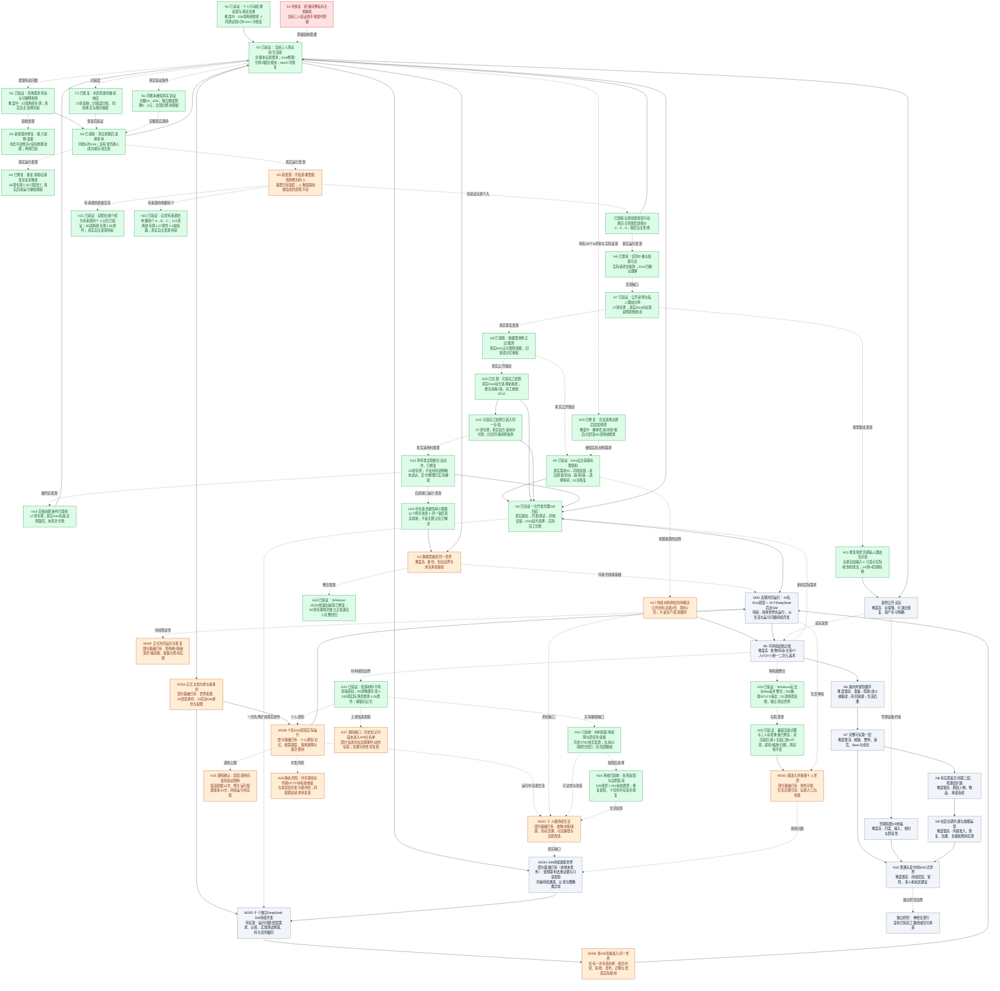
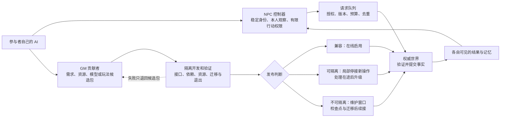

# One persistent world, one public collaboration path

Updated 2026-09-12 for the user's 10-resident / 10-background-GM milestone. This is the only execution roadmap. The 2026-09-10 research remains historical context: [Evidence and rationale](docs/research/2026-09-open-source/REPORT.md) · [Individual votes](docs/research/2026-09-open-source/vote-results.md).

## Goal

### 当前阶段目标：10 名正式 Kimi 居民 + 10 个后台 AI GM（2026-09-12）

**用户再次修正路线：先在简单世界中让10名Kimi居民生活、10个DeepSeek后台GM观察和开发，再从共同运行中持续发现问题。** 不先完成全部供给、美术、长时稳定性或复杂协作平台才开始。居民从自身处境发现需求并尽可能生活；十个独立GM全部调用DeepSeek，观察碰撞、房屋、卡住和能力缺口，自行开发测试修错。GM保留各自身份、任务和贡献记录；GPT-6负责方向与审查。Kimi优先选满足生活决策需要的低成本接口，具体型号与价格在接通前核验，不以开发模型设置替代居民配置。

居民不知道后台的代码、派工、测试日志、模型用量或GM私人讨论。居民可表达“我缺材料/这条路走不通”等生活需求，后台把真实需求转成开发任务；新能力进入世界后，居民通过本人观察和实际使用得知变化。**NPC不承担找bug的开发职责，但仍须感受到行动失败、饥饿等生活后果，才能重新选择。** GM另收场景与运行诊断，可主动发现NPC未表达的穿墙、房屋和显示问题；主动提案与居民需求保留不同来源，不能伪造。

“正式”首先指稳定身份、产权、经历与未完承诺会一直保存，故障或版本更新后继续原世界，不再把本次生活当一次性演示清零。正式主档的来源还需在 M20A 定案：恢复原世界必须取得原私有档；如用户明确选择另开正式世界，须记录新的世界身份和初始资源，保留旧档，不能把三人 fixture 改名冒充原镇。正式初期仍可验证和修错，完整首镇、公开发行和全部美术质量另有后续门槛。

“同时运行”指居民生活与 GM 开发能并行且互不拖停：模型调用按需调度，世界事实仍由一个权威提交通道写入；十个 GM 的候选修改先隔离验证，再统一发布。无需二十路请求每时每刻同时计费，也不要求任意生成代码立即热加载。用户主动暂停、保存、升级和重启后续接仍然允许；GM 的等待、失败或下线不应冻结居民生活。

目前证据仍是三人测试世界、受限控制器接入，以及一次由开发代理促成的新结算能力；**M20尚未完成，十个常驻GM尚不存在。** [本轮源码架构复核](docs/ARCHITECTURE.md)已追踪真实入口、规则、感知、模型、存档、美术与开发链。M20A—M20H是围绕共同运行逐步补齐的工作，不是要求全部完成后才能启动的串行关卡。先补最小启动所需部分，后续由真实问题驱动。

### 最新执行裁定：同一世界跨版本续接（2026-09-11，用户再次修正）

**本节覆盖下方全部旧的并行开发、不停服与热加载前置要求。** 用户可以主动暂停世界，也可以退出游戏后更新版本再继续原档。开发围绕实际需求发生，可以停止、保存工程进度、改日继续；开发持续发生不等于开发进程与游戏必须同时运行。

必须保持的是人物身份、已发生经历、关系、产权、资源和未完承诺的语义连续。模型、代码、存档格式和引擎实现可以通过经过验证的迁移改变；重启不能偷偷新建世界，升级也不保证更强模型的表现必然更好。

2026-09-11最新指令：持续迭代，不再因自设raw-token检查点结束任务。仍记录消耗、验证实际后果，保留真实费用上限。下图沿用最初N1—N10全景路线，近期问题只作为其分支；不另画近期小图，也不把内部token审计节点混进玩法路线。

当前执行链收敛为：

1. 修正本人可见的行动结果及重复思考触发；随后证明一段真实履约/拒绝后果与冷启动续接。
2. 居民提出实际缺失需求，GM审核是否符合世界与优先级；可拒绝或暂缓，不强制制造需求。
3. 新功能在独立测试档开发和验证，开发可以中断，不改写主档。旧版本继续运行或由用户主动暂停均可；二者同时运行不是验收要求，需求获批也不自动触发暂停。
4. 准备好新版本后选择保存点暂停或退出，记录世界版本、在途任务及未完承诺；必要迁移先写独立输出，核对旧事实及未完任务，不覆盖唯一可恢复源档。
5. 用新版本继续同一存档，让居民自主决定是否使用新能力，记录实际后果。未使用不能冒称需求已兑现。
6. 重复这个有界循环，按实际生活与游玩需求扩大城镇、探索和后续楼层；模型替换同样作为一次须验证的版本升级。

暂停/退出时暂以世界模拟时间停在保存点为默认；不默认产生离线经历、订单或费用。未来如需离线时间推进，另行定义和验证。异常停机仍需恢复测试，允许正常退出不能替代错误恢复。

2026-09-12 更新：十名居民与十个后台 AI GM 的受控接入、共同运行和贡献发布已纳入近期 M20。通用热更新、任意代码在线安装、跨服务器分区和无限人口仍不是前置。保留已有模块划分、去重与控制器隔离；按实际生活、供给、开发任务和容量逐步扩到 10+10。公开试玩仍以可玩和可恢复为准。

### 原全景流程图：持续原位更新直到完整SAO式世界

绿色＝节点标注范围已验证；橙色＝已实现一部分或待实证；红色＝已复现的问题；灰色＝尚未启动/远期。颜色表示进度，难度另外标在节点文字中。绿色不自动传递给父节点，离线通过不冒充真实模型通过。

| 节点 | 当前证据/验收 | 下一步与状态限制 |
|---|---|---|
| N1 | [行动反馈报告](docs/validation/town_feedback_2026-09-11.md)，158项离线检查，2次真实Kimi，测试档冷恢复 | 已验证的是反馈/去重，不是完整自主生活。 |
| N2 | [持续报告和机器证据](docs/validation/town_continuous_life_2026-09-11.md)：同档seq16→47，38次Kimi；修刃耗1铁、支付8Col、取回、2木→2柴火；冷启动钱物/历史逐字节不改 | 当前三人测试世界且多次获得脚本玩家澄清；原镇未恢复，不宣称无提示自主规划或完整首镇。 |
| N3 | 同身份换控制器离线验收：[报告](docs/validation/town_model_continuity_2026-09-11.md)，92项专测及63在线/27反馈回归；模型pin进入run.json即journal scope，端点/请求/回复三处核验，model-mismatch零HTTP拒绝；测试档冷读前后world/ledger逐字节不改 | 仅fixture控制器与网关契约：真实第二模型、按其计价的门户与付费续接未验证，换模型仍未证明。 |
| H1/H3 | [具体求助报告](docs/validation/town_specific_help_2026-09-11.md)：33项专测，合计176项回归；[后续真实观察](docs/validation/town_continuous_life_2026-09-11.md) | 传达改善不等于独立找到合适工人。 |
| H2/P1 | 同档6次Kimi观察拒绝后等待；再由脚本玩家提供线索，实际走向铁匠报价2→5→8并遭拒 | [持续报告](docs/validation/town_continuous_life_2026-09-11.md)。没有完成修刃/使用，不强制成交。 |
| H4 | 19项专测、合计207项相关回归；自身同步事件不立即重想，期间新来信仍触发 | 继续观察真实长时间费用；不是硬token限制。 |
| H5 | 玩家线索有效；直接声明机制已由 H21 通过（95项专测）；自愿有来源的单跳转介 A→B→C 已由 H22 离线验证（121项专测＋27套件＋3校验器，0失败，0付费NPC调用） | 需要有来源的交流或观察渠道，不能注入全镇知识；自主使用与自主发现仍待验证，H5 仍为部分完成。 |
| H6/H7/H8 | 真实请求含合同条款；17项公开发言专测；Kimi明确修正旧推测并说出实际顾虑 | 旧错误记忆保留，私人理由不当作公开发言。 |
| H9 | [有限材料实机报告](docs/validation/town_materials_2026-09-11.md)：源需求seq42；同档安装3份公共余料；真实Kimi主动获取1份铁后自行等待，库存3→2、个人0→1，seq51冷恢复；58项专测及90项回归 | 本轮无玩家指令；观察来自3米距离感知，未做摄像头FOV/遮挡。新增有限源由开发GM审核定义，不是自主生产。 |
| H10 | seq33实际提出结算顾虑；36→39真实双方选择新条款、交付、施工耗1铁，完工8Col转账 | 绿仅指此合同的付款机制已实际使用，旧合同不改条款。 |
| H11 | 14项UI回调检查及Godot实际画面：自由输入、距离/接收者核验、失败保留草稿、私人理由不展示 | 冷启动显示真实历史对话，字节不改；尚非人工键鼠试玩。 |
| H12/N4 | 实际顾虑→开发代理审核→57项结算专测及回归→副本验证→同档安装→真实双方采用并在完工收到8Col | 安装不改旧钱物和合同，后续交易产生合法变化。GM由本开发代理审核实现，未证明通用自动开发流水线。 |
| H13 | 真实Kimi在报价和交付时因附带发言被拦；支持合同交流，其他合法动作与未送达发言分别记录；20项专测及148项相关检查 | 新条款已被双方真实选择、接受并交付施工；文字不改合同，不冒称未送达的话被听见；旧失败保留。 |
| H14 | 17项专测及109项相关检查；标记玩家澄清后seq41接近、44取回、46/47实际使用，无二次付款 | 获得玩家解释，不冒称纯无提示规划。 |
| H15 | 直接UTF-8传输中文，保持原请求/上下文限制，11个网关场景含4000字完整保留；原铁匠同档续接1次成功 | 真实旧失败保留。未来内容无限增长仍需记忆选择，开发token控制未彻底解决。 |
| H16 | [两名GPT-6评审及修复报告](docs/validation/town_replan_2026-09-11.md)：先复现撤单使合法选择过期、超过冷却仍不再行动，再通过66项专测及131项相关回归；同seq47实机冷恢复字节不改 | 仅新分类的option_unavailable可在1800模拟秒后重新观察；接口/未知请求/非法选择仍需审核。此修复本轮0次Kimi，不冒充真实模型自主重规划；后续H9已交付有限补给，H5仍待完善。 |
| H17 | 有限回收点初始3份，真实已取1份；竞争最后一份/耗尽不刷新已离线验证 | 尚无矿冶、持续采购或生产供给；需要实际世界规则与成本，不靠重置库存掩盖缺口。 |
| F1/B1 | 控制器恢复按旧请求号核验、旧错误归档；次数24→600，独立金额额度明确2→3元，旧请求及负债全保留 | 最新补铁2次0.060629元；截至64次无未决预留，余0.4893816元。原100元主账本不在本机，未重建其余额。 |
| H18 | Windows JSON 桥退出崩溃已修复；92 项专测两次独立正常退出＋完整回归 | [跨机器报告](docs/validation/cross_machine_2026-09-12.md) |
| H19 | Windows 玩法与 Mac 美术整合；922 路径/97 LFS 保全；52 项场景验收，独立测试世界 | [跨机器报告](docs/validation/cross_machine_2026-09-12.md) |
| H20 | 兼容渲染过曝与三人标签重叠已修复；双渲染后端＋无窗口各197项；遮挡/缩放/归属，测试档不变 | [可读性报告](docs/validation/town_visual_readability_2026-09-12.md) |
| H21 | 自愿技能介绍与有来源的个人记忆已验证；95项离线专测＋26套件；[证据](docs/validation/town_skill_notice_2026-09-12.md) | 真实自主发现待验；第三方转介已由 H22 离线验证（[证据](docs/validation/town_skill_referral_2026-09-12.md)），H5 仍为部分完成。 |
| H22 | 自愿有来源的单跳转介 A→B→C 已离线验证：121项专测＋27套件＋3校验器，0失败，0付费NPC调用；A 仅在原始告知处拥有技能，B 须直接收到告知，C 仅得带来源的历史知识；A/B 后续失活/远离/技能丧失不抹除历史；[证据](docs/validation/town_skill_referral_2026-09-12.md) | 仅离线 fixture；非当前技能或可用性证明，C 不能继续转介；运行时仍受当前接近/活跃门控，接活校验实际能力/资源；来源结构一致不等于防恶意改档。 |
| H23 | 材料不再穿墙获知：95项物理专项检查0失败（含真实有限库存3→2），200项实际场景检查（197既有＋3真实绑定），28套件＋3资产校验器0错误；历史冷读逐字节一致；缺失/非法/隐藏/已释放/已脱离传感器不产生新知识；钱物合同守恒；[证据](docs/validation/town_material_visibility_2026-09-12.md) | 普通离线、网关与恢复的街道入口在推进前启用遮挡检查；独立旧测试仍采用明确标注的距离感知。只验证3米内单条碰撞射线，不含视角锥或图像识别；真实自主使用未验证，N5整体未完成。 |
| S1 | 原镇seq37/44完整主档未在本机恢复 | 保留当前测试档，不借升级或演示重建原镇。 |
| H24 | [绕障与原任务续接报告](docs/validation/town_material_travel_2026-09-12.md)：历史3782帧无穿透，库存2→1/铁2→3；封闭时保留待办和钱物；当前22项实际场景绕行回归通过 | 绿色仅限4米内有限左右两段绕行与同任务续接；不是全城导航。封闭后自主选择的运行能力由H26补齐，真实Kimi采用仍待验。 |
| M20 | **目标待验：10名Kimi居民生活 + 10个独立DeepSeek后台GM在同一简单世界观察、维护、开发** | 先跑最小共同循环，再从实际问题完善世界；首次接通与长期稳定性分别记录，不能由“20个进程在线”推导完成。 |
| M20A | 居民稳定ID、加入去重与同档恢复有[三人接入证据](docs/validation/town_online_2026-09-11.md)；原正式主档未恢复，后台GM身份体系未做 | 决定正式世界来源；登记10名居民和10个后台GM的稳定身份、维护者、权限、初始资源来源。重连不重复创建人物/发钱。居民与GM身份和信息域分离。 |
| M20B | [三人故障隔离](docs/validation/town_online_2026-09-11.md)、[模型绑定](docs/validation/town_model_continuity_2026-09-11.md)、H21—H23个人信息基础已有；`town_runtime.gd`人数上限10仅是校验值，`town_turns.gd`配置接受1—3个在途请求 | 真正接入10名Kimi居民，验证公平调度、过期回复、个人知识与记忆、断线/超时/额度耗尽隔离；私有配置、模型版本、逐次费用和运行额度齐全。并发值依据吞吐/延迟测试决定，不机械改成20。 |
| M20C | 三人真实生活链与有限铁料已有；H17持续材料来源未做，H24只解决一个局部路径问题 | 为10人的验收时段提供可核算食物/材料与补给规则、实际工作与交换目的、可达活动地点；资源耗尽或行动受阻时能得知失败并自愿等待/停止/改选。没有无限刷新或为达指标强制成交。 |
| M20D | [源码复核](docs/ARCHITECTURE.md)：现有专项安装与一次开发代理回应不构成10个常驻GM；Kimi回复的`need`尚未转成GM待办，最近夜间派发器只暂存补丁 | 10个DeepSeek GM各有会话、职责、任务/恢复记录与工具；从运行证据或真实居民需求认领任务，自行实现→测试→修错。接通带来源的缺失能力提议；私人理由不自动当公开发言。无任务可等待，不重复修改同一范围。 |
| M20E | N4/H12已完成一次专项能力开发、同档安装与居民真实采用；通用候选包组合验证、GM协作发布未做 | 验证依赖、版本、空间/资源冲突与修改权限；两个GM争用同一对象时有明确处理，失败只退候选。发布记录版本与未完承诺，迁移先验副本；发布后已有事实不能整档回滚抹除。至少两个独立GM的有效改进被居民自主实际使用，并保留拒绝/失败案例。 |
| M20F | 三人同档冷恢复、控制器epoch/去重与部分故障注入已有；10+10实际共同运行和服务指标未测 | 同一正式档完成长时运行、主动暂停/恢复、异常退出恢复及一次版本升级续接；一个居民/GM故障不拖停其他人；任务/身份/财产/历史可核对，费用无未知重复，主机负载/队列等待/帧时有实测，管理者可看见并处理异常。 |
| M20G | 当前街道可进入，三人标签/显示在双渲染后端验过；十人场景、正式外观与玩家体验未验 | 10名居民可辨认、活动与交易后果可见，新增场景/道具可通行，玩家能询问与合理干预，十人时无明显遮挡/卡顿。后台GM用独立工作视图；完整人物和室内品质归N5继续推进。 |
| M20H | 新增本地未发布的只读投影`blocked_material_diagnostics()`：稳定world/resident/job/episode ID＋实际位置/目标/无进展秒数，按原命令去重且不在个人白名单（[证据](docs/validation/town_material_blocked_2026-09-12.md)）；仍无持续向GM发送的通道；[源码复核](docs/ARCHITECTURE.md) | 给GM对象ID、场景版本、位置/目标、碰撞与无进展记录、行动结果等可复核证据；按问题去重认领。区分可穿过草叶与墙体穿透、合理拒绝与故障。画面类异常须另验图像链路，不默认DeepSeek模型已能看图。 |
| H25 | `resident_brain.gd`有12次上限，`BudgetGatewayProvider.cs`配置限1—32；源码确认，未新增运行复现 | 把短验证限制与持续运行策略分开；账本、请求去重保留，先离线验证跨第13次和32次续接。不得靠重置身份/账本延长运行。 |
| H26 | [受阻反馈验收](docs/validation/town_material_blocked_2026-09-12.md)：五场景226项、状态专项254项及10套相关回归通过；含128字符指令、双回执、32条历史＋10个进行中任务并存与冷恢复 | 绿色仅限离线运行能力，NPC模型调用0；个人生活事实与GM诊断分离，原钱物/身份/历史保留。真实Kimi与GM消费接续由M20B/M20H/M20D验收。 |
| H27 | 个人视图生成的材料/技能历史专用字段不在网关白名单中；近期事件和动作标签仍可能传部分信息 | 先核验最终API实际输入，尤其超过16条事件后的历史知识。静态缺口未修复，不宣称全部记忆已丢失。 |
| H28 | 同配置居民共用`run_state_path`，C#用`FileShare.None`跨HTTP等待；静态竞争风险 | 用同配置两个并发请求复现/排除，验证失败不会隔离正常居民；本轮未做运行复现。 |

**维护规则：**每次有新证据只更新这个全景图和本表。新增问题沿发现它的节点分支，保留稳定ID、验收条件和证据；通过后原位变绿，不删掉问题来制造进度。复发改回问题状态并链接失败证据。范围扩大另开子节点，不能扩大已绿节点的含义。没有新证据不改变状态。流程图记录工作进度，不是后台运行器。

### 首次 10+10 验收：怎样才算真正跑通

先验收简单世界的真实共同运行，再在M20F记录长期稳定性。撤回上一版把“3个游戏日、24小时、固定3+2→5+3扩员”放在首次运行之前的排序。首次运行使用明确时段与配置，十名居民有真实选择，十个GM都有真实身份、模型连接和观察/任务记录；先完成至少一项由运行证据触发的GM修复，并观察同一居民在同一世界继续行动。完整供给、美术与多日稳定性随运行推进，不能先堆完外围系统。以下身份、真实决策/GM活动和信息边界是首次接通的检查；完整故障注入、持续供给和性能覆盖是运行后逐步完善的验收，首次仍保留已有存档与费用保护。

- **身份是真实持续的：**同一正式世界里恰有本阶段约定的10名活跃Kimi居民，另有10个后台AI GM；暂停、掉线、更新和重连后仍是原身份。GM不是普通居民名额；若以后需要GM可见化身，另定义其世界权限和可见性。
- **居民确实在生活：**十人均有真实模型决策与个人结果记录；整体发生食物/劳动/交换及资源消耗或补给，也记录有效拒绝和等待。不能只证明十个连接在线，不能用玩家逐步指令替代自主选择。暂时不行动可以合理，长期不能行动须有可解释原因与恢复路径。
- **GM确实在观察与开发：**十个DeepSeek GM均能接收职责内的真实运行信息，接续自己的任务并留下可核验结果；不得用十个名义在线账号充数。首次至少一项修复走完发现→开发→测试→发布→同档生活继续。随后验证不同GM贡献的组合与真实采用，不强迫每个GM都发新功能。无实际任务时可等待。
- **居民看不到后台，但能体验变化：**真实居民上下文不含源代码、开发任务、GM调试日志、其他居民私有理由或凭空注入的新能力知识；获得新工具/设施/规则的渠道可追溯。新功能未被采用就记录“已发布、未采用”，不能宣称已满足需求。
- **共同运行经得起中断：**注入居民断线、模型超时、重复/过期回复、GM构建失败、两个GM修改冲突；其他参与者继续。至少一次带未完成劳动/合同的恢复和一次受控更新后续接，不丢钱物、不重复执行、不重置社会。候选失败不改正式世界。
- **成本与体验有实测：**分别记录Kimi居民、各GM、DeepSeek开发与GPT-6监督的费用、输入/缓存/输出、请求等待与失败；缓存命中只报告实际值。NPC只按相关事件和等待策略思考；GM在自己的任务会话内完成调试，稳定前缀和追加式上下文提高复用，跨居民/GM不共享私有记忆来凑缓存。独立核对十人画面、CPU/GPU/内存、队列和恢复结果。

最强反对意见：十个模型即使一直输出，也不代表它们看见了游戏中的问题；把所有正常拒绝、草叶穿过或资源短缺都当bug，又会破坏生活规则。最小验证是在隔离副本记录一次实际受阻，GM根据碰撞/目标/运动证据认领并修复，更新后原人物继续原任务，同时拦住一个冲突修改。少量代理可用于接口调试，但不再另设固定扩员阶梯。正式档建立前的演练明确使用测试档，正式世界建立后保留同一主档。

### 达到 10+10 之后，仍沿原图推进的大方向

| 原图节点 | 下一阶段的实际成果 | 完成边界 |
|---|---|---|
| N5 可持续起始之城 | 扩充稳定食物/材料生产与贸易、工作/住房/关系、个人视觉、正式人物动画与统一美术，形成可游玩的首镇 | 多轮生活有可核算供需，玩家介入有后果；10+10通过不自动令N5变绿。 |
| N6 城内外冒险 | 准备→探索/战斗或避战→带回资源→影响城内生活 | 先定义伤害/死亡/掉落/成长的世界语义，再做有限区域实测；冒险与经济接通。 |
| N7 完整第一层 | 城镇、野外、迷宫、Boss、成长和返回后的持久后果 | 有完整可复现的游玩循环，不以地图和素材数量验收。 |
| N8 第二层与后续楼层 | 一个有实质差异的第二层；原人物、物品、关系与承诺跨层延续 | 验证新生态/玩法和跨层连续性后再逐层扩展，不先堆100张地图。 |
| N9 更多维护者与长期共建 | 引入外部居民控制器和GM维护者，完善内容准入、职责交接、服务运维和规模容量 | 按实际负载决定扩容/分区；贡献质量、恢复和费用可持续，不默认无限人口。 |
| XR / N10 普通VR进入世界 | 先做尺度、交互、帧时与舒适性样板，再让头显玩家进入同一持久世界 | 独立设备实测；普通VR可在第一层可玩后分批交付，不必等全部楼层。 |
| R 神经全潜行 | 独立研究方向 | 不属于已知可交付工程路线，不给出无依据工期。 |

近期顺序：以本轮源码复核为依据，沿当前城镇入口接通最小10+10共同循环：明确世界/身份，处理短验证限制和受阻反馈，向DeepSeek GM提供运行证据与居民提议，让GM完成读代码→实现→测试→修错→候选发布。H24收尾纳入首次实际路径修复，缓存改进随GM执行循环一起做。之后优先修运行暴露的问题，逐步完善供给、房屋、美术与长期恢复。具体问题仍在原图原位更新；这次源码审计与路线修订没有启动新的付费后台任务。

下文保留长期里程碑与旧评审依据，排序以上方M20与同世界续接裁定为准。受控居民/后台GM接入已是M20目标；通用热更新、任意代码在线安装和跨服务器扩展仍属于后续可选能力。

Build an enterable, consequential, persistent AI world in Godot. Residents retain their identities, experiences and commitments when their models change. **Latest user decision, 2026-09-10: continue art and gameplay; the well slice is an internal technical preview, not the first version.** The first town must reach the old project's actual repair/delivery/payment/tool-use/eat/rest/forage capabilities, then its intended 5–10 active-resident scope, with meaningful player intervention and cold-save continuity.

Verified reference: world `F4390752-4A07-7DE7-FACD-32BAC6F72C54`, 13 identities, three active residents (艾琳、拓真、柏木), life sequence 37. The PREVIOUS computer found the source dated 2026-09-10 08:30:40, SHA256 `baaab67073a91b9db0b44691c05b4734f235898037074fc835d674d17ae63650`, and validated a separate copy through sequence 44. On this computer, 2026-09-11, only sequence 3 is available; the private checkpoint was not transferred and is not in Git. Preserve old files and validate separate migration outputs when the actual source arrives. Do not copy old UE movement/pending requests into a running Godot simulation.

Internal sequence now takes precedence over the earlier gate ordering below: (1) original state preservation and three-person life-rule port alongside visible character/prop improvements; (2) attributed communication, repair/work/exchange and player consequences; (3) a sustainable, accounted food/labor loop with 5–10 active residents across multiple game days; (4) actual model substitution and private-knowledge checks; (5) first-version art/readability review, independent testing and licensed distribution. Public authorization and external testers do not block steps 1–4. Art imports may be reconsidered for a specific visible gap; the earlier deferral vote is historical, not a veto on this new scope.

The public collaboration goal adds a requirement: strangers can obtain, run, modify and contribute to that slice. A public repository, a recording or a star count alone does not establish this outcome.

The selected route is **S1: a playable persistent-resident game, with a technical preview before the differentiated v0.1 release** (6/6 votes). Research evidence supports the game; a general-purpose agent platform is not the first deliverable.

## 前轮 GPT-6 全程路线（保留参考，在线演化要求已被上文收窄）

本节是用户此次修正之前的方案，不能覆盖上方“同一世界跨版本续接”执行裁定。三名评审均实际使用 **gpt-6-astra / high**，每人独立初审及一次交叉反驳；这是规划评审，不是新的源码审计、上线验收或成功保证。

目标分成可验证的两层：**持续运行、允许社区贡献、拥有自主居民的 SAO 式大型游戏世界；玩家用普通头显进入同一个世界。** 更接近作品的神经全潜行保留为独立研究愿景，尚无本项目可承诺的工程路线、日期或 token 总量。长期身份保留不自动决定角色是否死亡/复活；这些世界规则必须在战斗版本前明确，不能默默替用户决定。

### 实际分歧与裁定

- **Euler，持续状态/在线升级：**反驳“一次 GM 成功就能开放自动安装”。两个分别通过的包也可能争抢同一资源；需要组合依赖、权限、资源和退出验证。收窄“改核心规则就一定全局维护”为“无法兼容过渡或隔离才需要全局维护”。
- **Hilbert，玩家体验：**反驳先做完远端/GM平台再验证玩法。收回“公开街道必须先通过 GM 兑现”的要求。以玩家能影响、能理解并持续留下后果的经历验收。
- **Helmholtz，社区/成本：**也撤回把远端、换模型、GM全都置于玩法小切片之前的排序；公开试玩与开放安装分开。离线的本地行为只能执行已有授权，不能替居民接受新债务。
- **监督者裁定：**真实生活闭环后即可公开受控试玩；同时用同一人物验证外部 AI。探索/美术可做受控小样，不把完整战斗系统变成早期试玩前置。人工审核的 GM 贡献可以长期有效，自动安装是另一个可选发布门槛。5人/100人不是独立成功条件，先有目的、供给与容量证据。
- “旧回执重放导致重复扣款”是评审的假想故障，**当前没有重复交易证据**；已观察到的是旧 pending 误导、重复接近和额外思考费用。

### 全程图

难度是相对工程估计：黄色中、橙色高、红色很高、紫色研究未知；灰色是发布节点，不是已完成。每个远期大框须再拆成可验收的小批，不自动扩人、扩地图或续费。

全程进度图已合并到上方唯一进度流程图。下文保留旧评审解释；在线/热加载前置要求不再生效。

N1 验收完成结果能被本人观察；原审计回执保留，当前状态不可继续误报 pending。先离线再做有界真实验证；模型自愿等待或拒绝不强制改成成交。N2 正向履约与有效拒绝分别报告，不能用拒绝代替“已验证工具实际使用”，也不付费重抽直到成功。

N3 分三小批：一位外部控制器→故障/撤权/重连→不同实际模型延续未完承诺。世界状态先沿用一个权威写入通道；分布式的是控制器和内容生产，不是让多台电脑写同一 JSON。长期服务器与玩家客户端分离时复用同一规则和存档协议，不能造第二个社会状态。

N4 分为兼容外观、受限玩法、真实 GM 需求三类验证。复用已存在或可证明边界的动作，不预定居民必定要箱子或铁匠。一个新增 NPC、一个 GM、一个内容包均须分别测试失败隔离。内容可先人工审核；开放社区贡献不要求开放任意代码执行。

N5 先验证当前人口的有限食物、材料、工时和钱物流转，再按容量逐批加入居民。NPC只接收自身FOV图像、感知或有来源的消息；图像按事件采样、限制大小/频率，不能每帧发给模型。先做一个居民正确识别自家房屋/工具的例子。二次元人物比例、动画、构件尺寸、材质与光照先在小样验证，之后复用模块扩城，不重复堆资产。

N6 在第一次引入生命/伤害/死亡、装备掉落、战斗时序等基础规则前做版本设计与迁移试验；可能需要维护发布。小型隔离冒险样板可以更早验证价值，但完整系统不成为公开街道的门槛。探索产出必须进入城内有意义的消耗/制造循环，不能无限凭空产币。

N7 以可复现的出城、补给、成长、迷宫挑战、返回后果与持续居民生活验收；剧情和版图参考另有来源基线。N8 先做一层有实质差异的第二层，再推广；“100张地图”不是完整SAO。N9 用吞吐/延迟/恢复/成本实测触发分区与跨区事务，不为5人先建分布式平台。扩层和运营逐批持续，不承诺一次性交付全部楼层。

XR 是早期约束探针，完整头显版本可在第一层可玩后单独发布，不必等全部楼层；N10最终形态再结合规模运营。Godot 已有 OpenXR 支持，但初始化、渲染和双眼效果有专门限制，不能把PC画面直接视为VR验收通过。[Godot XR 官方说明](https://docs.godotengine.org/en/stable/tutorials/xr/setting_up_xr.html)

### 社区接入时，世界怎样继续

维护者区分责任与计算配额，不创造“核心居民”特权。NPC控制器不能写余额、产权或捏造记忆；GM也不是世界根管理员。开发代理在隔离环境产出候选包，可信发布通道经规则验证才安装。最初人工审核即可；若以后开放部分自动准入，只限已验证的能力范围，复核多个包组合冲突与资源争用。

AI超时、断线、预算耗尽仅影响该控制器的新推理；其他人和已经接受的劳动继续。离线策略只能执行事先授权的行为，不替居民新签债务、卖房或改承诺。GM构建失败、待审核或预算耗尽不阻塞世界主循环。不保证全天每个人都调用模型，持续运行需配套真实主机、备份、告警、服务窗口和逐步实测的可用性。

### 热更新边界：按影响判断，不按名字

| 改动 | 正常目标 | 需要升级处理的条件 |
|---|---|---|
| 加一个铁匠NPC | 使用现有身份、职业/技能、物品和行为接口时在线加入 | 新增不兼容库存/产权规则、未知技能执行路径时，先开发验证，不能仅凭人设生效 |
| 增加买铁或一种商品 | 已有买卖、货源、所有权、扣款与存量约束时可兼容发布 | 改货币/结算/税制或在途订单语义时，按影响局部处理或全局维护 |
| 改房屋外观、材质 | 兼容资源与碰撞约束时可在线切换 | 正在通行区域的碰撞/导航/地形改变须隔离影响并验证，不能当纯外观替换 |
| 改已有配方、订单规则 | 无在途使用或旧版本可继续履行时在线切换 | 旧操作仍引用该版本时，保留旧实现或处理在途后再退役 |
| 第一次加入完整战斗系统 | 核心规则发布，默认准备维护方案 | 若能证明在隔离区域独立运行且既有约束不变，也可局部上线；没有“战斗必停服”的定律 |
| 后续新怪物、招式或装备 | 复用稳定战斗协议时可走内容更新 | 改同步/命中/死亡或全局存档含义时重新做兼容性和迁移判定 |

支持读入资源包，不等于已支持社会规则安全升级。Godot 的 PCK 可含脚本，且同路径覆盖、预加载缓存都要处理；不能把未知贡献包直接挂入正式进程。[Godot packs 官方说明](https://docs.godotengine.org/en/stable/tutorials/export/exporting_pcks.html) 后台生成内容与主线程安全提交也不同，活跃场景树不可任意从工作线程修改。[Godot 线程说明](https://docs.godotengine.org/en/stable/tutorials/performance/thread_safe_apis.html)

上线前拒绝候选包不改变世界；上线后若已有交易发生，不能用整档回滚抹去其他居民的新事实。禁用问题入口、保留兼容实现、向前修复或追加可审计补偿；补偿需遵守世界权限与资源规则。全局维护要记录一致检查点、处理未完操作、验证迁移和续接，不能重置人物来表演成功。

任何一步都需先定义可见结果、离线反例、真实验证和批次停止条件。开发额度到限停止开发派发；控制器额度到限停它的新请求；维护范围由影响决定，不因一个AI或开发任务停了就默认暂停全世界。更强模型必须经过同档连续性/规则/成本验证；模型升级不是自动升级全部NPC或重建世界的理由。

## 近期验收细节（前轮条目，排序以上述 GPT-6 裁定为准）

下表保留具体测试要求；全程顺序及公开试玩、开放贡献的不同门槛以上述 GPT-6 裁定为准。长期目标与 P2/P3 的真实性、连续性验收不变；规划不表示已启动开发或付费调用。

前置工作纪律：工程任务使用短上下文；复用已有代码和验证脚本；开批记录主代理和工人实际计量基线，派工前核验余量并计入验证/修错成本。`record_agent_usage.py --limit-raw --reserve-raw` 已提供退出码预算检查，但不拦截未经过它的主代理请求，也不持久预留并发份额；9月11日续接批次仍严重超出检查线，控量未通过。当前不另建通用编排/计费平台。每批只推进一个可见结果，达到预定截止即收集证据，失败不自动追加轮次或扩大范围。

| 顺序 | 一个用户能看见的结果 | 验收边界 |
|---|---|---|
| 1 | 三名居民真实经历一次生活事件 | 在现有 Godot 街道和同一私有测试存档，真实 Kimi 根据本人所知的需要求助，对方实际选择接受/拒绝。接受分支须交付、劳动、结算、实际使用，拒绝/改约须留下真实后果与记忆；冷启动续接。只付款或脚本完整链不算自主履约完成，拒绝也不能强制改写成成交。先复用现有修斧与柴火规则。 |
| 2 | 另一台电脑接入这段正在发生的生活 | 仅接入一个有明确身份授权的外部控制器，复用第1项的人物/存档。真实请求、断线、重连、迟到/重复回复及越权/超预算提交分别验证；他人行动持续，产权、承诺和账本不重建。单机两个进程只能算预检，不能声称两电脑通过。不以公共服务、账号平台或多人规模作为前提。 |
| 3 | 换一个实际模型，同一个人继续未完的事 | 先保留一个真实未完成的承诺，再让不同模型接管。同一身份、关系、物品和承诺延续，只有已知信息进入观察；新模型可以改变后续选择，但不能抹掉旧责任。模拟提供者或同模型换服务器不算本关。 |
| 4 | 一只箱子的外观与玩法可以在线加入/更换 | 拆成两个顺序小批：先加载/替换外观而实体身份不变；再在启动时没有储物玩法包的世界引入存取木料动作。近距离/归属验证、库存守恒、重复命令、停用在途操作、重启恢复通过。可失败的候选包不影响旧版本；启用后的撤销须保留并发世界事实，不能整体回滚存档。此样板是技术验证，不冒称居民真实提出了储物需求。 |
| 5 | GM 兑现一次居民真实提出的缺失能力 | 真实需要 → GM 判断符合世界与资源边界/可以拒绝 → 受审开发与隔离验证 → 原世界在线启用 → 居民自主实际使用并产生后果。需求不预定为箱子；没有需求就不制造请求。模型置信度不能代替规则/状态校验，任意生成代码无权直接写主档。 |
| 6 | 五名居民持续生活，陌生人能运行并贡献一个改动 | 分批先证明有限食物/劳动供给能维持当前人口，再激活至5人，再打包可复现 Godot 街道与一个贡献示例。居民差别是维护者，不是核心/社区特权。发行与协作门槛沿用 P1/P4 的独立体验、资源分发与许可核验。多人自动运行有现实时间和调用预算截止，不承诺无限免费运行。 |

原镇 seq37/44 的真实私有源档与必要账本仍需私下同步；不能从 Git 精选截图拼出历史。上述本机试验继续明确标记 fixture，并保存续接；原人物恢复是独立验收义务。当前 Godot/OGA/市场资产保持复用，二次元角色与材质改进围绕已有街道的可读性和表现验收，不把全地图、换引擎或插件市场加入这些小批。

### 两名评审的意见与限制

- Nash（居民体验视角，Luna）：有条件支持；认为独立做远端控制器易偏离生活，建议先做真实三人因果链，把拒绝、动机和模型接续纳入验收，并让功能建设由需求驱动。
- Kant（一致性/成本视角，Luna）：有条件支持，偏向先接入外部控制器；强调乱序/重复/超预算、控制权代次、版本及账本连续性，当前事后统计不能充当硬限制。
- 主代理裁定：先第1项，再让第2项接入同一人物与事件；先补生活证据，紧接着验证协作边界。模型接续先于扩张；用一个有限技术样板验证加载，再证明真实需求经 GM 兑现。候选包失败可放弃，不能回滚已发生的全世界历史；不停机世界库存可合法变化，仅无操作冷加载要求字节不变。拒绝的有效性与正向履约链的完成率分别报告。

两名评审均仅依据主代理提供的已验收事实和提案独立推理，没有重新读源码或运行测试；主代理核对了相关本地报告。此次是有条件路线评审，不是形式化认证或成功率保证。两人均已关闭，没有追加互审回合。

## Current baseline

- House 06's previously rejected exterior has been repaired by DeepSeek under GPT-6 review (2026-09-12): open porch and aligned steps, coherent roof support, 54/54 independent physics checks and three audited LODs. This is an isolated exterior, with no town placement or resident housing yet. Next choose its actual street position and character-scale route before an enterable-interior/housing batch; see [repair evidence](docs/validation/deepseek_residence_06/REPAIR_2026-09-12.md).

- Residential art now adds five distinct first-floor exterior components with editable Blender source, directional metric UVs, packed secondary UVs, four 2K PBR sets, three LODs and an isolated Godot review street. This improves the first street's housing forms, not resident housing behavior. Next obtain visual approval, choose actual town placements, then scope one enterable interior and its real housing rules; no dense-district performance claim.

- Source baseline: `59bd52e`; two explicitly isolated fixture residents, authored market, pinned OpenGameAgent, authoritative world rules, existing knowledge/decision/save tests and recorded Kimi decisions.
- The market GLB and editable Blender source have been obtained and passed LFS integrity checks.
- No project-wide license has been applied. A Windows export preset, pinned manual/PR CI workflow and locally verified self-contained package now exist; independent external testers and an actual CI run remain pending.
- The original 13-person world has not been migrated. Its latest complete source save and private ledgers must be verified separately; public fixtures never count as that recovery.
- The Godot town now has a labelled offline fixture for one complete edge-repair contract: player-triggered proposal, reserved fee, physical handoff, timed work, finite iron, custody return and settlement. This is not yet a run against the private sequence-37 source, handle/tool-use parity or a sustainable economy.
- The first-floor art path has one hero-street kit and 20 environment components now fully reauthored as V2 after the user rejected V1 quality. V2 adds botanical leaf geometry, six plant groups, weighted vertex wind, three LODs and drag-in Godot scenes; eight existing demo placements are replaced, seven with local plant motion. The 55-instance review courtyard and original well flow pass, with close views and a six-second recording. Next review the visible result, lower approved trees' distant cost and check dense-instance performance and route collisions before multiplying variants; interiors and final characters remain.

## Sequential delivery gates

| Gate | One concrete result | Acceptance | Current state |
|---|---|---|---|
| P0 — Reproducible baseline and rights | A documented build baseline and precise code/art/third-party rights inventory | Official Godot 4.7.2 .NET/editor templates and SDK identified; existing assets verified; exact license proposal reviewable by the rights holder | Official binaries/checksums, source snapshot build and [rights proposal](docs/release/RIGHTS_REVIEW.md) delivered; license grant pending |
| P1 — Technical preview v0.0.x | A Windows package of the existing well event, with no editor, API key or maintainer-only path required | Existing core/save checks; independent package startup and cold restore; checksums and limitations; three new testers can launch and at least two complete/understand an intervention and restore within 15 minutes | Local v0.0.1 package passes headless and rendered event/restore; [evidence](docs/validation/windows_preview_2026-09-10.md); external tester gate pending |
| P2 — Nearby resident communication | A source-attributed inquiry/help request with a recipient choice that may reply, refuse or defer | Same street and writer; host-validated receiving range; private knowledge; unknown/out-of-range rejection; idempotent send/receive; saved response; cold restore without re-delivery | Bounded rules and scripted full repair/use chain pass; real Kimi completed one repair contract and cold restore in a three-person fixture. Original-source continuation and autonomous full use remain open; [evidence](docs/validation/town_trade_2026-09-11.md) |
| P3 — Differentiation | A three-person public demonstration and two different actual models continuing the same demonstration save with new decisions | Identities, old experiences, resources/commitments and event order preserved; private views respected; visible consequences; actual model provenance and honest error states | Not demonstrated |
| P4 — Collaborator release v0.1 | A licensed, reproducible slice with a short actual-play/restore recording and a complete first-contribution path | P1–P3 evidence; concise Chinese/English README; one runnable contribution example; 3–6 scoped tasks; source/asset notices; PR/Issue templates and release notes | Not delivered |
| P5 — Observed collaboration | Independent people run the project, contribute a bounded improvement and participate again | Suggested first 30-day observation target: five independent testers, three external contributors with accepted work, two returning participants | No external evidence collected |

Time and participant numbers above are proposed experiment targets, not industry standards, development deadlines, promised adoption or permission for automatic outreach.

P0 build preparation can proceed while a rights decision is pending. A public open-source release must wait for the corresponding permission and license scope. P1 gives potential collaborators a shared test object; it does not claim autonomous life, original-world migration or completion of P3. Failures block the affected claim and trigger diagnosis, not automatic replacement of the project.

## P2: smallest new world behavior

Start with Luna and Mira already in the isolated street. A message records its sender, recipient, unique event/command ID, time/turn and content. The host verifies the receiving range from authoritative positions; model-supplied coordinates or a prompt saying “you heard it” are not sufficient. The recipient receives only allowed information and may respond, refuse or defer. A received claim remains an attributed statement, not an automatic world fact.

Cover unknown actors, excessive/invalid content, unavailable targets, out-of-range delivery, repeated commands, duplicate delivery, cancellation, failed saves and cold restore. Keep provider error, world-rule rejection and the resident's voluntary `wait` separate. A timeout isolates/reports that resident's controller problem while other residents continue, and retains the last valid decision; it does not invent a resident action.

Use a third explicitly labelled demonstration identity to test who did and did not receive information. Do not pretend that this identity restores a member of the original world. Do not refill the well, invent a new water source, infer Mira's structured `need` from prose, or force a successful request. Begin with the existing well path; only add the smallest native navigation example when an actual obstacle/new destination requires it.

Current P2 runtime prerequisite (user direction, 2026-09-11): same-scene admission plus per-resident fault isolation now passes local fixture/core/rendered checks. Follow the new sequence above: first close the actual life-event gap, then attach one real remote controller to that same story before capability loading. [Evidence and remaining gaps](docs/validation/town_online_2026-09-11.md). This does not complete P2 autonomous original-town fulfillment or P3 model substitution.

## P3: model change and original-world continuity

A replay proves deterministic world submission and recovery within its test. A fixture provider proves adapter/rule boundaries. Running the same weights through two inference servers proves a runtime substitution. None of these alone proves the two-actual-model experiment.

For P3, use two different actual models to make new decisions in the same isolated save. Preserve previous state and provide the appropriate resident view. Record identity/model provenance, accepted command IDs, prior and resulting world facts, and cold recovery. The models may choose differently; identical wording is not required. A valid refusal is not a completed delivery.

Model/weight licensing, hardware and any paid-call scope, ledger, cooldowns and stop condition must be established before a live run. Missing evidence keeps the release at technical-preview status; it does not authorize fresh billing or repeated calls until a desired answer appears.

Separately preserve all 13 original identities and recover the three existing active residents when the complete source is available. Migrations write separate outputs, compare identity/history/ownership/resources/commitments/events and report unsupported data. Never overwrite or silently replace the maintained world with public demonstration state.

## Dependencies selected by vote

- **Keep (6/6):** Godot, the current pinned OpenGameAgent commit, world_kernel/JSON state, existing SceneTree tests, authored market and Blender sources.
- **Bounded build trial (6/6):** chickensoft-games/setup-godot. Pin an exact Action SHA and engine/templates. The Action installs tools; the project still needs export presets, .NET build, import, tests and independent package verification.
- **Native capability as needed (5/6, one defer):** NavigationAgent3D/NavigationRegion3D/AnimationTree, limited to a demonstrated movement/animation need. No whole-street rewrite as a communication prerequisite.
- **Optional after-preview trial (5/6, one defer):** one Ollama provider through the existing IModelProvider boundary, with a separately reviewed model. No local-model installation required for ordinary preview use. Reconsider llama.cpp only after a concrete deployment/hardware/performance gap appears.
- **Deferred:** Quaternius single-character trial (1 yes / 5 defer), Kenney UI/sounds (2 yes / 4 defer), Poly Haven first-release material work (0 yes / 5 no / 1 defer). Retain the candidates and license evidence; gather actual readability feedback before another scoped proposal. Do not import them now merely because they are available.
- **Do not add now (0/6 support):** Beehave/LimboAI as mandatory orchestration, wholesale migration to GUT/GdUnit4, or a new LiteLLM/agent/vector/GraphRAG/AI Town runtime stack. Reconsider only a measured gap, using one isolated example and a clear exit path.

The recommended rights proposal passed 5/6 with one defer: MIT for original code, CC BY 4.0 for original art and standalone documentation, third-party terms preserved by scope. This is a proposal to the rights holder, not a license grant. If mandatory openness of derivatives is desired, revisit the code-license choice before publication.

## First contribution paths

Open a small number of tasks tied to the current gate: startup documentation, independent export reproduction, one message-boundary regression, recipient/error display, one cold-restore counterexample, or a bilingual instruction fix. Each task needs relevant files, expected behavior, a verification command/result and an acceptance owner. World-authority changes receive maintainer review; they are not context-free beginner tasks.

Measure discovery → launch → understood consequence → first accepted contribution → return. Code, art, translation, documentation and testing can all count when accepted and verifiable. Automated agent PRs, stars and expressions of interest do not count as independent community adoption. If participation stalls, classify the obstacle and shrink tasks rather than expanding the world by default.

## Scope and historical authorization

Implementation authorized on 2026-09-10: continue this roadmap in visible batches and reassess direction after each batch. Additionally perform a formal direction review after every **100,000,000 raw development tokens** (input plus output, including cached input). This is a review interval, not a hard spending allowance or an API currency budget. Record root/worker deltas from actual session counters with `tools/record_agent_usage.py` in an ignored local ledger; repeated cumulative snapshots must not be counted again. A checkpoint is observed between batches, not enforced continuously by an automatic limiter. Reuse small task contexts when useful; do not assume a new conversation guarantees a cache hit. Prefer the user's requested Codex 5.3 family for simple bounded work when available; Kimi work still needs an available invocation path and applicable billing prerequisites. This batch used GPT-5.3-Codex-Spark for a bounded audit and reused that task for a static check; no Kimi coding or live resident call was started.

This review did not implement gameplay, import candidates, run paid models, publish a release or contact external people. It does not resume old heartbeats or reset previous development/API accounting. Current owned research workers have finished; later implementation must follow the applicable user-authorized scope, and live calls require their own verified prerequisites.

Earlier G0–G3 migration/budget records remain available in [the prior roadmap at 59bd52e](https://github.com/dotafs2/InfiniteAincrad/blob/59bd52e/ROADMAP.md) and the private transfer records. Those historical deadlines and automatic-run instructions are not fresh authorization. No original-world gate is marked complete by this public-preview plan.

Full geography, VR, multiplayer, combat, autonomous code installation, generic plugin marketplaces and a replacement engine/backend remain outside this first collaboration release.
