# Current Roadmap

Language policy: the game, resident names, dialogue, Kimi/GM instructions and this roadmap use English. Conversation with the user stays Chinese. Original archived evidence is retained without rewriting what was said.

Current milestone: a recoverable ten-resident / ten-GM loop. Bounded live participation and bread adoption were recorded upstream. Local offline workflow checks pass, but sustained unattended autonomy, long-term food supply and natural ration sharing remain unproven.

The latest original world is seq450 on another computer, together with its GM memory and cost ledgers. Work on this machine remains offline. A fresh preview or test world never substitutes for that history.

## Current work

- **H103-H104:** received the morning delivery and fixed stale build/import caches. The original world remains separate.
- **H105:** completed the whole offline loop, including physical travel, an interrupted job, restart and complete cold-restore comparison. 179 normal-stage checks passed.
- **H106:** uploaded a verifiable conversation archive; replaced the deprecated navigation bake API and made the existing effective clearance explicit. The workflow passed again with no engine warnings. The sixteen-house layout passed 40 routes and 64 door/window checks, but still reports four overlapping navigation edges, also reproduced with the previous code.
- **H107:** switch authored game text, names, prompts and the current flowchart to English. Known legacy names are displayed through aliases; stable identities and original save records remain intact. Validation and screenshots are recorded in the English rollout report.

[Conversation archive and handoff](docs/history/conversations/README.md) · [Offline workflow evidence](docs/validation/local-flow-2026-09-18.md) · [Navigation evidence](docs/validation/navigation-and-history-2026-09-18.md) · [English rollout](docs/validation/english-rollout-2026-09-18.md) · [Zoomable flowchart](docs/validation/local-flow-2026-09-18/flowchart.html)

## Complete workflow

Green means the stated bounded scope has evidence. Amber means a mechanism or local sample exists, but the continuing objective remains incomplete. Gray means future work. A successful test does not establish that the entire repository is error-free.

```mermaid
flowchart TB
    subgraph H83["1. The world's complete loop | Bounded live examples; sustained autonomy still under validation"]
        A83Entry["Start or resume the same world<br/>Save, identities, GM memory, cost ledgers and configuration"]
        A83Scene["Godot authoritative world<br/>Real bodies, collisions, positions, items and time"]
        A83NPC["Each resident reads personal knowledge and history<br/>Chooses an available action, conversation, help or waiting"]
        A83Move["Revalidate and execute under world rules<br/>Physical travel, on-site work, consumption and output"]
        A83Core["Persist actual outcomes and history<br/>Success, refusal and unfinished work remain distinct"]
        A83Evidence["Resident needs or maintenance evidence<br/>GM access follows responsibilities; residents are not omniscient"]
        A83GM["A named GM observes and claims work<br/>Choosing no change is valid"]
        A83Candidate["Develop and self-test an isolated candidate<br/>Preserve authorship, versions, failures and costs"]
        A83Review{"Main AI reviews the concrete candidate"}
        A83Release["Bounded release and same-save continuation<br/>Single writer, version tracking, belongings and commitments"]
        A83Use["Residents may use, reject or defer the capability<br/>Installation is not adoption"]
        A83Feedback["The original GM checks actual effects<br/>Accept, repair or propose the next step"]
        A83Stop["Stop new decisions; settle in-flight replies<br/>Save and exit"]
        A83Save["Cold-restore the full state and unfinished jobs<br/>Do not replay paid requests or recreate old identities"]
        A83Fault["Handle each fault within its scope; retain evidence<br/>Unknown costs stay unknown; local failures stay visible"]
        A83Entry --> A83Scene --> A83NPC --> A83Move --> A83Core
        A83Core -->|Next turn| A83NPC
        A83Core --> A83Evidence --> A83GM
        A83GM -->|Improvement needed| A83Candidate --> A83Review
        A83GM -->|No change needed| A83NPC
        A83Review -->|Advice and explicit review| A83Release --> A83Use
        A83Review -->|Concrete major issue; return to author| A83Candidate
        A83Use --> A83Feedback --> A83Evidence
        A83Use --> A83Core
        A83Core --> A83Stop --> A83Save --> A83Entry
        A83NPC -.Request or rule failure.-> A83Fault
        A83Move -.Navigation or execution failure.-> A83Fault
        A83Fault --> A83Evidence
        A83Fault --> A83Stop
    end
    subgraph CURRENT["2. Where we are now"]
        M20["M20 Recoverable 10-resident + 10-GM loop<br/>Bounded live examples exist; sustained unattended operation does not"]
        H103["H103 Morning remote delivery received: 9fcd05c<br/>Upstream seq450, real bread adoption and cold restore<br/>Original save and ledgers remain on another computer"]
        H104["H104 Stale preview cache fixed<br/>50 Python and 306 Godot offline checks passed"]
        H105["H105 Complete local offline rehearsal passed<br/>Need, 10 fixture GM contexts, candidate review and installation<br/>Physical work, interrupted exit, resume and final cold restore"]
        H105A["Resource-error false success fixed<br/>Build/import before rehearsal; inspect engine logs"]
        H105B["Cold-restore comparison false alarm fixed<br/>Use the production JSON codec and exact value comparison<br/>Do not relax inventory or history consistency"]
        H106["H106 Conversation archive uploaded and verified<br/>Navigation API/radius warnings fixed; 179 workflow checks passed<br/>40 quarter routes passed; overlapping-edge warning remains"]
        H107["H107 English game text and model instructions<br/>English names, dialogue, UI and flowchart<br/>Stable IDs and original historical evidence preserved"]
        H103 --> H104 --> H105 --> H105A --> H105B --> H106 --> H107
        H103 --> M20
    end
    A83Save -.Bounded live evidence.-> M20
    H105 -.Offline rehearsal; not model autonomy.-> A83Evidence
    subgraph NEXT["3. Gaps and next steps"]
        M20C["Validate sustainable resources and daily life first<br/>Long-term berry supply, crowding and voluntary ration gifts<br/>Renewable flour, professions and exchange"]
        M20G["Improve entering and observing the world<br/>Overlapping navigation edges, renderer exit, characters,<br/>animation and performance"]
        H47["Reduce manual handoffs between stages<br/>GM delivery, same-save life and actual-effect follow-up<br/>Longer runs, fault isolation and controlled costs"]
        H82["Participant-directed development<br/>Residents identify needs, choose construction, use or decline it<br/>Externally assigned goals are not autonomous invention"]
        H103 -->|Observe live after private records arrive| M20C
        H107 -->|Continue offline engineering| M20G
        M20C --> H47 --> H82
    end
    subgraph FUTURE["4. Long-term destination | Future stages, not completed"]
        N5["N5 Sustainable first town that people can enter and affect<br/>Life, relationships, production and construction have lasting consequences"]
        P["Controlled public playtest<br/>Understandable, recoverable experience and distributable assets"]
        N6["N6 Adventure inside and outside town<br/>Prepare, explore, fight or avoid conflict,<br/>bring back resources and change daily life"]
        N7["N7 A complete playable first floor<br/>Town, wilderness, labyrinth, boss and progression"]
        N8["N8 Distinct second and later floors<br/>Continuous identities, belongings, relationships and commitments"]
        N9["N9 Long-term multiplayer creation and operation<br/>Real adoption, governance, recovery, load and costs"]
        XR["XR Early conventional VR prototype<br/>Scale, input, stereo frame times and comfort"]
        N10["N10 A persistent world in conventional VR headsets"]
        R["Separate aspiration: neural full dive<br/>No known deliverable engineering plan or schedule"]
        H82 --> N5
        M20G --> N5
        N5 --> P --> N6 --> N7 --> N8 --> N9
        P -.Parallel device exploration.-> XR --> N10
        N7 --> N10
        N10 -.Independent research; no delivery commitment.-> R
    end
    classDef done fill:#dcfce7,stroke:#15803d,color:#14532d;
    classDef partial fill:#fff1d6,stroke:#b45309,color:#78350f;
    classDef future fill:#f1f5f9,stroke:#64748b,color:#0f172a;
    class H103,H104,H105,H105A,H105B,H106,H107 done;
    class M20,M20C,M20G,H47,H82,A83Entry,A83Scene,A83NPC,A83Move,A83Core,A83Evidence,A83GM,A83Candidate,A83Review,A83Release,A83Use,A83Feedback,A83Stop,A83Save,A83Fault partial;
    class N5,P,N6,N7,N8,N9,XR,N10,R future;
```

## Evidence boundaries and continuity

The local workflow uses scripted resident and GM choices with actual Godot physics and persistence. It installs configuration for an existing finite resource source; it does not prove that a GM invented a new mechanic. Model requests in the offline work: zero.

The first priority after the original records return is to observe resource demand, congestion and voluntary food handoffs in that same world. Expand sustainable production and professions based on actual needs, then reduce manual coordination. A complete first town precedes adventure, meaningful floor progression and long-term multiplayer operation.

Historical references remain available in the [previous full roadmap](docs/history/roadmap-before-english-20260918.md) and the [H1-H104 diagram archive](docs/validation/roadmap-history-through-h104.md). They are dated evidence, not competing current plans. [HISTORY.md](HISTORY.md) preserves the chronological record, including failures and user corrections.
