# Current Roadmap

Language policy: the game, resident names, dialogue, Kimi/GM instructions and this roadmap use English. Conversation with the user stays Chinese. Original archived evidence is retained without rewriting what was said.

Current milestone: a recoverable ten-resident / ten-GM loop. Bounded live participation and bread adoption were recorded upstream. Local offline workflow checks pass, but sustained unattended autonomy, long-term food supply and natural ration sharing remain unproven.

The user explicitly restarted the active simulation at seq0 in `shared:restart-20260918-01`. Its full checkpoints and decision evidence live under [worlds/](worlds/README.md); the original seq450 world and GM memory remain a separate lineage on another computer. The existing cumulative Kimi ledger was recovered locally and continues without reset. API credentials stay local.

## Current work

- **H103-H104:** received the morning delivery and fixed stale build/import caches. The original world remains separate.
- **H105:** completed the whole offline loop, including physical travel, an interrupted job, restart and complete cold-restore comparison. 179 normal-stage checks passed.
- **H106:** uploaded a verifiable conversation archive; replaced the deprecated navigation bake API and made the existing effective clearance explicit. The workflow passed again with no engine warnings. The sixteen-house layout passed 40 routes and 64 door/window checks, but still reports four overlapping navigation edges, also reproduced with the previous code.
- **H107:** switch authored game text, names, prompts and the current flowchart to English. Known legacy names are displayed through aliases; stable identities and original save records remain intact. Validation and screenshots are recorded in the English rollout report.
- **H108:** enrich all ten original seed residents with complete, distinct character dossiers: 21 sections, 12 descriptive dimensions, six core fields and eight situational facets each. Their own bounded profile reaches decisions; full dormant details persist. Original seq450 migration, independent conversation and evidence-backed relationship growth remain pending.

- **H109:** user-authorized fresh world, 32 real Kimi decisions, a pause/early-success fix, and a continuous ten-minute follow-up of existing actions without further model calls. Per-resident decisions and full sequence migration are retained. Read the [Chinese observation report](worlds/restart-20260918-01/report.zh-CN.md) and [run evidence](docs/validation/resident-observation-2026-09-18.md).

- **H110:** one reusable action boundary with 33 capability contracts: 27 existing adapters plus free conversation, private observation and four consent-based joint-visit operations. Atomic composition, durable receipts and full restore checks are implemented. Two real bodies completed a shared journey across restart. Crowded menus retain every choice through lossless description factoring. Read the [capability standard](docs/design/action-capability-standard.md) and [validation](docs/validation/action-capabilities-2026-09-18.md). The active live world remains seq43; adoption awaits a separate live continuation.

- **H111:** pin the [Aincrad charter](docs/design/aincrad-world-charter.md) and capability standard in production GM policy, require explicit setting review, and recheck design pins before release. NPC prompts also retain the Aincrad setting. Ordinary movement now uses Godot's cached A* path following with existing RVO avoidance and collision. Real wall detours, two-person travel across restart, offline GM/NPC continuation and seq43 full restore pass. Ten fresh-world GM records are initialized. The old accounting prerequisite was corrected in H112; arbitrary new-module production deployment remains incomplete. [Evidence and remaining gaps](docs/validation/aincrad-gm-navigation-2026-09-18.md).

- **H112:** permanent developer usage tags for all ten NPCs and ten GMs, exact active-world backfill, idempotent receipts, partial native usage and full-history transfer. The 32 NPC calls total 83,274 tokens. One real GM observation hit its 90-second host deadline after code inspection; 792,826 tokens are confirmed and its final tail remains unresolved. Older-world accounting is not a prerequisite. [Usage and actual limits](docs/validation/actor-usage-2026-09-18.md).

[Character-depth review](docs/design/character-depth-review-2026-09-18.md) · [All ten complete dossiers](docs/design/resident-dossiers.md) · [Character validation](docs/validation/character-depth-2026-09-18.md)

[Conversation archive and handoff](docs/history/conversations/README.md) · [Offline workflow evidence](docs/validation/local-flow-2026-09-18.md) · [Navigation evidence](docs/validation/navigation-and-history-2026-09-18.md) · [English rollout](docs/validation/english-rollout-2026-09-18.md) · [Zoomable flowchart](docs/validation/local-flow-2026-09-18/flowchart.html)

## Complete workflow

Green means the stated bounded scope has evidence. Amber means a mechanism or local sample exists, but the continuing objective remains incomplete. Gray means future work. A successful test does not establish that the entire repository is error-free.

```mermaid
flowchart TB
    subgraph H83["1. The world's complete loop | Bounded live examples; sustained autonomy still under validation"]
        A83Entry["Start or resume the same world<br/>Save, identities, GM memory, cost ledgers and configuration"]
        A83Scene["Godot authoritative world<br/>Real bodies, collisions, positions, items and time"]
        A83NPC["Each resident reads own character, knowledge and history<br/>Chooses an available action and any permitted speech"]
        A83Action["Unified versioned capability boundary<br/>Personal options, current resource and consent checks<br/>Atomic composition; independent body jobs may run together"]
        A83Move["Revalidate and execute under world rules<br/>Godot cached A*, RVO and real collision<br/>Physical travel, on-site work, consumption and output"]
        A83Core["Persist actual outcomes and history<br/>Success, refusal and unfinished work remain distinct"]
        A83Evidence["Resident needs or maintenance evidence<br/>GM access follows responsibilities; residents are not omniscient"]
        A83GM["A named GM observes and claims work<br/>Pinned Aincrad charter and capability standard<br/>Choosing no change is valid"]
        A83Candidate["Develop and self-test an isolated candidate<br/>Preserve authorship, versions, failures and costs"]
        A83Review{"Main AI reviews behavior and Aincrad compatibility<br/>Concrete setting violations block release"}
        A83Release["Bounded release and same-save continuation<br/>Single writer, version tracking, belongings and commitments"]
        A83Use["Residents may use, reject or defer the capability<br/>Installation is not adoption"]
        A83Feedback["The original GM checks actual effects<br/>Accept, repair or propose the next step"]
        A83Stop["Stop new decisions; settle in-flight replies<br/>Save and exit"]
        A83Save["Cold-restore the full state and unfinished jobs<br/>Do not replay paid requests or recreate old identities"]
        A83Fault["Handle each fault within its scope; retain evidence<br/>Unknown costs stay unknown; local failures stay visible"]
        A83Entry --> A83Scene --> A83NPC --> A83Action --> A83Move --> A83Core
        A83Core -->|Next turn| A83NPC
        A83Core --> A83Evidence --> A83GM
        A83GM -->|Improvement needed| A83Candidate --> A83Review
        A83GM -->|No change needed| A83NPC
        A83Review -->|Advice and explicit review| A83Release --> A83Use
        A83Review -->|Concrete major issue; return to author| A83Candidate
        A83Use --> A83Feedback --> A83Evidence
        A83Use --> A83Core
        A83Core --> A83Stop --> A83Save --> A83Entry
        A83NPC -.Request or rule failure.-> A83Fault
        A83Move -.Navigation or execution failure.-> A83Fault
        A83Fault --> A83Evidence
        A83Fault --> A83Stop
    end
    subgraph CURRENT["2. Where we are now"]
        M20["M20 Recoverable 10-resident + 10-GM loop<br/>Bounded live examples exist; sustained unattended operation does not"]
        H103["H103 Morning remote delivery received: 9fcd05c<br/>Upstream seq450, real bread adoption and cold restore<br/>Original world remains on another computer"]
        H104["H104 Stale preview cache fixed<br/>50 Python and 306 Godot offline checks passed"]
        H105["H105 Complete local offline rehearsal passed<br/>Need, 10 fixture GM contexts, candidate review and installation<br/>Physical work, interrupted exit, resume and final cold restore"]
        H105A["Resource-error false success fixed<br/>Build/import before rehearsal; inspect engine logs"]
        H105B["Cold-restore comparison false alarm fixed<br/>Use the production JSON codec and exact value comparison<br/>Do not relax inventory or history consistency"]
        H106["H106 Conversation archive uploaded and verified<br/>Navigation API/radius warnings fixed; 179 workflow checks passed<br/>40 quarter routes passed; overlapping-edge warning remains"]
        H107["H107 English game text and model instructions<br/>English names, dialogue, UI and flowchart<br/>Stable IDs and original historical evidence preserved"]
        H108["H108 Rich original character dossiers for ten seed residents<br/>21 stored sections; bounded self profile reaches decisions<br/>Existing-world migration and social growth remain pending"]
        H109["H109 User-requested fresh seq0 world<br/>32 live decisions; interrupted first window<br/>Ten-minute continuation; full checkpoints and Chinese report"]
        H110["H110 Reusable action layer: 33 capability contracts<br/>Free speech, private observation, consented joint travel<br/>Physical restart verified; live adoption not yet observed"]
        H111["H111 Aincrad design pins and fixed navigation<br/>Cached A*, physical detour and joint restart verified<br/>10 GM identities initialized; current status follows in H112"]
        H112["H112 Permanent developer usage per NPC and GM<br/>32 NPC calls: 83,274 tokens; exact full-history transfer<br/>One real GM observation timed out; known tokens retained"]
        H103 --> H104 --> H105 --> H105A --> H105B --> H106 --> H107 --> H108 --> H109 --> H110 --> H111 --> H112
        H111 -.Verified navigation and design gates.-> A83Move
        H110 -.Implemented common boundary.-> A83Action
        H103 --> M20
    end
    A83Save -.Bounded live evidence.-> M20
    H105 -.Offline rehearsal; not model autonomy.-> A83Evidence
    subgraph NEXT["3. Gaps and next steps"]
        M20S["Observe adoption of conversation and joint visits<br/>Add sourced introductions and voluntary disclosures<br/>Shared memories by person; relationships change through actual events"]
        M20C["Validate sustainable resources and daily life first<br/>Long-term berry supply, crowding and voluntary ration gifts<br/>Renewable flour, professions and exchange"]
        M20G["Improve entering and observing the world<br/>Overlapping navigation edges, renderer exit, characters,<br/>animation and performance"]
        H47["Complete the fresh-world production handoff<br/>Resolve this GM observation timeout and missing final usage<br/>Review the H110 deployment/runtime contract<br/>Same-save life, original-GM follow-up and bounded repeat cycles"]
        H82["Participant-directed development<br/>Residents identify needs, choose construction, use or decline it<br/>Externally assigned goals are not autonomous invention"]
        H110 -->|Continue the new world with full history| M20C
        H110 -->|Observe voluntary use and extend tested capabilities| M20S
        H110 -->|Fix observed world constraints| M20G
        M20S --> H82
        M20C --> H47 --> H82
    end
    subgraph FUTURE["4. Long-term destination | Future stages, not completed"]
        N5["N5 Sustainable first town that people can enter and affect<br/>Life, relationships, production and construction have lasting consequences"]
        P["Controlled public playtest<br/>Understandable, recoverable experience and distributable assets"]
        N6["N6 Adventure inside and outside town<br/>Prepare, explore, fight or avoid conflict,<br/>bring back resources and change daily life"]
        N7["N7 A complete playable first floor<br/>Town, wilderness, labyrinth, boss and progression"]
        N8["N8 Distinct second and later floors<br/>Continuous identities, belongings, relationships and commitments"]
        N9["N9 Long-term multiplayer creation and operation<br/>Real adoption, governance, recovery, load and costs"]
        XR["XR Early conventional VR prototype<br/>Scale, input, stereo frame times and comfort"]
        N10["N10 A persistent world in conventional VR headsets"]
        R["Separate aspiration: neural full dive<br/>No known deliverable engineering plan or schedule"]
        H82 --> N5
        M20G --> N5
        N5 --> P --> N6 --> N7 --> N8 --> N9
        P -.Parallel device exploration.-> XR --> N10
        N7 --> N10
        N10 -.Independent research; no delivery commitment.-> R
    end
    classDef done fill:#dcfce7,stroke:#15803d,color:#14532d;
    classDef partial fill:#fff1d6,stroke:#b45309,color:#78350f;
    classDef future fill:#f1f5f9,stroke:#64748b,color:#0f172a;
    class H103,H104,H105,H105A,H105B,H106,H107,H108,H109,H110,H111,H112 done;
    class M20,M20S,M20C,M20G,H47,H82,A83Entry,A83Scene,A83NPC,A83Action,A83Move,A83Core,A83Evidence,A83GM,A83Candidate,A83Review,A83Release,A83Use,A83Feedback,A83Stop,A83Save,A83Fault partial;
    class N5,P,N6,N7,N8,N9,XR,N10,R future;
```

## Evidence boundaries and continuity

The local workflow uses scripted resident and GM choices with actual Godot physics and persistence. It installs configuration for an existing finite resource source; it does not prove that a GM invented a new mechanic. Model requests in the offline work: zero.

The active new world already exposes specific gaps: iron supply for a requested repair, weaving/animal-care/cultivation opportunities, and stale target handling. H110 implements bounded independent conversation and shared visits through reusable capabilities; live voluntary adoption remains unobserved. The first priority is to connect these observed desires to valid world actions and evidence-backed social continuity. The paid window reached 32 requests and then paused early. A separate ten-minute continuation observes existing work without new decisions; it is not proof of unlimited conversation or long-term autonomy. Keep every sequence and model reply when continuing this same world. The separate original seq450 lineage can be migrated when its actual records return. Expand sustainable production and professions based on actual needs, then reduce manual coordination. A complete first town precedes adventure, meaningful floor progression and long-term multiplayer operation.

Historical references remain available in the [previous full roadmap](docs/history/roadmap-before-english-20260918.md) and the [H1-H104 diagram archive](docs/validation/roadmap-history-through-h104.md). They are dated evidence, not competing current plans. [HISTORY.md](HISTORY.md) preserves the chronological record, including failures and user corrections.
