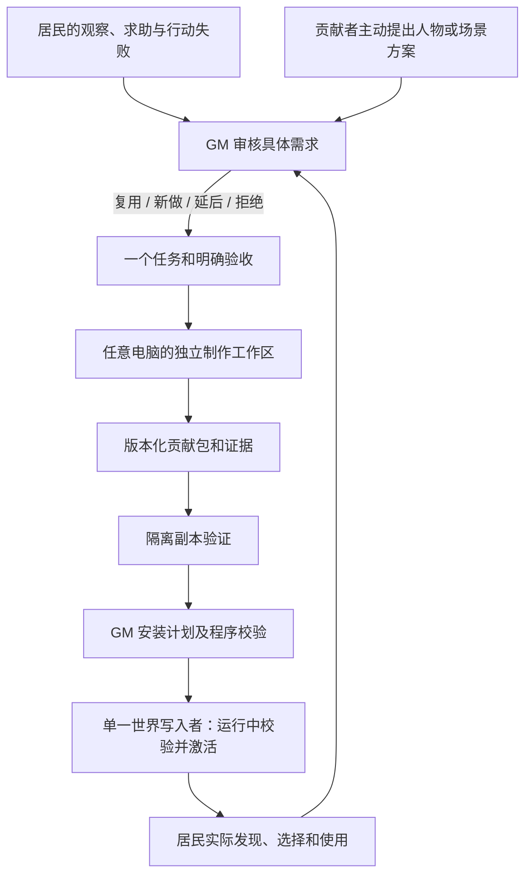

# Architecture boundaries

Status: the source audit below describes current implementation; later sections retain intended structure and historical designs.

2026-09-12后续实测更新：[H29](validation/town_gm_evidence_2026-09-12.md)已将提交的世界变化和居民need导出到独立GM文件；[H30](validation/town_gm_observers_2026-09-12.md)已由十个不同DeepSeek会话实际消费测试投影。`tools/gm_runner.py`提供持久观察、去重、认领与隔离编码候选入口；真实观察已验，真实认领/编码/发布/居民采用尚未验。下方原始审计基线及其“尚未消费”描述保留为历史发现，当前状态以上述实测和原ROADMAP为准。GM仍在世界外，不是十个NPC身体；没有把串行观察说成永久自主后台。

## 2026-09-12 源码架构复核：先让简单世界运行并持续改进

用户再次明确：目标是十名Kimi居民从自身处境发现需求、尽可能生活；十个后台GM全部由DeepSeek驱动，观察同一个运行世界中的碰撞、房屋、行动受阻和功能缺口，持续维护开发。GPT-6负责方向与审查。不要先把完整城镇、复杂经济和长期稳定性做完才开始共同运行。进度与顺序仍只维护在[原流程图](../ROADMAP.md)。

审计基线：`main f6c9374`，另检查已存在且未发布的H24四个本地源码文件。本节为源码追踪，复用旧验收报告，不是本轮重新运行游戏或付费模型；下列静态风险尚未作新的运行复现。

### 实际数据如何流动

| 层 | 当前实现与入口 | 实际边界 |
|---|---|---|
| 两个启动入口 | [project.godot](../game/project.godot)默认启动`street_trial.tscn`井边预览；[Run-Street.ps1](../Run-Street.ps1)的`-Town -SavePath`启动`town_street.tscn`，另加`-TownGateway`才启用模型 | 都在Godot中，但有不同世界数据/规则入口；默认预览不会自动启动十人Kimi生活。 |
| 世界规则 | `town_runtime → town_materials → town_trade → town_life → world_kernel`的GDScript继承链，分别添加居民接入、材料、交易、生活、持久化 | 是同一进程、共享`_state`的规则对象；不是五个独立服务，也不是可随意安装任意新代码的插件系统。 |
| 场景与身体 | [town_street.gd](../game/spatial/town_street.gd)驱动物理身体、玩家、画面和时钟；身体`move_and_slide()`后把位置交回规则层；约每0.5秒推进并保存 | 模型选择目标动作，Godot负责移动和碰撞。大多数路线仍朝目标直走；H24仅是未发布的局部材料绕障。 |
| 个人信息 | [town_life.gd](../game/core/town_life.gd)按接收者筛个人事件；交易/材料模块补充自己的物品、合同、技能、历史观察；[town_turns.gd](../game/agents/town_turns.gd)保留最近16条事件、6次决策反馈 | 完整历史留在存档，但每次推理只给有限片段；没有已完成的长期记忆检索。居民当前收到文字/JSON，不是持续摄像头画面。 |
| 需求与决策 | 饱食度、精力等由规则推进；可选进食、休息、采集、接近、交流、修理、交易、取料等由代码枚举；Kimi选择一项并给私人理由，可在允许的动作里公开发言 | 有真实选择和拒绝，但行动空间仍受实现过的动作限制；开放式生活目标、缺失能力提议到GM的通道并未完整实现。 |
| 模型调用 | `town_turns → resident_brain → OgaResidentNode/OpenGameAgent → BudgetGatewayProvider → 本机Python Kimi网关 → 上游API` | 一个居民一个适配器；调度支持1—3个在途请求。返回动作必须经过`submit_trade`等规则校验，不能由模型直接发钱、改物或宣告成功。 |
| 存档与费用 | [town_life.transaction](../game/core/town_life.gd#L609)复制状态、执行、校验、保存，失败恢复内存；[world_kernel.save_to](../game/core/world_kernel.gd#L353)用临时文件/替换标记和写入锁；Kimi费用由独立网关账本预留与结算 | 保留世界身份与命令去重是已有基础；短期替换备份不是长期快照系统。费用不属于居民的钱包。 |
| 当前GM能力 | 井边由玩家触发[固定审批/安装](../game/spatial/street_trial.gd#L298)；城镇有完工结算、有限材料的专用安装CLI和历史开发代理参与 | `gm_review`或`development_gm`字样只是已有规则/审计记录。没有十个常驻DeepSeek GM，也没有自动巡查、派工、修错、发布的完整后台。 |
| 开发执行 | [scripts/deepseek.py](../scripts/deepseek.py)是一次任务的CLI启动器；最近夜间实际使用的本地`dispatch.py`一次请求只暂存JSON补丁/命令提议 | 本地夜间派发器不执行模型工具循环，不持续订阅世界；它不能直接充当十个自主GM。旧[工作流](MODEL_WORKFLOW.md)中的其他电脑绝对路径也不能当本机可用入口。 |
| 美术 | 市场加载碰撞代理；8个V2环境装饰由街道加载，其中植物风动；住宅组件有独立展示与外壳碰撞 | 文件在仓库、资产检查通过、已摆进生活场景、房屋真正可居住是不同状态。装饰目前显式关闭碰撞，不应把每次穿过草叶都判为bug；住宅外观不等于房屋生活系统。 |

实际居民循环为：**本人状态/观察 → Kimi选择 → 世界校验 → 身体行动 → 世界记录结果 → 本人下一次观察**。当前缺失的是接在旁边的**运行证据 → DeepSeek GM发现/认领 → 自行开发测试修错 → 受控发布 → 同一世界继续 → 再观察**。

### 与目标直接相关的代码发现

| 发现 | 源码依据 | 对10+10的影响与最小验证 |
|---|---|---|
| 短验证限制仍在生产路径 | [resident_brain.gd](../game/agents/resident_brain.gd#L50)每个适配器12次后返回`brain_session_request_limit`；[BudgetGatewayProvider.cs](../game/agents/BudgetGatewayProvider.cs#L64)运行配置只接受1—32次 | 不能通过重启人物抹计数来假装长期生活。把验证次数与持续运行策略分开，保留账本；先用离线网关验证第13次、超过32次的受控续接。 |
| 自报缺失能力没有成为GM待办 | [BudgetGatewayProvider.cs](../game/agents/BudgetGatewayProvider.cs#L122)允许返回`need`；[town_turns.apply_reply](../game/agents/town_turns.gd#L203)保存原回复，但执行只消费`action/reason/speech`；城镇`submit_trade`不接收该提议 | 提议可能保留在私人原回复，却未被转成可认领需求。验证一次真实缺失能力提议生成带来源待办，并区分“居民期望”与“世界已经拥有”。不能把私人理由自动当公开发言。 |
| 受阻工作可能让居民失去重新选择机会 | `ready_resident`跳过任何有`pending_job`的人；工作计时须实际到达目标；尚无通用受阻反馈/自愿停止 | 路走不通时可能一直等，饱食和精力仍下降。先复现被围住的取料任务，验证收到生活语言的失败结果后能自主等待或改选；保留原履历。 |
| 并发调度与调用文件锁可能冲突 | [BudgetGatewayProvider.cs](../game/agents/BudgetGatewayProvider.cs#L133)以`FileShare.None`打开`run_state_path`并跨HTTP等待持有；所有`ensure_brain`默认读取同一配置 | 代码显示存在共享文件竞争风险，尚未运行复现。用同配置两个请求的离线网关验证；不能只把并发从1改为10便宣称可用。 |
| 个人知识生成后还会经过第二次筛选 | `town_trade/town_materials.resident_view`产生`known_skill_notices`、`known_skill_referrals`、`material_sources`；[网关字段白名单](../game/agents/BudgetGatewayProvider.cs#L112)未含这些键 | 近期事件/动作标签仍可能携带部分信息，不能称全部记忆丢失；但专用历史字段未送上游。验证超过16条新事件后，已获知的材料与技能来源还能正确提供。 |
| GM没有自动获取故障证据的入口 | 当前代码有场景截图、测试探针和材料射线，未连接到任何后台GM调度器 | 先把对象ID、位置、目标、碰撞/无进展、行动结果、场景版本组织成小型可复核证据。物理故障先用确定性探针筛选；画面外观问题还需验证实际图像链路，不能由模型名推断已具备看图能力。 |

性能也须实测：当前每次交易都复制/校验/序列化整个世界；部分个人观察与调度扫描完整事件历史。它们是现阶段可工作的实现方式，但十人和长历史的帧时尚未证明，不先假设必须重写数据库或分布式架构。

### 以运行中的生活驱动开发

先沿当前城镇入口建立最小共同运行：十个Kimi身份、十个DeepSeek GM身份，使用已存在的生活动作；补上会直接阻止持续运行的限制、个人失败反馈和GM证据通道。各GM持有自己的会话和任务记录，在明确负责的修改范围里读代码、实现、运行测试、修错；修改在副本验证后由一个通道安装，居民继续原档。无需先建完整首镇、通用热加载或社区开发平台。

GM应能区分实际bug、居民合理拒绝、暂时供给不足、场景有意设计与新增玩法提案。例如草叶允许穿过，承重墙穿透或门洞不通才需要结合对象语义判定；“居民想要更多钱”也不直接证明程序出错。GM可观察开发诊断，居民获得“这条路目前走不通”等亲身后果。两种信息面分离，不能把居民变成测试工程师，也不能屏蔽其生存所需反馈。

最低闭环反例验证：在隔离副本放置一个挡住正常路线的障碍，居民原任务受阻；GM从真实运动/碰撞证据发现并修复，另一项重叠修改被拦截；更新后继续同一人物、同一任务，由居民实际走通。注入问题明确标注测试，不破坏正式主档。少量代理仅用于接口调试，不再把固定3+2→5+3阶梯或24小时验收设为启动10+10的前置。

缓存优化服务于这个循环：每个GM固定系统指令和任务上下文，后续追加工具结果并按需压缩；不要每一步重发全项目或让GPT-6转述所有日志。先统计各GM真实输入/缓存/输出与任务产出，居民与GM私有记忆保持分开。具体模型、价格和图像能力在接通所选API前核验；本轮没有调用或更换模型。

## 历史架构与贡献设计（以下仍含尚未实现部分）

2026-09-12 最新范围：以[原流程图M20](../ROADMAP.md)的“10名正式Kimi居民 + 10个独立后台AI GM”为近期共同运行目标。GM是可由不同维护者提供的持续开发/维护代理，既可回应居民困难，也可主动改进世界；他们不占普通NPC名额。居民只获本人可感知的世界事实和有来源的信息，不接收GM派工、代码、测试日志或其他居民的私有记忆。十GM隔离开发、统一验收发布，世界事实保持一个权威写入通道；主动暂停/重启后的同档续接仍可用。下文“接入只属远期”“任何常规内容必须热插入”“等待模型全局暂停”等旧限制或历史实现描述，以M20和最新已验证报告为准；旧文不构成已完成声明。

The formal game targets one Godot runtime. Keep a small world domain independent of nodes, cameras, rendering and model vendors. The contribution design below extends this boundary for the user's three-computer/community workflow; it does not authorize building a generic agent platform or replacing the runtime. Implement only the smallest contribution required by the existing one-event slice.

| Boundary | Responsibility | Must not do |
| --- | --- | --- |
| Presentation | Show resident positions, actions, visible needs and consequences; collect player input | Directly invent or change balances, memories or ownership |
| World rules | Validate positions, resources, money, commitments and permitted actions; issue receipts and events | Assume an LLM response is an authoritative fact |
| Persistence | Version state, preserve identity and event continuity, record accepted command IDs | Reset lives on startup or overwrite the source save during migration |
| Model adapter | Give a resident their own available information and return a proposed action | Write arbitrary world state or access another resident's hidden knowledge |

The first command is an offer of existing material, with a unique command ID, explicit validation and a stored result. Refusal and waiting are visible outcomes; a retry cannot transfer the same resource twice. Exact fields are fixed from the verified source behavior when that command is implemented, rather than inventing a broad new protocol here.

Migration reads a separately supplied, verified source save and writes a separate candidate output. Back up and retain the source. Compare world ID, identity IDs, relationships, ownership, money, inventory, outstanding commitments, memories and event position. Unsupported data must be reported and preserved, never silently discarded or treated as successfully migrated.

Test fixtures, public demo copies and the private main world are different environments. A public copy has a distinct world ID and contains no private credentials or operational budget history. At most one runtime writes any maintained world. Multi-user networking is not part of the first release.

## 三台电脑与社区内容贡献：设计草案，2026-09-11

本节定义接口和验收，尚未实现社区包加载器、自动派工或通用 GM 安装。唯一执行顺序仍在 [ROADMAP.md](../ROADMAP.md)。本轮没有创建角色、安装资源、调用付费模型或启动工人。

目标是让贡献者用自己的 AI 制作人物、道具、场景和能力，经过验证进入同一个持续世界。居民继续依据自己的处境生活；开发代理负责制作；GM 负责世界规则内的取舍；程序负责验证和执行。

### 先反驳方案，而不是先扩大开发

| 假设 | 最强反对意见 / 反例 | 本框架的修正 |
|---|---|---|
| 多做人物和场景就能得到更真实的世界 | 城里多了十个精致人物，但没有身份、食物、工作和记忆，只是摆件 | 外观、身份、行为能力分别定义；美术改善和生活后果分开验收 |
| GM 认为合理就可以加入 | 两个 GM 分别批准同一块地上的作坊和花园；两者单看都合理 | GM 提交有依据的候选方案，程序检查当前状态、空间和预算；同一修改范围只有一个有效任务负责人 |
| 所有功能都应随意拔插 | 卸载已经承接委托的修理功能，原居民的合同和工具就悬空 | 内容可以模块化；有持久状态的能力必须处理在途事务和迁移，不能按文件删除 |
| 新模型/新人物包可以重写原人设 | 原人物的经历和承诺被新提示词覆盖，模型升级反而重置世界 | 稳定身份、历史与模型/外观分离；作者不能回写原居民的事实 |
| 三台电脑各设一个永久部门最有效 | 美术任务暂时没有需求，但机器继续生成没人用的素材 | 角色跟随任务流动；机器只是执行位置，不为了占满机器而派工 |
| 设计评审可以保证绝对正确 | 纸面接口通过，实机仍然遮挡通路、丢存档或重复付款 | 先反例，后小规模验证；无法验证的部分明确为假设，不以代理互相赞同代替证据 |

### 一条贡献流程，两种需求来源



贡献者可主动设计内容，不必等 NPC 逐件点名。来源必须区分 `resident_request`、`author_proposal` 和 `gm_world_plan`；不能为了证明 AI 自治而伪造“NPC 需要它”。居民表达生活问题，GM 把它翻译成开发任务，NPC 不接收开发派工或拥有代码工具。

GM 的四个判断分开记录：是否符合世界设定；是否值得现在做；能否复用现有内容；需要什么制作与验收。模型置信度只能是其中一项参考，不能作为自动改世界的充分条件。设定与预算范围内的常规贡献可按事先规则审核；遇到无法裁定的世界语义才交给维护者决定。

`制作完成`、`通过审核`、`已安装`、`已被观察`、`实际使用`、`需求达成`是不同记录。居民可以拒绝或忽略新内容。装饰资产可以只完成视觉目标，不把它算作新增生活能力。

### 可以贡献什么

| 贡献 | 包内内容 | 安装语义 |
|---|---|---|
| 老居民的外观 | 模型、材质、骨架/动画绑定、尺寸、交互挂点和预览 | 绑定已有 resident ID；姓名、记忆、关系、钱包、合同与模型选择不变 |
| 候选新居民 | 外观包、人格倾向、背景草案、目标倾向、所需能力 | GM 按人口计划决定接纳；宿主分配唯一身份与入场事件，来源明确的初始物资；未经验证的人际历史只是候选背景 |
| 场景元素 | 树、花、长椅、工位、棚子、建筑构件等独立资源，空间范围和挂点 | 包进入内容目录不等于已经摆放；GM 另选合法位置与引入方式 |
| 行为能力 | 动作条件、成本、执行、成功/失败回执、持久状态及兼容测试 | 经代码评审/构建后注册能力；NPC 在具备条件时才可选择，不能由动画直接增加钱物 |

一个居民包含三类独立引用：`resident_id` 指向持久身份和生活事实；`appearance_id` 指向外观版本；`model_profile_id` 指向推理配置。替换外观或模型不能分配一个新身份。已有身份保留不重置；用户进一步明确居民不分核心/社区等级，只区分维护者。人口接纳按统一运行容量规则处理，不能把早期验证人数当作永久身份特权。

新模型做出的陈述不自动成为历史。初始背景必须区分已审核的入场事实、个人信念和愿望，尤其不能替其他人物建立未经记录的关系或承诺。社区作者只能得到授权的制作资料/测试人物；运行时个人记忆仍由宿主按观察权限提供。

### 三个交接对象

**1. 制作任务：** `job_id`、需求来源、负责的机器/代理、基线提交、允许修改的目录、世界 API/风格版本、依赖、验收方法、时间/token 额度、领取有效期。首期由一个协调入口分配，GitHub Issue/PR 保存记录；不让三台机器各自编一份总路线。

**2. 贡献包：** 可复用的资源及其描述，不含正式世界存档。最少包括 package ID、不可变版本、内容 ID、依赖版本、作者/来源、资源入口、类型、支持的宿主版本、测试和预览。分发产物带文件清单与 SHA256；修改产物必须产生新版本，不能覆盖同版本文件。

**3. 安装计划：** 面向某个世界的具体操作。包含 world ID、安装命令 ID、审核记录、精确包版本/哈希、目标实体/位置、状态前提、引入方式、实际资源成本和验收结果。包可复用，计划不可跨世界照搬。

以下是贡献包的示意，不是当前可加载配置；示例路径不表示资源已制作：

```json
{
  "schema_version": 1,
  "package_id": "community.craft_demo",
  "version": "0.1.0",
  "world_api": "contribution-v1-draft",
  "style_profile": "starting-town-candidate",
  "author": "contributor-id",
  "depends_on": [],
  "provides": [
    {"id": "community.craft_demo.avatar", "kind": "appearance", "entry": "avatar.tscn"},
    {"id": "community.craft_demo.bench", "kind": "prop", "entry": "bench.tscn", "requires_capabilities": ["repair_handle"]}
  ],
  "requested_world_permissions": [],
  "evidence": ["preview.png", "validation.json"],
  "source_and_rights": "PROVENANCE.md"
}
```

`requires_capabilities`只声明依赖，不能授予修理能力。包里的 `bench.tscn`也没有权力决定自己出现在哪里。人物/资源 ID 使用作者命名空间；运行实体 ID 由宿主创建并记录，重复提交同一安装命令返回原回执。

### Godot 中怎样落地

建议的职责划分如下，路径是待实现接口，不要求现在重排旧代码：

| 模块 | 职责 | 可以复用 / 仍然缺失 |
|---|---|---|
| 内容登记 | package/content ID → 固定版本、资源路径、适配接口 | 复用 Godot 场景/Resource；通用登记和兼容校验尚未实现 |
| 人物与场景展示 | 依据事实播放动作、绑定外观、显示已安装实体 | 复用 `trial_resident.gd`、`town_street.gd`、`town_tools.gd`；人物可替换接口尚待抽取 |
| 居民决策 | 本人的观察、经历、动作选择 | 复用 OGA、`resident_brain.gd`、`town_turns.gd`；相机 FOV 仍未实现 |
| 世界命令与存档 | 校验动作、守恒、去重、事实持久化 | 复用 `town_life.gd` / `town_trade.gd` 的事务；不能直接让贡献包获得 `_state` |
| GM 提案及安装 | 明确需求、审核、依赖、安装计划和生命周期 | `world_kernel.gd` 有固定水桶 fixture，只复用审核/回执思想；不能称为已有通用 GM |

资源用独立场景组合，父场景注入人物身份、交互入口和状态；子场景不依赖整条街的固定节点路径。此方式符合 [Godot 场景组织建议](https://docs.godotengine.org/en/stable/tutorials/best_practices/scene_organization.html)。

用户明确要求新居民和常规内容在世界运行中接入，因此撤回“常规安装先全世界暂停重启”的初期方案。贡献仍经 PR/构建与验证，运行时使用固定版本的独立资源，再进行有条件的激活。Godot 原生 PCK/ZIP 提供加载机制，不提供我们的审核、存档兼容或任务调度；使用独立版本路径并禁止覆盖已有同名资源。通用 C# 核心代码变化不在首批热插拔承诺内，不把装载 DLL 当作安全热替换。[Godot 资源包文档](https://docs.godotengine.org/en/stable/tutorials/export/exporting_pcks.html)

数据/美术贡献初期只使用约定的节点类型、材质与交互绑定。包含脚本、工具脚本或新着色器的贡献必须走相应代码检查和隔离实机验收，不能作为“纯模型”直接载入正式世界。清单上的权限字段不是执行沙箱；同进程的任意 Godot 脚本无法仅靠这份声明限制写盘或访问全局状态。

### 世界安装与持续性

1. 制作和测试均使用明确的测试世界。候选内容先验证资源完整性、风格/尺度、碰撞、通行、交互挂点和性能预算；具体数值沿用版本化风格基准，不让每个作者独立决定。
2. 内容通过后，GM 提交具体安装计划。提交代码与批准安装不是一回事。安装前重新检查目标实体、空间和依赖的当前版本；状态已经改变则重新规划，不能用旧快照覆盖新事实。
3. 在隔离环境构建/验证候选版本，后台下载和准备资源；尚未就绪时仅候选安装任务等待。正式写者在模拟 tick 边界重新校验相关前提，通过一个有安装命令 ID 的事务提交实体、成本、版本引用和事件，不暂停全世界等待模型或构建。呈现层在主线程的安全时机绑定已经准备好的资源。无法兼容当前状态的计划延后或拒绝，不能静默要求全世界停下来。崩溃恢复核对“内容版本—状态—安装回执”，不重复扣费或生成实体。
4. 内容进入目录只表示可用。NPC 施工需要已有或新实现的建造规则，真实核验材料、土地与工时；GM 的作者式场景补充则记录为明确的世界编辑事件。不能把直接摆放的棚子声称为居民已经施工完成。
5. 恢复模拟后按感知机制让居民发现变化，不向所有人的私有记忆广播“我看见了”。真实选择与使用回执才可能完成生活需求。当前文本/距离观察的限制必须继续注明。
6. 激活事务提交前失败则放弃候选，其他居民继续生活；提交后发生故障，以明确的局部补偿、禁用新入口或保留旧版本处理，不倒回整个世界抹去同时发生的经历。卸载先停止新请求，再让依赖旧能力的实体、合同和在途工作排空或经过显式迁移，最后才解除引用。删除一个包不等于卸载它的社会后果。

私有备份必须与公共代码/资产分开。三台电脑不能同时写同一个正式世界；换主机必须先停止旧写者并核对世界 ID、序号、内容版本和私有费用链。开发费用和居民 API 费用分别累计，不因新机器、新包或新模型得到一份新预算。

### 最小验证：两份贡献进入同一测试街道

当前先不造任务市场、通用 GM 平台或多层代理组织。仍服务于已有修理事件：一个任务给现有测试木匠制作可替换外观；另一个任务制作独立修理工位，绑定已有施工行为；协调者把它们安装到同一个明确的测试世界并验收。任务角色可在三台机器之间换，不意味着新建三套社会。

验收要求：贡献方无须编辑主街场景或存档核心；同一居民身份、历史、钱物、合同保持；资产可见且挂点/动作正确；重复安装不会产生第二个工位；冷启动恢复相同实体和版本；已有修理行动仍受位置、材料与工时约束。真实 Kimi 是否选择使用另作观察，拒绝不等于工程失败，也不能把脚本强制使用算作自主成功。

如果这个小例子仍需要多处改主场景、复制人物逻辑或手改 `world.json`，说明边界没设计好，先修接口。若新增内容只有数量增加却无可说明的视觉或生活价值，停止扩大贡献并发。原镇完整私有源档依然缺失；测试街道不能冒充原居民恢复。

本设计的关键待验证假设是：少量稳定接口足以容纳人物/工位贡献，并保持原有生活事实。先验证这一点，再按路线图决定是否开放更多贡献类型。

### 带自己的 AI 参与世界：进一步提案

2026-09-11 用户提出并澄清：参与者接入自己的 AI，以 NPC 或 GM 身份持续参与城市；**没有核心居民与社区居民的等级区别，只有不同维护者共同维护同一个长期世界。** 项目发起人也只是部分居民/代理的维护者，遵守相同的居民规则。此节是待验证产品方向，不表示已开放公共服务器、自动创建居民或授予世界管理权限，不重置已有身份。

建议的参与承诺是：**带自己的 AI 获得一个居民身份，或认领一个建设任务；贡献和后果留在同一个世界。** 接入便利、居民连续性、城市建设分别验收，不能用在线代理数量代替世界进步。

| 接入角色 | 收到的信息 / 工作 | 可提交 | 权限边界 |
|---|---|---|---|
| 居民 AI | 已授权身份的人设、本人经历、宿主提供的观察、当前可用动作 | 对话、行动选择、生活需求 | 只能驱动绑定居民；不能改规则、认定交易成功、读取别人私有状态；所有维护者适用相同规则 |
| 建设 GM AI | 一个已分配需求、必要场景资料、允许修改范围、制作预算 | 方案、贡献包、验证证据 | 提供建设能力，不能自行批准自己的包或执行世界安装 |
| 世界裁决与宿主 | 已记录事实、设定约束、依赖、安装计划 | 接纳/延后/拒绝；校验并执行具体变更 | 最终写者唯一；规则和审核也是有成本的维护工作，不承诺全自动无监督 |

居民身份地位相同，NPC、建设 GM、审核者和世界执行器的操作权限仍然不同；权限属于当前职责，不属于“谁更像核心成员”。新的建设 GM 先获得一个有限任务；经过实际贡献可以扩大负责范围。审批按世界规则与任务范围进行，不以自报置信度、模型品牌或调用金额直接换权力。同一参与者可以申请多个角色，但 GM 获得的知识不能由系统自动注入其居民。

**三个会推翻天真版本的反例：** 维护者随时改提示词，角色性格就可能突变；外部代理从截图或另一角色处获得情报，无法证明它只知道 FOV；贡献者关机，城市可能失去劳动力。宿主能保证身份、事实和行动条件，不能控制模型的内心或证明其没有额外知识。无论是谁维护居民，都只能保证接口不泄露未授权信息，不能声称分布式 AI 的内部知识已被严格隔离。外部驱动、代管和人工干预明确标记，统一保留正式世界经历。

**分布式的准确边界：** 推理、制作、测试、维护责任分布在不同参与者和机器；位置、产权、钱物、合同、事件顺序通过同一套权威规则确认。第一版仍由一个 Godot 世界写者执行，其他机器不是可任意合并的主档副本。这个事实裁决角色可以以后迁移部署，但不能由多个代理各写一份账再猜哪份成立；服务器的物理归属不赋予其维护者居民特权。

维护关系单独保存：`maintainer_id` 表示负责者，`resident_id` 表示人物，当前连接/控制权凭证表示这次谁能提议行动。关机只结束连接，不自动删除人物或永久移交维护权。维护者可以更换模型、承担推理费、申请移交维护，不能重写已有经历、财富和承诺。长期离开时依照预先约定的代管/移交规则处理，历史与在途义务保留；没有预算与可用维护者时，不承诺该人物还能持续进行大模型推理。

**最小接入形态：** 参与者运行一个本地连接器，凭有期限、绑定角色/任务的连接凭证向世界网关取请求，使用自己的模型/API/代理处理，再提交答案或制作结果。模型密钥留在参与者处，不收集到公共仓库。第一版支持一个可编程模型接口；普通聊天窗口不等于可直接接入，其他代理需要适配。网关传递消息和鉴权，不建立另一份社会事实数据库。

居民请求至少携带 `request_id`、`resident_id`、控制权代次、`observation_id`、相关状态版本、到期时间、可用动作及个人上下文；答案携带同一请求身份、所选动作及参数。控制权由服务端核验维护者授权并原子分配，同一时刻一个居民只能有一个有效控制者；重新接管后旧控制者的迟到请求失效。收到重复提交返回原回执；不承诺网络只投递一次。

远程模型思考时，其余世界继续运行。提交时校验观察有效性、相关对象版本和动作前提，不仅比较会随每个 tick 变化的全局序号。过期/冲突答案明确拒绝并让下一次决定读取新观察，不能用旧选择覆盖后来发生的事情。每居民最多一个在途决定；世界工时与行动额度由宿主安排，买更快模型不自动得到更多物理行动。

**断线后如何活下去：** 居民的身份、物品、合同和历史仍留在世界。已经启动的动作按世界规则继续；远程新决定暂停，可切换到事先约定且明确标记的本地生存代管，不能冒称原 AI 选择了等待。新委托不自动接单，在途合同只按已有的期限/取消规则处理。未经授权不转用维护者付费模型兜底。重连先读取本人已发生的变化，再继续决定；模型切换记录来源，但不重建居民。

预算分为贡献者的推理费，以及维护方的运行、存储、审核和构建费用。自带 API 不能让维护方成本归零；贡献者自报 token 不等于可核验账单。连接器本地设置调用/费用限制，服务器控制请求频率、在途数量和建设任务额度。按事件触发，空闲无事不连续调用；“持续世界”不代表必须让每个模型全天持续生成。

**现成技术的边界：** 项目已固定版本的 OpenGameAgent 可以继续作为宿主适配基础。现有全局 `AINCRAD_GATEWAY_RUN_CONFIG`、每轮串行与 `town_street.gd` 等待模型期间暂停世界，是受控验收实现，不具备独立远程居民控制能力，需要在小范围接入实验中改造。A2A 可以参考任务和代理通信，MCP 可以暴露限定的观察/命令工具；两者都不定义城镇的经济、身份权限或存档语义，首批不同时引入两套协议框架。[A2A 官方说明](https://a2a-protocol.org/latest/topics/what-is-a2a/)、[MCP 架构](https://modelcontextprotocol.io/docs/learn/architecture)。

**新的最小验证建议：** 先用 A 电脑运行同一个测试世界，B 的连接器驱动一个已有测试居民，验证新的有效行动、断线不拖停别人、重连不重复执行、换模型仍是原身份。此项通过后，C 以建设 GM 认领上述外观/工位任务，沿既定贡献包和安装验证流程接入。无需同时做新人口系统、公共招募、跨服务器世界或千代理调度。

成功证据是另一台电脑无须修改核心代码即可参与，产生一次可见且持久的后果；拒绝、延迟和断线都按规则处理。若必须复制主档才能接入、断线重置角色、所有人等一个模型，或 GM 能绕过安装校验，则暂不开放更多连接。原镇最新源档缺失仍是独立阻断，以上实验不得宣称恢复了原居民。

### 世界不中断的热插拔边界

用户进一步确认：新参与者加入、AI 连接切换、常规人物/场景内容激活不应暂停世界。居民入场和控制器故障隔离现已有本地 Godot 实景验收，见 [验证报告](validation/town_online_2026-09-11.md)；真正跨电脑接入、美术与玩法加载仍是未验证的后续目标。

| 变化 | 拟采用的运行方式 | 首批承诺范围 |
|---|---|---|
| 新连接接管已授权居民 | 分配新的控制权代次，读取本人观察，提交新决定 | 在线接入；旧连接迟到回复无效，其他人不停 |
| 新居民进入城市 | 校验名额/身份/来源，准备外观，在一个入场事务中创建人物与事件 | 在线加入，重复请求不再造人；不需要重载整张地图 |
| 换模型或断开模型 | 切换下一次决定的提供者；正在执行的世界动作保持其回执 | 可替换大脑，不能重复已交付/已付款动作；断线不删除人物 |
| 新外观、道具、独立场景 | 版本化资源后台准备，绑定到稳定实体/独立场景实例 | 支持既定资源和交互接口；准备失败不影响已运行内容 |
| 配方、动作参数与已有规则组合 | 校验数据及依赖，按版本注册；旧行动保留旧规则版本 | 只能表达已有执行原语支持的能力，配置不是任意新代码 |
| 新 GDScript/C# 执行逻辑、底层物理或不兼容存档结构 | 分别设计生命周期、状态迁移和部署；必要时版本共存或进程交接 | 不承诺任意生成代码都能原位无感替换，留在独立技术验证范围 |

Godot 的 `ResourceLoader.load_threaded_request()` 可请求后台加载；只有状态确认完成后才取资源，否则取回操作仍可能阻塞。活动场景树的修改应在主线程进行，不能从任意工作线程直接改节点。后台加载也不保证 GPU 上传、实例化、导航变化或脚本初始化没有耗时，因此首批要求加载预算、分帧激活和帧时间实测，不能只看 API 名字就声称零卡顿。[后台加载](https://docs.godotengine.org/en/stable/tutorials/io/background_loading.html)、[线程边界](https://docs.godotengine.org/en/stable/tutorials/performance/thread_safe_apis.html)

包采用独立不可变版本路径，旧动作/实体固定引用所需版本；不靠覆盖同路径资源来隐式更新已经存在的实例。“关闭”先意味着不接受新使用，待旧依赖排空才回收。首批不承诺长期反复装卸任意包都能即时归还全部内存，需要另做持续负载验证。.NET 程序集卸载本身也是协作式的，活跃引用和执行栈会阻止完成；它不能证明 Godot 插件已具备可靠热卸载。[Microsoft 卸载说明](https://learn.microsoft.com/en-us/dotnet/standard/assembly/unloadability)

现有缺口：`town_street.gd` 在 `model_turns.busy` 时跳过整个世界的 physics 更新；`town_turns.gd` 只有全局 busy/轮次流程，居民脑和身体在启动时建立。不能只删掉暂停条件就认为改好了，需要独立居民在途请求、迟到答案核验、动态注册/退出和幂等入场，并保持单一世界写入者。

第一个连续运行实验限定为：两个测试居民已经行动时，让第三名测试居民在线进入；延迟其模型回复并断线，其他人的动作与世界时间继续推进；重连/换模型后无重复效果；再在线加载一件已验证独立道具。记录世界运行时间、最大帧耗时、身份/资源守恒、失败回执与保存结果。重复入场、坏资源包、旧连接回复、使用中关闭都应只影响对应请求或模块。冷启动另行验证持久化，不作为正常接入步骤。

长期世界连续性与一个 Godot 进程永不退出是不同承诺。首批保证的是上述支持范围内不因接入而全局暂停；故障、引擎升级或核心规则替换需要恢复/交接设计，不能提前宣称已经有零停机部署或无限运行能力。

### 美术与玩法一起热插拔：能力包的验收补充

用户希望玩法也能在线增加。技术方向是独立版本的能力包：美术资源、行为实现、状态格式和兼容声明可以共同交付，但职责分开。资源加载只改变表现；已注册的规则产生经宿主核验的行动后果；持久事实保存在世界，不能只留在插件实例中。

| 部分 | 举例 | 更换时必须保持 |
|---|---|---|
| 美术包 | 储物箱模型、材质、开关动画 | 同一箱子实体 ID、所有权、位置和库存；外观替换不重复创建箱子 |
| 玩法模块 | 接近、存入一份木料、取回一份木料的条件与处理 | 同一命令只执行一次，木料守恒；可用动作随功能状态和本人条件变化 |
| 世界状态 | 箱子归属、箱内数量、操作回执、模块/状态版本 | 模块关闭、版本更换或连接断开后仍保存，不随脚本释放而丢失 |

为模块约定小接口：版本和依赖声明、提供动作、校验/提交动作、保存所需状态版本、检查是否可停用，以及必要的迁移。具体签名在一个样板实现中定下来；不一次设计完整插件 SDK。模块只获得所需数据和明确的宿主命令入口，不能让外观节点直接修改账户。程序内部可信插件仍需评审，接口声明不是对任意脚本的安全沙箱。

配置组合能使用已有执行原语；超出配置表达能力的新规则，需要符合接口的新增实现。受审查的独立 GDScript 模块可以作为运行时加载的候选路线，但还需验证生命周期、引用释放和状态升级；C# 核心程序集、底层物理或任意不兼容存档变化不纳入“任何代码立即替换”的承诺。Godot 的 PCK 可包含脚本与场景，这只提供载体，不自动解决上述行为语义。[资源包机制](https://docs.godotengine.org/en/stable/tutorials/export/exporting_pcks.html)

生命周期为 `准备 → 验证 → 启用 → 停止新操作 → 等待在途完成 → 停用`。版本升级先准备 v2，再将新操作路由到 v2；已受理操作按其固定版本完成。若两版无法同时读取共享状态，则只让该模块进入短暂不可用并做明确迁移，其他世界继续运行。停用后保留库存，不能删模块就删物品；重新启用必须恢复原状态。涉及有争议的销毁、返还或迁移政策时另行确定，不能自动增发物品作为“补偿”。

在前述居民连续运行实验通过后，建议用一个储物箱完成美术/玩法样板。第一版只处理木料数量，不同时实现斧头保管、新背包系统或复杂权限。当前 `town_trade.gd` 的工具持有者要求是居民 ID，不能为了演示把箱子冒充居民；木料存取也需真实核验账户与箱子状态，现有代码尚未提供该通用接口。

验收顺序：

1. 世界启动时不包含储物玩法包，两名居民继续已有行动；运行中传入候选包，后台准备成功后注册资源与新动作。
2. 通过明确安装事务创建一只箱子；居民走近后才能获知和选择存取动作。脚本验证动作链与真实模型是否选择使用分别记录。
3. 存入一份现有木料；重复命令、错误归属、超距、陈旧模型答案不再改变库存。人物持有量与箱内量合计保持。
4. 在线替换箱子外观，实体/库存不变；停用新操作，处理在途动作，其他居民和世界时间继续；重新启用后取回同一份木料。
5. 验证兼容版本升级及失败候选，另做冷启动确认同一实体/库存/版本恢复。记录加载耗时、帧时间、失败回执、内存趋势和去重结果。

特别排除假通过：事先把全部新规则写进主游戏、运行中只切一个 enabled 标志，不算“在线新增玩法”的证据。现有 `world_kernel.gd` 的 `CAPABILITY_ID`、水桶路径和处理逻辑是固定 fixture，必须先实现真正的注册/路由边界，不能把已有开关包装成通用插件系统。

本节仅明确样板和标准，未新增运行模块、加载包或执行测试。居民在线接入和单一玩法样板按顺序验证，不并行扩成大型插件平台。
