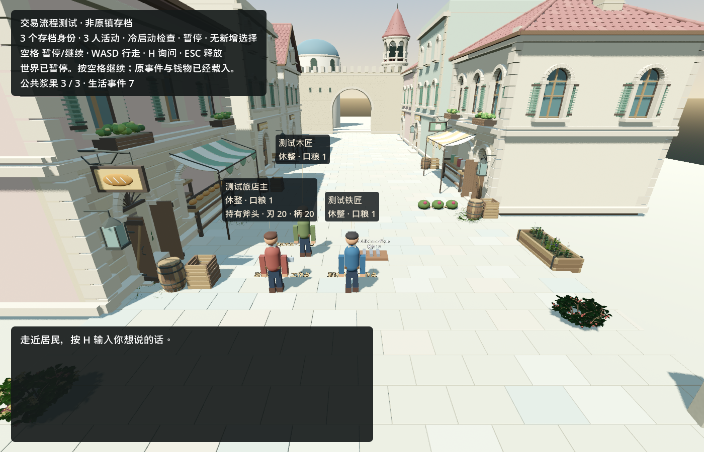

# InfiniteAincrad · 手机进度与画面

更新：2026-09-12。这里记录当前交付和实机画面；所有长期计划、问题和完成颜色仍以[原路线图](../ROADMAP.md)为准。

**当前目标：一个简单的持久世界，10 名 Kimi 居民按自己的需求生活，10 个 DeepSeek 后台 GM 观察、修复和完善功能。MVP 尚未达成。**

最新路线互审：根代理与两位GPT-6独立初审、交叉反驳后确认近期执行有局部偏离，已在原图纠偏。下一成果必须是一条真实修复和居民同档续接，十个观察会话不能替代；首次一项闭环、后续多GM协作和长时运行分层验收。[三方结论与具体反驳](validation/route_review_2026-09-12.md)。

## 现在能看到什么

下面是 **9月12日本轮验收后的同档冷恢复实机画面**，可以点图放大。独立副本恢复了三名测试居民和7条生活事件，未新增居民选择或模型调用；源档与恢复副本逐字节保持一致。这仍是三人测试世界。

下面是同日已发布的街道总览。场景、碰撞、人物移动和同档保存已有基础；这些图片不是10+10在线运行的证明。

下面是 **9 月 11 日三人生活验证后的冷恢复画面**。铁匠对材料和报酬的顾虑曾推动结算能力改进；详细记录保留了真实 Kimi 调用、玩家澄清与测试档身份的区别。

[查看这次生活验证的结果与限制](validation/town_continuous_life_2026-09-11.md)

[播放 50 秒环境美术短片](validation/floor1_environment_v2_2026-09-11/all20_wind.mp4) · [查看植物与风动图文](validation/floor1_environment_v2_2026-09-11.md)

短片记录环境组件与风动，尚不代表居民住房或 AI GM 功能。

## 最小 MVP 的四步验收

这是原路线图 M20 的近期验收顺序，不另建路线图。第1、2步的离线能力已验收；当前还剩第3步GM执行链和第4步真实10+10联调。

| 步骤 | 要得到的可见结果 | 当前状态 |
| --- | --- | --- |
| 1 · 居民能应对受阻 | 走不到材料点时本人知道，能等待或取消；再次出发、重启不破坏记录 | 🟢 离线能力已验收，H24 / H26 |
| 2 · 问题进入 GM 入口 | 运行证据与居民提议持续更新到独立文件，重复问题去重、原始需求保留 | 🟢 离线通道已验收，H29；真实GM消费接续第3步 |
| 3 · GM 完成修复交付 | 十个 GM 各有会话与任务履历；认领→实现→测试→审核→更新同一世界 | 🟠 十个真实DeepSeek GM已观察测试世界证据；同一证据复跑0调用。真实认领、修复交付与居民采用待验，H30 / M20D / M20E |
| 4 · 10+10 共同运行 | 十名真实 Kimi 居民与十个 DeepSeek GM 在同一正式档完成一次需求或问题闭环，并重启续接 | ⚪ 待真实联调，M20A / M20B / M20C / M20F |

**工程粗估：配置和正式世界来源就绪后，还需约 1–3 个工作日开发与联调。** 这是基于当前代码和这轮修复速度的估计，会按实际验收修订。完整首镇、全部美术、公开发行与长时间稳定性仍是后续方向，不作为首次共同运行的前置。

第一次 MVP 的结果要能复查：居民自主生活 → GM 从真实证据接到问题 → 做出经测试的改进 → 同档更新 → 居民实际感知或采用 → 重启后身份、财物、经历与未完承诺继续保留。不能只看进程数量。

## 这轮实际进展

- DeepSeek 通过原生工具会话自行读代码、实现、运行测试和修错；GPT-6 负责设计与独立复核。
- 离线受阻反馈已有五类实际场景共 **226 项**、状态专项 **254 项**的通过记录；NPC 付费调用为 0。
- 合法长指令 ID、取消成功反馈与 **32 条关闭历史和 10 个进行中任务并存**的验收已通过，H24/H26按离线范围标绿。第2步现已通过：H29新增89项场景、278项状态及回合/反馈回归。当前接第3步：真实DeepSeek GM消费、会话与任务链。
- **13:09（上海）验收：十个真实DeepSeek GM已建立各自会话，读取同一份离线世界证据，累计65个完整模型响应。输入缓存命中93.4%，重启执行器后重复相同证据新增调用0。** GM都识别出需求是测试占位内容，未凭空认领修复；正式10+10尚未运行。[GM真实观察报告](validation/town_gm_observers_2026-09-12.md)。
- 开发执行另计：本链条三个DeepSeek开发会话共599个完整响应，输入缓存命中约99.3%；另1次历史网络中断的用量和费用仍为未知，用户已批准该次例外继续。GM观察、开发执行与Kimi居民的账本分别保留，缓存输入不重复计数，token不是账单金额。
- 资源更新：已找到旧项目的可用Kimi配置，并通过只读模型列表验证；旧账本未决费用仍保留。本轮选择独立、持续保存的十人试运行世界，创建即固定身份与资源；原镇恢复仍为S1，不用测试档冒充。十人候选的保存/冷恢复仍有失败，实际10+10尚未开始。

[H30 十GM真实观察](validation/town_gm_observers_2026-09-12.md) · [H29 GM入口验收](validation/town_gm_evidence_2026-09-12.md) · [详细当前状态](STATUS.md) · [H26 验收证据与范围](validation/town_material_blocked_2026-09-12.md) · [实际架构复核](ARCHITECTURE.md) · [唯一原路线图](../ROADMAP.md)

后续阶段交付会在此页补上带日期的画面、短片和验收结果，链接保持不变。
