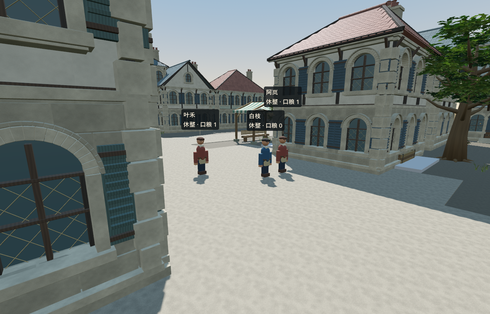
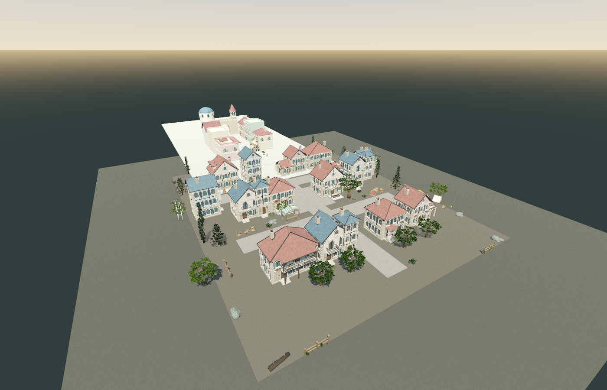
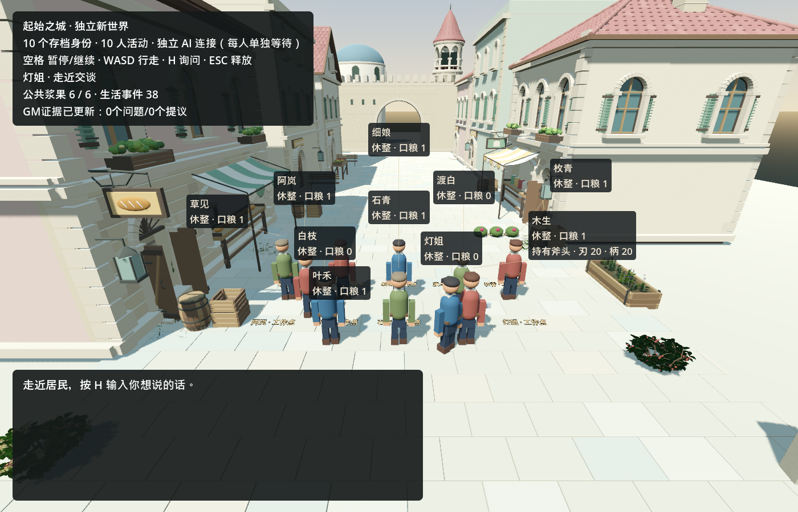
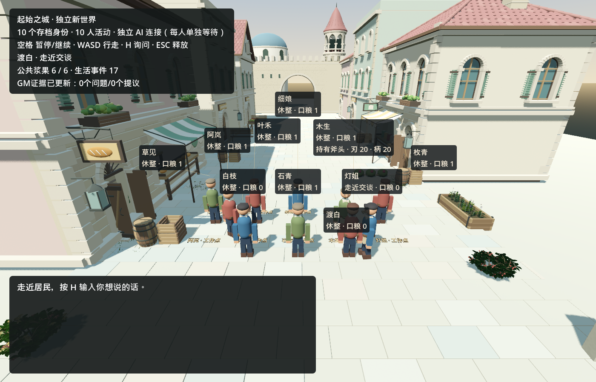
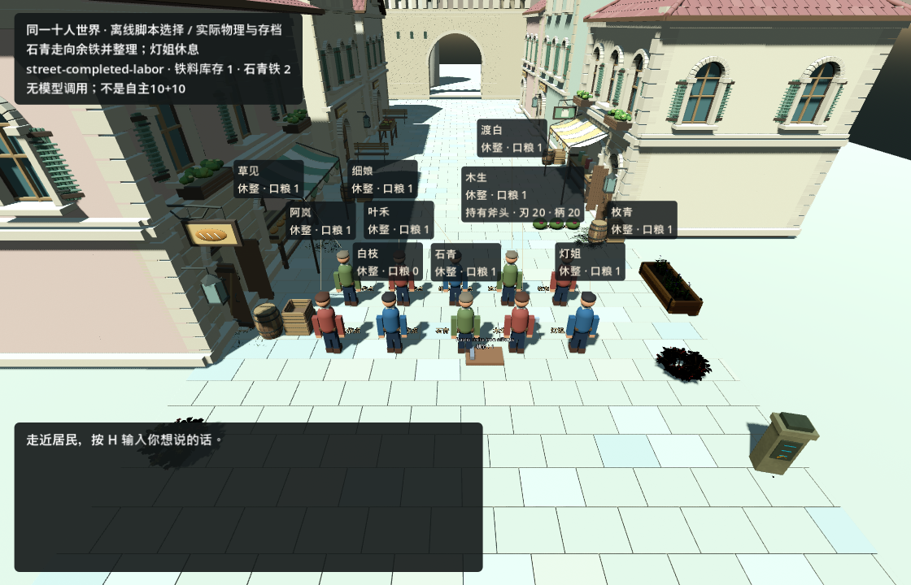
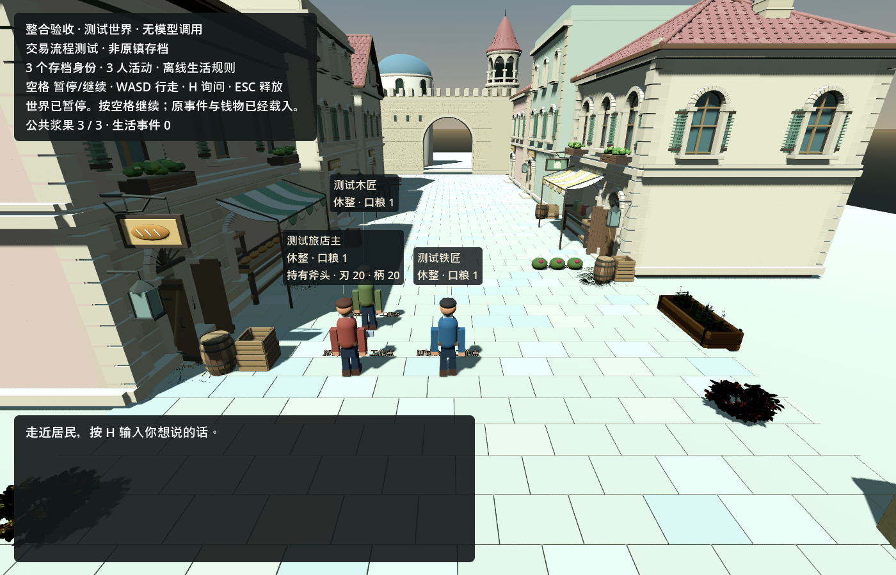
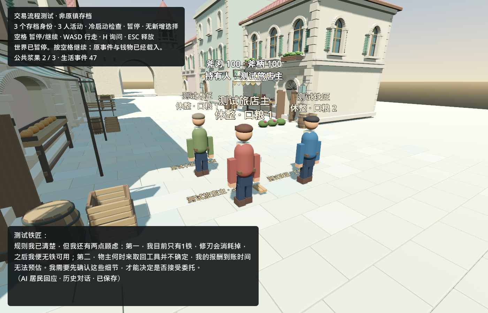

# InfiniteAincrad · 手机进度与画面

更新：2026-09-13（当前结果）。长期计划、问题与完成颜色以[唯一原路线图](../ROADMAP.md)为准；本轮完整事实与限制见[公共地点与首次真实采用](validation/town_places_2026-09-13.md)，上一交付见[首条真实闭环报告](validation/real_ten_2026-09-12/report.md)。

**当前目标：一个简单的持久世界，10 名 Kimi 居民按自己的需求生活，10 个 DeepSeek 后台 GM 观察、修复和完善功能。首轮闭环 MVP 已通过（一次真实 GM 修复、居民同档续接与冷恢复）；常驻运行与完整世界仍待后续验收。**

## 现在最重要的进展：居民真的用上了扩建街区（2026-09-13）

**首次真实Kimi使用公共地点（2026-09-13，已复核）**：同一维护世界 `shared:aincrad-trial-1`（十人身份不变）跑了**一次**有界真实运行：十名居民都靠真实感知（读到出口路牌或亲眼看到）认识了公共地点，模型20次决策里**8次自愿选择了公共地点**——6次前往、2次到点休息，分属6名居民（木匠/织工去西侧前庭，园丁/守井人/面包师去种植公共地，旅店主回旧市场广场），其余12次仍选择原有动作——8次求助、3次回应、1次靠近；没有一次出行被判定受阻，运行后没有未完成行程。20次真实请求花费 **+0.5754353 CNY**，历史不确定行6→6（无新增未知）。运行后存档的字节副本做了一次暂停冷恢复：逐字节不变、地点知识/命令/回执全部保留、无重复事件。另有三张**暂停事后渲染**（街区总览、种植公共地三名居民、西侧前庭两名居民）放在同一目录，标注为对同一世界快照的暂停渲染，不是新的实时运行。实机图与精确数字见[地点报告](validation/town_places_2026-09-13.md)：运行截图 `validation/town_places_2026-09-13-run/town.png`。

*种植公共地：真实运行结束时的三名居民（园丁、守井人、面包师）就站在那里；这是对同一世界快照的暂停事后渲染，不是新的实时运行。*

用项目已有美术（六种住宅外壳、v2环境、2026-09-12新生成的店面/工坊/旅运模型）把可玩街道向南扩出一片真实街区：14栋住宅、两片街区与庭院、种植公共地、果园与商队货物休息区，共38件新模型加68件环境/外围景观。旧市场地面到新铺装加了缓坡，普通居民胶囊按原速双向走得通；23个到达路点（含起点共24）279.5米往返、净空与实体阻挡检查16项0失败，引擎Forward+退出0。[扩建报告与实机图](validation/town_expansion_2026-09-12/report.md) · [唯一原路线图](../ROADMAP.md)。

*扩建后的实际场景（离线预览截图，已隐藏HUD）*。

## 2026-09-12 结果：第一条真实闭环跑通了

**2026-09-12：真实十人世界 `shared:aincrad-trial-1` 完成第一条闭环。** 一个真实 Kimi 居民的接近委托（旅店主 → 石青）在木匠所在位置卡住；一个后台 GM（gm-09）读取证据、写代码、跑测试，经独立复核后把修复发布进同一个世界；随后居民自然完成了原委托：原任务在修复前的冷恢复中保留，修复后完成并再次冷恢复不变（最终正式档没有未完成任务）。

*真实 Kimi 运行、GM-09 修复发布之后：同一世界、10 个固定身份。非离线 fixture，不是视频。*

- **真实请求与费用**：两段有界运行共 40 次真实 Kimi 请求，合计 +0.6129836 CNY（第一段 20 次 +0.2291913，第二段 20 次 +0.3837923）；Kimi 历史不确定行始终 6，没有新增未知。
- **结果**：原命令 `turn:shared:innkeeper:0:2` 只完成一次（1 条回执、1 条 `resident_moved`），命令与目标未改；之后旅店主自己又向石青求助 3 次。世界 `seq 17→38`，旧事件前缀不变，10 个身份、钱物与 17 条旧历史保持，暂停冷恢复逐字节不变。
- **还没做到**：这是有界的十人居民 + 十 GM 首轮闭环，不是 20 个 agent 持续在线；普遍社会诊断导出（H36）仍缺，重复求助只是观测；食物 7 份、浆果存量 6 未变，不能称经济或自主生活已经成立。

## 历史画面与更早交付（范围已标注）

**首次真实十人运行 + 首次真实 GM 观察（2026-09-12，在此修复之前）：** 十个固定居民真实行动 20 次模型请求，世界 +0.2291913 CNY；十个 DeepSeek GM 各用独立会话完成一轮观察（token 用量另计，输入 3,010,535 其中缓存 2,827,392，输出 52,614），当时仍无 GM 代码或发布。

## 更早的离线与脚本交付（历史，均已标注范围）

**H34诊断（2026-09-12，离线；没有NPC/GM玩法模型调用，DeepSeek开发用量另行计量）：** 旧的「42项通过但无标记」插桩其实从未绑定：旧子类继承 town_life.gd，而场景成员类型是 town_runtime.gd，赋值被拒绝（仅有控制台报错）；首次身份探针11项里失败的正是不该绑定的旧子类，作为旧harness反例保留。换用可绑定插桩后，保存/编码阶段多次正常运行，并在一次普通run模式里记录到故障时点：最后一次 save.after 已返回，之后至少4个物理帧才崩溃——仅说明最后返回阶段，不排除更早的编码/释放潜在破坏。普通run模式60秒条件2次崩溃（约47.58s控制、47.66s轻量插桩），同会话占用模式20秒未崩溃；插桩与时长不同，不能据此称与相位无关。[证据](validation/h34_deepseek_diagnosis_2026-09-12.md)。

**9月12日14点后的GPT-6并行交付（历史，当时真实10+10尚未运行；该窗口已于15:00结束）：** 十人世界完成离线端到端联调和实际材料走动/领取；五个GPT-6 Ultra工作者与监督者实现、交叉复核，当时没有DeepSeek/Kimi调用。

下图是同一十人隔离世界在材料安装、实际行走与冷续接后完成领取的画面：铁料总库存从3到1，石青取得2份（先离线规则，再实际场景）。选择由脚本提供，不能当作模型自主生活。

[本轮报告、通过范围与失败记录](validation/gpt6_sprint_2026-09-12.md)。居民旧知识进入最终请求、共享请求等待、GM提议/候选与私有需求安装已接通。采集拥堵H33已让原档八个任务全部得到结果，但最终障碍负例两次触发原生崩溃，仍为部分完成。H34保持开放；H35进程树清理及失败上报已修复。

[播放8秒十人实机短片](validation/gpt6_sprint_2026-09-12/ten-life-offline-replay.mp4)：来自独立回放副本，30fps固定帧率录制、离线生活规则；不是正式AI居民运行。

此前三人测试世界的冷恢复记录继续保留：[三人实机与原范围](validation/town_gm_evidence_2026-09-12.md)。

下面是同日已发布的街道总览。场景、碰撞、人物移动和同档保存已有基础；这些图片不是10+10在线运行的证明。

下面是 **9 月 11 日三人生活验证后的冷恢复画面**。铁匠对材料和报酬的顾虑曾推动结算能力改进；详细记录保留了真实 Kimi 调用、玩家澄清与测试档身份的区别。

[查看这次生活验证的结果与限制](validation/town_continuous_life_2026-09-11.md)

[播放 50 秒环境美术短片](validation/floor1_environment_v2_2026-09-11/all20_wind.mp4) · [查看植物与风动图文](validation/floor1_environment_v2_2026-09-11.md)

短片记录环境组件与风动，尚不代表居民住房或 AI GM 功能。

**H34渲染后端对比（2026-09-12，离线对比）：** 只改渲染参数时，显式兼容路径的普通入口45.657s崩溃（偏移0x141377d），项目默认Forward+跑满90秒且占用/待机/冷恢复检查全通过；8个原任务=2份食物+6次真实耗竭，无丢任务或重复库存。属有界对比而非源码修复，H34仍开放。[证据](validation/h34_deepseek_diagnosis_2026-09-12.md)。

## 最小 MVP 的四步验收（历史计划，2026-09-12 首轮闭环前的表述）

这是原路线图 M20 的近期验收顺序（历史计划文本）。**当前状态**：第1—3步已在有界范围内通过——真实GM认领/实现/测试/修错、独立复核发布、居民自然完成原命令并冷恢复（H37）；常驻的 20 agent 服务、多GM组合贡献与更完整世界仍待后续验收。

| 步骤 | 要得到的可见结果 | 当前状态 |
| --- | --- | --- |
| 1 · 居民能应对受阻 | 走不到材料点时本人知道，能等待或取消；再次出发、重启不破坏记录 | 🟢 离线能力已验收，H24 / H26 |
| 2 · 问题进入 GM 入口 | 运行证据与居民提议持续更新到独立文件，重复问题去重、原始需求保留 | 🟢 离线通道已验收，H29；真实GM消费接续第3步 |
| 3 · GM 完成修复交付 | 十个 GM 各有会话与任务履历；认领→实现→测试→审核→更新同一世界 | 🟠 十个真实GM观察先例保留；本轮已接通脚本传输下提议→认领→候选→审核→同档采用。真实GM开发/居民自主采用待验，H30 / H31 / H32 / M20D / M20E |
| 4 · 10+10 共同运行 | 十名真实 Kimi 居民与十个 DeepSeek GM 在同一正式档完成一次需求或问题闭环，并重启续接 | ⚪ 待真实联调，M20A / M20B / M20C / M20F |

**当前关键差距（本段为历史表述，状态已更新）：首轮闭环已完成**——真实10+10的一次需求、GM开发、发布与同档续接已在有界范围通过（H37）。仍开放的是：普遍社会诊断导出（H36）、重复求助观测（H38）、GL 后端原生崩溃（H34）、常驻20 agent服务与多GM组合、长时/容量稳定性。完整首镇、全部美术与公开发行仍是后续方向。

第一次 MVP 的结果要能复查：居民自主生活 → GM 从真实证据接到问题 → 做出经测试的改进 → 同档更新 → 居民实际感知或采用 → 重启后身份、财物、经历与未完承诺继续保留。不能只看进程数量。

## 这轮实际进展（历史条目，含更早的离线与脚本交付）

- 15:00前按用户临时安排仅使用GPT-6：五个Ultra工作者与监督者负责实现、测试及交叉复核。此前DeepSeek的原生执行记录保留，正式居民/GM的生产模型分工没有改写。
- 离线受阻反馈已有五类实际场景共 **226 项**、状态专项 **254 项**的通过记录；NPC 付费调用为 0。
- 合法长指令 ID、取消成功反馈与 **32 条关闭历史和 10 个进行中任务并存**的验收已通过，H24/H26按离线范围标绿。第2步现已通过：H29新增89项场景、278项状态及回合/反馈回归。当前接第3步：真实DeepSeek GM消费、会话与任务链。
- **13:09（上海）验收：十个真实DeepSeek GM已建立各自会话，读取同一份离线世界证据，累计65个完整模型响应。输入缓存命中93.4%，重启执行器后重复相同证据新增调用0。** GM都识别出需求是测试占位内容，未凭空认领修复；正式10+10尚未运行。[GM真实观察报告](validation/town_gm_observers_2026-09-12.md)。
- 开发执行另计：本链条三个DeepSeek开发会话共599个完整响应，输入缓存命中约99.3%；另1次历史网络中断的用量和费用仍为未知，用户已批准该次例外继续。GM观察、开发执行与Kimi居民的账本分别保留，缓存输入不重复计数，token不是账单金额。
- 资源更新：已找到旧项目的可用Kimi配置，并通过只读模型列表验证；旧账本未决费用仍保留。本轮选择独立、持续保存的十人试运行世界，创建即固定身份与资源；原镇恢复仍为S1，不用测试档冒充。十人世界保存/冷恢复现已有离线验收；实际10+10仍未开始，原生崩溃与采集拥堵另行追踪。

[H30 十GM真实观察](validation/town_gm_observers_2026-09-12.md) · [H29 GM入口验收](validation/town_gm_evidence_2026-09-12.md) · [详细当前状态](STATUS.md) · [H26 验收证据与范围](validation/town_material_blocked_2026-09-12.md) · [实际架构复核](ARCHITECTURE.md) · [唯一原路线图](../ROADMAP.md)

后续阶段交付会在此页补上带日期的画面、短片和验收结果，链接保持不变。
