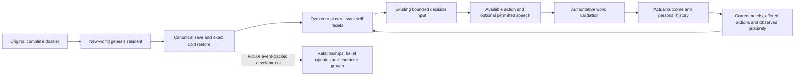

# Character depth review

Decision: proceed with rich, extensible character dossiers for all ten original residents. Unused traits are valuable authored material. A trait does not have to earn its place through an immediate game mechanic.

## Setting and source boundary

The official [SAO Aincrad introduction and character pages](https://www.swordart-online.net/aincrad/) combine social relationships, occupations, combat activity and personal disposition in their characterization. They do not specify the complete NPC data schema used here. Our ten residents, their backgrounds, ages, dimensions and growth possibilities are original project material, not canonical SAO characters or an assertion about official NPC psychology.

The [D&D 2014 Basic Rules, personality and background](https://www.dndbeyond.com/sources/dnd/basic-rules-2014/personality-and-background) provide a useful structural inspiration: traits, ideals, bonds and flaws, complemented by habits and preferences. We borrow that organizing idea. We do not import D&D classes, races, spellcasting, compulsory alignment or ability-score mechanics into Aincrad.

## What a complete dossier contains

Each resident has six decision-core fields, eight situational facets, twelve descriptive personality dimensions and twenty-one detailed sections:

1. Identity and authored personal details.
2. Appearance concepts and habitual gestures.
3. Authored background, clearly separated from simulated events.
4. Personality dimensions and internal contradictions.
5. Values, ethical boundaries and attitudes toward promises.
6. Personal attachments and possible commitments.
7. Flaws, fears, triggers and ways to repair conflict.
8. Near-term intentions and long-term aspirations.
9. Approach to trust, reciprocity, boundaries and closeness.
10. Voice, listening and voluntary disclosure.
11. Interests, likes, dislikes and leisure preferences.
12. Routine preferences, without an invented autonomous scheduler.
13. Work attitudes, learning style and qualification references.
14. Conflict responses, with no invented grudges or reputation.
15. Stored private concerns, excluded from the current decision projection.
16. Aincrad-oriented progression, equipment, weapon, party and guild slots.
17. Body and ability slots, with authoritative needs and inventory references.
18. Knowledge channels and the structure of future evidence-backed claims.
19. Directed relationship dimensions and source-event fields.
20. Latent growth possibilities, without a predetermined story.
21. Author notes, implementation status and continuity requirements.

The [complete readable dossiers](resident-dossiers.md) include every stored section. Unknown ability values are `null`, rather than fabricated numbers or zero. New modules can be stored in `extensions`; the first version supports up to 1 MiB per dossier as a file-integrity guard. Expansion is a versioned design decision, not a promise of literally infinite storage.

## How it reaches decisions

`town_turns` projects only the deciding resident's profile under `identity.character`. Six core fields remain stable. The ordinary facet is always considered; one situational facet is selected from urgent hunger, exhaustion, offered work, skill exchange, proximity or exploration. The current conflict facet is stored for later use by a sourced conflict mechanism. Private, author-only, detailed and extension sections never enter this projection. The projection stays within 2,600 UTF-8 bytes and existing total input, wire and spending caps are unchanged. Non-ASCII core data that cannot fit is explicitly omitted from the projection; it remains intact on disk.

This is preference and expression guidance. Existing action rules still decide what can happen. Traits can pull in different directions, and no slider directly forces an action. The current prompt continues to prioritize urgent survival needs over profession or personality.

## Review findings and limits

- **Approved:** deep, differentiated identity; unused details; contradictions; flexible growth; a schema that can gain modules later.
- **Required boundary:** no extra skill, possession, friendship, family event, diagnosis, remembered conversation or guild membership is created by descriptive prose. Actual qualifications remain in `life.skills`; goods and events remain in their existing authoritative records.
- **Context risk:** a rich dossier can consume the model's entire input. Full storage and bounded self projection solve different jobs. The offline wire checks must include a busy personal-history case, rather than just an empty world.
- **Privacy risk:** a catalogue in host memory must not become universal NPC knowledge. Nearby residents still expose only their already permitted public information. A real social channel must carry voluntary disclosures and source attribution.
- **Continuity risk:** automatically attaching new biographies to old identities would alter an existing world without reviewing its history. Legacy saves remain unchanged and unprofiled. The original seq450 save is on another computer; attaching these dossiers there requires an explicit, continuity-reviewed migration when it is available.
- **Behavior limit:** deeper identity removes a data bottleneck. It does not implement independent free conversation, a daily-life scheduler, persistent interpersonal beliefs or causal personality growth. Those are the next connected steps.

The next social increment should add an available conversation action and sourced introductions/disclosures, then person-specific shared-memory retrieval and relationship updates tied to actual events. More detail alone cannot demonstrate believable life; that requires observing later model decisions over time in the same world.
