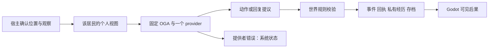

# InfiniteAincrad 开源协作评审

InfiniteAincrad 最值得发展的方向，是一个能亲自进入、能改变居民处境、能保留后果的 Godot 小世界。第一批贡献者需要同时看到两件事：一个可以运行和修改的作品，以及一个尚未被普通脚本游戏解决、但范围足够清楚的问题。这里最有辨识度的问题是：**居民只能根据自己的经历和收到的信息作出选择，模型更换后仍继续同一份世界历史。**

当前应把技术预览和有吸引力的首发分开。先交付无需编辑器、无需 API key 的 Windows 技术预览，让协作者有共同基线；随后补齐居民间询问/求助、三人知识边界和不同实际模型的续接证据，再发布 v0.1。当前不适合同时建设通用 agent 平台、多人后端、整座城市和完整美术体系。

这是一条在现有证据下可执行、可反证的推荐，不是数学意义上的唯一正确解。公开、许可明确、可运行和可贡献可以被工程验收；真正吸引并留住协作者，必须由外部参与行为验证。唯一执行顺序见 [ROADMAP.md](../../../ROADMAP.md)；以下内容解释选择依据和限制。

## 现状与证据边界

本地核验基线为提交 `59bd52e`，核验日为 2026-09-10。已有 Godot 3D 市场街道、固定提交的 OpenGameAgent、两名明确标记的测试居民、权威动作校验、保存与去重、独立个人视图。已有记录显示 Luna 完成需求、帮助、取水和饮水；Mira 在同一存档中观察到井有桶但无水，真实 Kimi 返回等待。仓库保留了知识隔离、决策边界、保存和冷恢复的验证记录，因此不能把项目描述成“只有想法”或“完全没有测试”。

尚缺项目整体许可证、`.github/` 构建流程、`game/export_presets.cfg` 和独立分发验收。`CONTRIBUTING.md` 已存在，但以内部规则为主，缺少让陌生人直接完成首个改动的教程。主美术 GLB 为 114,210,064 字节，可编辑 Blend 为 34,246,266 字节，两者已通过 LFS 完整性核验；现有场景和制作源是可以保留的资产。

原 13 人世界的完整源档和私有迁移包尚未核实。公开试验身份可以形成协作入口，但不能声称它们恢复了旧居民。文档里的既往真实模型证据也不等于新电脑上的模型已运行。本轮研究没有运行引擎验收、付费 NPC、模型对比或候选库兼容性实验。

这些事实来自 [STATUS](../../STATUS.md)、[迁机说明](../../CONTINUE_ON_ANOTHER_PC.md)、[MIT 接入记录](../../MIT_PLUGIN_BASE.md)、本地代码和资源清单。

## 类似项目能教什么

没有找到一个与本项目范围、团队规模、Godot 技术栈和世界连续性目标都完全相同、且能证明协作成功由某一个功能造成的案例。因此比较分成“AI 行为与复现”以及“长期游戏协作”两类。

| 案例 | 一手可观察证据 | 借鉴内容 | 不应照搬或夸大的部分 |
|---|---|---|---|
| AI Town | MIT starter kit，提供定制入口、本地 Docker/Ollama 与云部署路径 | 清楚展示 NPC 社交；让修改角色和 provider 的入口容易发现 | Convex/PixiJS 是另一套运行栈；不能说只能用云，也不能把替换 embedding 时清数据的方式搬到本项目。[1](https://github.com/a16z-infra/ai-town) |
| Generative Agents / Smallville | 作者公开核心模拟、保存/续接、回放与演示步骤；代码 Apache-2.0 | 把观察、记忆、后续行为和回放证据联系起来 | 研究安装流程和历史模型依赖不等于独立游戏发行；代码许可不自动覆盖其中所有美术。[2](https://github.com/joonspk-research/generative_agents) |
| Voyager | 公开 Minecraft agent、技能库和环境反馈方法 | 学习“行动必须收到环境反馈，技能需要可执行验证”的思路 | 它解决技能探索，不是本项目的居民身份连续性；不复制 Minecraft、Mineflayer 或自动执行生成代码的运行链。[3](https://github.com/MineDojo/Voyager) |
| Project Sid | 官方仓库明确提供技术报告，可见文件为 PDF、README 和图片 | 可作为多代理研究问题的对照 | 不能列作可直接接入的开源模拟器；千人规模的报告不是本项目要先完成的工程门槛。[4](https://github.com/altera-al/project-sid) |
| Luanti | 可获取版本、构建文档、贡献规则和方向文档 | 可运行交付、方向明确的小 PR、先讨论大改动 | 不照搬成熟引擎的组织规模；发布页存在不等于掌握其当前活跃贡献率。[5](https://github.com/luanti-org/luanti/releases) [6](https://github.com/luanti-org/luanti/blob/master/doc/direction.md) |
| Endless Sky | README 将下载、玩家手册、构建、贡献和代码/美术许可联系起来；有发行记录 | 让玩家、内容作者和工程师都找到下一步 | 游戏规模不是小项目的首发要求；不同素材的许可仍须逐项管理。[7](https://github.com/endless-sky/endless-sky) [8](https://github.com/endless-sky/endless-sky/releases) |
| Veloren | 官方手册为开发、美术、翻译、设计等提供入口；开发周报展示贡献者和合并工作 | 非代码贡献是完整路径；合并后公开展示成果和后续任务 | 周报 250 发表于 2025-11-21，支持历史协作事实，不代表已测得 2026-09 留存率；GitHub 是 GitLab 镜像。[9](https://book.veloren.net/contributors/index.html) [10](https://veloren.net/blog/devblog-250/) |

这些项目共同提供的经验是：**可见的作品负责吸引注意，可复现的环境和明确的小任务让注意变成贡献，维护者的审阅和持续交付让贡献继续。** 这是从案例机制作出的判断，不是经过控制实验的增长定律。本报告不按 stars 排名，也不把 fork、未关闭 Issue 或论文影响力换算成活跃贡献者。

来源复核还排除了一个容易混淆的 Veloren 同名仓库，并区分了原始 Smallville 与 `StanfordHCI/genagents`。采用官网和官方贡献手册建立来源链，详见 [来源复核](source-audit.md)。

## 强反论如何改变了方案

| 原主张 | 最强质询 | 修订后的判断 | 仍需验证 |
|---|---|---|---|
| 一个单人井边演示已经足以吸引持续协作 | 这可能只是普通脚本游戏，为什么值得长期加入？ | 它只够当技术预览；v0.1 还需新的居民互动和实际模型续接证据 | 外部参与者是否理解并愿意修改这个问题 |
| 先恢复第三名既有居民、完成三人和模型切换，再做任何分发 | 原始存档缺失会把贡献者永久挡在门外 | 隔离预览可先发；原世界恢复声明继续要求源档 | 公众是否能清楚区分演示身份与主世界 |
| 小样本失败达到固定比例就自动转型 | 样本、原因和阈值都没有充分依据 | 分类诊断和缩小试验，不自动改变 Godot 世界目标 | 接口问题、模型问题、物理问题、保存问题分别在哪 |
| 先做完整导航，居民交流才可信 | 固定井边已有可核实位置，为何整街重构是前提？ | 原生导航优先，但只在绕障或新目的地确有需要时做最小试件 | 宿主校验的位置与消息接收范围是否一致 |
| 同时引入两个本地推理服务做对比 | 同一模型换服务器并不能证明更换模型，而且增加安装工作 | Ollama 作为单个可选候选；llama.cpp 仅在明确缺口后再评估 | 指定机器、模型权重、延迟和资源占用 |
| 角色、UI、音效和写实木材可以一起改善画面 | 现有市场已可用，木材为何比消息和运行包重要？ | 撤回木材即时试验；人物与反馈也必须按可读性证据安排 | 一个外部角色是否真比现有占位体更易辨认 |

提供者超时、断网、取消与居民主动等待的混淆也被排除。失败时应显示系统状态，保持最后有效决定；不能为了让场面继续就记一条“居民决定等待”。真实居民拒绝/延后可以是有效行为，但不算一次已经完成的交付。

## 逐票结果

完整原始票据、统计与少数意见见 [投票结果](vote-results.md)。所有票基于冻结的 [提案 v1](ballot-proposal.md)，每位一票，至少四票支持才通过；主持方不增加一票。六个评审任务共享同类模型能力，不能当作六种独立实证来源。

**战略 S1 获 6/6 支持。** 具体依赖存在分歧：Quaternius 只有 1 票支持、5 票延后；Kenney 为 2 票支持、4 票延后，均不进入当前接入计划。通过的是许可默认建议、保留现有栈、有限构建试验、按需原生能力、预览后可选 Ollama，以及真实外部贡献的验收标准。

| 事项 | 赞成 / 反对 / 延后 | 结果 |
|---|---|---|
| MIT/CC BY 默认许可建议，待权利人确认 | 5 / 0 / 1 | 通过（建议/有限范围） |
| 保留 Godot/OGA/内核/现有测试 | 6 / 0 / 0 | 通过（建议/有限范围） |
| setup-godot 有限构建试验 | 6 / 0 / 0 | 通过（建议/有限范围） |
| 原生导航/动画按需最小试件 | 5 / 0 / 1 | 通过（建议/有限范围） |
| Quaternius 单角色有限试验 | 1 / 0 / 5 | 延后，不纳入当前接入 |
| Kenney UI/音效有限试验 | 2 / 0 / 4 | 延后，不纳入当前接入 |
| Poly Haven 木材现在必做 | 0 / 5 / 1 | 未通过，当前不加入 |
| 现在接入 Beehave/LimboAI | 0 / 6 / 0 | 未通过，当前不加入 |
| 现在迁移 GUT/GdUnit4 | 0 / 6 / 0 | 未通过，当前不加入 |
| 预览后可选 Ollama 单 provider | 5 / 0 / 1 | 通过（建议/有限范围） |
| 现在加入新 AI/代理/知识运行栈 | 0 / 6 / 0 | 未通过，当前不加入 |
| 以外部贡献和再次参与验证目标 | 6 / 0 / 0 | 通过（建议/有限范围） |

## 最小技术栈与复用取舍

世界状态只有一个权威来源。模型不能写资源、不能读任意他人记忆、不能给自己安装代码。行为树、动画状态和模型会话即使以后加入，也不能各自形成另一份世界事实。

| 复用项 | 能少做什么工作 | 代价与限制 | 接入证据和退出条件 |
|---|---|---|---|
| 现有 MarketCraftV5 + Blender → GLB | 保留已经完成的街道、制作源和材质；省去场景替换和二次整合 | 仍须明确原创资产的公开许可，检查导出和体积 | 现有哈希、来源、碰撞基线；新增角色失败就回到占位体，不改世界存档 |
| 固定 OpenGameAgent | 复用已有 C# agent runtime、主线程信号、取消和 provider 接口 | alpha API 有升级负担；上游更新不等于本项目应跟随 | 继续锁定当前提交与 MIT 文本；升级用旧存档和个人视图做针对性验证。[11](https://github.com/EricSun0218/OpenGameAgent/tree/b1a9f149d7cfd9e6659fd6aeb2ed4cfc275d0f84) |
| Godot 原生导航/动画 | 有需要时复用路径计算、跟随和动画混合 | Agent 节点不是世界权限系统；碰撞体也不会自动变成正确导航网格 | 只验证一个井边路线、到达范围和阻挡；动画根运动不越过宿主移动权限。[12](https://docs.godotengine.org/en/stable/tutorials/navigation/navigation_using_navigationagents.html) |
| setup-godot | 少写下载、选择和缓存 Godot 编辑器/模板的 CI 安装逻辑 | 它不替代导出预设、C# 构建、LFS、导入和行为测试 | 固定 Action SHA，取得官方 .NET 版本和模板，再用导出包冷启动；失败回到简单官方安装脚本。[13](https://github.com/chickensoft-games/setup-godot) |
| Quaternius Platformer 单角色 | 候选基础网格、骨骼和待机/移动动画 | 风格、比例、脚滑、骨骼/动作清单仍需检查；网页 CC0 声明不替代包内审查 | 只选一个角色，不整包导入；保持现有控制接口，失败删除试件。[14](https://quaternius.com/packs/ultimateplatformer.html) |
| Kenney UI Pack / Interface Sounds | 候选按钮视觉和点击/确认反馈 | 控件资源不会自动解决信息层级、中文字体或交互逻辑 | 先有具体可读性缺口，再选少量 CC0 文件；窗口缩放可读，失败退回原 UI。[15](https://kenney.nl/assets/ui-pack) [16](https://kenney.nl/assets/interface-sounds) |
| Ollama 可选本地 provider | 复用本地模型服务和结构化输出接口，减少自建推理宿主工作 | 下载、RAM/VRAM、延迟与模型权重许可是额外成本；“本地”不等于零成本 | 先固定一台机器、一个权重与 schema，记录完整响应/错误；不合适则禁用适配器，保持离线预览。[17](https://github.com/ollama/ollama) [18](https://docs.ollama.com/capabilities/structured-outputs) |

明确延后的候选包括：补充动画库、Poly Haven 写实贴图、Beehave/LimboAI、GUT/GdUnit4、llama.cpp、多供应商代理、向量数据库和 GraphRAG。延后并不等于库不好；本项目还没有证据表明这些东西解决的困难大于接入和维护它们的成本。

Beehave 适合重复的行动编排，LimboAI 还带原生扩展/状态机维护；现在只支持几个动作，先保留场景和世界内核的边界。GUT/GdUnit4 可以改善测试设施，但现有 SceneTree 测试已经可执行，整体迁移会先花时间。若贡献者确实需要标准报告、场景 fixture 或 C# mock，再用一个测试比较，不先迁移全部。[19](https://github.com/bitbrain/beehave) [20](https://github.com/limbonaut/limboai) [21](https://github.com/bitwes/Gut) [22](https://github.com/godot-gdunit-labs/gdUnit4)

AI Town、LiteLLM 和 GraphRAG 不进入当前主运行时。它们分别引入不同的模拟/数据栈、多供应商代理职责或索引流程；现有两名居民的个人经历尚不足以证明需要额外知识数据库。当前是直接构造个人视图，并没有已实现的词法检索系统可供“保留”。未来索引也只能是可重建的查询辅助，不能取代世界事实。[1](https://github.com/a16z-infra/ai-town) [23](https://github.com/BerriAI/litellm) [24](https://github.com/microsoft/graphrag)

Mixamo 的“可免费用于游戏”不能直接推导为可把角色和动画源文件放进公众仓库。当前选型不依赖这条未经确认的再分发路径；若以后有必要，应按准确条款重新审查。[25](https://helpx.adobe.com/creative-cloud/faq/mixamo-faq.html)

上述是候选方案的资料审查，不是完成了安装测试的性能结论。没有可靠依据声称它们已经节约了多少天；实际收益应记录为“原本需要做的工作、试验花费、保留下来的功能和新增维护量”。

## 第一条值得贡献的生活事件

继续使用井边的真实资源限制。Luna 的取水/饮水经历已经存在；Mira 走到可接收范围内询问。Luna 可以回复自己知道的情况、拒绝或延后，不能被程序补成知道另一处水源。第三名演示居民在范围外时不获知这段话；走近或实际接到转述后，才获得带来源的陈述。对话中“有人说这里有水”不自动等于世界里真的有水。

可见体验应让参与者分辨：谁说话、谁听见、谁没听见、为什么暂时无法行动、玩家提供了什么、资源究竟有没有变化。保存后重新打开，应延续消息状态和决定；不能再次投递、再次扣材料或重新收费。原始 world ID、居民 ID、已有经历和动作、事件次序是连续性的证据，漂亮对白本身不是。

验收先用固定离线输入覆盖边界：合法接收、超距、未知身份、重复请求、重复投递、拒绝、延后、错误响应、取消、保存失败和冷恢复。真实模型阶段只报告确实观察到的结果，不为了凑齐剧情重复付费直到模型答出预期。不同模型可能给出不同的合理选择，连续性要求保住旧事实并提供正确个人输入，而不是要求新模型逐字模仿旧模型。

这条事件同时为三个专业提供明确入口：Godot 贡献者处理位置与反馈，AI 贡献者处理个人输入和结构化提议，测试贡献者验证范围、去重与恢复。它比“请大家来一起造一个无限世界”更容易认领和审阅。

## 首批任务应该如何切分

以下是待整理为公开 Issue 的任务卡，尚未向 GitHub 创建或向他人发送。每项只要求一个可审阅结果；维护者必须先确认它与当前阶段相符。

| 任务 | 入口 | 最小交付 | 完成证据 |
|---|---|---|---|
| 启动说明修复 | `README.md`、`Run-Street.ps1` | 明确普通版/.NET 版、缺 SDK 或 LFS 时的操作 | 陌生机器按说明复现；错误信息对应实际缺项 |
| 导出基线 | 拟新增 `game/export_presets.cfg` 与 `.github/workflows/` | 一种 Windows .NET 包和现有测试入口 | 无编辑器/私钥的独立启动、版本和校验和 |
| 消息规则 | `game/core/world_kernel.gd` | 一条带来源和唯一 ID 的请求/回应路径 | 超距拒绝、不泄露经历、重复命令不重复改变状态 |
| 场景交流反馈 | `game/spatial/visitor_encounter.gd`、`street_trial.gd` | 正确显示谁收到/拒绝/延后，独立显示系统错误 | 现场操作和保存后的状态一致 |
| 恢复反例 | `game/tests/` | 一组最小失败案例，例如收到消息后退出再进入 | 消息与个人视图不重复、不串线，失败可复现 |
| 双语与可读性 | README、贡献说明、既有 UI 文本 | 修正一处新访客实际不理解的表述 | 无内部口令、步骤可独立完成；实际模型/回放标签准确 |

核心世界规则属于需要维护者审查的任务，不宜把它包装成完全无需上下文的 beginner issue。真正适合首次参与的任务，应先从文档、复现、测试反例和局部显示入手，再引向相邻模块。美术资源接入也需要明确接口，不能让贡献者随意替换场景节点而破坏角色控制。

建议维护者对认领任务在两个工作日内给出是否合适的回应，对小 PR 在五个工作日内给出第一轮实质反馈；若做不到，减少同时开放的任务。该响应目标是容量规划建议，不是当前已作出的服务承诺。贡献指南应让他人知道怎样开始、如何验证、由谁决定接受范围。[26](https://docs.github.com/en/communities/setting-up-your-project-for-healthy-contributions/setting-guidelines-for-repository-contributors)

## 许可、发布和持续参与

目前不能仅因代码在 GitHub 可见就称其已具备完整开源复用权限。开源需要许可允许相应使用、修改和再分发；投票也不能代替权利人的授权。[27](https://opensource.org/osd) [28](https://docs.github.com/en/communities/setting-up-your-project-for-healthy-contributions/adding-a-license-to-a-repository)

默认建议是：原创代码 MIT；原创美术和独立文档 CC BY 4.0；第三方代码/素材按文件范围保留自身条款。MIT 降低复用限制，但不强制衍生作品继续开放；CC BY 要求署名、许可链接和修改说明。若维护者更重视衍生开源义务，应先重新审查代码许可选择，而不是悄悄附加“禁止商用”等条件并仍称 MIT。本轮只推荐，没有加入实际 LICENSE，也没有把第三方内容改授本项目许可。[29](https://choosealicense.com/licenses/mit/) [30](https://creativecommons.org/licenses/by/4.0/)

正式 Windows 包需要官方 .NET 编辑器和对应模板。官方 4.7.2 档案列出这些下载；它们可获取不等于本仓库导出已经通过。Godot 当前文档明确 Godot 4 C# 不能直接导出 Web，因此首发先提供 Windows 包；网页可以展示录像与文档，不为降低一次点击成本而改写整个项目。[31](https://godotengine.org/download/archive/4.7.2-stable/) [32](https://docs.godotengine.org/en/stable/tutorials/export/exporting_for_web.html)

传播素材应先回答“我能做什么、今天能玩到什么、下一件能帮的事”。用一段实际操作与恢复录像、一张简明结构图、一个下载入口和几张具体任务卡即可。首次触达可以聚焦 Godot 开发社区、AI 游戏/agent 开发者和自由美术创作者，各自对应一个真实任务。具体发帖、邀请和消息发送须另有明确授权；本轮没有外联，也没有用自动化制造关注。

### 三类完成标准

| 层级 | 需要的证据 | 不能用什么替代 |
|---|---|---|
| 可以协作 | 权利明确；无私有依赖的运行包；源码构建；具体贡献步骤 | 仓库公开、维护者本机截图 |
| 值得协作 | 可归因的三人互动；实际不同模型续接；能从小改动看到影响 | 模型只换台词、固定回放、人口数量 |
| 已经发生协作 | 外部独立运行；可验收贡献被接纳；有再次参与 | stars、自动 agent PR、口头表示感兴趣 |

建议首轮观察 30 天，目标为至少五名独立体验者、三名完成可验收贡献的外部参与者，其中两名再次参与。代码、美术、翻译、文档和测试均可计入；这些数值是小规模试验目标，不是行业成功线。没有足够曝光、安装失败、看不懂事件、任务太大和审阅太慢是不同原因，应分别处理。不要因未达一个比例就自动扩大系统或放弃目标。

## 不确定性与重新评审

最重要的不确定性是需求：尚无外部证据证明大家会为了“跨模型连续的居民”留下来。其次是不同模型是否能在既定动作范围内给出有意义的新选择、本机推理的硬件体验、素材替换是否改善可读性，以及维护者是否有足够精力接住贡献。一次有限试验不能把这些问题全部解决。

重新评审应由具体证据触发：多人独立运行仍被同一阻碍卡住；模型得到正确个人输入却长期只能生成无关文本；同一存档无法保持已有事实；外部贡献长期卡在同一个接口；或选定依赖引入了超过其收益的构建/维护问题。先定位和缩小变更。必要的路线调整仍围绕能进入、能影响、能延续的世界，不由一次失败自动变成另一个项目。

完整独立意见保留在 [产品](strategy-product.md)、[社区](strategy-community.md)、[怀疑派](strategy-skeptic.md)、[美术](reuse-art.md)、[Godot](reuse-godot.md)、[AI](reuse-ai.md)。其中初始主张和被撤回的意见属于评审历史；最终执行顺序以根目录路线为准。资料检索与来源复核日期为 2026-09-10；有明确发布日期的来源已在文中标出，访问限制见来源复核记录。

## 来源索引

以下编号对应正文中的直接链接。检索日期为 2026-09-10；除已注明者外，不把页面抓取日期当作出版日期。访问失败与本地补证见来源复核记录。

1. [a16z-infra — AI Town README](https://github.com/a16z-infra/ai-town)
2. [Joon Sung Park 等 — Generative Agents README](https://github.com/joonspk-research/generative_agents)
3. [MineDojo — Voyager README](https://github.com/MineDojo/Voyager)
4. [Altera — Project Sid technical report repository](https://github.com/altera-al/project-sid)
5. [Luanti — Releases](https://github.com/luanti-org/luanti/releases)
6. [Luanti — Direction document](https://github.com/luanti-org/luanti/blob/master/doc/direction.md)
7. [Endless Sky — README](https://github.com/endless-sky/endless-sky)
8. [Endless Sky — Releases](https://github.com/endless-sky/endless-sky/releases)
9. [Veloren — Contributor manual](https://book.veloren.net/contributors/index.html)
10. [horblegorble / Veloren — These weeks in Veloren 250（2025-11-21）](https://veloren.net/blog/devblog-250/)
11. [EricSun0218 — OpenGameAgent pinned commit；本地来源锁与 MIT 文本补充核验](https://github.com/EricSun0218/OpenGameAgent/tree/b1a9f149d7cfd9e6659fd6aeb2ed4cfc275d0f84)
12. [Godot — Using NavigationAgents](https://docs.godotengine.org/en/stable/tutorials/navigation/navigation_using_navigationagents.html)
13. [Chickensoft — setup-godot](https://github.com/chickensoft-games/setup-godot)
14. [Quaternius — Platformer Game Kit](https://quaternius.com/packs/ultimateplatformer.html)
15. [Kenney — UI Pack](https://kenney.nl/assets/ui-pack)
16. [Kenney — Interface Sounds](https://kenney.nl/assets/interface-sounds)
17. [Ollama — Source repository](https://github.com/ollama/ollama)
18. [Ollama — Structured Outputs](https://docs.ollama.com/capabilities/structured-outputs)
19. [bitbrain — Beehave](https://github.com/bitbrain/beehave)
20. [limbonaut — LimboAI](https://github.com/limbonaut/limboai)
21. [bitwes — GUT](https://github.com/bitwes/Gut)
22. [godot-gdunit-labs — GdUnit4](https://github.com/godot-gdunit-labs/gdUnit4)
23. [BerriAI — LiteLLM](https://github.com/BerriAI/litellm)
24. [Microsoft — GraphRAG](https://github.com/microsoft/graphrag)
25. [Adobe — Mixamo FAQ](https://helpx.adobe.com/creative-cloud/faq/mixamo-faq.html)
26. [GitHub Docs — Setting guidelines for repository contributors](https://docs.github.com/en/communities/setting-up-your-project-for-healthy-contributions/setting-guidelines-for-repository-contributors)
27. [Open Source Initiative — The Open Source Definition](https://opensource.org/osd)
28. [GitHub Docs — Adding a license to a repository](https://docs.github.com/en/communities/setting-up-your-project-for-healthy-contributions/adding-a-license-to-a-repository)
29. [GitHub Choose a License — MIT License](https://choosealicense.com/licenses/mit/)
30. [Creative Commons — Attribution 4.0 International](https://creativecommons.org/licenses/by/4.0/)
31. [Godot — 4.7.2 stable archive（2026-08-18）](https://godotengine.org/download/archive/4.7.2-stable/)
32. [Godot — Exporting for the Web](https://docs.godotengine.org/en/stable/tutorials/export/exporting_for_web.html)
