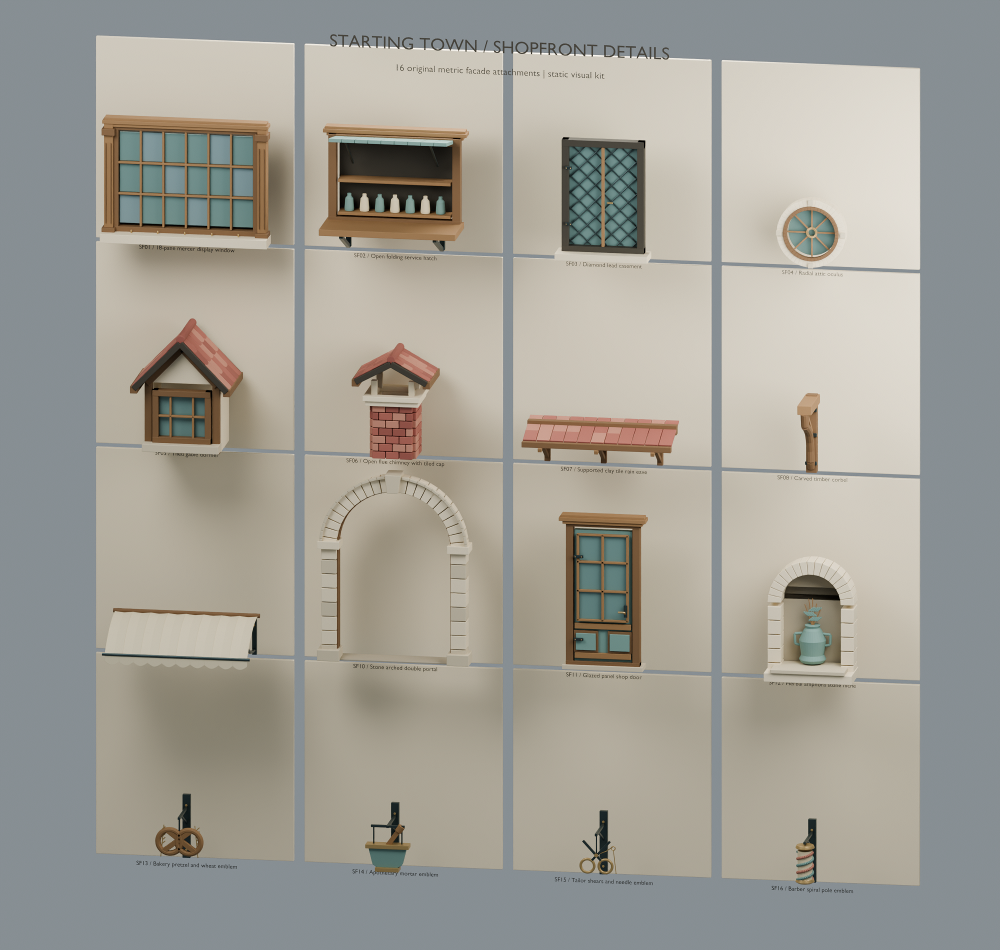
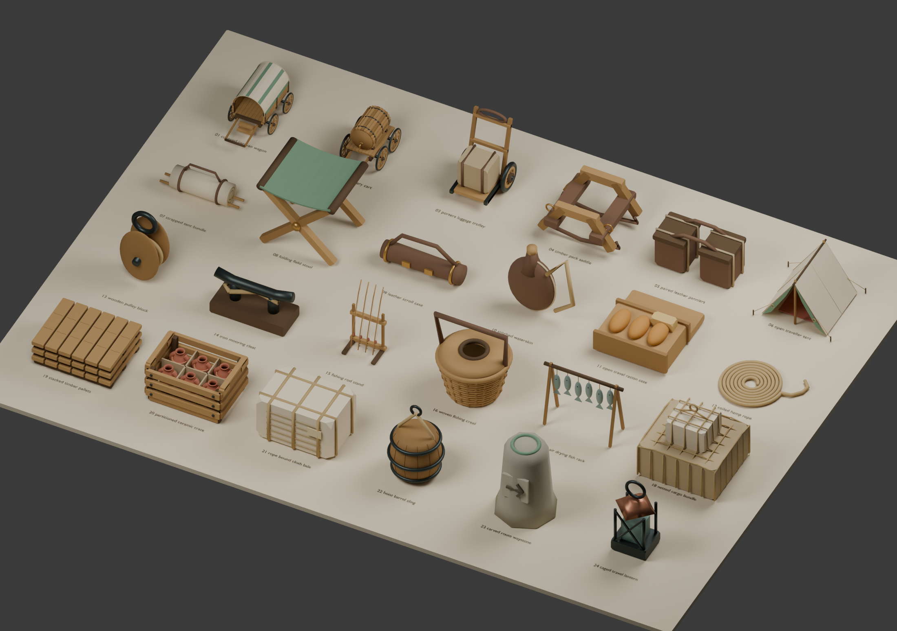
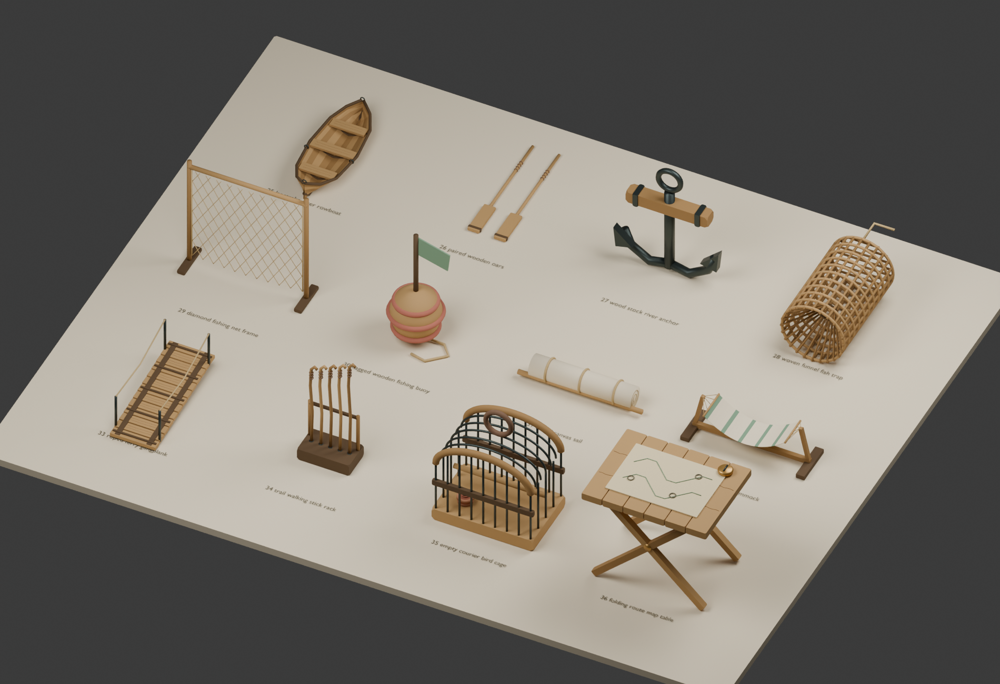
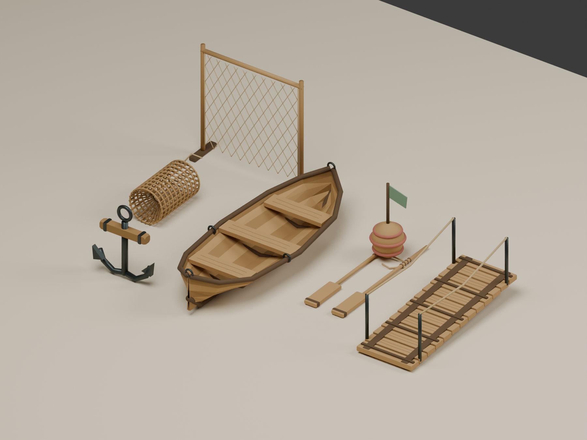

# 并行美术交付：新增70件

用户本次明确授权两个 GPT-6 Astra Ultra 子 Agent 加根代理并行制作 Blender 美术，截止北京时间2026-09-12 15:00。本页只统计该并行线程新增资产，邻线程的108件另计。

| 资产组 | 独立模型 | GLB三角数 | 编辑源 |
| --- | ---: | ---: | --- |
| 店铺外立面 | 16 | 158,786 | [ShopfrontDetails20260912.blend](../../../Art/Generated/ShopfrontDetails20260912/ShopfrontDetails20260912.blend) |
| 职业工坊设备 | 18 | 116,052 | [artisan_workshops_library.blend](../../../Art/Generated/ArtisanWorkshops20260912/artisan_workshops_library.blend) |
| 旅行与河岸运输 | 36 | 169,554 | [travel_cargo_library.blend](../../../Art/Generated/TravelCargo20260912/travel_cargo_library.blend) · [river_trade_library.blend](../../../Art/Generated/TravelCargo20260912/river_trade_library.blend) |

总计 **70件独立GLB、4个可编辑Blender库、444,392个三角形、37.22 MiB GLB**。

**验证：** [独立二进制审计](glb_audit.json) 70/70通过，有限坐标、单位法线、材质索引与UV有效，退化三角0；[Godot实际导入](godot_import.json) 70/70通过，未加载世界场景或存档。旅行组另有[Blender回导36/36](travel/blender_roundtrip.json)，店面/工坊回导证据在各子目录。交付清单逐件重新计算SHA-256，并与各组manifest及审计记录核对。

**近景修订：** 修复曲管截面跳变导致的轮箍黑缝、使运输绳网贴合货物；店面修正雨檐椽条、烟囱错缝和橱窗格数标注；工坊同步曲管连续截面修正。初次失败/中止日志保留，最终以各组最终验证记录为准。

**使用范围：** 静态装饰资产；没有新增碰撞、LOD、车辆操作、生产技能或居民行为。窗门按各自manifest记录的墙面挂点安装，需要宿主立面预留位置。运输与工坊按米制地面原点使用。图集为方便比较而归一化展示尺寸，GLB保持实际米制比例。

**来源与权限：** 原创程序几何，使用本项目已有最小几何辅助函数；没有导入受限人物、私有存档或外部模型。项目统一再分发许可仍由维护者决定。以上均指生成阶段：生成阶段没有使用reset、调用居民模型、提交或推送Git；其后的发布由用户明确授权，见下节。

完整可机读清单：[delivery.json](delivery.json)。每组源目录README包含重建命令及限制。根代理与子Agent用量按各会话累计计数的增量写入私有ledger；不能把账号共享额度变化归为本线程精确费用。

## 发布（2026-09-12）

用户接受这70件资产后明确授权上传 Git。本次提交只包含本页所列的70件及本目录证据：`Art/Generated/ShopfrontDetails20260912`、`Art/Generated/ArtisanWorkshops20260912`、`Art/Generated/TravelCargo20260912`、`game/assets/generated/` 下对应的三个运行目录、本目录、`Art/README.md` 与 `docs/STATUS.md`。邻线程的108件及其文档/工具，以及 Transfer、deliveries、private、tmp、日志、`.blend1` 与缓存都在本次提交之外。分件证据见[店面 REPORT.md](shopfront/REPORT.md)与[工坊 REVIEW.md](workshops/REVIEW.md)；本页历史哈希与验证结果未改。

## 真实渲染图集

### 店铺外立面

### 职业工坊设备

### 旅行与河岸运输

### 河岸运输补充12件

### 旅行营地近景

### 河舟近景

最终收尾：所有本线程及两位子Agent的自有进程均已结束，见 [进程清理](cleanup.json) 与各组cleanup记录；[用量快照](usage_summary.json) 按根代理及工人的实际会话高水位增量统计，后续消息不在该快照内。
