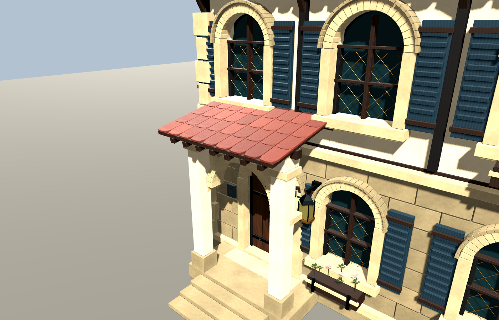
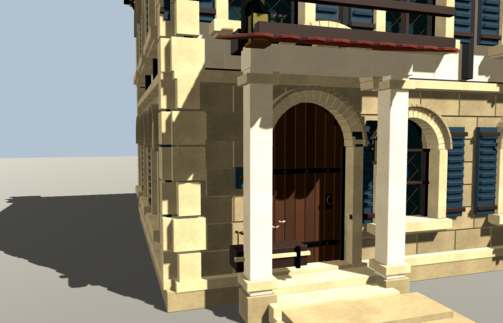
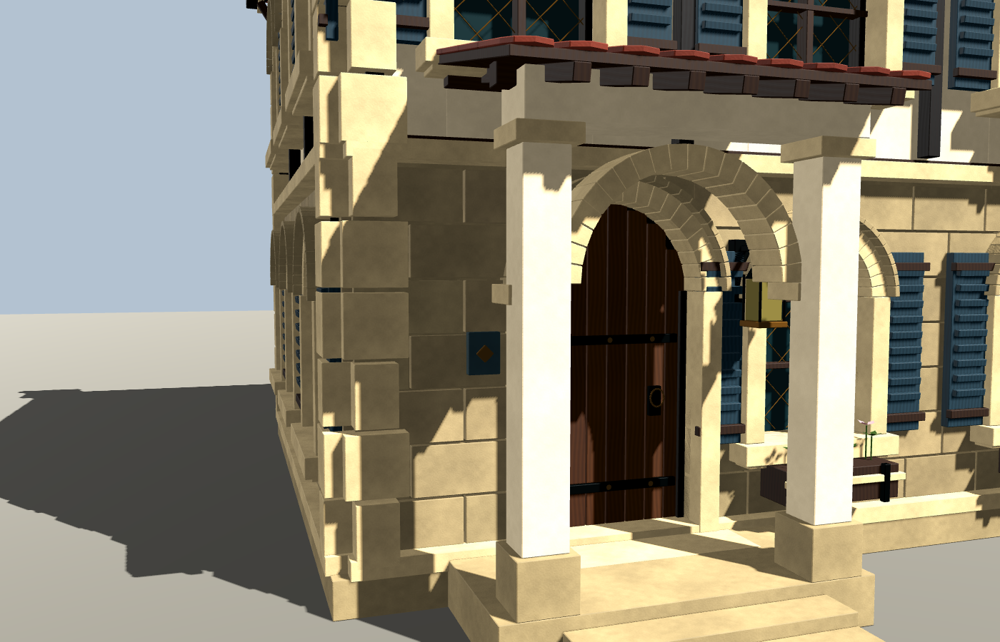

# 住宅 06：DeepSeek 执行、GPT-6 评审后的修复

2026-09-12。本轮外观与碰撞修复通过监督验收，保留为独立住宅外观组件。模型请求与返回均为 `deepseek-flash`，当日官方映射为 DeepSeek-V4.1-Flash。用户明确继续“GPT-6 思考、DeepSeek 执行”，并取消旧的 1 美元／3 次调用限制。[官方模型说明与定价](https://api-docs.deepseek.com/quick_start/pricing/)

## 可见结果



| 修复前，同一台 Windows 电脑与视角 | 修复后 |
| --- | --- |
|  |  |

门前花箱移到真实窗下；遮挡新屋面的原上层花箱仅在本栋生成时被抑制。门廊由实际柱、柱头、拱、梁、椽木和封闭木屋面板组成，屋瓦由同一坡面推导支撑。新增外台阶逐级连接平台，其碰撞高度来自相同实体。移除穿窗横条、多余的两个烟囱及穿屋面的额外灯具，保留原门边灯和一个烟囱。名称改为“连廊屋 / Gallery House”。

六个真实 Godot 视角：[正面](repair_2026-09-12/after/front.png)、[背面](repair_2026-09-12/after/rear.png)、[门口](repair_2026-09-12/after/near_door.png)、[右立面](repair_2026-09-12/after/right_facade.png)、[屋面](repair_2026-09-12/after/porch_structure.png)、[人物眼高](repair_2026-09-12/after/porch_eye.png)。图片直接复制实机输出，未重绘；[渲染证据](repair_2026-09-12/render-evidence.json)含图片哈希和实际网格数。

## 独立验证

- Blender 5.2.1 LTS 完成源文件保存与 GLB 导出；Godot 4.7.2 .NET 在 RTX 5080、OpenGL Compatibility 下完成重新导入与六视角渲染。
- 同一物理套件：[原版 54 项中失败 38 项](repair_2026-09-12/before-physics.json)，[最终版 54/54 通过](repair_2026-09-12/after-physics.json)。包含原三项回归、关闭的门与外墙、24 个分层人物胶囊检查、真实 LOD0 三角表面与碰撞代理的台阶/平台高度对照，以及两根柱子的可见/物理命中。门廊可通行至关闭的门；没有声称室内可进入。
- [实际 GLB 审计](repair_2026-09-12/after-glb.json)：LOD0/1/2 为 **162,006 / 67,194 / 24,645** 三角形；各档退化面、塌陷 UV1 面均为零。保留 12 张嵌入式 2048×2048 图片、四套完整 PBR 材质、双 UV、法线/切线/顶点色。LOD0 原有 4 个同绕向重复面数量未增加，LOD1/2 为零；不宣称原库完全没有重复几何。
- 最终 GLB 为 63,655,396 字节，SHA256 `61d63c9a3b5157cecf99afe89f38d7650340650aeae1f875d13150b2ac4642d3`；实际渲染报告的三档三角形数与该导出一致，仅强制显示 LOD0。
- 原先五栋 GLB 逐一仍匹配原清单 SHA256，共享构件库和它们的清单未改。没有加载或写入居民世界存档，没有居民模型调用。

复现入口（在仓库根目录，`$godot` 指向本机 Godot 4.7.2 .NET）：

```powershell
& $godot --headless --editor --path game --import
python tools/review_deepseek_residence.py --output tmp/house06-audit.json --baseline docs/validation/deepseek_residence_06/repair_2026-09-12/before-glb.json
& $godot --headless --path game --script res://tests/deepseek_residence_acceptance.gd -- --output=D:/path/to/physics.json
& $godot --path game --rendering-method gl_compatibility --script res://tests/deepseek_residence_capture.gd -- --review-output=D:/path/to/captures
```

## 分工、失败与实际消耗

最终 `build_house_06.py` 与第 7 次 DeepSeek 返回的完整文件逐字节一致（统一尾换行），SHA256 `a68ca38e3887fca0a330e28a2cfd629a473a44f34cc6a9dcf65d4ae5e0b645d2`，另有[机器可核对记录](repair_2026-09-12/usage-and-attribution.json)。核心几何、碰撞和导出清理由 DeepSeek 实现。GPT-6 负责范围/结构约束、调用与记账、代码审查、独立验证脚本、构建/截图及文档，没有替换为其他执行模型或手工代修核心文件。

| 本轮调用 | 输入 | 缓存命中（已含于输入） | 输出 | 结果 |
| --- | ---: | ---: | ---: | --- |
| 1 | 18,729 | 0 | 5,292 | 静态退回：屋面位置、拱顶及台阶 |
| 2 | 24,798 | 23,936 | 6,661 | 静态退回：重复几何、台阶倒序、坡面不一致 |
| 3 | 32,073 | 31,360 | 7,077 | 构建及物理通过；实机发现穿屋面植物与缺少木屋面板 |
| 4 | 39,823 | 39,040 | 7,699 | 静态退回：木屋面板旋转轴错误 |
| 5 | 48,108 | 47,488 | 8,758 | 静态退回：面朝向与瓦片覆盖宽度 |
| 6 | 57,235 | 56,832 | 8,872 | 画面和物理通过；实际导出每档发现一个退化面 |
| 7 | 66,537 | 66,048 | 8,985 | 加强近重合边/面积清理；最终全部检查通过 |
| 合计 | **287,303** | **264,704** | **53,344** | **340,647 tokens** |

全部请求均有返回 usage，失败消耗没有丢弃。按已核验官方峰值单价计算，本轮保守费用上界 **USD 0.072380724**，不是核对余额后的实际账单。旧回合 95,328 tokens 与 USD 0.059221776 已公开费用上界另行结转，已知两回合上界合计 USD 0.131602500；旧电脑私有原始逐次账本没有恢复，此处明确采用公开报告记录，不冒称找回原账本。原始请求、响应、密钥和运行账本留在 Git 忽略目录。

GPT-6 的本轮原始 token 增量从“继续流程迭代吧”前的实际会话计数开始，快照见同一机器记录。缓存输入只计入输入一次；不将 ChatGPT 会话 token 换算成未经核对的 API 费用。快照不包含其后报告整理和最终回复。

监督流程中还记录了：首次外部调用被自动审批错误归为私有源码外发；匿名 GET 证实四个输入文件与公共 GitHub 提交完全一致后，重审通过，首次被拦截时没有发送请求。第 6 版首次审计中止导入后的旧缓存截图没有作为验收证据；重新导入后复测，最终第 7 版的网格数、哈希与截图明确对应。Windows 沙箱有缩略图/着色器缓存和系统证书读取提示，已生成的源、导出、物理结果和六张截图均核对成功；没有把这些提示当成建模失败或网络能力验证。

## 方向与边界

本轮把一栋失败样件修成了有可通行门廊的连贯外观资产，并留下可复测的证据。它仍是独立审查场景中的封闭外壳：没有室内家具、开门交互、居民住房规则或维护世界中的实际放置，也没有本轮远距 LOD 边界/整街性能结论。下一步选择街道位置，验证人物尺度与路线，再单独推进可进入室内和住房行为。本轮到此可见结果为止，未启动无人值守循环、发布或推送。
