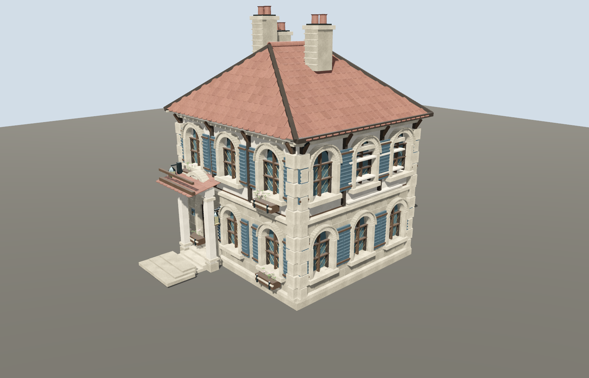
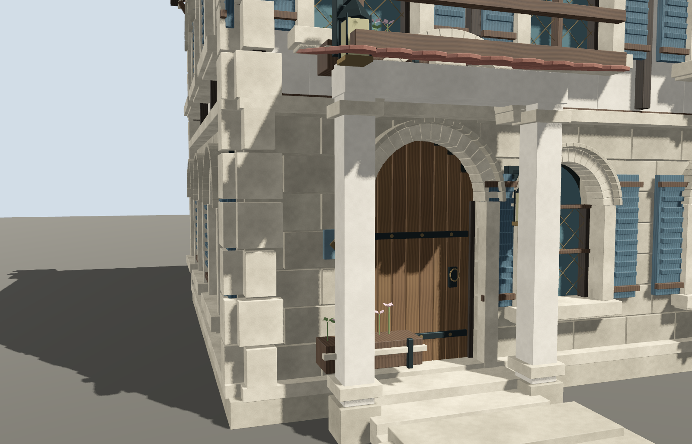

# DeepSeek 住宅 06：首栋试验评审（未通过）

日期：2026-09-11。用户要求由 DeepSeek 实施核心工作，GPT-6 仅评审。

## 结论

完成 **1 栋可导出、可渲染的试样，0 栋通过最终验收**。不继续复制缺陷做后续住宅；未接入维护中的街道、未覆盖已验收五栋资产。用户随后授权上传本轮资产，按未通过验收的草稿保留，上传不等于质量验收通过。

[背面视图](rendered/rear_three_quarter.png) 中最高烟囱略被画面裁切；不将它当作完整轮廓验收图。

## 实际分工与来源

- DeepSeek API 请求模型、返回模型均为 `deepseek-flash`。第一次使用 high 推理模式，后两次关闭推理模式直接生成文件。
- 新住宅组合、Blender 构建导出脚本、Godot 组件与展示脚本均来自 DeepSeek。最终 7 个文本文件逐一与第三次响应比较，一致（仅统一末尾换行）；GPT-6 未代写或修正其中的核心代码。
- 复用了已有 GPT 编写的 `Art/ReferenceScenes/Floor1Residences/build_residences.py` 基础库和原有四套 2K PBR 材质。因此不是“DeepSeek 从零完成所有底层几何和贴图”的实验，也不是公平的从零模型能力基准。
- GPT-6 负责调用/私有记账脚本、设计与技术要求、执行构建、错误反馈、独立二进制与物理检查、画面评审和此报告。监督代码不是 DeepSeek 核心建模产物。
- Key、请求原文、私有调用账本在 Git 忽略路径中，没有复制到该报告。

## 已通过的技术检查

- 最终 Blender 构建、Godot 脚本解析、Godot 导入及实际 Metal 渲染退出成功。三张 PNG 保存返回 OK。
- GLB 实际二进制检查：3 个 LOD，12 张嵌入式 2048×2048 PNG、4 套含法线/ORM 的 PBR 材质；存在位置、法线、切线、顶点色和两套 UV。三个 LOD 均未检出退化三角形或零面积 UV1 三角形，UV1 数值有限且在 0–1 范围。
- 实测 LOD0 / LOD1 / LOD2 三角面：**165,462 / 69,494 / 26,417**。
- [渲染记录](rendered/deepseek_residences_evidence.json) 确认拍摄时只有 LOD0 可见。
- 自动 LOD 配置为 0–32 / 32–70 / 70+ 米、零边缘空隙；本轮没有声称完成远距真实渲染边界测试、整街性能或内存测试。

## 不通过项

1. 实际近景中，新增花箱放在门扇前方，不在窗下，遮挡入口。
2. 门廊新增木梁浮在瓦面上方，拱圈穿出小屋顶，结构连接不成立。
3. 东侧新增浅色横条穿过上层窗洞及窗扇，不是合理的建筑收边。
4. 实际模型有 **3** 个烟囱（基础库已有一个，再新增两个），与提交说明中的两个不符；“十字屋”等描述也不能作为已实现十字形平面的证据。
5. [真实物理查询](physics_review.json) 3 项中 **2 项失败**：看似开放的门廊被整块碰撞盒封死；台阶碰撞偏到门口右侧空地，产生不可见障碍。主墙封闭检查通过。

这些是资产结构/可用性缺陷。几何、UV 数据格式通过不抵消它们。维持草稿状态，不把它包装成已达到原五栋质量的成品。

## 调用过程与 Token

| DeepSeek 请求 | 输入 | 缓存输入（已含于输入） | 输出 | 合计 | 结果 |
| --- | ---: | ---: | ---: | ---: | --- |
| 1 | 14,206 | 0 | 24,000 | 38,206 | 输出全为推理，长度截断，无实现 |
| 2 | 14,306 | 0 | 9,039 | 23,345 | 返回代码；Blender TypeError、Godot 类型错误 |
| 3 | 25,180 | 23,296 | 8,597 | 33,777 | 修正后可构建/渲染，但美术和碰撞不通过 |
| 总计 | **53,692** | **23,296** | **41,636** | **95,328** | 3 次请求，含全部失败消耗 |

GPT-6 在本轮“开始建模吧”用户消息之前的真实会话累计计数作为基线；截至完成画面/碰撞评审、开始写本报告之前的快照：输入 **3,404,258**（缓存输入 **3,331,968**，非缓存输入 **72,290**），输出 **13,260**，合计 **3,417,518**。不含之后的报告撰写和最终回复 Token；这不是估计值，也不是整段历史的累计总数。

GPT-6 数字包含长会话的重复上下文输入、检查、调度与首次调用/记账工具准备。不能把它当成稳定量产后的每栋净成本；也不能只拿输出 Token 隐去上下文消耗。缓存输入是输入的子集，绝不再次加到合计里。GPT-6 所属产品实际账单未核对，不按 API 单价伪造费用。

DeepSeek 按[官方定价页](https://api-docs.deepseek.com/quick_start/pricing/)的峰值单价，对实际命中/非命中输入和输出计算的保守费用上界为 **USD 0.059221776**；这不是余额差核对后的实际账单。三次响应均有 usage，未知费用预留已结清。本轮执行了预先声明的最多 3 次请求、10 秒冷却、保守 USD 1 上限；达到请求数后不再自动发出请求。

## 方向评审与下一步

得到的有效证据是：DeepSeek 能在现有构件库上经反馈生成可运行住宅资产，但本次尚不能独立交付合格的空间结构与碰撞。第一条可玩街道没有因此获得新的合格住宅，也没有增加居民能力。

下一步若用户继续授权，只退回这栋的上述具体缺陷并按相同视角验收；不要先批量扩增住宅，也不要由监督者代修后冒称 DeepSeek 独立达到质量要求。保留这次失败费用和历史，不能因续跑清零。
