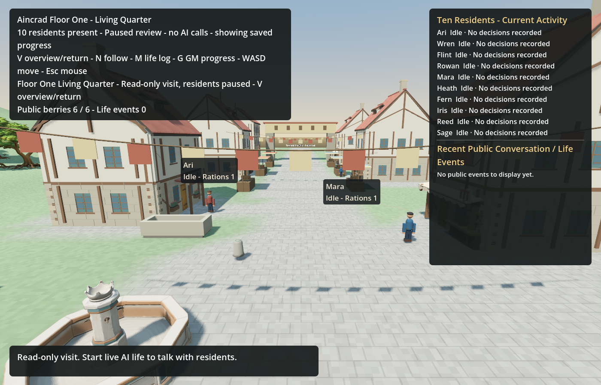

# English game, model instructions and roadmap

Authored game text, default resident names/backgrounds, action labels, dialogue templates, UI, launch messages, Kimi/GM instructions and the current flowchart now use English. Conversation with the user remains Chinese. No paid game-model request or subagent was used.

## Names and compatibility

| Stable resident ID | English name |
| --- | --- |
| shared:well-keeper | Ari |
| shared:baker | Wren |
| shared:smith | Flint |
| shared:carpenter | Rowan |
| shared:innkeeper | Mara |
| shared:herder | Heath |
| shared:gardener | Fern |
| shared:weaver | Iris |
| shared:fisher | Reed |
| shared:healer | Sage |

New seeds use these names. `english_text.gd` and its explicit legacy catalog provide presentation aliases for known old names, descriptions and authored messages. Canonical IDs, inventory, skills, contracts, history and unknown costs are preserved. Read-only UI/model projections do not rewrite saved bytes. Unknown historical free text stays verbatim; this is not a claim that every past dialogue has been translated.

The original seq450 world, GM memory and cost ledgers remain on another computer. They were neither recreated nor migrated. Their arbitrary past dialogue cannot be checked here. Original conversation archives and dated project evidence retain their original language.

Both seed constructors were compared with the previous source. Apart from names, stories, personalities and capability descriptions, all values matched; generated creation timestamps were normalized only for this comparison. The layout JSON changes only two connection labels. Geometry is identical. The strict preview provenance check accepts exactly the old reviewed layout hash and the English revision, while rejecting unknown hashes.

## Model behavior and context

Kimi gateway instructions, the OGA resident entry and all three GM phases explicitly require English natural-language output. Machine identifiers are unchanged. The older model/interface and capability experiment prompts are also English. Quoted historical evidence is preserved.

Loopback tests inspect actual HTTP requests from the built C# adapter. They confirm the English instruction, privacy projection, request limits, Unicode preservation, cold historical knowledge and refusal to replay an already used request journal. These mock transports do not establish that a live model will always obey the instruction.

Longer English activates the existing context compressor sooner. In the historical transport fixture, the two informed requests retained the latest **4** personal events, alongside sourced skill/material/place knowledge, current options and commitments. The old test incorrectly required exactly 16 events. It now verifies the exact newest personal-event suffix and immutable event identity/source fields within the existing cap. Full canonical history remains on disk. No context, output, request or cost limit was raised.

## Verification

| Check | Result |
| --- | --- |
| .NET build and Godot import | Passed; build servers disabled |
| Launcher, workflow, preview preparation and conversation archive | 43 Python tests passed |
| Legacy aliases, GM status, needs, food handoff, restore, places, turns, baking, trade, context, home lookup and scene/nameplates | 512 Godot checks passed |
| Actual sixteen-house scene, two requested window sizes | 40 UI checks passed; exact save bytes preserved |
| Gateway mock transport | 6 cases passed; no paid upstream requests |
| Complete ten-resident / ten-GM offline workflow | 179 checks across 8 normal stages passed |
| Bounded source audit | 74 runtime files checked; no non-comment Han text outside the explicit legacy catalog |
| English flowchart | 36 nodes rendered; no browser errors; standalone HTML/SVG/PNG |

The workflow used scripted resident choices and ten isolated fixture GM contexts. It exercised a candidate for an existing finite material source, explicit review/refusal, installation, real body movement, interrupted labor, another graphical process continuing the same job, and a final separate-process cold restore. The source finished with stock 1 and recovered total 2; property and history stayed consistent. No body position was teleported by the graphical probe. This is bounded offline integration, not proof of autonomous invention or sustained live life.

The actual English HUD wraps within its panels. Requested windows were 1280×800 and 1600×900. Godot's existing aspect/stretch settings produced captured viewports of 1244×800 and 1400×900; panel checks use logical viewport coordinates. The UI probe initially compared logical coordinates with physical window dimensions and failed falsely; the corrected check and successful rerun are retained separately.

[Smaller-window capture](english-rollout-2026-09-18/town-english-1280x800.png) · [Checks, hashes and exact local evidence paths](english-rollout-2026-09-18/checks.json) · [English zoomable flowchart](local-flow-2026-09-18/flowchart.html)

Local evidence: `C:\InfiniteAincrad\private\english-20260918` and `C:\InfiniteAincrad\tmp\gpt6-sprint\integration\english-20260918`. Initial test-command errors (Python import path, missing home-probe arguments), an incorrect unknown-name fallback expectation, the fixed-count history assumption and logical/physical viewport mismatch remain in original logs. Successful reruns have separate receipts. Owned engine/helper processes exited; no global process cleanup was performed.

## Remaining gaps

- The sixteen-house scene still reports four overlapping navigation edges. Geometry is unchanged and this issue remains open. The older-street full workflow had no engine errors or warnings.
- Earlier renderer-exit/particle problems are not closed by these successful runs.
- The missing original private world prevents checking all historical dialogue. Known aliases do not fabricate translations of unknown speech.
- Sustainable resources, voluntary ration sharing and sustained autonomous NPC/GM operation remain future validation work.

The current plan is [ROADMAP.md](../../ROADMAP.md). The previous full roadmap was archived byte-for-byte in [the dated history copy](../history/roadmap-before-english-20260918.md). Conversation upload scope and cutoff are recorded in [the archive manifest](../history/conversations/2026-09-18-01a0b299/manifest.json).
