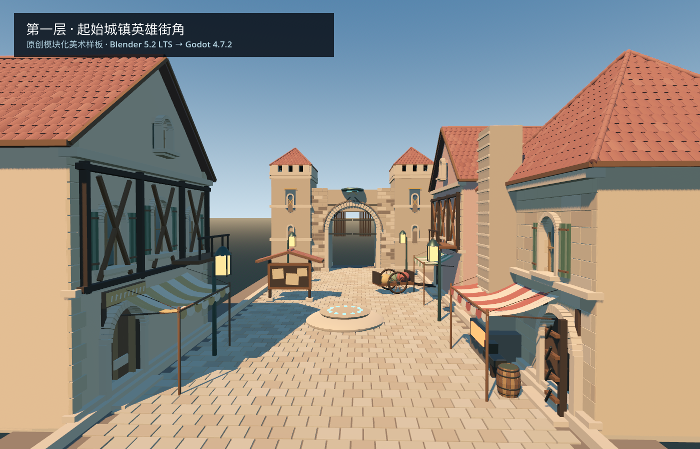
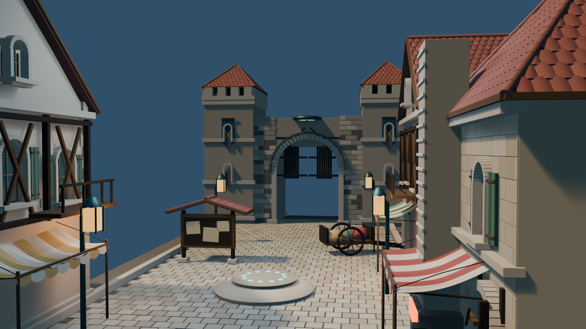

# First-floor hero street art validation

Built and checked locally on 2026-09-11 with Steam Blender 5.2.1 LTS, Godot
4.7.2 .NET, Metal 3.1 and an Apple M1 Pro. This is an art-only preview. It
creates no resident decision, event, resource or save mutation.

## Visible result

The new original modular kit contains a traversable twin-tower gatehouse, two
seeded timber/plaster shops, a working forge exterior, a 12 m street/plaza,
arrival waystone, contract board, four lanterns and a spoke-wheel merchant
handcart. Shop windows, shutters, awnings, tile fields, dressed stone, forge
tools, tower banners and raised gate leaves are modeled rather than painted into
a screenshot.

The art direction uses only broad setting facts: the first floor's large
starting settlement, old-European streetscape, fortified stone forms and active
merchant life. The geometry is not traced from anime frames and imports no old
Unreal character or private source asset. Project-owned procedural stone, wood
and plaster micro-normal images are embedded in the Blend and GLB.

## Iteration evidence

1. The first render placed the camera outside the street and was rejected.
2. The second exposed two roofs generated at the same local origin; they looked
   like one floating roof and were rejected.
3. Tower roofs were moved to their own towers and given visible timber support;
   the handcart's accidental horizontal rings were rebuilt as vertical wheels.
4. Godot then exposed an invalid pre-tree camera `look_at`; the capture was not
   counted until the initialization order was corrected.
5. The final engine pass reduced overexposure, centered the street, generated
   real static bodies from the collision meshes, and added physical ray checks.

Final manifest: 32 visible mesh instances, 974,262 visual triangles, 324
collision triangles, five generated static bodies, 5/5 walkable ground samples,
and a clear gate ray at 1.4 m resident height. The 4.8 m by 6.6 m gate opening
is a real hole, not a dark facade. Blender produced two 1920×1080 renders;
Godot independently rendered the imported GLB.

[Machine-readable Blender manifest](floor1_art_2026-09-11/manifest.json) ·
[Godot evidence](floor1_art_2026-09-11/evidence.json)

## Direction review

Supported gain: the first playable street now has one coherent, editable,
runtime-checked first-floor architecture kit whose props can later display real
contracts and work state. This improves visual delivery and physical navigation;
it does not improve resident choice or prove model replacement.

Remaining gap: it is one curated hero block, not an infinite city. There are no
final resident characters, interiors, LODs, occlusion plan, multiple districts,
terrain/field biome, labyrinth approach, or measured target-device frame budget.
The GLB is approximately 65 MB and nearly one million visual triangles, which is
acceptable for this isolated art trial but not yet a whole-floor density target.
The same seed reproduces the same module dimensions and triangle counts, but
Blender's GLB serialization did not reproduce the same file hash on consecutive
exports; the manifest therefore pins the delivered bytes and does not claim a
bit-identical asset build.

Next step: obtain maintainer visual approval on this style, then split these
objects into reusable LOD modules and place only one state-bearing forge/contract
board into the current living street. Do not multiply the kit across the floor
before an in-game frame/occlusion budget and resident-scale walkthrough pass.

