# 第一层美术迭代 · 2026-09-16

本轮夜间迭代已收尾，截止为北京时间2026-09-16早上9点。主要成果于08:32完成验收保存，截止后的收尾检查已暂停自动任务，09:04保存关闭状态；本页保留各阶段实测记录。GPT-6负责方向与目视审查，GPT-5.6和DeepSeek负责工程；此次美术工作没有启动或改写正式seq129世界。用户随后要求上传，本次提交归档代码、运行时美术资产、验证图片和最终视频；密钥、私有运行记录及原始高模仍保存在本地忽略目录。

## 已得到的结果

**最新可看：**[约60秒v3实机漫游（仓库MP4）](floor1_art_iteration_2026-09-16/floor1-world-tour-v3.mp4)，包含市场街、真实开门进入面包铺、庭院橡树、北门、农地和新十株林团。视频1400×900、约34.69MB，通过Git LFS保存；原v1/v2在本地保留。它是同一场景内的连续相机巡游，不是NPC运行或玩家实操录像。固定30fps用于录制，不能据此判断实时帧率。[v3来源、11张视频抽帧与验收记录](../../Art/Generated/Floor1Expanded20260916/milestone-v3-provenance.json)。

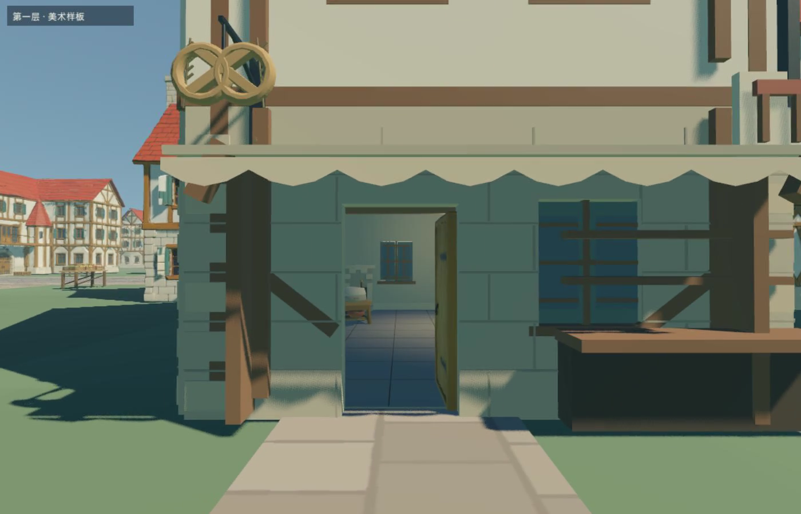

| 当前已采用 | 实际范围 |
| --- | --- |
| 城镇与城外 | 44栋房屋、市场街/广场、北门、农田及西北连续林坡；地面并集222,700平方米 |
| 可进入房屋 | 12栋模块房，3间有住宅/面包铺/工坊陈设；未提供上楼和居民生活交互 |
| 轻量外观房 | 32个实例复用三套LOD和2K贴图；部分窗板近景纹理仍待修 |
| 门窗组件 | 完整门组、原窗组可拆装；门开合、窗扇抬起及百叶转动已实测 |
| 树木与地面 | 单株10万面庭院树、十株共享1.48万面林团、手绘草面及可走低坡 |
| 当前检查 | 默认完整世界254项、关闭新林团回退249项；门窗组件150项 |

下面的导览图按实际场景位置绘制，区分可进入模块房、外观房和三间已布置的一层室内，并标出新林团。建筑符号表示位置，不是精确墙体轮廓；不是原著地图，也未画出所有植被。[可缩放SVG](../../Art/Generated/Floor1Modular20260916/handoff-map/floor1-handoff-map.svg) · [坐标来源及哈希](../../Art/Generated/Floor1Modular20260916/handoff-map/manifest.json)。

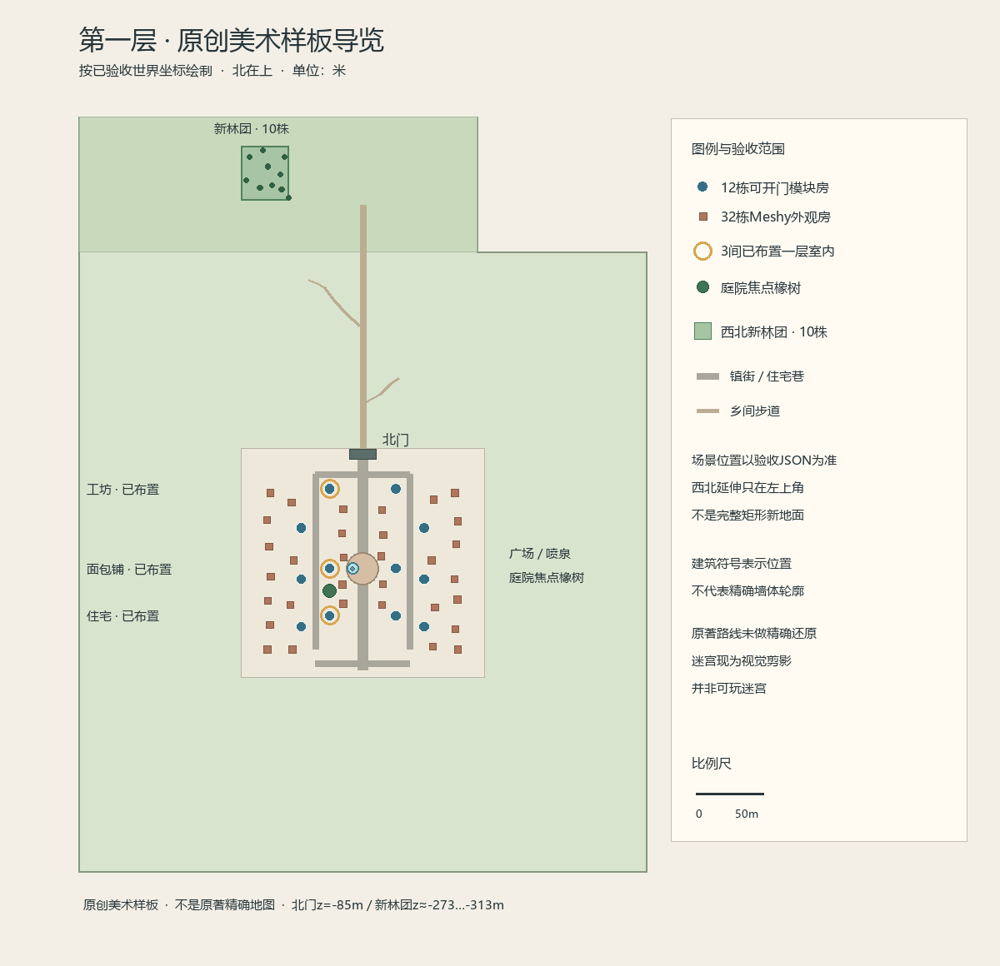

自己游览时，可在本机PowerShell运行下面的命令。可执行文件、项目、场景与渲染后端均来自实际录制；去掉录制参数后的普通启动命令未另外人工操玩验收。WASD移动、Shift跑步、E开关附近门、F开关所选房屋全部窗户、Esc释放鼠标。

```powershell
& 'D:/lucidgloves/InfiniteAincrad/tmp/toolchain/Godot_v4.7.2-stable_mono_win64/Godot_v4.7.2-stable_mono_win64.exe' --path 'D:/lucidgloves/InfiniteAincrad/game' --scene res://scenes/floor1_expanded_world.tscn
```

下文按当晚推进顺序保留中间版本，早期面数、实例数与检查数只描述当时快照。模块的精确节点、操作和边界见[最终交付清单](../../Art/Generated/Floor1Modular20260916/final-handoff.json)。[原始高模完整性与积分核对](../../Art/Generated/Floor1Expanded20260916/root-source-and-cost-check.json)确认三份源文件哈希未变，新增Meshy173积分；imagegen用量未由工具返回。

三个原始住宅分别有163万、126万和179万三角面。直接用Blender压到4万面虽然减轻负担，但同角度渲染显示瓦片、窗框和墙面纹理断裂。随后提交三个Meshy四边形重拓扑任务，目标各2万个多边形，实际每个5积分、共15积分；导出的GLB三角面数如下：

| 住宅 | 原始三角面 | 重拓扑三角面 | 减少 |
| --- | ---: | ---: | ---: |
| 暖炉住宅 | 1,630,308 | 38,021 | 97.67% |
| 集市住宅 | 1,263,506 | 39,717 | 96.86% |
| 转角塔楼宅 | 1,792,188 | 42,902 | 97.61% |

GPT-6实际查看了重拓扑后的渲染，瓦片和窗框比直接大幅减面保留得更完整，因此选择重拓扑版本作为近景外观来源。请求的多边形数不等于引擎三角面数；上表来自实际文件。原始模型及其哈希保持，重拓扑回执、参数、源哈希和比较记录见[清单](../../Art/Generated/MeshyHouseLods20260916/remesh-comparison.json)。

新的重拓扑近景版本已经接入三个LOD节点，并保留1.2万/3000面中远景，通过106项Godot检查。各档共享材质与贴图，32个外观实例复用资源。源4K贴图仍然较大，当前每栋三档GLB约38—42MB，后续继续做贴图预算与静态部件合并。它们仍是外观建筑，不能因增加碰撞就说内部可居住。

DeepSeek另行建立三套有实际门洞的模块化住宅，后续由GPT-5.6修复并打磨至v4。它们按概念方向重新建模，并非把Meshy单体网格自动识别成门窗。新增独立橡木门板经过Meshy生成和重拓扑，为2,752三角面，装在现有铰链下，保留原有门板作为可切换的后备外观。

v4共有75项Godot检查通过：关门阻挡半径0.30米/高1.70米角色胶囊，开门后实际进入；关窗命中可动窗扇的碰撞，窗扇上移0.715米后射线通过真实洞口；两个实例互不影响；平移并旋转90度的实例也通过。包含新门板的运行时三角面分别为15,752、16,224、25,164。早期一个墙体测试点位于商屋外墙拐角，角色可绕角，已保留失败证据并改为实际实心墙柱中点，未用增大碰撞体掩盖问题。

实机目视又发现邻窗的青绿窗板伸到了门洞前；修正窗板相对铰链的局部方向，并将开窗转角从100度改为75度。追加实际导入网格的肩部/头部净空检查与前后左右窗洞检查，最终99项全部通过。根代理已查看修正后的真实Godot开闭门图片，确认门洞清晰、木门开合与铰链一致。这次缺陷说明物理碰撞通过不能代替美术检查。

## 连续场景与实机证据

独立场景为[场景入口](../../game/scenes/floor1_expanded_world.tscn)，包含420×460米连续地面与180×170米城镇；44栋房屋中12栋使用模块化房屋，32栋为外观LOD。24米广场连接8米主街、5米住宅巷、北门和通往农地/树林的道路。已放入97棵树、4块农地、集市摊位、绿植、长椅和原创石制喷泉。

街区最终144项检查通过，包括12栋住宅的开闭门与实际玩家0.32米半径/1.80米高胶囊通行、住宅巷到每栋门口的清晰路径、地面连续、北门通行、喷泉/长椅实际碰撞和建筑保守占地不重叠。门口新增2.4×6.8米步道，摆设不占主通路。F现在从实际窗中心选择最近房屋，12个后窗和4个塔楼侧窗位置通过；当前操作统一开合该屋窗户，尚不是逐扇选择。房屋上层尚无完整室内动线与生活陈设。

八张最终v4真实Godot图片已保存于[样板v1图片目录](../../Art/Generated/Floor1Expanded20260916/milestone-v1-stills/)，此前未修正版本保留在私有验证目录。PNG实测为1680×1080，启动请求1920×1080没有实际达到该尺寸。最终市场固定镜头120个渲染间隔的中位数为4.166毫秒、P95为4.289毫秒，3524次含阴影绘制调用；这是包含CPU/呈现/同步影响的局部采样，不等于整张地图、NPC负载或目标设备的性能保证。[逐视角数据](../../Art/Generated/Floor1Expanded20260916/milestone-v1-stills/capture.json)。

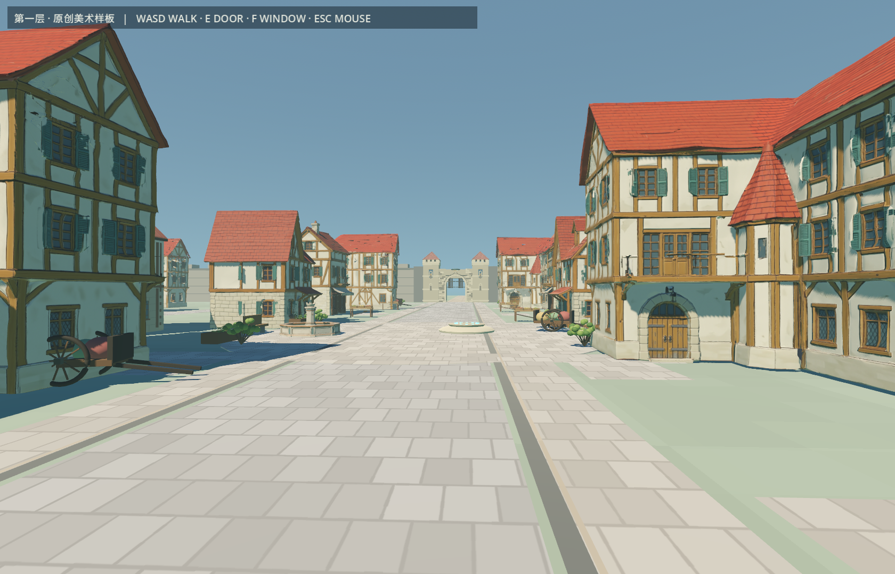

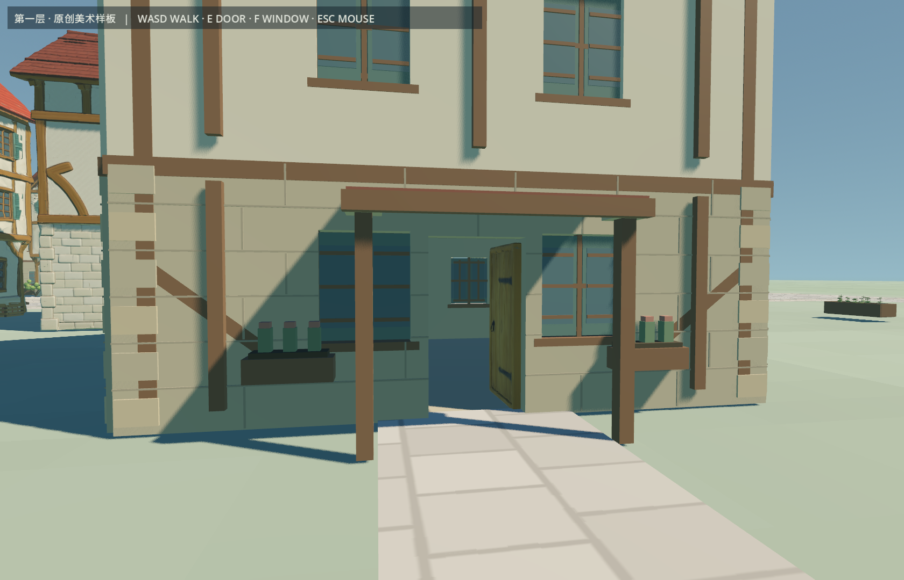

连续镜头在同一真实3D场景中经过市场街、住宅巷、城门和城外道路，共901帧、约30.03秒；源AVI和MP4实际为1400×900，保留原生比例。它是快速相机漫游，不是NPC生活录像，也不是玩家步行录制；离线固定30帧输出不作为运行性能证据。本地视频路径为 `exports/floor1-art-20260916/floor1-world-tour-v1.mp4`，原AVI与路线JSON留在 `tmp/floor1-art-20260916/world/`，未将大视频提交Git。

用Godot打开 `game/project.godot`，运行上述场景入口。WASD移动，Shift快走，E在门边开合门，F在窗边开合最近房屋的窗户，Esc释放鼠标。

本轮Meshy截至06:10的实际费用：三栋重拓扑15积分，喷泉概念/模型/重拓扑41积分，独立门板概念/模型/重拓扑41积分，中景拓扑/贴图对照5积分，庭院橡树概念/模型/重拓扑41积分，T2原生低面数住宅对照15积分，T2林缘树候选15积分，合计173积分；实际查询余额1414，无待完成的付费任务。中景对照与新T2住宅因实际可见缺陷未采用；庭院橡树采用原始网格经Blender减面版本，T2树仍在离线比较。此前三栋原始生成108积分单列。所有原始输出、派发回执和哈希保留，未充值。另生成了一张草地位图，图像工具没有返回费用计量，不将未知费用写成零。

## 正在推进

04:10接续已经完成一轮可拆装单位与绘制优化。v5保留每个完整WindowUnit（窗框、窗扇、两侧铰链、可动碰撞），并通过实际拆下/装回后的射线检查；三类房屋组件共114项检查通过。共享12×4小图集把窗板每个可动片从三个材质面减到一个，三类房屋总绘制面170/197/368→106/121/212，房屋几何与外观保持。实际Godot同视角对比确认门口仍清晰，市场含阴影绘制调用3524→2472，约减少29.9%；P95渲染间隔4.289→4.317毫秒，这次测量没有显示帧率提升。

院落增加了有座位和入口的小庭院，城外以六组林缘群落替代均匀散树；树木97→133、植被218→334，场景检查153项通过。根代理已看过实际住宅巷、城外道路与全景：层次有改善，但大面积平地和普通迷宫体块仍未达到目标美术质量。中景重拓扑对照已经评估，因侧墙和窗板变形而暂不采用。

04:24又定位并修复了地面发白的实际原因：程序材质把十六进制sRGB颜色直接传给线性ALBEDO，漏了转换。只修正颜色输入，保留同一调色、光照、雾和几何，实际前后镜头中草地样点RGB从183/198/169变为119/150/105，而天空、树冠、房屋的对照样点相同。语义依据见[Godot颜色空间说明](https://docs.godotengine.org/en/stable/tutorials/shaders/shader_reference/shading_language.html#using-source-color)，本轮实际像素/哈希见[对照数据](floor1_art_iteration_2026-09-16/shader-color-ab.json)。这修好了颜色输入，没有把平地变成完整地形。

| 颜色输入修复前 | 同镜头修复后 |
| --- | --- |
| 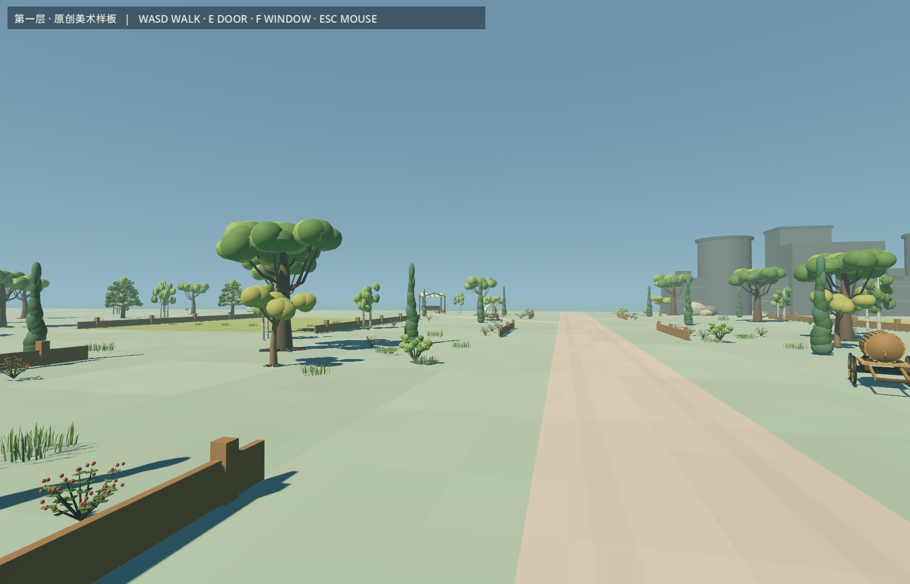 | 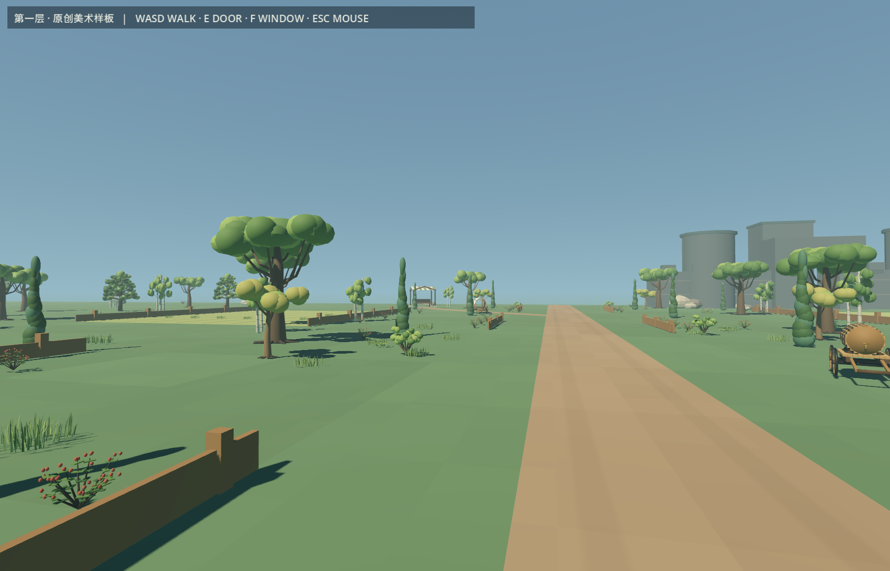 |

04:36可选2K版本完整接入GLB资源与引擎：三档几何、UV和顶点缓冲保持，法线图缩小后重新归一化，各LOD共享一份材质和三张纹理，双档资源验证202项通过。三个模型包总字节119,599,744→38,267,664，约减少68%；这是磁盘文件大小，未宣称等比例降低显存。原4K包保持原哈希。保存室内4K基线后，已将32栋外观房屋切为2K默认，保留4K选项。根代理另看了实际世界同机位近景4K/2K图：同为LOD0、同为1,881次含阴影绘制调用，屋瓦、砖缝和轮廓保持；既有残缺窗板在两版都存在，没有用贴图优化掩盖来源模型的缺陷。[派生清单](../../Art/Generated/MeshyHouseLods20260916/texture-tier-2k-manifest.json)。

三种一层室内组件增加了木板/石板地面、墙脚、暖灯、桌椅、面包柜台及炉/铁砧，独立组件35项检查、九个实机视角已经保存。三间分别接入真实世界，166项场景检查通过，包括0.32米半径/1.80米高角色从开门位置沿路线走到家具旁；另存15张1680×1080真实世界图片，其中七张为1.62米视高的室内镜头。根代理查看了住宅、面包铺与工坊近景，接受陈设集成里程碑；工坊侧翼地面与开窗后的光线仍继续检查。它们不代表NPC已有烹饪、交易或锻造行为。[室内清单](../../Art/Generated/Floor1Modular20260916/interiors/manifest.json)。

| 真实世界住宅一层 | 真实世界面包铺 |
| --- | --- |
| 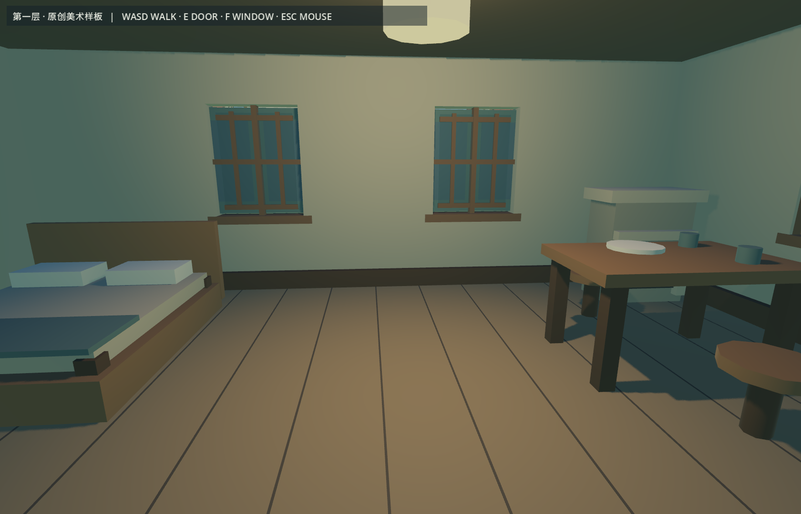 | 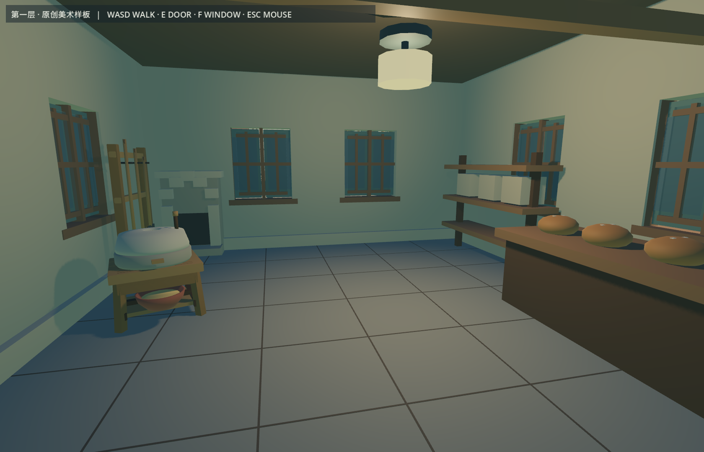 |

随后同机位实际打开窗扇，真实街道和对面房屋可见，阳光透入，局部灯光及全局环境光保持不变；场景检查扩展至170项，包括玩家从后窗实际触发F开启和关闭。根代理已查看两间开窗图并接受；这没有完成逐扇窗选择，操作仍统一作用于最近房屋。

| 住宅开窗 | 面包铺开窗 |
| --- | --- |
| 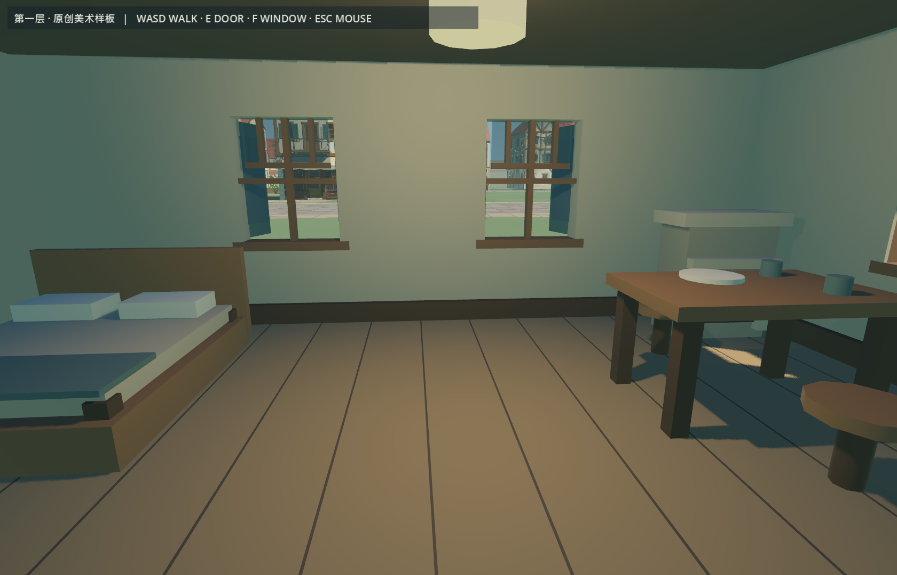 | 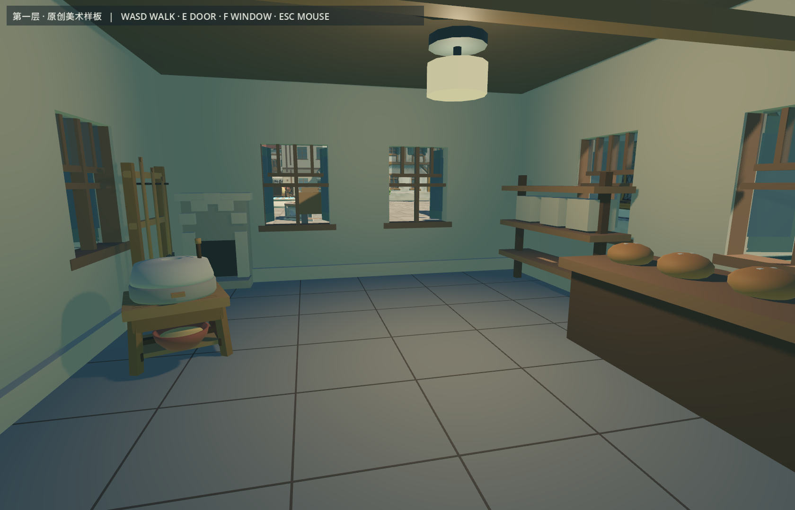 |

| 同机位4K近景 | 同机位2K近景 |
| --- | --- |
|  | 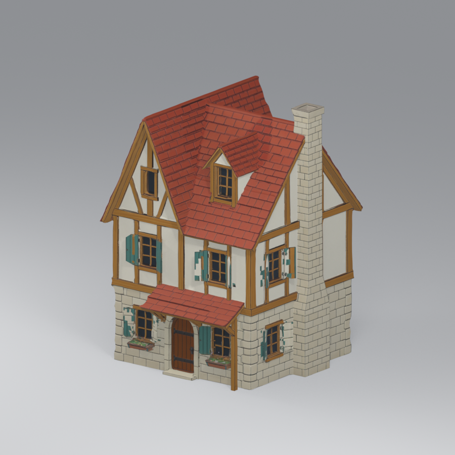 |

- 继续完善地面纹理、地形层次和院落，整理林地与远处迷宫入口体块；远景目前仍属原创体块设计。
- 三类室内与2K默认场景已复验，继续补合适的中世纪灯具，保留高精度源文件与原样板视频。
- 新橡树已采用一株10万面版本；继续低坡和草地实机对照，在本次睡醒早上9点前完成下一轮可验证的美术迭代。

## 05:03后续：按资产类型选择减面方法

工坊侧翼地板的缺口已按实际房间轮廓补齐，保留原始几何、灯光和碰撞；真实同角度世界图片确认石板缝连续。新外侧坡地及山脊有对应碰撞，当前180项场景检查通过。原城外主镜头仍主要看到平坦草地，不能因增加了边缘山体就宣称整个城外已达到美术目标；继续细化近中景地面和衔接。

橡树原始模型实际4,775,932三角面，Meshy重拓扑虽降至31,743面，却损坏了叶团边缘。GPT-5.6使用Blender在原拓扑上派生10万和6万面，保留一套材质、三张原纹理和UV，实际四角度渲染表明树冠体积与根部更完整。根代理查看10万/6万面两组正背角度，批准10万面作为单株近景焦点候选；文件11,221,296字节，面数较原始减少约97.91%，原文件哈希不变。场景放置和树干/路径验证随后进行，尚未把离线图片当实机采用。详见[橡树清单](../../Art/Generated/CourtyardOak20260916/manifest.json)。

| 原始约477万面 | 未采用的Meshy约3.2万面 | 批准进场验证的Blender10万面 |
| --- | --- | --- |
|  | 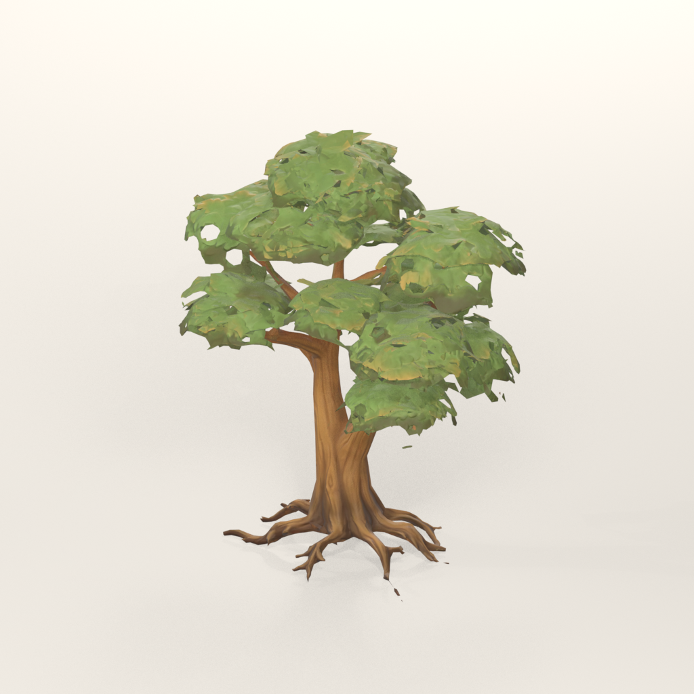 | 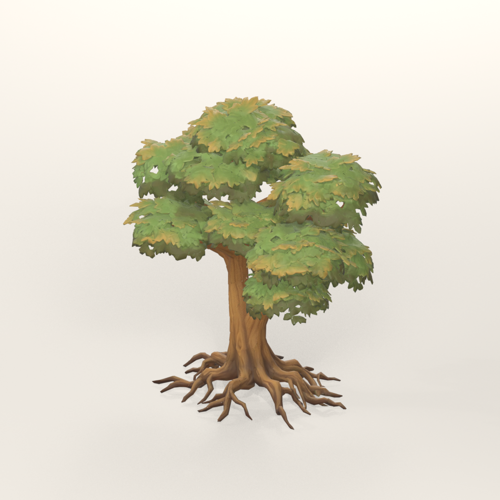 |

三栋建筑目前的重拓扑比极端直接减面更好，而此树相反；结论是按实际轮廓、纹理和使用距离选工艺。05:03时完整窗组已通过拆装，完整DoorUnit仍在补齐；后续采用结果如下。

## 05:40后续：完整门组与庭院橡树已采用

v6的DoorUnit包括门框、铰链、门板与运动碰撞。三套住宅均实测拆下后原墙洞可通行，装回后关门阻挡、开门可通行；跨房型移植到平移且旋转90度的实例后也保持。组件146项通过，18张同机位离线图与前版逐像素相同。正式美术样板190项场景检查通过，实际Godot开闭门对照区域差值为0，根代理查看开门外观与屋内画面并接受。完整证据见[DoorUnit世界复验](../../Art/Generated/Floor1Expanded20260916/doorunit-v6-world-v9/manifest.json)。

一株10万面橡树已替换西侧庭院原有树，实际高度8.5米，树根最低点为地面y=0，树干有简单碰撞，冠幅约8.6米；真实玩家胶囊从住宅巷进入庭院的路线通过。根代理检查实际近景与俯视图，树冠层次、根部和邻近入口关系可接受。未将这一高精度资产铺满整个森林。[采用清单与三视角](../../Art/Generated/Floor1Expanded20260916/one-courtyard-oak-v9/manifest.json)。

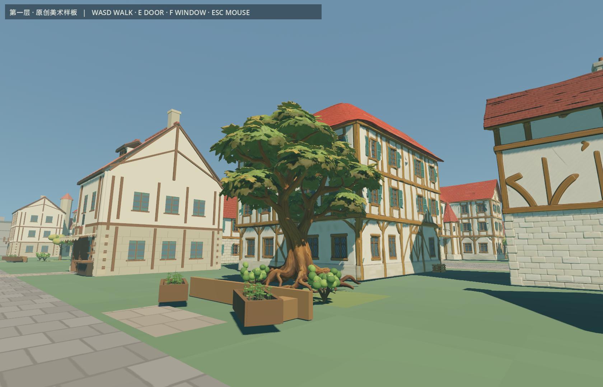

另外用原住宅概念测试Meshy T2原生smart-topology，实际13,188三角面、约9.24MB，但只有一个网格和一个节点，没有可拆门窗语义。四角度实际渲染显示屋顶缺片、相交的屋脊和墙面黑色破损，因此不采用。原始模型直接减至10万/20万面的对照虽保留了更多窗框，后屋顶白色伪影在20万面仍存在；也没有因为面数更高就换进场景。后续优先完善已经可用的城镇地形和材质。[原生低面数对照记录](../../Art/Generated/Floor1TopologyTrials20260916/manifest.json)。

## 06:10后续：近处草地、低坡与室内灯具

西侧林缘新增一块168三角面的缓坡，有同形状的真实碰撞；最高约1.18米，角色胶囊能从棚旁走到坡顶，现有树根、农田与道路位置保持。初版亮色三角形土块在实机中像贴片，已移除并保留失败图；修正版通过201项场景检查。低坡只是局部变化，图中仍能看到原矩形地面的直线尽头，下一项是补连续的北侧坡地与林缘。[低坡实图与验证](../../Art/Generated/Floor1Expanded20260916/west-forest-bank-v10b/manifest.json)。

一张1254×1254手绘草地位图以0.22强度叠到城外草面，保持土路、农田和光照。根代理比较真实玩家视高的开/关对照、俯视和乡间道路镜头，认可近处细节，已批准作为默认，保留0混合回退。实际导入有mipmap、颜色空间标记正确，四组同机位对照中道路与天空控制区差值为0。源图左右/上下边缘并不完全匹配，当前有限混合强度下未见明显棋盘格，不能称其为已证明完全无缝的素材。[草地实机对照](../../Art/Generated/Floor1Expanded20260916/meadow-texture-v11-ab/manifest.json)。

| 原程序草面 | 同机位0.22手绘混合 |
| --- | --- |
| 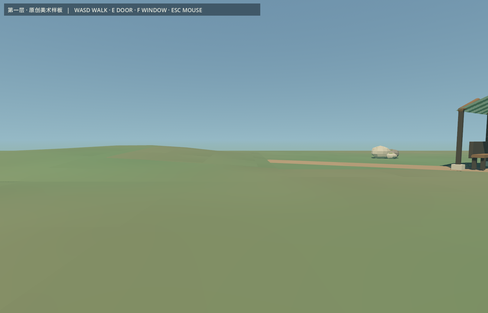 | 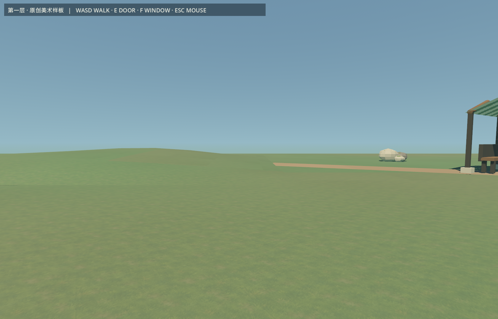 |

三间房内的圆筒灯替换为已有968三角面的铁笼灯，配16厘米小顶座和短吊杆；原光源数量、位置、0.8能量、4.6米范围和阴影开关均保持。初版灯笼自身投影造成夸张天花阴影，修正为灯笼可见网格不投影、原灯仍投家具接触阴影；随后移除看起来过于现代的大白顶盘。组件32项、真实室内路线38项以及世界209项检查通过，根代理复查三室实机近景和面包铺入口。草面设为默认后的全场景212项通过，0混合回退209项也通过。[六张真实世界灯具图片与数据](../../Art/Generated/Floor1Expanded20260916/period-lantern-world-v11/manifest.json)。

同一橡树概念另试原生低面数生成，实际14,783三角面、9,140,052字节。根代理查看四角度，叶团轮廓保持，适合继续评估中距离林缘用途；颜色较原庭院树明亮，仍需真实世界光线下检查，尚未替换庭院树或铺入森林。

## 06:35后续：连续西北林坡与面包店识别

原地面北侧新增295×100米真实坡地，340三角面，最高约13.13米；24棵已有树分成疏密不同的群落，树根高度按实际坡面取样。原有道路延长39米，真实角色可沿轴线走入新区并上坡。原地面未缩减，新增29,500平方米，实际地面并集222,700平方米，形状不是完整外接矩形。[六张实机图与230项验证](../../Art/Generated/Floor1Expanded20260916/northwest-ground-v12b/manifest.json)。

初版新地面边界比旧视觉地面高5厘米，形成亮线；修正真实三角面边界高度后，同机位下亮缝消失。未用雾、遮挡草条或挪动相机隐藏问题。西北已有连续地形，东北和更远主路方向仍有平直尽头，不能称整个第一层地形完成。

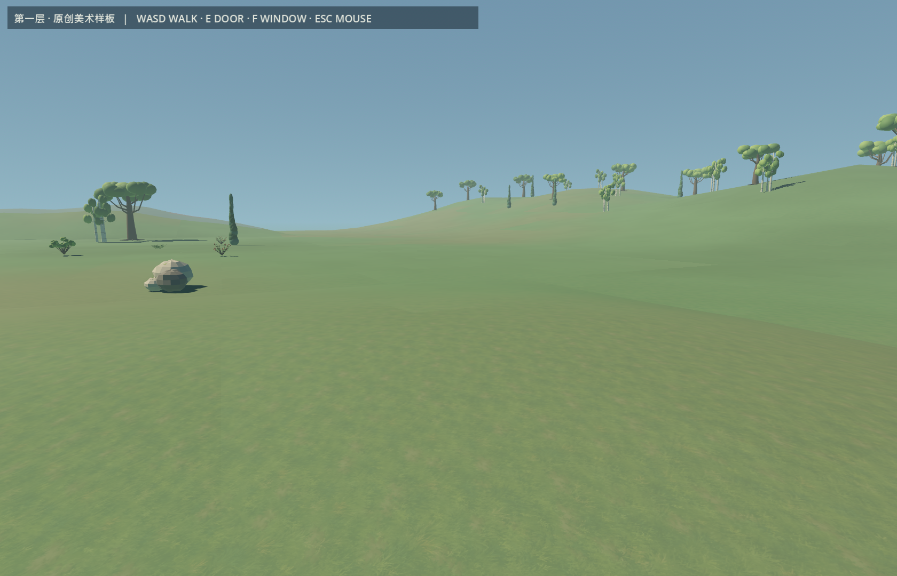

面包铺增加一处已有双结木牌和铁支架，实际3,768三角面；原始模型不变，实例木材调为蜜木色。它位于门左上方，保持门洞净空，仅面包铺一间使用。根代理实际查看街道和近景两张图，接受其比例、色彩与可辨性；主体上层墙面仍比较平淡。组件36项、实际陈设50项、完整世界233项检查通过。[招牌可见/隐藏同机位四图](../../Art/Generated/Floor1Expanded20260916/bakery-sign-world-v13/manifest.json)。

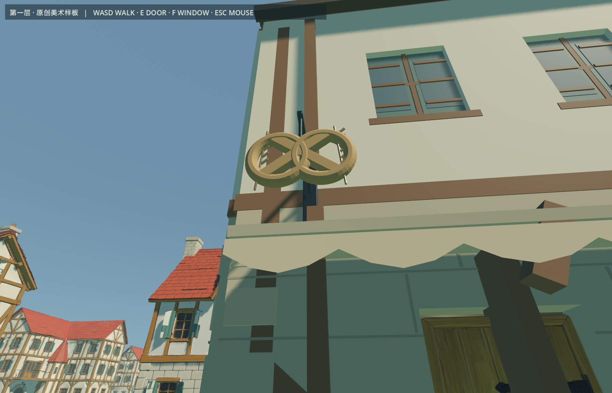

减面继续保留失败结论：glTF导入时合并同位置、同法线的重复顶点能改善树根破片，但40,000面住宅背面仍有白色屋顶斑点和墙面红色三角纹理污染。该文件不采用；GPT-5.6正在隔离比较保护UV接缝的方法，现有场景模型保持。新版实机漫游也在准备，当前已交付影片仍为v1。

## 巡游复查：修正门前支柱，采用单株轻量树

v2初稿中，根代理发现面包铺雨棚柱位于门外约25厘米、正对门中心线。旧柱没有碰撞，因此原通行检查通过，画面却可能穿柱。真实导入ShopBay网格射线随后命中该柱，新增检查有1项失败；工程将两柱移到两侧实体墩，并补上与柱相符的简单碰撞。组件150项、完整世界246项通过：门中心可走，侧柱实际阻挡角色，拆装门窗保持。根代理查看原失败机位的修后画面，确认入口清晰，随后开始录制新版60秒漫游。

原生14,783面橡树完成三组实机开/关对照，批准一株7.2米实例放在新林缘。中心树根射线高度误差约0.000012米，树干有简单碰撞；这只证明采样中心落地，不代表每条外露侧根都完全贴坡。近、中距离叶团比原球形树冠有层次，旧10万面庭院树保持。[实际六图与检查](../../Art/Generated/Floor1Expanded20260916/native-t2-forest-oak-v14/manifest.json)。

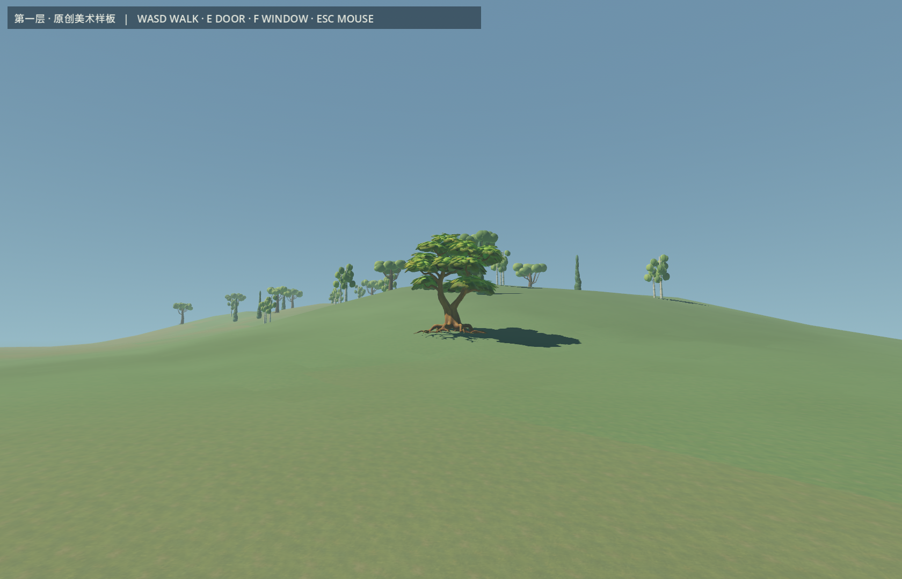

住宅保护UV试验做了两种方法：降低真正UV接缝顶点的折叠权重；以及给60K低模新UV、从原高模重新烘焙颜色。后一种的四面窗板、花箱和墙梁较现采用38,021面版明显完整，但烟囱旁仍有少量白色拾色。2K候选约9.40MB，未改几何和UV；当前只批准单屋实机对照，尚未换进主场景。新候选仅重烘颜色，采用恒定哑光粗糙度，原法线及金属粗糙贴图未重烘，因此还需比较真实光照响应。[方法、源哈希与保留的失败](../../Art/Generated/Floor1TopologyTrials20260916/uv-preserving-lod/manifest.json)。

新灰泥图由内置imagegen生成，实际1254×1254，计划以低幅度亮度纹理改善模块化房屋大面积平墙，目前只是候选，不改当前世界。源图、完整提示及边缘统计保存在[材质目录](../../Art/Generated/Floor1Facade20260916/manifest.json)；工具未返回费用或Token计量，未当作已知零成本。

## 08:10复查：采用局部林团，保留两项未采用试验

西北坡地的小林团在原来一株轻量橡树旁增加九株，高6.0—6.8米，分布在约35×40米范围内，复用同一个14,783三角面网格和材质。根代理逐图查看林缘、坡侧与乡间道路的同机位开/关对照，认可其树冠层次，已设为默认；最终254项检查通过，新林团关闭回退249项也通过。原有24棵西北树及单株高精度庭院树保持。树根采样点落在实际坡面，有树干碰撞与林前行走通路；这不是整个森林完成，也不证明每条侧根都贴合地形。[林团实机六图及测量](../../Art/Generated/Floor1Expanded20260916/north-grove-trial-v16/manifest.json)。

v3保留同一60秒路线和真实门状态动作，实际1801个固定录制帧，输出34,688,264字节MP4。根代理复查九张实际抽帧，覆盖市场、开门、室内、庭院、北门、农地与新林团；旧斜侧北门图看似封住的部分是门内侧壁，正面抽帧可见门外道路与天空，已有穿越检查保持，未修改几何或隐藏物件。源脚本、路线、运行时资源哈希与进程退出回执已保存，v1/v2文件哈希保持。

60K单屋重烘候选已经完成实际街景、正面近景和背面屋顶的六张同机位对照。窗板、花箱和墙梁改善明显，但烟囱旁增加白色拾色斑块，瓦片也更凹凸。根代理因此决定保留试验，主场景仍使用原38,021面版本；旧版窗板细节的破损同样保留为待解决问题，不能称这次近景住宅精修已完成。新候选没有重烘法线及粗糙度，也不是自动拆分门窗。[完整实机对照](../../Art/Generated/Floor1Expanded20260916/single-cottage-60k2k-world-ab/manifest.json)。

灰泥候选已在单栋模块房进行街景和近景对照。第一版平均亮度发生偏移，已保留失败记录；第二版校正后墙面平均RGB变化小于1/255，天空不变。根代理认为可见收益主要是近处细纹，未明显改善街景中大面积平墙，决定不进入主场景。本次没有为了采用新贴图而提高强度或改变整栋颜色。[灰泥试验和未采用原因](../../Art/Generated/Floor1Modular20260916/merchant-plaster-isolated-review-v1.json)。

本轮之后，优先补模块房的立面层次和住宅近景纹理，再沿现有道路完善有用途的院落/林间小径；更远地面边界和迷宫仍需实质制作。已开放的门窗组件可支持后续居民接入，但本轮只验证美术与实际碰撞，未启动居民生活系统。

这里的布局是项目原创设计，不是原著精确地图；第22层/第47层场景仅作色彩和构图参考。美术样板完成也不等于NPC已经迁入、室内生活机制完成或整个第一层已经可玩。
