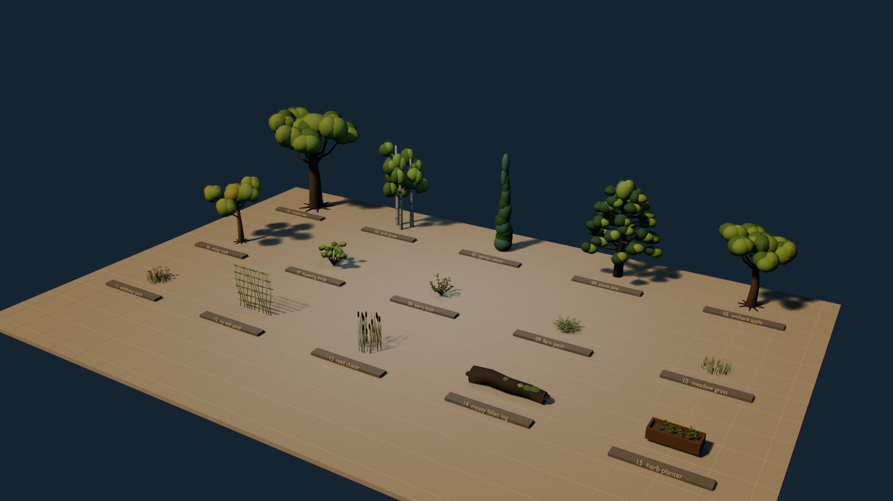
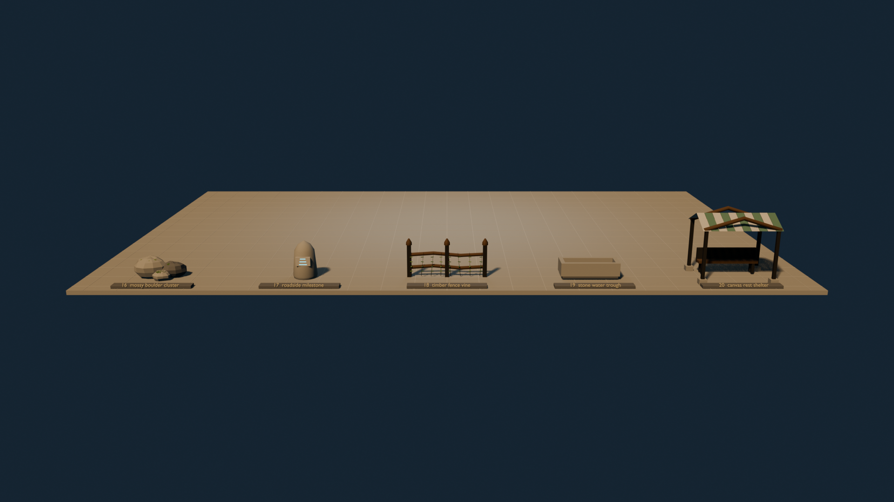

# Floor 1 environment kit 01–20 — 2026-09-11

## Result

The corrected first iteration delivers twenty reusable environment components rather than another composed street. Fifteen are vegetation or natural dressing and five are hard scene components. Every component has an individual metre-scaled GLB; the Blender file retains source collections and a separate catalogue scene. Eight street-scale components are also placed visual-only in both current demo modes without changing navigation, resident state or persistence.

## Inventory

| # | Component | Kind | Declared size (m) |
|---:|---|---|---:|
| 01 | Ancient oak | tree | 5.8 × 5.5 × 8.2 |
| 02 | Three-birch grove | tree | 3.2 × 3.0 × 6.8 |
| 03 | Column cypress | tree | 1.7 × 1.7 × 7.5 |
| 04 | Stone pine | tree | 5.2 × 5.0 × 6.8 |
| 05 | Orchard apple | tree | 3.8 × 3.8 × 5.2 |
| 06 | Young maple | tree | 3.1 × 3.1 × 4.6 |
| 07 | Flowering shrub | shrub | 2.0 × 2.0 × 1.8 |
| 08 | Berry bush | shrub | 1.8 × 1.8 × 1.4 |
| 09 | Fern patch | ground cover | 2.0 × 1.8 × 0.9 |
| 10 | Meadow grass | ground cover | 1.8 × 1.8 × 0.9 |
| 11 | Wildflower patch | ground cover | 1.8 × 1.8 × 0.9 |
| 12 | Ivy wall panel | climber | 3.2 × 0.4 × 3.2 |
| 13 | Reed cluster | waterside | 1.8 × 1.8 × 2.5 |
| 14 | Mossy fallen log | natural prop | 4.6 × 1.2 × 1.0 |
| 15 | Herb planter | cultivated | 2.7 × 1.1 × 1.3 |
| 16 | Mossy boulder cluster | natural prop | 3.0 × 2.2 × 1.6 |
| 17 | Roadside milestone | street prop | 1.6 × 1.6 × 2.5 |
| 18 | Vine timber fence | boundary | 5.2 × 0.7 × 2.6 |
| 19 | Stone water trough | street prop | 3.9 × 1.7 × 1.2 |
| 20 | Canvas rest shelter | large component | 5.2 × 3.6 × 4.4 |

## Measured delivery

- Blender: 5.2.1 LTS, source seed `1120`.
- Twenty individual component GLBs plus one catalogue GLB imported by Godot 4.7.2.
- Total individual visual geometry: 246,514 triangles.
- Total conservative collision geometry: 840 triangles across fifteen components.
- Five pass-through foliage components correctly declare no collision.
- Combined Blend plus GLBs: approximately 35 MB before Git LFS pointer conversion.
- Delivered catalogue GLB SHA-256: `8d2abcbdccacb3a6bfb8a03e28f658c4b4b23a9f8d9092a21c39567cf0714423`.

## Plant groups and basic wind

| Placement group | Assets | Godot profile |
|---|---:|---|
| 乔木冠层 | 6 | `tree_gentle` |
| 灌木与栽培 | 3 | `shrub_soft`; herb planter override is static |
| 地被植物 | 3 | `ground_breeze` |
| 攀援植物 | 1 | `climber_subtle` |
| 湿地植物 | 1 | `reed_sway` |
| 枯木与苔藓 | 1 | `static` |

The reusable Godot controller adds deterministic phase, category speed, amplitude and slow gust to the visual root only. Thirteen living-plant samples move in the catalogue; the herb planter stays still because rotating its mixed timber/soil container would be incorrect, and the fallen log is static. Collision nodes are never parented under wind controllers.

## Iteration evidence

1. The first render mixed all twenty items in both views and weakened category readability.
2. The second render separated vegetation and hard components, but cropped the boulder cluster and rest shelter. It also exposed incorrect `collision_proxy: true` metadata for five empty foliage proxies.
3. The third render moved both cameras, kept all fifteen vegetation items in one readable plate, kept all five hard components in the second plate, omitted empty collision meshes and corrected manifest flags.
4. Godot first imported 20 visual meshes and 15 collision meshes but did not expose Blender custom `extras` as node metadata. The verifier rejected `unique_asset_ids: 0`; it now uses the preserved imported visual node names and passes with 20 unique IDs.
5. The first wind lookup expected exact imported node names. Blender's rebuilt GLB appended name suffixes, so zero controllers were attached and the test rejected the run. Prefix-resolved asset identity now attaches 13 controllers, and all 13 show a changed rotation after eight rendered frames.

Final catalogue evidence in `floor1_environment_kit_20_2026-09-11/evidence.json` records 20 visual meshes, 15 collision meshes, 15 generated static bodies, 20 unique asset names, six plant groups, 13 wind controllers, 13 moved samples and a saved screenshot. The preview is explicitly `art_catalogue_preview_only`, with zero model decisions and zero world mutations.

An initial broad demo placement loaded twelve instances and passed behavior checks, but large trees and the shelter were not accepted without an explicit exterior route view. The final placement is narrowed to eight street-scale pieces. Six living-plant instances use category wind; the herb planter and milestone stay static. The actual default street was rerun against another new isolated save; the resident walked, the well need was recorded, the fixture decision path completed, water remained conserved and all thirteen checks passed. See `floor1_environment_kit_20_2026-09-11/demo_smoke_v3/evidence.json` and `complete.png`. This does not alter private saves or prove final route collision.

## Limits and direction review

This batch materially improves world density and gives later streets reusable silhouettes plus placement/motion categories at tree, shrub, ground-cover and street-furniture scales. It does not improve resident choice or persistence logic. Each item is still one authored variation; the new wind is whole-root motion rather than branch/leaf deformation, and seasonal variants, LOD tiers, occlusion/frame-budget measurement and final route collision are missing. The next art batch should not add another twenty unrelated nouns: first review these silhouettes and movement in the playable street, then produce two or three variants, LODs and selective vertex wind for the approved high-frequency plants.

The assets are original broad-setting work, not one-to-one reconstruction of copyrighted frames. Publication licensing remains a separate gate.
