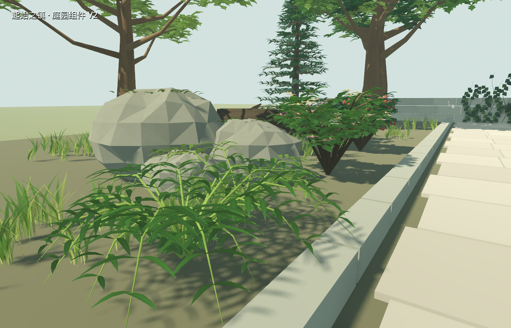
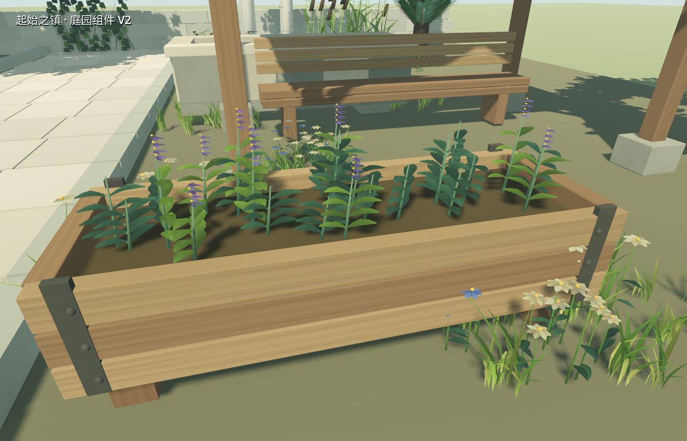

# 第一层环境组件 V2：20 件重制

2026-09-11。用户否定 V1 的美术质量后，本轮重新制作全部 20 件组件，保留旧版供对照。当前默认街道和城镇入口共用的 8 个装饰实例已替换为 V2。庭园用于近景和性能检查，不是新的游戏世界或完成版城镇。

按用户要求追加 [全部 20 件风动视频](floor1_environment_v2_2026-09-11/all20_wind.mp4)：50 秒、30 fps、1400×900，10 组双栏展示，每组 2.5 秒全貌和 2.5 秒局部。采用正常风力的实际 Godot 着色器和 LOD0；中文标明静态物件及尚无风动的帆布，录制不修改资产或风力。覆盖清单和每组截图保存在 `floor1_environment_v2_2026-09-11/all20_wind/`。

## 具体改动

- 六种乔木重新制作主干、根部、主枝、次级枝和独立叶片；橡叶、枫叶、常春藤有不同边缘形状。树冠保留透光间隙，不再使用球体叶团。
- 灌木包含枝条、成对叶片、花或浆果；蕨类改为弯曲叶轴和羽状叶；草叶、花瓣、芦苇叶为弯曲薄面。
- 木箱补入分板、底脚、铁箍和钉头；栅栏补入斜撑；水槽分块砌筑、压顶和内腔；棚架包含支撑、凳板和带垂边的帆布屋面。
- 颜色、叶脉和木石表面细节适配现有市场的暖石、木质、低饱和绿色；独立几何叶片不使用透明排序。
- 风动由 UV2 顶点权重控制，包含场景方向一致的缓慢摆动和局部叶片颤动。主干、箱体、铁件、石材和碰撞体固定；香草可以在固定木箱中运动。
- 每件都有 3 档 LOD、独立 GLB 和可拖入 Godot 的 `.tscn`。游戏组件场景自动加载共享材质、距离范围和可选碰撞代理。

六类保持为乔木冠层、灌木与栽培、地被、攀援、湿地、枯木与苔藓。每件身份和分类见 [交付清单](../../game/assets/floor1/environment_kit_v2/manifest.json)。

## 实际验证

| 项目 | 结果 |
|---|---|
| 导出 | 20 个组件场景，60 个 GLB |
| 全套三角面，LOD0 / LOD1 / LOD2 | 575,121 / 240,400 / 126,890 |
| 二进制检查 | 全部哈希匹配；位置有限；颜色、两套 UV、法线存在；刚性表面权重为零；没有退化三角形 |
| 默认 LOD 庭园 | 20 个独立资产，55 个摆放实例，165 个 LOD 网格，22 个静态碰撞形状 |
| 渲染采样 | M1 Pro / Metal / 1400×900 / 4×MSAA，预热后 120 帧，帧间隔中位数 8.349 ms，95 分位 11.791 ms |
| LOD 边界 | 每件资产两个切换点的前/中/后三个距离，共 120 个实际渲染样本全部可见 |
| 相同机位的两帧风动 | 时间 0.0 / 1.7 s；植物区域 142,914 像素变化超过 4/255；16,000 像素的木箱正面区域仅 22 个像素变化，包含动态阴影影响 |
| 主 Demo | 新隔离存档运行，8 件 V2 装饰、7 件局部风动、原有 13 项流程检查全部通过 |
| 动画 | Godot 原生录制 180 帧，1400×900，30 fps，6 秒；转码为 H.264 MP4 |

渲染采样来自这个小型庭园，含当前灯光/阴影和辅助地面；不能外推为整镇或密集森林的帧率保证。全场计数包括阴影通道，记录 743 次绘制、1,343,672 个图元。LOD 共用一个包围盒和连续距离范围，使用离散切换，尚未制作渐变或远景广告板。

证据：[渲染与风动](floor1_environment_v2_2026-09-11/final/evidence.json)、[导出几何审查](floor1_environment_v2_2026-09-11/export_audit.json)、[120 个 LOD 边界样本](floor1_environment_v2_2026-09-11/lod_boundaries.json)、[主 Demo](floor1_environment_v2_2026-09-11/demo_final/evidence.json)、[风动视频](floor1_environment_v2_2026-09-11/wind_preview.mp4)。

## 迭代中修正的问题

第一轮近景仍显示稀疏树冠、过于规则的松柏轮廓和简单石块。第二轮增加冠层覆盖、打散枝层、细化岩石，同时固定随机序列以保持 LOD 主枝布局。之后修正木纹方向、花蕊风动权重和混合植物模型被整体倒角的问题。最终二进制审查发现倒角产生的 384 个木箱退化三角形，导出前新增最终三角化及极小面积清理；60 个 GLB 现已全部通过。

远景对照还暴露了仅计数节点无法发现的缺陷：各 LOD 独立设置 1 m 滞回时，切换距离附近的枫树和栅栏可能全部隐藏。现已取消这段空档，三档共用包围盒；新增的测试直接读取真实渲染像素，120 个距离样本全部通过，最终庭园机位中的缺失组件恢复可见。

## 使用和方向判断

Blender 源：[Floor1_EnvironmentKit20_V2.blend](../../Art/ReferenceScenes/Floor1EnvironmentKit20/Floor1_EnvironmentKit20_V2.blend)。
可复现构建：[build_game_ready_v2.py](../../Art/ReferenceScenes/Floor1EnvironmentKit20/build_game_ready_v2.py)。
独立检查场景：[floor1_environment_v2_review.tscn](../../game/scenes/floor1_environment_v2_review.tscn)。点击捕获鼠标，WASD 飞行，Q/E 升降，Esc 释放。

本轮的明确增益是可复用资产的近景形状、局部运动和游戏接入，改善首条可玩街道的视觉内容；居民选择与持久化逻辑没有新增。现阶段可以直接用于 Demo 迭代，仍需用户对轮廓和材质的视觉验收。大型树的近景面数较高；下一步应根据实际种植区域进一步压缩树木远景、测量密集实例，并审核路线碰撞。暂不扩充另一批名词。

世界观参照为项目已有市场及 [SAOIF 官方设定入口](https://sao-if.bn-ent.net/)；这些是原创环境组件，未声称逐项复原原著明确指定的植物种类。着色器接口依据 [Godot 4.7 官方说明](https://docs.godotengine.org/en/4.7/tutorials/shaders/shader_reference/spatial_shader.html)。
