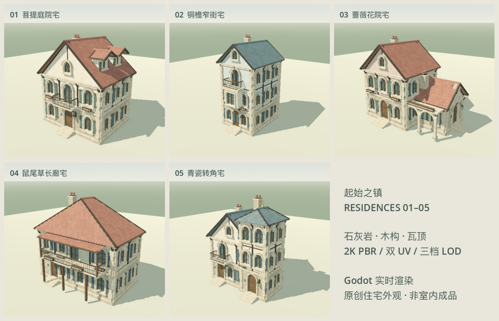

# 第一层住宅 01–05：高精度外观组件

本批为沿用现有第一层暖石材、木构、低饱和瓦顶的五种原创居民住宅。
不是五次换色：宽庭院宅、窄三层宅、L 形花院宅、长廊露台宅和转角塔楼宅分别具有不同的体量、屋顶与临街构件。

| 住宅 | 整体 / 细节 | LOD0 / LOD1 / LOD2 三角形 |
|---|---|---|
| 菩提庭院宅 | [整体](floor1_residences_2026-09-11/final/house_01.png) · [门窗细节](floor1_residences_2026-09-11/final/detail_01.png) | 189,988 / 79,794 / 30,338 |
| 铜檐窄街宅 | [整体](floor1_residences_2026-09-11/final/house_02.png) · [细节](floor1_residences_2026-09-11/final/detail_02.png) | 186,570 / 78,358 / 29,791 |
| 蔷薇花院宅 | [整体](floor1_residences_2026-09-11/final/house_03.png) · [细节](floor1_residences_2026-09-11/final/detail_03.png) | 224,836 / 94,429 / 35,885 |
| 鼠尾草长廊宅 | [整体](floor1_residences_2026-09-11/final/house_04.png) · [细节](floor1_residences_2026-09-11/final/detail_04.png) | 190,044 / 79,816 / 30,289 |
| 青瓷转角宅 | [整体](floor1_residences_2026-09-11/final/house_05.png) · [细节](floor1_residences_2026-09-11/final/detail_05.png) | 277,969 / 116,746 / 44,393 |

[玩家视角](floor1_residences_2026-09-11/final/street_eye_level.png) · [街区总览](floor1_residences_2026-09-11/final/street_overview.png) · [25 cm UV 棋盘格](floor1_residences_2026-09-11/final/uv0_checker.png)

## 查看与使用

在 Godot 打开 `game/scenes/floor1_residences_review.tscn` 查看隔离住宅街；鼠标点击进入自由相机，WASD 移动、Q/E 升降、Shift 加速、Escape 释放鼠标。五个可拖入关卡的 `.tscn` 位于 `game/assets/floor1/residences/`。

编辑源：`Art/ReferenceScenes/Floor1Residences/Floor1_Residences_5.blend`。
源码及种子生成器在同目录。模型为米制，地面原点，每栋 GLB 内含三个 LOD。

## 本轮可见制作

- 每片有厚度的搭接瓦、圆弧脊瓦、屋檐收边、烟囱与排水管。
- 真正切开的主窗洞和阁楼窗、内退玻璃、石窗套与窗台、细菱格铅条和百叶。
- 独立门板、门环、铆钉、金属连接件、壁灯，以及有结构支撑的阳台与花箱。
- 四套原创 2K PBR：石灰岩、灰泥、橡木、陶瓦，共 12 张基础贴图。颜色贴图、法线和粗糙度分别处理；没有把阴影画死在颜色上。
- UV0 以 2 米为重复周期，木纹跟随构件方向；UV1 独立展开。修复了自动展开造成的极细小面塌缩，并保留 UV 棋盘格视图。
- Godot 共用纹理与材质，32 / 70 米切换三档模型。近景按 LOD0 拍摄。

## 检查与真实边界

最终通过：15/15 LOD 二进制导出审计、30/30 实际渲染切换边界、7/7 外墙／敞廊射线检查。五栋共 13 个简化碰撞体。M1 Pro / Metal / 4×MSAA 的隔离街区在实际 1728×1112 渲染尺寸下，120 个热启动帧中位 8.39 ms、p95 9.19 ms；仅代表该固定视角，不代表密集城镇。详见 [本轮渲染证据](floor1_residences_2026-09-11/final/evidence.json)。

自包含 GLB 合计约 400.8 MB，打包贴图的 Blender 源约 104.1 MB；当前优先高精度可编辑交付，后续仍需材质导入去重与街区流送优化。

导出审计由 `python3 tools/validate_residences.py` 读取实际 GLB：模型哈希、15 个 LOD、四套嵌入 PBR、贴图尺寸、顶点色、两套 UV、法线、切线、有限坐标、退化三角形与零面积次级 UV。结果记录于 [导出审计](floor1_residences_2026-09-11/export_audit.json)。

`game/tests/residences_visual_acceptance.gd` 在实际渲染中跨越每栋两个 LOD 边界，并检查实体外墙和敞廊间隙，结果记录于 [LOD 与碰撞](floor1_residences_2026-09-11/lod_and_collision.json)。

第一轮检查发现默认导出遗漏配色、近景木纹过强、圆脊瓦形状和老虎窗开洞问题；这些已在后续制作中修正。早期截图保留在 iteration1 / iteration2，仅作为迭代记录，不代表最终交付。

最终收口另修正了窄宅凸窗顶与第三层阳台的标高，以及转角宅主屋顶与塔楼的穿插。裁切时保留原构件的顶点身份，避免误焊不同构件而破坏减面。LOD 测试的第一版错误假设画面固定为 480×480，产生越界像素采样，其成功标志被丢弃；已改为使用实际图像尺寸并重新运行。

这是 **住宅外观资产包**，不是可进入的精装室内，也没有为居民凭空分配房产。门当前固定关闭；建筑外壳和廊柱有简化碰撞，阳台通行、楼梯、室内、导航与居民住房逻辑尚未接入。没有修改主场景、私有存档或权威世界规则，没有调用付费居民模型。高精度源和自包含 GLB 偏大，尚未宣称整座城镇的流送或密集街区性能已经达标。

[完整来源与技术说明](../../game/assets/floor1/residences/PROVENANCE.md)
