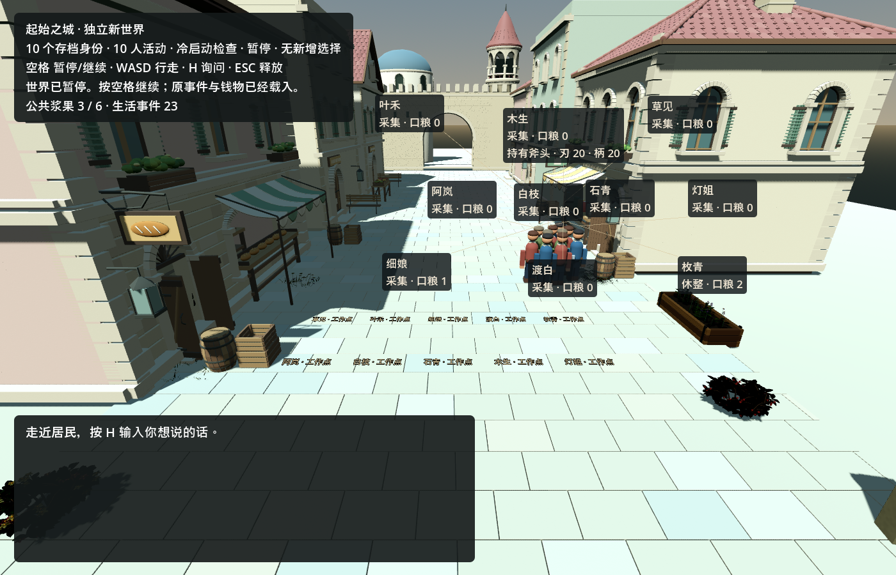
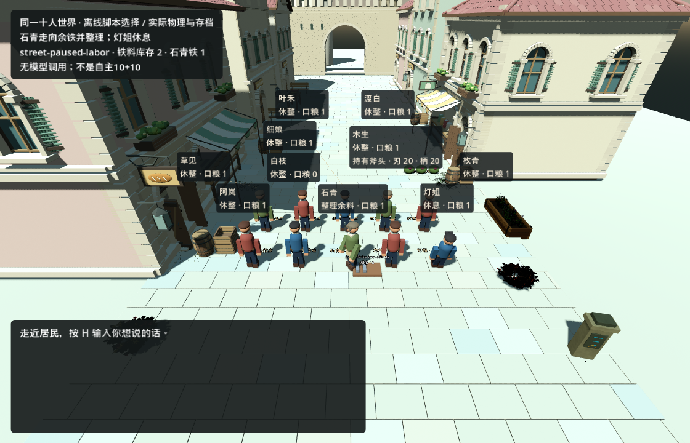

# GPT-6限时交付：十人续接、私有需求交付与仍未解决的问题

2026-09-12，上海时间15:00前限定范围交付。验收范围与源码摘要见[结构化事实](gpt6_sprint_2026-09-12/accepted-facts.json)，进度仍以[原ROADMAP](../../ROADMAP.md)为准。

**已补上可验证的离线交付链；真实10Kimi＋10DeepSeek共同生活仍未完成。** 实际会话元数据确认五名并行工作者均为`gpt-6-astra / ultra`，另有GPT-6监督者。本轮已验收执行未调用DeepSeek或Kimi，生产居民/GM模型配置未更换，旧费用与未知项未清零。授权窗口到15:00；届时共享额度刷新不等于自动开启付费运行，也没有兑换重置额度。

## 本次支持的结果

| 范围 | 实际结果 | 验收边界 |
| --- | --- | --- |
| 十人世界 | 11个种子测试、29项状态检查、67项真实身体/场景检查通过；四个独立引擎进程的38项生活续接检查通过。十人吃饭、休息，身体实际移动；未完任务与钱物历史冷恢复 | 普通离线规则；正式试运行源种子未改写，S1原镇恢复仍未完成 |
| H27/H28个人知识与共享调用文件 | 最终26/26案例、27次本机假HTTP POST；旧技能/材料知识进入实际编译后的请求，另一居民在视线外消耗后仍保留本人旧观测。相同进程的共享文件等待、限额、未知结果与取消均受检 | 无真实模型推理；同一调用文件的上游请求串行，跨进程协调未验 |
| H31 GM提议与候选 | 有来源的监督调查可进入十个独立离线GM上下文；所属GM保留认领、候选失败/修正记录。候选写入隔离工作树并实际执行验证，始终等待监督审核 | 早期41项＝29项既有＋当时12项新增；最终另有15项定向检查，二者重叠，不相加。不是自主发现或真实GM开发验收 |
| 调用启动约束 | 19项离线测试通过；旧未知请求、完整责任与原约束保留，新未知结果阻止排队调用 | 假传输/桩引擎；不是新额度、费用核销或付费运行授权 |
| H32私有需求安装 | **新实现**可从居民已接受的完整私有回合记录安装受审核的有限材料来源；不必伪造公开求助，不依赖可裁剪的GM投影。49项专项＋58项既有材料回归通过 | 此功能由GPT-6监督者实现；居民需求不自动授权安装，也不向旁人公开私有理由 |
| 同世界端到端交付 | 11项验证器测试通过。十名居民经过实际回合接口，十个GM上下文消费实际导出；审核否决保持世界不变，审核通过后个人感知、劳动、冷恢复和实机返回取材均产生真实结果 | 居民选择与GM候选均为明确标记的脚本；GM候选是**既有有限材料规则的配置**，不是新增游戏代码或真实模型创作 |

同一集成世界中，审核安装的铁料为3份；无窗口续接取得1份，随后实际街道中的走动、整理及冷恢复再取得1份，最终**来源剩1、居民累计取得2**。未修改身体位置或时间倍率来达成返回行程；视线证据来自实际物理回调写下的个人观察事件。原身份、钱物、物品、历史、私有需求与未完任务均保留，早先三次脚本控制器错误也仍在恢复审查记录中。



*普通街道冷恢复画面：十个身份，生活事件23，九项采集尚未完成。随后测得的拥堵列为H33；这张图不表示十人供给已持续畅通。*



*同一集成世界：脚本选择，实际街道物理；取料劳动已进行约5.17秒，尚未获得第二份铁。画面HUD为验收说明。*


*同一世界完成后来源余1、石青持铁2；这是实际引擎截图，不是生成示意图。已完成动作的场景说明不代表新增自主选择。*

## 采集与进程清理的追加修复

**H33的原档八个旧任务已全部得到结果。** 安装按人持久化的采集工作点和有界物理绕行后，两人取得仅剩的两份食物，六人完成劳动后收到真实库存耗尽结果。最后一名居民实际走动约1.83米到工作点，原命令没有换号或重放。资源、原任务、历史和工作点映射均保留；45项独立磁盘连续性检查、38项最终冷恢复通过。

核心66项专项＋31项既有生活检查通过；安装41项、最后原任务40项、最终脚本待机41项通过。较早版本的静态占位负例42项通过，但**最终绕行代码的20秒占位负例两次都发生原生崩溃**，所以H33仍为部分完成。固定候选绕行不保证任意道路可达，也没有增加食物、取消碰撞或强行移动模型待机居民。

[播放8秒实际引擎短片](gpt6_sprint_2026-09-12/ten-life-offline-replay.mp4)。这是从较早检查点另建的回放副本，固定30fps录制；实际前进7.75秒，十个身体移动约0.16—2.10米。原验收世界和正式试运行种子未重置。此短片用于展示移动，普通墙钟验收另记。

**H35：Windows任务进程树已受控退出。** 包装程序启动前绑定任务独占的进程容器，超时、中断或执行器退出时清理其后代，无关进程保留；包装程序0但观察到后代非零时，执行器明确返回失败。11项专项检查通过；短寿命且未观测到的子进程退出仍记未知，不冒充成功。最终实际引擎复核49项私有需求＋58项材料回归通过；每次包装器及两个后代全部退出0、无stderr。这个修复不解释H34的原生崩溃。

## 仍然开放的实测问题

- **H33：有食物仍受拥堵阻碍。** 同一普通离线世界继续约20.4秒、1,238个物理帧后，七名居民原采集命令仍为零进度；来源至少还有2份食物，并记录到邻近居民的反复碰撞。已证明这段时窗中的双向拥堵，尚未证明永久饥饿。同档功能修复结果见上节；最终障碍负例仍受重复原生崩溃阻断，因此没有全面标绿。
- **H34：Godot原生崩溃。** 实机冷续接中发生`0xc0000005`访问异常，故障记录指向Godot可执行文件，原因未定。最终采集障碍负例又在约12.7、12.8秒各复现一次，日志和退出码保留；没有把重试失败删除。自动保存保留同一取料命令约39.27秒的进度及未支付材料；确认原写者退出后，仅归档本次空锁标记并继续同档，最终25项恢复检查通过。**成功恢复不等于崩溃修复或稳定性验收。**

测试自身的错误也保留：错误动作别名、一次发生于子进程启动前的适配器接口不匹配、JSON数值类型比较，以及在物理回调外错误采样视线。对应旧记录未被改写；已完成选择未重放，世界未重建。原始视线采样不作证据，最终结论使用实际运行事件。不得把上述部分通过汇总成“全流程无故障”。

截止前追加诊断：两次采集崩溃的21条原生栈与较早材料续接崩溃完全相同，故障偏移均为`0x14454ac`。新的隔离副本在一次诊断入口下完成42项占位检查，但预期的阶段标记没有输出；因此不能定位到保存、编码或释放，也不能算作崩溃修复。两次失败副本最后成功保存的内容完全一致，后续应先确认诊断钩子实际执行再追踪同一边界。

## 最小复现入口

从仓库根目录使用本机Godot路径，并给每次新验收一个不存在的输出目录：

```powershell
python tools/run_ten_world_chain_validation.py --phase all --out tmp/gpt6-sprint/integration/NEW_RUN --godot <Godot控制台程序>
python tools/run_ten_world_chain_validation.py --phase street --out tmp/gpt6-sprint/integration/NEW_RUN --godot <同一Godot控制台程序>
python -m unittest discover -s tools -p test_ten_world_chain_validation.py -v
```

[集成入口](../../tools/run_ten_world_chain_validation.py)、[个人请求/并发验收](../../tools/validate_gateway_adapter.py)、[普通十人街道续接](../../tools/ten_world_lifecycle_test.py)均明确区分假传输与实际规则/物理结果。此页只发布限定事实、源码哈希和批准的截图；私有存档、配置、请求正文、费用账本与原始GM输出未随页发布。
