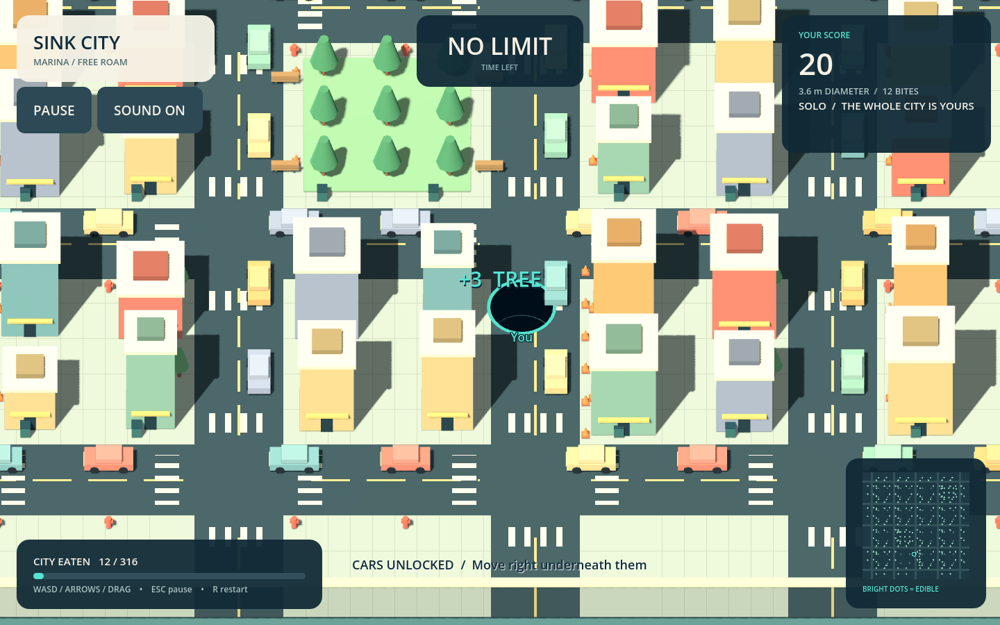

# Sink City delivery — September 24, 2026

Source: [experiments/hole-city](../../../experiments/hole-city/README.md).
Branch: `codex/hole-city-20260924`, based on the complete-source publication
`2fedbf522ddacef205061ff46ed6ab950daccc12`. The main game and maintained seq378
resident state are unchanged.

## Delivered behavior

- Keyboard, mouse-hold and touch-drag movement through an original low-poly city.
- Full-footprint size checks, actual Godot rigid-body gravity, a CSG opening,
  delayed one-time scoring after a complete fall, and continuous hole growth.
- Two-minute rounds against three labelled local CPU rivals, rival consumption,
  score ranking, timeout and defeat results.
- Free roam with all 316 objects reachable, ending with city-cleared results.
- Title, pause/resume, restart, minimap, progress, synthesized sounds and local
  best-score storage. The two garden platforms become edible late in the run.

Template: [mbMayer/Godot-Hole.io](https://github.com/mbMayer/Godot-Hole.io), MIT,
commit `cf75504a150c3cf179bb8e80b93309fb62a7a729`. The copied subtraction scene,
adapted controller, frozen source snapshots and licenses are explicitly recorded
in [THIRD_PARTY.md](../../../experiments/hole-city/THIRD_PARTY.md). Commercial
Hole.io assets and code are not present. This is one original district and local
CPU play; online multiplayer, commercial-game progression and a mobile release
are outside this delivery.

## Gameplay verification

Engine: `4.7.2.stable.mono.official.ed1daf0bf`, GDScript, GodotPhysics3D.
[acceptance.json](acceptance.json) records **27 checks, zero failures**.
The suite instantiates the actual main scene, submits a real W-key input event,
probes floor collision with rays, observes falling-body collection, rejects
oversized food, verifies growth and duplicate scoring protection, tests map
bounds, pause/resume, full reset, CPU movement, timeout, eating a rival and being
eaten. The final run clears the city through normal movement, footprint gates,
gravity and collection without score grants, object teleportation or bypasses.

| Full-city result | Value |
| --- | --- |
| Objects collected | 316 / 316 |
| Score | 2,442 |
| Simulated seconds | 67.8833333333316 |
| Automated physics frames | 1,359 |
| Time scale during full-city test | 3.0 |
| End state | City cleared |

The first test pass exposed a single exact-comparison mismatch between the
engine's float CSG radius and GDScript's float radius. It now uses the appropriate
approximate comparison; the independent physical ray tests remain unchanged.
The original result stays in local task history rather than being reported as a
clean pass. A deferred CSG attachment leak on immediate restart and a screenshot
cleanup callback after world destruction were also corrected. The final source
test exited 0 with no script/engine error output.

## Windows package

`tools/package_windows.py` exports a release executable with its pack embedded,
then runs that executable with `--headless --quit-after 120 -- --test --demo`.
Import, engine-notice extraction, release export and exported-game startup pass
without script/engine errors. [windows-manifest.json](windows-manifest.json)
records the executable and companion-file hashes. The archive is retained in
the ignored local build directory rather than committing 110 MB of executable
bytes into source control.

- ZIP: `SinkCity-Windows-x64.zip`, 38,243,679 bytes.
- ZIP SHA-256: `1611dd3099bd2952bc57f81674399f78b4454632cde25f94e6e5b56216cce305`.
- EXE SHA-256: `110b195e6c1e3b6f0562b33499ab64c96273e4c09c446c9a580b5b86e7d940c2`.
- Windows packages include the exact engine build's MIT text and bundled
  dependency notices plus the game/template license.

## Visual evidence and desktop constraint

This image was rendered before the user's instruction to avoid game/editor
windows and leave their two-monitor gaming session alone. It shows the actual
running Godot scene with the repaired dark hole, lit city and HUD. After that
instruction, only existing image files were read and all engine operations used
`--headless`; no cursor, screen or focus manipulation occurred. The final exported
binary's graphical window has deliberately not been launched. Touch input has
not been tested on physical mobile hardware, and no sustained graphical frame
rate claim is made. No town/provider work or quota reset was performed.
