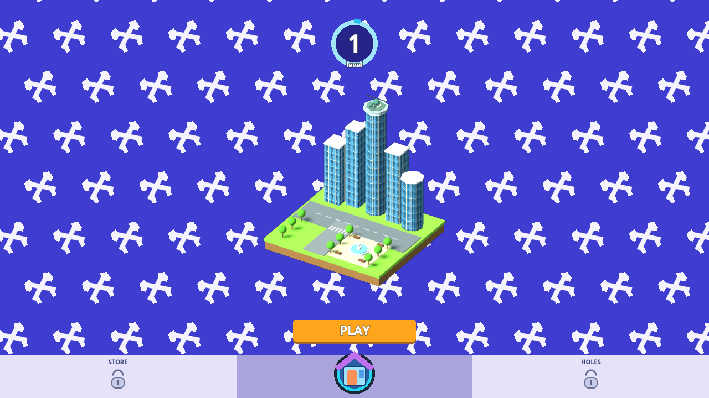
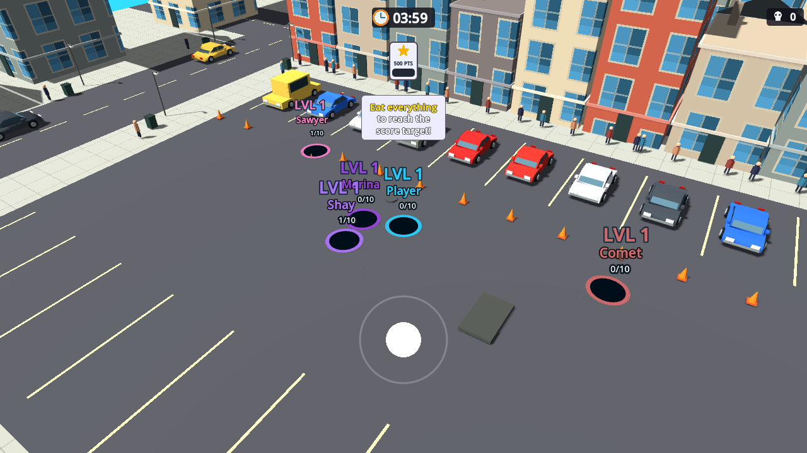
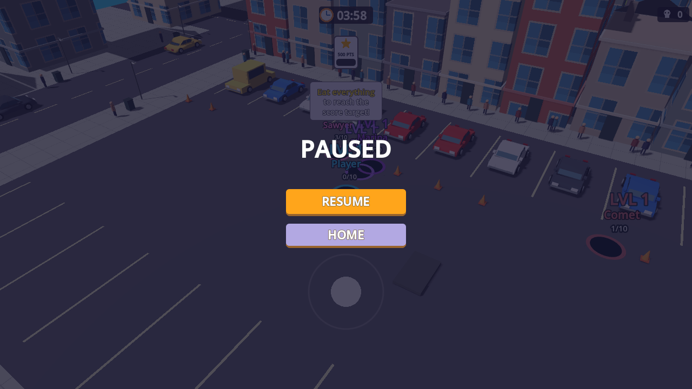

# Poki Hole.io reconstruction — step 1

The user confirmed the [live Poki game](https://poki.com/en/g/hole-io) as the exact
reference and requested self-authored art. This stage replaces the earlier
independent design as the default scene, while preserving the earlier scene and
published checkpoint. It is **not a completed full-game or pixel-identical
replica**. The detailed [reference ledger](../../../experiments/hole-city/fidelity/REFERENCE.md)
separates direct observations, implemented behavior and provisional choices.

## Current implementation

- Purple/blue patterned home screen, level badge, original rotating city
  miniature, orange PLAY and the initially locked side tabs.
- Original mesh-based parking district, building facades, sloped car bodies,
  bus/police/utility variants, moving pedestrians, park, fences, street lights,
  bins, cones and covers; 336 edible objects in this authored map.
- Drag-to-start tutorial, relative mouse/touch movement, keyboard movement,
  four-minute clock, 500-point target, level/name/progress tags and joystick.
- Size-gated rigid-body falls, earned growth, seven CPU rivals, opponent
  consumption, EATEN-to-home flow, pause/resume, and temporary win/timeout cards.

All displayed art is authored locally from Godot primitives, custom meshes,
shaders and drawing commands. Reference screenshots are kept only in the ignored
local reference directory. The preserved MIT CSG/controller foundation retains
the existing upstream license, commit and exact-byte provenance.

## Verification actually completed

Engine: Godot 4.7.2. [acceptance.json](acceptance.json) records **24 checks with
zero failures**, exercising the actual new main scene, PLAY action, tutorial
gate, keyboard movement, clock, size gating, delayed collection, first level
threshold, pause/resume, restart, timeout, defeat, return home and target ending.

Two distinct automated runs are reported without conflating their meaning:

| Run | Result |
| --- | --- |
| Ordinary automated movement against all seven rivals | Earned 113 points, reached level 5, was eaten after 49.233 simulated seconds |
| Layout reachability with rivals retired in the fixture | Earned 513 points by movement and falling objects, reached the target after 60 simulated seconds |

The reachability run grants no score and bypasses no footprint or fall rule. It
does retire opponents and therefore is not evidence of winning a full contested
round. Earlier ordinary runs had both wins and losses. The regression suite
accepts a valid live-rival outcome rather than forcing the player to win.

Checks exposed and fixed an invalid typed reference after a building was freed,
duplicate pause ownership, missing symbol glyphs and an early growth/map-size
dead end. The pause test now waits for the actual input state transition before
checking frozen simulation time; it no longer assumes buffered input is handled
within an arbitrary number of physics frames. The final run contains no engine
or script error output.

The standard engine exported the project to WebGL with its matching official
web template. A separate headless Edge instance actually rendered it at
1280 x 720 and exercised PLAY, W movement, Escape pause and Escape resume. The
browser reported zero script/engine errors; [browser-qa.json](browser-qa.json)
records the capture sequence. Both its browser and loopback-only review server
were closed afterward. The template and non-.NET editor were obtained from the
official Godot 4.7.2 release; the editor ZIP matched the existing SHA-512 sums.

The Windows release with an embedded pack also passed a separate headless
startup run. [windows-manifest.json](windows-manifest.json) records the EXE and
companion notices; [delivery.json](delivery.json) records the portable ZIP hash.
The old Windows executable remains in the earlier build directory. Neither
Windows executable was opened graphically during this stage.

## Authored visual evidence

These are captures of our own project in the headless browser, not copies of the
reference game's images. No desktop screen, physical pointer or focus was used.

## Remaining fidelity work

The store and skin library were observed but are not implemented. Original
post-level-1 growth values, exact rival/object counts, precise map geometry,
complete vehicle/building silhouettes, all skin assets, later levels, rewards,
ad/revive behavior and final win/timeout artwork still need measurement and
implementation. The current authored values and temporary result panels are
listed as provisional rather than described as matching the original. Close
rival labels can overlap and also need refinement.

The direction review kept this first-stage home/first-level loop as the scope.
The maintained town, its paused goal, hourly automation, saves and provider
ledgers were not resumed or modified. No quota reset was used.
