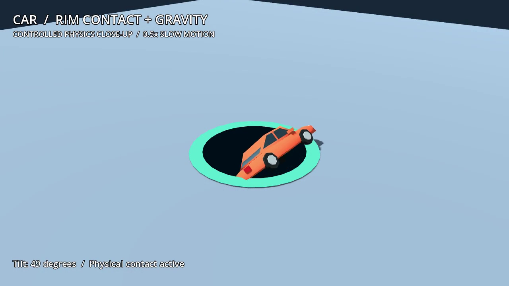
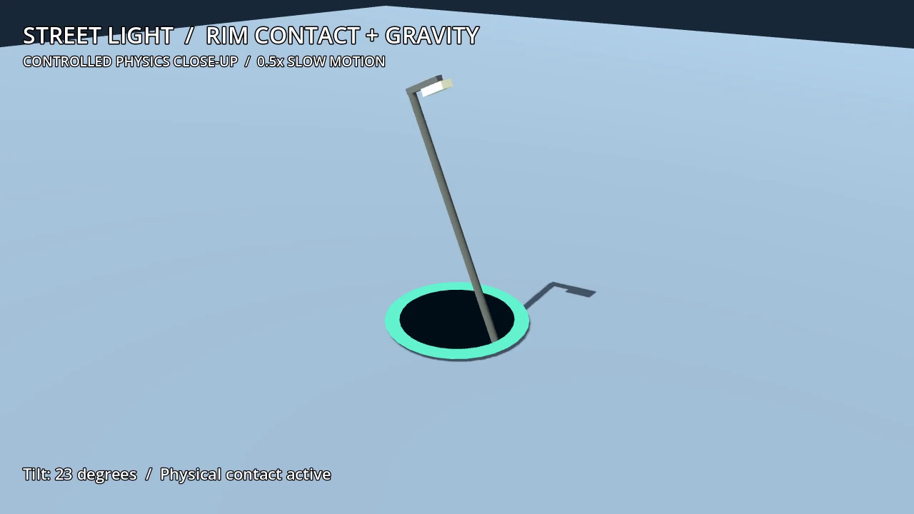
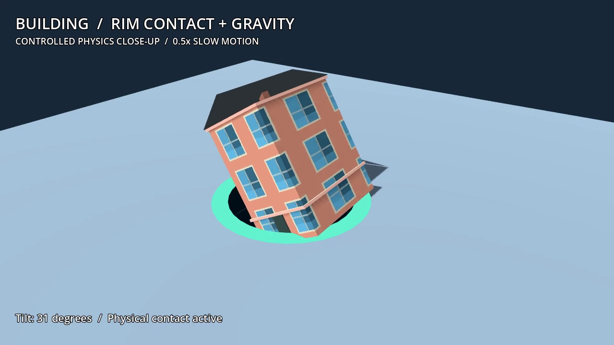

# Rim contact, tipping and controlled close-up recording

The user noticed that objects in the automated gameplay video mostly sank
vertically. The former implementation waited until the entire footprint fit
inside the hole, removed all collision contacts, assigned downward velocity and
added only a small fixed spin. It used gravity, but removed the asymmetric rim
support that should produce the visible initial tip.

The first-level scene now wakes objects when their center enters the opening.
It retains rim contact, starts with zero imposed spin and uses gravity to tip
the body. A bounded inward force follows a moving hole. Long objects that tilt
more than 25 degrees can receive a force at their lower end to stop them resting
across both sides of the opening. This is explicitly arcade assistance, not a
claim that gravity alone guarantees every object will fall through. The mesh is
not rotated, teleported or shrunk by the swallowing script. Rotated bounds must
clear the underside of the ground before collision can be disabled; scoring
waits for complete descent and remains exactly once.

The original prototype retains its former swallowing implementation. A small
factory hook lets the new reference scene use its own physics body.

## Engine verification

Godot 4.7.2, all headless. There are no engine/script errors in the final logs.

- [25 rim checks](rim.json): cars in two orientations, a street light, a tall
  building and a centered symmetric box. Tests use actual CSG rim colliders at
  the normal 60 Hz physics step. Every object completes its fall once; offset
  cases visibly tilt while still above the ground. The centered box remains
  upright, verifying that rotation is not added indiscriminately.
- [24 first-level checks](gameplay.json): input, tutorial, timers, pause, size
  gates, delayed collection, restart, outcomes and growth. The automated run
  against all seven rivals earned 501 points and completed after 72.317 simulated
  seconds at normal physics speed. A separate reachability fixture retired
  rivals and earned 512 points. These are separate fixtures, not the same run.
- The preserved prototype's 27 checks also pass, clearing 316 objects for 2,442
  points. No prior prototype swallowing behavior was replaced.
- The updated Windows package passed its separate headless executable startup.
  [Manifest](windows-manifest.json) and [portable delivery hash](delivery.json).

## Visible evidence

[38-second controlled physics video](rim-physics.mp4) · [Video metadata](video.json)

This is a deliberately isolated close-up of the actual authored car, street
light and building using the new production physics body. It is labelled
**CONTROLLED PHYSICS CLOSE-UP / 0.5x SLOW MOTION** in every frame. It is not
presented as an ordinary live match or as the commercial reference game.
An isolated headless Edge browser rendered the Godot Web export; its errors
array is empty. The MP4 passed a complete decode check. There were no desktop
windows, physical mouse movement or focus changes. The recorder and local-only
server were closed after capture.

The previous separately delivered 69-second automated match remains unchanged:
its bot used ordinary touch/drag input, earned 518 points and reached level 9
under the former physics. It must not be used as evidence of this correction.

Exact commercial physics, detailed map/art matching, shops, skins and later
levels remain pending. The town goal, saves and provider ledgers remain paused
and untouched. No quota reset was used.
