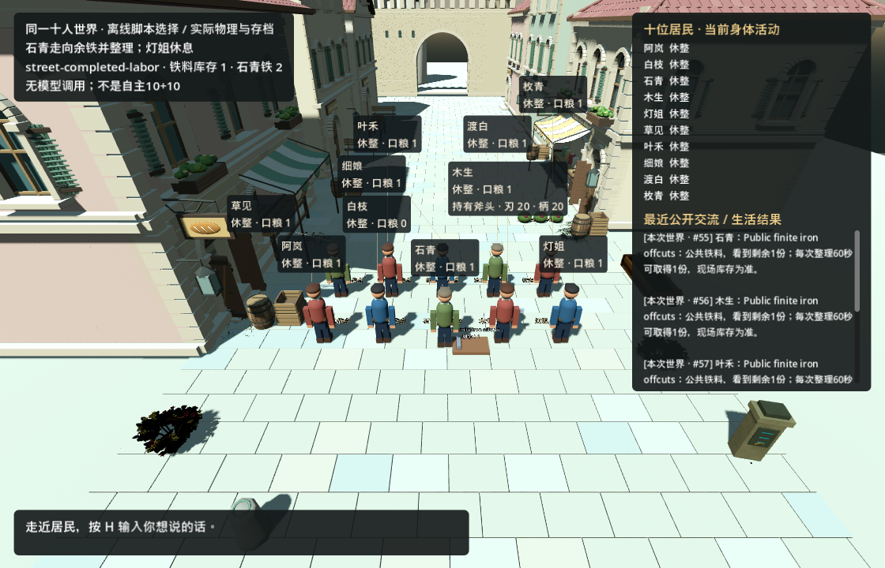

# 本机流程演练与目标差距 · 2026-09-18

**结果：本机离线完整流程通过。** 8个正常阶段179项检查全部通过，十个身体、十个GM测试上下文；最终seq59，铁源3→1、居民获得2，劳动中途重启与最终完整冷恢复通过。真实模型调用0。图形阶段无引擎错误，保留废弃导航API和体素取整两类警告。

目标是能进入、能影响、持续积累的世界：居民按自身处境生活，真实需要推动GM改进，居民实际使用后果，保存和版本更换不丢失身份、财物与承诺，再逐步扩展为完整首镇、冒险、楼层与多人共建。

本轮按用户要求自主处理卡点，沿用已确认的**离线范围**。使用独立测试世界与脚本居民/GM选择，实际调用Godot物理、存档、GM会话/候选和发布接口；模型调用0。另一台机器的seq450、GM真实会话与费用账本没有接入。

完整主图在 [ROADMAP.md](../../ROADMAP.md)；[可缩放图](local-flow-2026-09-18/flowchart.html)与[SVG](local-flow-2026-09-18/flowchart.svg)由同一份Mermaid图源生成。H1—H104的繁细历史分支原样保存在[历史图快照](roadmap-history-through-h104.md)，避免旧检查点混成今天的状态。

## 这次实际跑了什么

同一测试世界依次经过：创建十居民 → 通过真实回合接口提交脚本选择和缺铁需要 → 导出个人来源绑定的需求 → 十个独立GM测试上下文读取 → 具名GM候选目录生成有限铁源配置 → 自测和审阅 → 拒绝未审阅的安装 → 有来源安装3份有限铁 → 居民取得1份 → 未完任务保存与新进程恢复 → 实际身体离开/返回材料点 → 劳动中途保存退出 → 新图形进程继续同一劳动并再取得1份铁 → 最终状态检查。

这次交付的是**现有能力的有限资源配置**，没有把它写成GM自主编写了新能力代码。实际身体行走使用1倍时间和碰撞，不传送、不修改劳动时长；决定本身仍是测试脚本选择。

完整结果数字与阶段回执见[结果摘要](local-flow-2026-09-18/result-summary.json)。最终世界、源快照和完整私有诊断保存在本机 `C:\InfiniteAincrad\tmp\gpt6-sprint\integration\local-flow-20260918-final\`，不上传为正式世界。

| 阶段 | 检查数 | 世界事件序号 |
| --- | ---: | ---: |
| 十居民回合与真实来源需求 | 59 | 2 |
| 审阅后有限铁源安装 | 20 | 3 |
| 使用资源并保存未完动作 | 14 | 9 |
| 新进程续做 | 21 | 17 |
| 只读检查 | 4 | 17 |
| 实际走路与中途保存 | 32 | 52 |
| 图形重启后劳动完成 | 25 | 59 |
| 最终独立进程完整冷恢复 | 4 | 59 |

未审阅安装的独立负例按预期退出1，未改变世界；不混进正常阶段179项“全通过”的统计。最终冷检新增阶段时有一次标签尚未注册的拒绝，修补后只读复查通过，原记录另存于 `failed-final-inspect-*` 和 `failures.jsonl`，已完成劳动没有重放。



## 运行中发现并处理的问题

| 问题 | 证据与原因 | 处理 |
| --- | --- | --- |
| 旧流程图混用seq129、seq166和seq450 | 当前章节仍保留历史待办，例如烤炉尚未采用 | 当前主图改为工作循环、当前进度、优先待办和终局路线；旧分支归档，保留节点编号和历史证据 |
| 实机有资源错误，演练却报告成功 | 首轮两个图形阶段各有2条缺少面包GLB导入错误，退出码仍为0；旧入口直接跑场景，没有先导入资源 | 补齐演练入口的增量构建/导入；成功阶段同时检查stdout/stderr中的引擎错误。导航警告保留，不伪装成错误，也不隐藏 |
| 冷恢复被误报为状态变化 | 第二轮的检查读取器使用Godot JSON解析器，正式存档使用TownJsonCodec；如 `1932.5833333333335` 被读成相邻小数，存档字节未变 | 证据读写改用正式存档相同的精确编解码器，递归逐值严格比较，不用四舍五入或容差放行 |

首轮记录保留在 `local-flow-20260918/`，并另存 `logged-error-audit.json` 标明资源错误；旧“passed”文件未删改。第二轮保留在 `local-flow-20260918-verified/`，包括明确失败的 `street-finish.json`。最终复跑使用不同、明确标记的测试世界，未覆盖前两轮世界或错误。

引擎日志检查和原候选校验的14项Python测试通过；证据编解码与比较9项Godot检查通过，覆盖真实失败小数、超过双精度整数范围的整数、最小小数差、库存与身份差异。上一轮H104的50项Python/306项Godot结果单独保留，不重复当作本轮新测试数量。

## 与期望结局还不同的地方

| 期望 | 已有事实 | 尚未证明／要补的事 |
| --- | --- | --- |
| 居民自主生活，GM持续帮助世界发展 | 上游真实10+10和烘焙采用已有有界样本；本机程序链路可以演练 | 本机居民与GM选择为脚本，不能证明自然动机、自由协作或长期自治 |
| 自己发现需要并创造、采用新能力 | 居民可表达需要；GM候选、审阅、交付机制存在 | 本轮需要由测试指定，发布的是已有能力配置；自选建设目标与新代码创造仍需真实样本 |
| 长期自给与自愿互助 | 浆果450秒一份；口粮转交、有限烘焙有规则和离线检查 | 长期供需/拥挤、居民自然转交未验证；面粉无再生链 |
| 一直运行，少靠主AI逐阶段接力 | 有界生活与GM开发桥接、等待审阅、保存与恢复已有 | 本轮按显式阶段演练，没有证明自动连续派发和原GM长期效果回访；主AI候选审阅是现行设计的一部分 |
| 同一个最新世界跨机器接着生活 | 代码已到本机，上游seq450有保存恢复证据 | 私有存档、GM记忆与账本仍在另一台机器；本轮新测试身份不能替代它们 |
| 看到当前16栋生活街区中的真实演化 | 新街区资产和迁移入口已有；本轮链路使用现有集成探针的旧测试街几何 | 本轮物理闭环不能冒充最新16栋街区全路线/拥挤长测；后续应在接回的正式布局中验证 |
| 画面完整、运行稳定、可玩冒险世界 | 已有可进入街区、居民身体和有限生活后果 | 人物/动画、导航与图形稳定性仍有限；战斗、野外、迷宫、Boss和楼层扩展是后续阶段 |

接下来的顺序是：本机可继续处理启动/资源依赖和导航诊断；私有资料接回后，优先真实观察食物供需、拥挤和自愿互助；然后扩展生产/职业并减少人工阶段接力，再推进首镇体验、冒险和楼层。普通VR可较早做有限设备样板，神经全潜行没有可承诺的工程工期。

## 复现入口

在仓库根目录使用本机Godot路径，选择一个**尚不存在**的输出目录；第一条完成需求到安装与状态恢复，第二条继续同一测试世界的图形物理和中途重启。

```powershell
$flowGodot = 'C:\Users\quchenxi\.cache\level0-tools\godot-4.7.2-mono\Godot_v4.7.2-stable_mono_win64\Godot_v4.7.2-stable_mono_win64.exe'
$flowOut = 'tmp/gpt6-sprint/integration/choose-a-new-run-name'
$env:DOTNET_ROLL_FORWARD = 'LatestMajor'
python -X utf8 tools/run_ten_world_chain_validation.py --godot $flowGodot --out $flowOut --phase all
if ($LASTEXITCODE -ne 0) { throw 'Offline state/GM chain failed; inspect its retained logs.' }
python -X utf8 tools/run_ten_world_chain_validation.py --godot $flowGodot --out $flowOut --phase street
```

无需模型密钥。每轮保留独立world_id、候选、审阅、日志、PID、源文件摘要和结果。脚本不提供自动清零历史或无限重试。
