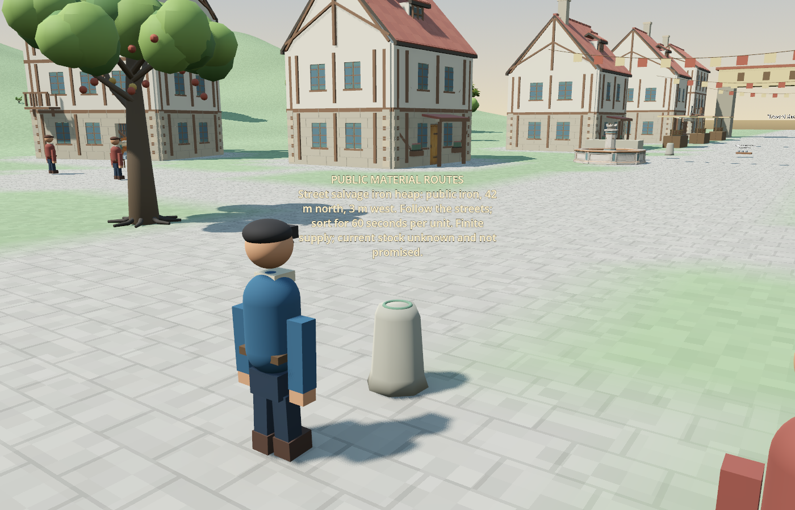

# H115 — Discoverable finite material through a physical notice

Continued locally from `84bc35a`, which contains the latest received online delivery `d2c0227`. The active published world remains `shared:restart-20260918-01`, seq148. Its three-unit iron heap was installed in H113, but none of the ten residents knew it existed; they were 25–47 metres away from a source requiring close personal sight. This change supplies a bounded, attributed way to discover it.

## Behavior and setting review

A public route notice now uses the existing carved waystone beside the berry commons. It lists installed public source locations, directions, material and work requirements. It never lists current or initial stock, private resident requests or GM evidence. No source is installed, refilled or moved by the notice.

The host scene checks visibility with a real physics ray; the world independently requires the resident to be within four metres. Only that reader receives a durable `material_notice_read` event and location knowledge, with **stock explicitly unknown**. Loading or pausing the world grants nothing. Re-reading cannot refresh old stock knowledge or override personally observed depletion. Existing source observation supplies actual stock only after arrival within its own range and line-of-sight rules.

The existing versioned collection action becomes an optional choice for a reader. Its description promises no stock. Travel, sixty seconds of on-site sorting, finite consumption, failure, cancellation and receipts retain their existing rules. A depleted arrival can fail honestly. The registry remains at 34 capabilities; this extends perception for an existing action.

This is coordinating-agent maintenance, not autonomous GM invention or natural resident adoption. Setting classification: a compatible original extension under the [Aincrad charter](../design/aincrad-world-charter.md), using an existing waystone, finite salvage, physical travel and labor. The sign, original settlement layout, four-metre reading gate and sorting duration are prototype rules, not a claim of exact novel geography or mechanics. No modern device, magic transport, free material or imposed resident choice is introduced.

## Verification

| Check | Result |
| --- | --- |
| Notice privacy, idempotence, unknown stock, tamper rejection, depletion and restoration | 34 passed |
| Existing material visibility with real physics | 95 passed |
| Private resident need and installation | 49 passed |
| Blocked material travel, coexistence and bounded history | 278 passed |
| Existing public-place rules | 67 passed |
| Read-only restoration controls | 11 passed |
| Notice in the actual town, obstruction, collection and mid-walk restart | 27 passed |
| Rich seq148 resident input through the actual controller | 10 passed; 12,164 UTF-16 units within the unchanged cap |
| Complete independent cold restores | Active seq148 and original seq450 passed; final controlled copy also passed inside the physical suite |
| Forward+ rendering | Actual Vulkan capture inspected; label size and contrast corrected |

**571 focused checks passed; zero paid calls.** The input fixture explicitly chose wait, confirming that discovery does not force a collection job. Its bounded model payload retains unknown stock and the real collection alias. [Machine-readable evidence](material-notice-2026-09-18/checks.json).

The physical test began from an exact disposable copy of seq148. Ari (`shared:well-keeper`) already stood within reading range, over forty metres from the original iron heap. Hiding the sign or inserting a real opaque wall prevented learning. Removing the wall allowed personal reading; distant Flint learned nothing. An explicit **fixture** collection command then walked Ari **44.36075 metres**, at at most **1.35000 m/s**, largest sampled step **0.09002 m**. A fresh scene resumed the identical full state after five metres. Direct source sight replaced the unknown stock, the sorting job completed, source stock fell from three to two, and Ari gained exactly one iron. The disposable result ended at seq154, not the active world's next checkpoint.

The capture uses a paused, read-only seq148 copy and a temporary close camera. The visible text is a prototype world label above the reused prop. It is not a model-vision demonstration. Existing navigation still reports four overlapping edges; physical and visual runs had no script errors. Early test failures included one inferred-type parse error and comparing JSON numbers against native numeric types; the latter was corrected by passing both sides through the production wire codec, with no numerical tolerance or dropped fields. Private logs retain the failed and successful attempts.

## State and next work

Active seq148 remains byte-identical with SHA-256 `cdfe0136856980281f671c14721815ac1bf5484cb77e930485edb9c435dc380a`. Original seq450 remains `a06a43ed7c5ca5e55aef3e7b2e51ecf54faf8d5cc2133c15c789ccbe754f600c`; its pre-existing local seq452 continuation remains separate and untouched. No provider calls, cost-ledger edits, GM session changes or monitoring restart occurred. GM06's unknown result and the old GM05 tail remain unresolved evidence.

Next observe whether residents voluntarily read, collect, exchange and use iron or adopt H114 self-repair in a separately bounded continuation of the active world. This implementation does not prove that information will reach Flint, that residents will trade, or that three finite units support a sustainable economy. Dialogue attribution, learning, voluntary sharing and continuing resource supply remain open. Existing manual launch profiles on this computer still select the original overnight lineage; do not use them as an implicit seq148 continuation.

Reproduction: run `town_material_notice_acceptance.gd` and `town_material_notice_input_acceptance.gd` headlessly. For `town_material_notice_scene_acceptance.gd`, pass `--source=<immutable seq148> --town-save=<new disposable world path> --out=<new result JSON path>` after `--`. It refuses an existing destination save. All tests are offline.
