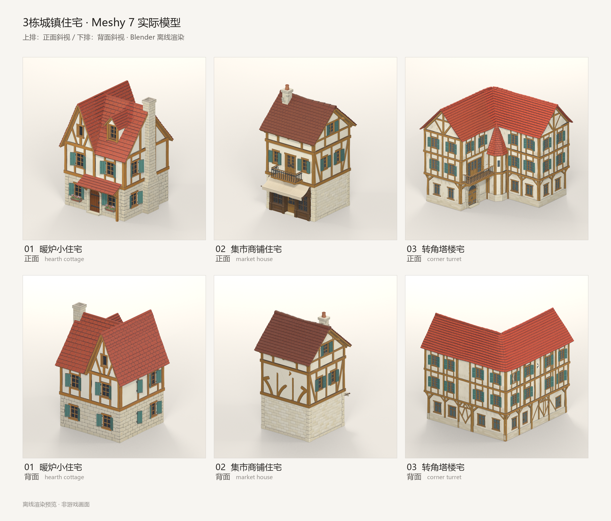

# 三栋 SAO 城镇风格住宅 · Meshy 7 外观试做

2026-09-16，实际完成三张概念图、三个带纹理 GLB、每栋四个方向的 Blender 渲染及三个打包贴图的 `.blend`。下图来自下载后的真实网格；上排正面，下排背面。

## 生成方法与费用

GPT-6 确定红瓦、浅石墙、浅木构与青绿窗板的共同方向，并检查概念图和实际模型；DeepSeek Flash 编写渲染工具及修复，GPT-6 最后调整展示地面和塔楼宅朝向。Meshy 的 `nano-banana-2` 先生成三张 1024×1024 概念图，再交给 `meshy-7` 图生 3D，开启纹理与 PBR、指定 4K，关闭自动重拓扑与 Ultra。

六个生成任务都返回成功：每张概念图 6 积分，每栋带纹理模型 30 积分，实测合计 **108 积分**。完整提示词、任务 ID、参数与文件 SHA-256 见[资产清单](../../Art/Generated/MeshyHouses20260916/manifest.json)。没有追加重生或付费修复。

| 候选 | 三角面 | 顶点 | 当前外观判断 |
| --- | ---: | ---: | --- |
| 01 暖炉小住宅 | 1,630,308 | 903,591 | 三栋里造型最稳定；屋顶、门廊、烟囱和花箱得到保留。 |
| 02 集市商铺住宅 | 1,263,506 | 705,263 | 正面店铺和遮篷可辨；背面木梁存在断裂、弯曲和孤立色块，不能直接作为成品。 |
| 03 转角塔楼宅 | 1,792,188 | 1,011,346 | 保留 L 形主体、内转角塔楼和阳台；部分墙面、栏杆细节仍需人工清理。 |

这是对本次三个样本的目视判断，不能据此排名 Meshy、Tripo 或解释旧模型的失败原因。统一配色有助于系列感；距离动画场景中的整体光照、手绘层次仍有差距。

## 验证与边界

三个 GLB 的头部、版本和长度校验通过，Blender 5.2.1 LTS 全部成功导入；12 张 1024×1024 视图、三个 `.blend` 和一张 2160×1844 对照图已保存。渲染前后原始 GLB 的 SHA-256 全部一致。颜色及法线贴图实际为 4096×4096，金属度及粗糙度为 2048×2048；不能把所有贴图统称为 4K。

展示时统一归一化尺寸、落地并调整相机；塔楼宅绕竖轴转 90 度以展示入口。模型原始尺寸不是已验证的建筑米制尺寸，三个样本的屏幕大小也不代表真实尺寸比例。渲染用背景地面不是生成资产的一部分。

本轮只验证外观候选。尚未做游戏 LOD、碰撞、可进入室内、导航或 NPC 居住功能，未替换正式城镇资产，也未启动居民/GM。正式世界仍保持原状态。

原 GLB、独立贴图、概念图、四向预览与 Blender 文件在本机 `exports/meshy-houses-20260916/`。该目录被 Git 忽略；本次只整理轻量清单、对照图与报告，没有推送 GitHub。原始 API 回执保存在被忽略的 `tmp/meshy-houses-20260916/`，签名下载地址和凭据不进入公开文件。

下一步应先选满意的外观，清理背面等缺陷，再做减面、碰撞及游戏光照对照。三栋均超过百万三角面，不能直接批量铺满城镇。
