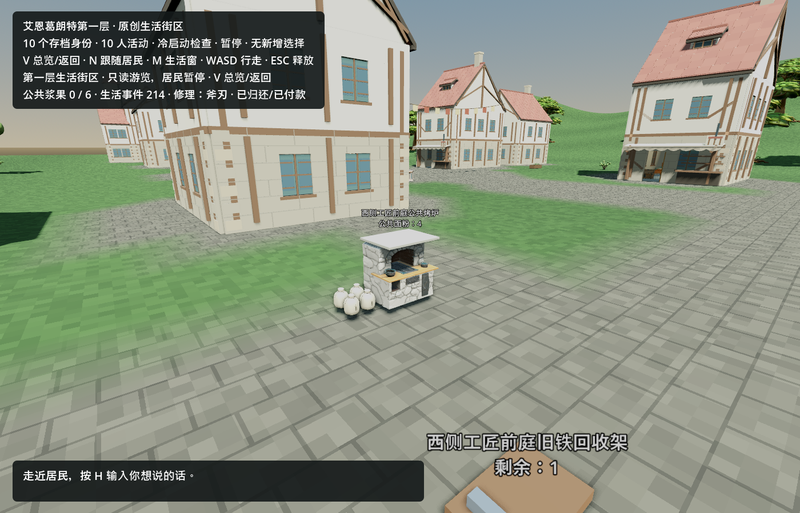
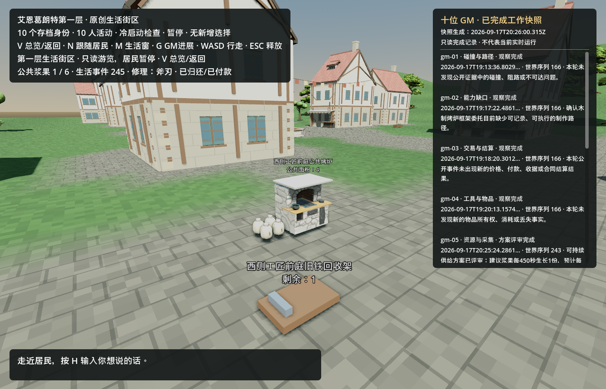
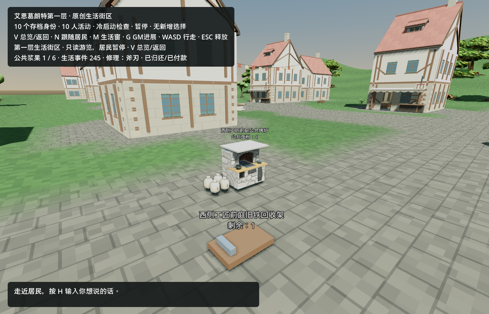
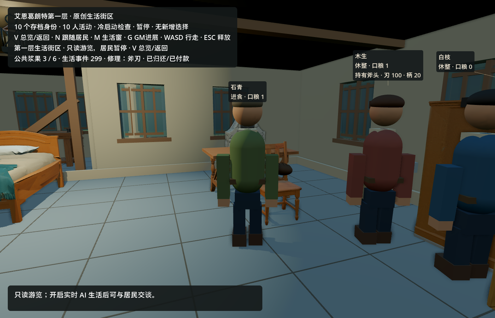
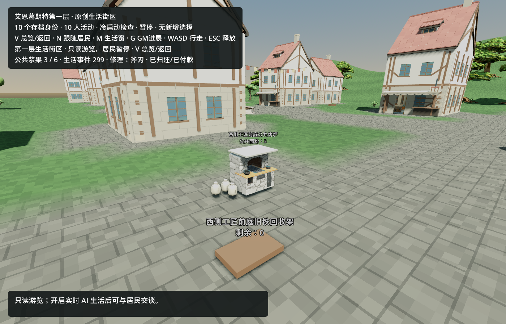
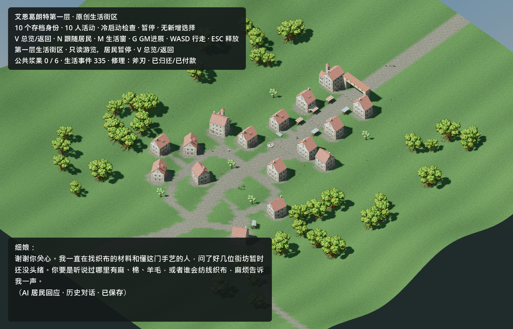
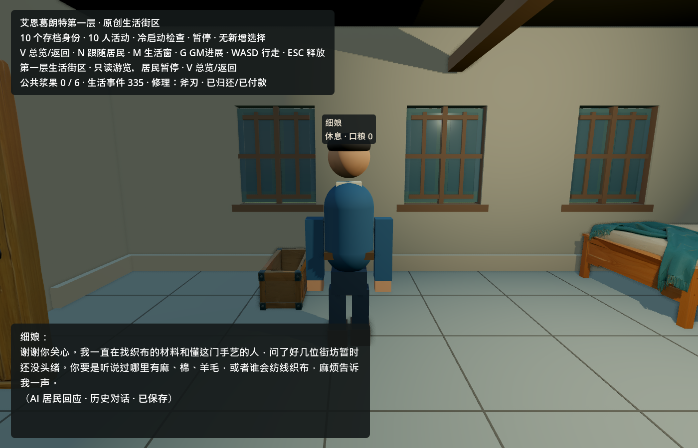

# 2026-09-18 第一轮美术交付

已交付三件可独立加载的纯视觉 Godot prefab。新增付费请求 **0**，实际新增积分 **0**，无供应商待取回任务。未修改主场景、生活逻辑、原研究存档、ART_STYLE 或 HISTORY。

## 盘点与范围

现有库已含 16 栋房屋、壁炉、烘焙工具架、手磨、餐食、桌椅与货运物件；不重复生成这些资产。实际公共烘焙组件 `town_baking_points.gd` 仍使用方块炉和面粉袋。当前缺口是可以接入真实有限库存显示、尺寸与既有通行规则兼容的独立资源。

本轮炉具复用 `game/assets/floor1/living_props_20260916/hearth.glb` 的 Meshy 炉台、拱口与贴图，裁掉高烟道并加石质封顶，再适配既有炉体体积。面包复用 `Art/Generated/TravelCargo20260912/geometry.py` 已有 `Geo/loaf` 几何配方，单独导出。面粉袋为本轮离线 Blender 制作，沿用麻布、麻绳和麦穗的现有第一层配色方向。没有向 Meshy/Tripo 重复提交。

## 集成接口

三件资源位于 `game/assets/overnight20260918/`。所有根节点原点都在底面中心，Godot Y 向上、正面 +Z，实例缩放 `(1,1,1)`。材质已内嵌 GLB，不依赖私有目录或外部贴图路径。

| prefab / 根节点 | 实际包围尺寸 X/Y/Z（米） | 三角面 | 材质 |
|---|---|---:|---:|
| `baking_oven.tscn` / `BakingOven` | 1.00 / 1.00 / 0.76 | 13,489 | 2 |
| `flour_sack.tscn` / `FlourSack` | 0.24 / 0.30 / 0.24 | 2,636 | 3 |
| `bread_loaf.tscn` / `BreadLoaf` | 0.26 / 0.15 / 0.26 | 1,944 | 3 |

根下固定子节点 `Visual` 是 GLB 实例；prefab 无脚本、碰撞、库存值、动画和 API。展示脚本 `preview.gd` 是独立验收入口，不挂在 prefab 上。

- 炉具 AABB 精确覆盖 x[-0.5,0.5]、y[0,1]、z[-0.38,0.38]；保留工程现有 `OvenCollision`，不要再创建碰撞。已有 +Z 炉前工作点与 `(0,1.05,0)` LOS 目标不改。
- 袋子底面原点与旧方块的中心原点不同；若沿用旧 sack.position，Y 要减去 0.15m。数量始终由真实 `flour_remaining` 控制，耗尽时隐藏，不让资源自行刷新库存。
- 面包只在实际持有/完成生产时显示；本 prefab 不证明居民已烤出面包。没有把固定装饰面包放入公共点。
- 小道具不建议加入碰撞；如以后用于桌面独立可拾取物，由工程按交互需求另加简单形状。

## 聚焦验证与实渲

Blender 5.2.1 导出：三件均无退化三角面。Godot 4.7.2 .NET 在独立临时项目中通过真实编辑器导入，随后加载三个原始 `.tscn`、测量导入后 AABB、检查脚本/碰撞数，再用 Compatibility 实际 viewport 渲染并保存 PNG。三件尺寸与纯视觉检查全部通过；导入/渲染进程均正常退出，最终 stderr 无错误。


截图来自真实 Godot 渲染，没有图像生成或截图修补。独立画廊无居民、无模型调用，不构成真实街区采用、导航通过或持续生活的证明。后视角和结构化验证记录见 `Art/Generated/Overnight20260918/captures/`；源资产指纹、导出指纹、面数与来源见同批次 `manifest.json`。

## 复现

在本工作树根目录运行：

```powershell
& 'D:/SteamLibrary/steamapps/common/Blender/blender.exe' --background --factory-startup --threads 4 --python Art/Generated/Overnight20260918/prepare_assets.py
& Art/Generated/Overnight20260918/preview_assets.ps1
```

第二条命令复制本批资源到 ignored 独立预览目录，使用已提供 Godot 路径与命令级 `DOTNET_ROLL_FORWARD=LatestMajor`，后台预览窗口 Hidden，记录自己创建的 PID。输出截图不依赖整个游戏场景或 C# 编译。正式项目正常 Godot 导入后可直接加载 `res://assets/overnight20260918/baking_oven.tscn`。

## 限制与后续

这是复用资产的尺寸适配，原 Meshy 炉具仍有近景贴图纹理和不规则网格；无 LOD，尚未做全街区性能测量。袋子与面包是较简洁的项目原生几何。生活任务已确认接入时保留唯一实体碰撞，并改为显式面粉袋数组；缺失资源时保留旧原语回退，不让资产阻塞生活入口。后续仅围绕协调方实际观察到的场景缺口继续。

## 第二轮：有界原著一致性核对与最小补正

核对输入为①实际截图 `docs/validation/night-20260918-sol-life/living-world-hud.png`，读取时 SHA-256 `9604b8adcb7579c7a551e9307d83f5f96c8b679fc54b6206c20dc67e69bae986`，以及 ART_STYLE 顶部已确认的第一层参考边界、既有街区/市场实渲和当前道具清单。该截图来自 `town_street.tscn`，不能把旧 `demo_town` 的全部装饰都宣称为这张图中已加载。没有修改①工作树或主仓。

本轮仅三项直接可纠正观察，区分原著、视觉参考与项目补充：

1. **地名范围需明确（已发①与协调方，UI 由①修改）。** 原著事实：[出版方电击《Progressive》〈星なき夜のアリア〉第3节](https://dengekibunko.jp/novecomi/novel/16817330648099677277/16817330648100101462.html)开头地理段分别描述南端城墙围起的起始之城，以及靠近迷宫、谷地中的托尔巴纳，两者不是同一城镇。视觉参考：用户确认起始之城市街与托尔巴纳高视角供设计参考。项目补充：16栋布局、宅地与十名居民为原创。当前 HUD“起始之城 · 独立新世界”没有传达这一区别；推荐改为 **“艾恩葛朗特第一层 · 原创生活街区”**。此项不是要求重建两座城市，也不把缺少全城地标认作局部街区必须补齐的错误。
2. **成品视觉向已核到的第一层食物对齐（本目录已修）。** 原著事实：[同篇第4节](https://dengekibunko.jp/novecomi/novel/16817330648099677277/16817330648100108071.html)开头有 NPC 面包店的黑面包；对白“隣…座ってもいいか？”之后的叙述段，用短语 **「黒褐色の丸形オブジェクト」** 描述从口袋取出的面包。准确定位为本次成功读取正文的第48行（行号依抓取器而变，应以叙述段定位），第30行为面包店，第35行为托尔巴纳喷泉广场木椅。2026-09-18 本次核查中，初次 open 和部分 find 只得到章名/未命中，后续 find `噴` 返回包含第30–104行的正文；URL未换，存在正文渲染/抓取波动。视觉参考：黑褐、圆形来自该原作文本，未以同人图证明。项目补充：26cm尺寸、割纹、网格与材质是项目制作，公共炉、有限面粉及一份口粮规则仍为项目扩展。将现有 `bread_loaf` 从金黄长圆改成黑褐圆形、哑光表面，并修正割纹端部越出表面的几何；**不据此断言其他面包违规**。不增加商品价格、奶油奖励或新资产种类。
3. **默认 HUD 遮挡影响观察（已发①，可择时最小调整）。** 原著事实：上述原文并不能为本项目面板尺寸提供依据，此项不属于原著设定冲突。视觉参考：最新1400×900实机画面的右侧列表、左上状态和底部空输入区占据大量近景，降低路边角色与道具可辨识性。项目补充：这些都是项目观测 UI。建议非对话状态底部仅保留单行提示，右侧详情可折叠；不删真实模型/历史/暂停标记，不为此阻塞生活运行。

已查画面与已列道具中未发现枪械、现代电器或明确跨层地标；这是当前证据范围的观察，**不是全图逐物件认证**。木构浅墙、瓦屋顶、布棚、木车、石炉、麻袋与既有确认风格未见需要本轮重制的硬冲突。三件自有模型都属于项目制作，不冒称原作官方模型。

补丁保持 prefab 路径、根节点、底面原点和纯视觉接口；仅面包包围尺寸更新，炉具/麻袋 GLB 保持首批字节。Godot 再次实载三件 `.tscn`，尺寸和无脚本/无碰撞检查全过、stderr为空并正常退出，新增API/积分仍为0。面包近景如下；其余画廊截图同步更新。


仅重建面包可运行 `prepare_assets.py -- --bread-only`（使用上方 Blender 启动命令），避免重导炉具贴图造成无关字节差异。实际街区炉具/手持面包集成近景仍等待①后续截图；本次不将画廊证据冒称生活采用。

## 实际街区炉具复核

随后只读核对①提供的 `docs/validation/night-20260918-sol-life/baking-point-integrated.png`（SHA-256 `265788718798585a08282eaf12d94899d02344c794bfd32104f401d676c1a08c`，2026-09-18 03:33生成）。炉体落地、材质、1m尺度与朝外方向未见异常；HUD已采用“艾恩葛朗特第一层 · 原创生活街区”。无需重做自有GLB。

只提出一项最小布局建议给①：把五袋面粉由炉口正前平移至炉侧，保留工作点、LOS、唯一碰撞与真实库存袋数。当前局部袋前沿约z=0.64，原工作点z=0.85，视觉净距约0.21m，存在站立角色脚部与无碰撞袋子重叠的可能；截图没有站在炉前的角色，所以这是根据实际位置给出的干涉风险，不宣称已拍到穿模或实走失败。该建议由①在其场景显示代码内决定落实，我未跨目录改生活代码。

此图为原存档可丢弃副本安装后的街区截图；canonical源档未改的说明来自①交接，不以这张图证明正式存档已安装、居民已烘焙或手持面包已显示。

**闭环复核：** ①提交 `e705146` 后重新提供同路径近景，最终图 SHA-256 为 `9469155833943ca7accc236183a73c4bf5220f32d03fa364626ab902d55733df`。已独立打开图像并只读检查袋子位置：五袋全部落在炉侧地面，炉口 +Z 正前工作区已清空，炉体朝向、尺度与材质保持正常；上述唯一视觉建议已解决，无需继续修改自有资源。①报告烘焙物理66/66、合并200/200通过，这两项是①的工程验证结果，本美术任务没有重复运行或将其改称独立复测。

## seq214 已安装冻结快照的短实渲

协调方随后提供 host-reviewed 安装后的冻结源 `delivery-live/gm-source-seq214-installed.json`，本任务将它复制到自身 ignored 私有渲染目录，再运行已集成的 `delivery/game/scenes/town_street.tscn`。参数为 `--town-restore --town-focus-baking=public_bakery_oven_west_forecourt_v1 --town-hide-life-panel --town-capture=<自身目录>`，只加载副本；没有打开 canonical world、修改 delivery 源码或新建模型请求。

2026-09-18 03:59:33–03:59:47，自己创建的 Hidden Godot PID 57568 正常退出，exit 0；包含启动、场景加载与约3秒暂停模式捕获。实际证据报告 `life_seq=214`、10个活动身份、`new_decisions=none_restore`。炉体、标签公共面粉4、炉侧四袋与清空的 +Z 工作区均已目视核对。

冻结源前/后、渲染副本前/后四次 SHA-256 完全相同：`7f96a3c5c81be38588bc85c110f67cd6fbab91bede19fbaddf0f108d9b41b4a2`。本次日志无 ERROR，但有导航旧 API、agent_radius体素精度和4条边合并警告，不能写成“全部无警告”。精简收据保存在 `Art/Generated/Overnight20260918/captures/installed-seq214-render-receipt.json`，未公开存档或完整世界事件。



此图证明已安装冻结状态可以在已集成街区中显示；居民保持暂停，**不证明居民已经发现、走到或采用烘焙能力**。这些生活采用事实仍需主协调的真实运行证据。

## 烤炉 v2 与十 GM 面板：隔离审计副本短实渲

2026-09-18 04:37–04:39，在15分钟范围内完成，只读使用 delivery 已集成的 `7882e55` / `587b397` 功能。输入是主协调给出的 `baking-replacement-run/replay-world.json` 的另一个副本：它从真实 life06 冻结档精确重放 v2 安装，当前 seq245；**属于隔离审计副本，不是居民采用证据**。外部 GM 完成快照同样复制后读取。未打开 canonical、修改 delivery 文件或更改资产，模型请求0。

自有检查脚本 `Art/Generated/Overnight20260918/check_gm_panel.gd` 仅装载原产品 PackedScene、发送一次普通 G 键输入，并使用 Godot 原生 viewport PNG 保存方式记录街景及既有滚动控件的首/中/末段；没有新增产品输入 flag、改变 UI 布局或创建截图平台。产品原有 `--town-restore --town-focus-baking=public_bakery_oven_west_forecourt_v2 --town-hide-life-panel --town-gm-status=<copy> --town-capture=<own>` 完成证据导出和自动退出。

结果：G 确实打开面板，10条 GM 记录载入；首/中/末三张原生截图共同核对 gm-01 至 gm-10 内容均可读。标题和说明明确为“已完成工作快照”“不代表当前实时运行”，状态均为“观察完成”或“方案评审完成”，没有虚假工作中标记。GM 源序列166/214/243与当下审计世界245同时保留，不把历史评审冒称实时世界状态。

**显示限制必须保留：** 1400×900下，右侧面板为378×600、占屏宽27%，中央炉具及道路仍可见；文字内容高1085、滚动视区高488，因此10条需要滚动，不能声称一屏同时全部可见。主面板图如下，完整中/末段保留在同目录 `08-gm-panel-middle.png` / `09-gm-panel-bottom.png`。





炉具、四袋面粉与清空的工作区正常。两次短进程用于补齐滚动中段，PID63204、68428均exit0无驻留；两个capture均 `new_decisions=none_restore`、`validation_decisions_started=0`，无 ERROR，仍有前述导航警告。世界源/副本前后哈希均为 `d29323f619934fb6c7938da7fe42f72b4fc642ecc9a7296f950452d22dc04a55`；GM源/副本前后哈希均为 `2ab3651a9abced2f3e336e0c07bf648c856aca79b291b7106d8fd4a04dec2475`。完整精简收据在同目录 `v2-gm-render-receipt.json`，包括截图hash、面板尺寸、10条状态与只读边界；未公开完整世界存档。

## 真实采用后的 seq299：铁匠持有面包与三份面粉

主协调提供真实 life09 结束后的冻结文件 `delivery-live/gm-source-seq299-after-life09.json`。本任务再次复制为两个独立渲染副本，只读使用 delivery 原场景，分别带现有 `--town-focus-resident=shared:smith` 和 `--town-focus-baking=public_bakery_oven_west_forecourt_v2`，均为 `--town-restore`。没有改动产品代码、资源、角色姿势、灯光或截图，没有打开 canonical world。

已从副本独立核实：命令 `turn:shared:smith:1:24` 的 action 为 `bake_bread`，provenance 为 `opengameagent_live`，状态 `completed`、结果 `bread_baked`、数量1；v2账本中 `shared:smith` 为 **held=1 / eaten=0**，公共面粉3，baking jobs为空。这次存在真实完成命令与守恒账本，所以可以说**铁匠石青已实际采用烘焙能力并仍持有一份面包**；不能改说白枝采用，也不能把HUD的“进食”动作标签当成这份面包已经吃完。



原产品聚焦镜头中，石青身侧可见黑圆面包，部分被手臂遮住且室内较暗；这是持有状态的附着显示，没有由本任务摆出新的手部抓握姿势，也不声称捕捉了烘焙过程或进食动画。颜色与圆形沿用已核对的原著参考。



炉位标签为公共面粉3，三袋实际显示、工作区继续清空。2026-09-18 05:38:09–05:38:37，两短进程PID67556/74748均exit0，无ERROR，原导航警告仍有。两份捕获均seq299、`none_restore`、0个新决策；本轮新增模型API为0。冻结源与两个副本前后SHA-256全部保持 `4b185131d0d02e2e0f976412879f4554cdf5de8a144cfe3b636b3c3a847f9f30`。精简收据 `captures/adopted-seq299-render-receipt.json` 保存上述命令/账本字段、哈希、截图指纹和显示限制，不公开完整私有存档。采用事实来自真实冻结命令与账本，截图是该已发生结果的零API回看。

## 最终 seq335 展示：街区总览与织工回家后的近景

2026-09-18 06:23，在主协调限定范围内，将 `delivery-live/movement-all10-seq335.json` 复制到自有 ignored 目录并运行两次原产品暂停恢复捕获。总览脚本 `Art/Generated/Overnight20260918/capture_overview.gd` 只加载原场景并发送现有 V 键切换；近景使用现有 `--town-focus-resident=shared:weaver`。没有修改玩法、产品源码、模型、灯光或图片，没有访问 canonical。





总览保留“艾恩葛朗特第一层 · 原创生活街区”标题和真实暂停标记；近景中细娘位于有床和箱子的住处，标签为休息、口粮0。两图保留原产品标注为“历史对话 · 已保存”的对话框，它不是本次生成的新回应。沿用已有 GM public 完成状态副本，面板保持关闭，不能从截图声称十 GM 正在同时运行。

**证据边界：** 图片仅展示 seq335 的暂停状态，不是移动过程或进食动画的证据。十居民实际身体位移证据在 root 的 `private/overnight-20260918/ten-resident-movement-acceptance.json`（SHA-256 `b731de74283e241d8e3787c919edd7b27f566ac558e2c0e5bb95fa48029ad6b7`）；本任务只读引用协调方已有验收，其中 physical_movers=10、织工最大已观察位移23.1861m，不另开移动审查。织工真实选择 eat_ration、seq333完成进食、后继turn32选择rest的运行说明由协调方提供，不由这两张静态图单独证明。

两次进程 PID20348 / 31808 均正常exit0，无驻留；捕获均为 seq335、10个活动身份、`none_restore`、0个新决策，新增模型/生成API为0。冻结源与两份副本前后 SHA-256 均保持 `59b98070cbcdfc393e18f47924d99f7dc2f55c99dda662f493e6da241583d35c`；GM副本前后保持 `b3d1e3e076f53a2afa0d8da7ac9505b5f416e32ff078731b267a1ddf7b01d5fd`。无 ERROR / SCRIPT ERROR，仍有前述导航警告。精简收据 `captures/final-seq335-render-receipt.json` 收录进程、截图指纹及只读边界，不公开完整世界存档。
