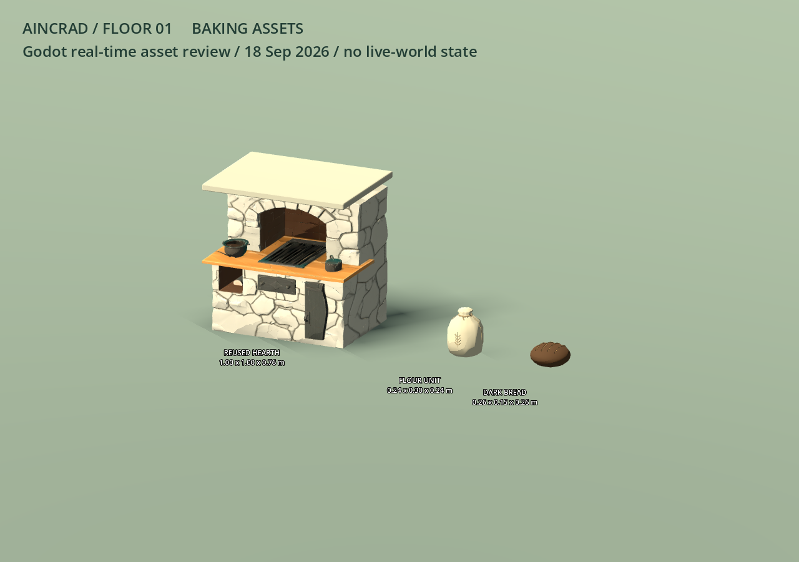
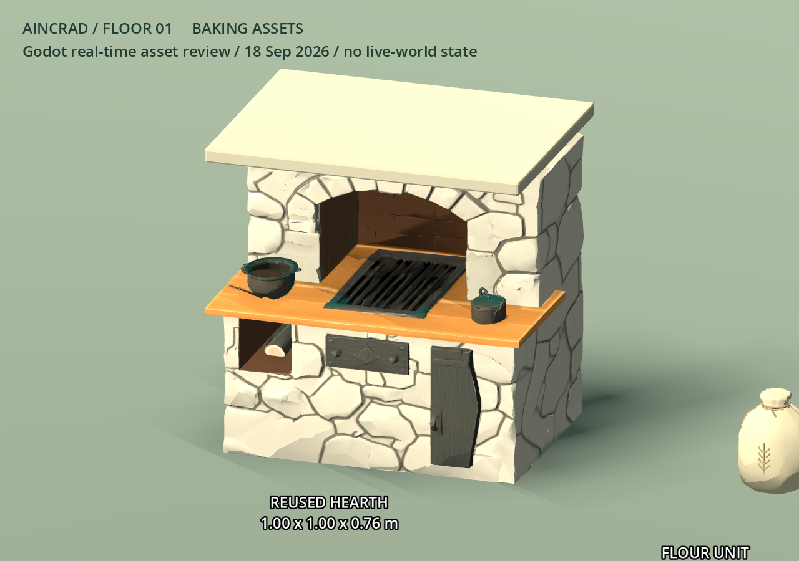
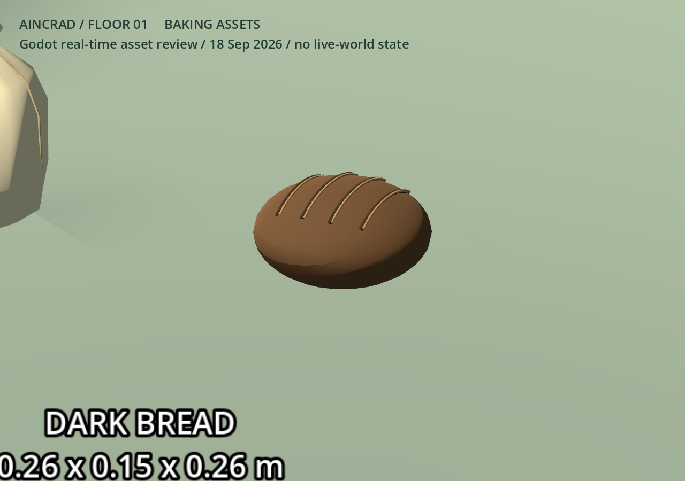

# 2026-09-18 第一轮美术交付

已交付三件可独立加载的纯视觉 Godot prefab。新增付费请求 **0**，实际新增积分 **0**，无供应商待取回任务。未修改主场景、生活逻辑、原研究存档、ART_STYLE 或 HISTORY。

## 盘点与范围

现有库已含 16 栋房屋、壁炉、烘焙工具架、手磨、餐食、桌椅与货运物件；不重复生成这些资产。实际公共烘焙组件 `town_baking_points.gd` 仍使用方块炉和面粉袋。当前缺口是可以接入真实有限库存显示、尺寸与既有通行规则兼容的独立资源。

本轮炉具复用 `game/assets/floor1/living_props_20260916/hearth.glb` 的 Meshy 炉台、拱口与贴图，裁掉高烟道并加石质封顶，再适配既有炉体体积。面包复用 `Art/Generated/TravelCargo20260912/geometry.py` 已有 `Geo/loaf` 几何配方，单独导出。面粉袋为本轮离线 Blender 制作，沿用麻布、麻绳和麦穗的现有第一层配色方向。没有向 Meshy/Tripo 重复提交。

## 集成接口

三件资源位于 `game/assets/overnight20260918/`。所有根节点原点都在底面中心，Godot Y 向上、正面 +Z，实例缩放 `(1,1,1)`。材质已内嵌 GLB，不依赖私有目录或外部贴图路径。

| prefab / 根节点 | 实际包围尺寸 X/Y/Z（米） | 三角面 | 材质 |
|---|---|---:|---:|
| `baking_oven.tscn` / `BakingOven` | 1.00 / 1.00 / 0.76 | 13,489 | 2 |
| `flour_sack.tscn` / `FlourSack` | 0.24 / 0.30 / 0.24 | 2,636 | 3 |
| `bread_loaf.tscn` / `BreadLoaf` | 0.26 / 0.15 / 0.26 | 1,944 | 3 |

根下固定子节点 `Visual` 是 GLB 实例；prefab 无脚本、碰撞、库存值、动画和 API。展示脚本 `preview.gd` 是独立验收入口，不挂在 prefab 上。

- 炉具 AABB 精确覆盖 x[-0.5,0.5]、y[0,1]、z[-0.38,0.38]；保留工程现有 `OvenCollision`，不要再创建碰撞。已有 +Z 炉前工作点与 `(0,1.05,0)` LOS 目标不改。
- 袋子底面原点与旧方块的中心原点不同；若沿用旧 sack.position，Y 要减去 0.15m。数量始终由真实 `flour_remaining` 控制，耗尽时隐藏，不让资源自行刷新库存。
- 面包只在实际持有/完成生产时显示；本 prefab 不证明居民已烤出面包。没有把固定装饰面包放入公共点。
- 小道具不建议加入碰撞；如以后用于桌面独立可拾取物，由工程按交互需求另加简单形状。

## 聚焦验证与实渲

Blender 5.2.1 导出：三件均无退化三角面。Godot 4.7.2 .NET 在独立临时项目中通过真实编辑器导入，随后加载三个原始 `.tscn`、测量导入后 AABB、检查脚本/碰撞数，再用 Compatibility 实际 viewport 渲染并保存 PNG。三件尺寸与纯视觉检查全部通过；导入/渲染进程均正常退出，最终 stderr 无错误。





截图来自真实 Godot 渲染，没有图像生成或截图修补。独立画廊无居民、无模型调用，不构成真实街区采用、导航通过或持续生活的证明。后视角和结构化验证记录见 `Art/Generated/Overnight20260918/captures/`；源资产指纹、导出指纹、面数与来源见同批次 `manifest.json`。

## 复现

在本工作树根目录运行：

```powershell
& 'D:/SteamLibrary/steamapps/common/Blender/blender.exe' --background --factory-startup --threads 4 --python Art/Generated/Overnight20260918/prepare_assets.py
& Art/Generated/Overnight20260918/preview_assets.ps1
```

第二条命令复制本批资源到 ignored 独立预览目录，使用已提供 Godot 路径与命令级 `DOTNET_ROLL_FORWARD=LatestMajor`，后台预览窗口 Hidden，记录自己创建的 PID。输出截图不依赖整个游戏场景或 C# 编译。正式项目正常 Godot 导入后可直接加载 `res://assets/overnight20260918/baking_oven.tscn`。

## 限制与后续

这是复用资产的尺寸适配，原 Meshy 炉具仍有近景贴图纹理和不规则网格；无 LOD，尚未做全街区性能测量。袋子与面包是较简洁的项目原生几何。生活任务已确认接入时保留唯一实体碰撞，并改为显式面粉袋数组；缺失资源时保留旧原语回退，不让资产阻塞生活入口。后续仅围绕协调方实际观察到的场景缺口继续。

## 第二轮：有界原著一致性核对与最小补正

核对输入为①实际截图 `docs/validation/night-20260918-sol-life/living-world-hud.png`，读取时 SHA-256 `9604b8adcb7579c7a551e9307d83f5f96c8b679fc54b6206c20dc67e69bae986`，以及 ART_STYLE 顶部已确认的第一层参考边界、既有街区/市场实渲和当前道具清单。该截图来自 `town_street.tscn`，不能把旧 `demo_town` 的全部装饰都宣称为这张图中已加载。没有修改①工作树或主仓。

本轮仅三项直接可纠正观察，区分原著、视觉参考与项目补充：

1. **地名范围需明确（已发①与协调方，UI 由①修改）。** 原著事实：[出版方电击《Progressive》〈星なき夜のアリア〉第3节](https://dengekibunko.jp/novecomi/novel/16817330648099677277/16817330648100101462.html)开头地理段分别描述南端城墙围起的起始之城，以及靠近迷宫、谷地中的托尔巴纳，两者不是同一城镇。视觉参考：用户确认起始之城市街与托尔巴纳高视角供设计参考。项目补充：16栋布局、宅地与十名居民为原创。当前 HUD“起始之城 · 独立新世界”没有传达这一区别；推荐改为 **“艾恩葛朗特第一层 · 原创生活街区”**。此项不是要求重建两座城市，也不把缺少全城地标认作局部街区必须补齐的错误。
2. **成品视觉向已核到的第一层食物对齐（本目录已修）。** 原著事实：[同篇第4节](https://dengekibunko.jp/novecomi/novel/16817330648099677277/16817330648100108071.html)开头有 NPC 面包店的黑面包；对白“隣…座ってもいいか？”之后的叙述段，用短语 **「黒褐色の丸形オブジェクト」** 描述从口袋取出的面包。准确定位为本次成功读取正文的第48行（行号依抓取器而变，应以叙述段定位），第30行为面包店，第35行为托尔巴纳喷泉广场木椅。2026-09-18 本次核查中，初次 open 和部分 find 只得到章名/未命中，后续 find `噴` 返回包含第30–104行的正文；URL未换，存在正文渲染/抓取波动。视觉参考：黑褐、圆形来自该原作文本，未以同人图证明。项目补充：26cm尺寸、割纹、网格与材质是项目制作，公共炉、有限面粉及一份口粮规则仍为项目扩展。将现有 `bread_loaf` 从金黄长圆改成黑褐圆形、哑光表面，并修正割纹端部越出表面的几何；**不据此断言其他面包违规**。不增加商品价格、奶油奖励或新资产种类。
3. **默认 HUD 遮挡影响观察（已发①，可择时最小调整）。** 原著事实：上述原文并不能为本项目面板尺寸提供依据，此项不属于原著设定冲突。视觉参考：最新1400×900实机画面的右侧列表、左上状态和底部空输入区占据大量近景，降低路边角色与道具可辨识性。项目补充：这些都是项目观测 UI。建议非对话状态底部仅保留单行提示，右侧详情可折叠；不删真实模型/历史/暂停标记，不为此阻塞生活运行。

已查画面与已列道具中未发现枪械、现代电器或明确跨层地标；这是当前证据范围的观察，**不是全图逐物件认证**。木构浅墙、瓦屋顶、布棚、木车、石炉、麻袋与既有确认风格未见需要本轮重制的硬冲突。三件自有模型都属于项目制作，不冒称原作官方模型。

补丁保持 prefab 路径、根节点、底面原点和纯视觉接口；仅面包包围尺寸更新，炉具/麻袋 GLB 保持首批字节。Godot 再次实载三件 `.tscn`，尺寸和无脚本/无碰撞检查全过、stderr为空并正常退出，新增API/积分仍为0。面包近景如下；其余画廊截图同步更新。



仅重建面包可运行 `prepare_assets.py -- --bread-only`（使用上方 Blender 启动命令），避免重导炉具贴图造成无关字节差异。实际街区炉具/手持面包集成近景仍等待①后续截图；本次不将画廊证据冒称生活采用。
