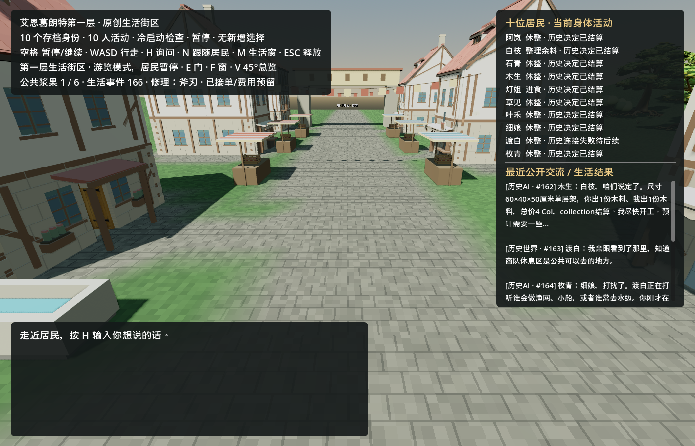
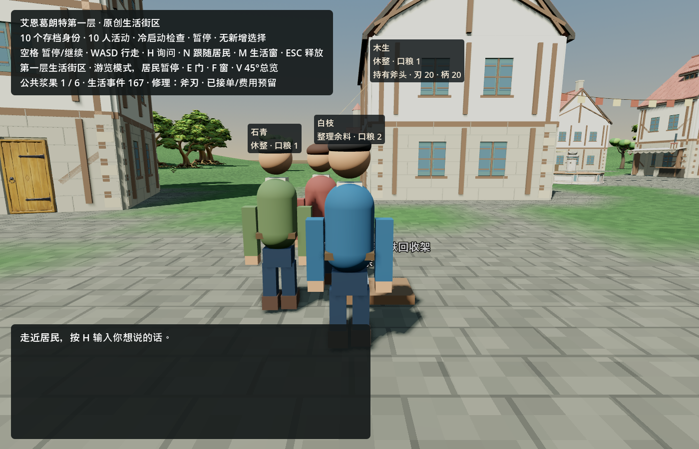
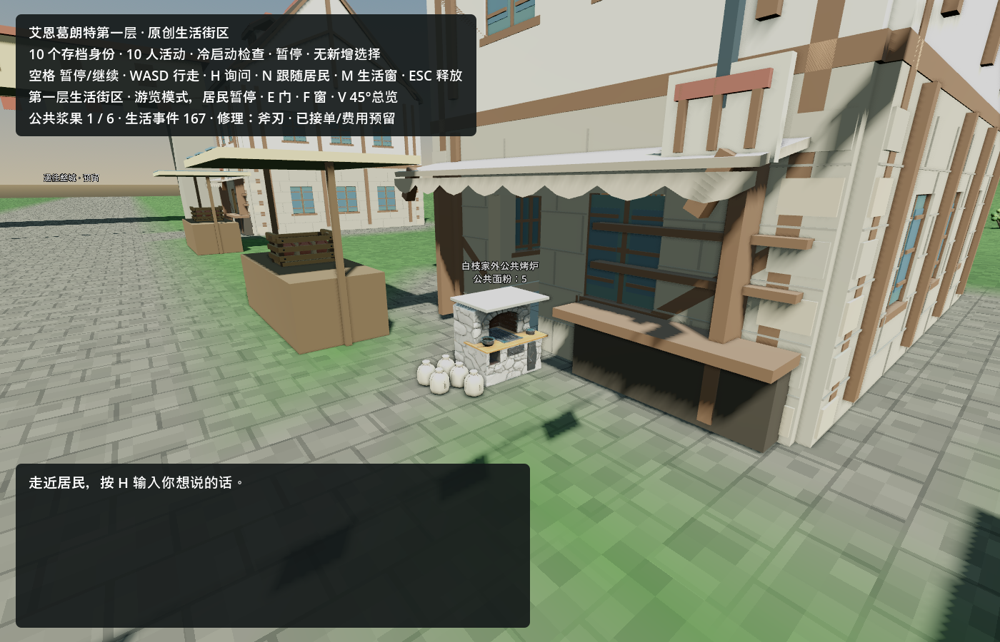
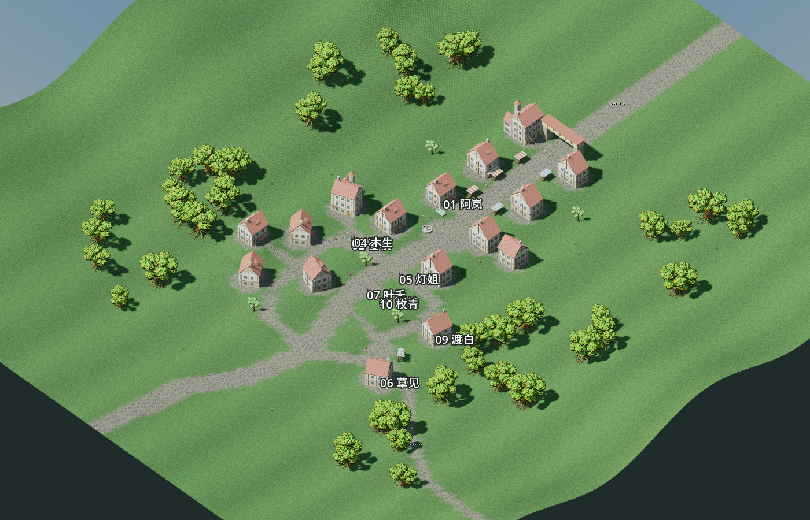

# 2026-09-18 十人生活现场首轮交付

## 已接入的真实入口

`StartLiving.cmd` 现在明确把用户带入 `res://scenes/town_street.tscn`，不再需要记住 `Run-Street.ps1 -Town`，也不会误入项目默认的单居民 `street_trial.tscn` 或 `StartDemo.cmd` 的暂停美术预览。

无付费本地观察必须使用原档的**副本**，并显式给 `-ObserveOnly`。此模式以 `--town-restore` 打开十个身体，模型暂停、不会接纳新决定；不应把研究原档直接传给它：

```powershell
.\StartLiving.cmd `
  -ObserveOnly `
  -Godot D:\lucidgloves\InfiniteAincrad\tmp\toolchain\Godot_v4.7.2-stable_mono_win64\Godot_v4.7.2-stable_mono_win64.exe `
  -SkipBuild `
  -SavePath D:\path\to\disposable-world-copy.json
```

该命令是暂停模型的身体观察，不应被描述为 AI 自主生活。真实模型共同世界由同一个入口接受账本、授权配置、存档和输出目录，再调用已有的有界启动器建立 loopback gateway、预算授权和退出排空。它不带 `--headless`，现场窗口可见：

```powershell
.\StartLiving.cmd `
  -Godot D:\lucidgloves\InfiniteAincrad\tmp\toolchain\Godot_v4.7.2-stable_mono_win64\Godot_v4.7.2-stable_mono_win64.exe `
  -SkipBuild `
  -SavePath D:\lucidgloves\InfiniteAincrad\tmp\overnight-20260918\delivery\private\night-delivery\delivery-live\world.json `
  -Ledger D:\path\to\existing-ledger.json `
  -Config D:\path\to\authorized-config.json `
  -Out D:\lucidgloves\InfiniteAincrad\tmp\overnight-20260918\delivery\private\night-delivery\live-run-01 `
  -Seconds 300 -MaxRequests 12 -Concurrency 1 `
  -GmExport D:\lucidgloves\InfiniteAincrad\tmp\overnight-20260918\delivery\private\night-delivery\live-run-01\gm\world.json
```

这条真实路径的关键场景参数仍是 `res://scenes/town_street.tscn -- --town-save=<same-world> --town-gateway`。`Ledger / Config / Out` 缺任意一项都会报错且什么也不启动；也不会暗中退回脚本生活。既没有完整 live 三件套、也没有显式 `-ObserveOnly` 时同样拒绝启动。本次首轮验证产生 0 个模型调用。

## 玩家实际能看到什么

右侧新增一个只读生活窗口：

- 十位居民全部具名列出，逐人显示当前世界工作；身体有水平速度时显示“行走中”。
- gateway／恢复模式显示每个人自己的 durable resident-turn 状态，并用启动时的 request id 区分“历史决定”和“本次决定”，不把一个公共模型状态冒充十个人。
- 最近五条公开交流或生活结果来自 `life.events`；只有 `source=opengameagent_live` 才标为 AI，并按启动时的 life seq 明示“历史 AI”或“本次 AI”。界面不生成文本、不选择动作、不展示私有理由。
- 原有近身姓名牌、真实身体动画、公开对话框、玩家 `H` 询问、门窗和俯瞰仍在同一个世界中。`N` 依次跟随十位真实身体，`M` 收起／展开生活窗；观察相机只读身体坐标，不移动居民、玩家或工作目标。
- HUD 将场景如实标为“艾恩葛朗特第一层 · 原创生活街区”，不把这组原创 16 栋布局冒充原著“起始之城”或托尔巴纳的精确地图。





## 烘焙视觉接入

公共烤炉、有限面粉袋和居民手中面包已换成可复用 prefab；烤炉仍使用原有同尺寸实体碰撞，面粉袋数量只投影 `flour_remaining`，黑褐圆面包只在守恒账本 `held > 0` 时显示。视觉节点不能生成面粉、食物、技能、钱币或行为。

下面近景来自原研究存档的**可丢弃副本**：只为构图验证，由 `development_gm:overnight-baking-visual-only` 引用原存档公开求助 seq155 安装 5 份有限面粉；源档 SHA-256 在前后保持 `5d4d848dc4048ec588c872b72a3511bfe23c796b31c3eca22aa315bc1cb719b6`。这张图不代表烤炉已被正式采纳进共同世界。



## 实机验证

验证只读取原研究世界后复制到隔离路径；源档及冷读副本 SHA-256 都是 `5d4d848dc4048ec588c872b72a3511bfe23c796b31c3eca22aa315bc1cb719b6`，世界仍为 seq166。

- 冷读十身体物理检查：58 项通过、0 失败；10 个 `CharacterBody3D`、10 个不同 RID、10 个启用胶囊、0 个超过 1 cm 的穿模，存档字节不变。原始结果见 [ten-body-cold-evidence.json](night-20260918-sol-life/ten-body-cold-evidence.json)。
- 未暂停物理检查：10 人全部落地、0 穿模；旅店老板保留的真实 pending `eat_ration` 在 45 个物理帧内移动 0.848 米。旧探针仍要求每人距存档起点小于 0.75 米，因此该轮 67 项中 66 项通过，唯一失败正是这次真实移动，不把它伪称全绿。原始结果见 [ten-body-motion-evidence.json](night-20260918-sol-life/ten-body-motion-evidence.json)。
- 16 栋生活街区检查：10 个居民、16 组门窗实体、40/40 条住所到公共地点路线可达、10/10 个采集工作点有空间、导航状态 `ready`。原始结果见 [living-quarter-report.json](night-20260918-sol-life/living-quarter-report.json)。
- `town_dialogue_ui_acceptance.gd`：14 项通过，确认玩家输入仍走权威事件路径且界面不发明回复。
- `town_merge_acceptance.gd`：200 项通过、0 失败，其中姓名牌／HUD 布局 145 项通过；1000×700 逻辑视口压力检查仍有可见姓名牌且不挡原 HUD。
- `town_baking_route_acceptance.gd`：53 项通过、0 失败，确认安装归因、有限面粉、账本守恒、独立知识和冷启动连续性。
- `town_baking_physics_acceptance.gd`：66 项通过、0 失败；居民胶囊不能穿过实体烤炉，工作围裙最近距目标 0.075 米、最小碰撞余量 0.525 米，真实遮挡会阻断观察；0 个模型调用。
- C# 构建：0 警告、0 错误。



引擎仍报告既有的 NavigationServer3D deprecated、agent radius voxel rounding 和 4 个 edge merge warning；它们没有阻止本轮 40/40 路线与碰撞检查，但不能写成“日志无警告”。

## 场景关系与限制

`demo_town.gd` 与真实生活不是两套模拟：它继承 `pcg/town.gd → living_town.gd → town_street.gd`，只是把正式 `living_quarter` 换成较重的 PCG `DemoQuarter`。本轮入口选择正式 `town_street.tscn`，因为 seq166 存档已经声明 `first-floor-market-quarter-v1`，可直接得到 16 栋住所、室内碰撞、门窗和十个真实身体；无需把静止美术预览冒充生活交付。

本轮没有执行新的付费居民决定，也没有证明治疗师已经回应 seq166 的求助、面包师已正式采用烤炉或十位 GM 已持续接力。公开生活窗口只是把这些真实缺口与已有成果放进可观察世界；后续 live run 和 GM 维护必须由协调任务在共同存档上继续。
