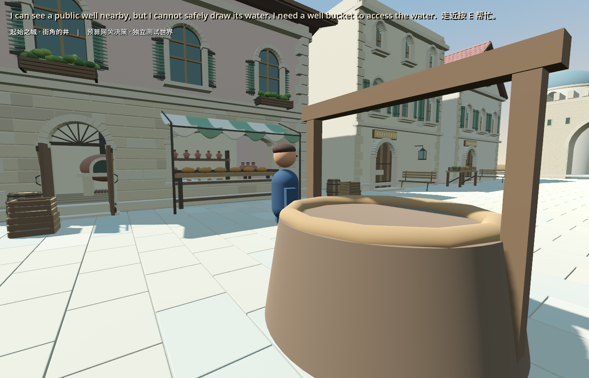

# 真实 Kimi 选择与同档恢复

2026-09-10。Kimi K2.6 已在 Godot 街道中作出一次选择，世界接受并保存。第二个引擎进程恢复同一文件，需求保留，没有追加决策或消耗井水。

测试居民走到井边后，模型选择 `wait`，并提出 `well_bucket` 需求。理由译文：“我能看见附近的公共水井，但无法安全取水；我需要一个水桶。”原始英文保存在截图和测试存档。需求仍为 open，井水仍为1；本轮没有安装、取水或饮水。

## 实测

- 真实请求1次：输入202、输出68、总计270 token。缓存未报告，按0计；推理属于输出子集，不另外相加。
- 网关按usage记录 CNY 0.003149，预约至结算约2.59秒。费率核对了[K2.6官方价格](https://platform.kimi.com/docs/pricing/chat-k26)；此处是usage计费记录，不声称取得最终账单。
- 用户对“最多1次、2元独立验证额度”的问题回答“随便调用kimi”，按该范围执行。旧城市账本及guard哈希不变。旧夜间账本和跨机器未核实费用仍未解决，没有被清零，也没有根据账户余额重建项目余额。
- 首次图形运行10项检查通过；独立进程恢复14项检查通过。恢复时网关已停止，决策数0，世界文件和调用计数文件逐字节不变。
- Godot PID 48252、101356正常退出；网关和本轮辅助进程结束。没有后台循环，没有上传密钥、费用数据库或私有运行配置。

[脱敏证据](real_kimi_choice_2026-09-10/evidence.json)。私有原始记录位于 `C:\InfiniteAincrad\tmp\real-choice-preflight-20260910\authorized-one-call`，不加入Git。

## 方向判断

真实模型经过OpenGameAgent与世界校验产生持久需求，这是本轮可确认的进展。但世界仍是单居民fixture，观察是程序提供的文字，没有摄像头图片；初始状态只能等待，水桶能力也在提示词中明确举例。因此这不是自由发散、视觉理解或自主造功能的证据。此前离线GM安装/使用测试也不能冒充本轮Kimi完成了闭环。

下一轮只继续这条已保存的需求：一次玩家介入后，让居民选择使用或拒绝，再验证后果和恢复。暂不扩居民数或增加AI框架。
