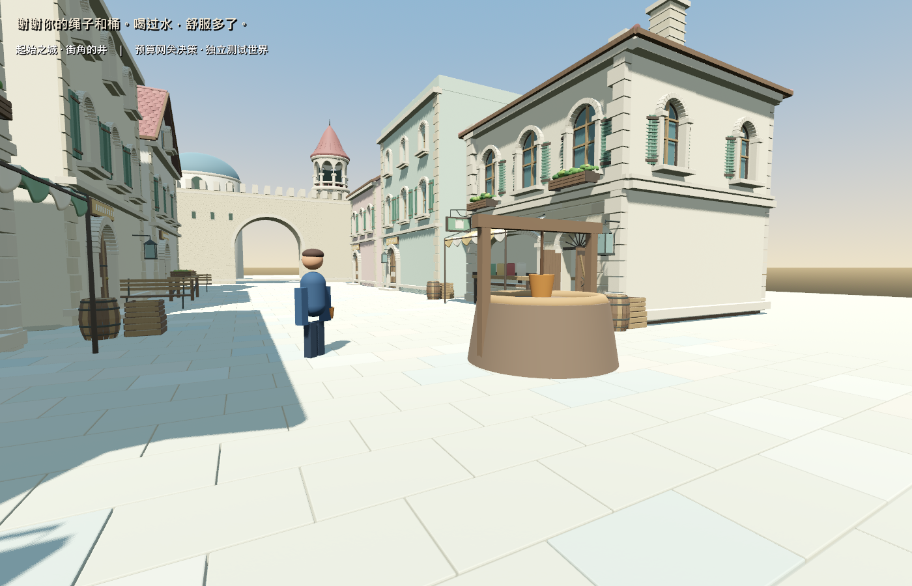

# 同一条真实需求：帮助、取水、饮水、恢复

2026-09-10。继续上一轮 `fixture:luna` 的同一份存档，没有重建人物、需求或经历。自动测试走到井边，触发游戏现有玩家帮助入口；GM审核并安装已编写的水桶插件，消耗测试世界库存的一根绳和一个桶。此处还没有独立的玩家物品栏交易。

Kimi第一步可选 `wait / draw_water`，选择取水，理由是已看见可用水桶且口渴值为80。第二步可选 `wait / drink_water`；请求里包含刚形成的 `drew_water` 经历。它选择饮水，并在理由中提到自己上一轮成功取水。世界记录了一次真实取水和一次饮水，口渴值降为20。

画面中的感谢台词为预设UI文案；真实模型决策理由保存在脱敏证据中。人物仍为临时几何模型。

## 验收与费用

- 同一存档的身份、原事件和动作前缀保留。井水0、持水0、饮用1，资源守恒。
- 独立Godot进程恢复通过；事实与调用计数文件逐字节不变，决策检查为0，无追加调用或重复消费。
- 本轮真实请求2次，分别约2.28秒、2.25秒。输入883 token（其中缓存256），输出120，总计1,003；推理不重复计入。实际usage记费 CNY 0.0075971。
- 上轮验证已花 CNY 0.003149 作为借记结转到本轮账本，验证累计 CNY 0.0107461，仍在原2元验证额度内。旧账本及guard未修改。旧主世界未核实费用仍未解决，并未清零。此次继续授权只执行了最多两次事件决策，无付费常驻循环。
- 三种本地延迟HTTP分支及各自冷恢复通过：饮水、安装后等待、持水后等待。后两者至少稳定等待3秒；饮水回复刻意延迟2.5秒，验证不会被原1.1秒动画计时提前宣告完成。它们都是mock，不计为真实Kimi行为或费用。
- 核心规则验收通过，增加了空井/禁用水桶不应继续出现在模型合法动作列表的检查。全部引擎和网关退出，Luna已关闭。

[脱敏证据](real_kimi_use_2026-09-10/evidence.json)。原始私有运行记录：`C:\InfiniteAincrad\tmp\live-use-20260910`；继续使用的原测试存档：`C:\InfiniteAincrad\tmp\real-choice-preflight-20260910\authorized-one-call\world.json`。私有记录不进入Git。

## 实现和方向复盘

Luna修改 `game/spatial/street_trial.gd`，增加 `model-assisted`、`resume-stable` 验收模式，并让完成饮水依赖真实消费事实。主代理复核并修复持水等待恢复和续接验收遗漏，修改 `game/core/world_kernel.gd` 与对应核心测试，让模型不再获得空井或停用能力的不可执行动作。

这轮证明了需求可接续、行动有后果、下一次模型输入包含新经历。仍不是三人社会、摄像头观察、自由造功能或原世界迁移。Luna的240k检查点未能及时止住在途执行，最终571,833 raw；已关闭。最近统计写在证据，缓存是输入子集，Codex真实费用未知。此次不再扩任务。

下一步应让第二名居民通过亲眼观察或收到消息认识改变后的井，再做自主选择；不能直接共享第一人的记忆。先处理明确的身份来源和知识边界，不扩大地图或添加新AI框架。
