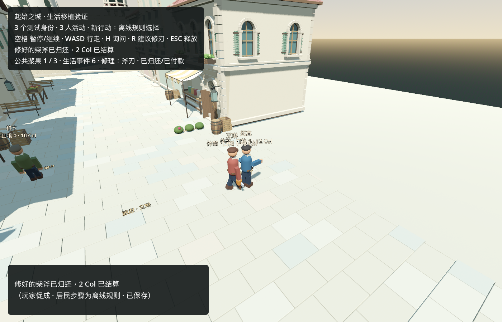

# Godot repair/work settlement — internal fixture validation

Verified locally on 2026-09-11 (Asia/Shanghai) with Godot `4.7.2.stable.mono.official.ed1daf0bf` and .NET SDK 8.0.401. This is a three-resident offline fixture, not a replay of the private 13-identity town and not a model decision.

The repair rules were checked against `HearthAincradLife.cpp` at the documented source commit `66ba98916b266dea0014a2d06b870c6d154acdf3`. The Godot port keeps the bounded edge-repair sequence:

1. The axe owner proposes a 2 Col edge repair to the resident with `metal_repair`.
2. Acceptance requires the worker at their registered station, one iron, and sufficient owner balance. Two Col move into an explicit reserve; they are not paid yet.
3. Delivery requires the owner and worker to be at the worker station and within the source rule's handoff distance. Custody, not ownership, moves to the worker.
4. Work takes 60 live seconds, survives a mid-action cold load, consumes exactly one iron, and changes the edge from 20 to 100 only on completion.
5. Collection again requires both residents at the station. Custody returns to the owner and the reserved 2 Col are paid to the worker exactly once.

The town scene now exposes this as a player intervention: approach the axe owner and press **R**. Movement, the carried axe, repair gesture, condition, custody, reserve and payment are derived from persisted state. The initiating fixture input and every resident step are labelled separately; all resident steps in this validation use `local_rule_policy` and paid calls are zero.

## Verification

- New `town_repair_acceptance.gd`: 30/30 checks, including invalid price, command conflict, station/range rejection, reserve conservation, custody, split-duration work, mid-work cold load, material use, one-time settlement, private knowledge and terminal cold restore.
- Existing Godot suites: core, decision boundary, resident knowledge, OpenGameAgent fixture, street resume, town life, town social and town visitor all pass.
- Python migration tests: 6/6. The continuation verifier now accounts for repair item changes, material consumption, custody and reserved/paid Col while requiring all unported fields and source contracts to stay exact.
- C# solution: 0 warnings, 0 errors.
- Rendered Metal run: all seven repair evidence checks pass. A separate rendered cold start left the completed save byte-for-byte unchanged at SHA-256 `feee9b388857cb5b82e36bac1f194b32b658e80fa76af4885c78ebf2577d7397`.

[Machine-readable fixture evidence](repair_work_2026-09-11/evidence.json)

## Limits and direction review

This visible result adds a real player-caused consequence, timed resident work, finite material consumption, custody and conserved payment to the same Godot town state. It does not prove that the private sequence-37 source currently contains a legal unfinished edge repair; that private transfer bundle is not present on this computer. It also does not port handle repair, tool use, material exchange, sustainable food production, a live model choice or final character art.

The supported gain is the end-to-end repair/delivery/payment boundary plus cold continuity. The remaining first-version gap is an accounted labor/food loop for 5–10 active residents. The next bounded step is to validate this port against a separate private source copy when available; without that state, continue the documented handle/tool/material path on an explicit fixture and do not invent new wood or food.

