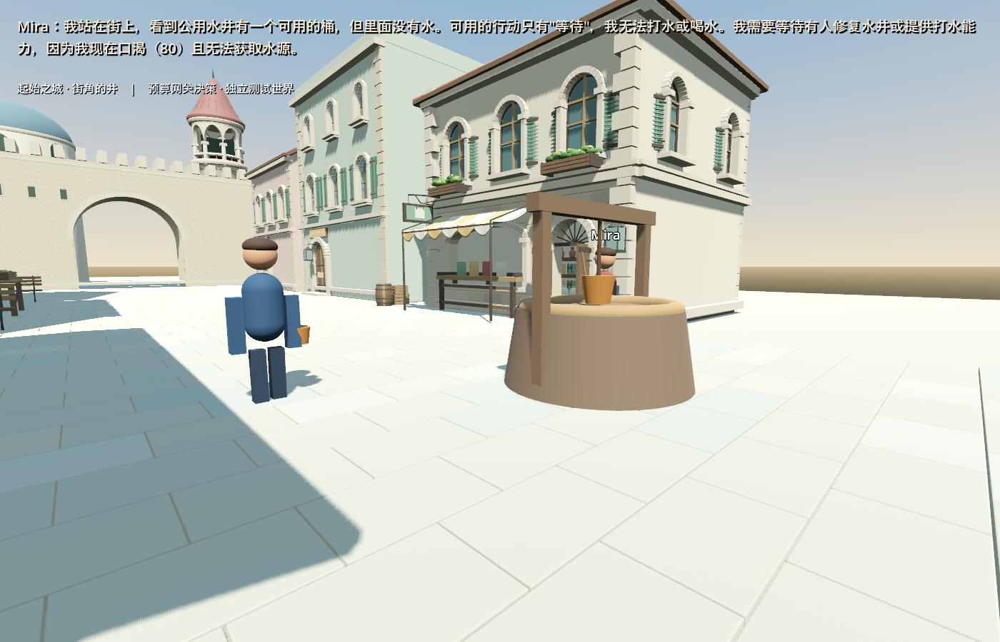

# 第二名居民：自己观察、真实选择、同档恢复

2026-09-10。继续原测试存档，明确加入第二名临时测试居民 Mira。她初始只知道自己在街上，走到离井约1.79米处，宿主才把本人观察写入状态。输入只有她本人的身份、需要、观察、经历和合法动作，没有复制 Luna 的历史。

Kimi实际回答：井有可用的桶但没有水，因口渴且无法取水而等待。它没有返回结构化 `need`，所以程序没有把这段理由擅自变成GM需求。也没有凭空增加水、重复申请桶或改变 Luna 的状态。

## 验证

21项知识断言、原核心验收、模拟观察/恢复和真实观察/恢复通过。测试验证了未知身份拒绝、观察去重、本人行动隔离、设施不自动变成他人知识，以及观察到有水的可用井后允许合法取水。读取JSON会把整数转换为浮点数，测试按序列化契约比较，未更改世界事实来配合断言。测试入口错误和先前失败记录保留。

真实运行只调用1次，274输入+60输出=334 token，usage记费0.003401元。累计验证花费0.0141471元，结转原费用且不重置2元额度；旧主世界未核实费用仍未解决。恢复期间网关关闭，世界和请求计数文件逐字节不变，第一名居民全数据不变。所有自有进程及Luna已关闭。

[脱敏证据](resident_knowledge_2026-09-10/evidence.json)。私有完整证据：`C:\InfiniteAincrad\tmp\continuous-20260910`。原有存档路径和最新账本由该目录的progress.json持续记录，不上传。

## 改动与下一步

Luna增加同一内核中的可选居民ID、Mira显式加入、自身观察和保存校验。主代理增加可选场景组件 `game/spatial/visitor_encounter.gd`，到达后才观察并调用模型，补齐可执行测试及观察匹配。模型提示词移除了直接暗示水桶的例子，允许等待，也允许提出缺失能力而不自动兑现。

目前的最大不足是合法行动过少：Mira还不能向附近的人询问或求助。下一项只补来源可追踪的交流和可拒绝回应，不扩地图。文字观察不等于NPC摄像头理解，两个人仍为fixture身份，不冒充原世界迁移。

用户已授权持续迭代；小时心跳沿用同一累计开发预算，正常推进无需每轮询问。达到范围、期限、预算或语义阻断才暂停，详见ROADMAP和STATUS。
