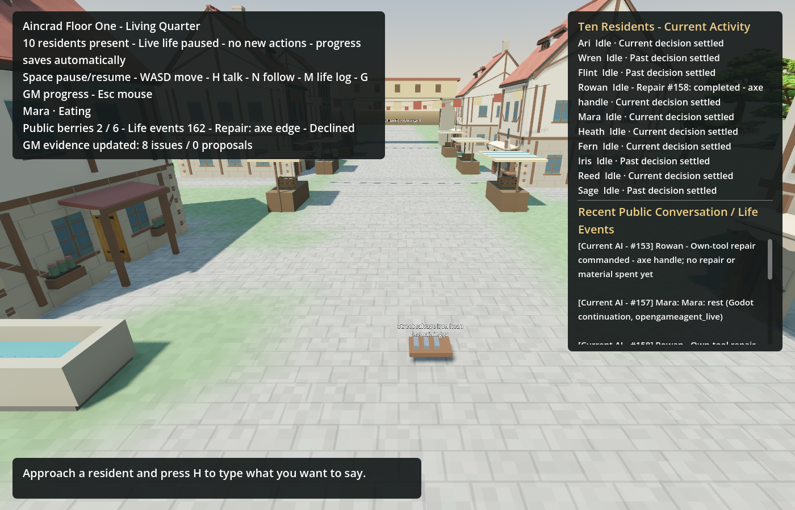

# H117 — Material handoff and a physical production chain

Continued on `codex/continuation-20260918-self-repair` from H116. Three user-requested Sol engineering agents worked in isolated trees; the coordinating agent reviewed, integrated and ran the only canonical world writer. The original main checkout, unrelated assets and older world lineages remain separate. This is host-directed engineering, not autonomous GM invention.

## Result and boundaries

The new `inventory.give_material` capability completes the missing local handoff between a collector and a craftsperson. It moves one available wood or iron unit in person, atomically and with a durable non-speech receipt. It grants no payment, debt, skill or contract and does not disclose the recipient's inventory. The registry now contains 36 capabilities. The Life panel distinguishes actual handoff and repair outcomes from speech and pending work.

The complete controlled test starts from the exact published seq148, with original positions and inventories. Ari reads the real sign and explicitly tells Wren; Wren walks 44.73 metres to collect one finite iron, with an exact mid-trip cold restart. Wren then carries it to Flint and gifts it. Rowan repairs his own handle using his original wood, negotiates an existing edge-repair contract, hands over the same axe, and pays two Col when collecting it. Flint's 60-second repair resumes after a second exact cold scene restart. Wren gifts her original wood to Rowan, who physically returns to his own work point and consumes it to produce one kindling.

The final copy is seq169: source iron stock 3→2, recovered iron 1, Flint's gifted iron consumed, Rowan's original wood consumed by handle repair, Wren's wood consumed in production, both axe parts 100, same owner and custody, and one kindling. Post-collection travel is 46.98 metres for Wren and 62.91 metres for Rowan. Maximum measured speed is 1.35 m/s and maximum sampled step is approximately 0.09 m. Sixty chain assertions pass, including the complete final cold restore. All choices in this paragraph are explicitly scripted test choices, not natural model adoption.

This remains an Aincrad-compatible original prototype: ordinary personal knowledge, finite salvage, physical exchange and labor. Names, town layout, prices, times and thresholds are project choices, not claims of exact novel geography or formulas. No modern object, cross-floor location or setting-incompatible power was added.

## Actual failures and fixes

The first full chain failed at Rowan's approach to Flint's doorway. A valid navmesh path could keep circling at the final contact point. The second chain reached completed repair and payment but exposed the same problem at Rowan's own tool-work point, accumulating 869.49 metres of looping before the controlled bound expired. Both failed copies and receipts are retained privately; neither changed the canonical world.

The final fix retains A* for the long route and permits a capsule-swept local route within four metres only for `approach`, `use_tool` and `eat_ration`. A zero result retains the existing navigation direction. It does not teleport, remove colliders, widen arrival/handoff gates, alter speed, move the target, waive resource requirements or shorten work. A replay of the first failed copy completed a new approach in 2.73 world seconds. A replay of the second resumed the existing pending tool command, arrived in 1.47 seconds and completed its original work in 61.40 seconds total. The full chain then passed from the unchanged seq148 source.

The existing four overlapping navigation edges remain as warnings. They are not the claimed fix. A separate source-subset bake diagnosis is recorded as future work; no global precision or warning setting was changed.

## Offline verification

| Scope | Passed checks |
| --- | ---: |
| Material handoff and actual resident-turn boundary | 61 |
| Common capability contracts | 168 |
| Food handoff regression | 12 |
| Own-property repair | 114 |
| Material-route sharing | 50 |
| Life presentation | 19 |
| Crowded real-controller menus | 1,712 |
| Bounded physical steering | 5 |
| Failed social-route replay | 18 |
| Failed tool-route replay | 23 |
| Complete physical resource chain | 60 |
| One-time first self-repair offer | 42 |
| Failed home-meal replay | 40 |
| **Godot total** | **2,324** |

The root also passed 27 Python tests: nine design-contract, 15 actor-usage and three GM pre-dispatch checks. Crowded menu input retained all 113 offered options within the unchanged limit (15,272 UTF-16 units in the measured worst case). The actual Forward+ Life-panel render was inspected, with an unchanged read-only fixture save. These checks used no paid models. Initial isolated-agent runs with unavailable LFS dependencies are not counted as clean imported-engine validation; the root ran the listed suites in the imported delivery tree. [Check counts](resource-chain-2026-09-19/checks.json), [physical-chain receipt](resource-chain-2026-09-19/physical-chain.json) and [home-meal receipt](resource-chain-2026-09-19/home-meals.json) retain the measured results.

The original 30-minute idle interval could postpone Rowan's first chance to use self-repair by 1,734 world seconds. A narrow first-offer check now permits an otherwise eligible, idle, settled resident to reconsider once when an actually available self-repair option was absent from its valid previous menu. It does not change the due time or choose an action. The ordinary next choice, including wait, records the new menu and acknowledges the offer. Missing old menus, active jobs and existing admission/review gates do not qualify.

Reproduction: `town_resource_chain_scene_acceptance.gd` requires `--source=<immutable seq148> --town-save=<new disposable path> --out=<result JSON>`. It refuses an existing destination. `town_social_failed_world_replay.gd` and `town_tool_use_failed_world_replay.gd` require copies of the preserved seq165 and seq168 failures respectively; they are regression reproducers, not general world launchers.

## Live continuation

The user explicitly authorized ordinary project use of the supplied API keys without repeated spending questions. A reviewed supplemental scope carries all available older liability plus the published missing-ledger subtotal conservatively; this possible-overlap hold is not a claim of exact spending. No older ledger or guard was altered, no unknown operation retried and no recharge requested. Canonical world history and world-scoped developer usage continue from seq148 and 144 recorded calls.

The first same-world episode ran for 600 seconds and saved seq151 with all 136 lifetime reply/archive records. It made three settled Kimi calls, costing **CNY 0.0646632**, with zero new uncertain/reserved provider rows and a completely drained gateway. It failed overall validation because Ari and Mara's newly learned route knowledge exposed a real wire bug: `last_observed_stock: null` was rejected before the gateway journal and HTTP request. Their two absent provider operations are explicitly recorded as `not_sent`; no old fee or unknown call was reclassified.

The C# projection now allows null only for `material_sources.last_observed_stock`. A real compiled loopback verified that unknown stock reaches HTTP unchanged; an adjacent invalid null is still rejected before any HTTP request. The root build had zero warnings/errors; both focused root wire cases pass, and the worker's complete 29-case offline matrix passes. The two proven local failures were reviewed through the existing recovery command, advancing their controllers to epoch 1 while preserving all old replies, reasons, failures and review history. The recovered seq151 checkpoint is distinct from the episode's original immutable seq151.

The actual first episode also distinguishes physical failure from resource scarcity. Iris moved 20.30 metres and reached the forage point, but the newly requested harvest encountered stock zero and correctly produced nothing. The first regrowth came 24.08 seconds later. Heath and Reed moved 37.07 and 22.78 metres but remained 1.77 and 2.30 metres from home with their accepted eating jobs unfinished. Other seven endpoints were unchanged. Across 599.85 world seconds, held food was 13→12, public stock 0→2, total satiety 709→699 and energy 613→563. This sample does not establish sustainable life or ten newly moving residents.

The stale GM usage-book pointer was migrated under the existing state lock after exact same-world actors/calls/revisions verification. The audit preserves the absent old path, new path, hashes and actual counts (20 actors, 149 calls, 265 revisions). World, SQLite and portable usage snapshot hashes stayed unchanged during rebind, as did every saved GM session and unknown receipt. GM observe/code/feedback now validate the book before recording an in-flight intent. The root ran 15 actor-usage tests and three focused pre-dispatch refusal tests; the worker ran the complete 72-test pair. Native GM conversations are still missing here. Explicit new session epochs and old unknown-task no-repeat handling remain required before ten-GM continuation; no new GM provider call was made in this phase.

The seq151 home replay resumed Heath and Reed's exact accepted eating commands. They arrived after 1.067 and 1.467 seconds, walked 1.62 and 2.16 metres, and finished after 31.00 and 31.53 seconds. Each consumed one ration and gained satiety; the other eight bodies remained stationary. All 40 checks passed before the canonical follow-up.

The second real episode ran 300 seconds and saved **seq162**, with eight new settled Kimi calls costing **CNY 0.1726452**. Rowan voluntarily selected `turn:shared:carpenter:0:27`; the authoritative `self_repair_completed` event at seq158 consumed his original wood and raised the same axe's handle from 20 to 100. Its edge remained 20, with ownership and custody unchanged. Ari and Fern exchanged actual delivered speech. Heath and Reed completed their previously accepted meals, followed by new rest decisions. Mara rested and ate; Ari also ate. This is real model adoption of self-repair, not a replayed fixture choice.

Together the episodes made **11 paid calls, CNY 0.2373084**, plus the two retained `not_sent` attempts. Seven distinct residents made new measured decisions; all ten identities and prior histories remain present. The final archive contains 144 attempt records (142 measured lifetime NPC replies and two local failures), and the world usage book contains 157 calls across the same 20 identities. Every original call and the complete original revision prefix remain unchanged. The gateways drained, no new provider operation is unresolved, and all owned process members exited. The original GM unknowns remain unknown. [Live summary](resource-chain-2026-09-19/live-summary.json) and [resident decisions](../../worlds/restart-20260918-01/observations/iteration-20260919/report.zh-CN.md) distinguish new choices, accepted work and completed events.

The final immutable checkpoint is `seq000162-ac14a883804ba1ca.world.json`, SHA-256 `ac14a883804ba1ca94b5256ee9e7a1f0bd381fd87bf6f7674a2a5b0a06384b60`. A separate production cold restore verified all nested fields and ten identities exactly. Earlier seq148 and both seq151 checkpoints remain available. The local `OpenLatestWorld.cmd` entry opens this saved world for observation; live spending is managed through bounded coordinator runs, not by that viewer.

The visible Forward+ capture below is from the real episode after new decisions were paused for shutdown. The renderer logged five `particles is null` errors and one `multimesh is null` error; no script error occurred, subsequent frames and the final save completed, and every process exited zero. Similar messages exist in older evidence, but their trigger and root cause are not established. Passing life validation does not certify renderer stability. The four overlapping navigation edges also remain. Neither warnings nor graphics settings were suppressed.

The active 15-minute heartbeat continues bounded engineering work under the user's spending authorization. Immediate work is audited new GM session epochs and a durable no-repeat rule for the old GM06 unknown task, then failure feedback and resource continuity. Natural iron discovery, gifts, negotiated production, all-ten continued participation, ten-GM unattended operation and long-term sustainability remain unproven. No claim of infinite expansion or exact Aincrad geography is made.
