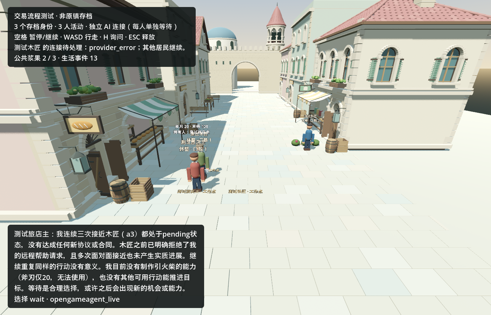

# 同档真实生活续接：本批未通过完整生活链

2026-09-11。继续 Godot 街道的三个**虚构测试身份**；没有恢复缺失的原镇主档，也没有新建世界、居民、美术或平台。

## 真实结果

同一 `fixture:town-trade-validation`，事件 **6 → 13**。一次明确标记的脚本玩家询问触发交流；真实 Kimi 回应玩家、向木匠求助，木匠拒绝。旅店主随后三次接近木匠，最后自愿等待。没有新修理合同、交付、支付或柴火产出。旧斧柄修理及 2 Col 支付保留，斧刃仍为 20；铁匠没有收到这次请求，未制造新选择。

本批 **10 次真实请求**全部结算，达到停止条件。最后一个木匠请求未进入上游账本，控制器仍记录 `provider_error / brain_run_failed`，没有改成自愿等待。完整生活链验证保持失败。

独立图形冷启动保留三个身份、全部事件、旧合同和错误。世界、费用库、guard、请求 journal 四项均字节相同，新增调用为零。

## 修复和验证

实测发现 OGA 重复累计每轮完整观察：存档已提供个人记忆，provider 也只发送最新观察，但 OGA 先检查累计聊天记录。相同个人输入离线复现为前两次成功、第三次报 `The estimated model request exceeds the context window and no transcript compactor is configured.`，发生在付费发送前。

修复只把 OGA 临时聊天记录限定为一次决策。人物 ID、世界 timeline、存档故事与完整经历不变，每次仍提供受限的个人记忆；没有扩大上下文或收费额度。相同输入修复后四次通过，新增回归十二次通过，第十三次仍受请求上限约束。错误只映射已核实的固定码，不泄露任意接口文本。

第一次失败原档另存。监督者通过现有控制器更换接口审阅本地故障，原失败留在 reviews，确认生活事实、人物、位置和历史未变，然后仅使用本批剩余六次请求继续。未再发玩家询问或重抽拒绝。

Luna 完成收费并发配置和指定居民询问入口；监督者修正其 GDScript 类型与 JSON 数值比较错误，加入有界验证的闲置结束条件并修复上下文。原账本并发为 1，居民物理行动继续；默认游戏不使用验证退出条件。

验证通过：turns **29/29**、online **63/63**、场景解析、网关十个用例（含十二次连续决策、额度拒绝、未知请求不可重试）。首次场景解析失败和修复前回放均保留。工人的工程交付不等于独立运行终审；最终运行由监督者检查。一名 Luna 已关闭。

## 方向裁定

**有效进展：**真实拒绝、个人经历和跨重启后果能进入同一 Godot 世界。

**关键反例：**连续调用模型不等于会生活。旅店主将历史中的 `pending` 回执理解成尚未到达，三次重复接近；接近事件又促使木匠重复付费等待。完整自主履约仍未通过，不能据此扩人口或推进远程平台。

下一批只修本人可观察的行动结果反馈，以及重复/无变化接近触发的无效思考。先离线证明到达结果可见、拒绝保留、没有新事实不产生收费事件，再做一次有界真实验证。不得指定 NPC 成交，不得透露未观察的铁匠位置。本批结束，不自动追加。

## 用量和证据

- Kimi 新增 **CNY 0.3331213**，账本估算而非账户扣款回执。累计 settled 0.5049046，加既有未核实 0.0141471，总负债 0.5190517；沿用 CNY 2 验证授权，剩余 1.4809483，无未决预留。没有重建余额或清零旧主世界未知费用。
- 开发计量快照：input **5,058,688**（cached 子集 **4,768,768**），output **37,114**，总计 **5,095,802 raw**。包括主代理与工人选定窗口，排除初始读取和报告尾部；不是完整账单，缓存不重复相加。
- **控量失败：**超过本批 160 万检查线。新增 `record_agent_usage.py --limit-raw --reserve-raw` 会以退出码 3 拒绝检查过的派发，但不是模型传输层硬限制，未阻止监督者后续验证/修错消耗。不能称已彻底解决。
- 私有原档：`C:/InfiniteAincrad/tmp/town-contracts-20260911/live/world.json`；原账本：上级目录的 `live-ledger/continuation.sqlite3` 及 guard。不可提交它们或本地 API 配置。
- 本批私有证据：`C:/InfiniteAincrad/tmp/life-continuation-20260911/`。初始 world SHA256 `370ffeacf9b437ad2dd4419eb34fc053a5273ba47ee83495ff5c0f42c2cb16b4`；结束 `093e3c4a237323f8ad3f497bc62053c3a26dc36c35defc2dcadbc12c1f66ae13`。
- 无付费回归：`python tools/validate_gateway_adapter.py --godot <Godot.exe> --out <新的私有目录>`。冷启动用 `tools/run_godot.py` 运行 `town_street.tscn -- --town-save=<原私有档> --town-restore --town-capture=<新私有目录> --town-duration=3`，不启用 gateway。

本批自有引擎、网关 helper 和工人均结束。未提交或推送 Git。
