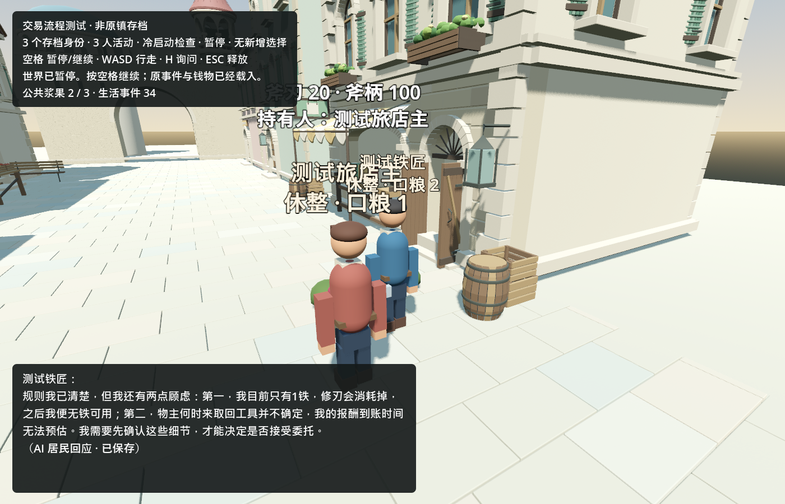

# 同一个世界持续迭代：真实拒绝、沟通与新需求

2026-09-11，持续更新。唯一进度图在 [ROADMAP](../../ROADMAP.md)，本页只记录证据。当前是明确标记的三人测试世界 `fixture:town-trade-validation`；原镇seq37/44完整私有存档仍缺失。

## 真实生活结果

同档事件16→47，38次真实Kimi。木匠恢复响应后仍可拒绝；旅店主获得**脚本化玩家线索**后实际走向铁匠，先后提出2、5、8 Col报价，全部遭拒。旧斧柄交易、钱包、产权和经历保留。后续从这个拒绝继续，实际完成修刃、完工付款、取回和两次工具使用。过程需要多次标记玩家澄清，不能宣称完全无提示自主规划。

最初有误读规则的部分。补全可见条款、分开私人理由和公开发言，并通过有标记的玩家交流澄清后，Kimi铁匠在事件33实际说：

> 规则我已清楚，但我还有两点顾虑：第一，我目前只有1铁，修刃会消耗掉，之后我便无铁可用；第二，物主何时来取回工具并不确定，我的报酬到账时间无法预估。我需要先确认这些细节，才能决定是否接受委托。

这段话只发给玩家，其他居民不会自动知道。模型能够依据新信息修正旧推测，并提出有事实依据的顾虑；不证明独立发现铁匠的渠道完善。没有删除错误记忆或付费重抽到成交。

## 修复及检查

| 问题 | 实现和证据 | 限制 |
|---|---|---|
| 木匠旧连接错误 | 失败请求号核验、epoch0→1、旧错误归档；17项通过 | 未重投旧请求或改写人物经历 |
| 重复求助/自己发言立即重想 | 未答复需求去重、轮转选择、同步事件不自触发、期间新消息仍触发；19项专测、合计207项相关回归通过 | 不是长期费用保证 |
| 合同误读 | 真实请求包含本人合同、固定总价、预留款、耗材、施工和取货结算规则 | 信息明确不代表必须接受风险 |
| 公开解释缺失 | 独立公开speech与私人reason；17项专测、真实Kimi回复 | 发言不授予能力或变更合同 |
| 场景显示私人理由 | 对话框只显示玩家实际收到的公开事件；H自由输入，发送重新验距离 | 14项UI回调检查，尚非人工键鼠试玩 |

初次旧适配器运行失败、初次UI引擎路径错误均保留，修复后相关检查通过。测试选择、玩家脚本、离线回退和真实Kimi分别标记。

## 继续回应实际需求

已实现可选“修理完工后从预留款付款”能力。新合同由物主提出、工人接受；旧合同保持原条款，不补发钱、不凭空产生铁、不保证成交。57项专测确认工作途中重启、完工付款后未取货重启、去重、失败不付、撤销退款和资源守恒；与现有交易/选择/对话合计197项检查通过。首次工作版本的解析错误和缺失参数由主代理修复，失败保留。

本开发代理按seq33的真实公开顾虑审核；Luna编写局部工程，主代理集成、修复并验证。先在副本安装，再通过同一个宿主安装入口更新维护档。seq33→34仅新增安装审计和能力/回执：身份及当时需求值、钱包、材料、物品、旧合同、旧事件前缀均完全保留。维护档与已验副本字节一致，独立Godot冷启动仍保持该字节和费用库/guard不变。NPC模型没有安装权限，开发审计不出现在居民经历中。这是一次开发代理GM响应，不是已建成自动GM开发流水线。

新条款已由真实Kimi旅店主提出、铁匠接受并使用：seq36报价、37接受、38交付、39修复。铁匠实做60秒并消耗1铁，斧刃20→100；物主18→10Col，铁匠5→13Col，木匠7Col不变，预留8→0。完工即付的需求已兑现，取货不再决定报酬到达。材料补给仍为独立H9。

真实采用同时暴露了接口缺陷：附带speech曾阻止报价和交付。现合同交流允许单独公开说明，其余合法动作照常验证，未送达发言保留在个人回执、不广播。20项专测及148项相关检查通过。两次旧失败和对它们的明确开发恢复记录保留，不重放失败请求。之后旅店主因不知远处需要先接近才能取回而等待；已补准确的不可用原因（17项专测、109项相关检查），通过标记玩家澄清后，seq41实际接近，44取回，46/47两次使用，各消耗1木并产出1柴火。最终铁匠0铁，旅店主0木/2柴火；全镇钱包共30Col，未增发。

## 费用与私有证据

沿用账本`893739bf-ae73-48fd-b0a6-4d65790612d7`；先将请求数24→用户已授权的600，保留24笔旧记录。第50笔之后，余额0.2229453元低于最坏预留0.226816元，复制账本离线重现BudgetDenied，未产生未决收费。依用户此前“随便调用Kimi”的持续授权，明确告知后将此独立验证额度2→3元；核验账户可用金额足够，全部50笔旧请求、费用和历史负债原样保留，并备份、追加政策审计。这不是缺失的旧100元主账本，未重建旧余额。

截至62次结算，本轮38次花费**1.8590149元**；总已结算2.4358423元，历史未核实负债0.0141471元，剩余0.5500106元，无未决预留。后续累计，预算不是消耗目标。开发token独立记录输入、缓存子集及输出，不把raw当人民币。用户取消了自设raw检查点停工。

私有证据根`C:/InfiniteAincrad/tmp/continuous-life-20260911/`：`baseline.json`、`scope-amendment.json`、`root-check/`、`recovery/verified.json`、`social-trigger-check/`、`public-speech-r2/`、`dialogue-ui/`、`live-1`至`live-5-clarification`。完整存档、真实请求正文和费用库留本机，不上传。冷启动核验、新模块及后续调用结果继续更新本页。

## 最终连续性与方向核对

真实使用后独立Godot冷启动到seq47，世界、费用库及guard逐字节不变；旧事件前缀、旧合同、人物身份字段均保持。钱包为旅店主10、铁匠13、木匠7Col，斧刃/斧柄100，斧子由物主持有，所有工作已完成，当前无控制器错误。[精选机器证据](town_continuous_life_2026-09-11.json)。

中文默认JSON转义会将一个汉字变成6个ASCII字符，过早耗尽字节限制。改用直接UTF-8传输，不扩上下文/收费上限、不删原档历史；11个网关场景通过，包括4000汉字完整传递和12次连续调用。原铁匠在同档恢复后真实请求成功（1次、0.0294483元）。这仍不证明无限增长的记忆或开发token问题已经解决。

本轮观察到的开发用量约19,987,446raw：输入19,832,342，其中缓存19,121,536，输出155,104；含两名Luna，报告收尾尚不包含在该快照中。这不是人民币费用，也不是硬限制已生效。大量成本来自主代理长上下文的重复调用和真实集成故障；后续继续缩短派工上下文、减少重复读取，不能以缓存命中冒称免费。

已兑现一次“居民实际顾虑→开发代理GM审核→局部功能开发/验证→同档安装→双方自主采用→实际付款”。没有通用自动编程GM，没有新增居民或重建世界。下一项跟随铁匠已经向木匠提出的真实材料求助，先审查有限来源及资源守恒，不免费刷新库存。现有人物仍为临时几何美术，地图/画风不是本轮交付。

本轮85个已登记引擎/验证进程PID核对均已退出，两名Luna已关闭；未提交或推送Git，没有留下付费后台循环。单次验证的截止仅限制该进程，未作为中断本轮迭代的raw检查点。
