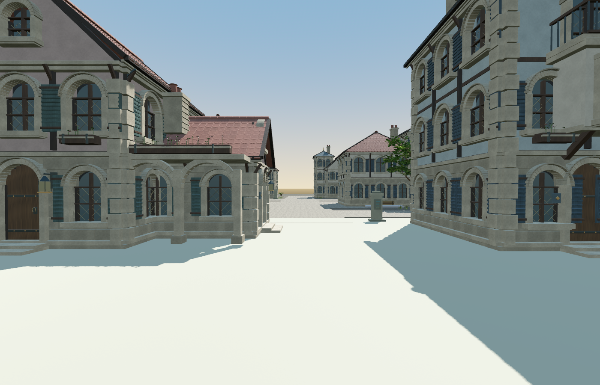
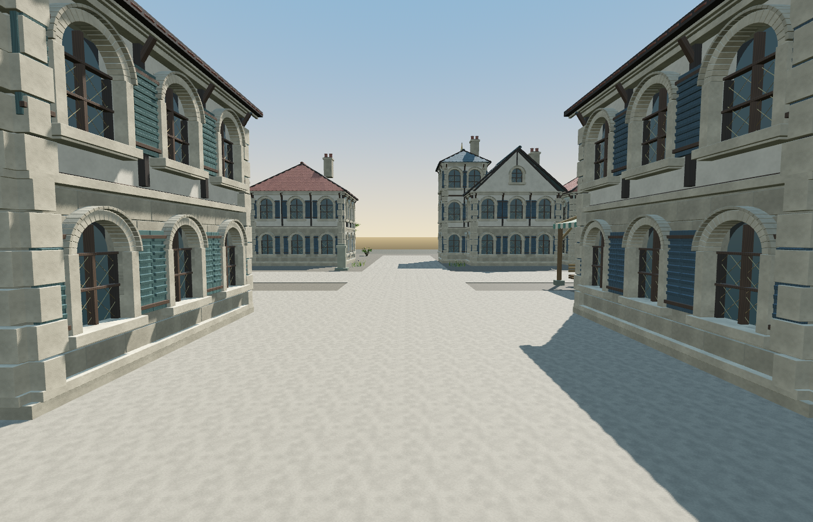
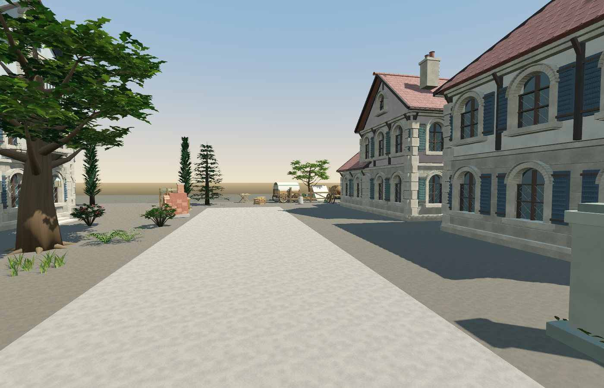

# Town expansion with existing art (2026-09-12/13)

Status: a **visibly larger, walkable town** is installed in the playable `town_street` path. It is
an art/space expansion only: no resident was moved, no home or task rewritten, no food, resource,
inventory, skill or action added, and **zero resident/background-GM runtime inference** was made.
The DeepSeek development session that wrote, imported and tested this expansion is a separate paid
workload with its own measured usage. Named-place access and voluntary travel are the **next**
scoped delivery.

*Overview of the expanded town in the actual scene (offline preview capture).*

*Ground level: the main street from the plaza gate looking into the new neighbourhood.*

*Ground level: the planted commons crossing, houses fronting both streets.*

*Ground level: the south-east street leading to the caravan rest and cargo yard.*

## What was added (all existing project art)

| element | count | source |
| --- | ---: | --- |
| new houses (all six shells) | 14 | `game/assets/floor1/residences` + `deepseek_residences` |
| shopfront details attached to facades | 16 | `game/assets/generated/shopfront_details_20260912` |
| artisan workshop tools (bakery, smith, carpentry, pottery corners) | 12 | `game/assets/generated/artisan_workshops_20260912` |
| caravan rest / cargo props | 10 | `game/assets/generated/travel_cargo_20260912` |
| environment v2 commons and orchard props | 50 | `game/assets/floor1/environment_kit_v2` |
| perimeter landscape props (soft edge) | 18 | `game/assets/floor1/environment_kit_v2` |

38 instances come from the three 2026-09-12 generated sets; the rest reuse the original six shells
and the environment v2 kit. The `70` GLBs are the **asset library** — downloaded, hash-verified by
root and imported into the project (`70` `.glb.import` files, import run exited 0 with no errors).
The town scene itself loads **38 instances** (16 shopfront details, 12 workshop tools, 10 travel/
cargo) selected from that library; the 70 library models and the 38 placed instances are different
counts and are not interchangeable. Before the import no new model loaded at all, which is why
earlier attempts placed nothing.

## Geometry, surfaces and the junction

* Walkable plate (visible mesh **and** collision): 68 m × 84 m, top y = 0.06 m, centred at (0, 55).
* Paved streets: authored 6 m wide rectangles, paving top y = 0.10 m, with their own collision so a
  body never sinks into the visual slab.
* Wider visible outskirts land: 116 m × 132 m at y = −0.06 m. Its own mesh adds **no collider**; it
  is decorative, so the town does not float against void, but it is **not accepted as a fully
  playable area**. The original `street_trial` fallback ground (200 m × 200 m at y ≈ −0.02) still
  exists beneath and around it, so no claim is made that walkable terrain ends at the real plate.
* Junction: the old market floor measures y = 0.15 m and the new paving 0.10 m. A 6.2 m graded ramp
  (y 0.152 → 0.10) replaces the original 17 cm lip. Measured floor profile along the main street:
  z 30–36 → 0.150, z 37 → 0.122, z 38 → 0.113, z 40–44 → 0.100.
* Independent junction test (`tmp/town-expansion-20260912/run3/out/junction.json`): one plain
  0.25 m capsule at the original **1.35 m/s** crossed into the neighbourhood (reached z 43.21,
  y 0.10) and back (reached z 30.80, y 0.15) with ordinary `move_and_slide`, no teleport, no step-up
  assist. This is the accepted original-speed evidence.
* House collision is the shells' own closed-exterior boxes (unchanged art and manifests). House
  footprints used for the overlap check are the manifests' collision extents rotated by yaw; they
  are not full visual bounds. New houses are checked against the **actual market colliders** by
  physics sampling, not against the market's bounding rectangle, which contains open ground.

## Verification (Forward+ default, disposable fixture copies only)

Acceptance run `tmp/town-expansion-20260912/run9` — engine exit 0, all three scene members exit 0,
**16 checks, 0 failures**, and no `SCRIPT ERROR` or load errors in stderr. stderr is 676 bytes and
carries four `Parameter "particles" is null` renderer errors (recorded under Limits; cause and
benignness are not established):

* the 70 library GLBs are importable and load without failure (0 load failures); the scene places
  38 instances from them and placed counts equal the layout counts — library/import count and
  placed-instance count are reported separately;
* 12–16 houses and all six variants present;
* no new/new house overlap and no new house embedded in existing market geometry;
* every road sample stands on a plausible street floor (y ∈ [−0.05, 0.60], roof hits rejected),
  with no floor step > 0.35 m along a street and 0.6 m-sphere capsule clearance on all samples;
* a plain capsule walked the **whole route both ways**: 23 reached waypoints (24 including the
  origin), 279.5 m authored polyline, deadline derived in advance (30 714 physics frames at
  1.35 m/s with margin) rather than extended after a failure. Route legs follow the paved road
  graph; there are no diagonal shortcuts across houses;
* representative new solids block a body — sphere queries at the actual `GeneratedAssetCollision`
  box centres report 1 hit each for `covered_caravan_wagon.glb` (32.18, 1.16, 71.13) and
  `arched_pottery_kiln.glb` (20.5, 1.14, 61.8), while the yard approach at (26, 0.9, 70) stays clear;
* four captures have distinct pixel fingerprints; HUD and resident nameplates were hidden **only**
  for these offline preview frames and restored afterwards.

Authored paving width (6 m) and measured capsule clearance (0.6 m sphere at floor + 1.2 m) are
reported separately: the 6 m figure is the layout rectangle, the clearance figure is measured.

## Limits and preserved failures

* Art and space only. The expansion does not change NPC choices, resource congestion (all ten still
  use the single berry patch) or house interiors; shells stay closed and unfurnished.
* The outskirts plate is a simple flat landform: the far horizon still ends in a straight edge, and
  the distant surface is intentionally plain. No mountains, water edge or new art pack.
* Earlier failed attempts and the errors they exposed remain recorded in `run2`–`run5` and the
  task19 output: the 17 cm junction step, a route leg crossing the south house row, a camera that
  never moved between shots, and a writer-lock clash on a reused fixture. Early `run2`/`run3`
  result and log files were reused on the same paths and **overwritten** during repeated attempts,
  so not every failed run survives byte-for-byte; `run6`–`run9` each have their own output
  directory and `run9` is the accepted run.
* The 70 GLBs and all original art bytes are unchanged; the maintained private world was never
  touched (no lock cleanup, no write). Root owns LFS and hash verification. Native supervisor
  interruptions and their possibly-unknown usage tails are separate private accounting records,
  not zero charges.
* Renderer limitation (observed, not diagnosed): run9 stderr records four `Parameter "particles"
  is null` errors from `particles_get_instance_buffer_motion_vectors_offsets`. The engine and all
  three scene members exited 0 with no script or load errors, but **no control run isolates this
  message**, so it is not described as benign, pre-existing or clean. Earlier "clean stderr" /
  "no engine errors" wording is withdrawn. It is not shown to share a cause with H34.
