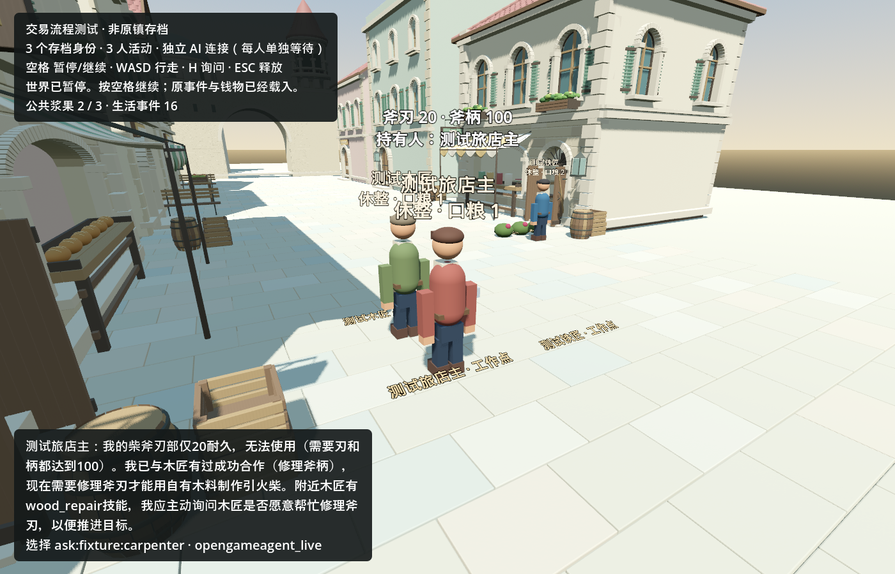

# 行动结果反馈：2026-09-11

本批只修“居民下一次选择能读到上次行动的实际结果”。Luna 提供初稿，主代理修复并验收。沿用三人虚构验证世界 `fixture:town-trade-validation`，不是原镇恢复，也没有证明完整自主生活闭环。

## 已得到的行为结果

- 旧档中三次接近的历史仍保留最初 pending 回执；发给居民的个人记忆投影则读取本人命令的权威完成状态和对应事件。运行中、失败、无证据分别处理，不把他人的回复当成本人的完成。
- 新的生活/交易异步动作持久保存终态回执；重启后仍知道成功或实际失败原因。到达接近目标后不再提供同一无效接近动作，离开后恢复可选。
- 一次明确标注的脚本玩家询问后，真实 Kimi 连续做了两次选择：愿意回复玩家 → 向附近木匠求助。本次没有追加接近事件；不能据此断言未来永不重复。
- 测试达到两次决策上限后，在准备下一次请求之前收尾，不把测试额度用尽写成新的居民故障。普通启动不受此测试上限影响。

## 验证及限制

158 项离线检查通过：反馈30、调用上限5、居民轮次29、交易63、生活31。覆盖真实动作完成/失败、私密命令隔离、拒绝、旧记录与重启。首次离线运行有解析失败，原失败保留在私有验证目录，没有覆盖成成功。

真实世界事件序号13→16：一条脚本询问，两条模型选择产生的回复/求助事件。旧事件及决策历史前缀、物品、合同、交易账户和人物金钱均保持；独立 Godot 冷启动后世界与费用库/guard文件逐字节一致，无新增付费。两次新模型请求均结算。

**整镇验收仍未通过。** 木匠原有 `provider_error / brain_run_failed` 未自动清除，所以既有整镇验证器仍如实报告失败。新增请求未产生新错误。

更重要的行为不足：旅店主知道斧刃20/斧柄100，却因为过去修柄合作顺利，向仅有 `wood_repair` 的木匠寻求修刃。当前求助实际只是泛化的“Can you help me?”，模型理由中的“修刃”没有成为对方收到的具体任务。因此需要做“带明确问题的求助 → 能力解释/拒绝或转介 → 更新计划”，不能通过强写剧情或直接替它选铁匠冒充改善。

## 消耗和方向复核

Kimi：2次，输入11,542（其中缓存1,536），输出181，本批新增 **¥0.0719228**。沿用的独立2元验证账本累计已结算¥0.5768274，另有旧未核实¥0.0141471；24次请求额度已用完，未重建账本或余额。

开发主代理+Luna，截至本报告观测：输入2,568,911（其中缓存2,428,032），输出25,124，raw总计 **2,594,035**。缓存计入输入一次；这不是货币账单。超过本批2,000,000检查点，不能称为预算内交付，也没有自动硬熔断。Luna累计raw 532,998；长上下文重复输入和主代理接手返修是本批明显开销。本批停止追加模块，后续派工要缩小实现面、先得到可运行首检，减少完整上下文轮询。

方向收益：居民可依据已执行事实继续选择，旧生活记录没有被改写。目标缺口：针对具体需求的交流、拒绝后调整计划、旧控制器故障恢复及完整修刃/使用仍未实证。下一模块仅处理具体求助与可解释拒绝/转介，先离线验证再明确一批真实验证额度；不扩人口、不加热更新平台。

本批没有 Git 提交或上传。原镇最新私有主档仍未找到，未拿此测试档替代。

脱敏结构化证据：[town_feedback_2026-09-11.json](town_feedback_2026-09-11.json)。私有完整日志：`C:/InfiniteAincrad/tmp/action-feedback-20260911`，包括首轮失败、通过测试、真实请求摘要、冷启动哈希和进程记录。
