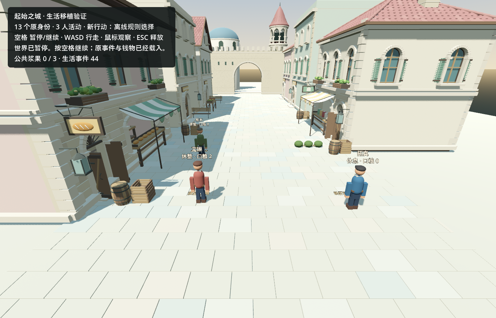

# Original-town life port — internal validation

Verified locally on 2026-09-11 (Asia/Shanghai). **A partial port on a separate private validation copy; not the first version or promotion of the maintained world.**

The complete source has 13 identities and life sequence 37. Source SHA256: `baaab67073a91b9db0b44691c05b4734f235898037074fc835d674d17ae63650`. It was not modified. The explicit Godot layout maps three workplaces into the existing market. Old UE geometry, routes and pending requests remain historical data.

## Implemented and observed

The existing market/player and atomic-save/writer-lock base now support a town continuation module. There is no second engine or backend.

- Eat: 30 seconds at one's workplace, consume one ration, satiety +40 (cap 100).
- Rest: 60 seconds at one's workplace, energy +35 (cap 100).
- Harvest: 20 seconds after physical arrival, public stock -1, own food +1 (inventory cap 2).
- Hunger/energy decline by one per 120 live seconds. Berries grow by at most one per 1800 seconds, capacity three; growth is not banked while full.

A 90-second rendered run produced four eat events and three harvest events: **sequence 37 → 44**. The three available berries were consumed. No money, wood, tool ownership or contracts changed. New choices are explicitly `local_rule_policy`; no new paid/model call occurred.

Distinct shirt/hair palettes, hands, boots, belt/apron, connected hips, a held ration, activity gestures and visible finite berries were added. Collision-resolved movement returns completed residents to their workplace. These are temporary procedural characters, not final art.

Nearby communication rules support attributed inquiry, willing/unavailable/unsure replies and cancellation. Range, payload, recipient and duplication boundaries are tested. This is not yet a visible autonomous conversation or player dialogue flow.

## Verification

| Check | Result |
|---|---|
| Python migration tests | 6 pass: preserve unknown fields/commitments; reject partial history, duplicate identities, reimport, unmapped work anchors and invented stock |
| Godot town life | 31 pass: timed effects, physical arrival, last-stock competition, private views, ongoing-action recovery, live-time conservation, writer conflicts and actual file-write failure rollback |
| Godot social boundaries | 24 pass: range, unknown actors, coordinate injection, refusal/cancellation, conserved resources, duplicates and cold recovery |
| Existing core and rendered well event | Pass after shared save/character changes |
| .NET build | Zero warnings/errors; no additional package |
| Complete original-world comparison | 10/10 pass; [machine-readable evidence](town_life_2026-09-10/evidence.json) |

Independent rendered cold restore kept the file byte-for-byte unchanged, with no extra decisions/time: SHA256 `9a445f841f54ce9eb786e3159f24b6431a9a997d50985714c9c15e05ddac434a`. The valid local candidate is `tmp/town-codec-20260911/world.json` (ignored/private).

## Counterexamples and limits

Initial runs revealed rounding of legacy coordinates through Godot JSON. Full-precision output alone did not fix decimal parsing. The town codec now uses the already-present .NET `System.Text.Json` for accurate parsing and writing. The successful candidate was regenerated from the untouched source, checked without time advancement, run with new actions and checked again. Earlier `town-migration-20260910` and `town-migration-precision-20260911` candidates remain failed evidence and must not be promoted. Tests compare normalized JSON numbers rather than treating integer 15 and floating 15.0 as different facts.

Spark's full replacement character drafts were rejected because geometry/API problems remained after revision. The supervisor made bounded changes to the existing actor. Its static review did not substantiate duplicate-accounting or future-wallet failures; the empty-patch retry observation informed a local-rule cooldown. No model-agency claim follows from these fixtures.

Still missing for the first town: repair/delivery/payment/tool-work execution in Godot; visible communication and meaningful player intervention; sustainable food/labor/exchange with 5–10 active residents; completed art/animation review; actual model substitution retaining identity and private knowledge. The old three-person berry supply is insufficient for sustained survival. Original billing recovery/public licensing remain separate prerequisites for paid runs/publication and do not block internal development.

