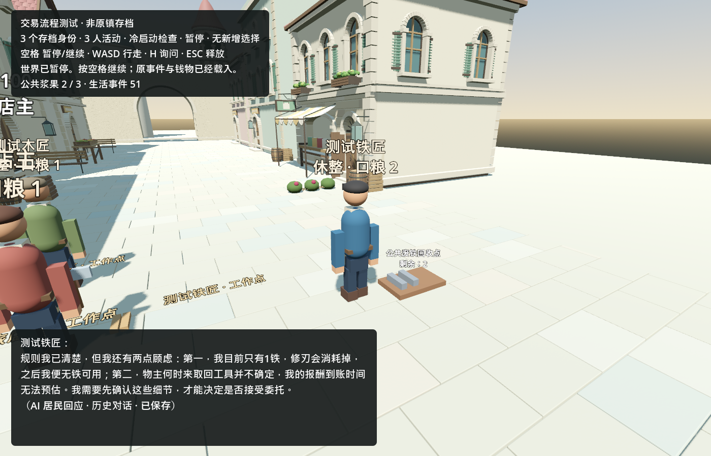

# 铁匠自主取得有限铁料，并选择停止补货

同一维护中的三人虚构世界从seq47推进到51。铁匠在既有seq42向木匠询问铁料来源；本轮开发GM审核后安装一个公共废铁回收点，总量3份。铁匠靠近观察到来源，真实Kimi自主选择走过去整理60秒，取得1铁；第二次选择确认已经取得材料，决定等待新委托，没有拿完剩余2份。**本轮没有玩家询问、逐步指路、控制器重置或指定成功剧情。** 原有历史中仍有之前的玩家澄清，这次结果不能倒推整个世界已独立运行。

| 实际事件 | 同档结果 |
|---|---|
| seq42，之前已发生的真实求助 | 铁匠向木匠表示铁料用尽，询问附近获取材料的途径。 |
| seq48，开发GM安装 | 新增3份公共铁余料；旧角色、钱物、合同、控制器和历史不改。安装审计不进入NPC个人观察。 |
| seq49，个人观察 | 只有当时在3米内的铁匠记录了公共来源和剩余3份；另两人没有远程获知。 |
| Kimi选择1，实际劳动 | 选择`material:recover:street:iron-offcuts-01`，场景中走到回收点并整理60秒。 |
| seq50、51 | 个人铁料0→1，公共余料3→2；收获和本人再次观察分别落账。 |
| Kimi选择2 | 根据新库存选择`wait`；主张现在已有可用于金属修理的材料，暂不需要再补。这是私人决策理由，不是公开发言。 |
| 退出、冷启动 | 同一seq51，world.json、费用数据库和guard均逐字节不变；无新请求、无剩余工作或错误控制器。 |

新增来源是一次明确登记的世界内容更新：它有初始数量和公共使用规则，并非从某个既有角色库存转移，也没有假称存在一条此前未实现的生产链。居民需要现场劳动才把1份公共材料变成个人财产；抢最后一份可能失败，库存不会再生。当前最多8个有限来源，支持铁/木两种现有材料账户，实机只安装了这一处铁来源。

这是以距离为依据的个人观察，**尚未接入NPC摄像头FOV、遮挡或Kimi看图**。远处只保留本人上次看到的库存，现场可能已变；知道来源并不保证取得成功。剩余2份用完后的生产、采购或贸易仍需世界规则，H17保持未完成。一次有限补给不是可持续经济。

新增`game/core/town_materials.gd`模块，沿用Godot既有行走、劳动、单写者、原子保存与个人行动反馈。来源、观察、工作及去重回执保存在可选的`godot.materials`下，旧档无该模块时不会自动安装。`town_runtime.gd`接入模块；`town_turns.gd`投影其真实回执，保留最初开始工作的历史记录。独立安装入口是`game/tools/install_material_source_cli.gd`，需显式源需求、规格和宿主命令；先验证同档副本再安装当前维护档，安装结果与验证副本完全一致。

Luna完成安装CLI和`game/spatial/town_material_sources.gd`，主代理完成资源规则、集成、库存显示数量修正、验收及实机终审。场景复用木托盘与铁条几何；3份显示3束，取得后剩2束，整理动作有劳动姿态。本次没有更新人物风格或完成二次元美术。Luna已关闭，无递归分工。

58项专测、63项在线隔离回归、27项个人反馈回归，共148项通过，最终相关stderr为空。涵盖：有来源的安装、知识隔离、同命令重放、新命令不能补满旧来源、物理到达才计工时、劳动中途冷启动、保存失败回滚、最后一份竞争、耗尽不再生、跨模块命令冲突、非法存档证据和界面库存投影。初版测试夹具缺少求助request_id，虽然检查计数通过但stderr有脚本错误，因此未记成成功；补齐夹具后重新验证。计数包含夹具与保存检查，不代表148种独立生活剧情。

真实调用沿用原独立3元验证账本，没有增加授权或清零历史。预设最多4次，实际在居民选择等待后结束，仅2次：输入8,368 token，缓存输入0，输出231，费用**0.060629元**。累计64次已结算，累计费用2.4964713元、历史未核实0.0141471元，剩余可分配0.4893816元，无未决预留。这不代表缺失的原100元主账本余额已经恢复。

开发计量截至09:47:18 UTC：主代理2,634,894 raw，Luna155,573，共2,790,467；输入2,763,738，其中缓存2,664,832，输出26,729。缓存为输入子集，不重复相加；不含基线前初读及结尾整理，不是货币账单，也不是token硬限额已建立。

方向裁定：现在多了一段无需本轮玩家指路的真实“需求—新增能力—个人观察—选择—劳动—取得—再选择—重启”证据；仍是三人测试世界，原镇完整私有主档未恢复，通用GM自主开发和完整SAO均未成立。原大流程图H9仅按有限补铁范围变绿，H17记录持续供给缺口。下一项优先沿N3验证模型更换后接续同一身份、知识和财产，不先扩大人口或用新剧情重复已经通过的补铁演示。

精选证据见[town_materials_2026-09-11.json](town_materials_2026-09-11.json)。原始失败、同档前后副本、私有请求、账本快照与进程记录保留于本机`C:/InfiniteAincrad/tmp/finite-materials-20260911`。维护档仍为`C:/InfiniteAincrad/tmp/town-contracts-20260911/live/world.json`，不是公开截图或测试夹具生成器；不要据此重建原镇。
