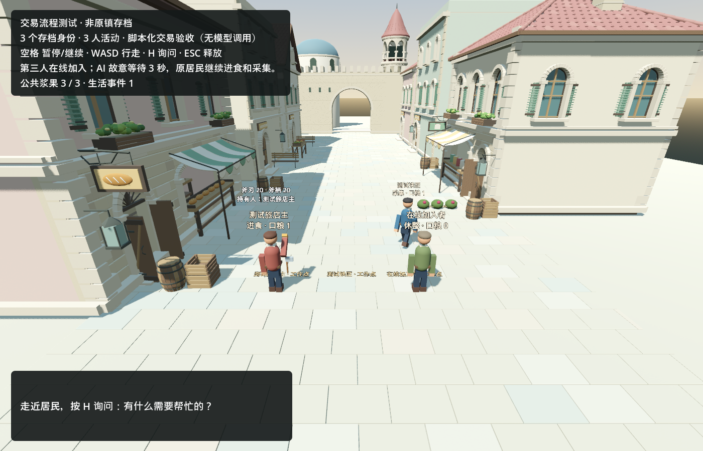

# Online resident admission and independent controller validation

2026-09-11. Same Godot runtime and market; explicitly fictional test world. No original resident was restored or replaced. No paid Kimi requests, public server, asset-loader implementation or gameplay-loader implementation in this batch.

## Delivered behavior

- Two people already have world actions underway. The host admits a genuinely new third identity during the same running scene; its body, label, persistent story and empty accounts are created once. Existing bodies are preserved. There are no core/community resident tiers.
- A resident controller can wait, fail, disconnect and be replaced without pausing other residents. Existing accepted work remains owned by world rules and can finish without that controller. Up to three independent requests may be in flight; the default adapter remains the existing OGA gateway.
- Persistent controller epochs and host request IDs fence obsolete replies. Frozen choice aliases still pass through current world rules. Repeated replies, admissions and payment commands produce no duplicate effect. A failed controller is not automatically retried or treated as voluntarily waiting.
- Reconnecting changes the controller, not the identity, story, inventory, contract or account. Failed attempts remain recorded; reconnect does not settle or erase any external provider billing reservation.

These are trusted host APIs (`admit_resident`, `connect_controller`, `disconnect_controller`), **not yet authenticated cross-computer endpoints**. The local delayed/failing provider implements the same `propose` boundary. It proves scheduling/fencing, not real network interoperability or Kimi decision quality. Gameplay/art hot-plug remains the next separate capability experiment after actual remote-controller verification.

## Evidence

| Check | Result |
|---|---|
| Admission, two concurrent requests, injected timeout, stale reply, repeat payment, failed-save rollback and cold restoration | 63 / 63 |
| Actual rendered market, initial 2 bodies → 3, timeout/disconnect/reconnect and existing actions | 18 / 18 |
| Model-turn regression | 20 / 20 |
| Repair/trade regression | 63 / 63 |
| Life / social / player interaction regressions | 31 / 24 / 17, all pass |
| Independent rendered cold launch | Three identities, three life events, `none_restore`; exact save SHA256 unchanged |

In the rendered run, while the third provider was waiting, the second resident moved **2.0249987 metres**. World time continued at normal speed; the first person's meal and second person's walk/harvest completed. The final world time was 32.55 seconds. The complete contract/payment fault test uses headless world rules and explicit host positions; it is not a new autonomous or graphical repair story.

Cold-save SHA256: `719548c1523c5d47d421028a0ec933c3843dbc69838bb8b56522227da9b8aaf5`.



[Machine-readable selected evidence](town_online_2026-09-11/evidence.json). Private raw runs, failures, usage and process receipts: `C:/InfiniteAincrad/tmp/online-join-20260911/`. Private saves are not publication artifacts.

## Failures retained and corrected

- The initial headless fixture's worker had a generic role, so another person could not know its repair skill. The fixture now explicitly identifies the smith; the knowledge rule was retained.
- Headless delivery originally omitted actual host movement to the job destination. The test now performs that movement; the production arrival check was retained.
- The first rendered fixture started with satiety 95 and therefore could not begin eating. The new explicitly labelled fixture starts the meal participant at 60. The failed original run remains recorded.
- Cold admission replay exposed integer/float JSON-coordinate inequality. Admission compares the stored authoritative Vector3 value; a duplicate now survives cold load without creating another person.
- A valid older life state without a `contracts` array could lose the first proposed contract through an ephemeral fallback array. Contract creation now initializes the persisted array.
- The successful rendered run logged a WASAPI device failure and used Godot's dummy-audio fallback. Cold validation used Dummy explicitly. No audio feature is claimed.

## Independent challenge and direction review

One Luna reviewer performed two bounded read batches before implementation and was closed. Its six counterexamples concerned global waits, global error pauses, stale responses, missing runtime admission, repeat-join resource creation and disconnected contract execution. The supervisor implemented and tested against those cases; this is not a claim that the reviewer audited the final diff.

Supported gain: residents and their committed consequences no longer depend on another controller finishing a reply. The same scene and saved entities survive admission and controller replacement. This advances persistent independent life and provides a necessary boundary for later supported module activation.

Remaining gap: an actual second computer has not connected; there is no public admission/authentication/maintainer-transfer service, automatic disconnected care policy, camera/FOV model input, real Kimi reconnect result or supported runtime capability loader. Original source seq37/44 is still absent on this PC. Do not expand population or claim an indefinitely autonomous world from these fixtures.

Next bounded result: connect one external decision client through this controller boundary and validate one actual decision/failure/reconnect in the same fixture, preserving host authority and the carried fee ledger. Then introduce the already-scoped wood storage capability package after startup, with independent appearance and persistent contents. No generic plugin platform rewrite.

## Reproduce

Use the existing Godot 4.7.2 .NET project and installed/imported market. Commands below use placeholders for local tool paths and a **new private output directory**:

```powershell
python tools/create_trade_fixture.py --online-join --output C:/private/new-online-run/world.json
& $godot --headless --audio-driver Dummy --path ./game --script res://tests/town_online_acceptance.gd
& $godot --audio-driver Dummy --path ./game --script res://tests/town_online_scene.gd -- --town-save=C:/private/new-online-run/world.json --town-capture=C:/private/new-online-run
& $godot --audio-driver Dummy --path ./game res://scenes/town_street.tscn -- --town-save=C:/private/new-online-run/world.json --town-capture=C:/private/new-online-cold --town-restore
```

The graphical fault scenario takes about 35 seconds at normal world speed; use a 50-second process deadline. It expects an untouched two-person fixture and cannot be rerun against its already-joined output. Reopening that output uses the cold-restore command and never reconstructs the fixture.

## Usage and cleanup

Reliable recorded window from 2026-09-11T04:51:57.495Z through the final recorded counter: 2,170,338 input (including 2,063,872 cached) + 32,914 output = **2,203,252 raw tokens**. Cached input is not additional usage. The earlier initial inspection and report tail outside these counters remain unmeasured; this is a measured window, not an asserted complete turn bill. Actual Codex currency cost is unavailable. Kimi requests/cost this batch: **0 / 0**. Prior unresolved development/API charges remain unresolved.

The initial 300k checkpoint was first observed at 528,227 raw; there was no hard limiter. Feature expansion stopped there; subsequent work was repairs, risk-driven tests and evidence. The one reviewer consumed 109,511 input (59,904 cached) + 3,153 output = 112,664 raw, above its 35k target despite two bounded reads. The supervisor's long carried context dominated total input. These targets failed; passing behavioral tests does not make the usage estimate correct. Next engineering dispatch needs a compact task context and a first-patch checkpoint. No automatic loop was started.

All 15 owned engine processes and the single reviewer have exited; cleanup receipts are retained. Code/docs/screenshot remain local and uncommitted; no push or release occurred in this batch.

### Follow-up diagnosis of the measured window

A read-only audit of the exact bounded counter interval found 20 root counter increments: 2,060,827 input (2,003,968 cached) + 29,761 output = 2,090,588 raw. Per-increment input ranged from 77,653 to 128,018, median 104,503.5. The reviewer had three increments, with input 26,260, 35,435 and 47,816; total 112,664 raw. Thus the root accounts for about 94.9% of measured raw usage. Long carried context on repeated root calls is the dominant measured contributor. The exact split between conversation, tools, system instructions and source text was not measured.

Combined input cache hit share is 95.09%; uncached input is 106,466 and output is 32,914. Cache is already active; raw tokens do not equal uncached-price billing or a verified Codex subscription quota conversion. No actual currency bill was established.

The accounting program records usage after work and always exits normally on a successful snapshot. Its numeric review interval is 100,000,000, while the batch's 300k target was merely text in `scope`; the script does not parse that target or block model requests. This is a missing enforcement mechanism, not an implemented hard cap malfunction. A new context alone also does not guarantee low usage: the reviewer already needed 26,260 input on its first recorded step, making a 35k total target incompatible with multiple similarly sized steps.

Required workflow correction: use compact bounded implementation contexts, keep long-history supervision to actual decisions/review, combine deterministic inspection/testing into scripts, estimate from observed input per request plus expected rounds, and distinguish a pre-dispatch budget gate from a true transport-level hard cap. No global Codex configuration was changed and no universal per-request interceptor was implemented by this diagnosis.
