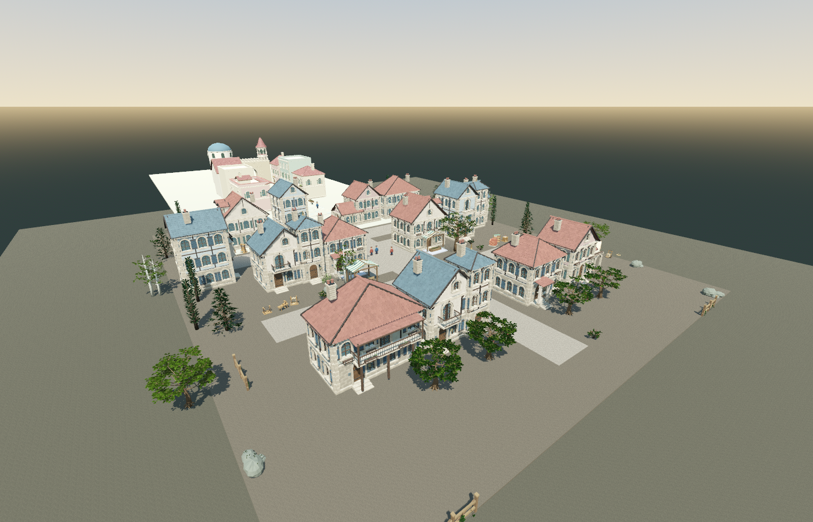
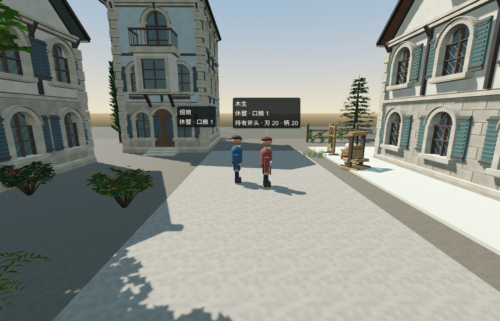
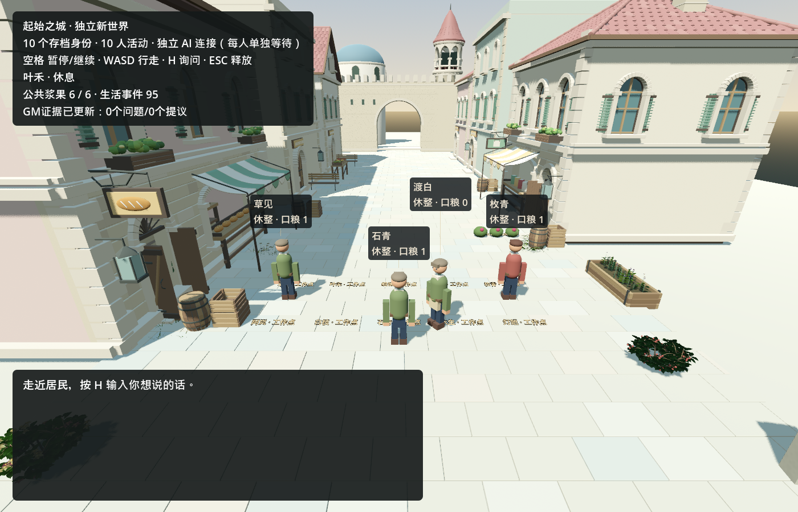

# 居民真的用上了扩建街区：公共地点、本人来源的知识与首次真实采用

## 本轮结果

同一维护世界 `shared:aincrad-trial-1`（十个身份不变）里，居民**靠自己的感知**认识了扩建街区的公共地点，
并在真实运行中**自愿**走了过去：20次真实决策里 **8次是公共地点选择**（6次前往 + 2次在公共地点休息），
分属 **6名不同居民**；没有一次出行被判定受阻，运行结束时没有任何未完成行程。



*扩建后的街区与公共设施总览。这是对同世界快照的**暂停事后渲染**，不是新的实时运行。*


*种植公共地：真实运行结束时的三名居民身体（**园丁、守井人、面包师**）就站在公共地里，
名牌由场景自己的居民名牌层随同一台相机绘制；图中名称为该层为这三具身体绘制的本人名牌。*



*西侧前庭：**木匠与织工**两名居民身体停在公共前庭（持斧者是木匠，与世界存档一致），
旁边是临街住宅与作坊道具。*



*上面三张是暂停的事后渲染；这一张是**真实运行结束时**由运行本身保存的实机画面。*

### 这次真实运行到底做了什么

- **知识**：十名居民全部通过真实感知知道了公共地点——9人在旧市场出口读到公共路牌，1人因为亲眼看到
  市场广场而知道它；共37条**本人来源**的知识事件，没有把清单塞进所有脑袋。
- **采用**：真实模型在20次决策中自愿选择公共地点8次：木匠与织工去了**西侧前庭**（木匠还在那里休息），
  园丁、守井人、面包师去了**种植公共地**（园丁在那里休息），旅店主回到**旧市场广场**。
  其余12次仍选择原有动作（8次求助、3次回应、1次靠近），没有强迫分散、没有代选、没有传送。
  本episode**没有居民真正走到商队休息区**。
- **结算**：6次到达各有且仅有一次回执，2次公共点休息各有且仅有一次回执；运行结束无待办行程，
  没有“到达受阻”事件。休息按世界既有规则结算（木匠57→91、园丁57→91，即+35并扣除同一窗口的1点衰减）。
- **老世界保持**：运行前 sha `ea96edea…` → 运行后 `a3515687…`；旧38条事件按记录逐条一致；
  身份、住宅、工具、钱物账户、浆果存量都与运行前相同；运行前后的 life/trade/places 待办都是空的。
- **成本与未知**：20次真实上游请求，账本已结算金额 16.2220721→16.7975074，即 **+0.5754353 元**；
  历史不确定行 **6→6（没有新增未知）**，预留金额未变，没有触发停机，引擎退出0。
- **冷恢复**：对运行后存档的**字节副本**另起一次**暂停** `--town-restore` 重开（无任何provider调用）：
  副本运行前后 sha 完全一致，十个身份、life seq 95、8条地点命令与45条地点/休息事件全部保留，
  没有重复事件。

### 诚实边界

- 这是**一次有界真实续接**，不是持续20-agent服务；十人中当天6人真的用了公共地点，另外4人没有。
- 公共地点只提供“走过去、站一会儿休息”，**不产出**食物、材料、技能或商品；室内、完整经济、
  拥挤处理与长时间稳定性都仍然开放。
- 运行时的原生渲染器告警（本次日志）：13×`particles is null`、3×`multimesh is null`，
  **没有 SCRIPT ERROR**；这是渲染器层面的已知限制，不作“无错误”结论。H34 保持开放。

---

以下为离线验收与实现细节（英文），范围与失败记录保持原样。

# Public places: personally learned destinations, voluntary travel and rest (2026-09-13)

Status: implemented and acceptance-tested OFFLINE, then exercised by ONE authorized real runtime.
The offline suites make **zero paid inference**: their only HTTP is the compiled-adapter fake local
transport (4 local POSTs). The single real run is described in its own section above; the paused
post-run renders are artifact preparation with no provider and no simulation. The maintained world
is `shared:aincrad-trial-1`: accepted pre-run sha
`ea96edeaab1c77511dbf02815132b3bd8b7820241278a2c7d41399a4d2111c44`, accepted post-run sha
`a3515687ad55d44380d141b2303539cdfacdb759434fb9849e769149ae54af3d`.

## What the capability is

Four public places - the old market plaza, the west forecourt, the planted commons and the caravan
rest - can be learned, walked to and rested at by a resident that personally knows them.

| piece | file | what it owns |
| --- | --- | --- |
| place catalog | `game/spatial/town_places.gd` | ten measured arrival/rest points per place, the authored road graph, the public notice text |
| world capability | `game/core/town_places.gd` | attributed knowledge, voluntary travel jobs, place-bound rest, progress/blocked verdict, state validation |
| notice prop + sensing | `game/spatial/town_place_notice.gd` | the waystone at the market exit, its real collider, and the straight line-of-sight query |
| route steering | `game/spatial/town_place_steering.gd` | road-graph leg following with the reviewed bounded local detour; final approach kept until real arrival |
| fixed home/work lookup | `game/core/town_life.gd` (`home_point`), `game/spatial/town_street.gd` | markers, idle return, repair camera and repair routing use the saved home; only a resident's actual pending action uses `destination()` |
| scene wiring | `game/spatial/town_street.gd` | builds the notice, dispatches travel/rest movement, observes travel and perception, counts place jobs in the truthful capture |
| choice protocol | `game/core/town_places.gd`, `game/agents/town_turns.gd` | options only for personally known places, feedback resolves place commands, rest uses the existing rest rule |
| Kimi adapter | `game/agents/BudgetGatewayProvider.cs` | bounded `known_places` projection in the compiled request |
| reusable tests | `game/tests/town_places_rules_acceptance.gd`, `town_places_route_acceptance.gd`, `town_places_scene_acceptance.gd`, `town_places_home_lookup_acceptance.gd` | offline rules, real routed travel, full scene, fixed home/work integration |
| private diagnostics | `tmp/town-places-20260912/probes/`, `tmp/real-ten-20260913/places-01-view/place_view_capture.gd` | one-off measurement probes and the paused camera script, kept out of the shipped test set |

Rules held:

- A resident learns a place only by reading the real public notice inside 8 m with a clear physics
  line of sight, or by directly seeing it within 20 m. Knowledge is one attributed, idempotent
  `place_learned` event per (source, resident, place); an unknown id from a caller is ignored.
- The first ten residents by roster order own ten distinct points per place; a resident beyond the
  authored set is not offered the public places at all (no modulo alias, no shared point).
- Travel keeps its own command, saved target and progress. A trip that cannot make real road
  progress closes honestly as `travel_blocked` with no arrival receipt. Progress is credited in
  0.25 m milestones of the remaining road distance, so slow steady walking survives and rocking
  against a wall does not.
- Rest at a place is the world's own rest rule (60 s, +35 energy) and only accrues at the
  resident's own public point. Public places grant no resource, stock, product or skill, and the
  notice promises only walking and standing.

## The one real runtime (2026-09-13)

Command (existing approved launcher, `kimi-k2.6`, thinking disabled, concurrency 1, 20 requests,
300 s, `stop-on-idle`): the exact `tools/run_town_model_validation.py` invocation recorded in the
run directory; no scripted inquiry, no supplied action, no forced dispersal, no time scaling.

| fact | value |
| --- | --- |
| engine / run | exit 0, validation passed, `model_errors {}`, 20 upstream requests, no halt |
| world | `shared:aincrad-trial-1`, sha `ea96edea…` -> `a3515687…`, life seq 38 -> 95 |
| old history | the 38 recorded events are identical value-for-value; the verified BYTE-equality result is the whole paused save copy (sha unchanged before/after), not a claim about a parsed prefix. Identities, homes, item, accounts and berry stock are unchanged. |
| knowledge | 37 `place_learned` (36 via `public_notice:market_exit`, 1 via `direct_sight`) |
| arrivals | 6 `place_visited`, one receipt each: carpenter->west_forecourt, weaver->west_forecourt, gardener->planted_commons, well-keeper->planted_commons, baker->planted_commons, innkeeper->market_plaza |
| rest | 2 `rest` completions at public points (carpenter 57->91, gardener 57->91); each settled once in both the places journal and the life command |
| blocked | 0 `travel_blocked`; no place job pending at the end |
| choices | 20 settled decisions, 8 voluntary place choices (6 travel + 2 rest) by 6 residents; 12 stayed on old social/wait actions |
| cost | settled calls 1065 -> 1085; settled CNY 16.2220721 -> 16.7975074 = **+0.5754353**; reserved unchanged |
| uncertainty | carried uncertain rows **6 -> 6**, no new unknown; `carried_uncertainty_reviewed: true` |
| caravan | no real caravan-rest visit happened in this episode |
| runtime stderr | 13 `particles is null` + 3 `multimesh is null`, 0 SCRIPT ERROR (renderer-level, unchanged limitation) |
| current paused render stderr | the corrected render run's own stderr was **0 bytes**; the first view attempt's messages are kept privately and are not reused as this run's counts |
| paused cold reopen | separate process, no provider: the byte copy's sha is unchanged before/after, 10 identities, life seq 95, 8 place commands and 45 place/rest events retained, no duplicate events; its stderr was empty |

Note on counting: the 43 place events are 37 learned + 6 visited; the two `rest` events are
additional (45 place-related events when rest is included).

### Paused post-run renders (artifact preparation)

The first presentation attempt projected the name overlay from the scene's own camera, so the labels did not follow these poses and the general HUD panels stayed visible. Those shots and logs are kept privately; nothing from them was published.


Fixed private script `tmp/real-ten-20260913/places-01-view/place_view_capture.gd` (sha `862ac089…`) loaded a fresh byte copy
of the accepted post-run save, kept the world paused for every frame, used the scene's real resident
bodies, rebound the residents' own name overlay to the capture camera and hid only the general HUD canvas (after the scene's deferred `_ready` had built both layers), and saved three 1400x900 PNGs. The copy's sha was identical
before and after the run; the run's stderr was **empty** and every owned process exited 0 with all members exited; the nameplate layout snapshot named exactly the three commons residents in the commons pose and the two west residents in the west pose. `bodies_near` checks
in the same run counted 3 real bodies at the planted commons and 2 at the west forecourt.

## Actual offline results (unchanged scopes)

| run | suite | result |
| --- | --- | --- |
| `run17/out/rules.json` | `town_places_rules_acceptance.gd` | **67 checks, 0 failures**, exit 0 |
| `run16/route/out/route.json` | `town_places_route_acceptance.gd` (UNSCALED, real time) | **18 checks, 0 failures**, exit 0, 76.0 s |
| `run18/scene/out/scene.json` | `town_places_scene_acceptance.gd` (time_scale 6, labelled) | **84 checks, 0 failures**, 9 journeys, exit 0, 81.2 s |
| `run20/home/out/home.json` | `town_places_home_lookup_acceptance.gd` (UNSCALED) | **13 checks, 0 failures**, exit 0, 19.5 s |
| `run20/logs/repair-regression-1*` | existing `town_repair_acceptance.gd` re-run after the fixed home gate | **30 checks, 0 failures**, exit 0 |
| `run17/gateway` | `tools/validate_gateway_adapter.py --scenario town-history` | 2/2 cases passed, **four** fake local POSTs (case 0: 1, case 1: 3), 0 paid inference |
| `run17/logs/places-clearance-probe3*` | private clearance diagnostic | 25 candidate positions surveyed per place; per-target mapping below |

All wrapper records report `all_members_exited: true` with no nonzero member exit. Reported stderr
warning counts always come from the process log of the run being described.

### Route and cold resume (unscaled, real time)

- The caravan-rest trip covers an **authored graph length of 87.45 m**. The body was measured to
  walk **79.05 m** before the mid-approach copy and **5.67 m** after its same-command cold restore.
- The trip arrived exactly once, at 0.32 m from its own point, with a maximum horizontal speed of
  **1.35 m/s** and **0.00 m** of back-off after the final approach - the confirmed terminal-route
  defect (a road rebuilt behind the actor) is fixed.
- The mid-approach copy holds the same command and the exact saved target; a **scene recreation in
  the same running engine** resumed it and produced exactly one arrival receipt, with no blocked
  closure.
- Fixed lookup after the trip: `destination(id, "rest")` returns the saved home point again; with a
  place rest pending it returns that public point, the travel lookup stays the home point, and
  `_at_worker_station` is false on the public square. The repair gate reads the saved home directly.

### Full scene run (time_scale 6, labelled fixture - not Kimi life)

- Notice site (-3.0, 0.22, 12.0) on the measured market floor; the only collider at its own
  position is its own (`PublicNoticeCollision`).
- A notice reader learned all four places; a resident beyond read range learned only the place it
  could see; a resident behind a test-owned barrier learned nothing and learned the notice after
  the barrier was removed; a resident 30 m away learned nothing.
- Nine journeys each produced exactly one arrival receipt, ending 0.22-0.40 m from their own
  points at a maximum 1.35 m/s. The `distance_m` values in that evidence are **start-to-finish
  displacement**, not walked path length. Three residents (roster index 0/4/8, formerly one modulo
  offset) arrived at three distinct points 2.4-5.4 m apart.
- Place rest: energy 58 -> 93 with **0 survival ticks** in that window, one receipt, and the option
  journal settled with the life command (no forever-pending mirror).
- Wall negative: a test-owned wall across the paved street closed the last trip as a rejected
  `travel_blocked` at z=43.5, with **0 arrivals** and 11.2 m of road still ahead.

### Fixed home/work lookup regression (unscaled)

With a public rest pending at the market plaza: the work markers and the reopened scene's markers
sit on the fixed saved home (0.0, 0.22, 6.0), the published rest target stays the public point
(1.3, 0.22, 13.3), and `_at_worker_station` is false on that square. Reopening from the saved bytes
while the rest is pending does not move a marker or a repair route to the public rest target.

### Surveyed clearance of the final forty selected targets

The private clearance diagnostic surveyed 25 candidate positions around each place (100 total) and
reported whether a real 0.25 m capsule fits and which floor a downward ray finds. One **unused**
market candidate sits on a 2.014 m raised prop top, so not every surveyed candidate is usable; the
forty points that were actually selected are all clear and all on their place's own floor:

| slot | offset (x, z) | market 0.22 m | west 0.10 m | commons 0.10 m | caravan 0.06 m |
| ---: | --- | --- | --- | --- | --- |
| 0 | (-2.4, -1.2) | clear 0.22 | clear 0.10 | clear 0.10 | clear 0.06 |
| 1 | (-1.2, -1.2) | clear 0.22 | clear 0.10 | clear 0.10 | clear 0.06 |
| 2 | (1.2, -1.2) | clear 0.22 | clear 0.10 | clear 0.10 | clear 0.06 |
| 3 | (2.4, 0.0) | clear 0.22 | clear 0.10 | clear 0.10 | clear 0.06 |
| 4 | (2.4, -1.2) | clear 0.22 | clear 0.10 | clear 0.10 | clear 0.06 |
| 5 | (-1.2, 1.2) | clear 0.22 | clear 0.10 | clear 0.10 | clear 0.06 |
| 6 | (1.2, 1.2) | clear 0.22 | clear 0.10 | clear 0.10 | clear 0.06 |
| 7 | (2.4, 1.2) | clear 0.22 | clear 0.10 | clear 0.10 | clear 0.06 |
| 8 | (-2.4, 1.2) | clear 0.22 | clear 0.10 | clear 0.10 | clear 0.06 |
| 9 | (-2.4, 0.0) | clear 0.22 | clear 0.10 | clear 0.10 | clear 0.06 |

Machine-readable form of the same mapping:
`tmp/town-places-20260912/run17/out/selected-target-clearance.json`.

## Limits and preserved failures

- One bounded real continuation, not continuous service. Six residents used the public places; four
  did not; the caravan rest was never actually visited in this episode.
- The full scene run uses `Engine.time_scale = 6` and is labelled as a time-scaled fixture. The
  route/restore and home-lookup runs are unscaled real time; only they carry real-time speed claims.
- Public places grant no resource, stock, product or skill; interiors, a working economy, crowd
  handling at scale and long-run behaviour remain open (H36/H38/H34 stay open).
- **Crowding stays an open limitation.** The run18 wall negative is the evidence that a fully
  blocked street closes honestly; the earlier failed runs 10/11 jammed at the commons with the old
  terminal-route code, and they do not prove that the corrected code resolves every future crowd.
- The road graph is authored from the accepted layout and the accepted run9 physical route. The
  place tests walk the market<->west, market<->commons and market<->caravan legs; the south-west arm
  and orchard-track edges rest on the earlier run9 evidence.
- Failed runs and their logs (`run4`, `run5`, `run9`-`run12`, the run19 lock-contention attempt and
  the first private view attempt that failed to parse) are kept beside the passing runs.

## Test and run commands

```
python -X utf8 tools/run_godot.py --godot tmp/toolchain/Godot_v4.7.2-stable_mono_win64/Godot_v4.7.2-stable_mono_win64_console.exe \
  --name <label> --timeout <s> --out <logs> -- --headless --rendering-method forward_plus --audio-driver Dummy \
  --script res://tests/<suite>.gd -- --town-save=<fixture> --save=<fixture> --work=<dir> --out=<evidence.json>

python -X utf8 tools/validate_gateway_adapter.py --godot <same godot> --out <dir> --scenario town-history
```

`town_places_rules_acceptance.gd` takes `--places-work=` and `--out=` only. The one real runtime used
the existing approved launcher command recorded in `tmp/real-ten-20260913/places-01/`.
