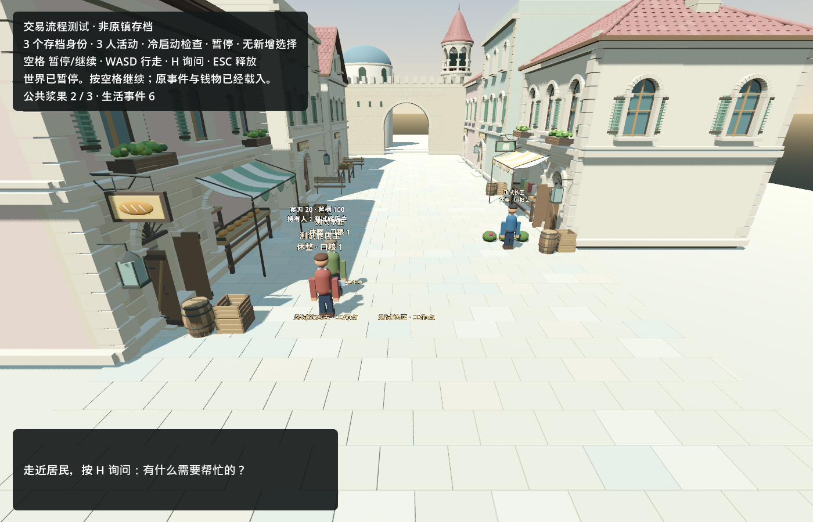

# Godot 居民委托与履约：2026-09-11

本轮交付：Godot 里的居民可以提出修斧委托、接受或拒绝，实际行走交付、施工、取回并结算。完整双部件修理和加工柴火通过脚本实机验收；真实 Kimi 在同一测试存档完成了 **2 Col 修斧柄交易**，然后选择等待。**尚未证明原居民的完整自主生活循环。**

## Git 同步与原镇存档

已拉取 `main` 的 `e3ab07b556e9a1d9923ebf17790955a7782ad4e2`。上一台电脑新增的是：原镇独立 Godot 迁移验证、进食/休息/采集、社交边界、人物动作细节、Windows 预览构建与验收工具。代码、市场 GLB、Blender 源和报告均通过 Git/LFS 同步。

上一台电脑找到的完整源档到生活事件 37，独立 Godot 副本推进到 44。这些是上一台电脑的验证事实。**Git 不包含那个 `world.json`。** 本机只有事件 3 的旧源档，缺少 survival/foraging；用户确认尚未同步完整私有文件。旧档保持不动，没有根据截图或报告拼造历史。

本轮三个身份均为明确虚构的测试旅店主、测试铁匠、测试木匠，世界 ID 为 `fixture:town-trade-validation`。这些结果不能替代艾琳、拓真、柏木的续接验证。取得上一台电脑的真实完整源档和必要私有记录后，才能验证原镇接续。

## 行为与持久状态

- 复用现有 Godot、MIT OpenGameAgent、单一存档写者与原子事务；模型只选择动作，程序核验后果。
- 求助和回复记录来源与接收人；接单可以拒绝，未交付前可以取消。玩家在附近按 H 询问，网关模式由居民选择回应/拒绝/未决定；回应正文仍为预制短句。
- 修理价格可选 2/5/8 Col。接受时将委托人的钱转为预留，取回时才给工人；取消退回预留。重复命令不能再次付款。
- 交付改变持有者，产权不变。修理必须实际到工作点并施工 60 秒，消耗一份铁或木料；斧刃和斧柄都达到 100 才可加工。使用再耗时 60 秒，把一份木料变为一份柴火。
- 各人模型视图包含本人的人设、钱物、合同、经历与最近选择；不共享别人的账户或私有对话。完整经历仍在存档，单次上下文只投影最近部分。
- 请求发出前保存 pending；超时、无效选择和规则拒绝单独记录，重启不自动重试。无事等待有 1800 秒冷却；这仍是受限验收入口，不是已验证的常驻付费生活服务。

## 真实 Kimi 发生了什么

共 **12 次 Kimi K2.6 请求**，没有指定执行动作序列。第一轮 8 次，修理完成后一次取回请求抄错了长合同 ID，程序拒绝执行，因此第一轮不能记成通过。费用和失败保留。

修复模型接口后，在同一个测试世界追加 4 次：模型只返回短选项 `a0/a1/...`，程序使用请求前持久化的映射找到真实 ID，没有模糊匹配或偷偷执行失败答案。此次协议错误经一次开发复核解除；修改前的存档留作私有备份，旧选择和世界事实未删除。新的真实选择完成取回与付款。

| 状态 | 初始 | 真实验证结束 |
|---|---:|---:|
| 旅店主钱包 | 20 Col | 18 Col |
| 木匠钱包 | 5 Col | 7 Col |
| 铁匠钱包 | 5 Col | 5 Col |
| 木匠木料 | 1 | 0 |
| 斧柄 / 斧刃 | 20 / 20 | 100 / 20 |
| 斧头持有者 | 旅店主 | 旅店主 |
| 旅店主柴火 | 0 | 0 |
| 合同 | 无 | 修斧柄，2 Col，collected，预留为 0 |

旅店主随后以“没有加工选项”为由等待，没有继续找铁匠。它误以为修好斧柄就能使用，这是本次真实运行发现的规则理解缺口。现已补充本人可知的工具条件与不可用原因；**这项最后修正仅经离线接口/规则检查，尚未做下一次真实 Kimi 复核。** 不重新抽答案强迫完成故事。

还修复了旧字段 `hunger` 的含义歧义：旧系统中数值越高越饱，模型接口现在明确为 `satiety`，底层原字段保持不动。第一次误解及其采集行为保留在经历中。

## 验收证据

环境：Windows、Godot 4.7.2 .NET、Vulkan Forward+、RTX 4060。不是网页代理或离线生成的效果图。

| 检查 | 结果 |
|---|---|
| C# 构建 | 0 错误，0 警告 |
| 新交易检查 | 63/63：拒绝、取消、金钱/材料守恒、到达后施工、半途恢复、重复付款、写盘失败回滚、玩家拒绝与私有知识 |
| 模型轮次检查 | 19/19：个人上下文、短 ID、等待、持久化错误与禁止盲目重试 |
| 生活 / 社交 / 玩家交流回归 | 31/31、24/24、17/17 |
| 原井边核心回归 | 通过 |
| 网关检查 | 9/9，包括城镇视图投影、费用/过期/错账本/不确定请求拦截；0 次外部调用 |
| Godot 图形脚本验收 | 13 个脚本步骤，两人分别修同一把斧的两部件，真实移动/施工/结算/使用，产出 1 柴火 |
| 真实 Kimi 图形验证 | 8 次的首轮因无效 ID 失败；修正后 4 次完成同一合同，未完成第二部件与使用 |
| 真实结果独立冷启动 | 世界、SQLite 账本、guard 与请求记录 SHA256 均不变；0 新选择、0 新调用 |

冷启动世界 SHA256：`370ffeacf9b437ad2dd4419eb34fc053a5273ba47ee83495ff5c0f42c2cb16b4`。精选机器结果见 [evidence.json](town_trade_2026-09-11/evidence.json)。初始脚本类型错误、首次缺少市场导入、模型无效选择的日志均保留在私有验收目录，未改成成功。



[完整脚本链条实机画面](town_trade_2026-09-11/scripted-chain.png)。人物、斧头、柴火仍为临时几何，卡片会遮挡；没有本轮新增完整人物美术。

## 费用与开发消耗

使用原先独立的 **2 元验证授权链**，结转旧费用 `0.0141471` 元；没有重置旧城镇 100 元账本。新链 12 次累计估算 `0.1717833` 元，含结转的负债总数 `0.1859304` 元，未决预留为 0。估算采用账本配置的保守费率，不是已核对的钱包扣款；Kimi 的定价来源为[官方平台](https://platform.kimi.com/)。旧夜间主账本及跨电脑未知费用仍未解决。

Luna 一个工人已关闭，实际输入 2,309,025（其中缓存 2,190,592）、输出 40,413，合计 **2,349,438 raw token**，超出本次派工的约 300,000 目标。缓存是输入子集，不再加一次。主任务当前轮次增量尚无可靠结束计数，不能报零或声称总预算达标。未启用自动硬熔断，也没有继续派工。下一批缩小到单个接口/补丁，并在首补丁时核算增量；不另开通用监控平台工程。

## 复现与下一步

先按项目要求构建、导入资源。以下只创建明确测试世界，不恢复原镇；输出必须是新文件且留在导出的 `game/` 外：

```powershell
python tools/create_trade_fixture.py --output C:/Private/trade-test/world.json
./Run-Street.ps1 -Town -SavePath C:/Private/trade-test/world.json -Godot C:/Tools/Godot.exe
```

默认离线，按空格才运行。离线自动策略仍只负责吃/休息/采集，不会假扮 Kimi 自动选择修理；完整脚本链条入口是 `res://tests/town_trade_scene.gd`，配合该测试文件要求的 `--town-save`/`--town-capture`。实际付费入口 `tools/run_town_model_validation.py --help` 必须提供已核验的账本、guard、私有配置、已有存档和新验收目录；它不创建预算或存档。`-TownGateway` 只在明确配置网关时使用。

方向判断：这轮增加了可见的劳动、交付、结算后果，以及个人选择的持久化，仍在朝目标前进。实际不足是原档缺失和居民不能正确推导完整工具需求；还没有相机 FOV、稳定长期需求规划、完整旧合同/待办迁移或第二真实模型接续。远处熟人的接近目标与职业识别仍是简化规则，不能称为真实视野。

下一项只做：取得原镇完整私有检查点后，在独立迁移副本检验相同履约能力，并检验居民能否根据明确工具条件继续自己的目标。原文件缺失期间保留这一阻断，不扩地图、不增加人数、不编造原居民历史。
