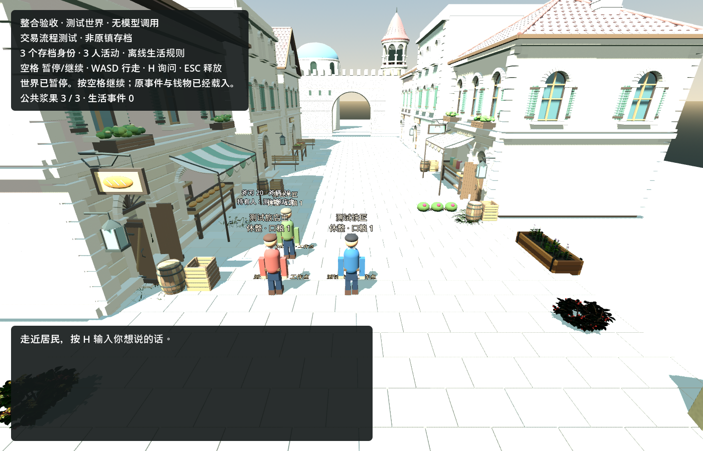
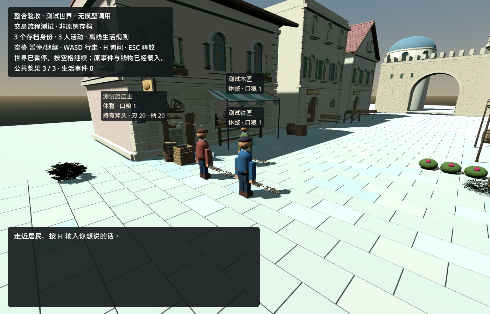
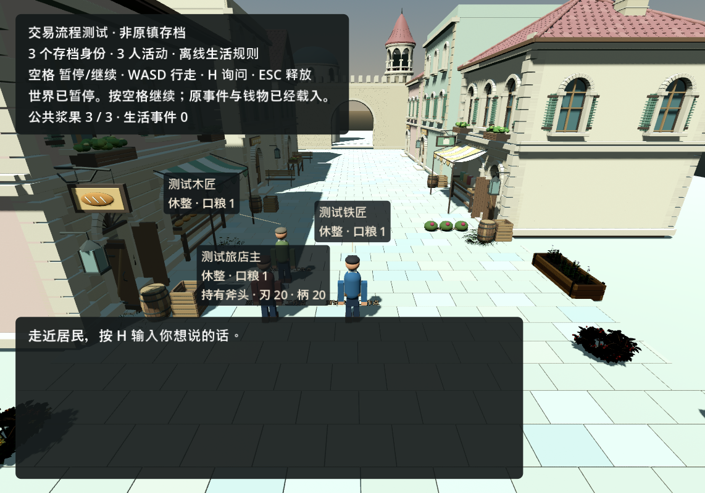
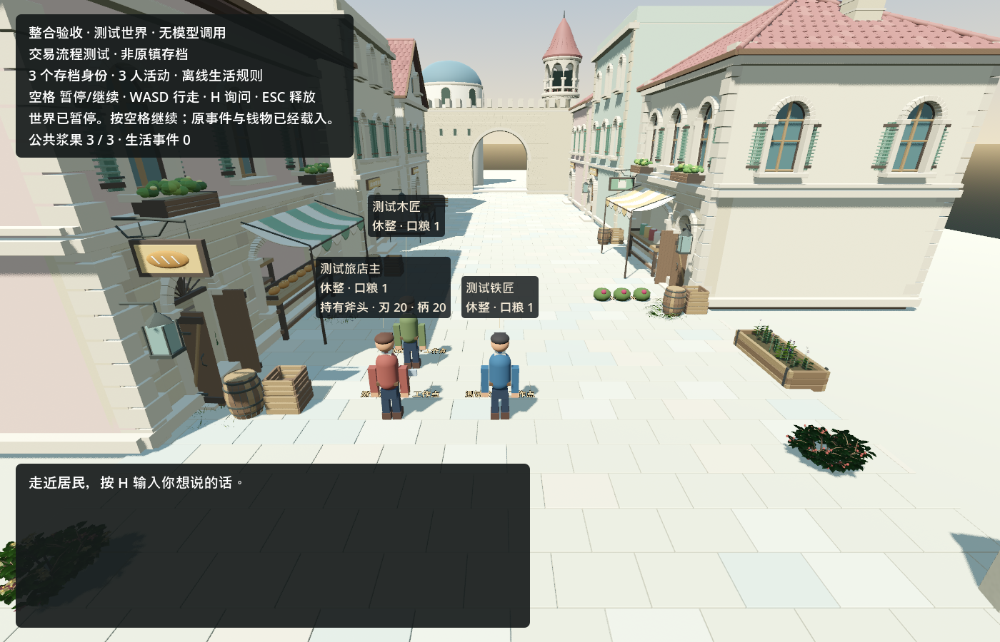
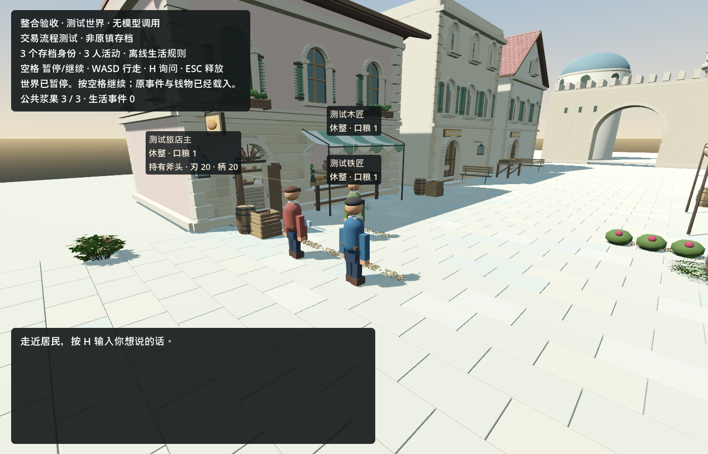

# H20 城镇视觉可读性验收（2026-09-12）

状态：**已接受（限定范围）**。父提交 `a795d38d81357aba4b01467669c0354d4fdb6edb`。

作者：GPT-6 负责范围界定与独立复核；DeepSeek 负责实现与修复。

## 本批实际产品改动

- `game/spatial/street_trial.gd`、`game/spatial/town_street.gd`、`game/spatial/town_tools.gd`、`game/spatial/town_nameplates.gd` 四个空间文件被修改。
- `game/tests/town_merge_acceptance.gd` 场景检查被修改。
- 修复兼容渲染（GL Compatibility）下的日照过曝：立面与屋顶恢复颜色与细节。
- 修复三名居民名牌在总览/近景下的重叠：三人标签均可读。
- 默认 Forward+ 环境设置保持不变。

## 实际结果

GL Compatibility 与 Forward+ 两个真实渲染后端各 197 项检查通过、0 失败、145 项名牌检查、0 错误、世界存档逐字节不变；独立无窗口（无 NPC、无世界写入）同样 197 项、0 失败、新增 145 项名牌检查。

## 前后图像

- 前：
- 后（GL）：  
- 后（Forward+）： 

图像为原始 PNG 直接复制，未编辑；复制后逐字节 SHA256 与源一致。

## 公开证据

- [gpu.json](town_visual_readability_2026-09-12/gpu.json)
- [headless.json](town_visual_readability_2026-09-12/headless.json)
- [usage.json](town_visual_readability_2026-09-12/usage.json)
- [source_sha256.json](town_visual_readability_2026-09-12/source_sha256.json)
- 日志：[gl stdout](town_visual_readability_2026-09-12/gl_compatibility.stdout.txt)、[gl stderr](town_visual_readability_2026-09-12/gl_compatibility.stderr.txt)、[forward stdout](town_visual_readability_2026-09-12/forward_plus.stdout.txt)、[forward stderr](town_visual_readability_2026-09-12/forward_plus.stderr.txt)、[headless stdout](town_visual_readability_2026-09-12/headless.stdout.txt)、[headless stderr](town_visual_readability_2026-09-12/headless.stderr.txt)

## 复现方式

复现指新建全新夹具并运行实际测试脚本（图形模式，非无窗口）。先建夹具：

```powershell
$townFixturePath = Join-Path $env:TEMP ('town-visual-' + [guid]::NewGuid().ToString() + '.json')
python -Xutf8 tools/create_trade_fixture.py --output $townFixturePath
```

再运行测试：

```powershell
$townCaptureDir = Join-Path $env:TEMP ('town-visual-capture-' + [guid]::NewGuid().ToString())
python -Xutf8 tools/run_godot.py --godot 'C:/path/to/Godot.NET.exe' --name town-visual --timeout 120 --out tmp/town-visual-logs -- --rendering-method gl_compatibility --script res://tests/town_merge_acceptance.gd -- "--town-save=$townFixturePath" "--merge-output=$townCaptureDir/result.json" "--merge-capture=$townCaptureDir"
```

将 `--rendering-method` 换成 `forward_plus` 可复现另一后端。无窗口复现需另用一条命令（加 `--headless` 并去掉 `--merge-capture`），此处不再展开。

## 限制

- 真实视觉仅观察到 2 个视角、3 名 fixture 居民；更大规模人群未验证。
- 遮挡为单射线（非逐像素），AI 知识边界未验证。
- GL 白色 6 / 曝光 0.65 仅适用于 Compatibility，不适用于 Forward+。
- 未声称通用自主性或主数据迁移。

## 实际失败历史

- 初审发现：旧标签、陈旧 HUD、缺失 actor。
- 首次缩放实际失败 3 项断言，原因是固定逻辑画布；修正测试设置（非产品）后通过。

## 官方参考（4.7 版本）

- 环境：[Environment](https://docs.godotengine.org/en/4.7/classes/class_environment.html)
- 窗口内容缩放：[Window content_scale_size](https://docs.godotengine.org/en/4.7/classes/class_window.html#class-window-property-content-scale-size)

## 用量

NPC 模型调用为 0；DeepSeek 开发调用聚合见 [usage.json](town_visual_readability_2026-09-12/usage.json)。未复制原始 API 载荷、私钥或用户机密。
