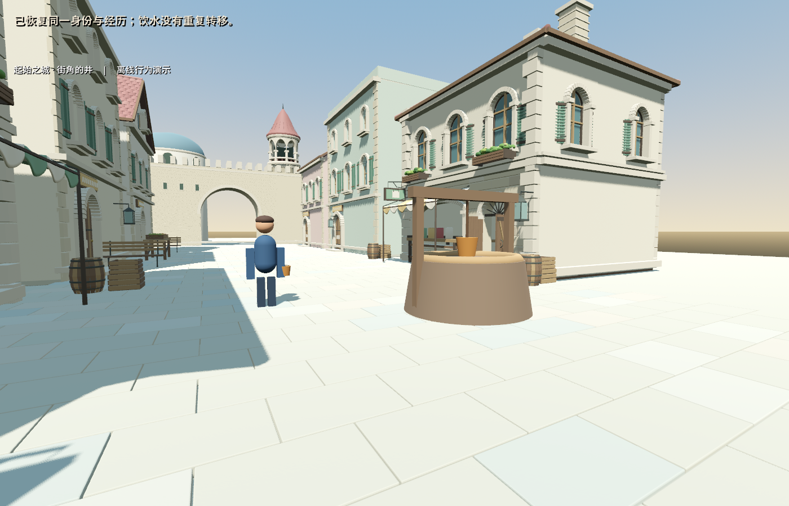

# Windows 技术预览：本机验证

2026-09-10。P0 构建基线与 P1 本地技术预览，不代表原世界迁移、P3 自主生活或 P5 社区参与。

产物：`InfiniteAincrad-0.0.1-preview-win-x64.zip`，124,713,138 bytes（约 119 MiB）。
SHA256：`8b3516617b9e2651d3142a4bd560987905368e78b1d6c7e69e7f794165743a5a`。
本机目录为忽略的 `exports/p1-20260910-final/`；尚未上传或公开发布。
源码基线 `59bd52e` 加本次工作区修改，构建清单如实标记 `source_dirty: true`；
快照逐文件哈希清单的 SHA256 为 `379d3f56572404301b6b353233605bf2007db063b4f2313d6aa7dfa01bf29a59`。

| 验证 | 实测结果 |
|---|---|
| 工具与源资产 | 官方 Godot 4.7.2 .NET 编辑器/模板 SHA512 正确；.NET SDK 9.0.200、Python 3.11.9；原市场 GLB SHA256 正确 |
| 上游完整性 | 59 个 OpenGameAgent 源文件与原始锁定哈希一致；构建在独立源码快照进行 |
| 规则和边界 | core_acceptance、decision_boundary_acceptance 通过；边界测试中的 live 枚举仅是 fixture 标签测试 |
| 个体知识 / OGA / 恢复边界 | resident_knowledge 21 项、OGA 23 项、street_resume_edges 6 项通过；独立进程 core cold-write/read 通过 |
| 打包依赖 | EXE、PCK、GodotSharp、OGA 与 .NET 8.0.31 自包含运行时齐全；许可告知、构建信息、SHA256 清单附包 |
| 从 ZIP 隔离运行 | 解压到含空格路径；不传源码路径；PATH 无 Godot/dotnet；模型配置环境清除；匹配包内 coreclr.dll 的 host trace 保留 |
| headless 帮助 / 冷恢复 | 7.000 s / 6.657 s；井水 0、持有 0、已饮用 1；恢复字节一致，零新决策 |
| 图形帮助 / 冷恢复 | 最终 ZIP 的 EXE，9.890 s / 11.469 s；Vulkan Forward+ / RTX 5080；13 项首次行为检查、9 项恢复检查全通过 |
| 正常默认启动 | 不传游戏自定义参数；在隔离 APPDATA 下创建预览默认存档；未帮助时井水仍为 1；再次启动保留相同字节，只有原来一次离线等待/需求决策 |
| 进程 / 付费 / 外部测试 | 最终构建/验证过程均正常退出；辅助 Spark 任务已结束；Kimi/居民付费调用 0；外部测试者 0；CI 配置已写但未在 GitHub 运行 |

图形模式恢复截图（真实导出 EXE，未后期改图）：

## 出包过程中发现并处理的问题

1. 只有 csproj 时，Godot 会报告缺少 `.sln`，却可能返回 0。已加入标准解决方案，并同时检查错误日志、EXE/PCK 和自包含运行库。
2. 原代码用 FileAccess/GLTFDocument 读取原始 GLB；导出后只有导入资源，首次启动失败。改用 ResourceLoader/PackedScene，保留实际 22 个碰撞体和原世界规则。源码启动器也先执行导入。
3. ExportRelease/win-x64 的 NuGet 恢复会改写源码锁文件。构建现在先复制无缓存源码快照，保护工作区和固定上游文件。关闭持久编译服务器，并直接运行 Godot 主 EXE，避免控制台包装器等待子进程不退出。
4. `--fixed-fps` 在此异步/物理场景造成计时先行、测试误超时。验证改为真实时间帧率上限；图形和 headless 均重新通过。

早期失败的退出状态和日志保留在忽略目录，不算作通过。
复用的 GPT-5.3-Codex-Spark 静态审查提出“预设路径会覆盖命令行导出位置”；主审未采纳：
命令明确传入目标 EXE，实际导出文件和完整解包运行证明命令行目标生效。
另纠正该辅助任务将历史 NPC 274/60 tokens 当成本任务用量的错误；开发用量只从实际会话计数取增量。

本轮最新已记录快照：根任务与复用的 Spark 任务合计 input 7,720,040（其中 cached input 7,485,440）、
output 75,064，raw total 7,795,104；其中 Spark 两轮合计 raw 340,723。
连续读取同一快照的第二次增量为 0，验证了不会重复累计。此数字截止该次记录，不包含其后尚未落账的响应，
不是人民币费用或跨机器历史 API 账本。1 亿 raw tokens 的额外方向评审点尚未达到。

## 方向复核与剩余门槛

本轮的实际增益是让别人可以尝试同一街道事件，并能复现构建和保存行为。没有扩地图、美术库或代理框架，
也没有把离线 fixture 称为自主居民。独立源码快照用于构建，不是另一个维护中的世界。

本机隔离启动不是全新机器验证。默认渲染只实测上述 GPU；其他显卡和兼容渲染需独立反馈。
三位首次接触者能否启动、至少两位能否在 15 分钟内理解干预和恢复，仍没有数据。
公开前确认 [原创代码/美术/文档授权范围](../release/RIGHTS_REVIEW.md)。
随后按 [P1 测试说明](../release/WINDOWS_PREVIEW.md) 收集独立结果，再推进 P2 附近询问与可拒绝的回复。
